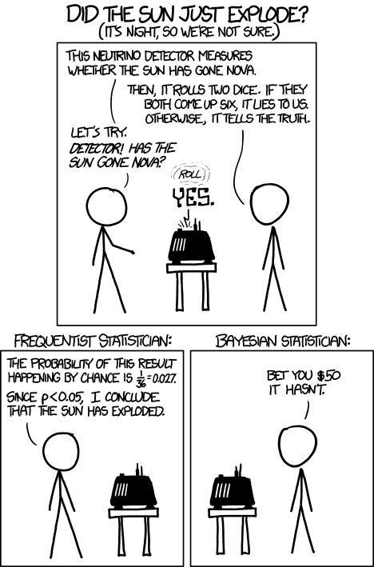

# Disease Mapping III: Introduction to Fully Bayesian mapping

## Getting Ready


### Learning objectives


### Additional Resources

* Waller LA, Carlin BP. Disease mapping. Chapman Hall/CRC handbooks Mod Stat methods. 2010;2010(1979):217–43. (posted on Canvas)
* [`CARBayes` package vignette](https://cran.r-project.org/web/packages/CARBayes/vignettes/CARBayes.pdf)
* [`CARBayesST` spatio-temporal vignette](https://cran.r-project.org/web/packages/CARBayesST/vignettes/CARBayesST.pdf)

### Important Vocabulary


```{=html}
<table class="huxtable" style="border-collapse: collapse; border: 0px; margin-bottom: 2em; margin-top: 2em; width: 90%; margin-left: auto; margin-right: auto;  " id="tab:unnamed-chunk-2">
<caption style="caption-side: top; text-align: center;">(#tab:unnamed-chunk-2) Vocabulary for Week 6</caption><col><col><tr>
<th style="vertical-align: top; text-align: left; white-space: normal; border-style: solid solid solid solid; border-width: 1pt 1pt 1pt 1pt; border-top-color: rgb(255, 255, 255);  border-right-color: rgb(255, 255, 255);  border-bottom-color: rgb(255, 255, 255);  border-left-color: rgb(255, 255, 255); padding: 2pt 2pt 2pt 6pt; background-color: rgb(84, 153, 199); font-weight: bold;"><span style="color: rgb(255, 255, 255);">Term</span></th><th style="vertical-align: top; text-align: left; white-space: normal; border-style: solid solid solid solid; border-width: 1pt 1pt 1pt 1pt; border-top-color: rgb(255, 255, 255);  border-right-color: rgb(255, 255, 255);  border-bottom-color: rgb(255, 255, 255);  border-left-color: rgb(255, 255, 255); padding: 2pt 6pt 2pt 2pt; background-color: rgb(84, 153, 199); font-weight: bold;"><span style="color: rgb(255, 255, 255);">Definition</span></th></tr>
<tr>
<td style="vertical-align: top; text-align: left; white-space: normal; border-style: solid solid solid solid; border-width: 1pt 1pt 1pt 1pt; border-top-color: rgb(255, 255, 255);  border-right-color: rgb(255, 255, 255);  border-bottom-color: rgb(255, 255, 255);  border-left-color: rgb(255, 255, 255); padding: 2pt 2pt 2pt 6pt; background-color: rgb(212, 230, 241); font-weight: bold;">Bayesian Inference</td><td style="vertical-align: top; text-align: left; white-space: normal; border-style: solid solid solid solid; border-width: 1pt 1pt 1pt 1pt; border-top-color: rgb(255, 255, 255);  border-right-color: rgb(255, 255, 255);  border-bottom-color: rgb(255, 255, 255);  border-left-color: rgb(255, 255, 255); padding: 2pt 6pt 2pt 2pt; background-color: rgb(212, 230, 241); font-weight: normal;">Bayesian is a process of using observed data to update prior beliefs. Typically parameters are assumed to be random variables arising from a distribution (e.g. rather than a discrete and solitary truth).</td></tr>
<tr>
<td style="vertical-align: top; text-align: left; white-space: normal; border-style: solid solid solid solid; border-width: 1pt 1pt 1pt 1pt; border-top-color: rgb(255, 255, 255);  border-right-color: rgb(255, 255, 255);  border-bottom-color: rgb(255, 255, 255);  border-left-color: rgb(255, 255, 255); padding: 2pt 2pt 2pt 6pt; background-color: rgb(169, 204, 227); font-weight: bold;">Conditional auto-regressive (CAR)</td><td style="vertical-align: top; text-align: left; white-space: normal; border-style: solid solid solid solid; border-width: 1pt 1pt 1pt 1pt; border-top-color: rgb(255, 255, 255);  border-right-color: rgb(255, 255, 255);  border-bottom-color: rgb(255, 255, 255);  border-left-color: rgb(255, 255, 255); padding: 2pt 6pt 2pt 2pt; background-color: rgb(169, 204, 227); font-weight: normal;">The CAR is a common prior for spatial disease mapping, particularly in a Bayesian framework. A CAR prior suggests that the value for a given area can be estimated CONDITIONAL ON the level of neighboring values.</td></tr>
<tr>
<td style="vertical-align: top; text-align: left; white-space: normal; border-style: solid solid solid solid; border-width: 1pt 1pt 1pt 1pt; border-top-color: rgb(255, 255, 255);  border-right-color: rgb(255, 255, 255);  border-bottom-color: rgb(255, 255, 255);  border-left-color: rgb(255, 255, 255); padding: 2pt 2pt 2pt 6pt; background-color: rgb(212, 230, 241); font-weight: bold;">Frequentist Inference</td><td style="vertical-align: top; text-align: left; white-space: normal; border-style: solid solid solid solid; border-width: 1pt 1pt 1pt 1pt; border-top-color: rgb(255, 255, 255);  border-right-color: rgb(255, 255, 255);  border-bottom-color: rgb(255, 255, 255);  border-left-color: rgb(255, 255, 255); padding: 2pt 6pt 2pt 2pt; background-color: rgb(212, 230, 241); font-weight: normal;">Inference in a frequentist framework draws conclusions from sample data by conceiving of this specific 'experiment' or sample as only one of thousands of possible experiments/samples, each capable of producing statistically independent results. Thus our inference is based on the probability of a given parameter (e.g. from one sample or experiment) arising in relation to all other (random) possibilities.</td></tr>
<tr>
<td style="vertical-align: top; text-align: left; white-space: normal; border-style: solid solid solid solid; border-width: 1pt 1pt 1pt 1pt; border-top-color: rgb(255, 255, 255);  border-right-color: rgb(255, 255, 255);  border-bottom-color: rgb(255, 255, 255);  border-left-color: rgb(255, 255, 255); padding: 2pt 2pt 2pt 6pt; background-color: rgb(169, 204, 227); font-weight: bold;">Posterior</td><td style="vertical-align: top; text-align: left; white-space: normal; border-style: solid solid solid solid; border-width: 1pt 1pt 1pt 1pt; border-top-color: rgb(255, 255, 255);  border-right-color: rgb(255, 255, 255);  border-bottom-color: rgb(255, 255, 255);  border-left-color: rgb(255, 255, 255); padding: 2pt 6pt 2pt 2pt; background-color: rgb(169, 204, 227); font-weight: normal;">In Bayesian inference, the 'posterior' is a formalized statement about the updated belief of the value of a parameter, conditional on the data (the likelihood) and the prior.</td></tr>
<tr>
<td style="vertical-align: top; text-align: left; white-space: normal; border-style: solid solid solid solid; border-width: 1pt 1pt 1pt 1pt; border-top-color: rgb(255, 255, 255);  border-right-color: rgb(255, 255, 255);  border-bottom-color: rgb(255, 255, 255);  border-left-color: rgb(255, 255, 255); padding: 2pt 2pt 2pt 6pt; background-color: rgb(212, 230, 241); font-weight: bold;">Prior</td><td style="vertical-align: top; text-align: left; white-space: normal; border-style: solid solid solid solid; border-width: 1pt 1pt 1pt 1pt; border-top-color: rgb(255, 255, 255);  border-right-color: rgb(255, 255, 255);  border-bottom-color: rgb(255, 255, 255);  border-left-color: rgb(255, 255, 255); padding: 2pt 6pt 2pt 2pt; background-color: rgb(212, 230, 241); font-weight: normal;">In Bayesian inference, the 'prior' is a formalized statement of the probability of a parameter, as stated before we see the data.</td></tr>
</table>

```


## Spatial Thinking in Epidemiology

### What is *Bayesian Inference*?

In Disease Mapping I & II we were introduced to global (aspatial) and local (spatial) Empirical Bayes estimation. In those modules, you were introduced to Bayes Theorem, and to a very high-level idea of the importance of the *prior*, *likelihood*, and *posterior* in Bayesian inference. 

However we (intentionally) skirted over much detail in those sections. In this section we go only a little bit deeper; to be clear there is a lot more to know and learn about Bayesian inference than what is presented here. But hopefully this summary helps motivate the use of fully Bayesian analysis in spatial epidemiology.

#### Frequentist versus Bayesian Inference

*Frequentist statistics* and inference are probably what you have learned as '*statistics*' up until now. In other words, it is typical that Bayesian inference is not taught in depth, or even at all, in many statistics courses. There is an interesting history for the current dominance of frequentist inference that is as much about personalities, egos, and power as it is about utility. But that's for another day. 

The core idea of frequentist inference centers on a mental model premised on comparing the data that is observed to abstract thought experiment of what would be expected under infinite repetitions. This strategy developed out of agricultural trials and survey sampling; in other words in settings where it was meaningful to think about either repetitively resampling a finite subset from a large population, or repetitively conducting an experiment in order to conceive of how a parameter might be expected to vary simply due to random error. 

*Bayesian inference* refers to an alternate philosophical and statistical approach to the analysis and inference of observed data. Instead of assuming there is a frequency of how often something *should* happen (e.g. in the abstract empirical thought experiment), Bayesian inference combines the mental models. 

Bayesian's articulate a statement about the plausible distribution of a parameter given past experience or knowledge (e.g. the *prior*), and then combine it directly with what the data actually suggest. The result of this combination is an updated statement about the distribution of the parameter (e.g. the *posterior*). 

A common critique of Bayesian inference is that *priors* introduce subjective information as compared to the objective assumptions of frequentist inference. Instead, Bayesian priors are simply explicit and transparent about the assumptions being made; this is in contrast to the unrealistic or unstated assumptions required for frequentist inference. 


<div class="figure">

<p class="caption">(\#fig:unnamed-chunk-3)Frequentist vs. Bayesian Inference</p>
</div>

In the cartoon above there is a truth about the universe (e.g. the sun exploded: true or false) that is measured by the neurino detector. The measurement almost always reports the truth of it's measurement, but when it rolls a double-six on dice, it lies to you. The measure occurs, the dice are rolled and the answer is "*the sun exploded*". 

The frequentist statistician on the left, finds that because the probability of telling a lie is so small, and given the answer was "*the sun exploded*", then the sun must have exploded (e.g. the null is rejected). The Bayesian statistician on the right is more skeptical.  

This is an exaggerated example of the role of *prior belief*. In a strictly frequentist interpretation, all that matters is the probability of the observed data under the hypothetical range of possibilities under the stated null.

:::{.rmdnote data-latex="{note}"}

Obviously this is a silly cartoon. There is an interesting discussion of why the joke might also be based on an incorrect interpretation of frequentist statistics at [this link](https://statmodeling.stat.columbia.edu/2012/11/10/16808/). 

One nuance that is brushed aside by the over simplified cartoon is that in frequentist terms, this is a joint hypothesis. Instead of the implied single hypothesis, "*what is the probability the sun exploded?*", which is illustrated is the dual hypothesis, "*what is the probability the sun exploded AND the neurino detector told a lie?*". So there is a clear way to make the logical flaw in thinking that is illustrated fit well in a frequentist as well as Bayesian framework.

:::


### Bayesian inference in spatial epidemiology

While Bayesian statistics are widely incorporated into statistical methods across disciplines, Disease Mapping is perhaps the most ubiquitous use of Bayesian inference in epidemiology.  Aside from the appealing flexibility of Bayesian inference generally, there are two specific reasons Bayesian inference *makes sense* for disease mapping:

1. *Borrowing statistical strength* from spatial (and even spatio-temporal) neighbors, is an efficient way to improve the reliability and precision of small area disease rate estimates. You have already seen this with spatial Empirical Bayes estimation, and in a different way with Kernel Density Estimation. Leveraging the notion that *near things tend to be more alike than far thing*, the incorporation of spatial neighbors as a source of **prior** information can reduce variance of estimates, and smooth or shrink implausible and extreme values.
2. *Modeling spatial auto correlation* explicitly is important because our statistics conventionally rely on assumptions of independence among observations. Therefore, if the disease rates in two adjacent counties are correlated because of shared environment, demographic structure, or interaction, this *dependence* can result in biased parameter estimates. *Empirical Bayes smoothing did not explicitly address this*, but fully Bayesian models with spatial priors can explicitly model the auto correlation, thus allowing estimation of the likelihood under assumptions of *conditional independence*.

Bayesian statistics are not inherently any more complex than frequentists statistics. However, you have likely had substantially more opportunity to assimilate ideas in frequentist thinking, and thus Bayesian statistics may feel quite foreign. There are two concepts that we will incorporate into disease mapping in a Bayesian framework: *hierarchical models* and the (conditional autoregressive (CAR)) prior.

#### Bayesian hierarchical models

Bayesian models are *hierarchical* in the sense that we conceive of parameters not as discrete point estimates, but instead as a range of plausible values described by a probability distribution function (PDF). Thus the target distribution of parameters might be a *lower-level* of the hierarchy, while the parameters of a given PDF (e.g. the *mean* or *variance*), are themselves assumed to arise from a random probability distribution, representing another hierarchical level. 

Thus, to describe the probability of random variables at the lowest level (e.g. perhaps the *excess relative risk* of disease in $region_i$ as compared to expected), we need to specify a "*second level*", and then possibly a *third level* in a hierarchical fashion.

Take for example our interest in disease mapping in characterizing spatial heterogeneity, and specifically the value of the region-specific excess relative risk as an indicator of deviation from expectation. 

In previous settings we have notated the *likelihood* of the excess relative risk as $\theta_i$; here we will examine $\theta_i$ on the log scale, defining a related parameter $\psi$ (spelled *psi* and pronounced like *sigh*): $\psi_i = log(\theta_i)$. Therefore the following two statements about our observed data, $Y_i$ and our probability model say the same thing:

$$Y_i | \beta, \psi_i \sim Poisson(E_i exp(x_i \beta + \psi_i))$$
$$Y_i| \theta_i \sim Poisson(E_i \theta_i)$$
The only difference in those two likelihood statements is that:

* **a)** the first is on the log scale whereas the second is not;  
* **b)** the first explicitly incorporates possible covariates with resulting parameters, $\beta$.


Importantly, each time we use one of those Greek letters, we are saying it represents a *random variable*. Therefore, in a Bayesian framework, we must specify the distribution and parameters of each random variable. These distributional specifications are the *prior*! 

They differ from the prior in *Empirical Bayes* because we specify them as full probability distributions, rather than as discrete values calculated from the observed (*empirical*) data. This is where the model becomes *hierarchical*. In the first equation above there are two random variables: $\beta_i$ and $\psi_i$. Each requires a specification of a prior.

$$\beta \sim N(0,100000)$$
In this particular example, I have specified the prior on the $\beta$ (e.g. the prior for the range of plausible coefficients for any possible included covariates in our model, such as rural/urban or population density) to be relatively *uninformative*. 

In other words, by saying that $\beta$ arises from a *normal distribution* with mean of zero (e.g. on average I expect there is no association) and a variance of 100,000, I am saying that there is very little specific prior information; therefore the data (e.g. the likelihood) will win out in all cases. This is a common practice for *fixed effects* (e.g. global summary or stationary parameters that are not assumed to vary over space), and is quite similar to the frequentist assumption that anything is possible.

However, the strategy for the prior on $\psi_i$ is a little different. Recall, when discussing global and local (aspatial and spatial) Empirical Bayes, that the chief distinction was in the specification of the prior: in *global/aspatial* there was a single prior expectation for the entire study region, whereas for *local/spatial* EB, there was a unique prior for each region, defined in part by values in neighboring regions. 

A similar approach could be taken in fully Bayesian disease modeling.  One approach would be to define a single prior that applies to each region, irrespective of their spatial relatedness to one another. This is often called a *spatially unstructured* random effect. In other words it is a random variable that is not defined by spatial connectivity, but instead arises from some non-spatial phenomenon. Instead of being *uninformative*, we will incorporate *prior knowledge* in the form of information about the plausible range of values across the study region. 

$$\psi_i \sim N(0,\sigma^2)$$

This says that the range of possible values of $\psi$ arise from a normal distribution, centered on zero (e.g. on expectation each region is exactly as expected), with a variance $\sigma^2$. 

As mentioned above, in the Empirical Bayes, the value of this variance term (e.g. the specification of how different we think regions can plausibly be from one another) was specified using the empirical or observed data. However, in the hierarchical Bayesian setting, we can go yet another level and say that even $\sigma^2$ is a random variable with a prior of its own. For example a common prior for a variance term (a prior for a prior is called a *hyperprior*!) is:

$$\sigma^2 \sim inverse-gamma(1, 0.01)$$
The inverse gamma distribution is specified by two parameters, $\alpha$ and $\beta$. Theoretically we could specify yet another hyper prior for these two parameters, but in this example --and following convention--I specify numeric values of 1 and 0.01. Here is an example of what this prior distribution looks like (recall $\sigma^2$ describes variance on the log scale):


This summary of *hierarchical Bayesian* models has not explicitly incorporated *spatial relatededness* and neighbors. The next section introduces a *spatial prior*.


#### Conditional auto-regressive priors

As mentioned in the previous section, just as there were both *global* and *local* priors for Empirical Bayes, so there are for fully Bayesian disease mapping. The *global* prior for $\psi_i$ was described above as arising from a common or shared normal distribution for all regions. 

This helps address the concern for instability of estimates due to sparse data in a single region, by shrinking or smoothing local regions towards a global distribution.  However, this strategy does not address the the ubiquitous presence of spatial-dependence. In other words the global strategy neither addresses the violation of assumption of independence among regions (e.g. they are often actually quite dependent or auto-correlated!), nor does it take advantage of that fact to provide stronger priors.

The *Conditional Auto Regressive (CAR)* model is commonly used in both frequentist and Bayesian spatial statistics. In particular, it informs the estimation of each local log-relative risk parameter, $\psi_i$ by conditioning on information in the neighbors.  The CAR model is a setup in which data are assumed to be distributed *normally* (e.g. Gaussian), with the mean and variance defined *conditional on neighbors*. In the fully Bayesian framework, we can use this CAR conditioning to parameterize (e.g. as a *prior for*) the values of local $\psi_i$.

The CAR model is incorporated into multiple different types of Bayesian priors in disease mapping. The basic setup for the CAR model is described here:

$$\psi_i|\psi_{j \neq i} \sim N\left(\frac{\sum_{j \neq i} w_{ij}\psi_i}{\sum_{j \neq i}w_{ij}}, \frac{1}{\tau_{CAR}\sum_{j \neq i}w_{ij}}\right)$$

This says that the values of $\psi_i$ (e.g. the local log-relative excess risk) are normally distributed, conditional on the values of $\psi_i$ in neighbors of $i$. The mean of the region-specific normal distribution is a weighted average of the values of $\psi_i$ for all neighbors, and the variance of the distribution is informed by $\tau_{CAR}$, a hyperprior denoting the conditional variance among the neighbors. The term $w_{ij}$ is a binary spatial weights matrix created much as did for spatial Empirical Bayes by identifying neighboring or adjacent units $i$ and $j$ as $w_{ij}=1$ and all non-adjacent or non-neighbor pairs $i$ and $j$ as $w_{ij}=0$


A very commonly used spatial prior in Bayesian disease mapping is called the Besag-Yorke-Mollie or BYM prior. It combines the spatially-explicit CAR prior above to characterize the parts of spatial heterogeneity that are *spatially structured* (e.g. related to spatial dependence in the data), along with the global or *spatially unstructured* Gaussian prior described in the previous section. 

The idea is that some sources of variation between regions are in fact spatially dependent (e.g. through diffusion, selection of similar populations, common exposure, etc), whereas other sources of difference *are not spatially dependent* (e.g. could be abrupt changes between rural-suburban-urban, or might be region-specific exposures that are not shared with neighbors). This combination of types of prior are sometimes called *convolution priors* because they combine two separate random effects together.

We can describe the fully hierarchical Bayesian BYM model like this:

$$Y_i|\beta, \psi_i \sim Poisson(E_i, exp(\beta, \psi_i))$$
Because we are now specifying that the local values of $\psi_i$ are contributed to by two distinct random components (e.g. one *spatially structured* and one *unstructured*), we can define $psi_i$ as the sum of two parts: $\psi_i = u_i + v_i$, where $u_i$ is the spatially structured random variable and $v_i$ is the unstructured random variable. Each of these therefore needs a prior:

$$u_i|u_{j \neq i} \sim N\left(\frac{\sum_{j \neq i} w_{ij}u_i}{\sum_{j \neq i}w_{ij}}, \frac{1}{\tau_{CAR}\sum_{j \neq i}w_{ij}}\right)$$
$$v_i \sim N(0,\sigma^2)$$

Finally, we need to specify *hyperpriors* for the two variance terms, $\tau_{CAR}$, and $\sigma^2$; these can be defined in a relatively non-informative manner using *Gamma* or *Inverse Gamma distributions* to allow for a wide range of possibilities.

Other specification of the Bayesian disease mapping priors using the CAR model can be seen in the additional resources cited at the beginning of this section.

:::{.rmdcaution data-latex="{caution}"}

Somewhat confusingly, the `CARBayes` package described below uses slightly different Greek letter nomenclature. Specifically, the package authors use $\psi$ to indicate the *spatially-correlated* or structure random effects, but describes the set of random effects (e.g. as in a convolution model where there are both spatially structured and unstructured random effects)--of which $\psi$ is one component--with the Greek letter $\phi$ (spelled *phi* and pronounced like *figh*).  

In some other models in the `CARBayes` package, there are both *spatially-correlated* and *spatially unstructured* random effects, but in the Leroux, $\psi_i$ = $\phi_i$. I point this out because the model output will have a matrix named *phi*, which might seem confusing if we were calling that thing psi ($\psi$).

:::


#### Making inference from Bayesian Models

While the basic logic of Bayesian inference is relatively straightforward, as you can see the Bayesian hierarchical framework looks complex! In very simple settings it is possible to calculate the full posterior distribution (e.g. the combination of the likelihood and the prior via Bayes Theorem) using closed form strategies. 

However it is common that no closed-form solution exists for these more complex, hierarchical and conditional models. Therefore, there are currently two analytic strategies used to make inference when a simple formula doesn't work. 

1. **Markov Chain Monte Carlo (MCMC)** simulation has been used for decades in Bayesian analysis. This '*brute force*' method takes advantage of two statistical tools to make inference about the shape of the posterior distribution of even very complex Bayesian models.
  + *Markov Chain* is an algorithm for drawing from (possibly highly dimensional) parameter space. It uses stochasticity (randomness) to 'check' different possible parts of the parameter space, using only a comparison of how well the current location fits as compared to the previous. As a result the algorithm can 'learn' without getting stuck in one location. The goal is to eventually (through random sampling plus learning) settle on the most likely answer or parameter value.
  + *Monte Carlo* simulations are a repetitive sampling or drawing from the posterior. While we cannot describe exactly the shape of the posterior distribution, if we take a very large number of samples from that distribution (e.g. from the Markov Chain) we can create a summary of the shape of the posterior. So for instance, the mean or median of a large number of samples becomes our parameter point estimate, and the $2.5^{th}$ and $97.5^{th}$ percentiles of the samples become *Bayesian Credible Intervals*.
2. **Integrated Nested Laplace Approximation (INLA)**. This is a much newer strategy that aims to provide a more efficient way to *approximate* the shape and scale of the posterior. INLA works in `R` and is especially well suited to complex hierarchical, spatial, and spatio-temporal models of areal or point data.


## Spatial Analysis in Epidemiology


Bayesian analysis requires a bit more care and caution on the part of the analyst. I strongly recommend proceeding on any project with great caution (and ideally with an expert consultant!). However, there are some tools which have made Bayesian modeling more accessible, in part by pre-programming some '*sensible*' defaults into functions.

In this module, we only discuss the MCMC methods as implemented in a single package, `CARBayes`, because this package represents a reasonable point-of-entry for those interested in starting down the Bayesian path. However there are excellent tutorial resources for learning INLA, and many other Bayesian tools as well.

The `CARBayes` package has functions for fitting a wide range of spatial disease mapping models including:

* *Besag-York-Mollie* (BYM) described above, in which spatial heterogeneity is modeled as the sum of two random processes: a spatially structured process with a spatial CAR prior; and a spatially independent or unstructured process
* *Leroux CAR model* is an extension of CAR where there is a single random effect (e.g. not two as in BYM), but there is a variable degree of spatial autocorrelation parameterized with a random hyperprior, $\rho$ that describes how some places might have more versus less spatial dependence.
* *Dissimilarity model* uses a CAR prior to identify boundaries where risk or rate abruptly changes. This model therefore highlights distinct differences amongst neighbors as opposed to encouraging similarity; as such it can be useful for identifying spatial clustering. 
* *Localised CAR model* is another extension similar to the dissimilarity model that aims to identify abrupt changes in the surface and highlight clusters.
* *Multilevel CAR models* are a nice alternative when you have access to individual level outcomes nested within areal (ecologic) units, as opposed to only relying on counts aggregated to those units. 
* *Multivariate Leroux model* is distinct from all of the preceding models which are *univariate*, meaning there is a single '*outcome*' for each unit of observation. In *multivariate* analysis (which is distinct from the more common *multivariable* analysis such as multiple regression), there are multiple correlated outcomes for each unit of analysis. One example is modeling the incidence of three kinds of cancer simultaneously. 

Each of these models can be fit with Poisson, Binomial, Normal (Gaussian), or Multinomial distributed data.

The [`CARBayes` package vignette](https://cran.r-project.org/web/packages/CARBayes/vignettes/CARBayes.pdf) provides additional detail on the specification of these different models, and examples of fitting each using the built-in functions. In addition, there is a sister package, `CARBayesST` that has extensions for spatio-temporal data, where the same regions are observed not once but multiple times. More information about this package is available in the [`CARBayesST` vignette](https://cran.r-project.org/web/packages/CARBayesST/vignettes/CARBayesST.pdf)

The example below uses the commonly implemented *Besag-York-Mollie* (BYM) model.

### Packages & Data

In addition to the now-familiar packages, you will also need to load the `CARBayes` package. 


```r
library(sf)        # sf provides st_read for importing
library(spdep)     # spdep has functions for creating spatial neighbor objects
library(tmap)      # tmap for plotting results
library(dplyr)     # dplyr for pipe processing of data
library(CARBayes)  # CARBayes has functions for fitting a range of CAR models
```


This example will continue to use the *very low birthweight* data used in previous parts of the eBook. The following code reads it in as `sf` and calculates a *raw rate* of VLBW to use for subsequent comparisons.


```r
vlbw <- st_read('ga-vlbw.gpkg') %>%
  mutate(rate = VLBW / TOT )

r <- sum(vlbw$VLBW) / sum(vlbw$TOT)
vlbw$expected <- r*vlbw$TOT
```


### Preparing for `CARBayes()`

In addition to the usual preparation of an analytic data set, the primary concern before fitting the Bayesian CAR model is creation of the weights matrix, `W`, that serves to identify the set of *neighbors* each county has to serve as inputs for describing the shape of the *prior probability distribution*. We can use all of the same tools from previous weeks for creating a range of neighbor objects, with the following caveats:

1.  Neighbors (and weights) must be *symmetric*, which means that if $region_i$ is a neighbor to $region_j$, then $region_j$ is also a neighbor to $region_i$.  Contiguity and graph-based neighbor objects are symmetric by design, but k-nearest neighbors are often *asymmetric*.  Thus, if you created a k-nearest neighbors object you may need to *force symmetry* by using the function `make.sym.nb()`.
2.  All regions **must** have at least one neighbor. More formally, the sum of all rows in the weights matrix must be at least 1.  If the neighbor approach results in unlinked regions (areas with zero neighbors, as could be the case with islands), they need to be excluded, or an alternate or adapted weights matrix created.
3. The object we will use in the `CARBayes` function below must be a literal *weights matrix* (e.g. $159 \times 159$) and not just the `nb` object. 

Below I create a simple Queen contiguity neighbor object, and then convert that object to a weights matrix. The use of `style = 'B'` in the creation of the weights matrix says that the values in the resulting matrix should be *binary* (0 or 1). The default (`style = 'W'`) results in *row-standardized* weights, which are useful for other analytic tasks, but not necessary in the CAR models, because the CAR prior inherently adjusts for the number of neighbors. 


```r
qnb <- poly2nb(vlbw)
qnb_mat <- nb2mat(qnb, style = 'B')

dim(qnb_mat)  # confirming the dimensions of the matrix
```

```
## [1] 159 159
```

```r
class(qnb_mat) # confirming its class
```

```
## [1] "matrix" "array"
```

:::{.rmdcaution data-latex="{caution}"}

**Make sure your weights match your final data!**

It is always important that your spatial neighbors or weights objects are made from your *final dataset*! Any changes (additions or deletion of rows, but also any re-sorting or rearranging) will result in *misalignment between the spatial weights matrix and the data*.

:::


#### How many Monte Carlo Samples are needed?

This depends on how complex the model is, and how strong the signal in the data is. But in general a few concepts are worth mentioning. 

1. First, there is a tendency for the (randomly selected) starting location of a Markov Chain to influence the early samples. For this reason it is common to plan to discard a portion of the samples during a *burn-in* period. This essentially means that we hope there is no dependence on initial conditions after removing the first $n$ samples. This burn-in can be quite large, e.g. tens of thousands of samples!
2. Our goal is that *model convergence* is achieved, meaning that the Markov Chain has '*learned*' enough to settle down into a relatively consistent area in the parameter space. This can take many thousands of samples, and thus convergence diagnostics are often used to guide decisions about how many samples are required.
3. At the end of the day, we only need about $n=1000$ reliable and high quality samples from the posterior to accurately describe it. But it may take $10,000$, $50,000$ or even $100,000$ or more samples to achieve the preceding goals of burn-in and convergence. One option would be to just keep the last $1,000$ samples. But a preferable option is to use *thinning* to sample every $10^{th}$ or every $100^{th}$ sample, after the burn-in period. This achives two goals: it requires less memory to store all of the samples, but it also reduces any residual auto-correlation among sequential samples.

### Fitting a *Besag-York-Mollie (BYM)* Bayesian model

Before fitting the model, it is convenient (but not required) to specify the *fixed-effect* component of the model. This is where you specify the outcome and the predictors. CAR Bayesian models can incorporate covariates as categorical, continuous, or even non-linear (e.g. spline or polynomials) in the likelihood. There are two reasons you might choose to include covariates:

1. Covariates that are strongly predictive of the outcome will improve the prediction of local fitted rates. One interpretation of the *random effects* (e.g. $\psi_i$), is that they represent unmeasured causes or correlates of the outcome. Addition of relevant covariates could *explain* some of the previously-unmeasured factors.
2. A second reason is that there may be interest in describing geographic trends in disease *conditional on* a covariate. The example we have used previously is local age structure, although other covariates might be a nuisance in interpreting geographic patterns of disease.

For now, we do not have any covariates, so the only thing in the *fixed-effect* portion of the model is specification of the outcome variable (count of deaths) and the offset variable (log of denominator at risk for death), which is necessary for the Poisson model of counts from regions with different populations at risk. Note that all we are creating here is a *formula object*. It is not doing anything other than naming our formula.


```r
mod <- VLBW ~ offset(log(TOT))
```


Now we have the three main ingredients:

1. Data, in the form of the `vlbw` object 
2. The spatial weights matrix, `W`, which represents the spatial relationships (`qnb_mat`)
3. The fixed effects portion of the model.

To call the BYM model we specify:


```r
bym <- S.CARbym(formula = mod, 
                        family = 'poisson', 
                        data = vlbw, 
                        W = qnb_mat,
                        burnin = 30000, 
                        n.sample = 60000, 
                        thin = 30,
                        verbose = FALSE)
```


:::{.rmdnote data-latex="{note}"}

**Poisson or Poisson-Gamma?**

Notice that the `family = 'poisson'`, even though in previous work we observed that there may be extra-Poisson variation in these data. That led us to prefer a Poisson-Gamma probability model (or a negative binomial); so why not choose that here? 

In part because in the fully Bayesian CAR model we actually **are** allowing for extra-Poisson variation with the conditional prior, which itself has a Gamma prior on the variance. 

:::


The `formula`, `family`, `data`, and `W` have been discussed. But the next three arguments require some explanation.

* `burnin = 30000` specifies how many of the MCMC samples should be discarded. In general, discarding a large number in the beginning via the `burnin` argument is recommended to reduce sensitivity to initial conditions and ignore the time spent early in the Markov Chain process.
* `n.sample = 60000` specifies the total number of samples to draw. Obviously this number must be larger than the `burnin` or else there will be nothing left to look at! In this case we take 60,000 samples, discarding the first 30,000, leaving 30,000 for examination. 
* `thin = 30` says to only *keep* every 30th sample drawn. The reasons for thinning are to reduce auto correlation among consecutive values, and to save memory, by only keeping a useful number of samples to describe the posterior. We are keeping 1000 samples, which is adequate for summarizing the parameters of interest.

There are actually many more options the analyst can choose for specifying the BYM model. For instance, I mentioned that an appealing feature of the `CARBayes` package is that it has *built-in* a number of sensible defaults for models, so that the analyst doesn't have to make so many decisions. 

However, those defaults can be changed. For example, the inverse gamma prior on the variance, $\tau^2$, has default settings, but these can be modified with additional arguments. While you might not be able to digest them all now, it might be useful to look briefly at the help documentation for `S.CARbym`.


### Summarizing `CARBayes` model output

The `summary()` function returns a list of the objects returned, but nothing more useful. The `print()` function provides a subset of model summary statistics.


```r
summary(bym)
print(bym)
```


```
## 
## #################
## #### Model fitted
## #################
## Likelihood model - Poisson (log link function) 
## Random effects model - BYM CAR
## Regression equation - VLBW ~ offset(log(TOT))
## Number of missing observations - 0
## 
## ############
## #### Results
## ############
## Posterior quantities and DIC
## 
##                Mean    2.5%   97.5% n.effective Geweke.diag
## (Intercept) -3.9963 -4.0475 -3.9469       799.5         0.9
## tau2         0.1135  0.0458  0.2083       317.3         1.8
## sigma2       0.0098  0.0019  0.0284       122.4        -2.9
## 
## DIC =  889.0853       p.d =  54.23915       LMPL =  -455.14
```


Only a few of the total parameters estimated are summarized here. Specifically the `print()` function will display all of the *fixed-effects* (only the global intercept is included here because we did not specify any covariates), as well as the hyper priors, $\tau^2$ and $\sigma^2$.  

* The parameter $\tau^2$ characterizes the conditional variance of the *spatially structured* random effects (e.g. $u_i$ in the BYM convolution prior). 
* The parameter $\sigma^2$ characterizes the variance of the *unstructured* or global random effects. 

It is clear there is more variability in the $\tau^2$ than in the $\sigma^2$ suggesting that of the total variability in county-specific prevalence of VLBW, more of it seems to be attributable to spatially-structured processes as compared to unstructured processes.

:::{.rmdcaution data-latex="{caution}"}

**A note of caution** 

Although it is appealing to interpret the two variance components in the BYM model as I just did (e.g. describing the proportionate contribution to total variation), it is also known that in BYM models in particular, these two cannot be clearly identified independent of one another. In other words together they can describe variation, but it is not safe to make inference on either separate from the other.

Instead we can be more confident that the sum of the two is a reliable prior.

:::

Also evident in the results of the `print(bym)` results is that each of these hyper parameters, and the fixed-effects, are summarized as the *median* value from the posterior samples (e.g. n=1,000 retained posterior samples in our case), as well as the $2.5^{th}$ and $97.5^{th}$ percentiles of the posterior (e.g. the *Bayesian Credible Intervals*).  

The Deviation Information Criteria (DIC) is a Bayesian model fit statistic, and like other fit statistics, *smaller is better*.  

Finally, the *Geweke Diagnostic* test is designed to characterize how well the Markov Chain has converged on a stationary location in parameter space. The assumption with Markov Chain, is that the steps in the chain will move towards the optimum (best fitting) values, and once there will remain in that area. Thus the Geweke compares the mean value of the sampled posterior at the end of the samples, and at some earlier point. 

If the model has converged, the two means will be similar. The resulting test statistic is a standard Z-score. Values between -1.96 and 1.96 are suggestive of *good convergence*, whereas values greater than 1.96, or less than -1.96, may not be converged.  

In the above model with 60,000 total samples (and 30,000 burn-in), the Geweke diagnostic suggests good convergence for the intercept but perhaps poor convergence for the two variance hyperpriors. The model could be re-fit with more iterations to see if that improves convergence. Other approaches include better model-specification (e.g. perhaps important variables are missing, making the model non-identifiable). 

### Making inference from Bayesian posteriors

The output of the `S.CARbym()` model function is complex.  If you use `summary()` or `names()` on the output object, you will see there are several components. The one called *samples* contains the posterior draws from the MCMC process. Within that object are several data matrices, each containing the posterior samples for different parameters. You can understand a little bit about them by looking at their *shape* or dimension with `dim()`. 


```r
names(bym)          # what is inside the model output object?
```

```
##  [1] "summary.results"     "samples"             "fitted.values"      
##  [4] "residuals"           "modelfit"            "accept"             
##  [7] "localised.structure" "formula"             "model"              
## [10] "X"
```

```r
names(bym$samples)  # what is inside the 'samples' sub-object?
```

```
## [1] "beta"   "psi"    "tau2"   "sigma2" "fitted" "Y"
```

```r
dim(bym$samples$beta) # 1000 draws for 1 beta fixed effect (the intercept)
```

```
## [1] 1000    1
```

```r
dim(bym$samples$psi)  # 1000 draws for the psi = ui + vi for each of 159 counties
```

```
## [1] 1000  159
```

One of the matrices inside the `bym` object is named `fitted.values`. This could be of interest if, instead of characterizing the heterogeneity in $\psi_i$ (e.g. the log-relative risk), you wish to map the model-fitted *rates*.  

Fitted values are on the scale of the observed data. That means that in the case of a Poisson model, the fitted values are *counts* of VLBW as predicted by the model.  As we will see below, these counts divided by the known denominator (total birth count) will produce a model-predicted *risk* or *prevalence*.

However, if we want to know more about the posterior of specific random variables, such as $\beta$ we should look at `bym$samples$beta`;  if we want to know about the random effects $\psi_i$, we should look at `bym$samples$psi`. 

One thing you might like to do is examine the Markov Chain trace plot to understand how it sampled the parameter space through sequential steps. This is useful as an indicator of convergence (e.g. if the trace plot has *settled* into a common range, it has likely converged, whereas if it wanders all over the place, it has not).  

Another visualization that can be useful is to see the shape of the sampled posterior probability distribution.  The package `coda` is designed specifically for working with MCMC samples from Bayesian models of all kinds, and has some functions for creating these plots. Below are two functions for visualizing the posterior estimates of the global intercept, $\beta$.  


```r
coda::traceplot(bym$samples$beta)
```


On the y-axis is the sampled values from the posterior distribution for $\beta$, and the x-axis is each of the 1,000 samples we retained (e.g. 60,000 draws - 30,000 burnin, with thinning).  Notice how the `traceplot()` shows the Markov Chain moving around to test different values.  While there is a lot of variation, the bulk of the samples are are centered in a relatively narrow range, from $-4.02$ to $-3.96$, suggesting good convergence.  

Also notice how the chain has 'leaps' or forays *away* from the central area of parameter space or values. That is another feature of Markov Chain: it will randomly evaluate other parts of the parameter space to see if they might fit better than the current. The fact that the plot always returns quickly to the same place suggests a rejection of the alternate values. 


```r
coda::densplot(bym$samples$beta)
```


In the `densplot()`, we can see the shape of the sampled posterior, indicative of the probability density for $\beta$.  For instance, it is clear that most of the probability mass is over the median value around -4.0, but that there is some probability mass lower, and higher; in other words there is some variation in our certainty about the true posterior spatial auto correlation value.  

Recall that the $\beta$ represents the *average log-risk* of VLBW in Georgia. So to make these numbers more interpretable, exponentiate to get $e^{-4.0} = 0.018$. The '*average*' risk of VLBW is therefore 1.8%, and counties vary around (e.g. above and below) that value.
 
 The preceding illustrations of how to examine the data and plot specific parameters could be extended well beyond the $\beta$ intercept alone! Any number of parameters could be evaluated, but remember there are $n=159$ different values for $\psi_i$.


### Extracting summaries for mapping or analysis

Finally, you want to extract summaries of these data for the purposes of analyzing or visualizing. The presence of 1000 samples from the posterior for every single parameter, makes working with the data cumbersome. Luckily there are some extractor functions that can help.

The *fitted values* are in a separate matrix within `samples`, and contain the model-predicted value of $\hat{Y_i}$ for each county.  These can be useful for calculating a model-smoothed rate or risk.


```r
y_fitted <- fitted(bym)
vlbw$rate_bym <- y_fitted / vlbw$TOT
```


The random effects, $\psi_i$ are interpreted as the log-relative risk for each county. In other words they quantify the degree to which each county varies from the overall average (or more specifically from the global intercept, which in this case is captured in the `beta` matrix within `bym$samples`). 

We might wish to summarize the posterior of each county's log-relative risk by taking the median of samples for $\psi_i$. The function `summarise.samples()` achieves this, and lets us specify any set of quantiles. 

Below I only get the median, but to also get the 95% CI use `quantiles = c(0.5, 0.025, 0.975)`. The `summarise.samples()` function returns a list with two-named elements. We only want the one named `quantiles` for now. If we exponentiate these, they are relative risks.


