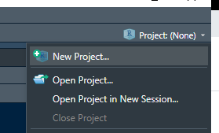

# (PART) Weekly Lab Handouts {}


# Week 0: Getting oriented to R with spatial

## Objectives

The goal of this lab is to take our first dip into spatial data in `R`. Specifically at the end of this lab you should be able to:

* Create an R Project
* Import and export spatial data (either `.gpkg` or `.shp`) using `R`.  
* Identify and understand the class and structure of the imported data.
* Examine and summarize the attribute and geographic data.
* Find the current coordinate system, and transform the coordinate system as needed.
* Make simple plots of the geometry and attributes of spatial data.

This lab builds on content that is provided in the course eBook. It is okay if you have not already read these materials, as this is only the first day. But please plan to review them after class to provide a bit more depth and context for the new skills and concepts introduced here. Specifically, please refer to the following sections for additional information:

* [Locating Spatial Epidemiology](https://mkram01.github.io/EPI563-SpatialEPI/locating-spatial-epidemiology.html), and especially Section 1.3, *Spatial Analysis in Epidemiology*.
* [Tips for working with `sf` data class](https://mkram01.github.io/EPI563-SpatialEPI/sf-overview.html)
* [Tips for using `tmap`](https://mkram01.github.io/EPI563-SpatialEPI/intro-tmap.html)

## Getting started

The rest of the lab assumes that you have successfully installed `R`, R Studio, and the recommended packages. If you have not, please go through the steps on [software installation](https://mkram01.github.io/EPI563-SpatialEPI/software-installation.html) and [package installation](https://mkram01.github.io/EPI563-SpatialEPI/installing-packages-for-this-course.html).

### Create a new *project*

Throughout the semester we will strive to achieve best practices for coding and file management to assure that our work is fully reproducible. One important strategy is to organize your work into *project folders*.  In general I recommend you create a separate project for each *Lab* and for each *Assignment*.  

To do this, first open R-studio. In the upper right-hand corner there will be a blue cube with an R inside and the word *Project (None)*.  Click on that and choose *New Project*.

```{r echo = F, fig.align='center', out.width='120%', message = F, warning = F}

```

* If you already have a folder on your computer that is specifically for this week (I am calling this '*Week 0*'), then choose *Existing Directory* and navigate to that folder. Click *Create Project*
* If you do not already have a folder for this week, choose *New Directory*, then select *New Project*. Under *Directory Name* provide the name for this specific week's project folder (e.g. `week0-lab`). Use the *Browse* button to navigate to the location where you want to save this project (e.g. you might have a parent folder for EPI563, with separate sub-folders within for each weekly lab and assignment). Click *Create Project*

This creates the R Project. Now *close R Studio*, navigate to where you put your project folder and look inside.  There should be a file with the name you gave it (e.g. `week0-lab.Rproj`). The extension `.Rproj` means that it is a  project file. Double-click this to re-open R studio.

:::{.rmdnote data-latex="{note}"}
**Why projects?**  Projects in R help organize code, data, output, and reports specific to a given activity or analysis. While you are familiar with using folders on your computer to keep things organized, R-projects also provide some extra assistance beyond organization. The home working directory is automatically set to the *root* of the project folder. That means that when you double-click the project folder, '*home*' is always *that folder*. This allows us to use *relative* rather than *absolute* pathnames to describe where data and output are stored, making our code more portable from one machine to another
:::

### Open a new R script

In this class we will use two kinds of files for storing our code:

1. Text-based R-scripts that end with the file extension `xxx.R`.
2. Markdown-based reports that mix code chunks with free narrative text. These files end with the extension, `xxx.Rmd`.

For today we will just use the first file type.  Click *File>New File>R script*. You can save it in your project folder.

### Loading packages

The power of R comes from the huge variety of community-produced '*packages*' of functions and features for all sorts of purposes. Many we will use are great for a wide variety of applications, while others we will use are very specifically for spatial analysis.

It is often sensible to put a list of all the packages needed for a given analysis **at the top of the script or markdown document**. This is because the packages loaded say something about the environment and functions available. The more we can be transparent about our working environment early the better!

One way to load packages is like this:

```{r eval = F}
library(tidyverse)   # tidyverse package is a wrapper around multiple data wrangling passages including dplyr
library(sf)          # sf is a package for managing spatial data
library(tmap)        # tmap is a package for plotting maps from spatial data
```

For this course I will often use a convenient shortcut that is part of the `pacman` package:


```{r}
# Load all of the packages we need
pacman::p_load(tidyverse,   # General data wrangling
               sf,          # manage spatial data using simple features
               tmap)        # mapping of sf or sp data
```


**What the code above does**:

* `pacman` is a package that automates the loading of one or many packages. It is convenient in that it asks `R` to load the package, but if for some reason you have not yet *installed* the package, it does that automatically.
* `pacman::p_load()` The function we use here is called `p_load()` for *package load*.  The use of the two colons between `pacman` and `p_load()` is a way to call a function without having actually loaded the package `pacman`.  In other words it saves one line of code. 
* Simply list the packages you want to use in the parentheses. 

:::{.rmdtip data-latex="{tip}"}
Use concise and clear code at the top of your script to list all of your packages. If you discover part way through an analysis that you need to add an additional package, go back to the top and add it in there. Avoid randomly loading packages throughout the script!
:::


:::{.rmdnote data-latex="{note}"}
You do not have to use `pacman` package. You could instead choose to use the syntax of `library(yourPackage)` to load each package of interest. My use of `pacman` is just a preference issue and not a necessity!
:::


## Working with spatial data

### Data: `ga_mvc`

In this and several other labs we will use data concerning motor vehicle crash mortality in Georgia counties. Specifically, we'll use a dataset called `ga_mvc.gpkg` that contains information on the number of MVC deaths, and population for each Georgia county. 

The `.gpkg` extension means this dataset is stored as a *geopackage.* This is an alternative to the common `.shp` or *shapefile* format. 

To import spatial data we will use the `sf` function `st_read()`.  This is a flexible function that can import different data formats including `.gpkg` as well as ESRI `.shp`, or dozens of other formats. To import the file into `R`, you need to first download it from Canvas.  Store it inside your *project folder*.

Depending on how complex your project is you might have two general strategies:

1. For simple projects with few files, store everything directly inside the project folder (also called the project **root** folder).
2. For larger projects it is good practice to organize things in sub-folders with descriptive names such as `data` or `plots` or `code`.

```{r eval = F}
# Import file stored in the *root* of your project folder or directory
mvc <- st_read('ga_mvc.gpkg')
```


```{r message = F, warning=F, results='hide'}
# Import file stored *inside* project folder at: DATA/GA_MVC/ga_mvc.gpkg
mvc <- st_read("../SpatialEpi-2022/DATA/GA_MVC/ga_mvc.gpkg")
```

:::{.rmdtip data-latex="{tip}"}
Notice the use of the `here()` function that is part of the `here` package. This is one (of many possible) ways to specify **where** a file is located. The benefit of using `here()` is that it works the same on Windows, Mac or Linux (e.g. OS differences in pathname conventions do not cause problems), and it always refers to file locations in relation to the **root of the project directory**. 

The `here` package and function simply automate the creation of a pathname. The example above says to start in the *root*, go into the sub-folder named *DATA*, then into the sub-folder of that folder that is named *GA_MVC*, and then select the file named `ga_mvc.gpkg`. 
:::


#### `ga_mvc` Data Dictionary

It is always a good idea to include a data dictionary in any reproducible analytic report or project you create. It helps you and others later understand or remember what is included!

Here is the data dictionary for the `ga_mvc.gpkg` dataset:

VARIABLE NAME   | DEFINITION
--------------- | -----------------------
GEOID       | 5-digit State/County FIPS code
NAME    | County name
variable | ACS census table variable name
estimate | ACS census estimate
County | County name
MVCDEATHS_05  | Count of deaths from motor vehicle collision, 2005
MVCDEATHS_14  | count of deaths from motor vehicle collision, 2014
MVCDEATH_17   | count of deaths from motor vehicle collision, 2017
TPOP_05   | Total population count, 2005
TPOP_14   | Total population count, 2014
TPOP_17   | Total population count, 2017
NCHS_RURAL_CODE_2013 | 1= Large central Metro; 2 = Large fringe Metro; 3 = Medium metro; 4 = Small Metro; 5 = Micropolitan; 6 = Non-core
nchs_code   | Labeled factor of NCHS_RURAL_CODE_2013
rural   | 1= Non-core county; 0 = All other (micropolitan or larger)
MVCRATE_05  | Mortality rate per 100,000 from motor vehicle crashes, 2005
MVCRATE_14    | Mortality rate per 100,000 from motor vehicle crashes, 2014
MVCRATE_17    | Mortality rate per 100,000 from motor vehicle crashes, 2017
geom    | Geometry column


### Understanding the basics of your data

Anytime you gain access to a new dataset, you should work to understand it. At a minimum, it is important that you know several things about your spatial data object when you load it including:

* What are the variables? This is important even if you have a data dictionary, because sometimes things are missing, or perhaps they loaded incorrectly (e.g. character variables loaded as numerical or vice versa)
* What is the data class, and specifically is it spatial (e.g. either `sf` or `sp`) or is it non-spatial even though you thought it would be spatial?
* What is the unit of analysis (e.g. what does a *row* represent)?
* How many units (e.g. rows) are there?
* What is the coordinate reference system (CRS) or projection?

There are basic `R` functions that provide quick and easy description of objects to answer all of the questions above, and you should get used to using them to understand what you have, and especially to troubleshoot when things are not working as you expected.


>Try each of these by inserting your data object name (e.g. `mvc`) into the parentheses and examining the output.

Function | Description of uses
----------|-------------------------------------------------------------
`names()` | This is like `proc contents` in SAS. It prints the variable names (columns) in the object
`summary()` | This all-purpose function works intuitively on *most* objects in `R` (including `sf` objects!) providing a summary of each appropriate to it's type.
`head()`  | This is a favorite of mine as it gives a quick look at the *first 6 rows* of a data object. It is especially great for `sf` data objects because it also provides information on CRS/projection!
`class()` | This is another utilitarian function especially useful when something isn't behaving right. It is always good to confirm what data class an object is. 
`dim()` | This returns the *dimensions* (as `row`, `column`). You could often get the same information by looking at the Environment tab in RStudio where the number of observations and variables is listed for each object.


:::{.rmdtip data-latex="{tip}"}
**TIP**: As you try these functions consider several ways to *submit code* to run in `R`:

1. You could type directly into the console in the bottom left pane. This is quick and easy and good for exploration. But it **does not** save a copy of your code for later reference.
2. Type in the script/source pane (upper left in R Studio), highlight the code, and click on the *Run* button at the top and select *Run Selected Lines*
3. Type in the script/source pane, put your cursor anywhere in the code chunk (do not need to highlight everything), and hit *Ctrl-Enter* (Windows) or *CMD-Return* (Mac).  This is the quickest option!

:::


:::{.rmdnote data-latex="{note}"}
**THINGS TO NOTE** as you try the functions above on the `ga` data object:

* What information is *similar* and what is *different* when you use `head()` as compared to `summary()`?
* There are actually *two classes* listed when you type `class(mvc)`. Why is this and what does it mean?
* How could you determine how many different counties there are?

:::


### Basic visual inspection/plots

The base-R `plot()` function is extended by the `sf` package. That means that if you call `plot()` on a spatial object **without having loaded** `sf`, the results will be different than if `plot()` called **after loading** `sf`. 

When you `plot()` with `sf`, by default it will try to make a map *for every variable in the data frame*! Try it once. If this is not what you want, you can force it to only plot *some* variables by providing a vector of variable names.

```{r eval = F}
plot(mvc) # this plots a panel for every column

plot(mvc['MVCRATE_05']) # this plots only a single variable

plot(mvc[c('MVCRATE_05', 'MVCRATE_17')]) # this plots two variables
```


You might only want to see the geometry of the spatial object (e.g. not attributes) if you are checking its extent, the scale, or otherwise confirming something about the spatial aspects of the object. Here are two approaches to quickly plot the geometry:

```{r eval = F}
plot(st_geometry(mvc)) # st_geometry() returns the geom information to plot
```
```{r eval = T}
plot(mvc$geom)  # this is an alternative approach...directly plot the 'geom' column
```


### Sub-setting `sf` objects

Sometimes we want to restrict, subset, or otherwise limit a spatial dataset. For instance you might have all census tracts in a state, but only want to work with those from a single county.  Sub-setting of spatial objects works similarly to sub-setting of any objects in R. We can use indices or logical tests to slice and dice an `sf` data frame.

```{r eval = T}
levels(mvc$rural)  # This prints the possible levels of the categorical 'rural' var
mvc.rural <- mvc[mvc$rural == 'Rural' , ] # notice logic in the 'row' position of [,]

plot(st_geometry(mvc.rural)) 

```

Alternatively we could select the highest rate counties to plot or otherwise analyze separately:

```{r eval = T}
hi <- quantile(mvc$MVCRATE_17, probs = .9) # this returns the 90th percentile of variable
mvc.hi <- mvc[mvc$MVCRATE_17 > hi, ]

plot(st_geometry(mvc.hi))
```

### A more realistic modification to the data

While the above demonstrate several ways one might alter or modify a dataset, some of them may not seem sensible.

You previously imported the dataset `ga_mvc.gpkg`. Imagine we wanted to do subsequent analysis only on the counties in the Atlanta metro area in 2017.  So we want to be able to zoom in on the 28 metro counties and drop some of the unnecessary variables.

```{r}
# Altering the dataset for future use.
atl17 <- mvc %>%
  filter(nchs_code %in% c('Large central metro', 'Large fringe metro')) %>%
  select(GEOID, MVCRATE_17) 
```

**What the code above does**:

* First, note that it uses the *piping* (e.g. `%>%`) to connect the `dplyr` functions `filter()` and `select()` together. Read more about [working with `dplyr` verbs here](https://mkram01.github.io/EPI563-SpatialEPI/dplyr.html)
* The new object created will be called `atl17`
* It is created by starting with the current object, `mvc`
* We `filter()` the `mvc` object based on the `nchs_code`. This variable labels each county based on rural/urban categorization. To see the values you can type `table(mvc$nchs_code)`. The Atlanta metro area consists of a single *Large central metro* county (Fulton) plus all of the *Large fringe metro* counties.
* The `%in%` is a slick way to say "*keep any row of data that has any of these values*". It allows us to pass multiple (2 in this case) options
* The `select()` function essentially keeps only two main variables (but see note below).

:::{.rmdnote data-latex="{note}"}
**Geometry is sticky!**  
The steps above theoretically only selected two variables: `GEOID` and `MVCRATE_17`.  However if you look at the resulting object, `atl17`, you will notice there are **three columns**! 

The reason is because the geometry column (named `geom` in this case) is **sticky**. It sticks with an object even if you don't explicitly specify it. That's usually a good thing.

If you ever want to truly remove the geometry column, simply specify: `st_drop_geometry()`
:::


:::{.rmdnote data-latex="{note}"}
If you find the piping using the `%>%` in the code above complicated, remember you can break it down into separate steps like this:

```{r eval =F}
# First apply the filter
atl <- filter(mvc, nchs_code %in% c('Large central metro', 'Large fringe metro'))

# Second apply the select
atl17 <- select(atl, GEOID, MVCRATE_17)
```

Notice that when we do not use the pipes, we must explicitly name the input data object (e.g. `mvc` in first and `atl` in second step).
:::


### Exporting/Saving Data

Anything you create in `R` can be saved to local or network disk for future use. You can save items in a compressed `R` format, but most often we save spatial objects in some less proprietary and more portable or generally useful format. 

For our use this semester we will mostly save things using the *geopackage* (`.gpkg`) format. But if you were sharing your data to someone who is more familiar with ESRI *shapefiles* (`.shp`) or other formats that would be easy as well.


```{r eval = F}
st_write(atl17, 'atl.gpkg')  # This saves as a GeoPackage

st_write(atl17, 'atl.shp')  # This saves as an ESRI shapefile
```

:::{.rmdcaution data-latex="{caution}"}
You may get a warning message when writing to `.shp` files because ESRI has a very restrictive limit on how long variable names can be...if your variable names are too long they will be truncated, so beware!
:::

After writing each file, go to your project folder to see what was produced. Notice how many files were produced for `.gpkg` and for `.shp`.  At some point when you are on a school PC or cloud service with ArcGIS installed, try opening the files to see how they look. You should be able to open **both** the `.gpkg` **and** the `.shp` from within ArcGIS.


## Scavenger Hunt

Use the information in this lab and your prior knowledge to try to discover the answer to the following questions! Feel free to consult your neighbors, ask the TA's or instructor, or use any other resource. 

### Task 1: What is the geometry type of `mvc`?

Spatial data might be a raster or a vector dataset. If vector it might be polygons, lines, points, etc. 

### Task 2: Which county had the highest absolute number of motor vehicle deaths in 2005?


### Task 3: Which county had the highest motor vehicle mortality rate in 2017?

### Task 4: How many counties are non-rural?

### Task 5: What is the CRS or projection of the `mvc` data?


### Task 6: How many 'ESRI' file formats can be imported into R?

**Note**: this is a challenging question that requires you read a bit of the help documentation. 

**Hint**: The way `sf` reads in data is by using a unique *driver* for each file format. The driver is selected based on the extension of the file being imported (e.g. `.gpkg` means GeoPackage; `.shp` means shapefile).

\newpage  

## KEY FOR SCAVENGER HUNT


There could be other ways to arrive at the correct answer, but the following code is how I went about doing it...


### Key for Task 1

**What is the geometry type of the `mvc` data object?**

```{r eval = T}
head(mvc)
```

Look at the results from that function...the top part tells us about the 'spatial' components of the object including the geometry type of MULTIPOLYGON.


### Key for Task 2

**Which county had the highest absolute number of motor vehicle deaths in 2005?**

```{r eval =F}
# This approach uses base-R code
mvc[mvc$MVCDEATHS_05 == max(mvc$MVCDEATHS_05), ]
```
This approach shows that the county with the largest absolute number of deaths was Gwinett County with 105.


```{r}
# This approach does the same thing with dplyr code
mvc %>%
  filter(MVCDEATHS_05 == max(MVCDEATHS_05)) %>%
  select(GEOID, NAME, MVCDEATHS_05) %>%
  st_set_geometry(NULL)
```


Again, there are still other ways you could achieve this, but I simply restricted to the objects where the value of deaths was equal to the maximum value possible...unless there are ties (more than one county with same number), this should return only 1 county, Gwinnett.

### Key for Task 3

**Which county had the highest motor vehicle mortality rate in 2017?**


```{r eval = F}
mvc[mvc$MVCRATE_17 == max(mvc$MVCRATE_17), ]
```

```{r}
# Alternative strategy using dplyr
mvc %>%
  filter(MVCRATE_17 == max(MVCRATE_17)) %>%
  select(GEOID, NAME, MVCRATE_17) %>%
  st_set_geometry(NULL)
```


Same logic, different variable. 

### Key for Task 4

**How many counties are non-rural?**

```{r}
table(mvc$rural)
```

102 are non-Rural, 57 are Rural

### Key for Task 5

**What is the CRS or projection of the `mvc` data?**

There are a couple ways to learn about the coordinate reference system or projection of spatial data.

If you use the `head()` function on an `sf` data object, the top portion will include the *Geodetic CRS*, which in this case is *WGS 84*.

```{r}
head(mvc)
```

You can get much more information by using a specific function for printing the CRS:

```{r}
st_crs(mvc)
```
Obviously this is more complex.  But note the very last line which reads *ID["EPSG",4326]*.

EPSG is a 4-digit coding system for projections and 4326 is a common *unprojected* latitude/longitude CRS.  That means these data are reported in degrees lat/lon, and are thus *not adjusted to display appropriately on a flat surface*.


### Key for Task 5 

**How many 'ESRI' file formats can be imported into R?**

Again, this was a challenging question! The key is to use the built-in function `st_drivers()` to see all of the options. You can just type `st_drivers()` into the console and you will see a list of all supported file types.

However, I used the code below to extract the full names of each so that we can see how many are specifically named as coming from ESRI

```{r eval = F}
sp_formats <- st_drivers() # put the list of formats into an object called 'sp_formats'
names(sp_formats)  # figure out what the column/variable names of that object
class(sp_formats$long_name) # so the long_names column is a factor or categorical
table(sp_formats$long_name)  # so I want to see the levels - note they happen to be in alphabetical
  # order -- scroll down the list to 'ESRI'....looks like there are 4
```

There are 4:

* Esri Compact Cache 
* ESRI FileGDB
* ESRI Shapefile
* ESRIJSON
