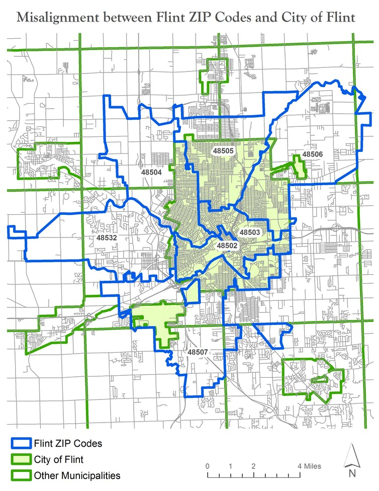
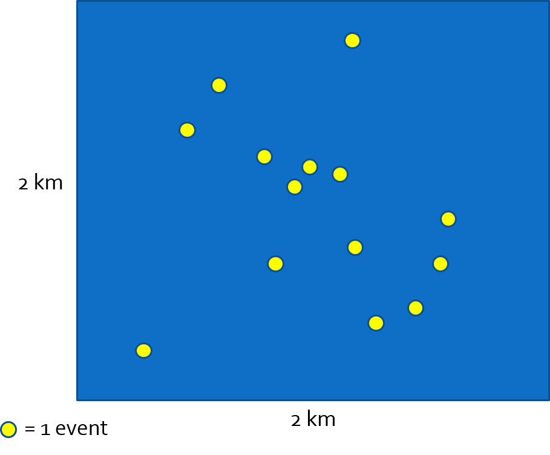
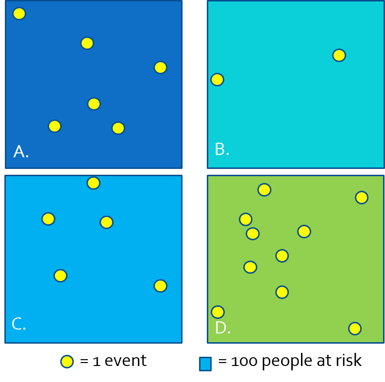
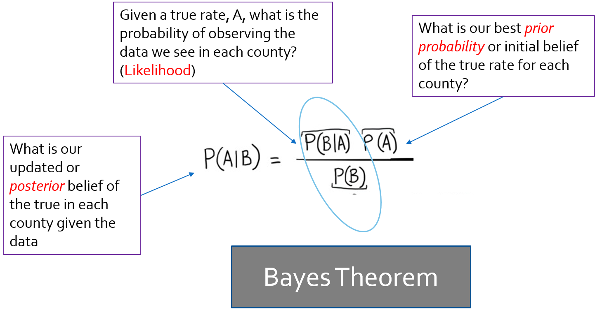

# How to use this eBook {.unnumbered}


\begin{center}\includegraphics[width=0.5\linewidth]{images/John-Snows-cholera-map-of-009} \end{center}

Welcome to *Concepts & Applications in Spatial Epidemiology (EPI 563)* Fall 2022 Semester! This eBook is one of several sources of information and support for your progress through the semester. For an overview of the course, expectations, learning objectives, assignments, and grading, please review the full course syllabus on Canvas. This eBook serves to provide a *'jumping off point'* for the content to be covered each week. Specifically, the content herein will introduce key themes, new vocabulary, and provide some additional detail that is complementary to the *asynchronous* (pre-recorded) video lectures, and foundational to the *synchronous* (in class) work.

## Strategy for using this eBook {.unnumbered}

In the main body of the eBook, there is a separate *module* or *chapter* for each week. This content should be read **in preparation** for each week's material. At the end of the eBook (e.g. after the Appendices), there is a section with each week's *Lab Handout*.

In general, the content within each week's main section is divided into two parts focusing on **spatial thinking** and **spatial analysis**. This dichotomy does not always hold, but in broad terms you can expect these sections to be more specific to content in class on *Tuesday* versus *Thursday* respectively.

-   *Spatial thinking for epidemiology*: This section introduces vocabulary, concepts, and themes that are important to the incorporation of spatialized or geo-referenced data into epidemiologic work. At a minimum, plan to read this content *prior to class Tuesday*, although you will likely benefit from reading both sections before Tuesday.
-   *Spatial analysis for epidemiology*: This section is more focused on data management, visualization, spatial statistics, and interpretation. This content is relevant for our work together on Tuesday's, but is essential for successful work in the Thursday lab activities. *You are not expected to actually execute the code in the eBook before lab on thursday!*. The code is a primer for activities i class.
-  *Weekly Lab Handout*: This is a new addition to the eBook in 2022. Note that there is a lot of overlap between the *spatial analysis* section of the main portion of the eBook, and the *lab handout*. That overlap is by design! While there is overlap, the *Lab Handout* will often contain more specificity and detail about code or analysis that is easier to absorb when you are interactively working through it. 

Throughout the book some concepts or ideas may be highlighted with *call-out blocks*.

::: {.rmdcaution data-latex="{caution}"}
This block denotes a potential pitfall or area of caution.
:::

::: {.rmdnote data-latex="{note}"}
This block denotes an additional bit of information or additional idea to *note* about the topic at hand.
:::

::: {.rmdtip data-latex="{tip}"}
This block denotes a *tip* or advice for best practices or efficiency.
:::

Please note that I will be continually updating the eBook throughout the semester, so if you choose to download, please double-check the **Last updated** date (in colored bar at bottom of screen) to be sure you have the most recent version.

\
This eBook is licensed under the [Creative Commons Attribution-NonCommercial-ShareAlike 4.0 International License](http://creativecommons.org/licenses/by-nc-sa/4.0/).

<!--chapter:end:index.Rmd-->

# Download eBook {-}

To download a PDF of the full version of this eBook [click here](EPI563-SpatialEPI-eBook.pdf). Note that the eBook may be intermittently updated through the semester and you may (or may not) care to re-download the most updated version. Note the *date last updated* in the footer of each page to see when versions changed.

<!--chapter:end:00-download-pdf.Rmd-->

# (PART) Getting ready... {.unnumbered}

# Software installation {.unnumbered}

The information in this module follows on the pre-class video on setting up `R` and `RStudio` on your computer.

## Installing `R` on your computer {.unnumbered}

As of August 2022, the most up-to-date version of `R` is 4.2.1. The *R Project for Statistical Computing* are continually working to update and improve `R`, and as a result there are new versions 1-2 times per year.

If you already have `R` installed, you can open the console and check your current version by typing (or copy/pasting) this: `R.Version()$version.string`

If you do not have `R`, or have an older version than that listed above, you can install or update `R` by going to the `R` repository: <https://www.r-project.org/>. Note that there are many 'mirrors' or servers where the software is stored. Generally it is wise to select one that is geographically close to you, although any should work in theory. One mirror that is relatively close to Atlanta is here: <http://archive.linux.duke.edu/cran/>

### `R` installation notes for Mac OS users

If you click on *Mac OS* from the `cran` webpage, you will see several different options for installation. Specifically, there is a versions for Mac with Intel processors, and a different version for Mac OS with Apple Silicon (e.g. M1 chip). 

::: {.rmdtip data-latex="{tip}"}
**How do I know what chip is in my Mac?**

If you do not know whether you have Intel or Apple processors, click on the Apple icon and choose "*About this Mac*". In the resulting window look for either of these:

* `Chip Apple M1 Pro` means that you have Apple Silicon. You should download that has `arm64` in the name. The description will say it is for native Apple silicon.
* `Processor xxx` where *xxx* is an Intel chip.  This means you have the older Intel chip, and you should download the `R` installer that is for Intel-based Macs.
:::

#### Installing `Xcode` (Mac only)

There are some packages that require compiling done outside of `R`. You may need the utility package `Xcode` to do this.  This is not an `R` package, but instead an app available from the Apple Store. Open the Apple Store, search for `Xcode` and install.

::: {.rmdcaution data-latex="{caution}"}
`Xcode` is BIG! If you don't have much storage on your hard drive this might be a problem. You have two options:

1. Don't install `Xcode` and see what happens. Depending on other configurations on your machine, it might not be necessary. You will know there is a problem if some packages do not install.
2. Try install a "*slimmer*" version of `Xcode` by following [these instructions](https://mac.install.guide/commandlinetools/index.html).
:::

### `R` installation for Windows OS users

If you are using a computer running Microsoft Windows OS, you will click on the Windows option on the CRAN website.  Choose the option that reads `base` and click on the most recent downloader.

#### Installing `Rtools42` (Windows Only) 

While **most** of your work with `R` packages (e.g. installing new ones) can be done with the base-R tools, there are instances where an installation of a new package requires a more complex '*unpacking*' of the code or installation from github. Windows machine  may require additional *tools* to do this work. Luckily there is a package for that! It is called `Rtools42` (assuming you have already downloaded and installed R 4.2), and you should install that **before** you install the packages below.

Note that `Rtools42` is not a package within `R`, but instead is a Windows utility installed outside of `R` itself.

If you are running Windows, navigate back to the [CRAN](https://cran.r-project.org) website, choose Windows, and then -- instead of clicking on `base` -- click on `Rtools` and follow the instructions. Specifically, be sure your version of `Rtool` aligns with your version of `R`. For example, if you have `R` 4.2.1, then choose `Rtools42`. 


## Installing *RStudio* on your computer {.unnumbered}

R-Studio is one of several *integrated development environments* (IDE) for working in `R`. That means it is a *wrapper* around the core `R` functionality that makes coding and project work in `R` much easier than it would be without. We *develop* projects or analyses using `R` within an IDE such as R-Studio. Using R-Studio lets us have robust code-editing and debugging, code syntax highlighting (e.g. coloring different words according to their use, and identifying possible errors), and some assistance with file management, working in larger projects, and outputting results.

The current version of RStudio 2022.07.1. If you do not have RStudio or have an up-to-date version, please install or update it.

**TO INSTALL**: go to <https://www.rstudio.com/products/rstudio/download/>

**TO UPDATE**: Open RStudio and go to Help Menu and choose 'Check for Updates'

::: {.rmdtip data-latex="{tip}"}
[R-Studio Cheat sheet](https://raw.githubusercontent.com/rstudio/cheatsheets/main/rstudio-ide.pdf) provides a quick reference guide for many of the ways that R-Studio makes your work with `R` easier. 

In fact, there are "*cheat sheets*" for lots of packages and utilities in `R`; browse some of them [here](https://www.rstudio.com/resources/cheatsheets/).
:::


# Installing packages for this course {.unnumbered}

While base `R` has a great deal of essential functionality, most of the power of `R` comes from the rapidly growing list of user-created and contributed '*packages*'. A package is simply a bundle of functions and tools, sometimes also including example datasets, basic documentation, and even tutorial 'vignettes'. You can see all the official `R` packages by going here: <https://cran.r-project.org/web/packages/>.

The most common way to install package in `R` is with the `install.packages()` command. For instance to install the package `ggplot2` you do this:

`install.packages("ggplot2")`

Remember that you only need to install a package once (although you may have to update packages occasionally -- see the green Update button in the Packages tab in R Studio). When you want to actually *use* a package (for example `ggplot2`) you call it like this:

`library(ggplot2)`

If your call to `library()` is working, nothing visible happens. However if you see errors, they might be because your package is out of date (and thus needs to be updated/reinstalled), or because some important *dependencies* are missing. Dependencies are other packages on which this package depends. Typically these are installed by default, but sometimes something is missing. If so, simply install the missing package and then try calling `library(ggplot2)` again.

::: {.rmdnote data-latex="{note}"}
Notice that for the function `install.packages('yourPackage')` you **must use quotes** around the package name. In contrast for the function `library(yourPackage)` you **do not use quotes**.
:::

::: {.rmdcaution data-latex="{caution}"}
As you submit each installation request, note the output in your R console. If you get a warning that says installation was not possible because you are missing a package *'yourPackage'*, that suggests you are missing a dependency (e.g. something the main package needs to work correctly). Try installing the package mentioned in the error. If you have trouble, reach out to the TA's!
:::


## Installing packages used for general data science {.unnumbered}

For the rest of this page, copy and paste the provided code in order to install packages necessary for this course. Notice if you hover to the right of a code-chunk in the html version of the eBook, you will see a *copy* icon for quick copying and pasting.

::: {.rmdtip data-latex="{tip}"}
Although you are copying and pasting the code, take a moment to **look** at the output. Did you get any error messages that a package did not install? Sometimes you see a **warning** message announcing something, but perhaps the package installed ok. If there is an **error** message, the package probably did not install. 

To see if a package was installed, try loading it by typing `library(yourPackage)`. If nothing happens (no errors) then all is good!
:::

These packages will support some of our general work in `R`:

-   `rmarkdown` allows the creation of mixed output documents that combine code, documentation and results in a single, readable format.
-   The packages `tinytex` and `knitr` are necessary for creating the `R` documents including PDF output that will be required for submitting assignments.
-   We will use many data manipulation tools from the `tidyverse`. You can learn more about the `tidyverse` here: <https://tidyverse.tidyverse.org/>, and you can see applications of `tidyverse` packages in the [R for Epidemiologists Handbook](https://epirhandbook.com/index.html). The `tidyverse` is actually a collection of data science tools including the visualization/plotting package `ggplot2` and the data manipulation package `dplyr`. For that reason, when you `install.packages('tidyverse')` below, you are actually installing *multiple* packages!
-   The packages `here` and `pacman` are utilities to help simplify file pathnames and package loading behavior.


```r
install.packages('tidyverse')   
install.packages(c('pacman', 'here'))
install.packages(c('tinytex', 'rmarkdown', 'knitr')) 
tinytex::install_tinytex()  
# this function installs the tinytex LaTex on your
#  computer which is necessary for rendering (creating) PDF's 
```

## Installing packages use for geographic data {.unnumbered}

There are many ways to get the data we want for spatial epidemiology into `R`. Because we often (but don't always) use census geographies as aggregating units, and census populations as denominators, the following packages will be useful. They are designed to quickly extract both geographic boundary files (e.g. *'shapefiles'*) as well as attribute data from the US Census website via an API. 


```r
install.packages(c('tidycensus','tigris')) 

help('census_api_key','tidycensus')
```

:::{.rmdtip data-latex="{tip}"}
**NOTE**: To be able to interact with the Census bureau API through `R`, you will need a personalized "**API key**".  When you enter the second line of code above (e.g. the `help()` function), you will see information on how to:

1. Request a key from the Census bureau
2. Enter your cutoms key into your machine so that it is available when needed.

We will not need the Census API key for a couple of weeks, but it is good to start now and ask for help if you have trouble!
:::

## Installing packages used for spatial data manipulation & visualization {.unnumbered}

This section installs a set of tools specific to our goals of importing, exporting, manipulating, visualizing, and analyzing spatial data.

-   The first line of packages have functions for defining, importing, exporting, and manipulating spatial data.
-   The second line has some tools we will use for visualizing spatial data (e.g. making maps!).


```r
install.packages(c('sp', 'sf', 'rgdal', 'raster', 'RColorBrewer', 'rgeos', 'maptools', 'OpenStreetMap'))  
install.packages(c('tmap', 'tmaptools', 'ggmap', 'shinyjs', 'shiny', 'micromap')) 
```

## Installing packages used for spatial analysis {.unnumbered}

Finally these are packages specifically for spatial analysis tasks we will carry out.


```r
install.packages(c('spdep', 'CARBayes', 'sparr', 'spatialreg',  'DCluster', 'SpatialEpi'))
install.packages(c('GWmodel', 'spgwr') )
```


<!--chapter:end:00-software-setup.Rmd-->

# (PART) Weekly Modules {-}

# Locating Spatial Epidemiology

## Getting Ready

### Learning objectives


```{=latex}
 
  \providecommand{\huxb}[2]{\arrayrulecolor[RGB]{#1}\global\arrayrulewidth=#2pt}
  \providecommand{\huxvb}[2]{\color[RGB]{#1}\vrule width #2pt}
  \providecommand{\huxtpad}[1]{\rule{0pt}{#1}}
  \providecommand{\huxbpad}[1]{\rule[-#1]{0pt}{#1}}

\begin{table}[ht]
\begin{centerbox}
\begin{threeparttable}
\captionsetup{justification=centering,singlelinecheck=off}
\caption{(\#tab:learning-ob) Learning objectives by weekly module}
 \setlength{\tabcolsep}{0pt}
\begin{tabularx}{1\textwidth}{p{1\textwidth}}


\hhline{>{\huxb{255, 255, 255}{1}}-}
\arrayrulecolor{black}

\multicolumn{1}{!{\huxvb{255, 255, 255}{1}}p{1\textwidth}!{\huxvb{255, 255, 255}{1}}}{\cellcolor[RGB]{204, 204, 204}\hspace{6pt}\parbox[b]{1\textwidth-6pt-6pt}{\huxtpad{2pt + 1em}\raggedright \textbf{After this module you should be able to…}\huxbpad{2pt}}} \tabularnewline[-0.5pt]


\hhline{>{\huxb{255, 255, 255}{1}}-}
\arrayrulecolor{black}

\multicolumn{1}{!{\huxvb{255, 255, 255}{1}}p{1\textwidth}!{\huxvb{255, 255, 255}{1}}}{\cellcolor[RGB]{242, 242, 242}\hspace{6pt}\parbox[b]{1\textwidth-6pt-6pt}{\huxtpad{2pt + 1em}\raggedright Explain the potential role of spatial analysis for epidemiologic thinking and practice.\huxbpad{2pt}}} \tabularnewline[-0.5pt]


\hhline{>{\huxb{255, 255, 255}{1}}-}
\arrayrulecolor{black}

\multicolumn{1}{!{\huxvb{255, 255, 255}{1}}p{1\textwidth}!{\huxvb{255, 255, 255}{1}}}{\cellcolor[RGB]{230, 230, 230}\hspace{6pt}\parbox[b]{1\textwidth-6pt-6pt}{\huxtpad{2pt + 1em}\raggedright Produce simple thematic maps of epidemiologic data in R.\huxbpad{2pt}}} \tabularnewline[-0.5pt]


\hhline{>{\huxb{255, 255, 255}{1}}-}
\arrayrulecolor{black}
\end{tabularx}
\end{threeparttable}\par\end{centerbox}

\end{table}
 
```

### Additional Resources


* [Geocomputation with R](https://geocompr.robinlovelace.net/) by Robin Lovelace. This will be a recurring 'additional resource' as it provides lots of useful insight and strategy for working with spatial data in `R`. I encourage you to browse it quickly now, but return often when you have questions about how to handle geographic data (especially of class `sf`) in `R`. 
* [An introduction to the `ggplot2` package](https://ggplot2-book.org/introduction.html). This is just one of dozens of great online resources introducing the *grammar of graphics* approach to plotting in `R`. 
* [A basic introduction to the `tmap` package](https://tlorusso.github.io/geodata_workshop/tmap_package#:~:text=The%20tmap%20package%20is%20a,as%20choropleths%20and%20bubble%20maps.) This is also only one of many introductions to the `tmap` mapping package. `tmap` builds on the *grammar of graphics* philosophy of `ggplot2`, but brings a lot of tools useful for thematic mapping!
* [R for SAS users cheat sheet](https://raw.githubusercontent.com/rstudio/cheatsheets/main/sas-r.pdf)

### Important Vocabulary


```{=latex}
 
  \providecommand{\huxb}[2]{\arrayrulecolor[RGB]{#1}\global\arrayrulewidth=#2pt}
  \providecommand{\huxvb}[2]{\color[RGB]{#1}\vrule width #2pt}
  \providecommand{\huxtpad}[1]{\rule{0pt}{#1}}
  \providecommand{\huxbpad}[1]{\rule[-#1]{0pt}{#1}}

\begin{table}[ht]
\begin{centerbox}
\begin{threeparttable}
\captionsetup{justification=centering,singlelinecheck=off}
\caption{(\#tab:unnamed-chunk-2) Vocabulary for Week 1}
 \setlength{\tabcolsep}{0pt}
\begin{tabularx}{0.9\textwidth}{p{0.45\textwidth} p{0.45\textwidth}}


\hhline{>{\huxb{255, 255, 255}{1}}->{\huxb{255, 255, 255}{1}}-}
\arrayrulecolor{black}

\multicolumn{1}{!{\huxvb{255, 255, 255}{1}}p{0.45\textwidth}!{\huxvb{255, 255, 255}{1}}}{\cellcolor[RGB]{84, 153, 199}\hspace{6pt}\parbox[b]{0.45\textwidth-6pt-2pt}{\huxtpad{2pt + 1em}\raggedright \textbf{\textcolor[RGB]{255, 255, 255}{Term}}\huxbpad{2pt}}} &
\multicolumn{1}{p{0.45\textwidth}!{\huxvb{255, 255, 255}{1}}}{\cellcolor[RGB]{84, 153, 199}\hspace{2pt}\parbox[b]{0.45\textwidth-2pt-6pt}{\huxtpad{2pt + 1em}\raggedright \textbf{\textcolor[RGB]{255, 255, 255}{Definition}}\huxbpad{2pt}}} \tabularnewline[-0.5pt]


\hhline{>{\huxb{255, 255, 255}{1}}->{\huxb{255, 255, 255}{1}}-}
\arrayrulecolor{black}

\multicolumn{1}{!{\huxvb{255, 255, 255}{1}}p{0.45\textwidth}!{\huxvb{255, 255, 255}{1}}}{\cellcolor[RGB]{212, 230, 241}\hspace{6pt}\parbox[b]{0.45\textwidth-6pt-2pt}{\huxtpad{2pt + 1em}\raggedright \textbf{Data, attribute}\huxbpad{2pt}}} &
\multicolumn{1}{p{0.45\textwidth}!{\huxvb{255, 255, 255}{1}}}{\cellcolor[RGB]{212, 230, 241}\hspace{2pt}\parbox[b]{0.45\textwidth-2pt-6pt}{\huxtpad{2pt + 1em}\raggedright Nonspatial information about a geographic feature in a GIS, usually stored in a table and linked to the feature by a unique identifier. For example, attributes of a county might include the population size, density, and birth rate for the resident population\huxbpad{2pt}}} \tabularnewline[-0.5pt]


\hhline{>{\huxb{255, 255, 255}{1}}->{\huxb{255, 255, 255}{1}}-}
\arrayrulecolor{black}

\multicolumn{1}{!{\huxvb{255, 255, 255}{1}}p{0.45\textwidth}!{\huxvb{255, 255, 255}{1}}}{\cellcolor[RGB]{169, 204, 227}\hspace{6pt}\parbox[b]{0.45\textwidth-6pt-2pt}{\huxtpad{2pt + 1em}\raggedright \textbf{Data, geometry}\huxbpad{2pt}}} &
\multicolumn{1}{p{0.45\textwidth}!{\huxvb{255, 255, 255}{1}}}{\cellcolor[RGB]{169, 204, 227}\hspace{2pt}\parbox[b]{0.45\textwidth-2pt-6pt}{\huxtpad{2pt + 1em}\raggedright Spatial information about a geogrpahic feature. This could include the x, y coordinates for points or for vertices of lines or polygons, or the cell coordinates for raster data\huxbpad{2pt}}} \tabularnewline[-0.5pt]


\hhline{>{\huxb{255, 255, 255}{1}}->{\huxb{255, 255, 255}{1}}-}
\arrayrulecolor{black}

\multicolumn{1}{!{\huxvb{255, 255, 255}{1}}p{0.45\textwidth}!{\huxvb{255, 255, 255}{1}}}{\cellcolor[RGB]{212, 230, 241}\hspace{6pt}\parbox[b]{0.45\textwidth-6pt-2pt}{\huxtpad{2pt + 1em}\raggedright \textbf{Datum}\huxbpad{2pt}}} &
\multicolumn{1}{p{0.45\textwidth}!{\huxvb{255, 255, 255}{1}}}{\cellcolor[RGB]{212, 230, 241}\hspace{2pt}\parbox[b]{0.45\textwidth-2pt-6pt}{\huxtpad{2pt + 1em}\raggedright The reference specifications of a measurement system, usually a system of coordinate positions on a surface (a horizontal datum) or heights above or below a surface (a vertical datum)\huxbpad{2pt}}} \tabularnewline[-0.5pt]


\hhline{>{\huxb{255, 255, 255}{1}}->{\huxb{255, 255, 255}{1}}-}
\arrayrulecolor{black}

\multicolumn{1}{!{\huxvb{255, 255, 255}{1}}p{0.45\textwidth}!{\huxvb{255, 255, 255}{1}}}{\cellcolor[RGB]{169, 204, 227}\hspace{6pt}\parbox[b]{0.45\textwidth-6pt-2pt}{\huxtpad{2pt + 1em}\raggedright \textbf{Geographic coordinate system}\huxbpad{2pt}}} &
\multicolumn{1}{p{0.45\textwidth}!{\huxvb{255, 255, 255}{1}}}{\cellcolor[RGB]{169, 204, 227}\hspace{2pt}\parbox[b]{0.45\textwidth-2pt-6pt}{\huxtpad{2pt + 1em}\raggedright A reference system that uses latitude and longitude to define the locations of points on the surface of a sphere or spheroid. A geographic coordinate system definition includes a datum, prime meridian, and angular unit\huxbpad{2pt}}} \tabularnewline[-0.5pt]


\hhline{>{\huxb{255, 255, 255}{1}}->{\huxb{255, 255, 255}{1}}-}
\arrayrulecolor{black}

\multicolumn{1}{!{\huxvb{255, 255, 255}{1}}p{0.45\textwidth}!{\huxvb{255, 255, 255}{1}}}{\cellcolor[RGB]{212, 230, 241}\hspace{6pt}\parbox[b]{0.45\textwidth-6pt-2pt}{\huxtpad{2pt + 1em}\raggedright \textbf{Geopackage}\huxbpad{2pt}}} &
\multicolumn{1}{p{0.45\textwidth}!{\huxvb{255, 255, 255}{1}}}{\cellcolor[RGB]{212, 230, 241}\hspace{2pt}\parbox[b]{0.45\textwidth-2pt-6pt}{\huxtpad{2pt + 1em}\raggedright A data storage format suitable for containing vector or raster data in a compact and portable file. It is an alternative (and in my opinion a superior alternative!) to ESRI shapefiles.\huxbpad{2pt}}} \tabularnewline[-0.5pt]


\hhline{>{\huxb{255, 255, 255}{1}}->{\huxb{255, 255, 255}{1}}-}
\arrayrulecolor{black}

\multicolumn{1}{!{\huxvb{255, 255, 255}{1}}p{0.45\textwidth}!{\huxvb{255, 255, 255}{1}}}{\cellcolor[RGB]{169, 204, 227}\hspace{6pt}\parbox[b]{0.45\textwidth-6pt-2pt}{\huxtpad{2pt + 1em}\raggedright \textbf{Projection}\huxbpad{2pt}}} &
\multicolumn{1}{p{0.45\textwidth}!{\huxvb{255, 255, 255}{1}}}{\cellcolor[RGB]{169, 204, 227}\hspace{2pt}\parbox[b]{0.45\textwidth-2pt-6pt}{\huxtpad{2pt + 1em}\raggedright A method by which the curved surface of the earth is portrayed on a flat surface. This generally requires a systematic mathematical transformation of the earth's graticule of lines of longitude and latitude onto a plane. Some projections can be visualized as a transparent globe with a light bulb at its center (though not all projections emanate from the globe's center) casting lines of latitude and longitude onto a sheet of paper. Generally, the paper is either flat and placed tangent to the globe (a planar or azimuthal projection) or formed into a cone or cylinder and placed over the globe (cylindrical and conical projections). Every map projection distorts distance, area, shape, direction, or some combination thereof\huxbpad{2pt}}} \tabularnewline[-0.5pt]


\hhline{>{\huxb{255, 255, 255}{1}}->{\huxb{255, 255, 255}{1}}-}
\arrayrulecolor{black}

\multicolumn{1}{!{\huxvb{255, 255, 255}{1}}p{0.45\textwidth}!{\huxvb{255, 255, 255}{1}}}{\cellcolor[RGB]{212, 230, 241}\hspace{6pt}\parbox[b]{0.45\textwidth-6pt-2pt}{\huxtpad{2pt + 1em}\raggedright \textbf{Spatial data model: raster}\huxbpad{2pt}}} &
\multicolumn{1}{p{0.45\textwidth}!{\huxvb{255, 255, 255}{1}}}{\cellcolor[RGB]{212, 230, 241}\hspace{2pt}\parbox[b]{0.45\textwidth-2pt-6pt}{\huxtpad{2pt + 1em}\raggedright A spatial data model that defines space as an array of equally sized cells arranged in rows and columns, and composed of single or multiple bands. Each cell contains an attribute value and location coordinates. Unlike a vector structure, which stores coordinates explicitly, raster coordinates are contained in the ordering of the matrix. Groups of cells that share the same value represent the same type of geographic feature (see Figure below)\huxbpad{2pt}}} \tabularnewline[-0.5pt]


\hhline{>{\huxb{255, 255, 255}{1}}->{\huxb{255, 255, 255}{1}}-}
\arrayrulecolor{black}

\multicolumn{1}{!{\huxvb{255, 255, 255}{1}}p{0.45\textwidth}!{\huxvb{255, 255, 255}{1}}}{\cellcolor[RGB]{169, 204, 227}\hspace{6pt}\parbox[b]{0.45\textwidth-6pt-2pt}{\huxtpad{2pt + 1em}\raggedright \textbf{Spatial data model: vector}\huxbpad{2pt}}} &
\multicolumn{1}{p{0.45\textwidth}!{\huxvb{255, 255, 255}{1}}}{\cellcolor[RGB]{169, 204, 227}\hspace{2pt}\parbox[b]{0.45\textwidth-2pt-6pt}{\huxtpad{2pt + 1em}\raggedright A coordinate-based data model that represents geographic features as points, lines, and polygons. Each point feature is represented as a single coordinate pair, while line and polygon features are represented as ordered lists of vertices. Attributes are associated with each vector feature, as opposed to a raster data model, which associates attributes with grid cells (see figure below)\huxbpad{2pt}}} \tabularnewline[-0.5pt]


\hhline{>{\huxb{255, 255, 255}{1}}->{\huxb{255, 255, 255}{1}}-}
\arrayrulecolor{black}

\multicolumn{1}{!{\huxvb{255, 255, 255}{1}}p{0.45\textwidth}!{\huxvb{255, 255, 255}{1}}}{\cellcolor[RGB]{212, 230, 241}\hspace{6pt}\parbox[b]{0.45\textwidth-6pt-2pt}{\huxtpad{2pt + 1em}\raggedright \textbf{Unit of analysis}\huxbpad{2pt}}} &
\multicolumn{1}{p{0.45\textwidth}!{\huxvb{255, 255, 255}{1}}}{\cellcolor[RGB]{212, 230, 241}\hspace{2pt}\parbox[b]{0.45\textwidth-2pt-6pt}{\huxtpad{2pt + 1em}\raggedright The unit or object that is measured, analyzed, and about which you wish to make inference. Examples of units of analysis are person, neighborhood, city, state, or hospital.\huxbpad{2pt}}} \tabularnewline[-0.5pt]


\hhline{>{\huxb{255, 255, 255}{1}}->{\huxb{255, 255, 255}{1}}-}
\arrayrulecolor{black}
\end{tabularx}
\end{threeparttable}\par\end{centerbox}

\end{table}
 
```


\includegraphics[width=0.8\linewidth]{images/data-models} 


## Spatial Thinking in Epidemiology

When first learning epidemiology, it can be difficult to distinguish between the concepts, theories, and purpose of epidemiology versus the skills, tools, and methods that we use to implement epidemiology. But these distinctions are foundational to our collective professional identity, and to the way we go about doing our work. 

For instance do you think of epidemiologists as data analysts, scientists, data scientists, technicians or something else? These questions are bigger than we can address in this class, but their importance becomes especially apparent when learning an area such as *spatial epidemiology*. This is because there is a tendency for discourse in spatial epidemiology to focus primarily on the *data* and the *methods* without understanding how each of those relate to the *scientific questions* and *health of population* for which we are ultimately responsible. Distinguishing these threads is an overarching goal of this course, even as we learn the data science and spatial analytic tools.

One quite simplistic but important example of how our questions and methods are inter-related is apparent when we think of  **data**. Data is central to quantitative analysis, including epidemiologic analysis. So how is *data* different in *spatial* epidemiology? 

The first thing that might come to mind is that we have explicitly geographic or spatial measures contained within our data. The content of the spatial data is distinct: the addition of geographic or spatial location may illuminate otherwise *aspatial* attributes. But even more fundamental than the content is thinking about the *unit of analysis*.  

It is likely that in many other examples in your epidemiology coursework, the explicit (or sometimes implicit) unit of analysis has been the *individual person*. Spatial epidemiology can definitely align with individual-level analysis. But as we'll see, common units we observe and measure in spatial epidemiology -- and therefore the units that compose much of our **data** -- are not individuals but instead are geographic units (e.g. census tract, county, state, etc) and by extension the *collection* or *aggregation* of all the individuals therein. 

This distinction in unit of analysis has important implications for other epidemiologic concerns including precision, bias, and ultimately for inference (e.g. the meaning we can make from our analysis), as we'll discuss throughout the semester.

One concrete implication of the above discussion is that you should always be able to answer a basic question about any dataset you wish to analyze: "*what does one row of data represent?*"  A row of data is one way to think of the *unit of analysis*, and often (but not always) in spatial epidemiology a row of data is a summary of the population contained by a geographic unit or boundary. 

Said another way it is an *ecologic summary* of the population. As stated above, this is only the most simplistic example of how and why it is important to not only learn the spatial statistics and methods, but to also maintain the perspective of epidemiology as a population health science. To advance public health we need good methods but we also need critical understanding of the populations we support, the data we analyze, and the conclusions we can reliably draw from our work.

As we move through the semester, I encourage you to dig deep into how methods work, but also to step back and ask questions like *"Why would I choose this method?"* or *"What question in epidemiology is this useful for?"* 


## Spatial Analysis in Epidemiology

### Spatial data storage formats

If you have worked with spatial or GIS data using ESRI's ArcMap, you will be familiar with what are called *shapefiles*.  This is one very common format for storing geographic data on computers. ESRI shapefiles are not actually a single file, but are anywhere from four to eight different files all with the same file name but different extensions (e.g. *.shp*, *.prj*, *.shx*, etc). Each different file (corresponding to an extension) contains a different portion of the data ranging from the geometry data, the attribute data, the projection data, an index connecting it all together, etc. 

What you may not know is that shapefiles are not the only (and in my opinion **definitely not the best**) way to store geographic data. In this class I recommend storing data in a format called *geopackages* indicated by the `.gpkg` extension. 

*Geopackages* are an open source format that were developed to be functional and portable across devices, including  mobile devices. They are useful when we are storing individual files in an efficient and compact way.  

To be clear, there are many other formats and I make no claim that *geopackages* are the ultimate format; they just happen to meet the needs for this course, and for much of the work of spatial epidemiologists. It is worth noting that many GIS programs including ArcMap and QGIS can both read and write the *geopackage* format; so there is no constraint or limitation in terms of software when data are stored in `.gpkg` format.
    

### Representing spatial data in `R`

The work in this course assumes that you are a *basic `R` user*; you do not need to be expert, but I assume that you understand data objects (e.g. `data.frame`, `list`, `vector`), and basic operations including sub-setting by index (e.g. using square brackets to extract or modify information: `[]`), base-R plotting, and simple regression modeling. If you **are not familiar with `R`**, you will need to do some quick self-directed learning. 

:::{.rmdtip data-latex="{tip}"}

Here are some good online resources for `R` skills, and the instructor and TA's can point you to additional resources as needed:

* [The Epidemiologist R Handbook](https://epirhandbook.com/index.html)
* [R for Data Science](https://r4ds.had.co.nz/introduction.html), particularly the introductory chapters
* [R Tutorial](http://www.r-tutor.com/r-introduction)

:::

Just as our conceptualization of, or thinking about, *data* in spatial epidemiology requires some reflection, the actual structure and representation of that data with a computer tool such as `R` also requires some attention. Specifically, spatial data in `R` is not exactly like the conventional *aspatial* epidemiologic data that is often arranged as a rectangular `data.frame` (e.g. like a spreadsheet where *rows are observations* and *columns are variables*). 

While spatial data are more complex than just a spreadsheet, it *does not* need to be as complex as spatial data in software platforms like ESRI's ArcMap. 

To be *spatial*, a dataset must have a representation of geography, spatial location, or spatial relatedness, and that is most commonly done with either a *vector* or *raster* data model (see description above in vocabulary). Those spatial or geographic representations must be stored on your computer and/or held in memory, hopefully with a means for relating or associating the individual locations with their corresponding attributes. For example we want to know the attribute (e.g. the count of deaths for a given place), and the location of that place, and ideally we want the two connected together.

Over the past 10+ years, `R` has increasingly been used to analyze and visualize spatial data. Early on, investigators tackling the complexities of spatial data analysis in `R` developed a number of ad hoc, one-off approaches to these data. This worked in the short term for specific applications, but it created new problems as users needed to generalize a method to a new situation, or chain together steps. In those settings it was not uncommon to convert a dataset to multiple different formats to accomplish a task sequence; this resulted in convoluted and error-prone coding, and lack of transparency in analysis.

An eventual response to this early tumult was a thoughtful and systematic approach to defining a *class of data* that tackled the unique challenges of spatial data in `R`. Roger Bivand, Edzer Pebesma and others developed the `sp` package which defined spatial data classes, and provided functional tools to interact with them. 

The `sp` package defined specific data classes to contain or represent *points*, *lines*, and *polygons*, as well as *raster/grid* data; each of these data classes can contain geometry only (these have names like `SpatialPoints` or `SpatialPolygons`) or could contain geometry **plus** related data attributes (these have names like `SpatialPointsDataFrame` or `SpatialPolygonsDataFrame`). Each spatial object can contain all the information spatial data might include: the spatial extent (min/max x, y values), the coordinate system or spatial projection, the geometry information, the attribute information, etc. 

Because of the flexibility and power of the `sp*` class of objects, they became a standard up until the last few years.  Interestingly, it was perhaps the sophistication of the `sp*` class that began to undermine it. `sp*` class data was well-designed from a programming point of view, but was still a little cumbersome (and frankly confusing) for more applied analysts and new users. 

Analysis in *spatial epidemiology* is not primarily about computer programming, but about producing transparent and reliable data pipelines to conduct valid, reliable, and reproducible analysis. Thus epidemiologists, and other data scientists, desired spatial tools that could be incorporated into the growing toolbox of data science tools in `R`. 


These calls for a more user-friendly and intuitive approach to spatial data led the same team (e.g. Bivand, Pebesma, others) to develop the **Simple Features** set of spatial data classes for `R`. Loaded with the `sf` -- for *simple features* -- package, this data format has quickly become the standard for handling spatial data in `R`.  

The power of the `sf` class, as discussed below, is that it makes *spatial data* behave like *rectangular data* and thus makes it amenable to manipulation using any tool that works on `data.frame` or `tibble` objects. Recognizing that many users and functions prefer the older `sp*` objects, the `sf` package includes a number of utility functions for easily converting back and forth. 


:::{.rmdnote data-latex="{note}"}
In this class we will use `sf*` class objects as the *preferred data class*, but because some of the tools we'll learn still require `sp*` we will occasionally go back and forth.
:::

`sf*` data classes are designed to hold all the essential spatial information (projection, extent, geometry), but do so with an easy to evaluate `data.frame` format that integrates the attribute information and the geometry information together. The result is more intuitive sorting, selecting, aggregating, and visualizing. 


### Benefits of `sf` data classes


As Robin Lovelace writes in his online eBook, [Gecomputation in R](https://geocompr.robinlovelace.net/), `sf` data classes offer an approach to spatial data that is compatible with QGIS and PostGIS, important non-ESRI open source GIS platforms, and `sf` functionality compared to `sp` provides:

1. Fast reading and writing of data
2. Enhanced plotting performance
3. `sf` objects can be treated as data frames in most operations
4. `sf` functions can be combined using `%>%` pipe operator and works well with the `tidyverse` collection of `R` packages ([see Tips for using `dplyr`](#dplyr) for examples)
5. `sf` function names are relatively consistent and intuitive (all begin with `st_`)


### Working with spatial data in `R`

Here and in lab, one example dataset we will use, called `ga.mvc` quantifies the counts and rates of death from motor vehicle crashes in each of Georgia's $n=159$ counties. The dataset is *vector* in that it represents counties as polygons with associated attributes (e.g. the mortality information, county names, etc). 

#### Importing spatial data into `R`

It is important to distinguish between two kinds of data formats.  There is a way that data is *stored on a computer hard drive*, and then there is a way that data is organized and managed *inside a program* like `R`. 

The *shapefiles* (`.shp`) popularized by ESRI/ArcMap is an example of a format for storing spatial data on a hard drive.  In contrast, the discussion above about the `sf*` and `sp*` data classes refer to how data is organized *inside `R`*.  

Luckily, regardless of how data is *stored* on your computer, it is possible to import almost any format into `R`, and once inside `R` it is possible to make it into either the `sp*` or `sf*` data class. That means if you receive data as a `.shp` shapefile, as a `.gpkg` geopackage, or as a `.tif` raster file, each can be easily imported.

All `sf` functions that act on spatial objects begin with the prefix `st_`.  Therefore to import (read) data we will use `st_read()`. This function determines **how** to import the data based on the extension of the file name you specify. 

Look at the help documentation for `st_read()`. Notice that the first argument `dsn=`, might be a complete file name (e.g. `myData.shp`), or it might be a folder name (e.g. `mygeodatabase.gdb`). So if  you had a the motor vehicle crash data saved as both a shapefile (`mvc.shp`, which is actually six different files on your computer), and as a geopackage (`mvc.gpkg`) you can read them in like this:


```r
# this reads in the shapefile
mvc.a <- st_read('GA_MVC/ga_mvc.shp')

# this reads in the geopackage
mvc.b <- st_read('GA_MVC/ga_mvc.gpkg')
```


We can take a look at the defined data class of the imported objects within `R`:


```r
class(mvc.a)
```

```
## [1] "sf"         "data.frame"
```

```r
class(mvc.b)
```

```
## [1] "sf"         "data.frame"
```

Notice how the two objects have the same *class* (e.g. type of data stored within `R`), even though they were two different kinds of files stored on the computer: one was a shapefile and one a geopackage. This is because `st_read()` can automatically detect the storage format based on the extension, and use the appropriate interpreter to import that data. This is nice because it means you can bring many types of spatial data into `R`!


You will also notice that when we examined the `class()` of each object, they are each classified as **both** `sf` **and** `data.frame` class. That is incredibly important, and it speaks to an elegant simplicity of the `sf*` data classes! 

That the objects are classified as `sf` is perhaps obvious because it is a **spatial** object; but the fact that each object is *also classified* as `data.frame` means that we can treat the object for the purposes of data management,  manipulation and analysis as a relatively simple-seeming object: a rectangular `data.frame`.  

How does that work? We will explore this more in lab but essentially each dataset has rows (observations) and columns (variables). We can see the variable/column names like this:


```r
names(mvc.a)
```

```
## [1] "GEOID"      "NAME"       "MVCRATE_17" "geometry"
```

```r
names(mvc.b)
```

```
## [1] "GEOID"      "NAME"       "MVCRATE_17" "geom"
```

We can see that each dataset has the same *attribute* variables (e.g. `GEOID`, `NAME`, `MVCRATE_17`), and then a final column called `geometry` in one and called `geom` in another. 

These geometry columns are different from your usual run-of-the-mill column variables in that they don't hold a single value.  Instead, each *'cell'* in those columns actually contains an embedded list of $x,y$ coordinates defining the vertices of the polygons for each of Georgia's counties. So all of the *spatial location* information for each row is contained in that single variable called `geom` (or alternately, `geometry`).

Another way to learn about an `sf` object is to use the `head()` function. In addition to displaying the top six rows of data (which is the typical behavior of the `head()` function), for `sf` objects `head()` will also print some of the important **metadata** about the file.


```r
head(mvc.a)
```

```
## Simple feature collection with 6 features and 3 fields
## Geometry type: MULTIPOLYGON
## Dimension:     XY
## Bounding box:  xmin: -84.64195 ymin: 31.0784 xmax: -82.04858 ymax: 34.49172
## Geodetic CRS:  WGS 84
##   GEOID                     NAME MVCRATE_17                       geometry
## 1 13001  Appling County, Georgia   53.99276 MULTIPOLYGON (((-82.55069 3...
## 2 13003 Atkinson County, Georgia   35.96260 MULTIPOLYGON (((-83.141 31....
## 3 13005    Bacon County, Georgia    0.00000 MULTIPOLYGON (((-82.62819 3...
## 4 13007    Baker County, Georgia   31.25000 MULTIPOLYGON (((-84.64166 3...
## 5 13009  Baldwin County, Georgia   28.94936 MULTIPOLYGON (((-83.42674 3...
## 6 13011    Banks County, Georgia   32.19921 MULTIPOLYGON (((-83.66862 3...
```


:::{.rmdnote data-latex="{note}"}

To summarize, `sf` within `R` is powerful because:

1. We are not limited to how data arrive to us. If you acquire data (from the web, a colleague, etc) as a shapefile, a geopackage, a raster or other formats, they can all be imported into `R`.
2. Once inside of `R` (and stored in `sf` data objects), we can treat the datasets almost as if they were aspatial, rectangular datasets. That means we could use sub-setting, filtering, recoding, merging, and aggregating *without losing the spatial information*! 
:::

#### Exporting spatial data from `R`

While importing is often the primary challenge with spatial data and `R`, it is not uncommon that you might modify or alter a spatial dataset and wish to save it for future use, or to write it out to disk to share with a colleague. 

Luckily the `sf` package has the same functionality to write an `sf` spatial object to disk in a wide variety of formats including *shapefiles* (`.shp`) and *geopackages* (`.gpkg`). Again, `R` uses the extension you specify in the filename to determine the target format.


```r
# Write the file mvc to disk as a shapefile format
st_write(mvc, 'GA_MVC/ga_mvc_v2.shp')

# Write the file mvc to disk as a geopackage format
st_write(mvc, 'GA_MVC/ga_mvc_v2.gpkg')
```


:::{.rmdnote data-latex="{note}"}
After you write the two files, navigate on your computer to the folder and look at what was written. In particular notice that the `.shp` file is actually *many files*, but the `.gpkg` is a single file.
:::
 
### Basic visual inspection/plots

What if you want to **see** your spatial data?  In base-R there is a powerful function called `plot()` that can be used to create easy or incredibly complex visualizations or graphical representation of data. 

In the package `sf`, the functionality of `plot()` is extended to handle the uniqueness of spatial data. That means that if you call `plot()` on a spatial object **without having loaded** `sf`, the results will be different than if `plot()` called **after loading** `sf`. 

When you `plot()` with `sf`, by default it will try to make a map **for every variable in the data frame**! Try it once. If this is not what you want (it usually *is not*), you can force it to only plot *some* variables by providing a vector of variable names.


```r
plot(mvc) # this plots a panel for every column - or actually the first 10 columns
```

<!-- --> 


```r
plot(mvc['MVCRATE_05']) # this plots only a single variable, the MVC mortality rate for 2005
```

<!-- --> 

```r
plot(mvc[c('MVCRATE_05', 'MVCRATE_17')]) # this plots two variables: MVC rate in 2005 & 2017
```

<!-- --> 


Sometimes you want to know something about the spatial size, extent, or shape of your data. To do this you can easily plot only the geometry of the spatial object (e.g. not attributes). Here are two approaches to quickly plot the geometry:


```r
plot(st_geometry(mvc)) # st_geometry() returns the geom information to plot
```


```r
plot(mvc$geom)  # this is an alternative approach...directly plot the 'geom' column
```

<!-- --> 


### Working with CRS and projection

Maps are used to describe the geographical or spatial location of particular objects as a representation of where those things are on planet Earth. Most maps are printed on paper or screens. In other words, maps identify locations from somewhere on planet earth and represent them on a *flat* or *planar* medium.

But the world does not have latitude or longitude lines painted on the ground, and the earth is not flat! Instead the earth is nearly spherical (really it is a *geoid*) and there is no universal reference for where to start measuring. 

For these two reasons, all maps require at a minimum a *coordinate reference system* (CRS) to define how the numbers in our coordinates relate to actual places. In addition most maps are best interpreted after formally *projecting* the data to account for the artifact induced by pretending earth is flat. 

The most unambiguous way to describe a CRS and/or projection is by using the **EPSG** code, which stands for *European Petroleum Survey Group*. This consortium has standardized hundreds of projection definitions in a manner adopted by several `R` packages including `rgdal` and `sf`. 


A given dataset already has a CRS (and possibly a projection). If CRS and projection information was contained in the original file you imported, it will *usually* be maintained when you use `st_read()`.  However sometimes it is missing and you must first find it. Once it is known, you might choose to *change* or *transform* the CRS or projection for a specific purpose. We will discuss this further in class.

:::{.rmdcaution data-latex="{caution}"}

If there is NO CRS information imported it is critical that you find out the CRS information from the data source or owner. 
:::

This course is not a GIS course (e.g. it is assumed you have already had some exposure to geographic information systems generally), and learning about the theory and application of coordinate reference systems and projections is not our primary purpose this semester. However some basic knowledge *is necessary* for successfully working with spatial epidemiologic data. Here are several resources you should peruse to learn more about CRS, projections, and EPSG codes:

* [A useful overview/review of coordinate reference systems in `R`](https://www.nceas.ucsb.edu/sites/default/files/2020-04/OverviewCoordinateReferenceSystems.pdf)
* [Robin Lovelace's Geocompuation in R on projections with `sf`](https://geocompr.robinlovelace.net/reproj-geo-data.html)
* [EPSG website:](https://epsg.io/) This link is to a searchable database of valid ESPG codes
* [Here are some useful EPSG codes](https://guides.library.duke.edu/r-geospatial/CRS)


\begin{figure}
\includegraphics[width=0.5\linewidth]{images/compare-crs} \caption{Comparing CRS}(\#fig:unnamed-chunk-14)
\end{figure}


The choice of CRS and/or projection has a substantial impact on how the rendered map looks, as is evident in the figure above ([source of image](https://datacarpentry.org/organization-geospatial/03-crs/)).

We already saw the CRS/projection information of the `mvc` object when we used the `head()` function above; it was at the top and read `WGS 84`. 

Recall there are two main types of CRS: 

1. **Geographic** which is to say coordinate locations are represented as *latitude* and *longitude* degrees; 
2. **Projected** which means the coordinate values have been transformed for representation of the spherical geoid onto a planar (Euclidean) coordinate system. 

`WGS 84` is a ubiquitous geographic coordinate system common to boundary files retrieved from the U.S. Census bureau. 

An important question when you work with a spatial dataset is to understand whether it is primarily a geographic or projected CRS, and if so which one. 


```r
st_is_longlat(mvc)
```

```
## [1] TRUE
```

This quick logical test returns `TRUE` or `FALSE` to answer the question *"Is the `sf` object simply a longitude/latitude geographic CRS?"*. The answer in this case is `TRUE` because `WGS 84` is a geographic (longlat) coordinate system, and there is no additional information about projection. But what if it were `FALSE` or we wanted to know more about the CRS/projection?


```r
# Retrieve CRS metadata from an sf object
st_crs(mvc)
```

```
## Coordinate Reference System:
##   User input: WGS 84 
##   wkt:
## GEOGCRS["WGS 84",
##     ENSEMBLE["World Geodetic System 1984 ensemble",
##         MEMBER["World Geodetic System 1984 (Transit)"],
##         MEMBER["World Geodetic System 1984 (G730)"],
##         MEMBER["World Geodetic System 1984 (G873)"],
##         MEMBER["World Geodetic System 1984 (G1150)"],
##         MEMBER["World Geodetic System 1984 (G1674)"],
##         MEMBER["World Geodetic System 1984 (G1762)"],
##         MEMBER["World Geodetic System 1984 (G2139)"],
##         ELLIPSOID["WGS 84",6378137,298.257223563,
##             LENGTHUNIT["metre",1]],
##         ENSEMBLEACCURACY[2.0]],
##     PRIMEM["Greenwich",0,
##         ANGLEUNIT["degree",0.0174532925199433]],
##     CS[ellipsoidal,2],
##         AXIS["geodetic latitude (Lat)",north,
##             ORDER[1],
##             ANGLEUNIT["degree",0.0174532925199433]],
##         AXIS["geodetic longitude (Lon)",east,
##             ORDER[2],
##             ANGLEUNIT["degree",0.0174532925199433]],
##     USAGE[
##         SCOPE["Horizontal component of 3D system."],
##         AREA["World."],
##         BBOX[-90,-180,90,180]],
##     ID["EPSG",4326]]
```

This somewhat complicated looking output is a summary of the CRS stored with the spatial object. There are two things to note about this output:

* At the top, the *User input* is `WGS 84`
* At the bottom of the section labeled `GEOGCRS` it says `ID["EPSG",4326"]`

While there are literally hundreds of distinct EPSG codes describing different geographic and projected coordinate systems, for this semester there are three worth remembering: 

* __EPSG: 4326__ is a common geographic (unprojected or long-lat) CRS
* __EPSG: 3857__ is also called *WGS 84/Web Mercator*, and is the dominant projection used by Google Maps
* __EPSG: 5070__ is the code for a projected CRS called *Albers Equal Area* which has the benefit of representing the visual area of maps in an equal manner.

:::{.rmdtip data-latex="{tip}"}

One rule of thumb to determine if data are in *degrees of lat/long* (and thus *geographic*) versus in *linear units* such as meters or miles (and thus *projected*) is to look at the `xmin`, `ymin`, `xmax`, and `ymax` that are printed at the top of the output whenever you use `head(xxx)`.  

**Degrees of latitude** (the *y-axis* values) will range from $-90^\circ$ to $+90^\circ$, and **degrees of longitude** (the *x-axis* values) will range from $0^\circ$ to $180^\circ$.

In contrast most *projected* data will have cartesian or linear units (rather than degrees), usually with numbers **much higher than 180**.
:::

Once the CRS/projection is clearly defined, you may choose to transform or *project* the data to a different system. The `sf` package has another handy function called `st_transform()` that takes in a spatial object (dataaset) with one CRS and outputs that object *transformed* to a new CRS.


```r
# This uses the Albers equal area USA, 
mvc.aea <- st_transform(mvc, 5070)

# This uses the Web Mercator CRS (EPSG 3857) which is just barely different from EPSG 4326
mvc.wm <- st_transform(mvc, 3857)

# Now let's look at them side-by-side
plot(st_geometry(mvc), main = 'EPSG 4326')
plot(st_geometry(mvc.wm), main = 'Web Mercator (3857)')
plot(st_geometry(mvc.aea), main = 'Albers Equal Area (5070)')
```


<!-- --> 


Do you see s0me difference between the three? Although EPSG 4326 is *unprojected* and EPSG 3857 is *projected* (e.g. Mercator is a conical projection), they appear similar, although not identical. 

Mercator projection is known to have increased distortion the further from the equator.  In general we will prefer to use *'projected'* rather than *'unprojected'* (long/lat only) data for both visualization and analysis, and more specifically we almost always prefer *equal area projections* for choropleth maps, because the coloring of the area being represented communicates something about intensity of the measure. 

Whenever you bring in a new dataset you will need to check the CRS and project or transform it as needed. 


:::{.rmdnote data-latex="{note}"}

**Important:** It is important to distinguish between **defining** the current projection of data and the act of **projecting** or *transforming* data from one known system to a new CRS/projection. 

**We cannot transform data until we correctly define its current or original CRS/projection status.** The above function tells us what the current status is.  In some cases data do not have associated CRS information and this might be completely blank (for instance if you read in numerical $x,y$ points from a geocoding or GPS process). 

In those cases you can **set** the underlying CRS using `st_set_crs()` to attach a user-known definition to the data object, but this assumes you **know** what it is. 

There are two arguments to this function: the first is `x = objectName`, and the second is `value = xxx` where *'xxx'* is a valid EPSG code. 

:::


<!--chapter:end:01-locating-spatial-epi.Rmd-->

# Cartography for Epidemiology I

## Getting Ready

### Learning objectives


```{=latex}
 
  \providecommand{\huxb}[2]{\arrayrulecolor[RGB]{#1}\global\arrayrulewidth=#2pt}
  \providecommand{\huxvb}[2]{\color[RGB]{#1}\vrule width #2pt}
  \providecommand{\huxtpad}[1]{\rule{0pt}{#1}}
  \providecommand{\huxbpad}[1]{\rule[-#1]{0pt}{#1}}

\begin{table}[ht]
\begin{centerbox}
\begin{threeparttable}
\captionsetup{justification=centering,singlelinecheck=off}
\caption{(\#tab:learning-ob) Learning objectives by weekly module}
 \setlength{\tabcolsep}{0pt}
\begin{tabularx}{1\textwidth}{p{1\textwidth}}


\hhline{>{\huxb{255, 255, 255}{1}}-}
\arrayrulecolor{black}

\multicolumn{1}{!{\huxvb{255, 255, 255}{1}}p{1\textwidth}!{\huxvb{255, 255, 255}{1}}}{\cellcolor[RGB]{204, 204, 204}\hspace{6pt}\parbox[b]{1\textwidth-6pt-6pt}{\huxtpad{2pt + 1em}\raggedright \textbf{After this module you should be able to…}\huxbpad{2pt}}} \tabularnewline[-0.5pt]


\hhline{>{\huxb{255, 255, 255}{1}}-}
\arrayrulecolor{black}

\multicolumn{1}{!{\huxvb{255, 255, 255}{1}}p{1\textwidth}!{\huxvb{255, 255, 255}{1}}}{\cellcolor[RGB]{242, 242, 242}\hspace{6pt}\parbox[b]{1\textwidth-6pt-6pt}{\huxtpad{2pt + 1em}\raggedright Design a cartographic representation of epidemiologic data that is consistent with best practices in public health data visualization.\huxbpad{2pt}}} \tabularnewline[-0.5pt]


\hhline{>{\huxb{255, 255, 255}{1}}-}
\arrayrulecolor{black}

\multicolumn{1}{!{\huxvb{255, 255, 255}{1}}p{1\textwidth}!{\huxvb{255, 255, 255}{1}}}{\cellcolor[RGB]{230, 230, 230}\hspace{6pt}\parbox[b]{1\textwidth-6pt-6pt}{\huxtpad{2pt + 1em}\raggedright Apply data processing functions to accomplish foundational data management and preparation for spatial epidemiology (e.g. summarize, aggregate, combine, recode, etc)\huxbpad{2pt}}} \tabularnewline[-0.5pt]


\hhline{>{\huxb{255, 255, 255}{1}}-}
\arrayrulecolor{black}
\end{tabularx}
\end{threeparttable}\par\end{centerbox}

\end{table}
 
```

### Additional Resources

* [CDC Guidance for Cartography of Public Health Data (complements required reading)](https://www.cdc.gov/dhdsp/maps/gisx/resources/tips-creating-ph-maps.html )
* [When Maps Lie](https://www.citylab.com/design/2015/06/when-maps-lie/396761/) 
* [Color Brewer Website for color guidance in choropleth maps](http://colorbrewer2.org/#)
* [Analyzing US Census Data: Methods, Maps, and Models in R](https://walker-data.com/census-r/)


### Important Vocabulary


```{=latex}
 
  \providecommand{\huxb}[2]{\arrayrulecolor[RGB]{#1}\global\arrayrulewidth=#2pt}
  \providecommand{\huxvb}[2]{\color[RGB]{#1}\vrule width #2pt}
  \providecommand{\huxtpad}[1]{\rule{0pt}{#1}}
  \providecommand{\huxbpad}[1]{\rule[-#1]{0pt}{#1}}

\begin{table}[ht]
\begin{centerbox}
\begin{threeparttable}
\captionsetup{justification=centering,singlelinecheck=off}
\caption{(\#tab:unnamed-chunk-2) Vocabulary for Week 2}
 \setlength{\tabcolsep}{0pt}
\begin{tabularx}{0.9\textwidth}{p{0.45\textwidth} p{0.45\textwidth}}


\hhline{>{\huxb{255, 255, 255}{1}}->{\huxb{255, 255, 255}{1}}-}
\arrayrulecolor{black}

\multicolumn{1}{!{\huxvb{255, 255, 255}{1}}p{0.45\textwidth}!{\huxvb{255, 255, 255}{1}}}{\cellcolor[RGB]{84, 153, 199}\hspace{6pt}\parbox[b]{0.45\textwidth-6pt-2pt}{\huxtpad{2pt + 1em}\raggedright \textbf{\textcolor[RGB]{255, 255, 255}{Term}}\huxbpad{2pt}}} &
\multicolumn{1}{p{0.45\textwidth}!{\huxvb{255, 255, 255}{1}}}{\cellcolor[RGB]{84, 153, 199}\hspace{2pt}\parbox[b]{0.45\textwidth-2pt-6pt}{\huxtpad{2pt + 1em}\raggedright \textbf{\textcolor[RGB]{255, 255, 255}{Definition}}\huxbpad{2pt}}} \tabularnewline[-0.5pt]


\hhline{>{\huxb{255, 255, 255}{1}}->{\huxb{255, 255, 255}{1}}-}
\arrayrulecolor{black}

\multicolumn{1}{!{\huxvb{255, 255, 255}{1}}p{0.45\textwidth}!{\huxvb{255, 255, 255}{1}}}{\cellcolor[RGB]{212, 230, 241}\hspace{6pt}\parbox[b]{0.45\textwidth-6pt-2pt}{\huxtpad{2pt + 1em}\raggedright \textbf{Cartography}\huxbpad{2pt}}} &
\multicolumn{1}{p{0.45\textwidth}!{\huxvb{255, 255, 255}{1}}}{\cellcolor[RGB]{212, 230, 241}\hspace{2pt}\parbox[b]{0.45\textwidth-2pt-6pt}{\huxtpad{2pt + 1em}\raggedright The production of maps, including construction of projections, design, compilation, drafting, and reproduction\huxbpad{2pt}}} \tabularnewline[-0.5pt]


\hhline{>{\huxb{255, 255, 255}{1}}->{\huxb{255, 255, 255}{1}}-}
\arrayrulecolor{black}

\multicolumn{1}{!{\huxvb{255, 255, 255}{1}}p{0.45\textwidth}!{\huxvb{255, 255, 255}{1}}}{\cellcolor[RGB]{169, 204, 227}\hspace{6pt}\parbox[b]{0.45\textwidth-6pt-2pt}{\huxtpad{2pt + 1em}\raggedright \textbf{Choropleth map}\huxbpad{2pt}}} &
\multicolumn{1}{p{0.45\textwidth}!{\huxvb{255, 255, 255}{1}}}{\cellcolor[RGB]{169, 204, 227}\hspace{2pt}\parbox[b]{0.45\textwidth-2pt-6pt}{\huxtpad{2pt + 1em}\raggedright A type of thematic map in which areas are shaded or patterned in proportion to a statistical variable that represents an aggregate summary of a geographic characteristic within each area, such as population density, disease risk, or standardized mortality ratio\huxbpad{2pt}}} \tabularnewline[-0.5pt]


\hhline{>{\huxb{255, 255, 255}{1}}->{\huxb{255, 255, 255}{1}}-}
\arrayrulecolor{black}

\multicolumn{1}{!{\huxvb{255, 255, 255}{1}}p{0.45\textwidth}!{\huxvb{255, 255, 255}{1}}}{\cellcolor[RGB]{212, 230, 241}\hspace{6pt}\parbox[b]{0.45\textwidth-6pt-2pt}{\huxtpad{2pt + 1em}\raggedright \textbf{Color palette: diverging}\huxbpad{2pt}}} &
\multicolumn{1}{p{0.45\textwidth}!{\huxvb{255, 255, 255}{1}}}{\cellcolor[RGB]{212, 230, 241}\hspace{2pt}\parbox[b]{0.45\textwidth-2pt-6pt}{\huxtpad{2pt + 1em}\raggedright Diverging schemes allow the emphasis of a quantitative data display that progresses outward from a critical midpoint of the data range. A typical diverging scheme pairs sequential schemes based on two different hues so that they diverge from a shared light color, for the critical midpoint, toward dark colors of different hues at each extreme\huxbpad{2pt}}} \tabularnewline[-0.5pt]


\hhline{>{\huxb{255, 255, 255}{1}}->{\huxb{255, 255, 255}{1}}-}
\arrayrulecolor{black}

\multicolumn{1}{!{\huxvb{255, 255, 255}{1}}p{0.45\textwidth}!{\huxvb{255, 255, 255}{1}}}{\cellcolor[RGB]{169, 204, 227}\hspace{6pt}\parbox[b]{0.45\textwidth-6pt-2pt}{\huxtpad{2pt + 1em}\raggedright \textbf{Color palette: qualitative}\huxbpad{2pt}}} &
\multicolumn{1}{p{0.45\textwidth}!{\huxvb{255, 255, 255}{1}}}{\cellcolor[RGB]{169, 204, 227}\hspace{2pt}\parbox[b]{0.45\textwidth-2pt-6pt}{\huxtpad{2pt + 1em}\raggedright Qualitative schemes use differences in hue to represent nominal differences, or differences in kind. The lightness of the hues used for qualitative categories should be similar but not equal. \huxbpad{2pt}}} \tabularnewline[-0.5pt]


\hhline{>{\huxb{255, 255, 255}{1}}->{\huxb{255, 255, 255}{1}}-}
\arrayrulecolor{black}

\multicolumn{1}{!{\huxvb{255, 255, 255}{1}}p{0.45\textwidth}!{\huxvb{255, 255, 255}{1}}}{\cellcolor[RGB]{212, 230, 241}\hspace{6pt}\parbox[b]{0.45\textwidth-6pt-2pt}{\huxtpad{2pt + 1em}\raggedright \textbf{Color palette: sequential}\huxbpad{2pt}}} &
\multicolumn{1}{p{0.45\textwidth}!{\huxvb{255, 255, 255}{1}}}{\cellcolor[RGB]{212, 230, 241}\hspace{2pt}\parbox[b]{0.45\textwidth-2pt-6pt}{\huxtpad{2pt + 1em}\raggedright Sequential data classes are logically arranged from high to low, and this stepped sequence of categories should be represented by sequential lightness steps. Low data values are usually represented by light colors and high values represented by dark colors. Transitions between hues may be used in a sequential scheme, but the light-to-dark progression should dominate the scheme.\huxbpad{2pt}}} \tabularnewline[-0.5pt]


\hhline{>{\huxb{255, 255, 255}{1}}->{\huxb{255, 255, 255}{1}}-}
\arrayrulecolor{black}

\multicolumn{1}{!{\huxvb{255, 255, 255}{1}}p{0.45\textwidth}!{\huxvb{255, 255, 255}{1}}}{\cellcolor[RGB]{169, 204, 227}\hspace{6pt}\parbox[b]{0.45\textwidth-6pt-2pt}{\huxtpad{2pt + 1em}\raggedright \textbf{Isopleth map}\huxbpad{2pt}}} &
\multicolumn{1}{p{0.45\textwidth}!{\huxvb{255, 255, 255}{1}}}{\cellcolor[RGB]{169, 204, 227}\hspace{2pt}\parbox[b]{0.45\textwidth-2pt-6pt}{\huxtpad{2pt + 1em}\raggedright A type of thematic map that uses contour lines or colors to indicate areas with similar regional aspects. It typically symbolizes the underlying statistic as varying continuously in space, in contrast to the discrete unit-specific variation of choropleth maps\huxbpad{2pt}}} \tabularnewline[-0.5pt]


\hhline{>{\huxb{255, 255, 255}{1}}->{\huxb{255, 255, 255}{1}}-}
\arrayrulecolor{black}

\multicolumn{1}{!{\huxvb{255, 255, 255}{1}}p{0.45\textwidth}!{\huxvb{255, 255, 255}{1}}}{\cellcolor[RGB]{212, 230, 241}\hspace{6pt}\parbox[b]{0.45\textwidth-6pt-2pt}{\huxtpad{2pt + 1em}\raggedright \textbf{Standardize Morbidity/Mortality Ratio (SMR)}\huxbpad{2pt}}} &
\multicolumn{1}{p{0.45\textwidth}!{\huxvb{255, 255, 255}{1}}}{\cellcolor[RGB]{212, 230, 241}\hspace{2pt}\parbox[b]{0.45\textwidth-2pt-6pt}{\huxtpad{2pt + 1em}\raggedright The ratio of observed to expected disease morbidity or mortality. Often the 'expected' is defined as the overall population (or study-specific) rate; in that case the SMR indicates the relative deviation of a specific unit from the global or overall rate\huxbpad{2pt}}} \tabularnewline[-0.5pt]


\hhline{>{\huxb{255, 255, 255}{1}}->{\huxb{255, 255, 255}{1}}-}
\arrayrulecolor{black}

\multicolumn{1}{!{\huxvb{255, 255, 255}{1}}p{0.45\textwidth}!{\huxvb{255, 255, 255}{1}}}{\cellcolor[RGB]{169, 204, 227}\hspace{6pt}\parbox[b]{0.45\textwidth-6pt-2pt}{\huxtpad{2pt + 1em}\raggedright \textbf{Visual hierarchy}\huxbpad{2pt}}} &
\multicolumn{1}{p{0.45\textwidth}!{\huxvb{255, 255, 255}{1}}}{\cellcolor[RGB]{169, 204, 227}\hspace{2pt}\parbox[b]{0.45\textwidth-2pt-6pt}{\huxtpad{2pt + 1em}\raggedright The apparent order of importance of phenomena perceived by the human eye.  In cartography, this principle is a fundamental part of map composition; since the goal of map composition is to clearly convey a desired purpose, the attention of readers should be focused on the map elements that are most relevant to the purpose.\huxbpad{2pt}}} \tabularnewline[-0.5pt]


\hhline{>{\huxb{255, 255, 255}{1}}->{\huxb{255, 255, 255}{1}}-}
\arrayrulecolor{black}
\end{tabularx}
\end{threeparttable}\par\end{centerbox}

\end{table}
 
```

## Spatial Thinking in Epidemiology

Making pretty maps is not the full extent of spatial epidemiology. However, *epidemiologic cartography*  can sometimes be the beginning and end of *spatial epidemiology* for a given purpose. And even when an epidemiologic analysis goes well beyond mapping (perhaps to incorporate *aspatial* analysis, or to incorporate more sophisticated *spatial* analysis), the ability to produce a clear, concise, and interpretable map is an important skill. 

As Robb, et al^[Robb SW, Bauer SE, Vena JE. Integration of Different Epidemiological Perspectives and Applications to Spatial Epidemiology. Chapter 1 in Handbook of Spatial Epidemiology. 2016. CRC Press, Boca Raton, FL.] write:

>Disease mapping can be used to provide *visual cues* about disease etiology, particularly as it relates to environmental exposures....Mapping where things are allows visualization of a baseline pattern or spatial structure of disease, potential detection of disease clusters, and the initial investigation of an exposure-disease relationship. 

There are aspects of cartography and map design that are general to most thematic maps of quantitative data. But there are some issues that seem especially pertinent to us as epidemiologists or quantitative population health scientists.  These include the decisions we make about color choice and the process of categorizing numerical data for visual representation in a map. 

Why are these especially important for epidemiology? A primary purpose of a map is to visually represent *something meaningful* about the *spatial or geographic variation* in health or a health-relevant feature (e.g. an exposure or resource). Communicating what is *meaningful* and representing *variation* that matters is not solely a technical GIS task; it requires epidemiologic insight. 

For instance our approach to representing ratio measures such as an *odds ratio* or *risk ratio* should be different from how we represent *risk* or *rate* data, because we understand that the scale and units are distinct in each case. Similarly, we understand that characterizing variation or heterogeneity in a *normal* or *Gaussian* (bell-shaped curve) distribution is different from a uniform or a highly skewed distribution with a long right tail.  This insight into how scales and values are differently interpreted epidemiologically must be translated into sensible choices in mapping.

### Color choices

For most thematic maps, color is the most flexible and important tool for communication. Color, hue, and contrast can accentuate map elements or themes and minimize others. The result is that you can completely change the story your map tells with seemingly small changes to how you use color. This means you should be clear and explicit about *why you choose* a given color or sequence of colors, and beware of unintentionally misrepresenting your data by your color choices.  

In producing choropleth maps, we often talk about collections of colors as *color ramps* or *color palettes*, because a single color by itself is not very interesting. A quick scan of either the `tmaptools::palette_explorer()` utility, or [the Color Brewer website](http://colorbrewer2.org/#) will demonstrate that there are many colors to choose from, so is it just a matter of preference? Perhaps, but there are some guidelines to keep in mind.

#### Sequential palettes

All color palettes use the color hue, value, or saturation to represent or symbolize the values of the underlying statistical parameter of interest.  When a parameter or statistic is naturally ordered, sequential and monotonic, then it makes sense to choose colors that range from light to dark. Conventionally *lighter* or more neutral tones represent lower or smaller numbers and *darker* colors and more intense tones represent higher or larger numbers. The dark colors jump out at the viewer more readily, so occasionally the inverse is used to emphasize small values, but this should be done with caution as it can be counter intuitive.


 


:::{.rmdnote data-latex="{note}"}
Sequential palettes are useful for epidemiologic parameters such as prevalence, risk, or rates, or continuous exposure values where the emphasis is on distinguishing higher values from lower values.
:::


#### Diverging palettes

A less common choice, but one that is especially important for some epidemiologic parameters, is the diverging palette. In this pattern, the *neutral color* is in the center of the sequence, with two different color hues become darker and more intense as they go out from the center.

 

You might choose this color sequence for one of two reasons:

1. You wish to show how units vary around the overall mean or median, highlighting those that are *larger than* versus *smaller than* the overall mean/median. For instance diverging palettes might emphasize areas with particularly high burden of disease (and therefore in need of additional attention), as well as those with unexpectedly low burden of disease (and therefore worthy of understanding about protective factors).
2. You are mapping *any epidemiologic measure of effect (e.g. ratio or difference measure)* where there are values both above and below the null ratio of $1.0$ (for ratio) or $0$ (for difference).  For example if  you map *Standardized Mortality/Morbidity Ratios*, *risk or odds ratios*, or *prevalence ratios*, you potentially have diverging data. The exception would be if all of the ratio values were on the same side of the null (e.g. all were $>>1$ or $<<1$).

\begin{figure}
\includegraphics[width=0.5\linewidth]{images/diverge-smr} \caption{Mapping ratio measure with divergent palette}(\#fig:unnamed-chunk-5)
\end{figure}

In the map above, the SMR (a ratio of the county-specific prevalence of very low birth weight infants to the overall statewide live birth prevalence) varies from $0.13$ to $2.30$.  In other words, a county with an SMR of $1.0$ has the *average* prevalence of very low birthweight.  This range of data is not sequential in the same way as a *risk* or *prevalence*. Instead the neutral color is assigned to counties in the range of $0.90-1.10$, around the null. This is a way of indicating these counties are *average* or *typical*. In contrast, counties with increasing *excess morbidity* have darker green, and substantially *lower morbidity* are darker purple. 

#### Qualitative palettes

Qualitative refers to categories that are not naturally ordered or sequential. For instance if counties were assigned values for the single leading cause of death in the county, we might choose a qualitative palette, as a sequential or diverging palette might mislead the viewer into thinking there is some natural ordering to which causes should be more or less intense in their color.


### Choropleth binning styles

A second topic relevant to the intersection of *cartography* and *epidemiologic thinking* is the means by which we choose cut-points for visualizing data. In other words for a map to visually represent some underlying statistical value, we have to assign or map numerical values to colors. How you do that depends greatly on the intended message or story your map needs to tell. Are you interested in distinguish units that rank higher or lower in values? Or are you primarily focused on finding extreme outliers, with variation in the '*middle*' of the distribution of less interest? These distinct purposes give rise to different decisions about how to assign colors to numerical values in your data.

\begin{figure}
\includegraphics[width=0.75\linewidth]{images/cutpoints-vlbw} \caption{Comparing binning styles with same data}(\#fig:unnamed-chunk-6)
\end{figure}

As discussed in the lecture, there are numerous methods or styles for categorizing continuous data for choropleth mapping (e.g. identical data is summarized under four different styles in figure above).  Cynthia Brewer (of [ColorBrewer](https://colorbrewer2.org/#type=sequential&scheme=BuGn&n=3) fame) and Linda Pickle [-@brewer_evaluation_2002] sought to evaluate which styles are most effective for communicating the spatial patterns of epidemiologic data. 

As cartographers, Brewer & Pickle were critical of the epidemiologists' over-reliance on quantile cut-points, given many other strategies that seemed to have cartographic advantages.  However, after randomizing map '*readers*' to interpret maps of the same underlying epidemiologic data using *seven different styles*, they determined that readers could most accurately and reliably interpret the disease patterns in maps using *quantile cut-points*. While there are benefits of the other styles for some purposes, for the common use of communicating which spatial areas *rank higher or lower* in terms of disease burden, quantiles are most straightforward.

#### Mapping time series

It is common in spatial epidemiology that we want to map the spatial patterns of disease for several different snapshots in time as a series to observe the evolution of disease burden over time. But changing patterns over time raises additional questions about how to make cuts to the data. There are several options for determining the cut-points when you have a time series: 

1. Pool all of the years data together before calculating the cut-points (e.g. using quantiles). Use the pooled cut-points for all years.
2. Create custom year-specific cut-points that reflect the distribution of data for each year separately.
3. Create cut-points based on a single year and apply them to all other years.


 

The map above of Georgia motor vehicle crash mortality data in three different years (2005, 2014, 2017), was created in `tmap` using the `tm_facet()` option where the the `by = ` was year.  As a result, the quantile cut-points represent the breaks *pooling all observations across the three years*.  In other words the cut-points come from 159 counties times three years: 477 values. 

By having a common legend that applies to all three maps, this strategy is useful for comparing *differences in absolute rates* across years.

 


The map above of heart disease mortality rates by county in two years (1973-4; 2009-10) uses quantile breaks calculated *separately for each time period*.  This was done in part because the heart disease mortality rate declined so much between these years that a scale that distinguished highs from lows on one map would not distinguish anything on the other map. In this case what is being compared is not the *absolute rates* but the *relative ranking of counties* in the two years. 

## Spatial Analysis in Epidemiology 

Every spatial epidemiology project must include attention to data acquisition, cleaning, integration, and visualization. The specific workflow is driven largely by the overarching epidemiologic question, purpose, or goal.  In this section we use a specific question to illustrate key steps to data preparation for epidemiologic cartography. 

>**Case Example Objective**: Create a choropleth map visualizing geographic variation in the all-cause mortality rate for U.S. counties in 2016-2018. Compare this to a choropleth map of % uninsured in U.S. counties.

This objective will be directly relevant for the lab this week as well as for the *Visualizing US Mortality, Visual Portfolio*, an assignment due later in the semester. 

Although this specific question dictates specific data needs, these four types of data are frequently needed to produce a map of a health outcome or state:

1. **Numerator data**, in this case representing the count of deaths per county in the target year
2. **Denominator data**, in this case representing the population at risk for death in each county in the target year
3. **Contextual or covariate data**, in this case the prevalence uninsured for each U.S. county
4. **Geographic (geometry) data** representing the shapes and boundaries of U.S. counties


### Obtaining and preparing numerator data

The event of interest (e.g. the numerator in a risk, rate, or prevalence) can come from many sources. If you are conducting primary data collection, it arises from your study design and measurement. When using secondary data, it is common to use surveillance data (e.g. vital records, notifiable diseases, registries, etc) or administrative data as a source of health events. 

When using secondary data sources owned or managed by another entity, one challenge that can occur is *suppression of data* to protect privacy. For example the National Center for Health Statistics mortality data available from [CDC WONDER](https://wonder.cdc.gov/) suppresses the count of deaths, as well as the crude mortality rate, whenever the *numerator count is less than ten events*. There can also be instances when a local or state public health agency fails to report data to NCHS, producing missing values.

:::{.rmdcaution data-latex="{caution}"}
Depending on the data format, it is possible that either **missing** or **suppressed** data could be inadvertently imported into R as *zero-count* rather than missing.  It is therefore critically important to understand the data source and guidelines. The decision about how to manage zero, missing, and suppressed data is an epidemiologic choice, but one that must be addressed *before creating a map*.  
:::

:::{.rmdtip data-latex="{tip}"}
**How to deal with data suppression**.  There are many reasons your target data may fall below thresholds for suppression. Perhaps the outcome event is quite rare, or you are stratifying by multiple demographic factors, or perhaps you are counting at a very small geographic unit.  If suppression is problematic for mapping, consider pooling over multiple years, reducing demographic stratification, or using larger geographic areas to increase event count and reduce the number of suppressed cells. 
:::

For this example, we have downloaded all-cause mortality counts by county from CDC WONDER for 2016-2018 (pooling over three years to reduce suppression).  In Lab we will discuss the procedure for acquiring data from the web. After importing the data this is how it appears.


```r
head(death)
```

```
##    FIPS             County Deaths Population     crude
## 1 01001 Autauga County, AL    536      55601  964.0114
## 2 01003 Baldwin County, AL   2357     218022 1081.0836
## 3 01005 Barbour County, AL    312      24881 1253.9689
## 4 01007    Bibb County, AL    276      22400 1232.1429
## 5 01009  Blount County, AL    689      57840 1191.2172
## 6 01011 Bullock County, AL    112      10138 1104.7544
```


### Obtaining and preparing denominator or contextual data
 
 
The mortality data accessed from CDC included both numerator (count of deaths) and denominator (population at risk). However there are instances where you may have one dataset that provides the health event data (numerator), but you need to link it to a population denominator in order to calculate risk, rate, or prevalence.  

The U.S. Census Bureau maintains the most reliable population count data for the U.S., and it is available in aggregates from Census Block Group, Census Tract, Zip code tabulation area, City or Place, County, State, and Region. 

Census data can be aggregated as total population or stratified by age, gender, race/ethnicity, and many other variables. The census data also contains measures of social, economic, and housing attributes which may be relevant to measure *context* or *exposures* in spatial epidemiologic analyses. There are two broad types of demographic and socioeconomic data released by the Census Bureau.

* __Decennial Census__ tables which (theoretically) count 100% of the population every 10 years. These can be cross-classified by age, race/ethnicity, sex, and householder status (e.g. whether head of house owns or rents and how many people live in house)
* __[American Community Survey (ACS)](https://www.census.gov/programs-surveys/acs)__ tables which provide a much larger number of measures but are based on samples rather than complete counts. The ACS began in the early 2000's and is a continually sampled survey. Despite being collected every year, for many small areas (e.g. census tracts or even counties) there are not enough responses in a single year to make reliable estimates. Therefore ACS data pooled into 5-year moving-window datasets. For instance the 2015-2019 ACS reports estimates for all responses collected during that time period, and these are available from the Census Block Group up. 


You may have accessed Census or ACS data directly from the Census Bureau website for other classes or tasks in the past.  In the interest of *reproducibility* and efficiency, we introduce the `tidycensus` package in `R`. It is an excellent tool for acquiring either Decennial Census or ACS data directly within `R`. The advantage of doing so is twofold: 

1. It can be quicker once you learn how to do it; 
2, It makes your data acquisition fully reproducible without any unrecorded steps happening in web browsers. In other words you have actual code that details what you downloaded and what you did to it (rather than un-documented steps of clicking and downloading from a browser).


:::{.rmdnote data-latex="{note}"}

We will practice the code in the next few sections in lab. It is included here as a primer. In these sections I walk through **one way** to download and prepare data to quantify the county-level prevalence of the population who are uninsured, as this might be a covariate of interest when examining spatial variation in mortality.  

I selected the code below because it is *relatively* efficient, although you may find some of it complex or confusing. I include it for those who would like to explore other data-manipulation functions in `R`. Please note that you do not need to learn all of the functions in this Census data acquisitions section below for this course, although you might find these or related approaches useful.  Note also that there are many ways to accomplish anything in `R`, and you could achieve the same ends with different strategies.

:::

 

#### Setting up Census API

To access any Census products (e.g. attribute tables or geographic boundary files) using the `tidycensus` package, you need to *register* yourself by declaring your API key.  If you haven't already done so, [go here to register for the key](https://api.census.gov/data/key_signup.html).


```r
# Only do this if you haven't already done it; it should only need to be done once.

tidycensus::census_api_key('YourKeyHere', install = T) 
```


#### Choosing Variables

By far the biggest challenge of requesting data from the Census Bureau is knowing *what you want*, and *where it is stored*. Census data are distributed as aggregated counts contained in *specific tables* (each has a unique ID), and made up of *specific variables* (also a unique ID composed of table ID plus a unique ID).  There are two ways to find variables:

* You could go to the Census website and browse around. For instance the [Census Data Explorer website](https://data.census.gov/cedsci/) is one way to browse the topics and variables
* You could download all of the variables for a given year into `R`, and use filters to search it.

This code queries the Census website (assuming you have internet connection) and requests a list of all variables for the ACS 5-year pooled dataset (e.g. `acs5`) and for the window of time ending in 2018 (e.g. 2014-2018).  I also specify `cache = T` which just means to save the results for quicker loading if I ask again in the future.


```r
library(tidycensus)

all_vars <- load_variables(year = 2018, dataset = 'acs5', cache = T)

head(all_vars)
```

It may be easiest to look at the dataset using the `View()` function. When you do so, you see the three variables, and you have the option to click the **Filter** button (upper left of View pane; looks like a funnel). The *Filter* option is one way to search key words in either the `label` or `concept` column. 

We are interested in capturing the prevalence of uninsured in each county. Try this:

* Go to View mode of variables (e.g. `View(all_vars)`)
* Click the *Filter* button
* Type `insurance` in the `concept` field
* Type `B27001` in the `name` field


 

What we want is a list of the specific tables and variable ID's to extract from the Census.  In lab we will use some more detailed code to accomplish this goal. 

You may have noticed that the full list of ACS variables has nearly 27,000 variables! In the code below I use some tricks to filter the huge list of all variables to get only the names I want. It relies on the `tidyverse` package `stringr` which is great for manipulating character variables (this is great for many data science tasks; [read more about `stringr` here](https://stringr.tidyverse.org/)). In this case I am using it to filter down to just the table I want (e.g. `B27001`), and then to get the names of the variables that contain the string *'No health insurance'*. 


```r
a <- all_vars %>% 
  filter(stringr::str_detect(name, 'B27001')) %>%  # this limits to rows for the B27001 table
  filter(stringr::str_detect(label, 'No health insurance'))  # this limits to rows with this text

myVars <- c('B27001_001', a$name)
```

Here is the list of variables we want to acquire; each one represents a count of uninsured at each of multiple age groups. We will sum them up to get a total population uninsured prevalence.


```
##  [1] "B27001_001" "B27001_005" "B27001_008" "B27001_011" "B27001_014"
##  [6] "B27001_017" "B27001_020" "B27001_023" "B27001_026" "B27001_029"
## [11] "B27001_033" "B27001_036" "B27001_039" "B27001_042" "B27001_045"
## [16] "B27001_048" "B27001_051" "B27001_054" "B27001_057"
```

#### Retrieving data from Census

To actually retrieve data from the Census we use the function `get_acs()` (or if you were getting decennial data the function would be `get_decennial()`). When you request data you must specify the geography (e.g. do you want counts for states, counties, census tracts, census block groups?), the variables, the year, and the dataset.  Look at `?get_acs` to read more about options. 


The following code chunks use the `dplyr` and `tidyverse` verbs and the `%>%` (pipe) to connect data steps together. This is complex at first, but it is worth carefully examining how each step works. If you are not familiar with this syntax, it would probably be helpful to [review the Appendix section on `dplyr`](#dplyr). 


```r
# First, request the data from ACS
insure_tidy <- get_acs(geography = 'county',
                     variables = myVars,
                     year = 2018, 
                     survey = 'acs5') %>%
  select(-moe)

# Look at the resulting object
head(insure_tidy)
```
:::{.rmdwarning data-latex=""}

Looking at the first few rows of the data object `insure_tidy` above, you might be surprised that there is a column labeled `variable`, and the cells within that column are actually what we *thought were the variable names*!  That is because these data are structured in a `tidy` format, which happens to be *long* not *wide*. [Read more about transposing data here](#pivot_).  In the following steps we will reshape this data to be more useful.

:::

What this code does:  

* define the `geography = ` as county. 
* Specify the vector (previously created and named `myVars`) of variables to download
* Specify the year of interest. Note that 2018 references the *2014-2018* 5-year window
* specify the survey, which will most often be `acs5`


```r
# Now I pull out the denominator
insure_denom <- insure_tidy %>%
  filter(variable == 'B27001_001') %>%
  rename(TOTPOP = estimate) %>%
  select(-variable)

# Look at the resulting object
head(insure_denom)
```

```
## # A tibble: 6 x 3
##   GEOID NAME                    TOTPOP
##   <chr> <chr>                    <dbl>
## 1 01001 Autauga County, Alabama  54277
## 2 01003 Baldwin County, Alabama 205452
## 3 01005 Barbour County, Alabama  22882
## 4 01007 Bibb County, Alabama     20468
## 5 01009 Blount County, Alabama   57169
## 6 01011 Bullock County, Alabama   9978
```

The code above was necessary because most of the variables were age-specific counts of the number of uninsured people. But one variable, `B27001_001` is the count of all included in the table. In other words, it is the *denominator* for calculating the prevalence of uninsured. Therefore I did the following in the code above:

* `filter()` restricts to only the rows of data where the variable is the denominator count (B27001_001). Filter is like `where` in SAS
* `rename()` is a way to rename variables to my own liking
* `select()` drops the variable called `variable`


```r
# Now I sum up all the variables for the numerator
insure_num <- insure_tidy %>%
  filter(variable != 'B27001_001') %>%
  group_by(GEOID) %>%
  summarise(no_insure = sum(estimate))

head(insure_num)
```

```
## # A tibble: 6 x 2
##   GEOID no_insure
##   <chr>     <dbl>
## 1 01001      3875
## 2 01003     20864
## 3 01005      2558
## 4 01007      1619
## 5 01009      6303
## 6 01011      1076
```


The code above addresses an issue common to census tables: they may not be constructed in the way you want them. As discussed above, in this case the values are counts for each age group, but we only want a single count for the entire population of each county. Therefore, it is necessary to *sum across* or *aggregate* the counts over all age groups to get a single count (the numerator number of uninsured) for each county. 

The strategy used above was specific to the data being in *long format*, which happens to be `tidy` data in this case. [Read about changing between long and wide here](#pivot_).

The code above achieves this through steps:

* `filter()` using the `!=` mean "*is __not__ equal to*"; this simply removes the denominator variable, so that we are only summing over numerator counts
* `group_by()` is a very useful `dplyr` verb; it is similar to using `class` in SAS, and tells `R` to do something separately for each group (e.g. each `GEOID` or county in this case)
* `summarise()` is a verb that works hand-in-hand with `group_by()`. The grouping declares which groups, but the `summarise()` tells what to do. In this case we just want to count up all of those uninsured across all age gruops.


```r
# Finally, merge the numerator and denominator in order to calculate prevalence
uninsured <- insure_denom %>%
  left_join(insure_num, by = 'GEOID') %>%
  mutate(uninsured = no_insure / TOTPOP) %>%
  select(GEOID, uninsured)

# Take a look at the resulting object
head(uninsured)
```

```
## # A tibble: 6 x 2
##   GEOID uninsured
##   <chr>     <dbl>
## 1 01001    0.0714
## 2 01003    0.102 
## 3 01005    0.112 
## 4 01007    0.0791
## 5 01009    0.110 
## 6 01011    0.108
```

This was a simple merge, but it is worth mentioning a few of the steps:

* `left_join()` is one of a famiy of *merging* verbs. The *left* in `left_join()` simply means start with the first table (the one on the left) and merge with the second table. The implications are with whether all rows or only rows in the left or the right (first or second) table are retained. In this case the *left* of *first* table is `insure_denom` and the *right* or *second* table is *insure_num*)
* `mutate()` calculates the uninsured prevalence
* `select()` excludes unnecessary variables


:::{.rmdnote data-latex="{note}"}

The code process above was complex. While it was specific to this exact scenario, each scenario might require different steps. The challenge for you, the new spatial analyst, is to think through in your mind how the data looks at the beginning and how you want it to look at the end. Then create a sequence of steps that progresses from beginning to end. It takes practice, but is worthwhile for spatial epidemiology, but also for data science and processing more generally.

:::


### Obtaining and preparing geographic data

The final type of data needed is the geographic or geometry data. Again, the source for geometry data varies by the study specifics: you may need polygons (e.g. political or administrative boundaries), lines (e.g. transportation networks), or points (e.g. hospitals, food stores, toxic waste sites, etc). On the other hand you may need or have data that are in raster format, including weather or air pollution surfaces. There are open-access versions of many types of geographic data online. 

For choropleth mapping, area units including administrative and political boundaries are commonly used. In the U.S. context, the Census geographies are frequently used, including blocks, block groups, tracts, zip-code tabulation areas, counties, cities & places, metropolitan areas, tribal areas, states, and regions. In this section I provide a brief introduction to downloading census boundary files directly into `R`.


#### Obtain geometry data from `tidycensus`

The first option is a very minor modification to the code in the previous section acquiring census count data.  The `get_acs()` function has an argument `geometry = ` that is `FALSE` by default. However, if you change it to `geometry = TRUE`, you will automatically retrieve the data as an `sf` object including a geometry column!


```r
insure_tidy <- get_acs(geography = 'county',
                     variables = myVars,
                     year = 2018, 
                     geometry = TRUE,   # added geometry = T
                     survey = 'acs5') 
```


:::{.rmdtip data-latex="{tip}"}

One other argument to `get_acs()` not demonstrated here is `shift_geo`.  It is `FALSE` by default, but if set to `shift_geo = TRUE`, it will return boundaries that have been projected to Albers Equal Area, and where the states of Hawaii and Alaska are artificially shifted to *fit* on a thematic map of the U.S. 

:::

#### Obtain geometry data from `tigris`

The `tidycensus` package actually requests the geometry by depending on another package called `tigris` (the Census geography files are called *TIGER* files). If you are obtaining both attributes (e.g. population counts) and geometries at the same time, the `tidycensus` package makes the  most sense. However, sometimes you *only need the geometry*, perhaps because the other data come from sources other than the Census Bureau. 

If you want to directly obtain areal boundary units, coastline data, road or rail networks, voting districts, or other spatial data maintained by the Census Bureau, consider using the `tigris` package.  Try looking at the help documentation (e.g. `?tigris`, then click the *Index* link at the bottom to see all of the options).

Here I demonstrate by retrieving the U.S. county boundaries:


```r
library(tigris)
options(tigris_use_cache = TRUE)
us <- counties(cb = TRUE,
                        resolution = '5m', 
                        year = 2018,
                        class = 'sf')
```

Here is what the code above does:

* The `counties()` function is one of dozens in `tigris` for downloading specific kinds of boundary data
* `cb = TRUE` adjusts the level of detail or resolution of the boundaries. By default `cb = FALSE` returns the most detailed data, which is quite large. Setting `cb = TRUE` defaults to a generalized (1:500k scale) shape.
* `resolution = '5m'` is a further specification that I want an even more generalized boundary file. The 1:5 million scale is more coarse in terms of resolution of curves in county boundaries, but it is also a smaller file. You must decide the balance between file size and resolution for a specific need.
* `year = 2018` specifies which vintage of boundary files. Tracts, counties, cities, etc all change boundaries from year to year.
* `class = 'sf'` results in the object returned being a `sf` object, rather than `sp` class data (the default).


```r
summary(us)
```

```
##    STATEFP            COUNTYFP           COUNTYNS           AFFGEOID        
##  Length:3233        Length:3233        Length:3233        Length:3233       
##  Class :character   Class :character   Class :character   Class :character  
##  Mode  :character   Mode  :character   Mode  :character   Mode  :character  
##                                                                             
##                                                                             
##                                                                             
##     GEOID               NAME               LSAD               ALAND          
##  Length:3233        Length:3233        Length:3233        Min.   :8.209e+04  
##  Class :character   Class :character   Class :character   1st Qu.:1.079e+09  
##  Mode  :character   Mode  :character   Mode  :character   Median :1.563e+09  
##                                                           Mean   :2.833e+09  
##                                                           3rd Qu.:2.367e+09  
##                                                           Max.   :3.770e+11  
##      AWATER                   geometry   
##  Min.   :0.000e+00   MULTIPOLYGON :3233  
##  1st Qu.:7.038e+06   epsg:4269    :   0  
##  Median :1.950e+07   +proj=long...:   0  
##  Mean   :2.161e+08                       
##  3rd Qu.:6.159e+07                       
##  Max.   :2.599e+10
```
We can see from the summary that the data has a CRS/projection EPSG code of 4269 (it is unprojected).


What does this boundary file look like?


```r
plot(st_geometry(us))
```

<!-- --> 

The Census boundaries include information for all U.S. counties *and territories*! Therefore the map looks this way because Guam, American Samoa, Puerto Rico, as well as Hawaii and Alaska are included. If you were only interested in mapping the "*lower 48*" or contiguous states, you could exclude these. In the code below, I also transform or project the data to Albers Equal Area using EPSG code 


```r
us <- us %>%
  filter(!(STATEFP %in% c('02', '15', '66', '60', '78', '72', '69'))) %>%
  select(GEOID, STATEFP, COUNTYFP, NAME) %>%
  st_transform(5070)

plot(st_geometry(us))
```

<!-- --> 

### Merging Attributes and Geography

A final step in data preparation is bringing together the attribute data and the geometry data, assuming it has not already been incorporated. Assuming the attributes are a `data.frame` (or perhaps a `tibble`, which is a `tidyverse` data table object), and the geometry is a `sf` object (which also has class `data.frame`), the merge is straightforward. Here is what is needed for merging or joining data:

* Unique key or ID variable in the attribute data *that matches with the ID in the geometry data*
* Unique key or ID variable in the geometry data *that matches with the ID in the attribute data*
* Matching ID's **does not require same variable name** but **does require same variable type**. 

If you are merging several datasets, and one of them is an `sf` object, put that dataset first in the sequence, as that will insure that the final object remains of class `sf`.  If you cannot put the `sf` first, you may need to *re-define* the object as `sf` at the end. [See the Appendix on `st_as_sf()` for more detail](#st-as-sf). 


```r
us2 <- us %>%
  left_join(death, by = c('GEOID' = 'FIPS')) %>%
  left_join(uninsured, by = 'GEOID')
```


### Mapping Mortality & Uninsured


```r
library(tmap)

t1 <- tm_shape(us2) + 
  tm_fill('crude',
          style = 'quantile',
          palette = 'BuPu',
          title = 'Rate per 100,000 py') + 
  tm_borders(alpha = 0.2) +
tm_credits('Source: CDC Wonder',
           position = c('RIGHT', 'BOTTOM')) + 
tm_layout(main.title = 'All-cause mortality rate, 2016-2018',
          bg.color = 'grey85')

t2 <- tm_shape(us2) + 
  tm_fill('uninsured',
          style = 'quantile',
          palette = 'YlOrRd',
          title = '% Uninsured',
          legend.format = list(fun=function(x) paste0(formatC(x * 100, 
                                                              digits=1, 
                                                              format="f"), "%"))) +
  tm_borders(alpha = 0.2) +
tm_credits('Source: American Community Survey',
           position = c('RIGHT', 'BOTTOM')) + 
tm_layout(main.title = 'Uninsured Prevalence, 2014-2018',
          bg.color = 'grey85')


tmap_arrange(t1, t2, ncol = 1)
```

<!-- --> 


<!--chapter:end:02-cartography-epi-1.Rmd-->

# Cartography for Epidemiology II: Spatial Ethics

## Learning objectives


## Additional resources

* [Report on confidentiality issues and policies related to geospatial data for public health applicatins](http://www.ciesin.columbia.edu/pdf/SEDAC_ConfidentialityReport.pdf)

## Important Vocabulary


```{=latex}
 
  \providecommand{\huxb}[2]{\arrayrulecolor[RGB]{#1}\global\arrayrulewidth=#2pt}
  \providecommand{\huxvb}[2]{\color[RGB]{#1}\vrule width #2pt}
  \providecommand{\huxtpad}[1]{\rule{0pt}{#1}}
  \providecommand{\huxbpad}[1]{\rule[-#1]{0pt}{#1}}

\begin{table}[ht]
\begin{centerbox}
\begin{threeparttable}
\captionsetup{justification=centering,singlelinecheck=off}
\caption{(\#tab:unnamed-chunk-2) Vocabulary for Week 3}
 \setlength{\tabcolsep}{0pt}
\begin{tabularx}{0.9\textwidth}{p{0.45\textwidth} p{0.45\textwidth}}


\hhline{>{\huxb{255, 255, 255}{1}}->{\huxb{255, 255, 255}{1}}-}
\arrayrulecolor{black}

\multicolumn{1}{!{\huxvb{255, 255, 255}{1}}p{0.45\textwidth}!{\huxvb{255, 255, 255}{1}}}{\cellcolor[RGB]{84, 153, 199}\hspace{6pt}\parbox[b]{0.45\textwidth-6pt-2pt}{\huxtpad{2pt + 1em}\raggedright \textbf{\textcolor[RGB]{255, 255, 255}{Term}}\huxbpad{2pt}}} &
\multicolumn{1}{p{0.45\textwidth}!{\huxvb{255, 255, 255}{1}}}{\cellcolor[RGB]{84, 153, 199}\hspace{2pt}\parbox[b]{0.45\textwidth-2pt-6pt}{\huxtpad{2pt + 1em}\raggedright \textbf{\textcolor[RGB]{255, 255, 255}{Definition}}\huxbpad{2pt}}} \tabularnewline[-0.5pt]


\hhline{>{\huxb{255, 255, 255}{1}}->{\huxb{255, 255, 255}{1}}-}
\arrayrulecolor{black}

\multicolumn{1}{!{\huxvb{255, 255, 255}{1}}p{0.45\textwidth}!{\huxvb{255, 255, 255}{1}}}{\cellcolor[RGB]{212, 230, 241}\hspace{6pt}\parbox[b]{0.45\textwidth-6pt-2pt}{\huxtpad{2pt + 1em}\raggedright \textbf{Confidentiality}\huxbpad{2pt}}} &
\multicolumn{1}{p{0.45\textwidth}!{\huxvb{255, 255, 255}{1}}}{\cellcolor[RGB]{212, 230, 241}\hspace{2pt}\parbox[b]{0.45\textwidth-2pt-6pt}{\huxtpad{2pt + 1em}\raggedright The duty of anyone entrusted with health information to keep that information private\huxbpad{2pt}}} \tabularnewline[-0.5pt]


\hhline{>{\huxb{255, 255, 255}{1}}->{\huxb{255, 255, 255}{1}}-}
\arrayrulecolor{black}

\multicolumn{1}{!{\huxvb{255, 255, 255}{1}}p{0.45\textwidth}!{\huxvb{255, 255, 255}{1}}}{\cellcolor[RGB]{169, 204, 227}\hspace{6pt}\parbox[b]{0.45\textwidth-6pt-2pt}{\huxtpad{2pt + 1em}\raggedright \textbf{Ethical principles: beneficence}\huxbpad{2pt}}} &
\multicolumn{1}{p{0.45\textwidth}!{\huxvb{255, 255, 255}{1}}}{\cellcolor[RGB]{169, 204, 227}\hspace{2pt}\parbox[b]{0.45\textwidth-2pt-6pt}{\huxtpad{2pt + 1em}\raggedright Two general rules have been formulated as complementary expressions of beneficent actions in this sense: (1) do not harm (e.g. non-maleficence) and (2) maximize possible benefits and minimize possible harms\huxbpad{2pt}}} \tabularnewline[-0.5pt]


\hhline{>{\huxb{255, 255, 255}{1}}->{\huxb{255, 255, 255}{1}}-}
\arrayrulecolor{black}

\multicolumn{1}{!{\huxvb{255, 255, 255}{1}}p{0.45\textwidth}!{\huxvb{255, 255, 255}{1}}}{\cellcolor[RGB]{212, 230, 241}\hspace{6pt}\parbox[b]{0.45\textwidth-6pt-2pt}{\huxtpad{2pt + 1em}\raggedright \textbf{Ethical principles: justice}\huxbpad{2pt}}} &
\multicolumn{1}{p{0.45\textwidth}!{\huxvb{255, 255, 255}{1}}}{\cellcolor[RGB]{212, 230, 241}\hspace{2pt}\parbox[b]{0.45\textwidth-2pt-6pt}{\huxtpad{2pt + 1em}\raggedright Ethical principle that the burdens and benefits of research and public health practice should be justly distributed, including attention to need, effort, contribution, and merit\huxbpad{2pt}}} \tabularnewline[-0.5pt]


\hhline{>{\huxb{255, 255, 255}{1}}->{\huxb{255, 255, 255}{1}}-}
\arrayrulecolor{black}

\multicolumn{1}{!{\huxvb{255, 255, 255}{1}}p{0.45\textwidth}!{\huxvb{255, 255, 255}{1}}}{\cellcolor[RGB]{169, 204, 227}\hspace{6pt}\parbox[b]{0.45\textwidth-6pt-2pt}{\huxtpad{2pt + 1em}\raggedright \textbf{Ethical principles: respect for persons}\huxbpad{2pt}}} &
\multicolumn{1}{p{0.45\textwidth}!{\huxvb{255, 255, 255}{1}}}{\cellcolor[RGB]{169, 204, 227}\hspace{2pt}\parbox[b]{0.45\textwidth-2pt-6pt}{\huxtpad{2pt + 1em}\raggedright Defined by two ethical convictions: a) individuals should be treated as autonomous agents; b) persons with diminished autonomy are entitled to protection\huxbpad{2pt}}} \tabularnewline[-0.5pt]


\hhline{>{\huxb{255, 255, 255}{1}}->{\huxb{255, 255, 255}{1}}-}
\arrayrulecolor{black}

\multicolumn{1}{!{\huxvb{255, 255, 255}{1}}p{0.45\textwidth}!{\huxvb{255, 255, 255}{1}}}{\cellcolor[RGB]{212, 230, 241}\hspace{6pt}\parbox[b]{0.45\textwidth-6pt-2pt}{\huxtpad{2pt + 1em}\raggedright \textbf{Geomask}\huxbpad{2pt}}} &
\multicolumn{1}{p{0.45\textwidth}!{\huxvb{255, 255, 255}{1}}}{\cellcolor[RGB]{212, 230, 241}\hspace{2pt}\parbox[b]{0.45\textwidth-2pt-6pt}{\huxtpad{2pt + 1em}\raggedright A class of methods for changing the geographic location of an individual in an unpredictable way to protect confidentiality, while trying to preserve the relationship between geocoded locations and disease occurrence (Sherman and Fetters 2007, Wiggins 2002)\huxbpad{2pt}}} \tabularnewline[-0.5pt]


\hhline{>{\huxb{255, 255, 255}{1}}->{\huxb{255, 255, 255}{1}}-}
\arrayrulecolor{black}

\multicolumn{1}{!{\huxvb{255, 255, 255}{1}}p{0.45\textwidth}!{\huxvb{255, 255, 255}{1}}}{\cellcolor[RGB]{169, 204, 227}\hspace{6pt}\parbox[b]{0.45\textwidth-6pt-2pt}{\huxtpad{2pt + 1em}\raggedright \textbf{Privacy}\huxbpad{2pt}}} &
\multicolumn{1}{p{0.45\textwidth}!{\huxvb{255, 255, 255}{1}}}{\cellcolor[RGB]{169, 204, 227}\hspace{2pt}\parbox[b]{0.45\textwidth-2pt-6pt}{\huxtpad{2pt + 1em}\raggedright The right of an individual to keep his or her information (health related or otherwise) private\huxbpad{2pt}}} \tabularnewline[-0.5pt]


\hhline{>{\huxb{255, 255, 255}{1}}->{\huxb{255, 255, 255}{1}}-}
\arrayrulecolor{black}
\end{tabularx}
\end{threeparttable}\par\end{centerbox}

\end{table}
 
```

## Spatial Thinking in Epidemiology, w3

>"Progress in achieving health for all depends upon effectively collecting, integrating, and
utilizing medical, public health, socioeconomic, environmental, and physical science data."

>"Although new technological advances can empower individuals and neighborhoods seeking
resources for better health care, they have also heightened concerns about individual privacy
and confidentiality."

>>[*-- Confidentiality Issues and Policies Related to the Utilization and Dissemination of Geospatial Data for Public Health Applications*](http://www.ciesin.columbia.edu/pdf/SEDAC_ConfidentialityReport.pdf)

Ethical concern for justice, beneficence, and respect for persons ground guidelines and practices in responsible conduct of public health research. When we work with geospatial data these concerns are not lessened but instead often are heightened, because of the power of locational information as a means for discerning private information and the risk for intended or unintended breaches of confidentiality and even the transmission of stigma to groups by highlighting health status in marginalized populations.


### Risks of privacy breaches in collection of geospatial information

Geographic identifiers below the scale of the state (e.g. county, city, census tract, address) are considered *Protected Health Information * under HIPAA *if they are connected to individual health information*. Surveillance and research activities routinely collect geospatial information for contact or notification purposes, or for reporting, although many consent forms do not explicitly explain the intended purpose or use of the geospatial information. 

While any individual should expect protection of privacy not only of individual PHI such as date of birth or name, it is not always explicit that information such as address can be uniquely identifiable and is linkable to other data. Privacy is breached when app-based geocodes are captured without consent, or when geospatial information is collected without express consent (e.g. if a research respondent is asked to report the address for someone in their social network without that persons consent).

While respect for personal autonomy dictates that individuals should be permitted control of private information, there can also be risks beyond breach of privacy. In some instances, disclosed geospatial information could result in harms to the participant or others. For example collected address information could inadvertently be released to someone seeking to commit violence (e.g as in the case of intimate partner violence). Similarly, studies collecting geospatial information can (and have) been requested by force of law to aid in the investigation or prosecution of suspected crimes. Thus the collection of geospatial information must be well reasoned with respect to risk and benefit to the participant, with appropriate notification and consenting process, and protections in place to maintain confidentiality.


### Risk of confidentiality breaches through unintentional de-identification


Once private geospatial data has been collected, there is a responsibility for data owners (e.g. public health agencies, researchers) to protect the confidentiality of that disclosed private information. Confidentiality protection refers to both the secure control of confidential data as well as the avoidance of the unintended re-identification of data deemed 'de-identified' through data linkages.

Maintaining data security is critical for all public health research and surveillance activities, but sometimes geospatial data is ignored as a unique identifier. In one instance I submitted a data request to a public health agency to obtain surveillance data on abortion incidence. The data was delivered as an Excel sheet where individual identifiers such as name and date of birth were removed, but the field for address of residence was included. An address is an incredibly powerful unique identifier, particularly when combined with other fields including age or sex.

Geospatial data can be stored separately from other research attributes, maintaining only a key for linkage in the instances when the spatial data are needed. When they are not needed, there is less risk of accidental disclosure of these fields.

Another risk that drives many public health agencies restrictive guidelines around data suppression and reporting, is the concern for re-identification of individuals from aggregated data because of small cell size and the ability to discern identity from quasi-identifiers. For example, age, race, ethnicity, or health outcome could each be quasi-identifiers in some instances when cross-tabulation make individuals unique or nearly so.

In a [study of the 1990 decennial census](https://dataprivacylab.org/projects/identifiability/paper1.pdf), researchers found that 87% of the U.S. population could be uniquely identified with only three variables: exact date of birth, zip code, and gender! This is due in part to the combined granularity or specificity of two variables: date of birth and zip code.  In most instances, reporting health events at the zip code level without respect to age, or perhaps with age categorized in coarse groups would eliminate the risk. But the take home message is that the stratification of data we prefer for better scientific understanding can quickly lead to at least some sub-groups being individually or nearly individually identifiable.


### Risk of stigmatization of place

A final ethical concern that is particularly relevant for disease mapping activities is concern for unintentional harm of persons or populations through the stigmatization of place. This can happen when a map identifies locations where marginalized populations spend time, and serves to either further stigmatize that group, or stigmatize others unassociated with the group, but sharing the same location. Such stigmatization can lead to psychosocial harms, but also can alter behavior by other institutional forces including social services, law enforcement, and health services.

Examples of stigmatization of place include the identification of venues where men who have sex with men seek partners, or the mapping of concentrations of commercial sex workers or injection drug users.  But the concern for stigmatization of place has also been raised from the point of view of social epidemiology, when  predominantly Black and brown neighborhoods are repeatedly characterized as 'unhealthy'. The potential harm perpetrated by these maps could arise from the (presumably well-intended) desire to highlight unjust burdens, but the failure to similarly highlight resilience in the face of burdens. 

Relatedly, many spatial representations of economic and racial disparities fail to name the factors that give rise to the inequities, including the role of socio-historical and structural discrimination.  By failing to name structural racism or policies that serve to concentrate affluence separately from concentrated poverty, the maps contribute to a narrative that the communities are in some way to blame for their health outcomes. 


<!--chapter:end:03-cartography-epi-2.Rmd-->

# Disease Mapping I: Aspatial Empirical Bayes

## Getting ready

### Learning objectives


```{=latex}
 
  \providecommand{\huxb}[2]{\arrayrulecolor[RGB]{#1}\global\arrayrulewidth=#2pt}
  \providecommand{\huxvb}[2]{\color[RGB]{#1}\vrule width #2pt}
  \providecommand{\huxtpad}[1]{\rule{0pt}{#1}}
  \providecommand{\huxbpad}[1]{\rule[-#1]{0pt}{#1}}

\begin{table}[ht]
\begin{centerbox}
\begin{threeparttable}
\captionsetup{justification=centering,singlelinecheck=off}
\caption{(\#tab:learning-ob) Learning objectives by weekly module}
 \setlength{\tabcolsep}{0pt}
\begin{tabularx}{1\textwidth}{p{1\textwidth}}


\hhline{>{\huxb{255, 255, 255}{1}}-}
\arrayrulecolor{black}

\multicolumn{1}{!{\huxvb{255, 255, 255}{1}}p{1\textwidth}!{\huxvb{255, 255, 255}{1}}}{\cellcolor[RGB]{204, 204, 204}\hspace{6pt}\parbox[b]{1\textwidth-6pt-6pt}{\huxtpad{2pt + 1em}\raggedright \textbf{After this module you should be able to…}\huxbpad{2pt}}} \tabularnewline[-0.5pt]


\hhline{>{\huxb{255, 255, 255}{1}}-}
\arrayrulecolor{black}

\multicolumn{1}{!{\huxvb{255, 255, 255}{1}}p{1\textwidth}!{\huxvb{255, 255, 255}{1}}}{\cellcolor[RGB]{242, 242, 242}\hspace{6pt}\parbox[b]{1\textwidth-6pt-6pt}{\huxtpad{2pt + 1em}\raggedright Determine and defend appropriate disease mapping strategies consistent with basic epidemiologic concepts (e.g. study design, sampling strategy, measurement error, and systematic bias)\huxbpad{2pt}}} \tabularnewline[-0.5pt]


\hhline{>{\huxb{255, 255, 255}{1}}-}
\arrayrulecolor{black}

\multicolumn{1}{!{\huxvb{255, 255, 255}{1}}p{1\textwidth}!{\huxvb{255, 255, 255}{1}}}{\cellcolor[RGB]{230, 230, 230}\hspace{6pt}\parbox[b]{1\textwidth-6pt-6pt}{\huxtpad{2pt + 1em}\raggedright Create statistically smoothed, age-adjusted disease maps of epidemiologic parameters including SMR, disease risk or rate, and measures of estimate precision/stability\huxbpad{2pt}}} \tabularnewline[-0.5pt]


\hhline{>{\huxb{255, 255, 255}{1}}-}
\arrayrulecolor{black}

\multicolumn{1}{!{\huxvb{255, 255, 255}{1}}p{1\textwidth}!{\huxvb{255, 255, 255}{1}}}{\cellcolor[RGB]{242, 242, 242}\hspace{6pt}\parbox[b]{1\textwidth-6pt-6pt}{\huxtpad{2pt + 1em}\raggedright Describe the modifiable areal unit problem and discuss strategies for evaluating bias arising from MAUP\huxbpad{2pt}}} \tabularnewline[-0.5pt]


\hhline{>{\huxb{255, 255, 255}{1}}-}
\arrayrulecolor{black}
\end{tabularx}
\end{threeparttable}\par\end{centerbox}

\end{table}
 
```

### Additional Resources

* [Arianna Planey blog on spatial thinking and MAUP](https://arriannaplaney.wordpress.com/2018/09/20/brief-notes-on-the-modifiable-areal-unit-problem-maup-in-spatial-analysis-the-case-of-the-zip-code/)
* [Waller L, Gotway C. Applied Spatial Statistics for Public Health Data. Hoboken, NJ: John Wiley & Sons, Inc; 2004.](http://emory-primoprod.hosted.exlibrisgroup.com/primo_library/libweb/action/display.do?tabs=detailsTab&ct=display&fn=search&doc=dedupmrg201721517&indx=1&recIds=dedupmrg201721517&recIdxs=0&elementId=0&renderMode=poppedOut&displayMode=full&frbrVersion=&frbg=&&dscnt=0&scp.scps=scope%3A%28repo%29%2Cscope%3A%2801EMORY_ALMA%29%2CEmory_PrimoThirdNode&tb=t&vid=discovere&mode=Basic&srt=rank&vl(274195192UI1)=all_items&tab=emory_catalog&dum=true&vl(freeText0)=waller%20spatial%20statistics&dstmp=1599068943521)
* [Clayton D, Kaldor J. Empirical Bayes estimates of age-standardized relative risks for use in disease mapping. Biometrics. 1987 Sep;43(3):671–81.](https://www-jstor-org.proxy.library.emory.edu/stable/pdf/2532003.pdf) 


### Important Vocabulary


```{=latex}
 
  \providecommand{\huxb}[2]{\arrayrulecolor[RGB]{#1}\global\arrayrulewidth=#2pt}
  \providecommand{\huxvb}[2]{\color[RGB]{#1}\vrule width #2pt}
  \providecommand{\huxtpad}[1]{\rule{0pt}{#1}}
  \providecommand{\huxbpad}[1]{\rule[-#1]{0pt}{#1}}

\begin{table}[ht]
\begin{centerbox}
\begin{threeparttable}
\captionsetup{justification=centering,singlelinecheck=off}
\caption{(\#tab:unnamed-chunk-2) Vocabulary for Week 4}
 \setlength{\tabcolsep}{0pt}
\begin{tabularx}{0.9\textwidth}{p{0.45\textwidth} p{0.45\textwidth}}


\hhline{>{\huxb{255, 255, 255}{1}}->{\huxb{255, 255, 255}{1}}-}
\arrayrulecolor{black}

\multicolumn{1}{!{\huxvb{255, 255, 255}{1}}p{0.45\textwidth}!{\huxvb{255, 255, 255}{1}}}{\cellcolor[RGB]{84, 153, 199}\hspace{6pt}\parbox[b]{0.45\textwidth-6pt-2pt}{\huxtpad{2pt + 1em}\raggedright \textbf{\textcolor[RGB]{255, 255, 255}{Term}}\huxbpad{2pt}}} &
\multicolumn{1}{p{0.45\textwidth}!{\huxvb{255, 255, 255}{1}}}{\cellcolor[RGB]{84, 153, 199}\hspace{2pt}\parbox[b]{0.45\textwidth-2pt-6pt}{\huxtpad{2pt + 1em}\raggedright \textbf{\textcolor[RGB]{255, 255, 255}{Definition}}\huxbpad{2pt}}} \tabularnewline[-0.5pt]


\hhline{>{\huxb{255, 255, 255}{1}}->{\huxb{255, 255, 255}{1}}-}
\arrayrulecolor{black}

\multicolumn{1}{!{\huxvb{255, 255, 255}{1}}p{0.45\textwidth}!{\huxvb{255, 255, 255}{1}}}{\cellcolor[RGB]{212, 230, 241}\hspace{6pt}\parbox[b]{0.45\textwidth-6pt-2pt}{\huxtpad{2pt + 1em}\raggedright \textbf{Bayesian methods}\huxbpad{2pt}}} &
\multicolumn{1}{p{0.45\textwidth}!{\huxvb{255, 255, 255}{1}}}{\cellcolor[RGB]{212, 230, 241}\hspace{2pt}\parbox[b]{0.45\textwidth-2pt-6pt}{\huxtpad{2pt + 1em}\raggedright Methods of statistical inference in which Bayes' theorem is used to update the probability for a hypothesis as more evidence or information becomes available. In disease mapping, the Bayesian framework is frequently used to accomplish rate stabilization and smoothing by using global or local data to inform the 'prior'\huxbpad{2pt}}} \tabularnewline[-0.5pt]


\hhline{>{\huxb{255, 255, 255}{1}}->{\huxb{255, 255, 255}{1}}-}
\arrayrulecolor{black}

\multicolumn{1}{!{\huxvb{255, 255, 255}{1}}p{0.45\textwidth}!{\huxvb{255, 255, 255}{1}}}{\cellcolor[RGB]{169, 204, 227}\hspace{6pt}\parbox[b]{0.45\textwidth-6pt-2pt}{\huxtpad{2pt + 1em}\raggedright \textbf{Empirical Bayes methods}\huxbpad{2pt}}} &
\multicolumn{1}{p{0.45\textwidth}!{\huxvb{255, 255, 255}{1}}}{\cellcolor[RGB]{169, 204, 227}\hspace{2pt}\parbox[b]{0.45\textwidth-2pt-6pt}{\huxtpad{2pt + 1em}\raggedright Estimation procedures in a Bayesian framework in which the prior distribution is estimated from the data. In disease mapping, Empirical Bayes estimators use global or local disease information as a prior in estimating (and smoothing/stabilizing) each local rate\huxbpad{2pt}}} \tabularnewline[-0.5pt]


\hhline{>{\huxb{255, 255, 255}{1}}->{\huxb{255, 255, 255}{1}}-}
\arrayrulecolor{black}

\multicolumn{1}{!{\huxvb{255, 255, 255}{1}}p{0.45\textwidth}!{\huxvb{255, 255, 255}{1}}}{\cellcolor[RGB]{212, 230, 241}\hspace{6pt}\parbox[b]{0.45\textwidth-6pt-2pt}{\huxtpad{2pt + 1em}\raggedright \textbf{Global vs Local spatial analysis}\huxbpad{2pt}}} &
\multicolumn{1}{p{0.45\textwidth}!{\huxvb{255, 255, 255}{1}}}{\cellcolor[RGB]{212, 230, 241}\hspace{2pt}\parbox[b]{0.45\textwidth-2pt-6pt}{\huxtpad{2pt + 1em}\raggedright Global analysis evaluates a pattern or trends that characterizes the entire study region; in contrast local analysis characterizes patterns that are unique to each sub-region of the study area\huxbpad{2pt}}} \tabularnewline[-0.5pt]


\hhline{>{\huxb{255, 255, 255}{1}}->{\huxb{255, 255, 255}{1}}-}
\arrayrulecolor{black}

\multicolumn{1}{!{\huxvb{255, 255, 255}{1}}p{0.45\textwidth}!{\huxvb{255, 255, 255}{1}}}{\cellcolor[RGB]{169, 204, 227}\hspace{6pt}\parbox[b]{0.45\textwidth-6pt-2pt}{\huxtpad{2pt + 1em}\raggedright \textbf{Spatial dependence}\huxbpad{2pt}}} &
\multicolumn{1}{p{0.45\textwidth}!{\huxvb{255, 255, 255}{1}}}{\cellcolor[RGB]{169, 204, 227}\hspace{2pt}\parbox[b]{0.45\textwidth-2pt-6pt}{\huxtpad{2pt + 1em}\raggedright When attribute values or statistical parameters are, on avreage, more similar for nearby places than they are for distant places. Spatial dependence is evaluated by looking at pairs or sets of places.\huxbpad{2pt}}} \tabularnewline[-0.5pt]


\hhline{>{\huxb{255, 255, 255}{1}}->{\huxb{255, 255, 255}{1}}-}
\arrayrulecolor{black}

\multicolumn{1}{!{\huxvb{255, 255, 255}{1}}p{0.45\textwidth}!{\huxvb{255, 255, 255}{1}}}{\cellcolor[RGB]{212, 230, 241}\hspace{6pt}\parbox[b]{0.45\textwidth-6pt-2pt}{\huxtpad{2pt + 1em}\raggedright \textbf{Spatial heterogeneity}\huxbpad{2pt}}} &
\multicolumn{1}{p{0.45\textwidth}!{\huxvb{255, 255, 255}{1}}}{\cellcolor[RGB]{212, 230, 241}\hspace{2pt}\parbox[b]{0.45\textwidth-2pt-6pt}{\huxtpad{2pt + 1em}\raggedright Attributes or statistical parameters are varied (e.g. not homogenous) across sub-areas in a broader region. In Disease mapping we typically are evaluating whether (and how much) disease intensity (risk, rate, prevalence) varies across places.\huxbpad{2pt}}} \tabularnewline[-0.5pt]


\hhline{>{\huxb{255, 255, 255}{1}}->{\huxb{255, 255, 255}{1}}-}
\arrayrulecolor{black}

\multicolumn{1}{!{\huxvb{255, 255, 255}{1}}p{0.45\textwidth}!{\huxvb{255, 255, 255}{1}}}{\cellcolor[RGB]{169, 204, 227}\hspace{6pt}\parbox[b]{0.45\textwidth-6pt-2pt}{\huxtpad{2pt + 1em}\raggedright \textbf{Standardize Morbidity/Mortality Ratio (SMR)}\huxbpad{2pt}}} &
\multicolumn{1}{p{0.45\textwidth}!{\huxvb{255, 255, 255}{1}}}{\cellcolor[RGB]{169, 204, 227}\hspace{2pt}\parbox[b]{0.45\textwidth-2pt-6pt}{\huxtpad{2pt + 1em}\raggedright The ratio of observed to expected disease morbidity or mortality. Often the 'expected' is defined as the overall population (or study-specific) rate; in that case the SMR indicates the relative deviation of a specific unit from the global or overall rate\huxbpad{2pt}}} \tabularnewline[-0.5pt]


\hhline{>{\huxb{255, 255, 255}{1}}->{\huxb{255, 255, 255}{1}}-}
\arrayrulecolor{black}

\multicolumn{1}{!{\huxvb{255, 255, 255}{1}}p{0.45\textwidth}!{\huxvb{255, 255, 255}{1}}}{\cellcolor[RGB]{212, 230, 241}\hspace{6pt}\parbox[b]{0.45\textwidth-6pt-2pt}{\huxtpad{2pt + 1em}\raggedright \textbf{Stationarity vs non-stationarity}\huxbpad{2pt}}} &
\multicolumn{1}{p{0.45\textwidth}!{\huxvb{255, 255, 255}{1}}}{\cellcolor[RGB]{212, 230, 241}\hspace{2pt}\parbox[b]{0.45\textwidth-2pt-6pt}{\huxtpad{2pt + 1em}\raggedright Many statistics assume that the parameter, estimate, or property is constant across sub-units. For example if we take the average height of a population, under stationarity we would assume that average applies equally to sub-populations. In contrast, non-stationarity implies the parameter, estimate, or property varies across sub-groups. In spatial analysis stationarity is an assumption of homogeneity, and non-stationarity allows for heterogeneity.\huxbpad{2pt}}} \tabularnewline[-0.5pt]


\hhline{>{\huxb{255, 255, 255}{1}}->{\huxb{255, 255, 255}{1}}-}
\arrayrulecolor{black}
\end{tabularx}
\end{threeparttable}\par\end{centerbox}

\end{table}
 
```


## Spatial Thinking in Epidemiology

*Disease mapping* is located at the intersection of statistics, geography, and epidemiology. Whereas the out-of-the-box GIS approach to making maps of health statistics (e.g. what I've been referring to as *epidemiologic cartography*) takes raw data and simply shows it on a map, disease mapping typically implies that we are interested in going beyond just making pretty maps.  Instead we are driven by core *epidemiologic questions* and concerned about fundamental *epidemiologic and statistical issues*.

### Why do we need disease mapping?

The defining driver or purpose of epidemiology is an interest in characterizing and estimating the distribution and determinants of health in populations. Disease mapping is primarily focused on the former (distribution of health), providing novel insight into the geographic patterns of health and disease.  The latter (determinants of health) can begin to be addressed by Modules 3 and 4 of this course focusing on Clustering and Spatial Regression.

To *spatially describe* the distribution of disease, epidemiologists are primarily interested in two over-arching question:

1. **Is the intensity of disease or health spatially heterogeneous or spatially homogeneous?**
2. **Is there spatial structure or spatial correlation in the location of disease intensity?**

*Spatial heterogeneity* means there are differences in the intensity of disease in some sub-regions as compared to others. Another way of saying it, is that the *local parameter* (e.g. the rate, risk, prevalence, etc) in at least some sub-regions of a study area is different from the *global parameter* (e.g. the overall rate, risk, prevalence, etc) for the entire study area.  

In contrast, *spatial homogeneity* means that if you know the overall, global parameter, you basically know every local parameter, plus or minus random variation. Looking for  heterogeneity is the *whole reason for mapping*! If the occurrence of disease were the same everywhere, a map would not tell us much!  In previous weeks we mapped disease, but our epidemiologic cartography efforts to date fall short because we did not attend to the following three challenges: 

1. Parameter estimate instability due to sparse data/rare events;
2. Spurious heterogeneity arising from '*confounding*' by nuisance covariates;
3. Biased description of spatial heterogeneity arising from the modifiable areal unit problem (MAUP), a form of the ecologic fallacy

The following three sections provide additional detail about each of these challenges.

#### The problem and approach to data sparsity

Ideally we would like our maps to visualize values of our target parameter (e.g. the risk, rate, prevalence, SMR, etc) that are accurate, reliable, and precise. In other words we don't want a map that shows differences that are simply the result of random error due to small populations or small number of events.

Therefore, reliable and precise estimation of epidemiologic parameters requires sufficient data (e.g. sample size in each region mapped) to produce a summary. When either a disease is quite rare -- resulting in a small numerator -- or the population at risk is quite sparse -- resulting in a small denominator -- the estimate of disease burden is inherently *unstable*. That means that adding just one or two more events or persons at risk has a notable impact on the estimate. 

As an example, imagine a county that has 10 people at risk of death in each of three consecutive years (e.g. if some die, others are born or move into the county). In one year, perhaps none die, in the next year one dies, and in the third year three die. The mortality rate is estimated at 0%, 10% and 30%. We would find it implausible that the *actual risk of death* is 0% in any location; it would also be exceptional for the *actual mortality risk* to be 10%. In other words each of these estimates are both mathematically true for the given year, but statistically unstable, and frankly implausible. The problem is the estimate of mortality rate is derived from too little data.

In practice, public health agencies often suppress data when counts are small, both out of concern for confidentiality, but also because the resulting estimates are so unstable as to be potentially misleading.  We have already discussed two approaches to address data sparsity and the resulting parameter *instability* or *imprecision*:

* Aggregate counts of disease events and population at risk over multiple years or time intervals to increase the opportunity for events, or extend the amount of person-time
* Aggregate counts of disease events and population at risk over geographic units to pool together larger populations. For example data for mortality may be too sparse at the *census tract* level but might be more stable after pooling all tracts to their respective *county* level.

We will spend the next several weeks exploring a range of methods that together constitute a third option: *statistical smoothing or stabilization*. These tools use the amount of information (as a function of sample size) to smooth extreme highs and extreme lows in an effort to recover a plausible '*true*' amount of spatial heterogeneity. A critical goal of disease rate stabilization is that we do not smooth any more than is necessary, so that *true highs and lows* persist, but *spurious or unstable* values are adjusted.  

This week we will use aspatial or global *Empirical Bayes* estimators as our first approach to parameter stabilization. In future weeks we will explore *spatial Empirical Bayes*, *kernel density estimators*, and *fully Bayesian estimators* as additional strategies for producing maps that highlights the *signal of spatial heterogeneity* net of the *noise from random error*. 

#### The problem and approach to confounding

Confounding in epidemiology refers to a specific causal structure, wherein the association between a putative exposure and a target disease outcome is spuriously associated because of a backdoor path through one or more confounders.  

In disease mapping we do not have a formal '*exposure*', with *place* perhaps being a stand-in for unmeasured attributes that vary through space.  Therefore we probably should not call this *confounding* in the strictest sense of the word. 

Instead you can imagine that there are covariates that are simply a *nuisance*. That means they explain some amount of spatial heterogeneity, but you as the epidemiologist are not particularly interested in their role as an explanation; instead you wish to know if there is still spatial heterogeneity above and beyond those covariates.  For example consider comparison of mortality rates by state: 

State  | Crude mortality rate (per 100,000) | Age-adjusted mortality rate (per 100,000)
--------|----------------------------------|----------------------------------
Florida |957.3 |	666.6
Alaska | 605.7 |	745.6

Using the crude mortality rate, it is clear that Florida has a mortality rate perhaps 30% higher than Alaska, suggesting something really awful is going on in Florida as compared to Alaska! However once we adjust or standardize by age, it is actually Alaska that has a slightly higher mortality rate. Depending on your purpose both numbers are useful, but if mapping mortality across states, you might think that differences in age-structure (e.g. many more retirees in Florida than Alaska) is a nuisance to accomplishing the goal; so for disease mapping an age-adjusted estimate may be more useful.

The strategies in spatial epidemiology for addressing confounding (e.g. removing the effects of nuisance variables) is similar to those in non-spatial epidemiology. Standardization, stratification, and regression control are conventional tools.  In disease mapping it is quite common to use standardization as a tool to balance or condition on one or more covariates, such as age. However there are methods including the fully Bayesian models and later spatial regression models, where it is possible to control for multiple covariates.

#### The problem and approach to MAUP

[In this interesting article](https://theconversation.com/how-zip-codes-nearly-masked-the-lead-problem-in-flint-65626) about the Flint water lead crisis, a geographer, Richard Sadler, describes mapping some lead-level data from Flint early in the process.  There had been some alarms raised about high levels of lead in Flint, but state-based reporting did not identify or detect anomalies.  As the geographer points out, this was likely because state-based reporting was based on (aggregated to) zip codes.  While zip codes are not ideal geographic units for any disease mapping, it may not be apparent exactly why zip codes could have led public health officials astray in Flint. Until you look at the map of zip code boundaries overlaid city boundaries.


 


As you can see, there are seven zip codes in the Flint area, but only two of them are fully contained within the city limits. The others seem evenly split between areas *inside the city limits* and *outside the city*.  This became important because the water system issues that produced excess lead exposure *were constrained to households inside the city limits*.  The net result was that aggregation of events (high blood lead levels) and population at risk within each zip code area contained a mix of truly exposed and unexposed households. The zip code reporting masked or obscured the true elevations in lead poisoning prevalence, diluting the early warnings of a problem.

This is a powerful example of the concern referred to by geographers as the *modifiable areal unit problem* (MAUP). Epidemiologists may be familiar with a related idea: the ecologic fallacy or ecologic bias. The problem is not inherently about aggregation. Instead the problem arises when the *way data are aggregated* results in a mixing of different types of people, producing a kind of cross-level confounding.  In Flint this meant diluting the population with people exposed to clean water, but it could also result from enriching a specific region with people with confounding risk factors, producing a spurious estimate of the true experience of health within the area.

There are two ways that the MAUP can occur:

1. **Arbitrary zoning** or boundaries to create aggregates. This is the case in Flint, where one (arbitrary) zoning system (zip codes) was applied to a different zoning system (e.g. municipal city boundaries). The result is a mis-alignment between what is actually happening and the way we count it up.
2. **Arbitrary scale** or level of aggregation. This occurs when we aggregate to a level or scale that is different from the level or scale at which population health is generated. There is no single '*right*' scale. It depends on the process of interest. The '*correct*' scale for understanding the effect of Medicaid expansion under the ACA (e.g. probably **states** are a good scale) is likely different from the '*correct*' or best scale for understanding the role of healthy commercial food retailers on obesity (e.g. probably some **city** or **neighborhood** scale is most appropriate).

One key take away from the above discussion is that the *bias* from the MAUP arises when the way we carry out an analysis does not align with the way that health occurs.  In other words, not all aggregation or zoning are similarly harmful. The work for the spatial epidemiologist is to consider how aligned (or mis-aligned) the available aggregation is with respect to the hypothetical process. Sometimes it is possible to explore sensitivity of results to choice of scale or zoning but repeating analyses with alternative boundaries or scales. 

### Using statistics and probability models to improve disease mapping

In epidemiology, we spend a lot of time trying to disentangle '*noise*' from '*signal*' in collections of data and their relationships.  This is evident in our focus on two broad buckets of error: *random error* that comes from chance and is related to sample size; and *systematic error* that comes from structural bias (e.g. confounding, selection, misclassification/measurement error) that is not driven by sample size and is therefore not fixed by increasing sample size).

To make inference (make meaning or decisions) from data that take account of random error we adopt statistical probability models that describe the role of chance alone in generating values. For instance many statistics operate under assumptions related to Gaussian or normal distributions. We also rely on Poisson and binomial distributions to evaluate variation and differences for count and binary data respectively.

#### How are statistics different in space?

Spatial statistics is a huge field, well broader than what we will cover this week, or this entire semester. However it is worth introducing a few key ideas to motivate the statistics we will be using. 

Health *outcome* events typically occur at the level of the individual, and individuals can be referenced with respect to their location in space. Consider, for example a study region represented by the blue square in the image below. There is a population distributed across the region composed of individuals each occupying any particular $x,y$ location.  In this population defined by geographic bounds, there may be some individuals experiencing a health event. We could observe all (or a subset) of individuals and their corresponding point locations at a point in time. This observation represents a specific realization of a *spatial point process*. In other words we can imagine each individual having some random chance of experiencing the event, and the set of events indexed by their location is one realization or version of the random process and how it is evident in space.


 

To describe or quantify what is observed we could describe the *spatial disease intensity* of the event as a spatially continuous surface. In other words for every location, the *intensity* is the amount of disease per unit-area.  To calculate a single, global, measure of spatial intensity for the figure above we divide events by area:

$\frac{events}{Area}=\frac{14}{4km^{2}}=\frac{3.5}{km^{2}}$

In this simplistic case we assumed the population at risk was evenly distributed across the study region. More realistically, we can normalize events to the spatially-varying population at risk to quantify the *spatial intensity* of disease.

 

Because we often do not have the exact $x,y$ location of every person at risk and every health event, we cannot observe the full *spatial point process* and thus cannot estimate the continuous *spatial intensity surface*.  However, we can approximate the *spatial intensity* by aggregating health events and population and summarizing the ratio (e.g. as risk, rate, prevalence) per areal unit. In the figure above, each rectangle contains $n=100$ person-years at risk, producing the following disease rates estimating the spatial intensity of disease:

Region | $\frac{events}{population}$ | Estimate
------|-----------------|---------------
A  | $\frac{6}{100}$ | 6%
B  | $\frac{2}{100}$ | 2%
C  | $\frac{5}{100}$ | 5%
D  | $\frac{10}{100}$ | 10%

When we have data in this form (e.g. counts of events and counts of population), we can use one of several parametric statistical probability distributions common in epidemiology including *Poisson*, *binomial*, and *negative binomial*. 


:::{.rmdnote data-latex="{note}"}

**Why are probability distributions useful?**

A probability distribution is a mathematical expression of what we might expect to happen *simply due to random chance*; said another way, a probability distribution describes our expectations under a null hypothesis. We choose different probability distributions to suit different types of data such as continuous, binary, or count. 

Relating the count of disease events to a probability distribution permits the calculation of standard errors or confidence intervals expressing the precision or certainty in an estimate. Alternatively we could calculate a *p-value* as a means to test evidence for consistency with a null hypothesis.

:::


Here is a brief summary of probability distributions common to disease mapping:

Distribution | Paramaterization |  MLE and comments
-------------|---------------------|---------------------------
Binomial | $Y_i|r_i\sim Bin(N_i,r_i)$ | $\hat{r_i}=\frac{Y_i}{N_i}$
Poisson | $Y_i|\theta_i\sim Poisson(E_i\theta_i)$ | $\theta_i = \frac{Y_i}{E_i}$
Poisson-gamma mixture (a.k.a negative binomial) | $Y_i|\theta_i\sim Poisson(E_i\theta_i)$, $\theta_i \sim gamma(\alpha, \beta)$ | Note the gamma distribution explains *how much* the $\theta_i$ varies. In Bayesian framework the gamma is a *prior* for $\theta$. This will come up in future weeks!

In the formulas above:

* $Y_i$ is the count of health events in the $i_{th}$ areal unit
* $N_i$ is the count of population at risk in the $i_{th}$ areal unit
* $r_i$ is the risk in the $i_{th}$ areal unit (e.g. estimated by $Y_i / N_i$)
* $E_i$ is the *expected* count, which is calculated as $N_i\times r$, where $r$ is an overall reference level of risk (note there is no subscript $_i$; that means it is *global risk* rather than risk *local to region* $_i$. So *expected* simply means the burden of disease in the $i_{th}$ areal unit if they experienced the reference risk.
* $\theta_i$ is the *relative risk* in the $i_{th}$ areal unit; this is essentially the relative deviation of this region from the expected.

Don't panic looking at these formulas. Here are some take away points:

* __Poisson distribution__ is a classic distribution to use for evaluating *counts* of events possibly offsetting by the time-at-risk or person-years. 
  + Poisson assumes that the *mean* of the distribution is the same as the *variance* of the distribution.
  + Poisson distribution only approximates the disease intensity rate well for *rare disease processes*. Therefore Poisson is not a good choice if the outcome is not rare.
* __Binomial distribution__ is useful for characterizing disease occurrence for *non-rare* or common disease processes.
* __Poisson-gamma Mixture__ may be the most foreign. However, you may have heard of the Negative Binomial distribution for count data? Poisson-gamma mixture is essentially a negative binomial model. It is a probability distribution like the Poisson, except without the expectation that the *mean* is equal to the *variance*. In other words it is robust to what is called *over-dispersion*, when the variation in the count is greater than expected under the Poisson. 
  + Over-dispersion is quite common in spatial epidemiology because there often are unobserved factors driving the occurrence of disease in each area, and those unobserved differences produce event intensity that is not strictly Poisson in nature. We will use Poisson-gamma for this reason.


If you want to learn more about *Poisson point processes* or *probability distributions for spatial epidemiology*, I highly recommend Lance Waller's text, *Applied Spatial Statistics for Public Health Data* (Waller & Gotway, 2004). It is available electronically via Woodruff Library. 


## Spatial Analysis in Epidemiology

As an example dataset, for the next four weeks of disease mapping we will aim to estimate the *spatial heterogeneity* at the county level of the occurrence of *very low birthweight* (VLBW; weight at birth < 1500 grams) babies in 2018-2019. These data were derived from the [Georgia OASIS website](https://oasis.state.ga.us/). This outcome is of public health importance because of the high morbidity and mortality associated with being born so early or so small. However, with an overall rate of VLBW of only 1.8%, it is a rare outcome, and there will likely be sparse data for many rural counties.


<!-- --> 


In the maps above, we can visualize the *observed* VLBW prevalence as well as the prevalence restricted only to counties meeting the NCHS suppression rule for natality records (e.g. suppress any cell or sub-population reporting count < 10). In the map on the right 85 of the 159 counties of Georgia would have suppressed data. This suggests that, even when we know the values (e.g. they aren't suppressed) we should be thinking about issues of *imprecision* or *instability* in the estimates (and therefore in the map overall) because so many counties have such sparse data.


:::{.rmdnote data-latex="{note}"}

There are four **disease mapping objectives** we wish to accomplish to more fully describe these data:

1. Test whether there is statistical evidence for *spatial heterogeneity* versus *homogeneity*
2. Describe the precision of VLBW prevalence estimates in each county
3. Account for possibly spurious or nuisance differences between counties due to a confounding covariate such as maternal age structure
4. Produce overall and covariate-adjusted *smoothed* or *stabilized* rate estimates using global Empirical Bayes.

:::


### Disease mapping: Is there spatial heterogeneity?

#### Calculating expected counts and the SMR

Up until now we have primarily represented disease burden using risks, rates, or prevalence. However, as we introduce statistical estimation under Poisson and Poisson-gamma (negative binomial), we are often testing whether the disease intensity (risk, rate, prevalence) for any given geographic area deviates *from the expected value*, where the *expected value* might be considered the *average risk/rate/prevalence* for the entire study region.  A natural way to represent this deviation is by using *Standardized Morbidity Ratios* (SMRs):

$SMR_i=\frac{Y_i}{E_i}$


The standardized morbidity ratio (could also be standardized *mortality*, *incidence*, or *prevalence* depending on what is being counted) is a measure of **relative excess risk**. It quantifies the deviation of a population parameter (in this case the live birth prevalence of very low birthweight for a geographically-defined population) from a reference value (in this case the VLBW risk for the whole state of Georgia). The SMR is calculated as the *Observed* count of events, $Y_i$, divided by the *Expected* count, $E_i$, of events.

Calculating *expected* counts of VLBW events in these data is straightforward: first calculate the overall risk, $r$, and then multiply that by the population at risk in each county, $N_i$, to get the events expected if there were homogeneity in risk, or if the $SMR=1.0$ for all counties.


```r
# the overall ratio of events to population is the global risk
risk <- sum(vlbw$VLBW) / sum(vlbw$TOT) 


# Now add a variable to the dataset representing expected count and SMR
vlbw <- vlbw %>%
  mutate(expect = risk * TOT,  # calculate the EXPECTED count for each county
         SMR = VLBW / expect)  # calcualte the SMR as observed/expected
```


As you can see in the maps below, the SMR represents the same underlying pattern, but simply does so on a different scale, that of *relative excess risk* rather than *absolute risk*.

<!-- --> 


:::{.rmdtip data-latex="{tip}"}

**Spatial heterogeneity**

Both maps above illustrate (qualitatively at least) that there is spatial heterogeneity or variation in VLBW prevalence. The *absolute scale* lets us see how the absolute burden varies in one part of the state compared to another. But the *relative scale* of the SMR specifically highlights counties as one of three types:

1. *Better than average* which means they have lower risk than the average, statewide population
2. *Worse than average* which means they have higher risk than the average, statewide population
3. *About average* meaning they have risk about as would be expected given the statewide prevalence

:::

#### Testing for spatial heterogeneity

Perhaps the fundamental purpose of disease mapping is to describe and represent the magnitude and patterns of *spatial heterogeneity* or variation in health across sub-areas of a study region. 

But what if there *isn't any real variation*!? For instance consider each of these scenarios:

* The numerical values in the disease intensity being mapped are practically the same for all regions, but we use arbitrarily narrow cutpoints to make the regions *look different* cartographically.
* There appears to be large differences in values between sub-areas, but the counts are so sparse that it is possible all of the seeming difference is simply due to chance

For these reasons it is sensible to start by evaluating the evidence for **any** versus **no** heterogeneity. If none, there is little reason to proceed with spatial analysis. Luckily there are standard statistical tests designed just for this purpose: to evaluate whether the count of events is significantly different across observations, accounting for the number of trials or persons at risk.


The `R` package `DCluster` has a function for a *chi-square* test optimized for the needs of aggregated data in spatial epidemiology. The test is called `achisq.test()` and it can evaluate variation in numerator and denominator under a Poisson or Negative Binomial (recall this is same as Poisson-gamma) distribution.  The `sf` data object containing the VLBW information is called `vlbw`; within that `sf` object is a column named `VLBW` representing the count of babies born very low birthweight in the county, and another variable named `TOT` representing the count of all live births. In the language of Poisson, $Y_i$ is the count variable `VLBW` for each county, and we evaluate that count against the *offset* which is the log of the number of births at risk.

Look at the help documentation for this function; here I specify the statistical model as *Poisson*. The argument `R=499` refers to the number of *random permutations* to use in calculating an empirical p-value.


```r
DCluster::achisq.test(VLBW~offset(log(TOT)), 
                      data = vlbw, 
                      model = 'poisson',
                      R = 499)
```

```
## Chi-square test for overdispersion 
## 
## 	Type of boots.: parametric 
## 	Model used when sampling: Poisson 
## 	Number of simulations: 499 
## 	Statistic:  416.6378 
## 	p-value :  0.002
```

The null hypothesis is that the *relative risk* or *SMR* is equal to one for all counties. In other words, under the null, there is *no significant difference* in the risk between counties. Based on 499 simulated permutations under the null, the observed data appear *quite inconsistent with the null* assumption, as evidenced by *p.value = 0.002*.  In other words under a strictly Poisson probability model, there appears to be significant *spatial heterogeneity* in the risk of VLBW.

:::{.rmdnote data-latex="{note}"}

In conventional statistics we often have *closed form* formulas for calculating standard errors, confidence intervals or p-values. However, in spatial statistics the simple parametric assumptions do not always hold. One empirical alternative to the closed-form formula is to use random permutations of the data to simulate the random data *under the null hypothesis*.

In the case of the `achisq.test()`, the null hypothesis is that the *observed* count is equal to the *expected* count. Random permutations of this would be to take a random Poisson draw for the count in each county under the null. If we repeat that hundreds of times, we have a distribution of what random chance would produce. Then we compare our *actual observed* values to that distribution. If the observed values are *very different from* the set of random values, we might say there is evidence against the null.

:::


What would happen if we allowed that the distribution under the null was *Negative Binomial* (e.g. Poisson-Gamma) rather than strictly *Poisson*? We could specify that and re-calculate the *p-value* testing for evidence of significant heterogeneity:


```r
DCluster::achisq.test(VLBW~offset(log(TOT)), 
                      data = vlbw, 
                      model = 'negbin',
                      R = 499)
```

```
## Chi-square test for overdispersion 
## 
## 	Type of boots.: parametric 
## 	Model used when sampling: Negative Binomial 
## 	Number of simulations: 499 
## 	Statistic:  416.6378 
## 	p-value :  0.818
```


This assumption seems to give us an entirely different picture of what is going on! While this will not always occur (e.g. in many instances a test for heterogeneity under either *Poisson* or *Negative Binomial* will result in consistent determination of statistical significance), it is also not a complete surprise. There are two points worth making about the comparison of these two results.

First, to understand how this is possible it might help to visualize the probability distributions themselves to fix in our minds what '*over-dispersion*' or '*extra-Poisson variance*' mean.  Here is a plot of 10,000 draws from two random distributions, the *Poisson* and the *Negative Binomial*. In each, the mean expectation under the null is that there are $10$ events, indicated by the blue dotted line. The left panel is the histogram of how many events occurred (assuming an expected mean of $n=10$) with the *Negative Binomial*, and the right panel shows the distribution under random draws from the *Poisson*.

<!-- --> 

The *Negative Binomial* distribution is *fatter*, especially in the right-tail.  This means that even if the null/expectation of $n=10$ were true, we would expect a wider range of counts (including more instances of high counts) by chance alone under the *Negative Binomial* as compared with the *Poisson*.

A second point worth making is that this early step -- testing for aspatial heterogeneity -- is just that: a first look. There are many reasons for data to behave with variance in excess of the Poisson expectation. Over-dispersion can arise when there are important missing variables which predict the outcome event and vary spatially. This is quite common. If there were no evidence of spatial heterogeneity under either distribution, we might consider throwing in the towel now. However, given evidence of unusual behavior under a Poisson expectation suggests further exploration might be worthwhile. However, clearly we should consider using the Poisson-Gamma approach for subsequent analyses including Empirical Bayesian smoothing, below.

### Disease mapping: How precise are county estimates?

Following the question of whether or not there is global spatial heterogeneity (e.g. at least some counties have $SMR\neq 1.0$), a natural follow up would be how confident or precise are the estimates themselves, and which counties are statistically significantly different from the  null expectation?  

A function to estimate the continuous *p-value* associated with the SMR is the `probmap` function from the package `spdep`.  This function calculates the probabilities (under the Poisson probability model) of observing an event count *more extreme* than what was actually observed, given the expected count (e.g. we might expect every county had the overall risk). The test is a one-tailed test, and by default the alternative hypothesis is that observed are *less than* expected, or that SMR <1.0 (to test for extremes greater than 1.0, set the argument `alternative = 'greater'`). 

:::{.rmdnote data-latex="{note}"}

In frequentist statistics we are more familiar with focusing on small *p-values* as evidence to reject the null hypothesis.  In the case of the continuous *p-value* returned by `probmap`, we can think about probabilities on either side of the spectrum. For instance, with the default `alternative = 'less'`, a probability that is $p<0.05$ would indicate an $SMR<1$ was statistically significant (at $\alpha=0.05$). In contrast, $p>0.95$ would suggest an unusual finding, under the null, for $SMR>1$.  The $p>0.95$ for the `alternative = 'less'` would therefore be equivalence to the $p<0.05$ for the `alternative = 'greater'` for describing significance with $SMR>1$.

:::


`probmap` expects several arguments including a vector of the count of cases, a vector of the population at risk, and optionally a `row.names` vector to help align observations. Because your objective is to identify counties with SMR in excess of expected (e.g. >>1), it is easier to interpret if we change the alternative hypothesis of the one-sided test to be `alternative = 'greater'`. 

The function returns the *expected count* of VLBW births (yet another way to get this number!), as well as the SMR (in this case it is named `relRisk`, and somewhat oddly the function multiplies the SMR by 100 so the numbers appear different!), and the Poisson probability that the observed count was more 'extreme' than actually observed.  


```r
library(spdep)
x <- probmap(n = vlbw$VLBW, x = vlbw$TOT, 
              row.names = vlbw$GEOID,
             alternative = 'greater')
head(x) # look at what is returned
```

```
##              raw   expCount   relRisk       pmap
## 13121 0.01885984 424.339856 103.69047 0.22974886
## 13029 0.01214953  19.461794  66.79754 0.95041991
## 13135 0.01791989 414.117867  98.52267 0.62470508
## 13127 0.02416255  33.121426 132.84452 0.04028446
## 13271 0.01204819   4.528959  66.24038 0.82965314
## 13279 0.01364256  13.332238  75.00616 0.85502966
```

As you can see, the function calculates:

* _Raw rate_, which is simply $\frac{Y_i}{N_i}$
* _Expected count_, which is simply $r\times N_i$, where $r$ is the overall expected rate based on all VLBW and births in the Georgia dataset
* _Relative risk_, which is the SMR and is the ratio of the observed to expected. Note that the function multiplies the SMR by 100. So the value 103 actually refers to an SMR of 1.03
* _p-value_, which again is the probability that the SMR in this county was significantly greater than 1.0


For mapping, we will grab the SMR (e.g. `relRisk` but divided by 100 to make it more conventional) and the *p-value* term, `pmap`, which we can easily add to our `sf` object:


```r
vlbw$pmap <- x$pmap

vlbw$SMR <- x$relRisk / 100
```


#### Mapping the p-value for the SMR

To produce a **p-value map** depicting the continuous probability that we would observe an SMR that is more extreme than observed (and specifically in this case, *greater* than observed), assuming the null described by the expected count is true, we could use the probability retrieved from the previous code in a map, next to the map of the SMR itself:


```r
smr_map <- tm_shape(vlbw) +
  tm_fill('SMR',
          style = 'fixed', 
          palette = '-RdYlBu',
          breaks = c(0.13, 0.67, 0.9, 1.1, 1.4, 2.3),
          title = 'Std. Morbidity Ratio') + 
  tm_borders() +
  tm_layout(main.title = 'VLBW in Georgia, 2018-2019',
            inner.margins = c(0.02, 0.02,0.05,0.2))+
  tm_shape(ga) +
  tm_borders(lwd = 2, col = 'black')

prob <- tm_shape(vlbw) + 
  tm_fill('pmap',
          style = 'cont',
          palette = 'PiYG',
          n=7,
          title = 'Prob SMR > 1\nby chance alone') + 
  tm_borders() + 
  tm_layout(main.title = 'Probability Map',
            inner.margins = c(0.02, 0.02,0.05,0.2))+
  tm_shape(ga) +
  tm_borders(lwd = 2, col = 'black')

tmap_arrange(smr_map, prob)
```

<!-- --> 


While this is interesting, perhaps what is more useful would be to quantify these probabilities into familiar thresholds. For example we could use the output of the `probmap()` function to calculate custom p-value categories. 


```r
pv <- vlbw %>%
  mutate(pmap.pv = ifelse(SMR > 1 & pmap < 0.05, 1, 0)) %>%
  group_by(pmap.pv) %>%
  summarise() %>%
  filter(pmap.pv == 1)
```

The preceding code was designed to make *a new spatial object* (e.g. we create object `pv` from the original county object `vlbw`) whose only purpose is to represent boundaries or shapes of all counties that where the SMR was *statistically significantly greater than 1*. We will use this new object on a map to outline or highlight the statistically significant counties. Here are some notes about what the code does:

* REMEMBER: `probmap` carried out a 1-sided test, but to make this align with results from the confidence intervals where we identified counties with extreme values *in either direction*, which were implicitly two-sided, we will look for counties with p > 0.975. Thus the mutated variable `pmap.pv` is equal to 1 when the county has both an SMR>1 **and** a `pmap` value less than 0.05. Otherwise `pmap.pv` will be equal to zero.
* By using `group_by(pmap.pv)` along with `summarise()`, we first separate counties into significant or not (remember `pmap.pv` is a binary 1/0), and then merge or  *dissolves* any adjacent counties that are of the same category (e.g. significant or not significant). The result will be a spatial object with general borders around sets of significant counties rather than around each county separately.
* Finally, by using `filter(pmap.pv == 1)` this code removes the counties that are *not significant*. The result is an object with only boundaries for counties that are statistically significantly higher risk than expected. We can then plot this object on the map.


```r
tm_shape(vlbw) +
  tm_fill('SMR',
          style = 'fixed',
          palette = '-RdYlBu',
          breaks = c(0.13, 0.67, 0.9, 1.1, 1.4, 2.3),
          title = 'Std. Morbidity Ratio') + 
  tm_borders() +
  tm_layout(main.title = 'SMR of VLBW, GA 2018-2019',
            inner.margins = c(0.1, 0.02,0.05,0.2)) +
  # Add dark borders for significant
  tm_shape(pv) +
  tm_borders(lwd = 2, col = 'black') +
  #tm_shape(ga) + 
  tm_borders(lwd = 1.5, col = 'black') +
  tm_credits('Counties with higher than expected risk (p<0.05) highlighted with dark borders')+
  tm_shape(ga) +
  tm_borders(lwd = 1, col = 'black')
```

<!-- --> 


### Disease mapping: Adjusting for covariates

While the SMR is straightforward for an overall total, it is also possible to calculate an SMR which *adjusts* for a covariate, such as maternal age, by using indirect standardization. This means that you apply the *reference rate* within each strata (e.g. of age in this case) to the population-at-risk within each county-age strata. 

You may recall from earlier classes (perhaps EPI 530) that you learned about direct and indirect age-standardization (if you are not familiar with *direct* and *indirect* standardization, it will be helpful to review old Epi Methods course notes as a refresher!). 

While standardization may not have been mentioned much since then, it is a tool to adjust for confounding, just as you might with stratification of $2\times 2$ tables, or multivariable regression. It is not the only way to adjust for individual-level covariates in spatial analysis, but it is a common approach when there is only 1 or perhaps 2 categorical covariates.

Calculating the *expected* count with indirect standardization for a categorical variable (e.g. maternal age) requires that the data be arranged so that there is a row of data within each county representing the count of deaths for each of the age-strata. While you could hand-calculate the standardized expected counts, there is a convenience function for calculating *expected* counts using covariate strata that you may find easier. 

The convenience function is part of the `SpatialEpi` package. The `expected()` function expects 3 arguments:

1. A vector of the count of the population at risk, including a row for every covariate strata within every region; 
2. A vector of the count of the number of events or cases (again separately for each strata of covariate and region); 
3. The number of *strata* within each region (e.g. how many age or covariate categories are possible within a county?) 


To age-adjust the `vlbw` data, we need a different object including counts not only for each county, but each age-category within county. Luckily we can retrieve that from Georgia OASIS. The object `age` has the same structure as `vlbw` except that instead of $159$ rows for $159$ counties it has $1431$ rows for $159\times 9$ age categories.  Said another way, *these data are long*.


```
##   GEOID    NAME  AGECAT VLBW TOT
## 1 13001 Appling 10 - 14    0   1
## 2 13001 Appling 15 - 17    2  12
## 3 13001 Appling 18 - 19    0  30
## 4 13001 Appling 20 - 24    4 149
## 5 13001 Appling 25 - 29    4 141
## 6 13001 Appling 30 - 34    0  72
```

The `expected()` function will take the covariate-stratified counts, and calculate a *single* expected count for each region (e.g. "how many VLBW births would we expect if the maternal age structure of the mothers in county $x$ was the same as the statewide maternal age structure?"). This can be used to produce *age-adjusted* SMR's. Notice how the *output* of the following function is in the `vlbw` object, which has *N=159* rows of data, despite the *inputs* (e.g. the information to the right of the assignment arrow) being from the `age` object, which has $1431$ rows.


```r
library(SpatialEpi)
# First, must insure that data are sorted by county and covariate category
age <- age %>%
  arrange(GEOID, AGECAT)

# Calculate the age-adjusted expected counts
vlbw$expected_indirect <- SpatialEpi::expected(population = age$TOT, 
                                          cases = age$VLBW,
                                          n.strata = 9)
# Remember, if you added 0.5 to observed above, do so here as well!

vlbw$SMR_adj <- vlbw$VLBW / vlbw$expected_indirect
```

We might wonder whether age-adjustment had any impact. As you can see from the plot below, showing the unadjusted SMR versus the age-adjusted, in this case indirect adjustment by age has created some extreme outliers.  That may be a result of stratifying already-sparse events into even smaller cells, producing instability in estimates. We will revisit this below with global Empirical Bayes smoothing and rate stabilization.

<!-- --> 


### Disease mapping: Rate stabilization with global Empirical Bayes

Everything covered above has focused on representing the precision/stability/certainty of the SMR of the observed data, possibly adjusted for covariates. However, in the case of VLBW (and many other small-area mapping projects), you may want to try to extract the *signal* or underlying spatial trend in the data, net of the random noise induced by small event counts and widely varying population sizes. This process is sometimes referred to as *small area estimation* because it goes beyond just showing the *observed* values, instead trying to *estimate* some underlying true trend.

Empirical Bayes (EB) estimation is one technique for producing more robust small area parameter estimates. EB estimation is an approach to *parameter shrinkage*, wherein extreme estimates (e.g. of SMR) are judged to be reliable or not-reliable based on their *variance*, which itself is a function of the number of events. In other words if a county has both an *extreme SMR*, and a *small event count*, that SMR parameter is less reliable. In the absence of other information, we might guess that it is extreme *because* of the small event count and try to adjust, or *shrink*, it back into the range of reasonable values. 

On the other hand if a county had a relatively extreme SMR, but had many events, that extreme value might be deemed more reliable. As a result, it would be *shrunk less*. EB estimation does just this: it uses the overall average rate (or SMR) as the global reference and shrinks, or adjusts, each SMR towards that global mean, inversely proportionate to variance. The ideal result is that *true patterns* persist, while noise is eliminated. 

:::{.rmdcaution data-latex="{caution}"}


**DISCLAIMER:** You do not need to understand Bayesian statistical theory to work effectively with these EB estimators in this class. However I provide *superficial* discussion of what is happening below for those who want it. If you are less interested, focus on the code for producing the estimates and the credible intervals. If you are *really interested*, likely my superficial intro will be unsatisfying. I can point you to more resources if desired!

:::

#### A bit about Bayes...

You may have learned Bayes Theorem in statistics, but may not have gone much further than that. Bayesian statistics take a slightly different perspective to analysis and inference as compared to the *frequentist* statistics underlying most of what we conventionally use.


 

Bayes theorem has a familiar *likelihood* component, which is essentially what we estimate from observed data. The *likelihood* is the piece on which inference is based for frequentists. But for Bayesians, the theorem posits that there is some *prior belief* that when combined with the *likelihood* provides a new and updated *posterior belief*.  

While in *fully Bayesian* analysis, the prior is actually a probability distribution of its own, with *Empirical Bayes*, the prior is derived from some observed data. Often the prior expectation is the overall rate (either globally as it is today, or locally as it will be next week).  Therefore, when we combine our prior expectation with the observed data, we can produce a statement about our updated belief in how large or small the SMR is.  Because the posterior is typically not just a single number, but a fully distribution, we can also say something about precision or certainty of the estimate for each area.


#### Poisson-Gamma mixture model

Recall that the assumption of the Poisson distribution is that the *mean* and the *variance* are the same.   But it is not uncommon that a real dataset is roughly Poisson-distributed, but perhaps because of other processes (e.g. unmeasured predictors of the outcome) there may be extra-Poisson dispersion (e.g. the mean >> variance). 

This excess variation is called over-dispersion. It is a problem because it leads to biased statistical testing. You may also have learned that an alternative to the Poisson distribution is the *Negative Binomial* distribution, which also works for count data, but has an extra *dispersion* parameter. However instead of using the Negative binomial directly, we will look at the Poisson-Gamma mixture model, which is achieves similar ends, and is a natural fit in the Bayesian framework that is common in many disease mapping applications.

The Poisson-Gamma mixture model is a pairing of two parametric distributions to better account for squirrely data and possible extra-Poisson variance. More specifically the *gamma distribution* serves as a *prior* on the Poisson mean parameter, $\theta$. In other words it describes how variable the deviations of the Poisson mean can be.

In the package `SpatialEpi`, there is a function called `eBayes()` which estimates *Empirical Bayes smoothed* estimates of disease burden (or more specifically of relative excess risk or SMR), based on the Poisson-Gamma mixture. 


First, let's estimate the EB-smoothed relative risk. This function expects an argument, `Y`, which is the vector of event counts, and an argument, `E`, the expected count.  Note that there is also an option to include a covariate matrix, if you wanted to estimate covariate-adjusted EB-smoothed rates.


```r
global_eb1 <- eBayes(vlbw$VLBW, vlbw$expect)
# names(global_eb1)  # look at the object returned

names(global_eb1)
```

```
## [1] "RR"    "RRmed" "beta"  "alpha" "SMR"
```

Notice that the object `global_eb1` that was returned by the function `eBayes()` is actually a list with 5 elements. It includes the `SMR` (which is based on observed data, not smoothed!), as well as the `RR` (mean estimate for the **smoothed** relative risk), and `RRmed` (the median estimate for the *smoothed* relative risk, which in our case is nearly identical to mean). Notice there are also estimates of the $\beta$ (`beta`) and $\alpha$ (`alpha`) parameters of the Gamma prior that were estimated from the data. 

We can now add the *smoothed* or *stabilized* estimates to our dataset and map the *raw* or *unsmoothed* SMR compared to the *Empirical Bayes smoothed* SMR...


```r
# this adds the smoothed relative risk (same as SMR) to the vlbw dataset
vlbw$ebSMR <- global_eb1$RR
```


```r
smr_map <- tm_shape(vlbw) +
  tm_fill('SMR',
          style = 'quantile', palette = '-RdYlBu',
          title = 'Std. Morbidity Ratio') + 
  tm_borders() +
  tm_layout(main.title = 'Raw SMR of VLBW',
            inner.margins = c(0.02, 0.02, 0.1, 0.05),
            legend.format = list(digits = 2))+
  tm_shape(ga) +
  tm_borders(lwd = 2, col = 'black')

eb_map <- tm_shape(vlbw) +
  tm_fill('ebSMR',
          style = 'quantile', 
          palette = '-RdYlBu',
          title = 'Std. Morbidity Ratio') + 
  tm_borders() +
  tm_layout(main.title = 'EB smoothed SMR of VLBW',
            inner.margins = c(0.02, 0.02, 0.1, 0.05),
            legend.format = list(digits = 2))+
  tm_shape(ga) +
  tm_borders(lwd = 2, col = 'black')

tmap_arrange(smr_map, eb_map)
```

<!-- --> 

Each map is symbolized using an independent quantile categorization. As a result, notice two things about the map comparison above:

* The general patterns of highs and lows is quite similar, although not identical
* The cutpoints in the legend are *relatively different*.


<!-- --> 

Looking a little more closely at the differences illustrated in the plot above we can observe several things about Empirical Bayes smoothing in relation to both population size and degree of parameter shrinkage towards the mean:

* The counties with the largest sample size (larger dots on plot) fall along the diagonal where the observed and smoothed rates are most similar
* Conversely, the counties most likely to be '*fanned out*' or off the diagonal (indicating a different value in the observed versus smoothed) were those with the smallest number of events (e.g. small dots)
* Similarly the bluer dots (those with least shrinkage) were also *larger* and *less extreme* in value
* The redder dots (those with the most shrinkage) tended to be smaller.

#### Estimating Bayesian exceedance probabilities from Poisson-Gamma EB estimates

By estimating parameters for the Gamma-prior on the Poisson parameter, $\theta$, we can describe not only the point estimates but actually can describe the entire posterior distribution of our estimated smooth rate. The *posterior distribution* is a way of saying that in Bayesian statistics there is not just one answer, but instead a probabilistic range of answers. Whereas in *frequentist* statistics we talk about *confidence intervals*, in *Bayesian* statistics the roughly corresponding idea is called a **credible interval**, and is essentially specific thresholds of the posterior.  

The interpretation of *credible intervals* is not identical to *confidence intervals*, but is close enough for now. While not necessary for disease mapping, it might help for illustration to visualize the posterior estimate for two counties. One is Dekalb county, which has a large population, and the other is Baker county which had a small population. As you can see, the SMR (based on observed data) are quite different, but the mean posterior estimate of the EB-smoothed RR is nearly identical. You can also see the precision or certainty of each, with much wider (greater) uncertainty for Stewart County as compared to Dekalb county.

<!-- --> 

To describe how likely or unlikely the EB-smoothed relative risk for a given county is different from the null value of 1, we can use *Bayesian exceedance probabilities*. These sound similar to the *p-values* we mapped with the `probmap()` function, but their interpretation is different in the Bayesian framework. Specifically, instead of the somewhat convoluted way we interpret p-values (e.g. *"the probability that we would observe counts as or more extreme in infinite repeated samples, assuming the null were true"*), the Bayesian exceedance probabilities are more straightforward. Specifically it would simply be, *"the probability that the true parameter, $\theta$ is greater than 1.0, given the prior and observed data"*.  

The function called `EBposththreshold()` does this calculation, and requires several arguments including the conventional observed and expected counts, but also the two parameters ,`alpha` and `beta` estimated in the previous step. We also need to specify the threshold beyond which we are interested in making inference. For a relative risk that would typically be 1.0, but if you wanted to ask about the probability of exceeding a different value (e.g. *"what is the probability that the RR is greater than 2?"*), that is an option.


```r
vlbw$eb2_prob <- EBpostthresh(Y = vlbw$VLBW, 
                              E = vlbw$expect, 
                              alpha = global_eb1$alpha, 
                              beta = global_eb1$beta, 
                              rrthresh = 1)
```

While not necessary for disease mapping, you might be interested in how different the *Bayesian* and *frequentist* approach are. This plot shows that for this dataset. 


<!-- --> 

There are two things to note about the plot comparing the two estimates of certainty or precision:

1. First, it is apparent that they are *inversely* related. In other words as the frequentist *p-value* increases, the predictive probability from the Bayesian model gets smaller. This is simply because they are evaluating inverse parts of the same question. The *frequentist p-value* is evaluating the probability of observing data more extreme than we have if the null were true (e.g. small *p-values* lend support for rejection of the null). In contrast the Bayesian exceedance probability is reporting the *probability that this county has an RR greater than 1.0*. As such, a higher probability is more consistent with *true* extremes, rather than spurious ones.  
2. Second, they are largely consistent, albeit not identical to one another. In other words they track along a diagonal suggesting that a county with a given *p-value* has a corresponding and proportionate partner in the *exceedance probability*. The differences reflect the smoothing or stabilization due to the EB methods.

#### Mapping Poisson-Gamma EB estimates and exceedance

Finally, here is a map of the smoothed estimates **and** the indication for those with high probability of being different from the Georgia average rate (e.g. probability of exceeding SMR of 1.0 is 95%).


```r
# Identify counties with p-value < 0.05
pv <- vlbw %>%
  mutate(pmap.pv = ifelse(SMR > 1 & pmap < 0.05, 1, 0)) %>%
  group_by(pmap.pv) %>%
  summarise() %>%
  filter(pmap.pv == 1)


m3<- tm_shape(vlbw) +
  tm_fill('SMR',
          style = 'quantile',
          palette = '-RdYlBu',
          #breaks = c(0.13, 0.67, 0.9, 1.1, 1.4, 2.3),
          title = 'Std. Morbidity Ratio') + 
  tm_borders() +
  tm_layout(main.title = 'SMR of VLBW,\nGA 2018-2019',
            inner.margins = c(0.1, 0.02,0.05,0.2),
            legend.format = list(digits = 2)) +
  # Add dark borders for significant
  tm_shape(pv) +
  tm_borders(lwd = 2, col = 'black') +
  #tm_shape(ga) + 
  tm_borders(lwd = 1.5, col = 'black') +
  tm_credits('Counties with higher than expected risk (p<0.05) highlighted with dark borders')+
  tm_shape(ga) +
  tm_borders(lwd = 1.5, col = 'black')

# Identify counties with EB exceedance probability > 0.95 (corresponds to p<0.05)
pv2 <- vlbw %>%
  mutate(eb.pv = ifelse(ebSMR > 1 & eb2_prob > 0.95, 1, 0)) %>%
  group_by(eb.pv) %>%
  summarise() %>%
  filter(eb.pv == 1)

m4 <- tm_shape(vlbw) +
  tm_fill('ebSMR',
          style = 'quantile',
          palette = '-RdYlBu',
          #breaks = c(0.13, 0.67, 0.9, 1.1, 1.4, 2.3),
          title = 'Std. Morbidity Ratio') + 
  tm_borders() +
  tm_layout(main.title = 'Empirical Bayes smoothed\nSMR of VLBW',
            inner.margins = c(0.1, 0.02,0.05,0.2),
            legend.format = list(digits = 2)) +
  # Add dark borders for significant
  tm_shape(pv2) +
  tm_borders(lwd = 2, col = 'black') +
  tm_credits('Counties with higher than expected risk (p<0.05) highlighted with dark borders')+
  tm_shape(ga) +
  tm_borders(lwd = 1.5, col = 'black')

tmap_arrange(m3, m4)
```

<!-- --> 

Comparing these two maps you will see that there are *fewer significant counties* using the Empirical Bayes approach. This is not surprising, and consistent with our goal of trying to separate the *signal* from the *random noise*. This would suggest that at least some of the counties appearing to be significantly different from the global rate, were in fact plausibly outliers with small amounts of information that cannot be stably and precisely estimated.


<!--chapter:end:04-disease-mapping-1.Rmd-->

# Disease Mapping II: Spatial Empirical Bayes


## Getting Ready

### Learning objectives


```{=latex}
 
  \providecommand{\huxb}[2]{\arrayrulecolor[RGB]{#1}\global\arrayrulewidth=#2pt}
  \providecommand{\huxvb}[2]{\color[RGB]{#1}\vrule width #2pt}
  \providecommand{\huxtpad}[1]{\rule{0pt}{#1}}
  \providecommand{\huxbpad}[1]{\rule[-#1]{0pt}{#1}}

\begin{table}[ht]
\begin{centerbox}
\begin{threeparttable}
\captionsetup{justification=centering,singlelinecheck=off}
\caption{(\#tab:learning-ob) Learning objectives by weekly module}
 \setlength{\tabcolsep}{0pt}
\begin{tabularx}{1\textwidth}{p{1\textwidth}}


\hhline{>{\huxb{255, 255, 255}{1}}-}
\arrayrulecolor{black}

\multicolumn{1}{!{\huxvb{255, 255, 255}{1}}p{1\textwidth}!{\huxvb{255, 255, 255}{1}}}{\cellcolor[RGB]{204, 204, 204}\hspace{6pt}\parbox[b]{1\textwidth-6pt-6pt}{\huxtpad{2pt + 1em}\raggedright \textbf{After this module you should be able to…}\huxbpad{2pt}}} \tabularnewline[-0.5pt]


\hhline{>{\huxb{255, 255, 255}{1}}-}
\arrayrulecolor{black}

\multicolumn{1}{!{\huxvb{255, 255, 255}{1}}p{1\textwidth}!{\huxvb{255, 255, 255}{1}}}{\cellcolor[RGB]{242, 242, 242}\hspace{6pt}\parbox[b]{1\textwidth-6pt-6pt}{\huxtpad{2pt + 1em}\raggedright Compare and contrast the operationalization of distance or contiguity in spatial statistics to sociologic and demographic theories of health relevant processes and relationships in space\huxbpad{2pt}}} \tabularnewline[-0.5pt]


\hhline{>{\huxb{255, 255, 255}{1}}-}
\arrayrulecolor{black}

\multicolumn{1}{!{\huxvb{255, 255, 255}{1}}p{1\textwidth}!{\huxvb{255, 255, 255}{1}}}{\cellcolor[RGB]{230, 230, 230}\hspace{6pt}\parbox[b]{1\textwidth-6pt-6pt}{\huxtpad{2pt + 1em}\raggedright Apply and justify contrasting definitions of spatial weights matrix in estimation of statistically smoothed disease maps\huxbpad{2pt}}} \tabularnewline[-0.5pt]


\hhline{>{\huxb{255, 255, 255}{1}}-}
\arrayrulecolor{black}
\end{tabularx}
\end{threeparttable}\par\end{centerbox}

\end{table}
 
```


### Additional Resources

* [Anselin, L. Spatial Regression Analysis in R: A workbook. 2007.](https://dces.wisc.edu/wp-content/uploads/sites/128/2013/08/W14_Anselin2007.pdf)
* [GeoDa Center Resources: Section on distance-based spatial weights](https://geodacenter.github.io/workbook/4b_dist_weights/lab4b.html)
* [GeoDa Center Resources: Section on contiguity-based spatial weights](https://geodacenter.github.io/workbook/4a_contig_weights/lab4a.html)

### Important Vocabulary


```{=latex}
 
  \providecommand{\huxb}[2]{\arrayrulecolor[RGB]{#1}\global\arrayrulewidth=#2pt}
  \providecommand{\huxvb}[2]{\color[RGB]{#1}\vrule width #2pt}
  \providecommand{\huxtpad}[1]{\rule{0pt}{#1}}
  \providecommand{\huxbpad}[1]{\rule[-#1]{0pt}{#1}}

\begin{table}[ht]
\begin{centerbox}
\begin{threeparttable}
\captionsetup{justification=centering,singlelinecheck=off}
\caption{(\#tab:unnamed-chunk-2) Vocabulary for Week 5}
 \setlength{\tabcolsep}{0pt}
\begin{tabularx}{0.9\textwidth}{p{0.45\textwidth} p{0.45\textwidth}}


\hhline{>{\huxb{255, 255, 255}{1}}->{\huxb{255, 255, 255}{1}}-}
\arrayrulecolor{black}

\multicolumn{1}{!{\huxvb{255, 255, 255}{1}}p{0.45\textwidth}!{\huxvb{255, 255, 255}{1}}}{\cellcolor[RGB]{84, 153, 199}\hspace{6pt}\parbox[b]{0.45\textwidth-6pt-2pt}{\huxtpad{2pt + 1em}\raggedright \textbf{\textcolor[RGB]{255, 255, 255}{Term}}\huxbpad{2pt}}} &
\multicolumn{1}{p{0.45\textwidth}!{\huxvb{255, 255, 255}{1}}}{\cellcolor[RGB]{84, 153, 199}\hspace{2pt}\parbox[b]{0.45\textwidth-2pt-6pt}{\huxtpad{2pt + 1em}\raggedright \textbf{\textcolor[RGB]{255, 255, 255}{Definition}}\huxbpad{2pt}}} \tabularnewline[-0.5pt]


\hhline{>{\huxb{255, 255, 255}{1}}->{\huxb{255, 255, 255}{1}}-}
\arrayrulecolor{black}

\multicolumn{1}{!{\huxvb{255, 255, 255}{1}}p{0.45\textwidth}!{\huxvb{255, 255, 255}{1}}}{\cellcolor[RGB]{212, 230, 241}\hspace{6pt}\parbox[b]{0.45\textwidth-6pt-2pt}{\huxtpad{2pt + 1em}\raggedright \textbf{Aspatial vs. Spatial}\huxbpad{2pt}}} &
\multicolumn{1}{p{0.45\textwidth}!{\huxvb{255, 255, 255}{1}}}{\cellcolor[RGB]{212, 230, 241}\hspace{2pt}\parbox[b]{0.45\textwidth-2pt-6pt}{\huxtpad{2pt + 1em}\raggedright This distinction refers to whether or not spatial proximity or contiguity is explicitly incorporated into an analysis (spatial) versus whether spatial units are treated as independent of one another (aspatial)\huxbpad{2pt}}} \tabularnewline[-0.5pt]


\hhline{>{\huxb{255, 255, 255}{1}}->{\huxb{255, 255, 255}{1}}-}
\arrayrulecolor{black}

\multicolumn{1}{!{\huxvb{255, 255, 255}{1}}p{0.45\textwidth}!{\huxvb{255, 255, 255}{1}}}{\cellcolor[RGB]{169, 204, 227}\hspace{6pt}\parbox[b]{0.45\textwidth-6pt-2pt}{\huxtpad{2pt + 1em}\raggedright \textbf{Delauney triangulation}\huxbpad{2pt}}} &
\multicolumn{1}{p{0.45\textwidth}!{\huxvb{255, 255, 255}{1}}}{\cellcolor[RGB]{169, 204, 227}\hspace{2pt}\parbox[b]{0.45\textwidth-2pt-6pt}{\huxtpad{2pt + 1em}\raggedright Geometric strategy for creating a mesh of contiguous, nonoverlapping triangles from a dataset of points. If points are the centroids of polygons, the triangle edges become graph-based definitions of spatial neighbors\huxbpad{2pt}}} \tabularnewline[-0.5pt]


\hhline{>{\huxb{255, 255, 255}{1}}->{\huxb{255, 255, 255}{1}}-}
\arrayrulecolor{black}

\multicolumn{1}{!{\huxvb{255, 255, 255}{1}}p{0.45\textwidth}!{\huxvb{255, 255, 255}{1}}}{\cellcolor[RGB]{212, 230, 241}\hspace{6pt}\parbox[b]{0.45\textwidth-6pt-2pt}{\huxtpad{2pt + 1em}\raggedright \textbf{Distance}\huxbpad{2pt}}} &
\multicolumn{1}{p{0.45\textwidth}!{\huxvb{255, 255, 255}{1}}}{\cellcolor[RGB]{212, 230, 241}\hspace{2pt}\parbox[b]{0.45\textwidth-2pt-6pt}{\huxtpad{2pt + 1em}\raggedright A fundamental dimension in geography referring to the strength of connectedness or proximity in eculidean space, social space, or network space. Distance if fundamental because we assume that a) entities that are closer are, on average, more alike than entities that are far apart; and b) increasing distance represents increasing friction or imedance to social and health-relevant interaction\huxbpad{2pt}}} \tabularnewline[-0.5pt]


\hhline{>{\huxb{255, 255, 255}{1}}->{\huxb{255, 255, 255}{1}}-}
\arrayrulecolor{black}

\multicolumn{1}{!{\huxvb{255, 255, 255}{1}}p{0.45\textwidth}!{\huxvb{255, 255, 255}{1}}}{\cellcolor[RGB]{169, 204, 227}\hspace{6pt}\parbox[b]{0.45\textwidth-6pt-2pt}{\huxtpad{2pt + 1em}\raggedright \textbf{Neighbor symmetry}\huxbpad{2pt}}} &
\multicolumn{1}{p{0.45\textwidth}!{\huxvb{255, 255, 255}{1}}}{\cellcolor[RGB]{169, 204, 227}\hspace{2pt}\parbox[b]{0.45\textwidth-2pt-6pt}{\huxtpad{2pt + 1em}\raggedright An attribute of spatial relationships in which it is assumed that if spatial unit A is a neighbor with B, then spatial unit B is also a neighbor with A. Some neighbor definitions (e.g. k-nearest neighbors) do not require symmetry.\huxbpad{2pt}}} \tabularnewline[-0.5pt]


\hhline{>{\huxb{255, 255, 255}{1}}->{\huxb{255, 255, 255}{1}}-}
\arrayrulecolor{black}

\multicolumn{1}{!{\huxvb{255, 255, 255}{1}}p{0.45\textwidth}!{\huxvb{255, 255, 255}{1}}}{\cellcolor[RGB]{212, 230, 241}\hspace{6pt}\parbox[b]{0.45\textwidth-6pt-2pt}{\huxtpad{2pt + 1em}\raggedright \textbf{Spatial neighbors}\huxbpad{2pt}}} &
\multicolumn{1}{p{0.45\textwidth}!{\huxvb{255, 255, 255}{1}}}{\cellcolor[RGB]{212, 230, 241}\hspace{2pt}\parbox[b]{0.45\textwidth-2pt-6pt}{\huxtpad{2pt + 1em}\raggedright The set of spatial entities that are determined to be 'near' rather than 'far' (in binary terms) or relatively 'closer' or 'further' (in continuous terms). The definition of 'neighbors' is part of specifying spatial relatedness.\huxbpad{2pt}}} \tabularnewline[-0.5pt]


\hhline{>{\huxb{255, 255, 255}{1}}->{\huxb{255, 255, 255}{1}}-}
\arrayrulecolor{black}

\multicolumn{1}{!{\huxvb{255, 255, 255}{1}}p{0.45\textwidth}!{\huxvb{255, 255, 255}{1}}}{\cellcolor[RGB]{169, 204, 227}\hspace{6pt}\parbox[b]{0.45\textwidth-6pt-2pt}{\huxtpad{2pt + 1em}\raggedright \textbf{Spatial weights matrix}\huxbpad{2pt}}} &
\multicolumn{1}{p{0.45\textwidth}!{\huxvb{255, 255, 255}{1}}}{\cellcolor[RGB]{169, 204, 227}\hspace{2pt}\parbox[b]{0.45\textwidth-2pt-6pt}{\huxtpad{2pt + 1em}\raggedright Typically a square matrix (n rows x n columns where n=geographic units) indexing all units on rows and columns. The values in the matrix indicate the spatial connectedness between all pairs of units.\huxbpad{2pt}}} \tabularnewline[-0.5pt]


\hhline{>{\huxb{255, 255, 255}{1}}->{\huxb{255, 255, 255}{1}}-}
\arrayrulecolor{black}

\multicolumn{1}{!{\huxvb{255, 255, 255}{1}}p{0.45\textwidth}!{\huxvb{255, 255, 255}{1}}}{\cellcolor[RGB]{212, 230, 241}\hspace{6pt}\parbox[b]{0.45\textwidth-6pt-2pt}{\huxtpad{2pt + 1em}\raggedright \textbf{Toblers' First Law of Geography}\huxbpad{2pt}}} &
\multicolumn{1}{p{0.45\textwidth}!{\huxvb{255, 255, 255}{1}}}{\cellcolor[RGB]{212, 230, 241}\hspace{2pt}\parbox[b]{0.45\textwidth-2pt-6pt}{\huxtpad{2pt + 1em}\raggedright All things are related, but near things are more related on average than distant things. Note that there is some debate about whether this statistical truism is a universal 'Law of Geography'. For example the ubiquitous correlation of spatially adjacent measures could occur for many non-causal reasons including confounding or selection.\huxbpad{2pt}}} \tabularnewline[-0.5pt]


\hhline{>{\huxb{255, 255, 255}{1}}->{\huxb{255, 255, 255}{1}}-}
\arrayrulecolor{black}
\end{tabularx}
\end{threeparttable}\par\end{centerbox}

\end{table}
 
```


## Spatial Thinking in Epidemiology

This is the first time where we will formally incorporate and make explicit what *spatial* means in *spatial analysis*.  Although all work up until now has been represented on a map (thus spatially contextualized), we have not formally incorporate spatial relationships into any aspect of analysis. Specifically, last week we calculated statistical tests for heterogeneity, estimated precision or statistical significance, and produced Empirical Bayes smoothed (stabilized) estimates of parameters of interest. 

But each of those tasks treated each spatial unit as if it were spatially or geographically *independent* of every other spatial unit. This assumption that units are geographically independent is what I have referred to as **aspatial analysis**.


### An argument for the relevance of space

To formally and explicitly incorporate spatial relatedness we need to be clear about what constitutes spatial relationships.  There are two aspects to considering spatial relatedness, and they apply to two sides of spatial thinking about health. As discussed in the recorded lecture, the fundamental dimension for spatial relations in geography is that of *distance* (and relatedly the idea of *proximity*), whether that be euclidean (e.g. as the crow flies) distance, social distance, or network distance.  

On the one hand, distance is used as a metric for defining some aspect of *local population homogeneity* that is distinct from the *broader regional (e.g. study region-wide) heterogeneity*. In other words, based on Tobler's First Law of Geography, near things tend to be more alike (e.g. *correlated* although not necessarily *causally linked*) than distant things (on average), implying a kind of dependence or correlation among local units that might not be evident overall.  

This concept -- which seems to hold true for many human and non-human systems -- means that when faced with sparse data, and concern for uncertainty, we can '*borrow*' statistical information from spatial neighbors to supplement estimation of local disease parameters. This is exactly what we will do with *spatial Empirical Bayes* estimation, where instead of using the overall (global) rate of disease as the prior, we will use the *local rate* for neighbors surrounding each entity as a kind of custom, place-specific prior.

But at a deeper level, distance is also important to spatial thinking in epidemiology. This is because we hypothesize -- and are interested in -- whether entities that are geographically or socially more connected share health-relevant experiences. These experiences or exposures include microbial space (e.g. person-to-person transmission of infectious agents), social norms (e.g. acceptability of smoking or body image perceptions), built environments (e.g. lead exposure in municipal water systems, food environments), access to health resources (e.g. health care, cancer screening), and access to opportunity structures (e.g. good schools, safe streets, employment opportunities). 


:::{.rmdnote data-latex="{note}"}

**Distance is not only Cartesian!**

The examples above emphasize the role *distance* in Cartesian (geographic) space. However, it is worth emphasizing how more complex versions of *distance* and *proximity* could come into play. 

For example air travel makes the *linear Cartesian distance* between two places less relevant than the *economic* and *social* drivers of flows of people back and forth when it comes to infectious disease transmission such as Zika or Ebola. 

There is a still a *distance* dimension, but it is defined by the push and pull of human mobility and migration. It is possible to define *spatial neighbors* in these more abstract (e.g. non-geographic) ways.  For example, political scientists have created spatial weights matrices that connect states not by their geographic boundaries, but by how similarly their legislatures act on policy decisions. In this way *distance* is a measure of ideology rather than geography, but still has meaning for spatial analysis of health.  But for today we will focus on the more specific example of *geographic space* rather than social, political, or economic *space*. 

:::

In sum, the notion of explicitly *spatial analysis* is a way to incorporate theoretical and conceptual aspects of how humans relate to one another and their environment into our understanding of the distribution and determinants of disease.

Whether we treat spatial dependence and relatedness as a primarily statistical feature for exploitation (e.g. as in spatial disease mapping with Empirical Bayes), or as an attribute of the local ecosystem of disease generation, it is clear that when and how neighbors are defined is influential on the final numerical results and the inference we take from them.  The definition of spatial neighbors, and the corresponding symbolization of that relatedness with creation of spatial weights matrices is a fundamental bridge between theory of geography and meaning for spatial epidemiology.

### On making meaning from neighbors

As will be discussed below, the primary means by which spatial epidemiologists can make space *explicit* is by incorporating information about how places or geographic units are related to one another; in other words the *distance* (proximity, connectivity, contiguity, etc) between any single unit and all other units begins to put the pieces of the puzzle together into a whole.  This is often done through creation of a numerical *weight* that quantifies the distance between the *local* unit and its *neighbors* (those presume to be proximate, at least to some degree).

The challenge for the spatial epidemiologist is twofold:

1. Conceptualizing the spatial scale and extent at which a health-relevant process of interest occurs
2. Translating that conceptual idea to an explicit definition of neighbors, and therefore spatial weights

For areal analysis (e.g. spatial analysis of polygons), there are two broad classes of neighborhood definitions: contiguity-based definitions and distance-based definitions. In reality both are abstract expressions of '*distance*', but they differ in how '*near*' and '*far*' are operationalized. 

While we are primarily focused on analysis of areal units in this course, it is possible to create neighbor definitions among point-referenced data by using a tessalation process such as creation of Thiessen polygons (e.g. see [this discussion on Contiguity-based weights for points](https://geodacenter.github.io/workbook/4b_dist_weights/lab4b.html#distance-metric)). 

:::{.rmdcaution data-latex="{caution}"}

The table below will be explored and explained in more detail in the online lectures, and in the lab activity. The key takeaway at this point is that we can define which units are *near* which other units using different definitions, and those definitions have slightly different assumptions and results.

:::

Below is a brief summary of several common neighbor definitions:

|        | Basic metric | Description
|------------|-------------|---------------------------------------------------------
| **Rook** | Contiguity | Unit A and unit B are neighbors if and only if they share boundary edges. Second or higher-order contiguity refers to units sharing edges with index unit (1st order contiguity), plus units that share boundary edges with all 1st order neighbors; and so forth)
| **Queen** | Contiguity | Unit A and unit B are neighbors if they share *either* boundary edges *or* boundary corners (e.g. vertices). Second or higher-order contiguity refers to units sharing edges with index unit (1st order contiguity), plus units that share boundary edges with all 1st order neighbors; and so forth)
| **Sphere of influence graph neighbors** | Contiguity | *Graph-based* neighbors start by creating *Delauney triangles* from the centroid of units. Neighbors are defined by the *edges* of the triangles.
| **Fixed distance** | Distance | Unit A is a neighbor of unit B, if unit A (or perhaps the centroid of the unit) falls within a fixed-distance buffer created around unit B (or perhaps the centroid of the unit).
| **K-nearest neighbors (KNN)** | Distance | Unit A is a neighbor of unit B, if when a rank-order of closest to furthest neighbors from Unit B is created, Unit A is ranked $\leq k$. In other words, if $K$ is set to 5, then unit A is neighbor of B if it is among the 5 nearest neighbors. KNN is an *asymmetric* definition; it is possible for A to be neighbors with B, but B may not be a neighbor to A.
| **Inverse distance** | Distance | Instead of using a fixed threshold of distance (e.g. a buffer) or a fixed number of near neighbors (e.g. KNN), this strategy describes proximity or '*nearness*' as the inverse of the Euclidean or road-network distance (or possibly inverse of distance-squared). 

The choice of which neighbor definition to use is influenced by several study-specific factors, some of which can be in conflict with others:

* Variation in size of areal units across the study area. If some areal units are very small (e.g. counties in the Eastern U.S.) and some are very large (e.g. counties in the Western U.S.), then the geographic area defined by adjacent counties will be quite different (e.g. think about how long it takes to drive across two counties like Dekalb and Fulton in Atlanta, versus how long it might take to traverse two counties in Nevada or Utah). In contrast, fixed-distance neighbors will have a more consistent among of linear distance between index units and their neighbors.
* Assumptions or requirements of the statistical analysis of interest. Some algorithms require/expect features such as *neighbor symmetry* or *spatial weights row standardization* to account for unequal numbers of neighbors.
* The assumed meaning of space in the analysis. It is possible that, for instance, the meaning of distance in Western counties is different where further travel to basic services is more the norm than in denser areas in the East.
* The purpose and audience of the map. It is important to make the analysis accessible and interpretable to the target audience.
* Aspects of the geography including islands or presence of non-contiguous units (e.g. Hawaii, Alaska, Puerto Rico)


## Spatial Analysis in Epidemiology

To apply these concepts to specific spatial analysis, we will continue to use the Georgia *very low birthweight* dataset used in the previous module of the eBook. As a reminder, this is a county-level dataset for the $n=159$ Georgia Counties containing the county of all live births (denominator) as well as the count of VLBW births (weight at birth < 1500 grams) babies in 2018-2019. These data were derived from the [Georgia OASIS website](https://oasis.state.ga.us/).


In this section we first introduce how to create and examine several different spatial neighbor definitions. But we never create neighbors just for their own sake. The purpose of creating spatial neighbors and weights matrices is always to use the definition in a spatial analysis.  Later in this section you will see the use of the spatial weights for producing *spatial Empirical Bayes* estimates.


### Creating contiguity neighbor objects

In `R`, the `spdep` package has a series of functions useful for creating spatial weights matrices. In general, the process of going from a spatial object (e.g. an `sf` class data object) to a usable spatial weights matrix requires more than one step, and the steps vary depending on the eventual use. 

Since we are starting with areal (polygon) data, the starting point is to use a utility function, `poly2nb()`,  that take a polygon spatial object (of class `sf` or `sp`) and determine which specific polygon regions are contiguous with (touch, share boundaries with) other regions.  If you review the help documentation, you will see that the function takes a spatial `sf` object as the input, with arguments specifying whether to use *Queen* contiguity (default; *Rook* is the alternative). The function returns something called a *neighbor list*.


```r
# load the package spdep
library(spdep)

# Create a queen contiguity neighbor list
queen_nb <- poly2nb(vlbw, queen = TRUE)

# Examine the resulting object
summary(queen_nb)
```

```
## Neighbour list object:
## Number of regions: 159 
## Number of nonzero links: 860 
## Percentage nonzero weights: 3.401764 
## Average number of links: 5.408805 
## Link number distribution:
## 
##  1  2  3  4  5  6  7  8  9 10 
##  1  4 12 29 36 37 28  9  1  2 
## 1 least connected region:
## 64 with 1 link
## 2 most connected regions:
## 1 66 with 10 links
```

The `summary()` function for objects of class `nb` (a *neighbor* object created in `spdep`) provides some useful high-level info, including the presence of regions with zero links (no neighbors -- a problem that could occur with islands, for example), and the distribution of number of links or neighbors.  

You might want to look at the structure of the `queen_nb` object also, either using `str(queen_nb)`, or perhaps just viewing the first few elements in the list (e.g. because `nb` objects are of class `list` in R, use the double-bracket indexing of lists like this `queen_nb[[1]]` to view the neighbors for the *first* region).  

The neighbor object is essentially a list with length equal to the number of regions ($n=159$ counties in this case).  The elements in the list correspond to the order of the input dataset, with the first list item being the first county in the current sort order. Each element in the list is a vector identifying *which other* counties are neighbors to it.

One important attribute of spatial relationships is whether they are *symmetric* or not. In the context of spatial neighbors, spatial symmetry implies that if $region_i$ is a neighbor to $region_j$, then $region_j$ is also a neighbor to $region_i$.  Contiguity neighbors are symmetric by design: if the definition of *neighbor* is shared boundaries, that is true for either partner in the relationship. We will see below that not all definitions of spatial relationships and neighbors result in symmetric relationships.  A quick way to check whether a neighbor object is symmetric or not is this code:


```r
is.symmetric.nb(queen_nb)
```

```
## [1] TRUE
```

To better understand a set of spatial relationships, it can be useful to visualize neighbor links or connections when choosing among a neighbor definition, simply to see the relative density and pattern of connectivity. Note that the function `plot.nb()` has the `nb` object as its first argument, but must also include a matrix of centroids as the second argument. The reason is that the `nb` object defines *which* region connects to *which*, but does not say where they are in space. The centroids tell the plot *where* each link or line begins and ends. 


```r
# Create a matrix of the x,y coordinates for each county centroid
ga_cent <- st_centroid(st_geometry(vlbw))

# Plot the outlines of counties with light grey boundaries
plot(st_geometry(vlbw), border = 'grey')

# Add the plot of the Queen contiguity connections
plot.nb(queen_nb, ga_cent, points = F, add = T)
```

<!-- --> 

Notice how the density of neighbors is generally lower on the coast and at state boundaries. This systematic difference in neighbors can produce patterns sometimes referred to as *edge effects*. These edge effects could be a source of bias, because counties in the interior of the state have more neighbors (and thus more '*local information*' on average) than border counties. This is especially true when the absence of neighbors is artificial as in the case of counties bordering Alabama, Tennessee, North or South Carolina, Florida. In contrast, counties on the coast have a '*real*' absence of neighbors.


### Creating k-nearest neighbors

*K-nearest neighbors* is a flexible approach to assuring balanced number of neighbors, and can help when the size and density of the spatial regions varies across the study area. For instance a fixed-distance buffer (e.g. perhaps counties within 50 miles) might work to identify relevant neighbors in the Eastern or Midwestern U.S., but in the West, where a county may be 100-200 miles across, there would be *zero* neighbors with this definition. But with *K-nearest neighbors*, both smaller Eastern and larger Western counties would have neighbors (albeit of differing spatial scales). 

:::{.rmdnote data-latex="{note}"}

Because *k-nearest neighbors* does not depend on either arbitrary fixed distance, nor on contiguity, it will always produce neighbors even for islands. For example in analyses of U.S. states, Alaska and Hawaii have no contiguous neighbors.  However, a k-nearest neighbor approach would still assign the *nearest neighbor* regardless of how far away. For instance the nearest neighbor to Hawaii might be California. The question you must ask yourself is whether it is meaningful to say Hawaii and California are neighbors. If you are interested in food environment, that seems implausible. However, there is a great deal of social, cultural, and economic interaction between Hawaii and California; so in some instances this could be a plausible and meaningful connection.

:::


To create a *k-nearest neighbor* object, we first must identify the relative proximity of candidate neighbors. To define *who is nearest to whom*, by convention we measure Euclidean distance between the *centroids* of polygons (literally the geometric center), under the assumption that this is an *average* location to describe the polygon. This requires two steps.

First, the `knearneigh()` function takes these centroids, calculates all pair-wise distances, sorts them from closest to furthest, and then selects the $k$ nearest (or smallest distance) units.  Then the `knn2nb()` function takes this information and creates a formal `nb` or *neighbor* object.


```r
# First create two sets of neighbors: 2 nearest and 5 nearest
knn2 <- knearneigh(ga_cent, k = 2)
knn5 <- knearneigh(ga_cent, k = 5)

# Now take those lists of neighbors and make an nb object
knn2_nb <- knn2nb(knn2, row.names = vlbw$GEOID)
knn5_nb <- knn2nb(knn5, row.names = vlbw$GEOID)

summary(knn5_nb)
```

```
## Neighbour list object:
## Number of regions: 159 
## Number of nonzero links: 795 
## Percentage nonzero weights: 3.144654 
## Average number of links: 5 
## Non-symmetric neighbours list
## Link number distribution:
## 
##   5 
## 159 
## 159 least connected regions:
## 13121 13029 13135 13127 13271 13279 13301 13007 13143 13221 13137 13289 13105 13051 13073 13189 13103 13319 13209 13317 13241 13033 13261 13249 13309 13113 13123 13157 13215 13311 13265 13019 13291 13171 13263 13001 13303 13027 13305 13133 13251 13163 13195 13013 13153 13205 13025 13009 13021 13217 13213 13151 13185 13181 13313 13183 13031 13245 13141 13191 13049 13079 13283 13083 13139 13107 13179 13229 13075 13267 13039 13077 13219 13315 13285 13095 13115 13225 13045 13035 13161 13097 13071 13237 13081 13011 13109 13017 13255 13197 13003 13015 13275 13211 13235 13131 13065 13293 13287 13155 13227 13173 13223 13277 13145 13297 13129 13295 13055 13165 13243 13047 13233 13187 13117 13111 13063 13067 13207 13101 13167 13193 13239 13149 13069 13125 13085 13091 13201 13061 13321 13169 13281 13299 13037 13053 13307 13273 13159 13023 13093 13177 13257 13175 13269 13059 13089 13043 13147 13057 13231 13253 13087 13005 13119 13247 13099 13199 13259 with 5 links
## 159 most connected regions:
## 13121 13029 13135 13127 13271 13279 13301 13007 13143 13221 13137 13289 13105 13051 13073 13189 13103 13319 13209 13317 13241 13033 13261 13249 13309 13113 13123 13157 13215 13311 13265 13019 13291 13171 13263 13001 13303 13027 13305 13133 13251 13163 13195 13013 13153 13205 13025 13009 13021 13217 13213 13151 13185 13181 13313 13183 13031 13245 13141 13191 13049 13079 13283 13083 13139 13107 13179 13229 13075 13267 13039 13077 13219 13315 13285 13095 13115 13225 13045 13035 13161 13097 13071 13237 13081 13011 13109 13017 13255 13197 13003 13015 13275 13211 13235 13131 13065 13293 13287 13155 13227 13173 13223 13277 13145 13297 13129 13295 13055 13165 13243 13047 13233 13187 13117 13111 13063 13067 13207 13101 13167 13193 13239 13149 13069 13125 13085 13091 13201 13061 13321 13169 13281 13299 13037 13053 13307 13273 13159 13023 13093 13177 13257 13175 13269 13059 13089 13043 13147 13057 13231 13253 13087 13005 13119 13247 13099 13199 13259 with 5 links
```

Notice how the summaries are not so interesting when we force everyone to have the same number of links!  However in checking the symmetry, and important concern rises:


```r
is.symmetric.nb(knn2_nb)
```

```
## [1] FALSE
```

```r
is.symmetric.nb(knn5_nb)
```

```
## [1] FALSE
```
:::{.rmdnote data-latex="{note}"}

*K-nearest neighbors* will almost always produce *asymmetric* neighbors. Thinking about U.S. states is perhaps an easy way to understand this. Consider the state of Hawaii:  the nearest states are probably California, Oregon, and Washington.  However the inverse is not true. The nearest 2 (or 3 or 4 or 5)  states to California are all in the contiguous 'lower 48' states; Hawaii is certainly not among the *nearest* places to California.  

:::

This *asymmetry* is not a problem for spatial analytic tasks including the spatial Empirical Bayes smoothing we will do this week. However, for some cluster analysis or other analyses in future weeks, neighbor symmetry is assumed and required. If you choose a *k-nearest neighbor* definition, but you also require symmetric spatial relationships, you can force symmetry in at least two ways. 

First, you could specify `sym  = TRUE` in the `knn2nb()` call above. That essentially *breaks* the rigid *k-nearest neighbors* and forces reciprocity in *'neighborliness'*. The second method is appropriate if you have already created *asymmetric* neighbors, but wish to retrospectively force symmetry: `make.sym.nb()`.  This simply takes an asymmetric neighbor object and adds links to make the relationships symmetric.  Note, however, that this alters the number of links or neighbors for each region: some will now have more than others.


```r
knn5_symmetric <- make.sym.nb(knn5_nb)
summary(knn5_symmetric)
```

```
## Neighbour list object:
## Number of regions: 159 
## Number of nonzero links: 910 
## Percentage nonzero weights: 3.599541 
## Average number of links: 5.72327 
## Link number distribution:
## 
##  5  6  7  8 
## 73 61 21  4 
## 73 least connected regions:
## 13121 13135 13127 13289 13105 13051 13103 13319 13317 13241 13033 13249 13113 13157 13215 13171 13027 13133 13251 13013 13009 13021 13181 13031 13245 13049 13079 13083 13107 13179 13267 13039 13219 13315 13285 13095 13225 13081 13017 13275 13235 13155 13145 13295 13055 13165 13243 13047 13233 13111 13207 13101 13167 13239 13149 13091 13201 13061 13281 13053 13159 13093 13177 13257 13175 13059 13147 13057 13231 13253 13087 13005 13099 with 5 links
## 4 most connected regions:
## 13007 13223 13129 13187 with 8 links
```

```r
is.symmetric.nb(knn5_symmetric)
```

```
## [1] TRUE
```

Note that now there are four counties with 8 links, rather than 5. That means each of those counties were the *nearest* to at least 3 others, even though those 3 were not *nearest* to them. 

#### Visualizing differences between competing neighbor definitions

:::{.rmdtip data-latex="{tip}"}

As a spatial analyst, you might be very interested in how the choice of neighbors affects your results. To better understand what is different from one definition to the next it can be helpful to visualize them side-by-side. This visualization is **not likely** of interest to a broader audience. In other words you would probably not publish this map. Instead its production helps *you*, the spatial epidemiologist, better understand your options and make informed decisions.

:::

Using just base-R plotting (you could create fancier maps if desired with `ggplot` or `tmap`), we can easily visualize the county polygons, with lines connecting the centroids of *neighboring counties* as an indication of shared influence, contact, or interaction.  

The function `plot.nb()` requires the spatial neighbor object (e.g. object of class `nb`), a matrix of the $x, y$ locations of polygon centroids, and then does the work of drawing the connecting lines.

The function in the code below named `diffnb()` is simply a utility function to compare two `nb` objects to determine what is the *same* and what is *different*. We can then plot the *different* values in red in order to quickly see what differs from one neighbor definition to the next.


```r
par(mfrow = c(1, 3),        # set plotting space for 2 side-by-side plots
    mar = c(.2,.2,1,.2))    # Set margins for plotting

# Plot the knn = 2 neighbor connections
plot(st_geometry(vlbw), border = 'grey', main = 'knn = 2')
plot.nb(knn2_nb, ga_cent, point = F, add = T)

# Plot the knn = 5 neighbor connections
plot(st_geometry(vlbw), border = 'grey', main = 'knn = 5')
plot.nb(knn5_nb, ga_cent, point = F, add = T, col = 'blue')
plot.nb(diffnb(knn2_nb, knn5_nb), ga_cent, point = F, add = T, col = 'red')

# Plot the knn = 5 AND the differences (in red) when knn = 5 is made symmetric
plot(st_geometry(vlbw), border = 'grey', main = 'Symmetric Knn5')
plot.nb(knn5_nb, ga_cent, point = F, add = T, col = 'blue')
plot.nb(diffnb(knn5_nb, knn5_symmetric), ga_cent, point = F, add = T, col = 'red')
```

<!-- --> 

```r
par(mfrow = c(1,1))
```


It is no surprise that there are lots of red lines on the *knn5* as compared with the *knn2*. Every single county has 3 additional neighbors in the former compared to the latter.  However it is interesting to see how many initially *asymmetric* relationships had to have added links in order to enforce *symmetry* (e.g. the red lines in the right-hand plot, compared to middle).

### Creating Graph-based triangle neighbor objects

The contiguity framework takes the reasonable approach that *local* implies direct interaction as indicated by shared borders. However in many instances, the odd shape of polygons means that regions could be quite close to one another but not share a border.  A different approach -- one of two methods we'll discuss called *graph-based neighbors* -- defines the local neighbors by relative proximity using a geometry approach. 

The process subdivides the space into non-overlapping triangles, using the centroids of each region as vertices in the triangle.  A *neighbor* is therefore any region that is connected by an edge (link) between two vertices (centroids).  More practically, this results in neighbor region that are near(ish) but are not required to have touching-borders. Graph-based neighbor objects are symmetric by design.


```r
tri_nb <- tri2nb(ga_cent)
summary(tri_nb)
```

```
## Neighbour list object:
## Number of regions: 159 
## Number of nonzero links: 918 
## Percentage nonzero weights: 3.631185 
## Average number of links: 5.773585 
## Link number distribution:
## 
##  3  4  5  6  7  8 
##  1 18 40 63 31  6 
## 1 least connected region:
## 15 with 3 links
## 6 most connected regions:
## 58 65 82 107 118 120 with 8 links
```

```r
is.symmetric.nb(tri_nb)
```

```
## [1] TRUE
```

Look back at the summary for the `queen_nb` object created previously. This graph-based neighbor definition results in slightly more connections for every county as compared with Queen contiguity, but also reduces the variation in number of links. The Queen had counties with as many as 10 links and some with only 1 link; in contrast this graph-based definition results in counties ranging from a minimum of 3 neighbors to a maximum of 8. 

To visualize the triangularized neighbors we can plot their links, next to the *Queen contiguity* to compare.

<!-- --> 


Notice how the graph-based neighbors have strange connections along the Western border of Georgia.  This is because the Delauney triangle algorithm makes unexpected connections between centroids along edges.  If we thought these were unreasonable spatial relationships (I think they are!), we can *prune* them down by using a *Sphere of Influence* graph to restrict to more proximate relationships. In most instances, carrying out this pruning to produce *sphere of influence* graph neighbors is most sensible as compared to using the product we have at this stage.


The code is a little intimidating looking: It includes some nested functions where the original triangle neighbor object is fed into the `soi.graph()` function, which itself is fed into the `graph2nb()` function. But basically what it is doing is looking for ties or connections defined by the triangularization algorithm that are also proximate.


```r
soi_nb <- graph2nb(soi.graph(tri_nb, ga_cent))

summary(soi_nb)
```

```
## Neighbour list object:
## Number of regions: 159 
## Number of nonzero links: 850 
## Percentage nonzero weights: 3.362209 
## Average number of links: 5.345912 
## Link number distribution:
## 
##  3  4  5  6  7  8 
## 11 35 32 53 25  3 
## 11 least connected regions:
## 14 15 21 64 71 87 96 120 123 124 152 with 3 links
## 3 most connected regions:
## 65 82 107 with 8 links
```


To see how *Queen* neighbors compares to each we can plot them:

<!-- --> 


### Creating fixed-distance neighbors

The concept of *buffering* around locations to define exposure is probably familiar. It is not uncommon for exposures such as access to health services, healthy food stores, or exposure to toxin emitters to be quantified using fixed-distance buffers. The fixed-distance neighbor definition is therefore a natural extension, where we believe that the definition of *local* or *near* can be described by who (or where) falls within a given radius. In that way it is different from all of the previous approaches because neither sharing borders, nor being the k-nearest neighbor is required. 

All that is required is that the place (or more specifically the centroid of the place), falls within the designated distance.  The number of other units falling within a given threshold could range from zero to the maximum number of units in the study, and certainly could vary from one location to another (e.g. thinking again about distinctions between Eastern and Western counties in the U.S.).

Determining an appropriate distance can be challenging unless there is clear theory or evidence (e.g. the distance required to avoid exposure to radiation from a fixed point source). Often analysts consider a range of distances to understand how or whether the pattern changes under competing scenarios. This approach will be used more when we investigate spatial clusters of disease.

To define fixed-distance neighbors, we use the function `dnearneigh()` and must define both a minimum distance (probably but not always set at zero), and a maximum distance defining the buffer. 

:::{.rmdcaution data-latex="{caution}"}

**Beware of using distance measures for unprojected data**.

Note that the distance parameters are described on the *scale of the coordinate measures of the spatial object*. In this case, the spatial object is projected, and the units are meters. Therefore a distance of 1000 is 1 kilometer. However, for unprojected data the units are angular degrees, and not readily interpretable.

:::


Here we calculate neighbors for two distance buffers: all counties within 25km and all within 50km of the centroid of each county are neighbors; all other counties are not neighbors. Notice that the output of each instance of `dnearneigh()` is not just the distances themselves, but is actually a formal neighbor (`nb`) object.


```r
dist_25 <- dnearneigh(ga_cent, d1 = 0, d2 = 25000)
dist_50 <- dnearneigh(ga_cent, d1 = 0, d2 = 50000)
summary(dist_50)
```

```
## Neighbour list object:
## Number of regions: 159 
## Number of nonzero links: 1072 
## Percentage nonzero weights: 4.240339 
## Average number of links: 6.742138 
## Link number distribution:
## 
##  3  4  5  6  7  8  9 10 11 12 
## 10 18 20 21 33 21 21 10  4  1 
## 10 least connected regions:
## 4 14 22 41 61 71 96 120 152 153 with 3 links
## 1 most connected region:
## 156 with 12 links
```

We can compare the linkages of these two distance bands to one another:

<!-- --> 

Or we could compare one to a previous definition (e.g. the *Queen contiguity*).

<!-- --> 


### From spatial neighbors to spatial Disease Mapping

The main reason for struggling through all of the preceding ins and outs of spatial neighbors is because we would like to define a reasonable version of *local* given a spatial dataset, and use that definition to advance spatial epidemiologic goals.  As discussed above, a primary goal is the production of statistically stable rates, with less bouncing around in parameters simply due to small denominators.  

To state it again: statistics cannot solve some fundamental problems of sparse data!  However, statistical disease mapping methods, including Empirical Bayes and fully Bayesian methods, can use all available information to recover important underlying geographic trends in some instances.

#### Empirical Bayes Overview

As introduced last week, Bayesian thinking is a mathematical operationalization of a relatively intuitive process we all engage in: we often have **prior information** or **prior beliefs** about what effect size or risk or rate is plausible, informed by our experiences and the literature and evidence to date. We look at the result from our analysis (e.g. the *data* or *likelihood*), and we internally (often sub-consciously) combine those pieces (the *prior* and the *data*) to develop a new, updated belief, or *posterior belief*.  

The Bayesian process is a framework for moving this implicit cognitive process out into the open, by stating mathematically what our prior belief is, and therefore how we arrived at a new updated, posterior, belief.

Empirical Bayes disease rate smoothing is a process by which we take a set of regions, and consider each of them as *data*, with the question, '*What is the truest underlying rate of disease in this place?*'  We compare these observed data with some *prior belief* or expectation of what the rate could plausibly be (not specifically, but approximately or within a range).  

Where we get the prior is important and potentially impactful; last week for *aspatial Empirical Bayes* smoothing we used the overall average rate for the entire study region (e.g. state of Georgia) as the *prior*.  In other words, we sum all of the cases across spatial units (e.g. counties), and all of the population at risk across those units, to calculate a *single reference rate*, and the variance around that expectation. 

This reference rate (the *prior*) was then combined with the observed data in a weighted fashion where the prior is weighted higher in small-population regions, and the data is weighted higher in large-population regions.  The result of this weighted calculation is a *posterior* or *smoothed* estimate of the rate. 

Last week we calculated the aspatial Empirical Bayes estimate of very low birthweight. The prior information for this estimation comes from the size of each county's `expected` count. Specifically a mean, $\mu$, and variance, $\sigma^2$ are estimated from all $n=159$ counties `expected` count, and this single, global, overall prior was used for the strategy used last week.


```r
# Calculate aspatial EB
global_eb1 <- eBayes(vlbw$VLBW, vlbw$expected)

# Add the crude/observed SMR to the data
vlbw$eb_global <- global_eb1$RR

# Convert the aspatial EB RR to a smoothed aspatial EB rate by multiplying by referent rate, r
vlbw$EB_global <- r * vlbw$eb_global
```


:::{.rmdcaution data-latex="{caution}"}

Beware of *what output* any given function is providing!  One possible place for confusion here is that the output from the global aspatial Empirical Bayes estimate using `eBayes()` was the *excess relative risk* of each county as compared to the global referent (e.g. the statewide prevalence of VLBW). However the function we use for *spatial Empirical Bayes* (below) will output a *rate* rather than a *relative excess risk*.  

Luckily those two are closely related. The `RR` from `eBayes()` represents the relative deviation of each county from the statewide average. Because we *know the global average* (e.g. we calculated it as `r`), simply multiplying the `RR` value for each individual county by the single global referent, `r`, gives us an aspatial Empirical Bayes smoothed estimate of the **rate** for each county. This will therefore be comparable with the estimates from the spatial Empirical Bayes estimators.

:::


### Spatial Empirical Bayes

By using our newly-created definitions of *local neighbors* among Georgia counties we can extend the Empirical Bayes approach by changing the source of the *prior* information. 

In the *aspatial* or global EB, the total rate for all of Georgia was the *prior* reference rate. However another option for providing statistical information about locally-varying *expected rates* is to use the *average of one's neighbors* as a prior.  This produces a sort of *borrowing of statistical information* through space, under the assumption that the local counties tell us more about a specific place than do counties far away. 

Note that there is *no expectation that counties next to one another have the same risk or rate*, but instead that on average the local information is more informative than non-local (global) prior information. That being said, there are statistical approaches for disease mapping when you believe important spatial dissimilarities exist between neighbors, or where you are searching for boundaries between areas of high and low rates. These can be implemented in the package `CARBayes` which will be introduced in the upcoming (optional) section on fully Bayesian disease mapping.

The spatial EB, thus follows the same process as the global or aspatial EB, but with a *different prior*. And because the prior is defined by the *local neighbors*, the different choices of neighbor object will likely have at least some influence on the resulting geographic smoothed patterns.

The function for estimating spatial Empirical Bayes is `EBlocal()` from the `spdep` package, and it requires not only the count of events and the count of population at risk for each county, but also a `nb` neighbor object. Although we highlighted the importance of neighbor symmetry above for some spatial analysis, symmetric neighbors *are not required* for spatial Empirical Bayes estimation. 


:::{.rmdnote data-latex="{note}"}

**NOTE:** 

The help documentation state that `EBlocal()` requires "*a numeric vector of populations at risk...*" to represent the denominator for rate estimation. For the purposes of this lab, that is exactly what you want. But note that if -- as we did last week -- you used indirect adjustment to calculate the *age-adjusted expected* **count**, you could also feed these expected counts to the `EBlocal()` function. 

The difference is that instead of the output from the function being spatially smoothed *rate* or *risk* or *prevalence* (e.g. events divided by population at risk), the output will instead by the spatially smoothed *excess relative risk (RR)* or *SMR* (e.g. the ratio of observed to expected). 

:::


```r
# Estimate spatial (local) EB under the Queen contiguity neighbor definition
eb_queen <- EBlocal(vlbw$VLBW, vlbw$TOT, nb = queen_nb)

# The output fro EBlocal() is a 2 column data.frame. The second colum is the EB estimate
vlbw$EB_queen <- eb_queen[,2]
```


:::{.rmdnote data-latex="{note}"}

**NOTE:** there is currently no function in `R` to estimate spatial EB rates with credible/confidence intervals or p-values, as we could with the Poisson-Gamma model for aspatial. Fully Bayesian disease mapping (e.g. in Disease Mapping IV) would be the best approach if spatial methods producing credible/confidence intervals are desired.

:::

Now we can create a spatial EB estimate for other neighbor definitions in order to understand how robust or sensitive our ultimate results are to the choice of neighbors.


```r
# Use the sphere of influence-pruned Delauney triangle definition
eb_soi <- EBlocal(vlbw$VLBW, vlbw$TOT, nb = soi_nb)
vlbw$EB_soi <- eb_soi[,2]

# Use the k-nearest neighbors (k=5) definition
eb_knn5 <- EBlocal(vlbw$VLBW, vlbw$TOT, nb = knn5_nb)
vlbw$EB_knn5 <- eb_knn5[,2]

# Use the 50-km fixed distance neighbors
eb_dist50 <- EBlocal(vlbw$VLBW, vlbw$TOT, nb = dist_50)
vlbw$EB_dist50 <- eb_dist50[,2]
```

#### Visualizing alternate smoothing approaches

Here is some code for simple visual comparison of the raw/observed, aspatial EB, and a variety of spatially-smoothed EB estimates. As you review these maps, you might ask yourself the following questions:

* Where does *any EB smoothing* versus the *raw/observed* estimates differ? 
* Where do the *spatial EB* estimates differ from the *aspatial EB* estimate? 
* And what differences do you notice *among* the various *spatial EB* estimates, distinguished by their unique definitions of local?

<!-- --> 

As we saw last week, there are some differences between the observed (crude) rates and the aspatial EB. However we can see even more dramatic differences for all four of the *spatial EB* rates as compared with either observed or aspatial. Among the spatial EB estimates there are only minor differences suggesting that -- among this set of neighbor definitions, and for this outcome -- there is relatively consistent patterns of VLBW regardless of choice of neighbors (e.g. our answer is relatively *robust* to neighbor definition).

### Final thoughts: Making choices

Over the past two weeks we have quickly amassed a large number of analytic tools to address one problem in spatial epidemiology: reliably characterize *spatial heterogeneity* in the presence of *rate instability* and uncertainty due to data sparsity. These analytic strategies include the two approaches to Empirical Bayes smoothing, but also the myriad of neighbor definitions for when we do choose a spatial approach. 

Unfortunately there is no simple rule to follow when choosing which tool to use, but below is a summary of considerations. Ultimately you make decisions in the context of the epidemiologic question, the constraints of the data, and the audience or end-user of the results. As with many things in epidemiologic analysis, there is an important role for *science* but also a need for experts who can engage in the *art* of analysis.


Method    | Uses   |  Assumptions and comments
------------ | --------------------- | --------------------------
**Aspatial Empirical Bayes** | Smooth or shrink local rates towards *global* (overall) reference rate, with shrinkage inversely proportionate to variance / sample size in local region. <br> In one simulation study, aspatial (versus spatial) EB minimized mean-squared error (MSE) when the outcome is rare.  | **1.** The best prior estimation of plausible rates (mean and variance) is the overall average. <br> __2.__ The reason for sparsity is about both numerator and denominator (e.g. both a rare disease, and small populations at risk).
**Spatial Empirical Bayes** | Smooth or shrink local rates towards *local* reference. In simulation study, spatial (local) EB outperformed aspatial when outcomes were not rare. | **1.** There is at least some spatial auto correlation in rates such that nearby-regions rates serve as a more informative prior than the global average. <br> __2.__ The reason for sparsity is primarily about the denominator (e.g. small population at risk), but the health outcome itself is not rare (in the overall region). 


#### Choosing *'neighborhood'* definitions

As you can see, there are a lot of ways of describing *local*, and we haven't even talked about inverse-distance weighting. So how do you go about choosing one definition over another? This is an example of the intersection of the *art* and *science* of spatial epidemiology. 

So, you might wonder how one decides when to smooth or not smooth, and when smoothing, which neighbor definition to use? There is a lot written about this and very few final answers. There is some evidence that approximately 6 neighbors provides a nice balance between informative prior information from local units versus biased estimates. But beyond that very broad recommendation, there are three general approaches to selecting a neighbor definition:

1. **By maximizing precision or fit** - this method is statistical in nature and implies that best smoother *fits* the data best. It is possible to estimate the mean-squared error (MSE) or the root mean squared error (RMSE) to describe how far, on average, each observed rate is from the observed data, with the idea being that the closest *average* distance is best. We will discuss extensions of this idea of *model fit* when we move to fully Bayesian mapping. There is code below to estimate the RMSE.
2. **By theory, context, or question** - most of my emphasis in explaining the neighbors has been on this approach. It is clearly important for the analyst to bring clarity about the question at hand, and the local context, to the decision of what is *sensibly local* for a given disease or health outcome. In some instances, one method clearly stands out from the others. However, it is not uncommon that there is moderate support (theoretically) for multiple. As you can see if you mapped the methods above, in our case there is only minor difference between the definitions for these data.
3. **By empirically estimating weights** - I will not be covering this approach further. However, briefly, the idea here is to use the evidence for spatial auto correlation to inform how *spatially important* one unit is to another. 


My bottom line recommendation is to *think spatially* and consider the data, question, and goals at hand. For the purposes of disease mapping, error reduction and precision are driving goals, so comparing RMSE across competing options could make sense. However for other purposes, statistical fit might not equate with unbiased estimation of target parameters (the same is true for non-spatial analysis!). 

Below is one simple approach to calculating the root mean squared error (RMSE). Recall that RMSE is the square root of the average squared difference between an observed value and its *model-predicted* (in our case EB-smoothed) value. The first bit of code is defining a simple function to calculate the RMSE. I define the function to have 2 arguments: `eb` is the Empirical Bayes estimate for $region_i$, and `o` is the observed rate for $region_i$.


```r
RMSE <- function(eb, o){
  sqrt(mean((eb - o)^2))
}

RMSE(vlbw$EB_global, vlbw$rate)
```

```
## [1] 0.006809047
```

```r
RMSE(vlbw$EB_queen , vlbw$rate)
```

```
## [1] 0.006404844
```

```r
RMSE(vlbw$EB_soi , vlbw$rate)
```

```
## [1] 0.006471757
```

```r
RMSE(vlbw$EB_knn5 , vlbw$rate)
```

```
## [1] 0.006529195
```

```r
RMSE(vlbw$EB_dist50 , vlbw$rate)
```

```
## [1] 0.006433534
```


So based on this, which fits best? In this case, the RMSE is quite similar, with slight advantage given to the *spatial Queen contiguity* definition. Although this is not strong evidence for preferring one strategy over another based on statistical fit alone. Therefore other factors (including purpose of map, audience, and theory of place underlying analysis) will be important in making decisions. 


<!--chapter:end:05-disease-mapping-2.Rmd-->

# (PART) Appendices {-}


# Reproducibility and Projects in `R`

## Additional Resources {-}

* [R Markdown Cheatsheet](https://github.com/rstudio/cheatsheets/raw/master/rmarkdown.pdf)
* [Comprehensive guide to using R Markdown](https://bookdown.org/yihui/rmarkdown/) 
  + [Chapter within the R Markdown guide specific to Notebooks](https://bookdown.org/yihui/rmarkdown/notebook.html)
* [Epidemiologist R Handbook - Working with projects](https://epirhandbook.com/r-projects.html)
* [Epidemiologist R Handbook - R markdown](https://epirhandbook.com/reports-with-r-markdown.html#r-markdown-components)
* [Working with *Projects* in `R`](https://support.rstudio.com/hc/en-us/articles/200526207-Using-Projects)
* [R for Data Science - Workflow Projects](https://r4ds.had.co.nz/workflow-projects.html)


## The benefits of code reproducibility 

*Reproducibility* refers to the capacity for any process you create to be fully and independently replicable either by yourself in the future or by another person. Non-reproducibility of scientific findings has been cited as a leading problem and some of the problem comes from the *ad-hoc* and thus non-reproducible conduct of data preparation and analysis.

Spatial epidemiology requires intensive data preparation, cleaning, and management, and often complex sequence of analytic steps.  In other words it would be difficult for another analyst or a future version of yourself to repeat the process in exactly the same way unless there is a perfect record of what was done.  For this reason, reproducibility of analysis is emphasized and required in this course.

For an analysis to be reproducible you be sure that all data stays paired with all code, and that all (or as many as possible) steps that change or manipulate data are written in your scripts rather than done 'by hand' (e.g. in Excel or some other editor).

## Workflows to enhance reproducibility 

Because `R` and RStudio are often used for data preparation, analysis, and reporting, the fundamental importance of *reproducibility* (making analytic processes transparent, interpretable and repeatable) is built-in through many features.  This Appendix introduces several strategies that are important for reproducibility broadly, and also important for the work you do in this course. 

First, there is a brief introduction to *projects* in RStudio, and then there is a slightly more in-depth description of a specific file format, `rmarkdown` and how it can be used to create Notebooks.

### Using Projects in `R` 

A **project** in `R` organizes your work much as you might use *folders* on your computer to sort and separate into some logical scheme. In other words, it is a place where you put multiple documents or files that are related to one another. 

For instance, you might choose to have a single project for each week of this class, and perhaps a separate project for each assignment. In each *project directory* (folder) you could store the data, the scripts or code, and any outputs (e.g. saved maps or other saved objects) that are specific to that week or assignment.

The advantage of creating a formal *project* in RStudio (rather than just a regular folder, for example), is that RStudio projects have certain benefits for your coding workflow. 

* When you open a project, the *working directory* (e.g. the root directory or file path where `R` looks for files when you import) is automatically set to be inside the project folder. This means that if you keep your data inside the project, you will never have to worry about broken links or incorrect file paths that occur because data was moved.
* Projects remember environmental settings in RStudio, so you may customize something to a specific project and that will be remembered each time you open the project.
* If you ever work with a version control system such as Github, projects are the natural strategy to contain a repository

:::{.rmd-caution data-latex="{caution}"}
**You should avoid using `setwd()` in `R`**!  That function changes the *working directory* and you may have been taught to do this to make it easier. This is bad because whatever pathname you put inside the `setwd()` will amost never work on another computer. That means your code is fragile and specific to your computer, and probably to your computer at only a specific point in time.

If you find yourself relying on `setwd()` or any other strategy to *hard code* file pathnames, please consider learning about projects.  They help make code *less fragile* and *more robust* for sharing and reproducing.

:::

**To create a new project**:

1.Look in the upper-right corner of RStudio for the blue-ish R symbol that will likely say '*Project*'. Click the pull-down menu and select New Project
2. You will see the Project Wizard open with three options:
  + If you have not yet created the folder on your computer that will be your project, choose *New Directory*
  + If you already have a folder (e.g. perhaps it is named 'Week1'), choose *Existing Directory*
  + If you are are forking or checking out a repository from Github, GitLab or other system, choose *Version Control*
3. Navigate to the location you want your *new folder* to be, or else the location where you *existing folder* already is
4. Name the project and click Create Project


Once the project is created, you can navigate via your finder to that folder. You will notice a new file with extension `.Rproj`. If you double-click this file, your project will open, including whatever files and settings you have already worked on.

:::{.rmdtip data-latex="{tip}"}
Get in the habit of opening `R` by double-clicking on the `xxx.Rproj` icon in your project folder.  Doing this makes sure that the working directory is set and helps you maintain *relative* rather than *absolute* file pathnames within your project folder.
:::


## Organizing projects

Some projects or analyses are simple and perhaps only involve a single script document and use built-in data.  But most projects are more complex than that, involving dataset(s), one or more files with code scripts, possibly output including datasets as well as images saved from figures, and markdown files or reports.  It is good practice to have a standard strategy for organizing these.

### Make scripts that do discrete tasks

You may be used to having one file with hundreds or even thousands of lines of code to do every part of an analysis. This isn't inherently wrong, but it can make it difficult to find the particular snippets of code where you defined a recoded variable, or carried out descriptive analyses.  For larger projects, consider creating separate scripts for discrete steps. If you do have many different `R` scripts in a given project, consider storing them in a sub-folder perhaps labeled `code/`.  You might break your work down into separate scripts like this:

1. A script for data preparation. This allows you to quickly return to the process of retrieving and preparing your data to make changes.
2. Scripts for descriptive analysis. You may want to revisit your descriptives in the future and having them separate makes that easier.
3. Scripts (one or more) for more complex analyses including modeling, figure preparation, or simulation.

Each script should have an informative name such as `project-x-data-prep.R` or `project-x-create-final-maps.R`.

### Always store data with code and output

If you are creating maps, the raw (and possibly post-processed, or intermediate) data that supports those maps should be stored **inside your project folder**.  This is the only way to guarantee that you can return in a year and recreate the map exactly. If you have multiple data files, you might consider putting this content in a sub-folder, possibly labeled `data/`.

### Maintain all output files (figures, cleaned datasets, etc)

Just as you want to store code and data together, you should also plan to store all output content in the main project folder or possibly in one or more sub-folders (e.g. `images/` or `reports/`). There are several kinds of outputs that might be generated including:

* Images or figures
* Maps
* Cleaned or prepared datasets (either stored as `.xlsx` or `.csv` or possibly stored in `R` binary format such as `.rds`)
* Reports (e.g. rendered from R-markdown either as `html` or `pdf`)

## Use the `here` package to maintain robust relative pathnames

There are many reasons to keep your work organized, but one is to maintain a known and constant relationship between where data and code are stored.  As discussed above, the use of `setwd()` creates a rigid or *absolute* pointer to where a file (e.g. your data might be at `C:\MyDocuments\EPI563\Week1`) are stored. But if you changed computers or changed your file structure on your current computer, that *absolute* path would likely fail making the code non-reproducible (your code could not *find* you data)!

Instead, please try to preference *relative* pathnames. That is a way of describing where something is *relative to* a given starting point. In the case of projects in R-studio, that starting point is always the folder containing the project. Thus, the location of a dataset stored in a sub-folder called *data* is: `data/mydataset.xlsx`; it is assumed that the folder `data` is a sub-folder of the parent or project folder.  As long as you keep your project as a self-contained folder (e.g. copy/paste it as a folder or share it as a folder with all contents), this *relative* location will be robust.

The `here` package was developed to try to make some of this a bit easier. The package named `here` also has a function named `here()` (I know it feels a bit repetitive!). The function, `here()` serves to describe the hierarchical nesting of folders that locates the file or location you desire (e.g. where to import a dataset from or where to save a figure to). This is some examples of how to use `here()`:

* __Importing data__: `mydata <- read.csv(here('data', 'wave1', 'wave1_data.csv))`.  In this code, we create a new object (named `mydata`) that results from using the function `read.csv()`.  The data is located *within the project folder* at this relative path location: `data/wave1/wave1_data.csv`.
* __Saving output__: `ggsave(here('figures', 'figure1.png'))`.  In this code, we save the `ggplot()` figure to our computer at this location within the overall project folder: `figures/figure1.png`. 


:::{.rmdcaution data-latex="{caution}"}
**Caution**: If you work in a Windows OS environment, be careful how you designate file pathnames.  `R` uses notation that is similar to *Unix OS*, and also the one adopted by Mac OS, which is to define a set of nested folders with a *forward slash* as in: `H:/mkram02/gis-file` .  Unfortunately that is *the opposite* of how Windows describes pathnames (e.g. in Windows the above would use *back slash* like this: `H:\mkram02\gis-file`). Using the `here` packages avoids this confusion.
:::


### Specify a relative location outside the working directory 

What if you have one folder for this entire course, and inside it you have a separate project directory for each week. If you are working on the project for `Week2`, you might wish to load a file that you saved previously in `Week1`. In other words it is not a sub-folder, but is actually *outside* of the current directory. You could use the `setwd()` function to change the location, but that creates a possibly fragile *absolute pathname* and can be dangerous. Instead you could create a more robust *relative pathname* by referring to the other file in relation to your current location.

Using two dots in a pathname tells `R` to **go up a level** in the directory. So to if the `georgia.csv` file I referred to above were in your `Week1` directory, but your are currently woring in `Week2` you could do this:


```r
dd <- read.csv('../data/death-data/georgia.csv')
```

This means "*go up a level, then look in the data folder, then the death-data folder, then load the georgia.csv file*".  If you need to go up two (or more) levels, simply repeat:  `../../data/death-data.georgia.csv`


<!--chapter:end:50-reproducibility.Rmd-->

# Introduction to `R` Notebooks

## Why `R` Notebooks? 

For most assignments in this course, at least a portion of the deliverable will be a fully-functional, annotated `R Notebook`.  These *notebooks* are actually a specific case of `rmarkdown` which itself is a format for creating reproducible documents with interspersed `R` code, analytic results and text. For example this eBook, and many other resources in this course are created using `rmarkdown` or related packages such as `bookdown`. 

But as I said, `R Notebooks` are a specific instance or case of markdown that is incorporated into R Studio and has some nice features for the applied data analyst.

* Notebooks allow you to type text that explains what is happening, interpret findings, or note areas in need of further exploration. This is similar to the usual *commenting* you might be familiar with, but makes it easy to be more narrative or expansive in comments.
* Notebooks contain functional `R` code interspersed with the narrative comments, so that code, comments *and output or results* can all be seen in one continuous way.
* Notebooks work in an *interactive* mode. This means that as you are coding and working you can see the results in the document. When you save the Notebook the text, the code **and the results** are saved! 

So the reason for using Notebooks is that they provide a means for clear annotation and documentation combined with ready reproducibility. Reproducibility means that someone else (or a future you!) could come back and get the same result again.

To benefit from the advantages above, I recommend you gain familiarity with the basic (and perhaps the optional) formatting described below. I also recommend you develop a knack for rich annotation and documentation, not just brief (often cryptic) comments that we are all used to writing in SAS and other code! Document what you **plan to do**. Document what you **did**.  Document what the **results means**. Document what else **needs to be done**.

:::{.rmdtip data-latex="{tip}"}
R Notebooks are very handy and serve like '*lab notebooks*' documenting your thinking as you go. They are great for reports you want to share with others (or your future self). But it is still ok to use regular R-scripts for analyses that do not require extensive documentation. For example writing functions or data-cleaning scripts may be more appropriate in simple scripts that have the extension `my_code.R` rather than `my_code.Rmd` (e.g. the notebook markdown).

:::


## Important R Notebook functions 

### The YAML 

```
---
title: "Title of your notebook"
author: "Your Name Here"
date: "Submission date here"
output:
  html_notebook:
    number_sections: yes
    toc: yes
    toc_float: yes
---
```


When you create a new `R` Notebook or `R` Markdown file from within R Studio (e.g. via *File > New File > R Notebook*), a 'YAML' will automatically be created at the top of the script delineated by three dash lines `---`.  *YAML* stands for "*yet another markup language*" and it is a set of instructions about how the finished notebook will look and be structured. You can accept the default YAML structure (of course modifying the title) or copy/paste the YAML from the top of this script. You can also read more online about additional customizations to the YAML, but none are necessary for this course. 

However, the `YAML` can be tricky sometimes. Here are a few general tips:

* Keywords (e.g. `title`, `date` or `output`) end with a colon and what comes after is the '*argument*' or '*setting*' for that keyword.  
* When the '*argument*' or '*setting*' for a keyword takes up multiple lines, you can hit *<Return>*, as is the case above with `output:`.
  + However, note that sub-arguments (e.g. `html_notebook:`) to a parent must be indented by 2 spaces.
  + Further sub-arguments (e.g. `number_sections: yes` which is a specific setting for `html_notebook:`) must be indented an additional 2 spaces. The indentations represent organization to connect multiple settings to the correct parent keyword.

## Typing text 

The utility of `R` Notebooks is the ability to more completely document your thinking and your process as you carry out analyses. It is not necessary to be wordy just for the sake of taking up space, but this is an opportunity to clearly delineate goals, steps, data sources, interpretations, etc.  

You can just start typing text in the script to serve this purpose. Some text formatting functions are summarized later in this document, and in [Cheat sheets](https://github.com/rstudio/cheatsheets/raw/master/rmarkdown.pdf) and online resources linked to elsewhere.


## Adding `R` Code 

`R` Notebooks let you write `R` code within your Markdown file, and then run that code, seeing the results appear right under the code (rather than only in the Console, where they usually appear). 

There are 2 ways to add a new chunk of R code:

1. Click the green `C-Insert` button at the top of the editor panel in `R` Studio. The top option is for `R` code.  
2. Use a keyboard short cut: 
    + *Mac*  Command + Shift + I
    + *Windows* Ctrl + Alt + I
    
Notice these `R` code chunks are delineated by three back-ticks (sort of like apostrophes)...these back-ticks are typically on the same key as the tilde (~) on the upper left of most keyboards. The space between the sets of 3 back-ticks is where the `R` code goes and this is called a *code chunk*.

:::{.rmdnote data-latex="{note}"}
You will see the syntax color change for things you type *inside* an `R` chunk (e.g. delineated by ` ``` `), versus *outside*.  Everything *inside* follows the syntax rules of `R`. Everything *outside* will be printed in the final report, but will not be run as `R` code.
:::

When you want to run the code inside the code chunks, you can either:

1. Place your cursor on a line and click *Ctrl+enter* (Windows) or *CMD+Return* (Mac), or you can click the *Run* button at the top of the editor pane in R Studio. 
2. To run all of the code within a chunk click the green *Run Current Chunk* button at the upper-right of the code chunk. 

Below is some code and the corresponding results.


```r
head(mtcars)
```

```
##                    mpg cyl disp  hp drat    wt  qsec vs am gear carb
## Mazda RX4         21.0   6  160 110 3.90 2.620 16.46  0  1    4    4
## Mazda RX4 Wag     21.0   6  160 110 3.90 2.875 17.02  0  1    4    4
## Datsun 710        22.8   4  108  93 3.85 2.320 18.61  1  1    4    1
## Hornet 4 Drive    21.4   6  258 110 3.08 3.215 19.44  1  0    3    1
## Hornet Sportabout 18.7   8  360 175 3.15 3.440 17.02  0  0    3    2
## Valiant           18.1   6  225 105 2.76 3.460 20.22  1  0    3    1
```


```r
plot(cars)
```

<!-- --> 


In this way you can iterate through your analytic process...switching between running code, viewing output, documenting in free text.

If you want to see what your current work-in-progress looks like in HTML, you can click the *Preview* button at the top of the panel. This will both save your document, and open the *Viewer* panel.


## Workflow 

The benefit of Notebooks (slightly different from regular Markdown) is that you can work interactively with your code, seeing results immediately just as you would with a regular script. In contrast a 'regular' Markdown file doesn't run the code until you click 'Knit'.

**Here is what I recommend for workflow**:

1. Click *File>New File>R Notebook* to create a new file. Edit the `YAML` (the stuff at the top) to have the correct title, author, etc.  The template that is created has some example code. **Delete this generic code** that is under the `YAML`. Save the file to your project folder.
2. Use the space *under* the `YAML` to type the objective or purpose of this analysis, and any introduction or background that is useful. 
3. Carry out your analysis, inserting code chunks, running them, and documenting them with free text as you go.  
  + If you wish, you can see how the results look in HTML by clicking the *Preview* button.
4.  Sometimes we go back and re-run code in a different order, or else delete some code without re-running the entire script. This means the code is *not reproducible* because some objects you created no longer have code to support them. As a final check of *reproducibility* (the assurance that your code is self-contained and not dependent on steps you did outside the script) I recommend you always end by clicking the *RUN* button at the top of the panel. Specifically, choose **Restart R and Run all Chunks**.  After it runs be sure to *look at the results*!  This step erases all data objects in memory and starts running your script from the top. If there is an error when you do this, then something is missing in your code. Try to figure it out and make changes so that you have code in your script that does everything you expect.

<!--chapter:end:51-intro-rnotebooks.Rmd-->


# Formatting Markdown and Notebooks

## Optional functions

The list of formatting functions is long. I include only a couple I find useful (but not mandatory) here:

## Customizing your YAML

While the default YAML is perfectly fine, the YAML at the top of this script includes a few added functions including:  

1. Specify a table of contents - this only works if you use headers
2. Specify section numbering
3. Specify that the table of contents should be 'floating' which means that in *html* it is visible even when you scroll. For PDF rendering, 'float' is not an option. 


## Simple formatting of your Notebook

It is generally helpful to organize a document by using headers to separate tasks or steps in your code. You can easily create headers using the hashtag/pound sign `#`. Specifically...

* `#` at the beginning of the line denotes a top-level (level-1) header that will be large and bold.
* `##` at the beginning of the line denotes level-2 header
* `###` unsurprisingly is a level-3 header!
* Make sure there is a space between the `#` and the text
* Always leave a blank line (return/enter) between the header text and the '*regular*' text.

You can also make numbered or bulleted lists if that is helpful.  A line that begins with either an asterisk (`*`) or a number will begin a bulleted or numbered list.

Headers are populated into the table of contents, if specified.

## Text formatting

The [`R` Markdown Cheatsheets](https://github.com/rstudio/cheatsheets/raw/master/rmarkdown.pdf) have lots of examples of formatting. Three things that I use more frequently are bold, italics, and numbered or bulleted lists.  

Key stroke            | Result
------------          | -------
```*italics*```       | *italics*
```**bold**```        | **bold**


1. Numbered lists start with number, and each line must end with 2 space (or have blank line between).
2. Instead of numbers you can use letters

* Bulleted lists can be initiated with an asterisk or +, and also must have 2 spaces (or blank carriage return) at end of each item.

## Making tables 

While not required, you may want to summarize data in a table in `R` Markdown. There are packages devoted to creating tables, but you can create a quick-and-dirty table just using keyboard symbols.  

1. First start by making a header row. Separate each column name with a *'pipe'* symbol, `|`
2. Put a continuous line of dashes (`-----`) under each column name, separating columns with pipe symbol (`|`)
3. Now type text corresponding to each row and column. Separate columns with pipe (`|`) and separate rows by carriage return/Enter

So the following text typed directly into the Markdown file (e.g. not inside a code chunk):

```
Column 1  | Column 2 | Column 3
----------|----------|-----------
Text 1    | Text 2   | Text 3
Next line | Next line 2 | Next line 3
```

Will produce the following output:

Column 1  | Column 2 | Column 3
----------|----------|-----------
Text 1    | Text 2   | Text 3
Next line | Next line 2 | Next line 3

There are some limited but useful additional customizations to the table. For instance you can alter the *width* of a column by changing the relative number dashes between pipes. You can also specify whether the contents of columns are *left* or *right* justified, or whether they are centered by using colons (`:`) inside the line with the dashes.


```r
Column 1 | Left justified | Centered | Right justified |
---------|:-------------|:---------:|-----------:|
Row 1  | 1,024,477 | Johnson & Johnson | Dekalb County |
Row 2 | 4,321 | Frederick | Mercer  |
```


Column 1 | Left justified | Centered | Right justified |
---------|:-------------|:---------:|-----------:|
Row 1  | 1,024,477 | Johnson & Johnson | Dekalb County |
Row 2 | 4,321 | Frederick | Mercer  |

## Final Note

Remember that a final step when you think you are done with a project, is to Click `Restart R and Run all Chunks`, and then save/preview the Notebook **after** doing this to be sure it is what you expect. 


<!--chapter:end:52-rmarkdown-formatting.Rmd-->

# Tips for working with `sf` data class {#sf-overview}

* [Simple Features (`sf`) cheat sheet](https://github.com/rstudio/cheatsheets/raw/master/sf.pdf)

## `st_set_geom()`

There is a feature of `sf` class data in that the special column containing the *geometry* information (often labeled `geom`) is different from other variables. Specifically it is **sticky**. *Stickiness* in a variable means that as you manipulate an `sf` data object, the `geom` column almost always *sticks* to the rest of the data even when you try to remove it.

Imagine what would happen in a regular `data.frame` if you typed this code into the console `mvc[1, 1:2]`.  Typically that kind of numerical indexing would cause `R` to return *row 1* for *columns 1 to 2*. However, when we try this in `R` with an `sf` object this is what happens:


```r
library(sf)
library(tidyverse)

mvc <- st_read('../SpatialEpi-2021/DATA/GA_MVC/ga_mvc.gpkg')
```

```
## Reading layer `ga_mvc' from data source 
##   `/Users/MKRAM02/Library/CloudStorage/OneDrive-EmoryUniversity/EPI563-Spatial Epi/SpatialEpi-2021/DATA/GA_MVC/ga_mvc.gpkg' 
##   using driver `GPKG'
## Simple feature collection with 159 features and 17 fields
## Geometry type: MULTIPOLYGON
## Dimension:     XY
## Bounding box:  xmin: -85.60516 ymin: 30.35785 xmax: -80.83973 ymax: 35.00066
## Geodetic CRS:  WGS 84
```

```r
mvc[1, 1:2]
```

```
## Simple feature collection with 1 feature and 2 fields
## Geometry type: MULTIPOLYGON
## Dimension:     XY
## Bounding box:  xmin: -82.55071 ymin: 31.46925 xmax: -82.04858 ymax: 31.96618
## Geodetic CRS:  WGS 84
##   GEOID                    NAME                           geom
## 1 13001 Appling County, Georgia MULTIPOLYGON (((-82.55069 3...
```


Notice that we did get the first row, and the first and second column but we *also got the `geom` column* even though we didn't request it.  This *stickiness* is generally desirable, because it is so important to keep geographic/geometry data connected to attribute data. However there are times when we want to drop that information. There are several ways to do so, but here is the most explicit way:


```r
mvc2 <- st_set_geometry(mvc, NULL)
```

This literally erases or sets to `NULL` the geometry column. It cannot be retrieved without going back to the original data.


```r
# look at the class of the original and the modified object
class(mvc)
```

```
## [1] "sf"         "data.frame"
```

```r
class(mvc2)
```

```
## [1] "data.frame"
```

```r
# look at the first row and 1-2nd column after NULLing geom
mvc2[1, 1:2]
```

```
##   GEOID                    NAME
## 1 13001 Appling County, Georgia
```


## `st_as_sf()` {#st-as-sf}

There are also times when, inextricably, your data set that **seems** like an `sf` object gets rejected by a function as not having geometry information or not being `sf`.  Sometimes data manipulation steps strip away the `sf` data class even though the `geom` column still exists. When this happens you can *reinstate* the class status by calling `st_as_sf()`. Essentially this is a formal way for declaring an object to be `sf` by explicitly defining the *spatial* component.


## `st_crs()` 

Spatial coordinate reference systems (CRS) and projections are critically important for managing and visualizing spatial data. The *spatial information* in the `sf` object is determined by the values of the coordinates contained in the `geom` or `geometry` column, but those values assume a known and defined coordinate system. For instance unprojected data is typically measured as degrees of latitude or longitude, but even these units can vary depending on which geodetic system and datum are used.  

So how do you know what you're working with? The function `st_crs()` return whatever information is stored with the object about the CRS/projection.


```r
st_crs(mvc)
```

```
## Coordinate Reference System:
##   User input: WGS 84 
##   wkt:
## GEOGCRS["WGS 84",
##     ENSEMBLE["World Geodetic System 1984 ensemble",
##         MEMBER["World Geodetic System 1984 (Transit)"],
##         MEMBER["World Geodetic System 1984 (G730)"],
##         MEMBER["World Geodetic System 1984 (G873)"],
##         MEMBER["World Geodetic System 1984 (G1150)"],
##         MEMBER["World Geodetic System 1984 (G1674)"],
##         MEMBER["World Geodetic System 1984 (G1762)"],
##         MEMBER["World Geodetic System 1984 (G2139)"],
##         ELLIPSOID["WGS 84",6378137,298.257223563,
##             LENGTHUNIT["metre",1]],
##         ENSEMBLEACCURACY[2.0]],
##     PRIMEM["Greenwich",0,
##         ANGLEUNIT["degree",0.0174532925199433]],
##     CS[ellipsoidal,2],
##         AXIS["geodetic latitude (Lat)",north,
##             ORDER[1],
##             ANGLEUNIT["degree",0.0174532925199433]],
##         AXIS["geodetic longitude (Lon)",east,
##             ORDER[2],
##             ANGLEUNIT["degree",0.0174532925199433]],
##     USAGE[
##         SCOPE["Horizontal component of 3D system."],
##         AREA["World."],
##         BBOX[-90,-180,90,180]],
##     ID["EPSG",4326]]
```

In the most recent version of `sf`, what is returned by `st_crs()` is two pieces of information:

1. The first piece is labeled *User input:* and in this case reads `WGS 84`, suggesting this object is based on this datum and CRS.
2. The second piece of information is labeled `wkt:` which stands for *Well-Known Text*. This is a standardized and structured format for describing and annotating coordinate/projection information. There is more detail than you probably want on the structure of [WKT for CRS here](http://docs.opengeospatial.org/is/12-063r5/12-063r5.html#43). In short it includes these features:
  a. The base datum and underlying ellipsoid, which in this case is WGS 84
  b. Specific parameters including the prime meridian, the coordinate system
  c. The ID, which often is represented as the [EPSG code](https://epsg.io/).
  
The fact that the object `mvc` has EPSG code of 4326 suggests it is a simple, unprojected, WGS-84 CRS (e.g. see [here](https://epsg.io/?q=4326)).

Occasionally the *WKT* is more complex, perhaps because there have been previous transformations which were stored in the metadata encoded in *WKT*.  In that case, closer examination of the *WKT* may be needed to identify the CRS/projection. For instance is there a *TARGETCRS* mentioned? That may be the current CRS.


<!--chapter:end:52-intro-sf.Rmd-->

# Tips for using `dplyr` {#dplyr}

Here are a few handy resources with more detail on wrangling with `dplyr` and `tidyr`:


* [`dplyr` overview](https://dplyr.tidyverse.org/)
* [Data transformation with `dplyr` cheat sheet](https://github.com/rstudio/cheatsheets/raw/master/data-transformation.pdf)
* [Epidemiologists R Handbook - `tidy` data](https://epirhandbook.com/transition-to-r.html?q=tidy#tidy-data)

As is the case in many software packages, there is always more than one way to get something done in `R`! Base-R tools can accomplish all kinds of tasks, but sometimes they are cumbersome and inefficient.  

Because most of our use of `R` as epidemiologists is focused on the tools of *data science*, you might find the diverse and continually evolving `tidyverse` a great toolbox to explore. Originated by Hadley Wickham (founder of RStudio), the packages constituting the `tidyverse` are now contributed by lots of different people. What they have in common is an interest in handling data in **tidy** ways. [R for Data Science](https://r4ds.had.co.nz/) is an authoritative guide to *tidy* data, and many of the tools constituting the `tidyverse` including `ggplot2`, `dplyr` and more.

This appendix is a very brief introduction to the `dplyr` package which is a set of data manipulation functions. In other words it is the epidemiologists' go-to package for data manipulation, recoding, and preparation in `R`.

There are two high-level observations about how we will use `dplyr` this semester:

1. `dplyr` functions can be thought of as **verbs**. That means each one is a tool to *act on* your data, producing a change. So your question is *"what do I want to change?"*
2. Functions in `dplyr` (and in many other parts of the `tidyverse` for that matter) can be stand alone code. Or alternatively they can be *chained together in a sequence*. This chaining (called *piping* because the tool to connect or chain steps is called a pipe and looks like this: `%>%`) can make your code both easier for humans to read, and also helps run a sequence of steps more efficiently.

For the examples below, I will use the Georgia motor vehicle crash mortality dataset where the unit of observation (e.g. the content of one row of data) is a Georgia county, and the columns are variable names.  This dataset is also explicitly *spatial* meaning that it includes geography information regarding the boundaries of each county, contained with the `geom` column, as is typical for `sf` class data in `R`. 

Here is what the first few rows of the dataset looks like (minus the `geom` column):


```
## Reading layer `ga_mvc' from data source 
##   `/Users/MKRAM02/Library/CloudStorage/OneDrive-EmoryUniversity/EPI563-Spatial Epi/SpatialEpi-2021/DATA/GA_MVC/ga_mvc.gpkg' 
##   using driver `GPKG'
## Simple feature collection with 159 features and 17 fields
## Geometry type: MULTIPOLYGON
## Dimension:     XY
## Bounding box:  xmin: -85.60516 ymin: 30.35785 xmax: -80.83973 ymax: 35.00066
## Geodetic CRS:  WGS 84
```

```
##   GEOID                     NAME   variable estimate          County
## 1 13001  Appling County, Georgia B00001_001     1504  Appling County
## 2 13003 Atkinson County, Georgia B00001_001      875 Atkinson County
## 3 13005    Bacon County, Georgia B00001_001      945    Bacon County
## 4 13007    Baker County, Georgia B00001_001      390    Baker County
## 5 13009  Baldwin County, Georgia B00001_001     2943  Baldwin County
## 6 13011    Banks County, Georgia B00001_001     1767    Banks County
##   MVCDEATHS_05 MVCDEATHS_14 MVCDEATH_17 TPOP_05 TPOP_14 TPOP_17
## 1            4            4          10   17769   18540   18521
## 2            5            1           3    8096    8223    8342
## 3            7            5           0   10552   11281   11319
## 4            1            1           1    3967    3255    3200
## 5            6            8          13   46304   45909   44906
## 6            4            8           6   16683   18295   18634
##   NCHS_RURAL_CODE_2013    nchs_code     rural MVCRATE_05 MVCRATE_14 MVCRATE_17
## 1                    6     Non-core     Rural   22.51111   21.57497   53.99276
## 2                    6     Non-core     Rural   61.75889   12.16101   35.96260
## 3                    6     Non-core     Rural   66.33813   44.32231    0.00000
## 4                    4  Small metro non-Rural   25.20797   30.72197   31.25000
## 5                    5 Micropolitan non-Rural   12.95784   17.42578   28.94936
## 6                    6     Non-core     Rural   23.97650   43.72779   32.19921
```

## `select()`

The first *verb* of `dplyr` is called `select()` and it is useful when you want to remove or *select* specific columns/variables.  For instance, as mentioned this dataset has 17 attribute columns plus the `geom` column. But perhaps we only need three variables, and we decided it would be easier to exclude the unneeded variables? Then we can `select()` those we want (or inversely we can select those we **don't want**). 

There are three useful tips on using `select()` with spatial data:

1. To select variables *to keep* simply list them (e.g. `select(data, var1, var2, var3)`)
2. If it is easier to only *omit* specific variables (e.g. perhaps you have 100 variables and you only want to drop 3), place a negative sign before the name (e.g. `select(data, -var5, -var6)`). 
3. Finally, something specific to working with `sf` spatial data is that the geometry column (typically named `geom` or `geometry`) is **sticky**. That means that it's hard to get rid of it. That's actually a good thing. You usually want the geometry to **stick** with the attribute data. But occasionally you might want to convert you *spatial* `sf` data object into an *aspatial* `data.frame`. To do this you must first set the geometry to be null like this: `aspatial.df <- st_set_geometry(spatial.df, NULL)`. [See additional info here](#sf-overview).


Let's do that with the motor vehicle crash data. 


```r
# First we read in the dataset, which is stored as a geopackage
mvc <- st_read('GA_MVC/ga_mvc.gpkg')

# Look at column names
names(mvc)

# For this example we do not want the geom column because it is too big to view
mvc2 <- st_set_geometry(mvc, NULL)

# Creating a new object with only 4 attributes
mvc2 <- select(mvc2, GEOID, NAME, rural, MVCRATE_05, MVCRATE_17)

# look at column names
names(mvc2)
```


```
##  [1] "GEOID"                "NAME"                 "variable"            
##  [4] "estimate"             "County"               "MVCDEATHS_05"        
##  [7] "MVCDEATHS_14"         "MVCDEATH_17"          "TPOP_05"             
## [10] "TPOP_14"              "TPOP_17"              "NCHS_RURAL_CODE_2013"
## [13] "nchs_code"            "rural"                "MVCRATE_05"          
## [16] "MVCRATE_14"           "MVCRATE_17"           "geom"
```

```
## [1] "GEOID"      "NAME"       "rural"      "MVCRATE_05" "MVCRATE_17"
```


## `mutate()`

Another frequently needed *verb* is called `mutate()` and as you might guess it *changes* your data. Specifically `mutate()` is a function for creating a new variable, possibly as a recode of an older variable. The `mvc` data object has 159 rows (one each for n=159 counties).

Let's imagine that we wanted to create a map that illustrated the magnitude of the **change** in the rate of death from motor vehicle crashes between 2005 and 2017.  To do this we want to create two new variables that we will name `delta_mr_abs` (the *absolute* difference in rates) and `delta_mr_rel` (the *relative* diference in rates).


```r
# Now we make a new object called mvc2
mvc3 <- mutate(mvc2, 
               delta_mr_abs = MVCRATE_05 - MVCRATE_17,
               delta_mr_rel = MVCRATE_05 / MVCRATE_17)
```


If you look at the help documentation for `mutate()` you'll see that the first argument is the input dataset, in this case `mvc`. Then anywhere from one to a zillion different *'recode'* steps can be included inside the parentheses, each separated by a comma. Above, we created two new variables, one representing the *absolute* and the other representing the *relative* difference in rates between the two years.

We can look at the first few rows of selected columns to see the new variables:


```r
head(mvc3)
```

```
##   GEOID                     NAME     rural MVCRATE_05 MVCRATE_17 delta_mr_abs
## 1 13001  Appling County, Georgia     Rural   22.51111   53.99276   -31.481650
## 2 13003 Atkinson County, Georgia     Rural   61.75889   35.96260    25.796294
## 3 13005    Bacon County, Georgia     Rural   66.33813    0.00000    66.338135
## 4 13007    Baker County, Georgia non-Rural   25.20797   31.25000    -6.042034
## 5 13009  Baldwin County, Georgia non-Rural   12.95784   28.94936   -15.991517
## 6 13011    Banks County, Georgia     Rural   23.97650   32.19921    -8.222703
##   delta_mr_rel
## 1    0.4169284
## 2    1.7173090
## 3          Inf
## 4    0.8066549
## 5    0.4476038
## 6    0.7446303
```


## `filter()`

While `select()` above was about choosing which **columns** you keep or drop, `filter()` is about choosing which **rows** you keep or drop. If you are more familiar with SAS, `filter()` does what an `if` or `where` statement might do.

Imagine we wanted to only map the *urban counties*, and omit the rural counties. We could do this be defining a filtering rule. A rule is any logical statement (e.g. a relationship that can be tested in the data and return `TRUE` or `FALSE`). 

Here we create a new dataset, `mvc4` that is created from `mvc3` but is restricted only to `non-Rural` counties:


```r
mvc4 <- filter(mvc3, rural == 'non-Rural')


dim(mvc3) # dimensions (rows, columns) of the mvc3 object
```

```
## [1] 159   7
```

```r
dim(mvc4) # dimensions (rows, columns) of the restricted mvc4 object
```

```
## [1] 102   7
```

As you can see the original object (`mvc3`) had 159 rows, while the *filtered* object (`mvc4`) has only 102, reflecting the number of non-Rural counties in Georgia.

:::{.rmdnote data-latex="{note}"}
Although the example above used only *one* filtering rule (e.g. keep only rows where `rural == 'non-Rural'`), you could construct a complex filter by including several different logical tests within the `filter()` function, each separated by a comma. For instance you could filter for non-rural counties with a population above 100,000 and in a specified region of the state, assuming you had variables indicating each of those values.
:::

## `arrange()`

Occasionally you might want to sort a dataset, perhaps to find the lowest or highest values of a variable, or to group like values together. Sorting with `dplyr` uses the `arrange()` verb. By default, data is *arranged* in ascending order (either numerical or alphabetical for character variables), but you can also choose descending order as below:


```r
mvc5 <- arrange(mvc3, desc(MVCRATE_17))

head(mvc5)
```

```
##   GEOID                     NAME     rural MVCRATE_05 MVCRATE_17 delta_mr_abs
## 1 13307  Webster County, Georgia     Rural   38.81988  115.16315    -76.34327
## 2 13269   Taylor County, Georgia     Rural   22.57336   73.69197    -51.11860
## 3 13165  Jenkins County, Georgia     Rural   47.00353   57.03205    -10.02853
## 4 13001  Appling County, Georgia     Rural   22.51111   53.99276    -31.48165
## 5 13087  Decatur County, Georgia non-Rural   18.17455   52.40305    -34.22851
## 6 13191 McIntosh County, Georgia non-Rural   16.11863   49.62427    -33.50564
##   delta_mr_rel
## 1    0.3370859
## 2    0.3063205
## 3    0.8241598
## 4    0.4169284
## 5    0.3468223
## 6    0.3248135
```


## `%>%` Pipe operator

Everything we've done up until now has been one step at a time, and we created five different datasets to avoid overwriting our original.  But one source of coding efficiency in `R` comes from the careful *chaining* or *piping* together of multiple steps.

While every verb above required an *input dataset* as the first argument, when we chain steps, the functions take the *output* of the previous step as the *input* for the current step. For example this code chunk does everything we did above in one step:


```r
mvc6 <- mvc %>%
  st_set_geometry(NULL) %>%                             # remove geom column
  select(GEOID, NAME, rural, MVCRATE_05, MVCRATE_17) %>%# select target variables
  mutate(delta_mr_abs = MVCRATE_05 - MVCRATE_17,        # recode variables
        delta_mr_rel = MVCRATE_05 / MVCRATE_17) %>%
  filter(rural == 'non-Rural') %>%                      # filter (restrict) rows
  arrange(desc(MVCRATE_17))                             # sort by MVCRATE_17

dim(mvc6)
```

```
## [1] 102   7
```

```r
head(mvc6)
```

```
##   GEOID                      NAME     rural MVCRATE_05 MVCRATE_17 delta_mr_abs
## 1 13087   Decatur County, Georgia non-Rural   18.17455   52.40305   -34.228506
## 2 13191  McIntosh County, Georgia non-Rural   16.11863   49.62427   -33.505640
## 3 13033     Burke County, Georgia non-Rural   34.87510   39.96093    -5.085824
## 4 13189  McDuffie County, Georgia non-Rural   18.67501   37.21276   -18.537756
## 5 13055 Chattooga County, Georgia non-Rural   11.76194   36.33428   -24.572337
## 6 13227   Pickens County, Georgia non-Rural   29.32874   34.82335    -5.494612
##   delta_mr_rel
## 1    0.3468223
## 2    0.3248135
## 3    0.8727301
## 4    0.5018442
## 5    0.3237147
## 6    0.8422147
```

In practice, it takes some experience to write a whole chain of steps that do what you want. I often go iteratively, adding one step at a time and checking that each step is doing what I expected.


## `group_by()` and `summarise()`

A `dplyr` verb that can be incredibly important for spatial epidemiology is the combination of `group_by()` with `summarise()`.  These two are used to aggregate and summarize data. For instance if you had data arranged with individual persons as the unit of analysis (e.g. 1 person = 1 row of data), but you wanted to aggregate them so you got counts per census tract, you could use `group_by()` to arrange the rows into groups defined by census tract, and then use `summarise()` to do some calculation (e.g. count, mean, sum, etc) separately for each group.

In fact, you can enter multiple variables into the `group_by()` argument and the result is the cross-classification of grouping. For example, imagine you had COVID-19 line listing data where each row is a single person, and rows include age (`young` or `old`) as well as county of residence. If you enter `group_by(county, age)` the data will be stratified by age within county. If you then used `summarise(count = n())`, you would get a count of individual cases in each age group and in each county. You could use this to make a map of the density of young and old cases by county.

An important feature of `sf` data objects when operated on by `dplyr` verbs, is that there is built in functionality to handle geography/geometry data. So for instance, imagine we wanted to create a map where we aggregated all of the *rural counties* and separately all of the *non-rural counties*.


```r
mvc7 <- mvc %>%
  group_by(rural) %>%
  summarise(avg_mr_17 = mean(MVCRATE_17))

mvc7 %>% st_set_geometry(NULL)
```

```
## # A tibble: 2 x 2
##   rural     avg_mr_17
## * <chr>         <dbl>
## 1 non-Rural      18.8
## 2 Rural          29.2
```

As you can see (and as you might have predicted), the aggregation changed our dataset from 159 rows to 2 rows: one row for rural and one for non-rural. Let's see what it did to the spatial data by first mapping the original data, and then mapping the aggregated data. Read [more about `qtm()`](#qtm)) and other `tmap` functions.


```r
# Using the qtm() function from tmap to create map of original data
m1 <- qtm(mvc, 'MVCRATE_17')

# Using the qtm() function from tmap package to create a map
m2 <- qtm(mvc7, 'avg_mr_17')

tmap_arrange(m1, m2)
```

<!-- --> 

:::{.rmdtip data-latex="{tip}"}
As with other `dplyr` verbs (e.g. `mutate()`, `select()`, `filter()`), you are not constrained to using `group_by()` with only a single variable. Returning to the example with individual observations nested within census tracts, you could use `new_data <- individ_data %>% group_by(gender, year, tract)` to create a file that has a row of data for each unique stratum of gender * year * census tract.
:::


:::{.rmdnote data-latex="{note}"}
You may see a *message* in the `R` console when you run `group_by()` followed by `summarise()` that says something like `summarise() ungrouping output override with .groups argument`.  What this is telling you is that `R` automatically *ungrouped* your data. More specifically it removed grouping by the *last `group_by()` variable, to avoid unintended consequences from persistent grouping. If you `group_by()` two or more variables it *only drops the last grouping*, so other grouping may persist. All grouping can be removed by adding `ungroup()` after the `summarise()`.
:::

## `join()`


Merging data is so common in epidemiology, but also prone to so many unintended consequences that it is important to pay attention to the options for successful merges or '*table joins*' as they are called in the parlance of relational databases.

Because of the challenges with getting the desired output from a merge or `join()`, `dplyr` has a set of verbs including: `left_join()`, `right_join()`, `inner_join()`, `full_join()` and more.  Here is documentation of the [many ways to join!](https://dplyr.tidyverse.org/reference/join.html)

A join is simply a way to merge two tables when they have some common key or ID variable. For our purposes in this class I want to focus on several key features of joining that are important for spatial analysis.

For this explanation we will work with two separate files: an *aspatial `data.frame`* with the motor vehicle crash data called `mvc.df`; and a `sf` object of all U.S. counties, called `us`.  The unit of analysis in each is the county, there is a common ID or key variable in the county FIPS code (named `GEOID`), but they have a different number of rows:


```r
dim(mvc.df)  # this is dimensions for the aspatial attribute data
```

```
## [1] 159  17
```

```r
dim(us)      # this is dimensions for the spatial county polygon sf data
```

```
## [1] 3221   13
```

As expected, the `mvc.df` has the $n=159$ counties that makeup Georgia. However the spatial/geography information has $n=3220$ rows, corresponding to the number of U.S. counties and territories.

First, the difference between the `xxxx_join()` is how the two tables relate to one another. For most purposes a `left_join()` or `right_join()` will do the trick.  Here is the difference: a `left_join()` **starts with** the first object and joins it to the second. In contrast the `right_join()` **starts with** the second object and joins it to the first. What does that mean?


```r
# left join, starting with mvc.df as the first object, us as the second
test.left <- mvc.df %>%
  left_join(us, by = 'GEOID')

dim(test.left)
```

```
## [1] 159  29
```

```r
class(test.left)
```

```
## [1] "data.frame"
```


```r
# right join, starting with mvc.df as the first object
test.right <- us %>%
  left_join(mvc.df, by = 'GEOID')

dim(test.right)
```

```
## [1] 3221   29
```

```r
class(test.right)
```

```
## [1] "sf"         "data.frame"
```

**What did we learn?**

*  The number of rows in the output dataset is dictated by two things: 
  + the order the objects are written (e.g. in this case `mvc.df` was always *first* and `us` was always *second*, contained within the `join()`)
  + the direction of the join. In a `left_join()` the merge *begins with* `mvc.df`, which limits the output to only 159 rows. In contrast with `right_join()` the merge *begins with* `us`, which limits the output to 3220 rows.
* The class of the output data depends on which object was *first*.  Notice that in the `left_join()`, because we started with an aspatial `data.frame`, the output is also an aspatial `data.frame` (although the `geom` column **is now incorporated**!).  In contrast with the `right_join()` which put the `sf` object `us` first, the class was `sf`.


This means that when merging or joining you should think about whether you want *all of the rows* of data to go to the output, or only some; and think about whether (or how) you can make the `sf` object be first.  

In the scenario above, we only want $n=159$ rows, and thus want to exclude all of the non-Georgia counties. That means we must have `mvc.df` first. Therefore, we could *force* the object to be of class `sf` like this ([also see info here](#st-as-sf)):


```r
test.left <- mvc.df %>%
  left_join(us, by = 'GEOID') %>%
  st_as_sf()

dim(test.left)
```

```
## [1] 159  29
```

```r
class(test.left)
```

```
## [1] "sf"         "data.frame"
```

**Joining when Key/ID variables have different names**

Sometimes we have a common variable, such as the county FIPS code, but the variable names are different. For example in the code below, the column storing the unique county ID for the `mvc.df` is named `GEOID`. However the column in the `sf` object `us` that stores the unique county ID is named `FIPS`.  It is still possible to use the `join()` verbs by relating them (inside a `c()` concatenation) in the order in which the datasets are introduced.


```r
# if us had the FIPS code stored in the column named 'FIPS'
test.left <- mvc.df %>%
  left_join(us, by = c('GEOID' = 'FIPS'))
```


## Reshaping (transposing) data {#pivot_}

There are numerous other intermediate to advanced data manipulation options available in `dplyr` and the `tidyverse`, but most are outside of the scope of this course. One final verb that represents a more sophisticated kind of data change, is however useful in preparing spatial data. That is the tools to **transpose** or **reshape** a rectangular dataset from *wide* to *long* or vice versa. Transposing is useful when, for example, you have a column with a disease rate for each of several years (these data are *wide*), but you want a dataset where a single column contains the rate and a separate column indicates the year (these data are *long*).  [This article introduces the notion of *pivoting* data](https://tidyr.tidyverse.org/articles/pivot.html); you can also review [this section in R for Data Science](https://r4ds.had.co.nz/tidy-data.html#pivoting)

Two related verbs help pivot `tidy` data one direction or the other:

### `pivot_longer()` for going from wide to long

Reviewing the article linked in the previous paragraph (or searching the help documentation) will give you more detail. But as an example we will look at how to take our current `mvc` dataset, which contains the motor vehicle crash mortality rate for each county from three different years (2005, 2014, 2017) as separate columns (e.g. it is *wide*):


```r
# this code shows the first 6 rows (the head) of the relevant variables
mvc %>% 
  st_set_geometry(NULL) %>%
  select(GEOID, NAME, MVCRATE_05, MVCRATE_14, MVCRATE_17) %>%
  head()
```

```
##   GEOID                     NAME MVCRATE_05 MVCRATE_14 MVCRATE_17
## 1 13001  Appling County, Georgia   22.51111   21.57497   53.99276
## 2 13003 Atkinson County, Georgia   61.75889   12.16101   35.96260
## 3 13005    Bacon County, Georgia   66.33813   44.32231    0.00000
## 4 13007    Baker County, Georgia   25.20797   30.72197   31.25000
## 5 13009  Baldwin County, Georgia   12.95784   17.42578   28.94936
## 6 13011    Banks County, Georgia   23.97650   43.72779   32.19921
```

For mapping a time-series it is often beneficial to have the data **long**, which is to say we want the data with a single column for `mvc_rate` and a separate column for `year`, and then we can choose to create a map for each subset (defined by year) of the data.


```r
mvc_long <- mvc %>%
  select(GEOID, NAME, MVCRATE_05, MVCRATE_14, MVCRATE_17) %>%
  as_tibble() %>%
  pivot_longer(cols = starts_with("MVCRATE"),
               names_to = c(".value", "year"),
               values_to = "mvc_rate",
               names_sep = "_") %>%
  mutate(year = 2000 + as.numeric(year)) %>%
  st_as_sf()
```

First let's look at the results, and then I'll walk through each of the steps in the code chunk above:


```r
mvc_long %>%
  st_set_geometry(NULL) %>%
  head()
```

```
## # A tibble: 6 x 4
##   GEOID NAME                      year MVCRATE
##   <chr> <chr>                    <dbl>   <dbl>
## 1 13001 Appling County, Georgia   2005    22.5
## 2 13001 Appling County, Georgia   2014    21.6
## 3 13001 Appling County, Georgia   2017    54.0
## 4 13003 Atkinson County, Georgia  2005    61.8
## 5 13003 Atkinson County, Georgia  2014    12.2
## 6 13003 Atkinson County, Georgia  2017    36.0
```

As you can see, we now have **3 rows** for Appling County (GEOID 13001): one for each of the three years, with different `MVCRATE` in each. That is a *long* dataset. So how did that code work? Here is a step-by-step of what that code chunk did:

1. The first step was to create a new object, `mvc_long` that will be the outcome of all of the steps piped together. The input to the pipe is the original dataset, `mvc`.
2. The use of `as_tibble()` is a current work around to an annoying *'feature'* of the `pivot_*` functions and that is that they don't play well with `sf` data classes. So when we use `as_tibble()` we are essentially removing the class designation, (making it a `tibble` which is a tidy object); importantly this is *different from* `st_set_geometry(NULL)` which actually omits the geometry column (e.g. [see additional detail here](#sf_overview)).
3. I used `select()` to pull out only the variables of interest, although you could leave other variables if desired.
4. `pivot_longer()` can be called in several ways. The way I call it here, I first specified **which columns to pivot** by defining the `cols = ` argument to be all variables that *start with* the phrase `MVCRATE`. `starts_with()` is another utility function in `dplyr`. So this step told `R` that the columns I wanted changed were the three called `MVCRATE_05`, `MVCRATE_12` and `MVCRATE_17`
5. The `names_to =` argument defines the column name *in the new dataset* that will delineate between the three variables (e.g. `MVCRATE_05`, etc). In our case we wanted the value to be the **year** not the word `MVCRATE_12`. To accomplish this we had to do some extra work:
  + First, note that we used the option `names_sep = '_'`. That is another utility function that says we want to break a string into parts wherever a designated separated (e.g. the underscore, `_`) occurs. So this will take the column name `MVCRATE_05` and break it at the underscore to return two parts: `MVCRATE` and `05`.
  + Because breaking it into two would produce *two answers*, we had to make *two variable names* in the `names_to = ` to hold them. Thus `names_to = c(".value", "year")`.  In other words the column labeled `.variable` will hold the value `MVCRATE` and the column `year` will hold the value `05`
  + `'.value'` is actually a special value in this instance. It is a way of designating that the first part was essentially *junk*. As such it will automatically be discarded.
6. `values_to = 'mvcrate'`. This is where we define the name in the *new dataset* that will hold the actual value (e.g. the MVC mortality rate itself.)
7. The `mutate()` step is just a way to take the year fragment (e.g. `05`, `12`, `17`) and make it into calendar years by first making it numeric, and then simply adding 2000.
8. The final step, `st_as_sf()` is because all of the manipulations above actually removed the objects designation as class `sf`. Importantly, it DID NOT remove the `geom` column, but the object is not recognized (e.g. by `tmap`) as a spatial object. So `st_as_sf()` simply declares that it is in fact `sf`.


The best way to wrap your head around this is to start trying to reshape or transpose data you have on hand. You may need to look for additional help or examples online, but with time it will become more intuitive.

To see *why* you might have gone through all of that work, we will use the `tm_facets()` (read more about[`tmap_facets()` here](#tmap-facet)).


```r
tm_shape(mvc_long) +
  
  tm_fill('MVCRATE') + 
  tm_borders() +
tm_facets(by = 'year')
```

<!-- --> 

### `pivot_wider()`

Of course it is also possible to go the other way, from long to wide. This often is easier. Here is some code to return to our original shape:


```r
mvc_wide <- mvc_long %>%
  as_tibble() %>%
  mutate(my_var = paste0('MVCRATE ', year)) %>%
  select(-year) %>%
  pivot_wider(names_from = my_var,
              values_from = MVCRATE) %>%
  st_as_sf()
```


Take a look at the output:


```r
mvc_wide %>%
  st_set_geometry(NULL) %>%
  head()
```

```
## # A tibble: 6 x 5
##   GEOID NAME                     `MVCRATE 2005` `MVCRATE 2014` `MVCRATE 2017`
##   <chr> <chr>                             <dbl>          <dbl>          <dbl>
## 1 13001 Appling County, Georgia            22.5           21.6           54.0
## 2 13003 Atkinson County, Georgia           61.8           12.2           36.0
## 3 13005 Bacon County, Georgia              66.3           44.3            0  
## 4 13007 Baker County, Georgia              25.2           30.7           31.2
## 5 13009 Baldwin County, Georgia            13.0           17.4           28.9
## 6 13011 Banks County, Georgia              24.0           43.7           32.2
```

It appears that we have returned to *1 row per county*.  So what were all of those steps?

1. Once again, we start by removing the class designation `sf` but calling `as_tibble()`
2. `mutate()` is called to re-create a variable that will become the column names.
3. We no longer need the old `year` variable so I omit it with `select(-year)`
4. Finally the `pivot_wider()` call has arguments defining which *current* variable contains the informatino that will be the *new* column name (`names_from = `) and which *current* variable contains the information that will population the cells within that column (`values_from =`).


<!--chapter:end:55-intro-dplyr.Rmd-->

# Tips for using `tmap` {#intro-tmap}


Base-R has capable data visualization and plotting capabilities, but these fall short when doing anything but the most simple maps with spatial data. Many other packages including `sp` and `ggplot2` also have functionality specifically optimized for the data visualization needs of the spatial epidemiologist. We will have brief introductions to these and other packages.

But for this semester the workhorse mapping/cartography tool will be the `tmap` (*thematic* mapping) package. This package builds on the *grammar of graphics* logic built into `ggplot2` where data visualizations are conceived of as a series of layers of information (e.g. axes, plot space, data points, lines, fill, legends, titles, etc) systematically stacked one on top of another.  With `tmap` we start with a spatial object (e.g. a data object of either `sf` or `sp` class) and build a visualization by similarly combining or adding together sequential layers.

Once again, we will use data from the motor vehicle crash mortality dataset of Georgia counties (a vector polygon spatial data file), along with information about highways (vector line data file) and trauma centers (vector point data).

First load the package, `tmap` and browse the help index:


```r
# load the tmap and sf packages
library(tmap)
library(sf)

help('tmap')
```


After seeing the range of functions within `tmap`, we will import three datasets all stored in the geopackage format to begin visualizing: 


```r
# import (read) three spatial datasets stored in geopackage format
mvc <- st_read('GA_MVC/ga_mvc.gpkg')
hwy <- st_read('GA_MVC/ga_hwy.gpkg')
trauma <- st_read('GA_MVC/trauma_centers.gpkg')
```


## `tmap` mode

One nice feature of `tmap` is that it has two *modes* for plotting maps. You may develop a general preference for one over another, although in my opinion they serve slightly different purposes.

1. The `plot` mode produces conventional *static* maps that are viewed in the plot pane of R-Studio, or can be saved to a file. These will be the main maps for dissemination in papers, posters, or many presentations. 
2. The `view` mode is a more interactive plot in an html browser-like window. This mode allows the user to interact with the map including panning, zooming, and clicking on spatial objects to view underlying data. This is great for data exploration, and has extensions for web-served maps. However it is not so useful for any non-web-based dissemination or when you want to control the map.

You select the  mode with the function `tmap_mode()` and either `'plot'` or `'view'` in the parentheses. Note that when you set the mode, all the subsequent maps are in that mode...you must re-submit the `tmap_mode()` call to switch back again. By default, the `tmap_mode()` is `'plot'`, which means it produces static maps. We will plot some static maps, then switch to '`view'` mode to compare. 

## Quick maps: `qtm()`  {#qtm}

The function `qtm()` stands for **Q**uick **T**hematic **M**aps, and provides a step up from the simple `plot()` functions for quickly plotting spatial objects. The fundamental argument when submitting `qtm()` is the name of the object to be plotted.


```r
qtm(mvc)
```

<!-- --> 

This produces the geometry but no other information (note that unlike `plot()`, it does not plot a map for every variable!). 

To produce a choropleth map (e.g. one in which objects are shaded to represent an underlying statistic or value), simply add the name of the variable. 


```r
qtm(mvc, 'MVCRATE_05')
```

<!-- --> 


Can you tell how the legend cut-points are determined? We'll talk about when this matters and how to change it later. 

Now try switching `tmap_mode()`:


```r
tmap_mode('view')
```

Try these things in `view` mode:

* By default it will be visible in your R Studio Viewer pane; there is an icon with a screen and arrow that allows you to show in new window...do this so it is bigger
* Zoom in and out
* Pan
* Hover over counties (what do you see with hovering?)
* Click on counties (what do you see when you click?)
* Underneath the zoom + / - is an icon like a stack of papers. This changes the background map (how does the background information change as you zoom in/out?)
* Click on icon that looks like stack of pages. This lets you change the background map (assuming you are currently connected to internet)

To change back (if you like) do this:


```r
tmap_mode('plot')
```

### Customizing `qtm()` for polygons

For polygon data, you might like to control several features including the title, the color palette, and the style by which the continuous variables are categorized in the legend. 


```r
qtm(mvc,
    fill = 'MVCRATE_17', 
    fill.style = 'quantile', 
    fill.palette = 'YlGnBu',
    fill.title = 'MVC Mortality \n(2017)')
```

<!-- --> 

The syntax above customizes the original plot in several ways:

* By changing the `fill.style` (which is the style by which continuous variables are categorized in order to plot in a sequential ramp choropleth map) from the default (fixed or equal intervals) to a quantile style (by default quantiles have $n=5$ so they are *quintiles* although other schemes including *tertiles* or *quartiles* are possible also)
* By choosing a custom color palette, in this case the Yellow-Green-Blue (`YlGnBu`) palette, which is one of several built-in options.
* Providing a more informative title to the legend, rather than the default variable name.

:::{.rmdnote data-latex="{note}"}
Notice the label for the legend in the code above has "/n" inserted in the middle of the line. The use of the forward slash creates what is called an *escape character*. In this case "/n" inside of a character string inserts a line break. That is why "(2017)" is not on the same line as "MVC Mortality".
:::

### Customizing `qtm()` for lines

`qtm()` (and `tmap` generally) can also handle other types of spatial data including line shape objects, and can provide some customization of the results. Try these for the highway dataset:


```r
qtm(hwy, 
    lines.lwd = 2, 
    lines.col = 'red')
```

<!-- --> 


The basic plot of highways uses default colors and sizes, but the plot here uses the `lines.lwd=` argument to specify the **line width** or thickness. The `lines.col=` sets the color.

### Customizing `qtm()` for points

And not surprisingly, there is similar control for point spatial objects, in this case the locations of the trauma centers.


```r
qtm(trauma,
    symbols.size = 'LEVEL_number', 
    symbols.shape = 'LEVEL')
```

<!-- --> 

Because `symbols.size` and `symbols.shape` were specified, the symbolized variables by modifying the size and shape. There are also settings for color. If you study the help documentation, notice that some arguments require numbers (and thus use `LEVEL_number` which is an integer) and some allow character/factors (and thus use `LEVEL`). 

### Finding valid color options

In base R there are many ways to specify colors including using standardized character strings, as well as HEX codes which are complicated alphanumeric labels that are used across industries to identify unique colors. Here is one of many lists of base-R color names: http://www.stat.columbia.edu/~tzheng/files/Rcolor.pdf 

However for mapping we often want not just single colors, but reasonable sets of colors for symbolizing sequential values, categorical values, or diverging values. In the coming weeks we will talk about how to choose color and style for symbolizing maps.  There are several sources for finding effective color palettes for spatial mapping. One of the best resources for choosing a color palette iw the [Color Brewer website](https://colorbrewer2.org/#type=sequential&scheme=BuGn&n=3).  

Another source of color palettes is actually built right into the `tmap` package (or actually it is part of an add-on package you installed called `tmaptools`).  This tool is actually directly derived from the *Color Brewer* site above, but helps make it clear how to name palettes in `tmap`. 

:::{.rmdcaution data-latex="{caution}"}

Occasionally this next step has caused my session of R to crash.  Therefore I usually open a *second instance* of R Studio just to do the next thing. To do that simply go to **Session** in the R Studio menu and click **New Session**. This creates another completely independent instance of R Studio (e.g. none of the packages or data loaded in this current session are present in the new session unless you specify them). 
:::


```r
tmaptools::palette_explorer()
```


:::{.rmdnote data-latex="{note}"}

Why did we use the package name (`tmaptools`) followed by a double colon (`::`)? This is a shortcut in `R` that lets you call a single function from a package without loading the package. Basically this says *"go look in the package called `tmaptools` and load this specified function"*. I use this shortcut (in general, not only for `tmaptools`) in one of two situations:

* There is a function with the same name in two or more packages, and specifying which package identifies the one I mean. For instance we will soon learn the package `dplyr` and the function `select()` in this package is also the name of a function in another package for handling spatial data called `raster`. So I often use `dplyr::select()` to disambiguate.
* In situations like `tmaptools::palette_explorer()` where I really only need the one function but currently do not need anything else from the package. 
:::

As you may discover with experimentation, the `tmaptools::palette_explorer()` function is actually a small interactive *app* that opens in a new window and lets you see an array of color palettes. You can see them divided by *sequential*, *divergent*, and *categorical* color ramps and you can move the slider to change how many categories and see the color ranges.  The thing you want from this explorer is the abbreviated names to the left of each color ramp.  

## Building maps with `tmap`

`qtm()` is great for quickly making a map, but when you want more control over the map, you will want to shift to the full functions of `tmap`.

### Building blocks in `tmap`

`tmap` produces maps using the *grammar of graphics* approach which means building up a final product as the 'sum' of several fundamental components, plus possible options layers.  There are three fundamental components of maps in `tmap`:

1. Specify the spatial object to map using `tm_shape()`. 
2. Following the call to `tm_shape()` you generally specify the *layers* you wish to symbolize or map. In other words specifying a shape doesn't plot anything...it just is the starting point. The *layers* are the actual things from that object/shape to plot. In the case of polygons you will usually use `tm_fill()` to specify a layer about the fill of the polygon, although other layers are available (e.g. see the *base* and *derived* layers listed when you look at `help('tmap')`). 
3. Finally, in many instances you want to customize other map layout features, such as the title or the legend, and you might like to add elements such as a North arrow or a scale bar. 


For a given map, the various layers or steps are connected together in `R` code with a plus sign (`+`); this highlights that a map is the **sum** of many parts. 

  
:::{.rmdnote data-latex="{note}"}

**NOTE**: the use of the pipe (`%>%`) and the plus (`+`) is seemingly the same in that they both connect steps together but they are not! It is perhaps unfortunate that `ggplot2` and `tmap` do not use the same pipe as `dplyr`. Beware that you choose the correct connector for the function at hand!

The pipe (`%>%`) links together *separate functions*. In contrast the plus (`+`) in `tmap` or `ggplot2` add sub-parts or instructions to the main function being called.
:::

Note that steps 1 and 2 can be repeated for as many spatial objects as you wish to layer. So if you wanted to put points and lines on top of a polygon shape, you would specify `tm_shape()` and the corresponding layers for each spatial object in turn. 

This code replicates our first map with `qtm()`, and basically says, "Start with the object `mvc` and symbolize it with two layers: the first fills the polygons to represent `MVCRATE_17` and the second adds polygon borders:


```r
tm_shape(mvc) +
  tm_fill('MVCRATE_17') +
  tm_borders()
```

<!-- --> 


Look at the help documentation for `tm_fill()` to see the myriad ways you can customize this map! It's a little overwhelming, but I'd suggest looking at the `style` and `palette` arguments, and using the above-mentioned `palette_explorer()` to try out different colors and different styles for cut-points. 

:::{.rmdtip data-latex="{tip}"}

**Reverse the order of a color palette**

By default, the color palettes -- sequential, divergent, and categorical -- are arranged in a particular order. But what if you want the colors to go in the opposite direction? You can specify this by putting a hyphen or 'negative sign' inside the quotes but before the name of the selected color palette.  Here is an example:


```r
m1<- tm_shape(mvc) +
  tm_fill('MVCRATE_17',
          palette = 'BuPu',
          style = 'quantile') +
  tm_layout(main.title = "BuPu color in default order",
            inner.margins = c(0.01, 0.01, 0.05, 0.2)) +
  tm_borders()
m2<- tm_shape(mvc) +
  tm_fill('MVCRATE_17',
          palette = '-BuPu',
          style = 'quantile') +
  tm_layout(main.title = "BuPu color in reverse order",
            inner.margins = c(0.01, 0.01, 0.05, 0.2)) +
  tm_borders()
tmap_arrange(m1, m2)
```

<!-- --> 
:::

### Customizing text on maps

There are several ways you may wish to customize the text on maps. For example you may want to provide a name for the legend, new labels for the categories, or a title, subtitle or caption for the whole map.  

* To give a title to the legend in a map use the `title = 'xxx'` in the `tm_fill()` (or other layer function) call. 
* To change the labels of the legend 
* To add a source or credits annotation


```r
  # First, I create a vector of my custom legend labels
  # (note, there must be same number of labels as there are categories in map)
myLabels <- c('Low (Q1)', 'Q2', 'Q3', 'Q4', 'Hi (Q5)')

tm_shape(mvc) +
  tm_fill('MVCRATE_17',
          style = 'quantile',
          title = 'MVC Rate in 2017',
          n = 5, 
          labels = myLabels) +
  tm_borders() +
tm_layout(title = 'Motor Vehicle Crashes per capita in Georgia',
          legend.outside = T) +
tm_credits('Source: Georgia OASIS, retrieved 2019')
```

<!-- --> 

:::{.rmdnote data-latex="{note}"}

The `tm_fill()` option creates 5 bins or categories for plotting *by default*. For that reason it was unnecessary for me to put `n = 5` to specify how many categories. However I did so to be *explicit* about the number of categories because I am provide a vector of 5 labels to correspond to the categories. Of course one could choose a non-default number of categories (e.g. `n = 3` or `n = 7`), and if custom labels are provided there should be as many labels as categories.
:::

### Adding two or more spatial objects in one map

Just like in ArcGIS, additional spatial layers can be added up to produce a more informative map. For instance if we were interested in how highways and trauma centers related to motor vehicle mortality rates we could add these layers.


```r
tm_shape(mvc) + 
  tm_fill('MVCRATE_17',
          style = 'quantile',
          palette = 'Purples') +
  tm_borders() +

tm_shape(hwy) + 
  tm_lines(lwd = 2, col = 'red') +
  
tm_shape(trauma) + 
  tm_bubbles(shape = 'LEVEL',
             col = 'pink')
```

<!-- --> 

Several things to note about above code:

1. There are three separate spatial objects plotted, and each is called by starting with `tm_shape()` followed by some additional function *specific to the layer*. See the help documentation, or the Tenekes article on Canvas for a table of which layers are available for which kinds of shapes (e.g. polygons, points, or lines).
2. Each step or added feature (e.g. each call with parentheses) is connected together with plus signs
3. Within each step (e.g. *within the parentheses*), arguments are separated with commas
4. I organize my code vertically because I think it makes it more readable than all on one line. 


Try changing these arguments or try substituting different options!

## Controlling layout and map elements

When the *audience* for your map is yourself, making it look '*just right*' may not be critical. However, when you are creating a map to share with colleagues, other stakeholders, or the public, cartographic design is important for effective visual communication. 

`tmap` has a wide range of tools to customize the way a single map (or even a set of maps) looks.  In fact there are so many that it can feel overwhelming at first. The best advice is to use the `help` documentation often, and experiment *a lot*!  I will not repeat the help documentation completely, but below I provide some guidance on several common layout needs and options. 

Note that the focus of the examples is for *static maps* presented with `tmap_mode('plot')`. Many of the options behave the same when you are using the interactive `tmap_mode('view')`, but because interactive html plots dynamically resize, some formatting may differ. See `?tm_view()` for more information on options specific to the interactive mode.


### Understanding the graphic space in `tmap`

As you will see in the discussion below, there are many tools to adjust the size and position of elements so that they all fit in the way you want, and to accomplish desired graphic layout. But one recurring source of frustration is understanding which parameters move which parts of the graphical space. While it is not apparent, what you see in a plot is really a set of nested plot spaces each with border and margin width control.  

To see these you can '*turn on*' a global option called `design.mode` using the function `tmap_options()`. What this does is colorize different parts of the plot space, with messaging about the names of each space. This can help you figure out whether you need to control `inner.margins`, `outer.margins` or move things from a panel to an overall plot space.

This example uses a two-map plot to illustrate the information returned:


```r
# Turn 'on' the design.mode option
tmap_design_mode(T)

# Plot a map of two rates, side by side (e.g. see small multiples below)
tm_shape(mvc) + 
  tm_fill(c('MVCRATE_05', 'MVCRATE_17'),
          palette = 'Purples',
          style = 'quantile') +
tm_borders()
```

<!-- --> 

```r
# turn off the design.mode unless you want to see it on the next map you plot
tmap_design_mode(F)
```

As you will see from the text output (which interprets the colors), there are actually several different plot spaces. 

* `device` (yellow) means the full extent of your output device, whether that be your screen, a `.png` or a `.pdf`
* `outer.margins` (indicated by green) shows how far the edges of the plot area are from the edge of the graphic device
* `master shape` (indicated in red) is the actual plotted map.  Below you will see instructions on how to adjusted `inner.margins`; these margins are the distance between the red area and the blue area. If you want the map to be smaller inside the frame, use `inner.margins` to shrink the size of the red area

### Controlling map layout

The function `tm_layout()` controls title, margins, aspect ratio, colors, frame, legend, among many other things. Type `?tm_layout()` to review the help documentation to see the long list of arguments that you can  modify. Arguments via the `tm_layout()` function are incorporated into a map by '*adding*' (e.g. using the `+` sign) to a `tmap` object, just as you would add `tm_fill()` or `tm_borders()`.


```r
# Using tm_fill and tm_layout to control layout and text
tm_shape(mvc) +
  tm_fill('MVCRATE_17',
          style = 'quantile',
          palette = 'BuPu',
          title = 'Deaths per 100,000, \n2017') +
  tm_borders(alpha = 0.2) +
  tm_layout(main.title = 'Car crash mortality in Georgia',
            inner.margins = c(0.02, 0.02, 0.1, 0.2))
```

<!-- --> 


**Explaining the code above**:

Aspects of the layout were specified in different steps:

* `tm_fill()` permits the specification of the *title for the legend*. Notice the inclusion of `\n` within the title. As noted above, this is called an *escape character* and this particular one forces a line break/carriage return, which let me wrap the title of the legend onto two lines
* `tm_borders()` is familiar, but use the `alpha` argument to specify transparency in the borders, resulting in them being lighter in color. `alpha` is a parameter ranging from 0 (fully transparent, or invisible) to 1 (no transparency). You can use `alpha` in many different settings; it is useful in some maps with many units (e.g. map of all U.S. counties) to diminish the visual impact of boundaries by using transparency.
* `tm_layout()` is a function with many purposes, but here it does two things: add an overall title to the map, and adjust the spacing inside the frame line so things fit:
* `inner.margins` controls how big the mapped figure is in relation to the overall frame; using this argument is a way to squish things around so that the legend or other elements fit without bumping into each other.
  + The argument expects a vector of four number going *bottom*, *left*, *top*, *right*
  + The values in the vector of four numbers can each range from 0 to 1, representing a relative amount of space between the *map object* and the frame.  So the use of `inner.margins = c(0.02, 0.02, 0.1, 0.2)` means that there is very little extra space in the bottom and left (only 0.02 each), but more extra space at the top (0.1) and even more on the right (0.2).  I arrived at these values through trial and error necessary to keep the legend from bumping into the map.
  
  


```r
# Adding a histogram to the legend and moving the legend outside of the frame
tm_shape(mvc) +
  tm_fill('MVCRATE_17',
          style = 'quantile',
          palette = 'BuPu',
          title = 'Deaths per 100,000, \n2017',
          legend.hist = T) +
  tm_borders(alpha = 0.2) +
  tm_layout(main.title = 'Car crash mortality in Georgia',
            legend.outside = T)
```

<!-- --> 


**Explaining the code above**:

This code differed in three ways: 

* I used the option to request a histogram to be with the legend, using `legend.hist = T` in the `tm_fill()` function
* I moved the entire legend *outside of the frame* by specifying `legend.outside = T` in the `tm_layout()` function. Note that in addition to shifting the legend outside, you can also control its location by using `legend.position` (for changing location *inside the frame*) or `legend.outside.position` (for controlling position *outside the frame*). 


### Adding map elements

Finally, you may wonder how to add map elements like north arrows, scale bars, captions, etc.  

Function   | Use
-------------------|---------------------------
`tm_compass()` |  To add a north arrow or compass rose, use `tm_compass()` and specify `type =` to include a range of options (see help). The size, position, color, and font information can all be controlled
`tm_scale_bar()` | Create and control a scale bar with options to change the units, position, size, and font
`tm_credits()` | Adds an inset text field to provide map source information or other notes
`tm_graticules()` and `tm_grid()` | Add coordinate grid or graticule lines to map
`tm_logo()` | Add a user-defined logo to a map


Here is an extremely busy map with too many elements, illustrating these features:


```r
tm_shape(mvc) +
  tm_fill('MVCRATE_17',
          style = 'quantile',
          palette = 'BuPu',
          title = 'Deaths per 100,000, \n2017',
          legend.hist = T) +
  tm_borders(alpha = 0.2) +
  tm_layout(main.title = 'Car crash mortality in Georgia',
            legend.outside = T, 
            inner.margins = c(0.1, 0.02, 0.02, 0.1)) +
  tm_compass(type = '4star', 
             size = 2,
             position = c('right', 'top')) +
  tm_scale_bar(position = c('left', 'bottom')) +
  tm_credits('Source: Georgia OASIS') +
  tm_grid(alpha = 0.2)
```

<!-- --> 


### Change the global style of a map

`tmap` has several pre-defined '*styles*' or '*themes*' for maps. While this may not be the strategy you chose for most epidemiologic maps, it is a quick and easy way to achieve a certain '*feel*' from a map.  A style simply means a set of options that are preset (a user can still modify individual elements) to produce a particular look. To see examples of the same global map produced using each of ten different *styles*, type `tmap_style_catalog()` into the console.  On my computer it took approximately 60-90 seconds to produce ten separate `.png` files in a sub-folder of my project.  You can browse through those to see how styles differ.  Two examples are shown here:

\begin{figure}
\includegraphics[width=0.5\linewidth]{images/natural} \caption{tmap style: Natural}(\#fig:unnamed-chunk-20)
\end{figure}

\begin{figure}
\includegraphics[width=0.5\linewidth]{images/classic} \caption{tmap style: Classic}(\#fig:unnamed-chunk-21)
\end{figure}


## Making small-multiple maps

*Small multiples* refers to the production of multiple maps to be presented *as a set*.  We often desire small  multiples as a way to visually compare two or more features when it is not easy to put them both on the same map. 

There are three ways to prepare small multiples in `tmap`. As you look at these, notice how they differ with respect to the number of legends produced, the range of the legends, and the content or flexibility of customization *within* and *between* map panels. 

### Small multiples as a vector of variables

To plot side-by-side maps of two or more variables from the same spatial object, simply call a vector of variable names when specifying the *layer* or symbolization.  


```r
tm_shape(mvc) + 
  tm_fill(c('MVCRATE_05', 'MVCRATE_17'),
          palette = 'Purples',
          style = 'quantile',
          title = c('Mortality, 2005', 'Mortality, 2017')) +
  tm_borders() +
  tm_layout(inner.margins = c(0.02, 0.02, 0.1, 0.2),
            legend.position = c('right', 'top'))
```

<!-- --> 

:::{.rmdnote data-latex="{note}"}
This strategy produced a single map for each variable listed in the vector, and each map has its own unique legend, determined by the breaks of the data for that variable.
:::

### Small multiples with facets {#tmap-facet}

Facet plotting is something common in the package `ggplot2`. It refers to the production of two or more plot figures stratified by a 'grouping' variable. Typically in facet plots from `ggplot2`, the scale of the $x$ and $y$ axis are held constant across the set of plots so that the values plotted are readily comparable.

In `tmap`, facet plotting means creating multiple map plots that are distinguished by slicing or stratifying the spatial units along some `by` group.  Faceting can be useful for highlighting patterns among different sub-groups in your spatial data.  Unlike `ggplot2`, the scale of the legend and bounds of the x, y coordinate extent are **not** enforced to be the same across all panel maps by default. Instead the min/max x, y coordinates can vary  according to the scope of content in each panel (e.g. by default, `free.coords = T`). 

By default the range and cut-points of the legend are held constant across maps (e.g. *a single legend is produced to represent the data in all maps*).

If you would like to force consistency between panels (e.g. either for better contextualization or for comparability), that can be specified. Argument `free.coords = FALSE` (e.g. each map should **NOT** have its own min/max x, y coordinate range) and  `free.scale=FALSE` (e.g. each map should **NOT** have its own spatial scale or 'zoom' appropriate to the contents of that panel). 

Here is a strange facet map produced by stratifying on the NCHS urban/rural six-level categorization scheme. First I have code for what happens *by default*, and then with setting the `free.coords` and `free.scales` to `FALSE`.  You can see that by default, each map frame *zooms* to maximize the selected object, so the scale is different in each. In contrast when forced to maintain a constant scale it is easier to see the relative size and locations of each subset. 


```r
# Basic facet map with defaults
tm_shape(mvc) +
  tm_fill('MVCRATE_17') +
  tm_borders() +
  tm_facets(by = 'nchs_code')
```

<!-- --> 

```r
# With facet parameters set to FALSE
tm_shape(mvc) +
  tm_fill('MVCRATE_17') +
  tm_borders() +
  tm_facets(by = 'nchs_code', free.coords = FALSE, free.scales = FALSE)
```

<!-- --> 


### Facets for time-series

**How small multiples from _vector-of-variables_ and _facets_ differ:**

One point, which might not be obvious at first, that distinguishes these first two methods of small multiple map productions is how they use data to separate maps. Notice that the first option above (supplying a vector of variables to plot using the `c()` call within `tm_fill()` for example) is good for mapping things that **are wide in your data**. In other words it maps separate **columns** as different maps.  

In contrast the `tm_facets()` creates separate maps by stratifying **rows** of data. In other words it is good for mapping things that **are long in your data**.  If you are not used to the idea of *long* versus *wide* data this might seem confusing, but its a relatively common distinction in data handling. 

An extension of this idea is that if you wanted to map a time-series (e.g. maps of disease rates each year over a series of years), you could create a *long* dataset by year. Imagine a dataset with a row of data for every county in Year 1; then a separate dataset with a row of data for every county in Year 2; and so on. By *stacking* these datasets your dataset becomes as long as the number of geographic units $\times$ the number of years.  You could not do this easily in ArcGIS, but it is perfectly allowable with `sf` class spatial objects.  When plotting, simply use `tm_facets()` with `by = YEAR` to produce your series.

Here is an example of taking our current 'wide' dataset (e.g. we currently have 3 years in separate columns), and making it a long dataset (e.g. a single column for `MVCRATE`, and a separate column for `year` to distinguish which year-rate we are talking about). Then we produce time-series faceted maps.  In this case we use the `tidy` functionality of the `pivot_*` verbs (e.g. read more about use of [pivot verbs here](#pivot_))


```r
nrow(mvc) # N = 159 rows corresponds to N=159 Georgia counties
```

```
## [1] 159
```

```r
mvc_long <- mvc %>%
  select(GEOID, NAME, MVCRATE_05, MVCRATE_14, MVCRATE_17) %>%
  as_tibble() %>%
  pivot_longer(cols = starts_with("MVCRATE"),
               names_to = c(".value", "year"),
               values_to = "mvc_rate",
               names_sep = "_") %>%
  mutate(year = 2000 + as.numeric(year)) %>%
  st_as_sf()
nrow(mvc_long) # N =477 rows corresponds to 3 years each for N =159 counties  
```

```
## [1] 477
```


Now, plot that *long* `sf` object ignoring the fact that there are three rows of data for every county. Can you tell what happens?


```r
# This is the WRONG way to plot a long dataset!
tm_shape(mvc_long) +
  tm_fill('MVCRATE') +
  tm_borders()
```

<!-- --> 

```r
# If you want a single map from a long dataset, use the subset() function ...
tm_shape(subset(mvc_long, year == 2017)) +
  tm_fill('MVCRATE') +
  tm_borders()
```

<!-- --> 

Notice how both maps above are the same? Try changing the `YEAR == 2017` to a different year. You can see that when we ignored the *long* format, `tmap` essentially plotted the Georgia counties 3 times, with the **last layer** (e.g. 2017) being **on top** and thus the one we see. So beware...

Now let's take advantage of the **long format** dataset to *facet* or sub-divide the dataset into separate maps as delineated by the `year` variable:


```r
tm_shape(mvc_long) +
  tm_fill('MVCRATE') + 
  tm_borders() +
tm_facets(by = 'year', ncol = 1)
```

<!-- --> 


## Small multiples with `tmap_arrange()`

The third way to make small multiples, and one that gives maximum control over each separate panel, is to create them one at a time, and then combining them into a panel using the function `tmap_arrange()`.  The notable difference here is that we *name* each map object as we create it, and then provide the list of names to `tmap_arrange()`.


```r
m1 <- tm_shape(mvc) +
  tm_fill('MVCRATE_05') +
  tm_borders()

m2 <- tm_shape(trauma) +
  tm_symbols(shape = 'LEVEL',
             col = 'LEVEL')

tmap_arrange(m1, m2)
```

<!-- --> 

For this example I used two totally different shape objects to illustrate the point that `tmap_arrange()` is particularly good for combining things that are not simply **wide** or **long** subsets of a single dataset. This approach is also good if you are taking a totally different approach to symbolizing two variables in the same dataset, as it doesn't assume you are trying to keep anything the same. 


## Summarizing small multiples

Small multiples are not a common visualization in GIS software like ArcGIS. To do small multiples there you need to create multiple data frames and manipulate them in Layout view; it is often difficult to get consistent scales, legends, or coordinates.

In `R`, the idea of faceting is quite common and has much potential for spatial epidemiology, which is why it is emphasized here. Below I summarize some of the overarching differences among the three approaches above for future reference.

Feature   | Vectors `c()` of variables | `tm_facets()` | `tmap_arrange()`
--------- | -------------------- | ------------- | ----------------
Approach  | Different map for different columns/variables | Different map for different rows/subsets | Completely independent map images  
Scale or legend | Separate legend for each variable | Choose either single scale across panels, or separate  | Each panel independent  
Coordinates | Same for all variables from same `sf` object | Option of same or different for each panel | Each panel independent  
Typical use | Quickly view set of variables | Highlight spatial sub-regions | Custom creation of figure  

## Saving maps 

Saving maps for use in other programs or applications is important.  Images can be saved in the same output formats available in other R image functions. In other words we can save files as `.png`, `.pdf`, `.jpg`, `.tiff`, etc.  

A quick way to do is to use the *export* button from the plot pane in R studio. 

Recall that the way any graphic in `R` looks is shaped in part by the active *graphic device*. Your screen plot pane is the default *graphic device* and things are arranged to look good on your screen. However when you save to a different *graphic device* (e.g. a *jpg* device), things might look different. So sometimes you have to do some trial-and-error troubleshooting with the width, height, and dpi options.


To specify the save via code, rather than the export button (which is a good idea in terms of reproducible code!) use `tmap_save()`.  To save the final two-panel map I created from the previous step I could do this:


```r
# First make it an object by giving it a name, m3
m3 <- tmap_arrange(m1, m2)

tmap_save(m3, filename = 'mvc_maps.png')
```


You should now have the skills to make a wide variety of maps in `R`.  To fine-tune how `tmap` works and to customize for each desired purpose, you will likely spend a lot of time looking at the help documentation or other online resources. While sometimes tedious, this process of figuring out how to make just the map you want is valuable. With time you will be able to create sophisticated maps quickly and efficiently.


<!--chapter:end:56-intro-tmap.Rmd-->

# (PART) Weekly Lab Handouts {}


# Week 0: Getting oriented to R with spatial

## Objectives

The goal of this lab is to take our first dip into spatial data in `R`. Specifically at the end of this lab you should be able to:

* Create an R Project
* Import and export spatial data (either `.gpkg` or `.shp`) using `R`.  
* Identify and understand the class and structure of the imported data.
* Examine and summarize the attribute and geographic data.
* Find the current coordinate system, and transform the coordinate system as needed.
* Make simple plots of the geometry and attributes of spatial data.

This lab builds on content that is provided in the course eBook. It is okay if you have not already read these materials, as this is only the first day. But please plan to review them after class to provide a bit more depth and context for the new skills and concepts introduced here. Specifically, please refer to the following sections for additional information:

* [Locating Spatial Epidemiology](https://mkram01.github.io/EPI563-SpatialEPI/locating-spatial-epidemiology.html), and especially Section 1.3, *Spatial Analysis in Epidemiology*.
* [Tips for working with `sf` data class](https://mkram01.github.io/EPI563-SpatialEPI/sf-overview.html)
* [Tips for using `tmap`](https://mkram01.github.io/EPI563-SpatialEPI/intro-tmap.html)

## Getting started

The rest of the lab assumes that you have successfully installed `R`, R Studio, and the recommended packages. If you have not, please go through the steps on [software installation](https://mkram01.github.io/EPI563-SpatialEPI/software-installation.html) and [package installation](https://mkram01.github.io/EPI563-SpatialEPI/installing-packages-for-this-course.html).

### Create a new *project*

Throughout the semester we will strive to achieve best practices for coding and file management to assure that our work is fully reproducible. One important strategy is to organize your work into *project folders*.  In general I recommend you create a separate project for each *Lab* and for each *Assignment*.  

To do this, first open R-studio. In the upper right-hand corner there will be a blue cube with an R inside and the word *Project (None)*.  Click on that and choose *New Project*.


\begin{center}\includegraphics[width=1.2\linewidth]{images/new-project} \end{center}

* If you already have a folder on your computer that is specifically for this week (I am calling this '*Week 0*'), then choose *Existing Directory* and navigate to that folder. Click *Create Project*
* If you do not already have a folder for this week, choose *New Directory*, then select *New Project*. Under *Directory Name* provide the name for this specific week's project folder (e.g. `week0-lab`). Use the *Browse* button to navigate to the location where you want to save this project (e.g. you might have a parent folder for EPI563, with separate sub-folders within for each weekly lab and assignment). Click *Create Project*

This creates the R Project. Now *close R Studio*, navigate to where you put your project folder and look inside.  There should be a file with the name you gave it (e.g. `week0-lab.Rproj`). The extension `.Rproj` means that it is a  project file. Double-click this to re-open R studio.

:::{.rmdnote data-latex="{note}"}
**Why projects?**  Projects in R help organize code, data, output, and reports specific to a given activity or analysis. While you are familiar with using folders on your computer to keep things organized, R-projects also provide some extra assistance beyond organization. The home working directory is automatically set to the *root* of the project folder. That means that when you double-click the project folder, '*home*' is always *that folder*. This allows us to use *relative* rather than *absolute* pathnames to describe where data and output are stored, making our code more portable from one machine to another
:::

### Open a new R script

In this class we will use two kinds of files for storing our code:

1. Text-based R-scripts that end with the file extension `xxx.R`.
2. Markdown-based reports that mix code chunks with free narrative text. These files end with the extension, `xxx.Rmd`.

For today we will just use the first file type.  Click *File>New File>R script*. You can save it in your project folder.

### Loading packages

The power of R comes from the huge variety of community-produced '*packages*' of functions and features for all sorts of purposes. Many we will use are great for a wide variety of applications, while others we will use are very specifically for spatial analysis.

It is often sensible to put a list of all the packages needed for a given analysis **at the top of the script or markdown document**. This is because the packages loaded say something about the environment and functions available. The more we can be transparent about our working environment early the better!

One way to load packages is like this:


```r
library(tidyverse)   # tidyverse package is a wrapper around multiple data wrangling passages including dplyr
library(sf)          # sf is a package for managing spatial data
library(tmap)        # tmap is a package for plotting maps from spatial data
```

For this course I will often use a convenient shortcut that is part of the `pacman` package:


```r
# Load all of the packages we need
pacman::p_load(tidyverse,   # General data wrangling
               sf,          # manage spatial data using simple features
               tmap)        # mapping of sf or sp data
```


**What the code above does**:

* `pacman` is a package that automates the loading of one or many packages. It is convenient in that it asks `R` to load the package, but if for some reason you have not yet *installed* the package, it does that automatically.
* `pacman::p_load()` The function we use here is called `p_load()` for *package load*.  The use of the two colons between `pacman` and `p_load()` is a way to call a function without having actually loaded the package `pacman`.  In other words it saves one line of code. 
* Simply list the packages you want to use in the parentheses. 

:::{.rmdtip data-latex="{tip}"}
Use concise and clear code at the top of your script to list all of your packages. If you discover part way through an analysis that you need to add an additional package, go back to the top and add it in there. Avoid randomly loading packages throughout the script!
:::


:::{.rmdnote data-latex="{note}"}
You do not have to use `pacman` package. You could instead choose to use the syntax of `library(yourPackage)` to load each package of interest. My use of `pacman` is just a preference issue and not a necessity!
:::


## Working with spatial data

### Data: `ga_mvc`

In this and several other labs we will use data concerning motor vehicle crash mortality in Georgia counties. Specifically, we'll use a dataset called `ga_mvc.gpkg` that contains information on the number of MVC deaths, and population for each Georgia county. 

The `.gpkg` extension means this dataset is stored as a *geopackage.* This is an alternative to the common `.shp` or *shapefile* format. 

To import spatial data we will use the `sf` function `st_read()`.  This is a flexible function that can import different data formats including `.gpkg` as well as ESRI `.shp`, or dozens of other formats. To import the file into `R`, you need to first download it from Canvas.  Store it inside your *project folder*.

Depending on how complex your project is you might have two general strategies:

1. For simple projects with few files, store everything directly inside the project folder (also called the project **root** folder).
2. For larger projects it is good practice to organize things in sub-folders with descriptive names such as `data` or `plots` or `code`.


```r
# Import file stored in the *root* of your project folder or directory
mvc <- st_read('ga_mvc.gpkg')
```


```r
# Import file stored *inside* project folder at: DATA/GA_MVC/ga_mvc.gpkg
mvc <- st_read("../SpatialEpi-2022/DATA/GA_MVC/ga_mvc.gpkg")
```

:::{.rmdtip data-latex="{tip}"}
Notice the use of the `here()` function that is part of the `here` package. This is one (of many possible) ways to specify **where** a file is located. The benefit of using `here()` is that it works the same on Windows, Mac or Linux (e.g. OS differences in pathname conventions do not cause problems), and it always refers to file locations in relation to the **root of the project directory**. 

The `here` package and function simply automate the creation of a pathname. The example above says to start in the *root*, go into the sub-folder named *DATA*, then into the sub-folder of that folder that is named *GA_MVC*, and then select the file named `ga_mvc.gpkg`. 
:::


#### `ga_mvc` Data Dictionary

It is always a good idea to include a data dictionary in any reproducible analytic report or project you create. It helps you and others later understand or remember what is included!

Here is the data dictionary for the `ga_mvc.gpkg` dataset:

VARIABLE NAME   | DEFINITION
--------------- | -----------------------
GEOID       | 5-digit State/County FIPS code
NAME    | County name
variable | ACS census table variable name
estimate | ACS census estimate
County | County name
MVCDEATHS_05  | Count of deaths from motor vehicle collision, 2005
MVCDEATHS_14  | count of deaths from motor vehicle collision, 2014
MVCDEATH_17   | count of deaths from motor vehicle collision, 2017
TPOP_05   | Total population count, 2005
TPOP_14   | Total population count, 2014
TPOP_17   | Total population count, 2017
NCHS_RURAL_CODE_2013 | 1= Large central Metro; 2 = Large fringe Metro; 3 = Medium metro; 4 = Small Metro; 5 = Micropolitan; 6 = Non-core
nchs_code   | Labeled factor of NCHS_RURAL_CODE_2013
rural   | 1= Non-core county; 0 = All other (micropolitan or larger)
MVCRATE_05  | Mortality rate per 100,000 from motor vehicle crashes, 2005
MVCRATE_14    | Mortality rate per 100,000 from motor vehicle crashes, 2014
MVCRATE_17    | Mortality rate per 100,000 from motor vehicle crashes, 2017
geom    | Geometry column


### Understanding the basics of your data

Anytime you gain access to a new dataset, you should work to understand it. At a minimum, it is important that you know several things about your spatial data object when you load it including:

* What are the variables? This is important even if you have a data dictionary, because sometimes things are missing, or perhaps they loaded incorrectly (e.g. character variables loaded as numerical or vice versa)
* What is the data class, and specifically is it spatial (e.g. either `sf` or `sp`) or is it non-spatial even though you thought it would be spatial?
* What is the unit of analysis (e.g. what does a *row* represent)?
* How many units (e.g. rows) are there?
* What is the coordinate reference system (CRS) or projection?

There are basic `R` functions that provide quick and easy description of objects to answer all of the questions above, and you should get used to using them to understand what you have, and especially to troubleshoot when things are not working as you expected.


>Try each of these by inserting your data object name (e.g. `mvc`) into the parentheses and examining the output.

Function | Description of uses
----------|-------------------------------------------------------------
`names()` | This is like `proc contents` in SAS. It prints the variable names (columns) in the object
`summary()` | This all-purpose function works intuitively on *most* objects in `R` (including `sf` objects!) providing a summary of each appropriate to it's type.
`head()`  | This is a favorite of mine as it gives a quick look at the *first 6 rows* of a data object. It is especially great for `sf` data objects because it also provides information on CRS/projection!
`class()` | This is another utilitarian function especially useful when something isn't behaving right. It is always good to confirm what data class an object is. 
`dim()` | This returns the *dimensions* (as `row`, `column`). You could often get the same information by looking at the Environment tab in RStudio where the number of observations and variables is listed for each object.


:::{.rmdtip data-latex="{tip}"}
**TIP**: As you try these functions consider several ways to *submit code* to run in `R`:

1. You could type directly into the console in the bottom left pane. This is quick and easy and good for exploration. But it **does not** save a copy of your code for later reference.
2. Type in the script/source pane (upper left in R Studio), highlight the code, and click on the *Run* button at the top and select *Run Selected Lines*
3. Type in the script/source pane, put your cursor anywhere in the code chunk (do not need to highlight everything), and hit *Ctrl-Enter* (Windows) or *CMD-Return* (Mac).  This is the quickest option!

:::


:::{.rmdnote data-latex="{note}"}
**THINGS TO NOTE** as you try the functions above on the `ga` data object:

* What information is *similar* and what is *different* when you use `head()` as compared to `summary()`?
* There are actually *two classes* listed when you type `class(mvc)`. Why is this and what does it mean?
* How could you determine how many different counties there are?

:::


### Basic visual inspection/plots

The base-R `plot()` function is extended by the `sf` package. That means that if you call `plot()` on a spatial object **without having loaded** `sf`, the results will be different than if `plot()` called **after loading** `sf`. 

When you `plot()` with `sf`, by default it will try to make a map *for every variable in the data frame*! Try it once. If this is not what you want, you can force it to only plot *some* variables by providing a vector of variable names.


```r
plot(mvc) # this plots a panel for every column

plot(mvc['MVCRATE_05']) # this plots only a single variable

plot(mvc[c('MVCRATE_05', 'MVCRATE_17')]) # this plots two variables
```


You might only want to see the geometry of the spatial object (e.g. not attributes) if you are checking its extent, the scale, or otherwise confirming something about the spatial aspects of the object. Here are two approaches to quickly plot the geometry:


```r
plot(st_geometry(mvc)) # st_geometry() returns the geom information to plot
```

```r
plot(mvc$geom)  # this is an alternative approach...directly plot the 'geom' column
```

<!-- --> 


### Sub-setting `sf` objects

Sometimes we want to restrict, subset, or otherwise limit a spatial dataset. For instance you might have all census tracts in a state, but only want to work with those from a single county.  Sub-setting of spatial objects works similarly to sub-setting of any objects in R. We can use indices or logical tests to slice and dice an `sf` data frame.


```r
levels(mvc$rural)  # This prints the possible levels of the categorical 'rural' var
```

```
## NULL
```

```r
mvc.rural <- mvc[mvc$rural == 'Rural' , ] # notice logic in the 'row' position of [,]

plot(st_geometry(mvc.rural)) 
```

<!-- --> 

Alternatively we could select the highest rate counties to plot or otherwise analyze separately:


```r
hi <- quantile(mvc$MVCRATE_17, probs = .9) # this returns the 90th percentile of variable
mvc.hi <- mvc[mvc$MVCRATE_17 > hi, ]

plot(st_geometry(mvc.hi))
```

<!-- --> 

### A more realistic modification to the data

While the above demonstrate several ways one might alter or modify a dataset, some of them may not seem sensible.

You previously imported the dataset `ga_mvc.gpkg`. Imagine we wanted to do subsequent analysis only on the counties in the Atlanta metro area in 2017.  So we want to be able to zoom in on the 28 metro counties and drop some of the unnecessary variables.


```r
# Altering the dataset for future use.
atl17 <- mvc %>%
  filter(nchs_code %in% c('Large central metro', 'Large fringe metro')) %>%
  select(GEOID, MVCRATE_17) 
```

**What the code above does**:

* First, note that it uses the *piping* (e.g. `%>%`) to connect the `dplyr` functions `filter()` and `select()` together. Read more about [working with `dplyr` verbs here](https://mkram01.github.io/EPI563-SpatialEPI/dplyr.html)
* The new object created will be called `atl17`
* It is created by starting with the current object, `mvc`
* We `filter()` the `mvc` object based on the `nchs_code`. This variable labels each county based on rural/urban categorization. To see the values you can type `table(mvc$nchs_code)`. The Atlanta metro area consists of a single *Large central metro* county (Fulton) plus all of the *Large fringe metro* counties.
* The `%in%` is a slick way to say "*keep any row of data that has any of these values*". It allows us to pass multiple (2 in this case) options
* The `select()` function essentially keeps only two main variables (but see note below).

:::{.rmdnote data-latex="{note}"}
**Geometry is sticky!**  
The steps above theoretically only selected two variables: `GEOID` and `MVCRATE_17`.  However if you look at the resulting object, `atl17`, you will notice there are **three columns**! 

The reason is because the geometry column (named `geom` in this case) is **sticky**. It sticks with an object even if you don't explicitly specify it. That's usually a good thing.

If you ever want to truly remove the geometry column, simply specify: `st_drop_geometry()`
:::


:::{.rmdnote data-latex="{note}"}
If you find the piping using the `%>%` in the code above complicated, remember you can break it down into separate steps like this:


```r
# First apply the filter
atl <- filter(mvc, nchs_code %in% c('Large central metro', 'Large fringe metro'))

# Second apply the select
atl17 <- select(atl, GEOID, MVCRATE_17)
```

Notice that when we do not use the pipes, we must explicitly name the input data object (e.g. `mvc` in first and `atl` in second step).
:::


### Exporting/Saving Data

Anything you create in `R` can be saved to local or network disk for future use. You can save items in a compressed `R` format, but most often we save spatial objects in some less proprietary and more portable or generally useful format. 

For our use this semester we will mostly save things using the *geopackage* (`.gpkg`) format. But if you were sharing your data to someone who is more familiar with ESRI *shapefiles* (`.shp`) or other formats that would be easy as well.


```r
st_write(atl17, 'atl.gpkg')  # This saves as a GeoPackage

st_write(atl17, 'atl.shp')  # This saves as an ESRI shapefile
```

:::{.rmdcaution data-latex="{caution}"}
You may get a warning message when writing to `.shp` files because ESRI has a very restrictive limit on how long variable names can be...if your variable names are too long they will be truncated, so beware!
:::

After writing each file, go to your project folder to see what was produced. Notice how many files were produced for `.gpkg` and for `.shp`.  At some point when you are on a school PC or cloud service with ArcGIS installed, try opening the files to see how they look. You should be able to open **both** the `.gpkg` **and** the `.shp` from within ArcGIS.


## Scavenger Hunt

Use the information in this lab and your prior knowledge to try to discover the answer to the following questions! Feel free to consult your neighbors, ask the TA's or instructor, or use any other resource. 

### Task 1: What is the geometry type of `mvc`?

Spatial data might be a raster or a vector dataset. If vector it might be polygons, lines, points, etc. 

### Task 2: Which county had the highest absolute number of motor vehicle deaths in 2005?


### Task 3: Which county had the highest motor vehicle mortality rate in 2017?

### Task 4: How many counties are non-rural?

### Task 5: What is the CRS or projection of the `mvc` data?


### Task 6: How many 'ESRI' file formats can be imported into R?

**Note**: this is a challenging question that requires you read a bit of the help documentation. 

**Hint**: The way `sf` reads in data is by using a unique *driver* for each file format. The driver is selected based on the extension of the file being imported (e.g. `.gpkg` means GeoPackage; `.shp` means shapefile).

\newpage  

## KEY FOR SCAVENGER HUNT


There could be other ways to arrive at the correct answer, but the following code is how I went about doing it...


### Key for Task 1

**What is the geometry type of the `mvc` data object?**


```r
head(mvc)
```

```
## Simple feature collection with 6 features and 17 fields
## Geometry type: MULTIPOLYGON
## Dimension:     XY
## Bounding box:  xmin: -84.64195 ymin: 31.0784 xmax: -82.04858 ymax: 34.49172
## Geodetic CRS:  WGS 84
##   GEOID                     NAME   variable estimate          County
## 1 13001  Appling County, Georgia B00001_001     1504  Appling County
## 2 13003 Atkinson County, Georgia B00001_001      875 Atkinson County
## 3 13005    Bacon County, Georgia B00001_001      945    Bacon County
## 4 13007    Baker County, Georgia B00001_001      390    Baker County
## 5 13009  Baldwin County, Georgia B00001_001     2943  Baldwin County
## 6 13011    Banks County, Georgia B00001_001     1767    Banks County
##   MVCDEATHS_05 MVCDEATHS_14 MVCDEATH_17 TPOP_05 TPOP_14 TPOP_17
## 1            4            4          10   17769   18540   18521
## 2            5            1           3    8096    8223    8342
## 3            7            5           0   10552   11281   11319
## 4            1            1           1    3967    3255    3200
## 5            6            8          13   46304   45909   44906
## 6            4            8           6   16683   18295   18634
##   NCHS_RURAL_CODE_2013    nchs_code     rural MVCRATE_05 MVCRATE_14 MVCRATE_17
## 1                    6     Non-core     Rural   22.51111   21.57497   53.99276
## 2                    6     Non-core     Rural   61.75889   12.16101   35.96260
## 3                    6     Non-core     Rural   66.33813   44.32231    0.00000
## 4                    4  Small metro non-Rural   25.20797   30.72197   31.25000
## 5                    5 Micropolitan non-Rural   12.95784   17.42578   28.94936
## 6                    6     Non-core     Rural   23.97650   43.72779   32.19921
##                             geom
## 1 MULTIPOLYGON (((-82.55069 3...
## 2 MULTIPOLYGON (((-83.141 31....
## 3 MULTIPOLYGON (((-82.62819 3...
## 4 MULTIPOLYGON (((-84.64166 3...
## 5 MULTIPOLYGON (((-83.42674 3...
## 6 MULTIPOLYGON (((-83.66862 3...
```

Look at the results from that function...the top part tells us about the 'spatial' components of the object including the geometry type of MULTIPOLYGON.


### Key for Task 2

**Which county had the highest absolute number of motor vehicle deaths in 2005?**


```r
# This approach uses base-R code
mvc[mvc$MVCDEATHS_05 == max(mvc$MVCDEATHS_05), ]
```
This approach shows that the county with the largest absolute number of deaths was Gwinett County with 105.


```r
# This approach does the same thing with dplyr code
mvc %>%
  filter(MVCDEATHS_05 == max(MVCDEATHS_05)) %>%
  select(GEOID, NAME, MVCDEATHS_05) %>%
  st_set_geometry(NULL)
```

```
##   GEOID                     NAME MVCDEATHS_05
## 1 13135 Gwinnett County, Georgia          105
```


Again, there are still other ways you could achieve this, but I simply restricted to the objects where the value of deaths was equal to the maximum value possible...unless there are ties (more than one county with same number), this should return only 1 county, Gwinnett.

### Key for Task 3

**Which county had the highest motor vehicle mortality rate in 2017?**


```r
mvc[mvc$MVCRATE_17 == max(mvc$MVCRATE_17), ]
```


```r
# Alternative strategy using dplyr
mvc %>%
  filter(MVCRATE_17 == max(MVCRATE_17)) %>%
  select(GEOID, NAME, MVCRATE_17) %>%
  st_set_geometry(NULL)
```

```
##   GEOID                    NAME MVCRATE_17
## 1 13307 Webster County, Georgia   115.1631
```


Same logic, different variable. 

### Key for Task 4

**How many counties are non-rural?**


```r
table(mvc$rural)
```

```
## 
## non-Rural     Rural 
##       102        57
```

102 are non-Rural, 57 are Rural

### Key for Task 5

**What is the CRS or projection of the `mvc` data?**

There are a couple ways to learn about the coordinate reference system or projection of spatial data.

If you use the `head()` function on an `sf` data object, the top portion will include the *Geodetic CRS*, which in this case is *WGS 84*.


```r
head(mvc)
```

```
## Simple feature collection with 6 features and 17 fields
## Geometry type: MULTIPOLYGON
## Dimension:     XY
## Bounding box:  xmin: -84.64195 ymin: 31.0784 xmax: -82.04858 ymax: 34.49172
## Geodetic CRS:  WGS 84
##   GEOID                     NAME   variable estimate          County
## 1 13001  Appling County, Georgia B00001_001     1504  Appling County
## 2 13003 Atkinson County, Georgia B00001_001      875 Atkinson County
## 3 13005    Bacon County, Georgia B00001_001      945    Bacon County
## 4 13007    Baker County, Georgia B00001_001      390    Baker County
## 5 13009  Baldwin County, Georgia B00001_001     2943  Baldwin County
## 6 13011    Banks County, Georgia B00001_001     1767    Banks County
##   MVCDEATHS_05 MVCDEATHS_14 MVCDEATH_17 TPOP_05 TPOP_14 TPOP_17
## 1            4            4          10   17769   18540   18521
## 2            5            1           3    8096    8223    8342
## 3            7            5           0   10552   11281   11319
## 4            1            1           1    3967    3255    3200
## 5            6            8          13   46304   45909   44906
## 6            4            8           6   16683   18295   18634
##   NCHS_RURAL_CODE_2013    nchs_code     rural MVCRATE_05 MVCRATE_14 MVCRATE_17
## 1                    6     Non-core     Rural   22.51111   21.57497   53.99276
## 2                    6     Non-core     Rural   61.75889   12.16101   35.96260
## 3                    6     Non-core     Rural   66.33813   44.32231    0.00000
## 4                    4  Small metro non-Rural   25.20797   30.72197   31.25000
## 5                    5 Micropolitan non-Rural   12.95784   17.42578   28.94936
## 6                    6     Non-core     Rural   23.97650   43.72779   32.19921
##                             geom
## 1 MULTIPOLYGON (((-82.55069 3...
## 2 MULTIPOLYGON (((-83.141 31....
## 3 MULTIPOLYGON (((-82.62819 3...
## 4 MULTIPOLYGON (((-84.64166 3...
## 5 MULTIPOLYGON (((-83.42674 3...
## 6 MULTIPOLYGON (((-83.66862 3...
```

You can get much more information by using a specific function for printing the CRS:


```r
st_crs(mvc)
```

```
## Coordinate Reference System:
##   User input: WGS 84 
##   wkt:
## GEOGCRS["WGS 84",
##     ENSEMBLE["World Geodetic System 1984 ensemble",
##         MEMBER["World Geodetic System 1984 (Transit)"],
##         MEMBER["World Geodetic System 1984 (G730)"],
##         MEMBER["World Geodetic System 1984 (G873)"],
##         MEMBER["World Geodetic System 1984 (G1150)"],
##         MEMBER["World Geodetic System 1984 (G1674)"],
##         MEMBER["World Geodetic System 1984 (G1762)"],
##         MEMBER["World Geodetic System 1984 (G2139)"],
##         ELLIPSOID["WGS 84",6378137,298.257223563,
##             LENGTHUNIT["metre",1]],
##         ENSEMBLEACCURACY[2.0]],
##     PRIMEM["Greenwich",0,
##         ANGLEUNIT["degree",0.0174532925199433]],
##     CS[ellipsoidal,2],
##         AXIS["geodetic latitude (Lat)",north,
##             ORDER[1],
##             ANGLEUNIT["degree",0.0174532925199433]],
##         AXIS["geodetic longitude (Lon)",east,
##             ORDER[2],
##             ANGLEUNIT["degree",0.0174532925199433]],
##     USAGE[
##         SCOPE["Horizontal component of 3D system."],
##         AREA["World."],
##         BBOX[-90,-180,90,180]],
##     ID["EPSG",4326]]
```
Obviously this is more complex.  But note the very last line which reads *ID["EPSG",4326]*.

EPSG is a 4-digit coding system for projections and 4326 is a common *unprojected* latitude/longitude CRS.  That means these data are reported in degrees lat/lon, and are thus *not adjusted to display appropriately on a flat surface*.


### Key for Task 5 

**How many 'ESRI' file formats can be imported into R?**

Again, this was a challenging question! The key is to use the built-in function `st_drivers()` to see all of the options. You can just type `st_drivers()` into the console and you will see a list of all supported file types.

However, I used the code below to extract the full names of each so that we can see how many are specifically named as coming from ESRI


```r
sp_formats <- st_drivers() # put the list of formats into an object called 'sp_formats'
names(sp_formats)  # figure out what the column/variable names of that object
class(sp_formats$long_name) # so the long_names column is a factor or categorical
table(sp_formats$long_name)  # so I want to see the levels - note they happen to be in alphabetical
  # order -- scroll down the list to 'ESRI'....looks like there are 4
```

There are 4:

* Esri Compact Cache 
* ESRI FileGDB
* ESRI Shapefile
* ESRIJSON

<!--chapter:end:70-lab-week00.Rmd-->


# Week 1: Introduction to spatial data and mapping

## Objective

This lab builds on the very basic introduction from Week 0. More specifically, the objective of this lab is to introduce basic data manipulation in `R`, and to begin to create simple maps using the `tmap` package.  


This lab builds on content that is provided in the course eBook. Specifically, please refer to the following sections for additional information:

* [Chapter 1 - Locating Spatial Epidemiology](https://mkram01.github.io/EPI563-SpatialEPI/locating-spatial-epidemiology.html), and especially Section 1.3, *Spatial Analysis in Epidemiology*.
* [Chapter 16 - Tips for working with `sf` data class](https://mkram01.github.io/EPI563-SpatialEPI/sf-overview.html)
* [Chapter 17 - Tips for use `dplyr`](https://mkram01.github.io/EPI563-SpatialEPI/dplyr.html)
* [Chapter 18 - Tips for using `tmap`](https://mkram01.github.io/EPI563-SpatialEPI/intro-tmap.html)


## Data: `ga_mvc`

The first part of the lab uses the Georgia motor vehicle crash mortality data. We used the `ga_mvc.gpkg` last week, but there are now three related spatial objects. They are available on Canvas in a single zip folder. Please download the zip folder and *unzip* them and place all three *into your project folder* (see below):

* `ga_mvc.gpkg` is a spatial polygon file with county-level mortality counts and rates from motor vehicle crashes in Georgia in 2005, 2014, and 2017  
* `ga_hwy.gpkg` is the interstate highway line file clipped to the Georgia boundaries. Motor vehicle crash deaths are related to transportation infrastructure both because they concentrate travelers, and because highway engineering can predict crash risk
* `trauma_centers.gpkg` is a point file of the 21 recognized trauma centers in Georgia, with level-of-service designation


As a reminder, here is the data dictionary for the `ga_mvc.gpkg` dataset:

VARIABLE NAME   | DEFINITION
--------------- | -----------------------
`GEOID`       | 5-digit State/County FIPS code
`NAME`    | County name
`variable` | ACS census table variable name
`estimate` | ACS census estimate
`County` | County name
`MVCDEATHS_05`  | Count of deaths from motor vehicle collision, 2005
`MVCDEATHS_14`  | count of deaths from motor vehicle collision, 2014
`MVCDEATH_17`   | count of deaths from motor vehicle collision, 2017
`TPOP_05`   | Total population count, 2005
`TPOP_14`   | Total population count, 2014
`TPOP_17`   | Total population count, 2017
`NCHS_RURAL_CODE_2013` | 1= Large central Metro; 2 = Large fringe Metro; 3 = Medium metro; 4 = Small Metro; 5 = Micropolitan; 6 = Non-core
`nchs_code`   | Labeled factor of NCHS_RURAL_CODE_2013
`rural`   | 1= Non-core county; 0 = All other (micropolitan or larger)
`MVCRATE_05`  | Mortality rate per 100,000 from motor vehicle crashes, 2005
`MVCRATE_14`    | Mortality rate per 100,000 from motor vehicle crashes, 2014
`MVCRATE_17`    | Mortality rate per 100,000 from motor vehicle crashes, 2017
`geom`    | Geometry column

**And here is an abbreviated data dictionary for the `trauma_centers.gpkg` dataset**:

VARIABLE NAME   | DEFINITION
--------------- | -----------------------
`name` | Hospital name
`LEVEL` | Trauma Center Designation as factor (I = highest level; II = mid-level; III = lower-level)
`LEVEL_number` | Trauma Center Designation as integer


## Prepare your environment


### Create new project

Just as we did last week, I recommend creating a *new project* in R-Studio for this lab.  Look back at the Week 0 Lab Handout for instructions and be sure to:

* Create folder for this activity
* Create a project in R which will place a `.Rproj` file. Remember you can double-click this `.Rproj` file to open the project next time you return to it!
* Download the zip folder containing the data (e.g. on Canvas). Unzip the folder and place all data objects *inside the project folder*.
* Create a new `R` script (*File>New>New File>R Script*), and save it into your project folder

### Load packages and data

Once you have created the working environment, you should load the necessary packages into `R`. Again, I recommend putting the code for loading all packages for a given analysis *at the top* of your script so that it is easy to tell what you are relying on for this analysis. That means that even if you remember half way through a programming session that you need another package, put that code at the top! 

:::{.rmdtip data-latex="{tip}"}

Last week there was a brief introduction to the use of `pacman` and `here` as used below. You can review descriptions from the eBook and last week as needed, but briefly:

* `pacman::p_load()` uses the package `pacman` to load a list of packages without much fuss. Alternatively you could have used: `library(sf)` and `library(tidyverse)`, etc.
* `here::here()` is designed to describe the *relative pathnames* to locate a folder. It is particularly useful when you are referring to something in *sub-folders* within your project. If you store data directly in the *root* (the main project folder), there is no benefit to using the `here` package.
:::


```r
# Load all of the packages we need for today
pacman::p_load(tidyverse,   # General data wrangling
               sf,          # manage spatial data using simple features
               tmap)        # mapping of sf or sp data
```

Before loading the packages (especially `sf`) you would be unable to import the spatial data. But once you have loaded `sf`, you can go ahead and import all three of the spatial datasets we will use.


```r
# If you stored your data in the *root* of your project use this code
mvc <- st_read('ga_mvc.gpkg')
hwy <- st_read('ga_hwy.gpkg')
trauma <- st_read('trauma_centers.gpkg')

# If you stored your data in a *sub-folder* of your project adapt this code
mvc <- st_read(here::here('data', 'ga_mvc.gpkg'))
hwy <- st_read(here::here('data', 'ga_hwy.gpkg'))
trauma <- st_read(here::here('data', 'trauma_centers.gpkg'))
```


:::{.rmdtip data-latex="{note}"}

What if you did not understand how to use a function like `st_read()` or `p_load()` or `here()`?  This will happen all the time! So practice **looking at the help documentation** anytime you see a new function.

Type: `?st_read()`and look at the help panel (lower right). Help in `R` is always organized the same way:

1. **Usage** shows the function along with all of the possible *arguments* (options). Some arguments have a default as indicated by something following an equal signs. Generally you must supply an option for any argument that does not have a default.
2. **Arguments** is a list of every possible argument or option, with a brief description. This is a great place to look to try to figure out what changes or customizations you can make to a function, and also to understand what the defaults do.
3. **Details** generally provides a little more overview of what the function does, how to use it, or how it relates to other functions. 
4. **Value** tells you what *will be returned* as a result of running the function. This is helpful to know what the '*output*' will look like. For instance is it going to be a `data.frame`, a single number, or perhaps a `list` of values?
5. **Examples** most help documentation includes some useful snippets of code demonstrating how to use the function. They often rely on built-in data, which means you could copy/paste the code to '*try out*' a function to see what happens. 
:::


> **CHALLENGE 1**: How would you modify the code that imported the datasets (e.g. above) if instead of receiving the data as a `.gpkg` it was an ESRI shapefile (e.g. `.shp`)? In your zip folder you also have the `mvc` data as a shapefile. Try loading it using `st_read()`, but name it `mvc.shp`.

### Understanding the basics of your data

Last week you were introduced to some basic functions that help you get to know new data. They are summarized again below. 

Function | Description of uses
----------|-------------------------------------------------------------
`names()` | This is like `proc contents` in SAS. It prints the variable names (columns) in the object
`summary()` | This all-purpose function works intuitively on *most* objects in `R` (including `sf` objects!) providing a summary of each appropriate to it's type.
`head()`  | This is a favorite of mine as it gives a quick look at the *first 6 rows* of a data object. It is especially great for `sf` data objects because it also provides information on CRS/projection!
`class()` | This is another utilitarian function especially useful when something isn't behaving right. It is always good to confirm what data class an object is. 
`dim()` | This returns the *dimensions* (as `row`, `column`). You could often get the same information by looking at the Environment tab in RStudio where the number of observations and variables is listed for each object.

:::{.rmdnote data-latex='{note}'}

**DO THIS**: Use the above functions on your three data objects and look at what is returned. Can  you answer these questions:

* What is the *unit of observation* (e.g. what is described by each row)?
* How many units are there for each?
:::

> **CHALLENGE 2**: Can you tell the type of geometry (e.g. point, line, polygon) of each of the three objects without plotting them?


### What is spatial about your data?

Once you are familiar with the *attributes* of your data, you may be interested in a basic understanding of the *geometry* of your data. Again, there are many potential questions you might ask, but two I often start with are:

* What is the CRS/projection and do I need to transform the data for my current purposes?
* What is the spatial extent of the data? In other words what geographic range is represented (e.g. is this a set of contiguous areas; discontinuous areas; the whole country or just a part)?


#### CRS/Projection

You already found part of the answer to the question about **CRS/projection**! Assuming this is an `sf` object, the `head()` function reported the CRS, which should have been `WGS 84` for the `mvc`.  

Recall that `WGS 84` is a *coordinate reference system* (CRS). What we don't know is whether this CRS is unprojected (e.g. angular degrees of lat/long) or whether it has been mathematically transformed to planar units such as meters or miles. 


A function that returns some seemingly cryptic information that might help is:


```r
st_crs(mvc)
```

In the latest version of `sf`, this returns the `wkt:` which is the '*well-known text'* format of the projection. It includes the information needed to unambiguously define the CRS or projection.  If you try this you might see that the last line says: `ID["EPSG",4326]`.  

> **CHALLENGE 3**: Without intending to do this, all three objects I provided for this lab have different CRS/projection. Find the EPSG code for each, and Google them to know what they are. 


I know it seems strange but that is super useful! [Recall from the reading](https://mkram01.github.io/EPI563-SpatialEPI/locating-spatial-epidemiology.html#working-with-crs-and-projection) that there are three main CRS/projections we will work with this semester although hundreds more exist:

EPSG code  | Definition
-----------|---------------------------------------
**4326**   | This is a WGS 84 CRS that is unprojected. It is the common definition for data from the Census Bureau. It is just simple latitude and longitude in degrees.
**3857**   | This also uses the WGS 84 CRS, but is a Mercator conformal projection. It is sometimes called *Web Mercator* as it is used heavily by Google and online mapping sources
**5070**   | This is the *Albers Equal Area* projection that is suitable for the U.S. 


:::{.rmdtip data-latex="{tip}"}

One rule of thumb to determine if data are in *degrees of lat/long* versus in *linear units* such as meters or miles is to look at the `xmin`, `ymin`, `xmax`, and `ymax` that are printed at the top of the output whenever you use `head(xxx)`.  **Degrees of latitude** (the *y-axis* values) will range from $-90^\circ$ to $+90^\circ$, and **degrees of longitude** (the *x-axis* values) will range from $0^\circ$ to $180^\circ$.

In contrast most *projected* data will have cartesian or linear units (rather than degrees), usually with numbers **much higher than 180**.
:::

For this class we will almost always prefer an *equal area projection* such as the *Albers Equal Area* definition. As discussed in the eBook, equal area projections are suitable for choropleth mapping, where we are coloring the *area* of each polygon to represent some underlying statistic.

The `mvc` data is *already defined* as `EPSG 4326`, which again means it is *unprojected* with $x,y$ units of *degrees*.  The other two data objects are also *unprojected* although they each originate from a different CRS. 

We can easily transform all three to have the same CRS and projection, and more specifically define that as the *Albers Equal Area* projection, represented by EPSG code 5070.


```r
# Code for transforming mvc
mvc.aea <- st_transform(mvc, 5070)
```


Don't forget to transform `hwy` and `trauma` using the same code as above!

:::{.rmdnote data-latex="{note}"}

 **DO THIS**: Last week you saw some simple code for *visualizing the geometry* of a spatial object. That means just printing out the outline of its shape. Plot the `mvc` and `mvc.aea` objects to see if you can tell a difference.
:::

## Basic mapping with `tmap`

A generally useful and flexible data visualization package for *spatial epidemiology* is `tmap`. The *`t`* stands for *thematic mapping* which is exactly what we want to do in a lot of descriptive spatial epidemiology. There is [additional information on `tmap` in the eBook](https://mkram01.github.io/EPI563-SpatialEPI/intro-tmap.html), and there is even more in the help documentation. 

It will take several weeks to learn the ins and outs of `tmap`, and initially it may feel more frustrating than the possibly more familiar ArcMap interface. Practice a lot, experiment with different settings, use the supplemental resources linked in the eBook and read the help documentation!

### Create a choropleth map

A choropleth map uses color to fill areal units (polygons) as a representation of the values of specific attributes in each unit. It is the most common type of map used in spatial epidemiology, as it can map aggregated summaries about population, incidence, prevalence, and average levels of exposures.

Any map in `tmap` is created by defining a base map and then adding information to the base. This is similar to the *grammar of graphics* philosophy around which the popular `ggplot2` package is built.  Here is an example of a simple choropleth map of the motor vehicle crash mortality rate in 2017.


```r
tm_shape(mvc.aea) +
  tm_fill('MVCRATE_17',
          style = 'quantile',
          palette = 'Blues') +
  tm_borders() 
```

<!-- --> 

#### Explaining this code

1. `tm_shape()` defines the size and extent of the base map, in this case `mvc`
2. `tm_fill()` does a lot of work. 
  a. The first argument is the variable being symbolized (`MVCRATE_17`), which must be in quotes. 
  b. Next we specify the `style` for categorizing or binning the continuous values. 
  c. Finally we specified the color `palette` to use. 
3. `tm_borders()` prints the borders in black or grey. That means if you left it off there would be no borders which might be preferable sometimes.

:::{.rmdnote data-latex='{note}'}

 **DO THIS**: 

1. Look at the help documentation for `tm_fill()` (`?tm_fill`) to see all the many things you can customize in this one function alone!
2. Try the palette explorer to see the other built-in color options. I recommend starting a separate session of `R` (it's ok to have multiple running on the same computer). Inside it type `tmaptools::palette_explorer()`. If you've installed `tmaptools` that should open up an interactive window with color palettes. Notice the names next to each...that is what you type to specify a palette. You could also browse these at the [Color Brewer website](https://colorbrewer2.org/#type=sequential&scheme=BuGn&n=3).  Try different color palettes. Which works best for these data? Why?
3. Try plotting a map without borders. Try changing the color or width of the borders. You will have to look at the help documentation to figure this out!
4. Try changing from `quantile` breaks to different allowable options. Which do you think is preferable? Why?
:::

### Customizing text on maps

The map above is functional but is not an ideal tool for communicating important information. There are several ways you may wish to customize the text on maps. For example you may want to provide a name for the legend, new labels for the categories, or a title, subtitle or caption for the whole map.  


```r
myLabels <- c('Low (Q1)', 'Q2', 'Q3', 'Q4', 'Hi (Q5)')

tm_shape(mvc.aea) +
  tm_fill('MVCRATE_17',
          style = 'quantile',
          palette = 'Blues',
          title = 'MVC Rate in 2017',
          n = 5, 
          labels = myLabels) +
  tm_borders() +
tm_layout(title = 'Motor Vehicle Crashes per capita in Georgia',
          legend.outside = T) +
tm_credits('Source: Georgia OASIS, retrieved 2019')
```

<!-- --> 

#### Explaining this code:

1. The creation of a vector of labels named `myLabels` before even calling `tmap` is one way to customize the legend. Note that there must be the same number of labels in the vector as there are levels ($n$) in the legend.
2. `tm_fill()` now has some added arguments:
  + `title = 'MVC Rate in 2017'` gives an overall title for the legend of the map
  +  `n=5` makes explicit how many categories to divide data into. $5$ is actually the default and in this case creates *quintiles*, but a different number (e.g. $3$ would create *tertiles*) are possible
  + `labels = myLabels` is where we reference the vector of labels
3. `tm_layout()` is a powerful function that does a lot of heavy lifting for the overall layout of maps. Here we specify two layout options:
  + `title = xxx` provides an overall title for the whole map (distinct from the name over the legend)
  + `legend.outside=T` says to put the legend *outside of the frame* rather than inside which is the default
4. `tm_credits()` is just one of several additional text functions that can place text on the map 

:::{.rmdnote data-latex='{note}'}

Look at help documentation for `tm_layout()`. There are **a lot** of options here. You cannot learn them all now, but you should revisit this help documentation often as you begin building maps!
:::

### Adding two or more spatial objects in one map

Just like in ArcGIS, additional spatial layers can be added up to produce a more informative map. For instance if we were interested in how highways and trauma centers related to motor vehicle mortality rates we could add these layers.


```r
tm_shape(mvc.aea) + 
  tm_fill('MVCRATE_17',
          style = 'quantile',
          palette = 'Blues') +
  tm_borders() +
tm_shape(hwy.aea) + 
  tm_lines(lwd = 2, col = 'red') +
tm_shape(trauma.aea) + 
  tm_bubbles(shape = 'LEVEL')
```

<!-- --> 

#### Explaining the code:

1. There are three separate spatial objects plotted, and each is called with `tm_shape()` followed by some additional function to specify the *layer.* See the Tenekes article on Canvas for a table of which layers are available for which kinds of shapes (e.g. polygons, points, or lines).
2. Each function (e.g. each call with parentheses) is connected together with plus signs
3. Within each function (e.g. *within the parentheses*), *arguments* are separated with commas
4. I organize my code vertically because I think it makes it more readable than all on one line. However this is a point of style, not a requirement.


Try changing these arguments or try substituting different options!

### Making small-multiple maps

There are several strategies for creating [*small multiples* maps described in the eBook](https://mkram01.github.io/EPI563-SpatialEPI/intro-tmap.html#making-small-multiple-maps). 

> **CHALLENGE 4**: For now create a 2-panel map of the `MVCRATE_xx` for 2005 and 2017 using `tmap_arrange()`.


### Saving output

There are two kinds of things you often want to be able to save or export for later reference: *updated spatial objects* and *maps*.

#### Saving `sf` objects

If you  modify a spatial object, and want to save it for re-use in the future use `st_write()`. When you name the file you are creating/writing to, you are also defining the format of storage (e.g. `.shp`, `.gpkg`, etc).

:::{.rmdcaution data-latex='{caution}'}

**CAUTION**: If you output a spatial object as an ESRI shapefile (`.shp`), you should be aware of the naming constraints. Specifically variable names can be no longer than 10 characters. If your object has names longer than 10 characters (e.g. as is the case with `MVCDEATHS_xx` for example), `R` will automatically truncate the names and give you a *warning message*.  However, if that truncation results in multiple variable with identical names (e.g. truncation to 10 characters makes `MVCDEATHS_` for all three years), then you will get a `write error` message and the file will fail to save correctly. The solution is to rename variables to fit the ESRI rules prior to saving. 

Just another reason to avoid shapefile!
:::


```r
# this creates a new geopackage of the albers-transformed dataset
st_write(mvc.aea, 'mvc-albers.gpkg')

# this creates a shapefile of the same
st_write(mvc.aea, 'mvc-albers.shp')
```


#### Saving maps or plots

There are three ways to save maps:

1. If you submit the code into the console (e.g. not inside of an R Notebook), it will plot in the `plots` panel of RStudio (lower right panel). In that panel, click *Export* and *Save as image*.
2. In `tmap` you can assign a map to an object name. In other words instead of just starting the code with `st_shape()` you should start with `obj.name <- st_shape() + ...`.  When you do that, you can use the function `tmap_save()` to save the object (e.g. `tmap_save(obj.name, 'yourfile.png')`.  Note that when you assign a `tmap` map a name, it will not automatically print **until you type `obj.name`**.  
3. Finally, if you '*wrap*' your code in a different graphics device you can save all of the contents. For example if you type `png(yourfilename)` and then you type your `tmap()` code and then you type `dev.off()`, the map will be saved. The `png()` *opens* an external graphic device (the new file you named), then the `tmap()` does it's thing, and then the `dev.off()` *closes* the graphic device.

##  Lab Deliverable

For most labs, there will be some introductory exercises, and then some actions (perhaps on a different dataset) to practice and extend what you learned. These final tasks will have selected *deliverables* which need to be submitted via Canvas by the assigned due date.

For this lab, try to apply and extend what you learned to a new dataset. This one is similar in that the geometry is Georgia counties. But it is a little different in that it is a summary of COVID-19 cases and deaths between January 2020 and August 29, 2021, as made available from a data stream [curated by the New York Times](https://github.com/nytimes/covid-19-data).

Below the data dictionary is a list of specific tasks that are recommended, and the specific deliverables you will need to submit to Canvas.


### Data dictionary: `covid_ga`


Variable   | Definition
-----------|-----------------------------------------
`GEOID`  | 5-digit fips code for county
`county`  | County name
`cases`    | Cumulative count of reported COVID-19 cases
`deaths`  | Cumulative count of reported COVID-confirmed deaths
`geom`   | Multipolygon geometry column


### Recommended steps

1. Import and examine the data and geometry; **project** it to *Albers Equal Area*
2. Create a new variable called `cfr` for *case fatality rate*. Define it as the number of deaths divided by the number of cases in each county. Try using the `mutate()` function from `dplyr`
3. Create a *choropleth map* of the case-fatality rate by county. Select whichever you think the preferred style for creating categories, and overlay the Georgia highways file.

### Deliverable

On Canvas please submit the following by the due date:

1. What is the CRS for the original dataset?
  + What is the underlying datum or representation of the spheroid?
  + Is the dataset projected or not?
2. Identify specific counties:
  + Which county has the *median* value of the CFR?
  + Which county has the *maximum* value of the CFR?
3. Upload a `.png` map of the case fatality rate and the highways. 


<!--chapter:end:71-lab-week01.Rmd-->

