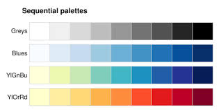
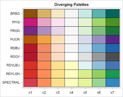
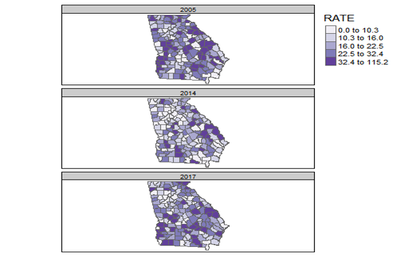
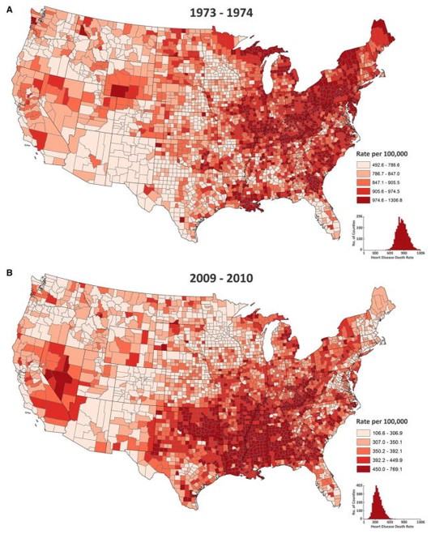
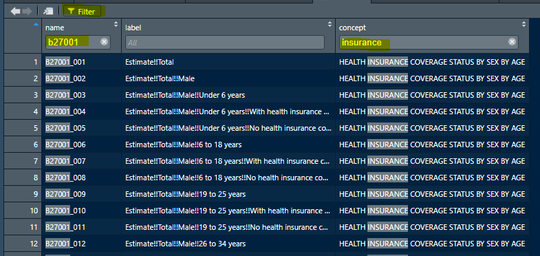

--- 
title: "EPI 563: Spatial Epidemiology, Fall 2021"
author: "Michael Kramer"
date: "Last updated: 2021-08-25"
site: bookdown::bookdown_site
output: bookdown::bs4_book
documentclass: book
bibliography: [book.bib]
biblio-style: apalike
link-citations: yes
github-repo: mkram01/EPI563-SpatialEPI
description: |
  This is the course text and notes for Concepts and Applications in Spatial Epidemiology (EPI 563).
---

# How to use this eBook {-}


\begin{center}\includegraphics[width=0.5\linewidth]{images/John-Snows-cholera-map-of-009} \end{center}


Welcome to *Concepts & Applications in Spatial Epidemiology (EPI 563)*! This eBook is one of several sources of information and support for your progress through the semester. For an overview of the course, expectations, learning objectives, assignments, and grading, please review the full course syllabus on Canvas. This eBook serves to provide a *'jumping off point'* for the content to be covered each week. Specifically, the content herein will introduce key themes, new vocabulary, and provide some additional detail that is complementary to the *asynchronous* (pre-recorded) video lectures, and foundational to the *synchronous* (in class) work. 

## Strategy for using this eBook {-}

There is a separate *module* or *chapter* for each week's content. In general, the content within each week's section is divided into two sections focusing on **spatial thinking** and **spatial analysis**. This dichotomy does not always hold, but in broad terms you can expect these sections to be more specific to content in class on *Tuesday* versus *Thursday* respectively.

* *Spatial thinking for epidemiology*: This section introduces vocabulary, concepts, and themes that are important to the incorporation of spatialized or geo-referenced data into epidemiologic work. At a minimum, plan to read this content *prior to class Tuesday*, although you will likely benefit from reading both sections before Tuesday.
* *Spatial analysis for epidemiology*: This section is more focused on data management, visualization, spatial statistics, and interpretation. This content is relevant for our work together on Tuesday's, but is essential for successful work in the Thursday lab activities. 


Throughout the book some concepts or ideas may be highlighted with *call-out blocks*. 

:::{.rmdcaution data-latex="{caution}"}
This block denotes a potential pitfall or area of caution.
:::

:::{.rmdnote data-latex="{note}"}
This block denotes an additional bit of information or additional idea to *note* about the topic at hand.
:::

:::{.rmdtip data-latex="{tip}"}
This block denotes a *tip* or advice for best practices or efficiency.
:::

Please note that I will be continually updating the eBook throughout the semester, so if you choose to download, please double-check the **Last updated** date (in colored bar at bottom of screen) to be sure you have the most recent version.

 

  
This eBook is licensed under the [Creative Commons Attribution-NonCommercial-ShareAlike 4.0 International License](http://creativecommons.org/licenses/by-nc-sa/4.0/). 


<!--chapter:end:index.Rmd-->

# (PART) Getting ready... {-}


# Software installation {-}

The information in this module follows on the pre-class video on setting up `R` and `RStudio` on your computer. 

## Installing `R` on your computer {-}

As of August 2021, the most up-to-date version of `R` is 4.1.1. The *R Project for Statistical Computing* are continually working to update and improve `R`, and as a result there are new versions 1-2 times per year. 


If you already have `R` installed, you can open the console and check your current version by doing this: `R.Version()$version.string`

If you do not have `R` or have an older version than that listed above, you can install `R` by going to the `R` repository: https://www.r-project.org/. Note that there are many 'mirrors' or servers where the software is stored. Generally it is wise to select one that is geographically close to you, although any should work in theory. One mirror that is relatively close to Atlanta is here: http://archive.linux.duke.edu/cran/  


## Installing *RStudio* on your computer {-}

R-Studio is one of several *integrated development environments* (IDE) for working in `R`. That means it is a *wrapper* around the core `R` functionality that makes coding and project work in `R` much easier than it would be without. We *develop* projects or analyses using `R` within an IDE such as R-Studio. Using R-Studio lets us have robust code-editing and debugging, code syntax highlighting (e.g. coloring different words according to their use, and identifying possible errors), and some assistance with file management, working in larger projects, and outputting results. 

The current version of RStudio  1.4.1717. If you do not have RStudio or have a version older than 1.2 please install/update.

**TO INSTALL**: go to https://www.rstudio.com/products/rstudio/download/   

**TO UPDATE**: Open RStudio and go to Help Menu and choose 'Check for Updates'

* [R-Studio Cheatsheat](https://github.com/rstudio/cheatsheets/raw/master/rstudio-ide.pdf) provides a quick reference guide for many of the ways that R-Studio makes your work with `R` easier.

# Installing packages for this course {-}

While base `R` has a great deal of essential functionality, most of the power of `R` comes from the rapidly growing list of user-created and contributed 'packages'. A package is simply a bundle of functions and tools, sometimes also including example datasets, basic documentation, and even tutorial 'vignettes'.  You can see all the official `R` packages by going here: https://cran.r-project.org/web/packages/. 

The most common way to install package in `R` is with the `install.packages()` command.  For instance to install the package `ggplot2` you do this:

`install.packages("ggplot2")`

Remember that you only need to install a package once (although you may have to update packages occasionally -- see the green Update button in the Packages tab in R Studio). When you want to actually *use* a package (for example `ggplot2`) you call it like this:

`library(ggplot2)`


If your call to `library()` is working, nothing visible happens. However if you see errors, they might be because your package is out of date (and thus needs to be updated/reinstalled), or because some important *dependencies* are missing. Dependencies are other packages on which this package depends. Typically these are installed by default, but sometimes something is missing. If so, simply install the missing package and then try calling `library(ggplot2)` again. 

:::{.rmdnote data-latex="{note}"}
Notice that for the function `install.packages('yourPackage')` you **must use quotes** around the package name. In contrast for the function `library(youPackage)` you **do not use quotes**. 
:::


:::{.rmdcaution data-latex="{caution}"}

As you submit each installation request, note the output in your R console. If you get a warning that says installation was not possible because you are missing a package *'namespace'*, that suggests you are missing a dependency (e.g. something the main package needs to work correctly). Try installing the package mentioned in the error. If you have trouble, reach out to the TA's!

:::


## Installing `Rtools40` (Windows Only) {-}

While **most** packages can be installed as mentioned above (e.g. using `install.packages()`), there are instances where an installation requires a more complex '*unpacking*' of the course code or installation from github. Mac OS and Unix have the capability of doing this, but on a Windows machine you may require additional *tools*.  Luckily there is a package for that! It is called `Rtools40`, and you should install that **before** you install the packages below.


If you are running Windows, navigate to this website: https://cran.r-project.org/bin/windows/Rtools/ and follow the instructions. 

## Installing packages used for general data science {-}

For the rest of this page, copy and paste the provided code in order to install packages necessary for this course. Notice if you hover to the right of a code-chunk in the html version of the eBook, you will see a *copy* icon for quick copying and pasting.

:::{.rmdtip data-latex="{tip}"}

Although you are copying and pasting the code, take a moment to look at the output. Did you get any error messages that a package did not install? If so, re-check the code or try again. 

:::

These packages will support some of our general work in `R`:

* `rmarkdown` allows the creation of mixed output documents that combine code, documentation and results in a single, readable format. 
* The packages `tinytex` and `knitr` are necessary for creating the `R` documents including PDF output that will be required for submitting assignments. 
* We will use many data manipulation tools from the `tidyverse`.  You can learn more about the `tidyverse` here: https://tidyverse.tidyverse.org/, and you can see applications of `tidyverse` packages in the [R for Epidemiologists Handbook](https://epirhandbook.com/index.html). The `tidyverse` is actually a collection of data science tools including the visualization/plotting package `ggplot2` and the data manipulation package `dplyr`. For that reason, when you `install.packages('tidyverse')` below, you are actually installing *multiple* packages!  
* The packages `here` and `pacman` are utilities to help simplify file pathnames and package loading behavior.


```r
install.packages('tidyverse')   
install.packages(c('pacman', 'here'))
install.packages(c('tinytex', 'rmarkdown', 'knitr')) 
tinytex::install_tinytex()  
# this function installs the tinytex LaTex on your
#  computer which is necessary for rendering (creating) PDF's 
```


## Installing packages use for geographic data {-}

There are many ways to get the data we want for spatial epidemiology into `R`. Because we often (but don't always) use census geographies as aggregating units, and census populations as denominators, the following packages will be useful. They are designed to quickly extract both geographic boundary files (e.g. *'shapefiles'*) as well as attribute data from the US Census website via an API.  **NOTE**: For these to work you have to request a free Census API key.  Notice the `help()` function below to get instructions on how to do this.


```r
install.packages(c('tidycensus','tigris')) 

help('census_api_key','tidycensus')
```


## Installing packages used for spatial data manipulation & visualization {-}


This section installs a set of tools specific to our goals of importing, exporting, manipulating, visualizing, and analyzing spatial data. 

* The first line of packages have functions for defining, importing, exporting, and manipulating spatial data. 
* The second line has some tools we will use for visualizing spatial data (e.g. making maps!). 


```r
install.packages(c('sp', 'sf', 'rgdal', 'raster', 'RColorBrewer', 'rgeos', 'maptools', 'OpenStreetMap'))  
install.packages(c('tmap', 'tmaptools', 'ggmap', 'shinyjs', 'shiny', 'micromap')) 
```


## Installing packages used for spatial analysis {-}

Finally these are packages specifically to spatial analysis tasks we'll carry out.


```r
install.packages(c('spdep', 'CARBayes', 'sparr', 'spatialreg',  'DCluster', 'SpatialEpi'))
install.packages(c('GWmodel', 'spgwr') )
```


<!--chapter:end:00-software-setup.Rmd-->

# (PART) Weekly Modules {-}

# Locating Spatial Epidemiology

## Getting Ready

### Learning objectives


```{=latex}
 
  \providecommand{\huxb}[2]{\arrayrulecolor[RGB]{#1}\global\arrayrulewidth=#2pt}
  \providecommand{\huxvb}[2]{\color[RGB]{#1}\vrule width #2pt}
  \providecommand{\huxtpad}[1]{\rule{0pt}{#1}}
  \providecommand{\huxbpad}[1]{\rule[-#1]{0pt}{#1}}

\begin{table}[ht]
\begin{centerbox}
\begin{threeparttable}
\captionsetup{justification=centering,singlelinecheck=off}
\caption{(\#tab:learning-ob) Learning objectives by weekly module}
 \setlength{\tabcolsep}{0pt}
\begin{tabularx}{1\textwidth}{p{1\textwidth}}


\hhline{>{\huxb{255, 255, 255}{1}}-}
\arrayrulecolor{black}

\multicolumn{1}{!{\huxvb{255, 255, 255}{1}}p{1\textwidth}!{\huxvb{255, 255, 255}{1}}}{\cellcolor[RGB]{204, 204, 204}\hspace{6pt}\parbox[b]{1\textwidth-6pt-6pt}{\huxtpad{2pt + 1em}\raggedright \textbf{After this module you should be able to…}\huxbpad{2pt}}} \tabularnewline[-0.5pt]


\hhline{>{\huxb{255, 255, 255}{1}}-}
\arrayrulecolor{black}

\multicolumn{1}{!{\huxvb{255, 255, 255}{1}}p{1\textwidth}!{\huxvb{255, 255, 255}{1}}}{\cellcolor[RGB]{242, 242, 242}\hspace{6pt}\parbox[b]{1\textwidth-6pt-6pt}{\huxtpad{2pt + 1em}\raggedright Explain the potential role of spatial analysis for epidemiologic thinking and practice.\huxbpad{2pt}}} \tabularnewline[-0.5pt]


\hhline{>{\huxb{255, 255, 255}{1}}-}
\arrayrulecolor{black}

\multicolumn{1}{!{\huxvb{255, 255, 255}{1}}p{1\textwidth}!{\huxvb{255, 255, 255}{1}}}{\cellcolor[RGB]{230, 230, 230}\hspace{6pt}\parbox[b]{1\textwidth-6pt-6pt}{\huxtpad{2pt + 1em}\raggedright Produce simple thematic maps of epidemiologic data in R.\huxbpad{2pt}}} \tabularnewline[-0.5pt]


\hhline{>{\huxb{255, 255, 255}{1}}-}
\arrayrulecolor{black}
\end{tabularx}
\end{threeparttable}\par\end{centerbox}

\end{table}
 
```

### Additional Resources

* [Geocompution with R](https://geocompr.robinlovelace.net/) by Robin Lovelace. This will be a recurring 'additional resource' as it provides lots of useful insight and strategy for working with spatial data in `R`. I encourage you to browse it quickly now, but return often when you have qusetiona about how to handle geogrpahic data (especially of class `sf`) in `R`. 
* [A basic introduction to the  `ggplot2` package](https://bookdown.org/agrogankaylor/quick-intro-to-ggplot2/quick-intro-to-ggplot2.html). This is just one of dozens of great online resources introducing the *grammar of graphics* approach to plotting in `R`. 
* [A basic introduction to the `tmap` package](https://tlorusso.github.io/geodata_workshop/tmap_package#:~:text=The%20tmap%20package%20is%20a,as%20choropleths%20and%20bubble%20maps.) This is also only one of many introductions to the `tmap` mapping package. `tmap` builds on the *grammar of graphics* philosophy of `ggplot2`, but brings a lot of tools useful for thematic mapping!
* [R for SAS users cheat sheet](https://github.com/rstudio/cheatsheets/raw/master/sas-r.pdf)

### Important Vocabulary


```{=latex}
 
  \providecommand{\huxb}[2]{\arrayrulecolor[RGB]{#1}\global\arrayrulewidth=#2pt}
  \providecommand{\huxvb}[2]{\color[RGB]{#1}\vrule width #2pt}
  \providecommand{\huxtpad}[1]{\rule{0pt}{#1}}
  \providecommand{\huxbpad}[1]{\rule[-#1]{0pt}{#1}}

\begin{table}[ht]
\begin{centerbox}
\begin{threeparttable}
\captionsetup{justification=centering,singlelinecheck=off}
\caption{(\#tab:unnamed-chunk-2) Vocabulary for Week 1}
 \setlength{\tabcolsep}{0pt}
\begin{tabularx}{0.9\textwidth}{p{0.45\textwidth} p{0.45\textwidth}}


\hhline{>{\huxb{255, 255, 255}{1}}->{\huxb{255, 255, 255}{1}}-}
\arrayrulecolor{black}

\multicolumn{1}{!{\huxvb{255, 255, 255}{1}}p{0.45\textwidth}!{\huxvb{255, 255, 255}{1}}}{\cellcolor[RGB]{84, 153, 199}\hspace{6pt}\parbox[b]{0.45\textwidth-6pt-2pt}{\huxtpad{2pt + 1em}\raggedright \textbf{\textcolor[RGB]{255, 255, 255}{Term}}\huxbpad{2pt}}} &
\multicolumn{1}{p{0.45\textwidth}!{\huxvb{255, 255, 255}{1}}}{\cellcolor[RGB]{84, 153, 199}\hspace{2pt}\parbox[b]{0.45\textwidth-2pt-6pt}{\huxtpad{2pt + 1em}\raggedright \textbf{\textcolor[RGB]{255, 255, 255}{Definition}}\huxbpad{2pt}}} \tabularnewline[-0.5pt]


\hhline{>{\huxb{255, 255, 255}{1}}->{\huxb{255, 255, 255}{1}}-}
\arrayrulecolor{black}

\multicolumn{1}{!{\huxvb{255, 255, 255}{1}}p{0.45\textwidth}!{\huxvb{255, 255, 255}{1}}}{\cellcolor[RGB]{212, 230, 241}\hspace{6pt}\parbox[b]{0.45\textwidth-6pt-2pt}{\huxtpad{2pt + 1em}\raggedright \textbf{Data, attribute}\huxbpad{2pt}}} &
\multicolumn{1}{p{0.45\textwidth}!{\huxvb{255, 255, 255}{1}}}{\cellcolor[RGB]{212, 230, 241}\hspace{2pt}\parbox[b]{0.45\textwidth-2pt-6pt}{\huxtpad{2pt + 1em}\raggedright Nonspatial information about a geographic feature in a GIS, usually stored in a table and linked to the feature by a unique identifier. For example, attributes of a county might include the population size, density, and birth rate for the resident population\huxbpad{2pt}}} \tabularnewline[-0.5pt]


\hhline{>{\huxb{255, 255, 255}{1}}->{\huxb{255, 255, 255}{1}}-}
\arrayrulecolor{black}

\multicolumn{1}{!{\huxvb{255, 255, 255}{1}}p{0.45\textwidth}!{\huxvb{255, 255, 255}{1}}}{\cellcolor[RGB]{169, 204, 227}\hspace{6pt}\parbox[b]{0.45\textwidth-6pt-2pt}{\huxtpad{2pt + 1em}\raggedright \textbf{Data, geometry}\huxbpad{2pt}}} &
\multicolumn{1}{p{0.45\textwidth}!{\huxvb{255, 255, 255}{1}}}{\cellcolor[RGB]{169, 204, 227}\hspace{2pt}\parbox[b]{0.45\textwidth-2pt-6pt}{\huxtpad{2pt + 1em}\raggedright Spatial information about a geogrpahic feature. This could include the x, y coordinates for points or for vertices of lines or polygons, or the cell coordinates for raster data\huxbpad{2pt}}} \tabularnewline[-0.5pt]


\hhline{>{\huxb{255, 255, 255}{1}}->{\huxb{255, 255, 255}{1}}-}
\arrayrulecolor{black}

\multicolumn{1}{!{\huxvb{255, 255, 255}{1}}p{0.45\textwidth}!{\huxvb{255, 255, 255}{1}}}{\cellcolor[RGB]{212, 230, 241}\hspace{6pt}\parbox[b]{0.45\textwidth-6pt-2pt}{\huxtpad{2pt + 1em}\raggedright \textbf{Datum}\huxbpad{2pt}}} &
\multicolumn{1}{p{0.45\textwidth}!{\huxvb{255, 255, 255}{1}}}{\cellcolor[RGB]{212, 230, 241}\hspace{2pt}\parbox[b]{0.45\textwidth-2pt-6pt}{\huxtpad{2pt + 1em}\raggedright The reference specifications of a measurement system, usually a system of coordinate positions on a surface (a horizontal datum) or heights above or below a surface (a vertical datum)\huxbpad{2pt}}} \tabularnewline[-0.5pt]


\hhline{>{\huxb{255, 255, 255}{1}}->{\huxb{255, 255, 255}{1}}-}
\arrayrulecolor{black}

\multicolumn{1}{!{\huxvb{255, 255, 255}{1}}p{0.45\textwidth}!{\huxvb{255, 255, 255}{1}}}{\cellcolor[RGB]{169, 204, 227}\hspace{6pt}\parbox[b]{0.45\textwidth-6pt-2pt}{\huxtpad{2pt + 1em}\raggedright \textbf{Geographic coordinate system}\huxbpad{2pt}}} &
\multicolumn{1}{p{0.45\textwidth}!{\huxvb{255, 255, 255}{1}}}{\cellcolor[RGB]{169, 204, 227}\hspace{2pt}\parbox[b]{0.45\textwidth-2pt-6pt}{\huxtpad{2pt + 1em}\raggedright A reference system that uses latitude and longitude to define the locations of points on the surface of a sphere or spheroid. A geographic coordinate system definition includes a datum, prime meridian, and angular unit\huxbpad{2pt}}} \tabularnewline[-0.5pt]


\hhline{>{\huxb{255, 255, 255}{1}}->{\huxb{255, 255, 255}{1}}-}
\arrayrulecolor{black}

\multicolumn{1}{!{\huxvb{255, 255, 255}{1}}p{0.45\textwidth}!{\huxvb{255, 255, 255}{1}}}{\cellcolor[RGB]{212, 230, 241}\hspace{6pt}\parbox[b]{0.45\textwidth-6pt-2pt}{\huxtpad{2pt + 1em}\raggedright \textbf{Geopackage}\huxbpad{2pt}}} &
\multicolumn{1}{p{0.45\textwidth}!{\huxvb{255, 255, 255}{1}}}{\cellcolor[RGB]{212, 230, 241}\hspace{2pt}\parbox[b]{0.45\textwidth-2pt-6pt}{\huxtpad{2pt + 1em}\raggedright A data storage format suitable for containing vector or raster data in a compact and portable file. It is an alternative (and in my opinion a superior alternative!) to ESRI shapefiles.\huxbpad{2pt}}} \tabularnewline[-0.5pt]


\hhline{>{\huxb{255, 255, 255}{1}}->{\huxb{255, 255, 255}{1}}-}
\arrayrulecolor{black}

\multicolumn{1}{!{\huxvb{255, 255, 255}{1}}p{0.45\textwidth}!{\huxvb{255, 255, 255}{1}}}{\cellcolor[RGB]{169, 204, 227}\hspace{6pt}\parbox[b]{0.45\textwidth-6pt-2pt}{\huxtpad{2pt + 1em}\raggedright \textbf{Projection}\huxbpad{2pt}}} &
\multicolumn{1}{p{0.45\textwidth}!{\huxvb{255, 255, 255}{1}}}{\cellcolor[RGB]{169, 204, 227}\hspace{2pt}\parbox[b]{0.45\textwidth-2pt-6pt}{\huxtpad{2pt + 1em}\raggedright A method by which the curved surface of the earth is portrayed on a flat surface. This generally requires a systematic mathematical transformation of the earth's graticule of lines of longitude and latitude onto a plane. Some projections can be visualized as a transparent globe with a light bulb at its center (though not all projections emanate from the globe's center) casting lines of latitude and longitude onto a sheet of paper. Generally, the paper is either flat and placed tangent to the globe (a planar or azimuthal projection) or formed into a cone or cylinder and placed over the globe (cylindrical and conical projections). Every map projection distorts distance, area, shape, direction, or some combination thereof\huxbpad{2pt}}} \tabularnewline[-0.5pt]


\hhline{>{\huxb{255, 255, 255}{1}}->{\huxb{255, 255, 255}{1}}-}
\arrayrulecolor{black}

\multicolumn{1}{!{\huxvb{255, 255, 255}{1}}p{0.45\textwidth}!{\huxvb{255, 255, 255}{1}}}{\cellcolor[RGB]{212, 230, 241}\hspace{6pt}\parbox[b]{0.45\textwidth-6pt-2pt}{\huxtpad{2pt + 1em}\raggedright \textbf{Spatial data model: raster}\huxbpad{2pt}}} &
\multicolumn{1}{p{0.45\textwidth}!{\huxvb{255, 255, 255}{1}}}{\cellcolor[RGB]{212, 230, 241}\hspace{2pt}\parbox[b]{0.45\textwidth-2pt-6pt}{\huxtpad{2pt + 1em}\raggedright A spatial data model that defines space as an array of equally sized cells arranged in rows and columns, and composed of single or multiple bands. Each cell contains an attribute value and location coordinates. Unlike a vector structure, which stores coordinates explicitly, raster coordinates are contained in the ordering of the matrix. Groups of cells that share the same value represent the same type of geographic feature (see Figure below)\huxbpad{2pt}}} \tabularnewline[-0.5pt]


\hhline{>{\huxb{255, 255, 255}{1}}->{\huxb{255, 255, 255}{1}}-}
\arrayrulecolor{black}

\multicolumn{1}{!{\huxvb{255, 255, 255}{1}}p{0.45\textwidth}!{\huxvb{255, 255, 255}{1}}}{\cellcolor[RGB]{169, 204, 227}\hspace{6pt}\parbox[b]{0.45\textwidth-6pt-2pt}{\huxtpad{2pt + 1em}\raggedright \textbf{Spatial data model: vector}\huxbpad{2pt}}} &
\multicolumn{1}{p{0.45\textwidth}!{\huxvb{255, 255, 255}{1}}}{\cellcolor[RGB]{169, 204, 227}\hspace{2pt}\parbox[b]{0.45\textwidth-2pt-6pt}{\huxtpad{2pt + 1em}\raggedright A coordinate-based data model that represents geographic features as points, lines, and polygons. Each point feature is represented as a single coordinate pair, while line and polygon features are represented as ordered lists of vertices. Attributes are associated with each vector feature, as opposed to a raster data model, which associates attributes with grid cells (see figure below)\huxbpad{2pt}}} \tabularnewline[-0.5pt]


\hhline{>{\huxb{255, 255, 255}{1}}->{\huxb{255, 255, 255}{1}}-}
\arrayrulecolor{black}

\multicolumn{1}{!{\huxvb{255, 255, 255}{1}}p{0.45\textwidth}!{\huxvb{255, 255, 255}{1}}}{\cellcolor[RGB]{212, 230, 241}\hspace{6pt}\parbox[b]{0.45\textwidth-6pt-2pt}{\huxtpad{2pt + 1em}\raggedright \textbf{Unit of analysis}\huxbpad{2pt}}} &
\multicolumn{1}{p{0.45\textwidth}!{\huxvb{255, 255, 255}{1}}}{\cellcolor[RGB]{212, 230, 241}\hspace{2pt}\parbox[b]{0.45\textwidth-2pt-6pt}{\huxtpad{2pt + 1em}\raggedright The unit or object that is measured, analyzed, and about which you wish to make inference. Examples of units of analysis are person, neighborhood, city, state, or hospital.\huxbpad{2pt}}} \tabularnewline[-0.5pt]


\hhline{>{\huxb{255, 255, 255}{1}}->{\huxb{255, 255, 255}{1}}-}
\arrayrulecolor{black}
\end{tabularx}
\end{threeparttable}\par\end{centerbox}

\end{table}
 
```


\includegraphics[width=0.8\linewidth]{images/data-models} 


## Spatial Thinking in Epidemiology

When first learning epidemiology, it can be difficult to distinguish between the concepts, theories, and purpose of epidemiology versus the skills, tools, and methods that we use to implement epidemiology. But these distinctions are foundational to our collective professional identity, and to the way we go about doing our work. For instance do you think of epidemiologists as data analysts, scientists, data scientists, technicians or something else? These questions are bigger than we can address in this class, but their importance becomes especially apparent when learning an area such as *spatial epidemiology*. This is because there is a tendency for discourse in spatial epidemiology to focus primarily on the *data* and the *methods* without understanding how each of those relate to the *scientific questions* and *health of population* for which we are ultimately responsible. Distinguishing these threads is an overarching goal of this course, even as we learn the data science and spatial analytic tools.

One quite simplistic but important example of how our questions and methods are inter-related is apparent when we think of  **data**. Data is central to quantitative analysis, including epidemiologic analysis. So how is *data* different in *spatial* epidemiology? 

The first thing that might come to mind is that we have explicitly geographic or spatial measures contained within our data. The content of the spatial data is distinct: the addition of geographic or spatial location may illuminate otherwise *aspatial* attributes. But even more fundamental than the content is thinking about the *unit of analysis*.  

It is likely that in many other examples in your epidemiology coursework, the explicit (or sometimes implicit) unit of analysis has been the individual person. Spatial epidemiology can definitely align with individual-level analysis. But as we'll see, common units we observe and measure in spatial epidemiology -- and therefore the units that compose much of our **data** -- are not individuals but instead are geographic units (e.g. census tract, county, state, etc) and by extension the *collection* or *aggregation* of all the individuals therein. This distinction in unit of analysis has important implications for other epidemiologic concerns including precision, bias, and ultimately for inference (e.g. the meaning we can make from our analysis), as we'll discuss throughout the semester.

One concrete implication of the above discussion is that you should always be able to answer a basic question about any dataset you wish to analyze: "*what does one row of data represent?*"  A row of data is one way to think of the *unit of analysis*, and often (but not always) in spatial epidemiology a row of data is a summary of the population contained by a geographic unit or boundary. Said another way it is an *ecologic summary* of the population. As stated above, this is only the most simplistic example of how and why it is important to not only learn the spatial statistics and methods, but to also maintain the perspective of epidemiology as a population health science. To advance public health we need good methods but we also need critical understanding of the populations we support, the data we analyze, and the conclusions we can reliably draw from our work.

As we move through the semester, I encourage you to dig deep into how methods work, but also to step back and ask questions like *"Why would I choose this method?"* or *"What question in epidemiology is this useful for?"* 


## Spatial Analysis in Epidemiology

### Spatial data storage formats

If you have worked with spatial or GIS data using ESRI's ArcMap, you will be familiar with what are called *shapefiles*.  This is one very common format for storing geographic data on computers. ESRI shapefiles are not actually a single file, but are anywhere from four to eight different files all with the same file name but different extensions (e.g. *.shp*, *.prj*, *.shx*, etc). Each different file (corresponding to an extension) contains a different portion of the data ranging from the geometry data, the attribute data, the projection data, an index connecting it all together, etc. 

What you may not know is that shapefiles are not the only (and in my opinion **definitely not the best**) way to store geographic data. In this class I recommend storing data in a format called *geopackages* indicated by the `.gpkg` extension. *Geopackages* are an open source format that were developed to be functional on mobile devices. They are useful when we are storing individual files in an efficient and compact way.  To be clear, there are many other formats and I make no claim that *geopackages* are the ultimate format; they just happen to meet the needs for this course, and for much of the work of spatial epidemiologists. It is worth noting that many GIS programs including ArcMap and QGIS can both read and write the *geopackage* format; so there is no constraint or limitation in terms of software when data are stored in `.gpkg` format.
    

### Representing spatial data in `R`

The work in this course assumes that you are a *basic `R` user*; you do not need to be expert, but I assume that you understand data objects (e.g. `data.frame`, `list`, `vector`), and basic operations including subsetting by index (e.g. using square brackets to extract or modify information: `[]`), base-R plotting, and simple modeling. If you **are not familiar with `R`**, you will need to do some quick self-directed learning. 

:::{.rmdtip data-latex="{tip}"}

Here are some good online resources for R skills, and the instructor and TA's can point you to additional resources as needed:

* [The Epidemiologist R Handbook](https://epirhandbook.com/index.html)
* [R for Data Science](https://r4ds.had.co.nz/introduction.html), particularly the introductory chapters
* [R Tutorial](http://www.r-tutor.com/r-introduction)

:::

Just as our conceptualization of, or thinking about *data* in spatial epidemiology requires some reflection, the actual structure and representation of that data with a computer tool such as `R` also requires some attention. Specifically, spatial data in `R` is not exactly like the conventional *aspatial* epidemiologic data that is often arranged as a rectangular `data.frame` (e.g. like a spreadsheet where *rows are observations* and *columns are variables*). While spatial data are more complex than just a spreadsheet, it *does not* need to be as complex as spatial data in software platforms like ESRI's ArcMap. 

To be *spatial*, a dataset must have a representation of geography, spatial location, or spatial relatedness, and that is most commonly done with either a *vector* or *raster* data model (see description above in vocabulary). Those spatial or geographic representations must be stored on your computer and/or held in memory, hopefully with a means for relating or associating the individual locations with their corresponding attributes. For example we want to know the attribute (e.g. the count of deaths for a given place), and the location of that place, and ideally we want the two connected together.

Over the past 10+ years, `R` has increasingly been used to analyze and visualize spatial data. Early on, investigators tackling the complexities of spatial data analysis in `R` developed a number of ad hoc, one-off approaches to these data. This worked in the short term for specific applications, but it created new problems as users needed to generalize a method to a new situation, or chain together steps. In those settings it was not uncommon to convert a dataset to multiple different formats to accomplish a task sequence; this resulted in convoluted and error-prone coding, and lack of transparency in analysis.

An eventual response to this early tumult was a thoughtful and systematic approach to defining a *class of data* that tackled the unique challenges of spatial data in `R`. Roger Bivand, Edzer Pebesma and others developed the `sp` package which defined spatial data classes, and provided functional tools to interact with them. The `sp` package defined specific data classes to hold points, lines, and polygons, as well as raster/grid data; each of these data classes can contain geometry only (these have names like `SpatialPoints` or `SpatialPolygons`) or could contain geometry plus related data attributes (these have names like `SPatialPointsDataFrame` or `SpatialPolygonsDataFrame`). Each spatial object can contain all the information spatial data might include: the spatial extent (min/max x, y values), the coordinate system or spatial projection, the geometry information, the attribute information, etc. 

Because of the flexibility and power of the `sp*` class of objects, they became a standard up until the last few years.  Interestingly, it was perhaps the sophistication of the `sp*` class that began to undermine it. `sp*` class data was well-designed from a programming point of view, but was still a little cumbersome (and frankly confusing) for more applied analysts and new users. Analysis in *spatial epidemiology* is not primarily about computer programming, but about producing transparent and reliable data pipelines to conduct valid, reliable, and reproducible analysis. Thus epidemiologists, and other data scientists, desired spatial tools that could be incorporated into the growing toolbox of data science tools in `R`. 


These calls for a more user-friendly and intuitive approach to spatial data led the same team (e.g. Bivand, Pebesma, others) to develop the *Simple Features* set of spatial data classes for `R`. Loaded with the `sf` package, this data format has quickly become the standard for handling spatial data in `R`.  The power of the `sf` class, as discussed below, is that it makes *spatial data* behave like *rectangular data* and thus makes it amenable to manipulation using any tool that works on `data.frame` or `tibble` objects. Recognizing that many users and functions prefer the older `sp*` objects, the `sf` package includes a number of utility functions for easily converting back and forth. 

__In this class we will use `sf*` class objects as the preferred data class, but because some of the tools we'll learn still require `sp*` we will occasionally go back and forth.__

`sf*` data classes are designed to hold all the essential spatial information (projection, extent, geometry), but do so with an easy to evaluate `data.frame` format that integrates the attribute information and the geometry information together. The result is more intuitive sorting, selecting, aggregating, and visualizing. 


### Benefits of `sf` data classes


As Robin Lovelace writes in his online eBook, [Gecomputation in R](https://geocompr.robinlovelace.net/), `sf` data classes offer an approach to spatial data that is compatible with QGIS and PostGIS, important non-ESRI open source GIS platforms, and `sf` functionality compared to `sp` provides:

1. Fast reading and writing of data
2. Enhanced plotting performance
3. `sf` objects can be treated as data frames in most operations
4. `sf` functions can be combined using `%>%` pipe operator and works well with the `tidyverse` collection of `R` packages ([see Tips for using `dplyr`](#dplyr) for examples)
5. `sf` function names are relatively consistent and intuitive (all begin with `st_`)


### Working with spatial data in `R`

Here and in lab, one example dataset we will use, called `ga.mvc` quantifies the counts and rates of death from motor vehicle crashes in each of Georgia's $n=159$ counties. The dataset is *vector* in that it represents counties as polygons with associated attributes (e.g. the mortality information, county names, etc). 

#### Importing spatial data into `R`

It is important to distinguish between two kinds of data formats.  There is a way that data is *stored on a computer hard drive*, and then there is a way that data is organized and managed *inside a program* like `R`. The *shapefiles* (`.shp`) popularized by ESRI/ArcMap is an example of a format for storing spatial data on a hard drive.  In contrast, the discussion above about the `sf*` and `sp*` data classes refer to how data is organized *inside `R`*.  

Luckily, regardless of how data is *stored* on your computer, it is possible to import almost any format into `R`, and once inside `R` it is possible to make it into either the `sp*` or `sf*` data class. That means if you receive data as a `.shp` shapefile, as a `.gpkg` geopackage, or as a `.tif` raster file, each can be easily imported.

All `sf` functions that act on spatial objects begin with the prefix `st_`.  Therefore to import (read) data we will use `st_read()`. This function determines **how** to import the data based on the extension of the file name you specify. Look at the help documentation for `st_read()`. Notice that the first argument `dsn=`, might be a complete file name (e.g. `myData.shp`), or it might be a folder name (e.g. `mygeodatabase.gdb`). So if  you had a the motor vehicle crash data saved as both a shapefile (`mvc.shp`, which is actually six different files on your computer), and as a geopackage (`mvc.gpkg`) you can read them in like this:


```r
# this is the shapefile
mvc.a <- st_read('GA_MVC/ga_mvc.shp')

# this is the geopackage
mvc.b <- st_read('GA_MVC/ga_mvc.gpkg')
```


We can take a look at the defined data class of the imported objects within `R`:


```r
class(mvc.a)
```

```
## [1] "sf"         "data.frame"
```

```r
class(mvc.b)
```

```
## [1] "sf"         "data.frame"
```

Notice how the two objects have the same *class* (e.g. type of data stored within `R`), even though they were two different kinds of files stored on the computer: one was a shapefile and one a geopackage. This is because `st_read()` can automatically detect the storage format based on the extension, and use the appropriate interpreter to import that data. This is nice because it means you can bring many types of spatial data into `R`!


You will also notice that when we examined the `class()` of each object, they are each classified as **both** `sf` **and** `data.frame` class. That is incredibly important, and it speaks to an elegant simplicity of the `sf*` data classes! That it is classified as `sf` is perhaps obvious because it is a *spatial* object; but the fact that each object is *also classified* as `data.frame` means that we can treat the object for the purposes of data management,  manipulation and analysis as a relatively simple-seeming object: a rectangular `data.frame`.  How does that work? We will explore this more in lab but essentially each dataset has rows (observations) and columns (variables). 

We can see the variable/column names like this:


```r
names(mvc.a)
```

```
## [1] "GEOID"      "NAME"       "MVCRATE_17" "geometry"
```

```r
names(mvc.b)
```

```
## [1] "GEOID"      "NAME"       "MVCRATE_17" "geom"
```

We can see that each dataset has the same *attribute* variables (e.g. `GEOID`, `NAME`, `MVCRATE_17`), and then a final column called `geometry` in one and called `geom` in another. 

These geometry columns are different from your usual run-of-the-mill column variables in that they don't hold a single value.  Instead, each *'cell'* in those columns actually contains an embedded list of $x,y$ coordinates defining the vertices of the polygons for each of Georgia's counties. So all of the *spatial location* information for each row is contained in that single variable called `geom` (or alternately, `geometry`).

Another way to learn about an `sf` object is to use the `head()` function. In addition to displaying the top few rows of data (which is the typical behavior of the `head()` function), for `sf` objects `head()` will also print some of the important *metadata* about the file.


```r
head(mvc.a)
```

```
## Simple feature collection with 6 features and 3 fields
## Geometry type: MULTIPOLYGON
## Dimension:     XY
## Bounding box:  xmin: -84.64195 ymin: 31.0784 xmax: -82.04858 ymax: 34.49172
## Geodetic CRS:  WGS 84
##   GEOID                     NAME MVCRATE_17                       geometry
## 1 13001  Appling County, Georgia   53.99276 MULTIPOLYGON (((-82.55069 3...
## 2 13003 Atkinson County, Georgia   35.96260 MULTIPOLYGON (((-83.141 31....
## 3 13005    Bacon County, Georgia    0.00000 MULTIPOLYGON (((-82.62819 3...
## 4 13007    Baker County, Georgia   31.25000 MULTIPOLYGON (((-84.64166 3...
## 5 13009  Baldwin County, Georgia   28.94936 MULTIPOLYGON (((-83.42674 3...
## 6 13011    Banks County, Georgia   32.19921 MULTIPOLYGON (((-83.66862 3...
```


:::{.rmdnote data-latex="{note}"}

To summarize, `sf` within `R` is powerful because:

1. We are not limited to how data arrive to us. If you acquire data (from the web, a colleague, etc) as a shapefile, a geopackage, a raster or other formats, they can all be imported into `R`.
2. Once inside of `R` (and stored in `sf` data objects), we can treat the datasets almost as if they were aspatial, rectangular datasets. That means we could use subsetting, filtering, recoding, merging, and aggregating *without losing the spatial information*! 
:::

#### Exporting spatial data from `R`

While importing is often the primary challenge with spatial data and `R`, it is not uncommon that you might modify or alter a spatial dataset and wish to save it for future use, or to write it out to disk to share with a colleague. Luckily the `sf` package has the same functionality to write an `sf` spatial object to disk in a wide variety of formats including *shapefiles* (`.shp`) and *geopackages* (`.gpkg`). Again, `R` uses the extension you specify in the filename to determine the target format.


```r
# Write the file mvc to disk as a shapefile format
st_write(mvc, 'GA_MVC/ga_mvc_v2.shp')

# Write the file mvc to disk as a geopackage format
st_write(mvc, 'GA_MVC/ga_mvc_v2.gpkg')
```

 
### Basic visual inspection/plots

What if you want to **see** your spatial data?  In base-R there is a powerful function called `plot()` that can be used to create easy or incredibly complex visualizations or graphical representation of data. In the package `sf`, the functionality of `plot()` is extended to handle the uniqueness of spatial data. That means that if you call `plot()` on a spatial object **without having loaded** `sf`, the results will be different than if `plot()` called **after loading** `sf`. 

When you `plot()` with `sf`, by default it will try to make a map **for every variable in the data frame**! Try it once. If this is not what you want (it usually *is not*), you can force it to only plot *some* variables by providing a vector of variable names.


```r
plot(mvc) # this plots a panel for every column - or actually the first 10 columns
```

```
## Warning: plotting the first 10 out of 17 attributes; use max.plot = 17 to plot
## all
```

<!-- --> 


```r
plot(mvc['MVCRATE_05']) # this plots only a single variable, the MVC mortality rate for 2005
```

<!-- --> 

```r
plot(mvc[c('MVCRATE_05', 'MVCRATE_17')]) # this plots two variables: MVC rate in 2005 & 2017
```

<!-- --> 


Sometimes you want to know something about the spatial size, extent, or shape of your data. To do this you can easily plot only the geometry of the spatial object (e.g. not attributes). Here are two approaches to quickly plot the geometry:


```r
plot(st_geometry(mvc)) # st_geometry() returns the geom information to plot
```


```r
plot(mvc$geom)  # this is an alternative approach...directly plot the 'geom' column
```

<!-- --> 


### Working with CRS and projection

Maps are used to describe the geographical or spatial location of particular objects as a representation of where those things are on planet Earth. Most maps are printed on paper or screens. In other words, maps identify locations from somewhere on planet earth and represent them as flat.

But the world does not have latitude or longitude lines painted on the ground, and the earth is not flat! Instead the earth is nearly spherical (really it is a *geoid*) and there is no universal reference for where to start measuring. 

For these two reasons, all maps require at a minimum a *coordinate reference system* (CRS) to define how the numbers in our coordinates relate to actual places. In addition most maps are best interpreted after formally *projecting* the data to account for the artifact induced by pretending earth is flat. 

The most unambiguous way to describe a CRS and/or projection is by using the **EPSG** code, which stands for *European Petroleum Survey Group*. This consortium has standardized hundreds of projection definitions in a manner adopted by several `R` packages including `rgdal` and `sf`. 


A given dataset already has a CRS (and possibly a projection). If CRS and projection information was contained in the original file you imported, it will *usually* be maintained when you use `st_read()`.  However sometimes it is missing and you must first find it. Once it is known, you might choose to *change* or *transform* the CRS or projection for a specific purpose. We will discuss this further in class.

:::{.rmdcaution data-latex="{caution}"}

If there is NO CRS information imported it is critical that you find out the CRS information from the data source!
:::

This course is not a GIS course (e.g. it is assumed you have already had some exposure to geographic information systems generally), and learning about the theory and application of coordinate reference systems and projections is not our primary purpose this semester. However some basic knowledge *is necessary* for successfully working with spatial epidemiologic data. Here are several resources you should peruse to learn more about CRS, projections, and EPSG codes:

* [A useful overview/review of coordinate reference systems in `R`](https://www.nceas.ucsb.edu/sites/default/files/2020-04/OverviewCoordinateReferenceSystems.pdf)
* [Robin Lovelace's Geocompuation in R on projections with `sf`](https://geocompr.robinlovelace.net/reproj-geo-data.html)
* [EPSG website:](https://epsg.io/) This link is to a searchable database of valid ESPG codes
* [Here are some useful EPSG codes](https://guides.library.duke.edu/r-geospatial/CRS)


\begin{figure}
\includegraphics[width=0.5\linewidth]{images/compare-crs} \caption{Comparing CRS}(\#fig:unnamed-chunk-14)
\end{figure}


The choice of CRS and/or projection has a substantial impact on how the rendered map looks, as is evident in the figure above ([source of image](https://datacarpentry.org/organization-geospatial/03-crs/)).

We already saw the CRS/projection information of the `mvc` object when we used the `head()` function above; it was at the top and read `WGS 84`. 

Recall there are two main types of CRS: purely **geographic** which is to say coordinate locations are represented as *latitude* and *longitude* degrees; and **projected** which means the coordinate values have been transformed for representation of the spherical geoid onto a planar (Euclidean) coordinate system. `WGS 84` is a ubiquitous geographic coordinate system common to boundary files retrieved from the U.S. Census bureau. 

An important question when you work with a spatial dataset is to understand whether it is primarily a geographic or projected CRS, and if so which one. 


```r
st_is_longlat(mvc)
```

```
## [1] TRUE
```

This quick logical test returns `TRUE` or `FALSE` to answer the question *"Is the `sf` object simply a longitude/latitude geographic CRS?"*. The answer in this case is `TRUE` because `WGS 84` is a geographic (longlat) coordinate system. But what if it were `FALSE` or we wanted to know more about the CRS/projection?


```r
st_crs(mvc)
```

```
## Coordinate Reference System:
##   User input: WGS 84 
##   wkt:
## GEOGCRS["WGS 84",
##     DATUM["World Geodetic System 1984",
##         ELLIPSOID["WGS 84",6378137,298.257223563,
##             LENGTHUNIT["metre",1]]],
##     PRIMEM["Greenwich",0,
##         ANGLEUNIT["degree",0.0174532925199433]],
##     CS[ellipsoidal,2],
##         AXIS["geodetic latitude (Lat)",north,
##             ORDER[1],
##             ANGLEUNIT["degree",0.0174532925199433]],
##         AXIS["geodetic longitude (Lon)",east,
##             ORDER[2],
##             ANGLEUNIT["degree",0.0174532925199433]],
##     USAGE[
##         SCOPE["Horizontal component of 3D system."],
##         AREA["World."],
##         BBOX[-90,-180,90,180]],
##     ID["EPSG",4326]]
```

This somewhat complicated looking output is a summary of the CRS stored with the spatial object. There are two things to note about this output:

* At the top, the *User input* is `WGS 84`
* At the bottom of the section labeled `GEOGCRS` it says `ID["EPSG",4326"]`

While there are literally hundreds of distinct EPSG codes describing different geographic and projected coordinate systems, for this semester there are three worth remembering: 

* __EPSG: 4326__ is a common geographic (unprojected or long-lat) CRS
* __EPSG: 3857__ is also called *WGS 84/Web Mercator*, and is the dominant CRS used by Google Maps
* __EPSG: 5070__ is the code for a projected CRS called *Albers Equal Area* which has the benefit of representing the visual area of maps in an equal manner.

Once the CRS/projection is clearly defined, you may choose to transform or *project* the data to a different system. The `sf` package has another handy function called `st_transform()` that takes in a spatial object (dtaaset) with one CRS and outputs that object *transformed* to a new CRS.


```r
# This uses the Albers equal area USA, 
mvc.aea <- st_transform(mvc, 5070)

# This uses the Web Mercator CRS (EPSG 3857) which is just barely different from EPSG 4326
mvc.wm <- st_transform(mvc, 3857)

# Now let's look at them side-by-side
plot(st_geometry(mvc), main = 'EPSG 4326')
plot(st_geometry(mvc.wm), main = 'Web Mercator (3857)')
plot(st_geometry(mvc.aea), main = 'Albers Equal Area (5070)')
```


<!-- --> 


Do you see the difference between the three? Because EPSG 4326 and 3857 are both unprojected (e.g. they are long/lat), they appear quite similar but are not identical. Albers Equal Area, on the other hand, is more distinct. In general we will prefer to use *'projected'* rather than *'unprojected'* (long/lat only) data for both visualization and analysis. That means that whenever you bring in a new dataset you will need to check the CRS and project or transform as desired. 


:::{.rmdnote data-latex="{note}"}

**Important:** It is important to distinguish between defining the current projection of data and the act of *projecting* or *transforming* data from one known system to a new CRS/projection. 

**We cannot transform data until we correctly define its current or original CRS/projection status.** The above function tells us what the current status is.  In some cases data do not have associated CRS information and this might be completely blank (for instance if you read in numerical $x,y$ points from a geocoding or GPS process). In those cases you can **set** the underlying CRS using `st_set_crs()` to define it, but this assumes you **know** what it is. There are two arguments to this function: the first is `x = objectName`, and the second is `value = xxx` where *'xxx'* is a valid EPSG code. 

:::


<!--chapter:end:01-locating-spatial-epi.Rmd-->

# Cartography for Epidemiology I

## Getting Ready

### Learning objectives


```{=latex}
 
  \providecommand{\huxb}[2]{\arrayrulecolor[RGB]{#1}\global\arrayrulewidth=#2pt}
  \providecommand{\huxvb}[2]{\color[RGB]{#1}\vrule width #2pt}
  \providecommand{\huxtpad}[1]{\rule{0pt}{#1}}
  \providecommand{\huxbpad}[1]{\rule[-#1]{0pt}{#1}}

\begin{table}[ht]
\begin{centerbox}
\begin{threeparttable}
\captionsetup{justification=centering,singlelinecheck=off}
\caption{(\#tab:learning-ob) Learning objectives by weekly module}
 \setlength{\tabcolsep}{0pt}
\begin{tabularx}{1\textwidth}{p{1\textwidth}}


\hhline{>{\huxb{255, 255, 255}{1}}-}
\arrayrulecolor{black}

\multicolumn{1}{!{\huxvb{255, 255, 255}{1}}p{1\textwidth}!{\huxvb{255, 255, 255}{1}}}{\cellcolor[RGB]{204, 204, 204}\hspace{6pt}\parbox[b]{1\textwidth-6pt-6pt}{\huxtpad{2pt + 1em}\raggedright \textbf{After this module you should be able to…}\huxbpad{2pt}}} \tabularnewline[-0.5pt]


\hhline{>{\huxb{255, 255, 255}{1}}-}
\arrayrulecolor{black}

\multicolumn{1}{!{\huxvb{255, 255, 255}{1}}p{1\textwidth}!{\huxvb{255, 255, 255}{1}}}{\cellcolor[RGB]{242, 242, 242}\hspace{6pt}\parbox[b]{1\textwidth-6pt-6pt}{\huxtpad{2pt + 1em}\raggedright Design a cartographic representation of epidemiologic data that is consistent with best practices in public health data visualization.\huxbpad{2pt}}} \tabularnewline[-0.5pt]


\hhline{>{\huxb{255, 255, 255}{1}}-}
\arrayrulecolor{black}

\multicolumn{1}{!{\huxvb{255, 255, 255}{1}}p{1\textwidth}!{\huxvb{255, 255, 255}{1}}}{\cellcolor[RGB]{230, 230, 230}\hspace{6pt}\parbox[b]{1\textwidth-6pt-6pt}{\huxtpad{2pt + 1em}\raggedright Apply data processing functions to accomplish foundational data management and preparation for spatial epidemiology (e.g. summarize, aggregate, combine, recode, etc)\huxbpad{2pt}}} \tabularnewline[-0.5pt]


\hhline{>{\huxb{255, 255, 255}{1}}-}
\arrayrulecolor{black}
\end{tabularx}
\end{threeparttable}\par\end{centerbox}

\end{table}
 
```

### Additional Resources

* [CDC Guidance for Cartography of Public Health Data (complements required reading)](https://www.cdc.gov/dhdsp/maps/gisx/resources/tips-creating-ph-maps.html )
* [When Maps Lie](https://www.citylab.com/design/2015/06/when-maps-lie/396761/) 
* [Color Brewer Website for color guidance in choropleth maps](http://colorbrewer2.org/#)


### Important Vocabulary


```{=latex}
 
  \providecommand{\huxb}[2]{\arrayrulecolor[RGB]{#1}\global\arrayrulewidth=#2pt}
  \providecommand{\huxvb}[2]{\color[RGB]{#1}\vrule width #2pt}
  \providecommand{\huxtpad}[1]{\rule{0pt}{#1}}
  \providecommand{\huxbpad}[1]{\rule[-#1]{0pt}{#1}}

\begin{table}[ht]
\begin{centerbox}
\begin{threeparttable}
\captionsetup{justification=centering,singlelinecheck=off}
\caption{(\#tab:unnamed-chunk-2) Vocabulary for Week 2}
 \setlength{\tabcolsep}{0pt}
\begin{tabularx}{0.9\textwidth}{p{0.45\textwidth} p{0.45\textwidth}}


\hhline{>{\huxb{255, 255, 255}{1}}->{\huxb{255, 255, 255}{1}}-}
\arrayrulecolor{black}

\multicolumn{1}{!{\huxvb{255, 255, 255}{1}}p{0.45\textwidth}!{\huxvb{255, 255, 255}{1}}}{\cellcolor[RGB]{84, 153, 199}\hspace{6pt}\parbox[b]{0.45\textwidth-6pt-2pt}{\huxtpad{2pt + 1em}\raggedright \textbf{\textcolor[RGB]{255, 255, 255}{Term}}\huxbpad{2pt}}} &
\multicolumn{1}{p{0.45\textwidth}!{\huxvb{255, 255, 255}{1}}}{\cellcolor[RGB]{84, 153, 199}\hspace{2pt}\parbox[b]{0.45\textwidth-2pt-6pt}{\huxtpad{2pt + 1em}\raggedright \textbf{\textcolor[RGB]{255, 255, 255}{Definition}}\huxbpad{2pt}}} \tabularnewline[-0.5pt]


\hhline{>{\huxb{255, 255, 255}{1}}->{\huxb{255, 255, 255}{1}}-}
\arrayrulecolor{black}

\multicolumn{1}{!{\huxvb{255, 255, 255}{1}}p{0.45\textwidth}!{\huxvb{255, 255, 255}{1}}}{\cellcolor[RGB]{212, 230, 241}\hspace{6pt}\parbox[b]{0.45\textwidth-6pt-2pt}{\huxtpad{2pt + 1em}\raggedright \textbf{Cartography}\huxbpad{2pt}}} &
\multicolumn{1}{p{0.45\textwidth}!{\huxvb{255, 255, 255}{1}}}{\cellcolor[RGB]{212, 230, 241}\hspace{2pt}\parbox[b]{0.45\textwidth-2pt-6pt}{\huxtpad{2pt + 1em}\raggedright The production of maps, including construction of projections, design, compilation, drafting, and reproduction\huxbpad{2pt}}} \tabularnewline[-0.5pt]


\hhline{>{\huxb{255, 255, 255}{1}}->{\huxb{255, 255, 255}{1}}-}
\arrayrulecolor{black}

\multicolumn{1}{!{\huxvb{255, 255, 255}{1}}p{0.45\textwidth}!{\huxvb{255, 255, 255}{1}}}{\cellcolor[RGB]{169, 204, 227}\hspace{6pt}\parbox[b]{0.45\textwidth-6pt-2pt}{\huxtpad{2pt + 1em}\raggedright \textbf{Choropleth map}\huxbpad{2pt}}} &
\multicolumn{1}{p{0.45\textwidth}!{\huxvb{255, 255, 255}{1}}}{\cellcolor[RGB]{169, 204, 227}\hspace{2pt}\parbox[b]{0.45\textwidth-2pt-6pt}{\huxtpad{2pt + 1em}\raggedright A type of thematic map in which areas are shaded or patterned in proportion to a statistical variable that represents an aggregate summary of a geographic characteristic within each area, such as population density, disease risk, or standardized mortality ratio\huxbpad{2pt}}} \tabularnewline[-0.5pt]


\hhline{>{\huxb{255, 255, 255}{1}}->{\huxb{255, 255, 255}{1}}-}
\arrayrulecolor{black}

\multicolumn{1}{!{\huxvb{255, 255, 255}{1}}p{0.45\textwidth}!{\huxvb{255, 255, 255}{1}}}{\cellcolor[RGB]{212, 230, 241}\hspace{6pt}\parbox[b]{0.45\textwidth-6pt-2pt}{\huxtpad{2pt + 1em}\raggedright \textbf{Color palette: diverging}\huxbpad{2pt}}} &
\multicolumn{1}{p{0.45\textwidth}!{\huxvb{255, 255, 255}{1}}}{\cellcolor[RGB]{212, 230, 241}\hspace{2pt}\parbox[b]{0.45\textwidth-2pt-6pt}{\huxtpad{2pt + 1em}\raggedright Diverging schemes allow the emphasis of a quantitative data display to be progressions outward from a critical midpoint of the data range. A typical diverging scheme pairs sequential schemes based on two different hues so that they diverge from a shared light color, for the critical midpoint, toward dark colors of different hues at each extreme\huxbpad{2pt}}} \tabularnewline[-0.5pt]


\hhline{>{\huxb{255, 255, 255}{1}}->{\huxb{255, 255, 255}{1}}-}
\arrayrulecolor{black}

\multicolumn{1}{!{\huxvb{255, 255, 255}{1}}p{0.45\textwidth}!{\huxvb{255, 255, 255}{1}}}{\cellcolor[RGB]{169, 204, 227}\hspace{6pt}\parbox[b]{0.45\textwidth-6pt-2pt}{\huxtpad{2pt + 1em}\raggedright \textbf{Color palette: qualitative}\huxbpad{2pt}}} &
\multicolumn{1}{p{0.45\textwidth}!{\huxvb{255, 255, 255}{1}}}{\cellcolor[RGB]{169, 204, 227}\hspace{2pt}\parbox[b]{0.45\textwidth-2pt-6pt}{\huxtpad{2pt + 1em}\raggedright Qualitative schemes use differences in hue to represent nominal differences, or differences in kind. The lightness of the hues used for qualitative categories should be similar but not equal. \huxbpad{2pt}}} \tabularnewline[-0.5pt]


\hhline{>{\huxb{255, 255, 255}{1}}->{\huxb{255, 255, 255}{1}}-}
\arrayrulecolor{black}

\multicolumn{1}{!{\huxvb{255, 255, 255}{1}}p{0.45\textwidth}!{\huxvb{255, 255, 255}{1}}}{\cellcolor[RGB]{212, 230, 241}\hspace{6pt}\parbox[b]{0.45\textwidth-6pt-2pt}{\huxtpad{2pt + 1em}\raggedright \textbf{Color palette: sequential}\huxbpad{2pt}}} &
\multicolumn{1}{p{0.45\textwidth}!{\huxvb{255, 255, 255}{1}}}{\cellcolor[RGB]{212, 230, 241}\hspace{2pt}\parbox[b]{0.45\textwidth-2pt-6pt}{\huxtpad{2pt + 1em}\raggedright Sequential data classes are logically arranged from high to low, and this stepped sequence of categories should be represented by sequential lightness steps. Low data values are usually represented by light colors and high values represented by dark colors. Transitions between hues may be used in a sequential scheme, but the light-to-dark progression should dominate the scheme.\huxbpad{2pt}}} \tabularnewline[-0.5pt]


\hhline{>{\huxb{255, 255, 255}{1}}->{\huxb{255, 255, 255}{1}}-}
\arrayrulecolor{black}

\multicolumn{1}{!{\huxvb{255, 255, 255}{1}}p{0.45\textwidth}!{\huxvb{255, 255, 255}{1}}}{\cellcolor[RGB]{169, 204, 227}\hspace{6pt}\parbox[b]{0.45\textwidth-6pt-2pt}{\huxtpad{2pt + 1em}\raggedright \textbf{Isopleth map}\huxbpad{2pt}}} &
\multicolumn{1}{p{0.45\textwidth}!{\huxvb{255, 255, 255}{1}}}{\cellcolor[RGB]{169, 204, 227}\hspace{2pt}\parbox[b]{0.45\textwidth-2pt-6pt}{\huxtpad{2pt + 1em}\raggedright A type of thematic map that uses contour lines or colors to indicate areas with similar regional aspects. It typically symbolizes the underlying statistic as varying continuously in space, in contrast to the discrete unit-specific variation of choropleth maps\huxbpad{2pt}}} \tabularnewline[-0.5pt]


\hhline{>{\huxb{255, 255, 255}{1}}->{\huxb{255, 255, 255}{1}}-}
\arrayrulecolor{black}

\multicolumn{1}{!{\huxvb{255, 255, 255}{1}}p{0.45\textwidth}!{\huxvb{255, 255, 255}{1}}}{\cellcolor[RGB]{212, 230, 241}\hspace{6pt}\parbox[b]{0.45\textwidth-6pt-2pt}{\huxtpad{2pt + 1em}\raggedright \textbf{Standardize Morbidity/Mortality Ratio (SMR)}\huxbpad{2pt}}} &
\multicolumn{1}{p{0.45\textwidth}!{\huxvb{255, 255, 255}{1}}}{\cellcolor[RGB]{212, 230, 241}\hspace{2pt}\parbox[b]{0.45\textwidth-2pt-6pt}{\huxtpad{2pt + 1em}\raggedright The ratio of observed to expected disease morbidity or mortality. Often the 'expected' is defined as the overall population (or study-specific) rate; in that case the SMR indicates the relative deviation of a specific unit from the global or overall rate\huxbpad{2pt}}} \tabularnewline[-0.5pt]


\hhline{>{\huxb{255, 255, 255}{1}}->{\huxb{255, 255, 255}{1}}-}
\arrayrulecolor{black}

\multicolumn{1}{!{\huxvb{255, 255, 255}{1}}p{0.45\textwidth}!{\huxvb{255, 255, 255}{1}}}{\cellcolor[RGB]{169, 204, 227}\hspace{6pt}\parbox[b]{0.45\textwidth-6pt-2pt}{\huxtpad{2pt + 1em}\raggedright \textbf{Visual hierarchy}\huxbpad{2pt}}} &
\multicolumn{1}{p{0.45\textwidth}!{\huxvb{255, 255, 255}{1}}}{\cellcolor[RGB]{169, 204, 227}\hspace{2pt}\parbox[b]{0.45\textwidth-2pt-6pt}{\huxtpad{2pt + 1em}\raggedright The apparent order of importance of phenomena perceived by the human eye.  In cartography, this principle is a fundamental part of map composition; since the goal of map composition is to clearly convey a desired purpose, the attention of readers should be focused on the map elements that are most relevant to the purpose.\huxbpad{2pt}}} \tabularnewline[-0.5pt]


\hhline{>{\huxb{255, 255, 255}{1}}->{\huxb{255, 255, 255}{1}}-}
\arrayrulecolor{black}
\end{tabularx}
\end{threeparttable}\par\end{centerbox}

\end{table}
 
```

## Spatial Thinking in Epidemiology

Making pretty maps is not the full extent of spatial epidemiology. However, *epidemiologic cartography*  can sometimes be the beginning and end of *spatial epidemiology* for a given purpose. And even when an epidemiologic analysis goes well beyond mapping (perhaps to incorporate *aspatial* analysis, or to incorporate more sophisticated *spatial* analysis), the ability to produce a clear, concise, and interpretable map is an important skill. 

As Robb, et al^[Robb SW, Bauer SE, Vena JE. Integration of Different Epidemiological Perspectives and Applications to Spatial Epidemiology. Chapter 1 in Handbook of Spatial Epidemiology. 2016. CRC Press, Boca Raton, FL.] write:

>Disease mapping can be used to provide *visual cues* about disease etiology, particularly as it relates to environmental exposures....Mapping where things are allows visualization of a baseline pattern or spatial structure of disease, potential detection of disease clusters, and the initial investigation of an exposure-disease relationship. 

There are aspects of cartography and map design that are general to most thematic maps of quantitative data. But there are some issues that seem especially pertinent to us as epidemiologists or quantitative population health scientists.  These include the decisions we make about color choice and the process of categorizing numerical data for visual representation in a map. 

Why are these especially important for epidemiology? A primary purpose of a map is to visually represent *something meaningful* about the *spatial or geographic variation* in health or a health-relevant feature (e.g. an exposure or resource). Communicating what is *meaningful* and representing *variation* that matters is not solely a technical GIS task; it requires epidemiologic insight. 

For instance our approach to representing ratio measures such as an *odds ratio* or *risk ratio* should be different from how we represent *risk* or *rate* data, because we understand that the scale and units are distinct in each case. Similarly, we understand that characterizing variation or heterogeneity in a *normal* or *Gaussian* (bell-shaped curve) distribution is different from a uniform or a highly skewed distribution with a long right tail.  This insight into how scales and values are differently interpreted epidemiologically must be translated into sensible choices in mapping.

### Color choices

For most thematic maps, color is the most flexible and important tools for communication. Color, hue, and contrast can accentuate map elements or themes and minimize others. The result is that you can completely change the story your map tells with seemingly small changes to how you use color. This means you should be clear and explicit about *why you choose* a given color or sequence of colors, and beware of unintentionally misrepresenting your data by your color choices.  

In producing choropleth maps, we often talk about collections of colors as *color ramps* or *color palettes*, because a single color by itself is not very interesting. A quick scan of either the `tmaptools::palette_explorer()` utility, or [the Color Brewer website](http://colorbrewer2.org/#) will demonstrate that there are many colors to choose from, so is it just a matter of preference? Perhaps, but there are some guidelines to keep in mind.

#### Sequential palettes

All color palettes use the color hue, value, or saturation to represent or symbolize the values of the underlying statistical parameter of interest.  When a parameter or statistic is naturally ordered, sequential and monotonic, then it makes sense to choose colors that range from light to dark. Conventionally *lighter* or more neutral tones represent lower or smaller numbers and *darker* colors and more intense tones represent higher or larger numbers. The dark colors jump out at the viewer more readily, so occasionally the inverse is used to emphasize small values, but this should be done with caution as it can be counter intuitive.


 


:::{.rmdnote data-latex="{note}"}
Sequential palettes are useful for epidemiologic parameters such as prevalence, risk, or rates, or continuous exposure values where the emphasis is on distinguishing higher values from lower values.
:::


#### Diverging palettes

A less common choice, but one that is especially important for some epidemiologic parameters, is the diverging palette. In this pattern, the *neutral color* is in the center of the sequence, with two different color hues become darker and more intense as they go out from the center.

 

You might choose this color sequence for one of two reasons:

1. You wish to show how units vary around the overall mean or median, highlighting those that are *larger than* versus *smaller than* the overall mean/median. For instance diverging palettes might emphasize areas with particularly high burden of disease (and therefore in need of additional attention), as well as those with unexpectedly low burden of disease (and therefore worthy of understanding about protective factors).
2. You are mapping *any epidemiologic measure of effect (e.g. ratio or difference measure)* where there are values both above and below the null ratio of $1.0$ (for ratio) or $0$ (for difference).  For example if  you map *Standardized Mortality/Morbidity Ratios*, *risk or odds ratios*, or *prevalence ratios*, you potentially have diverging data. The exception would be if all of the ratio values were on the same side of the null (e.g. all were $>>1$ or $<<1$).

\begin{figure}
\includegraphics[width=0.5\linewidth]{images/diverge-smr} \caption{Mapping ratio measure with divergent palette}(\#fig:unnamed-chunk-5)
\end{figure}

In the map above, the SMR (a ratio of the county-specific prevalence of very low birth weight infants to the overall statewide live birth prevalence) varies from $0.13$ to $2.30$.  In other words, a county with an SMR of $1.0$ has the *average* prevalence of very low birthweight.  This range of data is not sequential in the same way as a *risk* or *prevalence*. Instead the neutral color is assigned to counties in the range of $0.90-1.10$, around the null. This is a way of indicating these counties are *average* or *typical*. In contrast, counties with increasing *excess morbidity* have darker green, and substantially *lower morbidity* are darker purple. 

#### Qualitative palettes

Qualitative refers to categories that are not naturally ordered or sequential. For instance if counties were assigned values for the single leading cause of death in the county, we might choose a qualitative palette, as a sequential or diverging palette might mislead the viewer into thinking there is some natural ordering to which causes should be more or less intense in their color.


### Choropleth binning styles

A second topic relevant to the intersection of *cartography* and *epidemiologic thinking* is the means by which we choose cut-points for visualizing data. In other words for a map to visually represent some underlying statistical value, we have to assign or map numerical values to colors. How you do that depends greatly on the intended message or story your map needs to tell. Are you interested in distinguish units that rank higher or lower in values? Or are you primarily focused on finding extreme outliers, with variation in the '*middle*' of the distribution of less interest? These distinct purposes give rise to different decisions about how to assign colors to numerical values in your data.

\begin{figure}
\includegraphics[width=0.75\linewidth]{images/cutpoints-vlbw} \caption{Comparing binning styles with same data}(\#fig:unnamed-chunk-6)
\end{figure}

As discussed in the lecture, there are numerous methods or styles for categorizing continuous data for choropleth mapping (e.g. identical data is summarized under four different styles in figure above).  Cynthia Brewer (of [ColorBrewer](https://colorbrewer2.org/#type=sequential&scheme=BuGn&n=3) fame) and Linda Pickle [-@brewer_evaluation_2002] sought to evaluate which styles are most effective for communicating the spatial patterns of epidemiologic data. 

As cartographers, Brewer & Pickle were critical of the epidemiologists' over-reliance on quantile cut-points, given many other strategies that seemed to have cartographic advantages.  However, after randomizing map '*readers*' to interpret maps of the same underlying epidemiologic data using *seven different styles*, they determined that readers could most accurately and reliably interpret the disease patterns in maps using *quantile cut-points*. While there are benefits of the other styles for some purposes, for the common use of communicating which spatial areas *rank higher or lower* in terms of disease burden, quantiles are most straightforward.

#### Mapping time series

It is common in spatial epidemiology that we want to map the spatial patterns of disease for several different snapshots in time as a series to observe the evolution of disease burden over time. But changing patterns over time raises additional questions about how to make cuts to the data. There are several options for determining the cut-points when you have a time series: 

1. Pool all of the years data together before calculating the cut-points (e.g. using quantiles). Use the pooled cut-points for all years.
2. Create custom year-specific cut-points that reflect the distribution of data for each year separately.
3. Create cut-points based on a single year and apply them to all other years.


 

The map above of Georgia motor vehicle crash mortality data in three different years (2005, 2014, 2017), was created in `tmap` using the `tm_facet()` option where the the `by = ` was year.  As a result, the quantile cut-points represent the breaks *pooling all observations across the three years*.  In other words the cut-points come from 159 counties times three years: 477 values. 

By having a common legend that applies to all three maps, this strategy is useful for comparing *differences in absolute rates* across years.

 


The map above of heart disease mortality rates by county in two years (1973-4; 2009-10) uses quantile breaks calculated *separately for each time period*.  This was done in part because the heart disease mortality rate declined so much between these years that a scale that distinguished highs from lows on one map would not distinguish anything on the other map. In this case what is being compared is not the *absolute rates* but the *relative ranking of counties* in the two years. 

## Spatial Analysis in Epidemiology 

Every spatial epidemiology project must include attention to data acquisition, cleaning, integration, and visualization. The specific workflow is driven largely by the overarching epidemiologic question, purpose, or goal.  In this section we use a specific question to illustrate key steps to data preparation for epidemiologic cartography. 

>**Case Example Objective**: Create a choropleth map visualizing geographic variation in the all-cause mortality rate for U.S. counties in 2016-2018. Compare this to a choropleth map of % uninsured in U.S. counties.

This objective will be directly relevant for the lab this week as well as for the *Visualizing US Mortality, Visual Portfolio*, an assignment due later in the semester. 

Although this specific question dictates specific data needs, these four types of data are frequently needed to produce a map of a health outcome or state:

1. **Numerator data**, in this case representing the count of deaths per county in the target year
2. **Denominator data**, in this case representing the population at risk for death in each county in the target year
3. **Contextual or covariate data**, in this case the prevalence uninsured for each U.S. county
4. **Geometric data** representing the shapes and boundaries of U.S. counties


### Obtaining and preparing numerator data

The event of interest (e.g. the numerator in a risk, rate, or prevalence) can come from many sources. If you are conducting primary data collection, it arises from your study design and measurement. When using secondary data, it is common to use surveillance data (e.g. vital records, notifiable diseases, registries, etc) or administrative data as a source of health events. 

When using secondary data sources owned or managed by another entity, one challenge that can occur is *suppression of data* to protect privacy. For example the National Center for Health Statistics mortality data available from [CDC WONDER](https://wonder.cdc.gov/) suppresses the count of deaths, as well as the crude mortality rate, whenever the *numerator count is less than ten events*. There can also be instances when a local or state public health agency fails to report data to NCHS, producing missing values.

:::{.rmdcaution data-latex="{caution}"}
Depending on the data format, it is possible that either **missing** or **suppressed** data could be inadvertently imported into R as *zero-count* rather than missing.  It is therefore critically important to understand the data source and guidelines. The decision about how to manage zero, missing, and suppressed data is an epidemiologic choice, but one that must be addressed *before creating a map*.  
:::

:::{.rmdtip data-latex="{tip}"}
**How to deal with data suppression**.  There are many reasons your target data may fall below thresholds for suppression. Perhaps the outcome event is quite rare, or you are stratifying by multiple demographic factors, or perhaps you are counting at a very small geographic unit.  If suppression is problematic for mapping, consider pooling over multiple years, reducing demographic stratification, or using larger geographic areas to increase event count and reduce the number of suppressed cells. 
:::

For this example, we have downloaded all-cause mortality counts by county from CDC WONDER for 2016-2018 (pooling over three years to reduce suppression).  In Lab we will discuss the procedure for acquiring data from the web. After importing the data this is how it appears.


```r
head(death)
```

```
##    FIPS             County Deaths Population     crude
## 1 01001 Autauga County, AL    536      55601  964.0114
## 2 01003 Baldwin County, AL   2357     218022 1081.0836
## 3 01005 Barbour County, AL    312      24881 1253.9689
## 4 01007    Bibb County, AL    276      22400 1232.1429
## 5 01009  Blount County, AL    689      57840 1191.2172
## 6 01011 Bullock County, AL    112      10138 1104.7544
```


### Obtaining and preparing denominator or contextual data
 
 
The mortality data accessed from CDC included both numerator (count of deaths) and denominator (population at risk). However there are instances where you may have one dataset that provides the health event data (numerator), but you need to link it to a population denominator in order to calculate risk, rate, or prevalence.  

The U.S. Census Bureau maintains the most reliable population count data for the U.S., and it is available in aggregates from Census Block Group, Census Tract, Zip code tabulation area, City or Place, County, State, and Region. 

Census data can be aggregated as total population or stratified by age, gender, race/ethnicity, and many other variables. The census data also contains measures of social, economic, and housing attributes which may be relevant to measure *context* or *exposures* in spatial epidemiologic analyses. There are two broad types of data demographic and socioeconomic data released by the Census Bureau.

* __Decennial Census__ tables which (theoretically) count 100% of the population every 10 years. These can be cross-classified by age, race/ethnicity, sex, and householder status (e.g. whether head of house owns or rents and how many people live in house)
* __[American Community Survey (ACS)](https://www.census.gov/programs-surveys/acs)__ tables which provide a much larger number of measures but are based on samples rather than complete counts. The ACS began in the early 2000's and is a continually sampled survey. Despite being collected every year, for many small areas (e.g. census tracts or even counties) there are not enough responses in a single year to make reliable estimates. Therefore ACS data pooled into 5-year moving-window datasets. For instance the 2015-2019 ACS (the most recent release) reports estimates for all responses collected during that time period, and these are available from the Census Block Group up. 


You may have accessed Census or ACS data directly from the Census Bureau website for other classes or tasks in the past.  In the interest of *reproducibility* and efficiency, we introduce the `tidycensus` package in `R`. It is an excellent tool for acquiring either Decennial Census or ACS data directly within `R`. The advantage of doing so is twofold: 

1. It can be quicker once you learn how to do it; 
2, It makes your data acquisition fully reproducible without any unrecorded steps happening in web browsers. In other words you have actual code that details what you downloaded and what you did to it (rather than un-documented steps of clicking and downloading from a browser).


:::{.rmdnote data-latex="{note}"}
We will practice the code in the next few sections in lab. It is included here as a primer. In these sections I walk through **one way** to download and prepare data to quantify the county-level prevalence of the population who are uninsured, as this might be a covariate of interest when examining spatial variation in mortality.  

I selected the code below because it is *relatively* efficient, although you may find some of it complex or confusing. I include it for those who would like to explore other data-manipulation functions in `R`. Please note that you do not need to learn all of the functions in this Census data acquisitions section below for this course, although you might find these or related approaches useful.  Note also that there are many ways to accomplish anything in `R`, and you could achieve the same ends with different strategies.
:::

 

#### Setting up Census API

To access any Census products (e.g. attribute tables or geographic boundary files) using the `tidycensus` package, you need to *register* yourself by declaring your API key.  If you haven't already done so, [go here to register for the key](https://api.census.gov/data/key_signup.html).


```r
# Only do this if you haven't already done it; it should only need to be done once.

tidycensus::census_api_key('YourKeyHere', install = T) 
```


#### Choosing Variables

By far the biggest challenge of requesting data from the Census Bureau is knowing *what you want*, and *where it is stored*. Census data are distributed as aggregated counts contained in *specific tables* (each has a unique ID), and made up of *specific variables* (also a unique ID composed of table ID plus a unique ID).  There are two ways to find variables:

* You could go to the Census website and browse around. For instance the [Census Data Explorer website](https://data.census.gov/cedsci/) is one way to browse the topics and variables
* You could download all of the variables for a given year into `R`, and use filters to search it.

This code queries the Census website (assuming you have internet connection) and requests a list of all variables for the ACS 5-year pooled dataset (e.g. `acs5`) and for the window of time ending in 2018 (e.g. 2014-2018).  I also specify `cache = T` which just means to save the results for quicker loading if I ask again in the future.


```r
library(tidycensus)

all_vars <- load_variables(year = 2018, dataset = 'acs5', cache = T)

head(all_vars)
```

It may be easiest to look at the dataset using the `View()` function. When you do so, you see the three variables, and you have the option to click the **Filter** button (upper left of View pane; looks like a funnel). The *Filter* option is one way to search key words in either the `label` or `concept` column. 

We are interested in capturing the prevalence of uninsured in each county. Try this:

* Go to View mode of variables (e.g. `View(all_vars)`)
* Click the *Filter* button
* Type `insurance` in the `concept` field
* Type `B27001` in the `name` field


 

What we want is a list of the specific tables and variable ID's to extract from the Census.  In lab we will use some more detailed code to accomplish this goal. 

You may have noticed that the full list of ACS variables has nearly 27,000 variables! In the code below I use some tricks to filter the huge list of all variables to get only the names I want. It relies on the `tidyverse` package `stringr` which is great for manipulating character variables (this is great for many data science tasks; [read more about `stringr` here](https://stringr.tidyverse.org/)). In this case I am using it to filter down to just the table I want (e.g. `B27001`), and then to get the names of the variables that contain the string *'No health insurance'*. 


Here is the list of variables we want to acquire; each one represents a count of uninsured at each of multiple age groups. We will sum them up to get a total population uninsured prevalence.


```
##  [1] "B27001_001" "B27001_005" "B27001_008" "B27001_011" "B27001_014"
##  [6] "B27001_017" "B27001_020" "B27001_023" "B27001_026" "B27001_029"
## [11] "B27001_033" "B27001_036" "B27001_039" "B27001_042" "B27001_045"
## [16] "B27001_048" "B27001_051" "B27001_054" "B27001_057"
```

#### Retrieving data from Census

To actually retrieve data from the Census we use the function `get_acs()` (or if you were getting decennial data the function would be `get_decennial()`). When you request data you must specify the geography (e.g. do you want counts for states, counties, census tracts, census block groups?), the variables, the year, and the dataset.  Look at `?get_acs` to read more about options. 


The following code chunks use the `dplyr` and `tidyverse` verbs and the `%>%` (pipe) to connect data steps together. This is complex at first, but it is worth carefully examining how each step works. If you are not familiar with this syntax, it would probably be helpful to [review the Appendix section on `dplyr`](#dplyr). 

 


```r
# First, request the data from ACS
insure_tidy <- get_acs(geography = 'county',
                     variables = myVars,
                     year = 2018, 
                     survey = 'acs5') %>%
  select(-moe)

# Look at the resulting object
head(insure_tidy)
```

```
## # A tibble: 6 x 4
##   GEOID NAME                    variable   estimate
##   <chr> <chr>                   <chr>         <dbl>
## 1 01001 Autauga County, Alabama B27001_001    54277
## 2 01001 Autauga County, Alabama B27001_005       36
## 3 01001 Autauga County, Alabama B27001_008      157
## 4 01001 Autauga County, Alabama B27001_011      397
## 5 01001 Autauga County, Alabama B27001_014      354
## 6 01001 Autauga County, Alabama B27001_017      500
```
:::{.rmdwarning data-latex=""}
Looking at the first few rows of the data object `insure_tidy` above, you might be surprised that there is a column labeled `variable`, and the cells within that column are actually what we *thought were the variable names*!  That is because these data are structured in a `tidy` format, which happens to be *long* not *wide*. [Read more about transposing data here](#pivot_).  In the following steps we will reshape this data to be more useful.
:::

What this code does:  

* define the `geography = ` as county. 
* Specify the vector (previously created and named `myVars`) of variables to download
* Specify the year of interest. Note that 2018 references the *2014-2018* 5-year window
* specify the survey, which will most often be `acs5`


```r
# Now I pull out the denominator
insure_denom <- insure_tidy %>%
  filter(variable == 'B27001_001') %>%
  rename(TOTPOP = estimate) %>%
  select(-variable)

# Look at the resulting object
head(insure_denom)
```

```
## # A tibble: 6 x 3
##   GEOID NAME                    TOTPOP
##   <chr> <chr>                    <dbl>
## 1 01001 Autauga County, Alabama  54277
## 2 01003 Baldwin County, Alabama 205452
## 3 01005 Barbour County, Alabama  22882
## 4 01007 Bibb County, Alabama     20468
## 5 01009 Blount County, Alabama   57169
## 6 01011 Bullock County, Alabama   9978
```

The code above was necessary because most of the variables were age-specific counts of the number of uninsured people. But one variable, `B27001_001` is the count of all included in the table. In other words, it is the *denominator* for calculating the prevalence of uninsured. Therefore I did the following in the code above:

* `filter()` restricts to only the rows of data where the variable is the denominator count (B27001_001). Filter is like `where` in SAS
* `rename()` is a way to rename variables to my own liking
* `select()` drops the variable called `variable`


```r
# Now I sum up all the variables for the numerator
insure_num <- insure_tidy %>%
  filter(variable != 'B27001_001') %>%
  group_by(GEOID) %>%
  summarise(no_insure = sum(estimate))

head(insure_num)
```

```
## # A tibble: 6 x 2
##   GEOID no_insure
##   <chr>     <dbl>
## 1 01001      3875
## 2 01003     20864
## 3 01005      2558
## 4 01007      1619
## 5 01009      6303
## 6 01011      1076
```


The code above addresses an issue common to census tables: they may not be constructed in the way you want them. As discussed above, in this case the values are counts for each age group, but we only want a single count for the entire population of each county. Therefore, it is necessary to *sum across* or *aggregate* the counts over all age groups to get a single count (the numerator number of uninsured) for each county. 

The strategy used above was specific to the data being in *long format*, which happens to be `tidy` data in this case. [Read about changing between long and wide here](#pivot_).

The code above achieves this through steps:

* `filter()` using the `!=` mean "*is __not__ equal to*"; this simply removes the denominator variable, so that we are only summing over numerator counts
* `group_by()` is a very useful `dplyr` verb; it is similar to using `class` in SAS, and tells `R` to do something separately for each group (e.g. each `GEOID` or county in this case)
* `summarise()` is a verb that works hand-in-hand with `group_by()`. The grouping declares which groups, but the `summarise()` tells what to do. In this case we just want to count up all of those uninsured across all age gruops.


```r
# Finally, merge the numerator and denominator in order to calculate prevalence
uninsured <- insure_denom %>%
  left_join(insure_num, by = 'GEOID') %>%
  mutate(uninsured = no_insure / TOTPOP) %>%
  select(GEOID, uninsured)

# Take a look at the resulting object
head(uninsured)
```

```
## # A tibble: 6 x 2
##   GEOID uninsured
##   <chr>     <dbl>
## 1 01001    0.0714
## 2 01003    0.102 
## 3 01005    0.112 
## 4 01007    0.0791
## 5 01009    0.110 
## 6 01011    0.108
```

This was a simple merge, but it is worth mentioning a few of the steps:

* `left_join()` is one of a famiy of *merging* verbs. The *left* in `left_join()` simply means start with the first table (the one on the left) and merge with the second table. The implications are with whether all rows or only rows in the left or the right (first or second) table are retained. In this case the *left* of *first* table is `insure_denom` and the *right* or *second* table is *insure_num*)
* `mutate()` calculates the uninsured prevalence
* `select()` excludes unnecessary variables


:::{.rmdnote data-latex="{note}"}
The code process above was complex. While it was specific to this exact scenario, each scenario might require different steps. The challenge for you, the new spatial analyst, is to think through in your mind how the data looks at the beginning and how you want it to look at the end. Then create a sequence of steps that progresses from beginning to end. It takes practice, but is worthwhile for spatial epidemiology, but also for data science and processing more generally.
:::


### Obtaining and preparing geographic data

The final type of data needed is the geographic or geometry data. Again, the source for geometry data varies by the study specifics: you may need polygons (e.g. political or administrative boundaries), lines (e.g. transportation networks), or points (e.g. hospitals, food stores, toxic waste sites, etc). On the other hand you may need or have data that are in raster format, including weather or air pollution surfaces. There are open-access versions of many types of geographic data online. 

For choropleth mapping, area units including administrative and political boundaries are commonly used. In the U.S. context, the Census geographies are frequently used, including blocks, block groups, tracts, zip-code tabulation areas, counties, cities & places, metropolitan areas, tribal areas, states, and regions. In this section I provide a brief introduction to downloading census boundary files directly into `R`.


#### Obtain geometry data from `tidycensus`

The first option is a very minor modification to the code in the previous section acquiring census count data.  The `get_acs()` function has an argument `geometry = ` that is `FALSE` by default. However, if you change it to `geometry = TRUE`, you will automatically retrieve the data as an `sf` object including a geometry column!


```r
insure_tidy <- get_acs(geography = 'county',
                     variables = myVars,
                     year = 2018, 
                     geometry = TRUE,   # added geometry = T
                     survey = 'acs5') 
```


:::{.rmdtip data-latex="{tip}"}
One other argument to `get_acs()` not demonstrated here is `shift_geo`.  It is `FALSE` by default, but if set to `shift_geo = TRUE`, it will return boundaries that have been projected to Albers Equal Area, and where the states of Hawaii and Alaska are artificially shifted to *fit* on a thematic map of the U.S. 
:::

#### Obtain geometry data from `tigris`

The `tidycensus` package actually requests the geometry by depending on another package called `tigris` (the Census geography files are called *TIGER* files). If you are obtaining both attributes (e.g. population counts) and geometries at the same time, the `tidycensus` package makes the  most sense. However, sometimes you *only need the geometry*, perhaps because the other data come from sources other than the Census Bureau. 

If you want to directly obtain areal boundary units, coastline data, road or rail networks, voting districts, or other spatial data maintained by the Census Bureau, consider using the `tigris` package.  Try looking at the help documentation (e.g. `?tigris`, then click the *Index* link at the bottom to see all of the options).

Here I demonstrate by retrieving the U.S. county boundaries:


```r
library(tigris)
options(tigris_use_cache = TRUE)
us <- counties(cb = TRUE,
                        resolution = '5m', 
                        year = 2018,
                        class = 'sf')
```

Here is what the code above does:

* The `counties()` function is one of dozens in `tigris` for downloading specific kinds of boundary data
* `cb = TRUE` adjusts the level of detail or resolution of the boundaries. By default `cb = FALSE` returns the most detailed data, which is quite large. Setting `cb = TRUE` defaults to a generalized (1:500k scale) shape.
* `resolution = '5m'` is a further specification that I want an even more generalized boundary file. The 1:5 million scale is more coarse in terms of resolution of curves in county boundaries, but it is also a smaller file. You must decide the balance between file size and resolution for a specific need.
* `year = 2018` specifies which vintage of boundary files. Tracts, counties, cities, etc all change boundaries from year to year.
* `class = 'sf'` results in the object returned being a `sf` object, rather than `sp` class data (the default).


```r
summary(us)
```

```
##    STATEFP            COUNTYFP           COUNTYNS           AFFGEOID        
##  Length:3233        Length:3233        Length:3233        Length:3233       
##  Class :character   Class :character   Class :character   Class :character  
##  Mode  :character   Mode  :character   Mode  :character   Mode  :character  
##                                                                             
##                                                                             
##                                                                             
##     GEOID               NAME               LSAD               ALAND          
##  Length:3233        Length:3233        Length:3233        Min.   :8.209e+04  
##  Class :character   Class :character   Class :character   1st Qu.:1.079e+09  
##  Mode  :character   Mode  :character   Mode  :character   Median :1.563e+09  
##                                                           Mean   :2.833e+09  
##                                                           3rd Qu.:2.367e+09  
##                                                           Max.   :3.770e+11  
##      AWATER                   geometry   
##  Min.   :0.000e+00   MULTIPOLYGON :3233  
##  1st Qu.:7.038e+06   epsg:4269    :   0  
##  Median :1.950e+07   +proj=long...:   0  
##  Mean   :2.161e+08                       
##  3rd Qu.:6.159e+07                       
##  Max.   :2.599e+10
```
We can see from the summary that the data has a CRS/projection EPSG code of 4269 (it is unprojected).


What does this boundary file look like?


```r
plot(st_geometry(us))
```

<!-- --> 

The Census boundaries include information for all U.S. counties *and territories*! Therefore the map looks this way because Guam, American Samoa, Puerto Rico, as well as Hawaii and Alaska are included. If you were only interested in mapping the "*lower 48*" or contiguous states, you could exclude these. In the code below, I also transform or project the data to Albers Equal Area using EPSG code 


```r
us <- us %>%
  filter(!(STATEFP %in% c('02', '15', '66', '60', '78', '72', '69'))) %>%
  select(GEOID, STATEFP, COUNTYFP, NAME) %>%
  st_transform(5070)

plot(st_geometry(us))
```

<!-- --> 

### Merging Attributes and Geography

A final step in data preparation is bringing together the attribute data and the geometry data, assuming it has not already been incorporated. Assuming the attributes are a `data.frame` (or perhaps a `tibble`, which is a `tidyverse` data table object), and the geometry is a `sf` object (which also has class `data.frame`), the merge is straightforward. Here is what is needed for merging or joining data:

* Unique key or ID variable in the attribute data *that matches with the ID in the geometry data*
* Unique key or ID variable in the geometry data *that matches with the ID in the attribute data*
* Matching ID's **does not require same variable name** but **does require same variable type**. 

If you are merging several datasets, and one of them is an `sf` object, put that dataset first in the sequence, as that will insure that the final object remains of class `sf`.  If you cannot put the `sf` first, you may need to *re-define* the object as `sf` at the end. [See the Appendix on `st_as_sf()` for more detail](#st-as-sf). 


```r
us2 <- us %>%
  left_join(death, by = c('GEOID' = 'FIPS')) %>%
  left_join(uninsured, by = 'GEOID')
```


### Mapping Mortality & Uninsured


```r
library(tmap)

t1 <- tm_shape(us2) + 
  tm_fill('crude',
          style = 'quantile',
          palette = 'BuPu',
          title = 'Rate per 100,000 py') + 
  tm_borders(alpha = 0.2) +
tm_credits('Source: CDC Wonder',
           position = c('RIGHT', 'BOTTOM')) + 
tm_layout(main.title = 'All-cause mortality rate, 2016-2018',
          bg.color = 'grey85')

t2 <- tm_shape(us2) + 
  tm_fill('uninsured',
          style = 'quantile',
          palette = 'YlOrRd',
          title = '% Uninsured',
          legend.format = list(fun=function(x) paste0(formatC(x * 100, 
                                                              digits=1, 
                                                              format="f"), "%"))) +
  tm_borders(alpha = 0.2) +
tm_credits('Source: American Community Survey',
           position = c('RIGHT', 'BOTTOM')) + 
tm_layout(main.title = 'Uninsured Prevalence, 2014-2018',
          bg.color = 'grey85')


tmap_arrange(t1, t2, ncol = 1)
```

<!-- --> 


<!--chapter:end:02-cartography-epi-1.Rmd-->

# Cartography for Epidemiology II

## Learning objectives


## Additional resources

* [Report on confidentiality issues and policies related to geospatial data for public health applicatins](http://www.ciesin.columbia.edu/pdf/SEDAC_ConfidentialityReport.pdf)

## Important Vocabulary


```{=latex}
 
  \providecommand{\huxb}[2]{\arrayrulecolor[RGB]{#1}\global\arrayrulewidth=#2pt}
  \providecommand{\huxvb}[2]{\color[RGB]{#1}\vrule width #2pt}
  \providecommand{\huxtpad}[1]{\rule{0pt}{#1}}
  \providecommand{\huxbpad}[1]{\rule[-#1]{0pt}{#1}}

\begin{table}[ht]
\begin{centerbox}
\begin{threeparttable}
\captionsetup{justification=centering,singlelinecheck=off}
\caption{(\#tab:unnamed-chunk-2) Vocabulary for Week 3}
 \setlength{\tabcolsep}{0pt}
\begin{tabularx}{0.9\textwidth}{p{0.45\textwidth} p{0.45\textwidth}}


\hhline{>{\huxb{255, 255, 255}{1}}->{\huxb{255, 255, 255}{1}}-}
\arrayrulecolor{black}

\multicolumn{1}{!{\huxvb{255, 255, 255}{1}}p{0.45\textwidth}!{\huxvb{255, 255, 255}{1}}}{\cellcolor[RGB]{84, 153, 199}\hspace{6pt}\parbox[b]{0.45\textwidth-6pt-2pt}{\huxtpad{2pt + 1em}\raggedright \textbf{\textcolor[RGB]{255, 255, 255}{Term}}\huxbpad{2pt}}} &
\multicolumn{1}{p{0.45\textwidth}!{\huxvb{255, 255, 255}{1}}}{\cellcolor[RGB]{84, 153, 199}\hspace{2pt}\parbox[b]{0.45\textwidth-2pt-6pt}{\huxtpad{2pt + 1em}\raggedright \textbf{\textcolor[RGB]{255, 255, 255}{Definition}}\huxbpad{2pt}}} \tabularnewline[-0.5pt]


\hhline{>{\huxb{255, 255, 255}{1}}->{\huxb{255, 255, 255}{1}}-}
\arrayrulecolor{black}

\multicolumn{1}{!{\huxvb{255, 255, 255}{1}}p{0.45\textwidth}!{\huxvb{255, 255, 255}{1}}}{\cellcolor[RGB]{212, 230, 241}\hspace{6pt}\parbox[b]{0.45\textwidth-6pt-2pt}{\huxtpad{2pt + 1em}\raggedright \textbf{Confidentiality}\huxbpad{2pt}}} &
\multicolumn{1}{p{0.45\textwidth}!{\huxvb{255, 255, 255}{1}}}{\cellcolor[RGB]{212, 230, 241}\hspace{2pt}\parbox[b]{0.45\textwidth-2pt-6pt}{\huxtpad{2pt + 1em}\raggedright The duty of anyone entrusted with health information to keep that information private\huxbpad{2pt}}} \tabularnewline[-0.5pt]


\hhline{>{\huxb{255, 255, 255}{1}}->{\huxb{255, 255, 255}{1}}-}
\arrayrulecolor{black}

\multicolumn{1}{!{\huxvb{255, 255, 255}{1}}p{0.45\textwidth}!{\huxvb{255, 255, 255}{1}}}{\cellcolor[RGB]{169, 204, 227}\hspace{6pt}\parbox[b]{0.45\textwidth-6pt-2pt}{\huxtpad{2pt + 1em}\raggedright \textbf{Ethical principles: beneficence}\huxbpad{2pt}}} &
\multicolumn{1}{p{0.45\textwidth}!{\huxvb{255, 255, 255}{1}}}{\cellcolor[RGB]{169, 204, 227}\hspace{2pt}\parbox[b]{0.45\textwidth-2pt-6pt}{\huxtpad{2pt + 1em}\raggedright Two general rules have been formulated as complementary expressions of beneficent actions in this sense: (1) do not harm (e.g. non-maleficence) and (2) maximize possible benefits and minimize possible harms\huxbpad{2pt}}} \tabularnewline[-0.5pt]


\hhline{>{\huxb{255, 255, 255}{1}}->{\huxb{255, 255, 255}{1}}-}
\arrayrulecolor{black}

\multicolumn{1}{!{\huxvb{255, 255, 255}{1}}p{0.45\textwidth}!{\huxvb{255, 255, 255}{1}}}{\cellcolor[RGB]{212, 230, 241}\hspace{6pt}\parbox[b]{0.45\textwidth-6pt-2pt}{\huxtpad{2pt + 1em}\raggedright \textbf{Ethical principles: justice}\huxbpad{2pt}}} &
\multicolumn{1}{p{0.45\textwidth}!{\huxvb{255, 255, 255}{1}}}{\cellcolor[RGB]{212, 230, 241}\hspace{2pt}\parbox[b]{0.45\textwidth-2pt-6pt}{\huxtpad{2pt + 1em}\raggedright Ethical principle that the burdens and benefits of research and public health practice should be justly distributed, including attention to need, effort, contribution, and merit\huxbpad{2pt}}} \tabularnewline[-0.5pt]


\hhline{>{\huxb{255, 255, 255}{1}}->{\huxb{255, 255, 255}{1}}-}
\arrayrulecolor{black}

\multicolumn{1}{!{\huxvb{255, 255, 255}{1}}p{0.45\textwidth}!{\huxvb{255, 255, 255}{1}}}{\cellcolor[RGB]{169, 204, 227}\hspace{6pt}\parbox[b]{0.45\textwidth-6pt-2pt}{\huxtpad{2pt + 1em}\raggedright \textbf{Ethical principles: respect for persons}\huxbpad{2pt}}} &
\multicolumn{1}{p{0.45\textwidth}!{\huxvb{255, 255, 255}{1}}}{\cellcolor[RGB]{169, 204, 227}\hspace{2pt}\parbox[b]{0.45\textwidth-2pt-6pt}{\huxtpad{2pt + 1em}\raggedright Defined by two ethical convictions: a) individuals should be treated as autonomous agents; b) persons with diminished autonomy are entitled to protection\huxbpad{2pt}}} \tabularnewline[-0.5pt]


\hhline{>{\huxb{255, 255, 255}{1}}->{\huxb{255, 255, 255}{1}}-}
\arrayrulecolor{black}

\multicolumn{1}{!{\huxvb{255, 255, 255}{1}}p{0.45\textwidth}!{\huxvb{255, 255, 255}{1}}}{\cellcolor[RGB]{212, 230, 241}\hspace{6pt}\parbox[b]{0.45\textwidth-6pt-2pt}{\huxtpad{2pt + 1em}\raggedright \textbf{Geomask}\huxbpad{2pt}}} &
\multicolumn{1}{p{0.45\textwidth}!{\huxvb{255, 255, 255}{1}}}{\cellcolor[RGB]{212, 230, 241}\hspace{2pt}\parbox[b]{0.45\textwidth-2pt-6pt}{\huxtpad{2pt + 1em}\raggedright A class of methods for changing the geographic location of an individual in an unpredictable way to protect confidentiality, while trying to preserve the relationship between geocoded locations and disease occurrence (Sherman and Fetters 2007, Wiggins 2002)\huxbpad{2pt}}} \tabularnewline[-0.5pt]


\hhline{>{\huxb{255, 255, 255}{1}}->{\huxb{255, 255, 255}{1}}-}
\arrayrulecolor{black}

\multicolumn{1}{!{\huxvb{255, 255, 255}{1}}p{0.45\textwidth}!{\huxvb{255, 255, 255}{1}}}{\cellcolor[RGB]{169, 204, 227}\hspace{6pt}\parbox[b]{0.45\textwidth-6pt-2pt}{\huxtpad{2pt + 1em}\raggedright \textbf{Privacy}\huxbpad{2pt}}} &
\multicolumn{1}{p{0.45\textwidth}!{\huxvb{255, 255, 255}{1}}}{\cellcolor[RGB]{169, 204, 227}\hspace{2pt}\parbox[b]{0.45\textwidth-2pt-6pt}{\huxtpad{2pt + 1em}\raggedright The right of an individual to keep his or her information (health related or otherwise) private\huxbpad{2pt}}} \tabularnewline[-0.5pt]


\hhline{>{\huxb{255, 255, 255}{1}}->{\huxb{255, 255, 255}{1}}-}
\arrayrulecolor{black}
\end{tabularx}
\end{threeparttable}\par\end{centerbox}

\end{table}
 
```

## Spatial Thinking in Epidemiology, w3

>"Progress in achieving health for all depends upon effectively collecting, integrating, and
utilizing medical, public health, socioeconomic, environmental, and physical science data."

>"Although new technological advances can empower individuals and neighborhoods seeking
resources for better health care, they have also heightened concerns about individual privacy
and confidentiality."

>>[*-- Confidentiality Issues and Policies Related to the Utilization and Dissemination of Geospatial Data for Public Health Applications*](http://www.ciesin.columbia.edu/pdf/SEDAC_ConfidentialityReport.pdf)

Ethical concern for justice, beneficence, and respect for persons ground guidelines and practices in responsible conduct of public health research. When we work with geospatial data these concerns are not lessened but instead often are heightened, because of the power of locational information as a means for discerning private information and the risk for intended or unintended breaches of confidentiality and even the transmission of stigma to groups by highlighting health status in marginalized populations.


### Risks of privacy breaches in collection of geospatial information

Geographic identifiers below the scale of the state (e.g. county, city, census tract, address) are considered *Protected Health Information * under HIPAA *if they are connected to individual health information*. Surveillance and research activities routinely collect geospatial information for contact or notification purposes, or for reporting, although many consent forms do not explicitly explain the intended purpose or use of the geospatial information. 

While any individual should expect protection of privacy not only of individual PHI such as date of birth or name, it is not always explicit that information such as address can be uniquely identifiable and is linkable to other data. Privacy is breached when app-based geocodes are captured without consent, or when geospatial information is collected without express consent (e.g. if a research respondent is asked to report the address for someone in their social network without that persons consent).

While respect for personal autonomy dictates that individuals should be permitted control of private information, there can also be risks beyond breach of privacy. In some instances, disclosed geospatial information could result in harms to the participant or others. For example collected address information could inadvertently be released to someone seeking to commit violence (e.g as in the case of intimate partner violence). Similarly, studies collecting geospatial information can (and have) been requested by force of law to aid in the investigation or prosecution of suspected crimes. Thus the collection of geospatial information must be well reasoned with respect to risk and benefit to the participant, with appropriate notification and consenting process, and protections in place to maintain confidentiality.


### Risk of confidentiality breaches through unintentional de-identification


Once private geospatial data has been collected, there is a responsibility for data owners (e.g. public health agencies, researchers) to protect the confidentiality of that disclosed private information. Confidentiality protection refers to both the secure control of confidential data as well as the avoidance of the unintended re-identification of data deemed 'de-identified' through data linkages.

Maintaining data security is critical for all public health research and surveillance activities, but sometimes geospatial data is ignored as a unique identifier. In one instance I submitted a data request to a public health agency to obtain surveillance data on abortion incidence. The data was delivered as an Excel sheet where individual identifiers such as name and date of birth were removed, but the field for address of residence was included. An address is an incredibly powerful unique identifier, particularly when combined with other fields including age or sex.

Geospatial data can be stored separately from other research attributes, maintaining only a key for linkage in the instances when the spatial data are needed. When they are not needed, there is less risk of accidental disclosure of these fields.

Another risk that drives many public health agencies restrictive guidelines around data suppression and reporting, is the concern for re-identification of individuals from aggregated data because of small cell size and the ability to discern identity from quasi-identifiers. For example, age, race, ethnicity, or health outcome could each be quasi-identifiers in some instances when cross-tabulation make individuals unique or nearly so.

In a [study of the 1990 decennial census](https://dataprivacylab.org/projects/identifiability/paper1.pdf), researchers found that 87% of the U.S. population could be uniquely identified with only three variables: exact date of birth, zip code, and gender! This is due in part to the combined granularity or specificity of two variables: date of birth and zip code.  In most instances, reporting health events at the zip code level without respect to age, or perhaps with age categorized in coarse groups would eliminate the risk. But the take home message is that the stratification of data we prefer for better scientific understanding can quickly lead to at least some sub-groups being individually or nearly individually identifiable.


### Risk of stigmatization of place

A final ethical concern that is particularly relevant for disease mapping activities is concern for unintentional harm of persons or populations through the stigmatization of place. This can happen when a map identifies locations where marginalized populations spend time, and serves to either further stigmatize that group, or stigmatize others unassociated with the group, but sharing the same location. Such stigmatization can lead to psychosocial harms, but also can alter behavior by other institutional forces including social services, law enforcement, and health services.

Examples of stigmatization of place include the identification of venues where men who have sex with men seek partners, or the mapping of concentrations of commercial sex workers or injection drug users.  But the concern for stigmatization of place has also been raised from the point of view of social epidemiology, when  predominantly Black and brown neighborhoods are repeatedly characterized as 'unhealthy'. The potential harm perpetrated by these maps could arise from the (presumably well-intended) desire to highlight unjust burdens, but the failure to similarly highlight resilience in the face of burdens. 

Relatedly, many spatial representations of economic and racial disparities fail to name the factors that give rise to the inequities, including the role of socio-historical and structural discrimination.  By failing to name structural racism or policies that serve to concentrate affluence separately from concentrated poverty, the maps contribute to a narrative that the communities are in some way to blame for their health outcomes. 


<!--chapter:end:03-cartography-epi-2.Rmd-->

# (PART) Appendices {-}


# Reproducibility and Projects in `R`

## Additional Resources {-}

* [R Markdown Cheatsheet](https://github.com/rstudio/cheatsheets/raw/master/rmarkdown.pdf)
* [Comprehensive guide to using R Markdown](https://bookdown.org/yihui/rmarkdown/) 
  + [Chapter within the R Markdown guide specific to Notebooks](https://bookdown.org/yihui/rmarkdown/notebook.html)
* [Epidemiologist R Handbook - Working with projects](https://epirhandbook.com/r-projects.html)
* [Epidemiologist R Handbook - R markdown](https://epirhandbook.com/reports-with-r-markdown.html#r-markdown-components)
* [Working with *Projects* in `R`](https://support.rstudio.com/hc/en-us/articles/200526207-Using-Projects)
* [R for Data Science - Workflow Projects](https://r4ds.had.co.nz/workflow-projects.html)


## The benefits of code reproducibility 

*Reproducibility* refers to the capacity for any process you create to be fully and independently replicable either by yourself in the future or by another person. Non-reproducibility of scientific findings has been cited as a leading problem and some of the problem comes from the *ad-hoc* and thus non-reproducible conduct of data preparation and analysis.

Spatial epidemiology requires intensive data preparation, cleaning, and management, and often complex sequence of analytic steps.  In other words it would be difficult for another analyst or a future version of yourself to repeat the process in exactly the same way unless there is a perfect record of what was done.  For this reason, reproducibility of analysis is emphasized and required in this course.

For an analysis to be reproducible you be sure that all data stays paired with all code, and that all (or as many as possible) steps that change or manipulate data are written in your scripts rather than done 'by hand' (e.g. in Excel or some other editor).

## Workflows to enhance reproducibility 

Because `R` and RStudio are often used for data preparation, analysis, and reporting, the fundamental importance of *reproducibility* (making analytic processes transparent, interpretable and repeatable) is built-in through many features.  This Appendix introduces several strategies that are important for reproducibility broadly, and also important for the work you do in this course. 

First, there is a brief introduction to *projects* in RStudio, and then there is a slightly more in-depth description of a specific file format, `rmarkdown` and how it can be used to create Notebooks.

### Using Projects in `R` 

A **project** in `R` organizes your work much as you might use *folders* on your computer to sort and separate into some logical scheme. In other words, it is a place where you put multiple documents or files that are related to one another. 

For instance, you might choose to have a single project for each week of this class, and perhaps a separate project for each assignment. In each *project directory* (folder) you could store the data, the scripts or code, and any outputs (e.g. saved maps or other saved objects) that are specific to that week or assignment.

The advantage of creating a formal *project* in RStudio (rather than just a regular folder, for example), is that RStudio projects have certain benefits for your coding workflow. 

* When you open a project, the *working directory* (e.g. the root directory or file path where `R` looks for files when you import) is automatically set to be inside the project folder. This means that if you keep your data inside the project, you will never have to worry about broken links or incorrect file paths that occur because data was moved.
* Projects remember environmental settings in RStudio, so you may customize something to a specific project and that will be remembered each time you open the project.
* If you ever work with a version control system such as Github, projects are the natural strategy to contain a repository

:::{.rmd-caution data-latex="{caution}"}
**You should avoid using `setwd()` in `R`**!  That function changes the *working directory* and you may have been taught to do this to make it easier. This is bad because whatever pathname you put inside the `setwd()` will amost never work on another computer. That means your code is fragile and specific to your computer, and probably to your computer at only a specific point in time.

If you find yourself relying on `setwd()` or any other strategy to *hard code* file pathnames, please consider learning about projects.  They help make code *less fragile* and *more robust* for sharing and reproducing.

:::

**To create a new project**:

1.Look in the upper-right corner of RStudio for the blue-ish R symbol that will likely say '*Project*'. Click the pull-down menu and select New Project
2. You will see the Project Wizard open with three options:
  + If you have not yet created the folder on your computer that will be your project, choose *New Directory*
  + If you already have a folder (e.g. perhaps it is named 'Week1'), choose *Existing Directory*
  + If you are are forking or checking out a repository from Github, GitLab or other system, choose *Version Control*
3. Navigate to the location you want your *new folder* to be, or else the location where you *existing folder* already is
4. Name the project and click Create Project


Once the project is created, you can navigate via your finder to that folder. You will notice a new file with extension `.Rproj`. If you double-click this file, your project will open, including whatever files and settings you have already worked on.

:::{.rmdtip data-latex="{tip}"}
Get in the habit of opening `R` by double-clicking on the `xxx.Rproj` icon in your project folder.  Doing this makes sure that the working directory is set and helps you maintain *relative* rather than *absolute* file pathnames within your project folder.
:::


## Organizing projects

Some projects or analyses are simple and perhaps only involve a single script document and use built-in data.  But most projects are more complex than that, involving dataset(s), one or more files with code scripts, possibly output including datasets as well as images saved from figures, and markdown files or reports.  It is good practice to have a standard strategy for organizing these.

### Make scripts that do discrete tasks

You may be used to having one file with hundreds or even thousands of lines of code to do every part of an analysis. This isn't inherently wrong, but it can make it difficult to find the particular snippets of code where you defined a recoded variable, or carried out descriptive analyses.  For larger projects, consider creating separate scripts for discrete steps. If you do have many different `R` scripts in a given project, consider storing them in a sub-folder perhaps labeled `code/`.  You might break your work down into separate scripts like this:

1. A script for data preparation. This allows you to quickly return to the process of retrieving and preparing your data to make changes.
2. Scripts for descriptive analysis. You may want to revisit your descriptives in the future and having them separate makes that easier.
3. Scripts (one or more) for more complex analyses including modeling, figure preparation, or simulation.

Each script should have an informative name such as `project-x-data-prep.R` or `project-x-create-final-maps.R`.

### Always store data with code and output

If you are creating maps, the raw (and possibly post-processed, or intermediate) data that supports those maps should be stored **inside your project folder**.  This is the only way to guarantee that you can return in a year and recreate the map exactly. If you have multiple data files, you might consider putting this content in a sub-folder, possibly labeled `data/`.

### Maintain all output files (figures, cleaned datasets, etc)

Just as you want to store code and data together, you should also plan to store all output content in the main project folder or possibly in one or more sub-folders (e.g. `images/` or `reports/`). There are several kinds of outputs that might be generated including:

* Images or figures
* Maps
* Cleaned or prepared datasets (either stored as `.xlsx` or `.csv` or possibly stored in `R` binary format such as `.rds`)
* Reports (e.g. rendered from R-markdown either as `html` or `pdf`)

## Use the `here` package to maintain robust relative pathnames

There are many reasons to keep your work organized, but one is to maintain a known and constant relationship between where data and code are stored.  As discussed above, the use of `setwd()` creates a rigid or *absolute* pointer to where a file (e.g. your data might be at `C:\MyDocuments\EPI563\Week1`) are stored. But if you changed computers or changed your file structure on your current computer, that *absolute* path would likely fail making the code non-reproducible (your code could not *find* you data)!

Instead, please try to preference *relative* pathnames. That is a way of describing where something is *relative to* a given starting point. In the case of projects in R-studio, that starting point is always the folder containing the project. Thus, the location of a dataset stored in a sub-folder called *data* is: `data/mydataset.xlsx`; it is assumed that the folder `data` is a sub-folder of the parent or project folder.  As long as you keep your project as a self-contained folder (e.g. copy/paste it as a folder or share it as a folder with all contents), this *relative* location will be robust.

The `here` package was developed to try to make some of this a bit easier. The package named `here` also has a function named `here()` (I know it feels a bit repetitive!). The function, `here()` serves to describe the hierarchical nesting of folders that locates the file or location you desire (e.g. where to import a dataset from or where to save a figure to). This is some examples of how to use `here()`:

* __Importing data__: `mydata <- read.csv(here('data', 'wave1', 'wave1_data.csv))`.  In this code, we create a new object (named `mydata`) that results from using the function `read.csv()`.  The data is located *within the project folder* at this relative path location: `data/wave1/wave1_data.csv`.
* __Saving output__: `ggsave(here('figures', 'figure1.png'))`.  In this code, we save the `ggplot()` figure to our computer at this location within the overall project folder: `figures/figure1.png`. 


:::{.rmdcaution data-latex="{caution}"}
**Caution**: If you work in a Windows OS environment, be careful how you designate file pathnames.  `R` uses notation that is similar to *Unix OS*, and also the one adopted by Mac OS, which is to define a set of nested folders with a *forward slash* as in: `H:/mkram02/gis-file` .  Unfortunately that is *the opposite* of how Windows describes pathnames (e.g. in Windows the above would use *back slash* like this: `H:\mkram02\gis-file`). Using the `here` packages avoids this confusion.
:::


### Specify a relative location outside the working directory 

What if you have one folder for this entire course, and inside it you have a separate project directory for each week. If you are working on the project for `Week2`, you might wish to load a file that you saved previously in `Week1`. In other words it is not a sub-folder, but is actually *outside* of the current directory. You could use the `setwd()` function to change the location, but that creates a possibly fragile *absolute pathname* and can be dangerous. Instead you could create a more robust *relative pathname* by referring to the other file in relation to your current location.

Using two dots in a pathname tells `R` to **go up a level** in the directory. So to if the `georgia.csv` file I referred to above were in your `Week1` directory, but your are currently woring in `Week2` you could do this:


```r
dd <- read.csv('../data/death-data/georgia.csv')
```

This means "*go up a level, then look in the data folder, then the death-data folder, then load the georgia.csv file*".  If you need to go up two (or more) levels, simply repeat:  `../../data/death-data.georgia.csv`


<!--chapter:end:80-reproducibility.Rmd-->

# Introduction to `R` Notebooks

## Why `R` Notebooks? 

For most assignments in this course, at least a portion of the deliverable will be a fully-functional, annotated `R Notebook`.  These *notebooks* are actually a specific case of `rmarkdown` which itself is a format for creating reproducible documents with interspersed `R` code, analytic results and text. For example this eBook, and many other resources in this course are created using `rmarkdown` or related packages such as `bookdown`. 

But as I said, `R Notebooks` are a specific instance or case of markdown that is incorporated into R Studio and has some nice features for the applied data analyst.

* Notebooks allow you to type text that explains what is happening, interpret findings, or note areas in need of further exploration. This is similar to the usual *commenting* you might be familiar with, but makes it easy to be more narrative or expansive in comments.
* Notebooks contain functional `R` code interspersed with the narrative comments, so that code, comments *and output or results* can all be seen in one continuous way.
* Notebooks work in an *interactive* mode. This means that as you are coding and working you can see the results in the document. When you save the Notebook the text, the code **and the results** are saved! 

So the reason for using Notebooks is that they provide a means for clear annotation and documentation combined with ready reproducibility. Reproducibility means that someone else (or a future you!) could come back and get the same result again.

To benefit from the advantages above, I recommend you gain familiarity with the basic (and perhaps the optional) formatting described below. I also recommend you develop a knack for rich annotation and documentation, not just brief (often cryptic) comments that we are all used to writing in SAS and other code! Document what you **plan to do**. Document what you **did**.  Document what the **results means**. Document what else **needs to be done**.

:::{.rmdtip data-latex = "{tip}"}
R Notebooks are very handy and serve like '*lab notebooks*' documenting your thinking as you go. They are great for reports you want to share with others (or your future self). But it is still ok to use regular R-scripts for analyses that do not require extensive documentation. For example writing functions or data-cleaning scripts may be more appropriate in simple scripts that have the extension `my_code.R` rather than `my_code.Rmd` (e.g. the notebook markdown).
:::


## Important R Notebook functions 

### The YAML 

```
---
title: "Title of your notebook"
author: "Your Name Here"
date: "Submission date here"
output:
  html_notebook:
    number_sections: yes
    toc: yes
    toc_float: yes
---
```


When you create a new `R` Notebook or `R` Markdown file from within R Studio (e.g. via *File > New File > R Notebook*), a 'YAML' will automatically be created at the top of the script delineated by three dash lines `---`.  *YAML* stands for "*yet another markup language*" and it is a set of instructions about how the finished notebook will look and be structured. You can accept the default YAML structure (of course modifying the title) or copy/paste the YAML from the top of this script. You can also read more online about additional customizations to the YAML, but none are necessary for this course. 

However, the `YAML` can be tricky sometimes. Here are a few general tips:

* Keywords (e.g. `title`, `date` or `output`) end with a colon and what comes after is the '*argument*' or '*setting*' for that keyword.  
* When the '*argument*' or '*setting*' for a keyword takes up multiple lines, you can hit *<Return>*, as is the case above with `output:`.
  + However, note that sub-arguments (e.g. `html_notebook:`) to a parent must be indented by 2 spaces.
  + Further sub-arguments (e.g. `number_sections: yes` which is a specific setting for `html_notebook:`) must be indented an additional 2 spaces. The indentations represent organization to connect multiple settings to the correct parent keyword.

## Typing text 

The utility of `R` Notebooks is the ability to more completely document your thinking and your process as you carry out analyses. It is not necessary to be wordy just for the sake of taking up space, but this is an opportunity to clearly delineate goals, steps, data sources, interpretations, etc.  

You can just start typing text in the script to serve this purpose. Some text formatting functions are summarized later in this document, and in [Cheat sheets](https://github.com/rstudio/cheatsheets/raw/master/rmarkdown.pdf) and online resources linked to elsewhere.


## Adding `R` Code 

`R` Notebooks let you write `R` code within your Markdown file, and then run that code, seeing the results appear right under the code (rather than only in the Console, where they usually appear). 

There are 2 ways to add a new chunk of R code:

1. Click the green `C-Insert` button at the top of the editor panel in `R` Studio. The top option is for `R` code.  
2. Use a keyboard short cut: 
    + *Mac*  Command + Shift + I
    + *Windows* Ctrl + Alt + I
    
Notice these `R` code chunks are delineated by three back-ticks (sort of like apostrophes)...these back-ticks are typically on the same key as the tilde (~) on the upper left of most keyboards. The space between the sets of 3 back-ticks is where the `R` code goes and this is called a *code chunk*.

:::{.rmdnote data-latex="{note}"}
You will see the syntax color change for things you type *inside* an `R` chunk (e.g. delineated by ` ``` `), versus *outside*.  Everything *inside* follows the syntax rules of `R`. Everything *outside* will be printed in the final report, but will not be run as `R` code.
:::

When you want to run the code inside the code chunks, you can either:

1. Place your cursor on a line and click *Ctrl+enter* (Windows) or *CMD+Return* (Mac), or you can click the *Run* button at the top of the editor pane in R Studio. 
2. To run all of the code within a chunk click the green *Run Current Chunk* button at the upper-right of the code chunk. 

Below is some code and the corresponding results.


```r
head(mtcars)
```

```
##                    mpg cyl disp  hp drat    wt  qsec vs am gear carb
## Mazda RX4         21.0   6  160 110 3.90 2.620 16.46  0  1    4    4
## Mazda RX4 Wag     21.0   6  160 110 3.90 2.875 17.02  0  1    4    4
## Datsun 710        22.8   4  108  93 3.85 2.320 18.61  1  1    4    1
## Hornet 4 Drive    21.4   6  258 110 3.08 3.215 19.44  1  0    3    1
## Hornet Sportabout 18.7   8  360 175 3.15 3.440 17.02  0  0    3    2
## Valiant           18.1   6  225 105 2.76 3.460 20.22  1  0    3    1
```


```r
plot(cars)
```

<!-- --> 


In this way you can iterate through your analytic process...switching between running code, viewing output, documenting in free text.

If you want to see what your current work-in-progress looks like in HTML, you can click the *Preview* button at the top of the panel. This will both save your document, and open the *Viewer* panel.


## Workflow 

The benefit of Notebooks (slightly different from regular Markdown) is that you can work interactively with your code, seeing results immediately just as you would with a regular script. In contrast a 'regular' Markdown file doesn't run the code until you click 'Knit'.

**Here is what I recommend for workflow**:

1. Click *File>New File>R Notebook* to create a new file. Edit the `YAML` (the stuff at the top) to have the correct title, author, etc.  The template that is created has some example code. **Delete this generic code** that is under the `YAML`. Save the file to your project folder.
2. Use the space *under* the `YAML` to type the objective or purpose of this analysis, and any introduction or background that is useful. 
3. Carry out your analysis, inserting code chunks, running them, and documenting them with free text as you go.  
  + If you wish, you can see how the results look in HTML by clicking the *Preview* button.
4.  Sometimes we go back and re-run code in a different order, or else delete some code without re-running the entire script. This means the code is *not reproducible* because some objects you created no longer have code to support them. As a final check of *reproducibility* (the assurance that your code is self-contained and not dependent on steps you did outside the script) I recommend you always end by clicking the *RUN* button at the top of the panel. Specifically, choose **Restart R and Run all Chunks**.  After it runs be sure to *look at the results*!  This step erases all data objects in memory and starts running your script from the top. If there is an error when you do this, then something is missing in your code. Try to figure it out and make changes so that you have code in your script that does everything you expect.

<!--chapter:end:81-intro-rnotebooks.Rmd-->


# Formatting Markdown and Notebooks

## Optional functions

The list of formatting functions is long. I include only a couple I find useful (but not mandatory) here:

## Customizing your YAML

While the default YAML is perfectly fine, the YAML at the top of this script includes a few added functions including:  

1. Specify a table of contents - this only works if you use headers
2. Specify section numbering
3. Specify that the table of contents should be 'floating' which means that in *html* it is visible even when you scroll. For PDF rendering, 'float' is not an option. 


## Simple formatting of your Notebook

It is generally helpful to organize a document by using headers to separate tasks or steps in your code. You can easily create headers using the hashtag/pound sign `#`. Specifically...

* `#` at the beginning of the line denotes a top-level (level-1) header that will be large and bold.
* `##` at the beginning of the line denotes level-2 header
* `###` unsurprisingly is a level-3 header!
* Make sure there is a space between the `#` and the text
* Always leave a blank line (return/enter) between the header text and the '*regular*' text.

You can also make numbered or bulleted lists if that is helpful.  A line that begins with either an asterisk (`*`) or a number will begin a bulleted or numbered list.

Headers are populated into the table of contents, if specified.

## Text formatting

The [`R` Markdown Cheatsheets](https://github.com/rstudio/cheatsheets/raw/master/rmarkdown.pdf) have lots of examples of formatting. Three things that I use more frequently are bold, italics, and numbered or bulleted lists.  

Key stroke            | Result
------------          | -------
```*italics*```       | *italics*
```**bold**```        | **bold**


1. Numbered lists start with number, and each line must end with 2 space (or have blank line between).
2. Instead of numbers you can use letters

* Bulleted lists can be initiated with an asterisk or +, and also must have 2 spaces (or blank carriage return) at end of each item.

## Making tables 

While not required, you may want to summarize data in a table in `R` Markdown. There are packages devoted to creating tables, but you can create a quick-and-dirty table just using keyboard symbols.  

1. First start by making a header row. Separate each column name with a *'pipe'* symbol, `|`
2. Put a continuous line of dashes (`-----`) under each column name, separating columns with pipe symbol (`|`)
3. Now type text corresponding to each row and column. Separate columns with pipe (`|`) and separate rows by carriage return/Enter

So the following text typed directly into the Markdown file (e.g. not inside a code chunk):

```
Column 1  | Column 2 | Column 3
----------|----------|-----------
Text 1    | Text 2   | Text 3
Next line | Next line 2 | Next line 3
```

Will produce the following output:

Column 1  | Column 2 | Column 3
----------|----------|-----------
Text 1    | Text 2   | Text 3
Next line | Next line 2 | Next line 3


## Final Note

Remember that a final step when you think you are done with a project, is to Click `Restart R and Run all Chunks`, and then save/preview the Notebook **after** doing this to be sure it is what you expect. 


<!--chapter:end:82-rmarkdown-formatting.Rmd-->

# Tips for working with `sf` data class {#sf-overview}

* [Simple Features (`sf`) cheat sheet](https://github.com/rstudio/cheatsheets/raw/master/sf.pdf)

## `st_set_geom()`

There is a feature of `sf` class data in that the special column containing the *geometry* information (often labeled `geom`) is different from other variables. Specifically it is **sticky**. *Stickiness* in a variable means that as you manipulate an `sf` data object, the `geom` column almost always *sticks* to the rest of the data even when you try to remove it.

Imagine what would happen in a regular `data.frame` if you typed this code into the console `mvc[1, 1:2]`.  Typically that kind of numerical indexing would cause `R` to return *row 1* for *columns 1 to 2*. However, when we try this in `R` with an `sf` object this is what happens:


```r
library(sf)
library(tidyverse)

mvc <- st_read('../DATA/GA_MVC/ga_mvc.gpkg')
```

```
## Reading layer `ga_mvc' from data source 
##   `C:\Users\mkram02\OneDrive - Emory University\EPI563-Spatial Epi\SpatialEpi-2021\DATA\GA_MVC\ga_mvc.gpkg' 
##   using driver `GPKG'
## Simple feature collection with 159 features and 17 fields
## Geometry type: MULTIPOLYGON
## Dimension:     XY
## Bounding box:  xmin: -85.60516 ymin: 30.35785 xmax: -80.83973 ymax: 35.00066
## Geodetic CRS:  WGS 84
```

```r
mvc[1, 1:2]
```

```
## Simple feature collection with 1 feature and 2 fields
## Geometry type: MULTIPOLYGON
## Dimension:     XY
## Bounding box:  xmin: -82.55071 ymin: 31.46925 xmax: -82.04858 ymax: 31.96618
## Geodetic CRS:  WGS 84
##   GEOID                    NAME                           geom
## 1 13001 Appling County, Georgia MULTIPOLYGON (((-82.55069 3...
```


Notice that we did get the first row, and the first and second column but we *also got the `geom` column* even though we didn't request it.  This *stickiness* is generally desirable, because it is so important to keep geographic/geometry data connected to attribute data. However there are times when we want to drop that information. There are several ways to do so, but here is the most explicit way:


```r
mvc2 <- st_set_geometry(mvc, NULL)
```

This literally erases or sets to `NULL` the geometry column. It cannot be retrieved without going back to the original data.


```r
# look at the class of the original and the modified object
class(mvc)
```

```
## [1] "sf"         "data.frame"
```

```r
class(mvc2)
```

```
## [1] "data.frame"
```

```r
# look at the first row and 1-2nd column after NULLing geom
mvc2[1, 1:2]
```

```
##   GEOID                    NAME
## 1 13001 Appling County, Georgia
```


## `st_as_sf()` {#st-as-sf}

There are also times when, inextricably, your data set that **seems** like an `sf` object gets rejected by a function as not having geometry information or not being `sf`.  Sometimes data manipulation steps strip away the `sf` data class even though the `geom` column still exists. When this happens you can *reinstate* the class status by calling `st_as_sf()`. Essentially this is a formal way for declaring an object to be `sf` by explicitly defining the *spatial* component.


## `st_crs()` 

Spatial coordinate reference systems (CRS) and projections are critically important for managing and visualizing spatial data. The *spatial information* in the `sf` object is determined by the values of the coordinates contained in the `geom` or `geometry` column, but those values assume a known and defined coordinate system. For instance unprojected data is typically measured as degrees of latitude or longitude, but even these units can vary depending on which geodetic system and datum are used.  

So how do you know what you're working with? The function `st_crs()` return whatever information is stored with the object about the CRS/projection.


```r
st_crs(mvc)
```

```
## Coordinate Reference System:
##   User input: WGS 84 
##   wkt:
## GEOGCRS["WGS 84",
##     DATUM["World Geodetic System 1984",
##         ELLIPSOID["WGS 84",6378137,298.257223563,
##             LENGTHUNIT["metre",1]]],
##     PRIMEM["Greenwich",0,
##         ANGLEUNIT["degree",0.0174532925199433]],
##     CS[ellipsoidal,2],
##         AXIS["geodetic latitude (Lat)",north,
##             ORDER[1],
##             ANGLEUNIT["degree",0.0174532925199433]],
##         AXIS["geodetic longitude (Lon)",east,
##             ORDER[2],
##             ANGLEUNIT["degree",0.0174532925199433]],
##     USAGE[
##         SCOPE["Horizontal component of 3D system."],
##         AREA["World."],
##         BBOX[-90,-180,90,180]],
##     ID["EPSG",4326]]
```

In the most recent version of `sf`, what is returned by `st_crs()` is two pieces of information:

1. The first piece is labeled *User input:* and in this case reads `WGS 84`, suggesting this object is based on this datum and CRS.
2. The second piece of information is labeled `wkt:` which stands for *Well-Known Text*. This is a standardized and structured format for describing and annotating coordinate/projection information. There is more detail than you probably want on the structure of [WKT for CRS here](http://docs.opengeospatial.org/is/12-063r5/12-063r5.html#43). In short it includes these features:
  a. The base datum and underlying ellipsoid, which in this case is WGS 84
  b. Specific parameters including the prime meridian, the coordinate system
  c. The ID, which often is represented as the [EPSG code](https://epsg.io/).
  
The fact that the object `mvc` has EPSG code of 4326 suggests it is a simple, unprojected, WGS-84 CRS (e.g. see [here](https://epsg.io/?q=4326)).

Occasionally the *WKT* is more complex, perhaps because there have been previous transformations which were stored in the metadata encoded in *WKT*.  In that case, closer examination of the *WKT* may be needed to identify the CRS/projection. For instance is there a *TARGETCRS* mentioned? That may be the current CRS.


<!--chapter:end:82-intro-sf.Rmd-->

# Tips for using `dplyr` {#dplyr}

Here are a few handy resources with more detail on wrangling with `dplyr` and `tidyr`:


* [`dplyr` overview](https://dplyr.tidyverse.org/)
* [Data transformation with `dplyr` cheat sheet](https://github.com/rstudio/cheatsheets/raw/master/data-transformation.pdf)
* [Epidemiologists R Handbook - `tidy` data](https://epirhandbook.com/transition-to-r.html?q=tidy#tidy-data)

As is the case in many software packages, there is always more than one way to get something done in `R`! Base-R tools can accomplish all kinds of tasks, but sometimes they are cumbersome and inefficient.  

Because most of our use of `R` as epidemiologists is focused on the tools of *data science*, you might find the diverse and continually evolving `tidyverse` a great toolbox to explore. Originated by Hadley Wickham (founder of RStudio), the packages constituting the `tidyverse` are now contributed by lots of different people. What they have in common is an interest in handling data in **tidy** ways. [R for Data Science](https://r4ds.had.co.nz/) is an authoritative guide to *tidy* data, and many of the tools constituting the `tidyverse` including `ggplot2`, `dplyr` and more.

This appendix is a very brief introduction to the `dplyr` package which is a set of data manipulation functions. In other words it is the epidemiologists' go-to package for data manipulation, recoding, and preparation in `R`.

There are two high-level observations about how we will use `dplyr` this semester:

1. `dplyr` functions can be thought of as **verbs**. That means each one is a tool to *act on* your data, producing a change. So your question is *"what do I want to change?"*
2. Functions in `dplyr` (and in many other parts of the `tidyverse` for that matter) can be stand alone code. Or alternatively they can be *chained together in a sequence*. This chaining (called *piping* because the tool to connect or chain steps is called a pipe and looks like this: `%>%`) can make your code both easier for humans to read, and also helps run a sequence of steps more efficiently.

For the examples below, I will use the Georgia motor vehicle crash mortality dataset where the unit of observation (e.g. the content of one row of data) is a Georgia county, and the columns are variable names.  This dataset is also explicitly *spatial* meaning that it includes geography information regarding the boundaries of each county, contained with the `geom` column, as is typical for `sf` class data in `R`. 

Here is what the first few rows of the dataset looks like (minus the `geom` column):


```
## Reading layer `ga_mvc' from data source 
##   `C:\Users\mkram02\OneDrive - Emory University\EPI563-Spatial Epi\SpatialEpi-2021\DATA\GA_MVC\ga_mvc.gpkg' 
##   using driver `GPKG'
## Simple feature collection with 159 features and 17 fields
## Geometry type: MULTIPOLYGON
## Dimension:     XY
## Bounding box:  xmin: -85.60516 ymin: 30.35785 xmax: -80.83973 ymax: 35.00066
## Geodetic CRS:  WGS 84
```

```
##   GEOID                     NAME   variable estimate          County
## 1 13001  Appling County, Georgia B00001_001     1504  Appling County
## 2 13003 Atkinson County, Georgia B00001_001      875 Atkinson County
## 3 13005    Bacon County, Georgia B00001_001      945    Bacon County
## 4 13007    Baker County, Georgia B00001_001      390    Baker County
## 5 13009  Baldwin County, Georgia B00001_001     2943  Baldwin County
## 6 13011    Banks County, Georgia B00001_001     1767    Banks County
##   MVCDEATHS_05 MVCDEATHS_14 MVCDEATH_17 TPOP_05 TPOP_14 TPOP_17
## 1            4            4          10   17769   18540   18521
## 2            5            1           3    8096    8223    8342
## 3            7            5           0   10552   11281   11319
## 4            1            1           1    3967    3255    3200
## 5            6            8          13   46304   45909   44906
## 6            4            8           6   16683   18295   18634
##   NCHS_RURAL_CODE_2013    nchs_code     rural MVCRATE_05 MVCRATE_14 MVCRATE_17
## 1                    6     Non-core     Rural   22.51111   21.57497   53.99276
## 2                    6     Non-core     Rural   61.75889   12.16101   35.96260
## 3                    6     Non-core     Rural   66.33813   44.32231    0.00000
## 4                    4  Small metro non-Rural   25.20797   30.72197   31.25000
## 5                    5 Micropolitan non-Rural   12.95784   17.42578   28.94936
## 6                    6     Non-core     Rural   23.97650   43.72779   32.19921
```

## `select()`

The first *verb* of `dplyr` is called `select()` and it is useful when you want to remove or *select* specific columns/variables.  For instance, as mentioned this dataset has 17 attribute columns plus the `geom` column. But perhaps we only need three variables, and we decided it would be easier to exclude the unneeded variables? Then we can `select()` those we want (or inversely we can select those we **don't want**). 

There are three useful tips on using `select()` with spatial data:

1. To select variables *to keep* simply list them (e.g. `select(data, var1, var2, var3)`)
2. If it is easier to only *omit* specific variables (e.g. perhaps you have 100 variables and you only want to drop 3), place a negative sign before the name (e.g. `select(data, -var5, -var6)`). 
3. Finally, something specific to working with `sf` spatial data is that the geometry column (typically named `geom` or `geometry`) is **sticky**. That means that it's hard to get rid of it. That's actually a good thing. You usually want the geometry to **stick** with the attribute data. But occasionally you might want to convert you *spatial* `sf` data object into an *aspatial* `data.frame`. To do this you must first set the geometry to be null like this: `aspatial.df <- st_set_geometry(spatial.df, NULL)`. [See additional info here](#sf-overview).


Let's do that with the motor vehicle crash data. 


```r
# First we read in the dataset, which is stored as a geopackage
mvc <- st_read('GA_MVC/ga_mvc.gpkg')

# Look at column names
names(mvc)

# For this example we do not want the geom column because it is too big to view
mvc2 <- st_set_geometry(mvc, NULL)

# Creating a new object with only 4 attributes
mvc2 <- select(mvc2, GEOID, NAME, rural, MVCRATE_05, MVCRATE_17)

# look at column names
names(mvc2)
```


```
##  [1] "GEOID"                "NAME"                 "variable"            
##  [4] "estimate"             "County"               "MVCDEATHS_05"        
##  [7] "MVCDEATHS_14"         "MVCDEATH_17"          "TPOP_05"             
## [10] "TPOP_14"              "TPOP_17"              "NCHS_RURAL_CODE_2013"
## [13] "nchs_code"            "rural"                "MVCRATE_05"          
## [16] "MVCRATE_14"           "MVCRATE_17"           "geom"
```

```
## [1] "GEOID"      "NAME"       "rural"      "MVCRATE_05" "MVCRATE_17"
```


## `mutate()`

Another frequently needed *verb* is called `mutate()` and as you might guess it *changes* your data. Specifically `mutate()` is a function for creating a new variable, possibly as a recode of an older variable. The `mvc` data object has 159 rows (one each for n=159 counties).

Let's imagine that we wanted to create a map that illustrated the magnitude of the **change** in the rate of death from motor vehicle crashes between 2005 and 2017.  To do this we want to create two new variables that we will name `delta_mr_abs` (the *absolute* difference in rates) and `delta_mr_rel` (the *relative* diference in rates).


```r
# Now we make a new object called mvc2
mvc3 <- mutate(mvc2, 
               delta_mr_abs = MVCRATE_05 - MVCRATE_17,
               delta_mr_rel = MVCRATE_05 / MVCRATE_17)
```


If you look at the help documentation for `mutate()` you'll see that the first argument is the input dataset, in this case `mvc`. Then anywhere from one to a zillion different *'recode'* steps can be included inside the parentheses, each separated by a comma. Above, we created two new variables, one representing the *absolute* and the other representing the *relative* difference in rates between the two years.

We can look at the first few rows of selected columns to see the new variables:


```r
head(mvc3)
```

```
##   GEOID                     NAME     rural MVCRATE_05 MVCRATE_17 delta_mr_abs
## 1 13001  Appling County, Georgia     Rural   22.51111   53.99276   -31.481650
## 2 13003 Atkinson County, Georgia     Rural   61.75889   35.96260    25.796294
## 3 13005    Bacon County, Georgia     Rural   66.33813    0.00000    66.338135
## 4 13007    Baker County, Georgia non-Rural   25.20797   31.25000    -6.042034
## 5 13009  Baldwin County, Georgia non-Rural   12.95784   28.94936   -15.991517
## 6 13011    Banks County, Georgia     Rural   23.97650   32.19921    -8.222703
##   delta_mr_rel
## 1    0.4169284
## 2    1.7173090
## 3          Inf
## 4    0.8066549
## 5    0.4476038
## 6    0.7446303
```


## `filter()`

While `select()` above was about choosing which **columns** you keep or drop, `filter()` is about choosing which **rows** you keep or drop. If you are more familiar with SAS, `filter()` does what an `if` or `where` statement might do.

Imagine we wanted to only map the *urban counties*, and omit the rural counties. We could do this be defining a filtering rule. A rule is any logical statement (e.g. a relationship that can be tested in the data and return `TRUE` or `FALSE`). 

Here we create a new dataset, `mvc4` that is created from `mvc3` but is restricted only to `non-Rural` counties:


```r
mvc4 <- filter(mvc3, rural == 'non-Rural')


dim(mvc3) # dimensions (rows, columns) of the mvc3 object
```

```
## [1] 159   7
```

```r
dim(mvc4) # dimensions (rows, columns) of the restricted mvc4 object
```

```
## [1] 102   7
```

As you can see the original object (`mvc3`) had 159 rows, while the *filtered* object (`mvc4`) has only 102, reflecting the number of non-Rural counties in Georgia.

:::{.rmdnote data-latex="{note}"}
Although the example above used only *one* filtering rule (e.g. keep only rows where `rural == 'non-Rural'`), you could construct a complex filter by including several different logical tests within the `filter()` function, each separated by a comma. For instance you could filter for non-rural counties with a population above 100,000 and in a specified region of the state, assuming you had variables indicating each of those values.
:::

## `arrange()`

Occasionally you might want to sort a dataset, perhaps to find the lowest or highest values of a variable, or to group like values together. Sorting with `dplyr` uses the `arrange()` verb. By default, data is *arranged* in ascending order (either numerical or alphabetical for character variables), but you can also choose descending order as below:


```r
mvc5 <- arrange(mvc3, desc(MVCRATE_17))

head(mvc5)
```

```
##   GEOID                     NAME     rural MVCRATE_05 MVCRATE_17 delta_mr_abs
## 1 13307  Webster County, Georgia     Rural   38.81988  115.16315    -76.34327
## 2 13269   Taylor County, Georgia     Rural   22.57336   73.69197    -51.11860
## 3 13165  Jenkins County, Georgia     Rural   47.00353   57.03205    -10.02853
## 4 13001  Appling County, Georgia     Rural   22.51111   53.99276    -31.48165
## 5 13087  Decatur County, Georgia non-Rural   18.17455   52.40305    -34.22851
## 6 13191 McIntosh County, Georgia non-Rural   16.11863   49.62427    -33.50564
##   delta_mr_rel
## 1    0.3370859
## 2    0.3063205
## 3    0.8241598
## 4    0.4169284
## 5    0.3468223
## 6    0.3248135
```


## `%>%` Pipe operator

Everything we've done up until now has been one step at a time, and we created five different datasets to avoid overwriting our original.  But one source of coding efficiency in `R` comes from the careful *chaining* or *piping* together of multiple steps.

While every verb above required an *input dataset* as the first argument, when we chain steps, the functions take the *output* of the previous step as the *input* for the current step. For example this code chunk does everything we did above in one step:


```r
mvc6 <- mvc %>%
  st_set_geometry(NULL) %>%                             # remove geom column
  select(GEOID, NAME, rural, MVCRATE_05, MVCRATE_17) %>%# select target variables
  mutate(delta_mr_abs = MVCRATE_05 - MVCRATE_17,        # recode variables
        delta_mr_rel = MVCRATE_05 / MVCRATE_17) %>%
  filter(rural == 'non-Rural') %>%                      # filter (restrict) rows
  arrange(desc(MVCRATE_17))                             # sort by MVCRATE_17

dim(mvc6)
```

```
## [1] 102   7
```

```r
head(mvc6)
```

```
##   GEOID                      NAME     rural MVCRATE_05 MVCRATE_17 delta_mr_abs
## 1 13087   Decatur County, Georgia non-Rural   18.17455   52.40305   -34.228506
## 2 13191  McIntosh County, Georgia non-Rural   16.11863   49.62427   -33.505640
## 3 13033     Burke County, Georgia non-Rural   34.87510   39.96093    -5.085824
## 4 13189  McDuffie County, Georgia non-Rural   18.67501   37.21276   -18.537756
## 5 13055 Chattooga County, Georgia non-Rural   11.76194   36.33428   -24.572337
## 6 13227   Pickens County, Georgia non-Rural   29.32874   34.82335    -5.494612
##   delta_mr_rel
## 1    0.3468223
## 2    0.3248135
## 3    0.8727301
## 4    0.5018442
## 5    0.3237147
## 6    0.8422147
```

In practice, it takes some experience to write a whole chain of steps that do what you want. I often go iteratively, adding one step at a time and checking that each step is doing what I expected.


## `group_by()` and `summarise()`

A `dplyr` verb that can be incredibly important for spatial epidemiology is the combination of `group_by()` with `summarise()`.  These two are used to aggregate and summarize data. For instance if you had data arranged with individual persons as the unit of analysis (e.g. 1 person = 1 row of data), but you wanted to aggregate them so you got counts per census tract, you could use `group_by()` to arrange the rows into groups defined by census tract, and then use `summarise()` to do some calculation (e.g. count, mean, sum, etc) separately for each group.

An important feature of `sf` data objects when operated on by `dplyr` verbs, is that there is built in functionality to handle geography/geometry data. So for instance, imagine we wanted to create a map where we aggregated all of the *rural counties* and separately all of the *non-rural counties*.


```r
mvc7 <- mvc %>%
  group_by(rural) %>%
  summarise(avg_mr_17 = mean(MVCRATE_17))

mvc7 %>% st_set_geometry(NULL)
```

```
## # A tibble: 2 x 2
##   rural     avg_mr_17
## * <chr>         <dbl>
## 1 non-Rural      18.8
## 2 Rural          29.2
```

As you can see (and as you might have predicted), the aggregation changed our dataset from 159 rows to 2 rows: one row for rural and one for non-rural. Let's see what it did to the spatial data by first mapping the original data, and then mapping the aggregated data. Read [more about `qtm()`](#qtm)) and other `tmap` functions.


```r
# Using the qtm() function from tmap to create map of original data
m1 <- qtm(mvc, 'MVCRATE_17')

# Using the qtm() function from tmap package to create a map
m2 <- qtm(mvc7, 'avg_mr_17')

tmap_arrange(m1, m2)
```

<!-- --> 

:::{.rmdtip data-latex="{tip}"}
As with other `dplyr` verbs (e.g. `mutate()`, `select()`, `filter()`), you are not constrained to using `group_by()` with only a single variable. Returning to the example with individual observations nested within census tracts, you could use `new_data <- individ_data %>% group_by(gender, year, tract)` to create a file that has a row of data for each unique stratum of gender * year * census tract.
:::


:::{.rmdnote data-latex="{note}"}
You may see a *message* in the `R` console when you run `group_by()` followed by `summarise()` that says something like `summarise() ungrouping output override with .groups argument`.  What this is telling you is that `R` automatically *ungrouped* your data. More specifically it removed grouping by the *last `group_by()` variable, to avoid unintended consequences from persistent grouping. If you `group_by()` two or more variables it *only drops the last grouping*, so other grouping may persist. All grouping can be removed by adding `ungroup()` after the `summarise()`.
:::

## `join()`


Merging data is so common in epidemiology, but also prone to so many unintended consequences that it is important to pay attention to the options for successful merges or '*table joins*' as they are called in the parlance of relational databases.

Because of the challenges with getting the desired output from a merge or `join()`, `dplyr` has a set of verbs including: `left_join()`, `right_join()`, `inner_join()`, `full_join()` and more.  Here is documentation of the [many ways to join!](https://dplyr.tidyverse.org/reference/join.html)

A join is simply a way to merge two tables when they have some common key or ID variable. For our purposes in this class I want to focus on several key features of joining that are important for spatial analysis.

For this explanation we will work with two separate files: an *aspatial `data.frame`* with the motor vehicle crash data called `mvc.df`; and a `sf` object of all U.S. counties, called `us`.  The unit of analysis in each is the county, there is a common ID or key variable in the county FIPS code (named `GEOID`), but they have a different number of rows:


```r
dim(mvc.df)  # this is dimensions for the aspatial attribute data
```

```
## [1] 159  17
```

```r
dim(us)      # this is dimensions for the spatial county polygon sf data
```

```
## [1] 3220   10
```

As expected, the `mvc.df` has the $n=159$ counties that makeup Georgia. However the spatial/geography information has $n=3220$ rows, corresponding to the number of U.S. counties and territories.

First, the difference between the `xxxx_join()` is how the two tables relate to one another. For most purposes a `left_join()` or `right_join()` will do the trick.  Here is the difference: a `left_join()` **starts with** the first object and joins it to the second. In contrast the `right_join()` **starts with** the second object and joins it to the first. What does that mean?


```r
# left join, starting with mvc.df as the first object, us as the second
test.left <- mvc.df %>%
  left_join(us, by = 'GEOID')

dim(test.left)
```

```
## [1] 159  26
```

```r
class(test.left)
```

```
## [1] "data.frame"
```


```r
# right join, starting with mvc.df as the first object
test.right <- us %>%
  left_join(mvc.df, by = 'GEOID')

dim(test.right)
```

```
## [1] 3220   26
```

```r
class(test.right)
```

```
## [1] "sf"         "data.frame"
```

**What did we learn?**

*  The number of rows in the output dataset is dictated by two things: 
  + the order the objects are written (e.g. in this case `mvc.df` was always *first* and `us` was always *second*, contained within the `join()`)
  + the direction of the join. In a `left_join()` the merge *begins with* `mvc.df`, which limits the output to only 159 rows. In contrast with `right_join()` the merge *begins with* `us`, which limits the output to 3220 rows.
* The class of the output data depends on which object was *first*.  Notice that in the `left_join()`, because we started with an aspatial `data.frame`, the output is also an aspatial `data.frame` (although the `geom` column **is now incorporated**!).  In contrast with the `right_join()` which put the `sf` object `us` first, the class was `sf`.


This means that when merging or joining you should think about whether you want *all of the rows* of data to go to the output, or only some; and think about whether (or how) you can make the `sf` object be first.  

In the scenario above, we only want $n=159$ rows, and thus want to exclude all of the non-Georgia counties. That means we must have `mvc.df` first. Therefore, we could *force* the object to be of class `sf` like this ([also see info here](#st-as-sf)):


```r
test.left <- mvc.df %>%
  left_join(us, by = 'GEOID') %>%
  st_as_sf()

dim(test.left)
```

```
## [1] 159  26
```

```r
class(test.left)
```

```
## [1] "sf"         "data.frame"
```

**Joining when Key/ID variables have different names**

Sometimes we have a common variable, such as the county FIPS code, but the variable names are different. For example in the code below, the column storing the unique county ID for the `mvc.df` is named `GEOID`. However the column in the `sf` object `us` that stores the unique county ID is named `FIPS`.  It is still possible to use the `join()` verbs by relating them (inside a `c()` concatenation) in the order in which the datasets are introduced.


```r
# if us had the FIPS code stored in the column named 'FIPS'
test.left <- mvc.df %>%
  left_join(us, by = c('GEOID' = 'FIPS'))
```


## Reshaping (transposing) data {#pivot_}

There are numerous other intermediate to advanced data manipulation options available in `dplyr` and the `tidyverse`, but most are outside of the scope of this course. One final verb that represents a more sophisticated kind of data change, is however useful in preparing spatial data. That is the tools to **transpose** or **reshape** a rectangular dataset from *wide* to *long* or vice versa. Transposing is useful when, for example, you have a column with a disease rate for each of several years (these data are *wide*), but you want a dataset where a single column contains the rate and a separate column indicates the year (these data are *long*).  [This article introduces the notion of *pivoting* data](https://tidyr.tidyverse.org/articles/pivot.html); you can also review [this section in R for Data Science](https://r4ds.had.co.nz/tidy-data.html#pivoting)

Two related verbs help pivot `tidy` data one direction or the other:

### `pivot_longer()` for going from wide to long

Reviewing the article linked in the previous paragraph (or searching the help documentation) will give you more detail. But as an example we will look at how to take our current `mvc` dataset, which contains the motor vehicle crash mortality rate for each county from three different years (2005, 2014, 2017) as separate columns (e.g. it is *wide*):


```r
# this code shows the first 6 rows (the head) of the relevant variables
mvc %>% 
  st_set_geometry(NULL) %>%
  select(GEOID, NAME, MVCRATE_05, MVCRATE_14, MVCRATE_17) %>%
  head()
```

```
##   GEOID                     NAME MVCRATE_05 MVCRATE_14 MVCRATE_17
## 1 13001  Appling County, Georgia   22.51111   21.57497   53.99276
## 2 13003 Atkinson County, Georgia   61.75889   12.16101   35.96260
## 3 13005    Bacon County, Georgia   66.33813   44.32231    0.00000
## 4 13007    Baker County, Georgia   25.20797   30.72197   31.25000
## 5 13009  Baldwin County, Georgia   12.95784   17.42578   28.94936
## 6 13011    Banks County, Georgia   23.97650   43.72779   32.19921
```

For mapping a time-series it is often beneficial to have the data **long**, which is to say we want the data with a single column for `mvc_rate` and a separate column for `year`, and then we can choose to create a map for each subset (defined by year) of the data.


```r
mvc_long <- mvc %>%
  select(GEOID, NAME, MVCRATE_05, MVCRATE_14, MVCRATE_17) %>%
  as_tibble() %>%
  pivot_longer(cols = starts_with("MVCRATE"),
               names_to = c(".value", "year"),
               values_to = "mvc_rate",
               names_sep = "_") %>%
  mutate(year = 2000 + as.numeric(year)) %>%
  st_as_sf()
```

First let's look at the results, and then I'll walk through each of the steps in the code chunk above:


```r
mvc_long %>%
  st_set_geometry(NULL) %>%
  head()
```

```
## # A tibble: 6 x 4
##   GEOID NAME                      year MVCRATE
##   <chr> <chr>                    <dbl>   <dbl>
## 1 13001 Appling County, Georgia   2005    22.5
## 2 13001 Appling County, Georgia   2014    21.6
## 3 13001 Appling County, Georgia   2017    54.0
## 4 13003 Atkinson County, Georgia  2005    61.8
## 5 13003 Atkinson County, Georgia  2014    12.2
## 6 13003 Atkinson County, Georgia  2017    36.0
```

As you can see, we now have **3 rows** for Appling County (GEOID 13001): one for each of the three years, with different `MVCRATE` in each. That is a *long* dataset. So how did that code work? Here is a step-by-step of what that code chunk did:

1. The first step was to create a new object, `mvc_long` that will be the outcome of all of the steps piped together. The input to the pipe is the original dataset, `mvc`.
2. The use of `as_tibble()` is a current work around to an annoying *'feature'* of the `pivot_*` functions and that is that they don't play well with `sf` data classes. So when we use `as_tibble()` we are essentially removing the class designation, (making it a `tibble` which is a tidy object); importantly this is *different from* `st_set_geometry(NULL)` which actually omits the geometry column (e.g. [see additional detail here](#sf_overview)).
3. I used `select()` to pull out only the variables of interest, although you could leave other variables if desired.
4. `pivot_longer()` can be called in several ways. The way I call it here, I first specified **which columns to pivot** by defining the `cols = ` argument to be all variables that *start with* the phrase `MVCRATE`. `starts_with()` is another utility function in `dplyr`. So this step told `R` that the columns I wanted changed were the three called `MVCRATE_05`, `MVCRATE_12` and `MVCRATE_17`
5. The `names_to =` argument defines the column name *in the new dataset* that will delineate between the three variables (e.g. `MVCRATE_05`, etc). In our case we wanted the value to be the **year** not the word `MVCRATE_12`. To accomplish this we had to do some extra work:
  + First, note that we used the option `names_sep = '_'`. That is another utility function that says we want to break a string into parts wherever a designated separated (e.g. the underscore, `_`) occurs. So this will take the column name `MVCRATE_05` and break it at the underscore to return two parts: `MVCRATE` and `05`.
  + Because breaking it into two would produce *two answers*, we had to make *two variable names* in the `names_to = ` to hold them. Thus `names_to = c(".value", "year")`.  In other words the column labeled `.variable` will hold the value `MVCRATE` and the column `year` will hold the value `05`
  + `'.value'` is actually a special value in this instance. It is a way of designating that the first part was essentially *junk*. As such it will automatically be discarded.
6. `values_to = 'mvcrate'`. This is where we define the name in the *new dataset* that will hold the actual value (e.g. the MVC mortality rate itself.)
7. The `mutate()` step is just a way to take the year fragment (e.g. `05`, `12`, `17`) and make it into calendar years by first making it numeric, and then simply adding 2000.
8. The final step, `st_as_sf()` is because all of the manipulations above actually removed the objects designation as class `sf`. Importantly, it DID NOT remove the `geom` column, but the object is not recognized (e.g. by `tmap`) as a spatial object. So `st_as_sf()` simply declares that it is in fact `sf`.


The best way to wrap your head around this is to start trying to reshape or transpose data you have on hand. You may need to look for additional help or examples online, but with time it will become more intuitive.

To see *why* you might have gone through all of that work, we will use the `tm_facets()` (read more about[`tmap_facets()` here](#tmap-facet)).


```r
tm_shape(mvc_long) +
  
  tm_fill('MVCRATE') + 
  tm_borders() +
tm_facets(by = 'year')
```

<!-- --> 

### `pivot_wider()`

Of course it is also possible to go the other way, from long to wide. This often is easier. Here is some code to return to our original shape:


```r
mvc_wide <- mvc_long %>%
  as_tibble() %>%
  mutate(my_var = paste0('MVCRATE ', year)) %>%
  select(-year) %>%
  pivot_wider(names_from = my_var,
              values_from = MVCRATE) %>%
  st_as_sf()
```


Take a look at the output:


```r
mvc_wide %>%
  st_set_geometry(NULL) %>%
  head()
```

```
## # A tibble: 6 x 5
##   GEOID NAME                     `MVCRATE 2005` `MVCRATE 2014` `MVCRATE 2017`
##   <chr> <chr>                             <dbl>          <dbl>          <dbl>
## 1 13001 Appling County, Georgia            22.5           21.6           54.0
## 2 13003 Atkinson County, Georgia           61.8           12.2           36.0
## 3 13005 Bacon County, Georgia              66.3           44.3            0  
## 4 13007 Baker County, Georgia              25.2           30.7           31.2
## 5 13009 Baldwin County, Georgia            13.0           17.4           28.9
## 6 13011 Banks County, Georgia              24.0           43.7           32.2
```

It appears that we have returned to *1 row per county*.  So what were all of those steps?

1. Once again, we start by removing the class designation `sf` but calling `as_tibble()`
2. `mutate()` is called to re-create a variable that will become the column names.
3. We no longer need the old `year` variable so I omit it with `select(-year)`
4. Finally the `pivot_wider()` call has arguments defining which *current* variable contains the informatino that will be the *new* column name (`names_from = `) and which *current* variable contains the information that will population the cells within that column (`values_from =`).


<!--chapter:end:85-intro-dplyr.Rmd-->

# Tips for using `tmap` {#intro-tmap}


Base-R has capable data visualization and plotting capabilities, but these fall short when doing anything but the most simple maps with spatial data. Many other packages including `sp` and `ggplot2` also have functionality specifically optimized for the data visualization needs of the spatial epidemiologist. We will have brief introductions to these and other packages.

But for this semester the workhorse mapping/cartography tool will be the `tmap` (*thematic* mapping) package. This package builds on the *grammar of graphics* logic built into `ggplot2` where data visualizations are conceived of as a series of layers of information (e.g. axes, plot space, data points, lines, fill, legends, titles, etc) systematically stacked one on top of another.  With `tmap` we start with a spatial object (e.g. a data object of either `sf` or `sp` class) and build a visualization by similarly combining or adding together sequential layers.

Once again, we will use data from the motor vehicle crash mortality dataset of Georgia counties (a vector polygon spatial data file), along with information about highways (vector line data file) and trauma centers (vector point data).

First load the package, `tmap` and browse the help index:


```r
# load the tmap and sf packages
library(tmap)
library(sf)

help('tmap')
```


After seeing the range of functions within `tmap`, we will import three datasets all stored in the geopackage format to begin visualizing: 


```r
# import (read) three spatial datasets stored in geopackage format
mvc <- st_read('GA_MVC/ga_mvc.gpkg')
hwy <- st_read('GA_MVC/ga_hwy.gpkg')
trauma <- st_read('GA_MVC/trauma_centers.gpkg')
```


## `tmap` mode

One nice feature of `tmap` is that it has two *modes* for plotting maps. You may develop a general preference for one over another, although in my opinion they serve slightly different purposes.

1. The `plot` mode produces conventional *static* maps that are viewed in the plot pane of R-Studio, or can be saved to a file. These will be the main maps for dissemination in papers, posters, or many presentations. 
2. The `view` mode is a more interactive plot in an html browser-like window. This mode allows the user to interact with the map including panning, zooming, and clicking on spatial objects to view underlying data. This is great for data exploration, and has extensions for web-served maps. However it is not so useful for any non-web-based dissemination or when you want to control the map.

You select the  mode with the function `tmap_mode()` and either `'plot'` or `'view'` in the parentheses. Note that when you set the mode, all the subsequent maps are in that mode...you must re-submit the `tmap_mode()` call to switch back again. By default, the `tmap_mode()` is `'plot'`, which means it produces static maps. We will plot some static maps, then switch to '`view'` mode to compare. 

## Quick maps: `qtm()`  {#qtm}

The function `qtm()` stands for **Q**uick **T**hematic **M**aps, and provides a step up from the simple `plot()` functions for quickly plotting spatial objects. The fundamental argument when submitting `qtm()` is the name of the object to be plotted.


```r
qtm(mvc)
```

<!-- --> 

This produces the geometry but no other information (note that unlike `plot()`, it does not plot a map for every variable!). 

To produce a choropleth map (e.g. one in which objects are shaded to represent an underlying statistic or value), simply add the name of the variable. 


```r
qtm(mvc, 'MVCRATE_05')
```

<!-- --> 


Can you tell how the legend cut-points are determined? We'll talk about when this matters and how to change it later. 

Now try switching `tmap_mode()`:


```r
tmap_mode('view')
```

Try these things in `view` mode:

* By default it will be visible in your R Studio Viewer pane; there is an icon with a screen and arrow that allows you to show in new window...do this so it is bigger
* Zoom in and out
* Pan
* Hover over counties (what do you see with hovering?)
* Click on counties (what do you see when you click?)
* Underneath the zoom + / - is an icon like a stack of papers. This changes the background map (how does the background information change as you zoom in/out?)
* Click on icon that looks like stack of pages. This lets you change the background map (assuming you are currently connected to internet)

To change back (if you like) do this:


```r
tmap_mode('plot')
```

### Customizing `qtm()` for polygons

For polygon data, you might like to control several features including the title, the color palette, and the style by which the continuous variables are categorized in the legend. 


```r
qtm(mvc,
    fill = 'MVCRATE_17', 
    fill.style = 'quantile', 
    fill.palette = 'YlGnBu',
    fill.title = 'MVC Mortality \n(2017)')
```

<!-- --> 

The syntax above customizes the original plot in several ways:

* By changing the `fill.style` (which is the style by which continuous variables are categorized in order to plot in a sequential ramp choropleth map) from the default (fixed or equal intervals) to a quantile style (by default quantiles have $n=5$ so they are *quintiles* although other schemes including *tertiles* or *quartiles* are possible also)
* By choosing a custom color palette, in this case the Yellow-Green-Blue (`YlGnBu`) palette, which is one of several built-in options.
* Providing a more informative title to the legend, rather than the default variable name.

:::{.rmdnote data-latex="{note}"}
Notice the label for the legend in the code above has "/n" inserted in the middle of the line. The use of the forward slash creates what is called an *escape character*. In this case "/n" inside of a character string inserts a line break. That is why "(2017)" is not on the same line as "MVC Mortality".
:::

### Customizing `qtm()` for lines

`qtm()` (and `tmap` generally) can also handle other types of spatial data including line shape objects, and can provide some customization of the results. Try these for the highway dataset:


```r
qtm(hwy, 
    lines.lwd = 2, 
    lines.col = 'red')
```

<!-- --> 


The basic plot of highways uses default colors and sizes, but the plot here uses the `lines.lwd=` argument to specify the **line width** or thickness. The `lines.col=` sets the color.

### Customizing `qtm()` for points

And not surprisingly, there is similar control for point spatial objects, in this case the locations of the trauma centers.


```r
qtm(trauma,
    symbols.size = 'LEVEL_number', 
    symbols.shape = 'LEVEL')
```

<!-- --> 

Because `symbols.size` and `symbols.shape` were specified, the symbolized variables by modifying the size and shape. There are also settings for color. If you study the help documentation, notice that some arguments require numbers (and thus use `LEVEL_number` which is an integer) and some allow character/factors (and thus use `LEVEL`). 

### Finding valid color options

In base R there are many ways to specify colors including using standardized character strings, as well as HEX codes which are complicated alphanumeric labels that are used across industries to identify unique colors. Here is one of many lists of base-R color names: http://www.stat.columbia.edu/~tzheng/files/Rcolor.pdf 

However for mapping we often want not just single colors, but reasonable sets of colors for symbolizing sequential values, categorical values, or diverging values. In the coming weeks we will talk about how to choose color and style for symbolizing maps.  There are several sources for finding effective color palettes for spatial mapping. One of the best resources for choosing a color palette iw the [Color Brewer website](https://colorbrewer2.org/#type=sequential&scheme=BuGn&n=3).  

Another source of color palettes is actually built right into the `tmap` package (or actually it is part of an add-on package you installed called `tmaptools`).  This tool is actually directly derived from the *Color Brewer* site above, but helps make it clear how to name palettes in `tmap`. 

:::{.rmdcaution data-latex="{caution}"}
Occasionally this next step has caused my session of R to crash.  Therefore I usually open a *second instance* of R Studio just to do the next thing. To do that simply go to **Session** in the R Studio menu and click **New Session**. This creates another completely independent instance of R Studio (e.g. none of the packages or data loaded in this current session are present in the new session unless you specify them). 
:::


```r
tmaptools::palette_explorer()
```


:::{.rmdnote data-latex="{note}"}
Why did we use the package name (`tmaptools`) followed by a double colon (`::`)? This is a shortcut in `R` that lets you call a single function from a package without loading the package. Basically this says *"go look in the package called `tmaptools` and load this specified function"*. I use this shortcut (in general, not only for `tmaptools`) in one of two situations:

* There is a function with the same name in two or more packages, and specifying which package identifies the one I mean. For instance we will soon learn the package `dplyr` and the function `select()` in this package is also the name of a function in another package for handling spatial data called `raster`. So I often use `dplyr::select()` to disambiguate.
* In situations like `tmaptools::palette_explorer()` where I really only need the one function but currently do not need anything else from the package. 
:::

As you may discover with experimentation, the `tmaptools::palette_explorer()` function is actually a small interactive *app* that opens in a new window and lets you see an array of color palettes. You can see them divided by *sequential*, *divergent*, and *categorical* color ramps and you can move the slider to change how many categories and see the color ranges.  The thing you want from this explorer is the abbreviated names to the left of each color ramp.  

## Building maps with `tmap`

`qtm()` is great for quickly making a map, but when you want more control over the map, you will want to shift to the full functions of `tmap`.

### Building blocks in `tmap`

`tmap` produces maps using the *grammar of graphics* approach which means building up a final product as the 'sum' of several fundamental components, plus possible options layers.  There are three fundamental components of maps in `tmap`:

1. Specify the spatial object to map using `tm_shape()`. 
2. Following the call to `tm_shape()` you generally specify the *layers* you wish to symbolize or map. In other words specifying a shape doesn't plot anything...it just is the starting point. The *layers* are the actual things from that object/shape to plot. In the case of polygons you will usually use `tm_fill()` to specify a layer about the fill of the polygon, although other layers are available (e.g. see the *base* and *derived* layers listed when you look at `help('tmap')`). 
3. Finally, in many instances you want to customize other map layout features, such as the title or the legend, and you might like to add elements such as a North arrow or a scale bar. 


For a given map, the various layers or steps are connected together in `R` code with a plus sign (`+`); this highlights that a map is the **sum** of many parts. 

  
:::{.rmdnote data-latex="{note}"}
**NOTE**: the use of the pipe (`%>%`) and the plus (`+`) is seemingly the same in that they both connect steps together but they are not! It is perhaps unfortunate that `ggplot2` and `tmap` do not use the same pipe as `dplyr`. Beware that you choose the correct connector for the function at hand!

The pipe (`%>%`) links together *separate functions*. In contrast the plus (`+`) in `tmap` or `ggplot2` add sub-parts or instructions to the main function being called.
:::

Note that steps 1 and 2 can be repeated for as many spatial objects as you wish to layer. So if you wanted to put points and lines on top of a polygon shape, you would specify `tm_shape()` and the corresponding layers for each spatial object in turn. 

This code replicates our first map with `qtm()`, and basically says, "Start with the object `mvc` and symbolize it with two layers: the first fills the polygons to represent `MVCRATE_17` and the second adds polygon borders:


```r
tm_shape(mvc) +
  tm_fill('MVCRATE_17') +
  tm_borders()
```

<!-- --> 


Look at the help documentation for `tm_fill()` to see the myriad ways you can customize this map! It's a little overwhelming, but I'd suggest looking at the `style` and `palette` arguments, and using the above-mentioned `palette_explorer()` to try out different colors and different styles for cut-points. 

### Customizing text on maps

There are several ways you may wish to customize the text on maps. For example you may want to provide a name for the legend, new labels for the categories, or a title, subtitle or caption for the whole map.  

* To give a title to the legend in a map use the `title = 'xxx'` in the `tm_fill()` (or other layer function) call. 
* To change the labels of the legend 
* To add a source or credits annotation


```r
  # First, I create a vector of my custom legend labels
  # (note, there must be same number of labels as there are categories in map)
myLabels <- c('Low (Q1)', 'Q2', 'Q3', 'Q4', 'Hi (Q5)')

tm_shape(mvc) +
  tm_fill('MVCRATE_17',
          style = 'quantile',
          title = 'MVC Rate in 2017',
          n = 5, 
          labels = myLabels) +
  tm_borders() +
tm_layout(title = 'Motor Vehicle Crashes per capita in Georgia',
          legend.outside = T) +
tm_credits('Source: Georgia OASIS, retrieved 2019')
```

<!-- --> 

:::{.rmdnote data-latex="{note}"}
The `tm_fill()` option creates 5 bins or categories for plotting *by default*. For that reason it was unnecessary for me to put `n = 5` to specify how many categories. However I did so to be *explicit* about the number of categories because I am provide a vector of 5 labels to correspond to the categories. Of course one could choose a non-default number of categories (e.g. `n = 3` or `n = 7`), and if custom labels are provided there should be as many labels as categories.
:::

### Adding two or more spatial objects in one map

Just like in ArcGIS, additional spatial layers can be added up to produce a more informative map. For instance if we were interested in how highways and trauma centers related to motor vehicle mortality rates we could add these layers.


```r
tm_shape(mvc) + 
  tm_fill('MVCRATE_17',
          style = 'quantile',
          palette = 'Purples') +
  tm_borders() +

tm_shape(hwy) + 
  tm_lines(lwd = 2, col = 'red') +
  
tm_shape(trauma) + 
  tm_bubbles(shape = 'LEVEL',
             col = 'pink')
```

<!-- --> 

Several things to note about above code:

1. There are three separate spatial objects plotted, and each is called by starting with `tm_shape()` followed by some additional function *specific to the layer*. See the help documentation, or the Tenekes article on Canvas for a table of which layers are available for which kinds of shapes (e.g. polygons, points, or lines).
2. Each step or added feature (e.g. each call with parentheses) is connected together with plus signs
3. Within each step (e.g. *within the parentheses*), arguments are separated with commas
4. I organize my code vertically because I think it makes it more readable than all on one line. 


Try changing these arguments or try substituting different options!

## Controlling layout and map elements

When the *audience* for your map is yourself, making it look '*just right*' may not be critical. However, when you are creating a map to share with colleagues, other stakeholders, or the public, cartographic design is important for effective visual communication. 

`tmap` has a wide range of tools to customize the way a single map (or even a set of maps) looks.  In fact there are so many that it can feel overwhelming at first. The best advice is to use the `help` documentation often, and experiment *a lot*!  I will not repeat the help documentation completely, but below I provide some guidance on several common layout needs and options. 

Note that the focus of the examples is for *static maps* presented with `tmap_mode('plot')`. Many of the options behave the same when you are using the interactive `tmap_mode('view')`, but because interactive html plots dynamically resize, some formatting may differ. See `?tm_view()` for more information on options specific to the interactive mode.


### Understanding the graphic space in `tmap`

As you will see in the discussion below, there are many tools to adjust the size and position of elements so that they all fit in the way you want, and to accomplish desired graphic layout. But one recurring source of frustration is understanding which parameters move which parts of the graphical space. While it is not apparent, what you see in a plot is really a set of nested plot spaces each with border and margin width control.  

To see these you can '*turn on*' a global option called `design.mode` using the function `tmap_options()`. What this does is colorize different parts of the plot space, with messaging about the names of each space. This can help you figure out whether you need to control `inner.margins`, `outer.margins` or move things from a panel to an overall plot space.

This example uses a two-map plot to illustrate the information returned:


```r
# Turn 'on' the design.mode option
tmap_design_mode(T)
```

```
## design.mode: ON
```

```r
# Plot a map of two rates, side by side (e.g. see small multiples below)
tm_shape(mvc) + 
  tm_fill(c('MVCRATE_05', 'MVCRATE_17'),
          palette = 'Purples',
          style = 'quantile') +
tm_borders()
```

```
## ----------------aspect ratios------------------------
```

```
## | specified (asp argument of tm_layout)          NA |
```

```
## | device (yellow)                         1.4444444 |
```

```
## | device without outer margins (green)    1.4444444 |
```

```
## | facets region (brown)                   1.7278757 |
```

```
## | frame (blue)                            0.8639379 |
```

```
## | master shape, mvc, (red)                0.8639379 |
```

```
## -----------------------------------------------------
```

<!-- --> 

```r
# turn off the design.mode unless you want to see it on the next map you plot
tmap_design_mode(F)
```

```
## design.mode: OFF
```

As you will see from the text output (which interprets the colors), there are actually several different plot spaces. 

* `device` (yellow) means the full extent of your output device, whether that be your screen, a `.png` or a `.pdf`
* `outer.margins` (indicated by green) shows how far the edges of the plot area are from the edge of the graphic device
* `master shape` (indicated in red) is the actual plotted map.  Below you will see instructions on how to adjusted `inner.margins`; these margins are the distance between the red area and the blue area. If you want the map to be smaller inside the frame, use `inner.margins` to shrink the size of the red area

### Controlling map layout

The function `tm_layout()` controls title, margins, aspect ratio, colors, frame, legend, among many other things. Type `?tm_layout()` to review the help documentation to see the long list of arguments that you can  modify. Arguments via the `tm_layout()` function are incorporated into a map by '*adding*' (e.g. using the `+` sign) to a `tmap` object, just as you would add `tm_fill()` or `tm_borders()`.


```r
# Using tm_fill and tm_layout to control layout and text
tm_shape(mvc) +
  tm_fill('MVCRATE_17',
          style = 'quantile',
          palette = 'BuPu',
          title = 'Deaths per 100,000, \n2017') +
  tm_borders(alpha = 0.2) +
  tm_layout(main.title = 'Car crash mortality in Georgia',
            inner.margins = c(0.02, 0.02, 0.1, 0.2))
```

<!-- --> 


**Explaining the code above**:

Aspects of the layout were specified in different steps:

* `tm_fill()` permits the specification of the *title for the legend*. Notice the inclusion of `\n` within the title. As noted above, this is called an *escape character* and this particular one forces a line break/carriage return, which let me wrap the title of the legend onto two lines
* `tm_borders()` is familiar, but use the `alpha` argument to specify transparency in the borders, resulting in them being lighter in color. `alpha` is a parameter ranging from 0 (fully transparent, or invisible) to 1 (no transparency). You can use `alpha` in many different settings; it is useful in some maps with many units (e.g. map of all U.S. counties) to diminish the visual impact of boundaries by using transparency.
* `tm_layout()` is a function with many purposes, but here it does two things: add an overall title to the map, and adjust the spacing inside the frame line so things fit:
* `inner.margins` controls how big the mapped figure is in relation to the overall frame; using this argument is a way to squish things around so that the legend or other elements fit without bumping into each other.
  + The argument expects a vector of four number going *bottom*, *left*, *top*, *right*
  + The values in the vector of four numbers can each range from 0 to 1, representing a relative amount of space between the *map object* and the frame.  So the use of `inner.margins = c(0.02, 0.02, 0.1, 0.2)` means that there is very little extra space in the bottom and left (only 0.02 each), but more extra space at the top (0.1) and even more on the right (0.2).  I arrived at these values through trial and error necessary to keep the legend from bumping into the map.
  
  


```r
# Adding a histogram to the legend and moving the legend outside of the frame
tm_shape(mvc) +
  tm_fill('MVCRATE_17',
          style = 'quantile',
          palette = 'BuPu',
          title = 'Deaths per 100,000, \n2017',
          legend.hist = T) +
  tm_borders(alpha = 0.2) +
  tm_layout(main.title = 'Car crash mortality in Georgia',
            legend.outside = T)
```

<!-- --> 


**Explaining the code above**:

This code differed in three ways: 

* I used the option to request a histogram to be with the legend, using `legend.hist = T` in the `tm_fill()` function
* I moved the entire legend *outside of the frame* by specifying `legend.outside = T` in the `tm_layout()` function. Note that in addition to shifting the legend outside, you can also control its location by using `legend.position` (for changing location *inside the frame*) or `legend.outside.position` (for controlling position *outside the frame*). 


### Adding map elements

Finally, you may wonder how to add map elements like north arrows, scale bars, captions, etc.  

Function   | Use
-------------------|---------------------------
`tm_compass()` |  To add a north arrow or compass rose, use `tm_compass()` and specify `type =` to include a range of options (see help). The size, position, color, and font information can all be controlled
`tm_scale_bar()` | Create and control a scale bar with options to change the units, position, size, and font
`tm_credits()` | Adds an inset text field to provide map source information or other notes
`tm_graticules()` and `tm_grid()` | Add coordinate grid or graticule lines to map
`tm_logo()` | Add a user-defined logo to a map


Here is an extremely busy map with too many elements, illustrating these features:


```r
tm_shape(mvc) +
  tm_fill('MVCRATE_17',
          style = 'quantile',
          palette = 'BuPu',
          title = 'Deaths per 100,000, \n2017',
          legend.hist = T) +
  tm_borders(alpha = 0.2) +
  tm_layout(main.title = 'Car crash mortality in Georgia',
            legend.outside = T, 
            inner.margins = c(0.1, 0.02, 0.02, 0.1)) +
  tm_compass(type = '4star', 
             size = 2,
             position = c('right', 'top')) +
  tm_scale_bar(position = c('left', 'bottom')) +
  tm_credits('Source: Georgia OASIS') +
  tm_grid(alpha = 0.2)
```

<!-- --> 


### Change the global style of a map

`tmap` has several pre-defined '*styles*' or '*themes*' for maps. While this may not be the strategy you chose for most epidemiologic maps, it is a quick and easy way to achieve a certain '*feel*' from a map.  A style simply means a set of options that are preset (a user can still modify individual elements) to produce a particular look. To see examples of the same global map produced using each of ten different *styles*, type `tmap_style_catalog()` into the console.  On my computer it took approximately 60-90 seconds to produce ten separate `.png` files in a sub-folder of my project.  You can browse through those to see how styles differ.  Two examples are shown here:

\begin{figure}
\includegraphics[width=0.5\linewidth]{images/natural} \caption{tmap style: Natural}(\#fig:unnamed-chunk-19)
\end{figure}

\begin{figure}
\includegraphics[width=0.5\linewidth]{images/classic} \caption{tmap style: Classic}(\#fig:unnamed-chunk-20)
\end{figure}


## Making small-multiple maps

*Small multiples* refers to the production of multiple maps to be presented *as a set*.  We often desire small  multiples as a way to visually compare two or more features when it is not easy to put them both on the same map. 

There are three ways to prepare small multiples in `tmap`. As you look at these, notice how they differ with respect to the number of legends produced, the range of the legends, and the content or flexibility of customization *within* and *between* map panels. 

### Small multiples as a vector of variables

To plot side-by-side maps of two or more variables from the same spatial object, simply call a vector of variable names when specifying the *layer* or symbolization.  


```r
tm_shape(mvc) + 
  tm_fill(c('MVCRATE_05', 'MVCRATE_17'),
          palette = 'Purples',
          style = 'quantile',
          title = c('Mortality, 2005', 'Mortality, 2017')) +
  tm_borders() +
  tm_layout(inner.margins = c(0.02, 0.02, 0.1, 0.2),
            legend.position = c('right', 'top'))
```

<!-- --> 

:::{.rmdnote data-latex="{note}"}
This strategy produced a single map for each variable listed in the vector, and each map has its own unique legend, determined by the breaks of the data for that variable.
:::

### Small multiples with facets {#tmap-facet}

Facet plotting is something common in the package `ggplot2`. It refers to the production of two or more plot figures stratified by a 'grouping' variable. Typically in facet plots from `ggplot2`, the scale of the $x$ and $y$ axis are held constant across the set of plots so that the values plotted are readily comparable.

In `tmap`, facet plotting means creating multiple map plots that are distinguished by slicing or stratifying the spatial units along some `by` group.  Faceting can be useful for highlighting patterns among different sub-groups in your spatial data.  Unlike `ggplot2`, the scale of the legend and bounds of the x, y coordinate extent are **not** enforced to be the same across all panel maps by default. Instead the min/max x, y coordinates can vary  according to the scope of content in each panel (e.g. by default, `free.coords = T`). 

By default the range and cut-points of the legend are held constant across maps (e.g. *a single legend is produced to represent the data in all maps*).

If you would like to force consistency between panels (e.g. either for better contextualization or for comparability), that can be specified. Argument `free.coords = FALSE` (e.g. each map should **NOT** have its own min/max x, y coordinate range) and  `free.scale=FALSE` (e.g. each map should **NOT** have its own spatial scale or 'zoom' appropriate to the contents of that panel). 

Here is a strange facet map produced by stratifying on the NCHS urban/rural six-level categorization scheme. First I have code for what happens *by default*, and then with setting the `free.coords` and `free.scales` to `FALSE`.  You can see that by default, each map frame *zooms* to maximize the selected object, so the scale is different in each. In contrast when forced to maintain a constant scale it is easier to see the relative size and locations of each subset. 


```r
# Basic facet map with defaults
tm_shape(mvc) +
  tm_fill('MVCRATE_17') +
  tm_borders() +
  tm_facets(by = 'nchs_code')
```

<!-- --> 

```r
# With facet parameters set to FALSE
tm_shape(mvc) +
  tm_fill('MVCRATE_17') +
  tm_borders() +
  tm_facets(by = 'nchs_code', free.coords = FALSE, free.scales = FALSE)
```

<!-- --> 


### Facets for time-series

**How small multiples from _vector-of-variables_ and _facets_ differ:**

One point, which might not be obvious at first, that distinguishes these first two methods of small multiple map productions is how they use data to separate maps. Notice that the first option above (supplying a vector of variables to plot using the `c()` call within `tm_fill()` for example) is good for mapping things that **are wide in your data**. In other words it maps separate **columns** as different maps.  

In contrast the `tm_facets()` creates separate maps by stratifying **rows** of data. In other words it is good for mapping things that **are long in your data**.  If you are not used to the idea of *long* versus *wide* data this might seem confusing, but its a relatively common distinction in data handling. 

An extension of this idea is that if you wanted to map a time-series (e.g. maps of disease rates each year over a series of years), you could create a *long* dataset by year. Imagine a dataset with a row of data for every county in Year 1; then a separate dataset with a row of data for every county in Year 2; and so on. By *stacking* these datasets your dataset becomes as long as the number of geographic units $\times$ the number of years.  You could not do this easily in ArcGIS, but it is perfectly allowable with `sf` class spatial objects.  When plotting, simply use `tm_facets()` with `by = YEAR` to produce your series.

Here is an example of taking our current 'wide' dataset (e.g. we currently have 3 years in separate columns), and making it a long dataset (e.g. a single column for `MVCRATE`, and a separate column for `year` to distinguish which year-rate we are talking about). Then we produce time-series faceted maps.  In this case we use the `tidy` functionality of the `pivot_*` verbs (e.g. read more about use of [pivot verbs here](#pivot_))


```r
nrow(mvc) # N = 159 rows corresponds to N=159 Georgia counties
```

```
## [1] 159
```

```r
mvc_long <- mvc %>%
  select(GEOID, NAME, MVCRATE_05, MVCRATE_14, MVCRATE_17) %>%
  as_tibble() %>%
  pivot_longer(cols = starts_with("MVCRATE"),
               names_to = c(".value", "year"),
               values_to = "mvc_rate",
               names_sep = "_") %>%
  mutate(year = 2000 + as.numeric(year)) %>%
  st_as_sf()
nrow(mvc_long) # N =477 rows corresponds to 3 years each for N =159 counties  
```

```
## [1] 477
```


Now, plot that *long* `sf` object ignoring the fact that there are three rows of data for every county. Can you tell what happens?


```r
# This is the WRONG way to plot a long dataset!
tm_shape(mvc_long) +
  tm_fill('MVCRATE') +
  tm_borders()
```

<!-- --> 

```r
# If you want a single map from a long dataset, use the subset() function ...
tm_shape(subset(mvc_long, year == 2017)) +
  tm_fill('MVCRATE') +
  tm_borders()
```

<!-- --> 

Notice how both maps above are the same? Try changing the `YEAR == 2017` to a different year. You can see that when we ignored the *long* format, `tmap` essentially plotted the Georgia counties 3 times, with the **last layer** (e.g. 2017) being **on top** and thus the one we see. So beware...

Now let's take advantage of the **long format** dataset to *facet* or sub-divide the dataset into separate maps as delineated by the `year` variable:


```r
tm_shape(mvc_long) +
  tm_fill('MVCRATE') + 
  tm_borders() +
tm_facets(by = 'year', ncol = 1)
```

<!-- --> 


## Small multiples with `tmap_arrange()`

The third way to make small multiples, and one that gives maximum control over each separate panel, is to create them one at a time, and then combining them into a panel using the function `tmap_arrange()`.  The notable difference here is that we *name* each map object as we create it, and then provide the list of names to `tmap_arrange()`.


```r
m1 <- tm_shape(mvc) +
  tm_fill('MVCRATE_05') +
  tm_borders()

m2 <- tm_shape(trauma) +
  tm_symbols(shape = 'LEVEL',
             col = 'LEVEL')

tmap_arrange(m1, m2)
```

<!-- --> 

For this example I used two totally different shape objects to illustrate the point that `tmap_arrange()` is particularly good for combining things that are not simply **wide** or **long** subsets of a single dataset. This approach is also good if you are taking a totally different approach to symbolizing two variables in the same dataset, as it doesn't assume you are trying to keep anything the same. 


## Summarizing small multiples

Small multiples are not a common visualization in GIS software like ArcGIS. To do small multiples there you need to create multiple data frames and manipulate them in Layout view; it is often difficult to get consistent scales, legends, or coordinates.

In `R`, the idea of faceting is quite common and has much potential for spatial epidemiology, which is why it is emphasized here. Below I summarize some of the overarching differences among the three approaches above for future reference.

Feature   | Vectors `c()` of variables | `tm_facets()` | `tmap_arrange()`
--------- | -------------------- | ------------- | ----------------
Approach  | Different map for different columns/variables | Different map for different rows/subsets | Completely independent map images  
Scale or legend | Separate legend for each variable | Choose either single scale across panels, or separate  | Each panel independent  
Coordinates | Same for all variables from same `sf` object | Option of same or different for each panel | Each panel independent  
Typical use | Quickly view set of variables | Highlight spatial sub-regions | Custom creation of figure  

## Saving maps 

Saving maps for use in other programs or applications is important.  Images can be saved in the same output formats available in other R image functions. In other words we can save files as `.png`, `.pdf`, `.jpg`, `.tiff`, etc.  

A quick way to do is to use the *export* button from the plot pane in R studio. 

Recall that the way any graphic in `R` looks is shaped in part by the active *graphic device*. Your screen plot pane is the default *graphic device* and things are arranged to look good on your screen. However when you save to a different *graphic device* (e.g. a *jpg* device), things might look different. So sometimes you have to do some trial-and-error troubleshooting with the width, height, and dpi options.


To specify the save via code, rather than the export button (which is a good idea in terms of reproducible code!) use `tmap_save()`.  To save the final two-panel map I created from the previous step I could do this:


```r
# First make it an object by giving it a name, m3
m3 <- tmap_arrange(m1, m2)

tmap_save(m3, filename = 'mvc_maps.png')
```


You should now have the skills to make a wide variety of maps in `R`.  To fine-tune how `tmap` works and to customize for each desired purpose, you will likely spend a lot of time looking at the help documentation or other online resources. While sometimes tedious, this process of figuring out how to make just the map you want is valuable. With time you will be able to create sophisticated maps quickly and efficiently.


<!--chapter:end:86-intro-tmap.Rmd-->

