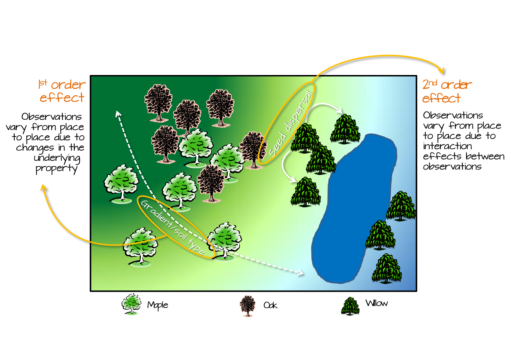

# How to use this eBook {.unnumbered}


\begin{center}\includegraphics[width=0.5\linewidth]{images/John-Snows-cholera-map-of-009} \end{center}

Welcome to *Concepts & Applications in Spatial Epidemiology (EPI 563)* Fall 2022 Semester! This eBook is one of several sources of information and support for your progress through the semester. For an overview of the course, expectations, learning objectives, assignments, and grading, please review the full course syllabus on Canvas. This eBook serves to provide a *'jumping off point'* for the content to be covered each week. Specifically, the content herein will introduce key themes, new vocabulary, and provide some additional detail that is complementary to the *asynchronous* (pre-recorded) video lectures, and foundational to the *synchronous* (in class) work.

## Strategy for using this eBook {.unnumbered}

In the main body of the eBook, there is a separate *module* or *chapter* for each week. This content should be read **in preparation** for each week's material. At the end of the eBook (e.g. after the Appendices), there is a section with each week's *Lab Handout*.

In general, the content within each week's main section is divided into two parts focusing on **spatial thinking** and **spatial analysis**. This dichotomy does not always hold, but in broad terms you can expect these sections to be more specific to content in class on *Tuesday* versus *Thursday* respectively.

-   *Spatial thinking for epidemiology*: This section introduces vocabulary, concepts, and themes that are important to the incorporation of spatialized or geo-referenced data into epidemiologic work. At a minimum, plan to read this content *prior to class Tuesday*, although you will likely benefit from reading both sections before Tuesday.
-   *Spatial analysis for epidemiology*: This section is more focused on data management, visualization, spatial statistics, and interpretation. This content is relevant for our work together on Tuesday's, but is essential for successful work in the Thursday lab activities. *You are not expected to actually execute the code in the eBook before lab on thursday!*. The code is a primer for activities i class.
-  *Weekly Lab Handout*: This is a new addition to the eBook in 2022. Note that there is a lot of overlap between the *spatial analysis* section of the main portion of the eBook, and the *lab handout*. That overlap is by design! While there is overlap, the *Lab Handout* will often contain more specificity and detail about code or analysis that is easier to absorb when you are interactively working through it. 

Throughout the book some concepts or ideas may be highlighted with *call-out blocks*.

::: {.rmdcaution data-latex="{caution}"}
This block denotes a potential pitfall or area of caution.
:::

::: {.rmdnote data-latex="{note}"}
This block denotes an additional bit of information or additional idea to *note* about the topic at hand.
:::

::: {.rmdtip data-latex="{tip}"}
This block denotes a *tip* or advice for best practices or efficiency.
:::

Please note that I will be continually updating the eBook throughout the semester, so if you choose to download, please double-check the **Last updated** date (in colored bar at bottom of screen) to be sure you have the most recent version.

\
This eBook is licensed under the [Creative Commons Attribution-NonCommercial-ShareAlike 4.0 International License](http://creativecommons.org/licenses/by-nc-sa/4.0/).

<!--chapter:end:index.Rmd-->

# Download eBook {-}

To download a PDF of the full version of this eBook [click here](EPI563-SpatialEPI-eBook.pdf). Note that the eBook may be intermittently updated through the semester and you may (or may not) care to re-download the most updated version. Note the *date last updated* in the footer of each page to see when versions changed.

<!--chapter:end:00-download-pdf.Rmd-->

# (PART) Getting ready... {.unnumbered}

# Software installation {.unnumbered}

The information in this module follows on the pre-class video on setting up `R` and `RStudio` on your computer.

## Installing `R` on your computer {.unnumbered}

As of August 2022, the most up-to-date version of `R` is 4.2.1. The *R Project for Statistical Computing* are continually working to update and improve `R`, and as a result there are new versions 1-2 times per year.

If you already have `R` installed, you can open the console and check your current version by typing (or copy/pasting) this: `R.Version()$version.string`

If you do not have `R`, or have an older version than that listed above, you can install or update `R` by going to the `R` repository: <https://www.r-project.org/>. Note that there are many 'mirrors' or servers where the software is stored. Generally it is wise to select one that is geographically close to you, although any should work in theory. One mirror that is relatively close to Atlanta is here: <http://archive.linux.duke.edu/cran/>

### `R` installation notes for Mac OS users

If you click on *Mac OS* from the `cran` webpage, you will see several different options for installation. Specifically, there is a versions for Mac with Intel processors, and a different version for Mac OS with Apple Silicon (e.g. M1 chip). 

::: {.rmdtip data-latex="{tip}"}
**How do I know what chip is in my Mac?**

If you do not know whether you have Intel or Apple processors, click on the Apple icon and choose "*About this Mac*". In the resulting window look for either of these:

* `Chip Apple M1 Pro` means that you have Apple Silicon. You should download that has `arm64` in the name. The description will say it is for native Apple silicon.
* `Processor xxx` where *xxx* is an Intel chip.  This means you have the older Intel chip, and you should download the `R` installer that is for Intel-based Macs.
:::

#### Installing `Xcode` (Mac only)

There are some packages that require compiling done outside of `R`. You may need the utility package `Xcode` to do this.  This is not an `R` package, but instead an app available from the Apple Store. Open the Apple Store, search for `Xcode` and install.

::: {.rmdcaution data-latex="{caution}"}
`Xcode` is BIG! If you don't have much storage on your hard drive this might be a problem. You have two options:

1. Don't install `Xcode` and see what happens. Depending on other configurations on your machine, it might not be necessary. You will know there is a problem if some packages do not install.
2. Try install a "*slimmer*" version of `Xcode` by following [these instructions](https://mac.install.guide/commandlinetools/index.html).
:::

### `R` installation for Windows OS users

If you are using a computer running Microsoft Windows OS, you will click on the Windows option on the CRAN website.  Choose the option that reads `base` and click on the most recent downloader.

#### Installing `Rtools42` (Windows Only) 

While **most** of your work with `R` packages (e.g. installing new ones) can be done with the base-R tools, there are instances where an installation of a new package requires a more complex '*unpacking*' of the code or installation from github. Windows machine  may require additional *tools* to do this work. Luckily there is a package for that! It is called `Rtools42` (assuming you have already downloaded and installed R 4.2), and you should install that **before** you install the packages below.

Note that `Rtools42` is not a package within `R`, but instead is a Windows utility installed outside of `R` itself.

If you are running Windows, navigate back to the [CRAN](https://cran.r-project.org) website, choose Windows, and then -- instead of clicking on `base` -- click on `Rtools` and follow the instructions. Specifically, be sure your version of `Rtool` aligns with your version of `R`. For example, if you have `R` 4.2.1, then choose `Rtools42`. 


## Installing *RStudio* on your computer {.unnumbered}

R-Studio is one of several *integrated development environments* (IDE) for working in `R`. That means it is a *wrapper* around the core `R` functionality that makes coding and project work in `R` much easier than it would be without. We *develop* projects or analyses using `R` within an IDE such as R-Studio. Using R-Studio lets us have robust code-editing and debugging, code syntax highlighting (e.g. coloring different words according to their use, and identifying possible errors), and some assistance with file management, working in larger projects, and outputting results.

The current version of RStudio 2022.07.1. If you do not have RStudio or have an up-to-date version, please install or update it.

**TO INSTALL**: go to <https://www.rstudio.com/products/rstudio/download/>

**TO UPDATE**: Open RStudio and go to Help Menu and choose 'Check for Updates'

::: {.rmdtip data-latex="{tip}"}
[R-Studio Cheat sheet](https://raw.githubusercontent.com/rstudio/cheatsheets/main/rstudio-ide.pdf) provides a quick reference guide for many of the ways that R-Studio makes your work with `R` easier. 

In fact, there are "*cheat sheets*" for lots of packages and utilities in `R`; browse some of them [here](https://www.rstudio.com/resources/cheatsheets/).
:::


# Installing packages for this course {.unnumbered}

While base `R` has a great deal of essential functionality, most of the power of `R` comes from the rapidly growing list of user-created and contributed '*packages*'. A package is simply a bundle of functions and tools, sometimes also including example datasets, basic documentation, and even tutorial 'vignettes'. You can see all the official `R` packages by going here: <https://cran.r-project.org/web/packages/>.

The most common way to install package in `R` is with the `install.packages()` command. For instance to install the package `ggplot2` you do this:

`install.packages("ggplot2")`

Remember that you only need to install a package once (although you may have to update packages occasionally -- see the green Update button in the Packages tab in R Studio). When you want to actually *use* a package (for example `ggplot2`) you call it like this:

`library(ggplot2)`

If your call to `library()` is working, nothing visible happens. However if you see errors, they might be because your package is out of date (and thus needs to be updated/reinstalled), or because some important *dependencies* are missing. Dependencies are other packages on which this package depends. Typically these are installed by default, but sometimes something is missing. If so, simply install the missing package and then try calling `library(ggplot2)` again.

::: {.rmdnote data-latex="{note}"}
Notice that for the function `install.packages('yourPackage')` you **must use quotes** around the package name. In contrast for the function `library(yourPackage)` you **do not use quotes**.
:::

::: {.rmdcaution data-latex="{caution}"}
As you submit each installation request, note the output in your R console. If you get a warning that says installation was not possible because you are missing a package *'yourPackage'*, that suggests you are missing a dependency (e.g. something the main package needs to work correctly). Try installing the package mentioned in the error. If you have trouble, reach out to the TA's!
:::


## Installing packages used for general data science {.unnumbered}

For the rest of this page, copy and paste the provided code in order to install packages necessary for this course. Notice if you hover to the right of a code-chunk in the html version of the eBook, you will see a *copy* icon for quick copying and pasting.

::: {.rmdtip data-latex="{tip}"}
Although you are copying and pasting the code, take a moment to **look** at the output. Did you get any error messages that a package did not install? Sometimes you see a **warning** message announcing something, but perhaps the package installed ok. If there is an **error** message, the package probably did not install. 

To see if a package was installed, try loading it by typing `library(yourPackage)`. If nothing happens (no errors) then all is good!
:::

These packages will support some of our general work in `R`:

-   `rmarkdown` allows the creation of mixed output documents that combine code, documentation and results in a single, readable format.
-   The packages `tinytex` and `knitr` are necessary for creating the `R` documents including PDF output that will be required for submitting assignments.
-   We will use many data manipulation tools from the `tidyverse`. You can learn more about the `tidyverse` here: <https://tidyverse.tidyverse.org/>, and you can see applications of `tidyverse` packages in the [R for Epidemiologists Handbook](https://epirhandbook.com/index.html). The `tidyverse` is actually a collection of data science tools including the visualization/plotting package `ggplot2` and the data manipulation package `dplyr`. For that reason, when you `install.packages('tidyverse')` below, you are actually installing *multiple* packages!
-   The packages `here` and `pacman` are utilities to help simplify file pathnames and package loading behavior.


```r
install.packages('tidyverse')   
install.packages(c('pacman', 'here'))
install.packages('rgdal')
install.packages(c('tinytex', 'rmarkdown', 'knitr')) 
tinytex::install_tinytex()  
# this function installs the tinytex LaTex on your
#  computer which is necessary for rendering (creating) PDF's 
```

## Installing packages use for geographic data {.unnumbered}

There are many ways to get the data we want for spatial epidemiology into `R`. Because we often (but don't always) use census geographies as aggregating units, and census populations as denominators, the following packages will be useful. They are designed to quickly extract both geographic boundary files (e.g. *'shapefiles'*) as well as attribute data from the US Census website via an API. 


```r
install.packages(c('tidycensus','tigris')) 

help('census_api_key','tidycensus')
```

:::{.rmdtip data-latex="{tip}"}
**NOTE**: To be able to interact with the Census bureau API through `R`, you will need a personalized "**API key**".  When you enter the second line of code above (e.g. the `help()` function), you will see information on how to:

1. Request a key from the Census bureau
2. Enter your cutoms key into your machine so that it is available when needed.

We will not need the Census API key for a couple of weeks, but it is good to start now and ask for help if you have trouble!
:::

## Installing packages used for spatial data manipulation & visualization {.unnumbered}

This section installs a set of tools specific to our goals of importing, exporting, manipulating, visualizing, and analyzing spatial data.

-   The first line of packages have functions for defining, importing, exporting, and manipulating spatial data.
-   The second line has some tools we will use for visualizing spatial data (e.g. making maps!).


```r
install.packages(c('sp', 'sf', 'raster', 'RColorBrewer', 'rgeos', 'maptools', 'OpenStreetMap'))  
install.packages(c('tmap', 'tmaptools', 'ggmap', 'shinyjs', 'shiny', 'micromap')) 
```

## Installing packages used for spatial analysis {.unnumbered}

Finally these are packages specifically for spatial analysis tasks we will carry out.


```r
install.packages(c('spdep', 'CARBayes', 'sparr', 'spatialreg',  'DCluster', 'SpatialEpi'))
install.packages(c('GWmodel', 'spgwr') )
```


<!--chapter:end:00-software-setup.Rmd-->

# (PART) Weekly Modules {-}

# Locating Spatial Epidemiology

## Getting Ready

### Learning objectives


```{=latex}
 
  \providecommand{\huxb}[2]{\arrayrulecolor[RGB]{#1}\global\arrayrulewidth=#2pt}
  \providecommand{\huxvb}[2]{\color[RGB]{#1}\vrule width #2pt}
  \providecommand{\huxtpad}[1]{\rule{0pt}{#1}}
  \providecommand{\huxbpad}[1]{\rule[-#1]{0pt}{#1}}

\begin{table}[ht]
\begin{centerbox}
\begin{threeparttable}
\captionsetup{justification=centering,singlelinecheck=off}
\caption{(\#tab:learning-ob) Learning objectives by weekly module}
 \setlength{\tabcolsep}{0pt}
\begin{tabularx}{1\textwidth}{p{1\textwidth}}


\hhline{>{\huxb{255, 255, 255}{1}}-}
\arrayrulecolor{black}

\multicolumn{1}{!{\huxvb{255, 255, 255}{1}}p{1\textwidth}!{\huxvb{255, 255, 255}{1}}}{\cellcolor[RGB]{204, 204, 204}\hspace{6pt}\parbox[b]{1\textwidth-6pt-6pt}{\huxtpad{2pt + 1em}\raggedright \textbf{After this module you should be able to…}\huxbpad{2pt}}} \tabularnewline[-0.5pt]


\hhline{>{\huxb{255, 255, 255}{1}}-}
\arrayrulecolor{black}

\multicolumn{1}{!{\huxvb{255, 255, 255}{1}}p{1\textwidth}!{\huxvb{255, 255, 255}{1}}}{\cellcolor[RGB]{242, 242, 242}\hspace{6pt}\parbox[b]{1\textwidth-6pt-6pt}{\huxtpad{2pt + 1em}\raggedright Explain the potential role of spatial analysis for epidemiologic thinking and practice.\huxbpad{2pt}}} \tabularnewline[-0.5pt]


\hhline{>{\huxb{255, 255, 255}{1}}-}
\arrayrulecolor{black}

\multicolumn{1}{!{\huxvb{255, 255, 255}{1}}p{1\textwidth}!{\huxvb{255, 255, 255}{1}}}{\cellcolor[RGB]{230, 230, 230}\hspace{6pt}\parbox[b]{1\textwidth-6pt-6pt}{\huxtpad{2pt + 1em}\raggedright Produce simple thematic maps of epidemiologic data in R.\huxbpad{2pt}}} \tabularnewline[-0.5pt]


\hhline{>{\huxb{255, 255, 255}{1}}-}
\arrayrulecolor{black}
\end{tabularx}
\end{threeparttable}\par\end{centerbox}

\end{table}
 
```

### Additional Resources


* [Geocomputation with R](https://geocompr.robinlovelace.net/) by Robin Lovelace. This will be a recurring 'additional resource' as it provides lots of useful insight and strategy for working with spatial data in `R`. I encourage you to browse it quickly now, but return often when you have questions about how to handle geographic data (especially of class `sf`) in `R`. 
* [An introduction to the `ggplot2` package](https://ggplot2-book.org/introduction.html). This is just one of dozens of great online resources introducing the *grammar of graphics* approach to plotting in `R`. 
* [A basic introduction to the `tmap` package](https://tlorusso.github.io/geodata_workshop/tmap_package#:~:text=The%20tmap%20package%20is%20a,as%20choropleths%20and%20bubble%20maps.) This is also only one of many introductions to the `tmap` mapping package. `tmap` builds on the *grammar of graphics* philosophy of `ggplot2`, but brings a lot of tools useful for thematic mapping!
* [R for SAS users cheat sheet](https://raw.githubusercontent.com/rstudio/cheatsheets/main/sas-r.pdf)

### Important Vocabulary


```{=latex}
 
  \providecommand{\huxb}[2]{\arrayrulecolor[RGB]{#1}\global\arrayrulewidth=#2pt}
  \providecommand{\huxvb}[2]{\color[RGB]{#1}\vrule width #2pt}
  \providecommand{\huxtpad}[1]{\rule{0pt}{#1}}
  \providecommand{\huxbpad}[1]{\rule[-#1]{0pt}{#1}}

\begin{table}[ht]
\begin{centerbox}
\begin{threeparttable}
\captionsetup{justification=centering,singlelinecheck=off}
\caption{(\#tab:unnamed-chunk-2) Vocabulary for Week 1}
 \setlength{\tabcolsep}{0pt}
\begin{tabularx}{0.9\textwidth}{p{0.45\textwidth} p{0.45\textwidth}}


\hhline{>{\huxb{255, 255, 255}{1}}->{\huxb{255, 255, 255}{1}}-}
\arrayrulecolor{black}

\multicolumn{1}{!{\huxvb{255, 255, 255}{1}}p{0.45\textwidth}!{\huxvb{255, 255, 255}{1}}}{\cellcolor[RGB]{84, 153, 199}\hspace{6pt}\parbox[b]{0.45\textwidth-6pt-2pt}{\huxtpad{2pt + 1em}\raggedright \textbf{\textcolor[RGB]{255, 255, 255}{Term}}\huxbpad{2pt}}} &
\multicolumn{1}{p{0.45\textwidth}!{\huxvb{255, 255, 255}{1}}}{\cellcolor[RGB]{84, 153, 199}\hspace{2pt}\parbox[b]{0.45\textwidth-2pt-6pt}{\huxtpad{2pt + 1em}\raggedright \textbf{\textcolor[RGB]{255, 255, 255}{Definition}}\huxbpad{2pt}}} \tabularnewline[-0.5pt]


\hhline{>{\huxb{255, 255, 255}{1}}->{\huxb{255, 255, 255}{1}}-}
\arrayrulecolor{black}

\multicolumn{1}{!{\huxvb{255, 255, 255}{1}}p{0.45\textwidth}!{\huxvb{255, 255, 255}{1}}}{\cellcolor[RGB]{212, 230, 241}\hspace{6pt}\parbox[b]{0.45\textwidth-6pt-2pt}{\huxtpad{2pt + 1em}\raggedright \textbf{Data, attribute}\huxbpad{2pt}}} &
\multicolumn{1}{p{0.45\textwidth}!{\huxvb{255, 255, 255}{1}}}{\cellcolor[RGB]{212, 230, 241}\hspace{2pt}\parbox[b]{0.45\textwidth-2pt-6pt}{\huxtpad{2pt + 1em}\raggedright Nonspatial information about a geographic feature in a GIS, usually stored in a table and linked to the feature by a unique identifier. For example, attributes of a county might include the population size, density, and birth rate for the resident population\huxbpad{2pt}}} \tabularnewline[-0.5pt]


\hhline{>{\huxb{255, 255, 255}{1}}->{\huxb{255, 255, 255}{1}}-}
\arrayrulecolor{black}

\multicolumn{1}{!{\huxvb{255, 255, 255}{1}}p{0.45\textwidth}!{\huxvb{255, 255, 255}{1}}}{\cellcolor[RGB]{169, 204, 227}\hspace{6pt}\parbox[b]{0.45\textwidth-6pt-2pt}{\huxtpad{2pt + 1em}\raggedright \textbf{Data, geometry}\huxbpad{2pt}}} &
\multicolumn{1}{p{0.45\textwidth}!{\huxvb{255, 255, 255}{1}}}{\cellcolor[RGB]{169, 204, 227}\hspace{2pt}\parbox[b]{0.45\textwidth-2pt-6pt}{\huxtpad{2pt + 1em}\raggedright Spatial information about a geogrpahic feature. This could include the x, y coordinates for points or for vertices of lines or polygons, or the cell coordinates for raster data\huxbpad{2pt}}} \tabularnewline[-0.5pt]


\hhline{>{\huxb{255, 255, 255}{1}}->{\huxb{255, 255, 255}{1}}-}
\arrayrulecolor{black}

\multicolumn{1}{!{\huxvb{255, 255, 255}{1}}p{0.45\textwidth}!{\huxvb{255, 255, 255}{1}}}{\cellcolor[RGB]{212, 230, 241}\hspace{6pt}\parbox[b]{0.45\textwidth-6pt-2pt}{\huxtpad{2pt + 1em}\raggedright \textbf{Datum}\huxbpad{2pt}}} &
\multicolumn{1}{p{0.45\textwidth}!{\huxvb{255, 255, 255}{1}}}{\cellcolor[RGB]{212, 230, 241}\hspace{2pt}\parbox[b]{0.45\textwidth-2pt-6pt}{\huxtpad{2pt + 1em}\raggedright The reference specifications of a measurement system, usually a system of coordinate positions on a surface (a horizontal datum) or heights above or below a surface (a vertical datum)\huxbpad{2pt}}} \tabularnewline[-0.5pt]


\hhline{>{\huxb{255, 255, 255}{1}}->{\huxb{255, 255, 255}{1}}-}
\arrayrulecolor{black}

\multicolumn{1}{!{\huxvb{255, 255, 255}{1}}p{0.45\textwidth}!{\huxvb{255, 255, 255}{1}}}{\cellcolor[RGB]{169, 204, 227}\hspace{6pt}\parbox[b]{0.45\textwidth-6pt-2pt}{\huxtpad{2pt + 1em}\raggedright \textbf{Geographic coordinate system}\huxbpad{2pt}}} &
\multicolumn{1}{p{0.45\textwidth}!{\huxvb{255, 255, 255}{1}}}{\cellcolor[RGB]{169, 204, 227}\hspace{2pt}\parbox[b]{0.45\textwidth-2pt-6pt}{\huxtpad{2pt + 1em}\raggedright A reference system that uses latitude and longitude to define the locations of points on the surface of a sphere or spheroid. A geographic coordinate system definition includes a datum, prime meridian, and angular unit\huxbpad{2pt}}} \tabularnewline[-0.5pt]


\hhline{>{\huxb{255, 255, 255}{1}}->{\huxb{255, 255, 255}{1}}-}
\arrayrulecolor{black}

\multicolumn{1}{!{\huxvb{255, 255, 255}{1}}p{0.45\textwidth}!{\huxvb{255, 255, 255}{1}}}{\cellcolor[RGB]{212, 230, 241}\hspace{6pt}\parbox[b]{0.45\textwidth-6pt-2pt}{\huxtpad{2pt + 1em}\raggedright \textbf{Geopackage}\huxbpad{2pt}}} &
\multicolumn{1}{p{0.45\textwidth}!{\huxvb{255, 255, 255}{1}}}{\cellcolor[RGB]{212, 230, 241}\hspace{2pt}\parbox[b]{0.45\textwidth-2pt-6pt}{\huxtpad{2pt + 1em}\raggedright A data storage format suitable for containing vector or raster data in a compact and portable file. It is an alternative (and in my opinion a superior alternative!) to ESRI shapefiles.\huxbpad{2pt}}} \tabularnewline[-0.5pt]


\hhline{>{\huxb{255, 255, 255}{1}}->{\huxb{255, 255, 255}{1}}-}
\arrayrulecolor{black}

\multicolumn{1}{!{\huxvb{255, 255, 255}{1}}p{0.45\textwidth}!{\huxvb{255, 255, 255}{1}}}{\cellcolor[RGB]{169, 204, 227}\hspace{6pt}\parbox[b]{0.45\textwidth-6pt-2pt}{\huxtpad{2pt + 1em}\raggedright \textbf{Projection}\huxbpad{2pt}}} &
\multicolumn{1}{p{0.45\textwidth}!{\huxvb{255, 255, 255}{1}}}{\cellcolor[RGB]{169, 204, 227}\hspace{2pt}\parbox[b]{0.45\textwidth-2pt-6pt}{\huxtpad{2pt + 1em}\raggedright A method by which the curved surface of the earth is portrayed on a flat surface. This generally requires a systematic mathematical transformation of the earth's graticule of lines of longitude and latitude onto a plane. Some projections can be visualized as a transparent globe with a light bulb at its center (though not all projections emanate from the globe's center) casting lines of latitude and longitude onto a sheet of paper. Generally, the paper is either flat and placed tangent to the globe (a planar or azimuthal projection) or formed into a cone or cylinder and placed over the globe (cylindrical and conical projections). Every map projection distorts distance, area, shape, direction, or some combination thereof\huxbpad{2pt}}} \tabularnewline[-0.5pt]


\hhline{>{\huxb{255, 255, 255}{1}}->{\huxb{255, 255, 255}{1}}-}
\arrayrulecolor{black}

\multicolumn{1}{!{\huxvb{255, 255, 255}{1}}p{0.45\textwidth}!{\huxvb{255, 255, 255}{1}}}{\cellcolor[RGB]{212, 230, 241}\hspace{6pt}\parbox[b]{0.45\textwidth-6pt-2pt}{\huxtpad{2pt + 1em}\raggedright \textbf{Spatial data model: raster}\huxbpad{2pt}}} &
\multicolumn{1}{p{0.45\textwidth}!{\huxvb{255, 255, 255}{1}}}{\cellcolor[RGB]{212, 230, 241}\hspace{2pt}\parbox[b]{0.45\textwidth-2pt-6pt}{\huxtpad{2pt + 1em}\raggedright A spatial data model that defines space as an array of equally sized cells arranged in rows and columns, and composed of single or multiple bands. Each cell contains an attribute value and location coordinates. Unlike a vector structure, which stores coordinates explicitly, raster coordinates are contained in the ordering of the matrix. Groups of cells that share the same value represent the same type of geographic feature (see Figure below)\huxbpad{2pt}}} \tabularnewline[-0.5pt]


\hhline{>{\huxb{255, 255, 255}{1}}->{\huxb{255, 255, 255}{1}}-}
\arrayrulecolor{black}

\multicolumn{1}{!{\huxvb{255, 255, 255}{1}}p{0.45\textwidth}!{\huxvb{255, 255, 255}{1}}}{\cellcolor[RGB]{169, 204, 227}\hspace{6pt}\parbox[b]{0.45\textwidth-6pt-2pt}{\huxtpad{2pt + 1em}\raggedright \textbf{Spatial data model: vector}\huxbpad{2pt}}} &
\multicolumn{1}{p{0.45\textwidth}!{\huxvb{255, 255, 255}{1}}}{\cellcolor[RGB]{169, 204, 227}\hspace{2pt}\parbox[b]{0.45\textwidth-2pt-6pt}{\huxtpad{2pt + 1em}\raggedright A coordinate-based data model that represents geographic features as points, lines, and polygons. Each point feature is represented as a single coordinate pair, while line and polygon features are represented as ordered lists of vertices. Attributes are associated with each vector feature, as opposed to a raster data model, which associates attributes with grid cells (see figure below)\huxbpad{2pt}}} \tabularnewline[-0.5pt]


\hhline{>{\huxb{255, 255, 255}{1}}->{\huxb{255, 255, 255}{1}}-}
\arrayrulecolor{black}

\multicolumn{1}{!{\huxvb{255, 255, 255}{1}}p{0.45\textwidth}!{\huxvb{255, 255, 255}{1}}}{\cellcolor[RGB]{212, 230, 241}\hspace{6pt}\parbox[b]{0.45\textwidth-6pt-2pt}{\huxtpad{2pt + 1em}\raggedright \textbf{Unit of analysis}\huxbpad{2pt}}} &
\multicolumn{1}{p{0.45\textwidth}!{\huxvb{255, 255, 255}{1}}}{\cellcolor[RGB]{212, 230, 241}\hspace{2pt}\parbox[b]{0.45\textwidth-2pt-6pt}{\huxtpad{2pt + 1em}\raggedright The unit or object that is measured, analyzed, and about which you wish to make inference. Examples of units of analysis are person, neighborhood, city, state, or hospital.\huxbpad{2pt}}} \tabularnewline[-0.5pt]


\hhline{>{\huxb{255, 255, 255}{1}}->{\huxb{255, 255, 255}{1}}-}
\arrayrulecolor{black}
\end{tabularx}
\end{threeparttable}\par\end{centerbox}

\end{table}
 
```


\includegraphics[width=0.8\linewidth]{images/data-models} 


## Spatial Thinking in Epidemiology

When first learning epidemiology, it can be difficult to distinguish between the concepts, theories, and purpose of epidemiology versus the skills, tools, and methods that we use to implement epidemiology. But these distinctions are foundational to our collective professional identity, and to the way we go about doing our work. 

For instance do you think of epidemiologists as data analysts, scientists, data scientists, technicians or something else? These questions are bigger than we can address in this class, but their importance becomes especially apparent when learning an area such as *spatial epidemiology*. This is because there is a tendency for discourse in spatial epidemiology to focus primarily on the *data* and the *methods* without understanding how each of those relate to the *scientific questions* and *health of population* for which we are ultimately responsible. Distinguishing these threads is an overarching goal of this course, even as we learn the data science and spatial analytic tools.

One quite simplistic but important example of how our questions and methods are inter-related is apparent when we think of  **data**. Data is central to quantitative analysis, including epidemiologic analysis. So how is *data* different in *spatial* epidemiology? 

The first thing that might come to mind is that we have explicitly geographic or spatial measures contained within our data. The content of the spatial data is distinct: the addition of geographic or spatial location may illuminate otherwise *aspatial* attributes. But even more fundamental than the content is thinking about the *unit of analysis*.  

It is likely that in many other examples in your epidemiology coursework, the explicit (or sometimes implicit) unit of analysis has been the *individual person*. Spatial epidemiology can definitely align with individual-level analysis. But as we'll see, common units we observe and measure in spatial epidemiology -- and therefore the units that compose much of our **data** -- are not individuals but instead are geographic units (e.g. census tract, county, state, etc) and by extension the *collection* or *aggregation* of all the individuals therein. 

This distinction in unit of analysis has important implications for other epidemiologic concerns including precision, bias, and ultimately for inference (e.g. the meaning we can make from our analysis), as we'll discuss throughout the semester.

One concrete implication of the above discussion is that you should always be able to answer a basic question about any dataset you wish to analyze: "*what does one row of data represent?*"  A row of data is one way to think of the *unit of analysis*, and often (but not always) in spatial epidemiology a row of data is a summary of the population contained by a geographic unit or boundary. 

Said another way it is an *ecologic summary* of the population. As stated above, this is only the most simplistic example of how and why it is important to not only learn the spatial statistics and methods, but to also maintain the perspective of epidemiology as a population health science. To advance public health we need good methods but we also need critical understanding of the populations we support, the data we analyze, and the conclusions we can reliably draw from our work.

As we move through the semester, I encourage you to dig deep into how methods work, but also to step back and ask questions like *"Why would I choose this method?"* or *"What question in epidemiology is this useful for?"* 


## Spatial Analysis in Epidemiology

### Spatial data storage formats

If you have worked with spatial or GIS data using ESRI's ArcMap, you will be familiar with what are called *shapefiles*.  This is one very common format for storing geographic data on computers. ESRI shapefiles are not actually a single file, but are anywhere from four to eight different files all with the same file name but different extensions (e.g. *.shp*, *.prj*, *.shx*, etc). Each different file (corresponding to an extension) contains a different portion of the data ranging from the geometry data, the attribute data, the projection data, an index connecting it all together, etc. 

What you may not know is that shapefiles are not the only (and in my opinion **definitely not the best**) way to store geographic data. In this class I recommend storing data in a format called *geopackages* indicated by the `.gpkg` extension. 

*Geopackages* are an open source format that were developed to be functional and portable across devices, including  mobile devices. They are useful when we are storing individual files in an efficient and compact way.  

To be clear, there are many other formats and I make no claim that *geopackages* are the ultimate format; they just happen to meet the needs for this course, and for much of the work of spatial epidemiologists. It is worth noting that many GIS programs including ArcMap and QGIS can both read and write the *geopackage* format; so there is no constraint or limitation in terms of software when data are stored in `.gpkg` format.
    

### Representing spatial data in `R`

The work in this course assumes that you are a *basic `R` user*; you do not need to be expert, but I assume that you understand data objects (e.g. `data.frame`, `list`, `vector`), and basic operations including sub-setting by index (e.g. using square brackets to extract or modify information: `[]`), base-R plotting, and simple regression modeling. If you **are not familiar with `R`**, you will need to do some quick self-directed learning. 

:::{.rmdtip data-latex="{tip}"}

Here are some good online resources for `R` skills, and the instructor and TA's can point you to additional resources as needed:

* [The Epidemiologist R Handbook](https://epirhandbook.com/index.html)
* [R for Data Science](https://r4ds.had.co.nz/introduction.html), particularly the introductory chapters
* [R Tutorial](http://www.r-tutor.com/r-introduction)

:::

Just as our conceptualization of, or thinking about, *data* in spatial epidemiology requires some reflection, the actual structure and representation of that data with a computer tool such as `R` also requires some attention. Specifically, spatial data in `R` is not exactly like the conventional *aspatial* epidemiologic data that is often arranged as a rectangular `data.frame` (e.g. like a spreadsheet where *rows are observations* and *columns are variables*). 

While spatial data are more complex than just a spreadsheet, it *does not* need to be as complex as spatial data in software platforms like ESRI's ArcMap. 

To be *spatial*, a dataset must have a representation of geography, spatial location, or spatial relatedness, and that is most commonly done with either a *vector* or *raster* data model (see description above in vocabulary). Those spatial or geographic representations must be stored on your computer and/or held in memory, hopefully with a means for relating or associating the individual locations with their corresponding attributes. For example we want to know the attribute (e.g. the count of deaths for a given place), and the location of that place, and ideally we want the two connected together.

Over the past 10+ years, `R` has increasingly been used to analyze and visualize spatial data. Early on, investigators tackling the complexities of spatial data analysis in `R` developed a number of ad hoc, one-off approaches to these data. This worked in the short term for specific applications, but it created new problems as users needed to generalize a method to a new situation, or chain together steps. In those settings it was not uncommon to convert a dataset to multiple different formats to accomplish a task sequence; this resulted in convoluted and error-prone coding, and lack of transparency in analysis.

An eventual response to this early tumult was a thoughtful and systematic approach to defining a *class of data* that tackled the unique challenges of spatial data in `R`. Roger Bivand, Edzer Pebesma and others developed the `sp` package which defined spatial data classes, and provided functional tools to interact with them. 

The `sp` package defined specific data classes to contain or represent *points*, *lines*, and *polygons*, as well as *raster/grid* data; each of these data classes can contain geometry only (these have names like `SpatialPoints` or `SpatialPolygons`) or could contain geometry **plus** related data attributes (these have names like `SpatialPointsDataFrame` or `SpatialPolygonsDataFrame`). Each spatial object can contain all the information spatial data might include: the spatial extent (min/max x, y values), the coordinate system or spatial projection, the geometry information, the attribute information, etc. 

Because of the flexibility and power of the `sp*` class of objects, they became a standard up until the last few years.  Interestingly, it was perhaps the sophistication of the `sp*` class that began to undermine it. `sp*` class data was well-designed from a programming point of view, but was still a little cumbersome (and frankly confusing) for more applied analysts and new users. 

Analysis in *spatial epidemiology* is not primarily about computer programming, but about producing transparent and reliable data pipelines to conduct valid, reliable, and reproducible analysis. Thus epidemiologists, and other data scientists, desired spatial tools that could be incorporated into the growing toolbox of data science tools in `R`. 


These calls for a more user-friendly and intuitive approach to spatial data led the same team (e.g. Bivand, Pebesma, others) to develop the **Simple Features** set of spatial data classes for `R`. Loaded with the `sf` -- for *simple features* -- package, this data format has quickly become the standard for handling spatial data in `R`.  

The power of the `sf` class, as discussed below, is that it makes *spatial data* behave like *rectangular data* and thus makes it amenable to manipulation using any tool that works on `data.frame` or `tibble` objects. Recognizing that many users and functions prefer the older `sp*` objects, the `sf` package includes a number of utility functions for easily converting back and forth. 


:::{.rmdnote data-latex="{note}"}
In this class we will use `sf*` class objects as the *preferred data class*, but because some of the tools we'll learn still require `sp*` we will occasionally go back and forth.
:::

`sf*` data classes are designed to hold all the essential spatial information (projection, extent, geometry), but do so with an easy to evaluate `data.frame` format that integrates the attribute information and the geometry information together. The result is more intuitive sorting, selecting, aggregating, and visualizing. 


### Benefits of `sf` data classes


As Robin Lovelace writes in his online eBook, [Gecomputation in R](https://geocompr.robinlovelace.net/), `sf` data classes offer an approach to spatial data that is compatible with QGIS and PostGIS, important non-ESRI open source GIS platforms, and `sf` functionality compared to `sp` provides:

1. Fast reading and writing of data
2. Enhanced plotting performance
3. `sf` objects can be treated as data frames in most operations
4. `sf` functions can be combined using `%>%` pipe operator and works well with the `tidyverse` collection of `R` packages ([see Tips for using `dplyr`](#dplyr) for examples)
5. `sf` function names are relatively consistent and intuitive (all begin with `st_`)


### Working with spatial data in `R`

Here and in lab, one example dataset we will use, called `ga.mvc` quantifies the counts and rates of death from motor vehicle crashes in each of Georgia's $n=159$ counties. The dataset is *vector* in that it represents counties as polygons with associated attributes (e.g. the mortality information, county names, etc). 

#### Importing spatial data into `R`

It is important to distinguish between two kinds of data formats.  There is a way that data is *stored on a computer hard drive*, and then there is a way that data is organized and managed *inside a program* like `R`. 

The *shapefiles* (`.shp`) popularized by ESRI/ArcMap is an example of a format for storing spatial data on a hard drive.  In contrast, the discussion above about the `sf*` and `sp*` data classes refer to how data is organized *inside `R`*.  

Luckily, regardless of how data is *stored* on your computer, it is possible to import almost any format into `R`, and once inside `R` it is possible to make it into either the `sp*` or `sf*` data class. That means if you receive data as a `.shp` shapefile, as a `.gpkg` geopackage, or as a `.tif` raster file, each can be easily imported.

All `sf` functions that act on spatial objects begin with the prefix `st_`.  Therefore to import (read) data we will use `st_read()`. This function determines **how** to import the data based on the extension of the file name you specify. 

Look at the help documentation for `st_read()`. Notice that the first argument `dsn=`, might be a complete file name (e.g. `myData.shp`), or it might be a folder name (e.g. `mygeodatabase.gdb`). So if  you had a the motor vehicle crash data saved as both a shapefile (`mvc.shp`, which is actually six different files on your computer), and as a geopackage (`mvc.gpkg`) you can read them in like this:


```r
# this reads in the shapefile
mvc.a <- st_read('GA_MVC/ga_mvc.shp')

# this reads in the geopackage
mvc.b <- st_read('GA_MVC/ga_mvc.gpkg')
```


We can take a look at the defined data class of the imported objects within `R`:


```r
class(mvc.a)
```

```
## [1] "sf"         "data.frame"
```

```r
class(mvc.b)
```

```
## [1] "sf"         "data.frame"
```

Notice how the two objects have the same *class* (e.g. type of data stored within `R`), even though they were two different kinds of files stored on the computer: one was a shapefile and one a geopackage. This is because `st_read()` can automatically detect the storage format based on the extension, and use the appropriate interpreter to import that data. This is nice because it means you can bring many types of spatial data into `R`!


You will also notice that when we examined the `class()` of each object, they are each classified as **both** `sf` **and** `data.frame` class. That is incredibly important, and it speaks to an elegant simplicity of the `sf*` data classes! 

That the objects are classified as `sf` is perhaps obvious because it is a **spatial** object; but the fact that each object is *also classified* as `data.frame` means that we can treat the object for the purposes of data management,  manipulation and analysis as a relatively simple-seeming object: a rectangular `data.frame`.  

How does that work? We will explore this more in lab but essentially each dataset has rows (observations) and columns (variables). We can see the variable/column names like this:


```r
names(mvc.a)
```

```
## [1] "GEOID"      "NAME"       "MVCRATE_17" "geometry"
```

```r
names(mvc.b)
```

```
## [1] "GEOID"      "NAME"       "MVCRATE_17" "geom"
```

We can see that each dataset has the same *attribute* variables (e.g. `GEOID`, `NAME`, `MVCRATE_17`), and then a final column called `geometry` in one and called `geom` in another. 

These geometry columns are different from your usual run-of-the-mill column variables in that they don't hold a single value.  Instead, each *'cell'* in those columns actually contains an embedded list of $x,y$ coordinates defining the vertices of the polygons for each of Georgia's counties. So all of the *spatial location* information for each row is contained in that single variable called `geom` (or alternately, `geometry`).

Another way to learn about an `sf` object is to use the `head()` function. In addition to displaying the top six rows of data (which is the typical behavior of the `head()` function), for `sf` objects `head()` will also print some of the important **metadata** about the file.


```r
head(mvc.a)
```

```
## Simple feature collection with 6 features and 3 fields
## Geometry type: MULTIPOLYGON
## Dimension:     XY
## Bounding box:  xmin: -84.64195 ymin: 31.0784 xmax: -82.04858 ymax: 34.49172
## Geodetic CRS:  WGS 84
##   GEOID                     NAME MVCRATE_17                       geometry
## 1 13001  Appling County, Georgia   53.99276 MULTIPOLYGON (((-82.55069 3...
## 2 13003 Atkinson County, Georgia   35.96260 MULTIPOLYGON (((-83.141 31....
## 3 13005    Bacon County, Georgia    0.00000 MULTIPOLYGON (((-82.62819 3...
## 4 13007    Baker County, Georgia   31.25000 MULTIPOLYGON (((-84.64166 3...
## 5 13009  Baldwin County, Georgia   28.94936 MULTIPOLYGON (((-83.42674 3...
## 6 13011    Banks County, Georgia   32.19921 MULTIPOLYGON (((-83.66862 3...
```


:::{.rmdnote data-latex="{note}"}

To summarize, `sf` within `R` is powerful because:

1. We are not limited to how data arrive to us. If you acquire data (from the web, a colleague, etc) as a shapefile, a geopackage, a raster or other formats, they can all be imported into `R`.
2. Once inside of `R` (and stored in `sf` data objects), we can treat the datasets almost as if they were aspatial, rectangular datasets. That means we could use sub-setting, filtering, recoding, merging, and aggregating *without losing the spatial information*! 
:::

#### Exporting spatial data from `R`

While importing is often the primary challenge with spatial data and `R`, it is not uncommon that you might modify or alter a spatial dataset and wish to save it for future use, or to write it out to disk to share with a colleague. 

Luckily the `sf` package has the same functionality to write an `sf` spatial object to disk in a wide variety of formats including *shapefiles* (`.shp`) and *geopackages* (`.gpkg`). Again, `R` uses the extension you specify in the filename to determine the target format.


```r
# Write the file mvc to disk as a shapefile format
st_write(mvc, 'GA_MVC/ga_mvc_v2.shp')

# Write the file mvc to disk as a geopackage format
st_write(mvc, 'GA_MVC/ga_mvc_v2.gpkg')
```


:::{.rmdnote data-latex="{note}"}
After you write the two files, navigate on your computer to the folder and look at what was written. In particular notice that the `.shp` file is actually *many files*, but the `.gpkg` is a single file.
:::
 
### Basic visual inspection/plots

What if you want to **see** your spatial data?  In base-R there is a powerful function called `plot()` that can be used to create easy or incredibly complex visualizations or graphical representation of data. 

In the package `sf`, the functionality of `plot()` is extended to handle the uniqueness of spatial data. That means that if you call `plot()` on a spatial object **without having loaded** `sf`, the results will be different than if `plot()` called **after loading** `sf`. 

When you `plot()` with `sf`, by default it will try to make a map **for every variable in the data frame**! Try it once. If this is not what you want (it usually *is not*), you can force it to only plot *some* variables by providing a vector of variable names.


```r
plot(mvc) # this plots a panel for every column - or actually the first 10 columns
```

<!-- --> 


```r
plot(mvc['MVCRATE_05']) # this plots only a single variable, the MVC mortality rate for 2005
```

<!-- --> 

```r
plot(mvc[c('MVCRATE_05', 'MVCRATE_17')]) # this plots two variables: MVC rate in 2005 & 2017
```

<!-- --> 


Sometimes you want to know something about the spatial size, extent, or shape of your data. To do this you can easily plot only the geometry of the spatial object (e.g. not attributes). Here are two approaches to quickly plot the geometry:


```r
plot(st_geometry(mvc)) # st_geometry() returns the geom information to plot
```


```r
plot(mvc$geom)  # this is an alternative approach...directly plot the 'geom' column
```

<!-- --> 


### Working with CRS and projection

Maps are used to describe the geographical or spatial location of particular objects as a representation of where those things are on planet Earth. Most maps are printed on paper or screens. In other words, maps identify locations from somewhere on planet earth and represent them on a *flat* or *planar* medium.

But the world does not have latitude or longitude lines painted on the ground, and the earth is not flat! Instead the earth is nearly spherical (really it is a *geoid*) and there is no universal reference for where to start measuring. 

For these two reasons, all maps require at a minimum a *coordinate reference system* (CRS) to define how the numbers in our coordinates relate to actual places. In addition most maps are best interpreted after formally *projecting* the data to account for the artifact induced by pretending earth is flat. 

The most unambiguous way to describe a CRS and/or projection is by using the **EPSG** code, which stands for *European Petroleum Survey Group*. This consortium has standardized hundreds of projection definitions in a manner adopted by several `R` packages including `rgdal` and `sf`. 


A given dataset already has a CRS (and possibly a projection). If CRS and projection information was contained in the original file you imported, it will *usually* be maintained when you use `st_read()`.  However sometimes it is missing and you must first find it. Once it is known, you might choose to *change* or *transform* the CRS or projection for a specific purpose. We will discuss this further in class.

:::{.rmdcaution data-latex="{caution}"}

If there is NO CRS information imported it is critical that you find out the CRS information from the data source or owner. 
:::

This course is not a GIS course (e.g. it is assumed you have already had some exposure to geographic information systems generally), and learning about the theory and application of coordinate reference systems and projections is not our primary purpose this semester. However some basic knowledge *is necessary* for successfully working with spatial epidemiologic data. Here are several resources you should peruse to learn more about CRS, projections, and EPSG codes:

* [A useful overview/review of coordinate reference systems in `R`](https://www.nceas.ucsb.edu/sites/default/files/2020-04/OverviewCoordinateReferenceSystems.pdf)
* [Robin Lovelace's Geocompuation in R on projections with `sf`](https://geocompr.robinlovelace.net/reproj-geo-data.html)
* [EPSG website:](https://epsg.io/) This link is to a searchable database of valid ESPG codes
* [Here are some useful EPSG codes](https://guides.library.duke.edu/r-geospatial/CRS)


\begin{figure}
\includegraphics[width=0.5\linewidth]{images/compare-crs} \caption{Comparing CRS}(\#fig:unnamed-chunk-14)
\end{figure}


The choice of CRS and/or projection has a substantial impact on how the rendered map looks, as is evident in the figure above ([source of image](https://datacarpentry.org/organization-geospatial/03-crs/)).

We already saw the CRS/projection information of the `mvc` object when we used the `head()` function above; it was at the top and read `WGS 84`. 

Recall there are two main types of CRS: 

1. **Geographic** which is to say coordinate locations are represented as *latitude* and *longitude* degrees; 
2. **Projected** which means the coordinate values have been transformed for representation of the spherical geoid onto a planar (Euclidean) coordinate system. 

`WGS 84` is a ubiquitous geographic coordinate system common to boundary files retrieved from the U.S. Census bureau. 

An important question when you work with a spatial dataset is to understand whether it is primarily a geographic or projected CRS, and if so which one. 


```r
st_is_longlat(mvc)
```

```
## [1] TRUE
```

This quick logical test returns `TRUE` or `FALSE` to answer the question *"Is the `sf` object simply a longitude/latitude geographic CRS?"*. The answer in this case is `TRUE` because `WGS 84` is a geographic (longlat) coordinate system, and there is no additional information about projection. But what if it were `FALSE` or we wanted to know more about the CRS/projection?


```r
# Retrieve CRS metadata from an sf object
st_crs(mvc)
```

```
## Coordinate Reference System:
##   User input: WGS 84 
##   wkt:
## GEOGCRS["WGS 84",
##     ENSEMBLE["World Geodetic System 1984 ensemble",
##         MEMBER["World Geodetic System 1984 (Transit)"],
##         MEMBER["World Geodetic System 1984 (G730)"],
##         MEMBER["World Geodetic System 1984 (G873)"],
##         MEMBER["World Geodetic System 1984 (G1150)"],
##         MEMBER["World Geodetic System 1984 (G1674)"],
##         MEMBER["World Geodetic System 1984 (G1762)"],
##         MEMBER["World Geodetic System 1984 (G2139)"],
##         ELLIPSOID["WGS 84",6378137,298.257223563,
##             LENGTHUNIT["metre",1]],
##         ENSEMBLEACCURACY[2.0]],
##     PRIMEM["Greenwich",0,
##         ANGLEUNIT["degree",0.0174532925199433]],
##     CS[ellipsoidal,2],
##         AXIS["geodetic latitude (Lat)",north,
##             ORDER[1],
##             ANGLEUNIT["degree",0.0174532925199433]],
##         AXIS["geodetic longitude (Lon)",east,
##             ORDER[2],
##             ANGLEUNIT["degree",0.0174532925199433]],
##     USAGE[
##         SCOPE["Horizontal component of 3D system."],
##         AREA["World."],
##         BBOX[-90,-180,90,180]],
##     ID["EPSG",4326]]
```

This somewhat complicated looking output is a summary of the CRS stored with the spatial object. There are two things to note about this output:

* At the top, the *User input* is `WGS 84`
* At the bottom of the section labeled `GEOGCRS` it says `ID["EPSG",4326"]`

While there are literally hundreds of distinct EPSG codes describing different geographic and projected coordinate systems, for this semester there are three worth remembering: 

* __EPSG: 4326__ is a common geographic (unprojected or long-lat) CRS
* __EPSG: 3857__ is also called *WGS 84/Web Mercator*, and is the dominant projection used by Google Maps
* __EPSG: 5070__ is the code for a projected CRS called *Albers Equal Area* which has the benefit of representing the visual area of maps in an equal manner.

:::{.rmdtip data-latex="{tip}"}

One rule of thumb to determine if data are in *degrees of lat/long* (and thus *geographic*) versus in *linear units* such as meters or miles (and thus *projected*) is to look at the `xmin`, `ymin`, `xmax`, and `ymax` that are printed at the top of the output whenever you use `head(xxx)`.  

**Degrees of latitude** (the *y-axis* values) will range from $-90^\circ$ to $+90^\circ$, and **degrees of longitude** (the *x-axis* values) will range from $0^\circ$ to $180^\circ$.

In contrast most *projected* data will have cartesian or linear units (rather than degrees), usually with numbers **much higher than 180**.
:::

Once the CRS/projection is clearly defined, you may choose to transform or *project* the data to a different system. The `sf` package has another handy function called `st_transform()` that takes in a spatial object (dataaset) with one CRS and outputs that object *transformed* to a new CRS.


```r
# This uses the Albers equal area USA, 
mvc.aea <- st_transform(mvc, 5070)

# This uses the Web Mercator CRS (EPSG 3857) which is just barely different from EPSG 4326
mvc.wm <- st_transform(mvc, 3857)

# Now let's look at them side-by-side
plot(st_geometry(mvc), main = 'EPSG 4326')
plot(st_geometry(mvc.wm), main = 'Web Mercator (3857)')
plot(st_geometry(mvc.aea), main = 'Albers Equal Area (5070)')
```


<!-- --> 


Do you see s0me difference between the three? Although EPSG 4326 is *unprojected* and EPSG 3857 is *projected* (e.g. Mercator is a conical projection), they appear similar, although not identical. 

Mercator projection is known to have increased distortion the further from the equator.  In general we will prefer to use *'projected'* rather than *'unprojected'* (long/lat only) data for both visualization and analysis, and more specifically we almost always prefer *equal area projections* for choropleth maps, because the coloring of the area being represented communicates something about intensity of the measure. 

Whenever you bring in a new dataset you will need to check the CRS and project or transform it as needed. 


:::{.rmdnote data-latex="{note}"}

**Important:** It is important to distinguish between **defining** the current projection of data and the act of **projecting** or *transforming* data from one known system to a new CRS/projection. 

**We cannot transform data until we correctly define its current or original CRS/projection status.** The above function tells us what the current status is.  In some cases data do not have associated CRS information and this might be completely blank (for instance if you read in numerical $x,y$ points from a geocoding or GPS process). 

In those cases you can **set** the underlying CRS using `st_set_crs()` to attach a user-known definition to the data object, but this assumes you **know** what it is. 

There are two arguments to this function: the first is `x = objectName`, and the second is `value = xxx` where *'xxx'* is a valid EPSG code. 

:::


<!--chapter:end:01-locating-spatial-epi.Rmd-->

# Cartography for Epidemiology I

## Getting Ready

### Learning objectives


```{=latex}
 
  \providecommand{\huxb}[2]{\arrayrulecolor[RGB]{#1}\global\arrayrulewidth=#2pt}
  \providecommand{\huxvb}[2]{\color[RGB]{#1}\vrule width #2pt}
  \providecommand{\huxtpad}[1]{\rule{0pt}{#1}}
  \providecommand{\huxbpad}[1]{\rule[-#1]{0pt}{#1}}

\begin{table}[ht]
\begin{centerbox}
\begin{threeparttable}
\captionsetup{justification=centering,singlelinecheck=off}
\caption{(\#tab:learning-ob) Learning objectives by weekly module}
 \setlength{\tabcolsep}{0pt}
\begin{tabularx}{1\textwidth}{p{1\textwidth}}


\hhline{>{\huxb{255, 255, 255}{1}}-}
\arrayrulecolor{black}

\multicolumn{1}{!{\huxvb{255, 255, 255}{1}}p{1\textwidth}!{\huxvb{255, 255, 255}{1}}}{\cellcolor[RGB]{204, 204, 204}\hspace{6pt}\parbox[b]{1\textwidth-6pt-6pt}{\huxtpad{2pt + 1em}\raggedright \textbf{After this module you should be able to…}\huxbpad{2pt}}} \tabularnewline[-0.5pt]


\hhline{>{\huxb{255, 255, 255}{1}}-}
\arrayrulecolor{black}

\multicolumn{1}{!{\huxvb{255, 255, 255}{1}}p{1\textwidth}!{\huxvb{255, 255, 255}{1}}}{\cellcolor[RGB]{242, 242, 242}\hspace{6pt}\parbox[b]{1\textwidth-6pt-6pt}{\huxtpad{2pt + 1em}\raggedright Design a cartographic representation of epidemiologic data that is consistent with best practices in public health data visualization.\huxbpad{2pt}}} \tabularnewline[-0.5pt]


\hhline{>{\huxb{255, 255, 255}{1}}-}
\arrayrulecolor{black}

\multicolumn{1}{!{\huxvb{255, 255, 255}{1}}p{1\textwidth}!{\huxvb{255, 255, 255}{1}}}{\cellcolor[RGB]{230, 230, 230}\hspace{6pt}\parbox[b]{1\textwidth-6pt-6pt}{\huxtpad{2pt + 1em}\raggedright Apply data processing functions to accomplish foundational data management and preparation for spatial epidemiology (e.g. summarize, aggregate, combine, recode, etc)\huxbpad{2pt}}} \tabularnewline[-0.5pt]


\hhline{>{\huxb{255, 255, 255}{1}}-}
\arrayrulecolor{black}
\end{tabularx}
\end{threeparttable}\par\end{centerbox}

\end{table}
 
```

### Additional Resources

* [CDC Guidance for Cartography of Public Health Data (complements required reading)](https://www.cdc.gov/dhdsp/maps/gisx/resources/tips-creating-ph-maps.html )
* [When Maps Lie](https://www.citylab.com/design/2015/06/when-maps-lie/396761/) 
* [Color Brewer Website for color guidance in choropleth maps](http://colorbrewer2.org/#)
* [Analyzing US Census Data: Methods, Maps, and Models in R](https://walker-data.com/census-r/)


### Important Vocabulary


```{=latex}
 
  \providecommand{\huxb}[2]{\arrayrulecolor[RGB]{#1}\global\arrayrulewidth=#2pt}
  \providecommand{\huxvb}[2]{\color[RGB]{#1}\vrule width #2pt}
  \providecommand{\huxtpad}[1]{\rule{0pt}{#1}}
  \providecommand{\huxbpad}[1]{\rule[-#1]{0pt}{#1}}

\begin{table}[ht]
\begin{centerbox}
\begin{threeparttable}
\captionsetup{justification=centering,singlelinecheck=off}
\caption{(\#tab:unnamed-chunk-2) Vocabulary for Week 2}
 \setlength{\tabcolsep}{0pt}
\begin{tabularx}{0.9\textwidth}{p{0.45\textwidth} p{0.45\textwidth}}


\hhline{>{\huxb{255, 255, 255}{1}}->{\huxb{255, 255, 255}{1}}-}
\arrayrulecolor{black}

\multicolumn{1}{!{\huxvb{255, 255, 255}{1}}p{0.45\textwidth}!{\huxvb{255, 255, 255}{1}}}{\cellcolor[RGB]{84, 153, 199}\hspace{6pt}\parbox[b]{0.45\textwidth-6pt-2pt}{\huxtpad{2pt + 1em}\raggedright \textbf{\textcolor[RGB]{255, 255, 255}{Term}}\huxbpad{2pt}}} &
\multicolumn{1}{p{0.45\textwidth}!{\huxvb{255, 255, 255}{1}}}{\cellcolor[RGB]{84, 153, 199}\hspace{2pt}\parbox[b]{0.45\textwidth-2pt-6pt}{\huxtpad{2pt + 1em}\raggedright \textbf{\textcolor[RGB]{255, 255, 255}{Definition}}\huxbpad{2pt}}} \tabularnewline[-0.5pt]


\hhline{>{\huxb{255, 255, 255}{1}}->{\huxb{255, 255, 255}{1}}-}
\arrayrulecolor{black}

\multicolumn{1}{!{\huxvb{255, 255, 255}{1}}p{0.45\textwidth}!{\huxvb{255, 255, 255}{1}}}{\cellcolor[RGB]{212, 230, 241}\hspace{6pt}\parbox[b]{0.45\textwidth-6pt-2pt}{\huxtpad{2pt + 1em}\raggedright \textbf{Cartography}\huxbpad{2pt}}} &
\multicolumn{1}{p{0.45\textwidth}!{\huxvb{255, 255, 255}{1}}}{\cellcolor[RGB]{212, 230, 241}\hspace{2pt}\parbox[b]{0.45\textwidth-2pt-6pt}{\huxtpad{2pt + 1em}\raggedright The production of maps, including construction of projections, design, compilation, drafting, and reproduction\huxbpad{2pt}}} \tabularnewline[-0.5pt]


\hhline{>{\huxb{255, 255, 255}{1}}->{\huxb{255, 255, 255}{1}}-}
\arrayrulecolor{black}

\multicolumn{1}{!{\huxvb{255, 255, 255}{1}}p{0.45\textwidth}!{\huxvb{255, 255, 255}{1}}}{\cellcolor[RGB]{169, 204, 227}\hspace{6pt}\parbox[b]{0.45\textwidth-6pt-2pt}{\huxtpad{2pt + 1em}\raggedright \textbf{Choropleth map}\huxbpad{2pt}}} &
\multicolumn{1}{p{0.45\textwidth}!{\huxvb{255, 255, 255}{1}}}{\cellcolor[RGB]{169, 204, 227}\hspace{2pt}\parbox[b]{0.45\textwidth-2pt-6pt}{\huxtpad{2pt + 1em}\raggedright A type of thematic map in which areas are shaded or patterned in proportion to a statistical variable that represents an aggregate summary of a geographic characteristic within each area, such as population density, disease risk, or standardized mortality ratio\huxbpad{2pt}}} \tabularnewline[-0.5pt]


\hhline{>{\huxb{255, 255, 255}{1}}->{\huxb{255, 255, 255}{1}}-}
\arrayrulecolor{black}

\multicolumn{1}{!{\huxvb{255, 255, 255}{1}}p{0.45\textwidth}!{\huxvb{255, 255, 255}{1}}}{\cellcolor[RGB]{212, 230, 241}\hspace{6pt}\parbox[b]{0.45\textwidth-6pt-2pt}{\huxtpad{2pt + 1em}\raggedright \textbf{Color palette: diverging}\huxbpad{2pt}}} &
\multicolumn{1}{p{0.45\textwidth}!{\huxvb{255, 255, 255}{1}}}{\cellcolor[RGB]{212, 230, 241}\hspace{2pt}\parbox[b]{0.45\textwidth-2pt-6pt}{\huxtpad{2pt + 1em}\raggedright Diverging schemes allow the emphasis of a quantitative data display that progresses outward from a critical midpoint of the data range. A typical diverging scheme pairs sequential schemes based on two different hues so that they diverge from a shared light color, for the critical midpoint, toward dark colors of different hues at each extreme\huxbpad{2pt}}} \tabularnewline[-0.5pt]


\hhline{>{\huxb{255, 255, 255}{1}}->{\huxb{255, 255, 255}{1}}-}
\arrayrulecolor{black}

\multicolumn{1}{!{\huxvb{255, 255, 255}{1}}p{0.45\textwidth}!{\huxvb{255, 255, 255}{1}}}{\cellcolor[RGB]{169, 204, 227}\hspace{6pt}\parbox[b]{0.45\textwidth-6pt-2pt}{\huxtpad{2pt + 1em}\raggedright \textbf{Color palette: qualitative}\huxbpad{2pt}}} &
\multicolumn{1}{p{0.45\textwidth}!{\huxvb{255, 255, 255}{1}}}{\cellcolor[RGB]{169, 204, 227}\hspace{2pt}\parbox[b]{0.45\textwidth-2pt-6pt}{\huxtpad{2pt + 1em}\raggedright Qualitative schemes use differences in hue to represent nominal differences, or differences in kind. The lightness of the hues used for qualitative categories should be similar but not equal. \huxbpad{2pt}}} \tabularnewline[-0.5pt]


\hhline{>{\huxb{255, 255, 255}{1}}->{\huxb{255, 255, 255}{1}}-}
\arrayrulecolor{black}

\multicolumn{1}{!{\huxvb{255, 255, 255}{1}}p{0.45\textwidth}!{\huxvb{255, 255, 255}{1}}}{\cellcolor[RGB]{212, 230, 241}\hspace{6pt}\parbox[b]{0.45\textwidth-6pt-2pt}{\huxtpad{2pt + 1em}\raggedright \textbf{Color palette: sequential}\huxbpad{2pt}}} &
\multicolumn{1}{p{0.45\textwidth}!{\huxvb{255, 255, 255}{1}}}{\cellcolor[RGB]{212, 230, 241}\hspace{2pt}\parbox[b]{0.45\textwidth-2pt-6pt}{\huxtpad{2pt + 1em}\raggedright Sequential data classes are logically arranged from high to low, and this stepped sequence of categories should be represented by sequential lightness steps. Low data values are usually represented by light colors and high values represented by dark colors. Transitions between hues may be used in a sequential scheme, but the light-to-dark progression should dominate the scheme.\huxbpad{2pt}}} \tabularnewline[-0.5pt]


\hhline{>{\huxb{255, 255, 255}{1}}->{\huxb{255, 255, 255}{1}}-}
\arrayrulecolor{black}

\multicolumn{1}{!{\huxvb{255, 255, 255}{1}}p{0.45\textwidth}!{\huxvb{255, 255, 255}{1}}}{\cellcolor[RGB]{169, 204, 227}\hspace{6pt}\parbox[b]{0.45\textwidth-6pt-2pt}{\huxtpad{2pt + 1em}\raggedright \textbf{Isopleth map}\huxbpad{2pt}}} &
\multicolumn{1}{p{0.45\textwidth}!{\huxvb{255, 255, 255}{1}}}{\cellcolor[RGB]{169, 204, 227}\hspace{2pt}\parbox[b]{0.45\textwidth-2pt-6pt}{\huxtpad{2pt + 1em}\raggedright A type of thematic map that uses contour lines or colors to indicate areas with similar regional aspects. It typically symbolizes the underlying statistic as varying continuously in space, in contrast to the discrete unit-specific variation of choropleth maps\huxbpad{2pt}}} \tabularnewline[-0.5pt]


\hhline{>{\huxb{255, 255, 255}{1}}->{\huxb{255, 255, 255}{1}}-}
\arrayrulecolor{black}

\multicolumn{1}{!{\huxvb{255, 255, 255}{1}}p{0.45\textwidth}!{\huxvb{255, 255, 255}{1}}}{\cellcolor[RGB]{212, 230, 241}\hspace{6pt}\parbox[b]{0.45\textwidth-6pt-2pt}{\huxtpad{2pt + 1em}\raggedright \textbf{Standardize Morbidity/Mortality Ratio (SMR)}\huxbpad{2pt}}} &
\multicolumn{1}{p{0.45\textwidth}!{\huxvb{255, 255, 255}{1}}}{\cellcolor[RGB]{212, 230, 241}\hspace{2pt}\parbox[b]{0.45\textwidth-2pt-6pt}{\huxtpad{2pt + 1em}\raggedright The ratio of observed to expected disease morbidity or mortality. Often the 'expected' is defined as the overall population (or study-specific) rate; in that case the SMR indicates the relative deviation of a specific unit from the global or overall rate\huxbpad{2pt}}} \tabularnewline[-0.5pt]


\hhline{>{\huxb{255, 255, 255}{1}}->{\huxb{255, 255, 255}{1}}-}
\arrayrulecolor{black}

\multicolumn{1}{!{\huxvb{255, 255, 255}{1}}p{0.45\textwidth}!{\huxvb{255, 255, 255}{1}}}{\cellcolor[RGB]{169, 204, 227}\hspace{6pt}\parbox[b]{0.45\textwidth-6pt-2pt}{\huxtpad{2pt + 1em}\raggedright \textbf{Visual hierarchy}\huxbpad{2pt}}} &
\multicolumn{1}{p{0.45\textwidth}!{\huxvb{255, 255, 255}{1}}}{\cellcolor[RGB]{169, 204, 227}\hspace{2pt}\parbox[b]{0.45\textwidth-2pt-6pt}{\huxtpad{2pt + 1em}\raggedright The apparent order of importance of phenomena perceived by the human eye.  In cartography, this principle is a fundamental part of map composition; since the goal of map composition is to clearly convey a desired purpose, the attention of readers should be focused on the map elements that are most relevant to the purpose.\huxbpad{2pt}}} \tabularnewline[-0.5pt]


\hhline{>{\huxb{255, 255, 255}{1}}->{\huxb{255, 255, 255}{1}}-}
\arrayrulecolor{black}
\end{tabularx}
\end{threeparttable}\par\end{centerbox}

\end{table}
 
```

## Spatial Thinking in Epidemiology

Making pretty maps is not the full extent of spatial epidemiology. However, *epidemiologic cartography*  can sometimes be the beginning and end of *spatial epidemiology* for a given purpose. And even when an epidemiologic analysis goes well beyond mapping (perhaps to incorporate *aspatial* analysis, or to incorporate more sophisticated *spatial* analysis), the ability to produce a clear, concise, and interpretable map is an important skill. 

As Robb, et al^[Robb SW, Bauer SE, Vena JE. Integration of Different Epidemiological Perspectives and Applications to Spatial Epidemiology. Chapter 1 in Handbook of Spatial Epidemiology. 2016. CRC Press, Boca Raton, FL.] write:

>Disease mapping can be used to provide *visual cues* about disease etiology, particularly as it relates to environmental exposures....Mapping where things are allows visualization of a baseline pattern or spatial structure of disease, potential detection of disease clusters, and the initial investigation of an exposure-disease relationship. 

There are aspects of cartography and map design that are general to most thematic maps of quantitative data. But there are some issues that seem especially pertinent to us as epidemiologists or quantitative population health scientists.  These include the decisions we make about color choice and the process of categorizing numerical data for visual representation in a map. 

Why are these especially important for epidemiology? A primary purpose of a map is to visually represent *something meaningful* about the *spatial or geographic variation* in health or a health-relevant feature (e.g. an exposure or resource). Communicating what is *meaningful* and representing *variation* that matters is not solely a technical GIS task; it requires epidemiologic insight. 

For instance our approach to representing ratio measures such as an *odds ratio* or *risk ratio* should be different from how we represent *risk* or *rate* data, because we understand that the scale and units are distinct in each case. Similarly, we understand that characterizing variation or heterogeneity in a *normal* or *Gaussian* (bell-shaped curve) distribution is different from a uniform or a highly skewed distribution with a long right tail.  This insight into how scales and values are differently interpreted epidemiologically must be translated into sensible choices in mapping.

### Color choices

For most thematic maps, color is the most flexible and important tool for communication. Color, hue, and contrast can accentuate map elements or themes and minimize others. The result is that you can completely change the story your map tells with seemingly small changes to how you use color. This means you should be clear and explicit about *why you choose* a given color or sequence of colors, and beware of unintentionally misrepresenting your data by your color choices.  

In producing choropleth maps, we often talk about collections of colors as *color ramps* or *color palettes*, because a single color by itself is not very interesting. A quick scan of either the `tmaptools::palette_explorer()` utility, or [the Color Brewer website](http://colorbrewer2.org/#) will demonstrate that there are many colors to choose from, so is it just a matter of preference? Perhaps, but there are some guidelines to keep in mind.

#### Sequential palettes

All color palettes use the color hue, value, or saturation to represent or symbolize the values of the underlying statistical parameter of interest.  When a parameter or statistic is naturally ordered, sequential and monotonic, then it makes sense to choose colors that range from light to dark. Conventionally *lighter* or more neutral tones represent lower or smaller numbers and *darker* colors and more intense tones represent higher or larger numbers. The dark colors jump out at the viewer more readily, so occasionally the inverse is used to emphasize small values, but this should be done with caution as it can be counter intuitive.


 


:::{.rmdnote data-latex="{note}"}
Sequential palettes are useful for epidemiologic parameters such as prevalence, risk, or rates, or continuous exposure values where the emphasis is on distinguishing higher values from lower values.
:::


#### Diverging palettes

A less common choice, but one that is especially important for some epidemiologic parameters, is the diverging palette. In this pattern, the *neutral color* is in the center of the sequence, with two different color hues become darker and more intense as they go out from the center.

 

You might choose this color sequence for one of two reasons:

1. You wish to show how units vary around the overall mean or median, highlighting those that are *larger than* versus *smaller than* the overall mean/median. For instance diverging palettes might emphasize areas with particularly high burden of disease (and therefore in need of additional attention), as well as those with unexpectedly low burden of disease (and therefore worthy of understanding about protective factors).
2. You are mapping *any epidemiologic measure of effect (e.g. ratio or difference measure)* where there are values both above and below the null ratio of $1.0$ (for ratio) or $0$ (for difference).  For example if  you map *Standardized Mortality/Morbidity Ratios*, *risk or odds ratios*, or *prevalence ratios*, you potentially have diverging data. The exception would be if all of the ratio values were on the same side of the null (e.g. all were $>>1$ or $<<1$).

\begin{figure}
\includegraphics[width=0.5\linewidth]{images/diverge-smr} \caption{Mapping ratio measure with divergent palette}(\#fig:unnamed-chunk-5)
\end{figure}

In the map above, the SMR (a ratio of the county-specific prevalence of very low birth weight infants to the overall statewide live birth prevalence) varies from $0.13$ to $2.30$.  In other words, a county with an SMR of $1.0$ has the *average* prevalence of very low birthweight.  This range of data is not sequential in the same way as a *risk* or *prevalence*. Instead the neutral color is assigned to counties in the range of $0.90-1.10$, around the null. This is a way of indicating these counties are *average* or *typical*. In contrast, counties with increasing *excess morbidity* have darker green, and substantially *lower morbidity* are darker purple. 

#### Qualitative palettes

Qualitative refers to categories that are not naturally ordered or sequential. For instance if counties were assigned values for the single leading cause of death in the county, we might choose a qualitative palette, as a sequential or diverging palette might mislead the viewer into thinking there is some natural ordering to which causes should be more or less intense in their color.


### Choropleth binning styles

A second topic relevant to the intersection of *cartography* and *epidemiologic thinking* is the means by which we choose cut-points for visualizing data. In other words for a map to visually represent some underlying statistical value, we have to assign or map numerical values to colors. How you do that depends greatly on the intended message or story your map needs to tell. Are you interested in distinguish units that rank higher or lower in values? Or are you primarily focused on finding extreme outliers, with variation in the '*middle*' of the distribution of less interest? These distinct purposes give rise to different decisions about how to assign colors to numerical values in your data.

\begin{figure}
\includegraphics[width=0.75\linewidth]{images/cutpoints-vlbw} \caption{Comparing binning styles with same data}(\#fig:unnamed-chunk-6)
\end{figure}

As discussed in the lecture, there are numerous methods or styles for categorizing continuous data for choropleth mapping (e.g. identical data is summarized under four different styles in figure above).  Cynthia Brewer (of [ColorBrewer](https://colorbrewer2.org/#type=sequential&scheme=BuGn&n=3) fame) and Linda Pickle [-@brewer_evaluation_2002] sought to evaluate which styles are most effective for communicating the spatial patterns of epidemiologic data. 

As cartographers, Brewer & Pickle were critical of the epidemiologists' over-reliance on quantile cut-points, given many other strategies that seemed to have cartographic advantages.  However, after randomizing map '*readers*' to interpret maps of the same underlying epidemiologic data using *seven different styles*, they determined that readers could most accurately and reliably interpret the disease patterns in maps using *quantile cut-points*. While there are benefits of the other styles for some purposes, for the common use of communicating which spatial areas *rank higher or lower* in terms of disease burden, quantiles are most straightforward.

#### Mapping time series

It is common in spatial epidemiology that we want to map the spatial patterns of disease for several different snapshots in time as a series to observe the evolution of disease burden over time. But changing patterns over time raises additional questions about how to make cuts to the data. There are several options for determining the cut-points when you have a time series: 

1. Pool all of the years data together before calculating the cut-points (e.g. using quantiles). Use the pooled cut-points for all years.
2. Create custom year-specific cut-points that reflect the distribution of data for each year separately.
3. Create cut-points based on a single year and apply them to all other years.


 

The map above of Georgia motor vehicle crash mortality data in three different years (2005, 2014, 2017), was created in `tmap` using the `tm_facet()` option where the the `by = ` was year.  As a result, the quantile cut-points represent the breaks *pooling all observations across the three years*.  In other words the cut-points come from 159 counties times three years: 477 values. 

By having a common legend that applies to all three maps, this strategy is useful for comparing *differences in absolute rates* across years.

 


The map above of heart disease mortality rates by county in two years (1973-4; 2009-10) uses quantile breaks calculated *separately for each time period*.  This was done in part because the heart disease mortality rate declined so much between these years that a scale that distinguished highs from lows on one map would not distinguish anything on the other map. In this case what is being compared is not the *absolute rates* but the *relative ranking of counties* in the two years. 

## Spatial Analysis in Epidemiology 

Every spatial epidemiology project must include attention to data acquisition, cleaning, integration, and visualization. The specific workflow is driven largely by the overarching epidemiologic question, purpose, or goal.  In this section we use a specific question to illustrate key steps to data preparation for epidemiologic cartography. 

>**Case Example Objective**: Create a choropleth map visualizing geographic variation in the all-cause mortality rate for U.S. counties in 2016-2018. Compare this to a choropleth map of % uninsured in U.S. counties.

This objective will be directly relevant for the lab this week as well as for the *Visualizing US Mortality, Visual Portfolio*, an assignment due later in the semester. 

Although this specific question dictates specific data needs, these four types of data are frequently needed to produce a map of a health outcome or state:

1. **Numerator data**, in this case representing the count of deaths per county in the target year
2. **Denominator data**, in this case representing the population at risk for death in each county in the target year
3. **Contextual or covariate data**, in this case the prevalence uninsured for each U.S. county
4. **Geographic (geometry) data** representing the shapes and boundaries of U.S. counties


### Obtaining and preparing numerator data

The event of interest (e.g. the numerator in a risk, rate, or prevalence) can come from many sources. If you are conducting primary data collection, it arises from your study design and measurement. When using secondary data, it is common to use surveillance data (e.g. vital records, notifiable diseases, registries, etc) or administrative data as a source of health events. 

When using secondary data sources owned or managed by another entity, one challenge that can occur is *suppression of data* to protect privacy. For example the National Center for Health Statistics mortality data available from [CDC WONDER](https://wonder.cdc.gov/) suppresses the count of deaths, as well as the crude mortality rate, whenever the *numerator count is less than ten events*. There can also be instances when a local or state public health agency fails to report data to NCHS, producing missing values.

:::{.rmdcaution data-latex="{caution}"}
Depending on the data format, it is possible that either **missing** or **suppressed** data could be inadvertently imported into R as *zero-count* rather than missing.  It is therefore critically important to understand the data source and guidelines. The decision about how to manage zero, missing, and suppressed data is an epidemiologic choice, but one that must be addressed *before creating a map*.  
:::

:::{.rmdtip data-latex="{tip}"}
**How to deal with data suppression**.  There are many reasons your target data may fall below thresholds for suppression. Perhaps the outcome event is quite rare, or you are stratifying by multiple demographic factors, or perhaps you are counting at a very small geographic unit.  If suppression is problematic for mapping, consider pooling over multiple years, reducing demographic stratification, or using larger geographic areas to increase event count and reduce the number of suppressed cells. 
:::

For this example, we have downloaded all-cause mortality counts by county from CDC WONDER for 2016-2018 (pooling over three years to reduce suppression).  In Lab we will discuss the procedure for acquiring data from the web. After importing the data this is how it appears.


```r
head(death)
```

```
##    FIPS             County Deaths Population     crude
## 1 01001 Autauga County, AL    536      55601  964.0114
## 2 01003 Baldwin County, AL   2357     218022 1081.0836
## 3 01005 Barbour County, AL    312      24881 1253.9689
## 4 01007    Bibb County, AL    276      22400 1232.1429
## 5 01009  Blount County, AL    689      57840 1191.2172
## 6 01011 Bullock County, AL    112      10138 1104.7544
```


### Obtaining and preparing denominator or contextual data
 
 
The mortality data accessed from CDC included both numerator (count of deaths) and denominator (population at risk). However there are instances where you may have one dataset that provides the health event data (numerator), but you need to link it to a population denominator in order to calculate risk, rate, or prevalence.  

The U.S. Census Bureau maintains the most reliable population count data for the U.S., and it is available in aggregates from Census Block Group, Census Tract, Zip code tabulation area, City or Place, County, State, and Region. 

Census data can be aggregated as total population or stratified by age, gender, race/ethnicity, and many other variables. The census data also contains measures of social, economic, and housing attributes which may be relevant to measure *context* or *exposures* in spatial epidemiologic analyses. There are two broad types of demographic and socioeconomic data released by the Census Bureau.

* __Decennial Census__ tables which (theoretically) count 100% of the population every 10 years. These can be cross-classified by age, race/ethnicity, sex, and householder status (e.g. whether head of house owns or rents and how many people live in house)
* __[American Community Survey (ACS)](https://www.census.gov/programs-surveys/acs)__ tables which provide a much larger number of measures but are based on samples rather than complete counts. The ACS began in the early 2000's and is a continually sampled survey. Despite being collected every year, for many small areas (e.g. census tracts or even counties) there are not enough responses in a single year to make reliable estimates. Therefore ACS data pooled into 5-year moving-window datasets. For instance the 2015-2019 ACS reports estimates for all responses collected during that time period, and these are available from the Census Block Group up. 


You may have accessed Census or ACS data directly from the Census Bureau website for other classes or tasks in the past.  In the interest of *reproducibility* and efficiency, we introduce the `tidycensus` package in `R`. It is an excellent tool for acquiring either Decennial Census or ACS data directly within `R`. The advantage of doing so is twofold: 

1. It can be quicker once you learn how to do it; 
2, It makes your data acquisition fully reproducible without any unrecorded steps happening in web browsers. In other words you have actual code that details what you downloaded and what you did to it (rather than un-documented steps of clicking and downloading from a browser).


:::{.rmdnote data-latex="{note}"}

We will practice the code in the next few sections in lab. It is included here as a primer. In these sections I walk through **one way** to download and prepare data to quantify the county-level prevalence of the population who are uninsured, as this might be a covariate of interest when examining spatial variation in mortality.  

I selected the code below because it is *relatively* efficient, although you may find some of it complex or confusing. I include it for those who would like to explore other data-manipulation functions in `R`. Please note that you do not need to learn all of the functions in this Census data acquisitions section below for this course, although you might find these or related approaches useful.  Note also that there are many ways to accomplish anything in `R`, and you could achieve the same ends with different strategies.

:::

 

#### Setting up Census API

To access any Census products (e.g. attribute tables or geographic boundary files) using the `tidycensus` package, you need to *register* yourself by declaring your API key.  If you haven't already done so, [go here to register for the key](https://api.census.gov/data/key_signup.html).


```r
# Only do this if you haven't already done it; it should only need to be done once.

tidycensus::census_api_key('YourKeyHere', install = T) 
```


#### Choosing Variables

By far the biggest challenge of requesting data from the Census Bureau is knowing *what you want*, and *where it is stored*. Census data are distributed as aggregated counts contained in *specific tables* (each has a unique ID), and made up of *specific variables* (also a unique ID composed of table ID plus a unique ID).  There are two ways to find variables:

* You could go to the Census website and browse around. For instance the [Census Data Explorer website](https://data.census.gov/cedsci/) is one way to browse the topics and variables
* You could download all of the variables for a given year into `R`, and use filters to search it.

This code queries the Census website (assuming you have internet connection) and requests a list of all variables for the ACS 5-year pooled dataset (e.g. `acs5`) and for the window of time ending in 2018 (e.g. 2014-2018).  I also specify `cache = T` which just means to save the results for quicker loading if I ask again in the future.


```r
library(tidycensus)

all_vars <- load_variables(year = 2018, dataset = 'acs5', cache = T)

head(all_vars)
```

It may be easiest to look at the dataset using the `View()` function. When you do so, you see the three variables, and you have the option to click the **Filter** button (upper left of View pane; looks like a funnel). The *Filter* option is one way to search key words in either the `label` or `concept` column. 

We are interested in capturing the prevalence of uninsured in each county. Try this:

* Go to View mode of variables (e.g. `View(all_vars)`)
* Click the *Filter* button
* Type `insurance` in the `concept` field
* Type `B27001` in the `name` field


 

What we want is a list of the specific tables and variable ID's to extract from the Census.  In lab we will use some more detailed code to accomplish this goal. 

You may have noticed that the full list of ACS variables has nearly 27,000 variables! In the code below I use some tricks to filter the huge list of all variables to get only the names I want. It relies on the `tidyverse` package `stringr` which is great for manipulating character variables (this is great for many data science tasks; [read more about `stringr` here](https://stringr.tidyverse.org/)). In this case I am using it to filter down to just the table I want (e.g. `B27001`), and then to get the names of the variables that contain the string *'No health insurance'*. 


```r
a <- all_vars %>% 
  filter(stringr::str_detect(name, 'B27001')) %>%  # this limits to rows for the B27001 table
  filter(stringr::str_detect(label, 'No health insurance'))  # this limits to rows with this text

myVars <- c('B27001_001', a$name)
```

Here is the list of variables we want to acquire; each one represents a count of uninsured at each of multiple age groups. We will sum them up to get a total population uninsured prevalence.


```
##  [1] "B27001_001" "B27001_005" "B27001_008" "B27001_011" "B27001_014"
##  [6] "B27001_017" "B27001_020" "B27001_023" "B27001_026" "B27001_029"
## [11] "B27001_033" "B27001_036" "B27001_039" "B27001_042" "B27001_045"
## [16] "B27001_048" "B27001_051" "B27001_054" "B27001_057"
```

#### Retrieving data from Census

To actually retrieve data from the Census we use the function `get_acs()` (or if you were getting decennial data the function would be `get_decennial()`). When you request data you must specify the geography (e.g. do you want counts for states, counties, census tracts, census block groups?), the variables, the year, and the dataset.  Look at `?get_acs` to read more about options. 


The following code chunks use the `dplyr` and `tidyverse` verbs and the `%>%` (pipe) to connect data steps together. This is complex at first, but it is worth carefully examining how each step works. If you are not familiar with this syntax, it would probably be helpful to [review the Appendix section on `dplyr`](#dplyr). 


```r
# First, request the data from ACS
insure_tidy <- get_acs(geography = 'county',
                     variables = myVars,
                     year = 2018, 
                     survey = 'acs5') %>%
  select(-moe)

# Look at the resulting object
head(insure_tidy)
```
:::{.rmdwarning data-latex=""}

Looking at the first few rows of the data object `insure_tidy` above, you might be surprised that there is a column labeled `variable`, and the cells within that column are actually what we *thought were the variable names*!  That is because these data are structured in a `tidy` format, which happens to be *long* not *wide*. [Read more about transposing data here](#pivot_).  In the following steps we will reshape this data to be more useful.

:::

What this code does:  

* define the `geography = ` as county. 
* Specify the vector (previously created and named `myVars`) of variables to download
* Specify the year of interest. Note that 2018 references the *2014-2018* 5-year window
* specify the survey, which will most often be `acs5`


```r
# Now I pull out the denominator
insure_denom <- insure_tidy %>%
  filter(variable == 'B27001_001') %>%
  rename(TOTPOP = estimate) %>%
  select(-variable)

# Look at the resulting object
head(insure_denom)
```

```
## # A tibble: 6 x 3
##   GEOID NAME                    TOTPOP
##   <chr> <chr>                    <dbl>
## 1 01001 Autauga County, Alabama  54277
## 2 01003 Baldwin County, Alabama 205452
## 3 01005 Barbour County, Alabama  22882
## 4 01007 Bibb County, Alabama     20468
## 5 01009 Blount County, Alabama   57169
## 6 01011 Bullock County, Alabama   9978
```

The code above was necessary because most of the variables were age-specific counts of the number of uninsured people. But one variable, `B27001_001` is the count of all included in the table. In other words, it is the *denominator* for calculating the prevalence of uninsured. Therefore I did the following in the code above:

* `filter()` restricts to only the rows of data where the variable is the denominator count (B27001_001). Filter is like `where` in SAS
* `rename()` is a way to rename variables to my own liking
* `select()` drops the variable called `variable`


```r
# Now I sum up all the variables for the numerator
insure_num <- insure_tidy %>%
  filter(variable != 'B27001_001') %>%
  group_by(GEOID) %>%
  summarise(no_insure = sum(estimate))

head(insure_num)
```

```
## # A tibble: 6 x 2
##   GEOID no_insure
##   <chr>     <dbl>
## 1 01001      3875
## 2 01003     20864
## 3 01005      2558
## 4 01007      1619
## 5 01009      6303
## 6 01011      1076
```


The code above addresses an issue common to census tables: they may not be constructed in the way you want them. As discussed above, in this case the values are counts for each age group, but we only want a single count for the entire population of each county. Therefore, it is necessary to *sum across* or *aggregate* the counts over all age groups to get a single count (the numerator number of uninsured) for each county. 

The strategy used above was specific to the data being in *long format*, which happens to be `tidy` data in this case. [Read about changing between long and wide here](#pivot_).

The code above achieves this through steps:

* `filter()` using the `!=` mean "*is __not__ equal to*"; this simply removes the denominator variable, so that we are only summing over numerator counts
* `group_by()` is a very useful `dplyr` verb; it is similar to using `class` in SAS, and tells `R` to do something separately for each group (e.g. each `GEOID` or county in this case)
* `summarise()` is a verb that works hand-in-hand with `group_by()`. The grouping declares which groups, but the `summarise()` tells what to do. In this case we just want to count up all of those uninsured across all age gruops.


```r
# Finally, merge the numerator and denominator in order to calculate prevalence
uninsured <- insure_denom %>%
  left_join(insure_num, by = 'GEOID') %>%
  mutate(uninsured = no_insure / TOTPOP) %>%
  select(GEOID, uninsured)

# Take a look at the resulting object
head(uninsured)
```

```
## # A tibble: 6 x 2
##   GEOID uninsured
##   <chr>     <dbl>
## 1 01001    0.0714
## 2 01003    0.102 
## 3 01005    0.112 
## 4 01007    0.0791
## 5 01009    0.110 
## 6 01011    0.108
```

This was a simple merge, but it is worth mentioning a few of the steps:

* `left_join()` is one of a famiy of *merging* verbs. The *left* in `left_join()` simply means start with the first table (the one on the left) and merge with the second table. The implications are with whether all rows or only rows in the left or the right (first or second) table are retained. In this case the *left* of *first* table is `insure_denom` and the *right* or *second* table is *insure_num*)
* `mutate()` calculates the uninsured prevalence
* `select()` excludes unnecessary variables


:::{.rmdnote data-latex="{note}"}

The code process above was complex. While it was specific to this exact scenario, each scenario might require different steps. The challenge for you, the new spatial analyst, is to think through in your mind how the data looks at the beginning and how you want it to look at the end. Then create a sequence of steps that progresses from beginning to end. It takes practice, but is worthwhile for spatial epidemiology, but also for data science and processing more generally.

:::


### Obtaining and preparing geographic data

The final type of data needed is the geographic or geometry data. Again, the source for geometry data varies by the study specifics: you may need polygons (e.g. political or administrative boundaries), lines (e.g. transportation networks), or points (e.g. hospitals, food stores, toxic waste sites, etc). On the other hand you may need or have data that are in raster format, including weather or air pollution surfaces. There are open-access versions of many types of geographic data online. 

For choropleth mapping, area units including administrative and political boundaries are commonly used. In the U.S. context, the Census geographies are frequently used, including blocks, block groups, tracts, zip-code tabulation areas, counties, cities & places, metropolitan areas, tribal areas, states, and regions. In this section I provide a brief introduction to downloading census boundary files directly into `R`.


#### Obtain geometry data from `tidycensus`

The first option is a very minor modification to the code in the previous section acquiring census count data.  The `get_acs()` function has an argument `geometry = ` that is `FALSE` by default. However, if you change it to `geometry = TRUE`, you will automatically retrieve the data as an `sf` object including a geometry column!


```r
insure_tidy <- get_acs(geography = 'county',
                     variables = myVars,
                     year = 2018, 
                     geometry = TRUE,   # added geometry = T
                     survey = 'acs5') 
```


:::{.rmdtip data-latex="{tip}"}

One other argument to `get_acs()` not demonstrated here is `shift_geo`.  It is `FALSE` by default, but if set to `shift_geo = TRUE`, it will return boundaries that have been projected to Albers Equal Area, and where the states of Hawaii and Alaska are artificially shifted to *fit* on a thematic map of the U.S. 

:::

#### Obtain geometry data from `tigris`

The `tidycensus` package actually requests the geometry by depending on another package called `tigris` (the Census geography files are called *TIGER* files). If you are obtaining both attributes (e.g. population counts) and geometries at the same time, the `tidycensus` package makes the  most sense. However, sometimes you *only need the geometry*, perhaps because the other data come from sources other than the Census Bureau. 

If you want to directly obtain areal boundary units, coastline data, road or rail networks, voting districts, or other spatial data maintained by the Census Bureau, consider using the `tigris` package.  Try looking at the help documentation (e.g. `?tigris`, then click the *Index* link at the bottom to see all of the options).

Here I demonstrate by retrieving the U.S. county boundaries:


```r
library(tigris)
options(tigris_use_cache = TRUE)
us <- counties(cb = TRUE,
                        resolution = '5m', 
                        year = 2018,
                        class = 'sf')
```

Here is what the code above does:

* The `counties()` function is one of dozens in `tigris` for downloading specific kinds of boundary data
* `cb = TRUE` adjusts the level of detail or resolution of the boundaries. By default `cb = FALSE` returns the most detailed data, which is quite large. Setting `cb = TRUE` defaults to a generalized (1:500k scale) shape.
* `resolution = '5m'` is a further specification that I want an even more generalized boundary file. The 1:5 million scale is more coarse in terms of resolution of curves in county boundaries, but it is also a smaller file. You must decide the balance between file size and resolution for a specific need.
* `year = 2018` specifies which vintage of boundary files. Tracts, counties, cities, etc all change boundaries from year to year.
* `class = 'sf'` results in the object returned being a `sf` object, rather than `sp` class data (the default).


```r
summary(us)
```

```
##    STATEFP            COUNTYFP           COUNTYNS           AFFGEOID        
##  Length:3233        Length:3233        Length:3233        Length:3233       
##  Class :character   Class :character   Class :character   Class :character  
##  Mode  :character   Mode  :character   Mode  :character   Mode  :character  
##                                                                             
##                                                                             
##                                                                             
##     GEOID               NAME               LSAD               ALAND          
##  Length:3233        Length:3233        Length:3233        Min.   :8.209e+04  
##  Class :character   Class :character   Class :character   1st Qu.:1.079e+09  
##  Mode  :character   Mode  :character   Mode  :character   Median :1.563e+09  
##                                                           Mean   :2.833e+09  
##                                                           3rd Qu.:2.367e+09  
##                                                           Max.   :3.770e+11  
##      AWATER                   geometry   
##  Min.   :0.000e+00   MULTIPOLYGON :3233  
##  1st Qu.:7.038e+06   epsg:4269    :   0  
##  Median :1.950e+07   +proj=long...:   0  
##  Mean   :2.161e+08                       
##  3rd Qu.:6.159e+07                       
##  Max.   :2.599e+10
```
We can see from the summary that the data has a CRS/projection EPSG code of 4269 (it is unprojected).


What does this boundary file look like?


```r
plot(st_geometry(us))
```

<!-- --> 

The Census boundaries include information for all U.S. counties *and territories*! Therefore the map looks this way because Guam, American Samoa, Puerto Rico, as well as Hawaii and Alaska are included. If you were only interested in mapping the "*lower 48*" or contiguous states, you could exclude these. In the code below, I also transform or project the data to Albers Equal Area using EPSG code 


```r
us <- us %>%
  filter(!(STATEFP %in% c('02', '15', '66', '60', '78', '72', '69'))) %>%
  select(GEOID, STATEFP, COUNTYFP, NAME) %>%
  st_transform(5070)

plot(st_geometry(us))
```

<!-- --> 

### Merging Attributes and Geography

A final step in data preparation is bringing together the attribute data and the geometry data, assuming it has not already been incorporated. Assuming the attributes are a `data.frame` (or perhaps a `tibble`, which is a `tidyverse` data table object), and the geometry is a `sf` object (which also has class `data.frame`), the merge is straightforward. Here is what is needed for merging or joining data:

* Unique key or ID variable in the attribute data *that matches with the ID in the geometry data*
* Unique key or ID variable in the geometry data *that matches with the ID in the attribute data*
* Matching ID's **does not require same variable name** but **does require same variable type**. 

If you are merging several datasets, and one of them is an `sf` object, put that dataset first in the sequence, as that will insure that the final object remains of class `sf`.  If you cannot put the `sf` first, you may need to *re-define* the object as `sf` at the end. [See the Appendix on `st_as_sf()` for more detail](#st-as-sf). 


```r
us2 <- us %>%
  left_join(death, by = c('GEOID' = 'FIPS')) %>%
  left_join(uninsured, by = 'GEOID')
```


### Mapping Mortality & Uninsured


```r
library(tmap)

t1 <- tm_shape(us2) + 
  tm_fill('crude',
          style = 'quantile',
          palette = 'BuPu',
          title = 'Rate per 100,000 py') + 
  tm_borders(alpha = 0.2) +
tm_credits('Source: CDC Wonder',
           position = c('RIGHT', 'BOTTOM')) + 
tm_layout(main.title = 'All-cause mortality rate, 2016-2018',
          bg.color = 'grey85')

t2 <- tm_shape(us2) + 
  tm_fill('uninsured',
          style = 'quantile',
          palette = 'YlOrRd',
          title = '% Uninsured',
          legend.format = list(fun=function(x) paste0(formatC(x * 100, 
                                                              digits=1, 
                                                              format="f"), "%"))) +
  tm_borders(alpha = 0.2) +
tm_credits('Source: American Community Survey',
           position = c('RIGHT', 'BOTTOM')) + 
tm_layout(main.title = 'Uninsured Prevalence, 2014-2018',
          bg.color = 'grey85')


tmap_arrange(t1, t2, ncol = 1)
```

<!-- --> 


<!--chapter:end:02-cartography-epi-1.Rmd-->

# Cartography for Epidemiology II: Spatial Ethics

## Learning objectives


## Additional resources

* [Report on confidentiality issues and policies related to geospatial data for public health applicatins](http://www.ciesin.columbia.edu/pdf/SEDAC_ConfidentialityReport.pdf)

## Important Vocabulary


```{=latex}
 
  \providecommand{\huxb}[2]{\arrayrulecolor[RGB]{#1}\global\arrayrulewidth=#2pt}
  \providecommand{\huxvb}[2]{\color[RGB]{#1}\vrule width #2pt}
  \providecommand{\huxtpad}[1]{\rule{0pt}{#1}}
  \providecommand{\huxbpad}[1]{\rule[-#1]{0pt}{#1}}

\begin{table}[ht]
\begin{centerbox}
\begin{threeparttable}
\captionsetup{justification=centering,singlelinecheck=off}
\caption{(\#tab:unnamed-chunk-2) Vocabulary for Week 3}
 \setlength{\tabcolsep}{0pt}
\begin{tabularx}{0.9\textwidth}{p{0.45\textwidth} p{0.45\textwidth}}


\hhline{>{\huxb{255, 255, 255}{1}}->{\huxb{255, 255, 255}{1}}-}
\arrayrulecolor{black}

\multicolumn{1}{!{\huxvb{255, 255, 255}{1}}p{0.45\textwidth}!{\huxvb{255, 255, 255}{1}}}{\cellcolor[RGB]{84, 153, 199}\hspace{6pt}\parbox[b]{0.45\textwidth-6pt-2pt}{\huxtpad{2pt + 1em}\raggedright \textbf{\textcolor[RGB]{255, 255, 255}{Term}}\huxbpad{2pt}}} &
\multicolumn{1}{p{0.45\textwidth}!{\huxvb{255, 255, 255}{1}}}{\cellcolor[RGB]{84, 153, 199}\hspace{2pt}\parbox[b]{0.45\textwidth-2pt-6pt}{\huxtpad{2pt + 1em}\raggedright \textbf{\textcolor[RGB]{255, 255, 255}{Definition}}\huxbpad{2pt}}} \tabularnewline[-0.5pt]


\hhline{>{\huxb{255, 255, 255}{1}}->{\huxb{255, 255, 255}{1}}-}
\arrayrulecolor{black}

\multicolumn{1}{!{\huxvb{255, 255, 255}{1}}p{0.45\textwidth}!{\huxvb{255, 255, 255}{1}}}{\cellcolor[RGB]{212, 230, 241}\hspace{6pt}\parbox[b]{0.45\textwidth-6pt-2pt}{\huxtpad{2pt + 1em}\raggedright \textbf{Confidentiality}\huxbpad{2pt}}} &
\multicolumn{1}{p{0.45\textwidth}!{\huxvb{255, 255, 255}{1}}}{\cellcolor[RGB]{212, 230, 241}\hspace{2pt}\parbox[b]{0.45\textwidth-2pt-6pt}{\huxtpad{2pt + 1em}\raggedright The duty of anyone entrusted with health information to keep that information private\huxbpad{2pt}}} \tabularnewline[-0.5pt]


\hhline{>{\huxb{255, 255, 255}{1}}->{\huxb{255, 255, 255}{1}}-}
\arrayrulecolor{black}

\multicolumn{1}{!{\huxvb{255, 255, 255}{1}}p{0.45\textwidth}!{\huxvb{255, 255, 255}{1}}}{\cellcolor[RGB]{169, 204, 227}\hspace{6pt}\parbox[b]{0.45\textwidth-6pt-2pt}{\huxtpad{2pt + 1em}\raggedright \textbf{Ethical principles: beneficence}\huxbpad{2pt}}} &
\multicolumn{1}{p{0.45\textwidth}!{\huxvb{255, 255, 255}{1}}}{\cellcolor[RGB]{169, 204, 227}\hspace{2pt}\parbox[b]{0.45\textwidth-2pt-6pt}{\huxtpad{2pt + 1em}\raggedright Two general rules have been formulated as complementary expressions of beneficent actions in this sense: (1) do not harm (e.g. non-maleficence) and (2) maximize possible benefits and minimize possible harms\huxbpad{2pt}}} \tabularnewline[-0.5pt]


\hhline{>{\huxb{255, 255, 255}{1}}->{\huxb{255, 255, 255}{1}}-}
\arrayrulecolor{black}

\multicolumn{1}{!{\huxvb{255, 255, 255}{1}}p{0.45\textwidth}!{\huxvb{255, 255, 255}{1}}}{\cellcolor[RGB]{212, 230, 241}\hspace{6pt}\parbox[b]{0.45\textwidth-6pt-2pt}{\huxtpad{2pt + 1em}\raggedright \textbf{Ethical principles: justice}\huxbpad{2pt}}} &
\multicolumn{1}{p{0.45\textwidth}!{\huxvb{255, 255, 255}{1}}}{\cellcolor[RGB]{212, 230, 241}\hspace{2pt}\parbox[b]{0.45\textwidth-2pt-6pt}{\huxtpad{2pt + 1em}\raggedright Ethical principle that the burdens and benefits of research and public health practice should be justly distributed, including attention to need, effort, contribution, and merit\huxbpad{2pt}}} \tabularnewline[-0.5pt]


\hhline{>{\huxb{255, 255, 255}{1}}->{\huxb{255, 255, 255}{1}}-}
\arrayrulecolor{black}

\multicolumn{1}{!{\huxvb{255, 255, 255}{1}}p{0.45\textwidth}!{\huxvb{255, 255, 255}{1}}}{\cellcolor[RGB]{169, 204, 227}\hspace{6pt}\parbox[b]{0.45\textwidth-6pt-2pt}{\huxtpad{2pt + 1em}\raggedright \textbf{Ethical principles: respect for persons}\huxbpad{2pt}}} &
\multicolumn{1}{p{0.45\textwidth}!{\huxvb{255, 255, 255}{1}}}{\cellcolor[RGB]{169, 204, 227}\hspace{2pt}\parbox[b]{0.45\textwidth-2pt-6pt}{\huxtpad{2pt + 1em}\raggedright Defined by two ethical convictions: a) individuals should be treated as autonomous agents; b) persons with diminished autonomy are entitled to protection\huxbpad{2pt}}} \tabularnewline[-0.5pt]


\hhline{>{\huxb{255, 255, 255}{1}}->{\huxb{255, 255, 255}{1}}-}
\arrayrulecolor{black}

\multicolumn{1}{!{\huxvb{255, 255, 255}{1}}p{0.45\textwidth}!{\huxvb{255, 255, 255}{1}}}{\cellcolor[RGB]{212, 230, 241}\hspace{6pt}\parbox[b]{0.45\textwidth-6pt-2pt}{\huxtpad{2pt + 1em}\raggedright \textbf{Geomask}\huxbpad{2pt}}} &
\multicolumn{1}{p{0.45\textwidth}!{\huxvb{255, 255, 255}{1}}}{\cellcolor[RGB]{212, 230, 241}\hspace{2pt}\parbox[b]{0.45\textwidth-2pt-6pt}{\huxtpad{2pt + 1em}\raggedright A class of methods for changing the geographic location of an individual in an unpredictable way to protect confidentiality, while trying to preserve the relationship between geocoded locations and disease occurrence (Sherman and Fetters 2007, Wiggins 2002)\huxbpad{2pt}}} \tabularnewline[-0.5pt]


\hhline{>{\huxb{255, 255, 255}{1}}->{\huxb{255, 255, 255}{1}}-}
\arrayrulecolor{black}

\multicolumn{1}{!{\huxvb{255, 255, 255}{1}}p{0.45\textwidth}!{\huxvb{255, 255, 255}{1}}}{\cellcolor[RGB]{169, 204, 227}\hspace{6pt}\parbox[b]{0.45\textwidth-6pt-2pt}{\huxtpad{2pt + 1em}\raggedright \textbf{Privacy}\huxbpad{2pt}}} &
\multicolumn{1}{p{0.45\textwidth}!{\huxvb{255, 255, 255}{1}}}{\cellcolor[RGB]{169, 204, 227}\hspace{2pt}\parbox[b]{0.45\textwidth-2pt-6pt}{\huxtpad{2pt + 1em}\raggedright The right of an individual to keep his or her information (health related or otherwise) private\huxbpad{2pt}}} \tabularnewline[-0.5pt]


\hhline{>{\huxb{255, 255, 255}{1}}->{\huxb{255, 255, 255}{1}}-}
\arrayrulecolor{black}
\end{tabularx}
\end{threeparttable}\par\end{centerbox}

\end{table}
 
```

## Spatial Thinking in Epidemiology, w3

>"Progress in achieving health for all depends upon effectively collecting, integrating, and
utilizing medical, public health, socioeconomic, environmental, and physical science data."

>"Although new technological advances can empower individuals and neighborhoods seeking
resources for better health care, they have also heightened concerns about individual privacy
and confidentiality."

>>[*-- Confidentiality Issues and Policies Related to the Utilization and Dissemination of Geospatial Data for Public Health Applications*](http://www.ciesin.columbia.edu/pdf/SEDAC_ConfidentialityReport.pdf)

Ethical concern for justice, beneficence, and respect for persons ground guidelines and practices in responsible conduct of public health research. When we work with geospatial data these concerns are not lessened but instead often are heightened, because of the power of locational information as a means for discerning private information and the risk for intended or unintended breaches of confidentiality and even the transmission of stigma to groups by highlighting health status in marginalized populations.


### Risks of privacy breaches in collection of geospatial information

Geographic identifiers below the scale of the state (e.g. county, city, census tract, address) are considered *Protected Health Information * under HIPAA *if they are connected to individual health information*. Surveillance and research activities routinely collect geospatial information for contact or notification purposes, or for reporting, although many consent forms do not explicitly explain the intended purpose or use of the geospatial information. 

While any individual should expect protection of privacy not only of individual PHI such as date of birth or name, it is not always explicit that information such as address can be uniquely identifiable and is linkable to other data. Privacy is breached when app-based geocodes are captured without consent, or when geospatial information is collected without express consent (e.g. if a research respondent is asked to report the address for someone in their social network without that persons consent).

While respect for personal autonomy dictates that individuals should be permitted control of private information, there can also be risks beyond breach of privacy. In some instances, disclosed geospatial information could result in harms to the participant or others. For example collected address information could inadvertently be released to someone seeking to commit violence (e.g as in the case of intimate partner violence). Similarly, studies collecting geospatial information can (and have) been requested by force of law to aid in the investigation or prosecution of suspected crimes. Thus the collection of geospatial information must be well reasoned with respect to risk and benefit to the participant, with appropriate notification and consenting process, and protections in place to maintain confidentiality.


### Risk of confidentiality breaches through unintentional de-identification


Once private geospatial data has been collected, there is a responsibility for data owners (e.g. public health agencies, researchers) to protect the confidentiality of that disclosed private information. Confidentiality protection refers to both the secure control of confidential data as well as the avoidance of the unintended re-identification of data deemed 'de-identified' through data linkages.

Maintaining data security is critical for all public health research and surveillance activities, but sometimes geospatial data is ignored as a unique identifier. In one instance I submitted a data request to a public health agency to obtain surveillance data on abortion incidence. The data was delivered as an Excel sheet where individual identifiers such as name and date of birth were removed, but the field for address of residence was included. An address is an incredibly powerful unique identifier, particularly when combined with other fields including age or sex.

Geospatial data can be stored separately from other research attributes, maintaining only a key for linkage in the instances when the spatial data are needed. When they are not needed, there is less risk of accidental disclosure of these fields.

Another risk that drives many public health agencies restrictive guidelines around data suppression and reporting, is the concern for re-identification of individuals from aggregated data because of small cell size and the ability to discern identity from quasi-identifiers. For example, age, race, ethnicity, or health outcome could each be quasi-identifiers in some instances when cross-tabulation make individuals unique or nearly so.

In a [study of the 1990 decennial census](https://dataprivacylab.org/projects/identifiability/paper1.pdf), researchers found that 87% of the U.S. population could be uniquely identified with only three variables: exact date of birth, zip code, and gender! This is due in part to the combined granularity or specificity of two variables: date of birth and zip code.  In most instances, reporting health events at the zip code level without respect to age, or perhaps with age categorized in coarse groups would eliminate the risk. But the take home message is that the stratification of data we prefer for better scientific understanding can quickly lead to at least some sub-groups being individually or nearly individually identifiable.


### Risk of stigmatization of place

A final ethical concern that is particularly relevant for disease mapping activities is concern for unintentional harm of persons or populations through the stigmatization of place. This can happen when a map identifies locations where marginalized populations spend time, and serves to either further stigmatize that group, or stigmatize others unassociated with the group, but sharing the same location. Such stigmatization can lead to psychosocial harms, but also can alter behavior by other institutional forces including social services, law enforcement, and health services.

Examples of stigmatization of place include the identification of venues where men who have sex with men seek partners, or the mapping of concentrations of commercial sex workers or injection drug users.  But the concern for stigmatization of place has also been raised from the point of view of social epidemiology, when  predominantly Black and brown neighborhoods are repeatedly characterized as 'unhealthy'. The potential harm perpetrated by these maps could arise from the (presumably well-intended) desire to highlight unjust burdens, but the failure to similarly highlight resilience in the face of burdens. 

Relatedly, many spatial representations of economic and racial disparities fail to name the factors that give rise to the inequities, including the role of socio-historical and structural discrimination.  By failing to name structural racism or policies that serve to concentrate affluence separately from concentrated poverty, the maps contribute to a narrative that the communities are in some way to blame for their health outcomes. 


<!--chapter:end:03-cartography-epi-2.Rmd-->

# Disease Mapping I: Aspatial Empirical Bayes

## Getting ready

### Learning objectives


```{=latex}
 
  \providecommand{\huxb}[2]{\arrayrulecolor[RGB]{#1}\global\arrayrulewidth=#2pt}
  \providecommand{\huxvb}[2]{\color[RGB]{#1}\vrule width #2pt}
  \providecommand{\huxtpad}[1]{\rule{0pt}{#1}}
  \providecommand{\huxbpad}[1]{\rule[-#1]{0pt}{#1}}

\begin{table}[ht]
\begin{centerbox}
\begin{threeparttable}
\captionsetup{justification=centering,singlelinecheck=off}
\caption{(\#tab:learning-ob) Learning objectives by weekly module}
 \setlength{\tabcolsep}{0pt}
\begin{tabularx}{1\textwidth}{p{1\textwidth}}


\hhline{>{\huxb{255, 255, 255}{1}}-}
\arrayrulecolor{black}

\multicolumn{1}{!{\huxvb{255, 255, 255}{1}}p{1\textwidth}!{\huxvb{255, 255, 255}{1}}}{\cellcolor[RGB]{204, 204, 204}\hspace{6pt}\parbox[b]{1\textwidth-6pt-6pt}{\huxtpad{2pt + 1em}\raggedright \textbf{After this module you should be able to…}\huxbpad{2pt}}} \tabularnewline[-0.5pt]


\hhline{>{\huxb{255, 255, 255}{1}}-}
\arrayrulecolor{black}

\multicolumn{1}{!{\huxvb{255, 255, 255}{1}}p{1\textwidth}!{\huxvb{255, 255, 255}{1}}}{\cellcolor[RGB]{242, 242, 242}\hspace{6pt}\parbox[b]{1\textwidth-6pt-6pt}{\huxtpad{2pt + 1em}\raggedright Determine and defend appropriate disease mapping strategies consistent with basic epidemiologic concepts (e.g. study design, sampling strategy, measurement error, and systematic bias)\huxbpad{2pt}}} \tabularnewline[-0.5pt]


\hhline{>{\huxb{255, 255, 255}{1}}-}
\arrayrulecolor{black}

\multicolumn{1}{!{\huxvb{255, 255, 255}{1}}p{1\textwidth}!{\huxvb{255, 255, 255}{1}}}{\cellcolor[RGB]{230, 230, 230}\hspace{6pt}\parbox[b]{1\textwidth-6pt-6pt}{\huxtpad{2pt + 1em}\raggedright Create statistically smoothed, age-adjusted disease maps of epidemiologic parameters including SMR, disease risk or rate, and measures of estimate precision/stability\huxbpad{2pt}}} \tabularnewline[-0.5pt]


\hhline{>{\huxb{255, 255, 255}{1}}-}
\arrayrulecolor{black}

\multicolumn{1}{!{\huxvb{255, 255, 255}{1}}p{1\textwidth}!{\huxvb{255, 255, 255}{1}}}{\cellcolor[RGB]{242, 242, 242}\hspace{6pt}\parbox[b]{1\textwidth-6pt-6pt}{\huxtpad{2pt + 1em}\raggedright Describe the modifiable areal unit problem and discuss strategies for evaluating bias arising from MAUP\huxbpad{2pt}}} \tabularnewline[-0.5pt]


\hhline{>{\huxb{255, 255, 255}{1}}-}
\arrayrulecolor{black}
\end{tabularx}
\end{threeparttable}\par\end{centerbox}

\end{table}
 
```

### Additional Resources

* [Arianna Planey blog on spatial thinking and MAUP](https://arriannaplaney.wordpress.com/2018/09/20/brief-notes-on-the-modifiable-areal-unit-problem-maup-in-spatial-analysis-the-case-of-the-zip-code/)
* [Waller L, Gotway C. Applied Spatial Statistics for Public Health Data. Hoboken, NJ: John Wiley & Sons, Inc; 2004.](http://emory-primoprod.hosted.exlibrisgroup.com/primo_library/libweb/action/display.do?tabs=detailsTab&ct=display&fn=search&doc=dedupmrg201721517&indx=1&recIds=dedupmrg201721517&recIdxs=0&elementId=0&renderMode=poppedOut&displayMode=full&frbrVersion=&frbg=&&dscnt=0&scp.scps=scope%3A%28repo%29%2Cscope%3A%2801EMORY_ALMA%29%2CEmory_PrimoThirdNode&tb=t&vid=discovere&mode=Basic&srt=rank&vl(274195192UI1)=all_items&tab=emory_catalog&dum=true&vl(freeText0)=waller%20spatial%20statistics&dstmp=1599068943521)
* [Clayton D, Kaldor J. Empirical Bayes estimates of age-standardized relative risks for use in disease mapping. Biometrics. 1987 Sep;43(3):671–81.](https://www-jstor-org.proxy.library.emory.edu/stable/pdf/2532003.pdf) 


### Important Vocabulary


```{=latex}
 
  \providecommand{\huxb}[2]{\arrayrulecolor[RGB]{#1}\global\arrayrulewidth=#2pt}
  \providecommand{\huxvb}[2]{\color[RGB]{#1}\vrule width #2pt}
  \providecommand{\huxtpad}[1]{\rule{0pt}{#1}}
  \providecommand{\huxbpad}[1]{\rule[-#1]{0pt}{#1}}

\begin{table}[ht]
\begin{centerbox}
\begin{threeparttable}
\captionsetup{justification=centering,singlelinecheck=off}
\caption{(\#tab:unnamed-chunk-2) Vocabulary for Week 4}
 \setlength{\tabcolsep}{0pt}
\begin{tabularx}{0.9\textwidth}{p{0.45\textwidth} p{0.45\textwidth}}


\hhline{>{\huxb{255, 255, 255}{1}}->{\huxb{255, 255, 255}{1}}-}
\arrayrulecolor{black}

\multicolumn{1}{!{\huxvb{255, 255, 255}{1}}p{0.45\textwidth}!{\huxvb{255, 255, 255}{1}}}{\cellcolor[RGB]{84, 153, 199}\hspace{6pt}\parbox[b]{0.45\textwidth-6pt-2pt}{\huxtpad{2pt + 1em}\raggedright \textbf{\textcolor[RGB]{255, 255, 255}{Term}}\huxbpad{2pt}}} &
\multicolumn{1}{p{0.45\textwidth}!{\huxvb{255, 255, 255}{1}}}{\cellcolor[RGB]{84, 153, 199}\hspace{2pt}\parbox[b]{0.45\textwidth-2pt-6pt}{\huxtpad{2pt + 1em}\raggedright \textbf{\textcolor[RGB]{255, 255, 255}{Definition}}\huxbpad{2pt}}} \tabularnewline[-0.5pt]


\hhline{>{\huxb{255, 255, 255}{1}}->{\huxb{255, 255, 255}{1}}-}
\arrayrulecolor{black}

\multicolumn{1}{!{\huxvb{255, 255, 255}{1}}p{0.45\textwidth}!{\huxvb{255, 255, 255}{1}}}{\cellcolor[RGB]{212, 230, 241}\hspace{6pt}\parbox[b]{0.45\textwidth-6pt-2pt}{\huxtpad{2pt + 1em}\raggedright \textbf{Bayesian methods}\huxbpad{2pt}}} &
\multicolumn{1}{p{0.45\textwidth}!{\huxvb{255, 255, 255}{1}}}{\cellcolor[RGB]{212, 230, 241}\hspace{2pt}\parbox[b]{0.45\textwidth-2pt-6pt}{\huxtpad{2pt + 1em}\raggedright Methods of statistical inference in which Bayes' theorem is used to update the probability for a hypothesis as more evidence or information becomes available. In disease mapping, the Bayesian framework is frequently used to accomplish rate stabilization and smoothing by using global or local data to inform the 'prior'\huxbpad{2pt}}} \tabularnewline[-0.5pt]


\hhline{>{\huxb{255, 255, 255}{1}}->{\huxb{255, 255, 255}{1}}-}
\arrayrulecolor{black}

\multicolumn{1}{!{\huxvb{255, 255, 255}{1}}p{0.45\textwidth}!{\huxvb{255, 255, 255}{1}}}{\cellcolor[RGB]{169, 204, 227}\hspace{6pt}\parbox[b]{0.45\textwidth-6pt-2pt}{\huxtpad{2pt + 1em}\raggedright \textbf{Empirical Bayes methods}\huxbpad{2pt}}} &
\multicolumn{1}{p{0.45\textwidth}!{\huxvb{255, 255, 255}{1}}}{\cellcolor[RGB]{169, 204, 227}\hspace{2pt}\parbox[b]{0.45\textwidth-2pt-6pt}{\huxtpad{2pt + 1em}\raggedright Estimation procedures in a Bayesian framework in which the prior distribution is estimated from the data. In disease mapping, Empirical Bayes estimators use global or local disease information as a prior in estimating (and smoothing/stabilizing) each local rate\huxbpad{2pt}}} \tabularnewline[-0.5pt]


\hhline{>{\huxb{255, 255, 255}{1}}->{\huxb{255, 255, 255}{1}}-}
\arrayrulecolor{black}

\multicolumn{1}{!{\huxvb{255, 255, 255}{1}}p{0.45\textwidth}!{\huxvb{255, 255, 255}{1}}}{\cellcolor[RGB]{212, 230, 241}\hspace{6pt}\parbox[b]{0.45\textwidth-6pt-2pt}{\huxtpad{2pt + 1em}\raggedright \textbf{Global vs Local spatial analysis}\huxbpad{2pt}}} &
\multicolumn{1}{p{0.45\textwidth}!{\huxvb{255, 255, 255}{1}}}{\cellcolor[RGB]{212, 230, 241}\hspace{2pt}\parbox[b]{0.45\textwidth-2pt-6pt}{\huxtpad{2pt + 1em}\raggedright Global analysis evaluates a pattern or trends that characterizes the entire study region; in contrast local analysis characterizes patterns that are unique to each sub-region of the study area\huxbpad{2pt}}} \tabularnewline[-0.5pt]


\hhline{>{\huxb{255, 255, 255}{1}}->{\huxb{255, 255, 255}{1}}-}
\arrayrulecolor{black}

\multicolumn{1}{!{\huxvb{255, 255, 255}{1}}p{0.45\textwidth}!{\huxvb{255, 255, 255}{1}}}{\cellcolor[RGB]{169, 204, 227}\hspace{6pt}\parbox[b]{0.45\textwidth-6pt-2pt}{\huxtpad{2pt + 1em}\raggedright \textbf{Spatial dependence}\huxbpad{2pt}}} &
\multicolumn{1}{p{0.45\textwidth}!{\huxvb{255, 255, 255}{1}}}{\cellcolor[RGB]{169, 204, 227}\hspace{2pt}\parbox[b]{0.45\textwidth-2pt-6pt}{\huxtpad{2pt + 1em}\raggedright When attribute values or statistical parameters are, on avreage, more similar for nearby places than they are for distant places. Spatial dependence is evaluated by looking at pairs or sets of places.\huxbpad{2pt}}} \tabularnewline[-0.5pt]


\hhline{>{\huxb{255, 255, 255}{1}}->{\huxb{255, 255, 255}{1}}-}
\arrayrulecolor{black}

\multicolumn{1}{!{\huxvb{255, 255, 255}{1}}p{0.45\textwidth}!{\huxvb{255, 255, 255}{1}}}{\cellcolor[RGB]{212, 230, 241}\hspace{6pt}\parbox[b]{0.45\textwidth-6pt-2pt}{\huxtpad{2pt + 1em}\raggedright \textbf{Spatial heterogeneity}\huxbpad{2pt}}} &
\multicolumn{1}{p{0.45\textwidth}!{\huxvb{255, 255, 255}{1}}}{\cellcolor[RGB]{212, 230, 241}\hspace{2pt}\parbox[b]{0.45\textwidth-2pt-6pt}{\huxtpad{2pt + 1em}\raggedright Attributes or statistical parameters are varied (e.g. not homogenous) across sub-areas in a broader region. In Disease mapping we typically are evaluating whether (and how much) disease intensity (risk, rate, prevalence) varies across places.\huxbpad{2pt}}} \tabularnewline[-0.5pt]


\hhline{>{\huxb{255, 255, 255}{1}}->{\huxb{255, 255, 255}{1}}-}
\arrayrulecolor{black}

\multicolumn{1}{!{\huxvb{255, 255, 255}{1}}p{0.45\textwidth}!{\huxvb{255, 255, 255}{1}}}{\cellcolor[RGB]{169, 204, 227}\hspace{6pt}\parbox[b]{0.45\textwidth-6pt-2pt}{\huxtpad{2pt + 1em}\raggedright \textbf{Standardize Morbidity/Mortality Ratio (SMR)}\huxbpad{2pt}}} &
\multicolumn{1}{p{0.45\textwidth}!{\huxvb{255, 255, 255}{1}}}{\cellcolor[RGB]{169, 204, 227}\hspace{2pt}\parbox[b]{0.45\textwidth-2pt-6pt}{\huxtpad{2pt + 1em}\raggedright The ratio of observed to expected disease morbidity or mortality. Often the 'expected' is defined as the overall population (or study-specific) rate; in that case the SMR indicates the relative deviation of a specific unit from the global or overall rate\huxbpad{2pt}}} \tabularnewline[-0.5pt]


\hhline{>{\huxb{255, 255, 255}{1}}->{\huxb{255, 255, 255}{1}}-}
\arrayrulecolor{black}

\multicolumn{1}{!{\huxvb{255, 255, 255}{1}}p{0.45\textwidth}!{\huxvb{255, 255, 255}{1}}}{\cellcolor[RGB]{212, 230, 241}\hspace{6pt}\parbox[b]{0.45\textwidth-6pt-2pt}{\huxtpad{2pt + 1em}\raggedright \textbf{Stationarity vs non-stationarity}\huxbpad{2pt}}} &
\multicolumn{1}{p{0.45\textwidth}!{\huxvb{255, 255, 255}{1}}}{\cellcolor[RGB]{212, 230, 241}\hspace{2pt}\parbox[b]{0.45\textwidth-2pt-6pt}{\huxtpad{2pt + 1em}\raggedright Many statistics assume that the parameter, estimate, or property is constant across sub-units. For example if we take the average height of a population, under stationarity we would assume that average applies equally to sub-populations. In contrast, non-stationarity implies the parameter, estimate, or property varies across sub-groups. In spatial analysis stationarity is an assumption of homogeneity, and non-stationarity allows for heterogeneity.\huxbpad{2pt}}} \tabularnewline[-0.5pt]


\hhline{>{\huxb{255, 255, 255}{1}}->{\huxb{255, 255, 255}{1}}-}
\arrayrulecolor{black}
\end{tabularx}
\end{threeparttable}\par\end{centerbox}

\end{table}
 
```


## Spatial Thinking in Epidemiology

*Disease mapping* is located at the intersection of statistics, geography, and epidemiology. Whereas the out-of-the-box GIS approach to making maps of health statistics (e.g. what I've been referring to as *epidemiologic cartography*) takes raw data and simply shows it on a map, disease mapping typically implies that we are interested in going beyond just making pretty maps.  Instead we are driven by core *epidemiologic questions* and concerned about fundamental *epidemiologic and statistical issues*.

### Why do we need disease mapping?

The defining driver or purpose of epidemiology is an interest in characterizing and estimating the distribution and determinants of health in populations. Disease mapping is primarily focused on the former (distribution of health), providing novel insight into the geographic patterns of health and disease.  The latter (determinants of health) can begin to be addressed by Modules 3 and 4 of this course focusing on Clustering and Spatial Regression.

To *spatially describe* the distribution of disease, epidemiologists are primarily interested in two over-arching question:

1. **Is the intensity of disease or health spatially heterogeneous or spatially homogeneous?**
2. **Is there spatial structure or spatial correlation in the location of disease intensity?**

*Spatial heterogeneity* means there are differences in the intensity of disease in some sub-regions as compared to others. Another way of saying it, is that the *local parameter* (e.g. the rate, risk, prevalence, etc) in at least some sub-regions of a study area is different from the *global parameter* (e.g. the overall rate, risk, prevalence, etc) for the entire study area.  

In contrast, *spatial homogeneity* means that if you know the overall, global parameter, you basically know every local parameter, plus or minus random variation. Looking for  heterogeneity is the *whole reason for mapping*! If the occurrence of disease were the same everywhere, a map would not tell us much!  In previous weeks we mapped disease, but our epidemiologic cartography efforts to date fall short because we did not attend to the following three challenges: 

1. Parameter estimate instability due to sparse data/rare events;
2. Spurious heterogeneity arising from '*confounding*' by nuisance covariates;
3. Biased description of spatial heterogeneity arising from the modifiable areal unit problem (MAUP), a form of the ecologic fallacy

The following three sections provide additional detail about each of these challenges.

#### The problem and approach to data sparsity

Ideally we would like our maps to visualize values of our target parameter (e.g. the risk, rate, prevalence, SMR, etc) that are accurate, reliable, and precise. In other words we don't want a map that shows differences that are simply the result of random error due to small populations or small number of events.

Therefore, reliable and precise estimation of epidemiologic parameters requires sufficient data (e.g. sample size in each region mapped) to produce a summary. When either a disease is quite rare -- resulting in a small numerator -- or the population at risk is quite sparse -- resulting in a small denominator -- the estimate of disease burden is inherently *unstable* or *imprecise*. That means that adding just one or two more events or persons at risk has a notable impact on the estimate. 

As an example, imagine a county that has 10 people at risk of death in each of three consecutive years (e.g. if some die, others are born or move into the county). In one year, perhaps none die, in the next year one dies, and in the third year three die. The mortality rate is estimated at 0%, 10% and 30%. We would find it implausible that the *actual risk of death* is 0% in any location; it would also be exceptional for the *actual mortality risk* to be 10%. In other words each of these estimates are both mathematically true for the given year, but statistically unstable, and frankly implausible as an indicator of the *true underlying risk* of the population. The problem is the estimate of mortality rate is derived from too little data.

In practice, public health agencies often suppress data when counts are small, both out of concern for confidentiality, but also because the resulting estimates are so unstable as to be potentially misleading.  We have already discussed two approaches to address data sparsity and the resulting parameter *instability* or *imprecision*:

* Aggregate counts of disease events and population at risk over multiple years or time intervals to increase the opportunity for events, or extend the amount of person-time
* Aggregate counts of disease events and population at risk over geographic units to pool together larger populations. For example data for mortality may be too sparse at the *census tract* level but might be more stable after pooling all tracts to their respective *county* level.

We will spend the next several weeks exploring a range of methods that together constitute a third option: *statistical smoothing or stabilization*. These tools use the amount of information (as a function of sample size) to smooth extreme highs and extreme lows in an effort to recover a plausible '*true*' amount of spatial heterogeneity. A critical goal of disease rate stabilization is that we do not smooth any more than is necessary, so that *true highs and lows* persist, but *spurious or unstable* values are adjusted.  

This week we will use aspatial or global *Empirical Bayes* estimators as our first approach to parameter stabilization. In future weeks we will explore *spatial Empirical Bayes*, *kernel density estimators*, and *fully Bayesian estimators* as additional strategies for producing maps that highlights the *signal of spatial heterogeneity* net of the *noise from random error*. 

#### The problem and approach to confounding or nuisance sources of heterogeneity

**Confounding** in epidemiology refers to a specific causal structure, wherein the association between a putative exposure and a target disease outcome is spuriously associated because of a backdoor path through one or more confounders.  

In disease mapping we do not have a formal '*exposure*' (e.g. we do not directly measure an aspect of the place, instead only estimating the aggregate *outcome*), with *place* perhaps being a stand-in for unmeasured attributes that vary through space.  Therefore we probably should not call this *confounding* in the strictest sense of the word. 

Instead you can imagine that there are covariates that are simply a *nuisance*. That means they explain some amount of spatial heterogeneity, but you as the epidemiologist are not particularly interested in their role as an explanation. Instead you wish to know if there is still spatial heterogeneity above and beyond those covariates.  For example consider comparison of mortality rates by state: 

State  | Crude mortality rate (per 100,000) | Age-adjusted mortality rate (per 100,000)
--------|----------------------------------|----------------------------------
Florida |957.3 |	666.6
Alaska | 605.7 |	745.6

Using the crude mortality rate, it is clear that Florida has a mortality rate perhaps 30% higher than Alaska, suggesting something really awful is going on in Florida as compared to Alaska! However once we adjust or *standardize* by age, it is actually Alaska that has a slightly higher (age-adjusted) mortality rate. 

Both numbers are technically accurate, and depending on your purpose either number could be useful. However, for many purposes where you wish to map mortality across states, you might think that differences in age-structure (e.g. many more retirees in Florida than Alaska) is a nuisance to accomplishing the goal; so for disease mapping an age-adjusted estimate might be more useful.

The strategies in spatial epidemiology for addressing '*confounding*' (e.g. removing the effects of nuisance variables) is similar to those in non-spatial epidemiology. Standardization, stratification, and regression control are conventional tools.  

In disease mapping it is quite common to use standardization as a tool to balance or condition on one or more covariates, such as age. However there are methods including the fully Bayesian models and later spatial regression models, where it is possible to control for multiple covariates.

#### The problem and approach to MAUP

Another source of bias or error in disease mapping that we should be thinking about could occur when we aggregate data of individual's health outcomes to areal units like census tracts, zip codes, counties, school districts, etc. This "*aggregation bias*" is called the **modifiable areal unit problem** or MAUP, and is a spatial version of the familiar *ecologic fallacy*. 

When present, MAUP can produce misleading disease maps if the aggregate risk, prevalence, or rate is not a good reflection of the experience of individuals within that polygon. 

There are two ways that the MAUP can occur:

1. **Arbitrary zoning** or boundaries to create aggregates. Often, the polygons, shapes, or boundaries we use to aggregate health data are used because they are convenient, rather than because they meaningfully capture something about the social or environmental spatial organization of health events.  The result is a mis-alignment between what is actually happening and the way we count it up.
2. **Arbitrary scale** or level of aggregation. This occurs when we aggregate to a level or scale that is different from the level or scale at which population health is generated. There is no single '*right*' scale. It depends on the process of interest. The '*correct*' scale for understanding the effect of Medicaid expansion under the ACA (e.g. probably **states** are a good scale) is likely different from the '*correct*' or best scale for understanding the role of healthy commercial food retailers on obesity (e.g. probably some **city** or **neighborhood** scale is most appropriate).

One key take away from the above discussion is that the *bias* from the MAUP arises when the way we carry out an analysis that does not align with the way that health outcomes are generated or produced.  In other words, not all aggregation or zoning are similarly harmful (e.g. MAUP is not *always* a problem)! 

The work for the spatial epidemiologist is to consider how aligned (or mis-aligned) the available aggregation is with respect to the hypothetical process that generated spatial variation in health. Sometimes it is possible to explore sensitivity of results to choice of scale or zoning but repeating analyses with alternative boundaries or scales. 

### Using statistics and probability models to improve disease mapping

In epidemiology, we spend a lot of time trying to disentangle '*noise*' from '*signal*' in collections of data and their relationships.  This is evident in our focus on two broad buckets of error: *random error* that comes from chance and is related to sample size; and *systematic error* that comes from structural bias (e.g. confounding, selection, misclassification/measurement error) that is not driven by sample size and is therefore not fixed or corrected by increasing sample size).

To make inference (make meaning or decisions) from data that take account of random error we adopt statistical probability models that describe the role of chance alone in generating values. For instance many statistics operate under assumptions related to Gaussian or normal distributions. We also rely on Poisson and binomial distributions to evaluate variation and differences for count and binary data respectively.

#### How are statistics different in space?

Spatial statistics is a huge field, well broader than what we will cover this week, or this entire semester. However it is worth introducing a few key ideas to motivate the statistics we will be using. 

Health *outcome* events typically occur at the level of the individual, and individuals can be referenced with respect to their location in space. Consider, for example a study region represented by the blue square in the image below. There is a population distributed across the region composed of individuals each occupying any particular $x,y$ location.  

In this population defined by geographic bounds, there may be some individuals experiencing a health event. We could observe all (or a subset) of individuals and their corresponding point locations at a point in time. This observation represents a specific realization of a *spatial point process*. In other words we can imagine each individual having some random chance of experiencing the event, and the set of events indexed by their location is one realization or version of the random process and how it is evident in space.


 

To describe or quantify what is observed we could describe the *spatial disease intensity* of the event as a spatially continuous surface. In other words for every location, the *intensity* is the amount of disease per unit-area (e.g. cases per square kilometer).  To calculate a single, global, measure of spatial intensity for the figure above we divide events by area:

$\frac{events}{Area}=\frac{14}{4km^{2}}=\frac{3.5}{km^{2}}$

In this simplistic case we assumed the population at risk was evenly distributed across the study region. More realistically, we can normalize events to the spatially-varying population at risk (e.g. difference density of people in city, suburbs and rural) to quantify the *spatial intensity* of disease.

 

Because we often do not have the exact $x,y$ location of every person at risk and every health event, we cannot observe the full *spatial point process* and thus cannot estimate the continuous *spatial intensity surface*.  However, we can approximate the *spatial intensity* by aggregating health events and population and summarizing the ratio (e.g. as risk, rate, prevalence) per areal unit. In the figure above, each rectangle contains $n=100$ person-years at risk, producing the following disease rates estimating the spatial intensity of disease:

Region | $\frac{events}{population}$ | Estimate
------|-----------------|---------------
A  | $\frac{6}{100}$ | 6%
B  | $\frac{2}{100}$ | 2%
C  | $\frac{5}{100}$ | 5%
D  | $\frac{10}{100}$ | 10%

When we have data in this form (e.g. counts of events and counts of population), we can use one of several parametric statistical probability distributions common in epidemiology including *Poisson*, *binomial*, and *negative binomial*. 


:::{.rmdnote data-latex="{note}"}

**Why are probability distributions useful?**

A probability distribution is a mathematical expression of what we might expect to happen *simply due to random chance*; said another way, a probability distribution describes our *expectations* under a null hypothesis. We choose different probability distributions to suit different types of data such as continuous, binary, or count. 

Relating the count of disease events to a probability distribution permits the calculation of standard errors or confidence intervals expressing the precision or certainty in an estimate. Alternatively we could calculate a *p-value* as a means to test evidence for consistency with a null hypothesis.

:::


Here is a brief summary of probability distributions common to disease mapping:

Distribution | Paramaterization |  MLE and comments
-------------|---------------------|---------------------------
Binomial | $Y_i|r_i\sim Bin(N_i,r_i)$ | $\hat{r_i}=\frac{Y_i}{N_i}$
Poisson | $Y_i|\theta_i\sim Poisson(E_i\theta_i)$ | $\theta_i = \frac{Y_i}{E_i}$
Poisson-gamma mixture (a.k.a negative binomial) | $Y_i|\theta_i\sim Poisson(E_i\theta_i)$, $\theta_i \sim gamma(\alpha, \beta)$ | Note the gamma distribution explains *how much* the $\theta_i$ varies. In Bayesian framework the gamma is a *prior* for $\theta$. This will come up in future weeks!

In the formulas above:

* $Y_i$ is the count of health events in the $i_{th}$ areal unit
* $N_i$ is the count of population at risk in the $i_{th}$ areal unit
* $r_i$ is the risk in the $i_{th}$ areal unit (e.g. estimated by $Y_i / N_i$)
* $E_i$ is the *expected* count, which is calculated as $N_i\times r$, where $r$ is an overall reference level of risk (note there is no subscript $_i$; that means it is *global risk* rather than risk *local to region* $_i$. So *expected* simply means the burden of disease in the $i_{th}$ areal unit if they experienced the reference risk.
* $\theta_i$ is the *relative risk* in the $i_{th}$ areal unit; this is essentially the relative deviation of this region from the expected.

Don't panic looking at these formulas. Here are some take away points:

* __Poisson distribution__ is a classic distribution to use for evaluating *counts* of events possibly offsetting by the time-at-risk or person-years. This latter point about the "*offset*" is how we use Poisson distribution to model disease **rates**. 
  + Poisson assumes that the *mean* of the distribution is the same as the *variance* of the distribution.
  + Poisson distribution only approximates the disease intensity rate well for *rare disease processes*. Therefore Poisson is not a good choice if the outcome is not rare.
* __Binomial distribution__ is useful for characterizing disease occurrence for *non-rare* or common disease processes.
* __Poisson-gamma Mixture__ may be the most foreign. However, you may have heard of the Negative Binomial distribution for count data? Poisson-gamma mixture is essentially a negative binomial model. It is a probability distribution like the Poisson, except without the expectation that the *mean* is equal to the *variance*. In other words it is robust to what is called *over-dispersion*, when the variation in the count is greater than expected under the Poisson. 
  + Over-dispersion is quite common in spatial epidemiology because there often are unobserved factors driving the occurrence of disease in each area, and those unobserved differences produce event intensity that is not strictly Poisson in nature. We will use Poisson-gamma for this reason.


If you want to learn more about *Poisson point processes* or *probability distributions for spatial epidemiology*, I highly recommend Lance Waller's text, *Applied Spatial Statistics for Public Health Data* (Waller & Gotway, 2004). It is available electronically via Woodruff Library. 


## Spatial Analysis in Epidemiology

As an example dataset, for the next four weeks of disease mapping we will aim to estimate the *spatial heterogeneity* at the county level of the occurrence of *very low birthweight* (VLBW; weight at birth < 1500 grams) babies in 2018-2019. These data were derived from the [Georgia OASIS website](https://oasis.state.ga.us/). 

This outcome is of public health importance because of the high morbidity and mortality associated with being born so early or so small. However, with an overall rate of VLBW of only 1.8%, it is a *rare outcome*, and there will likely be sparse data for many rural counties.


<!-- --> 


In the maps above, we can visualize the *observed* VLBW prevalence as well as the prevalence restricted only to counties meeting the NCHS suppression rule for natality records (e.g. suppress any cell or sub-population reporting count < 10). In the map on the right 85 of the 159 counties of Georgia would have suppressed data. This suggests that, even when we know the values (e.g. they aren't suppressed) we should be thinking about issues of *imprecision* or *instability* in the estimates (and therefore in the map overall) because so many counties have such sparse data.


:::{.rmdnote data-latex="{note}"}

There are four **disease mapping objectives** we wish to accomplish to more fully describe these data:

1. Test whether there is statistical evidence for *spatial heterogeneity* versus *homogeneity*
2. Describe the precision of VLBW prevalence estimates in each county
3. Account for possibly spurious or nuisance differences between counties due to a confounding covariate such as maternal age structure
4. Produce overall and covariate-adjusted *smoothed* or *stabilized* rate estimates using global Empirical Bayes.

:::


### Disease mapping: Is there spatial heterogeneity?

#### Calculating expected counts and the SMR

Up until now we have primarily represented disease burden using risks, rates, or prevalence. However, as we introduce statistical estimation under Poisson and Poisson-gamma (negative binomial), we are often testing whether the disease intensity (risk, rate, prevalence) for any given geographic area deviates *from the expected value*, where the *expected value* might be considered the *average risk/rate/prevalence* for the entire study region.  A natural way to represent this deviation is by using *Standardized Morbidity Ratios* (SMRs):

$SMR_i=\frac{Y_i}{E_i}$


The standardized morbidity ratio (could also be standardized *mortality*, *incidence*, or *prevalence* depending on what is being counted) is a measure of **relative excess risk**. It quantifies the deviation of a population parameter (in this case the live birth prevalence of very low birthweight for a geographically-defined population) from a reference value (in this case the VLBW risk for the whole state of Georgia). The SMR is calculated as the *Observed* count of events, $Y_i$, divided by the *Expected* count, $E_i$, of events.

Calculating *expected* counts of VLBW events in these data is straightforward: first calculate the overall risk for the entire study region, $r$, and then multiply that by the population at risk in each county, $N_i$, to get the events expected if there were homogeneity in risk, or if the $SMR=1.0$ for all counties.


```r
# the overall (statewide) ratio of events to population is the global risk
risk <- sum(vlbw$VLBW) / sum(vlbw$TOT) 


# Now add a variable to the dataset representing expected count and SMR
vlbw <- vlbw %>%
  mutate(expect = risk * TOT,  # calculate the EXPECTED count for each county
         SMR = VLBW / expect)  # calculate the SMR as observed/expected
```


As you can see in the maps below, the SMR represents the same underlying pattern, but simply does so on a different scale, that of *relative excess risk* rather than *absolute risk*.

<!-- --> 


:::{.rmdtip data-latex="{tip}"}

**Spatial heterogeneity**

Both maps above illustrate (qualitatively at least) that there is **spatial heterogeneity** or variation in VLBW prevalence. The *absolute scale* lets us see how the absolute burden varies in one part of the state compared to another. But the *relative scale* of the SMR specifically highlights counties as one of three types:

1. **Better than average** which means they have lower risk than the average, statewide population. These have SMR < 1.0.
2. **Worse than average** which means they have higher risk than the average, statewide population. These have SMR > 1.0.
3. **About average** meaning they have risk about as would be expected given the statewide prevalence. These have SMR approximately equal to 1.0.

:::

#### Testing for spatial heterogeneity

Perhaps the fundamental purpose of disease mapping is to describe and represent the magnitude and patterns of *spatial heterogeneity* or variation in health across sub-areas of a study region. 

But what if there *isn't any real variation*!? For instance consider each of these scenarios:

* The numerical values in the disease intensity being mapped are practically the same for all regions, but we use arbitrarily narrow cutpoints to make the regions *look different* cartographically.
* There appears to be large differences in values between sub-areas, but the counts are so sparse that it is possible all of the seeming difference is simply due to chance

For these reasons it is sensible to start by evaluating the evidence for **any** versus **no** heterogeneity. If none, there is little reason to proceed with spatial analysis! Luckily there are standard statistical tests designed just for this purpose: to evaluate whether the count of events is significantly different across observations, accounting for the number of trials or persons at risk.


The `R` package `DCluster` has a function for a *chi-square* test optimized for the needs of aggregated data in spatial epidemiology. The test is called `achisq.test()` and it can evaluate variation in numerator and denominator under a Poisson or Negative Binomial (recall this is same as Poisson-gamma) distribution.  

The `sf` data object containing the VLBW information is called `vlbw`; within that `sf` object is a column named `VLBW` representing the count of babies born very low birthweight in the county, and another variable named `TOT` representing the count of all live births; this is the denominator population. In the language of Poisson, $Y_i$ is the count variable `VLBW` for each county, and we evaluate that count against the *offset* which is the log of the number of births at risk.

Look at the help documentation for this function; here I specify the statistical model as *Poisson*. The argument `R=499` refers to the number of *random permutations* to use in calculating an empirical p-value.


```r
DCluster::achisq.test(VLBW ~ offset(log(TOT)), 
                      data = vlbw, 
                      model = 'poisson',
                      R = 499)
```

```
## Chi-square test for overdispersion 
## 
## 	Type of boots.: parametric 
## 	Model used when sampling: Poisson 
## 	Number of simulations: 499 
## 	Statistic:  416.6378 
## 	p-value :  0.002
```

The null hypothesis is that the *relative risk* or *SMR* is equal to one for all counties. In other words, under the null, there is *no significant difference* in the risk between counties. Based on 499 simulated permutations under the null, the observed data appear **quite inconsistent with the null** assumption, as evidenced by *p.value = 0.002*.  In other words under a strictly Poisson probability model, there appears to be significant *spatial heterogeneity* in the risk of VLBW.

:::{.rmdnote data-latex="{note}"}

**What does `R = 499` mean?**

In conventional statistics we often have *closed form* formulas for calculating standard errors, confidence intervals or p-values. However, in spatial statistics the simple parametric assumptions do not always hold. One empirical alternative to the closed-form formula is to use **random permutations** of the data to simulate the random data *under the null hypothesis*.

In the case of the `achisq.test()`, the null hypothesis is that the *observed* count is equal to the *expected* count. Random permutations of this would be to take a random Poisson draw for the count in each county under the null. If we repeat that hundreds of times (specifically $499$ times in code above), we have a distribution of what kind of patterns we might expect simply due to random chance alone. 

Then we compare our *actual observed* values to that distribution of what a truly random distribution looks like. If the observed values are *very different from* the set of random values, we might say there is evidence against the null. In other words, our observed data are *very unlikely to have occured due to random chance alone*. 

:::


What would happen if we allowed that the distribution under the null was *Negative Binomial* (e.g. Poisson-Gamma) rather than strictly *Poisson*? We could specify that and re-calculate the *p-value* testing for evidence of significant heterogeneity:


```r
DCluster::achisq.test(VLBW~offset(log(TOT)), 
                      data = vlbw, 
                      model = 'negbin',
                      R = 499)
```

```
## Chi-square test for overdispersion 
## 
## 	Type of boots.: parametric 
## 	Model used when sampling: Negative Binomial 
## 	Number of simulations: 499 
## 	Statistic:  416.6378 
## 	p-value :  0.808
```


This assumption seems to give us an entirely different picture of what is going on! While this will not always occur (e.g. in many instances a test for heterogeneity under either *Poisson* or *Negative Binomial* will result in consistent determination of statistical significance), it is also not a complete surprise. There are two points worth making about the comparison of these two results.

First, to understand how this is possible it might help to visualize the probability distributions themselves to fix in our minds what '*over-dispersion*' or '*extra-Poisson variance*' mean.  Here is a plot of 10,000 draws from two random distributions, the *Poisson* and the *Negative Binomial*. In each, the mean expectation under the null is that there are $10$ events, indicated by the blue dotted line. 

The left panel is the histogram of how many events occurred (assuming an expected mean of $n=10$) with the *Negative Binomial*, and the right panel shows the distribution under random draws from the *Poisson*.

<!-- --> 

The *Negative Binomial* distribution is *fatter*, especially in the right-tail.  This means that even if the null/expectation of $n=10$ were true, we would expect a wider range of counts (including more instances of high counts) by chance alone under the *Negative Binomial* as compared with the *Poisson*.

A second point worth making is that this early step -- testing for aspatial heterogeneity -- is just that: a first look. There are many reasons for data to behave with variance in excess of the Poisson expectation. Over-dispersion can arise when there are important missing variables which predict the outcome event and vary spatially. This is quite common. 

If there were no evidence of spatial heterogeneity under either distribution, we might consider throwing in the towel now. However, given evidence of unusual behavior under a Poisson expectation suggests further exploration might be worthwhile. However, clearly we should consider using the Poisson-Gamma approach for subsequent analyses including Empirical Bayesian smoothing, below.

### Disease mapping: How precise are county estimates?

Following the question of whether or not there is global spatial heterogeneity (e.g. at least some counties have $SMR\neq 1.0$), a natural follow up question would be how confident or precise are the estimates themselves, and which counties are statistically significantly different from the  null expectation?  

A function to estimate the continuous *p-value* associated with the SMR is the `probmap` function from the package `spdep`.  This function calculates the probabilities (under the Poisson probability model) of observing an event count *more extreme* than what was actually observed, given the expected count (e.g. we might expect every county had the overall risk). The test is a one-tailed test, and by default the alternative hypothesis is that observed are *less than* expected, or that SMR <1.0 (to test for extremes greater than 1.0, set the argument `alternative = 'greater'`). 

:::{.rmdnote data-latex="{note}"}

In frequentist statistics we are more familiar with focusing on small *p-values* as evidence to reject the null hypothesis.  In the case of the continuous *p-value* returned by `probmap`, we can think about probabilities on either side of the spectrum. 

For instance, with the default `alternative = 'less'`, a probability that is $p<0.05$ would indicate an $SMR<1$ was statistically significant (at $\alpha=0.05$). In contrast, $p>0.95$ would suggest an unusual finding, under the null, for $SMR>1$.  The $p>0.95$ for the `alternative = 'less'` would therefore be equivalence to the $p<0.05$ for the `alternative = 'greater'` for describing significance with $SMR>1$.

:::


`probmap` expects several arguments including a vector of the count of cases, a vector of the population at risk, and optionally a `row.names` vector to help align observations. Because your objective is to identify counties with SMR in excess of expected (e.g. >>1), it is easier to interpret if we change the alternative hypothesis of the one-sided test to be `alternative = 'greater'`. 

The function returns the *expected count* of VLBW births (yet another way to get this number!), as well as the SMR (in this case it is named `relRisk`, and somewhat oddly the function multiplies the SMR by 100 so the numbers appear different!), and the Poisson probability that the observed count was more '*extreme*' than actually observed.  


```r
library(spdep)
x <- probmap(n = vlbw$VLBW, x = vlbw$TOT, 
              row.names = vlbw$GEOID,
             alternative = 'greater')
head(x) # look at what is returned
```

```
##              raw   expCount   relRisk       pmap
## 13121 0.01885984 424.339856 103.69047 0.22974886
## 13029 0.01214953  19.461794  66.79754 0.95041991
## 13135 0.01791989 414.117867  98.52267 0.62470508
## 13127 0.02416255  33.121426 132.84452 0.04028446
## 13271 0.01204819   4.528959  66.24038 0.82965314
## 13279 0.01364256  13.332238  75.00616 0.85502966
```

As you can see, the function calculates:

* _Raw rate_, which is simply $\frac{Y_i}{N_i}$
* _Expected count_, which is simply $r\times N_i$, where $r$ is the overall expected rate based on all VLBW and births in the Georgia dataset
* _Relative risk_, which is the SMR and is the ratio of the observed to expected. Note that the function multiplies the SMR by 100. So the value 103 actually refers to an SMR of 1.03
* _p-value_, which again is the probability that the SMR in this county was significantly greater than 1.0


For mapping, we will grab the SMR (e.g. `relRisk` but divided by 100 to make it more conventional) and the *p-value* term, `pmap`, which we can easily add to our `sf` object:


```r
vlbw$pmap <- x$pmap

vlbw$SMR <- x$relRisk / 100
```


#### Mapping the p-value for the SMR

To produce a **p-value map** depicting the continuous probability that we would observe an SMR that is more extreme than observed (and specifically in this case, *greater* than observed), assuming the null described by the expected count is true, we could use the probability retrieved from the previous code in a map, next to the map of the SMR itself:


```r
smr_map <- tm_shape(vlbw) +
  tm_fill('SMR',
          style = 'fixed', 
          palette = '-RdYlBu',
          breaks = c(0.13, 0.67, 0.9, 1.1, 1.4, 2.3),
          title = 'Std. Morbidity Ratio') + 
  tm_borders() +
  tm_layout(main.title = 'VLBW in Georgia, 2018-2019',
            inner.margins = c(0.02, 0.02,0.05,0.2))+
  tm_shape(ga) +
  tm_borders(lwd = 2, col = 'black')

prob <- tm_shape(vlbw) + 
  tm_fill('pmap',
          style = 'cont',
          palette = 'PiYG',
          n=7,
          title = 'Prob SMR > 1\nby chance alone') + 
  tm_borders() + 
  tm_layout(main.title = 'Probability Map',
            inner.margins = c(0.02, 0.02,0.05,0.2))+
  tm_shape(ga) +
  tm_borders(lwd = 2, col = 'black')

tmap_arrange(smr_map, prob)
```

<!-- --> 


While this is interesting, perhaps what is more useful would be to quantify these probabilities into familiar thresholds. For example we could use the output of the `probmap()` function to calculate custom p-value categories. 


```r
pv <- vlbw %>%
  mutate(pmap.pv = ifelse(SMR > 1 & pmap < 0.05, 1, 0)) %>%
  group_by(pmap.pv) %>%
  summarise() %>%
  filter(pmap.pv == 1)
```

The preceding code was designed to make *a new spatial object* (e.g. we create object `pv` from the original county object `vlbw`) whose only purpose is to represent county boundaries or shapes of all counties where the SMR was *statistically significantly greater than 1*. We will use this new object as an additional *layer* on a map to outline or highlight the statistically significant counties. Here are some notes about what the code does:

* REMEMBER: `probmap` carried out a 1-sided test, but to make this align with results from the confidence intervals where we identified counties with extreme values *in either direction*, which were implicitly two-sided, we will look for counties with p > 0.975. Thus the mutated variable `pmap.pv` is equal to 1 when the county has both an SMR>1 **and** a `pmap` value less than 0.05. Otherwise `pmap.pv` will be equal to zero.
* By using `group_by(pmap.pv)` along with `summarise()`, we first separate counties into significant or not (remember `pmap.pv` is a binary 1/0), and then merge or  *dissolves* any adjacent counties that are of the same category (e.g. significant or not significant). The result will be a spatial object with general borders around sets of significant counties rather than around each county separately.
* Finally, by using `filter(pmap.pv == 1)` this code removes the counties that are *not significant*. The result is an object with only boundaries for counties that are statistically significantly higher risk than expected. We can then plot this object on the map.


```r
tm_shape(vlbw) +
  tm_fill('SMR',
          style = 'fixed',
          palette = '-RdYlBu',
          breaks = c(0.13, 0.67, 0.9, 1.1, 1.4, 2.3),
          title = 'Std. Morbidity Ratio') + 
  tm_borders() +
  tm_layout(main.title = 'SMR of VLBW, GA 2018-2019',
            inner.margins = c(0.1, 0.02,0.05,0.2)) +
  # Add dark borders for significant
  tm_shape(pv) +
  tm_borders(lwd = 2, col = 'black') +
  #tm_shape(ga) + 
  tm_borders(lwd = 1.5, col = 'black') +
  tm_credits('Counties with higher than expected risk (p<0.05) highlighted with dark borders')+
  tm_shape(ga) +
  tm_borders(lwd = 1, col = 'black')
```

<!-- --> 


### Disease mapping: Adjusting for covariates

While the SMR is straightforward for an overall, marginal total, it is also possible to calculate an SMR which *adjusts* for a covariate, such as maternal age, by using indirect standardization. This means that you apply the *reference rate* within each strata (e.g. of age in this case) to the population-at-risk within each county-age strata. 

You may recall from earlier classes (perhaps EPI 530) that you learned about direct and indirect age-standardization (if you are not familiar with *direct* and *indirect* standardization, it will be helpful to review old Epi Methods course notes as a refresher!). 

While standardization may not have been mentioned much since then, it is a tool to adjust for confounding, just as you might with stratification of $2\times 2$ tables, or multivariable regression. It is not the only way to adjust for individual-level covariates in spatial analysis, but it is a common approach when there is only 1 or perhaps 2 categorical covariates.

Calculating the *expected* count with indirect standardization for a categorical variable (e.g. maternal age) requires that the data be arranged so that there is a row of data within each county representing the count of deaths for each of the age-strata. While you could hand-calculate the standardized expected counts, there is a convenience function for calculating *expected* counts using covariate strata that you may find easier. 

The convenience function is part of the `SpatialEpi` package. The `expected()` function expects 3 arguments:

1. A vector of the count of the population at risk, including a row for every covariate strata within every region; 
2. A vector of the count of the number of events or cases (again separately for each strata of covariate and region); 
3. The number of *strata* within each region (e.g. how many age or covariate categories are possible within a county?) 


To age-adjust the `vlbw` data, we need a different object including counts not only for each county, but each age-category within county. Luckily we can retrieve that from Georgia OASIS. The object `age` has the same structure as `vlbw` except that instead of $159$ rows for $159$ counties it has $1431$ rows for $159\times 9$ age categories.  Said another way, *these data are long*.


```
##   GEOID    NAME  AGECAT VLBW TOT
## 1 13001 Appling 10 - 14    0   1
## 2 13001 Appling 15 - 17    2  12
## 3 13001 Appling 18 - 19    0  30
## 4 13001 Appling 20 - 24    4 149
## 5 13001 Appling 25 - 29    4 141
## 6 13001 Appling 30 - 34    0  72
```

The `expected()` function will take the covariate-stratified counts, and calculate a *single* expected count for each region (e.g. "how many VLBW births would we expect if the maternal age structure of the mothers in county $x$ was the same as the statewide maternal age structure?"). This can be used to produce *age-adjusted* SMR's. Notice how the *output* of the following function is in the `vlbw` object, which has *N=159* rows of data, despite the *inputs* (e.g. the information to the right of the assignment arrow) being from the `age` object, which has $1431$ rows.


```r
library(SpatialEpi)
# First, must insure that data are sorted by county and covariate category
age <- age %>%
  arrange(GEOID, AGECAT)

# Calculate the age-adjusted expected counts
vlbw$expected_indirect <- SpatialEpi::expected(population = age$TOT, 
                                          cases = age$VLBW,
                                          n.strata = 9)
# Remember, if you added 0.5 to observed above, do so here as well!

vlbw$SMR_adj <- vlbw$VLBW / vlbw$expected_indirect
```

We might wonder whether age-adjustment had any impact. As you can see from the plot below, showing the unadjusted SMR versus the age-adjusted, in this case indirect adjustment by age has created some extreme outliers.  That may be a result of stratifying already-sparse events into even smaller cells, producing instability in estimates. We will revisit this below with global Empirical Bayes smoothing and rate stabilization.

<!-- --> 


### Disease mapping: Rate stabilization with global Empirical Bayes

Everything covered above has focused on representing the precision/stability/certainty of the SMR of the observed data, possibly adjusted for covariates. However, in the case of VLBW (and many other small-area mapping projects), you may want to try to extract the *signal* or underlying spatial trend in the data, net of the random noise induced by small event counts and widely varying population sizes. This process is sometimes referred to as *small area estimation* because it goes beyond just showing the *observed* values, instead trying to *estimate* some underlying true trend.

Empirical Bayes (EB) estimation is one technique for producing more robust small area parameter estimates. EB estimation is an approach to *parameter shrinkage*, wherein extreme estimates (e.g. of SMR) are judged to be reliable or not-reliable based on their *variance*, which itself is a function of the number of events. In other words if a county has both an *extreme SMR*, and a *small event count*, that SMR parameter is less reliable. In the absence of other information, we might guess that it is extreme *because* of the small event count and try to adjust, or *shrink*, it back into the range of reasonable values. 

On the other hand if a county had a relatively extreme SMR, but had many events, that extreme value might be deemed more reliable. As a result, it would be *shrunk less*. EB estimation does just this: it uses the overall average rate (or SMR) as the global reference and shrinks, or adjusts, each SMR towards that global mean, inversely proportionate to variance. The ideal result is that *true patterns* persist, while noise is eliminated. 

:::{.rmdcaution data-latex="{caution}"}


**DISCLAIMER:** You do not need to understand Bayesian statistical theory to work effectively with these EB estimators in this class. However I provide *superficial* discussion of what is happening below for those who want it. If you are less interested, focus on the code for producing the estimates and the credible intervals. If you are *really interested*, likely my superficial intro will be unsatisfying. I can point you to more resources if desired!

:::

#### A bit about Bayes...

You may have learned Bayes Theorem in statistics, but may not have gone much further than that. Bayesian statistics take a slightly different perspective to analysis and inference as compared to the *frequentist* statistics underlying most of what we conventionally use.


 

Bayes theorem has a familiar *likelihood* component, which is essentially what we estimate from observed data. The *likelihood* is the piece on which inference is based for frequentists. But for Bayesians, the theorem posits that there is some *prior belief* that when combined with the *likelihood* provides a new and updated *posterior belief*.  

While in *fully Bayesian* analysis, the prior is actually a probability distribution of its own, with *Empirical Bayes*, the prior is derived from some observed data. Often the prior expectation is the overall rate (either globally as it is today, or locally as it will be next week).  Therefore, when we combine our prior expectation with the observed data, we can produce a statement about our updated belief in how large or small the SMR is.  Because the posterior is typically not just a single number, but a fully distribution, we can also say something about precision or certainty of the estimate for each area.


#### Poisson-Gamma mixture model

Recall that the assumption of the Poisson distribution is that the *mean* and the *variance* are the same.   But it is not uncommon that a real dataset is roughly Poisson-distributed, but perhaps because of other processes (e.g. unmeasured predictors of the outcome) there may be extra-Poisson dispersion (e.g. the mean >> variance). 

This excess variation is called over-dispersion. It is a problem because it leads to biased statistical testing. You may also have learned that an alternative to the Poisson distribution is the *Negative Binomial* distribution, which also works for count data, but has an extra *dispersion* parameter. However instead of using the Negative binomial directly, we will look at the Poisson-Gamma mixture model, which is achieves similar ends, and is a natural fit in the Bayesian framework that is common in many disease mapping applications.

The Poisson-Gamma mixture model is a pairing of two parametric distributions to better account for squirrely data and possible extra-Poisson variance. More specifically the *gamma distribution* serves as a *prior* on the Poisson mean parameter, $\theta$. In other words it describes how variable the deviations of the Poisson mean can be.

In the package `SpatialEpi`, there is a function called `eBayes()` which estimates *Empirical Bayes smoothed* estimates of disease burden (or more specifically of relative excess risk or SMR), based on the Poisson-Gamma mixture. 


First, let's estimate the EB-smoothed relative risk. This function expects an argument, `Y`, which is the vector of event counts, and an argument, `E`, the expected count.  Note that there is also an option to include a covariate matrix, if you wanted to estimate covariate-adjusted EB-smoothed rates.


```r
global_eb1 <- eBayes(vlbw$VLBW, vlbw$expect)
# names(global_eb1)  # look at the object returned

names(global_eb1)
```

```
## [1] "RR"    "RRmed" "beta"  "alpha" "SMR"
```

Notice that the object `global_eb1` that was returned by the function `eBayes()` is actually a list with 5 elements. It includes the `SMR` (which is based on observed data, not smoothed!), as well as the `RR` (mean estimate for the **smoothed** relative risk), and `RRmed` (the median estimate for the *smoothed* relative risk, which in our case is nearly identical to mean). Notice there are also estimates of the $\beta$ (`beta`) and $\alpha$ (`alpha`) parameters of the Gamma prior that were estimated from the data. 

We can now add the *smoothed* or *stabilized* estimates to our dataset and map the *raw* or *unsmoothed* SMR compared to the *Empirical Bayes smoothed* SMR...


```r
# this adds the smoothed relative risk (same as SMR) to the vlbw dataset
vlbw$ebSMR <- global_eb1$RR
```


```r
smr_map <- tm_shape(vlbw) +
  tm_fill('SMR',
          style = 'quantile', palette = '-RdYlBu',
          title = 'Std. Morbidity Ratio') + 
  tm_borders() +
  tm_layout(main.title = 'Raw SMR of VLBW',
            inner.margins = c(0.02, 0.02, 0.1, 0.05),
            legend.format = list(digits = 2))+
  tm_shape(ga) +
  tm_borders(lwd = 2, col = 'black')

eb_map <- tm_shape(vlbw) +
  tm_fill('ebSMR',
          style = 'quantile', 
          palette = '-RdYlBu',
          title = 'Std. Morbidity Ratio') + 
  tm_borders() +
  tm_layout(main.title = 'EB smoothed SMR of VLBW',
            inner.margins = c(0.02, 0.02, 0.1, 0.05),
            legend.format = list(digits = 2))+
  tm_shape(ga) +
  tm_borders(lwd = 2, col = 'black')

tmap_arrange(smr_map, eb_map)
```

<!-- --> 

Each map is symbolized using an independent quantile categorization. As a result, notice two things about the map comparison above:

* The general patterns of highs and lows is quite similar, although not identical
* The cutpoints in the legend are *relatively different*.


<!-- --> 

Looking a little more closely at the differences illustrated in the plot above we can observe several things about Empirical Bayes smoothing in relation to both population size and degree of parameter shrinkage towards the mean:

* The counties with the largest sample size (larger dots on plot) fall along the diagonal where the observed and smoothed rates are most similar
* Conversely, the counties most likely to be '*fanned out*' or off the diagonal (indicating a different value in the observed versus smoothed) were those with the smallest number of events (e.g. small dots)
* Similarly the bluer dots (those with least shrinkage) were also *larger* and *less extreme* in value
* The redder dots (those with the most shrinkage) tended to be smaller.

#### Estimating Bayesian exceedance probabilities from Poisson-Gamma EB estimates

By estimating parameters for the Gamma-prior on the Poisson parameter, $\theta$, we can describe not only the point estimates but actually can describe the entire posterior distribution of our estimated smooth rate. The *posterior distribution* is a way of saying that in Bayesian statistics there is not just one answer, but instead a probabilistic range of answers. Whereas in *frequentist* statistics we talk about *confidence intervals*, in *Bayesian* statistics the roughly corresponding idea is called a **credible interval**, and is essentially specific thresholds of the posterior.  

The interpretation of *credible intervals* is not identical to *confidence intervals*, but is close enough for now. While not necessary for disease mapping, it might help for illustration to visualize the posterior estimate for two counties. One is Dekalb county, which has a large population, and the other is Baker county which had a small population. As you can see, the SMR (based on observed data) are quite different, but the mean posterior estimate of the EB-smoothed RR is nearly identical. You can also see the precision or certainty of each, with much wider (greater) uncertainty for Stewart County as compared to Dekalb county.

<!-- --> 

To describe how likely or unlikely the EB-smoothed relative risk for a given county is different from the null value of 1, we can use *Bayesian exceedance probabilities*. These sound similar to the *p-values* we mapped with the `probmap()` function, but their interpretation is different in the Bayesian framework. Specifically, instead of the somewhat convoluted way we interpret p-values (e.g. *"the probability that we would observe counts as or more extreme in infinite repeated samples, assuming the null were true"*), the Bayesian exceedance probabilities are more straightforward. Specifically it would simply be, *"the probability that the true parameter, $\theta$ is greater than 1.0, given the prior and observed data"*.  

The function called `EBposththreshold()` does this calculation, and requires several arguments including the conventional observed and expected counts, but also the two parameters ,`alpha` and `beta` estimated in the previous step. We also need to specify the threshold beyond which we are interested in making inference. For a relative risk that would typically be 1.0, but if you wanted to ask about the probability of exceeding a different value (e.g. *"what is the probability that the RR is greater than 2?"*), that is an option.


```r
vlbw$eb2_prob <- EBpostthresh(Y = vlbw$VLBW, 
                              E = vlbw$expect, 
                              alpha = global_eb1$alpha, 
                              beta = global_eb1$beta, 
                              rrthresh = 1)
```

While not necessary for disease mapping, you might be interested in how different the *Bayesian* and *frequentist* approach are. This plot shows that for this dataset. 


<!-- --> 

There are two things to note about the plot comparing the two estimates of certainty or precision:

1. First, it is apparent that they are *inversely* related. In other words as the frequentist *p-value* increases, the predictive probability from the Bayesian model gets smaller. This is simply because they are evaluating inverse parts of the same question. The *frequentist p-value* is evaluating the probability of observing data more extreme than we have if the null were true (e.g. small *p-values* lend support for rejection of the null). In contrast the Bayesian exceedance probability is reporting the *probability that this county has an RR greater than 1.0*. As such, a higher probability is more consistent with *true* extremes, rather than spurious ones.  
2. Second, they are largely consistent, albeit not identical to one another. In other words they track along a diagonal suggesting that a county with a given *p-value* has a corresponding and proportionate partner in the *exceedance probability*. The differences reflect the smoothing or stabilization due to the EB methods.

#### Mapping Poisson-Gamma EB estimates and exceedance

Finally, here is a map of the smoothed estimates **and** the indication for those with high probability of being different from the Georgia average rate (e.g. probability of exceeding SMR of 1.0 is 95%).


```r
# Identify counties with p-value < 0.05
pv <- vlbw %>%
  mutate(pmap.pv = ifelse(SMR > 1 & pmap < 0.05, 1, 0)) %>%
  group_by(pmap.pv) %>%
  summarise() %>%
  filter(pmap.pv == 1)


m3<- tm_shape(vlbw) +
  tm_fill('SMR',
          style = 'quantile',
          palette = '-RdYlBu',
          #breaks = c(0.13, 0.67, 0.9, 1.1, 1.4, 2.3),
          title = 'Std. Morbidity Ratio') + 
  tm_borders() +
  tm_layout(main.title = 'SMR of VLBW,\nGA 2018-2019',
            inner.margins = c(0.1, 0.02,0.05,0.2),
            legend.format = list(digits = 2)) +
  # Add dark borders for significant
  tm_shape(pv) +
  tm_borders(lwd = 2, col = 'black') +
  #tm_shape(ga) + 
  tm_borders(lwd = 1.5, col = 'black') +
  tm_credits('Counties with higher than expected risk (p<0.05) highlighted with dark borders')+
  tm_shape(ga) +
  tm_borders(lwd = 1.5, col = 'black')

# Identify counties with EB exceedance probability > 0.95 (corresponds to p<0.05)
pv2 <- vlbw %>%
  mutate(eb.pv = ifelse(ebSMR > 1 & eb2_prob > 0.95, 1, 0)) %>%
  group_by(eb.pv) %>%
  summarise() %>%
  filter(eb.pv == 1)

m4 <- tm_shape(vlbw) +
  tm_fill('ebSMR',
          style = 'quantile',
          palette = '-RdYlBu',
          #breaks = c(0.13, 0.67, 0.9, 1.1, 1.4, 2.3),
          title = 'Std. Morbidity Ratio') + 
  tm_borders() +
  tm_layout(main.title = 'Empirical Bayes smoothed\nSMR of VLBW',
            inner.margins = c(0.1, 0.02,0.05,0.2),
            legend.format = list(digits = 2)) +
  # Add dark borders for significant
  tm_shape(pv2) +
  tm_borders(lwd = 2, col = 'black') +
  tm_credits('Counties with higher than expected risk (p<0.05) highlighted with dark borders')+
  tm_shape(ga) +
  tm_borders(lwd = 1.5, col = 'black')

tmap_arrange(m3, m4)
```

<!-- --> 

Comparing these two maps you will see that there are *fewer significant counties* using the Empirical Bayes approach. This is not surprising, and consistent with our goal of trying to separate the *signal* from the *random noise*. This would suggest that at least some of the counties appearing to be significantly different from the global rate, were in fact plausibly outliers with small amounts of information that cannot be stably and precisely estimated.


<!--chapter:end:04-disease-mapping-1.Rmd-->

# Disease Mapping II: Spatial Empirical Bayes


## Getting Ready

### Learning objectives


```{=latex}
 
  \providecommand{\huxb}[2]{\arrayrulecolor[RGB]{#1}\global\arrayrulewidth=#2pt}
  \providecommand{\huxvb}[2]{\color[RGB]{#1}\vrule width #2pt}
  \providecommand{\huxtpad}[1]{\rule{0pt}{#1}}
  \providecommand{\huxbpad}[1]{\rule[-#1]{0pt}{#1}}

\begin{table}[ht]
\begin{centerbox}
\begin{threeparttable}
\captionsetup{justification=centering,singlelinecheck=off}
\caption{(\#tab:learning-ob) Learning objectives by weekly module}
 \setlength{\tabcolsep}{0pt}
\begin{tabularx}{1\textwidth}{p{1\textwidth}}


\hhline{>{\huxb{255, 255, 255}{1}}-}
\arrayrulecolor{black}

\multicolumn{1}{!{\huxvb{255, 255, 255}{1}}p{1\textwidth}!{\huxvb{255, 255, 255}{1}}}{\cellcolor[RGB]{204, 204, 204}\hspace{6pt}\parbox[b]{1\textwidth-6pt-6pt}{\huxtpad{2pt + 1em}\raggedright \textbf{After this module you should be able to…}\huxbpad{2pt}}} \tabularnewline[-0.5pt]


\hhline{>{\huxb{255, 255, 255}{1}}-}
\arrayrulecolor{black}

\multicolumn{1}{!{\huxvb{255, 255, 255}{1}}p{1\textwidth}!{\huxvb{255, 255, 255}{1}}}{\cellcolor[RGB]{242, 242, 242}\hspace{6pt}\parbox[b]{1\textwidth-6pt-6pt}{\huxtpad{2pt + 1em}\raggedright Compare and contrast the operationalization of distance or contiguity in spatial statistics to sociologic and demographic theories of health relevant processes and relationships in space\huxbpad{2pt}}} \tabularnewline[-0.5pt]


\hhline{>{\huxb{255, 255, 255}{1}}-}
\arrayrulecolor{black}

\multicolumn{1}{!{\huxvb{255, 255, 255}{1}}p{1\textwidth}!{\huxvb{255, 255, 255}{1}}}{\cellcolor[RGB]{230, 230, 230}\hspace{6pt}\parbox[b]{1\textwidth-6pt-6pt}{\huxtpad{2pt + 1em}\raggedright Apply and justify contrasting definitions of spatial weights matrix in estimation of statistically smoothed disease maps\huxbpad{2pt}}} \tabularnewline[-0.5pt]


\hhline{>{\huxb{255, 255, 255}{1}}-}
\arrayrulecolor{black}
\end{tabularx}
\end{threeparttable}\par\end{centerbox}

\end{table}
 
```


### Additional Resources

* [Anselin, L. Spatial Regression Analysis in R: A workbook. 2007.](https://dces.wisc.edu/wp-content/uploads/sites/128/2013/08/W14_Anselin2007.pdf)
* [GeoDa Center Resources: Section on distance-based spatial weights](https://geodacenter.github.io/workbook/4b_dist_weights/lab4b.html)
* [GeoDa Center Resources: Section on contiguity-based spatial weights](https://geodacenter.github.io/workbook/4a_contig_weights/lab4a.html)

### Important Vocabulary


```{=latex}
 
  \providecommand{\huxb}[2]{\arrayrulecolor[RGB]{#1}\global\arrayrulewidth=#2pt}
  \providecommand{\huxvb}[2]{\color[RGB]{#1}\vrule width #2pt}
  \providecommand{\huxtpad}[1]{\rule{0pt}{#1}}
  \providecommand{\huxbpad}[1]{\rule[-#1]{0pt}{#1}}

\begin{table}[ht]
\begin{centerbox}
\begin{threeparttable}
\captionsetup{justification=centering,singlelinecheck=off}
\caption{(\#tab:unnamed-chunk-2) Vocabulary for Week 5}
 \setlength{\tabcolsep}{0pt}
\begin{tabularx}{0.9\textwidth}{p{0.45\textwidth} p{0.45\textwidth}}


\hhline{>{\huxb{255, 255, 255}{1}}->{\huxb{255, 255, 255}{1}}-}
\arrayrulecolor{black}

\multicolumn{1}{!{\huxvb{255, 255, 255}{1}}p{0.45\textwidth}!{\huxvb{255, 255, 255}{1}}}{\cellcolor[RGB]{84, 153, 199}\hspace{6pt}\parbox[b]{0.45\textwidth-6pt-2pt}{\huxtpad{2pt + 1em}\raggedright \textbf{\textcolor[RGB]{255, 255, 255}{Term}}\huxbpad{2pt}}} &
\multicolumn{1}{p{0.45\textwidth}!{\huxvb{255, 255, 255}{1}}}{\cellcolor[RGB]{84, 153, 199}\hspace{2pt}\parbox[b]{0.45\textwidth-2pt-6pt}{\huxtpad{2pt + 1em}\raggedright \textbf{\textcolor[RGB]{255, 255, 255}{Definition}}\huxbpad{2pt}}} \tabularnewline[-0.5pt]


\hhline{>{\huxb{255, 255, 255}{1}}->{\huxb{255, 255, 255}{1}}-}
\arrayrulecolor{black}

\multicolumn{1}{!{\huxvb{255, 255, 255}{1}}p{0.45\textwidth}!{\huxvb{255, 255, 255}{1}}}{\cellcolor[RGB]{212, 230, 241}\hspace{6pt}\parbox[b]{0.45\textwidth-6pt-2pt}{\huxtpad{2pt + 1em}\raggedright \textbf{Aspatial vs. Spatial}\huxbpad{2pt}}} &
\multicolumn{1}{p{0.45\textwidth}!{\huxvb{255, 255, 255}{1}}}{\cellcolor[RGB]{212, 230, 241}\hspace{2pt}\parbox[b]{0.45\textwidth-2pt-6pt}{\huxtpad{2pt + 1em}\raggedright This distinction refers to whether or not spatial proximity or contiguity is explicitly incorporated into an analysis (spatial) versus whether spatial units are treated as independent of one another (aspatial)\huxbpad{2pt}}} \tabularnewline[-0.5pt]


\hhline{>{\huxb{255, 255, 255}{1}}->{\huxb{255, 255, 255}{1}}-}
\arrayrulecolor{black}

\multicolumn{1}{!{\huxvb{255, 255, 255}{1}}p{0.45\textwidth}!{\huxvb{255, 255, 255}{1}}}{\cellcolor[RGB]{169, 204, 227}\hspace{6pt}\parbox[b]{0.45\textwidth-6pt-2pt}{\huxtpad{2pt + 1em}\raggedright \textbf{Delauney triangulation}\huxbpad{2pt}}} &
\multicolumn{1}{p{0.45\textwidth}!{\huxvb{255, 255, 255}{1}}}{\cellcolor[RGB]{169, 204, 227}\hspace{2pt}\parbox[b]{0.45\textwidth-2pt-6pt}{\huxtpad{2pt + 1em}\raggedright Geometric strategy for creating a mesh of contiguous, nonoverlapping triangles from a dataset of points. If points are the centroids of polygons, the triangle edges become graph-based definitions of spatial neighbors\huxbpad{2pt}}} \tabularnewline[-0.5pt]


\hhline{>{\huxb{255, 255, 255}{1}}->{\huxb{255, 255, 255}{1}}-}
\arrayrulecolor{black}

\multicolumn{1}{!{\huxvb{255, 255, 255}{1}}p{0.45\textwidth}!{\huxvb{255, 255, 255}{1}}}{\cellcolor[RGB]{212, 230, 241}\hspace{6pt}\parbox[b]{0.45\textwidth-6pt-2pt}{\huxtpad{2pt + 1em}\raggedright \textbf{Distance}\huxbpad{2pt}}} &
\multicolumn{1}{p{0.45\textwidth}!{\huxvb{255, 255, 255}{1}}}{\cellcolor[RGB]{212, 230, 241}\hspace{2pt}\parbox[b]{0.45\textwidth-2pt-6pt}{\huxtpad{2pt + 1em}\raggedright A fundamental dimension in geography referring to the strength of connectedness or proximity in eculidean space, social space, or network space. Distance if fundamental because we assume that a) entities that are closer are, on average, more alike than entities that are far apart; and b) increasing distance represents increasing friction or imedance to social and health-relevant interaction\huxbpad{2pt}}} \tabularnewline[-0.5pt]


\hhline{>{\huxb{255, 255, 255}{1}}->{\huxb{255, 255, 255}{1}}-}
\arrayrulecolor{black}

\multicolumn{1}{!{\huxvb{255, 255, 255}{1}}p{0.45\textwidth}!{\huxvb{255, 255, 255}{1}}}{\cellcolor[RGB]{169, 204, 227}\hspace{6pt}\parbox[b]{0.45\textwidth-6pt-2pt}{\huxtpad{2pt + 1em}\raggedright \textbf{Neighbor symmetry}\huxbpad{2pt}}} &
\multicolumn{1}{p{0.45\textwidth}!{\huxvb{255, 255, 255}{1}}}{\cellcolor[RGB]{169, 204, 227}\hspace{2pt}\parbox[b]{0.45\textwidth-2pt-6pt}{\huxtpad{2pt + 1em}\raggedright An attribute of spatial relationships in which it is assumed that if spatial unit A is a neighbor with B, then spatial unit B is also a neighbor with A. Some neighbor definitions (e.g. k-nearest neighbors) do not require symmetry.\huxbpad{2pt}}} \tabularnewline[-0.5pt]


\hhline{>{\huxb{255, 255, 255}{1}}->{\huxb{255, 255, 255}{1}}-}
\arrayrulecolor{black}

\multicolumn{1}{!{\huxvb{255, 255, 255}{1}}p{0.45\textwidth}!{\huxvb{255, 255, 255}{1}}}{\cellcolor[RGB]{212, 230, 241}\hspace{6pt}\parbox[b]{0.45\textwidth-6pt-2pt}{\huxtpad{2pt + 1em}\raggedright \textbf{Spatial neighbors}\huxbpad{2pt}}} &
\multicolumn{1}{p{0.45\textwidth}!{\huxvb{255, 255, 255}{1}}}{\cellcolor[RGB]{212, 230, 241}\hspace{2pt}\parbox[b]{0.45\textwidth-2pt-6pt}{\huxtpad{2pt + 1em}\raggedright The set of spatial entities that are determined to be 'near' rather than 'far' (in binary terms) or relatively 'closer' or 'further' (in continuous terms). The definition of 'neighbors' is part of specifying spatial relatedness.\huxbpad{2pt}}} \tabularnewline[-0.5pt]


\hhline{>{\huxb{255, 255, 255}{1}}->{\huxb{255, 255, 255}{1}}-}
\arrayrulecolor{black}

\multicolumn{1}{!{\huxvb{255, 255, 255}{1}}p{0.45\textwidth}!{\huxvb{255, 255, 255}{1}}}{\cellcolor[RGB]{169, 204, 227}\hspace{6pt}\parbox[b]{0.45\textwidth-6pt-2pt}{\huxtpad{2pt + 1em}\raggedright \textbf{Spatial weights matrix}\huxbpad{2pt}}} &
\multicolumn{1}{p{0.45\textwidth}!{\huxvb{255, 255, 255}{1}}}{\cellcolor[RGB]{169, 204, 227}\hspace{2pt}\parbox[b]{0.45\textwidth-2pt-6pt}{\huxtpad{2pt + 1em}\raggedright Typically a square matrix (n rows x n columns where n=geographic units) indexing all units on rows and columns. The values in the matrix indicate the spatial connectedness between all pairs of units.\huxbpad{2pt}}} \tabularnewline[-0.5pt]


\hhline{>{\huxb{255, 255, 255}{1}}->{\huxb{255, 255, 255}{1}}-}
\arrayrulecolor{black}

\multicolumn{1}{!{\huxvb{255, 255, 255}{1}}p{0.45\textwidth}!{\huxvb{255, 255, 255}{1}}}{\cellcolor[RGB]{212, 230, 241}\hspace{6pt}\parbox[b]{0.45\textwidth-6pt-2pt}{\huxtpad{2pt + 1em}\raggedright \textbf{Toblers' First Law of Geography}\huxbpad{2pt}}} &
\multicolumn{1}{p{0.45\textwidth}!{\huxvb{255, 255, 255}{1}}}{\cellcolor[RGB]{212, 230, 241}\hspace{2pt}\parbox[b]{0.45\textwidth-2pt-6pt}{\huxtpad{2pt + 1em}\raggedright All things are related, but near things are more related on average than distant things. Note that there is some debate about whether this statistical truism is a universal 'Law of Geography'. For example the ubiquitous correlation of spatially adjacent measures could occur for many non-causal reasons including confounding or selection.\huxbpad{2pt}}} \tabularnewline[-0.5pt]


\hhline{>{\huxb{255, 255, 255}{1}}->{\huxb{255, 255, 255}{1}}-}
\arrayrulecolor{black}
\end{tabularx}
\end{threeparttable}\par\end{centerbox}

\end{table}
 
```


## Spatial Thinking in Epidemiology

This is the first time where we will formally incorporate and make explicit what *spatial* means in *spatial analysis*.  Although all work up until now has been represented on a map (thus spatially contextualized), we have not formally incorporate spatial relationships into any aspect of analysis. Specifically, last week we calculated statistical tests for heterogeneity, estimated precision or statistical significance, and produced Empirical Bayes smoothed (stabilized) estimates of parameters of interest. 

But each of those tasks treated each spatial unit as if it were spatially or geographically *independent* of every other spatial unit. This assumption that units are geographically independent is what I have referred to as **aspatial analysis**.


### An argument for the relevance of space

To formally and explicitly incorporate spatial relatedness we need to be clear about what constitutes spatial relationships.  There are two aspects to considering spatial relatedness, and they apply to two sides of spatial thinking about health. As discussed in the recorded lecture, the fundamental dimension for spatial relations in geography is that of *distance* (and relatedly the idea of *proximity*), whether that be euclidean (e.g. as the crow flies) distance, social distance, or network distance.  

On the one hand, distance is used as a metric for defining some aspect of *local population homogeneity* that is distinct from the *broader regional (e.g. study region-wide) heterogeneity*. In other words, based on Tobler's First Law of Geography, near things tend to be more alike (e.g. *correlated* although not necessarily *causally linked*) than distant things (on average), implying a kind of dependence or correlation among local units that might not be evident overall.  

This concept -- which seems to hold true for many human and non-human systems -- means that when faced with sparse data, and concern for uncertainty, we can '*borrow*' statistical information from spatial neighbors to supplement estimation of local disease parameters. This is exactly what we will do with *spatial Empirical Bayes* estimation, where instead of using the overall (global) rate of disease as the prior, we will use the *local rate* for neighbors surrounding each entity as a kind of custom, place-specific prior.

But at a deeper level, distance is also important to spatial thinking in epidemiology. This is because we hypothesize -- and are interested in -- whether entities that are geographically or socially more connected share health-relevant experiences. These experiences or exposures include microbial space (e.g. person-to-person transmission of infectious agents), social norms (e.g. acceptability of smoking or body image perceptions), built environments (e.g. lead exposure in municipal water systems, food environments), access to health resources (e.g. health care, cancer screening), and access to opportunity structures (e.g. good schools, safe streets, employment opportunities). 


:::{.rmdnote data-latex="{note}"}

**Distance is not only Cartesian!**

The examples above emphasize the role *distance* in Cartesian (geographic) space. However, it is worth emphasizing how more complex versions of *distance* and *proximity* could come into play. 

For example air travel makes the *linear Cartesian distance* between two places less relevant than the *economic* and *social* drivers of flows of people back and forth when it comes to infectious disease transmission such as Zika or Ebola. 

There is a still a *distance* dimension, but it is defined by the push and pull of human mobility and migration. It is possible to define *spatial neighbors* in these more abstract (e.g. non-geographic) ways.  For example, political scientists have created spatial weights matrices that connect states not by their geographic boundaries, but by how similarly their legislatures act on policy decisions. In this way *distance* is a measure of ideology rather than geography, but still has meaning for spatial analysis of health.  But for today we will focus on the more specific example of *geographic space* rather than social, political, or economic *space*. 

:::

In sum, the notion of explicitly *spatial analysis* is a way to incorporate theoretical and conceptual aspects of how humans relate to one another and their environment into our understanding of the distribution and determinants of disease.

Whether we treat spatial dependence and relatedness as a primarily statistical feature for exploitation (e.g. as in spatial disease mapping with Empirical Bayes), or as an attribute of the local ecosystem of disease generation, it is clear that when and how neighbors are defined is influential on the final numerical results and the inference we take from them.  The definition of spatial neighbors, and the corresponding symbolization of that relatedness with creation of spatial weights matrices is a fundamental bridge between theory of geography and meaning for spatial epidemiology.

### On making meaning from neighbors

As will be discussed below, the primary means by which spatial epidemiologists can make space *explicit* is by incorporating information about how places or geographic units are related to one another; in other words the *distance* (proximity, connectivity, contiguity, etc) between any single unit and all other units begins to put the pieces of the puzzle together into a whole.  This is often done through creation of a numerical *weight* that quantifies the distance between the *local* unit and its *neighbors* (those presume to be proximate, at least to some degree).

The challenge for the spatial epidemiologist is twofold:

1. Conceptualizing the spatial scale and extent at which a health-relevant process of interest occurs
2. Translating that conceptual idea to an explicit definition of neighbors, and therefore spatial weights

For areal analysis (e.g. spatial analysis of polygons), there are two broad classes of neighborhood definitions: contiguity-based definitions and distance-based definitions. In reality both are abstract expressions of '*distance*', but they differ in how '*near*' and '*far*' are operationalized. 

While we are primarily focused on analysis of areal units in this course, it is possible to create neighbor definitions among point-referenced data by using a tessalation process such as creation of Thiessen polygons (e.g. see [this discussion on Contiguity-based weights for points](https://geodacenter.github.io/workbook/4b_dist_weights/lab4b.html#distance-metric)). 

:::{.rmdcaution data-latex="{caution}"}

The table below will be explored and explained in more detail in the online lectures, and in the lab activity. The key takeaway at this point is that we can define which units are *near* which other units using different definitions, and those definitions have slightly different assumptions and results.

:::

Below is a brief summary of several common neighbor definitions:

|        | Basic metric | Description
|------------|-------------|---------------------------------------------------------
| **Rook** | Contiguity | Unit A and unit B are neighbors if and only if they share boundary edges. Second or higher-order contiguity refers to units sharing edges with index unit (1st order contiguity), plus units that share boundary edges with all 1st order neighbors; and so forth)
| **Queen** | Contiguity | Unit A and unit B are neighbors if they share *either* boundary edges *or* boundary corners (e.g. vertices). Second or higher-order contiguity refers to units sharing edges with index unit (1st order contiguity), plus units that share boundary edges with all 1st order neighbors; and so forth)
| **Sphere of influence graph neighbors** | Contiguity | *Graph-based* neighbors start by creating *Delauney triangles* from the centroid of units. Neighbors are defined by the *edges* of the triangles.
| **Fixed distance** | Distance | Unit A is a neighbor of unit B, if unit A (or perhaps the centroid of the unit) falls within a fixed-distance buffer created around unit B (or perhaps the centroid of the unit).
| **K-nearest neighbors (KNN)** | Distance | Unit A is a neighbor of unit B, if when a rank-order of closest to furthest neighbors from Unit B is created, Unit A is ranked $\leq k$. In other words, if $K$ is set to 5, then unit A is neighbor of B if it is among the 5 nearest neighbors. KNN is an *asymmetric* definition; it is possible for A to be neighbors with B, but B may not be a neighbor to A.
| **Inverse distance** | Distance | Instead of using a fixed threshold of distance (e.g. a buffer) or a fixed number of near neighbors (e.g. KNN), this strategy describes proximity or '*nearness*' as the inverse of the Euclidean or road-network distance (or possibly inverse of distance-squared). 

The choice of which neighbor definition to use is influenced by several study-specific factors, some of which can be in conflict with others:

* Variation in size of areal units across the study area. If some areal units are very small (e.g. counties in the Eastern U.S.) and some are very large (e.g. counties in the Western U.S.), then the geographic area defined by adjacent counties will be quite different (e.g. think about how long it takes to drive across two counties like Dekalb and Fulton in Atlanta, versus how long it might take to traverse two counties in Nevada or Utah). In contrast, fixed-distance neighbors will have a more consistent among of linear distance between index units and their neighbors.
* Assumptions or requirements of the statistical analysis of interest. Some algorithms require/expect features such as *neighbor symmetry* or *spatial weights row standardization* to account for unequal numbers of neighbors.
* The assumed meaning of space in the analysis. It is possible that, for instance, the meaning of distance in Western counties is different where further travel to basic services is more the norm than in denser areas in the East.
* The purpose and audience of the map. It is important to make the analysis accessible and interpretable to the target audience.
* Aspects of the geography including islands or presence of non-contiguous units (e.g. Hawaii, Alaska, Puerto Rico)


## Spatial Analysis in Epidemiology

To apply these concepts to specific spatial analysis, we will continue to use the Georgia *very low birthweight* dataset used in the previous module of the eBook. As a reminder, this is a county-level dataset for the $n=159$ Georgia Counties containing the county of all live births (denominator) as well as the count of VLBW births (weight at birth < 1500 grams) babies in 2018-2019. These data were derived from the [Georgia OASIS website](https://oasis.state.ga.us/).


In this section we first introduce how to create and examine several different spatial neighbor definitions. But we never create neighbors just for their own sake. The purpose of creating spatial neighbors and weights matrices is always to use the definition in a spatial analysis.  Later in this section you will see the use of the spatial weights for producing *spatial Empirical Bayes* estimates.


### Creating contiguity neighbor objects

In `R`, the `spdep` package has a series of functions useful for creating spatial weights matrices. In general, the process of going from a spatial object (e.g. an `sf` class data object) to a usable spatial weights matrix requires more than one step, and the steps vary depending on the eventual use. 

Since we are starting with areal (polygon) data, the starting point is to use a utility function, `poly2nb()`,  that take a polygon spatial object (of class `sf` or `sp`) and determine which specific polygon regions are contiguous with (touch, share boundaries with) other regions.  If you review the help documentation, you will see that the function takes a spatial `sf` object as the input, with arguments specifying whether to use *Queen* contiguity (default; *Rook* is the alternative). The function returns something called a *neighbor list*.


```r
# load the package spdep
library(spdep)

# Create a queen contiguity neighbor list
queen_nb <- poly2nb(vlbw, queen = TRUE)

# Examine the resulting object
summary(queen_nb)
```

```
## Neighbour list object:
## Number of regions: 159 
## Number of nonzero links: 860 
## Percentage nonzero weights: 3.401764 
## Average number of links: 5.408805 
## Link number distribution:
## 
##  1  2  3  4  5  6  7  8  9 10 
##  1  4 12 29 36 37 28  9  1  2 
## 1 least connected region:
## 64 with 1 link
## 2 most connected regions:
## 1 66 with 10 links
```

The `summary()` function for objects of class `nb` (a *neighbor* object created in `spdep`) provides some useful high-level info, including the presence of regions with zero links (no neighbors -- a problem that could occur with islands, for example), and the distribution of number of links or neighbors.  

You might want to look at the structure of the `queen_nb` object also, either using `str(queen_nb)`, or perhaps just viewing the first few elements in the list (e.g. because `nb` objects are of class `list` in R, use the double-bracket indexing of lists like this `queen_nb[[1]]` to view the neighbors for the *first* region).  

The neighbor object is essentially a list with length equal to the number of regions ($n=159$ counties in this case).  The elements in the list correspond to the order of the input dataset, with the first list item being the first county in the current sort order. Each element in the list is a vector identifying *which other* counties are neighbors to it.

One important attribute of spatial relationships is whether they are *symmetric* or not. In the context of spatial neighbors, spatial symmetry implies that if $region_i$ is a neighbor to $region_j$, then $region_j$ is also a neighbor to $region_i$.  Contiguity neighbors are symmetric by design: if the definition of *neighbor* is shared boundaries, that is true for either partner in the relationship. We will see below that not all definitions of spatial relationships and neighbors result in symmetric relationships.  A quick way to check whether a neighbor object is symmetric or not is this code:


```r
is.symmetric.nb(queen_nb)
```

```
## [1] TRUE
```

To better understand a set of spatial relationships, it can be useful to visualize neighbor links or connections when choosing among a neighbor definition, simply to see the relative density and pattern of connectivity. Note that the function `plot.nb()` has the `nb` object as its first argument, but must also include a matrix of centroids as the second argument. The reason is that the `nb` object defines *which* region connects to *which*, but does not say where they are in space. The centroids tell the plot *where* each link or line begins and ends. 


```r
# Create a matrix of the x,y coordinates for each county centroid
ga_cent <- st_centroid(st_geometry(vlbw))

# Plot the outlines of counties with light grey boundaries
plot(st_geometry(vlbw), border = 'grey')

# Add the plot of the Queen contiguity connections
plot.nb(queen_nb, ga_cent, points = F, add = T)
```

<!-- --> 

Notice how the density of neighbors is generally lower on the coast and at state boundaries. This systematic difference in neighbors can produce patterns sometimes referred to as *edge effects*. These edge effects could be a source of bias, because counties in the interior of the state have more neighbors (and thus more '*local information*' on average) than border counties. This is especially true when the absence of neighbors is artificial as in the case of counties bordering Alabama, Tennessee, North or South Carolina, Florida. In contrast, counties on the coast have a '*real*' absence of neighbors.


### Creating k-nearest neighbors

*K-nearest neighbors* is a flexible approach to assuring balanced number of neighbors, and can help when the size and density of the spatial regions varies across the study area. For instance a fixed-distance buffer (e.g. perhaps counties within 50 miles) might work to identify relevant neighbors in the Eastern or Midwestern U.S., but in the West, where a county may be 100-200 miles across, there would be *zero* neighbors with this definition. But with *K-nearest neighbors*, both smaller Eastern and larger Western counties would have neighbors (albeit of differing spatial scales). 

:::{.rmdnote data-latex="{note}"}

Because *k-nearest neighbors* does not depend on either arbitrary fixed distance, nor on contiguity, it will always produce neighbors even for islands. For example in analyses of U.S. states, Alaska and Hawaii have no contiguous neighbors.  However, a k-nearest neighbor approach would still assign the *nearest neighbor* regardless of how far away. For instance the nearest neighbor to Hawaii might be California. The question you must ask yourself is whether it is meaningful to say Hawaii and California are neighbors. If you are interested in food environment, that seems implausible. However, there is a great deal of social, cultural, and economic interaction between Hawaii and California; so in some instances this could be a plausible and meaningful connection.

:::


To create a *k-nearest neighbor* object, we first must identify the relative proximity of candidate neighbors. To define *who is nearest to whom*, by convention we measure Euclidean distance between the *centroids* of polygons (literally the geometric center), under the assumption that this is an *average* location to describe the polygon. This requires two steps.

First, the `knearneigh()` function takes these centroids, calculates all pair-wise distances, sorts them from closest to furthest, and then selects the $k$ nearest (or smallest distance) units.  Then the `knn2nb()` function takes this information and creates a formal `nb` or *neighbor* object.


```r
# First create two sets of neighbors: 2 nearest and 5 nearest
knn2 <- knearneigh(ga_cent, k = 2)
knn5 <- knearneigh(ga_cent, k = 5)

# Now take those lists of neighbors and make an nb object
knn2_nb <- knn2nb(knn2, row.names = vlbw$GEOID)
knn5_nb <- knn2nb(knn5, row.names = vlbw$GEOID)

summary(knn5_nb)
```

```
## Neighbour list object:
## Number of regions: 159 
## Number of nonzero links: 795 
## Percentage nonzero weights: 3.144654 
## Average number of links: 5 
## Non-symmetric neighbours list
## Link number distribution:
## 
##   5 
## 159 
## 159 least connected regions:
## 13121 13029 13135 13127 13271 13279 13301 13007 13143 13221 13137 13289 13105 13051 13073 13189 13103 13319 13209 13317 13241 13033 13261 13249 13309 13113 13123 13157 13215 13311 13265 13019 13291 13171 13263 13001 13303 13027 13305 13133 13251 13163 13195 13013 13153 13205 13025 13009 13021 13217 13213 13151 13185 13181 13313 13183 13031 13245 13141 13191 13049 13079 13283 13083 13139 13107 13179 13229 13075 13267 13039 13077 13219 13315 13285 13095 13115 13225 13045 13035 13161 13097 13071 13237 13081 13011 13109 13017 13255 13197 13003 13015 13275 13211 13235 13131 13065 13293 13287 13155 13227 13173 13223 13277 13145 13297 13129 13295 13055 13165 13243 13047 13233 13187 13117 13111 13063 13067 13207 13101 13167 13193 13239 13149 13069 13125 13085 13091 13201 13061 13321 13169 13281 13299 13037 13053 13307 13273 13159 13023 13093 13177 13257 13175 13269 13059 13089 13043 13147 13057 13231 13253 13087 13005 13119 13247 13099 13199 13259 with 5 links
## 159 most connected regions:
## 13121 13029 13135 13127 13271 13279 13301 13007 13143 13221 13137 13289 13105 13051 13073 13189 13103 13319 13209 13317 13241 13033 13261 13249 13309 13113 13123 13157 13215 13311 13265 13019 13291 13171 13263 13001 13303 13027 13305 13133 13251 13163 13195 13013 13153 13205 13025 13009 13021 13217 13213 13151 13185 13181 13313 13183 13031 13245 13141 13191 13049 13079 13283 13083 13139 13107 13179 13229 13075 13267 13039 13077 13219 13315 13285 13095 13115 13225 13045 13035 13161 13097 13071 13237 13081 13011 13109 13017 13255 13197 13003 13015 13275 13211 13235 13131 13065 13293 13287 13155 13227 13173 13223 13277 13145 13297 13129 13295 13055 13165 13243 13047 13233 13187 13117 13111 13063 13067 13207 13101 13167 13193 13239 13149 13069 13125 13085 13091 13201 13061 13321 13169 13281 13299 13037 13053 13307 13273 13159 13023 13093 13177 13257 13175 13269 13059 13089 13043 13147 13057 13231 13253 13087 13005 13119 13247 13099 13199 13259 with 5 links
```

Notice how the summaries are not so interesting when we force everyone to have the same number of links!  However in checking the symmetry, and important concern rises:


```r
is.symmetric.nb(knn2_nb)
```

```
## [1] FALSE
```

```r
is.symmetric.nb(knn5_nb)
```

```
## [1] FALSE
```
:::{.rmdnote data-latex="{note}"}

*K-nearest neighbors* will almost always produce *asymmetric* neighbors. Thinking about U.S. states is perhaps an easy way to understand this. Consider the state of Hawaii:  the nearest states are probably California, Oregon, and Washington.  However the inverse is not true. The nearest 2 (or 3 or 4 or 5)  states to California are all in the contiguous 'lower 48' states; Hawaii is certainly not among the *nearest* places to California.  

:::

This *asymmetry* is not a problem for spatial analytic tasks including the spatial Empirical Bayes smoothing we will do this week. However, for some cluster analysis or other analyses in future weeks, neighbor symmetry is assumed and required. If you choose a *k-nearest neighbor* definition, but you also require symmetric spatial relationships, you can force symmetry in at least two ways. 

First, you could specify `sym  = TRUE` in the `knn2nb()` call above. That essentially *breaks* the rigid *k-nearest neighbors* and forces reciprocity in *'neighborliness'*. The second method is appropriate if you have already created *asymmetric* neighbors, but wish to retrospectively force symmetry: `make.sym.nb()`.  This simply takes an asymmetric neighbor object and adds links to make the relationships symmetric.  Note, however, that this alters the number of links or neighbors for each region: some will now have more than others.


```r
knn5_symmetric <- make.sym.nb(knn5_nb)
summary(knn5_symmetric)
```

```
## Neighbour list object:
## Number of regions: 159 
## Number of nonzero links: 910 
## Percentage nonzero weights: 3.599541 
## Average number of links: 5.72327 
## Link number distribution:
## 
##  5  6  7  8 
## 73 61 21  4 
## 73 least connected regions:
## 13121 13135 13127 13289 13105 13051 13103 13319 13317 13241 13033 13249 13113 13157 13215 13171 13027 13133 13251 13013 13009 13021 13181 13031 13245 13049 13079 13083 13107 13179 13267 13039 13219 13315 13285 13095 13225 13081 13017 13275 13235 13155 13145 13295 13055 13165 13243 13047 13233 13111 13207 13101 13167 13239 13149 13091 13201 13061 13281 13053 13159 13093 13177 13257 13175 13059 13147 13057 13231 13253 13087 13005 13099 with 5 links
## 4 most connected regions:
## 13007 13223 13129 13187 with 8 links
```

```r
is.symmetric.nb(knn5_symmetric)
```

```
## [1] TRUE
```

Note that now there are four counties with 8 links, rather than 5. That means each of those counties were the *nearest* to at least 3 others, even though those 3 were not *nearest* to them. 

#### Visualizing differences between competing neighbor definitions

:::{.rmdtip data-latex="{tip}"}

As a spatial analyst, you might be very interested in how the choice of neighbors affects your results. To better understand what is different from one definition to the next it can be helpful to visualize them side-by-side. This visualization is **not likely** of interest to a broader audience. In other words you would probably not publish this map. Instead its production helps *you*, the spatial epidemiologist, better understand your options and make informed decisions.

:::

Using just base-R plotting (you could create fancier maps if desired with `ggplot` or `tmap`), we can easily visualize the county polygons, with lines connecting the centroids of *neighboring counties* as an indication of shared influence, contact, or interaction.  

The function `plot.nb()` requires the spatial neighbor object (e.g. object of class `nb`), a matrix of the $x, y$ locations of polygon centroids, and then does the work of drawing the connecting lines.

The function in the code below named `diffnb()` is simply a utility function to compare two `nb` objects to determine what is the *same* and what is *different*. We can then plot the *different* values in red in order to quickly see what differs from one neighbor definition to the next.


```r
par(mfrow = c(1, 3),        # set plotting space for 2 side-by-side plots
    mar = c(.2,.2,1,.2))    # Set margins for plotting

# Plot the knn = 2 neighbor connections
plot(st_geometry(vlbw), border = 'grey', main = 'knn = 2')
plot.nb(knn2_nb, ga_cent, point = F, add = T)

# Plot the knn = 5 neighbor connections
plot(st_geometry(vlbw), border = 'grey', main = 'knn = 5')
plot.nb(knn5_nb, ga_cent, point = F, add = T, col = 'blue')
plot.nb(diffnb(knn2_nb, knn5_nb), ga_cent, point = F, add = T, col = 'red')

# Plot the knn = 5 AND the differences (in red) when knn = 5 is made symmetric
plot(st_geometry(vlbw), border = 'grey', main = 'Symmetric Knn5')
plot.nb(knn5_nb, ga_cent, point = F, add = T, col = 'blue')
plot.nb(diffnb(knn5_nb, knn5_symmetric), ga_cent, point = F, add = T, col = 'red')
```

<!-- --> 

```r
par(mfrow = c(1,1))
```


It is no surprise that there are lots of red lines on the *knn5* as compared with the *knn2*. Every single county has 3 additional neighbors in the former compared to the latter.  However it is interesting to see how many initially *asymmetric* relationships had to have added links in order to enforce *symmetry* (e.g. the red lines in the right-hand plot, compared to middle).

### Creating Graph-based triangle neighbor objects

The contiguity framework takes the reasonable approach that *local* implies direct interaction as indicated by shared borders. However in many instances, the odd shape of polygons means that regions could be quite close to one another but not share a border.  A different approach -- one of two methods we'll discuss called *graph-based neighbors* -- defines the local neighbors by relative proximity using a geometry approach. 

The process subdivides the space into non-overlapping triangles, using the centroids of each region as vertices in the triangle.  A *neighbor* is therefore any region that is connected by an edge (link) between two vertices (centroids).  More practically, this results in neighbor region that are near(ish) but are not required to have touching-borders. Graph-based neighbor objects are symmetric by design.


```r
tri_nb <- tri2nb(ga_cent)
summary(tri_nb)
```

```
## Neighbour list object:
## Number of regions: 159 
## Number of nonzero links: 918 
## Percentage nonzero weights: 3.631185 
## Average number of links: 5.773585 
## Link number distribution:
## 
##  3  4  5  6  7  8 
##  1 18 40 63 31  6 
## 1 least connected region:
## 15 with 3 links
## 6 most connected regions:
## 58 65 82 107 118 120 with 8 links
```

```r
is.symmetric.nb(tri_nb)
```

```
## [1] TRUE
```

Look back at the summary for the `queen_nb` object created previously. This graph-based neighbor definition results in slightly more connections for every county as compared with Queen contiguity, but also reduces the variation in number of links. The Queen had counties with as many as 10 links and some with only 1 link; in contrast this graph-based definition results in counties ranging from a minimum of 3 neighbors to a maximum of 8. 

To visualize the triangularized neighbors we can plot their links, next to the *Queen contiguity* to compare.

<!-- --> 


Notice how the graph-based neighbors have strange connections along the Western border of Georgia.  This is because the Delauney triangle algorithm makes unexpected connections between centroids along edges.  If we thought these were unreasonable spatial relationships (I think they are!), we can *prune* them down by using a *Sphere of Influence* graph to restrict to more proximate relationships. In most instances, carrying out this pruning to produce *sphere of influence* graph neighbors is most sensible as compared to using the product we have at this stage.


The code is a little intimidating looking: It includes some nested functions where the original triangle neighbor object is fed into the `soi.graph()` function, which itself is fed into the `graph2nb()` function. But basically what it is doing is looking for ties or connections defined by the triangularization algorithm that are also proximate.


```r
soi_nb <- graph2nb(soi.graph(tri_nb, ga_cent))

summary(soi_nb)
```

```
## Neighbour list object:
## Number of regions: 159 
## Number of nonzero links: 850 
## Percentage nonzero weights: 3.362209 
## Average number of links: 5.345912 
## Link number distribution:
## 
##  3  4  5  6  7  8 
## 11 35 32 53 25  3 
## 11 least connected regions:
## 14 15 21 64 71 87 96 120 123 124 152 with 3 links
## 3 most connected regions:
## 65 82 107 with 8 links
```


To see how *Queen* neighbors compares to each we can plot them:

<!-- --> 


### Creating fixed-distance neighbors

The concept of *buffering* around locations to define exposure is probably familiar. It is not uncommon for exposures such as access to health services, healthy food stores, or exposure to toxin emitters to be quantified using fixed-distance buffers. The fixed-distance neighbor definition is therefore a natural extension, where we believe that the definition of *local* or *near* can be described by who (or where) falls within a given radius. In that way it is different from all of the previous approaches because neither sharing borders, nor being the k-nearest neighbor is required. 

All that is required is that the place (or more specifically the centroid of the place), falls within the designated distance.  The number of other units falling within a given threshold could range from zero to the maximum number of units in the study, and certainly could vary from one location to another (e.g. thinking again about distinctions between Eastern and Western counties in the U.S.).

Determining an appropriate distance can be challenging unless there is clear theory or evidence (e.g. the distance required to avoid exposure to radiation from a fixed point source). Often analysts consider a range of distances to understand how or whether the pattern changes under competing scenarios. This approach will be used more when we investigate spatial clusters of disease.

To define fixed-distance neighbors, we use the function `dnearneigh()` and must define both a minimum distance (probably but not always set at zero), and a maximum distance defining the buffer. 

:::{.rmdcaution data-latex="{caution}"}

**Beware of using distance measures for unprojected data**.

Note that the distance parameters are described on the *scale of the coordinate measures of the spatial object*. In this case, the spatial object is projected, and the units are meters. Therefore a distance of 1000 is 1 kilometer. However, for unprojected data the units are angular degrees, and not readily interpretable.

:::


Here we calculate neighbors for two distance buffers: all counties within 25km and all within 50km of the centroid of each county are neighbors; all other counties are not neighbors. Notice that the output of each instance of `dnearneigh()` is not just the distances themselves, but is actually a formal neighbor (`nb`) object.


```r
dist_25 <- dnearneigh(ga_cent, d1 = 0, d2 = 25000)
dist_50 <- dnearneigh(ga_cent, d1 = 0, d2 = 50000)
summary(dist_50)
```

```
## Neighbour list object:
## Number of regions: 159 
## Number of nonzero links: 1072 
## Percentage nonzero weights: 4.240339 
## Average number of links: 6.742138 
## Link number distribution:
## 
##  3  4  5  6  7  8  9 10 11 12 
## 10 18 20 21 33 21 21 10  4  1 
## 10 least connected regions:
## 4 14 22 41 61 71 96 120 152 153 with 3 links
## 1 most connected region:
## 156 with 12 links
```

We can compare the linkages of these two distance bands to one another:

<!-- --> 

Or we could compare one to a previous definition (e.g. the *Queen contiguity*).

<!-- --> 


### From spatial neighbors to spatial Disease Mapping

The main reason for struggling through all of the preceding ins and outs of spatial neighbors is because we would like to define a reasonable version of *local* given a spatial dataset, and use that definition to advance spatial epidemiologic goals.  As discussed above, a primary goal is the production of statistically stable rates, with less bouncing around in parameters simply due to small denominators.  

To state it again: statistics cannot solve some fundamental problems of sparse data!  However, statistical disease mapping methods, including Empirical Bayes and fully Bayesian methods, can use all available information to recover important underlying geographic trends in some instances.

#### Empirical Bayes Overview

As introduced last week, Bayesian thinking is a mathematical operationalization of a relatively intuitive process we all engage in: we often have **prior information** or **prior beliefs** about what effect size or risk or rate is plausible, informed by our experiences and the literature and evidence to date. We look at the result from our analysis (e.g. the *data* or *likelihood*), and we internally (often sub-consciously) combine those pieces (the *prior* and the *data*) to develop a new, updated belief, or *posterior belief*.  

The Bayesian process is a framework for moving this implicit cognitive process out into the open, by stating mathematically what our prior belief is, and therefore how we arrived at a new updated, posterior, belief.

Empirical Bayes disease rate smoothing is a process by which we take a set of regions, and consider each of them as *data*, with the question, '*What is the truest underlying rate of disease in this place?*'  We compare these observed data with some *prior belief* or expectation of what the rate could plausibly be (not specifically, but approximately or within a range).  

Where we get the prior is important and potentially impactful; last week for *aspatial Empirical Bayes* smoothing we used the overall average rate for the entire study region (e.g. state of Georgia) as the *prior*.  In other words, we sum all of the cases across spatial units (e.g. counties), and all of the population at risk across those units, to calculate a *single reference rate*, and the variance around that expectation. 

This reference rate (the *prior*) was then combined with the observed data in a weighted fashion where the prior is weighted higher in small-population regions, and the data is weighted higher in large-population regions.  The result of this weighted calculation is a *posterior* or *smoothed* estimate of the rate. 

Last week we calculated the aspatial Empirical Bayes estimate of very low birthweight. The prior information for this estimation comes from the size of each county's `expected` count. Specifically a mean, $\mu$, and variance, $\sigma^2$ are estimated from all $n=159$ counties `expected` count, and this single, global, overall prior was used for the strategy used last week.


```r
# Calculate aspatial EB
global_eb1 <- eBayes(vlbw$VLBW, vlbw$expected)

# Add the crude/observed SMR to the data
vlbw$eb_global <- global_eb1$RR

# Convert the aspatial EB RR to a smoothed aspatial EB rate by multiplying by referent rate, r
vlbw$EB_global <- r * vlbw$eb_global
```


:::{.rmdcaution data-latex="{caution}"}

Beware of *what output* any given function is providing!  One possible place for confusion here is that the output from the global aspatial Empirical Bayes estimate using `eBayes()` was the *excess relative risk* of each county as compared to the global referent (e.g. the statewide prevalence of VLBW). However the function we use for *spatial Empirical Bayes* (below) will output a *rate* rather than a *relative excess risk*.  

Luckily those two are closely related. The `RR` from `eBayes()` represents the relative deviation of each county from the statewide average. Because we *know the global average* (e.g. we calculated it as `r`), simply multiplying the `RR` value for each individual county by the single global referent, `r`, gives us an aspatial Empirical Bayes smoothed estimate of the **rate** for each county. This will therefore be comparable with the estimates from the spatial Empirical Bayes estimators.

:::


### Spatial Empirical Bayes

By using our newly-created definitions of *local neighbors* among Georgia counties we can extend the Empirical Bayes approach by changing the source of the *prior* information. 

In the *aspatial* or global EB, the total rate for all of Georgia was the *prior* reference rate. However another option for providing statistical information about locally-varying *expected rates* is to use the *average of one's neighbors* as a prior.  This produces a sort of *borrowing of statistical information* through space, under the assumption that the local counties tell us more about a specific place than do counties far away. 

Note that there is *no expectation that counties next to one another have the same risk or rate*, but instead that on average the local information is more informative than non-local (global) prior information. That being said, there are statistical approaches for disease mapping when you believe important spatial dissimilarities exist between neighbors, or where you are searching for boundaries between areas of high and low rates. These can be implemented in the package `CARBayes` which will be introduced in the upcoming (optional) section on fully Bayesian disease mapping.

The spatial EB, thus follows the same process as the global or aspatial EB, but with a *different prior*. And because the prior is defined by the *local neighbors*, the different choices of neighbor object will likely have at least some influence on the resulting geographic smoothed patterns.

The function for estimating spatial Empirical Bayes is `EBlocal()` from the `spdep` package, and it requires not only the count of events and the count of population at risk for each county, but also a `nb` neighbor object. Although we highlighted the importance of neighbor symmetry above for some spatial analysis, symmetric neighbors *are not required* for spatial Empirical Bayes estimation. 


:::{.rmdnote data-latex="{note}"}

**NOTE:** 

The help documentation state that `EBlocal()` requires "*a numeric vector of populations at risk...*" to represent the denominator for rate estimation. For the purposes of this lab, that is exactly what you want. But note that if -- as we did last week -- you used indirect adjustment to calculate the *age-adjusted expected* **count**, you could also feed these expected counts to the `EBlocal()` function. 

The difference is that instead of the output from the function being spatially smoothed *rate* or *risk* or *prevalence* (e.g. events divided by population at risk), the output will instead by the spatially smoothed *excess relative risk (RR)* or *SMR* (e.g. the ratio of observed to expected). 

:::


```r
# Estimate spatial (local) EB under the Queen contiguity neighbor definition
eb_queen <- EBlocal(vlbw$VLBW, vlbw$TOT, nb = queen_nb)

# The output fro EBlocal() is a 2 column data.frame. The second colum is the EB estimate
vlbw$EB_queen <- eb_queen[,2]
```


:::{.rmdnote data-latex="{note}"}

**NOTE:** there is currently no function in `R` to estimate spatial EB rates with credible/confidence intervals or p-values, as we could with the Poisson-Gamma model for aspatial. Fully Bayesian disease mapping (e.g. in Disease Mapping IV) would be the best approach if spatial methods producing credible/confidence intervals are desired.

:::

Now we can create a spatial EB estimate for other neighbor definitions in order to understand how robust or sensitive our ultimate results are to the choice of neighbors.


```r
# Use the sphere of influence-pruned Delauney triangle definition
eb_soi <- EBlocal(vlbw$VLBW, vlbw$TOT, nb = soi_nb)
vlbw$EB_soi <- eb_soi[,2]

# Use the k-nearest neighbors (k=5) definition
eb_knn5 <- EBlocal(vlbw$VLBW, vlbw$TOT, nb = knn5_nb)
vlbw$EB_knn5 <- eb_knn5[,2]

# Use the 50-km fixed distance neighbors
eb_dist50 <- EBlocal(vlbw$VLBW, vlbw$TOT, nb = dist_50)
vlbw$EB_dist50 <- eb_dist50[,2]
```

#### Visualizing alternate smoothing approaches

Here is some code for simple visual comparison of the raw/observed, aspatial EB, and a variety of spatially-smoothed EB estimates. As you review these maps, you might ask yourself the following questions:

* Where does *any EB smoothing* versus the *raw/observed* estimates differ? 
* Where do the *spatial EB* estimates differ from the *aspatial EB* estimate? 
* And what differences do you notice *among* the various *spatial EB* estimates, distinguished by their unique definitions of local?

<!-- --> 

As we saw last week, there are some differences between the observed (crude) rates and the aspatial EB. However we can see even more dramatic differences for all four of the *spatial EB* rates as compared with either observed or aspatial. Among the spatial EB estimates there are only minor differences suggesting that -- among this set of neighbor definitions, and for this outcome -- there is relatively consistent patterns of VLBW regardless of choice of neighbors (e.g. our answer is relatively *robust* to neighbor definition).

### Final thoughts: Making choices

Over the past two weeks we have quickly amassed a large number of analytic tools to address one problem in spatial epidemiology: reliably characterize *spatial heterogeneity* in the presence of *rate instability* and uncertainty due to data sparsity. These analytic strategies include the two approaches to Empirical Bayes smoothing, but also the myriad of neighbor definitions for when we do choose a spatial approach. 

Unfortunately there is no simple rule to follow when choosing which tool to use, but below is a summary of considerations. Ultimately you make decisions in the context of the epidemiologic question, the constraints of the data, and the audience or end-user of the results. As with many things in epidemiologic analysis, there is an important role for *science* but also a need for experts who can engage in the *art* of analysis.


Method    | Uses   |  Assumptions and comments
------------ | --------------------- | --------------------------
**Aspatial Empirical Bayes** | Smooth or shrink local rates towards *global* (overall) reference rate, with shrinkage inversely proportionate to variance / sample size in local region. <br> In one simulation study, aspatial (versus spatial) EB minimized mean-squared error (MSE) when the outcome is rare.  | **1.** The best prior estimation of plausible rates (mean and variance) is the overall average. <br> __2.__ The reason for sparsity is about both numerator and denominator (e.g. both a rare disease, and small populations at risk).
**Spatial Empirical Bayes** | Smooth or shrink local rates towards *local* reference. In simulation study, spatial (local) EB outperformed aspatial when outcomes were not rare. | **1.** There is at least some spatial auto correlation in rates such that nearby-regions rates serve as a more informative prior than the global average. <br> __2.__ The reason for sparsity is primarily about the denominator (e.g. small population at risk), but the health outcome itself is not rare (in the overall region). 


#### Choosing *'neighborhood'* definitions

As you can see, there are a lot of ways of describing *local*, and we haven't even talked about inverse-distance weighting. So how do you go about choosing one definition over another? This is an example of the intersection of the *art* and *science* of spatial epidemiology. 

So, you might wonder how one decides when to smooth or not smooth, and when smoothing, which neighbor definition to use? There is a lot written about this and very few final answers. There is some evidence that approximately 6 neighbors provides a nice balance between informative prior information from local units versus biased estimates. But beyond that very broad recommendation, there are three general approaches to selecting a neighbor definition:

1. **By maximizing precision or fit** - this method is statistical in nature and implies that best smoother *fits* the data best. It is possible to estimate the mean-squared error (MSE) or the root mean squared error (RMSE) to describe how far, on average, each observed rate is from the observed data, with the idea being that the closest *average* distance is best. We will discuss extensions of this idea of *model fit* when we move to fully Bayesian mapping. There is code below to estimate the RMSE.
2. **By theory, context, or question** - most of my emphasis in explaining the neighbors has been on this approach. It is clearly important for the analyst to bring clarity about the question at hand, and the local context, to the decision of what is *sensibly local* for a given disease or health outcome. In some instances, one method clearly stands out from the others. However, it is not uncommon that there is moderate support (theoretically) for multiple. As you can see if you mapped the methods above, in our case there is only minor difference between the definitions for these data.
3. **By empirically estimating weights** - I will not be covering this approach further. However, briefly, the idea here is to use the evidence for spatial auto correlation to inform how *spatially important* one unit is to another. 


My bottom line recommendation is to *think spatially* and consider the data, question, and goals at hand. For the purposes of disease mapping, error reduction and precision are driving goals, so comparing RMSE across competing options could make sense. However for other purposes, statistical fit might not equate with unbiased estimation of target parameters (the same is true for non-spatial analysis!). 

Below is one simple approach to calculating the root mean squared error (RMSE). Recall that RMSE is the square root of the average squared difference between an observed value and its *model-predicted* (in our case EB-smoothed) value. The first bit of code is defining a simple function to calculate the RMSE. I define the function to have 2 arguments: `eb` is the Empirical Bayes estimate for $region_i$, and `o` is the observed rate for $region_i$.


```r
RMSE <- function(eb, o){
  sqrt(mean((eb - o)^2))
}

RMSE(vlbw$EB_global, vlbw$rate)
```

```
## [1] 0.006809047
```

```r
RMSE(vlbw$EB_queen , vlbw$rate)
```

```
## [1] 0.006404844
```

```r
RMSE(vlbw$EB_soi , vlbw$rate)
```

```
## [1] 0.006471757
```

```r
RMSE(vlbw$EB_knn5 , vlbw$rate)
```

```
## [1] 0.006529195
```

```r
RMSE(vlbw$EB_dist50 , vlbw$rate)
```

```
## [1] 0.006433534
```


So based on this, which fits best? In this case, the RMSE is quite similar, with slight advantage given to the *spatial Queen contiguity* definition. Although this is not strong evidence for preferring one strategy over another based on statistical fit alone. Therefore other factors (including purpose of map, audience, and theory of place underlying analysis) will be important in making decisions. 


<!--chapter:end:05-disease-mapping-2.Rmd-->

# Disease Mapping III: Introduction to Fully Bayesian mapping

## Getting Ready


### Learning objectives


### Additional Resources

* Waller LA, Carlin BP. Disease mapping. Chapman Hall/CRC handbooks Mod Stat methods. 2010;2010(1979):217–43. (posted on Canvas)
* [`CARBayes` package vignette](https://cran.r-project.org/web/packages/CARBayes/vignettes/CARBayes.pdf)
* [`CARBayesST` spatio-temporal vignette](https://cran.r-project.org/web/packages/CARBayes/vignettes/CARBayes.pdf)

### Important Vocabulary


```{=latex}
 
  \providecommand{\huxb}[2]{\arrayrulecolor[RGB]{#1}\global\arrayrulewidth=#2pt}
  \providecommand{\huxvb}[2]{\color[RGB]{#1}\vrule width #2pt}
  \providecommand{\huxtpad}[1]{\rule{0pt}{#1}}
  \providecommand{\huxbpad}[1]{\rule[-#1]{0pt}{#1}}

\begin{table}[ht]
\begin{centerbox}
\begin{threeparttable}
\captionsetup{justification=centering,singlelinecheck=off}
\caption{(\#tab:unnamed-chunk-2) Vocabulary for Week 6}
 \setlength{\tabcolsep}{0pt}
\begin{tabularx}{0.9\textwidth}{p{0.45\textwidth} p{0.45\textwidth}}


\hhline{>{\huxb{255, 255, 255}{1}}->{\huxb{255, 255, 255}{1}}-}
\arrayrulecolor{black}

\multicolumn{1}{!{\huxvb{255, 255, 255}{1}}p{0.45\textwidth}!{\huxvb{255, 255, 255}{1}}}{\cellcolor[RGB]{84, 153, 199}\hspace{6pt}\parbox[b]{0.45\textwidth-6pt-2pt}{\huxtpad{2pt + 1em}\raggedright \textbf{\textcolor[RGB]{255, 255, 255}{Term}}\huxbpad{2pt}}} &
\multicolumn{1}{p{0.45\textwidth}!{\huxvb{255, 255, 255}{1}}}{\cellcolor[RGB]{84, 153, 199}\hspace{2pt}\parbox[b]{0.45\textwidth-2pt-6pt}{\huxtpad{2pt + 1em}\raggedright \textbf{\textcolor[RGB]{255, 255, 255}{Definition}}\huxbpad{2pt}}} \tabularnewline[-0.5pt]


\hhline{>{\huxb{255, 255, 255}{1}}->{\huxb{255, 255, 255}{1}}-}
\arrayrulecolor{black}

\multicolumn{1}{!{\huxvb{255, 255, 255}{1}}p{0.45\textwidth}!{\huxvb{255, 255, 255}{1}}}{\cellcolor[RGB]{212, 230, 241}\hspace{6pt}\parbox[b]{0.45\textwidth-6pt-2pt}{\huxtpad{2pt + 1em}\raggedright \textbf{Bayesian Inference}\huxbpad{2pt}}} &
\multicolumn{1}{p{0.45\textwidth}!{\huxvb{255, 255, 255}{1}}}{\cellcolor[RGB]{212, 230, 241}\hspace{2pt}\parbox[b]{0.45\textwidth-2pt-6pt}{\huxtpad{2pt + 1em}\raggedright Bayesian is a process of using observed data to update prior beliefs. Typically parameters are assumed to be random variables arising from a distribution (e.g. rather than a discrete and solitary truth).\huxbpad{2pt}}} \tabularnewline[-0.5pt]


\hhline{>{\huxb{255, 255, 255}{1}}->{\huxb{255, 255, 255}{1}}-}
\arrayrulecolor{black}

\multicolumn{1}{!{\huxvb{255, 255, 255}{1}}p{0.45\textwidth}!{\huxvb{255, 255, 255}{1}}}{\cellcolor[RGB]{169, 204, 227}\hspace{6pt}\parbox[b]{0.45\textwidth-6pt-2pt}{\huxtpad{2pt + 1em}\raggedright \textbf{Conditional auto-regressive (CAR)}\huxbpad{2pt}}} &
\multicolumn{1}{p{0.45\textwidth}!{\huxvb{255, 255, 255}{1}}}{\cellcolor[RGB]{169, 204, 227}\hspace{2pt}\parbox[b]{0.45\textwidth-2pt-6pt}{\huxtpad{2pt + 1em}\raggedright The CAR is a common prior for spatial disease mapping, particularly in a Bayesian framework. A CAR prior suggests that the value for a given area can be estimated CONDITIONAL ON the level of neighboring values.\huxbpad{2pt}}} \tabularnewline[-0.5pt]


\hhline{>{\huxb{255, 255, 255}{1}}->{\huxb{255, 255, 255}{1}}-}
\arrayrulecolor{black}

\multicolumn{1}{!{\huxvb{255, 255, 255}{1}}p{0.45\textwidth}!{\huxvb{255, 255, 255}{1}}}{\cellcolor[RGB]{212, 230, 241}\hspace{6pt}\parbox[b]{0.45\textwidth-6pt-2pt}{\huxtpad{2pt + 1em}\raggedright \textbf{Frequentist Inference}\huxbpad{2pt}}} &
\multicolumn{1}{p{0.45\textwidth}!{\huxvb{255, 255, 255}{1}}}{\cellcolor[RGB]{212, 230, 241}\hspace{2pt}\parbox[b]{0.45\textwidth-2pt-6pt}{\huxtpad{2pt + 1em}\raggedright Inference in a frequentist framework draws conclusions from sample data by conceiving of this specific 'experiment' or sample as only one of thousands of possible experiments/samples, each capable of producing statistically independent results. Thus our inference is based on the probability of a given parameter (e.g. from one sample or experiment) arising in relation to all other (random) possibilities.\huxbpad{2pt}}} \tabularnewline[-0.5pt]


\hhline{>{\huxb{255, 255, 255}{1}}->{\huxb{255, 255, 255}{1}}-}
\arrayrulecolor{black}

\multicolumn{1}{!{\huxvb{255, 255, 255}{1}}p{0.45\textwidth}!{\huxvb{255, 255, 255}{1}}}{\cellcolor[RGB]{169, 204, 227}\hspace{6pt}\parbox[b]{0.45\textwidth-6pt-2pt}{\huxtpad{2pt + 1em}\raggedright \textbf{Posterior}\huxbpad{2pt}}} &
\multicolumn{1}{p{0.45\textwidth}!{\huxvb{255, 255, 255}{1}}}{\cellcolor[RGB]{169, 204, 227}\hspace{2pt}\parbox[b]{0.45\textwidth-2pt-6pt}{\huxtpad{2pt + 1em}\raggedright In Bayesian inference, the 'posterior' is a formalized statement about the updated belief of the value of a parameter, conditional on the data (the likelihood) and the prior.\huxbpad{2pt}}} \tabularnewline[-0.5pt]


\hhline{>{\huxb{255, 255, 255}{1}}->{\huxb{255, 255, 255}{1}}-}
\arrayrulecolor{black}

\multicolumn{1}{!{\huxvb{255, 255, 255}{1}}p{0.45\textwidth}!{\huxvb{255, 255, 255}{1}}}{\cellcolor[RGB]{212, 230, 241}\hspace{6pt}\parbox[b]{0.45\textwidth-6pt-2pt}{\huxtpad{2pt + 1em}\raggedright \textbf{Prior}\huxbpad{2pt}}} &
\multicolumn{1}{p{0.45\textwidth}!{\huxvb{255, 255, 255}{1}}}{\cellcolor[RGB]{212, 230, 241}\hspace{2pt}\parbox[b]{0.45\textwidth-2pt-6pt}{\huxtpad{2pt + 1em}\raggedright In Bayesian inference, the 'prior' is a formalized statement of the probability of a parameter, as stated before we see the data.\huxbpad{2pt}}} \tabularnewline[-0.5pt]


\hhline{>{\huxb{255, 255, 255}{1}}->{\huxb{255, 255, 255}{1}}-}
\arrayrulecolor{black}
\end{tabularx}
\end{threeparttable}\par\end{centerbox}

\end{table}
 
```


## Spatial Thinking in Epidemiology

### What is *Bayesian Inference*?

In Disease Mapping I & II we were introduced to global (aspatial) and local (spatial) Empirical Bayes estimation. In those modules, you were introduced to Bayes Theorem, and to a very high-level idea of the importance of the *prior*, *likelihood*, and *posterior* in Bayesian inference. 

However we (intentionally) skirted over much detail in those sections. In this section we go only a little bit deeper; to be clear there is a lot more to know and learn about Bayesian inference than what is presented here. But hopefully this summary helps motivate the use of fully Bayesian analysis in spatial epidemiology.

#### Frequentist versus Bayesian Inference

*Frequentist statistics* and inference are probably what you have learned as '*statistics*' up until now. In other words, it is typical that Bayesian inference is not taught in depth, or even at all, in many statistics courses. There is an interesting history for the current dominance of frequentist inference that is as much about personalities, egos, and power as it is about utility. But that's for another day. 

The core idea of frequentist inference centers on a mental model premised on comparing the data that is observed to abstract thought experiment of what would be expected under infinite repetitions. This strategy developed out of agricultural trials and survey sampling; in other words in settings where it was meaningful to think about either repetitively resampling a finite subset from a large population, or repetitively conducting an experiment in order to conceive of how a parameter might be expected to vary simply due to random error. 

*Bayesian inference* refers to an alternate philosophical and statistical approach to the analysis and inference of observed data. Instead of assuming there is a frequency of how often something *should* happen (e.g. in the abstract empirical thought experiment), Bayesian inference combines the mental models. 

Bayesian's articulate a statement about the plausible distribution of a parameter given past experience or knowledge (e.g. the *prior*), and then combine it directly with what the data actually suggest. The result of this combination is an updated statement about the distribution of the parameter (e.g. the *posterior*). 

A common critique of Bayesian inference is that *priors* introduce subjective information as compared to the objective assumptions of frequentist inference. Instead, Bayesian priors are simply explicit and transparent about the assumptions being made; this is in contrast to the unrealistic or unstated assumptions required for frequentist inference. 


 

In the cartoon above there is a truth about the universe (e.g. the sun exploded: true or false) that is measured by the neurino detector. The measurement almost always reports the truth of it's measurement, but when it rolls a double-six on dice, it lies to you. The measure occurs, the dice are rolled and the answer is "*the sun exploded*". 

The frequentist statistician on the left, finds that because the probability of telling a lie is so small, and given the answer was "*the sun exploded*", then the sun must have exploded (e.g. the null is rejected). The Bayesian statistician on the right is more skeptical.  

This is an exaggerated example of the role of *prior belief*. In a strictly frequentist interpretation, all that matters is the probability of the observed data under the hypothetical range of possibilities under the stated null.

:::{.rmdnote data-latex="{note}"}

Obviously this is a silly cartoon. There is an interesting discussion of why the joke might also be based on an incorrect interpretation of frequentist statistics at [this link](https://statmodeling.stat.columbia.edu/2012/11/10/16808/). 

One nuance that is brushed aside by the over simplified cartoon is that in frequentist terms, this is a joint hypothesis. Instead of the implied single hypothesis, "*what is the probability the sun exploded?*", which is illustrated is the dual hypothesis, "*what is the probability the sun exploded AND the neurino detector told a lie?*". So there is a clear way to make the logical flaw in thinking that is illustrated fit well in a frequentist as well as Bayesian framework.

:::


### Bayesian inference in spatial epidemiology

While Bayesian statistics are widely incorporated into statistical methods across disciplines, Disease Mapping is perhaps the most ubiquitous use of Bayesian inference in epidemiology.  Aside from the appealing flexibility of Bayesian inference generally, there are two specific reasons Bayesian inference *makes sense* for disease mapping:

1. *Borrowing statistical strength* from spatial (and even spatio-temporal) neighbors, is an efficient way to improve the reliability and precision of small area disease rate estimates. You have already seen this with spatial Empirical Bayes estimation, and in a different way with Kernel Density Estimation. Leveraging the notion that *near things tend to be more alike than far thing*, the incorporation of spatial neighbors as a source of **prior** information can reduce variance of estimates, and smooth or shrink implausible and extreme values.
2. *Modeling spatial auto correlation* explicitly is important because our statistics conventionally rely on assumptions of independence among observations. Therefore, if the disease rates in two adjacent counties are correlated because of shared environment, demographic structure, or interaction, this *dependence* can result in biased parameter estimates. *Empirical Bayes smoothing did not explicitly address this*, but fully Bayesian models with spatial priors can explicitly model the auto correlation, thus allowing estimation of the likelihood under assumptions of *conditional independence*.

Bayesian statistics are not inherently any more complex than frequentists statistics. However, you have likely had substantially more opportunity to assimilate ideas in frequentist thinking, and thus Bayesian statistics may feel quite foreign. There are two concepts that we will incorporate into disease mapping in a Bayesian framework: *hierarchical models* and the (conditional autoregressive (CAR)) prior.

#### Bayesian hierarchical models

Bayesian models are *hierarchical* in the sense that we conceive of parameters not as discrete point estimates, but instead as a range of plausible values described by a probability distribution function (PDF). Thus the target distribution of parameters might be a *lower-level* of the hierarchy, while the parameters of a given PDF (e.g. the *mean* or *variance*), are themselves assumed to arise from a random probability distribution, representing another hierarchical level. 

Thus, to describe the probability of random variables at the lowest level (e.g. perhaps the *excess relative risk* of disease in $region_i$ as compared to expected), we need to specify a "*second level*", and then possibly a *third level* in a hierarchical fashion.

Take for example our interest in disease mapping in characterizing spatial heterogeneity, and specifically the value of the region-specific excess relative risk as an indicator of deviation from expectation. 

In previous settings we have notated the *likelihood* of the excess relative risk as $\theta_i$; here we will examine $\theta_i$ on the log scale, defining a related parameter $\psi$ (spelled *psi* and pronounced like *sigh*): $\psi_i = log(\theta_i)$. Therefore the following two statements about our observed data, $Y_i$ and our probability model say the same thing:

$$Y_i | \beta, \psi_i \sim Poisson(E_i exp(x_i \beta + \psi_i))$$
$$Y_i| \theta_i \sim Poisson(E_i \theta_i)$$
The only difference in those two likelihood statements is that:

* **a)** the first is on the log scale whereas the second is not;  
* **b)** the first explicitly incorporates possible covariates with resulting parameters, $\beta$.


Importantly, each time we use one of those Greek letters, we are saying it represents a *random variable*. Therefore, in a Bayesian framework, we must specify the distribution and parameters of each random variable. These distributional specifications are the *prior*! 

They differ from the prior in *Empirical Bayes* because we specify them as full probability distributions, rather than as discrete values calculated from the observed (*empirical*) data. This is where the model becomes *hierarchical*. In the first equation above there are two random variables: $\beta_i$ and $\psi_i$. Each requires a specification of a prior.

$$\beta \sim N(0,100000)$$
In this particular example, I have specified the prior on the $\beta$ (e.g. the prior for the range of plausible coefficients for any possible included covariates in our model, such as rural/urban or population density) to be relatively *uninformative*. 

In other words, by saying that $\beta$ arises from a *normal distribution* with mean of zero (e.g. on average I expect there is no association) and a variance of 100,000, I am saying that there is very little specific prior information; therefore the data (e.g. the likelihood) will win out in all cases. This is a common practice for *fixed effects* (e.g. global summary or stationary parameters that are not assumed to vary over space), and is quite similar to the frequentist assumption that anything is possible.

However, the strategy for the prior on $\psi_i$ is a little different. Recall, when discussing global and local (aspatial and spatial) Empirical Bayes, that the chief distinction was in the specification of the prior: in *global/aspatial* there was a single prior expectation for the entire study region, whereas for *local/spatial* EB, there was a unique prior for each region, defined in part by values in neighboring regions. 

A similar approach could be taken in fully Bayesian disease modeling.  One approach would be to define a single prior that applies to each region, irrespective of their spatial relatedness to one another. This is often called a *spatially unstructured* random effect. In other words it is a random variable that is not defined by spatial connectivity, but instead arises from some non-spatial phenomenon. Instead of being *uninformative*, we will incorporate *prior knowledge* in the form of information about the plausible range of values across the study region. 

$$\psi_i \sim N(0,\sigma^2)$$

This says that the range of possible values of $\psi$ arise from a normal distribution, centered on zero (e.g. on expectation each region is exactly as expected), with a variance $\sigma^2$. 

As mentioned above, in the Empirical Bayes, the value of this variance term (e.g. the specification of how different we think regions can plausibly be from one another) was specified using the empirical or observed data. However, in the hierarchical Bayesian setting, we can go yet another level and say that even $\sigma^2$ is a random variable with a prior of its own. For example a common prior for a variance term (a prior for a prior is called a *hyperprior*!) is:

$$\sigma^2 \sim inverse-gamma(1, 0.01)$$
The inverse gamma distribution is specified by two parameters, $\alpha$ and $\beta$. Theoretically we could specify yet another hyper prior for these two parameters, but in this example --and following convention--I specify numeric values of 1 and 0.01. Here is an example of what this prior distribution looks like (recall $\sigma^2$ describes variance on the log scale):

<!-- --> 


This summary of *hierarchical Bayesian* models has not explicitly incorporated *spatial relatededness* and neighbors. The next section introduces a *spatial prior*.


#### Conditional auto-regressive priors

As mentioned in the previous section, just as there were both *global* and *local* priors for Empirical Bayes, so there are for fully Bayesian disease mapping. The *global* prior for $\psi_i$ was described above as arising from a common or shared normal distribution for all regions. 

This helps address the concern for instability of estimates due to sparse data in a single region, by shrinking or smoothing local regions towards a global distribution.  However, this strategy does not address the the ubiquitous presence of spatial-dependence. In other words the global strategy neither addresses the violation of assumption of independence among regions (e.g. they are often actually quite dependent or auto-correlated!), nor does it take advantage of that fact to provide stronger priors.

The *Conditional Auto Regressive (CAR)* model is commonly used in both frequentist and Bayesian spatial statistics. In particular, it informs the estimation of each local log-relative risk parameter, $\psi_i$ by conditioning on information in the neighbors.  The CAR model is a setup in which data are assumed to be distributed *normally* (e.g. Gaussian), with the mean and variance defined *conditional on neighbors*. In the fully Bayesian framework, we can use this CAR conditioning to parameterize (e.g. as a *prior for*) the values of local $\psi_i$.

The CAR model is incorporated into multiple different types of Bayesian priors in disease mapping. The basic setup for the CAR model is described here:

$$\psi_i|\psi_{j \neq i} \sim N\left(\frac{\sum_{j \neq i} w_{ij}\psi_i}{\sum_{j \neq i}w_{ij}}, \frac{1}{\tau_{CAR}\sum_{j \neq i}w_{ij}}\right)$$

This says that the values of $\psi_i$ (e.g. the local log-relative excess risk) are normally distributed, conditional on the values of $\psi_i$ in neighbors of $i$. The mean of the region-specific normal distribution is a weighted average of the values of $\psi_i$ for all neighbors, and the variance of the distribution is informed by $\tau_{CAR}$, a hyperprior denoting the conditional variance among the neighbors. The term $w_{ij}$ is a binary spatial weights matrix created much as did for spatial Empirical Bayes by identifying neighboring or adjacent units $i$ and $j$ as $w_{ij}=1$ and all non-adjacent or non-neighbor pairs $i$ and $j$ as $w_{ij}=0$


A very commonly used spatial prior in Bayesian disease mapping is called the Besag-Yorke-Mollie or BYM prior. It combines the spatially-explicit CAR prior above to characterize the parts of spatial heterogeneity that are *spatially structured* (e.g. related to spatial dependence in the data), along with the global or *spatially unstructured* Gaussian prior described in the previous section. 

The idea is that some sources of variation between regions are in fact spatially dependent (e.g. through diffusion, selection of similar populations, common exposure, etc), whereas other sources of difference *are not spatially dependent* (e.g. could be abrupt changes between rural-suburban-urban, or might be region-specific exposures that are not shared with neighbors). This combination of types of prior are sometimes called *convolution priors* because they combine two separate random effects together.

We can describe the fully hierarchical Bayesian BYM model like this:

$$Y_i|\beta, \psi_i \sim Poisson(E_i, exp(\beta, \psi_i))$$
Because we are now specifying that the local values of $\psi_i$ are contributed to by two distinct random components (e.g. one *spatially structured* and one *unstructured*), we can define $psi_i$ as the sum of two parts: $\psi_i = u_i + v_i$, where $u_i$ is the spatially structured random variable and $v_i$ is the unstructured random variable. Each of these therefore needs a prior:

$$u_i|u_{j \neq i} \sim N\left(\frac{\sum_{j \neq i} w_{ij}u_i}{\sum_{j \neq i}w_{ij}}, \frac{1}{\tau_{CAR}\sum_{j \neq i}w_{ij}}\right)$$
$$v_i \sim N(0,\sigma^2)$$

Finally, we need to specify *hyperpriors* for the two variance terms, $\tau_{CAR}$, and $\sigma^2$; these can be defined in a relatively non-informative manner using *Gamma* or *Inverse Gamma distributions* to allow for a wide range of possibilities.

Other specification of the Bayesian disease mapping priors using the CAR model can be seen in the additional resources cited at the beginning of this section.

:::{.rmdcaution data-latex="{caution}"}

Somewhat confusingly, the `CARBayes` package described below uses slightly different Greek letter nomenclature. Specifically, the package authors use $\psi$ to indicate the *spatially-correlated* or structure random effects, but describes the set of random effects (e.g. as in a convolution model where there are both spatially structured and unstructured random effects)--of which $\psi$ is one component--with the Greek letter $\phi$ (spelled *phi* and pronounced like *figh*).  

In some other models in the `CARBayes` package, there are both *spatially-correlated* and *spatially unstructured* random effects, but in the Leroux, $\psi_i$ = $\phi_i$. I point this out because the model output will have a matrix named *phi*, which might seem confusing if we were calling that thing psi ($\psi$).

:::


#### Making inference from Bayesian Models

While the basic logic of Bayesian inference is relatively straightforward, as you can see the Bayesian hierarchical framework looks complex! In very simple settings it is possible to calculate the full posterior distribution (e.g. the combination of the likelihood and the prior via Bayes Theorem) using closed form strategies. 

However it is common that no closed-form solution exists for these more complex, hierarchical and conditional models. Therefore, there are currently two analytic strategies used to make inference when a simple formula doesn't work. 

1. **Markov Chain Monte Carlo (MCMC)** simulation has been used for decades in Bayesian analysis. This '*brute force*' method takes advantage of two statistical tools to make inference about the shape of the posterior distribution of even very complex Bayesian models.
  + *Markov Chain* is an algorithm for drawing from (possibly highly dimensional) parameter space. It uses stochasticity (randomness) to 'check' different possible parts of the parameter space, using only a comparison of how well the current location fits as compared to the previous. As a result the algorithm can 'learn' without getting stuck in one location. The goal is to eventually (through random sampling plus learning) settle on the most likely answer or parameter value.
  + *Monte Carlo* simulations are a repetitive sampling or drawing from the posterior. While we cannot describe exactly the shape of the posterior distribution, if we take a very large number of samples from that distribution (e.g. from the Markov Chain) we can create a summary of the shape of the posterior. So for instance, the mean or median of a large number of samples becomes our parameter point estimate, and the $2.5^{th}$ and $97.5^{th}$ percentiles of the samples become *Bayesian Credible Intervals*.
2. **Integrated Nested Laplace Approximation (INLA)**. This is a much newer strategy that aims to provide a more efficient way to *approximate* the shape and scale of the posterior. INLA works in `R` and is especially well suited to complex hierarchical, spatial, and spatio-temporal models of areal or point data.


## Spatial Analysis in Epidemiology


Bayesian analysis requires a bit more care and caution on the part of the analyst. I strongly recommend proceeding on any project with great caution (and ideally with an expert consultant!). However, there are some tools which have made Bayesian modeling more accessible, in part by pre-programming some '*sensible*' defaults into functions.

In this module, we only discuss the MCMC methods as implemented in a single package, `CARBayes`, because this package represents a reasonable point-of-entry for those interested in starting down the Bayesian path. However there are excellent tutorial resources for learning INLA, and many other Bayesian tools as well.

The `CARBayes` package has functions for fitting a wide range of spatial disease mapping models including:

* *Besag-York-Mollie* (BYM) described above, in which spatial heterogeneity is modeled as the sum of two random processes: a spatially structured process with a spatial CAR prior; and a spatially independent or unstructured process
* *Leroux CAR model* is an extension of CAR where there is a single random effect (e.g. not two as in BYM), but there is a variable degree of spatial autocorrelation parameterized with a random hyperprior, $\rho$ that describes how some places might have more versus less spatial dependence.
* *Dissimilarity model* uses a CAR prior to identify boundaries where risk or rate abruptly changes. This model therefore highlights distinct differences amongst neighbors as opposed to encouraging similarity; as such it can be useful for identifying spatial clustering. 
* *Localised CAR model* is another extension similar to the dissimilarity model that aims to identify abrupt changes in the surface and highlight clusters.
* *Multilevel CAR models* are a nice alternative when you have access to individual level outcomes nested within areal (ecologic) units, as opposed to only relying on counts aggregated to those units. 
* *Multivariate Leroux model* is distinct from all of the preceding models which are *univariate*, meaning there is a single '*outcome*' for each unit of observation. In *multivariate* analysis (which is distinct from the more common *multivariable* analysis such as multiple regression), there are multiple correlated outcomes for each unit of analysis. One example is modeling the incidence of three kinds of cancer simultaneously. 

Each of these models can be fit with Poisson, Binomial, Normal (Gaussian), or Multinomial distributed data.

The [`CARBayes` package vignette](https://cran.r-project.org/web/packages/CARBayes/vignettes/CARBayes.pdf) provides additional detail on the specification of these different models, and examples of fitting each using the built-in functions. In addition, there is a sister package, `CARBayesST` that has extensions for spatio-temporal data, where the same regions are observed not once but multiple times. More information about this package is available in the [`CARBayesST` vignette](https://cran.r-project.org/web/packages/CARBayesST/vignettes/CARBayesST.pdf)

The example below uses the commonly implemented *Besag-York-Mollie* (BYM) model.

### Packages & Data

In addition to the now-familiar packages, you will also need to load the `CARBayes` package. 


```r
library(sf)        # sf provides st_read for importing
library(spdep)     # spdep has functions for creating spatial neighbor objects
library(tmap)      # tmap for plotting results
library(dplyr)     # dplyr for pipe processing of data
library(CARBayes)  # CARBayes has functions for fitting a range of CAR models
```


This example will continue to use the *very low birthweight* data used in previous parts of the eBook. The following code reads it in as `sf` and calculates a *raw rate* of VLBW to use for subsequent comparisons.


```r
vlbw <- st_read('ga-vlbw.gpkg') %>%
  mutate(rate = VLBW / TOT )

r <- sum(vlbw$VLBW) / sum(vlbw$TOT)
vlbw$expected <- r*vlbw$TOT
```


### Preparing for `CARBayes()`

In addition to the usual preparation of an analytic data set, the primary concern before fitting the Bayesian CAR model is creation of the weights matrix, `W`, that serves to identify the set of *neighbors* each county has to serve as inputs for describing the shape of the *prior probability distribution*. We can use all of the same tools from previous weeks for creating a range of neighbor objects, with the following caveats:

1.  Neighbors (and weights) must be *symmetric*, which means that if $region_i$ is a neighbor to $region_j$, then $region_j$ is also a neighbor to $region_i$.  Contiguity and graph-based neighbor objects are symmetric by design, but k-nearest neighbors are often *asymmetric*.  Thus, if you created a k-nearest neighbors object you may need to *force symmetry* by using the function `make.sym.nb()`.
2.  All regions **must** have at least one neighbor. More formally, the sum of all rows in the weights matrix must be at least 1.  If the neighbor approach results in unlinked regions (areas with zero neighbors, as could be the case with islands), they need to be excluded, or an alternate or adapted weights matrix created.
3. The object we will use in the `CARBayes` function below must be a literal *weights matrix* (e.g. $159 \times 159$) and not just the `nb` object. 

Below I create a simple Queen contiguity neighbor object, and then convert that object to a weights matrix. The use of `style = 'B'` in the creation of the weights matrix says that the values in the resulting matrix should be *binary* (0 or 1). The default (`style = 'W'`) results in *row-standardized* weights, which are useful for other analytic tasks, but not necessary in the CAR models, because the CAR prior inherently adjusts for the number of neighbors. 


```r
qnb <- poly2nb(vlbw)
qnb_mat <- nb2mat(qnb, style = 'B')

dim(qnb_mat)  # confirming the dimensions of the matrix
```

```
## [1] 159 159
```

```r
class(qnb_mat) # confirming its class
```

```
## [1] "matrix" "array"
```

:::{.rmdcaution data-latex="{caution}"}

**Make sure your weights match your final data!**

It is always important that your spatial neighbors or weights objects are made from your *final dataset*! Any changes (additions or deletion of rows, but also any re-sorting or rearranging) will result in *misalignment between the spatial weights matrix and the data*.

:::


#### How many Monte Carlo Samples are needed?

This depends on how complex the model is, and how strong the signal in the data is. But in general a few concepts are worth mentioning. 

1. First, there is a tendency for the (randomly selected) starting location of a Markov Chain to influence the early samples. For this reason it is common to plan to discard a portion of the samples during a *burn-in* period. This essentially means that we hope there is no dependence on initial conditions after removing the first $n$ samples. This burn-in can be quite large, e.g. tens of thousands of samples!
2. Our goal is that *model convergence* is achieved, meaning that the Markov Chain has '*learned*' enough to settle down into a relatively consistent area in the parameter space. This can take many thousands of samples, and thus convergence diagnostics are often used to guide decisions about how many samples are required.
3. At the end of the day, we only need about $n=1000$ reliable and high quality samples from the posterior to accurately describe it. But it may take $10,000$, $50,000$ or even $100,000$ or more samples to achieve the preceding goals of burn-in and convergence. One option would be to just keep the last $1,000$ samples. But a preferable option is to use *thinning* to sample every $10^{th}$ or every $100^{th}$ sample, after the burn-in period. This achives two goals: it requires less memory to store all of the samples, but it also reduces any residual auto-correlation among sequential samples.

### Fitting a *Besag-York-Mollie (BYM)* Bayesian model

Before fitting the model, it is convenient (but not required) to specify the *fixed-effect* component of the model. This is where you specify the outcome and the predictors. CAR Bayesian models can incorporate covariates as categorical, continuous, or even non-linear (e.g. spline or polynomials) in the likelihood. There are two reasons you might choose to include covariates:

1. Covariates that are strongly predictive of the outcome will improve the prediction of local fitted rates. One interpretation of the *random effects* (e.g. $\psi_i$), is that they represent unmeasured causes or correlates of the outcome. Addition of relevant covariates could *explain* some of the previously-unmeasured factors.
2. A second reason is that there may be interest in describing geographic trends in disease *conditional on* a covariate. The example we have used previously is local age structure, although other covariates might be a nuisance in interpreting geographic patterns of disease.

For now, we do not have any covariates, so the only thing in the *fixed-effect* portion of the model is specification of the outcome variable (count of deaths) and the offset variable (log of denominator at risk for death), which is necessary for the Poisson model of counts from regions with different populations at risk. Note that all we are creating here is a *formula object*. It is not doing anything other than naming our formula.


```r
mod <- VLBW ~ offset(log(TOT))
```


Now we have the three main ingredients:

1. Data, in the form of the `vlbw` object 
2. The spatial weights matrix, `W`, which represents the spatial relationships (`qnb_mat`)
3. The fixed effects portion of the model.

To call the BYM model we specify:


```r
bym <- S.CARbym(formula = mod, 
                        family = 'poisson', 
                        data = vlbw, 
                        W = qnb_mat,
                        burnin = 30000, 
                        n.sample = 60000, 
                        thin = 30,
                        verbose = FALSE)
```


:::{.rmdnote data-latex="{note}"}

**Poisson or Poisson-Gamma?**

Notice that the `family = 'poisson'`, even though in previous work we observed that there may be extra-Poisson variation in these data. That led us to prefer a Poisson-Gamma probability model (or a negative binomial); so why not choose that here? 

In part because in the fully Bayesian CAR model we actually **are** allowing for extra-Poisson variation with the conditional prior, which itself has a Gamma prior on the variance. 

:::


The `formula`, `family`, `data`, and `W` have been discussed. But the next three arguments require some explanation.

* `burnin = 30000` specifies how many of the MCMC samples should be discarded. In general, discarding a large number in the beginning via the `burnin` argument is recommended to reduce sensitivity to initial conditions and ignore the time spent early in the Markov Chain process.
* `n.sample = 60000` specifies the total number of samples to draw. Obviously this number must be larger than the `burnin` or else there will be nothing left to look at! In this case we take 60,000 samples, discarding the first 30,000, leaving 30,000 for examination. 
* `thin = 30` says to only *keep* every 30th sample drawn. The reasons for thinning are to reduce auto correlation among consecutive values, and to save memory, by only keeping a useful number of samples to describe the posterior. We are keeping 1000 samples, which is adequate for summarizing the parameters of interest.

There are actually many more options the analyst can choose for specifying the BYM model. For instance, I mentioned that an appealing feature of the `CARBayes` package is that it has *built-in* a number of sensible defaults for models, so that the analyst doesn't have to make so many decisions. 

However, those defaults can be changed. For example, the inverse gamma prior on the variance, $\tau^2$, has default settings, but these can be modified with additional arguments. While you might not be able to digest them all now, it might be useful to look briefly at the help documentation for `S.CARbym`.


### Summarizing `CARBayes` model output

The `summary()` function returns a list of the objects returned, but nothing more useful. The `print()` function provides a subset of model summary statistics.


```r
summary(bym)
print(bym)
```


```
## 
## #################
## #### Model fitted
## #################
## Likelihood model - Poisson (log link function) 
## Random effects model - BYM CAR
## Regression equation - VLBW ~ offset(log(TOT))
## Number of missing observations - 0
## 
## ############
## #### Results
## ############
## Posterior quantities and DIC
## 
##                Mean    2.5%   97.5% n.effective Geweke.diag
## (Intercept) -3.9941 -4.0433 -3.9439       903.6        -0.5
## tau2         0.1141  0.0477  0.2146       301.9        -1.2
## sigma2       0.0103  0.0021  0.0306       113.3         1.3
## 
## DIC =  890.1528       p.d =  55.51888       LMPL =  -455.64
```


Only a few of the total parameters estimated are summarized here. Specifically the `print()` function will display all of the *fixed-effects* (only the global intercept is included here because we did not specify any covariates), as well as the hyper priors, $\tau^2$ and $\sigma^2$.  

* The parameter $\tau^2$ characterizes the conditional variance of the *spatially structured* random effects (e.g. $u_i$ in the BYM convolution prior). 
* The parameter $\sigma^2$ characterizes the variance of the *unstructured* or global random effects. 

It is clear there is more variability in the $\tau^2$ than in the $\sigma^2$ suggesting that of the total variability in county-specific prevalence of VLBW, more of it seems to be attributable to spatially-structured processes as compared to unstructured processes.

:::{.rmdcaution data-latex="{caution}"}

**A note of caution** 

Although it is appealing to interpret the two variance components in the BYM model as I just did (e.g. describing the proportionate contribution to total variation), it is also known that in BYM models in particular, these two cannot be clearly identified independent of one another. In other words together they can describe variation, but it is not safe to make inference on either separate from the other.

Instead we can be more confident that the sum of the two is a reliable prior.

:::

Also evident in the results of the `print(bym)` results is that each of these hyper parameters, and the fixed-effects, are summarized as the *median* value from the posterior samples (e.g. n=1,000 retained posterior samples in our case), as well as the $2.5^{th}$ and $97.5^{th}$ percentiles of the posterior (e.g. the *Bayesian Credible Intervals*).  

The Deviation Information Criteria (DIC) is a Bayesian model fit statistic, and like other fit statistics, *smaller is better*.  

Finally, the *Geweke Diagnostic* test is designed to characterize how well the Markov Chain has converged on a stationary location in parameter space. The assumption with Markov Chain, is that the steps in the chain will move towards the optimum (best fitting) values, and once there will remain in that area. Thus the Geweke compares the mean value of the sampled posterior at the end of the samples, and at some earlier point. 

If the model has converged, the two means will be similar. The resulting test statistic is a standard Z-score. Values between -1.96 and 1.96 are suggestive of *good convergence*, whereas values greater than 1.96, or less than -1.96, may not be converged.  

In the above model with 60,000 total samples (and 30,000 burn-in), the Geweke diagnostic suggests good convergence for the intercept but perhaps poor convergence for the two variance hyperpriors. The model could be re-fit with more iterations to see if that improves convergence. Other approaches include better model-specification (e.g. perhaps important variables are missing, making the model non-identifiable). 

### Making inference from Bayesian posteriors

The output of the `S.CARbym()` model function is complex.  If you use `summary()` or `names()` on the output object, you will see there are several components. The one called *samples* contains the posterior draws from the MCMC process. Within that object are several data matrices, each containing the posterior samples for different parameters. You can understand a little bit about them by looking at their *shape* or dimension with `dim()`. 


```r
names(bym)          # what is inside the model output object?
```

```
##  [1] "summary.results"     "samples"             "fitted.values"      
##  [4] "residuals"           "modelfit"            "accept"             
##  [7] "localised.structure" "formula"             "model"              
## [10] "X"
```

```r
names(bym$samples)  # what is inside the 'samples' sub-object?
```

```
## [1] "beta"   "psi"    "tau2"   "sigma2" "fitted" "Y"
```

```r
dim(bym$samples$beta) # 1000 draws for 1 beta fixed effect (the intercept)
```

```
## [1] 1000    1
```

```r
dim(bym$samples$psi)  # 1000 draws for the psi = ui + vi for each of 159 counties
```

```
## [1] 1000  159
```

One of the matrices inside the `bym` object is named `fitted.values`. This could be of interest if, instead of characterizing the heterogeneity in $\psi_i$ (e.g. the log-relative risk), you wish to map the model-fitted *rates*.  

Fitted values are on the scale of the observed data. That means that in the case of a Poisson model, the fitted values are *counts* of VLBW as predicted by the model.  As we will see below, these counts divided by the known denominator (total birth count) will produce a model-predicted *risk* or *prevalence*.

However, if we want to know more about the posterior of specific random variables, such as $\beta$ we should look at `bym$samples$beta`;  if we want to know about the random effects $\psi_i$, we should look at `bym$samples$psi`. 

One thing you might like to do is examine the Markov Chain trace plot to understand how it sampled the parameter space through sequential steps. This is useful as an indicator of convergence (e.g. if the trace plot has *settled* into a common range, it has likely converged, whereas if it wanders all over the place, it has not).  

Another visualization that can be useful is to see the shape of the sampled posterior probability distribution.  The package `coda` is designed specifically for working with MCMC samples from Bayesian models of all kinds, and has some functions for creating these plots. Below are two functions for visualizing the posterior estimates of the global intercept, $\beta$.  


```r
coda::traceplot(bym$samples$beta)
```

<!-- --> 


On the y-axis is the sampled values from the posterior distribution for $\beta$, and the x-axis is each of the 1,000 samples we retained (e.g. 60,000 draws - 30,000 burnin, with thinning).  Notice how the `traceplot()` shows the Markov Chain moving around to test different values.  While there is a lot of variation, the bulk of the samples are are centered in a relatively narrow range, from $-4.02$ to $-3.96$, suggesting good convergence.  

Also notice how the chain has 'leaps' or forays *away* from the central area of parameter space or values. That is another feature of Markov Chain: it will randomly evaluate other parts of the parameter space to see if they might fit better than the current. The fact that the plot always returns quickly to the same place suggests a rejection of the alternate values. 


```r
coda::densplot(bym$samples$beta)
```

<!-- --> 

In the `densplot()`, we can see the shape of the sampled posterior, indicative of the probability density for $\beta$.  For instance, it is clear that most of the probability mass is over the median value around -4.0, but that there is some probability mass lower, and higher; in other words there is some variation in our certainty about the true posterior spatial auto correlation value.  

Recall that the $\beta$ represents the *average log-risk* of VLBW in Georgia. So to make these numbers more interpretable, exponentiate to get $e^{-4.0} = 0.018$. The '*average*' risk of VLBW is therefore 1.8%, and counties vary around (e.g. above and below) that value.
 
 The preceding illustrations of how to examine the data and plot specific parameters could be extended well beyond the $\beta$ intercept alone! Any number of parameters could be evaluated, but remember there are $n=159$ different values for $\psi_i$.


### Extracting summaries for mapping or analysis

Finally, you want to extract summaries of these data for the purposes of analyzing or visualizing. The presence of 1000 samples from the posterior for every single parameter, makes working with the data cumbersome. Luckily there are some extractor functions that can help.

The *fitted values* are in a separate matrix within `samples`, and contain the model-predicted value of $\hat{Y_i}$ for each county.  These can be useful for calculating a model-smoothed rate or risk.


```r
y_fitted <- fitted(bym)
vlbw$rate_bym <- y_fitted / vlbw$TOT
```


The random effects, $\psi_i$, are interpreted as the log-relative risk for each county. In other words they quantify the degree to which each county departs from the overall average (or more specifically from the global intercept, which in this case is captured in the `beta` matrix within `bym$samples` as in `head(bym$samples$beta)`). 

We might wish to summarize the posterior of each county's log-relative risk by taking the median of samples for $\psi_i$ (or summarise the posterior of any modeled parameter, for that matter!). 

First, it is worth noting the data class of each of the objects containing the  `bym$samples$psi`:


```r
class(bym$samples$psi)
```

```
## [1] "mcmc"
```

The `mcmc` data class is defined in the `coda` package, which is a toolbox of functions specific to manipulating and summarizing MCMC data objects. So the `bym$samples$psi` object is basically a Monte Carlo Markov Chain posterior summarization of a single parameter from a model.  If you have loaded the package `coda`, then you will be able to use the `summary()` function on an object of class `mcmc` with success:


```r
# Load coda package
library(coda)

# Extract the median (50th percentile) and 95% credible interval of posterior of psi
psi <- summary(bym$samples$psi, quantiles = c(0.5, 0.025, 0.975))$quantiles

# Exponentiate the estimates to put them on RR scale
vlbw$RR_bym <- exp(psi[,1]) # RR
vlbw$RR_lci <- exp(psi[,2]) # Lower 95% credible interval
vlbw$RR_uci <- exp(psi[,3]) # Upper 95% credible interval
```


### Plot raw versus smoothed

You might be interested to see how different the Bayesian values are from the raw or observed values. We can use base-R to plot this.


```r
plot(vlbw$rate, vlbw$rate_bym)
```

<!-- --> 

Just as we saw with Empirical Bayes, the Bayesian smoothed rates are smoothed towards the mean as compared with the raw values.

### Mapping rates 

Because we have added the modeled parameters to our `vlbw` spatial object, they are ready to map.


```r
tm_shape(vlbw) + 
  tm_fill(c('rate', 'rate_bym'),
          style = 'quantile',
          palette = 'BuPu',
          title = c('Observed rate', 'CAR smoothed')) +
  tm_borders() + 
  tm_layout(legend.position = c('RIGHT', 'TOP'))
```

<!-- --> 

Again, this map appears similar to the spatial Empirical Bayes procedure from Disease Mapping II. That makes sense because both are Bayesian and both use the same definition of spatial neighbors.  The *value-added* for fully Bayesian modeling as compared with spatial Empirical Bayes smoothing include:

* CAR-prior Bayesian smoothing borrows strength from neighbors (like spatial EB), but also models local spatial auto correlation.
* Bayesian modeling readily accommodates covariates into the regression, unlike the Empirical Bayes procedure from last week.
* Sampling from the Bayesian posterior permits inference including use of 95% credible intervals and *exceedance probabilities* which was not possible with spatial EB. 


### Mapping exceedance probability

We have mentioned many times how challenging it can be to visualize both the parameter estimate, but also a measure of its precision, variance, or reliability.  The nature of Bayesian inference lends itself well to characterizing the probability that the posterior is or is not consistent with some threshold. Because we can directly interpret the posterior as samples from a probability distribution, we only need to look at how many of the MCMC samples *exceeded* a given threshold in order to make inference about how confident we are in an estimate. 

For example the random effect parameters, $\psi_i$ represent the deviation of $region_i$ from the overall mean rate value estimated by the global intercept. In other words the random effects are centered at 0 (a county with $\psi_i$ = 0 is a county with the rate = intercept value).  

When exponentiated, we say that the *relative risk* is centered at the null value of 1.  So if we mapped the relative risk (like the SMR), we're interested in counties that are *different* from 1, or the expected value in the state.  

To calculate the probability that each county is greater than (or less than) 0 on the log scale (or 1 on the RR scale), we simply look at the proportion of samples from the posterior that *exceed* the value. This proportion is the *exceedence probability*. Then we might summarize which counties had a very high probability of being greater than the threshold (e.g. 0).  

Similarly, we can look at counties which had a very *low probability* of exceeding zero. What this means is that few of the samples were above zero. These are suggestive of sub-zero deviation. In this way the exceedance probability quantifies both exceedingly *high* and exceedingly *low* counties.

To calculate *exceedence probabilities*, we once again use the function `summary()`, but this time we will focus on the specific threshold of interest. Because we are looking at the random effects, $\psi_i$, we know that a meaningfully different value is one that is not equal to zero (the threshold would be different for different parameters, e.g. $\sigma^2$). 

We can use the quantiles returned from `summary()` in the code above. We selected the $2.5^{th}$ and $97.5^{th}$ percentile of the posterior.  If we compared the actual value of those percentiles to the null we could divide estimates into those that "*exceed the null with 95% probability*" from those that do not.


```r
# Create a 1, 0 variable in vlbw indicating P<0.025 or P>0.975
vlbw$rr_95 <- ifelse(vlbw$RR_lci > 1, 'High', 
                     ifelse(vlbw$RR_uci < 1, 'Low', NA))
```

The new variable `vlbw_95` is a three-level indicator reflecting whether counties have significantly *lower* risk than average (e.g. their upper credible interval smaller than the null of 1), significantly *higher* risk than average (e.g. their lower credible interval is larger than the null of 1), or whether the posterior estimate for that county is consistent with the state average (e.g. there is a decent probability that the estimate of $psi_i$ is not actually different from the state expectation). 

It is worth noting here that Bayesian's typically do not talk about *significance* in the same way as frequentist's. We are inherently estimating posterior distributions, rather than testing discrete null hypotheses.  However, for ease, I have used the word *significance* to describe the posteriors which have their 95% credible interval excluding the zero value.


There are several ways we could incorporate this new information into a map, but below are two simple versions. In this first, I layer three shapes on top of one another; the first has the county values, the second is only the borders for the counties that are lower than average, and the third is only the borders for counties that are higher than average.


```r
tm_shape(vlbw) +
  tm_fill('RR_bym',
          style = 'fixed',
          palette = 'PRGn',
          breaks = c(0.13, 0.67, 0.9, 1.1, 1.4, 2.3),
          title = 'Relative Risk') +
  tm_borders() + 
tm_shape(subset(vlbw, rr_95 == 'Low')) + 
  tm_borders(col = 'purple', lwd = 2) +
tm_shape(subset(vlbw, rr_95 == 'High')) + 
  tm_borders(col = 'green', lwd = 2) +
  tm_add_legend(type = 'line', 
                labels = c('Low risk county', 'High risk county'), 
                col = c('purple','green')) +
  tm_layout(legend.position = c('RIGHT','TOP'))
```

<!-- --> 


Here is an alternative approach using `tm_symbols()` to plot colored symbols on the *high* and *low* counties.


```r
tm_shape(vlbw) +
  tm_fill('RR_bym',
          style = 'fixed',
          palette = 'PRGn',
          breaks = c(0.13, 0.67, 0.9, 1.1, 1.4, 2.3),
          title = 'Relative Risk') +
  tm_borders() + 
tm_shape(vlbw) + 
  tm_symbols(shape = 'rr_95',
             col = 'rr_95',
             palette = 'Dark2',
             size = .5,
             shapeNA = NA,
             showNA = FALSE,
             legend.shape.show = FALSE,
            title.col = 'Significance') +
  tm_layout(legend.outside = TRUE)
```

<!-- --> 

<!--chapter:end:06-disease-mapping-3.Rmd-->

# Disease Mapping IV: Kernel Density Estimation

## Getting Ready


### Learning objectives


```{=latex}
 
  \providecommand{\huxb}[2]{\arrayrulecolor[RGB]{#1}\global\arrayrulewidth=#2pt}
  \providecommand{\huxvb}[2]{\color[RGB]{#1}\vrule width #2pt}
  \providecommand{\huxtpad}[1]{\rule{0pt}{#1}}
  \providecommand{\huxbpad}[1]{\rule[-#1]{0pt}{#1}}

\begin{table}[ht]
\begin{centerbox}
\begin{threeparttable}
\captionsetup{justification=centering,singlelinecheck=off}
\caption{(\#tab:learning-ob) Learning objectives by weekly module}
 \setlength{\tabcolsep}{0pt}
\begin{tabularx}{1\textwidth}{p{1\textwidth}}


\hhline{>{\huxb{255, 255, 255}{1}}-}
\arrayrulecolor{black}

\multicolumn{1}{!{\huxvb{255, 255, 255}{1}}p{1\textwidth}!{\huxvb{255, 255, 255}{1}}}{\cellcolor[RGB]{204, 204, 204}\hspace{6pt}\parbox[b]{1\textwidth-6pt-6pt}{\huxtpad{2pt + 1em}\raggedright \textbf{After this module you should be able to…}\huxbpad{2pt}}} \tabularnewline[-0.5pt]


\hhline{>{\huxb{255, 255, 255}{1}}-}
\arrayrulecolor{black}

\multicolumn{1}{!{\huxvb{255, 255, 255}{1}}p{1\textwidth}!{\huxvb{255, 255, 255}{1}}}{\cellcolor[RGB]{242, 242, 242}\hspace{6pt}\parbox[b]{1\textwidth-6pt-6pt}{\huxtpad{2pt + 1em}\raggedright Discuss the meaning and interpretation of basic functions of spatial point processes including intensity, stationarity, heterogeneity\huxbpad{2pt}}} \tabularnewline[-0.5pt]


\hhline{>{\huxb{255, 255, 255}{1}}-}
\arrayrulecolor{black}

\multicolumn{1}{!{\huxvb{255, 255, 255}{1}}p{1\textwidth}!{\huxvb{255, 255, 255}{1}}}{\cellcolor[RGB]{230, 230, 230}\hspace{6pt}\parbox[b]{1\textwidth-6pt-6pt}{\huxtpad{2pt + 1em}\raggedright Produce spatially smoothed estimates of epidemiologic parameters using kernel density estimators for point and polygon data\huxbpad{2pt}}} \tabularnewline[-0.5pt]


\hhline{>{\huxb{255, 255, 255}{1}}-}
\arrayrulecolor{black}
\end{tabularx}
\end{threeparttable}\par\end{centerbox}

\end{table}
 
```


### Additional Resources

* [Adrian Baddeley tutorial on analysis spatial point processes](https://training.fws.gov/courses/references/tutorials/geospatial/CSP7304/documents/PointPatterTutorial.pdf)
* Hazelton. Kernel Smoothing Methods. Chapter 10, Handbook of Spatial Epidemiology. *Posted on Canvas*


### Important Vocabulary


```{=latex}
 
  \providecommand{\huxb}[2]{\arrayrulecolor[RGB]{#1}\global\arrayrulewidth=#2pt}
  \providecommand{\huxvb}[2]{\color[RGB]{#1}\vrule width #2pt}
  \providecommand{\huxtpad}[1]{\rule{0pt}{#1}}
  \providecommand{\huxbpad}[1]{\rule[-#1]{0pt}{#1}}

\begin{table}[ht]
\begin{centerbox}
\begin{threeparttable}
\captionsetup{justification=centering,singlelinecheck=off}
\caption{(\#tab:unnamed-chunk-2) Vocabulary for Week 7}
 \setlength{\tabcolsep}{0pt}
\begin{tabularx}{0.9\textwidth}{p{0.45\textwidth} p{0.45\textwidth}}


\hhline{>{\huxb{255, 255, 255}{1}}->{\huxb{255, 255, 255}{1}}-}
\arrayrulecolor{black}

\multicolumn{1}{!{\huxvb{255, 255, 255}{1}}p{0.45\textwidth}!{\huxvb{255, 255, 255}{1}}}{\cellcolor[RGB]{84, 153, 199}\hspace{6pt}\parbox[b]{0.45\textwidth-6pt-2pt}{\huxtpad{2pt + 1em}\raggedright \textbf{\textcolor[RGB]{255, 255, 255}{Term}}\huxbpad{2pt}}} &
\multicolumn{1}{p{0.45\textwidth}!{\huxvb{255, 255, 255}{1}}}{\cellcolor[RGB]{84, 153, 199}\hspace{2pt}\parbox[b]{0.45\textwidth-2pt-6pt}{\huxtpad{2pt + 1em}\raggedright \textbf{\textcolor[RGB]{255, 255, 255}{Definition}}\huxbpad{2pt}}} \tabularnewline[-0.5pt]


\hhline{>{\huxb{255, 255, 255}{1}}->{\huxb{255, 255, 255}{1}}-}
\arrayrulecolor{black}

\multicolumn{1}{!{\huxvb{255, 255, 255}{1}}p{0.45\textwidth}!{\huxvb{255, 255, 255}{1}}}{\cellcolor[RGB]{212, 230, 241}\hspace{6pt}\parbox[b]{0.45\textwidth-6pt-2pt}{\huxtpad{2pt + 1em}\raggedright \textbf{Bandwidth}\huxbpad{2pt}}} &
\multicolumn{1}{p{0.45\textwidth}!{\huxvb{255, 255, 255}{1}}}{\cellcolor[RGB]{212, 230, 241}\hspace{2pt}\parbox[b]{0.45\textwidth-2pt-6pt}{\huxtpad{2pt + 1em}\raggedright A measure of the width or spatial extent of a two-dimensional kernel density estimator. The bandwidth is the key to controlling how much smoothing occurs, with larger bandwidths producing more smooth surfaces, and smaller bandwidths producing less smooth surfaces\huxbpad{2pt}}} \tabularnewline[-0.5pt]


\hhline{>{\huxb{255, 255, 255}{1}}->{\huxb{255, 255, 255}{1}}-}
\arrayrulecolor{black}

\multicolumn{1}{!{\huxvb{255, 255, 255}{1}}p{0.45\textwidth}!{\huxvb{255, 255, 255}{1}}}{\cellcolor[RGB]{169, 204, 227}\hspace{6pt}\parbox[b]{0.45\textwidth-6pt-2pt}{\huxtpad{2pt + 1em}\raggedright \textbf{Bandwidth, adaptive}\huxbpad{2pt}}} &
\multicolumn{1}{p{0.45\textwidth}!{\huxvb{255, 255, 255}{1}}}{\cellcolor[RGB]{169, 204, 227}\hspace{2pt}\parbox[b]{0.45\textwidth-2pt-6pt}{\huxtpad{2pt + 1em}\raggedright An adaptive bandwith means the width or search radius of the spatial kernel density estimator varies or adapts through space, usually to maintain a constant number of points within the window. The result is that in areas with few points there is more smoothing, whereas in areas with many points there is more granularity\huxbpad{2pt}}} \tabularnewline[-0.5pt]


\hhline{>{\huxb{255, 255, 255}{1}}->{\huxb{255, 255, 255}{1}}-}
\arrayrulecolor{black}

\multicolumn{1}{!{\huxvb{255, 255, 255}{1}}p{0.45\textwidth}!{\huxvb{255, 255, 255}{1}}}{\cellcolor[RGB]{212, 230, 241}\hspace{6pt}\parbox[b]{0.45\textwidth-6pt-2pt}{\huxtpad{2pt + 1em}\raggedright \textbf{Bandwidth, fixed}\huxbpad{2pt}}} &
\multicolumn{1}{p{0.45\textwidth}!{\huxvb{255, 255, 255}{1}}}{\cellcolor[RGB]{212, 230, 241}\hspace{2pt}\parbox[b]{0.45\textwidth-2pt-6pt}{\huxtpad{2pt + 1em}\raggedright A fixed bandwidth means the width or search radius of the spatial kernel density estimator is constant (fixed) for the full study region\huxbpad{2pt}}} \tabularnewline[-0.5pt]


\hhline{>{\huxb{255, 255, 255}{1}}->{\huxb{255, 255, 255}{1}}-}
\arrayrulecolor{black}

\multicolumn{1}{!{\huxvb{255, 255, 255}{1}}p{0.45\textwidth}!{\huxvb{255, 255, 255}{1}}}{\cellcolor[RGB]{169, 204, 227}\hspace{6pt}\parbox[b]{0.45\textwidth-6pt-2pt}{\huxtpad{2pt + 1em}\raggedright \textbf{Geographic-weighting}\huxbpad{2pt}}} &
\multicolumn{1}{p{0.45\textwidth}!{\huxvb{255, 255, 255}{1}}}{\cellcolor[RGB]{169, 204, 227}\hspace{2pt}\parbox[b]{0.45\textwidth-2pt-6pt}{\huxtpad{2pt + 1em}\raggedright A method for calculating summary weighted statistics by relying on a kernel density estimator to describe the weights in local summaries.\huxbpad{2pt}}} \tabularnewline[-0.5pt]


\hhline{>{\huxb{255, 255, 255}{1}}->{\huxb{255, 255, 255}{1}}-}
\arrayrulecolor{black}

\multicolumn{1}{!{\huxvb{255, 255, 255}{1}}p{0.45\textwidth}!{\huxvb{255, 255, 255}{1}}}{\cellcolor[RGB]{212, 230, 241}\hspace{6pt}\parbox[b]{0.45\textwidth-6pt-2pt}{\huxtpad{2pt + 1em}\raggedright \textbf{Homogenous Poisson Point Process}\huxbpad{2pt}}} &
\multicolumn{1}{p{0.45\textwidth}!{\huxvb{255, 255, 255}{1}}}{\cellcolor[RGB]{212, 230, 241}\hspace{2pt}\parbox[b]{0.45\textwidth-2pt-6pt}{\huxtpad{2pt + 1em}\raggedright A spatial statistical assumption that the count of events in an arbitrarily small area is distributed Poisson with mean lambda for all regions\huxbpad{2pt}}} \tabularnewline[-0.5pt]


\hhline{>{\huxb{255, 255, 255}{1}}->{\huxb{255, 255, 255}{1}}-}
\arrayrulecolor{black}

\multicolumn{1}{!{\huxvb{255, 255, 255}{1}}p{0.45\textwidth}!{\huxvb{255, 255, 255}{1}}}{\cellcolor[RGB]{169, 204, 227}\hspace{6pt}\parbox[b]{0.45\textwidth-6pt-2pt}{\huxtpad{2pt + 1em}\raggedright \textbf{Inhomogenous Poisson Point Process}\huxbpad{2pt}}} &
\multicolumn{1}{p{0.45\textwidth}!{\huxvb{255, 255, 255}{1}}}{\cellcolor[RGB]{169, 204, 227}\hspace{2pt}\parbox[b]{0.45\textwidth-2pt-6pt}{\huxtpad{2pt + 1em}\raggedright A spatial statistical assumption that the count of events in an arbitrarily small area is distributed Poisson with mean lambda that varies through space as a function of the underlying population at risk. This is true for most spatial epidemiology.\huxbpad{2pt}}} \tabularnewline[-0.5pt]


\hhline{>{\huxb{255, 255, 255}{1}}->{\huxb{255, 255, 255}{1}}-}
\arrayrulecolor{black}

\multicolumn{1}{!{\huxvb{255, 255, 255}{1}}p{0.45\textwidth}!{\huxvb{255, 255, 255}{1}}}{\cellcolor[RGB]{212, 230, 241}\hspace{6pt}\parbox[b]{0.45\textwidth-6pt-2pt}{\huxtpad{2pt + 1em}\raggedright \textbf{Kernel density estimator}\huxbpad{2pt}}} &
\multicolumn{1}{p{0.45\textwidth}!{\huxvb{255, 255, 255}{1}}}{\cellcolor[RGB]{212, 230, 241}\hspace{2pt}\parbox[b]{0.45\textwidth-2pt-6pt}{\huxtpad{2pt + 1em}\raggedright A non-parametric way to estimate the probability distribution function of a random variable. In spatial (e.g. 2-d) kernel density estimation, it is a way to describe the spatially continuous variation in the intensity of events (points).\huxbpad{2pt}}} \tabularnewline[-0.5pt]


\hhline{>{\huxb{255, 255, 255}{1}}->{\huxb{255, 255, 255}{1}}-}
\arrayrulecolor{black}

\multicolumn{1}{!{\huxvb{255, 255, 255}{1}}p{0.45\textwidth}!{\huxvb{255, 255, 255}{1}}}{\cellcolor[RGB]{169, 204, 227}\hspace{6pt}\parbox[b]{0.45\textwidth-6pt-2pt}{\huxtpad{2pt + 1em}\raggedright \textbf{Spatial density}\huxbpad{2pt}}} &
\multicolumn{1}{p{0.45\textwidth}!{\huxvb{255, 255, 255}{1}}}{\cellcolor[RGB]{169, 204, 227}\hspace{2pt}\parbox[b]{0.45\textwidth-2pt-6pt}{\huxtpad{2pt + 1em}\raggedright A standardized metric of spatial intensity. Related to a probability density function, it is a proportionate indicator of how much of the total events occur in a specific region. In kernel density estimation, the density surface integrates (or sums) to 1 across a study region.\huxbpad{2pt}}} \tabularnewline[-0.5pt]


\hhline{>{\huxb{255, 255, 255}{1}}->{\huxb{255, 255, 255}{1}}-}
\arrayrulecolor{black}

\multicolumn{1}{!{\huxvb{255, 255, 255}{1}}p{0.45\textwidth}!{\huxvb{255, 255, 255}{1}}}{\cellcolor[RGB]{212, 230, 241}\hspace{6pt}\parbox[b]{0.45\textwidth-6pt-2pt}{\huxtpad{2pt + 1em}\raggedright \textbf{Spatial intensity}\huxbpad{2pt}}} &
\multicolumn{1}{p{0.45\textwidth}!{\huxvb{255, 255, 255}{1}}}{\cellcolor[RGB]{212, 230, 241}\hspace{2pt}\parbox[b]{0.45\textwidth-2pt-6pt}{\huxtpad{2pt + 1em}\raggedright A measure of the ratio of events at specific points to a unit of area. Spatial intensity describes the spatially continuous surface of event occurrence. In kernel density estimation, a spatial intensity surface integrates (or sums) to the sample size across a study region.\huxbpad{2pt}}} \tabularnewline[-0.5pt]


\hhline{>{\huxb{255, 255, 255}{1}}->{\huxb{255, 255, 255}{1}}-}
\arrayrulecolor{black}

\multicolumn{1}{!{\huxvb{255, 255, 255}{1}}p{0.45\textwidth}!{\huxvb{255, 255, 255}{1}}}{\cellcolor[RGB]{169, 204, 227}\hspace{6pt}\parbox[b]{0.45\textwidth-6pt-2pt}{\huxtpad{2pt + 1em}\raggedright \textbf{Stationarity vs non-stationarity}\huxbpad{2pt}}} &
\multicolumn{1}{p{0.45\textwidth}!{\huxvb{255, 255, 255}{1}}}{\cellcolor[RGB]{169, 204, 227}\hspace{2pt}\parbox[b]{0.45\textwidth-2pt-6pt}{\huxtpad{2pt + 1em}\raggedright Many statistics assume that the parameter, estimate, or property is constant across sub-units. For example if we take the average height of a population, under stationarity we would assume that average applies equally to sub-populations. In contrast, non-stationarity implies the parameter, estimate, or property varies across sub-groups. In spatial analysis stationarity is an assumption of homogeneity, and non-stationarity allows for heterogeneity.\huxbpad{2pt}}} \tabularnewline[-0.5pt]


\hhline{>{\huxb{255, 255, 255}{1}}->{\huxb{255, 255, 255}{1}}-}
\arrayrulecolor{black}
\end{tabularx}
\end{threeparttable}\par\end{centerbox}

\end{table}
 
```


## Spatial Thinking in Epidemiology

### Revisiting spatial point processes

People exist in places, but they are not uniformly nor randomly distributed. More live in cities; fewer live in rural area. But conditional on *where* people actually live or work or play, under a null expectation we could treat the occurrence of health events (e.g. disease, death, behaviors) as random variables, and leverage the tools of statistics to characterize when occurrence is what we would expect versus when it is something unusual.

In spatial analysis, we treat health events as random events among individuals located in space. Thus, conditional on where people are, we might assume (again, under the null hypothesis) that the occurrence of events is generated according to the assumed probability distribution. The utility of the *Poisson Point Process* becomes apparent when we see that we could divide a region into very small sub-regions and count the number of events within each, assuming that count follows a Poisson distribution.

 


In the above figure, we quantify the *spatial intensity* of events by calculating $\lambda = \frac{n}{area}$.  Thus, all of our statistical analysis to date is premised on this idea that the spatial location of points can be interpreted through the lens of a *Poisson* probability distribution.  

But what if we could calculate the *spatial intensity* more continuously, without the constraint of a specific parametric distribution, and without using the possibly arbitrary boundaries and zoning schemes of areal geographic units such as census tracts, zip codes, or counties?

*Spatial point process* analysis focuses on characterizing patterns derived directly from the location of the points themselves, without arbitrary aggregation.  The study of *point process analysis* is broad, but we will focus on one particularly flexible strategy this week: **kernel density estimation** (KDE). Kernel density estimation has several features making it useful for spatial epidemiology including:

* It is non-parametric, meaning it does not rely on a specific probability distribution (e.g. Poisson, negative binomial)
* It provides an alternative means for characterizing *local neighbors*. The strategy of the KDE estimators is most similar to *inverse distance weighting*
* It can be used as a primary tool, or can be an intermediate step for creating *spatial weights*, as we will see in *geographically weighted regression*
* While it is really designed for analyzing *points*, we can use it on areal/polygon data as well.

### What is a kernel density estimator?

A *kernel* is a function (e.g. mathematically described '*shape*') that is iteratively centered over each point of data. For example, a Gaussian kernel means there is a Gaussian bell-shaped curve centered over each point; the width of the curve is defined by a parameter, $h$, which stands for the *bandwidth*.


 

To estimate the *spatial intensity* of points, $\hat{\lambda}$, we can sum up the area under all of the kernels to estimate an overall *kernel density* at each location. This *kernel density estimate* essentially reports a spatially continuous summary of the *local intensity* of events.

The result is that we can summarize a study region with spatially-referenced point data using a *spatially continuous intensity surface*. The analyst decides on how *smooth* or *bumpy* the surface should be by increasing or decreasing the value of the bandwidth parameter, $h$. As we will see below, the decision about bandwidth could be made subjectively (e.g. to produce a visually appealing surface), or by minimizing error or through cross-validation.

 


### Spatial heterogeneity versus Spatial non-stationarity

By now you are familiar with the concept of *spatial heterogeneity*  as being the phenomenon where local estimates of intensity, risk, or rate are different in at least some locations from the *global* estimates across the entire region. If all local rates were statistically similar to the global rate then we could say the process is *spatially homogeneous*, and not likely of much interest from a *spatial* or *cartographic* perspective.

In the vocabulary for Disease Mapping 1, we first introduced the terms '*stationarity*' versus '*non-stationarity*' which referred to a closely related idea.  A *stationary process* is one where the estimate of a statistic (e.g. an intensity, density, risk, rate, but also a correlation or regression coefficient) is not dependent on location within the region. In other words, the estimate of the statistic is invariant to choice of local area within the global study region.  In contrast, *spatial non-stationarity* is present when the estimate of the statistic is *dependent on* the location at which the measures are made. 

:::{.rmdnote data-latex="{note}"}

**Distinguishing heterogeneity from non-stationarity**

These two concepts are clearly similar. One way to unpack the subtle differences is to think about two kinds of *spatial heterogeneity*:

1. Areal units (e.g. counties) have different values of the parameter of interest (e.g. disease rate), but the high-rate counties and low-rate counties are randomly distributed. In other words we would conclude there was heterogeneity even if we randomly mixed up the exact location of the counties.
2. Area units have different values, but the values tend to be clustered in space such that the high-rate counties are near one another, and the low-rate counties are near one another. Thus the value of a given county is *dependent on* the spatial location.

This discussion of *spatial heterogeneity* and *spatial non-stationarity* will be relevant in discussion of the spatially varying statistics in the second part of the Spatial Analysis module this week, but will be especially relevant when we begin to discuss *spatial clustering* and *spatial regression*. 

:::


### Limitations in kernel density estimation

There are several features of real data that can limit the accurate estimation of a *true* underlying spatial intensity surface.  Here are a few:

* __Study region and edge effects__: In almost any situation, the data available in a given dataset represents only a subset of the universe of points and events of interest.  We can only carry out KDE on available data, and if there are boundaries to where data is collected (e.g. only within a given state boundary), then the intensity of points near boundaries may be mis-estimated due to missing data. Several of the statistical smoothers below have options to incorporate adjustments for these *edge effects*.
* __Determining bandwidth__: The choice of the kernel bandwidth is perhaps the  most influential decision driving how the final results appear. While occasionally there may be theoretical grounds for *a priori* specification of bandwidth, often the decision is one of *subjective analyst choice* (typically not ideal) or of statistical optimization. In the sections below there is discussion of *fixed* versus *adaptive* bandwidths, as well as some algorithms for selecting values or at least upper or lower bounds.

### Uses for kernel density estimation (KDE) in spatial epidemiology

Because kernel density estimation is the only method we will learn this semester for working with *point data*, it should be clear that this is one major application. However, more generally, KDE has broad applications. Here are some examples of when you might think about using kernel density estimates:

* For producing spatially continuous (typically *raster*) surfaces representing disease risk. This is the application most consistent with disease mapping, where the purpose is to describe spatial heterogeneity in disease *intensity* or risk.
* For summarizing point-referenced resources (e.g. retail food outlets; health care clinics; toxic emitters; etc) as an *exposure surface*.  This strategy is an alternative to calculating custom distances between each event point and every other resource or exposure. Instead, the kernel density surface summarizes the *average exposure* to all resources at any given point in space.
* For smoothing and summarizing data measured at an areal or polygon unit. While KDE is optimized for point data, it is possible to extend it to smoothing any data (exposure, covariate, or health outcome) measured or reported at an ecologic areal unit.
* Building on the extension of KDE to polygons, we can summarize social or economic *exposure surfaces*. This is a useful way to extend socio-economic-cultural measures that might be available at census geography to represent them as not only contained within specific boundaries, but as being explicitly spatially situated. 

:::{.rmdcaution data-latex="{caution}"}

**Distinguishing point intensity from risk intensity**

The material above emphasizes the interest in the *intensity of points* per unit area. But what does a *point* represent epidemiologically? Usually it represents the location of an observation, but it it not automatically clear whether the observation is an *event of interest* (e.g. illness, death, etc), or whether it is a *person at risk* (e.g. a sampled or observed participant who may or may not experience the event).  

For most epidemiologic purposes we care about the *ratio of events to population at risk*.  We can translate that idea into kernel density surfaces by estimating **two kernel density estimates**: one for the intensity of events (e.g. deaths) per unit area, and the second for the intensity of persons at risk for death per unit area. We can then take the *ratio of two kernel density estimates* to produce a **risk surface**.  

This will be illustrated in the following sections.

:::

In the next section, we introduce two different uses of kernel density estimation:

1. First is the intensity estimation of spatial point processes consistent with the description above.
2. Second, we illustrate the use of kernel density estimators to create *weights* for *geographically-weighted summary statistics*, including the spatially varying mean risk or rate.  This strategy can be applied to either *points* or to *polygons*.

### Guide to the rest of this section...

:::{.rmdtip data-latex="{tip}"}

There is a lot of content contained in this module. It is worth highlighting some broad distinctions to help you navigate.

__The first section__ focuses on tools using the `sparr` and `spatstat` packages to create kernel density estimates from *point data*. This includes:

* Creating `ppp` objects for *planar point processes*
* Creating `owin` objects to define study regions
* Discussion of several different strategies for selecting a *kernel bandwidth* which dictates smoothing
* Creation of kernel density surfaces of single point processes
* Creation of kernel density *relative risk* surfaces contrasting the ratio of numerator to denominator intensity
* Visualizing the output in several ways.

__The second section__ introduces a seemingly quite distinct strategy for incorporating kernel density estimators into spatial epidemiology. It introduces tools for calculating *geographically weighted summary statistics* to characterize spatial heterogeneity. These tools use kernel density estimators to geographically weight observations, and can be applied to *points* or *polygons*.   

:::


:::{.rmdnote data-latex="{note}"}

**NOTE**:

For most modules this semester, the *Spatial Analysis* section of the eBook uses examples to introduce analytic approaches, and then the in-class Lab uses different data to practice.  

Because of the '*newness*' of kernel density estimators, and the large volume of information, the following material in the eBook is *very closely aligned* with what we will practice in Lab.  

I recommend you read through this content before the lab, then work through the lab itself, then refer back to the eBook as you have questions.

:::

## Spatial Analysis in Epidemiology: Kernel estimation of point processes

This section has three specific objectives:

1. Introduce a new spatial data class in `R`, `ppp`, which is necessary for executing the kernel estimation functions
2. Introduce kernel density estimation of spatial point processes, including selection of fixed bandwidths, and use of adaptive bandwidths
3. Introduce spatial *relative risk surfaces*, including estimation of tolerance contours

### Preparing packages and data

There are several new packages that will be required for this work:


```r
pacman::p_load(tidyverse,  # for general data management
               sp,         # for handling legacy spatial data classes
               sf,         # for handling sf data class
               tmap,       # for mapping
               spatstat,   # A package with tools that underly the sparr package
               sparr,      # A package for estimating spatial intensity and relative risk
               maptools,   # This has a helper function for working with ppp class data
               raster)     # The outputs of these KDE functions will be raster. This package gives us tools for working with rasters
```


:::{.rmdnote data-latex="{note}"}

**`sp` Data class**

In addition to those new packages, we will also need the `sp` package. Recall that we have only worked with `sf` class data up until now, although we learned that `sp` was the *older format* for spatial data in `R`.  Some packages and functions (including `sparr` and `spatstat`) have not incorporated compatibility with `sf` data, so we will need to convert some particular objects from `sf` to `sp` before moving forward.

:::


The data used in this example, and in the lab, concerns the exact $x,y$ residential location of all births in Dekalb and Fulton county, including indication of infants who subsequently died within the first year of life. 

>NOTE: These data are simulated based on approximate patterns. This is __not a representation of actual birth event data__. 

The spatial point location for births and infant deaths are in two separate files. In addition a polygon file providing the outline for Dekalb and Fulton counties is provided to describe the *study window*.


```r
# This is points for births in Dekalb/Fulton county
b_point <- st_read('birth_points.gpkg')

# This is points for deaths in Dekalb/Fulton county
d_point <- st_read('death_points.gpkg') 

# This is an outline of Dekalb/Fulton county to be used as a study 'window'
county <- st_read('DekalbFultonWindow.gpkg') %>%
  as('Spatial')
```


In the code above, note the us of the function `as('Spatial')` for the object `county`.  This is a conversion step, translating the `sf` object to an object of class `sp`. It is only necessary in this particular case for the polygon file representing the *study window* because the functions the create that window expect data of class `sp`. In contrast we can extract the coordinates from an `sf` point object, without a need to convert to `sp` first.


### Introducing a new spatial data class: `ppp`

Much of the statistical methods for spatial point process actually developed out of *ecology*, and the methods are only merging with the other spatial analysis and spatial epidemiology fields in recent years. One consequence of this history, is that the early developers of these methods in `R` defined their own spatial data classes, and in this case the class is called `ppp` for point pattern data in a two-dimensional plane.  

To create a `ppp` data object we need, at a minimum, two things: 

1. A matrix of $x,y$ coordinates for event points
2. A definition for the *spatial window* or study region. 

This *window* is necessary because nearly any data set is a sub-sample of the universe of possible *points*, and analysis of point processes requires appreciation for the *bounds of sampling* or observation. 

We define the window formally in `R` as an object of class `owin`, and it can be a rectangular bounding box (e.g. the outline of the available data), or a customized polygon. We will use the outline of Dekalb & Fulton counties as the customized *spatial window* for the observation of births and infant deaths. 

:::{.rmdnote data-latex="{note}"}

**Note**:
The function below to create the `owin` object only works on `sp` class `SpatialPolygons`. That is why we converted the polygon file to class `sp` when we imported (above).

:::

You can see from the summary and the plot what this `owin` object looks like.


```r
county_owin <- maptools::as.owin.SpatialPolygons(county)
summary(county_owin)
```

```
## Window: polygonal boundary
## single connected closed polygon with 698 vertices
## enclosing rectangle: [1026366.3, 1098719.2] x [1220671, 1302019.3] units
##                      (72350 x 81350 units)
## Window area = 2086320000 square units
## Fraction of frame area: 0.354
```

```r
plot(county_owin)
```

<!-- --> 

### Creating the `ppp` objects

Now we will use the function `ppp()` to create objects of class `ppp` for each of the *spatial point* files, `b_point` (representing locations of all births, the denominator for infant mortality), and `d_point` (representing locations of all deaths, the numerator for infant mortality). Doing so requires definition of the *study window* defined above as the object name `county_owin` of class `owin`. 

Again, the study window delineates what is *in* versus *out* of the study area demarcates *edges* of the study region.  You can look at the help documentation for the function `ppp()` to see the arguments. Note that because the function requires specification of the $x,y$ locations as two separate vectors, we extract the coordinate values from our `sf` object using `st_coordinates()`. 

:::{.rmdnote data-latex="{note}"}

**Why two `ppp` objects?**

Recall that estimation of a spatial point process is agnostic to whether the point (or person) had the event (e.g. death) or not (e.g. live birth who lived past 1 year).  To represent the ratio of deaths to all live births (e.g. the infant mortality rate), we need to estimate **two kernel density surfaces**, and then take the ratio.

:::


```r
# Create the birth ppp object
b_ppp <- ppp(x = st_coordinates(b_point)[, 1], 
             y = st_coordinates(b_point)[, 2],
             window = county_owin)

# Create the death ppp object
d_ppp <- ppp(x = st_coordinates(d_point)[, 1], 
             y = st_coordinates(d_point)[, 2],
             window = county_owin)
```


As you might expect, there are built-in methods (from the `spatstat` package) to summarize and plot `ppp` objects. 


```r
summary(d_ppp)
```

```
## Planar point pattern:  701 points
## Average intensity 3.359978e-07 points per square unit
## 
## Coordinates are given to 2 decimal places
## i.e. rounded to the nearest multiple of 0.01 units
## 
## Window: polygonal boundary
## single connected closed polygon with 698 vertices
## enclosing rectangle: [1026366.3, 1098719.2] x [1220671, 1302019.3] units
##                      (72350 x 81350 units)
## Window area = 2086320000 square units
## Fraction of frame area: 0.354
```

```r
plot(d_ppp)
```

<!-- --> 

The summary includes information about the overall *spatial intensity* (e.g. events per unit area), as well as the number of points, and the observational window.  The plot for `d_ppp` should look just like a plot of `d_point` as they both contain the same information.  Of note, if you repeat the above code for all of the birth events, `b_point`, the plot will be less readable because there are over 94,000 births as compared with only 705 deaths!

### Bandwidth selection

As discussed above, and in lecture, the kernel density estimation requires the analyst to specify a *kernel function* (e.g. a Gaussian kernel, or a quartic bi-weight kernel), and a *kernel bandwidth*. 

Of the two, the bandwidth is substantially more impactful on results than choice of kernel function. 

As a reminder, the *bandwidth* (sometimes indicated by variable $h$) describes the *width* or *radius* of the kernel function, and as a result dictates how *smooth* the resulting intensity surface will be. A small bandwidth will produce a bumpier or rougher surface, whereas a larger bandwidth will result in more smoothing. 

:::{.rmdnote data-latex="{note}"}

**Bandwidth measures proximity or closeness**

Conceptually you might notice a similarity between what the *bandwidth* does for spatial analysis to what the definition of *spatial neighbors* does.  In each case it is a kind of '*local*' inclusion of data for analysis, within a broader *global* study region. 

Bandwidth  defines which sets of points will be considered *close* and which are not.

:::

There are two general kinds of bandwidth settings:

1. **Fixed bandwidths:** A single value of $h$ designates that the width of the kernel (and thus the resulting smoothness of the estimated intensity surface) is the same for the entire study region. Fixed bandwidths are commonly used, and sensible for a study region with relatively homogeneous population at risk. However choosing a single value can be challenging in practice when the density of points varies substantially across the study region, as could be the case when your study region includes a range from very urban to very rural. 
2. **Adaptive bandwidths:** As the name implies, this approach changes or *adapts* the size of the kernel density bandwidth according to the density of points (data) in differing sub-areas of the overall study region. The result is relatively more smoothing (larger bandwidth) in areas with sparse point data, and relatively less smoothing (smaller bandwidth) in areas with more point density. 


#### Fixed bandwidth methods

If you prefer a *fixed bandwidth*, the first challenge is choosing what it should be. One option for selecting a *fixed bandwidth* is to incorporate theory or prior knowledge about the process of interest. For instance, if you are trying to understand whether the prevalence of diabetes is related to local food environment in an urban area, you might want a bandwidth which helps illuminate differences in diabetes *intensity* at a scale consistent with the food environment. For instance a bandwidth of *1-mile* might be more reasonable in urban areas than one of *50-miles*, as the latter would likely smooth away all of the local variation of interest. 


However, it is not uncommon that theory or prior knowledge are insufficient to make a clear choice, or that data sparsity mandates an alternate approach driven by concern for stable estimates. 

The package `sparr` has several functions designed to use primarily statistical optimization for estimating an *'optimum'* bandwidth. We will introduce two commonly used statistical bandwidth selection optimizers:

1. **Cross-validation:** this approach divides the data into subsets, using one subset to choose a bandwidth, and comparing the performance on other subsets. The goal is to find a value that works *'best'* (e.g. optimize a statistical parameter across multiple iterations). The approach is computationally intensive for large datasets. As discussed in note below, cross-validation can result in *too small* bandwidth estimation.
2. **Over-smoothing:** this is an alternate approach that aims to identify the maximum amount of smoothing necessary for minimizing statistical error. By definition it is a *maximum* value rather than an *ideal* or *optimal* value, but can be useful in setting bounds.

:::{.rmdnote data-latex="{note}"}

The `sparr` package provides three *cross-validation* approaches to estimation: 

* `LCSV.density` (least squares cross validated); 
* `LIK.density` (likelihood cross-validated); 
* `SLIK.adapt`  (described as an experimental likelihood cross-validation for adaptive). 

Each is 'optimizing' a different thing. The `LSCV.density`  minimizes an unbiased estimate of the mean integrated squared error (MISE) whereas `LIK.density`  maximizes cross-validated leave-one-out average of the log-likelihood of the density estimate.

If you look at the help documentation for these you will see (near the bottom) a prominent warning message. It reports that "*CV for bandwidth selection is notoriously unstable in practice and has a tendency to produced rather small bandwidths...*"  

:::


#### Cross-validation with `LIK.density()`

`LIK.density()` uses likelihood estimation of cross-validation optimal bandwidth. For the *death* dataset, `d_ppp`, it runs in just a few seconds.  However it took > 5 minutes to produce a value on the much larger *births* dataset, `b_ppp`. This code lets you try it to see what it produces: 


```r
h_LIK_d <- LIK.density(d_ppp)
```

```
## Searching for optimal h in [27.463186212964, 12058.8149770359]...Done.
```

```r
print(h_LIK_d)
```

```
## [1] 1613.661
```

If you examine the object returned (`h_LIK_d`), you'll see it is just a single number.  This is the value of $h$, or the optimized bandwidth. It is, in other words, the radius of the 2-dimensional kernel density function in the units of the data, which is *meters* in this case (e.g. the original data were *Albers Equal Area* projected).  So this means that the optimum kernel will have a radius of just over 1.5 kilometers.

#### Oversmoothing algorithm with function `OS()`

This approach is much less computationally intense, and thus feasible for both of our spatial point processes (e.g. both numerator deaths, and denominator births). As we will see below, we can use the value returned from `OS()` as a *pilot value* for *adaptive bandwidth* estimation. In other words it provides a kind of reference or starting point for the adaptation process.


```r
h_os_d <- OS(d_ppp)
h_os_b <- OS(b_ppp)

print(h_os_d)
```

```
## [1] 4257.798
```

```r
print(h_os_b)
```

```
## [1] 1897.371
```

Note that the *birth* data have a smaller optimal bandwidth (`h_os_b`) because there are more points. More points means more information is available for more granular smoothing, whereas the relatively more sparse *death* data have a larger over smoothing bandwidth (`h_os_d`). 

#### Selecting a common bandwidth for both numerator and denominator

One challenge in bandwidth selection is that we typically have two related spatial point processes (e.g. the numerator, death events; and the denominator, birth events). Therefore we don't want only a single KDE, but instead we will need to consider a numerator representing the spatial intensity of deaths, and a denominator representing the spatial intensity of all live births at risk.  This raises the question of whether there should be a *common bandwidth for both*, or whether *each should be optimized separately*.  

While there may be only minor differences in the *absolute intensity* under different bandwidths in a single point process, taking the ratio of two intensity surfaces can exaggerate small differences to be quite large. There are functions for estimating a single, joint, optimum for the bandwidth.  The function `LSCV.risk()` does just what the `LIK.density()` above did, but with *two spatial point processes*. The code example is below, but like the previous example, the cross-validation approach to the birth data set takes an excessive amount of time (at least for this exercise).


```r
#h_LSCV_risk <- LSCV.risk(d_ppp, b_ppp)
```


#### Adaptive bandwidth methods

Adaptive methods are specified *at the time of kernel density estimation*. While the bandwidth is not constant, but instead *adaptive*, we usually still need to specify a *pilot bandwidth*, which is a reference point from which adaptive modification occurs. As mentioned above, the *over-smoothing* approach from `OS()` can be used as a pilot value.


### Estimating Kernel Density surfaces

We now turn to the actual estimation of kernel density approximations of the underlying *spatial intensity* of disease.  The approach in this lab is to first illustrate how to estimate separate densities for each point process (e.g. of *deaths* and of *births*), and then to demonstrate two strategies for creating *spatial relative risk surfaces*, which is generally the target output for spatial epidemiologists. 

Of note, this discussion will demonstrate use of both *fixed* and *adaptive* bandwidths. In general adaptive bandwidths may be the most practical approach *in the absence of theoretical or empirical preference* otherwise. However there are instances where *fixed bandwidths* (either theoretically informed, or as derived from CV or over-smoothing algorithms) are desired, and thus seeing both in action is useful.

#### `bivariate.density()` for KDE of single point process

There are actually several `R` packages that accomplish kernel density estimation, but one that is particularly useful for spatial epidemiology (where the kernel density estimator must be 2-dimensional and we frequently take the ratio of two densities) is the `sparr` package, which stands for *Spatial and Spatiotemporal Relative Risk*. 

The `sparr` function `bivariate.density()` is a flexible and useful tool for carrying out KDE with either *fixed* or *adaptive* bandwidths. There are many arguments for `bivariate.density()` (see help documentation), but here are several worth specifically highlighting.

Function | Description
----------|-------------------------------------------------
**`pp`** | This first argument expects a *single* point process object of class `ppp`. We will use either `d_ppp` or `b_ppp`
**`h0`** | This argument specifies the *global fixed* bandwidth, if desired. This could be a theoretically-informed value (i.e. 2000 meters), or derived from an optimization algorithm (e.g. see above)
**`hp`** | If conducting *adaptive bandwidth* estimation, a single *pilot bandwidth* is still required, and this is where to specify it. 
**`adapt`** | This logical argument is `FALSE` by default, but set to `TRUE` if you want adaptive bandwidth estimation
**`edge`** | Because a given dataset is invariably a subset of the real world, there are likely *edges* where there is an artificially abrupt cessation of information. The result is a potentially biased intensity estimation at the study region edges. However there are correction factors. We will choose the `edge = 'diggle'` specification here
**`intensity`** |  By default, `intensity = FALSE` which means that by default `bivariate.density()` produces a *density surface*. If you want an *intensity surface*, set `intensity = TRUE`. (See note below)


:::{.rmdnote data-latex="{note}"}

**Intensity versus Density**

Up until now we have used the words **intensity** and **density** as if they are synonymous for point process parameter, but that is not exactly accurate. 

**Intensity** is the *average number of points per unit area*. The **density** is proportionate to the *intensity*, but scaled so that all values in the study region *sum to 1*.  In other words a **density surface** is a proper probability density function (PDF).

A map of the two will look identical *except for the scale or legend*.

:::

#### Fixed bandwidth KDE with `bivariate.density()`

First, let's try a basic version that uses the *over-smooth* estimate for each point process.


```r
death_kde <- bivariate.density(pp = d_ppp, h0 = h_os_d, edge = 'diggle')
birth_kde <- bivariate.density(pp = b_ppp, h0 = h_os_b, edge = 'diggle')
```

You can explore the objects produced by the function call. For instance, they are `list` objects, with named sub-elements:


```r
summary(birth_kde)
```

```
## Bivariate Kernel Density/Intensity Estimate
## 
## Bandwidth
##   Fixed smoothing with h0 = 1897.371 units (to 4 d.p.)
## 
## No. of observations
##   94373 
## 
## Spatial bound
##   Type: polygonal
##   2D enclosure: [1026366, 1098719] x [1220671, 1302019]
## 
## Evaluation
##   128 x 128 rectangular grid
##   5808 grid cells out of 16384 fall inside study region
##   Density/intensity range [6.313906e-14, 1.585466e-09]
```

```r
names(birth_kde)
```

```
## [1] "z"         "h0"        "hp"        "h"         "him"       "q"        
## [7] "gamma"     "geometric" "pp"
```


There is also some plotting functionality built into the `sparr` package that allows us to quickly visualize the resulting density plot.


```r
par(mfrow = c(1, 2)) # Plots in 1 row with 2 columns
plot(birth_kde, main = 'Birth density')
plot(death_kde, main = 'Death density')
```

<!-- --> 

```r
par(mfrow = c(1,1))  # Reset plotting space to be 1 row, 1 column
```


#### Adaptive bandwidth KDE with `bivariate.density()`

As discussed above, an alternative to a single *fixed bandwidth*, is implementation of an algorithm that changes (*adapts*) the bandwidth across the study region in response to the density or sparseness of the data. This approach still requires specification of a *global* bandwidth, and the adaptation is a multiplier making the global smaller or larger as needed. 

In this code we use the argument `h0 = xxx` to specify a *pilot bandwidth*. Because *adaptive bandwidth KDE* requires adjustment across the study region, you will notice that these functions take longer than the *fixed bandwidth* above, especially the large birth point process.


```r
death_kde_adapt <- bivariate.density(d_ppp, 
                                     h0 = h_os_d, 
                                     edge = 'diggle', 
                                     adapt = TRUE,
                                     verbose = FALSE)
birth_kde_adapt <- bivariate.density(b_ppp, 
                                     h0 = h_os_b, 
                                     edge = 'diggle',
                                     adapt = TRUE,
                                     verbose = FALSE)
```


```r
par(mfrow = c(1, 2))
plot(birth_kde_adapt, main = 'Birth density\n(adaptive h)')
plot(death_kde_adapt, main = 'Death density\n(adaptive h)')
```

<!-- --> 

```r
par(mfrow = c(1,1))
```


:::{.rmdnote data-latex="{note}"}

**Why are adaptive maps so similar to fixed bandwidth?**

The plots of the *intensity* from the *adaptive bandwidth* point processes do not look very different from those of the *fixed bandwidth processes.  The reason is because the units of measurement (intensity) are so small that differences are not readily apparent. 

However the differences become more apparent when we take the *ratio of the two surfaces*, which we will do below. 

:::


#### Plotting KDE estimates with `tmap`

It is handy that the `sparr` package has some built-in plotting functionality to quickly visualize the results. However you may want to have more control over the plotting, for instance in `tmap` or even in `ggplot2`.  

If you recall the named elements in the `list` object returned by `bivariate.density()`, the first is called `z`, and this is the density surface itself. 


```r
class(birth_kde$z)
```

```
## [1] "im"
```

The class of this object is `im` for *image*.  However for almost any spatial plotting or operation outside of `sparr` and `spatstat`, we want this data in the `raster` class rather than this `im` format (fundamentally the data *is* a raster model, but the data structure in `R` is not quite the same as the data structure of class `raster`). We can convert `im` to `raster` class like this:


```r
death_kde_raster <- raster(death_kde_adapt$z,
                           crs = "+init=epsg:5070")
birth_kde_raster <- raster(birth_kde_adapt$z,
                           crs = "+init=epsg:5070")
```

Notice in the code above the specification of `crs = "+init=epsg:5070"`. The `im` object lost all information about the original *coordinate reference system* (CRS) or *projection*. However, we need our raster object to have this CRS information to plot properly in `tmap`.  We know that the original point data were *projected* in *Albers Equal Area*, specifically with *EPSG code* of 5070. So we re-define that when creating the rasters above.

Now we can plot these in `tmap`:


```r
# Create map of death surface
m1 <- tm_shape(death_kde_raster) + 
  tm_raster(palette = 'BuPu',
            style = 'quantile',
            n = 9,
            title = 'Death density') +
  tm_shape(county) +
    tm_borders() + 
  tm_layout(legend.format = list(scientific = T))

# Create map of birth surface
m2 <- tm_shape(birth_kde_raster) +
  tm_raster(palette = 'BuPu',
            style = 'quantile',
            n = 9,
            title = 'Birth density') +
  tm_shape(county) +
    tm_borders() + 
  tm_layout(legend.format = list(scientific = T))

# plot 2-panel arrangment
tmap_arrange(m1, m2)
```

<!-- --> 

:::{.rmdtip data-latex="{tip}"}

**Why do the maps look pixely?**

There are two reasons contributing to this. 

1. First, the code above specified the colors in quantiles in order to get a range despite possibly skewed values. But you could try re-plotting the above plots setting `style = 'cont'` for *continuous* color palette, and comment out the `n=9`.  You will see that this produces a much *smoother* looking plot. The difference between the plots with `style = 'cont'` and `style = 'quantile'` is the gradation of color in the intermediate levels of intensity.

2. Another reason for the pixelation is because the original call to `bivariate.density()` used the default output resolution of 128 x 128 grid cells.  This was done for computational efficiency. However, note that if you want a higher-resolution surface (e.g. for publication, presentation), you can increase by specifying `resolution = ` in the creation of the KDE surface in the original call to `bivariate.density()`.

:::


### Creating relative risk surface manually

Up until now, we have only created the KDE surface for the *death* and *birth* points separately. But for epidemiology, we rarely care about numerator and denominator separately! So how do we put these two together into a more informative disease map?

*Raster algebra* is a term for arithmetic and algebraic manipulation of raster grids. Recall that a *raster* data set is simply a array of numbers. The numbered value of each grid-point represents the mean density or intensity of points per unit-area, and is mapped as color to make the plot.  

Because it is simply a matrix of numbers, we can take two rasters of the same resolution and study area and add, subtract, multiply, log-transform, or otherwise operate on them arithmetically.  

For instance to manually create *spatial relative risk surface* we simply take the ratio of two *KDE density surfaces*. The result is a relative measure akin to the SMR: it quantifies the relative deviation of each area from an overall average value. So values below 1 are areas with *lower than average risk*, meaning that the intensity of *deaths* is less than the intensity of *live births*, and values above 1 have *higher than average risk* (the intensity of *deaths* is greater than the intensity of *live births*). 

:::{.rmdcaution data-latex="{caution}"}

**Intensity vs Density matters for taking a ratio**

For interpreting the *ratio of two kernel surfaces* take care to distinguish between the **spatial intensity** (number of point events per unit area; the value integrates or sums to the total number of points across the study region) versus the **spatial density** (probability of a point event occurring at this location, conditional on total number of points; integrates to 1 across the study region). The distinction is important. 

The default output of `bivariate.density()` function is a *spatial density surface*. The ratio of two density (probability) surfaces will take the value of 1.0 when the probability of a death at that location is proportionate to the probability of a birth at that location. 

In contrast the ratio of two *intensity surfaces* is interpreted as an absolute measure (e.g. risk, rate, prevalence) ranging from zero to 1. If you choose `intensity = TRUE` when specifying the `bivariate.density()` function you will get the intensity rather than (default) density surface.

:::


In the `tmap` call I *flipped* the color ramp by using the negative sign in front of the name of the ramp. I also specified a continuous style rather than discrete (e.g. `quantile`), and specified some legend breaks. 


```r
# Create risk surface as ratio of death density to birth density
risk <- death_kde_raster / birth_kde_raster

# Map it...
tm_shape(risk) + 
  tm_raster(palette = '-RdYlGn',
            style = 'cont',
            breaks = c(0.1, 0.6, 0.9,   1.1, 2, 4.9),
            title = 'IMR SMR')  +
tm_shape(county) +
  tm_borders()
```

<!-- --> 


Now we can more clearly see regions of *higher risk* and *lower risk* of infant mortality!

### Creating relative risk surface with `risk()` function

The preceding *manual* approach created two separate kernel density surfaces, and then manually relied on raster algebra to create the spatial relative risk surface. This is useful to know because you may use KDE in other setting where you only work with a single spatial point process (e.g. imagine that instead of estimating disease intensity, you wish to estimate an *exposure* density surface).

However, the `sparr` package provides a shortcut for estimation of spatial relative risk surfaces in the function `risk()`. It takes a numerator and denominator `ppp` object as arguments and calculates the spatial relative risk surface automatically. 

As a demonstration of comparing four pre-defined (possibly theoretically informed, or possibly arbitrary), fixed bandwidths for the purposes of data exploration, below we estimate four distinct spatial relative risk surfaces, as well as one adaptive KDE. In each case notice the first two arguments are the numerator and denominator `ppp` object. The next argument is a pre-specified fixed bandwidth (e.g. 1000, 2000, 4000, and 8000 meters). 

This function also illustrates another *feature* which allows us to quantify statistical precision by creating *tolerance contours*. Tolerance contours are simply lines which encircle regions that are statistically significant beyond a given threshold. The argument `tolerate = T` tells the function to estimate *asymptotic* p-values testing the null hypothesis that the local relative risk of death is equal across the study region. 

By default, the function estimates the *log relative risk*, which is a helpful reminder that the *relative risk* is asymmetric.  However, we understand ratio measures, and will be careful to plot the results appropriately. For that reason, I set `log = FALSE`, although obviously you could omit that and keep everything on the `log` scale.

**NOTE:** The *fixed bandwidth* `risk()` functions will run quickly, but once again, the *adaptive bandwidth* is more computationally intensive, and will take longer.


```r
imr1000 <- risk(d_ppp, b_ppp, h0 = 1000, 
            tolerate = T,
            verbose = F, 
            log = F,
            edge = 'diggle')

imr2000 <- risk(d_ppp, b_ppp, h0 = 2000, 
            tolerate = T,
            log = F,
            edge = 'diggle',
            verbose = F)

imr4000 <- risk(d_ppp, b_ppp, h0 = 4000, 
            tolerate = T,
            log = F,
            edge = 'diggle',
            verbose = F)

imr8000 <- risk(d_ppp, b_ppp, h0 = 8000, 
            tolerate = T,
            log = F,
            edge = 'diggle',
            verbose = F)

imradapt <- risk(d_ppp, b_ppp, 
                 h0 = h_os_d, 
                 adapt = T, 
                 tolerate = T,
                 log = F,
                 edge = 'diggle',
                 verbose = F)
```


Examine the contents of one of these objects. The summary show us the range of the estimated risk, the resolution of the evaluation grid, and the number of points evaluated.


```r
summary(imr1000)
```

```
## Log-Relative Risk Function.
## 
## Estimated risk range [-8.216873e-14, 11.05946]
## 
## --Numerator (case) density--
## Bivariate Kernel Density/Intensity Estimate
## 
## Bandwidth
##   Fixed smoothing with h0 = 1000 units (to 4 d.p.)
## 
## No. of observations
##   701 
## 
## Spatial bound
##   Type: polygonal
##   2D enclosure: [1026366, 1098719] x [1220671, 1302019]
## 
## Evaluation
##   128 x 128 rectangular grid
##   5808 grid cells out of 16384 fall inside study region
##   Density/intensity range [-1.82875e-25, 2.78467e-09]
## 
## --Denominator (control) density--
## Bivariate Kernel Density/Intensity Estimate
## 
## Bandwidth
##   Fixed smoothing with h0 = 1000 units (to 4 d.p.)
## 
## No. of observations
##   94373 
## 
## Spatial bound
##   Type: polygonal
##   2D enclosure: [1026366, 1098719] x [1220671, 1302019]
## 
## Evaluation
##   128 x 128 rectangular grid
##   5808 grid cells out of 16384 fall inside study region
##   Density/intensity range [2.143127e-16, 2.383589e-09]
```

```r
names(imr1000)
```

```
## [1] "rr" "f"  "g"  "P"
```

:::{.rmdcaution data-latex="{caution}"}

__NOTICE__

You can see that the range of the estimated risk is $[-8.216873e-14, 11.05946]$. The lower bound is in practical terms zero (e.g. it is very, very small), but counter-intuitively it is also *negative*! How could we estimated *negative risk*? The answer seems to be related to the Diggle edge correction. For example if you substitute `edge = 'uniform'` the anomaly goes away. This is likely because edge correction (which in the big picture is a valuable strategy) reweights regions and may result in specific location estimates that become negative.
:::


Once again, we can use built-in plotting functionality from `sparr` to produce maps of the *spatial relative risk surface* and the tolerance contours. (NOTE: the default legend works best for *log relative risk*, but doesn't behave well for the *relative risk* because it treats the distance from 0 to 1 as the same as the distance from 1 to 2, or 4 to 5).


```r
par(mar = c(1,1,1,1)) # adjust the plotting margins
par(mfrow = c(3,2))   # Plot 3 rows and 2 columns
plot(imr1000)
plot(imr2000)
plot(imr4000)
plot(imr8000)
plot(imradapt)
par(mfrow = c(1,1))  # reset the plot space to 1 row, 1 col
```

<!-- --> 

While the code above plots these side-by-side, you might find it easier to plot them one at a time and zoom in closer. 

:::{.rmdnote data-latex="{note}"}

**Things to notice in above plots**:

1. Notice the contour lines for $p<0.05$.  
2. Notice how the risk surface becomes smoother as the fixed bandwidth transitions from $1km$ to $8km$. 
3. Finally, notice how the *adaptive* bandwidth is consistent with the other maps, but seems to balance the detail between the 2000 meter and 4000 meter definitions.

:::

### Using functions to map RR with `tmap`

When we begin plotting several maps, the conversion from the `im` to `raster` and the code for producing map panels can feel cumbersome. While the following section is not required, it is a demonstration of how you can write simple custom functions in `R` to speed up repetitive tasks. 

A function in `R` is like a macro in SAS; it is simply a set of instructions that accepts *arguments* (inputs), carries out some action on those inputs, and then *returns* some output. Thus, it helps automate cumbersome tasks so you can do them repeatedly and efficiently.

Below is a function that accepts a single *argument*, labeled simply `x` here. The expectation is that `x` should be the output from one of the preceding calls to the `risk()` function.  

Notice how the function first extracts the spatial relative risk surface (e.g. `x$rr`), and then assigns the appropriate projection (it got stripped off some where along the way). 

Then the function extracts the *probability map* which is the set of pixel-specific p-values.  The `rasterToContour()` function takes this raster and creates contour lines with the specified levels corresponding to a 95% tolerance contour. Finally, the use of the `return()` tells what should be returned when the function is called.

Once you write a function, it need only be loaded once in a given session; afterwords you can *call* it by using `prepRaster(x = my_risk_object)`.


```r
### --- prepRaster() function --- ###
prepRaster <- function(x){
  rr <- raster(x$rr,
               crs = "+init=epsg:5070")

  p_raster <- raster(x$P,
               crs = "+init=epsg:5070")
  plines <- rasterToContour(p_raster, levels = c(0.025,  0.975))
  
  return(list(rr=rr,plines=plines))
} ## END prepRaster() ##
```

While we're on a roll, we could also write a function for producing a `tmap` panel:


```r
### --- make_map() function to create panel maps --- ###
make_map <- function(x, bw){
  mtitle <- paste('IMR - ', bw, ' smooth', sep = '')
  tm_shape(x$rr) +
  tm_raster(palette = '-RdYlGn',
            style = 'cont',
            breaks = c(0.1, 0.6, 0.9,   1.1, 2, 4.9),
            midpoint = NA,
            title = 'IMR SMR') +
  tm_shape(x$plines) +
  tm_lines(col = 'level',
           legend.col.show = F) + 
  tm_layout(main.title = mtitle,
            legend.format = list(digits = 1)) 
} ## END make_map() function ##
```

The result of this work is that we can easily (and more compactly), map the four fixed-bandwidth spatial relative risk surfaces.


```r
# First convert to raster and extract p-value contours
rr_1000 <- prepRaster(imr1000)
rr_2000 <- prepRaster(imr2000)
rr_4000 <- prepRaster(imr4000)
rr_8000 <- prepRaster(imr8000)
rr_adapt <- prepRaster(imradapt)

# Then produce map panels
m1000 <- make_map(rr_1000, '1 km')
m2000 <- make_map(rr_2000, '2 km')
m4000 <- make_map(rr_4000, '4 km')
m8000 <- make_map(rr_8000, '8 km')
mapadapt <- make_map(rr_adapt, 'adaptive')

tmap_arrange(m1000, m2000, m4000, m8000,mapadapt, ncol = 2)
```

<!-- --> 


## Spatial Analysis in Epidemiology: Kernel estimation of areal data {#gwss}


In the preceding section we saw how to use KDE for estimating a smooth *spatial intensity surface* from a spatial point process. In this section we introduce *geographically-weighted* statistics that are extendable to areal units and not only points. There were three key features about the use of KDE from the preceding section that we will expand on here:

1. *KDE are not only for points* - while the whole notion of the kernel density estimation process is indeed connected to the $x,y$ point location, this does not mean we cannot take advantage of the non-parametric smoothing for other kinds of data, such as polygons. Typically the centroid (geometric center) of a polygon is used as the stand-in for point when KDE is done with polygons. 
2. *KDE is not only for binary values* - a spatial point process is by definition the description of the location of discrete points representing a discrete state. For instance in section above, we visualized the spatial intensity surface of infant deaths, and separately the surface of live births. But what if we want to measure a *continuous value* rather than a discrete, binary state at spatial locations? The mechanics of KDE can still be helpful!
3. *KDE is a kind of spatial weighting procedure* - this was true in Part A as well...the *spatial intensity* is essentially the spatially-weighted number of points surrounding an index location divided by the area under the kernel function. In this lab the primary use of the kernel function is to produce weights for calculating weighted-statistics including *mean*, *median*, etc of any quantity that is measured.


To accomplish these extensions we will use functions in the package `GWmodel` (e.g. *geographically weighted models*) that are very useful for exploratory spatial data analysis. The main function used here, `gwss()`, stands for *geographically weighted summary statistics*, and uses the non-parametric spatial weighting of a kernel density function to compute *locally varying descriptive statistics* such as the *mean*, *median*, *standard deviation*, *correlation*, and more.  And while it certainly works for data represented as $x,y$ points, it can also work for polygon data.

What this means is that the `gwss()` function can be useful for exploring spatial heterogeneity as a form of *local spatial non-stationarity*.  Recall that *spatial stationarity* is the notion that a statistical parameter is *global* or *constant* across space? 

We previously encountered *stationarity* as the opposite of *spatial heterogeneity*. In that context we were referring to the *risk* or *prevalence* of health states. But **any statistic** can be *stationary* (constant) or *non-stationary* (spatially varying).


The objective of this section is to extend our understanding of the utility of *kernel density functions* beyond simply computing *intensity* or *density* surfaces to seeing them as a tool for creating *spatially local weights* for any statistical function. We will use the same study region (Fulton and Dekalb counties), but now will be looking at several socio-contextual *covariates* derived from the American Community Survey to be considered along with the infant mortality rate produced above.

This section focuses primarily on the `gwss()` function to accomplish the following tasks:

* Estimate a statistically-optimal *fixed bandwidth* and explore *adaptive bandwidths* for use with the `gwss()` function
* Calculate local, spatially-weighted *mean*, *median*, *SD*, and *IQR* for four census-tract level continuous measures using kernel density functions 
* Using Monte Carlo simulation to produces significance contours on our estimates of local, spatially-weighted summary statistics
* Calculate local, spatially-weighted *bivariate statistics* summarizing how the correlations (Pearson and Spearman) of pairs of variables varies through space


### Packages and data

The new package introduced here is `GWmodel`, but several other familiar packages will also be useful:


```r
library(tidyverse) # For data piping and manipulationlibrary(GWmodel)   # Has the function gwss() 
library(sf)        # For import of sf data
library(sp)        # For conversion to sp, required for GWmodel
library(tmap)      # For mapping
library(GWmodel)   # Geographically weighted statistics
```

The methods introduced in this section will work for either *spatial points* or *spatial polygons*. However for this example we will demonstrate their use specifically for *spatial polygons*, and more specifically polygons representing the census tracts in Fulton and Dekalb counties. This dataset has 345 census tract polygons (4 tracts were deleted due to missing values), and summarizes five summary measures of each tract:

Variable  | Definition
----------- | ----------------------
`GEOID` | Unique ID for each census tract unit
`pctNOHS` | % of adults over 25 without a high school diploma or GED
`pctPOV` | % of the population living below the federal poverty line
`ICE_INCOME_all` | Index of Concentration at the Extremes, which is an index of the concentration of poverty and affluence. It ranges from -1 (concentrated poverty) to +1 (concentrated affluence), with values near zero having equal income distribution
`pctMOVE` | % of households who moved in the past 12 months
`pctOWNDER_OCC` | % of households occupied by owners (e.g. rather than renters)


First, we read in the `gpkg` data as an `sf` object, and then convert it to `sp` for use with `GWmodel`. As with the `sparr` package, `GWmodel` is not yet fully `sf` compliant so we are forced to use `sp` data classes. This will likely change at some point in the future.


```r
# This is Dekalb/Fulton census tracts
atl <- st_read('Fulton-Dekalb-covariates.gpkg') %>%
  as('Spatial') # convert to sp class
```


#### Mapping the observed values

To understand the new data, consider using `summary()`, or other exploratory functions, as well as producing some simple maps to see the spatial distribution of these variables. *Recall that the `tmap` package works for both `sf` and `sp` data!* This means that we can map the object in the *'usual manner'* even though we converted it to `sp`. 


```r
# First map the 4 variables that are %
tm_shape(atl) + 
  tm_fill(c('pctNOHS', 'pctPOV', 'pctMOVE', 'pctOWNER_OCC'),
          style = 'quantile') +
  tm_borders()
```

<!-- --> 

The *Index of Concentration at the Extremes (ICE)* ranges from -1 to +1. A value of $-1$ occurs where everyone in the tract is poor; a value of $+1$ occurs in tracts where everyone is affluent; a value of $0$ suggests that either there is a balance of affluence and poverty, or alternatively that everyone is '*middle income*'. Therefore it makes sense to map it separately because it will inevitably need a *divergent* color ramp.


```r
tm_shape(atl) +
  tm_fill('ICE_INCOME_all',
          style = 'quantile',
          palette = 'div') +
  tm_borders()
```

<!-- --> 

#### Why are we using KDE on these data?

There could be at least two general reasons you might think to use a spatial smoothing approach such as KDE for continuous data such as these:

1. You believe the estimates at each for each spatial unit (polygons in this case, but could be points) are statistically unstable, and you believe that averaging them with their neighbors will produce a more reliable estimate of the parameter of interest; or
2. You are interested in identifying spatial patterns or trends that are possibly *larger scale* than the data units themselves. For instance you might be looking for regions of the city where there is apparent clustering of poverty, home ownership, or residential instability. In other words you suspect that people are not only exposed to values within the boundaries of their tracts, but also to nearby environments.


### What bandwidth for kernel density estimates?

Recall that the decision about the *bandwidth* of the kernel density function is one of the most influential to in using KDE for spatial epidemiology. The reason is because the *bandwidth* defines the *smoothness* or *bumpiness* of the statistical estimation, and different choices can produce dramatically different results.

Once again, we might have theoretically important criteria for selecting a bandwidth, or we could use a statistical optimization approach. In `GWmodel` the function `bw.gwss.average()` is used for estimating the *'optimal'* bandwidth for estimating the spatially varying *mean* or *median* using cross-validation. There is no specific function for other statistics (e.g. the *SD*, *IQR*, or *correlation coefficients*). Because the spatial structure might be different for each variable, we can evaluate all variables:


```r
# Fixed bandwidth selection
bw.gwss.average(atl, vars = c('pctPOV', 'pctPOV', 'pctMOVE', 
                              'pctOWNER_OCC', 'ICE_INCOME_all'))
```

```
##                   pctPOV   pctPOV  pctMOVE pctOWNER_OCC ICE_INCOME_all
## Local Mean bw   58801.33 58801.33 58801.33     65740.07       65740.07
## Local Median bw 65740.07 65740.07 58801.33     70028.45       65353.39
```

These numbers are in the units of the map, which are meters. This suggests that the we need a pretty large fixed bandwidth (between 58 and 70 km!), at least to minimize the error as determined from the cross-validation approach. 


:::{.rmdnote data-latex="{note}"}

**Adaptive bandwidth in `GWmodel`**

Adaptive bandwidth in `GWmodel` works a little differently from how it did in the `sparr` package. When we choose `adaptive = TRUE` what is returned is not a distance in the units of the map (e.g. meters) but instead is *a number of nearest neighbors* that defines how large or small the kernel function *adapts*. 

This is important conceptually for what *adaptation* means: in `GWmodel` the unit of analysis is the census tract, not the individual person. So a census tract with 10 people and a census tract with 10,000 are assumed to have the same amount of information.

:::


```r
# Adapative bandwidth selection
bw.gwss.average(atl, vars = c('pctPOV', 'pctNOHS', 'pctMOVE', 
                              'pctOWNER_OCC', 'ICE_INCOME_all'),
                adaptive = T)
```


```
##                 pctPOV pctNOHS pctMOVE pctOWNER_OCC ICE_INCOME_all
## Local Mean bw      315     268     297          337            333
## Local Median bw    297     297     315          326            315
```


Again, we see the same story that the CV approach suggests a very large bandwidth. There are only 345 areal units in this dataset, and this suggests that *nearly all of them* should be included in the kernel. That would produce very little spatial variation.  While the idea of a statistical optimization approach is appealing, as we discussed above, the CV methods is known to be imperfect. 

For now we will use a more common-sense approach. It would seem that we might balance local information and spatial variation by including no more than 10% of the data in any single kernel density estimation location. So we could choose to use $n=35$ neighbors as the definition of our *adaptive bandwidth*. Note that you could alter this number to see how the results vary.

### Geographically weighted summary statistics: `gwss()`

To more fully describe and explore our *'raw'* data, we want to summarize it by smoothing out extremes, and looking for broad spatial trends in the values. Finding a *local average value* can be done using either a *mean* or *median* to quantify *central tendency*. Obviously, if the distribution of the data within local regions is relatively normally distributed (or at least symmetric), the *mean* and *median* will be similar. But if the data are quite skewed, we might prefer the *median* as a summary measures.

Similarly, knowing whether (or how much) local measures are *alike* or *different* is informative.  Once again we could choose a statistic that works well to describe variation for normally-distributed (or symmetric) data (e.g. the *standard deviation*), or one that performs well with non-normal or skewed data (e.g. the *inter-quartile range*). Finding *large values* of either the *SD* or *IQR* would suggest substantial *local heterogeneity* or difference in the target measure, whereas small values would suggest that local areas are relatively similar.

The `gwss()` function actually estimates more than just those listed above, but for now we will only focus on those measures.

To calculate the *geographically-weighted summary statistics* using `gwss()` we need to provide a dataset, a single variable (or vector of multiple variables), a decision about using *fixed* or *adaptive* bandwidth, and finally a specification of `bw` or bandwidth itself. And once again, the value you enter for `bw` depends on whether you select `adaptive = T` or not. 

If *fixed* bandwidth, the value you enter is a number in the units of the map (e.g. *meters* in our case). But if you are requesting an *adaptive* bandwidth, the value for `bw` is not in *meters*, but is actually a number or *count* of how many nearest neighbors should minimally be included in the kernel density estimation at each location. As discussed above, I will use $n=35$ as an adaptive definition of neighbors. This will result in each summary estimation including approximately 10% of the total data. Because we would like what are called *robust* statistics (e.g. the *median* and *IQR* which are robust to skewed or non-normal data), we also must specify the argument `quantile = T`.


```r
atl.ss <- gwss(atl, vars = c('pctPOV', 'pctNOHS', 'pctMOVE', 'pctOWNER_OCC',
                             'ICE_INCOME_all'),
               adaptive = T,
               bw = 35,
               quantile = T)
```


Perhaps unintuitively, the way to get a summary of the result is not the usual `summary()`, but instead to type `print(atl.ss)`.  When you do so you will see A LOT of results. We will focus for the moment on just the results at the very top (local mean; local SD) and at the very bottom (local median; local IQR) of the output.


```r
print(atl.ss)
```

```
##    ***********************************************************************
##    *                       Package   GWmodel                             *
##    ***********************************************************************
## 
##    ***********************Calibration information*************************
## 
##    Local summary statistics calculated for variables:
##     pctPOV pctNOHS pctMOVE pctOWNER_OCC ICE_INCOME_all
##    Number of summary points: 345
##    Kernel function: bisquare 
##    Summary points: the same locations as observations are used.
##    Adaptive bandwidth: 35 (number of nearest neighbours)
##    Distance metric: Euclidean distance metric is used.
## 
##    ************************Local Summary Statistics:**********************
##    Summary information for Local means:
##                           Min.   1st Qu.    Median   3rd Qu.   Max.
##    pctPOV_LM          0.050645  0.119765  0.180836  0.270868 0.3947
##    pctNOHS_LM         0.011338  0.031796  0.051985  0.079042 0.1369
##    pctMOVE_LM         0.129222  0.166627  0.185688  0.215939 0.3356
##    pctOWNER_OCC_LM    0.214225  0.421030  0.486894  0.568339 0.7545
##    ICE_INCOME_all_LM -0.363659 -0.161687 -0.010174  0.180475 0.3921
##    Summary information for local standard deviation :
##                           Min.  1st Qu.   Median  3rd Qu.   Max.
##    pctPOV_LSD         0.030466 0.080964 0.095033 0.122989 0.2000
##    pctNOHS_LSD        0.013018 0.027740 0.038529 0.055891 0.1512
##    pctMOVE_LSD        0.043404 0.062143 0.070973 0.085519 0.1594
##    pctOWNER_OCC_LSD   0.128460 0.171147 0.193042 0.236043 0.3127
##    ICE_INCOME_all_LSD 0.098726 0.153791 0.186239 0.214184 0.2949
##    Summary information for local variance :
##                              Min.    1st Qu.     Median    3rd Qu.   Max.
##    pctPOV_LVar         0.00092817 0.00655511 0.00903123 0.01512619 0.0400
##    pctNOHS_LVar        0.00016947 0.00076952 0.00148449 0.00312385 0.0229
##    pctMOVE_LVar        0.00188388 0.00386175 0.00503717 0.00731354 0.0254
##    pctOWNER_OCC_LVar   0.01650192 0.02929137 0.03726506 0.05571613 0.0978
##    ICE_INCOME_all_LVar 0.00974689 0.02365154 0.03468479 0.04587486 0.0870
##    Summary information for Local skewness:
##                            Min.  1st Qu.   Median  3rd Qu.   Max.
##    pctPOV_LSKe         -0.60296  0.40145  0.88760  1.50706 4.5718
##    pctNOHS_LSKe        -0.26353  0.80588  1.38779  2.41449 7.7612
##    pctMOVE_LSKe        -0.43164  0.27893  0.58307  0.97433 2.6409
##    pctOWNER_OCC_LSKe   -1.21089 -0.41080 -0.10531  0.17408 1.1014
##    ICE_INCOME_all_LSKe -1.03050 -0.18046  0.17660  0.55386 1.8477
##    Summary information for localized coefficient of variation:
##                             Min.    1st Qu.     Median    3rd Qu.    Max.
##    pctPOV_LCV            0.21281    0.41550    0.57740    0.73493  1.1784
##    pctNOHS_LCV           0.31989    0.49239    0.85060    1.30476  2.2432
##    pctMOVE_LCV           0.23460    0.35345    0.38736    0.42998  0.6638
##    pctOWNER_OCC_LCV      0.20111    0.35046    0.42753    0.51556  0.7493
##    ICE_INCOME_all_LCV -127.78594   -1.02921   -0.35211    1.03900 94.7817
##    Summary information for localized Covariance and Correlation between these variables:
##                                                     Min.      1st Qu.
##    Cov_pctPOV.pctNOHS                       -0.002293092  0.000901241
##    Cov_pctPOV.pctMOVE                       -0.002989390  0.000907888
##    Cov_pctPOV.pctOWNER_OCC                  -0.039119689 -0.020228990
##    Cov_pctPOV.ICE_INCOME_all                -0.054587425 -0.021777955
##    Cov_pctNOHS.pctMOVE                      -0.006067192  0.000036009
##    Cov_pctNOHS.pctOWNER_OCC                 -0.028576009 -0.005198261
##    Cov_pctNOHS.ICE_INCOME_all               -0.027722207 -0.005410855
##    Cov_pctMOVE.pctOWNER_OCC                 -0.026758619 -0.012236511
##    Cov_pctMOVE.ICE_INCOME_all               -0.017867269 -0.008467689
##    Cov_pctOWNER_OCC.ICE_INCOME_all           0.007196400  0.020528232
##    Corr_pctPOV.pctNOHS                      -0.317000144  0.330201284
##    Corr_pctPOV.pctMOVE                      -0.331272313  0.157747220
##    Corr_pctPOV.pctOWNER_OCC                 -0.926032270 -0.768233160
##    Corr_pctPOV.ICE_INCOME_all               -0.921214422 -0.855191644
##    Corr_pctNOHS.pctMOVE                     -0.555196633  0.009497939
##    Corr_pctNOHS.pctOWNER_OCC                -0.742254592 -0.495928778
##    Corr_pctNOHS.ICE_INCOME_all              -0.793477505 -0.545592647
##    Corr_pctMOVE.pctOWNER_OCC                -0.891153190 -0.746883164
##    Corr_pctMOVE.ICE_INCOME_all              -0.817237195 -0.594811585
##    Corr_pctOWNER_OCC.ICE_INCOME_all          0.476114554  0.736449688
##    Spearman_rho_pctPOV.pctNOHS              -0.313709999  0.399932352
##    Spearman_rho_pctPOV.pctMOVE              -0.338963728  0.215510831
##    Spearman_rho_pctPOV.pctOWNER_OCC         -0.932742660 -0.772363010
##    Spearman_rho_pctPOV.ICE_INCOME_all       -0.945687048 -0.876406885
##    Spearman_rho_pctNOHS.pctMOVE             -0.407210551  0.057271829
##    Spearman_rho_pctNOHS.pctOWNER_OCC        -0.828797842 -0.551819264
##    Spearman_rho_pctNOHS.ICE_INCOME_all      -0.840537241 -0.647642983
##    Spearman_rho_pctMOVE.pctOWNER_OCC        -0.885112112 -0.731419517
##    Spearman_rho_pctMOVE.ICE_INCOME_all      -0.832992937 -0.560002101
##    Spearman_rho_pctOWNER_OCC.ICE_INCOME_all  0.454870395  0.712341847
##                                                   Median      3rd Qu.    Max.
##    Cov_pctPOV.pctNOHS                        0.001807506  0.003304389  0.0180
##    Cov_pctPOV.pctMOVE                        0.002229805  0.004467243  0.0099
##    Cov_pctPOV.pctOWNER_OCC                  -0.014516859 -0.009563665 -0.0016
##    Cov_pctPOV.ICE_INCOME_all                -0.014606879 -0.009577934 -0.0023
##    Cov_pctNOHS.pctMOVE                       0.000331801  0.000748402  0.0038
##    Cov_pctNOHS.pctOWNER_OCC                 -0.002496901 -0.001218701  0.0065
##    Cov_pctNOHS.ICE_INCOME_all               -0.002789993 -0.001573582  0.0039
##    Cov_pctMOVE.pctOWNER_OCC                 -0.008392739 -0.005565503  0.0056
##    Cov_pctMOVE.ICE_INCOME_all               -0.005403826 -0.002219461  0.0149
##    Cov_pctOWNER_OCC.ICE_INCOME_all           0.031021243  0.044464726  0.0689
##    Corr_pctPOV.pctNOHS                       0.528380318  0.709155971  0.9313
##    Corr_pctPOV.pctMOVE                       0.336717286  0.519424037  0.7694
##    Corr_pctPOV.pctOWNER_OCC                 -0.701980159 -0.604820576 -0.3121
##    Corr_pctPOV.ICE_INCOME_all               -0.805848933 -0.738051250 -0.2913
##    Corr_pctNOHS.pctMOVE                      0.134766298  0.300808384  0.6833
##    Corr_pctNOHS.pctOWNER_OCC                -0.380222665 -0.228294821  0.4213
##    Corr_pctNOHS.ICE_INCOME_all              -0.446961901 -0.323081384  0.3913
##    Corr_pctMOVE.pctOWNER_OCC                -0.613431373 -0.433099806  0.2776
##    Corr_pctMOVE.ICE_INCOME_all              -0.458003819 -0.189021343  0.5593
##    Corr_pctOWNER_OCC.ICE_INCOME_all          0.813864246  0.868133644  0.9618
##    Spearman_rho_pctPOV.pctNOHS               0.556988603  0.704535569  0.9311
##    Spearman_rho_pctPOV.pctMOVE               0.374243796  0.529475103  0.7608
##    Spearman_rho_pctPOV.pctOWNER_OCC         -0.699827624 -0.621225648 -0.3108
##    Spearman_rho_pctPOV.ICE_INCOME_all       -0.839312766 -0.774693178 -0.3117
##    Spearman_rho_pctNOHS.pctMOVE              0.174120074  0.303105444  0.5853
##    Spearman_rho_pctNOHS.pctOWNER_OCC        -0.428396144 -0.245467087  0.2446
##    Spearman_rho_pctNOHS.ICE_INCOME_all      -0.524973642 -0.381356579  0.1699
##    Spearman_rho_pctMOVE.pctOWNER_OCC        -0.619497465 -0.450139874  0.3082
##    Spearman_rho_pctMOVE.ICE_INCOME_all      -0.428406930 -0.173601402  0.4005
##    Spearman_rho_pctOWNER_OCC.ICE_INCOME_all  0.797280146  0.852406288  0.9477
##    Summary information for Local median:
##                               Min.   1st Qu.    Median   3rd Qu.   Max.
##    pctPOV_Median          0.042468  0.090310  0.161004  0.251916 0.3919
##    pctNOHS_Median         0.003663  0.014632  0.042506  0.068828 0.1053
##    pctMOVE_Median         0.095830  0.158633  0.186185  0.201781 0.3108
##    pctOWNER_OCC_Median    0.191905  0.391960  0.490220  0.602281 0.8389
##    ICE_INCOME_all_Median -0.384111 -0.195011 -0.023930  0.170068 0.3830
##    Summary information for Interquartile range:
##                            Min.   1st Qu.    Median   3rd Qu.   Max.
##    pctPOV_IQR         0.0272517 0.0846864 0.1150697 0.1709975 0.3370
##    pctNOHS_IQR        0.0071992 0.0233457 0.0362078 0.0567798 0.1961
##    pctMOVE_IQR        0.0492332 0.0777156 0.0943680 0.1143242 0.2195
##    pctOWNER_OCC_IQR   0.0695205 0.2406716 0.2930468 0.3634722 0.6663
##    ICE_INCOME_all_IQR 0.0741381 0.1853240 0.2307883 0.2932845 0.5597
##    Summary information for Quantile imbalance:
##                            Min.    1st Qu.     Median    3rd Qu.   Max.
##    pctPOV_QI         -0.8423900 -0.3575769 -0.1613870  0.0836692 0.7498
##    pctNOHS_QI        -0.9376945 -0.5163889 -0.2601448  0.0084147 0.4966
##    pctMOVE_QI        -0.7152669 -0.2848576 -0.0713806  0.1454639 0.7001
##    pctOWNER_OCC_QI   -0.7647186 -0.1424103  0.0614975  0.2285407 0.7302
##    ICE_INCOME_all_QI -0.8670434 -0.2368184 -0.0310687  0.1636269 0.8803
## 
##    ************************************************************************
```


What the summary gives you is information for the range of *smoothed* values for each statistic, and for each variable.  Notice, for example the *names* of the variables. All of the estimates of the *geographically weighted mean* end with `_LM` which stands for *local mean*. Similarly the estimates of *geographically weighted standard deviation* end with `_LSD` for *local SD*.

#### Mapping `gwss` results

How do we **see** the results? Try looking at our result:


```r
names(atl.ss)
```

```
##  [1] "SDF"      "vars"     "kernel"   "adaptive" "bw"       "p"       
##  [7] "theta"    "longlat"  "DM.given" "sp.given" "quantile"
```

```r
summary(atl.ss)
```

```
##          Length Class                    Mode     
## SDF      345    SpatialPolygonsDataFrame S4       
## vars       5    -none-                   character
## kernel     1    -none-                   character
## adaptive   1    -none-                   logical  
## bw         1    -none-                   numeric  
## p          1    -none-                   numeric  
## theta      1    -none-                   numeric  
## longlat    1    -none-                   logical  
## DM.given   1    -none-                   logical  
## sp.given   1    -none-                   logical  
## quantile   1    -none-                   logical
```

There are many *sub-objects* within the main result object. But the first one, always called `SDF` has class `SpatialPolygonsDataFrame`. The is basically the `sp` version of a polygon spatial file.  If you examine it more closely (e.g. try `summary(atl.ss$SDF))` to see what happens) you will see that it has the information we need to make maps (e.g. it is a spatial object with attribute data).


First, let's map *geographically-weighted median* value for each of the statistics:


```r
# Map geographically-weighted Median
tm_shape(atl.ss$SDF) + 
  tm_fill(c('pctPOV_Median', 'pctNOHS_Median', 'pctMOVE_Median', 'pctOWNER_OCC_Median'),
          style = 'quantile') +
  tm_borders()
```

<!-- --> 


And we can also examine the local variation or diversity in values by mapping the *geographically-weighted IQR*


```r
# Map geographically-weighted IQR
tm_shape(atl.ss$SDF) + 
  tm_fill(c('pctPOV_IQR', 'pctNOHS_IQR', 'pctMOVE_IQR', 'pctOWNER_OCC_IQR'),
          style = 'quantile') +
  tm_borders()
```

<!-- --> 

Remember, places with *higher IQR* have *larger local differences* in the values. Are the places of high variability similar to, or different from, the places with high median values?


You can now repeat the above code for the `ICE_INCOME_all` variable, and also repeat all variables looking at the *mean* and *SD* rather than the *median* and *IQR*. Is there evidence that the *local mean* and *local median* are different?


### Calculating pseudo p-values for smoothed estimates

The motivation for much  of disease mapping is the detection of *spatial heterogeneity* and *spatial dependence* in epidemiologic data. *Spatial heterogeneity* in a statistical parameter means that values are *truly different* in some locations compared to others. *Spatial dependence* in a random variable means that the values in one location tend to be more correlated with values in nearby locations than with values in distant locations. 

A related idea is that of *spatial stationarity* which implies that the value for a summary of data (e.g. the *spatially-local mean*) is location independent. In other words if you divided your study region into 10 equal-sized sub-regions, the *mean* value would be approximately the same in each. In contrast, *spatial non-stationarity* means that the local summaries are location-dependent. For example the estimate of the *spatially local mean* could be different in one sub-region compared to another. 

Note that *spatial non-stationarity* implies both **heterogeneity** in the parameter of interest (values are not the same everywhere) **and spatial dependence** of the observations (near values are more correlated than distant values).  If there were only *heterogeneity*, but not *dependence* we would expect, on average, that local summaries of statistics would still be *stationary*. 

We can restate some of the above definitions in the form of testable hypotheses to evaluate in our disease mapping analysis.  First note that in this example we have multiple candidate *random variables* (e.g. `pctPOV`, `pctMOVE`, `ICE_INCOME_all`, ...), as well as multiple candidate statistical parameters (e.g. the *mean*, *median*, *SD*, *IQR*, ...). To hone in on the questions at hand, let us assume we are interested in describing the *mean* value of the random variable `pctPOV`. The use of kernel density functions applied to spatial data are particularly well suited for testing of *spatial stationarity* versus *spatial non-stationarity* of statistic parameters.

As noted above, the question about *spatial stationarity* hinges largely on the presence of *spatial dependence* versus *spatial independence* of observed values. Therefore, under a *null hypothesis*, $H_0:$, we might posit that the observed values of `pctPOV` are independent of one another, and therefore any *spatially local mean* estimate of `pctPOV` would be location independent (e.g. the summary in one location would, on average, be the same as the summary in another location). The *alternative hypothesis*, $H_A:$, is that the values of `pctPOV` are *spatially dependent* and therefore any *spatially local mean* estimate of `pctPOV` could be location dependent (e.g. not equal to a single *global* value, nor to every other location-specif value).

How can we test this hypothesis? As we have seen previously, hypothesis testing with spatial data is made more challenging by the complex structure of the data, and difficulty making plausible assumptions under conventional statistical rules.  

One effective empirical solution to the complexity is to carry out *Monte Carlo permutation testing* of the null hypothesis. The idea with permutation testing, is that we can empirically simulate what we believe the data would look like under the *null distribution*. Then we can compare our *observed* data to the simulated *null distribution* to describe how unusual our observations were, given what would have been expected due to chance alone. 

Permutation testing is particularly well-suited to questions about *spatial independence* versus *spatial dependence*, because it is not hard to conceive of what it means to have data values independent of one another. For example, imagine that our random variable, `pctPOV` has been measured on 345 units, as it has here.  Under the *null hypothesis* of spatial independence, the geographic location of the measures is irrelevant.  For example if we took the exact same vector of $n=345$ values of `pctPOV` and randomly changed their geographic location, it should not matter because we assume, under the null, that geographic location is irrelevant.  If we were to randomly reassign the vector of $n=345$ values of `pctPOV` to different locations many, many times we would begin to see a *distribution of arrangements under the null hypothesis*, e.g. spatial independence.

:::{.rmdnote data-latex="{note}"}

__What is permutation testing doing?__

* First, the measure of interest in this case is the geographically-weighted average of a variable, say `pctPOV`. So each region will have its own *spatially weighted average* calculated as the weighted average of it’s own neighbors (as defined by the kernel). 
* Under the null, we assume that the value of an individual region’s `pctPOV` is independent of the value of the value in its neighbors. Therefore, the permutations are an empirical way to approximate this null assumption by randomly re-assigning the known values to different geographic locations. 
* Each time we randomly reassign a set of locations, we repeat the process of creating the geographically weighted average of the variable, e.g. `pctPOV`. After doing this a lot of times, we have a distribution of what the geographically weighted `pctPOV` for each individual region would look like if the null (spatial independence) were true. 
* We can then compare our *single observed realization* of the geographically-weighted `pctPov` in each region to the long list of hypothetical values (under the null) to see how typical or unusual our observed data are. Essentially the pseudo p-value is just the rank-ordered percentile of the observed data in relation to the range of values under the null. 
* The number of random permutations guides the precision of our eventual pseudo-p-value. Our p-value could theoretically be smaller if we have more null permutations. For instance if we compare $n=1$ observed realization of the data with $n=99$ null permutations the very most extreme statement we could make is that our data is more extreme at $p = \frac{1}{100} = 0.01$ level. In contrast if we had $n=1$ observed realizations and $n=999$ random permutations under the null the most extreme our data could be is $p = \frac{1}{1000} = 0.001$.


:::


This is what the function `gwss.montecarlo()` does. In the specific context of the *geographically weighted summary statistics*, the function follows a 3-step process:

1. First it will randomly reassign the location of variables of interest $n$ times (where $n$ specified by user, but typically reasonably large)
2. Second, for each random permutation of the random variable (e.g. `pctPOV`), the summary statistic (e.g. the *spatially-weighted local mean* of `pctPOV`) is calculated.   
3. Finally, the *observed* results (e.g. the *spatially-weighted mean* of `pctPOV` calculated using our original `gwss()`) is compared to the *null distribution*. If we calculated $n=999$ random permutations, then we would have $n=1000$ versions of the summarized statistic, including the observed.  The *pseudo p-value* is calculated as the number of times for each spatial unit that the *observed* value is *more extreme* than what would be expected under the null. For example if we defined *extreme* as being something that happens fewer than 5% of the time by random chance alone, then we might classify our observed value as *extreme* (and thus *significant*) if our observed value was either less than the lower 2.5% of the null values, or greater than the upper 97.5% of the null values.


It might sound like a lot of things are happening. Mechanically it is a relatively straightforward procedure, but it can be time consuming, particularly when you have a lot of permutations of the null.  Here we carry out the Monte Carlo permutation test for geographically-weighted statistics on a single variable, `pctPOV`. Most of the arguments are familiar, but we now must specify how many permutations or *simulations* we wish by using the arguments `nsim = `. On my computer, it took less than 1 minute to run with $n=499$ permutations. Note that because we request $n=499$ simulations, when combined with our *observed* data, there will be $n=500$ total values of the *spatially-weighted mean* value of `pctPOV` to compare.


```r
p.val <- gwss.montecarlo(atl, vars = 'pctPOV', 
                         adaptive = T,
                         bw = 35,
                         nsim = 499)

summary(p.val)
```


```
##    pctPOV_LM        pctPOV_LSD      pctPOV_LVar      pctPOV_LSKe    
##  Min.   :0.0000   Min.   :0.0000   Min.   :0.0000   Min.   :0.0020  
##  1st Qu.:0.2480   1st Qu.:0.2480   1st Qu.:0.2480   1st Qu.:0.2460  
##  Median :0.5040   Median :0.5040   Median :0.5040   Median :0.4920  
##  Mean   :0.5001   Mean   :0.5002   Mean   :0.5002   Mean   :0.4992  
##  3rd Qu.:0.7600   3rd Qu.:0.7480   3rd Qu.:0.7480   3rd Qu.:0.7580  
##  Max.   :0.9980   Max.   :0.9980   Max.   :0.9980   Max.   :0.9980  
##    pctPOV_LCV    
##  Min.   :0.0020  
##  1st Qu.:0.2460  
##  Median :0.5180  
##  Mean   :0.5013  
##  3rd Qu.:0.7540  
##  Max.   :0.9980
```


You can now examine the result. First you might find that what is returned is of class `matrix`. You will notice that there are columns for all 5 of the primary summary statistics estimated by `gwss`

* `_LM` which is the *local mean*
* `_LSD` which is the *local standard deviation*
* `_LVar` which is the *local variance*
* `_LSKe` which is the *local skewness*
* `_LCV` which is the *local coefficient of variation*

The numbers in each column are values that range from 0 to 1. These numbers are *percentiles* reflecting the *rank* location of the single *spatially weighted local mean* of `pctPOV` from the *observed* data as compared to the $n=499$ versions where spatial location was randomly assigned.  

To calculate a 2-side pseudo p-value at the conventional 0.05 threshold, we would be interested in which census tracts the *observed* data were either in the very lowest 2.5% or the very highest 2.5% of the null distribution.  In other words we could ask which census tracts were observed to have a spatially-weighted local mean value that is *extreme* as compared to what would happen by chance alone.


:::{.rmdnote data-latex="{note}"}

**NOTE**: 

The percentile values come from a specific set of randomly distributed simulations. Repeating the procedure could produce *slightly* different values from what is printed above simply due to random variation. But based on the *Central Limit Theorem*, we believe that as the number of the simulations grows larger, the more consistent the results will be.

:::

However the result returned in the object `p.val` is not easy to use just as it is. How could we convert it into something we could map?  Below, we can test which census tracts were *extreme* under the above definition, and then make a new spatial object that includes only *significant* tracts. 


```r
# First, create TRUE/FALSE vectors testing whether column 1 (pctPOV_LM) is extreme
# I am using 2 significance levels: 90% and 95%
sig95 <- p.val[, 1] < 0.025 | p.val[, 1] > 0.975
sig90 <- p.val[, 1] < 0.05 | p.val[, 1] > 0.95

# Second create a spatial object that ONLY contains significant tracts
atl.sig95 <- atl[sig95, ] %>% 
  aggregate(dissolve = T, FUN = length) # this is sp code to merge adjacent tracts

atl.sig90 <- atl[sig90, ] %>%
  aggregate(dissolve = T, FUN = length)
```

:::{.rmdtip data-latex="{tip}"}

In the code above we use the `sp` function `aggregate()` in a similar way we might use the `dplyr` function `group_by()` with `sf` class data: to merge or dissolve adjacent polygons that share a value. In this case we are merging census tracts that have p-values below a certain threshold in order to create a bold outline on the map. 

The `aggregate()` function requires an action or function (`FUN`) to be applied to the groups of tracts being merged together. We do not care about the output of the function, but just need to put something in. Somewhat arbitrarily I choose the function `length` because it works well for both numeric and character data. However, we will not pay attention to the value returned; instead we only care about the shape of the resulting polygon.

:::

Now we can use the results from above to create a map summarizing our evidence in relation to the *null hypothesis* that the *geographically-weighted mean* value of `pctPOV` is *stationary*, against the *alternative hypothesis* that at least some locations have significantly more extreme local values than expected under the null.


```r
tm_shape(atl.ss$SDF) + 
  tm_fill('pctPOV_LM', 
          style = 'quantile',
          title = 'Local Average % Poverty') + 
  tm_borders() + 
tm_shape(atl.sig90) +
  tm_borders(lwd = 2, col = 'blue') + 
tm_shape(atl.sig95) + 
  tm_borders(lwd = 2, col ='red') +
tm_add_legend(type = 'line',
              labels = c('p < 0.05', 'p < 0.10'),
              col = c('red', 'blue'))
```

<!-- --> 


What we see is that the visual inspection of the *geographically-weighted mean* of `pctPOV` suggests that there is a great deal of *spatial heterogeneity* and apparent *spatial non-stationarity*. However, the permutation test suggests that only a few regions in far North Fulton and in West Atlanta have values that are more extreme than we might expect under an assumption of spatial independence. 


:::{.rmdcaution data-latex="{caution}"}

**NOTE**:

It is important to remember the hypothesis we were testing! This is not a test of whether the poverty rate is zero, nor a test of whether the poverty rate is different in some specific census tracts compared to others. 

Instead, this is specifically a test of whether there is *spatial dependence* in the data that would give rise to unexpectedly extreme local measures under the assumptions of the KDE with specified neighbors.

:::


### Estimating geographically-weighted bivariate statistics

The final bits of information we will examine from the *geographically-weighted summary statistics* function `gwss()` are the bivariate correlations and covariances. Any time two or more variables are supplied to the `gwss()` function, it will automatically calculate the correlation coefficients (both Pearson and Spearman), as well as measures of covariance, for every pair of variables.

Up until now, we have seen how the KDE function can produce a smoothed estimate of the local *mean*, *median*, *SD*, etc. But it can also show whether any correlation between pairs of variables is *spatially stationary* (the same everywhere), or *spatially non-stationary* (varies by location).


```r
tm_shape(atl.ss$SDF) +
  tm_fill(c('Spearman_rho_pctPOV.pctNOHS',
            'Spearman_rho_pctPOV.pctMOVE',
            'Spearman_rho_pctPOV.ICE_INCOME_all'),
          style = 'quantile') +
  tm_borders()
```

<!-- --> 


Two things are illustrated by these maps. 

1. First, it appears that the magnitude of correlation among these pairs of variables is larger in some areas and smaller in others. 
2. The second, is that the spatial patterns of correlation between `pctPOV` and two other variables are distinct. In other words the areas where correlation is relatively stronger or weaker are not the same.

We might once again ask whether these differences are more extreme than we might expect under a null hypothesis of *spatial independence* and *spatial stationarity*. 

Previously we only conducted the *Monte Carlo permutation test* on a single variable, `pctPOV`. But if we provide two or more variables to the `gwss.montecarlo()` function, we will get pseudo p-values for both univariate and bivariate statistics. **NOTE** this takes more time because there is more work for the computer to do. The code below took a little over 1-minute on my computer.


```r
p.val <- gwss.montecarlo(atl, vars = c('pctPOV', 'pctMOVE'), 
                         adaptive = T,
                         bw = 35,
                         nsim = 499)
```


You can use `summary()` or `dimnames()` to figure out which column you want. We want to get the permutation p-value for `Spearman_rho_pctPOV.pctMOVE`, which is in the 13th column of the matrix.


```r
# First, create TRUE/FALSE vectors testing whether column 1 (pctPOV_LM) is extreme
# I am using 2 significance levels: 90% and 95%
sig95 <- p.val[, 13] < 0.025 | p.val[, 13] > 0.975
sig90 <- p.val[, 13] < 0.05 | p.val[, 13] > 0.95

# Second create a spatial object that ONLY contains significant tracts
atl.sig95 <- atl[sig95, ] %>% 
  aggregate(dissolve = T, FUN = mean) 

atl.sig90 <- atl[sig90, ] %>%
  aggregate(disolve = T, FUN = mean)
```

Now we can map the correlation between `pctPOV` and `pctMOVE` along with the significance test.


```r
tm_shape(atl.ss$SDF) + 
  tm_fill('Spearman_rho_pctPOV.pctMOVE', 
          style = 'quantile',
          title = 'Local correlation Poverty\n& Residential instability') + 
  tm_borders() + 
tm_shape(atl.sig90) +
  tm_borders(lwd = 2, col = 'blue') + 
tm_shape(atl.sig95) + 
  tm_borders(lwd = 2, col ='red') +
tm_add_legend(type = 'line',
              labels = c('p < 0.05', 'p < 0.10'),
              col = c('red', 'blue'))
```

<!-- --> 


<!--chapter:end:07-disease-mapping-4.Rmd-->

# Spatial Structure and Clustering I: Moran's I and LISA

## Getting Ready

### Learning objectives


```{=latex}
 
  \providecommand{\huxb}[2]{\arrayrulecolor[RGB]{#1}\global\arrayrulewidth=#2pt}
  \providecommand{\huxvb}[2]{\color[RGB]{#1}\vrule width #2pt}
  \providecommand{\huxtpad}[1]{\rule{0pt}{#1}}
  \providecommand{\huxbpad}[1]{\rule[-#1]{0pt}{#1}}

\begin{table}[ht]
\begin{centerbox}
\begin{threeparttable}
\captionsetup{justification=centering,singlelinecheck=off}
\caption{(\#tab:learning-ob) Learning objectives by weekly module}
 \setlength{\tabcolsep}{0pt}
\begin{tabularx}{1\textwidth}{p{1\textwidth}}


\hhline{>{\huxb{255, 255, 255}{1}}-}
\arrayrulecolor{black}

\multicolumn{1}{!{\huxvb{255, 255, 255}{1}}p{1\textwidth}!{\huxvb{255, 255, 255}{1}}}{\cellcolor[RGB]{204, 204, 204}\hspace{6pt}\parbox[b]{1\textwidth-6pt-6pt}{\huxtpad{2pt + 1em}\raggedright \textbf{After this module you should be able to…}\huxbpad{2pt}}} \tabularnewline[-0.5pt]


\hhline{>{\huxb{255, 255, 255}{1}}-}
\arrayrulecolor{black}

\multicolumn{1}{!{\huxvb{255, 255, 255}{1}}p{1\textwidth}!{\huxvb{255, 255, 255}{1}}}{\cellcolor[RGB]{242, 242, 242}\hspace{6pt}\parbox[b]{1\textwidth-6pt-6pt}{\huxtpad{2pt + 1em}\raggedright Compare and contrast the statistical, epidemiologic, and policy meaning of geospatial 'clustering' of disease\huxbpad{2pt}}} \tabularnewline[-0.5pt]


\hhline{>{\huxb{255, 255, 255}{1}}-}
\arrayrulecolor{black}

\multicolumn{1}{!{\huxvb{255, 255, 255}{1}}p{1\textwidth}!{\huxvb{255, 255, 255}{1}}}{\cellcolor[RGB]{230, 230, 230}\hspace{6pt}\parbox[b]{1\textwidth-6pt-6pt}{\huxtpad{2pt + 1em}\raggedright Calculate and visually summarize global and local tests for spatial clustering\huxbpad{2pt}}} \tabularnewline[-0.5pt]


\hhline{>{\huxb{255, 255, 255}{1}}-}
\arrayrulecolor{black}
\end{tabularx}
\end{threeparttable}\par\end{centerbox}

\end{table}
 
```

### Additional Resources

* Waller L, Gotway C. Applied Spatial Statistics for Public Health Data. Hoboken, NJ: John Wiley & Sons, Inc; 2004. (*Available electronically via library*)

### Important Vocabulary


```{=latex}
 
  \providecommand{\huxb}[2]{\arrayrulecolor[RGB]{#1}\global\arrayrulewidth=#2pt}
  \providecommand{\huxvb}[2]{\color[RGB]{#1}\vrule width #2pt}
  \providecommand{\huxtpad}[1]{\rule{0pt}{#1}}
  \providecommand{\huxbpad}[1]{\rule[-#1]{0pt}{#1}}

\begin{table}[ht]
\begin{centerbox}
\begin{threeparttable}
\captionsetup{justification=centering,singlelinecheck=off}
\caption{(\#tab:unnamed-chunk-2) Vocabulary for Week 8}
 \setlength{\tabcolsep}{0pt}
\begin{tabularx}{0.9\textwidth}{p{0.45\textwidth} p{0.45\textwidth}}


\hhline{>{\huxb{255, 255, 255}{1}}->{\huxb{255, 255, 255}{1}}-}
\arrayrulecolor{black}

\multicolumn{1}{!{\huxvb{255, 255, 255}{1}}p{0.45\textwidth}!{\huxvb{255, 255, 255}{1}}}{\cellcolor[RGB]{84, 153, 199}\hspace{6pt}\parbox[b]{0.45\textwidth-6pt-2pt}{\huxtpad{2pt + 1em}\raggedright \textbf{\textcolor[RGB]{255, 255, 255}{Term}}\huxbpad{2pt}}} &
\multicolumn{1}{p{0.45\textwidth}!{\huxvb{255, 255, 255}{1}}}{\cellcolor[RGB]{84, 153, 199}\hspace{2pt}\parbox[b]{0.45\textwidth-2pt-6pt}{\huxtpad{2pt + 1em}\raggedright \textbf{\textcolor[RGB]{255, 255, 255}{Definition}}\huxbpad{2pt}}} \tabularnewline[-0.5pt]


\hhline{>{\huxb{255, 255, 255}{1}}->{\huxb{255, 255, 255}{1}}-}
\arrayrulecolor{black}

\multicolumn{1}{!{\huxvb{255, 255, 255}{1}}p{0.45\textwidth}!{\huxvb{255, 255, 255}{1}}}{\cellcolor[RGB]{212, 230, 241}\hspace{6pt}\parbox[b]{0.45\textwidth-6pt-2pt}{\huxtpad{2pt + 1em}\raggedright \textbf{1st order process}\huxbpad{2pt}}} &
\multicolumn{1}{p{0.45\textwidth}!{\huxvb{255, 255, 255}{1}}}{\cellcolor[RGB]{212, 230, 241}\hspace{2pt}\parbox[b]{0.45\textwidth-2pt-6pt}{\huxtpad{2pt + 1em}\raggedright Statistical measures where units taken one at a time. Spatial heterogeneity is about how the mean intensity varies for each unit, and is therefore primarily about first order process\huxbpad{2pt}}} \tabularnewline[-0.5pt]


\hhline{>{\huxb{255, 255, 255}{1}}->{\huxb{255, 255, 255}{1}}-}
\arrayrulecolor{black}

\multicolumn{1}{!{\huxvb{255, 255, 255}{1}}p{0.45\textwidth}!{\huxvb{255, 255, 255}{1}}}{\cellcolor[RGB]{169, 204, 227}\hspace{6pt}\parbox[b]{0.45\textwidth-6pt-2pt}{\huxtpad{2pt + 1em}\raggedright \textbf{2nd order process}\huxbpad{2pt}}} &
\multicolumn{1}{p{0.45\textwidth}!{\huxvb{255, 255, 255}{1}}}{\cellcolor[RGB]{169, 204, 227}\hspace{2pt}\parbox[b]{0.45\textwidth-2pt-6pt}{\huxtpad{2pt + 1em}\raggedright Statistical measures where units considered at least two at a time. Spatial dependence is about correlation or relatedness between units and is therefore about 2nd order processes\huxbpad{2pt}}} \tabularnewline[-0.5pt]


\hhline{>{\huxb{255, 255, 255}{1}}->{\huxb{255, 255, 255}{1}}-}
\arrayrulecolor{black}

\multicolumn{1}{!{\huxvb{255, 255, 255}{1}}p{0.45\textwidth}!{\huxvb{255, 255, 255}{1}}}{\cellcolor[RGB]{212, 230, 241}\hspace{6pt}\parbox[b]{0.45\textwidth-6pt-2pt}{\huxtpad{2pt + 1em}\raggedright \textbf{Spatial dependence}\huxbpad{2pt}}} &
\multicolumn{1}{p{0.45\textwidth}!{\huxvb{255, 255, 255}{1}}}{\cellcolor[RGB]{212, 230, 241}\hspace{2pt}\parbox[b]{0.45\textwidth-2pt-6pt}{\huxtpad{2pt + 1em}\raggedright When attribute values or statistical parameters are, on avreage, more similar for nearby places than they are for distant places. Spatial dependence is evaluated by looking at pairs or sets of places.\huxbpad{2pt}}} \tabularnewline[-0.5pt]


\hhline{>{\huxb{255, 255, 255}{1}}->{\huxb{255, 255, 255}{1}}-}
\arrayrulecolor{black}

\multicolumn{1}{!{\huxvb{255, 255, 255}{1}}p{0.45\textwidth}!{\huxvb{255, 255, 255}{1}}}{\cellcolor[RGB]{169, 204, 227}\hspace{6pt}\parbox[b]{0.45\textwidth-6pt-2pt}{\huxtpad{2pt + 1em}\raggedright \textbf{Spatial dependence: Focal}\huxbpad{2pt}}} &
\multicolumn{1}{p{0.45\textwidth}!{\huxvb{255, 255, 255}{1}}}{\cellcolor[RGB]{169, 204, 227}\hspace{2pt}\parbox[b]{0.45\textwidth-2pt-6pt}{\huxtpad{2pt + 1em}\raggedright Evaluation of clustering or dependence of events or values in a specific focal area, typically defined in relation to a putative hazard\huxbpad{2pt}}} \tabularnewline[-0.5pt]


\hhline{>{\huxb{255, 255, 255}{1}}->{\huxb{255, 255, 255}{1}}-}
\arrayrulecolor{black}

\multicolumn{1}{!{\huxvb{255, 255, 255}{1}}p{0.45\textwidth}!{\huxvb{255, 255, 255}{1}}}{\cellcolor[RGB]{212, 230, 241}\hspace{6pt}\parbox[b]{0.45\textwidth-6pt-2pt}{\huxtpad{2pt + 1em}\raggedright \textbf{Spatial dependence: Global}\huxbpad{2pt}}} &
\multicolumn{1}{p{0.45\textwidth}!{\huxvb{255, 255, 255}{1}}}{\cellcolor[RGB]{212, 230, 241}\hspace{2pt}\parbox[b]{0.45\textwidth-2pt-6pt}{\huxtpad{2pt + 1em}\raggedright Evaluation of whether, on average, there is spatial independence (null) or spatial dependence (alternative) in a dataset. A global test returns a single test statistic for the entire dataset\huxbpad{2pt}}} \tabularnewline[-0.5pt]


\hhline{>{\huxb{255, 255, 255}{1}}->{\huxb{255, 255, 255}{1}}-}
\arrayrulecolor{black}

\multicolumn{1}{!{\huxvb{255, 255, 255}{1}}p{0.45\textwidth}!{\huxvb{255, 255, 255}{1}}}{\cellcolor[RGB]{169, 204, 227}\hspace{6pt}\parbox[b]{0.45\textwidth-6pt-2pt}{\huxtpad{2pt + 1em}\raggedright \textbf{Spatial dependence: Local}\huxbpad{2pt}}} &
\multicolumn{1}{p{0.45\textwidth}!{\huxvb{255, 255, 255}{1}}}{\cellcolor[RGB]{169, 204, 227}\hspace{2pt}\parbox[b]{0.45\textwidth-2pt-6pt}{\huxtpad{2pt + 1em}\raggedright Evaluation of place-specific dependence by comparing, for each region, the correlation between the index value and the value of the neighbors. Local tests result in a stest statistic for each and every region\huxbpad{2pt}}} \tabularnewline[-0.5pt]


\hhline{>{\huxb{255, 255, 255}{1}}->{\huxb{255, 255, 255}{1}}-}
\arrayrulecolor{black}

\multicolumn{1}{!{\huxvb{255, 255, 255}{1}}p{0.45\textwidth}!{\huxvb{255, 255, 255}{1}}}{\cellcolor[RGB]{212, 230, 241}\hspace{6pt}\parbox[b]{0.45\textwidth-6pt-2pt}{\huxtpad{2pt + 1em}\raggedright \textbf{Spatial heterogeneity}\huxbpad{2pt}}} &
\multicolumn{1}{p{0.45\textwidth}!{\huxvb{255, 255, 255}{1}}}{\cellcolor[RGB]{212, 230, 241}\hspace{2pt}\parbox[b]{0.45\textwidth-2pt-6pt}{\huxtpad{2pt + 1em}\raggedright Attributes or statistical parameters are varied (e.g. not homogenous) across sub-areas in a broader region. In Disease mapping we typically are evaluating whether (and how much) disease intensity (risk, rate, prevalence) varies across places.\huxbpad{2pt}}} \tabularnewline[-0.5pt]


\hhline{>{\huxb{255, 255, 255}{1}}->{\huxb{255, 255, 255}{1}}-}
\arrayrulecolor{black}
\end{tabularx}
\end{threeparttable}\par\end{centerbox}

\end{table}
 
```


## Spatial Thinking in Epidemiology

The notion of *clusters* of disease as a fundamental clue for epidemiologists harkens back to John Snow's Cholera map, where the appearance of *excess cases* near the Broad Street pump pointed to an effective intervention, even in the absence of etiologic knowledge about causation. In other words, the appeal of cluster analysis is that we can identify patterns that potentially inform action.

Of course '*clustering*' or grouping of health status in one group compared to another is the basis for all associational or etiologic epidemiology. We are interested in whether disease occurs more or less often in one group versus another (e.g. *exposed* versus *unexposed*). We could say that lung cancer *clusters* among smokers, especially as compared to non-smokers.

So it is natural to extend this idea to an explicitly spatial frame, since we often find populations in geographically-referenced groups share or spread exposures and resources that affect the health of those populations. 

### Two big questions...

In spatial epidemiology most questions boil down to two fundamental questions and their related broad hypotheses:

1. Is the health of population (measured as risk, rate, prevalence, etc) *spatially homogenous* or constant ($H_o$ hypothesis), or is health *spatially heterogeneous* or variable ($H_a$ hypothesis)?
2. Are the occurrences of health events, or the value of health parameters *spatially independent* ($H_o$ hypothesis) or are the events or values *spatially dependent* or clustered in space, given variation in the population at risk ($H_a$ hypothesis)?

**The first question** has been the driving question for disease mapping, and in fact if there were complete *disease homogeneity* or *constant risk*, spatial epidemiology would not be a fruitful endeavor.  But as we saw over the past several weeks, the question of homogeneity versus heterogeneity is not so simple. For instance we had several concerns which drove many of the statistical methods learned to date:

* True heterogeneity versus spurious heterogeneity arising from statistical imprecision and instability due to small numbers (e.g. either very rare outcomes producing small numerators, or small populations producing small denominators).
  + Statistical disease mapping strategies including Empirical Bayes, Full Bayes modeling, and kernel density estimation
* Meaningful heterogeneity versus heterogeneity driven by spurious or nuisance factors including confounding by other factors
  + Standardizing expected counts or rates to the distribution of a covariate (e.g. age) is one strategy for addressing this spurious or nuisance patterning
* Biased estimates of spatial risk patterns derived from the spatial scale (e.g. size of aggregating units) and spatial zoning (e.g. particular arbitrary boundaries used), as described in the modifiable areal unit problem (MAUP).
  + The best strategy to avoid MAUP related bias is to rely on meaningful units of analysis. In the absence of clearly meaningful aggregation approaches, comparing sensitivity of results to alternate scale or zoning is useful
  

**The second question** is seemingly similarly straightforward, but upon further investigation shares as many or more caveats and concerns as seen above. On the surface there are numerous statistical tests designed to detect clusters of events, or the presence of spatial autocorrelation of continuous value. However reliable and valid detection of epidemiologically meaningful spatial clusters is threatened by all of the above concerns (e.g. instability due to sparse data; spurious patterns due to nuisance factors), as well as several specific to spatial dependence testing including:

* Defining a meaningful alternative hypothesis, including the specification of spatial weights or neighbors appropriate to the process at hand
* Multiple comparisons implicit in any local test of dependence or autocorrelation
* Conceptualizing the underlying process as a function of the spatial scale (e.g. is a '*cluster*' due to diffusion or spread from one region to another, or is it because all the measured regions share the same exposure?)


### Why does structure or clustering matter?

The spectrum of epidemiologic investigation spans from purely descriptive activities on one end to purely etiologic and causal on the other. In the middle is a great deal of room for hypothesis generating, predictive analyses, and applied cluster analysis as part of disease response. Disease mapping can serve both descriptive and hypothesis generating purposes. Formal spatial cluster analysis is employed for the following reasons:

* __Exploratory cluster detection__ and descriptive analysis of disease risk/rate variation when this has not already been established. This can be a crude tool for generating hypotheses about risk factors for health.
* __Public health response__ to outbreak or cluster concern raised from citizen complaints, or surveillance. This includes efforts to definitively identify clusters of disease such as cancer, birth defects, or geographically-limited infectious disease outbreaks.  
* __Advancing etiologic and population health knowledge__ by testing for excess geographic variation above and beyond that explained by known risk factors. This can suggest novel spatially-patterned risk factors, unmeasured confounding, spatial selection processes, or complex spatially-referenced interactions.


For health outcomes that vary over time and space, it is possible that there is clustering of health events in space, during specific time periods, and possibly in both dimensions simultaneously. 

Therefore, spatial cluster analysis is but *one tool* in the broader epidemiologic process of understanding the biological, behavioral, and social production of population health, and by extension of acting to promote health and prevent disease. The bottom line from an epidemiologic (or population health) perspective, is that the wide variety of sophisticated statistical tools can, when appropriately used, advance our insight and knowledge *but do not on their own substitute for the critical thinking and triangulation necessary for robust and impactful epidemiologic understanding*.


### Making meaning of hypotheses in spatial structure testing

To make meaningful inference about *spatial structure* and the presence, absence, location, and magnitude of *spatial clusters* in health parameters, it is critical to have clarity about the question being asked, and the implied *null* and *alternative* hypotheses.

As a starting point, there are three broad categories for testing for the presence of spatial clustering or dependence:

1. __Global dependence__ refers to a single test statistic summarizing a pattern evident across the entire dataset. Below, the global Moran's I statistic is one example of such an approach. Such tests are especially useful when comparing 'models' that aim to explain spatial patterns; changes in the strength of global autocorrelation across competing approaches can provide clues about the drivers or generators of dependence in the data
2. __Local dependence__ is a search for the existence of sub-regions in the study area that are more clustered or auto correlated than expected by chance alone. While a global test returns only a single value of a test statistic, local tests of clustering return a separate test statistic for each unit of analysis. This strategy can be useful to identify unusual patterns where high or low rates group together; by extension searches for local dependence generate hypotheses about explanations for disease variation in populations
3. __Focal clustering__ is a targeted search for excess risk of disease in a pre-defined region. Typically a focal test is defined in relation to a putative hazard, such as a toxic emitter.

To effectively conduct a meaningful cluster analysis, [Waller & Jacquez (1995)](https://journals.lww.com/epidem/Abstract/1995/11000/Disease_Models_Implicit_in_Statistical_Tests_of.4.aspx) suggest a framework for thinking about components of statistical testing for clustering in spatial epidemiology.

1. *Statistically* we can define null hypotheses which describe expectations of spatial patterns of points or aggregated risks/rates assuming either *spatially constant risk* (spatial homogeneity in intensity) or *spatial independence* (spatially random distribution of values across units). We then test our data for evidence that our observed data departs from the expectations under the null.

2. *Epidemiologically*, the questions best-suited for spatial cluster analysis concern the *presence of*, and ultimately the *reasons for*, epidemiologically unusual spatial patterns of disease occurrence. So, what makes a pattern *epidemiologically unusual* or *interesting*? In other words when might a statistical test be *significant* but not *helpful*, at least from the point of view epidemiologic investigation? 

One challenge is that cluster testing strategies tend to be calibrated to identify a particular cluster morphology, but clusters can occur in variety of shapes, sizes, or intensities. For example some detect boundaries (e.g. zones of rapid change; or boundary overlap between exposure and outcome), other detect outliers, and some use neighbors, circles or ellipses to define the index sub-regions for evaluation.  The two cluster statistics we will introduce this week rely on a 'template' of clustering defined by the choice of the unit of analysis (e.g. the specific scale or zoning at which data are aggregated) and the definition of the neighbors.

As we move forward, there are some additional concepts that are worth defining more fully:

Feature | Description
-------------------|--------------------------------------------------------
__Null hypothesis__ | A statement about what disease pattern is expected in the absence of clustering. A *constant risk* hypothesis from disease mapping is one example, but *spatial independence* is another.
__Null spatial model__ | This can be theoretical or computational. Theoretical models include assumptions about parametric probability distributions for how data are generated under the null. For example asymptotic Gaussian or Poisson independent distributions. However, because large samples are rare and real world data may not follow parametric forms, computational strategies for describing the null can be used. These include the permutation testing we've seen in previous weeks.
__Alternative hypothesis__ | While our alternative to the *constant risk* hypothesis was simply that risk was heterogeneous (an omnibus rejection of the null), for spatial dependence the alternative is shaped by the choice of spatial neighbors or spatial weights. Each neighbor specification represents a slightly different *alternative hypothesis*.
__Cluster statistic__ | There are numerous cluster statistics including the Moran's I statistic and the Local Moran's LISA statistic; we will discuss two this week and a couple next week, but many more exist. 
__Distribution of the cluster statistic under the null spatial model__ Just as we needed a null spatial model that was theoretical or computational, we also need to characterize the distribution of the cluster statistic under the null in order to compare with the observed data


## Spatial Analysis in Epidemiology


The choice of cluster statistic depends greatly on the nature of the spatial data and parameters of interest. For example different strategies would be used if data were point referenced versus aggregated into areal units, and differences if the parameter or statistic of interest is naturally a continuous value which might be conceived of as normally distributed versus a numerator and denominator pairing representing a Poisson rate.


In this section we will introduce the Global and Local Moran's I statistics for clustering of very low birthweight in Georgia counties. Moran's I typically makes sense with areal data. While originally developed for normally distributed data, extensions to Poisson distributed data are available.


### Packages & Data

In addition to the familiar packages, we will use packages with specific cluster statistics including `DCluster` and `spdep` have functions relevant for spatial cluster analysis.


```r
pacman::p_load(tidyverse, # Provides data manipulation and piping functionality
               sf,        # Read/write spatial data
               spdep,     # Functions for creating spatial weight, spatial analysis
               DCluster,  # Package with functions for spatial cluster analysis
               tmap)      # Mapping functionality
```


In terms of data, we will continue to use the Georgia *very low birth weight (VLBW)* data, with counts aggregated to the scale of county.


```r
vlbw <- st_read('ga-vlbw.gpkg') %>%
  mutate(rate = VLBW / TOT )

r <- sum(vlbw$VLBW) / sum(vlbw$TOT)
vlbw$expected <- r*vlbw$TOT
```


### Global Moran's I


There are numerous tests of global spatial auto-correlation including Geary's $C$ test, the Getis-Ord $G^*$ statistic and others. We will focus on the most commonly used, the *Moran's I* statistic. As discussed in the lectures, the Moran's I statistic is similar to a Pearson's correlation coefficient, in that it takes the product of differences of two measures from their respective mean to quantify dependence or similarity. In the case of Pearson's correlation coefficient, the two measures (e.g. $x,y$) are of two constructs (e.g. one variable, $x$ and a second variable, $y$). However in the case of Moran's I, the two measures are of the *same construct* but contrast the *index* county (e.g. $x_i$), as compared to the average value of that county's *neighbors* (e.g. $w_{ij}x_j$ where $w_{ij}=1$ for regions that are neighbors, and $w_{ij}=0$ otherwise.  Thus, the spatial weights matrix $w_{ij}$ encodes the spatial relationships between places. 

This is the Moran's I statistic:


$$I=\frac{\sum\limits_{i=1}^{n} \sum\limits_{j=1}^{n} w_{ij} (Y_i-\bar Y)(Y_j-\bar Y)}{ \sum\limits_{i=1}^{n} \sum\limits_{j=1}^{n} w_{ij}} \left( \frac{1}{\frac{1}{n} \sum\limits_{i=1}^{n} (Y_i-\bar Y)^2} \right)$$

In the formula $i$ references the count of regions from $1:n$, the weights matrix, $w_{ij}$ represents the relatedness for pairs of regions. For example, if regions are neighbors, the weight is $1$, if not the weight is $0$.  $\bar Y$ is the mean value of the parameter.  

Global Moran's I considers values observed in pairs.  If adjacent pairs are simultaneously above (or simultaneously below) average, it contributes to *positive value of test statistic*. If one region is above average and the other is below, that contributes to a *negative value* (e.g. opposites or an inverse correlation). 

The null hypothesis of the Moran's I is that measures are *spatially independent*, and in this setting the test statistic would be zero. However if there is *positive spatial autocorrelation*, the test statistic will be positive (but generally not greater than 1), and suggestive that neighboring counties are more similar than distant counties. In unusual circumstances, the Moran's I test statistic can be negative (e.g. when index county is opposite all of its neighbors).

:::{.rmdnote data-latex="{note}"}

**REMEMBER**:

The null assumption of *spatial independence* **does not** imply that there is *spatial homogeneity* or a *constant risk*. There can be very different rates between counties and still have spatial independence. Rejecting the null of spatial independence suggests that the high and low rate regions have a particular spatial pattern or structure.

:::

First we will set up a spatial weights matrix to represent a starting alternative hypothesis defined by local spatial relationships. Only a Queen contiguity relationship is specified here, although other definitions would represent additional *alternative hypotheses* as to the assumption of spatial independence.  Notice that for this function, we need the neighbor object (of class `nb`) to be converted to another format called a *neighborhood list with spatial weights* (e.g. class `listw`).


```r
qnb <- poly2nb(vlbw)
q_listw <- nb2listw(qnb, style = 'W') # row-standardized weights
```


#### Global Moran's I for normally distributed variable

There are many kinds of measures of variables on which you might choose to carry out spatial auto-correlation analysis. For example, measures of epidemiologic exposures (access to care, environmental toxicants, built environment) might be represented as continuous, normally distributed values. In the spatial regression module we will discuss the assessment of spatial autocorrelation in multivariable regression model *residuals* as another use (e.g. to diagnose residual spatially-structured errors); these would also be expected to be normally distributed.

The following function, `moran.test()`, is from the package `spdep`, and takes a single continuous value. In our case where the parameter of interest is a *risk*, this first version of the Moran's I statistic treats each observed risk value as equal, without considering the differences in sample size among counties. 

The function allows consideration of either a theoretical null spatial model (e.g. assumes the variance of $I$ statistic is consistent with an asymptotic *normal distribution* specified by the options `randomization = FALSE`), or for the null spatial model to be computational (e.g. assume variance of the $I$ statistic is not normal, and will be empirically approximated through random permutations). Below we specify the computational null by indicating `randomisation = TRUE`. You can read more about the arguments and information returned by this function by looking at the document help. 


```r
moran.test(vlbw$rate, 
                 listw = q_listw, 
                 randomisation = T)
```

```
## 
## 	Moran I test under randomisation
## 
## data:  vlbw$rate  
## weights: q_listw    
## 
## Moran I statistic standard deviate = 4.5281, p-value = 2.975e-06
## alternative hypothesis: greater
## sample estimates:
## Moran I statistic       Expectation          Variance 
##       0.214197175      -0.006329114       0.002371817
```

The Moran's I statistic of $0.21$, with a very small p-value suggests that there is evidence of *moderate spatial autocorrelation*, and that this result is highly statistically significant. 

To visualize how the mortality rate for each county compares to each county's neighbors we can use `moran.plot()`.


```r
moran.plot(x = vlbw$rate, 
           listw = q_listw, 
           labels = vlbw$NAME, 
           xlab = 'VLBW Risk', 
           ylab = 'Spatially-lagged mean risk')
```

<!-- --> 

This plot demonstrates the correlation or relationship between each county's VLBW risk (x-axis) against the average of the risk for that county's spatial neighbors (y-axis; assuming Queen contiguity).  The dotted lines divide the plot into quadrants representing above and below the mean value of both the rate, and the spatially-lagged rates of neighbors. The solid line is the slope of correlation (it corresponds to the 0.21).  

Thinking about each quadrant in turn can help make sense of this plot, and of the interpretation of the spatial autocorrelation statistic.  For example, look at Randolph county (labeled in the upper-right quadrant). This county is characterized by having higher than average VLBW risk than the state (e.g. it is to the right side of average on the *x-axis*), and also the average VLBW risk among Randolph county's Queen contiguity neighbors is higher than average (e.g. it is above the average on the *y-axis*).  

While none are labeled, there are also counties in the *left lower* quadrant. These points represent individual counties with *lower than average* risk of VLBW, surrounded by neighboring counties that also have lower (on average) risk. 

Finally there are some points in the '*off-diagonal*' quadrants: in the upper-left are counties where their own risk is lower than average (e.g. small values on the *x-axis*), but they are surrounded by counties that have (on average) higher than average risk (e.g. large values on the *y-axis*). 

While these are clues about *where* clustering occurs, remember that the global Moran's I provides us with only **one statistical test value** for the entire state of Georgia. So the question being asked is: "*Is there spatial autocorrelation in VLBW risk in Georgia*" and the answer to the question is "*Most likely, yes*".  However this test did not explicitly quantify the likelihood of any specific location where those clusters might be.


#### Global Moran's I for Poisson-distributed rate data

While many measures may be appropriately assessed under the normality assumptions of the previous Global Moran's I, in general disease rates are **not** best assessed this way. This is because the rates themselves may not be normally distributed, but also because the variance of each rate likely differs because of different size population at risk. For example the previous test assumed that we had the same level of certainty about the rate in each county, when in fact some counties have very sparse data (with high variance) and others have adequate data (with relatively lower variance).  

In short, that is one reason we do not use Gaussian assumptions in analyzing health data, instead using binomial, Poisson, and other distributions to model disease occurrence. Luckily, there are extensions of the global Moran's I that treat our measures as Poisson (or negative binomial) rather than normal.

The package `DCluster` has several wrapper functions which work with the `moran.test()` function in `spdep` but accommodate these alterations. As usual, it would be wise to use `?moranI.test()` to look at the help documentation for further detail.

Note, the addition of arguments `n=159` and `S0 = Szero(q_listw)` are now required for this function.  The `n=` argument specifies the number of regions, whereas the `S0 =` argument calculates the global sum of weights. More specifically the helper function `Szero()` calculates several constants that are needed by various autocorrelation statistics calculations.

Also note that instead of using the calculated *rate*, we specify the county of the outcome and the `log(expected)` as an offset. We can also specify the number of random simulations of the *null hypothesis* to run in order to calculate the empirically p-value.


```r
moranI.test(VLBW ~ offset(log(expected)), 
                  data = vlbw,
                  model = 'poisson',
                  R = 499,
                  listw = q_listw,
                  n = 159,
                  S0 = Szero(q_listw))
```

```
## Moran's I test of spatial autocorrelation 
## 
## 	Type of boots.: parametric 
## 	Model used when sampling: Poisson 
## 	Number of simulations: 499 
## 	Statistic:  0.2141972 
## 	p-value :  0.004
```

Not surprisingly, the Moran's I statistic itself is virtually identical to what we got in the previous example ($I=0.21$). While the empirical p-value of $p=0.002$ is still significant at $\alpha = 0.05$, it is substantially larger than the p-value calculated by the Moran's I test run under the assumption of normality. This reflects the variation in precision among counties, that is now at least partially being accounted for.


#### Global Moran's I after Empirical Bayes smoothing

Given the concern for a relatively rare outcome, and few births in some counties, we might also be concerned about whether the rates are being well-estimated.  While the `moranI.test()` function above helped address the unequal variance resulting from sparse as compared with populous counties, it did not directly address the *reliability* of the estimate.  However it is possible to combine the disease mapping tool *Empirical Bayes smoothing* with the Moran's I statistic to get a more reliable estimate of global spatial auto-correlation. The `EBImoran.mc()` function from the `spdep` package does this for us. 


```r
ebm <- EBImoran.mc(n = vlbw$VLBW,
                   x = vlbw$TOT,
                   listw = q_listw,
                   nsim = 499)
print(ebm)
```

```
## 
## 	Monte-Carlo simulation of Empirical Bayes Index (mean subtracted)
## 
## data:  cases: vlbw$VLBW, risk population: vlbw$TOT
## weights: q_listw
## number of simulations + 1: 500
## 
## statistic = 0.20882, observed rank = 500, p-value = 0.002
## alternative hypothesis: greater
```

In this case, the Moran's I statistic remains similar, again adding confidence to our belief that this test value is not simply a function of extreme outliers due to sparse data. As mentioned above, the relatively larger p-value could derive from the (more appropriate) use of Poisson rather than Gaussian distribution, but also from the limits of precision from the permutation empirical p-values as compared with asymptotic p-values.


### Local Moran's I


Once again, the interest and importance of **global** tests of spatial autocorrelation are in describing the *overall structure* of a spatial dataset, or in diagnosing or confirming underlying assumptions (e.g. the assumption of spatial independence). However the identification (and mapping) of specific local *clusters of regions* that represent *hot spots* (grouped-areas of high risk) or *cold spots* (grouped-areas of low risk) is often a motivation for spatial cluster analysis; this is the purview of **local** tests of spatial auto-correlation.

The Local Moran's I is simply a decomposition of the global test into the individual values that are part of the summation. Unfortunately, there are many more caveats when it comes to using these *Local Indicators of Spatial Association* (LISA) statistics. 

$$I_i = \frac{(Y_i-\bar Y)}{\sum\limits_{j=1}^{n}(Y_j-\bar Y)^2 / (n-1)} \sum\limits_{j=1}^{n}w_{ij}(Y_j-\bar Y)$$

This formula is simply the specification of an $I$ statistic for each sub-region in the study area. Together, all of the $I_i$ sum to $I$. However, there are a few additional wrinkles when we break the overall $I$ statistic into sub-parts.

* First, in the global tests, our parametric assumptions for the variance are plausible, assuming we have a reasonably large number of regions (e.g. we have n=159).  However for local test, we want to make inference separately about each region (county in this example), and in that case we are trying to test whether 1 county is correlated with its handful of neighbors. In other words, the N is quite small for each test, making asymptotic (e.g. 'large-number') tests invalid. 
* In addition, we are testing each county in turn, raising concerns for multiple comparisons and corresponding Type I error (e.g. whether we have *false positives* in terms of statistical significance). 

One thing to keep in mind is that LISA statistics are often selected to identify *where* disease clusters. The p-value is a null-hypothesis statistical test of *whether* the clustering is sufficiently unusual to be called significant. The most efficient way to test for *whether* there is clustering is with global tests; the use of local tests should therefore be seen in the light of *descriptive and exploratory*, although as we shall see, there are adjustments for multiple comparisons to reduce concern for Type I error.


#### Local Moran's I - `localmoran()`

The first approach is to use the basic `localmoran()` function in `spdep`.  This method treats the variable of interest as if it were a normally distributed continuous variable; that would be reasonable for some exposure or covariate measures, and in some cases could be reasonable for disease *rates* if the values have relatively similar levels of variance (e.g. all regions have sufficiently large population sizes). 

A previous version of `spdep` had a built-in option to calculate multiple comparison corrections of the local moran's I. In the current version, that function was removed from `localmoran()`, but you can still do it by looking at the help documentation for the function `?p.adjustSP`.


```r
lm1 <- localmoran(x = vlbw$rate,
                  listw = q_listw) 


dim(lm1)      # dimensions of object returned
```

```
## [1] 159   5
```

```r
summary(lm1)  # summary of object returned
```

```
##        Ii                E.Ii                 Var.Ii               Z.Ii        
##  Min.   :-1.55827   Min.   :-0.09571301   Min.   :0.0000016   Min.   :-2.8908  
##  1st Qu.:-0.03078   1st Qu.:-0.00651091   1st Qu.:0.0120165   1st Qu.:-0.3002  
##  Median : 0.06534   Median :-0.00204478   Median :0.0656044   Median : 0.4763  
##  Mean   : 0.21420   Mean   :-0.00632911   Mean   :0.1805685   Mean   : 0.4952  
##  3rd Qu.: 0.34255   3rd Qu.:-0.00047898   3rd Qu.:0.1983378   3rd Qu.: 1.2909  
##  Max.   : 2.69958   Max.   :-0.00000003   Max.   :2.6484359   Max.   : 4.5459  
##  Pr(z != E(Ii))     
##  Min.   :0.0000055  
##  1st Qu.:0.1376159  
##  Median :0.3463825  
##  Mean   :0.4130179  
##  3rd Qu.:0.7236363  
##  Max.   :0.9972931
```
The contents returned by the `localmoran()` function is a `matrix` with five columns with separate values for each of $n=159$ rows (representing counties in our data). 

* __`Ii`__ is the local Moran's I test statistic.  
* __`E.Ii`__ is the *expected* value of the Moran's I statistic under the null. Note all values are the same, and are very close to zero.
* __`Var.Ii`__  is the variance of each local Moran's I statistic.
* __`Z.Ii`__ is the standardized deviation (e.g. '*z-score*') of the local Moran's I statistic
* __`Pr(Z>0)`__ is the p-value (in this case adjusted for multiple comparison using the false discovery rate method).


#### Plotting a Cluster Map

There are many options for visualizing the results including plotting the Local Moran's I statistic value $I_i$ for each county, mapping the p-value, or a combination. However a common approach implemented in the free *GeoDa* software, and adopted in the ESRI *ArcGIS* software is to produce a map representing each county with respect to the four quadrants of Moran's plot.


 

1. **High-High** are regions with statistically significant **positive** values for the local $I_i$ statistic, and *higher-than-average* rates in both *index regions* and their *neighbors*
2. **Low-Low** are regions with statistically significant **positive** values for the local $I_i$ statistic (because positive values of $I_i$ represent *similar* values, whether similarly high or similarly low), and *lower-than-average* rates in both index regions and their neighbors
3. **High-Low** are regions with statistically significant **negative** values for the local $I_i$ statistic (because $I_i$ is negative when the index and neighbors are inversely related), with the index region having *higher-than-average* rates, and the neighbors having *lower-than-average* rates
4. **Low-High** are counties with statistically significant **negative** values for the local $I_i$ statistic, with the index county having *lower-than-average* rates, and the neighbors having *higher-than-average* rates
5. **Non-significant** all regions with non-significant values for the $I_i$ statistic are symbolized in a neutral color. 

In practice, we can simply use the p-value from the `localmoran()` test to identify specific regions that are statistically significantly different from expectations under the null. Then among these '*significant*' regions we can assign them to a quadrant based on two aspects of the risk or rate:

* The standardized (e.g. z-score value) of the VLBW `rate` in each county
* The weighed average of the standardized `rate` for each county's neighbors, where the weights are a function of neighbor definition. The function `lag.listw()` does the computation for us; it accepts a vector of measures plus a `listw` class description of the neighbors. It returns a vector of the '*spatially lagged*' or averaged values of the variable of interest.

:::{.rmdnote data-latex="{note}"}

**What is a spatial lag?**

In prior examples we have used spatial neighbor definitions to create a spatial weights matrix. That weights matrix used a form of *spatial lag* or incorporation of information from *adjacent* units to compare to the *index* unit.

In this example, the `lag.listw()` simply gives us the tools to *spatially lag* any variable of interest. Specifically, the use below goes county by county, and for each *index* region, uses the spatial weights to calculate the *average of all neighbors* for that region. That is useful now because we are using information on both the rate in the index county and the rate in the neighbors to assign quadrants.

In future examples we could use the `lag.listw()` function to test whether the exposure in neighboring regions is correlated with the outcome in the index county, a question of *spatial diffusion*.

:::


```r
# For convenience, give an easier name to the 5th column, representing p-value
names(lm1)[5] <- 'pvalue'

# create lagged local raw_rate - in other words the average of the queen neighbors value
vlbw$lag <- lag.listw(q_listw, var = vlbw$rate)
vlbw$lm_pv <- lm1[,5]

# Create a new dataset that includes standardized values, and then creates a new variable
# 'lm_quad' which takes on the above categorical values.
vlbw_lm <- vlbw %>%
  mutate(raw_std = as.numeric(scale(rate)), # scale means standardize to mean 0, 1 SD
         lag_std = as.numeric(scale(lag)),
         lm_quad = factor(case_when(  # All of this is assigning labels based on values
           raw_std >= 0 & lag_std >= 0 & lm_pv < 0.05 ~ 'High-High',
            raw_std <= 0 & lag_std <= 0 & lm_pv < 0.05 ~ 'Low-Low',
            raw_std <= 0 & lag_std >= 0 & lm_pv < 0.05 ~ 'Low-High',
            raw_std >= 0 & lag_std <= 0 & lm_pv < 0.05 ~ 'High-Low',
            lm_pv >= 0.05 ~ 'Non-significant'),
           levels = c('High-High','Low-Low','Low-High','High-Low','Non-significant')))
```

To summarize, the code above accomplished the following steps:

* Assign a new column to our `vlbw` dataset named `lag`. This variable (produced with `lag.listw()` function) is the average VLBW prevalence in the neighbors (defined by Queen contiguity in this case) of each county
* Assign a new column to our `vlbw` datasets named `lm_pv` (for *local moran's p-value*). This is done so all the needed information is in one object, the `vlbw` data set.
* Within the chained series of `dplyr` steps that produce our new data object, `vlbw_lm`, the following steps occur:
  + Standardize the raw rate so that zero is the *mean value* and each unit represents one standard deviation
  + Standardize the spatially lagged rate
  + Recode every county according to three factors: __i)__ is the VLBW risk in the county larger or smaller than average (e.g. higher or lower than zero)?; __ii)__ is the VLBW risk among the spatial neighbors of the county larger or smaller than average?; and __iii)__ is the local Moran's I test statistic significant at $\alpha = 0.05$ after adjusting for multiple comparisons with the false discovery rate method?
  + Note that in the recode, each line is a `TRUE/FALSE` statement. If the answer was `FALSE` to each option then the final option is for the county to be assigned the value `'Non-significant'`.
  
  
:::{.rmdtip data-latex="{tip}"}

**Using `case_when()` for multi-category recode**

In the code below I use a `dplyr` function called `case_when()`. This function is an efficient way to do the work that would typically be contained in a long chain of `ifelse()` statements. The syntax is a test on the left-hand-side, a tilde (`~`) connecting, and the new assigned variable if the test is `TRUE` on the right-hand-side.

:::

  
  
Having created this re-coded variable, we can now plot the results. The palette used below is a custom specification of colors, with each color represented by its HEX value (an alphanumerical system for cataloging the color spectrum). These colors are roughly what is produced in *GeoDa* and *ArcGIS*, but any colors suitable for categorical data (as compared to sequential data) would be appropriate.


```r
tm_shape(vlbw_lm) +
  tm_fill('lm_quad',
          style = 'cat',
          palette = c("#E41A1C", "#377EB8", "#4DAF4A", "#984EA3", "#ffffb3"),
          title = 'Cluster category') +
  tm_borders()
```

<!-- --> 
There are apparent '*High-High*' clusters, a single county that is '*Low-Low*', and no counties categorized as spatial outliers (e.g. '*High-Low*' or '*Low-High*').  

:::{.rmdnote data-latex="{note}"}

**Why is there a 'cluster' of 1?**

In the map above there are unitary '*clusters*' for both low-low and high-high.

Remember a cluster is defined by the intersection of whether the region itself is unusual **and** whether the neighbors are unusual. But because this process is carried out separately for each county, it is quite plausible that a single region is situated among other similar-risk regions and is categorized as a local cluster, but it's neighbors may not have sufficient evidence to say that *their neighbors* are also similarly extreme. 

:::


#### Local Moran's I - `localmoran.exact()`

Another approach to the local spatial auto-correlation question, is to use exact tests to account for the small-n problem of each test. 

For this approach, you must supply a *regression model object* because the test is done on the model-fitted values. The help documentation specifies this must be an `lm()` object (e.g. linear model), and that no offsets are allowed. 

One way to get the linear regression to account for the difference in population-at-risk is to weight each observation (e.g. each region) such that their weight is the proportion of the total state population of births at risk. Also note, that `localmoran.exact()` uses the *spatial neighbors* objects, `qnb`, rather than the previously used *spatial neighbors weights list*, `q_listw`.


```r
# Create a vector of weights that reflect the relative population (births) size in each county
wts <- vlbw$TOT / sum(vlbw$TOT) * 159

# Fit a weighted linear regression model of the raw (observed) rates
reg1 <- lm(rate ~ 1, 
           data = vlbw,
           weights = wts)

# Carry out the Exact Moran's I test on the model object
lm2 <- localmoran.exact(reg1, nb = qnb)
```


The `localmoran.exact()` function returns a more complex object than the `localmoran()`, as you'll see if you use `summary()`.  The `print()` function extracts the useful information for plotting:


```r
# This just converts the output to a more useful 'matrix' format
lm2 <- print(lm2)

# Assign the exact p-value to the vlbw data object
vlbw_lm$pvalExact <- lm2[,3]
```

Now the object is ready for plotting using the strategy above of categorizing counties into the LISA typology, and then mapping. Here we introduce one last strategy, and then plot the three versions side by side below.


#### Local Moran's I with constant risk assumption

The functions built in to `spdep` provide helpful approaches for describing local spatial auto-correlation, but for some reason they do not extend (as the Global Moran's I tests do) to allow for Poisson-distributed case event counts over population at risk. In other words they don't allow us to use the *constant risk* hypothesis that the number of events can be *expected* based simply on a *reference rate* and the local *population at risk*.  

While the functions are not automated, Bivand, et al^[Bivand RS, Pebesma E, Gomez-Rubio V. Applied Spatial Data Analysis with R, 2nd edition. 2013. New York. Springer] provide some code which itself is adapted from Waller & Gotway, and is adapted below.  

We assume we already have a variable `expected` which is the product of the overall rate times the population of each county and reflects the expected count of *VLBW* babies in each county given the number of births if each county followed a constant risk (e.g. the state overall average). 

The designation in the steps below of **CR** refers to this being a *constant risk* or Poisson based hypothesis about local autocorrelation.


```r
# Step 1 - Create the standardized deviation of observed from expected
sdCR <- (vlbw$VLBW - vlbw$expected) / sqrt(vlbw$expected)

# Step 2 - Create a spatially lagged version of standardized deviation of neighbors
wsdCR <- lag.listw(q_listw, sdCR)

# Step 3 - the local Moran's I is the product of step 1 and step 2
vlbw_lm$I_CR <- sdCR * wsdCR
```

But all we have with this *hand-made* local Moran's I under the constant risk Poisson assumption, is the values of $I_i$, but not the variance, or indicator of significance. Under the constant risk assumption, we can simulate the null hypothesis by generating random Poisson counts, based on local expected values, and comparing our observed event counts to the simulated distribution. 

To conduct this simulation we must set up some parameters


```r
# Step 4 - setup parameters for simulation of the null distribution

# for a random simulation, we often set a seed for random number generator
set.seed(123)

# Specify number of simulations to run
nsim <- 499

# Specify dimensions of result based on number of regions
N <- length(vlbw$expected)

# Create a matrix of zeros to hold results, with a row for each county, and a column for each simulation
sims <- matrix(0, ncol = nsim, nrow = N)
```

The code below simulates the distribution under the null hypothesis of *constant risk*. In other words, what is being simulated here is not the geographic location of each value, but instead the amount of variation in rate for each county that could be expected simply due to chance and small numbers. 

This step is not for testing the significance of the local dependence, but instead to test the evidence for the observed rates being substantively '*unusual*' as compared to expectation.


```r
# Step 5 - Start a for-loop to iterate over simulation columns
for(i in 1:nsim){
  y <- rpois(N, lambda = vlbw$expected) # generate a random event count, given expected
  sdCRi <- (y - vlbw$expected) / sqrt(vlbw$expected) # standardized local measure
  wsdCRi <- lag.listw(q_listw, sdCRi) # standardized spatially lagged measure
  sims[, i] <- sdCRi * wsdCRi # this is the I(i) statistic under this iteration of null
}
```

These next steps serve to organize the observed and simulated null results in order to characterize whether each counties $I_i$ statistic as calculated in *Step 3* above is significantly different from what we would have expected under Poisson variation. 


```r
# Step 6 - For each county, test where the observed value ranks with respect to the null simulations
xrank <- apply(cbind(vlbw_lm$I_CR, sims), 1, function(x) rank(x)[1])

# Step 7 - Calculate the difference between observed rank and total possible (nsim)
diff <- nsim - xrank
diff <- ifelse(diff > 0, diff, 0)

# Step 8 - Assuming a uniform distribution of ranks, calculate p-value for observed
# given the null distribution generate from simulations
vlbw_lm$pvalCR <- punif((diff + 1) / (nsim + 1))
```

Now we combine all of the p-values from these different strategies into a single dataset to facilitate mapping.


```r
vlbw_lm2 <- vlbw_lm %>%
  mutate(lm_quad_exact = factor(case_when(
    # First, recode the LISA quadrant values using exact test
           raw_std >= 0 & lag_std >= 0 & pvalExact < 0.05 ~ 'High-High',
            raw_std <= 0 & lag_std <= 0 & pvalExact < 0.05 ~ 'Low-Low',
            raw_std <= 0 & lag_std >= 0 & pvalExact < 0.05 ~ 'Low-High',
            raw_std >= 0 & lag_std <= 0 & pvalExact < 0.05 ~ 'High-Low',
            pvalExact >= 0.05 ~ 'Non-significant'),
           levels = c('High-High','Low-Low','Low-High','High-Low','Non-significant')),
    # Now recode the LISA quadrant values using the constant-risk simulation
          lm_quad_CR = factor(case_when(
           raw_std >= 0 & lag_std >= 0 & pvalCR < 0.05 ~ 'High-High',
            raw_std <= 0 & lag_std <= 0 & pvalCR < 0.05 ~ 'Low-Low',
            raw_std <= 0 & lag_std >= 0 & pvalCR < 0.05 ~ 'Low-High',
            raw_std >= 0 & lag_std <= 0 & pvalCR < 0.05 ~ 'High-Low',
            pvalCR >= 0.05 ~ 'Non-significant'),
           levels = c('High-High','Low-Low','Low-High','High-Low','Non-significant')))
```


And this plot compares the three versions:


```r
tm_shape(vlbw_lm2) + 
  tm_fill(c('lm_quad', 'lm_quad_exact', 'lm_quad_CR'),
          style = 'cat',
          palette = c("#E41A1C", "#377EB8", "#4DAF4A", "#984EA3", "#ffffb3"),
          title = c('Standard LISA', 'Exact LISA', 'Constant Risk')) +
  tm_borders() +
  tm_layout(legend.position = c('RIGHT','TOP'),
            inner.margins = c(0.02,.02,0.1, 0.1))
```

<!-- --> 

As you can see there is some overlap among the methods, and also notable variations, with the most noticeable difference with the final simulated version under constant Poisson risk.  While the *standard* and *exact* approach will remain the same each time you run the analysis, because of the random simulation, the *constant risk* approach could change with each instance, and in particular, there could be changes if you increase the `nsim` parameter to have more simulations of the null hypothesis. 

Overall it seems that there is relatively consistent evidence of clustered high risk in Southwest Georgia, although the exact counties included varies. One could argue that the third map best accounts for the dual concerns data sparseness leading to spurious conclusions, and concerns about how extreme clusters need to be, to be '*unusual*' statistically. 

There is also evidence (especially in the exact and constant risk maps) of clustered low-risk counties in North Georgia. Although the discrepancy among methods could be disconcerting two things should be kept in mind when interpreting **any** local clustering analysis.

1. Local cluster detection is an exploratory process that is  most useful for description, hypothesis generation, and guiding further investigation. Caution should be taken against strong inference about individual counties being **in** versus **out** of hotspots, instead using the tools to identify evidence of regional extremes.
2. LISA statistics (and all cluster strategies) rely heavily on null-hypothesis significance testing. We know as epidemiologists that too much weight can be put on the arbitrary achievement of a test statistic moving across a largely meaningless threshold value.  If you align the maps above with past maps in Disease Mapping modules, the counties highlighted as high and low are not surprising. The differences among these strategies relies on statistical efficiency, power to detect '*true*' deviations, and alignment of the real world with statistical assumptions.  Therefore, use these results as tools for understanding but be cautious about using them as strong decision tools.


<!--chapter:end:08-spatial-cluster-1.Rmd-->

# Spatial Structure and Clustering II: Spatial scan statistics


## Getting Ready

### Learning objectives


```{=latex}
 
  \providecommand{\huxb}[2]{\arrayrulecolor[RGB]{#1}\global\arrayrulewidth=#2pt}
  \providecommand{\huxvb}[2]{\color[RGB]{#1}\vrule width #2pt}
  \providecommand{\huxtpad}[1]{\rule{0pt}{#1}}
  \providecommand{\huxbpad}[1]{\rule[-#1]{0pt}{#1}}

\begin{table}[ht]
\begin{centerbox}
\begin{threeparttable}
\captionsetup{justification=centering,singlelinecheck=off}
\caption{(\#tab:learning-ob) Learning objectives by weekly module}
 \setlength{\tabcolsep}{0pt}
\begin{tabularx}{1\textwidth}{p{1\textwidth}}


\hhline{>{\huxb{255, 255, 255}{1}}-}
\arrayrulecolor{black}

\multicolumn{1}{!{\huxvb{255, 255, 255}{1}}p{1\textwidth}!{\huxvb{255, 255, 255}{1}}}{\cellcolor[RGB]{204, 204, 204}\hspace{6pt}\parbox[b]{1\textwidth-6pt-6pt}{\huxtpad{2pt + 1em}\raggedright \textbf{After this module you should be able to…}\huxbpad{2pt}}} \tabularnewline[-0.5pt]


\hhline{>{\huxb{255, 255, 255}{1}}-}
\arrayrulecolor{black}

\multicolumn{1}{!{\huxvb{255, 255, 255}{1}}p{1\textwidth}!{\huxvb{255, 255, 255}{1}}}{\cellcolor[RGB]{242, 242, 242}\hspace{6pt}\parbox[b]{1\textwidth-6pt-6pt}{\huxtpad{2pt + 1em}\raggedright Evaluate statistical estimation of spatial clustering in population health to generate epidemiologic hypotheses\huxbpad{2pt}}} \tabularnewline[-0.5pt]


\hhline{>{\huxb{255, 255, 255}{1}}-}
\arrayrulecolor{black}

\multicolumn{1}{!{\huxvb{255, 255, 255}{1}}p{1\textwidth}!{\huxvb{255, 255, 255}{1}}}{\cellcolor[RGB]{230, 230, 230}\hspace{6pt}\parbox[b]{1\textwidth-6pt-6pt}{\huxtpad{2pt + 1em}\raggedright Apply spatial scan statistics to epidemiologic data and interpret results\huxbpad{2pt}}} \tabularnewline[-0.5pt]


\hhline{>{\huxb{255, 255, 255}{1}}-}
\arrayrulecolor{black}
\end{tabularx}
\end{threeparttable}\par\end{centerbox}

\end{table}
 
```


### Additional Resources

* [Vignette for `scanstatistics` package in R](https://github.com/BenjaK/scanstatistics)
* [SatScan website](https://www.satscan.org/), supported by National Cancer Institute

### Important Vocabulary


```{=latex}
 
  \providecommand{\huxb}[2]{\arrayrulecolor[RGB]{#1}\global\arrayrulewidth=#2pt}
  \providecommand{\huxvb}[2]{\color[RGB]{#1}\vrule width #2pt}
  \providecommand{\huxtpad}[1]{\rule{0pt}{#1}}
  \providecommand{\huxbpad}[1]{\rule[-#1]{0pt}{#1}}

\begin{table}[ht]
\begin{centerbox}
\begin{threeparttable}
\captionsetup{justification=centering,singlelinecheck=off}
\caption{(\#tab:unnamed-chunk-2) Vocabulary for Week 9}
 \setlength{\tabcolsep}{0pt}
\begin{tabularx}{0.9\textwidth}{p{0.45\textwidth} p{0.45\textwidth}}


\hhline{>{\huxb{255, 255, 255}{1}}->{\huxb{255, 255, 255}{1}}-}
\arrayrulecolor{black}

\multicolumn{1}{!{\huxvb{255, 255, 255}{1}}p{0.45\textwidth}!{\huxvb{255, 255, 255}{1}}}{\cellcolor[RGB]{84, 153, 199}\hspace{6pt}\parbox[b]{0.45\textwidth-6pt-2pt}{\huxtpad{2pt + 1em}\raggedright \textbf{\textcolor[RGB]{255, 255, 255}{Term}}\huxbpad{2pt}}} &
\multicolumn{1}{p{0.45\textwidth}!{\huxvb{255, 255, 255}{1}}}{\cellcolor[RGB]{84, 153, 199}\hspace{2pt}\parbox[b]{0.45\textwidth-2pt-6pt}{\huxtpad{2pt + 1em}\raggedright \textbf{\textcolor[RGB]{255, 255, 255}{Definition}}\huxbpad{2pt}}} \tabularnewline[-0.5pt]


\hhline{>{\huxb{255, 255, 255}{1}}->{\huxb{255, 255, 255}{1}}-}
\arrayrulecolor{black}

\multicolumn{1}{!{\huxvb{255, 255, 255}{1}}p{0.45\textwidth}!{\huxvb{255, 255, 255}{1}}}{\cellcolor[RGB]{212, 230, 241}\hspace{6pt}\parbox[b]{0.45\textwidth-6pt-2pt}{\huxtpad{2pt + 1em}\raggedright \textbf{1st order process}\huxbpad{2pt}}} &
\multicolumn{1}{p{0.45\textwidth}!{\huxvb{255, 255, 255}{1}}}{\cellcolor[RGB]{212, 230, 241}\hspace{2pt}\parbox[b]{0.45\textwidth-2pt-6pt}{\huxtpad{2pt + 1em}\raggedright Statistical measures where units taken one at a time. Spatial heterogeneity is about how the mean intensity varies for each unit, and is therefore primarily about first order process\huxbpad{2pt}}} \tabularnewline[-0.5pt]


\hhline{>{\huxb{255, 255, 255}{1}}->{\huxb{255, 255, 255}{1}}-}
\arrayrulecolor{black}

\multicolumn{1}{!{\huxvb{255, 255, 255}{1}}p{0.45\textwidth}!{\huxvb{255, 255, 255}{1}}}{\cellcolor[RGB]{169, 204, 227}\hspace{6pt}\parbox[b]{0.45\textwidth-6pt-2pt}{\huxtpad{2pt + 1em}\raggedright \textbf{2nd order process}\huxbpad{2pt}}} &
\multicolumn{1}{p{0.45\textwidth}!{\huxvb{255, 255, 255}{1}}}{\cellcolor[RGB]{169, 204, 227}\hspace{2pt}\parbox[b]{0.45\textwidth-2pt-6pt}{\huxtpad{2pt + 1em}\raggedright Statistical measures where units considered at least two at a time. Spatial dependence is about correlation or relatedness between units and is therefore about 2nd order processes\huxbpad{2pt}}} \tabularnewline[-0.5pt]


\hhline{>{\huxb{255, 255, 255}{1}}->{\huxb{255, 255, 255}{1}}-}
\arrayrulecolor{black}

\multicolumn{1}{!{\huxvb{255, 255, 255}{1}}p{0.45\textwidth}!{\huxvb{255, 255, 255}{1}}}{\cellcolor[RGB]{212, 230, 241}\hspace{6pt}\parbox[b]{0.45\textwidth-6pt-2pt}{\huxtpad{2pt + 1em}\raggedright \textbf{Global vs Local spatial analysis}\huxbpad{2pt}}} &
\multicolumn{1}{p{0.45\textwidth}!{\huxvb{255, 255, 255}{1}}}{\cellcolor[RGB]{212, 230, 241}\hspace{2pt}\parbox[b]{0.45\textwidth-2pt-6pt}{\huxtpad{2pt + 1em}\raggedright Global analysis evaluates a pattern or trends that characterizes the entire study region; in contrast local analysis characterizes patterns that are unique to each sub-region of the study area\huxbpad{2pt}}} \tabularnewline[-0.5pt]


\hhline{>{\huxb{255, 255, 255}{1}}->{\huxb{255, 255, 255}{1}}-}
\arrayrulecolor{black}

\multicolumn{1}{!{\huxvb{255, 255, 255}{1}}p{0.45\textwidth}!{\huxvb{255, 255, 255}{1}}}{\cellcolor[RGB]{169, 204, 227}\hspace{6pt}\parbox[b]{0.45\textwidth-6pt-2pt}{\huxtpad{2pt + 1em}\raggedright \textbf{Spatial dependence}\huxbpad{2pt}}} &
\multicolumn{1}{p{0.45\textwidth}!{\huxvb{255, 255, 255}{1}}}{\cellcolor[RGB]{169, 204, 227}\hspace{2pt}\parbox[b]{0.45\textwidth-2pt-6pt}{\huxtpad{2pt + 1em}\raggedright When attribute values or statistical parameters are, on avreage, more similar for nearby places than they are for distant places. Spatial dependence is evaluated by looking at pairs or sets of places.\huxbpad{2pt}}} \tabularnewline[-0.5pt]


\hhline{>{\huxb{255, 255, 255}{1}}->{\huxb{255, 255, 255}{1}}-}
\arrayrulecolor{black}

\multicolumn{1}{!{\huxvb{255, 255, 255}{1}}p{0.45\textwidth}!{\huxvb{255, 255, 255}{1}}}{\cellcolor[RGB]{212, 230, 241}\hspace{6pt}\parbox[b]{0.45\textwidth-6pt-2pt}{\huxtpad{2pt + 1em}\raggedright \textbf{Spatial heterogeneity}\huxbpad{2pt}}} &
\multicolumn{1}{p{0.45\textwidth}!{\huxvb{255, 255, 255}{1}}}{\cellcolor[RGB]{212, 230, 241}\hspace{2pt}\parbox[b]{0.45\textwidth-2pt-6pt}{\huxtpad{2pt + 1em}\raggedright Attributes or statistical parameters are varied (e.g. not homogenous) across sub-areas in a broader region. In Disease mapping we typically are evaluating whether (and how much) disease intensity (risk, rate, prevalence) varies across places.\huxbpad{2pt}}} \tabularnewline[-0.5pt]


\hhline{>{\huxb{255, 255, 255}{1}}->{\huxb{255, 255, 255}{1}}-}
\arrayrulecolor{black}

\multicolumn{1}{!{\huxvb{255, 255, 255}{1}}p{0.45\textwidth}!{\huxvb{255, 255, 255}{1}}}{\cellcolor[RGB]{169, 204, 227}\hspace{6pt}\parbox[b]{0.45\textwidth-6pt-2pt}{\huxtpad{2pt + 1em}\raggedright \textbf{Spatial scan statistic}\huxbpad{2pt}}} &
\multicolumn{1}{p{0.45\textwidth}!{\huxvb{255, 255, 255}{1}}}{\cellcolor[RGB]{169, 204, 227}\hspace{2pt}\parbox[b]{0.45\textwidth-2pt-6pt}{\huxtpad{2pt + 1em}\raggedright A test for extreme or unusual event intensity inside versus outside a varying regional window, in an effort to detect local clusters of disease\huxbpad{2pt}}} \tabularnewline[-0.5pt]


\hhline{>{\huxb{255, 255, 255}{1}}->{\huxb{255, 255, 255}{1}}-}
\arrayrulecolor{black}
\end{tabularx}
\end{threeparttable}\par\end{centerbox}

\end{table}
 
```


## Spatial Thinking in Epidemiology: Conceptual tools for thinking about 'clusters'

Last week we formalized two essential questions in spatial epidemiology:

1. Is there **spatial heterogeneity** or variation in the intensity of disease within a study area?
2. Is there **spatial dependency** or autocorrelation in the disease rate among local sub-regions of the overall study area?


These two questions recalled a contrast that we have made in prior weeks between *global* patterns and *local* patterns:

1. **Global**: characterization of patterns of intensity or autocorrelation for an entire study region. 
2. **Local**: characterization of specific deviations from expectation in sub-regions of the study area. 

To combine these two constructs, describing **global heterogeneity** is to ask, "*are there any areas that are meaningfully different from the constant risk null hypothesis?*" Describing **global autocorrelation** is to ask, "*on average do values in each region correlate with values in their neighboring regions?*"

And by extension, describing **local heterogeneity** is to detect the existence of a local extreme (e.g. intensity that is significantly and/or meaningfully higher or lower than expected under assumptions of constant risk). Similarly, describing **local autocorrelation** is to detect specific sub-regions that are unusually similar to (or perhaps unusually unlike) their neighbors.


### The clustering conundrum

The preceding summary of points covered over the past weeks gives us a starting point for analytically and statistically *detecting* and *describing* spatial clustering of disease. As discussed last week, this is of interest statistically (e.g. to rule out bias and error as sources of unusual patterning), epidemiologically (e.g. to characterize the occurrence of disease as part of surveillance or etiologic research), and from a policy and public health perspective (e.g. to inform public health prevention, regulation, or policy).  

While the constructs above help with the *detection* of unusual patterns, *explaining* them (e.g. in terms of causes, processes, and exposures) is often the ultimate goal. So what exactly is '*disease clustering*' and what does statistical evidence of global or local heterogeneity or dependency tell us about the generation or causes of clustering? 

It turns out this notion of explaining '*clustering*' is a tricky one both conceptually and analytically. 

**Conceptually**, we might like to distinguish between at least two kinds of processes:

1. Factors about the context or the population itself that results in greater or smaller intensity of disease in one place versus another. For example environmental toxicants such as air pollution or arsenic in the water could plausibly affect all who live in the area, resulting in a higher disease prevalence. UV-exposure varies by latitude, and this partly explains differences in skin cancer and Vitamin D deficiency. *Spatial variation caused by changes in the underlying property of places or populations are called* **1st order effects**.
2. Processes of spread, contagion, or diffusion suggest that some interaction between people (or between the institutional influence within places) result in a spread or transmission of disease. This is most intuitive for infectious disease, where transmission is a function of proximity.  But contagion and diffusion can occur in non-infectious outcomes as well, as seen with behavioral contagion and social norms shared within networks (e.g. acceptability of smoking, expectations about body size, etc). *Spatial variation or clustering caused by the interaction between individuals or entities are called* **2nd order effects**.


 


The figure above illustrates 1st and 2nd order spatial effects in the context of ecology. The core concept relevant to epidemiology is that 1st order effects assume patterns are from differences in the *mean intensity*, whereas 2nd order effects focuses on differences in *covariation* or *correlation*.  

You might recognize, therefore, a parallel with our two essential questions of heterogeneity of the mean intensity versus autocorrelation among local sets of regions. You may also note that our analytic strategies have been framed in the context of these distinctions: tests for spatial heterogeneity built on the null hypothesis of constant risk sound like they are evaluating 1st order effects; in contrast tests for spatial autocorrelation comparing pairs of regions sound like they are evaluating 2nd order effects.


**Analytically** it would be great to have a test that distinguishes clearly between these competing explanations for how the unusual spatial pattern was generated or produced. But this is the second tricky issue. Both 1st and 2nd order processes can produce patterns of disease that could be detected with either tests for heterogeneity or tests for spatial autocorrelation. Said another way, our tests cannot analytically distinguish **why** an unusual pattern was caused; instead they are complementary ways to describe the **magnitude** and **location** of patterns. 

At the end of the day, spatial epidemiologists must design the studies and select the tools that best serve the needs of the question at hand. If detecting and describing clustering is the primary goals (e.g. for surveillance or description), then the combination of disease mapping and cluster detection may be the beginning and the end of the work. 

However, if characterizing the underlying causes and processes are important -- either for scientific understanding or effective public health action -- then the tools are just steps on the way. Disease mapping and cluster detection may generate hypotheses, lead to additional investigation, or be used to triangulate with other data to build a fuller picture.


## Spatial Scan Statistics

The family of *scan statistics* are commonly used for identifying localized spatial clusters of disease. Some of the specific examples of statistical approaches in this broad category have been attributed to *Besag & Newell*, *Openshaw* (the *Geographical Analysis Machine*), and to *Kulldorff & Nagarwalla*.  

This discussion focuses primarily on implementation of the latter set of tests. Many users take advantage of stand-alone free software called *SaTScan* to carry out these tests. The software can be downloaded here: https://www.satscan.org/download_satscan.html. This site also has a rich set of tutorial and technical documentation resources.

In part because of the widespread use of the *SaTScan* software, there has been less development of scan statistics in `R`. For that reason, some of the functions used in the examples below do not have as many *helper* functions or wrappers as we've had in some previous examples. As a result, this tutorial is a mix of spatial analysis and hacking our way through output with `R` coding. 

### Packages & Data

We will use several familiar, and one new package in this lab: `scanstatistics`.

:::{.rmdcaution data-latex="{caution}"}

**As of 2021 `scanstatistics` is not updated for R4.0**

Unfortunately the developer of this package moved onto other things and has not continued to maintain this package as versions of R have evolved. Thus the package is no longer hosted on *CRAN repositories*. In lab we will install an older version directly from *Github*. The older version seems to perform well, at least in these examples.

:::


```r
library(sf)        # manage sf class data 
library(dplyr)     # facilitates data processing
library(tmap)      # for thematic mapping
library(SpatialEpi) # Functions including the kulldorff()
library(ggplot2)  # Create a ggplot visualization
```


In terms of data, we are using a new dataset for this example. Specifically we have the counts of reported sexually transmitted infections (STIs; includes chlamydia, gonorrhea, chancroid, and syphilis) for each county in Georgia, along with the population count at risk. These data exist in a *cross-sectional* version, pooling counts for 2018, with n=159 rows for the 159 counties. 

However, there is also a *spatio-temporal* dataset of STIs for each county for each year from 2010-2018. These data are in *long format* which means that there is a row for every year and county (e.g. repeated rows within counties).


```r
# cross-sectional STI data
sti <- st_read('ga-std-2017-18.gpkg')

# calculated overall global risk of STI
r <- sum(sti$STD) / sum(sti$POP)

# use the global risk and the population of each county to calculate local expected 
sti$expected <- r*sti$POP

# longitudinal STI data
sti_long <- st_read('ga-std-long.gpkg')
```


Because these are new data, here is a simple map of the STI rate for the 2017-18 years pooled.


```r
sti %>%
  mutate(rate = STD / POP * 1000) %>%
  tm_shape() + 
  tm_fill('rate',
          style = 'quantile',
          palette = 'YlGnBu',
          title = 'STI per 1000') +
  tm_layout(main.title = 'STI per capita, Georgia, 2018',
            inner.margins = c(0.1, 0.02, 0.02, 0.08)) +
  tm_credits('Source: GA-OASIS, https://oasis.state.ga.us/') +
  tm_borders()
```

<!-- --> 


### Overview of *Kulldorff & Nagarwalla* scan statistic

Scan statistics get their name because they approach detection of clusters in a flexible manner by '*scanning*' the entire study region with many different possible windows of observation.  The basic analytic strategy of the Kulldorff scan statistic follows several steps:

1. Define a single location (e.g. centroid of a polygon, or at regularly-placed grid points across the region)
2. At each location, further define the radius of a *window* defining the area *local to* the location. The radius typically is varied iteratively from zero (e.g. only the single location included), to something large (perhaps as large as is necessary to include 50% of the population). Scan statistics typically use a *circular* window, although *ellipses* and other shapes are possible.
3. For each location $x$, and for each of many possible window-radii (e.g. the window surrounding each reference point), aggregate the count of events and the population at risk (or alternatively the *expected count of events* under a constant risk hypothesis) **inside** (e.g. $p$) and **outside** (e.g. $q$) the window.
4. Calculate a *likelihood ratio test* for whether the rates/risks are equal ($H_0: p=q$), or the risk inside the window is larger ($H_1: p>q$). 
5. Repeat the above four steps for *every iteration of window-radius* and *every location* in the study region. 

The first thing that should be apparent, is that the null assumption being tested is the *constant risk* or *spatial homogeneity of risk* assumption, rather than the *spatial independence* assumption. This is clear from the fact that we are not assessing correlation between values, but the magnitude of the risk/rate inside versus outside the region. This illustrates that testing for spatial autocorrelation (e.g. with Moran's I or LISA) is not the only way to conceive of clusters.

It is also apparent that what results is a large number of test statistics, which raises concern for multiple comparisons and Type I error. Kulldorff's approach, however, suggests that we are not interested in the set of *statistically significant* test statistics (of which there could be many by chance alone given the number of tests conducted), but instead that we are interested in identifying a single (or perhaps a few) *most-likely cluster(s)*.  

By *a priori* restricting interest to a most-likely cluster, we eliminate concern for multiple comparison. It is possible that the most-likely cluster is in fact statistically significant, or that it is not (e.g. if there is spatial homogeneity, the *most likely* is still not that interesting!). 

Because all-possible locations $x$ and window-radius were tested, we can also choose to look at secondary clusters, recognizing that the further down the list of *unusual* test statistics, the greater the risk of Type I error.

The strengths of the Kulldorff scan statistic are its flexibility with respect to defining '*local*', and the straightforward evaluation of whether there is more risk within a window versus outside. The potential limitations are that some clusters (e.g. along highways producing a linear pattern) may not be readily detected by circular or elliptical search windows.

### Spatio-temporal scan statistics

While the above strategy described a purely *spatial* scan, it is relatively straightforward to extend the strategy to include *spatio-temporal* scans.  Obviously for this to work, data must be available for multiple time-periods within every region. 

For spatio-temporal scans, we simply add another dimension of the defined *window*. Each window will be centered at a given location (e.g. the centroid of a county), have a given radius, *and include a varying-number of time-periods*. For instance, two iterations of the test could be centered at the same spatial location, with the same window-size, but one might include a single time-period, and another includes two time-periods. 

A comparison of the resulting test statistics tells us whether the count of events *inside the spatio-temporal window* (or spatio-temporal '*column*') with one time-period is different from that of a *spatio-temporal window* with two time-periods. Instead of a *scanning circle* traveling across the map, we might imagine a *scanning column* or tube with its height varying to define different numbers of time periods.

For example in the illustration below, the conventional cross-sectional scan statistic would simply move a two-dimensional window around the map. But the spatio-temporal window has a third dimension reflecting maps *stacked on top of one another*.


 


### Estimating *spatial-only* Kulldorff scan statistics

The `kulldorff()` function in the package, `SpatialEpi` is a relatively easy way to implement spatial-only scan statistics.  

#### Prepare data

Look at the help documentation for the function, `kulldorff()`. The function is not currently written to directly use a spatial object in `R` (e.g. an object of class `sf` or `sp`), so instead we must supply a matrix of $x,y$ coordinates representing the centroids of each area region (county in this scenario). The centroids are used in the iterative specification of the study window, determining who is *in* versus *out* of the window by whether the county-centroid falls in or out of the circle.

First we need the $x,y$ coordinates of the *centroid* of each county in a `matrix` form. The following code achieves that.


```r
sti_cent <- st_centroid(sti) %>%
  st_coordinates()
head(sti_cent)
```

```
##         X       Y
## 1 1057695 1255760
## 2 1363356 1098009
## 3 1095793 1279833
## 4 1367529 1010385
## 5 1225492 1068308
## 6 1279077 1097468
```

#### Call `kulldorff()` function

There are several other decisions to make when using the scan statistic. First, what is the maximum size window you wish to search? This can be specified using contextual knowledge about how large or small clusters are anticipated to be. In the absence of *a priori* knowledge about size, it is common practice to allow windows to vary from zero to a size large enough to include 50% of the population at risk within the window. 

In addition, you must set the number of Monte Carlo simulations of the null hypothesis (e.g. simulations of the distribution of counts under a *constant risk hypothesis*). As discussed previously, you need an adequately large number of iterations to approximate the distribution of what could happen by chance alone under the null. 

The precision (number of significant digits) of the resulting p-value is limited by the number of iterations.  Below I specify n=499 null iterations, which when added to the single test of the observed data produces n=500 versions of the test. Our inference is based on how unusual the single test from the observed data are in relation to the 499 tests under the null.

Finally, the specification of the `alpha.level` dictates which (if any) *secondary clusters* are retained. The most-likely cluster will be reported no matter the significance, but secondary clusters are only retained if they are smaller than the alpha threshold. For the purposes of exploration I set alpha to 0.2.


```r
k1 <- kulldorff(sti_cent, 
                cases = sti$STD,
                population = sti$POP,
                expected.cases = sti$expected,
                pop.upper.bound = 0.5,
                n.simulations = 499,
                alpha.level = 0.2)
```

<!-- --> 

The plot produced by default (to suppress plot specify `plot = FALSE`), shows a histogram of the simulated null distribution for log-likelihood ratios of the contrast of rates *inside* versus *outside* assuming the constant risk hypothesis.  

In other words, the permutation simulation applied the average risk to the actual population assuming simple Poisson distribution.  The histogram therefore includes information on the likelihood ratios for $n=499$ simulations of the null. In addition to simulated permutations there is $n=1$ actual observed likelihood ratio from the single most significant cluster identified from all-possible scans. In this case the single most significant cluster is indicated with a *red line*. It is quite evident that this cluster is *highly unusual* under the null assumption, with empirical *p-value = 0.002*.

#### Summarize results

Unfortunately, there is not a handy function for providing a pretty summary, but much information is contained within this object. By examining specific aspects of the result we can learn a great deal. First, note that the object produced, `k1` is a `list` meaning it is composed of several sub-parts. We can see the names of those parts like this:  


```r
# See the elements returned by function - explore them!
names(k1) 
```

```
## [1] "most.likely.cluster" "secondary.clusters"  "type"               
## [4] "log.lkhd"            "simulated.log.lkhd"
```


We will begin by looking at the `most.likely.cluster` component, which itself has several sub-parts:


```r
# See the row-numbers for the counties in the most-likely cluster
k1$most.likely.cluster$location.IDs.included
```

```
##  [1] 138 142 111 137 135  76  23   8 159 130  24 123 131  90  85  46 157 136 141
## [20] 129 122  99 145  83  29 104  74 153 152  96  35  95  45  78 100  62  93  88
## [39] 105  69  98  32 128 140  38  49  12   5 158 119 151  34  75 125  53 102  91
## [58] 144 132  18  25  89  81  80  72 124  48  26  19 139 120  52  63 154  97 121
## [77] 117  84   6  36  37  50 134  79 156  59  68  82  66  94 147   1
```

```r
# See the SMR for the most-likely cluster
k1$most.likely.cluster$SMR
```

```
## [1] 1.255823
```

```r
# See the observed and expected cases inside cluster
k1$most.likely.cluster$number.of.cases
```

```
## [1] 55699
```

```r
k1$most.likely.cluster$expected.cases
```

```
## [1] 44352.6
```

You can see that the STI rate inside this cluster is two and a half times higher than the rate outside the cluster (e.g. the SMR contrasting rates *inside* versus *outside* is 2.54). 

We can also look at similar information for the *secondary* clusters, which are the clusters with the second-highest log-likelihood ratio.


```r
# see how many additional clusters reported:
length(k1$secondary.clusters)
```

```
## [1] 4
```

The object `secondary.clusters` is a list, with each element of the list containing the same information we just reviewed in the `most.likely.cluster`.  In other words we can see the p-value, SMR, and list of counties contributing to each of these secondary clusters. In this code-snippet I use the base-R function `sapply()` to extract the 5th element (SMR) and 8th element (p.value) from each of the secondary cluster in `k1$secondary.clusters`. (Alternatively you could have used `k1$secondary.clusters[[1]]$p.value`, and `k1$secondary.clusters[[2]]$p.value` to get the values). I use the `format()` function to specify the number of digits to print. 


```r
tibble(
  SMR = format(sapply(k1$secondary.clusters, '[[', 5), digits = 3), # this gets SMR's
  lik = format(sapply(k1$secondary.clusters, '[[', 6), digits = 2), # this gets log-likelihoods
  pval = format(sapply(k1$secondary.clusters, '[[', 8), digits = 3)) %>%# this gets p.values
  kableExtra::kable(align = 'c')
```


\begin{tabular}{c|c|c}
\hline
SMR & lik & pval\\
\hline
2.25 & 1013 & 0.002\\
\hline
1.40 & 245 & 0.002\\
\hline
1.33 & 33 & 0.002\\
\hline
1.27 & 25 & 0.002\\
\hline
\end{tabular}

First, notice that the log-likelihood ratios for these two secondary clusters are substantially smaller than our most-likely cluster (it was nearly 6000!). In addition the SMR's and p-values vary. 

#### Plotting results

Just as there isn't a handy function for summarizing the results, there also isn't a handy function for plotting results. As a result we have to do a little work to **see** where the clusters are. Here is a step-by-step strategy for creating a variable in our Georgia county STI dataset that indicates whether each county is in or out of a cluster.

1. First, initialize a new variable called `k1_cluster`. To *initialize* simply means to create it without any values (e.g. all set to `NA`).


```r
sti$k1_cluster <- NA
```

2. Now fill in the value for this new variable according to whether each county is **in** a given cluster.  Recall that the row-numbers for the counties included in the *most-likely cluster* are contained as a vector in `k1$most.likely.cluster$location.IDs.included`.  Therefore, we can use those row indices to say which counties should be assigned to **cluster 1** (the most-likely cluster). 


```r
sti$k1_cluster[k1$most.likely.cluster$location.IDs.included] <- 'Most likely cluster'
```


3. The same approach can be used to extract the `location.IDs.included` for each of the secondary clusters. Here I simply loop (using `for(i in 1:length(x))`) across however many `secondary.clusters` there are and name them.


```r
for(i in 1:length(k1$secondary.clusters)){
sti$k1_cluster[k1$secondary.clusters[[i]]$location.IDs.included] <- paste(
  'Secondary cluster ', i, sep = '')
}
```


The result is a mappable variable:


```r
tm_shape(sti) +
  tm_fill('k1_cluster',
          style = 'cat',
          textNA = 'Not in cluster',
          palette = 'Set1',
          title = '') + 
  tm_borders() + 
  tm_layout(legend.outside = T)
```

<!-- --> 

There are several things apparent from this map. First and foremost, the STI rate in the portion of the state colored red is substantially higher than outside that portion, and the cluster including all of these counties has the largest likelihood ratio.  In addition to that huge cluster, there are a handful of secondary clusters that reached our threshold of significance at $\alpha = 0.2$.


### Estimating *spatio-temporal* Kuldorff scan statistic

In `R`, there is currently only one package that readily permits *spatio-temporal* scan testing, and that is `scanstatistics`.  It actually implements a somewhat limited version of the *temporal* component: It assess how cluster duration varies, but at least in its current iteration, all cluster duration go from the *last period* back. In other words if our data end in 2017, it will consider 2017, then 2017+2016, then 2017+2016+2015.  However what it (apparently) will not do is consider intervals of time in the middle of the study period (e.g. 2015+2016 but not including 2017).  This is unlike Kulldorff's implementation in the free software Sat Scan.

:::{.rmdcaution data-latex="{caution}"}

The examples below have some relatively complex looking R code.  It is provided here for those who might try to adapt the code to their own projects. However please note that I do not expect everyone to 'learn' or 'remember' all of these code details. The important high level concepts concern the interpretation of scan statistics. 

:::


#### Preparing data

The data in the `sti_long` spatio-temporal object include STI counts and population at risk for every Georgia county and for each year from 2008-2017. In other words there are 10 rows for every county.  

There are several ways to present data to the `scanstatistics` functions, but the easiest will probably be as an `sf` data frame. However the variables must follow a specific naming protocol (see help documentation).


```r
sti_scan2 <- sti_long %>%
  mutate(count = STD,       # event variable must be labeled 'count'
         location = GEOID, # region id must be labeled 'location'
         population = POP, # denominator must be labeled 'population
         time = as.integer(YEAR))%>%  # time-period must be labeled 'time'
  dplyr::select(time, location, count, population) 
```

#### Prepare geographic window *zones*

This package also has a unique way of defining the areas contained within the varying-sized *windows*, which are called *zones* in this context. The approach first defines k-nearest neighbors in order to locate how regions are *connected* to one another. Then using measures of distance between each region and its k-nearest neighbors, the varying-sized windows are applied. The result is a set of *zones* which consist of each county plus its neighbors starting at zero-distance (no neighbors) up to the maximum number of neighbors defined.  

Although the data are in the *long* format (e.g. multiple years for every geographic region, county), the zones should be calculated from an object where each region is only represented once.


```r
## 2022 - This code outdated -- changes in progress ##
zones <- sti %>%
  st_centroid() %>% # convert polygons to centroid
  st_coordinates() %>% #converts sf object to matrix of x, y locations
  spDists(x = ., y = ., longlat = FALSE) %>%
  dist_to_knn(k = 50) %>% # distance up to the 50 nearest neighbors
  knn_zones() # convert into zones needed for scanstatistics based on distances
```

What exactly did this function do? First try looking at the data class of the object and its length:


```r
## 2022 - This code outdated -- changes in progress ##
class(zones)
```

```
## [1] "function"
```

```r
length(zones)
```

```
## [1] 1
```

Because the object is of class `list`, we can examine individual list elements to better understand the output (here I just randomly chose some elements):


```r
## 2022 - This code outdated -- changes in progress ##
zones[[34]]
zones[[657]]
```

Notice that each element in the list called `zones` is a vector of *row-id's*. In other words what `zones` represents is every iteration of *location x window-size* calculated from the preceding procedure. This will become important when it comes time to plot the results.

#### Estimate spatio-temporal scan statistics

There are several scan statistic options in this package including reliance on Poisson assumptions versus Negative binomial, and allowing for estimation with population denominators, or with expected counts. Here is an implementation of the population-denominator version of the Poisson scan (**note** this will take a minute to run):


```r
## 2022 - This code outdated -- changes in progress ##

#k2 <- scan_pb_poisson(sti_scan2, 
#                      zones = zones,
#                      n_mcsim = 499)
#print(k2)
```

The basic summary information tells us the row-ID's for the most likely spatio-temporal cluster, and that of the 9 year period, the most-likely duration of this cluster is in fact 9-years (e.g. 2010-2018). In other words the cluster of STI's is quite persistent over time!

#### Visualizing most-likely clusters

The package `scanstatistics` has a function for extracting the most-likely clusters, and from this we can visualize their location, and explore the duration and intensity of each.

First, we use the function `top_clusters()` to extract the information. In this case we are asking for the **top 5** clusters, specifying that we want them to be non-overlapping.


```r
## 2022 - This code outdated -- changes in progress ##
top5 <- top_clusters(k2, zones, k = 5, overlapping = FALSE)
```

To see what `top_clusters()` produced, look at the object:


```r
## 2022 - This code outdated -- changes in progress ##
top5
```

As expected there are 5 rows in the object, and each row tells us something about that respective cluster. 

* The first thing it tells us is what *spatial* zone is involved. Remember how each element in the object `zones` was a vector of neighbors? This zone number refers to a particular neighbor set with the highest likelihoods of containing clustered deaths.  
* In addition the object `top5` tells us the most likely duration or *temporal* dimension of the cluster. So the single most likely *spatio-temporal* cluster is described by zone 154, and it is 9 years in duration; the fifth most likely cluster is described spatially by zones 501, and temporally was 8-years in duration.

To get the information about zones into our `sf` object for mapping we can use functions from the package `purrr` which is an efficient way to process vectors contained in lists. What it is doing is looking at the zones defined in `top5$zone`, and using that number, extracting the vector of row-ids from our original `zones` object. This produces a list of involved counties.


```r
## 2022 - This code outdated -- changes in progress ##
# First, get vector of county names
county <- as.vector(sti$NAME)

# Find the counties corresponding to the spatial zones of the 5 clusters.
top5_counties <- top5$zone %>%
  purrr::map(get_zone, zones = zones) %>%
  purrr::map(function(x) county[x])
```

The new object, `top5_counties` is a list of length 5, and each element of the list is a vector of county names.

Now we can use this list of names to populate a new variable in our `sf` dataset. We'll do that by iterating through the elements in the list, `top5_counties`, and apply a cluster ID, cluster duration, and cluster score, which is related to the log-likelihood.


```r
## 2022 - This code outdated -- changes in progress ##

for(i in 1:length(top5_counties)){
  cluster <- top5_counties[[i]]
  sti$cluster[sti$NAME %in% cluster] <- i
  sti$c_score[sti$NAME %in% cluster] <- top5$score[i]
  sti$c_duration[sti$NAME %in% cluster] <- top5$duration[i]
}
```

#### Mapping top-5 clusters


```r
## 2022 - This code outdated -- changes in progress ##

tm_shape(sti) + 
  tm_fill('cluster',
          style = 'cat',
          palette = 'Set1') +
  tm_borders()
```

So why are there only 4 clusters when we asked for 5? After some investigation it is clear that the most likely cluster and the second most-likely fully overlap (despite the option to disallow overlapping clusters!). 

You may also note that the cluster locations look quite different from the cross-sectional analysis of 2018 data! This is because the search for spatio-temporal clustering can turn up distinct patterns from what would be observed in a single year. These clusters rise to the top because there is the strongest evidence for them being significantly unusual.

If you wanted to also produce a visualization of the time-span of each of these clusters, you could use `ggplot2` to do so. First we create a variable for the start and end time (all end times are assumed to be the last year, 2017). 


```r
## 2022 - This code outdated -- changes in progress ##

# Assign a cluster number called 'order'
top5$order <- 1:nrow(top5)
# Calculate start/end years from cluster duration
top5$end <- 2018
top5$start <- 2018 - top5$duration

# Create ggplot
g <- ggplot(top5, aes(x = start, y = order, col = as.factor(order)))
g + geom_segment(aes(yend = order), xend = 2019, size = 2) + 
  geom_point(size = 3) + 
  labs(x = 'Cluster timing',
       y = 'Cluster number',
       col = 'Cluster') 
```


Because most of the clusters represent persistently high levels over the entire 9-year period, there is not much distinction in this example. However, Cluster 5 does stand out in that it was only apparent in the beginning of the study period.

#### Mapping relative scores 

Each county has a varying probability of being *in* versus *out* of a cluster. There is a function (*which takes a long time to run!*) that calculates, the average of the statistic for each space-time window that the location is included. In other words, it averages the statistic over both the zones and the maximum duration. The reason for doing this, is to quantify (and visualize) the relative likelihood that each location is a part of the cluster. 


```r
## 2022 - This code outdated -- changes in progress ##

# Note: This step takes awhile...about 4-5 minutes on my computer
#county_scores <- score_locations(k2, zones)
```


```r
## 2022 - This code outdated -- changes in progress ##

# This part goes quicker - first just rename some stuff for merging
sti_scan3 <- county_scores %>% 
  mutate(NAME = county) %>%
  left_join(sti, by ='NAME') %>%
  st_as_sf() # this just converts the new object back to 'sf'
```

Now you can map the *relative score*, interpreting it as the relative likelihood of each county being a member of the cluster:


```r
## 2022 - This code outdated -- changes in progress ##

tm_shape(sti_scan3) +
  tm_fill('relative_score') + 
  tm_borders()
```

This shows that, using the 9-year time series, there is variation in the likelihood of counties being a part of a true cluster, with highest probability around the most likely cluster. It is once again notable that the patterns of spatio-temporal clustering are relatively distinct from the patterns of point-in-time cross-sectional clustering using 2018 data only.

### Concluding thoughts

The scan statistics represent one more tool useful for investigating for the existence and location of spatial clusters of disease events. In the case of the scan statistics, the *clustering* is specifically local *excess risk* in violation of the assumption of *spatial homogeneity* or constant risk. It is therefore distinct from the measures of *spatial auto correlation* such as the Moran's I statistic. 

Scan statistics are useful for finding a statistically significant most-likely cluster, and for exploring secondary clusters. Their extension to spatio-temporal setting is another feature. This information can compliment what is learned from tests of spatial auto correlation, and from the global and local test discussed last week.  


<!--chapter:end:09-spatial-cluster-2.Rmd-->

# Spatial Regression I: Spatializing aspatial regression residuals {#spatreg1}

## Getting Ready

### Learning objectives


```{=latex}
 
  \providecommand{\huxb}[2]{\arrayrulecolor[RGB]{#1}\global\arrayrulewidth=#2pt}
  \providecommand{\huxvb}[2]{\color[RGB]{#1}\vrule width #2pt}
  \providecommand{\huxtpad}[1]{\rule{0pt}{#1}}
  \providecommand{\huxbpad}[1]{\rule[-#1]{0pt}{#1}}

\begin{table}[ht]
\begin{centerbox}
\begin{threeparttable}
\captionsetup{justification=centering,singlelinecheck=off}
\caption{(\#tab:learning-ob) Learning objectives by weekly module}
 \setlength{\tabcolsep}{0pt}
\begin{tabularx}{1\textwidth}{p{1\textwidth}}


\hhline{>{\huxb{255, 255, 255}{1}}-}
\arrayrulecolor{black}

\multicolumn{1}{!{\huxvb{255, 255, 255}{1}}p{1\textwidth}!{\huxvb{255, 255, 255}{1}}}{\cellcolor[RGB]{204, 204, 204}\hspace{6pt}\parbox[b]{1\textwidth-6pt-6pt}{\huxtpad{2pt + 1em}\raggedright \textbf{After this module you should be able to…}\huxbpad{2pt}}} \tabularnewline[-0.5pt]


\hhline{>{\huxb{255, 255, 255}{1}}-}
\arrayrulecolor{black}

\multicolumn{1}{!{\huxvb{255, 255, 255}{1}}p{1\textwidth}!{\huxvb{255, 255, 255}{1}}}{\cellcolor[RGB]{242, 242, 242}\hspace{6pt}\parbox[b]{1\textwidth-6pt-6pt}{\huxtpad{2pt + 1em}\raggedright Choose and justify spatial analytic methods that aligns with the epidemiologic research question or objective\huxbpad{2pt}}} \tabularnewline[-0.5pt]


\hhline{>{\huxb{255, 255, 255}{1}}-}
\arrayrulecolor{black}

\multicolumn{1}{!{\huxvb{255, 255, 255}{1}}p{1\textwidth}!{\huxvb{255, 255, 255}{1}}}{\cellcolor[RGB]{230, 230, 230}\hspace{6pt}\parbox[b]{1\textwidth-6pt-6pt}{\huxtpad{2pt + 1em}\raggedright Calculate and interpret spatial patterns of residuals from an aspatial multivariable regression model\huxbpad{2pt}}} \tabularnewline[-0.5pt]


\hhline{>{\huxb{255, 255, 255}{1}}-}
\arrayrulecolor{black}
\end{tabularx}
\end{threeparttable}\par\end{centerbox}

\end{table}
 
```

### Important Vocabulary


```{=latex}
 
  \providecommand{\huxb}[2]{\arrayrulecolor[RGB]{#1}\global\arrayrulewidth=#2pt}
  \providecommand{\huxvb}[2]{\color[RGB]{#1}\vrule width #2pt}
  \providecommand{\huxtpad}[1]{\rule{0pt}{#1}}
  \providecommand{\huxbpad}[1]{\rule[-#1]{0pt}{#1}}

\begin{table}[ht]
\begin{centerbox}
\begin{threeparttable}
\captionsetup{justification=centering,singlelinecheck=off}
\caption{(\#tab:unnamed-chunk-2) Vocabulary for Week 10}
 \setlength{\tabcolsep}{0pt}
\begin{tabularx}{0.9\textwidth}{p{0.45\textwidth} p{0.45\textwidth}}


\hhline{>{\huxb{255, 255, 255}{1}}->{\huxb{255, 255, 255}{1}}-}
\arrayrulecolor{black}

\multicolumn{1}{!{\huxvb{255, 255, 255}{1}}p{0.45\textwidth}!{\huxvb{255, 255, 255}{1}}}{\cellcolor[RGB]{84, 153, 199}\hspace{6pt}\parbox[b]{0.45\textwidth-6pt-2pt}{\huxtpad{2pt + 1em}\raggedright \textbf{\textcolor[RGB]{255, 255, 255}{Term}}\huxbpad{2pt}}} &
\multicolumn{1}{p{0.45\textwidth}!{\huxvb{255, 255, 255}{1}}}{\cellcolor[RGB]{84, 153, 199}\hspace{2pt}\parbox[b]{0.45\textwidth-2pt-6pt}{\huxtpad{2pt + 1em}\raggedright \textbf{\textcolor[RGB]{255, 255, 255}{Definition}}\huxbpad{2pt}}} \tabularnewline[-0.5pt]


\hhline{>{\huxb{255, 255, 255}{1}}->{\huxb{255, 255, 255}{1}}-}
\arrayrulecolor{black}

\multicolumn{1}{!{\huxvb{255, 255, 255}{1}}p{0.45\textwidth}!{\huxvb{255, 255, 255}{1}}}{\cellcolor[RGB]{212, 230, 241}\hspace{6pt}\parbox[b]{0.45\textwidth-6pt-2pt}{\huxtpad{2pt + 1em}\raggedright \textbf{Data generating process}\huxbpad{2pt}}} &
\multicolumn{1}{p{0.45\textwidth}!{\huxvb{255, 255, 255}{1}}}{\cellcolor[RGB]{212, 230, 241}\hspace{2pt}\parbox[b]{0.45\textwidth-2pt-6pt}{\huxtpad{2pt + 1em}\raggedright The true underlying causal structure that gives rise to (generates) the data from which you sampled. The data generating process is not known. We use models to try to emulate or approximate the data generating process.\huxbpad{2pt}}} \tabularnewline[-0.5pt]


\hhline{>{\huxb{255, 255, 255}{1}}->{\huxb{255, 255, 255}{1}}-}
\arrayrulecolor{black}

\multicolumn{1}{!{\huxvb{255, 255, 255}{1}}p{0.45\textwidth}!{\huxvb{255, 255, 255}{1}}}{\cellcolor[RGB]{169, 204, 227}\hspace{6pt}\parbox[b]{0.45\textwidth-6pt-2pt}{\huxtpad{2pt + 1em}\raggedright \textbf{Model residual}\huxbpad{2pt}}} &
\multicolumn{1}{p{0.45\textwidth}!{\huxvb{255, 255, 255}{1}}}{\cellcolor[RGB]{169, 204, 227}\hspace{2pt}\parbox[b]{0.45\textwidth-2pt-6pt}{\huxtpad{2pt + 1em}\raggedright The difference between the model predicted value of the outcomee and the observed value. In spatial epidemiology, model residuals can provide clues as to the presence of missing variables that produce spatial patterns\huxbpad{2pt}}} \tabularnewline[-0.5pt]


\hhline{>{\huxb{255, 255, 255}{1}}->{\huxb{255, 255, 255}{1}}-}
\arrayrulecolor{black}
\end{tabularx}
\end{threeparttable}\par\end{centerbox}

\end{table}
 
```

## Spatial Thinking in Epidemiology

### Multivariable regression for exploring spatial data

Multivariable regression is not magic. It is just fancy correlations and estimation of sample means. It is a statistical tool that takes noisy or variable data, and *smooths* or *reduces* it to summary statistics which we hope are more interpretable than trying to make meaning from the raw data alone. 

Multivariable regression methods are useful to epidemiologists because this is often what we want: *smoothed summaries* that distill some trends or features that (hopefully) give us clues about the true process.  

There are several motivations for using multivariable regression with spatial data:

1. **For descriptive spatial analysis**, we may be interested in producing *adjusted* estimates conditioned on multiple covariates (e.g. age strata, socioeconomic status, or background/nuisance environmental features). While it is possible to produce indirectly adjusted estimates as discussed in Disease Mapping, this becomes more challenging with higher data-dimensionality (more variables). For example we could use multiple variables to *predict* the disease count (or rate) in each region as a function of those covariates.
2. **For exploration and diagnosis of aspatial model performance**, we may want to evaluate whether regression models explain spatial auto correlation, or whether there is undiagnosed dependency (spatial autocorrelation) in residuals that is not apparent from conventional aspatial residual diagnostic plots. 
3. **For etiologic spatial analysis**, we may be interested in estimating conditional associations which could be interpreted as causal effect estimates under certain circumstances including adjustment for causally confounded pathways. This motivation for aspatial modeling extends to spatial in at least two scenarios:
    * Interest is in association between a predictor and an outcome, conditional on covariates, but there is concern for residual nuisance spatial auto correlation which if unaddressed could bias estimates
    * Interest is in association between a predictor and an outcome, conditional on covariates, and there is spatial interaction or spillover in the causal process.
  
### Data Generating Process

Of critical importance for effective use of regression in any aspect of epidemiology, including spatial, is theorizing or hypothesizing about the **data generating process**. This is simply a phrase for describing the (possibly unknown) mechanisms in the world that collectively *generated* the events that gave rise to the data we sampled and observed.  In causal epidemiology, we often use directed acyclic graphs (DAGs) as illustrations or models of possible data generating processes.  

The reason to bring this concept up at this point, is because the process by which spatial patterns are *generated* is of central interest in spatial epidemiology. If health events (e.g. incident cancer, influenza, or diabetes) were homogeneous and constant over space -- or if they were heterogeneous but purely random and independent of one another -- we might see less value in the tools of spatial epidemiology to gain insight.  

However, when we observe *spatial structure* or *patterns* (including extremes of heterogeneity or dependence) in disease or health status, it is unlikely that these patterns just 'sprung up' for no reason. In other words, rarely is your physical location at a specific latitude and longitude the sole explanation for having higher or lower risk of disease. Instead *spatial patterns in health* are due to *spatial patterns in the* **causes** *of health*, or the data generating process.  Therefore we often wish to dig deeper to understand these causes, and to describe as accurately as possible the data generating process.

### Model residuals are not just mistakes

You will likely recall from biostatistics that for a given random variable we can define *statistical error* as the deviation of a specific observation's measured value from its *expected value*, which is the true mean in the underlying population.  Because we rarely know the true mean for the entire population, we use the mean from our specific sample as an approximation.  Therefore a model *residual* is the difference of an observation from the *sample mean*.

The use of the word '*error*' is used in some contexts because these deviations are presumed to represent some unknown, random, *mistakes* in the estimation perhaps because of sampling error (e.g. we only took a sub-sample from the full population) or because of simple random chance (e.g. 'measurement' error).  Because we sometimes treat the errors as random mistakes, we often assume the errors follow certain random distributions. 

For example, in linear regression we assume that the model residuals are *normally distributed*, and that -- on average -- their value is zero. In other words, we assume that the average observation is in fact equal to the sample mean, and therefore there is zero difference between them. In addition, for the residuals that are not exactly equal to the expected value, they could be positive (e.g. the observed value is larger than expected), or negative (observed value is smaller than expected), and the amount of variability is summarized as $\sigma^2$.

So in classical theory, these modeled '*mistakes*' or residuals are assumed to show a pattern consistent with random chance: 

1. They should be independent of one another;
2. They should vary around zero;
3. They should follow an expected distribution (e.g. normal distribution for simple linear regression). 

What, then, does it mean if the pattern of the residuals **does not** appear as expected? This is what you have been trained to examine when you do residual diagnostics of regression models. 

:::{.rmdnote data-latex="{note}"}

**Regression models to approximate the data generating process**

*Spatial variation in disease can be explained by spatial variation in the causes or predictors of disease*. A somewhat simplistic strategy to begin to explore the data generating process follows:

1. The predicted value from an *unconditional mean* regression model (e.g. a model with only an intercept but no other predictors) is that every observation is *average* (e.g. the prediction is that each observation equals the intercept). The model residuals represent *error* or difference of each observation from the global average.
2. Putting these residuals on the map describes the pattern of *error* or *unexplained* variation. If there is autocorrelation, we might hypothesize there are *missing variables* that are part of the data generating process. 
3. We could fit one or several additional models in which we add hypothesized predictor of the data generating process. For each model, we can make a new prediction of the value of each observation, incorporating the $\beta$ coefficient and measured value of the predictor.
4. Putting the residuals from *conditional* or *adjusted* models on the map describes whether there is **still** any spatial structure, after we have accounted for the parts of the data generating process attributable to the exposures or predictors in the model.

:::

This basic logic - that model residuals '*absorb*' or '*describe*' the *unexplained* variation in health above and beyond expectations from the specified model, is leveraged in many analytic strategies in spatial epidemiology. We can use patterns in regression model residuals as clues about how well we are approximating the *data generating process*. Specifically, we often test for when or whether the residuals are spatially independent (as expected under the null hypothesis for model errors), or spatially dependent or auto-correlated. 

In other words, putting regression residuals *on the map* in their spatial context provides a whole new lens through which to think about the data. 

    
## Spatial Analysis in Epidemiology

### Spatializing aspatial regression

This is the first of three weeks considering the application of *multivariable regression* to spatial data. A logical starting point is considering how we can interpret the conventional *aspatial* regression models you have become familiar with from biostatistics and epidemiologic modeling coursework.  
    

#### Data & Packages


```r
pacman::p_load(tidyverse, # General data processing
               sf,        # Read/write sf data
               spdep,     # Moran's I and spatial neighbors functions
               tmap,      # Mapping
               MASS)      # Statistical package including function for studentized residuals
```


```r
vlbw <- st_read('ga-vlbw-covar.gpkg')  %>%
  mutate(rate = VLBW / TOT)
```

In this tutorial, we will once again use the `vlbw` dataset with *very low birthweight* prevalence in Georgia counties as an example. Although it has the identical outcome as that used in prior examples, this dataset also has several contextual variables as covariates. These contextual variables are selected as proxies of one hypothesized *data generating process*. Specifically, we now have the following variables measured for each county:

* `MCD`: A categorical variable designating each county as a *Maternity Care Desert* or an area with inadequate access to outpatient and inpatient women's health care services
* `PctPov`: A continuous measure of the percent of the population living below the federal poverty line (ranges from 0 to 1)
* `isolation`: A measure of county-level Black-White residential racial segregation using the Isolation Index (ranges from 0 which is no segregation to 1 which is complete segregation).
* `FI`: Food Insecurity index
* `SocCap`: Social Capital index
* `pctNOIns_Fem`: The proportion of women without health insurance

These added variables may not explain all differences in risk for very low birth weight. But because each of these is known to vary spatially, and each is related to population-level lifecourse economic opportunity, health status and access to health care, they are plausible (or at least hypothesized) contributors to the generation of spatial structure or dependence in population VLBW.


#### Fitting unconditional (empty) model

We have discussed extensively the benefits of modeling '*rate*' data with numerator and denominator counts as arising from a Poisson, binomial, or negative binomial distribution. This is because the values are not normally distributed, and the variance may be different (heteroskedastic) across regions due to different population size at risk.  

However, as an approximation we will convert the numerator and denominator counts into a continuous '*rate*' or ratio, and model using linear regression. To partially account for the heteroskedasticity, we will weight each county by its relative population (e.g. number of births at risk for VLBW).


Fitting linear regression models in `R` is straightforward. For our purposes, we might first fit an *empty* or *unconditional mean* model. That means a regression model where there is only an intercept, but no predictors. This model essentially decomposes the outcome into a *global mean* value (the expected value), and the residuals represent the difference of each county from that overall mean or expectation.


```r
# Create a vector of weights that reflect the relative population (births) size in each county
wts <- vlbw$TOT / sum(vlbw$TOT) * 159

# Fit a weighted linear regression model of the raw (observed) rates
m0 <- lm(rate ~ 1, 
         data = vlbw,
         weights = wts)

summary(m0)
```

```
## 
## Call:
## lm(formula = rate ~ 1, data = vlbw, weights = wts)
## 
## Weighted Residuals:
##        Min         1Q     Median         3Q        Max 
## -0.0149727 -0.0035211  0.0003131  0.0029493  0.0186953 
## 
## Coefficients:
##             Estimate Std. Error t value Pr(>|t|)    
## (Intercept) 0.018189   0.000436   41.72   <2e-16 ***
## ---
## Signif. codes:  0 '***' 0.001 '**' 0.01 '*' 0.05 '.' 0.1 ' ' 1
## 
## Residual standard error: 0.005498 on 158 degrees of freedom
```

Look at the summary of this model. The results are sparse because we did not include any predictors. The intercept estimate is our modeled expectation of the global average risk for VLBW (e.g. 0.018 or 1.8%). The summary results also report the basic numerical range of the model residuals. Below we will put those residuals *on the map*, but first let's fit one more model.

#### Fitting conditional model

That previous model is not very interesting, so we might add some predictor variables. Here we consider two measures of social and material context that could influence women's health (poverty rate, `pctPOV` and residential racial segregation, `isolation`), as well as two indicators of health access including the prevalence of women in the county who are uninsured (`pctNOIns_Fem`) and whether each county is a designated Maternity Care Desert (`MCD`), meaning there is no access to OB/GYN or midwives, nor any hospitals with labor and delivery capacity.


```r
m1 <- lm(rate ~ pctPOV + isolation + pctNOIns_Fem + MCD,
         data = vlbw,
         weights = wts)
summary(m1)
```

```
## 
## Call:
## lm(formula = rate ~ pctPOV + isolation + pctNOIns_Fem + MCD, 
##     data = vlbw, weights = wts)
## 
## Weighted Residuals:
##        Min         1Q     Median         3Q        Max 
## -0.0103096 -0.0023745  0.0003931  0.0026713  0.0105881 
## 
## Coefficients:
##                      Estimate Std. Error t value Pr(>|t|)    
## (Intercept)         0.0074464  0.0017699   4.207 4.39e-05 ***
## pctPOV              0.0275036  0.0068742   4.001 9.80e-05 ***
## isolation           0.0114604  0.0015850   7.231 2.15e-11 ***
## pctNOIns_Fem        0.0032358  0.0120122   0.269    0.788    
## MCDLimited Access 1 0.0008278  0.0009327   0.888    0.376    
## MCDNo Access        0.0009929  0.0013909   0.714    0.476    
## ---
## Signif. codes:  0 '***' 0.001 '**' 0.01 '*' 0.05 '.' 0.1 ' ' 1
## 
## Residual standard error: 0.004154 on 153 degrees of freedom
## Multiple R-squared:  0.4471,	Adjusted R-squared:  0.429 
## F-statistic: 24.74 on 5 and 153 DF,  p-value: < 2.2e-16
```

In this case, it appears that (in the non-spatial results), the socio-material variables of poverty rate and segregation are strongly correlated with VLBW, but conditional on those measures, there is no independent association of either prevalence uninsured or living in a maternity care desert. You could carry out routine regression diagnostics to evaluate extreme values, leverage, or normality of the residuals. 

### Mapping residuals

But our purpose here is to extend the examination of model performance and fit from simply *aspatial* to *spatial* context. The first easy step is to attach the residuals of each model (`m0` representing only the deviations of each county VLBW rate from the overall mean; and `m1` representing the deviation of each county from the value predicted by covariates) to our data object and map them. Specifically, because we used weighted linear regression to account for unequal variance in estimates among counties, we extract the *studentized residuals* which are residuals normalized to their variance. There is a function in the package `MASS` for calculating studentized residuals (e.g. `studres()`).


```r
vlbw$m0_resids <- studres(m0)
vlbw$m1_resids <- studres(m1)
```

There are many ways to visualize these data. For example we might simply be interested in seeing the spatial distribution of all the residuals, both those at extremes as well as those near zero. Using the `style = "quantile"` accomplishes this objective.

:::{.rmdtip data-latex="{tip}"}

**Residuals should be represented with diverging color palette**

Remember what residuals are: deviations from an average expected value.  If the predicted value is truly an *average* some deviations should be positive, some should be negative, and some should be zero (e.g. the same as predicted).  

When we map values that have a central value (e.g. zero in this case or 1 in the case of a ratio measure like RR or SMR), it is best to use a diverging color palette. Below we specify `RdYlGn`, which is diverging.  

`midpoint = 0` specifies the value of the *neutral* or central color.

:::


```r
tm_shape(vlbw) +
  tm_fill(c('m0_resids', 'm1_resids'),
          style = 'quantile',
          palette = 'RdYlGn',
          midpoint = 0) +
  tm_borders()  +
  tm_layout(legend.position = c('RIGHT','top'),
            inner.margins = c(0.02, 0.02, 0.02, 0.1),
            legend.format = list(digits = 1))
```

<!-- --> 


In these maps it appears that there is more spatial clustering of residuals in the empty model (`m0`) than in the conditional model (`m1`). More specifically, there appear to be clustered *negative residuals* in North Georgia (e.g. places where the model predicted a higher rate than was observed) and positive residuals in Southwest Georgia (e.g. places where the observed VLBW was higher than predicted by the model).

In contrast the map on the right appears (qualitatively at least) to have less clustering of county values. For some counties the prediction is better (e.g. closer to zero), but for others it actually seems to be worse (e.g. further from zero). 

### Moran's I tests on `lm` models

Recall from two weeks ago, that we used the global Moran's I statistic to test for spatial auto correlation. As a reminder, auto correlation refers to the dependency (correlation) of the value of a measure in one place with the values of the neighbors of that place. In the *absence* of spatial structure or clustering, we expect *spatial independence* (e.g. the null hypothesis), and therefore evidence of spatial auto correlation suggests *departure from independence*.

In linear regression we assume that conditional on the global mean (intercept), and the mean slope for covariates (beta estimates), the residual error is normally distributed and independently distributed.  That assumption can be checked *aspatially* with plots of residuals, but this check can be extended to space by applying the Moran's I statistic to model residuals.

#### Creating spatial neighbors

Just as in past exercises, the definition of spatial neighbors can be critically important, and results are often sensitive to the choice (e.g. each choice represents a different alternative hypothesis). The definition of neighbors is a definition of which units are likely to interact with or depend on which others. Is it only contiguous and adjacent units (as implied by Queen contiguity), or is it all units within a certain sphere of influence, or is there some inverse distance relationship that is continuous over space? 

Here I use the Queen contiguity neighbor definition because **a)** it is convenient and intuitive; and **b)** it is commonly used in spatial analysis. But to be clear, it is not the only choice, and you as the analyst should always consider whether there are better alternatives.

This code chunk combines several steps: first it creates an `nb` neighbor object; and then, it takes the `nb` object and converts it to the `listw` object needed for Moran's I.


```r
qnb_listw <- vlbw %>%
  poly2nb() %>%
  nb2listw()
```


#### `lm.morantest()` function

In the section on detecting general autocorrelation, we introduced several function for calculating the global Moran's I including `moran.test()` and `moranI.test()`. These were appropriate for evaluating an observed data series like the observed VLBW rate. In this instance, the residuals are *modeled* estimates and thus require a different approach. 

To evaluate spatial auto correlation of the *residuals from a model* we will use the function `lm.morantest()` and its derivatives. 


:::{.rmdcaution data-latex="{caution}"}

It would be possible, **but incorrect**, to extract the residuals from the model (as we did above for mapping) and apply `moran.test()` directly.

:::


```r
lm.morantest(m0, listw = qnb_listw)
```

```
## 
## 	Global Moran I for regression residuals
## 
## data:  
## model: lm(formula = rate ~ 1, data = vlbw, weights = wts)
## weights: qnb_listw
## 
## Moran I statistic standard deviate = 4.6616, p-value = 1.569e-06
## alternative hypothesis: greater
## sample estimates:
## Observed Moran I      Expectation         Variance 
##      0.223521496     -0.005214700      0.002407732
```

```r
lm.morantest(m1, listw = qnb_listw)
```

```
## 
## 	Global Moran I for regression residuals
## 
## data:  
## model: lm(formula = rate ~ pctPOV + isolation + pctNOIns_Fem + MCD,
## data = vlbw, weights = wts)
## weights: qnb_listw
## 
## Moran I statistic standard deviate = 0.56403, p-value = 0.2864
## alternative hypothesis: greater
## sample estimates:
## Observed Moran I      Expectation         Variance 
##      0.016003102     -0.011353497      0.002352452
```

There are several observations to make about the results above:

* The Moran's I evaluating the degree of spatial auto-correlation among the residuals for the *unconditional model*, `m0` is 0.22 (p < 0.001). In other words there is moderate clustering or spatial dependence in VLBW.
* The Moran's I evaluating residuals for the *conditional model* (e.g. `m1`, specifically adjusted for the 4 variables described) is 0.02 (p = 0.29).
* Looking back at the model summary for model `m1` we see that the adjusted $R^2$ was 0.43. That is to say these four variables '*explain*' some, but not all, of the between-county variation in VLBW. 
* Together these results suggest that the *spatial patterns* of clustering are largely explained by the four variables, but the *non-spatial patterns* of between-county differences are not fully explained.
* Said another way, model `m1` describes a possible *data generating process* that lead to **spatial dependence** or clustering, but model `m1` does not fully describe a *data generating process* for **spatial heterogeneity** in risk among counties


:::{.rmdcaution data-latex="{caution}"}

**Correlation is not causation**

Whether the statistical patterns from the preceding results represent causal patterns versus spurious associations due to confounding, selection, misclassification, or random error requires knowledge and insight beyond the model output. 

For instance it is possible that a set of variables "*explains*" the spatial dependence or heterogeneity but those variables are only proxies for other (possibly unmeasured) causal structures.

:::

This process -- in which sequential models with different variables included are compared -- is an exploratory approach to understanding not only the relationship between predictor and outcome variables, but the *spatial patterning of relationships*. Variables that -- when adjusted -- decrease spatial auto correlation are tapping into some aspect (or proxy) of the *reason for clustering in the first place*. 

Of course the fact that these four variables '*explain*' the spatial autocorrelation is not equivalent to these four variables being the *causal data generating process*. To evaluate causation we would need to more fully investigate threats to causal inference including individual-level, ecologic-level, and cross-level confounding. 

### Moran's I tests on `glm` models

As mentioned in the previous section, the focus on linear regression, with its underlying Gaussian probability distribution, is in contrast to our focus on distributional assumptions from the generalized linear exponential family including Poisson and Negative Binomial. One reason is because many of the statistical tools for spatial auto correlation, developed in fields more accustomed to normally-distributed continuous data, rather than count or binomial data common in epidemiology. 

But is it possible to use tools like the Moran's I statistic on residuals from GLM models? Well there is certainly some reason to be cautious. As you may have learned in biostatistics (or EPI III), the *residuals* from a GLM model (e.g. from a logistic regression) do not behave like residuals from a linear model, in part because they are *not normally distributed* and may not be *homoskedastic*. Even on the link scale (e.g. the *logit* or *log* scale), there are differences. 


:::{.rmdcaution data-latex="{caution}"}

Because the `glm` model families do not fully meet the assumptions of the linear model Moran's I tests, the following section should be seen as purely exploratory. 

:::


However, it is possible to examine *deviance residuals* from `glm` models, and assess their degree of spatial auto correlation, and the locations of better or worse model fit. To begin, we fit an unconditional and conditional *Poisson* model to estimate the prevalence of very low birthweight by county.

Note that we are no longer weighting for population (e.g. `TOT`), because that is incorporated directly into the Poisson model as an offset.


```r
g0 <- glm(VLBW ~ 1 + offset(log(TOT)), 
          data = vlbw,
          family = poisson())
g1 <- glm(VLBW ~ pctPOV + isolation + pctNOIns_Fem + MCD +
            offset(log(TOT)), 
          data = vlbw,
          family = poisson())
```


```r
summary(g0)
```

```
## 
## Call:
## glm(formula = VLBW ~ 1 + offset(log(TOT)), family = poisson(), 
##     data = vlbw)
## 
## Deviance Residuals: 
##     Min       1Q   Median       3Q      Max  
## -4.8499  -1.2148   0.0915   0.8064   5.0633  
## 
## Coefficients:
##             Estimate Std. Error z value Pr(>|z|)    
## (Intercept) -4.00696    0.01476  -271.4   <2e-16 ***
## ---
## Signif. codes:  0 '***' 0.001 '**' 0.01 '*' 0.05 '.' 0.1 ' ' 1
## 
## (Dispersion parameter for poisson family taken to be 1)
## 
##     Null deviance: 409.27  on 158  degrees of freedom
## Residual deviance: 409.27  on 158  degrees of freedom
## AIC: 1081.6
## 
## Number of Fisher Scoring iterations: 4
```

```r
summary(g1)
```

```
## 
## Call:
## glm(formula = VLBW ~ pctPOV + isolation + pctNOIns_Fem + MCD + 
##     offset(log(TOT)), family = poisson(), data = vlbw)
## 
## Deviance Residuals: 
##      Min        1Q    Median        3Q       Max  
## -3.02292  -0.75060   0.08613   0.75246   2.89161  
## 
## Coefficients:
##                     Estimate Std. Error z value Pr(>|z|)    
## (Intercept)         -4.63412    0.08267 -56.058  < 2e-16 ***
## pctPOV               1.49965    0.29511   5.082 3.74e-07 ***
## isolation            0.64721    0.07094   9.123  < 2e-16 ***
## pctNOIns_Fem         0.24054    0.54309   0.443    0.658    
## MCDLimited Access 1  0.04657    0.04188   1.112    0.266    
## MCDNo Access         0.06040    0.06128   0.986    0.324    
## ---
## Signif. codes:  0 '***' 0.001 '**' 0.01 '*' 0.05 '.' 0.1 ' ' 1
## 
## (Dispersion parameter for poisson family taken to be 1)
## 
##     Null deviance: 409.27  on 158  degrees of freedom
## Residual deviance: 220.93  on 153  degrees of freedom
## AIC: 903.31
## 
## Number of Fisher Scoring iterations: 4
```

As you examine the summary results, recall that because this is a Poisson regression, the coefficients are on the log scale. So the $e^{intercept}$ is the background prevalence/risk of VLBW, and $e^\beta$ represents the relative excess prevalence/risk of VLBW for each 1-unit increase in the predictor variable.

### Mapping `glm` residuals

First extract the *deviance residuals* from the `glm` objects:


```r
vlbw$g0_resids <- resid(g0, type = 'deviance')
vlbw$g1_resids <- resid(g1, type = 'deviance')
```

Then map them:


```r
tm_shape(vlbw) +
  tm_fill(c('g0_resids', 'g1_resids'),
          style = 'quantile',
          palette = 'RdYlGn',
          midpoint = 0) +
  tm_borders()  +
  tm_layout(legend.position = c('RIGHT','top'),
            inner.margins = c(0.02, 0.02, 0.02, 0.1),
            legend.format = list(digits = 1))
```

<!-- --> 


As we saw with the `lm()` models results above, there appears qualitatively to be slightly more clustering or dependence in the left (unconditional, `m0`) map as compared to the right (conditional or adjusted model, `m1`).  Unlike the previous set of maps, it appears that *magnitude* of the deviation of counties from the predicted (e.g. the min and max of the residuals) is smaller in the adjusted model.

### Moran's I for `glm`

It turns out the `lm.morantest()` function will actually accept a `glm` model object. That does not mean the use of Moran's I on deviance residuals from a `glm` model is interpretable in the same way as expected (e.g. hypothesis testing is discouraged), but with caution it could be a useful exploratory tool.


```r
lm.morantest(g0, listw = qnb_listw)
```

```
## 
## 	Global Moran I for regression residuals
## 
## data:  
## model: glm(formula = VLBW ~ 1 + offset(log(TOT)), family = poisson(),
## data = vlbw)
## weights: qnb_listw
## 
## Moran I statistic standard deviate = 4.5915, p-value = 2.201e-06
## alternative hypothesis: greater
## sample estimates:
## Observed Moran I      Expectation         Variance 
##     0.2284486189    -0.0002192915     0.0024803253
```

```r
lm.morantest(g1, listw = qnb_listw)
```

```
## 
## 	Global Moran I for regression residuals
## 
## data:  
## model: glm(formula = VLBW ~ pctPOV + isolation + pctNOIns_Fem + MCD +
## offset(log(TOT)), family = poisson(), data = vlbw)
## weights: qnb_listw
## 
## Moran I statistic standard deviate = 0.067635, p-value = 0.473
## alternative hypothesis: greater
## sample estimates:
## Observed Moran I      Expectation         Variance 
##     0.0024999785    -0.0009614966     0.0026192872
```

Reassuringly, thee results using the Poisson model are quite consistent with the weighted linear regression model in both the magnitude and statistical significance of the Moran's I test statistic. 


### Final words

While we have not directly tackled *spatial regression* this week, we have illustrated how easily conventional *aspatial regression* models can be projected onto space, assuming that the units of observation correspond to geographic places. This exploratory and diagnostic approach greatly extends our understanding of model relationships and can begin to answer the questions raised over the past two weeks about *why* or *how* health data came to be clustered in space.

In the next two weeks we will build on this to more formally incorporate spatial relationships into the model itself.


<!--chapter:end:10-spatial-regression-1.Rmd-->

# Spatial Regression II: Spatial econometric regression


## Getting Ready

### Learning objectives


```{=latex}
 
  \providecommand{\huxb}[2]{\arrayrulecolor[RGB]{#1}\global\arrayrulewidth=#2pt}
  \providecommand{\huxvb}[2]{\color[RGB]{#1}\vrule width #2pt}
  \providecommand{\huxtpad}[1]{\rule{0pt}{#1}}
  \providecommand{\huxbpad}[1]{\rule[-#1]{0pt}{#1}}

\begin{table}[ht]
\begin{centerbox}
\begin{threeparttable}
\captionsetup{justification=centering,singlelinecheck=off}
\caption{(\#tab:learning-ob) Learning objectives by weekly module}
 \setlength{\tabcolsep}{0pt}
\begin{tabularx}{1\textwidth}{p{1\textwidth}}


\hhline{>{\huxb{255, 255, 255}{1}}-}
\arrayrulecolor{black}

\multicolumn{1}{!{\huxvb{255, 255, 255}{1}}p{1\textwidth}!{\huxvb{255, 255, 255}{1}}}{\cellcolor[RGB]{204, 204, 204}\hspace{6pt}\parbox[b]{1\textwidth-6pt-6pt}{\huxtpad{2pt + 1em}\raggedright \textbf{After this module you should be able to…}\huxbpad{2pt}}} \tabularnewline[-0.5pt]


\hhline{>{\huxb{255, 255, 255}{1}}-}
\arrayrulecolor{black}

\multicolumn{1}{!{\huxvb{255, 255, 255}{1}}p{1\textwidth}!{\huxvb{255, 255, 255}{1}}}{\cellcolor[RGB]{242, 242, 242}\hspace{6pt}\parbox[b]{1\textwidth-6pt-6pt}{\huxtpad{2pt + 1em}\raggedright Compare and contrast the assumptions about inference using spatial econometric regression models (e.g. spatial error, spatial lag model)\huxbpad{2pt}}} \tabularnewline[-0.5pt]


\hhline{>{\huxb{255, 255, 255}{1}}-}
\arrayrulecolor{black}

\multicolumn{1}{!{\huxvb{255, 255, 255}{1}}p{1\textwidth}!{\huxvb{255, 255, 255}{1}}}{\cellcolor[RGB]{230, 230, 230}\hspace{6pt}\parbox[b]{1\textwidth-6pt-6pt}{\huxtpad{2pt + 1em}\raggedright Use spatial econometric regression techniques to estimate and interpret multivariable associations with epidemiologic data\huxbpad{2pt}}} \tabularnewline[-0.5pt]


\hhline{>{\huxb{255, 255, 255}{1}}-}
\arrayrulecolor{black}

\multicolumn{1}{!{\huxvb{255, 255, 255}{1}}p{1\textwidth}!{\huxvb{255, 255, 255}{1}}}{\cellcolor[RGB]{242, 242, 242}\hspace{6pt}\parbox[b]{1\textwidth-6pt-6pt}{\huxtpad{2pt + 1em}\raggedright Discuss applications that are amenable to meaningful analysis with spatial econometrics, as well as applications where the method is not useful or meaningful\huxbpad{2pt}}} \tabularnewline[-0.5pt]


\hhline{>{\huxb{255, 255, 255}{1}}-}
\arrayrulecolor{black}
\end{tabularx}
\end{threeparttable}\par\end{centerbox}

\end{table}
 
```


### Important Vocabulary


```{=latex}
 
  \providecommand{\huxb}[2]{\arrayrulecolor[RGB]{#1}\global\arrayrulewidth=#2pt}
  \providecommand{\huxvb}[2]{\color[RGB]{#1}\vrule width #2pt}
  \providecommand{\huxtpad}[1]{\rule{0pt}{#1}}
  \providecommand{\huxbpad}[1]{\rule[-#1]{0pt}{#1}}

\begin{table}[ht]
\begin{centerbox}
\begin{threeparttable}
\captionsetup{justification=centering,singlelinecheck=off}
\caption{(\#tab:unnamed-chunk-2) Vocabulary for Week 11}
 \setlength{\tabcolsep}{0pt}
\begin{tabularx}{0.9\textwidth}{p{0.45\textwidth} p{0.45\textwidth}}


\hhline{>{\huxb{255, 255, 255}{1}}->{\huxb{255, 255, 255}{1}}-}
\arrayrulecolor{black}

\multicolumn{1}{!{\huxvb{255, 255, 255}{1}}p{0.45\textwidth}!{\huxvb{255, 255, 255}{1}}}{\cellcolor[RGB]{84, 153, 199}\hspace{6pt}\parbox[b]{0.45\textwidth-6pt-2pt}{\huxtpad{2pt + 1em}\raggedright \textbf{\textcolor[RGB]{255, 255, 255}{Term}}\huxbpad{2pt}}} &
\multicolumn{1}{p{0.45\textwidth}!{\huxvb{255, 255, 255}{1}}}{\cellcolor[RGB]{84, 153, 199}\hspace{2pt}\parbox[b]{0.45\textwidth-2pt-6pt}{\huxtpad{2pt + 1em}\raggedright \textbf{\textcolor[RGB]{255, 255, 255}{Definition}}\huxbpad{2pt}}} \tabularnewline[-0.5pt]


\hhline{>{\huxb{255, 255, 255}{1}}->{\huxb{255, 255, 255}{1}}-}
\arrayrulecolor{black}

\multicolumn{1}{!{\huxvb{255, 255, 255}{1}}p{0.45\textwidth}!{\huxvb{255, 255, 255}{1}}}{\cellcolor[RGB]{212, 230, 241}\hspace{6pt}\parbox[b]{0.45\textwidth-6pt-2pt}{\huxtpad{2pt + 1em}\raggedright \textbf{1st order process}\huxbpad{2pt}}} &
\multicolumn{1}{p{0.45\textwidth}!{\huxvb{255, 255, 255}{1}}}{\cellcolor[RGB]{212, 230, 241}\hspace{2pt}\parbox[b]{0.45\textwidth-2pt-6pt}{\huxtpad{2pt + 1em}\raggedright Statistical measures where units taken one at a time. Spatial heterogeneity is about how the mean intensity varies for each unit, and is therefore primarily about first order process\huxbpad{2pt}}} \tabularnewline[-0.5pt]


\hhline{>{\huxb{255, 255, 255}{1}}->{\huxb{255, 255, 255}{1}}-}
\arrayrulecolor{black}

\multicolumn{1}{!{\huxvb{255, 255, 255}{1}}p{0.45\textwidth}!{\huxvb{255, 255, 255}{1}}}{\cellcolor[RGB]{169, 204, 227}\hspace{6pt}\parbox[b]{0.45\textwidth-6pt-2pt}{\huxtpad{2pt + 1em}\raggedright \textbf{2nd order process}\huxbpad{2pt}}} &
\multicolumn{1}{p{0.45\textwidth}!{\huxvb{255, 255, 255}{1}}}{\cellcolor[RGB]{169, 204, 227}\hspace{2pt}\parbox[b]{0.45\textwidth-2pt-6pt}{\huxtpad{2pt + 1em}\raggedright Statistical measures where units considered at least two at a time. Spatial dependence is about correlation or relatedness between units and is therefore about 2nd order processes\huxbpad{2pt}}} \tabularnewline[-0.5pt]


\hhline{>{\huxb{255, 255, 255}{1}}->{\huxb{255, 255, 255}{1}}-}
\arrayrulecolor{black}

\multicolumn{1}{!{\huxvb{255, 255, 255}{1}}p{0.45\textwidth}!{\huxvb{255, 255, 255}{1}}}{\cellcolor[RGB]{212, 230, 241}\hspace{6pt}\parbox[b]{0.45\textwidth-6pt-2pt}{\huxtpad{2pt + 1em}\raggedright \textbf{Data generating process}\huxbpad{2pt}}} &
\multicolumn{1}{p{0.45\textwidth}!{\huxvb{255, 255, 255}{1}}}{\cellcolor[RGB]{212, 230, 241}\hspace{2pt}\parbox[b]{0.45\textwidth-2pt-6pt}{\huxtpad{2pt + 1em}\raggedright The true underlying causal structure that gives rise to (generates) the data from which you sampled. The data generating process is not typically known. We use models to try to emulate or approximate the data generating process.\huxbpad{2pt}}} \tabularnewline[-0.5pt]


\hhline{>{\huxb{255, 255, 255}{1}}->{\huxb{255, 255, 255}{1}}-}
\arrayrulecolor{black}

\multicolumn{1}{!{\huxvb{255, 255, 255}{1}}p{0.45\textwidth}!{\huxvb{255, 255, 255}{1}}}{\cellcolor[RGB]{169, 204, 227}\hspace{6pt}\parbox[b]{0.45\textwidth-6pt-2pt}{\huxtpad{2pt + 1em}\raggedright \textbf{Geographically weighted regression}\huxbpad{2pt}}} &
\multicolumn{1}{p{0.45\textwidth}!{\huxvb{255, 255, 255}{1}}}{\cellcolor[RGB]{169, 204, 227}\hspace{2pt}\parbox[b]{0.45\textwidth-2pt-6pt}{\huxtpad{2pt + 1em}\raggedright A multivariable regression that is re-fit for multiple sub-regions within a study area, typically weighting the observations using a kernel density function. The goal of GWR is to identify statistical evidence for non-stationarity (e.g. does a locally varying regression fit the data better than a single global model, after penalizing for multiple comparisons?) and if present to quantify their values and spatial patterns.\huxbpad{2pt}}} \tabularnewline[-0.5pt]


\hhline{>{\huxb{255, 255, 255}{1}}->{\huxb{255, 255, 255}{1}}-}
\arrayrulecolor{black}

\multicolumn{1}{!{\huxvb{255, 255, 255}{1}}p{0.45\textwidth}!{\huxvb{255, 255, 255}{1}}}{\cellcolor[RGB]{212, 230, 241}\hspace{6pt}\parbox[b]{0.45\textwidth-6pt-2pt}{\huxtpad{2pt + 1em}\raggedright \textbf{Stationarity vs non-stationarity}\huxbpad{2pt}}} &
\multicolumn{1}{p{0.45\textwidth}!{\huxvb{255, 255, 255}{1}}}{\cellcolor[RGB]{212, 230, 241}\hspace{2pt}\parbox[b]{0.45\textwidth-2pt-6pt}{\huxtpad{2pt + 1em}\raggedright Stationary' statistics are those for which the global value is true for all sub-groups (e.g. sub-population or places). In contrast, non-stationarity is when the value of a given statistic is not singularly global, but in fact depends on the sub-group (e.g. populatio or location). Spatia non-stationarity can refer to disease intensity (e.g. spatial heterogeneity) or to variable relationships (e.g. spatially varying coefficients).\huxbpad{2pt}}} \tabularnewline[-0.5pt]


\hhline{>{\huxb{255, 255, 255}{1}}->{\huxb{255, 255, 255}{1}}-}
\arrayrulecolor{black}
\end{tabularx}
\end{threeparttable}\par\end{centerbox}

\end{table}
 
```

## Spatial Thinking in Epidemiology

### Spatial econometric models: Putting dependence right in the model

In [Spatial Regression 1](#spatreg1), we examined the spatial dependence left-over after (e.g. *residual to*) conventional *aspatial linear regression*. The benefits of multivariable regression for answering epidemiologic questions are the ability to summarize relationships conditional on possibly highly-dimensional covariate patterns. 

The use of Moran's I statistics to test for presence of spatial auto correlation in the residuals (errors) of multiply-adjusted models is a strategy for **a)** diagnosing violations of model assumptions; and **b)** iteratively improving model specification (variables selection) in an effort to *explain* measured variables as drivers of clustered outcomes.

However, the mix of *aspatial regression* with *spatial residual diagnostics* limits explanatory power for epidemiologically interesting spatial phenomenon. Specifically, limitations of *aspatial regression* strategy are that it:

* Assumes that the full effects of *exposures* on *outcomes* are contained within the boundaries of the unit of aggregation (e.g. neither '*spills over*' or '*spreads to*' neighboring regions affecting their rates). This is related to the *Stable Unit Treatment Value Assumption* (SUTVA) in causal inference, and also referred to as *interference*. 
* Will still produce biased estimates of coefficients *if residual autocorrelation of the errors* remains. In other words, if you add in all of the predictor variables you have, and the Moran's I statistic remains meaningfully high, the regression coefficients are likely to be biased.


In this module, we extend these *aspatial* methods by inserting representations of the *data generating process* that produces or explains auto correlation directly *into* the regression model. The *data generating process* is the set of interactions, relationships, and effects among people and their environments that give rise to the actual observed data.  

Therefore, by articulating a specific and testable *data generating process*, we are trying to explicitly model the spatial processes at play in order to recover unbiased (or less biased) covariate association estimates, but also to statistically test and quantify for evidence of *spatial spillover*.  

*Spatial spillover* refers to the phenomenon where the experiences in neighboring units (e.g. their outcome rates or their exposure/covariate values) have a direct or indirect influence on the risks or rates in an index region. Spillover therefore approximates the processes of contagion, diffusion, and propagation that  could occur with infectious diseases, environmental contaminants, and some social processes including norms, knowledge, attitudes, and behaviors.  

The potential evident in this class of spatial models -- often termed *spatial econometrics models* because of their development in economics -- comes at the cost of many assumptions, and increased importance of thoughtfulness on the part of the epidemiologic analyst. There are both thorny statistical issues involved, but also the perennial challenge of overlaying statistical issues on the questions and interests of population sciences like epidemiology. 

### Comparing spatial econometric models

There are numerous regression models to quantify spatially correlated data. In this module we introduce just three that have seen more use in economics, sociology, and political science, but that are occasionally used in epidemiology. 

Unfortunately, these methods are primarily developed for *linear regression* where the outcomes (or really the errors conditional on all other aspects of the model) are assumed to be normally and independently distributed. We can use these  models for spatial analysis of epidemiologic data if the 'events' being analyzed are rates, risks, or prevalence that are plausibly normally distributed (note we can still use population weighting of regions to account for heteroskedasticity in variance due to varying population size). 

For those interested, there are some Bayesian and other extensions to incorporate spatially-lagged predictors into generalized linear regression.

#### Spatially Lagged Outcome Model

The first econometric model to be introduced is sometimes called a '*spatial lag model*' because it includes the *spatially lagged* value of the neighbors outcome (e.g. weighted average of the values of the outcome for all spatial neighbors) as a *predictor* in the model.  

In other words it suggests that the disease risk, rate, or prevalence in the neighboring regions has a direct influence on the risk, rate, or prevalence inside the index region.  The easiest metaphor for this would be contagious infectious disease, where the number of infected neighbors could directly cause your own infection incidence to rise due to contagion.  While we have previously talked about *social contagion* for understanding the spatial spread of disease, that seems more plausible in the next model, where the exposures or predictors are lagged.

The Spatial Lag Model can be represented like this:

$$Y_i=\rho WY_{-i} + \beta X_i + e_i$$
 To describe that model in words we have:
 
* The health event outcome, $Y_i$ which is the value of a risk, rate, prevalence in the $i^{th}$ region 
* The spatial correlation coefficient, $\rho$ quantifying the strength or magnitude of correlation between the average outcome in the neighbors with the outcome in the index county, $i$, conditional on all other variables in the model. The spatial correlation coefficient, $\rho$ is interpreted as other correlation coefficients with a range from $-1$ to $+1$. Note that the value $\rho=0$ implies zero correlation (net of other covariates in the model) of the neighbors outcome with the index region outcome; in this setting the term effectively drops from the model because it is zero, resulting in a conventional *aspatial linear regression* model.
* The spatial weights matrix, $W$, is the same spatial weights construct used in spatial Empirical Bayes and Moran's I analyses. In other words it is the mathematical summarization of which regions are neighbors with which. Note that we use *row-standardized weights* to aid in interpreting the spatial regression coefficient.
* The $\rho W$ is specific to the values of the outcomes $Y_{-i}$. In other words this is about the regions that *are not $i$*, and specifically those who are neighbors, as defined by $W$ (e.g. all non-neighbors have $W=0$ and thus drop out). 
* The $\beta X_i$ and $e_i$ have the same interpretation as they do in conventional regression. Specifically, $\beta$ is the regression coefficient for the change in the outcome $Y$ for each 1-unit change in $X$, conditional on the spatially lagged outcome, $\rho WY_{-i}$

#### Spatial Durbin Model

A natural extension to the Spatial Lag is a model where not only the *outcome* or dependent variable are allowed to spillover from one region to another, but the effects of the *exposure* or other independent covariates are similarly allowed to spillover. 

Conceptually, this model proxies a *data generating process* wherein the exposures effect on health is not constrained to fall only within the boundaries of a region and that region's own outcome, but could also diffuse or spread to influence the outcome in neighboring regions. This is relatively easy to imagine with environmental and service-access predictors whose influence are unlikely to arbitrarily end at boundaries. 

For example there may be no hospital in my county, but there is one just across the border in the next county. Therefore I am *exposed* to hospital access because the service spills over to my county.

The statistical description of the Spatial Durbin model looks much like the Spatial Lag, with one addition:

$$Y_i=\rho WY_{-i} + \beta X_i + \gamma WX_{-i} + e_i$$


In this model the added components can be described in words like this:

* The spatial weights  matrix, $W$ is identical in both locations: $\rho WY_{-i}$ and $\gamma WX_{-i}$. In both instances it simply describes which regions are neighbors ($W>0$) and which are not neighbors ($W==0$). 
* There are two sets of covariates, $X$ in this model. The first ($\beta X_i$) refers to the measured covariates, $X$ in the $i^{th}$ region. In contrast the second reference $\gamma WX_{-i}$, refers to the values of $X$ that **are not** in the $i^{th}$ region, indicated by the $X_{-i}$ or '*all regions that are not $i$*'.  More specifically this is the lagged (averaged) values of the neighbors for all regions not-i but also where $W>0$ (e.g. among neighbors).
* $\gamma$ is the coefficient quantifying the magnitude and direction of the association between the spatially-lagged covariates and the outcome.


#### Spatial Error Model

This final model is an alternative specification of the underlying reason for the observed data patterns, the data generating process. In this model, the assumption is that the reason for the observed spatial patterns of autocorrelation in outcomes and/or residuals is not one of spillover (contagion) of outcomes from one reason to the next, nor the spillover or diffusion of the effects of exposures from one region on the outcomes of neighbors.

Instead, this model simply states that the reason is because of important *missing variables* that themselves are spatially clustered. Therefore -- until they can be included in the model -- the model residuals will also be clustered or auto correlated. In other words this model assertion was the starting point in [Spatial Regression I](#spatreg1).  However, what is different here is that the Spatial Error model articulates a statistical way to estimate *valid* and *unbiased* coefficients in spite of (or conditional on) the dependent errors or residuals.

This is done in a manner familiar to those who have worked with correlated data. The strategy is to explicitly model or account for the auto correlation as a nuisance term in order that the other terms in the model can be estimated in a conditionally unbiased way.  The model form looks like this:

$$Y_i=\beta X_i+ u_i$$
$$u_i=\lambda Wu_{-i} + e_i$$

Essentially what this model does is give a place for the correlation to be modeled (e.g. the residual correlation coefficient, $\lambda$), in order that the remaining residual, $e_i$ can be assumed to be distributed $N(0, \sigma^2)$). 

The interpretation of the correlation coefficient $\lambda$ is similar to the spatial lag correlation coefficient, $\rho$, in that each range from $-1$ to $+1$, with zero suggesting no correlation (e.g. all units are spatially independent, conditional on variables in the model). 

What is different, however, is **what** is assumed to be spatially correlated. In the spatial lag model, $\rho$ quantifies the strength of correlation of the *outcome* in county $i$ with the *average outcome* in the set of '*neighbor*' counties. In contrast, the spatially lagged correlation $\lambda$ quantifies the strength of correlation of '*error*', which is presumed to represent a mix of random error, and the contribution of *unmeasured* or *unobserved* drivers of the spatial structure of the outcome.

### Comparing and selecting spatial econometric models

Given the set of three competing models described above, how is the spatial epidemiologist to choose? The best strategy is a mix of substantive knowledge and theory that is specific to the scenario or question at hand, with careful and cautious use of statistical testing to compare the model fit of competing models.

First, there are several assertions made by LeSage & Pace (2009) that consider the consequences of a mis-match between whatever the **true** data generating process might be (e.g. what is really happening in the world that gave rise to the data), versus the data generating process approximated by the choice of one of these models.

1. If the *true* data generating process is *Spatial Error*, any of the three models will produce unbiased estimates of coefficients, although the *Durbin* and *Spatial Lag* models may be less statistically efficient at doing so (e.g. produce unnecessarily large standard errors). So the answer will, on average, be valid regardless of model choice, but only if the true reason for the spatial clustering of residuals is because of  missing or unobserved variables.
2. If the *true* data generating process is *Spatial Lag*, but the analyst selects a *Spatial Error* model, the model coefficients could be biased and misleading. In other words if there is a '*contagious*' spread of the outcome producing the dependence in the risk or rate of disease, but instead of appropriately fitting a *spatial Lag* model, a spatial error model is fit, the estimates may be biased.
3. Finally, if the *true* data generating process concerns direct spatial spread of the outcome and spatial spillover of the exposures or predictors (e.g. as suggested in the *Durbin* model), either the *spatial Error* or the *Spatial Lag* model will be biased. In other words, failing to explicitly model the spatial spillover of covariates can produce biased estimates.

The take home message from these assertions is that the *Spatial Durbin* model is a logical baseline or starting point in the absence of any specific substantive or theoretical reason to prefer the other models. By comparing the spatial Durbin model to the others, it is possible to test whether in fact there is any statistical evidence for the spatial spillover of covariates.

The use of statistical testing to compare models will be reviewed in the next tutorial section. However, briefly, it is possible to use likelihood ratio testing or comparison of AIC of competing model forms to determine whether the model fits the data better with one strategy or another.


## Spatial Analysis in Epidemiology: Estimating spatial econometrics models

### Package & Data

The packages are largely the usual suspects with one addition, the package `spatialreg`.  This package actually subsumed many functions from `spdep`. We will still use `spdep` for neighbor & weights creation, but I will not load the package directly because it has many function conflicts with `spatialreg`. We will use the `spdep::` notation to call it out when needed.


```r
pacman::p_load(tidyverse,   # For general data manipulation
               sf,          # For defining and handling spatial data
               tmap,        # For mapping
               spatialreg)  # For spatial econometric regression
```

Once again, we will use the Atlanta-area BRFSS 500-cities project census-tract-based estimates of self-reported health behaviors and outcomes, merged with some area-based indicators. 


```r
# Read in the dataset and remove tracts with missing values...
atl <- st_read('BRFSS_Atl.gpkg') %>%
  na.omit() 
```

The [full data dictionary is in the Spatial Regression II](#brfss-data) section of the eBook. Briefly, here are the variables we will focus on for this tutorial example: 

Variable | Description | Source
------- | ------------- | ----------
`FIPS` | Census tract ID | 
`PopulationCount` | Count of tract pop | 500-cities, BRFSS
`MENTALHLTH` | Prevalence poor mental health > 14 days (18+)m| 500-cities, BRFSS
`PHYSHLTH` | Prevalence poor physical health > 14 days (18+) | 500-cities, BRFSS
`ParkProximity_std` | Distance to nearest park (z-score)  | Opportunity Index
`Poverty_std` | Poverty rate (z-score) | Opportunity Index
`InstabilityStress` | Summed z-score from Foreclosure & Vacancy | Derived from Opportunity Index
`geom` | Census tract polygon geom | US Census bureau


### Defining the study question

What follows is an abbreviated summary of specific questions (statistical and epidemiologic), and their motivation. A more *real-world* scenario might include additional measures, consideration of other sources of bias include misclassification of exposure or outcome, selection bias, conventional confounding, and ecologic bias related to the modifiable areal-unit problem.

#### The idealized ovarching question

*The idealized overarching question* is whether living in place characterized by concentrated poverty and housing instability *causes* (e.g. increases or decreases) poor mental health. 

We specifically focus on these variables for their hypothesized contribution to mental health:

* `Poverty_std` is the standardized poverty rate within each tract. We know that spatial concentration of poverty is associated with numerous contextual processes including services, stigma, and aspects of the built environment including walkability, food, and social environment. We therefore might hypothesize that higher poverty is associated with higher prevalence of poor health. Because of the spatial patterning of poverty and its relation to investment in built environment and services, we might also hypothesize this variable could also have a spatial spillover effect on mental health prevalence. In other words it is not only poverty in your own tract, but living in an area where many adjacent tracts have high poverty that causes harm.
* `InstabilityStress` captures the degree to which housing instability (e.g. vacancy and foreclosures) occur in a neighborhood. Increased housing instability could be directly stressful for individuals, but could also produce indirect anxiety and depression in residents in the area. 
* `ParkProximity_Std` represents relative access to green space and parks. Evidence is mixed as to whether proximity to green space is causally related to mental health, but we might hypothesize that if a relationship exists, it is protective. We also might hypothesize that this is a predictor that could have 'spatial spillover'.
* `PHYSHLTH` captures the prevalence of poor physical health in each tract, and is plausibly a direct cause of poor mental health. We might include this as a possible confounder of the effect of interest, although it is also plausible that physical and mental health have a more complex time-varying feedback relationship.

This question is of public health relevance to the extent that spatial concentration of poverty, housing policy, and urban design decisions are reproduced through transportation, zoning, development, and housing policies (which themselves are theoretically quite modifiable), and the identification of place-based determinants of health can imply place-based targeted intervention including mental health screening and mental health services.

#### The (more) realistically answered overarching question

Generally, we cannot answer such an idealized overarching question with a single study design or modality. Given the reliance on the cross-sectional, self-reported BRFSS 500-cities project, our *more realistic overarching question* might be whether the ecologic census-tract prevalence of self-reported poor mental health is associated with poverty rates in a sub-region of the Atlanta metropolitan region, conditional on ecologically-measured confounders. 

:::{.rmdnote data-latex="{note}"}

This more realistic question differs from the idealized version in its de-emphasis on recovering causal effect estimates, acknowledgment of ecologic (and in this case cross-sectional) measurement of exposure, outcome, and covariates, and restriction to a possibly unique sub-section of the metropolitan region.

:::


#### Specific questions

Within this framework, we can generate several specific questions for which we anticipate specific answers. This distinction between the *overarching question* (which may have discrete quantitative answers, or often has qualitative answers), and *specific questions* is important. The former clearly frames and motivates the latter, but without the latter (specific questions) you may get lost in the sea of statistical results without clarity on what you can and want to know.

Below are just *some* possible questions that we can answer with these data. I divide them (perhaps too simplistically) into *statistical* and *epidemiologic* questions simply to highlight the different emphasis of each field. In reality there is clearly overlap in statistical and epidemiologic questions!

#### Statistical questions

1. Which data generating process (spatial error, lagged outcome, or lagged outcome and covariates) best fits the data?
2. Is there residual auto correlation above and beyond that explained by spatial auto regression terms?
3. Which spatial weights matrix best fits the data?

#### Epidemiologic questions

1. Is tract-level poverty or housing instability associated with poor mental health, adjusting for candidate causal confounders detailed above?
2. Is there evidence of confounding of the target relationships by the candidate confounders using a change-in-estimates approach?
3. Assuming census tracts are a reasonable definition of local neighborhoods, is spatial clustering of poor mental health primarily a function of missing variables or of spatial contagion or spillover processes? 
4. Does the association (if any) of poverty or housing instability with poor mental health primarily defined by *local effects* (e.g. within-neighborhood) or does poverty or housing instability in one place affect mental health in neighboring places? 
5. If there are spillover effects of contextual covariates, how important are the *direct* as compared with *indirect* effects?
6. Do the spatial relationships between contextual covariates and poor mental health depend on (vary by) the definition of *local* and the inter-connectedness of places?


### Defining competing definitions of *local*

We have emphasized at several points throughout the semester that one fundamentally important decision in spatial analysis is the specification of the *spatial weights matrix* which is the mathematical encoding of our belief about spatial relationships between study units of observation.  The spatial neighbors are those geographic units believed to share experience or interact with one another, and are differentiated from units unlikely to do so.  

Whether regional units (or really the inhabitants of those regions) *interact* depends on the question at hand. For instance the experience of *sharing* access to a primary health care center likely occurs at relatively small scale (small set of neighborhoods primarily depend on that clinic). In contrast, when looking at access to liver transplantation services or other highly-specialized referral care, the scope of *local* is quite different, with a much geographically more far-flung range of places willing to access that health resource.

In our question, the spatial conceptualization of the *concentration of poverty and housing instability* is very important. We could quantify these variables at the scale of individual household, or buildings (e.g. all families living in a multi-family unit), or the census tract, or conglomerations of census tracts, and so forth. 

Poverty concentrated at larger areas (e.g. regions of the city including multiple neighborhoods) likely looks different in terms of the social and environmental context than micro-pockets of poverty (e.g. specific city blocks or apartment complexes), and therefore may have different impacts on mental health. So what is a reasonable definition of how much census tracts *share* or *interact* or *spread* the experience of poverty and mental health? 

### Two extremes

The **Queen contiguity** definition of neighbors probably represents the lower bound of connectedness possible with a given set of geographic boundaries (e.g. we can't estimate apartment building values because we only have census tracts). 

But might interactions occur beyond the bounds of the contiguous census tracts? Perhaps. Might interactions be as likely to occur 10 miles away as 1 mile away? Unlikely (but not impossible). **K-nearest neighbors** is a definition that lets us flexibly scale up the size of the spatial connection network. 

As a quick review, let's create several competing spatial weights matrices under competing definitions of spatial neighbors. As mentioned above, the package we will use for spatial regression (`spatialreg`) has several conflicts with the package containing functions for creating neighbors (`spdep`). For that reason we did not load the package `spdep` above, but instead call it explicitly here using the double-colon notation below.

Queen contiguity weights: 


```r
# Create a Queen Contiguity weights objects
queen <- atl %>% # start with sf object
  spdep::poly2nb() %>%      # convert polygons to neighbor object
  spdep::nb2listw()         # convert nb object to spatial weights

# NOTE: nb2listw() creates row-standardized weighted by default
# That is what we want for spatial regression
```

As a somewhat extreme alternative, here I create a *k-nearest neighbor* spatial weights assuming that interaction occurs between each tract and their **15 nearest neighbors**!


```r
# Create a 15 tract k-nearest neighbor weights object
knn15 <- atl %>%               # start with sf object
  st_centroid() %>%            # get the centroid of each tract
  st_coordinates() %>%         # create matrix of x,y coordinates for that centroid
  spdep::knearneigh(k=15) %>%  # use spdep to find 15 nearest neighbors
  spdep::knn2nb() %>%          # convert that into a formal nb object
  spdep::nb2listw()            # and finally convert the nb into a spatial weights object
```


Now, let's plot the two versions to visualize the range of connectivity being hypothesized (this code is borrowed from Disease Mapping 1):


```r
# Create centroids object
atl.cent <- st_centroid(st_geometry(atl))

par(mfrow = c(1,2))
plot(st_geometry(atl), main = 'Queen', border = 'grey')
plot(queen, coords = atl.cent, add = T)
plot(st_geometry(atl), main = 'KNN 15', border = 'grey')
plot(knn15, coords = atl.cent, add = T)
```

<!-- --> 

Clearly the *k-nearest neighbors* provides a *denser* connectivity matrix with more neighbors than does the Queen contiguity.


### Fitting multivariable regression models

#### Spatial or aspatial?

Because this is a different model from previous weeks, we should not assume that the aspatial model is necessarily a poor choice. Fitting and summarizing the results -- including assessment of spatial auto correlation of residuals-- should always be a starting point before moving on to spatial econometric regression.


```r
# Fit unconditional mean (empty) model using conventional regression
m0 <- lm(MENTALHLTH ~ 1,
         data = atl)
# Fit conventional aspatial linear regression with predictors
m1 <- lm(MENTALHLTH ~ Poverty_std + InstabilityStress + ParkProximity_std  + PHYSHLTH,
         data = atl)
summary(m1)
```

```
## 
## Call:
## lm(formula = MENTALHLTH ~ Poverty_std + InstabilityStress + ParkProximity_std + 
##     PHYSHLTH, data = atl)
## 
## Residuals:
##     Min      1Q  Median      3Q     Max 
## -2.7934 -0.7675 -0.1878  0.6420  3.9312 
## 
## Coefficients:
##                   Estimate Std. Error t value Pr(>|t|)    
## (Intercept)        5.57191    0.33031  16.869   <2e-16 ***
## Poverty_std        1.12808    0.10492  10.752   <2e-16 ***
## InstabilityStress -0.05725    0.05310  -1.078   0.2824    
## ParkProximity_std  0.53791    0.25446   2.114   0.0359 *  
## PHYSHLTH           0.46897    0.02883  16.269   <2e-16 ***
## ---
## Signif. codes:  0 '***' 0.001 '**' 0.01 '*' 0.05 '.' 0.1 ' ' 1
## 
## Residual standard error: 1.198 on 180 degrees of freedom
## Multiple R-squared:  0.9004,	Adjusted R-squared:  0.8982 
## F-statistic: 406.8 on 4 and 180 DF,  p-value: < 2.2e-16
```

Review the results above and take note of the magnitude and direction of associations. Remember our primary question focuses on poverty and housing instability. 

:::{.rmdnote data-latex="{note}"}

**NOTE**:

One measure of model fit is reported: $R^2=0.9$. That is extremely high and may  be related to the way in which the BRFSS 500-cities small area data are created: it is a small area modeling process in its own right, and the included variables may *overly explain* one another when jointly considered. 

*We will ignore that fact for the purposes of this exercise, but I point it out to suggest some caution with such optimistic looking fit statistics!*

:::

To diagnose spatial auto correlation in the model residuals we repeat procedures from two weeks ago. I try the procedure for both the Queen contiguity weights and the 15-nearest neighbors. You can extend this to other intermediate specifications.


```r
# First compare the empty model to the adjusted model using Queen neighbors
spdep::lm.morantest(m0, listw = queen)
```

```
## 
## 	Global Moran I for regression residuals
## 
## data:  
## model: lm(formula = MENTALHLTH ~ 1, data = atl)
## weights: queen
## 
## Moran I statistic standard deviate = 16.515, p-value < 2.2e-16
## alternative hypothesis: greater
## sample estimates:
## Observed Moran I      Expectation         Variance 
##      0.725418358     -0.005434783      0.001958399
```

```r
spdep::lm.morantest(m1, listw = queen)
```

```
## 
## 	Global Moran I for regression residuals
## 
## data:  
## model: lm(formula = MENTALHLTH ~ Poverty_std + InstabilityStress +
## ParkProximity_std + PHYSHLTH, data = atl)
## weights: queen
## 
## Moran I statistic standard deviate = 4.2186, p-value = 0.00001229
## alternative hypothesis: greater
## sample estimates:
## Observed Moran I      Expectation         Variance 
##      0.167610084     -0.015323958      0.001880378
```

```r
# Now compare the empty model to the adjusted model using KNN15 
spdep::lm.morantest(m0, listw = knn15)
```

```
## 
## 	Global Moran I for regression residuals
## 
## data:  
## model: lm(formula = MENTALHLTH ~ 1, data = atl)
## weights: knn15
## 
## Moran I statistic standard deviate = 26.168, p-value < 2.2e-16
## alternative hypothesis: greater
## sample estimates:
## Observed Moran I      Expectation         Variance 
##     0.6245066933    -0.0054347826     0.0005795126
```

```r
spdep::lm.morantest(m1, listw = knn15)
```

```
## 
## 	Global Moran I for regression residuals
## 
## data:  
## model: lm(formula = MENTALHLTH ~ Poverty_std + InstabilityStress +
## ParkProximity_std + PHYSHLTH, data = atl)
## weights: knn15
## 
## Moran I statistic standard deviate = 4.9199, p-value = 4.33e-07
## alternative hypothesis: greater
## sample estimates:
## Observed Moran I      Expectation         Variance 
##     0.0956392273    -0.0129261292     0.0004869422
```
Two things are suggested from the results above:

1. There is relatively large spatial autocorrelation in the prevalence of poor mental health in the unconditional mean model regardless of neighbor choice. In both cases, the inclusion of predictor variables reduces the magnitude of the Moran's I statistic, meaning that these variables *explain* some portion of the spatial auto correlation.
2. The spatial autocorrelation appears to be modestly stronger in both empty and adjusted models for Queen contiguity as compared with 15 K-nearest neighbors. This suggest the spatial scale of dependence or auto-correlation is smaller with local highs and lows that are *slightly* masked or attenuated when we pool more tracts together with the relatively larger KNN definition.


### Spatial Error Model


The Spatial Error Model (SEM) posits that the measured covariates relate to (act on) the outcome within each region independently (e.g. they **don't** spillover or act across boundaries). However, the model allows that *something unmeasured* (and within the areal unit of census tract) predicts the outcome and is itself spatially patterned (not spatially random). 

The consequence is that the spatial auto correlation is a nuisance dependency arising from that missing covariate. By intentionally or explicitly *modeling the error* (e.g. by specifying and/or estimating the form of the dependency as part of the model fitting process), we can achieve two objectives: 

1. Quantify estimates of the residual dependency in the form of the correlation coefficient $\lambda$ (lambda); and 
2. Estimate regression coefficients for the *measured* covariates that we hope are no longer biased by the spatial dependence.

Remember, the assumed data generating process under the Spatial Error Model is as follows:

$$Y_i=\beta X_i+u_i$$

$$u_i=\lambda Wu_{-i}+e_i$$

Where:

* $Y$ is the vector of outcomes (prevalence of poor mental health in our case for the $i^{th}$ census tract); 
* $X$ is a matrix of covariates (e.g. n = 185 census tracts x k = 1 intercept + 4 predictors); 
* $\beta$ is a vector of coefficients, with $\beta_0$ being the intercept; and 
* $u$ is the error term.

In the SEM, the error term, $u$, is the sum of two components: first is the **spatially independent** portion, $e_i$; and the second is the **spatially auto correlated** portion induced by the spatially patterned missing variable(s). It is expressed as the strength of the correlation, $\lambda$ with the spatially-lagged measures of $u$ as indicated through the spatial weights matrix $Wu$. 

#### Fitting the Spatial Error Model

Here is code for fitting the SEM model using the Queen contiguity weights. You can re-fit the model with alternative spatial weights matrices. The function, `errorsarlm()` stands for *spatial autoregressive (SAR) linear model*, and it requires a formula defining the model, the dataset, and then the definition of the spatial neighbors object.


```r
sem <- errorsarlm(MENTALHLTH ~ Poverty_std + InstabilityStress + ParkProximity_std  + PHYSHLTH,
                  data = atl,
                  listw = queen)

summary(sem)
```

```
## 
## Call:errorsarlm(formula = MENTALHLTH ~ Poverty_std + InstabilityStress + 
##     ParkProximity_std + PHYSHLTH, data = atl, listw = queen)
## 
## Residuals:
##      Min       1Q   Median       3Q      Max 
## -2.72726 -0.76110 -0.12242  0.69509  4.21695 
## 
## Type: error 
## Coefficients: (asymptotic standard errors) 
##                    Estimate Std. Error z value Pr(>|z|)
## (Intercept)        5.315774   0.386667 13.7477   <2e-16
## Poverty_std        0.970541   0.106880  9.0807   <2e-16
## InstabilityStress -0.026098   0.055274 -0.4722   0.6368
## ParkProximity_std  0.429410   0.273470  1.5702   0.1164
## PHYSHLTH           0.499118   0.033517 14.8913   <2e-16
## 
## Lambda: 0.41472, LR test value: 13.904, p-value: 0.00019236
## Asymptotic standard error: 0.093931
##     z-value: 4.4152, p-value: 0.000010092
## Wald statistic: 19.494, p-value: 0.000010092
## 
## Log likelihood: -286.4547 for error model
## ML residual variance (sigma squared): 1.2512, (sigma: 1.1186)
## Number of observations: 185 
## Number of parameters estimated: 7 
## AIC: 586.91, (AIC for lm: 598.81)
```

#### Interpreting SEM output

There are several bits of information one can glean from the output. Here is a summary of some of the points:

1. The regression coefficients suggest that `Poverty_std` and `PHYSHLTH` are significantly and positively associated with prevalence of poor mental health. `ParkProximity_std` has a relatively large magnitude of association but is not statistically significant, and `InstabilityStress` is not associated.
2. The interpretation of the coefficient `Poverty_std` is that -- conditional on other covariates and the error term -- for each 1-standard deviation increase in tract poverty rate, there is a 1% increase in prevalence of poor mental health, and this association is statistically significant. 
3. There is moderately strong (and statistically significant) spatial auto correlation in the errors, as evidenced by an estimated $\lambda=0.41, p < 0.001$. 
3. The log-Likelihood and AIC are reported, and the comparison of the AIC from the Spatial Error Model ($AIC=587$) as compared to the aspatial linear model ($AIC=599$) suggest better fit for the SEM (e.g. *smaller* AIC is better fit).

### Hausman test of coefficients

One statistical test specific to the use of the Spatial Error Model is the *Hausman Test*. Recall that one concern with naively using aspatial regression in the presence of underlying spatial auto correlation is that the regression coefficients from the aspatial regression may be biased. The *Hausman Test* is a test of the consistency of the regression coefficients in a Spatial Error Model compared to the aspatial version. **It does not test for spatial autocorrelation; instead it tests for whether the coefficients are consistent**. 


```r
Hausman.test(sem)
```

```
## 
## 	Spatial Hausman test (asymptotic)
## 
## data:  NULL
## Hausman test = 14.781, df = 5, p-value = 0.01134
```

The significant test suggests that the regression coefficients from the SEM are likely inconsistent with the coefficients from the aspatial model; in other words there *is evidence* that the aspatial model coefficients are biased as compared to the spatial error model.
 
### Spatial Lag Model

The spatial lag model shifts the source of spatial auto correlation from the error term (random effects) to the mean (fixed effects) portion of the model. In particular, the Spatial Lag Model posits that a reason for spatial auto correlation is the dependency between the *outcome* in one region and the average outcome in all of the *neighboring* regions. 

This dependency implies some form of *spread* of the outcome, as would be expected in infectious or contagious processes (my influenza affects your risk of influenza), but could be imagined in terms of social contagion (e.g. if smoking were a behavioral outcome and my smoking affects your sense of normalcy around smoking). 

However it is not clear whether a spatially-lagged prevalence of poor mental health should be contagious. Perhaps being in a place where everyone is depressed affects your own depression? 

While this statistical estimation cannot guarantee that *contagion* is at play in the real world, the notion of *spatially-lagged outcomes* is interesting and compelling from epidemiologic and public health perspective, as it suggests something about the spread or diffusion of the outcome, and may imply intervention is needed not only to change environmental risk factors, but to break the propagation from one person (or unit) to another. 

Remember, the data generating process for the SLM is as follows:

$Y_i=\rho WY_{-i}+\beta X_i+e_i$

where $Y$ and  $X\beta$ are the same as in the SEM above, and $e_i$ is a spatially-*independent* residual error term. The new coefficient in this model is $\rho$, which is the correlation coefficient estimating the degree to which the mean outcomes of one's neighbors (as captured spatially via the spatial weights matrix as $WY_{-i}$) is itself a predictor of the local outcome. 

Assuming the spatial weights matrix, $W$ is row-standardized, then $-1<\rho<+1$ with $\rho=0$ meaning no spatial auto correlation between outcomes.


The function `lagsarlm()` in the package `spatialreg` fits both the Spatial Lag Model as well as the Spatial Durbin Model (below). The use of `Durbin = FALSE` distinguishes the SLM, which only has spatially-lagged outcomes, but not covariates.


```r
slm <- lagsarlm(MENTALHLTH ~ Poverty_std + InstabilityStress + ParkProximity_std  + PHYSHLTH,
                data = atl,
                listw = queen,
                Durbin = F)

summary(slm)
```

```
## 
## Call:lagsarlm(formula = MENTALHLTH ~ Poverty_std + InstabilityStress + 
##     ParkProximity_std + PHYSHLTH, data = atl, listw = queen,     Durbin = F)
## 
## Residuals:
##      Min       1Q   Median       3Q      Max 
## -2.95397 -0.77812 -0.14108  0.68593  3.41057 
## 
## Type: lag 
## Coefficients: (asymptotic standard errors) 
##                    Estimate Std. Error z value Pr(>|z|)
## (Intercept)        4.595551   0.507521  9.0549  < 2e-16
## Poverty_std        1.056327   0.103725 10.1839  < 2e-16
## InstabilityStress -0.102273   0.055872 -1.8305  0.06718
## ParkProximity_std  0.430945   0.249558  1.7268  0.08420
## PHYSHLTH           0.419326   0.036375 11.5280  < 2e-16
## 
## Rho: 0.14362, LR test value: 5.6967, p-value: 0.016996
## Asymptotic standard error: 0.060921
##     z-value: 2.3574, p-value: 0.018403
## Wald statistic: 5.5574, p-value: 0.018403
## 
## Log likelihood: -290.5585 for lag model
## ML residual variance (sigma squared): 1.3492, (sigma: 1.1616)
## Number of observations: 185 
## Number of parameters estimated: 7 
## AIC: 595.12, (AIC for lm: 598.81)
## LM test for residual autocorrelation
## test value: 6.9746, p-value: 0.0082677
```

#### Interpreting SLM Output

There are some similarities and some differences in the output of the spatial lag as compared with spatial error models:

1. The regression coefficients do not appear substantially different in magnitude or sign from the SEM, with the possible exception of housing instability which appears to have a larger coefficient and smaller (albeit still non-significant) p-value.
2. Instead of the $\lambda$ coefficient, this model now reports the spatial lag term, $\rho=0.14, p = 0.017$.  This suggests that there is only modest spatial dependence in the outcome (small, statistically significant $\rho$).
3. The AIC for the SLM is smaller than the AIC for the aspatial linear model, suggesting some improvement in fit by including the spatial auto correlation. 
4. There is significant, residual spatial auto correlation in the errors (e.g. $p=0.008$), conditional on the covariates in the model and the spatially-lagged $\rho$ coefficient.

#### Model fit statistics

We can use Likelihood Ratio Tests to compare the fit of pairs of models. Here we can formally test two questions:

1. Does the spatial lag model fit better than the aspatial regression model?


```r
LR.Sarlm(m1, slm)
```

```
## 
## 	Likelihood ratio for spatial linear models
## 
## data:  
## Likelihood ratio = -5.6967, df = 1, p-value = 0.017
## sample estimates:
##  Log likelihood of m1 Log likelihood of slm 
##             -293.4069             -290.5585
```
 
 __ANSWER__: Yes. (p-value for difference in fit = 0.017)

2. Does the spatial lag model fit better than the spatial error model?


```r
# instead we can compare AIC for each model
AIC(sem, slm)
```

```
##     df      AIC
## sem  7 586.9095
## slm  7 595.1170
```

**ANSWER**: The *spatial error model* appears to have a slightly smaller AIC than the *spatial lag model* suggesting it (the spatial error model) fits better.

### Spatial Durbin Model

The Spatial Durbin Model extends the Spatial Lag Model by allowing not only the *outcome*, but also the *covariates* to *spillover* from one region to the next.  

While the notion of spatial lag suggests *contagion* because it is about *outcomes* causing *outcomes*, the spillover effect of covariates is more broadly applicable. The implication of external effects of covariates is simply that their impact is felt beyond the (possibly arbitrary) boundaries of geographic regions. This could occur from environmental drift (e.g. via air or water), or through spatial mobility of individual from their home location to nearby locations.

Remember, the mathematical form of this data generating process extends the SLM by adding spatially-lagged $X$ as well as $Y$ variables:

$$Y_i=\rho WY_{-i}+\beta X_i + \gamma WX_{-i} + e_i$$

where $\beta X_i$ models the within-region effects of covariate $X$, and $\gamma WX_{-i}$ models the spillover or spatially-lagged effects of $X_{-i}$ (e.g. spatially lagged average of the $X$ values that are *not in region $i$*) on the spatial neighbors indicated by $W$. 

#### Fitting the Spatial Durbin Model

The code for fitting the Spatial Durbin Model only differs from the SLM code by changing the model to `Durbin = TRUE`.


```r
sdm <- lagsarlm(MENTALHLTH ~ Poverty_std + InstabilityStress + ParkProximity_std  + PHYSHLTH,
                data = atl,
                listw = queen,
                Durbin = T)

summary(sdm)
```

```
## 
## Call:lagsarlm(formula = MENTALHLTH ~ Poverty_std + InstabilityStress + 
##     ParkProximity_std + PHYSHLTH, data = atl, listw = queen,     Durbin = T)
## 
## Residuals:
##       Min        1Q    Median        3Q       Max 
## -3.065250 -0.702557 -0.077417  0.528628  4.017753 
## 
## Type: mixed 
## Coefficients: (asymptotic standard errors) 
##                        Estimate Std. Error z value  Pr(>|z|)
## (Intercept)            4.369455   0.787175  5.5508 2.844e-08
## Poverty_std            0.909306   0.113223  8.0311 8.882e-16
## InstabilityStress     -0.023942   0.063633 -0.3763   0.70673
## ParkProximity_std      0.275745   0.310209  0.8889   0.37406
## PHYSHLTH               0.542647   0.043181 12.5667 < 2.2e-16
## lag.Poverty_std        0.430300   0.262114  1.6417   0.10066
## lag.InstabilityStress -0.227807   0.117749 -1.9347   0.05303
## lag.ParkProximity_std -0.096726   0.563610 -0.1716   0.86374
## lag.PHYSHLTH          -0.294494   0.071865 -4.0979 4.169e-05
## 
## Rho: 0.34143, LR test value: 10.337, p-value: 0.0013041
## Asymptotic standard error: 0.098766
##     z-value: 3.457, p-value: 0.00054623
## Wald statistic: 11.951, p-value: 0.00054623
## 
## Log likelihood: -280.3087 for mixed model
## ML residual variance (sigma squared): 1.1849, (sigma: 1.0885)
## Number of observations: 185 
## Number of parameters estimated: 11 
## AIC: 582.62, (AIC for lm: 590.95)
## LM test for residual autocorrelation
## test value: 0.19933, p-value: 0.65526
```
 
#### Interpreting SDM output
 
Again, there are similarities and differences in the output compared to the preceding model forms.
 
1. The coefficient table includes the same *within-region* fixed effects as before; these are the $\beta X_i$ values from the data generating process above.
2. The coefficient table now also includes the spatially-lagged versions of each covariate, representing the $\gamma WX_{-i}$. These are the associations between spatially  lagged and averaged *neighboring units* $X$ covariates on own-unit outcomes, controlling for other covariates. In the results above these are indicated by the prefix `lag.xxx`.
3. The same $\rho$ coefficient is estimated in this  model, but now the value is $\rho = 0.34, p=0.001$, suggesting that, conditional on the spatially-lagged covariates, there is now stronger correlation between outcomes in neighboring regions and own-region outcomes.
4. The AIC of 583 for the SDM is smaller than the AIC of 591 for the aspatial regression (and also smaller than the SLM and SEM models)
5. There is no significant residual auto correlation (e.g. $p=0.65$)

In more qualitative terms, here are two example interpretations:

* Poverty has both a direct effect and a spillover effect, in each case associated with higher prevalence of poor mental health
* Prevalence of poor physical health is positively correlated with poor mental health *within the census tract*, but that is somewhat offset by an inverse association between neighboring tracts prevalence of poor physical health. 

#### Model fit statistics

Once again, we can check Likelihood Ratio Tests to assess model fit. 

1. Does the Durbin model fit better than aspatial regression?


```r
LR.Sarlm(m1,sdm)
```

```
## 
## 	Likelihood ratio for spatial linear models
## 
## data:  
## Likelihood ratio = -26.196, df = 5, p-value = 0.00008174
## sample estimates:
##  Log likelihood of m1 Log likelihood of sdm 
##             -293.4069             -280.3087
```

__ANSWER__: Yes. The spatial Durbin  model fits better.

2. Does the Durbin model fit better than the SEM?


```r
LR.Sarlm(sdm, sem)
```

```
## 
## 	Likelihood ratio for spatial linear models
## 
## data:  
## Likelihood ratio = 12.292, df = 4, p-value = 0.01531
## sample estimates:
## Log likelihood of sdm Log likelihood of sem 
##             -280.3087             -286.4547
```

__ANSWER__: Yes. The Spatial Durbin model fits at least somewhat better than the SEM.

3. Does the Durbin model fit better than the SLM?


```r
LR.Sarlm(sdm, slm)
```

```
## 
## 	Likelihood ratio for spatial linear models
## 
## data:  
## Likelihood ratio = 20.5, df = 4, p-value = 0.0003978
## sample estimates:
## Log likelihood of sdm Log likelihood of slm 
##             -280.3087             -290.5585
```

__ANSWER__: Yes. The spatial Durbin model appears to fit best of all of the models. 


:::{.rmdcaution data-latex="{caution}"}

**NOTE**:

In this particular case the Spatial Durbin model appears to be the best fitting. This fact, combined with the fact that we anticipate that a Durbin model provides the best opportunity to return statistically unbiased coefficient estimates is meaningful. 

However, note results are a function of the particular variables included. In alternate model specifications of these same data, the Durbin model *does not fit best*. Do not assume that Durbin is always the best fitting model.

:::


### Comparing Models

There are many things to hold in mind at once when comparing spatial econometric models:

1. If one model better conceptually represents the question of interest or the process in play, that is noteworthy. For example, many epidemiologists argue for selecting covariates based on plausible role as contributing to bias from confounding (e.g. as determined from prior knowledge, DAG), rather than by using model fit statistics.
2. If the underlying data generating process is not clear, the best chance for unbiased estimates of the regression coefficients comes from the Spatial Durbin Model.
3. The model fit statistics provide ancillary information about how well different specifications of the data generating process fit the observed data. These fit statistics may be all you have to go on, and are important sources of information. However, you should note that fit statistics are specific to the inputs provided, including the specification of model covariates, and the choice of spatial weights. Thus, a single comparison of fit statistics does not necessarily settle the issue.


### Impact Assessments

In the setting in which either the Spatial Lag Model or the Spatial Durbin Model were of interest, it is important to note that the coefficients cannot be interpreted in the conventional manner to which we are accustomed in regression.  

The reason is that the presence of *spatial spillover* represented by either the $\rho$ coefficient for spillover of the outcome, or the $\gamma$ coefficients for spillover of the covariates, means that any change in an $X$ variable does not only affect the $Y$ within that single region. Instead it has direct and indirect impacts that spread (or propagate or ripple) through the system defined by the spatial weights matrix. 

To quantify the effects in the context of this echo or feedback, formal definitions of statistical *impacts* have been defined to capture the reverberations of effects transmitted through the system as a function of the strength of the correlation coefficients.


```r
impacts(sdm, listw = queen)
```

```
## Impact measures (mixed, exact):
##                        Direct     Indirect      Total
## Poverty_std        0.96236964  1.071752779  2.0341224
## InstabilityStress -0.04084631 -0.341421088 -0.3822674
## ParkProximity_std  0.27556056 -0.003729532  0.2718310
## PHYSHLTH           0.53482319 -0.158016272  0.3768069
```

The results decompose the impact of changes in each $X$ covariate into the the *Direct* and *Indirect* component. 

1. The average _Direct Impact_ is the effect, averaged across all regions, of a change in a predictor covariate (e.g. exposure) in $region_i$ on the outcome in $region_i$, accounting for the fact that changing local exposure might spillover to change neighbors outcomes, which might echo back and affect local outcomes.
2. The average _Indirect Impact_ is the effect, averaged across all regions, of a change in a neighbors (e.g. $region_j$) predictor covariate on the local outcome in $region_i$. 
3. The _Total Impact_ is the sum of the direct and indirect impacts. 

From the results above, we can see that the *Total Impact* of `Poverty_std` is 2, with a direct impact of 0.96 (higher poverty in my tract predicts higher prevalence of poor mental health), and an indirect impact of 1.07 (higher poverty in my neighbors tracts predicts additional *higher* prevalence of poor mental health).

But is this *impact* significant? We can use Bayesian Markov Chain Monte Carlo simulations to quantify the bounds of these impacts. To do so, we must simulate the `impacts()` a large number of times (I actually only run a medium number of times, `R=199`, for time efficiency; you could increase this number for more prediction):


```r
sdm.impact <- impacts(sdm, listw = queen, R = 199)
summary(sdm.impact)
```

```
## Impact measures (mixed, exact):
##                        Direct     Indirect      Total
## Poverty_std        0.96236964  1.071752779  2.0341224
## InstabilityStress -0.04084631 -0.341421088 -0.3822674
## ParkProximity_std  0.27556056 -0.003729532  0.2718310
## PHYSHLTH           0.53482319 -0.158016272  0.3768069
## ========================================================
## Simulation results ( variance matrix):
## Direct:
## 
## Iterations = 1:199
## Thinning interval = 1 
## Number of chains = 1 
## Sample size per chain = 199 
## 
## 1. Empirical mean and standard deviation for each variable,
##    plus standard error of the mean:
## 
##                       Mean      SD Naive SE Time-series SE
## Poverty_std        0.97504 0.11073 0.007849       0.007849
## InstabilityStress -0.04134 0.06761 0.004793       0.004618
## ParkProximity_std  0.31068 0.29848 0.021159       0.021159
## PHYSHLTH           0.53097 0.04076 0.002889       0.002520
## 
## 2. Quantiles for each variable:
## 
##                      2.5%      25%      50%       75%  97.5%
## Poverty_std        0.7478  0.90087  0.97659  1.052110 1.1832
## InstabilityStress -0.1670 -0.08878 -0.04376 -0.002846 0.0853
## ParkProximity_std -0.1776  0.10643  0.27884  0.511329 0.9058
## PHYSHLTH           0.4512  0.50524  0.53161  0.559029 0.6112
## 
## ========================================================
## Indirect:
## 
## Iterations = 1:199
## Thinning interval = 1 
## Number of chains = 1 
## Sample size per chain = 199 
## 
## 1. Empirical mean and standard deviation for each variable,
##    plus standard error of the mean:
## 
##                        Mean     SD Naive SE Time-series SE
## Poverty_std        1.078297 0.2970  0.02105        0.02105
## InstabilityStress -0.352268 0.1588  0.01126        0.01126
## ParkProximity_std  0.003381 0.7599  0.05387        0.06100
## PHYSHLTH          -0.156045 0.0749  0.00531        0.00531
## 
## 2. Quantiles for each variable:
## 
##                      2.5%     25%      50%     75%    97.5%
## Poverty_std        0.4835  0.8931  1.08412  1.2349  1.67834
## InstabilityStress -0.6751 -0.4710 -0.34526 -0.2299 -0.08386
## ParkProximity_std -1.4291 -0.4620  0.00062  0.4893  1.40603
## PHYSHLTH          -0.2934 -0.2009 -0.16014 -0.1062 -0.01089
## 
## ========================================================
## Total:
## 
## Iterations = 1:199
## Thinning interval = 1 
## Number of chains = 1 
## Sample size per chain = 199 
## 
## 1. Empirical mean and standard deviation for each variable,
##    plus standard error of the mean:
## 
##                      Mean      SD Naive SE Time-series SE
## Poverty_std        2.0533 0.30093 0.021333       0.018880
## InstabilityStress -0.3936 0.15130 0.010725       0.010725
## ParkProximity_std  0.3141 0.69785 0.049469       0.060393
## PHYSHLTH           0.3749 0.05971 0.004233       0.004233
## 
## 2. Quantiles for each variable:
## 
##                      2.5%     25%     50%     75%   97.5%
## Poverty_std        1.4891  1.8765  2.0316  2.2342  2.6760
## InstabilityStress -0.7055 -0.4865 -0.4072 -0.2651 -0.1319
## ParkProximity_std -1.0045 -0.1855  0.2620  0.7527  1.7081
## PHYSHLTH           0.2614  0.3316  0.3745  0.4138  0.4958
```

From this we can see that the both the *direct* and the *indirect* impacts of `Poverty_std` and `PHYSHLTH` appear significantly different from zero (at least when I ran it...the specific numbers depend on the random seed and the number of samples drawn). Furthermore, the *indirect* effect of `InstabilityStress` appears to be significantly different from zero based on the 95% confidence intervals not overlapping zero. 


<!--chapter:end:11-spatial-regression-2.Rmd-->

# Spatial Regression III: Geographically Weighted Regression

## Getting Ready

### Learning objectives


```{=latex}
 
  \providecommand{\huxb}[2]{\arrayrulecolor[RGB]{#1}\global\arrayrulewidth=#2pt}
  \providecommand{\huxvb}[2]{\color[RGB]{#1}\vrule width #2pt}
  \providecommand{\huxtpad}[1]{\rule{0pt}{#1}}
  \providecommand{\huxbpad}[1]{\rule[-#1]{0pt}{#1}}

\begin{table}[ht]
\begin{centerbox}
\begin{threeparttable}
\captionsetup{justification=centering,singlelinecheck=off}
\caption{(\#tab:learning-ob) Learning objectives by weekly module}
 \setlength{\tabcolsep}{0pt}
\begin{tabularx}{1\textwidth}{p{1\textwidth}}


\hhline{>{\huxb{255, 255, 255}{1}}-}
\arrayrulecolor{black}

\multicolumn{1}{!{\huxvb{255, 255, 255}{1}}p{1\textwidth}!{\huxvb{255, 255, 255}{1}}}{\cellcolor[RGB]{204, 204, 204}\hspace{6pt}\parbox[b]{1\textwidth-6pt-6pt}{\huxtpad{2pt + 1em}\raggedright \textbf{After this module you should be able to…}\huxbpad{2pt}}} \tabularnewline[-0.5pt]


\hhline{>{\huxb{255, 255, 255}{1}}-}
\arrayrulecolor{black}

\multicolumn{1}{!{\huxvb{255, 255, 255}{1}}p{1\textwidth}!{\huxvb{255, 255, 255}{1}}}{\cellcolor[RGB]{242, 242, 242}\hspace{6pt}\parbox[b]{1\textwidth-6pt-6pt}{\huxtpad{2pt + 1em}\raggedright Explain and relate spatial non-stationarity to epidemiologic concepts of heterogeneity\huxbpad{2pt}}} \tabularnewline[-0.5pt]


\hhline{>{\huxb{255, 255, 255}{1}}-}
\arrayrulecolor{black}

\multicolumn{1}{!{\huxvb{255, 255, 255}{1}}p{1\textwidth}!{\huxvb{255, 255, 255}{1}}}{\cellcolor[RGB]{230, 230, 230}\hspace{6pt}\parbox[b]{1\textwidth-6pt-6pt}{\huxtpad{2pt + 1em}\raggedright Use geographically weighted regression to produce and interpret epidemiologic parameters from point and polygon data\huxbpad{2pt}}} \tabularnewline[-0.5pt]


\hhline{>{\huxb{255, 255, 255}{1}}-}
\arrayrulecolor{black}
\end{tabularx}
\end{threeparttable}\par\end{centerbox}

\end{table}
 
```


### Important Vocabulary


```{=latex}
 
  \providecommand{\huxb}[2]{\arrayrulecolor[RGB]{#1}\global\arrayrulewidth=#2pt}
  \providecommand{\huxvb}[2]{\color[RGB]{#1}\vrule width #2pt}
  \providecommand{\huxtpad}[1]{\rule{0pt}{#1}}
  \providecommand{\huxbpad}[1]{\rule[-#1]{0pt}{#1}}

\begin{table}[ht]
\begin{centerbox}
\begin{threeparttable}
\captionsetup{justification=centering,singlelinecheck=off}
\caption{(\#tab:unnamed-chunk-2) Vocabulary for Week 12}
 \setlength{\tabcolsep}{0pt}
\begin{tabularx}{0.9\textwidth}{p{0.45\textwidth} p{0.45\textwidth}}


\hhline{>{\huxb{255, 255, 255}{1}}->{\huxb{255, 255, 255}{1}}-}
\arrayrulecolor{black}

\multicolumn{1}{!{\huxvb{255, 255, 255}{1}}p{0.45\textwidth}!{\huxvb{255, 255, 255}{1}}}{\cellcolor[RGB]{84, 153, 199}\hspace{6pt}\parbox[b]{0.45\textwidth-6pt-2pt}{\huxtpad{2pt + 1em}\raggedright \textbf{\textcolor[RGB]{255, 255, 255}{Term}}\huxbpad{2pt}}} &
\multicolumn{1}{p{0.45\textwidth}!{\huxvb{255, 255, 255}{1}}}{\cellcolor[RGB]{84, 153, 199}\hspace{2pt}\parbox[b]{0.45\textwidth-2pt-6pt}{\huxtpad{2pt + 1em}\raggedright \textbf{\textcolor[RGB]{255, 255, 255}{Definition}}\huxbpad{2pt}}} \tabularnewline[-0.5pt]


\hhline{>{\huxb{255, 255, 255}{1}}->{\huxb{255, 255, 255}{1}}-}
\arrayrulecolor{black}

\multicolumn{1}{!{\huxvb{255, 255, 255}{1}}p{0.45\textwidth}!{\huxvb{255, 255, 255}{1}}}{\cellcolor[RGB]{212, 230, 241}\hspace{6pt}\parbox[b]{0.45\textwidth-6pt-2pt}{\huxtpad{2pt + 1em}\raggedright \textbf{Data generating process}\huxbpad{2pt}}} &
\multicolumn{1}{p{0.45\textwidth}!{\huxvb{255, 255, 255}{1}}}{\cellcolor[RGB]{212, 230, 241}\hspace{2pt}\parbox[b]{0.45\textwidth-2pt-6pt}{\huxtpad{2pt + 1em}\raggedright The true underlying causal structure that gives rise to (generates) the data from which you sampled. The data generating process is not typically known. We use models to try to emulate or approximate the data generating process.\huxbpad{2pt}}} \tabularnewline[-0.5pt]


\hhline{>{\huxb{255, 255, 255}{1}}->{\huxb{255, 255, 255}{1}}-}
\arrayrulecolor{black}

\multicolumn{1}{!{\huxvb{255, 255, 255}{1}}p{0.45\textwidth}!{\huxvb{255, 255, 255}{1}}}{\cellcolor[RGB]{169, 204, 227}\hspace{6pt}\parbox[b]{0.45\textwidth-6pt-2pt}{\huxtpad{2pt + 1em}\raggedright \textbf{Spatial Durbin model}\huxbpad{2pt}}} &
\multicolumn{1}{p{0.45\textwidth}!{\huxvb{255, 255, 255}{1}}}{\cellcolor[RGB]{169, 204, 227}\hspace{2pt}\parbox[b]{0.45\textwidth-2pt-6pt}{\huxtpad{2pt + 1em}\raggedright Spatial econometric model in which sptaially lagged summary of neighbors values of the *covariates* and of the *outcome*. Spatially lagged covariates suggest exposure in neighboring places affects outcome in index location.\huxbpad{2pt}}} \tabularnewline[-0.5pt]


\hhline{>{\huxb{255, 255, 255}{1}}->{\huxb{255, 255, 255}{1}}-}
\arrayrulecolor{black}

\multicolumn{1}{!{\huxvb{255, 255, 255}{1}}p{0.45\textwidth}!{\huxvb{255, 255, 255}{1}}}{\cellcolor[RGB]{212, 230, 241}\hspace{6pt}\parbox[b]{0.45\textwidth-6pt-2pt}{\huxtpad{2pt + 1em}\raggedright \textbf{Spatial Econometrics}\huxbpad{2pt}}} &
\multicolumn{1}{p{0.45\textwidth}!{\huxvb{255, 255, 255}{1}}}{\cellcolor[RGB]{212, 230, 241}\hspace{2pt}\parbox[b]{0.45\textwidth-2pt-6pt}{\huxtpad{2pt + 1em}\raggedright A sub-field of statistics bridging econometrics and spatial analysis, wherein theoretical properties, dependencies, and interactions of spatially referenced data are analyzed in a regression framework.\huxbpad{2pt}}} \tabularnewline[-0.5pt]


\hhline{>{\huxb{255, 255, 255}{1}}->{\huxb{255, 255, 255}{1}}-}
\arrayrulecolor{black}

\multicolumn{1}{!{\huxvb{255, 255, 255}{1}}p{0.45\textwidth}!{\huxvb{255, 255, 255}{1}}}{\cellcolor[RGB]{169, 204, 227}\hspace{6pt}\parbox[b]{0.45\textwidth-6pt-2pt}{\huxtpad{2pt + 1em}\raggedright \textbf{Spatial error model}\huxbpad{2pt}}} &
\multicolumn{1}{p{0.45\textwidth}!{\huxvb{255, 255, 255}{1}}}{\cellcolor[RGB]{169, 204, 227}\hspace{2pt}\parbox[b]{0.45\textwidth-2pt-6pt}{\huxtpad{2pt + 1em}\raggedright Spatial econometric model in which unmeasured or unobserved spatially clustered predictors of the outcome produce residual autocorrelation in regression model residuals that is not accounted for by the main effects of measured covariates\huxbpad{2pt}}} \tabularnewline[-0.5pt]


\hhline{>{\huxb{255, 255, 255}{1}}->{\huxb{255, 255, 255}{1}}-}
\arrayrulecolor{black}

\multicolumn{1}{!{\huxvb{255, 255, 255}{1}}p{0.45\textwidth}!{\huxvb{255, 255, 255}{1}}}{\cellcolor[RGB]{212, 230, 241}\hspace{6pt}\parbox[b]{0.45\textwidth-6pt-2pt}{\huxtpad{2pt + 1em}\raggedright \textbf{Spatial lag model}\huxbpad{2pt}}} &
\multicolumn{1}{p{0.45\textwidth}!{\huxvb{255, 255, 255}{1}}}{\cellcolor[RGB]{212, 230, 241}\hspace{2pt}\parbox[b]{0.45\textwidth-2pt-6pt}{\huxtpad{2pt + 1em}\raggedright Spatial econometric model in which a spatially lagged sumary of neighbors values of the dependent (outcome) variable is included on the right-hand side of the model. This pattern theoretically suggests a diffusion or contagion process of the *outcome*\huxbpad{2pt}}} \tabularnewline[-0.5pt]


\hhline{>{\huxb{255, 255, 255}{1}}->{\huxb{255, 255, 255}{1}}-}
\arrayrulecolor{black}

\multicolumn{1}{!{\huxvb{255, 255, 255}{1}}p{0.45\textwidth}!{\huxvb{255, 255, 255}{1}}}{\cellcolor[RGB]{169, 204, 227}\hspace{6pt}\parbox[b]{0.45\textwidth-6pt-2pt}{\huxtpad{2pt + 1em}\raggedright \textbf{Spatially lagged variable}\huxbpad{2pt}}} &
\multicolumn{1}{p{0.45\textwidth}!{\huxvb{255, 255, 255}{1}}}{\cellcolor[RGB]{169, 204, 227}\hspace{2pt}\parbox[b]{0.45\textwidth-2pt-6pt}{\huxtpad{2pt + 1em}\raggedright The weighted sum or weighted average of the neighboring values for that variable. The variable could be a spatially lagged outcome or spatially lagged covariate/predictor\huxbpad{2pt}}} \tabularnewline[-0.5pt]


\hhline{>{\huxb{255, 255, 255}{1}}->{\huxb{255, 255, 255}{1}}-}
\arrayrulecolor{black}
\end{tabularx}
\end{threeparttable}\par\end{centerbox}

\end{table}
 
```

## Spatial Thinking in Epidemiology


### Non-stationarity and spatially varying relationships

The latter half of the course has focused on how to estimate, describe, and test for epidemiologically relevant *spatial structure* or *spatial heterogeneity* in population health data. Briefly these have been the topics covered following the introductory Epidemiologic Cartography module:

1. **Disease mapping of spatial heterogeneity** to describe epidemiologically meaningful patterns of disease over space, possibly even in the presence of sparse data that reduces certainty and precision of estimates. The tools of disease mapping focused on stabilizing and smoothing parameter estimates, possibly in formal testing for statistical deviation from expectations, and contrasting local rates to global rates (e.g. SMRs).
2. **Global and local spatial auto correlation** as ways to describe the tendency for univariate data (e.g. health outcomes) to be spatially dependent. These tests described the degree to which (and in the case of *local tests*, the location *where*) outcomes clustered in space. Spatial auto correlation is a fundamental characteristic of spatial structure, and thus very useful in exploring and describing data. Importantly, testing for spatial auto correlation does not explain **why** population events are spatially dependent or clustered.
3. **Spatial scan statistics** were a class of tests designed as an alternative (or complementary) tool for testing for the presence of spatially-clustered health events. While spatial auto correlation tested explicitly for spatial-dependence between locations, spatial scan statistics tested for statistically unusual extreme rates or risks of disease within arbitrarily small/large search windows. In that way spatial scan statistics describe spatial structure through the lens of *spatial homogeneity (constant risk) or heterogeneity*. However, spatial scan statistics share with spatial auto correlation statistics the lack of explanatory insight as to *how* or *why* disease intensity varies in space.
4. **Spatial auto correlation tests of aspatial regression residuals** was the first step towards describing spatial structure as a function of *multi-dimensional* (multiple variable) predictors. By fitting multivariable regression models that could include predictors that might *explain* the reason for spatial structure, this approach began the intersection of multivariable regression with spatial structure. This approach to *spatializing aspatial regression* is a useful exploratory or diagnostic step, which could result in insight to understand why or how spatial structure is generated. However, often residual spatial auto correlation in residuals exists after inclusion of important measured variables, and the question remains: *What produces residual dependence?*


*This brings us to geographically weighted statistics*. While the order of topics covered above is written in a somewhat hierarchical or linear-sequential manner (each step follows and expands on the preceding), the course of analysis is not always this way. In particular, geographically weighted statistics are not the culmination of all spatial analysis to date, but instead represent an alternative way to view the *data generating process*.  

:::{.rmdnote data-latex="{note}"}


The **data generating process** ideally refers to the the biological, social, and ecologic mechanisms and processes that collectively give rise to or *generate* the data we observed. 

We often use statistical models to approximate what we believe is the underlying process that generated data. To the extent that we correctly describe the data generating process that gave rise to the data, we can most efficiently (and validly) carry out analysis on the observed data.

:::

### Introducing geographically weighted regression

**Stationarity** is the assumption that a statistic or parameter estimate is, on average, constant or homogeneous across samples. By extension, **spatial stationarity** is the assumption that a statistic for a given study region is constant regardless of the spatial location.  

Examples of **spatial non-stationarity** were previously introduced with *geographically weighted summary statistics* (e.g. in [Disease Mapping 3](#gwss)), and more generally with the idea of spatially heterogeneous mean intensity of disease, as was tested with the spatial scan statistic or Poisson tests of excess risk. This notion that some places have *higher* and some places have *lower* risk or rates suggests that a single global statistic (e.g. the overall risk or rate) is not adequate for describing the health of the population; instead a set of local statistics are needed.

Spatially non-stationary disease intensity (e.g. spatial heterogeneity) is an example of **first order spatial variation**. In this context, '*first order*' refers to the first statistical moment which is the mean expected value.  So *first order spatial variation* is a variation in the mean disease rate.  

But we may also be interested in **second order spatial variation**, which refers not to the mean, but to the *covariance* among variables.  Therefore, second order spatial processes reflect an interest in whether *relationships* among variables are constant (global; stationary) or heterogeneous (local; non-stationary).

*Geographically weighted* **regression** (GWR) is the natural extension to *geographically weights* **summary statistics** when we wish to go from single variable mean intensity (first order process) to describe multivariable covariance patterns (second order process) in space.  GWR is quite simply multivariable regression carried out iteratively with restrictions to specific geographic sub-sets of the entire study region, with an interest in estimating not just a single set of regression coefficients, $\beta$, but instead a set of coefficients with one for each geographic sub-region (e.g. $\beta_{x,y}$}).

Just as we had tools for statistically testing whether the spatial intensity (e.g. rate, prevalence) of disease was homogeneous versus heterogeneous, we can similarly use statistical tests to compare the fit of the *global* (stationary) regression model to the fit of the *local* (non-stationary) model. If there is evidence of better fit, even after penalty for multiple comparisons, then we can proceed with interpreting results from the GWR.


Geographically weighted regression is therefore a powerful tool for further characterizing or understanding the data generating process. It provides insight into spatial relationships by:

a) permitting local analysis of multivariable relationships; and 
b) statistically testing whether a single global model fits the data better or worse than an ensemble of local models, even after penalizing for multiple comparison.  

While this tool represents a significant step forward in our ability as spatial epidemiologists to understand spatial variation in population health -- even accounting for confounding and heterogeneity of effects -- the methods have several well-described limitations that collectively lead us to treat GWR as an *exploratory* tool:

* __Local multi-collinearity__: Regression with highly colinear (highly correlated) predictor variables can produce statistically unstable regression coefficients due to variance inflation. In a single global dataset there may be sufficient distinction among variables to avoid this problem. However -- because covariates may be spatially clustered -- it is common that collinearity is a greater problem when restricting to specific spatial sub-regions. Thus, GWR estimates could suffer from variance inflation and instability of beta coefficients.
* __Multiple comparison__: The analytic strategy of GWR is to re-fit a regression model multiple times, once for each sub-region in a study area. This quite reasonably raises concerns for multiple comparisons, particularly if statistical hypothesis tests are being conducted. 
* __Model overfitting__: A known concern in regression modeling is that coefficients can be biased when the model begins to describe the '*random error*' rather than the underlying relationships, reducing the generalizability of coefficients. This can occur from including too many covariates for a given number of observations. Therefore the process of restricting the geographic region for model fitting in GWR can lead to local overfitting.
* __Local sensitivity to outliers__: In global regression, we are aware that it is possible for single extreme observations to have undue influence on the estimation of regression coefficient. In linear regression, residual diagnostics focus on influence statistics to diagnose this problem. With GWR, the refitting of a model in multiple subsets of the data increases the risk that at least some of the local fits will be unduly influenced by outlier observations.
* __Bandwidth selection__: Just as we discussed when introducing kernel density estimation in Disease Mapping, a key driver of results when using kernel density functions to smooth or weight data is the bandwidth. Bandwidth is the radius of the kernel search area. In GWR, the kernel bandwidth defines how many observations (and with what weight) will be included in each local regression. A larger bandwidth will include more of the total data, but will limit the amount of spatial variation in coefficients. In contrast a smaller bandwidth will include less data in each fit but maximize the possible identification of local spatial variation.


### Making epidemiologic meaning of spatially varying coefficients

Although *spatial heterogeneity* has been a theme throughout this course, it may not be obvious what exactly heterogeneity in regression coefficients means or tells us as epidemiologists.  One analogy -- and to be clear it is only an imperfect analogy and not an exact correspondence -- is to conceive of *spatially varying regression coefficients* as akin to *statistical interaction* in non-spatial models. 

In epidemiology, a powerful and important concept for describing causal effects of exposures or interventions on health outcomes, is that of *effect measure modification*. This is the idea that the causal effect of an exposure on the outcome is not homogeneous (e.g. constant; stationary), but instead varies or *depends on*  the value of a second covariate (e.g. is heterogeneous or non-stationary).  An example of effect measure modification in non-spatial epidemiology would be if the magnitude of the causal effect of a drug treatment for preventing death in a given disease was larger in women as compared to men.  

While it is common for analysts of epidemiologic data to incorporate *interaction terms* in multivariable regression in an effort to identify and estimate effect measure modification, it is important to recall that statistical interaction is not always (or perhaps is rarely) equivalent to causal effect measure modification. However, statistical interactions are tests for the idea of heterogeneity or variation in the magnitude (e.g. on an additive or multiplicative scale depending on the model being fit) of relationship or association between predictor and outcome.

Therefore, interpreting the spatially varying coefficients from a geographically weighted regression could be seen to be similar as interpreting the heterogeneous correlation evidenced by a statistical interaction in a non-spatial model: it describes *where* and *to what degree* the association between exposure and outcome differs or varies. 

If the model identified a causal data generating process, statistical interaction could indicate the presence of a form of *spatial effect measure modification*, or identification of how something about *location* modifies the relationship between exposure and outcome.

### Distinguishing variation in **prevalence** from variation in **correlation**

One final conceptual challenge in interpreting spatially varying coefficients (and for interpreting statistical interactions in general) is to be clear about the role of spatially varying covariate *prevalence* as compared to the role of spatially varying *correlation* of covariate with outcome.

The GWR describes geographic regions where the magnitude of association between predictor/covariate and outcome is larger or smaller. However, that should not be confused with the overall prevalence of the predictor in those areas. 

For example, examine the maps below illustrating the *prevalence* of smoking and poor physical health in Atlanta census tracts (predictors or exposures; top two panels) as compared to the *strength of association* between each covariate and the outcome, poor mental health (bottom two panels).

 

The interpretation of regression coefficients in the bottom two maps is "*the change in $Y$ for each one-unit change in $X$*'. Therefore, what we see is that the prevalence of poor mental health increases more for every 1-unit increase in smoking prevalence in the southern part of the map as compared with the northern. On the other hand the prevalence of poor mental health increases more for every 1-unit increase in prevalence of poor physical health in census tracts in the northern part of the map.  

However, when combined with the prevalence information, we can see that meaning of '*one-unit change in $x$*' should be put in the context of the variation in the covariates themselves.  While the magnitude of association between poor physical health and poor mental health appears strongest in the north, those census tracts actually have quite low prevalence of poor physical health. 

The point of this illustration is to consider whether your interest is in relative variation in magnitude of association (e.g. interaction or non-stationarity in the *association*), or the population impact which itself is related to baseline prevalence. Either could be relevant, but considering both prevalence and correlation/association provides more context.

## Spatial Analysis in Epidemiology

### Estimating geogrpahically weighted regression models

#### Packages and Data

There are at least four packages that provide functions for geographically weighted regression: `McSpatial`, `gwrr`, `spgwr`, and `GWModel`. We will be using the latter package, `GWModel` as it has much of the functionality of others, with additional diagnostic and model form capabilities.


```r
pacman::p_load(tidyverse,   # For data workflow
               sf,          # For managing spatial data class sf
               sp,          # For managing spatial data class sp
               GWmodel,     # For geographically-weighted statistics
               raster,      # For converting spatial grid to raster in final section
               tmap)        # For mapping results
```


The example in this tutorial uses data from the [CDC PLACES project](https://www.cdc.gov/places/index.html). These data were developed in collaboration with Robert Wood Johnson Foundation and CDC in an effort to increase availability of small-area health data. Briefly, the project uses data from each state's Behavioral Risk Factor Surveillance System (BRFSS) survey to estimate small area (census tract) prevalence of a limited set of BRFSS indicators. The estimation process employed by CDC to create the dataset uses restricted-access geocodes, as well as some model-interpolation assumptions. 

The data are only available for more urbanized locations. I have included exposure measures from other public-use data sets as indicated in the Data Dictionary below. 

These data are at the geographic level of *census tracts* (although 500-cities actually estimates down to the census block group). The values for each measure (e.g. poor mental health, smoking, etc) are tract-specific **prevalence**.  In other words these are purely *ecologic* data, and thus all regression below is *ecologic analysis*. While this has been true for most exercises this semester, it is particularly important to keep this fact in mind as we begin conducting multivariable regression.   


```r
atl <- st_read('BRFSS_Atl.gpkg') %>%
  na.omit() # na.omit() drops 2 tracts with missing variables
```


#### Data Dictionary {#brfss-data}

Variable | Description | Source
----------- | ----------------- | -------------------------
`FIPS` | Census tract ID | 
`PopulationCount` | Count of tract pop | 500-cities, BRFSS
`INSURANCE` | Prevalence uninsured (18+) | 500-cities, BRFSS
`SMOKING` | Prevalence current smoking (18+) | 500-cities, BRFSS
`MENTALHLTH` | Prevalence poor mental health > 14 days (18+)m| 500-cities, BRFSS
`MentalHlthCOUNT` | (Estimated) count of poor mental health >14 days | Calculated from 500-cities, BRFSS
`PHYSHLTH` | Prevalence poor physical health > 14 days (18+) | 500-cities, BRFSS
`ParkProximity_std` | Distance to nearest park (z-score)  | Opportunity Index
`Vacancy_std` | Prevalence vacant housing (z-score)  | Opportunity Index
`HealthAccess_std` | # Health facilities within 2-miles (z-score) | Opportunity Index
`Foreclosure_std` | Prevalence foreclosure, 2010 (z-score) | Opportunity Index
`Poverty_std` | Poverty rate (z-score) | Opportunity Index
`PovertyRate` | Poverty rate (%) | USDA Food Access Research Atlas
`MedianFamilyIncome` | Median Income in tract ($) | USDA Food Access Research Atlas
`PctSeniors` | Ratio of seniors (65+) to total population (%) | USDA Food Access Research Atlas
`InstabilityStress` | Summed z-score from Foreclosure & Vacancy | Derived from Opportunity Index
`geometry` | Census tract polygon geom | US Census bureau


### Preparing for using `GWModel`

:::{.rmdtip data-latex="{tip}"}

Please note that you have already been introduced to the `GWModel` package through the use of [geographically weighted summary statistics](#gwss) in Disease Mapping 3.  You might revisit that section (and the Part B lab from Disease Mapping 3), for a review of using kernel density weighting to produce locally smoothed *mean intensity* and *correlation* statistics.

:::


The `GWModel` package has not been updated to accommodate `sf` class spatial data in R yet. For that reason, it is necessary for us to convert the `sf` data to the `sp` class.  Furthermore, the way the kernel density estimator evaluates which regions *are* versus *are not* in the '*local*' region is by using a matrix of the distances between the centroid of every pair of census tracts (e.g. this is simply a different way of defining neighbors than what we used from the `spdep` package).  

While each function in `GWModel` can calculate this distance matrix *on the fly*, because it will be needed so many times, it can be computationally efficient to calculate this *distance matrix* only once, and then simply provide the matrix to each function that needs it. 

This code creates a `sp` object, then a large matrix that is $185 X 185$, with each cell representing the Euclidean distance between pairs of tract centroids.


```r
# Create a copy of data in the 'sp' format for use in some functions
atl.sp <- atl %>%
  as('Spatial')

# Create distance matrix from centroids
atl.DM <- gw.dist(dp.locat = coordinates(atl.sp))
```


:::{.rmdtip data-latex="{tip}"}

By default, the distance is calculated between every pair of observations. In the default case a kernel density function is centered over *every single observation*. However, if you were analyzing a much larger dataset (e.g. thousands of points), this would be computationally inefficient and if points were close together might not add much new information. 

It is therefore possible to pre-define locations at which the kernel function will be centered to adequately cover the region in a more efficient manner. These points are often defined along a grid (e.g. every 1000 meters, for example), and define a subset of locations at which to fit the kernel. 

There is an illustration of this approach in the final section of this tutorial, and please note that this adaptation would be useful in many settings. However, for the immediate purposes we will accept the default behavior.

:::


### Defining local: optimizing kernel bandwidths

Remember how we considered alternative definitions of *local* using kernel density estimates by changing the bandwidth of the kernel function? Recall the bandwidth is the radius of the search window, and the kernel is typically a bell-shaped curve (e.g. Gaussian or bi-square or similar). 

The `GWModel` package has many functions for using cross-validation (or AIC) to find an optimal (defined as best fitting) bandwidth for a given dataset. Unfortunately the *best fit* completely depends on the statistic being estimated. For that reason we may need to find a different bandwidth for each statistical test.  

Just as with previous applications of kernel density functions, we can choose from a *fixed* or an *adaptive* bandwidth. *Fixed bandwidth* refers to a single kernel density radius to use in all parts of the study region. In contrast, *adaptive bandwidth* is a strategy to allow the radius to be adjusted to maintain a consistent amount of information, irrespective of changes in the population or area.  

In the case of `GWModel`, fixed bandwidths are defined in terms of the linear units of the map (e.g. meters in this case). In contrast adaptive bandwidths are defined by the number of units; therefore the kernel grows or shrinks in order to maintain a constant number of units '*under*' the kernel function. 

In [Disease Mapping 3](#gwss), we used the function `bw.gwss.average()` to find an optimal bandwidth that was specific to calculation of geographically weighted summary statistics. However, the optimal bandwidth can be different for each statistic of interest, and therefore the procedure for finding an optima for *geographically weighted regression* is different.


The function `bw.gwr()` uses cross-validation to find optimum bandwidth for a geographically weighted *regression* rather than *summary statistics*.


```r
h.fixed <- bw.gwr(MENTALHLTH ~ SMOKING + PHYSHLTH, 
             data = atl.sp, 
             dMat = atl.DM)

h.adapt <- bw.gwr(MENTALHLTH ~ SMOKING + PHYSHLTH, 
             data = atl.sp, 
             adaptive = T,
             dMat = atl.DM)
```


```r
h.fixed
```

```
## [1] 12082.4
```

```r
h.adapt
```

```
## [1] 59
```


The optimal bandwidth *for this specific regression model* is either a fixed radius of 12082 meters, or else an adaptive bandwidth that always maintains 59 census tracts within the local region, regardless of their relative size (e.g. this is akin to k-nearest neighbors). 


### Geographically weighted regression

`GWModel` offers a wide range of modeling tools including geographically weighted linear regression, Poisson regression, binomial regression, and even local fitting options including adjustment for local heteroscedasticity, and local ridge regression which is robust to collinearity. 

Because our outcome, `MENTALHLTH` is continuous and relatively normally distributed, basic linear geographically weighted regression will work.


The fitting of *basic* (meaning linear) GWR models is via the function `gwr.basic()`. Just as there are many functions in `GWModel` that begin with `bw.x` for estimating bandwidths, there are many functions that begins with `gwr.x` for fitting a variety of models. Look at the help documentation.


```r
m <- gwr.basic(MENTALHLTH ~ SMOKING + PHYSHLTH, 
             data = atl.sp, 
             bw = h.adapt,
             adaptive = T,
             dMat = atl.DM)
```


```r
print(m)
```

```
##    ***********************************************************************
##    *                       Package   GWmodel                             *
##    ***********************************************************************
##    Program starts at: 2022-09-05 06:55:12 
##    Call:
##    gwr.basic(formula = MENTALHLTH ~ SMOKING + PHYSHLTH, data = atl.sp, 
##     bw = h.adapt, adaptive = T, dMat = atl.DM)
## 
##    Dependent (y) variable:  MENTALHLTH
##    Independent variables:  SMOKING PHYSHLTH
##    Number of data points: 185
##    ***********************************************************************
##    *                    Results of Global Regression                     *
##    ***********************************************************************
## 
##    Call:
##     lm(formula = formula, data = data)
## 
##    Residuals:
##     Min      1Q  Median      3Q     Max 
## -3.4988 -0.9689 -0.1638  0.6708  5.7530 
## 
##    Coefficients:
##                Estimate Std. Error t value Pr(>|t|)    
##    (Intercept)  3.13908    0.28497  11.015  < 2e-16 ***
##    SMOKING      0.16286    0.02830   5.754 3.64e-08 ***
##    PHYSHLTH     0.50325    0.04137  12.166  < 2e-16 ***
## 
##    ---Significance stars
##    Signif. codes:  0 '***' 0.001 '**' 0.01 '*' 0.05 '.' 0.1 ' ' 1 
##    Residual standard error: 1.451 on 182 degrees of freedom
##    Multiple R-squared: 0.8523
##    Adjusted R-squared: 0.8507 
##    F-statistic: 525.1 on 2 and 182 DF,  p-value: < 2.2e-16 
##    ***Extra Diagnostic information
##    Residual sum of squares: 383.1576
##    Sigma(hat): 1.446982
##    AIC:  667.704
##    AICc:  667.9262
##    BIC:  516.4669
##    ***********************************************************************
##    *          Results of Geographically Weighted Regression              *
##    ***********************************************************************
## 
##    *********************Model calibration information*********************
##    Kernel function: bisquare 
##    Adaptive bandwidth: 59 (number of nearest neighbours)
##    Regression points: the same locations as observations are used.
##    Distance metric: A distance matrix is specified for this model calibration.
## 
##    ****************Summary of GWR coefficient estimates:******************
##                    Min.    1st Qu.     Median    3rd Qu.   Max.
##    Intercept -1.4633747 -0.0771617  3.0706879  3.9759400 8.0903
##    SMOKING   -0.0074907  0.0599293  0.1369631  0.3200178 0.6134
##    PHYSHLTH  -0.1574946  0.1773786  0.5613934  0.9628009 1.1627
##    ************************Diagnostic information*************************
##    Number of data points: 185 
##    Effective number of parameters (2trace(S) - trace(S'S)): 27.10305 
##    Effective degrees of freedom (n-2trace(S) + trace(S'S)): 157.8969 
##    AICc (GWR book, Fotheringham, et al. 2002, p. 61, eq 2.33): 568.6092 
##    AIC (GWR book, Fotheringham, et al. 2002,GWR p. 96, eq. 4.22): 540.1906 
##    BIC (GWR book, Fotheringham, et al. 2002,GWR p. 61, eq. 2.34): 441.6136 
##    Residual sum of squares: 179.7807 
##    R-square value:  0.9307003 
##    Adjusted R-square value:  0.9187292 
## 
##    ***********************************************************************
##    Program stops at: 2022-09-05 06:55:12
```


This procedure produces a lot of output! Examine the output above, and review some of the key points of interest:

1. An initial test for the presence of significant non-stationarity is evidence that the (much more complex) GWR fits better than the simpler global model. Do this by checking whether the *local* (GWR) model fits better than the *global* (aspatial) model by comparing the AICc from the global  model at the top of the output to the AICc from the GWR at the bottom. The AICc is a fit statistics that penalizes for additional parameters, including the many parameters being estimated by repeating the model many times. Therefore we only find evidence of non-stationarity when the AICc for the GWR is **smaller than** then AICc for the global model (typically a difference in AICc of 3 or greater is sufficient to say the local model fits better). In this case the GWR fits much better than the global, suggesting significant non-stationarity in the relationships in this model.
2. Next compare the magnitude of the regression coefficients in the global fit (top) to the *range of coefficients* in the GWR (lower portion of output). Which variables appear to *vary* the most? Using the interquartile comparison (e.g. comparing Q1 to Q3 of the range of coefficients), the absolute difference is greatest for `PHYSHLTH`, although `SMOKING`  also has substantial variation.
3. Look at the variance explained as summarized by the adjusted $R^2$ value. Both the global and the GWR models explain a great deal of variance, but the GWR has a higher $R^2$ of 0.93. 

### Checking local multi-collinearity

While collinearity is a possible concern in any regression model, its importance in GWR is heightened by the fact that the model is re-fit in geographic subsets of the data where variables would be anticipated to have higher correlation than in the study region at large (e.g. like things tends to be near like things). Multicollinearity can lead to variance inflation which may produce statistically unreliable (imprecise) estimates. 

We can first carry out collinearity diagnostics on the model results, and then if we find evidence for concerning multicollinearity we could either alter the model (remove culprit covariates) or consider fitting model forms robust to collinearity including *local ridge regression* available via the function `gwr.lcr()`. 

For now we will begin with diagnostics. The function `gwr.collin.diagno()` returns the Condition Number and Variance Inflation Factor (VIF) from the model fit above.


```r
collin <- gwr.collin.diagno(MENTALHLTH ~ SMOKING + PHYSHLTH,
                            data = atl.sp,
                            adaptive = T,
                            dMat = atl.DM,
                            bw = h.adapt)
```

There is neither a `print()` nor a `summary()` function for the output of this function. However to see the output summarized as a spatial object we can look at the names of `collin$SDF`:


```r
names(collin$SDF)
```

```
## [1] "SMOKING_VIF"             "PHYSHLTH_VIF"           
## [3] "local_CN"                "Intercept_VDP"          
## [5] "SMOKING_VDP"             "PHYSHLTH_VDP"           
## [7] "Corr_Intercept.SMOKING"  "Corr_Intercept.PHYSHLTH"
## [9] "Corr_SMOKING.PHYSHLTH"
```

You will see that there is an overall Condition Number (`local_CN`), as well as Variance Inflation Factors (VIF) and Variance Decomposition Proportions (VDP) for each variable. In evaluating for concerning collinearity, we can map these values to understand whether (and if so, *where*) there is evidence of collinearity.

For instance we might start looking at the local Condition Number; a rule of thumb suggests that a value over 30 is evidence of important multicollinearity.


```r
tm_shape(collin$SDF) +
  tm_fill('local_CN',
          style = 'fixed',
          breaks = c(0,15,25,30,35),
          palette = '-PRGn')+
  tm_borders(alpha = 0.2) 
```

<!-- --> 

It looks like only a portion of southwest Atlanta have concerning CN's. Now we can look at the VIF for variables to see which are culprits (and where).


```r
tm_shape(collin$SDF) +
  tm_fill(c('SMOKING_VIF', 'PHYSHLTH_VIF'),
          style = 'fixed',
          breaks = c(0,1, 2, 3, 4),
          palette = '-PRGn') +
  tm_borders(alpha = 0.2) 
```

<!-- --> 

From this we can see that no places have VIF for any variable above 4; this reduces our concern about meaningful local variance inflation from this model. We could continue to explore diagnostics, but for now this is satisfactory finding.

### Adjusting for multiple comparisons

First, let's look more closely at the output of our call to `gwr.basic()` above. Specifically, let's look at the names of the `m$SDF` portion of the output.


```r
names(m$SDF)
```

```
##  [1] "Intercept"     "SMOKING"       "PHYSHLTH"      "y"            
##  [5] "yhat"          "residual"      "CV_Score"      "Stud_residual"
##  [9] "Intercept_SE"  "SMOKING_SE"    "PHYSHLTH_SE"   "Intercept_TV" 
## [13] "SMOKING_TV"    "PHYSHLTH_TV"   "Local_R2"
```

Not surprisingly, we see there are values for the estimate of the local intercept, and the regression coefficients for each predictor. But in addition there is a standard error for each coefficient, as well as a t-value test statistic which relates to its significance. This is simply the local version of all the information from the global regression output above, but it provides the information necessary to determine whether each covariate is *statistically significantly* associated with the outcome, should that be of interest.


However, the presence of these local test statistics of significance highlight another critique of GWR, which is the repetition of tests across the study region. While repeating tests centered on each county in turn do not reflect fully independent tests (there is a lot of the same information in each new *window* of the kernel), there is clearly some concern about making inference (for example via tests of statistical significance) when multiple testing has occurred. 

However we can adjust the test statistic to account for multiple comparison using the function `gwr.t.adjust()`. This function takes a `gwrm.Obj` object which is the output of the `gwr.basic()` function as its input, and returns a set of p-values adjusted for multiple comparisons in different ways.


```r
t.adj <- gwr.t.adjust(m)
```

The function calculates adjusted p-values under four alternative schemes. One is the familiar *Bonferroni* adjustment, which is almost surely too conservative, because it assumes that every test location was a completely independent sample (which by definition of GWR is false).  The other approaches are various versions of False Discovery Rate algorithms which try to assess the degree of *dependence* between tests to determine how the *effective number* of tests conducted (e.g. the equivalent of the number of unique, independent tests after accounting for overlapping information).  Any could work, but at least one review suggest the *Benjamini-Yekutieli* method is a good middle ground. 

If you look at the results returned by the function above you will see that adjusted p-values are provided for each method with the *Benjamini-Yekutieli* indicated by the *_by* suffix.


```r
names(t.adj$SDF)
```

```
##  [1] "Intercept_t"    "SMOKING_t"      "PHYSHLTH_t"     "Intercept_p"   
##  [5] "SMOKING_p"      "PHYSHLTH_p"     "Intercept_p_by" "SMOKING_p_by"  
##  [9] "PHYSHLTH_p_by"  "Intercept_p_fb" "SMOKING_p_fb"   "PHYSHLTH_p_fb" 
## [13] "Intercept_p_bo" "SMOKING_p_bo"   "PHYSHLTH_p_bo"  "Intercept_p_bh"
## [17] "SMOKING_p_bh"   "PHYSHLTH_p_bh"
```


### Visualizing model inference

Finally, we are ready to visualize the results of our GWR model. There are many ways to visualize the significance of each parameter. Here is one approach. In the code chunk below I do the following things:

1. Convert from `sp` to `sf` so that I can take advantage of the data manipulation for `sf` objects using `dplyr()` verbs and pipes.
2. Recode the adjusted p-value for each coefficient (e.g. `Intercept`, `SMOKING`, and `PHYSHLTH`) to indicate counties where the respective coefficient p-value is <0.05, naming the resulting variable `pval`
3. Group counties by whether their covariate coefficient  *is* or *is not*  statistically significant by grouping on variable `pval`
4. Use the `summarise()` function to aggregate the 185 census tracts into either significant or not.
5. Finally, use `filter()` to exclude the non-significant regions. Note we are not removing the actual coefficients used for the choropleth map! Instead we are just selecting for the outlines of census tracts that are *statistically significant* adjusting for multiple comparisons.


```r
# Create a spatial object delineating statistically significant INTERCEPT coefficients
intercept.p <- t.adj$SDF %>%
  st_as_sf() %>%
  mutate(pval = ifelse(SMOKING_p_by <0.05, 1, 0)) %>%
  group_by(pval) %>%
  summarise(count = n()) %>%
  filter(pval ==1)


# Create a spatial object delineating statistically significant SMOKING coefficients
smoke.p <- t.adj$SDF %>%
  st_as_sf() %>%
  mutate(pval = ifelse(Intercept_p_by <0.05, 1, 0)) %>%
  group_by(pval) %>%
  summarise(count = n()) %>%
  filter(pval ==1)


# Create a spatial object delineating statistically significant PHYHLTH coefficients
physhlth.p <- t.adj$SDF %>%
  st_as_sf() %>%
  mutate(pval = ifelse(PHYSHLTH_p_by <0.05, 1, 0)) %>%
  group_by(pval) %>%
  summarise(count = n()) %>%
  filter(pval ==1)
```

With this complete, we can now map the geographically weighted regression coefficient (along with adjusted test of significance) for the association of `SMOKING`, conditional on other variables, with `MENTALHLTH`. The `tmap` code below should be relatively familiar at this point, with the exception of a couple additions:

* I use the function `tm_add_legend()` to manually specify that I want the legend to include red lines labeled as 'p-value < 0.05'.
* In `R` there are different ways to get Greek letters and other symbols in plots. In `tmap` the only one I have found to work is the use of *Unicode* values. These are unique codes for every possible symbol. If you Google 'unicode Greek letters' you will find lists. In the `smoke.coefficients` map below I specify the title of the legend to be `\u03B2` which is the value specific to a Greek $\beta$. 


```r
# Map of observed prevalence of smoking
smoke.prev <- tm_shape(atl) +
  tm_fill('SMOKING',
          style = 'quantile',
          palette = 'BuPu',
          title = '%') +
  tm_borders() +
  tm_layout(title = 'Prevalence of smoking',
          legend.format = list(digits = 1))

# Map for spatially varying SMOKING coefficients
smoke.coefficients <- tm_shape(m$SDF) +
  tm_fill('SMOKING',
          style = 'quantile',
          title = '\u03B2') +
  tm_borders(alpha = 0.2) +
tm_shape(smoke.p) +
  tm_borders(col = 'red', 
             lwd = 1) +
  tm_layout(title = 'Coefficients for SMOKING',
          legend.format = list(digits = 2)) +
tm_add_legend(type = 'line',
              labels = 'p-value < 0.05',
              col = 'red')

tmap_arrange(smoke.prev, smoke.coefficients)
```

<!-- --> 

This map demonstrates several things about the relationship between local prevalence of smoking and prevalence of poor mental health (the outcome) at the census tract level.

1. First, as a reminder, we have the map of the observed prevalence (a predictor of poor mental health) in the left hand map. Smoking prevalence is higher in South Atlanta.
2. It is evident that the strength of the relationship between smoking and poor mental health is not stationary, but instead quite non-stationary or location-dependent. We see this evidenced by the fact that the coefficient ranges in the right-hand panel from essentially zero (e.g. in the north) to 0.6 in the southwest.
3. Finally, while the global model suggested smoking was a statistically significant predictor of poor mental health, it appears from the right-hand map that this is only true in *part of the study area*. In other words, smoking *is not significantly* associated with poor mental health in regions outside of the zone delineated by the red line.

We can examine all three coefficients together like this:


```r
# Map for spatially varying intercepts
int.coefficients <- tm_shape(m$SDF) +
  tm_fill('Intercept',
          style = 'quantile',
          title = '\u03B2',
          palette = 'OrRd') +
  tm_borders(alpha = 0.2) +
tm_shape(intercept.p) +
  tm_borders(col = 'red', 
             lwd = 1) +
  tm_layout(title = 'Intercepts',
          legend.format = list(digits = 2)) +
tm_add_legend(type = 'line',
              labels = 'p-value < 0.05',
              col = 'red')

# Map for spatially varying PHYSHLTH coefficients
physhlth.coefficients <- tm_shape(m$SDF) +
  tm_fill('PHYSHLTH',
          style = 'quantile',
          title = '\u03B2',
          palette = 'YlGnBu') +
  tm_borders(alpha = 0.2) +
tm_shape(physhlth.p) +
  tm_borders(col = 'red', 
             lwd = 1) +
  tm_layout(title = 'Coefficients for PHYSHLTH',
          legend.format = list(digits = 2)) +
tm_add_legend(type = 'line',
              labels = 'p-value < 0.05',
              col = 'red')

tmap_arrange(int.coefficients, smoke.coefficients, physhlth.coefficients)
```

<!-- --> 


### Extensions

Unlike some other tools we've learned in this class, GWR is quite widely adaptable to a variety of situations. For example it is possible to conduct GWR analysis on *points* or *polygons*, and while we demonstrated linear regression, we could also use *Poisson* or *Binomial* regression. 

As an example, if you had individual level outcome data and associated exposures (individual or contextual) linked to street-level geocodes (e.g. points) you could carry out spatial logistic regression, estimating the spatially-varying association between predictors and outcome. 

Alternatively if you had aggregated count data as might be common with the surveillance-type data we relied on in Disease Mapping, you could use Poisson to estimate rates rather than rely on linear regression.


### Data models

One final option that could be useful is using gridded points to pre-specify the evaluation location for each kernel density estimation. Recall that by default, all of the preceding procedures place the kernel estimator over every single feature (each census tract polygon centroid in our case). However it could be more efficient to describe a regular grid of points that covers the whole region. This could be computationally efficient if for example the number of grid points was smaller than the number of features (observations).  Note that the pre-specified evaluation points don't change the data; instead they change **where** the kernel window is centered for estimation.

:::{.rmdtip data-latex="{tip}"}

This strategy described below could be generalized to any time you wanted to return a *raster surface* from kernel density smoothing (e.g. using `gwss()` or `gwr.xx()` models) of points or polygons. In otherwords using gridded evaluation points converts the answer from polygon/point to raster surface.

:::


Here is an approach that follows these steps:

1. Extract the *bounding box* or *spatial extent* of the original data. This is the min and max $x,y$ coordinate locations of the `obesity` spatial object.
2. Define a spatial resolution of the grid points. Below I have specified $1000$ meters or 1 km. This is how far between each evaluation point.
3. Define the dimensions of the grid that would cover the spatial extent of the data using the specified resolution. This is how many rows or columns are needed (at the specified resolution) to cover the target area.
4. Finally, create a `SpatialGrid` object in `sp` with the target dimensions.


```r
bb <- bbox(atl.sp)
res <- 1000
c.dim <- c(ceiling((bb[1,2] - bb[1,1]) / res),
           ceiling((bb[2,2] - bb[2,1]) / res))

grd <- SpatialGrid(GridTopology(cellcentre.offset = bb[,1], 
                                cellsize = c(res,res), 
                                cells.dim = c.dim))
```

When we plot the grid over the original data you can visualize how the evaluation points (the grid points) represent the region. Each grid is a single location where the GWR model will be centered. In this case we clearly have more evaluation points than the number of census tracts. In that way this strategy *is not actually* saving computational time, but instead is simply a step towards producing a raster surface of GWR results.


```r
plot(grd, col = 'red')
plot(atl.sp, add = T, col = adjustcolor('navyblue',alpha.f=0.3))
```

<!-- --> 

Next, we recalculate the distance matrix. Recall that originally it was describing the distance between each pair of county centroids (to inform the weights derived from kernel density functions). Now, we combine information about *where each census tract is* (for weighting, described as *data* point, or `dp.locat`), with *where each evaluation point is* (for locating the kernel itself, described as *regression* points, or `rp.locat`).


```r
atl.DM2 <- gw.dist(dp.locat=coordinates(atl.sp),
              rp.locat=coordinates(grd))
```


Finally, we can refit the original model, now using the `SpatialGrid` as a definition of the model calibration points, rather than assuming the default which is that each region in the `SpatialPolygons` represents a calibration or model-fitting location. 


```r
# Refit model at specified gridded points
m2 <- gwr.basic(MENTALHLTH ~ SMOKING + PHYSHLTH, 
                data = atl.sp,
                dMat = atl.DM2, 
                regression.points = grd,
                bw = h.adapt,
                adaptive = T)
```

To make visualizing easier we can convert the output of this model (which is a `SpatialPixelDataFrame`) to a raster object. Typically a `raster` object in `R` only has a single attribute (e.g. one statistic or variable with pixel values representing the local value of that statistic). 

However, in this case we want to convert the pixel values for both of the coefficients plus the intercept. To do that we create what is called a *raster brick*, which is just a stack of rasters. Because the grid has coverage well outside the bounds of the study region, we can also *mask* (e.g. trim or crop) the raster to only show results for areas we have data.


```r
# Create brick and crop it to the county data
m2.raster <- brick(m2$SDF) %>%
  mask(atl)
```

To visualize the results:


```r
raster.int <- tm_shape(m2.raster$Intercept) +
  tm_raster('Intercept',
            style = 'cont',
            palette = 'OrRd')

raster.smoke <- tm_shape(m2.raster$SMOKING) +
  tm_raster('SMOKING',
            style = 'cont',
            palette = 'BuPu')

raster.phyhlth <- tm_shape(m2.raster$PHYSHLTH) +
  tm_raster('PHYSHLTH',
            style = 'cont',
            palette = 'YlGnBu')

tmap_arrange(raster.int, raster.smoke, raster.phyhlth)
```

<!-- --> 

What this demonstrates is that a pre-defined spatial grid can recover the same patterns, and in instances where the number of observations is extremely large, the spatial grid could be a more efficient approach. Unfortunately (for reasons I do not understand), standard errors and t-values do not seem to be returned for this spatial grid, so significance testing is not available (as far as I can tell at the time of this writing).


<!--chapter:end:12-spatial-regression-3.Rmd-->

# (PART) Appendices {-}


# Reproducibility and Projects in `R`

## Additional Resources {-}

* [R Markdown Cheatsheet](https://github.com/rstudio/cheatsheets/raw/master/rmarkdown.pdf)
* [Comprehensive guide to using R Markdown](https://bookdown.org/yihui/rmarkdown/) 
  + [Chapter within the R Markdown guide specific to Notebooks](https://bookdown.org/yihui/rmarkdown/notebook.html)
* [Epidemiologist R Handbook - Working with projects](https://epirhandbook.com/r-projects.html)
* [Epidemiologist R Handbook - R markdown](https://epirhandbook.com/reports-with-r-markdown.html#r-markdown-components)
* [Working with *Projects* in `R`](https://support.rstudio.com/hc/en-us/articles/200526207-Using-Projects)
* [R for Data Science - Workflow Projects](https://r4ds.had.co.nz/workflow-projects.html)


## The benefits of code reproducibility 

*Reproducibility* refers to the capacity for any process you create to be fully and independently replicable either by yourself in the future or by another person. Non-reproducibility of scientific findings has been cited as a leading problem and some of the problem comes from the *ad-hoc* and thus non-reproducible conduct of data preparation and analysis.

Spatial epidemiology requires intensive data preparation, cleaning, and management, and often complex sequence of analytic steps.  In other words it would be difficult for another analyst or a future version of yourself to repeat the process in exactly the same way unless there is a perfect record of what was done.  For this reason, reproducibility of analysis is emphasized and required in this course.

For an analysis to be reproducible you be sure that all data stays paired with all code, and that all (or as many as possible) steps that change or manipulate data are written in your scripts rather than done 'by hand' (e.g. in Excel or some other editor).

## Workflows to enhance reproducibility 

Because `R` and RStudio are often used for data preparation, analysis, and reporting, the fundamental importance of *reproducibility* (making analytic processes transparent, interpretable and repeatable) is built-in through many features.  This Appendix introduces several strategies that are important for reproducibility broadly, and also important for the work you do in this course. 

First, there is a brief introduction to *projects* in RStudio, and then there is a slightly more in-depth description of a specific file format, `rmarkdown` and how it can be used to create Notebooks.

### Using Projects in `R` 

A **project** in `R` organizes your work much as you might use *folders* on your computer to sort and separate into some logical scheme. In other words, it is a place where you put multiple documents or files that are related to one another. 

For instance, you might choose to have a single project for each week of this class, and perhaps a separate project for each assignment. In each *project directory* (folder) you could store the data, the scripts or code, and any outputs (e.g. saved maps or other saved objects) that are specific to that week or assignment.

The advantage of creating a formal *project* in RStudio (rather than just a regular folder, for example), is that RStudio projects have certain benefits for your coding workflow. 

* When you open a project, the *working directory* (e.g. the root directory or file path where `R` looks for files when you import) is automatically set to be inside the project folder. This means that if you keep your data inside the project, you will never have to worry about broken links or incorrect file paths that occur because data was moved.
* Projects remember environmental settings in RStudio, so you may customize something to a specific project and that will be remembered each time you open the project.
* If you ever work with a version control system such as Github, projects are the natural strategy to contain a repository

:::{.rmd-caution data-latex="{caution}"}
**You should avoid using `setwd()` in `R`**!  That function changes the *working directory* and you may have been taught to do this to make it easier. This is bad because whatever pathname you put inside the `setwd()` will amost never work on another computer. That means your code is fragile and specific to your computer, and probably to your computer at only a specific point in time.

If you find yourself relying on `setwd()` or any other strategy to *hard code* file pathnames, please consider learning about projects.  They help make code *less fragile* and *more robust* for sharing and reproducing.

:::

**To create a new project**:

1.Look in the upper-right corner of RStudio for the blue-ish R symbol that will likely say '*Project*'. Click the pull-down menu and select New Project
2. You will see the Project Wizard open with three options:
  + If you have not yet created the folder on your computer that will be your project, choose *New Directory*
  + If you already have a folder (e.g. perhaps it is named 'Week1'), choose *Existing Directory*
  + If you are are forking or checking out a repository from Github, GitLab or other system, choose *Version Control*
3. Navigate to the location you want your *new folder* to be, or else the location where you *existing folder* already is
4. Name the project and click Create Project


Once the project is created, you can navigate via your finder to that folder. You will notice a new file with extension `.Rproj`. If you double-click this file, your project will open, including whatever files and settings you have already worked on.

:::{.rmdtip data-latex="{tip}"}
Get in the habit of opening `R` by double-clicking on the `xxx.Rproj` icon in your project folder.  Doing this makes sure that the working directory is set and helps you maintain *relative* rather than *absolute* file pathnames within your project folder.
:::


## Organizing projects

Some projects or analyses are simple and perhaps only involve a single script document and use built-in data.  But most projects are more complex than that, involving dataset(s), one or more files with code scripts, possibly output including datasets as well as images saved from figures, and markdown files or reports.  It is good practice to have a standard strategy for organizing these.

### Make scripts that do discrete tasks

You may be used to having one file with hundreds or even thousands of lines of code to do every part of an analysis. This isn't inherently wrong, but it can make it difficult to find the particular snippets of code where you defined a recoded variable, or carried out descriptive analyses.  For larger projects, consider creating separate scripts for discrete steps. If you do have many different `R` scripts in a given project, consider storing them in a sub-folder perhaps labeled `code/`.  You might break your work down into separate scripts like this:

1. A script for data preparation. This allows you to quickly return to the process of retrieving and preparing your data to make changes.
2. Scripts for descriptive analysis. You may want to revisit your descriptives in the future and having them separate makes that easier.
3. Scripts (one or more) for more complex analyses including modeling, figure preparation, or simulation.

Each script should have an informative name such as `project-x-data-prep.R` or `project-x-create-final-maps.R`.

### Always store data with code and output

If you are creating maps, the raw (and possibly post-processed, or intermediate) data that supports those maps should be stored **inside your project folder**.  This is the only way to guarantee that you can return in a year and recreate the map exactly. If you have multiple data files, you might consider putting this content in a sub-folder, possibly labeled `data/`.

### Maintain all output files (figures, cleaned datasets, etc)

Just as you want to store code and data together, you should also plan to store all output content in the main project folder or possibly in one or more sub-folders (e.g. `images/` or `reports/`). There are several kinds of outputs that might be generated including:

* Images or figures
* Maps
* Cleaned or prepared datasets (either stored as `.xlsx` or `.csv` or possibly stored in `R` binary format such as `.rds`)
* Reports (e.g. rendered from R-markdown either as `html` or `pdf`)

## Use the `here` package to maintain robust relative pathnames

There are many reasons to keep your work organized, but one is to maintain a known and constant relationship between where data and code are stored.  As discussed above, the use of `setwd()` creates a rigid or *absolute* pointer to where a file (e.g. your data might be at `C:\MyDocuments\EPI563\Week1`) are stored. But if you changed computers or changed your file structure on your current computer, that *absolute* path would likely fail making the code non-reproducible (your code could not *find* you data)!

Instead, please try to preference *relative* pathnames. That is a way of describing where something is *relative to* a given starting point. In the case of projects in R-studio, that starting point is always the folder containing the project. Thus, the location of a dataset stored in a sub-folder called *data* is: `data/mydataset.xlsx`; it is assumed that the folder `data` is a sub-folder of the parent or project folder.  As long as you keep your project as a self-contained folder (e.g. copy/paste it as a folder or share it as a folder with all contents), this *relative* location will be robust.

The `here` package was developed to try to make some of this a bit easier. The package named `here` also has a function named `here()` (I know it feels a bit repetitive!). The function, `here()` serves to describe the hierarchical nesting of folders that locates the file or location you desire (e.g. where to import a dataset from or where to save a figure to). This is some examples of how to use `here()`:

* __Importing data__: `mydata <- read.csv(here('data', 'wave1', 'wave1_data.csv))`.  In this code, we create a new object (named `mydata`) that results from using the function `read.csv()`.  The data is located *within the project folder* at this relative path location: `data/wave1/wave1_data.csv`.
* __Saving output__: `ggsave(here('figures', 'figure1.png'))`.  In this code, we save the `ggplot()` figure to our computer at this location within the overall project folder: `figures/figure1.png`. 


:::{.rmdcaution data-latex="{caution}"}
**Caution**: If you work in a Windows OS environment, be careful how you designate file pathnames.  `R` uses notation that is similar to *Unix OS*, and also the one adopted by Mac OS, which is to define a set of nested folders with a *forward slash* as in: `H:/mkram02/gis-file` .  Unfortunately that is *the opposite* of how Windows describes pathnames (e.g. in Windows the above would use *back slash* like this: `H:\mkram02\gis-file`). Using the `here` packages avoids this confusion.
:::


### Specify a relative location outside the working directory 

What if you have one folder for this entire course, and inside it you have a separate project directory for each week. If you are working on the project for `Week2`, you might wish to load a file that you saved previously in `Week1`. In other words it is not a sub-folder, but is actually *outside* of the current directory. You could use the `setwd()` function to change the location, but that creates a possibly fragile *absolute pathname* and can be dangerous. Instead you could create a more robust *relative pathname* by referring to the other file in relation to your current location.

Using two dots in a pathname tells `R` to **go up a level** in the directory. So to if the `georgia.csv` file I referred to above were in your `Week1` directory, but your are currently woring in `Week2` you could do this:


```r
dd <- read.csv('../data/death-data/georgia.csv')
```

This means "*go up a level, then look in the data folder, then the death-data folder, then load the georgia.csv file*".  If you need to go up two (or more) levels, simply repeat:  `../../data/death-data.georgia.csv`


<!--chapter:end:50-reproducibility.Rmd-->

# Introduction to `R` Notebooks

## Why `R` Notebooks? 

For most assignments in this course, at least a portion of the deliverable will be a fully-functional, annotated *R Markdown* document.  Created with the package `rmarkdown`, these files build on the commonly used **markdown** formatting for creating readable documents. In `R` there are general `R markdown` files, as well as special cases of markdown called *notebooks*. 

The benefit of the formats is that it lets the analyst create a very human-readable report that easily combines `R` code, the output or results from that code (e.g. including tabular results as well as figures like maps), interspersed with text formatted like you might in a word processing document. For example this eBook, and many other resources in this course are created using `rmarkdown` or related packages such as `bookdown`. 

`R Notebooks` are a specific instance or case of markdown that is incorporated into R Studio and has some nice features for the applied data analyst.

* Notebooks allow you to type text that explains what is happening, interpret findings, or note areas in need of further exploration. This is similar to the usual *commenting* you might be familiar with, but makes it easy to be more narrative or expansive in comments.
* Notebooks contain functional `R` code interspersed with the narrative comments, so that code, comments *and output or results* can all be seen in one continuous way.
* Notebooks work in an *interactive* mode. This means that as you are coding and working you can see the results in the document. When you save the Notebook the text, the code **and the results** are saved! 

So the reason for using Notebooks is that they provide a means for clear annotation and documentation combined with ready reproducibility. Reproducibility means that someone else (or a future you!) could come back and get the same result again.

To benefit from the advantages above, I recommend you gain familiarity with the basic (and perhaps the optional) formatting described below. I also recommend you develop a knack for rich annotation and documentation, not just brief (often cryptic) comments that we are all used to writing in SAS and other code! Document what you **plan to do**. Document what you **did**.  Document what the **results means**. Document what else **needs to be done**.

:::{.rmdtip data-latex="{tip}"}
R Notebooks are very handy and serve like '*lab notebooks*' documenting your thinking as you go. They are great for reports you want to share with others (or your future self). But it is still ok to use regular R-scripts for analyses that do not require extensive documentation. For example writing functions or data-cleaning scripts may be more appropriate in simple scripts that have the extension `my_code.R` rather than `my_code.Rmd` (e.g. the notebook markdown).

:::


## Important R Notebook functions 

### The YAML 

```
---
title: "Title of your notebook"
author: "Your Name Here"
date: "Submission date here"
output:
  html_notebook:
    number_sections: yes
    toc: yes
    toc_float: yes
---
```


When you create a new `R` Notebook or `R` Markdown file from within R Studio (e.g. via *File > New File > R Notebook*), a 'YAML' will automatically be created at the top of the script delineated by three dash lines `---`.  *YAML* stands for "*yet another markup language*" and it is a set of instructions about how the finished notebook will look and be structured. You can accept the default YAML structure (of course modifying the title) or copy/paste the YAML from the top of this script. You can also read more online about additional customizations to the YAML, but none are necessary for this course. 

However, the `YAML` can be tricky sometimes. Here are a few general tips:

* Keywords (e.g. `title`, `date` or `output`) end with a colon and what comes after is the '*argument*' or '*setting*' for that keyword.  
* When the '*argument*' or '*setting*' for a keyword takes up multiple lines, you can hit *<Return>*, as is the case above with `output:`.
  + However, note that sub-arguments (e.g. `html_notebook:`) to a parent must be indented by 2 spaces.
  + Further sub-arguments (e.g. `number_sections: yes` which is a specific setting for `html_notebook:`) must be indented an additional 2 spaces. The indentations represent organization to connect multiple settings to the correct parent keyword.

## Typing text 

The utility of `R` Notebooks is the ability to more completely document your thinking and your process as you carry out analyses. It is not necessary to be wordy just for the sake of taking up space, but this is an opportunity to clearly delineate goals, steps, data sources, interpretations, etc.  

You can just start typing text in the script to serve this purpose. Some text formatting functions are summarized later in this document, and in [Cheat sheets](https://github.com/rstudio/cheatsheets/raw/master/rmarkdown.pdf) and online resources linked to elsewhere.


## Adding `R` Code 

`R` Notebooks let you write `R` code within your Markdown file, and then run that code, seeing the results appear right under the code (rather than only in the Console, where they usually appear). 

There are 2 ways to add a new chunk of R code:

1. Click the green `C-Insert` button at the top of the editor panel in `R` Studio. The top option is for `R` code.  
2. Use a keyboard short cut: 
    + *Mac*  Command + Shift + I
    + *Windows* Ctrl + Alt + I
    
Notice these `R` code chunks are delineated by three back-ticks (sort of like apostrophes)...these back-ticks are typically on the same key as the tilde (~) on the upper left of most keyboards. The space between the sets of 3 back-ticks is where the `R` code goes and this is called a *code chunk*.

:::{.rmdnote data-latex="{note}"}
You will see the syntax color change for things you type *inside* an `R` chunk (e.g. delineated by ` ``` `), versus *outside*.  Everything *inside* follows the syntax rules of `R`. Everything *outside* will be printed in the final report, but will not be run as `R` code.
:::

When you want to run the code inside the code chunks, you can either:

1. Place your cursor on a line and click *Ctrl+enter* (Windows) or *CMD+Return* (Mac), or you can click the *Run* button at the top of the editor pane in R Studio. 
2. To run all of the code within a chunk click the green *Run Current Chunk* button at the upper-right of the code chunk. 

Below is some code and the corresponding results.


```r
head(mtcars)
```

```
##                    mpg cyl disp  hp drat    wt  qsec vs am gear carb
## Mazda RX4         21.0   6  160 110 3.90 2.620 16.46  0  1    4    4
## Mazda RX4 Wag     21.0   6  160 110 3.90 2.875 17.02  0  1    4    4
## Datsun 710        22.8   4  108  93 3.85 2.320 18.61  1  1    4    1
## Hornet 4 Drive    21.4   6  258 110 3.08 3.215 19.44  1  0    3    1
## Hornet Sportabout 18.7   8  360 175 3.15 3.440 17.02  0  0    3    2
## Valiant           18.1   6  225 105 2.76 3.460 20.22  1  0    3    1
```


```r
plot(cars)
```

<!-- --> 


In this way you can iterate through your analytic process...switching between running code, viewing output, documenting in free text.

If you want to see what your current work-in-progress looks like in HTML, you can click the *Preview* button at the top of the panel. This will both save your document, and open the *Viewer* panel.


## Workflow 

The benefit of Notebooks (slightly different from regular Markdown) is that you can work interactively with your code, seeing results immediately just as you would with a regular script. In contrast a 'regular' Markdown file doesn't run the code until you click 'Knit'.

**Here is what I recommend for workflow**:

1. Click *File>New File>R Notebook* to create a new file. Edit the `YAML` (the stuff at the top) to have the correct title, author, etc.  The template that is created has some example code. **Delete this generic code** that is under the `YAML`. Save the file to your project folder.
2. Use the space *under* the `YAML` to type the objective or purpose of this analysis, and any introduction or background that is useful. 
3. Carry out your analysis, inserting code chunks, running them, and documenting them with free text as you go.  
  + If you wish, you can see how the results look in HTML by clicking the *Preview* button.
4.  Sometimes we go back and re-run code in a different order, or else delete some code without re-running the entire script. This means the code is *not reproducible* because some objects you created no longer have code to support them. As a final check of *reproducibility* (the assurance that your code is self-contained and not dependent on steps you did outside the script) I recommend you always end by clicking the *RUN* button at the top of the panel. Specifically, choose **Restart R and Run all Chunks**.  After it runs be sure to *look at the results*!  This step erases all data objects in memory and starts running your script from the top. If there is an error when you do this, then something is missing in your code. Try to figure it out and make changes so that you have code in your script that does everything you expect.

<!--chapter:end:51-intro-rnotebooks.Rmd-->


# Formatting Markdown and Notebooks

## Optional functions

The list of formatting functions is long. I include only a couple I find useful (but not mandatory) here:

## Customizing your YAML

While the default YAML is perfectly fine, the YAML at the top of this script includes a few added functions including:  

1. Specify a table of contents - this only works if you use headers
2. Specify section numbering
3. Specify that the table of contents should be 'floating' which means that in *html* it is visible even when you scroll. For PDF rendering, 'float' is not an option. 


## Simple formatting of your Notebook

It is generally helpful to organize a document by using headers to separate tasks or steps in your code. You can easily create headers using the hashtag/pound sign `#`. Specifically...

* `#` at the beginning of the line denotes a top-level (level-1) header that will be large and bold.
* `##` at the beginning of the line denotes level-2 header
* `###` unsurprisingly is a level-3 header!
* Make sure there is a space between the `#` and the text
* Always leave a blank line (return/enter) between the header text and the '*regular*' text.

You can also make numbered or bulleted lists if that is helpful.  A line that begins with either an asterisk (`*`) or a number will begin a bulleted or numbered list.

Headers are populated into the table of contents, if specified.

## Text formatting

The [`R` Markdown Cheatsheets](https://github.com/rstudio/cheatsheets/raw/master/rmarkdown.pdf) have lots of examples of formatting. Three things that I use more frequently are bold, italics, and numbered or bulleted lists.  

Key stroke            | Result
------------          | -------
```*italics*```       | *italics*
```**bold**```        | **bold**


1. Numbered lists start with number, and each line must end with 2 space (or have blank line between).
2. Instead of numbers you can use letters

* Bulleted lists can be initiated with an asterisk or +, and also must have 2 spaces (or blank carriage return) at end of each item.

## Making tables 

While not required, you may want to summarize data in a table in `R` Markdown. There are packages devoted to creating tables, but you can create a quick-and-dirty table just using keyboard symbols.  

1. First start by making a header row. Separate each column name with a *'pipe'* symbol, `|`
2. Put a continuous line of dashes (`-----`) under each column name, separating columns with pipe symbol (`|`)
3. Now type text corresponding to each row and column. Separate columns with pipe (`|`) and separate rows by carriage return/Enter

So the following text typed directly into the Markdown file (e.g. not inside a code chunk):

```
Column 1  | Column 2 | Column 3
----------|----------|-----------
Text 1    | Text 2   | Text 3
Next line | Next line 2 | Next line 3
```

Will produce the following output:

Column 1  | Column 2 | Column 3
----------|----------|-----------
Text 1    | Text 2   | Text 3
Next line | Next line 2 | Next line 3

There are some limited but useful additional customizations to the table. For instance you can alter the *width* of a column by changing the relative number dashes between pipes. You can also specify whether the contents of columns are *left* or *right* justified, or whether they are centered by using colons (`:`) inside the line with the dashes.


```r
Column 1 | Left justified | Centered | Right justified |
---------|:-------------|:---------:|-----------:|
Row 1  | 1,024,477 | Johnson & Johnson | Dekalb County |
Row 2 | 4,321 | Frederick | Mercer  |
```


Column 1 | Left justified | Centered | Right justified |
---------|:-------------|:---------:|-----------:|
Row 1  | 1,024,477 | Johnson & Johnson | Dekalb County |
Row 2 | 4,321 | Frederick | Mercer  |

## Final Note

Remember that a final step when you think you are done with a project, is to Click `Restart R and Run all Chunks`, and then save/preview the Notebook **after** doing this to be sure it is what you expect. 


<!--chapter:end:52-rmarkdown-formatting.Rmd-->

# Tips for working with `sf` data class {#sf-overview}

* [Simple Features (`sf`) cheat sheet](https://github.com/rstudio/cheatsheets/raw/master/sf.pdf)

## `st_set_geom()`

There is a feature of `sf` class data in that the special column containing the *geometry* information (often labeled `geom`) is different from other variables. Specifically it is **sticky**. *Stickiness* in a variable means that as you manipulate an `sf` data object, the `geom` column almost always *sticks* to the rest of the data even when you try to remove it.

Imagine what would happen in a regular `data.frame` if you typed this code into the console `mvc[1, 1:2]`.  Typically that kind of numerical indexing would cause `R` to return *row 1* for *columns 1 to 2*. However, when we try this in `R` with an `sf` object this is what happens:


```r
library(sf)
library(tidyverse)

mvc <- st_read('../SpatialEpi-2021/DATA/GA_MVC/ga_mvc.gpkg')
```

```
## Reading layer `ga_mvc' from data source 
##   `/Users/MKRAM02/Library/CloudStorage/OneDrive-EmoryUniversity/EPI563-Spatial Epi/SpatialEpi-2021/DATA/GA_MVC/ga_mvc.gpkg' 
##   using driver `GPKG'
## Simple feature collection with 159 features and 17 fields
## Geometry type: MULTIPOLYGON
## Dimension:     XY
## Bounding box:  xmin: -85.60516 ymin: 30.35785 xmax: -80.83973 ymax: 35.00066
## Geodetic CRS:  WGS 84
```

```r
mvc[1, 1:2]
```

```
## Simple feature collection with 1 feature and 2 fields
## Geometry type: MULTIPOLYGON
## Dimension:     XY
## Bounding box:  xmin: -82.55071 ymin: 31.46925 xmax: -82.04858 ymax: 31.96618
## Geodetic CRS:  WGS 84
##   GEOID                    NAME                           geom
## 1 13001 Appling County, Georgia MULTIPOLYGON (((-82.55069 3...
```


Notice that we did get the first row, and the first and second column but we *also got the `geom` column* even though we didn't request it.  This *stickiness* is generally desirable, because it is so important to keep geographic/geometry data connected to attribute data. However there are times when we want to drop that information. There are several ways to do so, but here is the most explicit way:


```r
mvc2 <- st_set_geometry(mvc, NULL)
```

This literally erases or sets to `NULL` the geometry column. It cannot be retrieved without going back to the original data.


```r
# look at the class of the original and the modified object
class(mvc)
```

```
## [1] "sf"         "data.frame"
```

```r
class(mvc2)
```

```
## [1] "data.frame"
```

```r
# look at the first row and 1-2nd column after NULLing geom
mvc2[1, 1:2]
```

```
##   GEOID                    NAME
## 1 13001 Appling County, Georgia
```


## `st_as_sf()` {#st-as-sf}

There are also times when, inextricably, your data set that **seems** like an `sf` object gets rejected by a function as not having geometry information or not being `sf`.  Sometimes data manipulation steps strip away the `sf` data class even though the `geom` column still exists. When this happens you can *reinstate* the class status by calling `st_as_sf()`. Essentially this is a formal way for declaring an object to be `sf` by explicitly defining the *spatial* component.


## `st_crs()` 

Spatial coordinate reference systems (CRS) and projections are critically important for managing and visualizing spatial data. The *spatial information* in the `sf` object is determined by the values of the coordinates contained in the `geom` or `geometry` column, but those values assume a known and defined *coordinate system*. For instance unprojected data is typically measured as degrees of latitude or longitude, but even these units can vary depending on which geodetic system and datum are used.  

So how do you know what you're working with? The function `st_crs()` return whatever information is stored with the object about the CRS/projection.


```r
st_crs(mvc)
```

```
## Coordinate Reference System:
##   User input: WGS 84 
##   wkt:
## GEOGCRS["WGS 84",
##     ENSEMBLE["World Geodetic System 1984 ensemble",
##         MEMBER["World Geodetic System 1984 (Transit)"],
##         MEMBER["World Geodetic System 1984 (G730)"],
##         MEMBER["World Geodetic System 1984 (G873)"],
##         MEMBER["World Geodetic System 1984 (G1150)"],
##         MEMBER["World Geodetic System 1984 (G1674)"],
##         MEMBER["World Geodetic System 1984 (G1762)"],
##         MEMBER["World Geodetic System 1984 (G2139)"],
##         ELLIPSOID["WGS 84",6378137,298.257223563,
##             LENGTHUNIT["metre",1]],
##         ENSEMBLEACCURACY[2.0]],
##     PRIMEM["Greenwich",0,
##         ANGLEUNIT["degree",0.0174532925199433]],
##     CS[ellipsoidal,2],
##         AXIS["geodetic latitude (Lat)",north,
##             ORDER[1],
##             ANGLEUNIT["degree",0.0174532925199433]],
##         AXIS["geodetic longitude (Lon)",east,
##             ORDER[2],
##             ANGLEUNIT["degree",0.0174532925199433]],
##     USAGE[
##         SCOPE["Horizontal component of 3D system."],
##         AREA["World."],
##         BBOX[-90,-180,90,180]],
##     ID["EPSG",4326]]
```

In the most recent version of `sf`, what is returned by `st_crs()` is two pieces of information:

1. The first piece is labeled *User input:* and in this case reads `WGS 84`, suggesting this object is based on this datum and CRS.
2. The second piece of information is labeled `wkt:` which stands for *Well-Known Text*. This is a standardized and structured format for describing and annotating coordinate/projection information. There is more detail than you probably want on the structure of [WKT for CRS here](http://docs.opengeospatial.org/is/12-063r5/12-063r5.html#43). In short it includes these features:
  a. The base datum and underlying ellipsoid, which in this case is WGS 84
  b. Specific parameters including the prime meridian, the coordinate system
  c. The ID, which often is represented as the [EPSG code](https://epsg.io/).
  
The fact that the object `mvc` has EPSG code of 4326 suggests it is a simple, unprojected, WGS-84 CRS (e.g. see [here](https://epsg.io/?q=4326)).

Occasionally the *WKT* is more complex, perhaps because there have been previous transformations which were stored in the metadata encoded in *WKT*.  In that case, closer examination of the *WKT* may be needed to identify the CRS/projection. For instance is there a *TARGETCRS* mentioned? That may be the current CRS.

Another trick that may get you most quickly to the data you specifically need (which is usually to know the EPSG code of the data, if one has been applied) is this code:


```r
# Extract only the CRS ID code from the object
st_crs(mvc)$srid
```

```
## [1] "EPSG:4326"
```


<!--chapter:end:52-intro-sf.Rmd-->

# Tips for using `dplyr` {#dplyr}

Here are a few handy resources with more detail on wrangling with `dplyr` and `tidyr`:


* [`dplyr` overview](https://dplyr.tidyverse.org/)
* [Data transformation with `dplyr` cheat sheet](https://github.com/rstudio/cheatsheets/raw/master/data-transformation.pdf)
* [Epidemiologists R Handbook - `tidy` data](https://epirhandbook.com/transition-to-r.html?q=tidy#tidy-data)

As is the case in many software packages, there is always more than one way to get something done in `R`! Base-R tools can accomplish all kinds of tasks, but sometimes they are cumbersome and inefficient.  

Because most of our use of `R` as epidemiologists is focused on the tools of *data science*, you might find the diverse and continually evolving `tidyverse` a great toolbox to explore. Originated by Hadley Wickham (founder of RStudio), the packages constituting the `tidyverse` are now contributed by lots of different people. What they have in common is an interest in handling data in **tidy** ways. [R for Data Science](https://r4ds.had.co.nz/) is an authoritative guide to *tidy* data, and many of the tools constituting the `tidyverse` including `ggplot2`, `dplyr` and more.

This appendix is a very brief introduction to the `dplyr` package which is a set of data manipulation functions. In other words it is the epidemiologists' go-to package for data manipulation, recoding, and preparation in `R`.

There are two high-level observations about how we will use `dplyr` this semester:

1. `dplyr` functions can be thought of as **verbs**. That means each one is a tool to *act on* your data, producing a change. So your question is *"what do I want to change?"*
2. Functions in `dplyr` (and in many other parts of the `tidyverse` for that matter) can be stand alone code. Or alternatively they can be *chained together in a sequence*. This chaining (called *piping* because the tool to connect or chain steps is called a pipe and looks like this: `%>%`) can make your code both easier for humans to read, and also helps run a sequence of steps more efficiently.

For the examples below, I will use the Georgia motor vehicle crash mortality dataset where the unit of observation (e.g. the content of one row of data) is a Georgia county, and the columns are variable names.  This dataset is also explicitly *spatial* meaning that it includes geography information regarding the boundaries of each county, contained with the `geom` column, as is typical for `sf` class data in `R`. 

Here is what the first few rows of the dataset looks like (minus the `geom` column):


```
## Reading layer `ga_mvc' from data source 
##   `/Users/MKRAM02/Library/CloudStorage/OneDrive-EmoryUniversity/EPI563-Spatial Epi/SpatialEpi-2021/DATA/GA_MVC/ga_mvc.gpkg' 
##   using driver `GPKG'
## Simple feature collection with 159 features and 17 fields
## Geometry type: MULTIPOLYGON
## Dimension:     XY
## Bounding box:  xmin: -85.60516 ymin: 30.35785 xmax: -80.83973 ymax: 35.00066
## Geodetic CRS:  WGS 84
```

```
##   GEOID                     NAME   variable estimate          County
## 1 13001  Appling County, Georgia B00001_001     1504  Appling County
## 2 13003 Atkinson County, Georgia B00001_001      875 Atkinson County
## 3 13005    Bacon County, Georgia B00001_001      945    Bacon County
## 4 13007    Baker County, Georgia B00001_001      390    Baker County
## 5 13009  Baldwin County, Georgia B00001_001     2943  Baldwin County
## 6 13011    Banks County, Georgia B00001_001     1767    Banks County
##   MVCDEATHS_05 MVCDEATHS_14 MVCDEATH_17 TPOP_05 TPOP_14 TPOP_17
## 1            4            4          10   17769   18540   18521
## 2            5            1           3    8096    8223    8342
## 3            7            5           0   10552   11281   11319
## 4            1            1           1    3967    3255    3200
## 5            6            8          13   46304   45909   44906
## 6            4            8           6   16683   18295   18634
##   NCHS_RURAL_CODE_2013    nchs_code     rural MVCRATE_05 MVCRATE_14 MVCRATE_17
## 1                    6     Non-core     Rural   22.51111   21.57497   53.99276
## 2                    6     Non-core     Rural   61.75889   12.16101   35.96260
## 3                    6     Non-core     Rural   66.33813   44.32231    0.00000
## 4                    4  Small metro non-Rural   25.20797   30.72197   31.25000
## 5                    5 Micropolitan non-Rural   12.95784   17.42578   28.94936
## 6                    6     Non-core     Rural   23.97650   43.72779   32.19921
```

## `select()`

The first *verb* of `dplyr` is called `select()` and it is useful when you want to remove or *select* specific columns/variables.  For instance, as mentioned this dataset has 17 attribute columns plus the `geom` column. But perhaps we only need three variables, and we decided it would be easier to exclude the unneeded variables? Then we can `select()` those we want (or inversely we can select those we **don't want**). 

There are three useful tips on using `select()` with spatial data:

1. To select variables *to keep* simply list them (e.g. `select(data, var1, var2, var3)`)
2. If it is easier to only *omit* specific variables (e.g. perhaps you have 100 variables and you only want to drop 3), place a negative sign before the name (e.g. `select(data, -var5, -var6)`). 
3. Finally, something specific to working with `sf` spatial data is that the geometry column (typically named `geom` or `geometry`) is **sticky**. That means that it's hard to get rid of it. That's actually a good thing. You usually want the geometry to **stick** with the attribute data. But occasionally you might want to convert you *spatial* `sf` data object into an *aspatial* `data.frame`. To do this you must first set the geometry to be null like this: `aspatial.df <- st_set_geometry(spatial.df, NULL)`. [See additional info here](#sf-overview).


Let's do that with the motor vehicle crash data. 


```r
# First we read in the dataset, which is stored as a geopackage
mvc <- st_read('GA_MVC/ga_mvc.gpkg')

# Look at column names
names(mvc)

# For this example we do not want the geom column because it is too big to view
mvc2 <- st_set_geometry(mvc, NULL)

# Creating a new object with only 4 attributes
mvc2 <- select(mvc2, GEOID, NAME, rural, MVCRATE_05, MVCRATE_17)

# look at column names
names(mvc2)
```


```
##  [1] "GEOID"                "NAME"                 "variable"            
##  [4] "estimate"             "County"               "MVCDEATHS_05"        
##  [7] "MVCDEATHS_14"         "MVCDEATH_17"          "TPOP_05"             
## [10] "TPOP_14"              "TPOP_17"              "NCHS_RURAL_CODE_2013"
## [13] "nchs_code"            "rural"                "MVCRATE_05"          
## [16] "MVCRATE_14"           "MVCRATE_17"           "geom"
```

```
## [1] "GEOID"      "NAME"       "rural"      "MVCRATE_05" "MVCRATE_17"
```


## `mutate()`

Another frequently needed *verb* is called `mutate()` and as you might guess it *changes* your data. Specifically `mutate()` is a function for creating a new variable, possibly as a recode of an older variable. The `mvc` data object has 159 rows (one each for n=159 counties).

Let's imagine that we wanted to create a map that illustrated the magnitude of the **change** in the rate of death from motor vehicle crashes between 2005 and 2017.  To do this we want to create two new variables that we will name `delta_mr_abs` (the *absolute* difference in rates) and `delta_mr_rel` (the *relative* diference in rates).


```r
# Now we make a new object called mvc2
mvc3 <- mutate(mvc2, 
               delta_mr_abs = MVCRATE_05 - MVCRATE_17,
               delta_mr_rel = MVCRATE_05 / MVCRATE_17)
```


If you look at the help documentation for `mutate()` you'll see that the first argument is the input dataset, in this case `mvc`. Then anywhere from one to a zillion different *'recode'* steps can be included inside the parentheses, each separated by a comma. Above, we created two new variables, one representing the *absolute* and the other representing the *relative* difference in rates between the two years.

We can look at the first few rows of selected columns to see the new variables:


```r
head(mvc3)
```

```
##   GEOID                     NAME     rural MVCRATE_05 MVCRATE_17 delta_mr_abs
## 1 13001  Appling County, Georgia     Rural   22.51111   53.99276   -31.481650
## 2 13003 Atkinson County, Georgia     Rural   61.75889   35.96260    25.796294
## 3 13005    Bacon County, Georgia     Rural   66.33813    0.00000    66.338135
## 4 13007    Baker County, Georgia non-Rural   25.20797   31.25000    -6.042034
## 5 13009  Baldwin County, Georgia non-Rural   12.95784   28.94936   -15.991517
## 6 13011    Banks County, Georgia     Rural   23.97650   32.19921    -8.222703
##   delta_mr_rel
## 1    0.4169284
## 2    1.7173090
## 3          Inf
## 4    0.8066549
## 5    0.4476038
## 6    0.7446303
```


## `filter()`

While `select()` above was about choosing which **columns** you keep or drop, `filter()` is about choosing which **rows** you keep or drop. If you are more familiar with SAS, `filter()` does what an `if` or `where` statement might do.

Imagine we wanted to only map the *urban counties*, and omit the rural counties. We could do this be defining a filtering rule. A rule is any logical statement (e.g. a relationship that can be tested in the data and return `TRUE` or `FALSE`). 

Here we create a new dataset, `mvc4` that is created from `mvc3` but is restricted only to `non-Rural` counties:


```r
mvc4 <- filter(mvc3, rural == 'non-Rural')


dim(mvc3) # dimensions (rows, columns) of the mvc3 object
```

```
## [1] 159   7
```

```r
dim(mvc4) # dimensions (rows, columns) of the restricted mvc4 object
```

```
## [1] 102   7
```

As you can see the original object (`mvc3`) had 159 rows, while the *filtered* object (`mvc4`) has only 102, reflecting the number of non-Rural counties in Georgia.

:::{.rmdnote data-latex="{note}"}
Although the example above used only *one* filtering rule (e.g. keep only rows where `rural == 'non-Rural'`), you could construct a complex filter by including several different logical tests within the `filter()` function, each separated by a comma. For instance you could filter for non-rural counties with a population above 100,000 and in a specified region of the state, assuming you had variables indicating each of those values.
:::

## `arrange()`

Occasionally you might want to sort a dataset, perhaps to find the lowest or highest values of a variable, or to group like values together. Sorting with `dplyr` uses the `arrange()` verb. By default, data is *arranged* in ascending order (either numerical or alphabetical for character variables), but you can also choose descending order as below:


```r
mvc5 <- arrange(mvc3, desc(MVCRATE_17))

head(mvc5)
```

```
##   GEOID                     NAME     rural MVCRATE_05 MVCRATE_17 delta_mr_abs
## 1 13307  Webster County, Georgia     Rural   38.81988  115.16315    -76.34327
## 2 13269   Taylor County, Georgia     Rural   22.57336   73.69197    -51.11860
## 3 13165  Jenkins County, Georgia     Rural   47.00353   57.03205    -10.02853
## 4 13001  Appling County, Georgia     Rural   22.51111   53.99276    -31.48165
## 5 13087  Decatur County, Georgia non-Rural   18.17455   52.40305    -34.22851
## 6 13191 McIntosh County, Georgia non-Rural   16.11863   49.62427    -33.50564
##   delta_mr_rel
## 1    0.3370859
## 2    0.3063205
## 3    0.8241598
## 4    0.4169284
## 5    0.3468223
## 6    0.3248135
```


## `%>%` Pipe operator

Everything we've done up until now has been one step at a time, and we created five different datasets to avoid overwriting our original.  But one source of coding efficiency in `R` comes from the careful *chaining* or *piping* together of multiple steps.

While every verb above required an *input dataset* as the first argument, when we chain steps, the functions take the *output* of the previous step as the *input* for the current step. For example this code chunk does everything we did above in one step:


```r
mvc6 <- mvc %>%
  st_set_geometry(NULL) %>%                             # remove geom column
  select(GEOID, NAME, rural, MVCRATE_05, MVCRATE_17) %>%# select target variables
  mutate(delta_mr_abs = MVCRATE_05 - MVCRATE_17,        # recode variables
        delta_mr_rel = MVCRATE_05 / MVCRATE_17) %>%
  filter(rural == 'non-Rural') %>%                      # filter (restrict) rows
  arrange(desc(MVCRATE_17))                             # sort by MVCRATE_17

dim(mvc6)
```

```
## [1] 102   7
```

```r
head(mvc6)
```

```
##   GEOID                      NAME     rural MVCRATE_05 MVCRATE_17 delta_mr_abs
## 1 13087   Decatur County, Georgia non-Rural   18.17455   52.40305   -34.228506
## 2 13191  McIntosh County, Georgia non-Rural   16.11863   49.62427   -33.505640
## 3 13033     Burke County, Georgia non-Rural   34.87510   39.96093    -5.085824
## 4 13189  McDuffie County, Georgia non-Rural   18.67501   37.21276   -18.537756
## 5 13055 Chattooga County, Georgia non-Rural   11.76194   36.33428   -24.572337
## 6 13227   Pickens County, Georgia non-Rural   29.32874   34.82335    -5.494612
##   delta_mr_rel
## 1    0.3468223
## 2    0.3248135
## 3    0.8727301
## 4    0.5018442
## 5    0.3237147
## 6    0.8422147
```

In practice, it takes some experience to write a whole chain of steps that do what you want. I often go iteratively, adding one step at a time and checking that each step is doing what I expected.


## `group_by()` and `summarise()`

A `dplyr` verb that can be incredibly important for spatial epidemiology is the combination of `group_by()` with `summarise()`.  These two are used to aggregate and summarize data. For instance if you had data arranged with individual persons as the unit of analysis (e.g. 1 person = 1 row of data), but you wanted to aggregate them so you got counts per census tract, you could use `group_by()` to arrange the rows into groups defined by census tract, and then use `summarise()` to do some calculation (e.g. count, mean, sum, etc) separately for each group.

In fact, you can enter multiple variables into the `group_by()` argument and the result is the cross-classification of grouping. For example, imagine you had COVID-19 line listing data where each row is a single person, and rows include age (`young` or `old`) as well as county of residence. If you enter `group_by(county, age)` the data will be stratified by age within county. If you then used `summarise(count = n())`, you would get a count of individual cases in each age group and in each county. You could use this to make a map of the density of young and old cases by county.

An important feature of `sf` data objects when operated on by `dplyr` verbs, is that there is built in functionality to handle geography/geometry data. So for instance, imagine we wanted to create a map where we aggregated all of the *rural counties* and separately all of the *non-rural counties*.


```r
mvc7 <- mvc %>%
  group_by(rural) %>%
  summarise(avg_mr_17 = mean(MVCRATE_17))

mvc7 %>% st_set_geometry(NULL)
```

```
## # A tibble: 2 x 2
##   rural     avg_mr_17
## * <chr>         <dbl>
## 1 non-Rural      18.8
## 2 Rural          29.2
```

As you can see (and as you might have predicted), the aggregation changed our dataset from 159 rows to 2 rows: one row for rural and one for non-rural. Let's see what it did to the spatial data by first mapping the original data, and then mapping the aggregated data. Read [more about `qtm()`](#qtm)) and other `tmap` functions.


```r
# Using the qtm() function from tmap to create map of original data
m1 <- qtm(mvc, 'MVCRATE_17')

# Using the qtm() function from tmap package to create a map
m2 <- qtm(mvc7, 'avg_mr_17')

tmap_arrange(m1, m2)
```

<!-- --> 

:::{.rmdtip data-latex="{tip}"}
As with other `dplyr` verbs (e.g. `mutate()`, `select()`, `filter()`), you are not constrained to using `group_by()` with only a single variable. Returning to the example with individual observations nested within census tracts, you could use `new_data <- individ_data %>% group_by(gender, year, tract)` to create a file that has a row of data for each unique stratum of gender * year * census tract.
:::


:::{.rmdnote data-latex="{note}"}
You may see a *message* in the `R` console when you run `group_by()` followed by `summarise()` that says something like `summarise() ungrouping output override with .groups argument`.  What this is telling you is that `R` automatically *ungrouped* your data. More specifically it removed grouping by the *last `group_by()` variable, to avoid unintended consequences from persistent grouping. If you `group_by()` two or more variables it *only drops the last grouping*, so other grouping may persist. All grouping can be removed by adding `ungroup()` after the `summarise()`.
:::

## `join()`


Merging data is so common in epidemiology, but also prone to so many unintended consequences that it is important to pay attention to the options for successful merges or '*table joins*' as they are called in the parlance of relational databases.

Because of the challenges with getting the desired output from a merge or `join()`, `dplyr` has a set of verbs including: `left_join()`, `right_join()`, `inner_join()`, `full_join()` and more.  Here is documentation of the [many ways to join!](https://dplyr.tidyverse.org/reference/join.html)

A join is simply a way to merge two tables when they have some common key or ID variable. For our purposes in this class I want to focus on several key features of joining that are important for spatial analysis.

For this explanation we will work with two separate files: an *aspatial `data.frame`* with the motor vehicle crash data called `mvc.df`; and a `sf` object of all U.S. counties, called `us`.  The unit of analysis in each is the county, there is a common ID or key variable in the county FIPS code (named `GEOID`), but they have a different number of rows:


```r
dim(mvc.df)  # this is dimensions for the aspatial attribute data
```

```
## [1] 159  17
```

```r
dim(us)      # this is dimensions for the spatial county polygon sf data
```

```
## [1] 3221   13
```

As expected, the `mvc.df` has the $n=159$ counties that makeup Georgia. However the spatial/geography information has $n=3220$ rows, corresponding to the number of U.S. counties and territories.

First, the difference between the `xxxx_join()` is how the two tables relate to one another. For most purposes a `left_join()` or `right_join()` will do the trick.  Here is the difference: a `left_join()` **starts with** the first object and joins it to the second. In contrast the `right_join()` **starts with** the second object and joins it to the first. What does that mean?


```r
# left join, starting with mvc.df as the first object, us as the second
test.left <- mvc.df %>%
  left_join(us, by = 'GEOID')

dim(test.left)
```

```
## [1] 159  29
```

```r
class(test.left)
```

```
## [1] "data.frame"
```


```r
# right join, starting with mvc.df as the first object
test.right <- us %>%
  left_join(mvc.df, by = 'GEOID')

dim(test.right)
```

```
## [1] 3221   29
```

```r
class(test.right)
```

```
## [1] "sf"         "data.frame"
```

**What did we learn?**

*  The number of rows in the output dataset is dictated by two things: 
  + the order the objects are written (e.g. in this case `mvc.df` was always *first* and `us` was always *second*, contained within the `join()`)
  + the direction of the join. In a `left_join()` the merge *begins with* `mvc.df`, which limits the output to only 159 rows. In contrast with `right_join()` the merge *begins with* `us`, which limits the output to 3220 rows.
* The class of the output data depends on which object was *first*.  Notice that in the `left_join()`, because we started with an aspatial `data.frame`, the output is also an aspatial `data.frame` (although the `geom` column **is now incorporated**!).  In contrast with the `right_join()` which put the `sf` object `us` first, the class was `sf`.


This means that when merging or joining you should think about whether you want *all of the rows* of data to go to the output, or only some; and think about whether (or how) you can make the `sf` object be first.  

In the scenario above, we only want $n=159$ rows, and thus want to exclude all of the non-Georgia counties. That means we must have `mvc.df` first. Therefore, we could *force* the object to be of class `sf` like this ([also see info here](#st-as-sf)):


```r
test.left <- mvc.df %>%
  left_join(us, by = 'GEOID') %>%
  st_as_sf()

dim(test.left)
```

```
## [1] 159  29
```

```r
class(test.left)
```

```
## [1] "sf"         "data.frame"
```

**Joining when Key/ID variables have different names**

Sometimes we have a common variable, such as the county FIPS code, but the variable names are different. For example in the code below, the column storing the unique county ID for the `mvc.df` is named `GEOID`. However the column in the `sf` object `us` that stores the unique county ID is named `FIPS`.  It is still possible to use the `join()` verbs by relating them (inside a `c()` concatenation) in the order in which the datasets are introduced.


```r
# if us had the FIPS code stored in the column named 'FIPS'
test.left <- mvc.df %>%
  left_join(us, by = c('GEOID' = 'FIPS'))
```


## Reshaping (transposing) data {#pivot_}

There are numerous other intermediate to advanced data manipulation options available in `dplyr` and the `tidyverse`, but most are outside of the scope of this course. One final verb that represents a more sophisticated kind of data change, is however useful in preparing spatial data. That is the tools to **transpose** or **reshape** a rectangular dataset from *wide* to *long* or vice versa. Transposing is useful when, for example, you have a column with a disease rate for each of several years (these data are *wide*), but you want a dataset where a single column contains the rate and a separate column indicates the year (these data are *long*).  [This article introduces the notion of *pivoting* data](https://tidyr.tidyverse.org/articles/pivot.html); you can also review [this section in R for Data Science](https://r4ds.had.co.nz/tidy-data.html#pivoting)

Two related verbs help pivot `tidy` data one direction or the other:

### `pivot_longer()` for going from wide to long

Reviewing the article linked in the previous paragraph (or searching the help documentation) will give you more detail. But as an example we will look at how to take our current `mvc` dataset, which contains the motor vehicle crash mortality rate for each county from three different years (2005, 2014, 2017) as separate columns (e.g. it is *wide*):


```r
# this code shows the first 6 rows (the head) of the relevant variables
mvc %>% 
  st_set_geometry(NULL) %>%
  select(GEOID, NAME, MVCRATE_05, MVCRATE_14, MVCRATE_17) %>%
  head()
```

```
##   GEOID                     NAME MVCRATE_05 MVCRATE_14 MVCRATE_17
## 1 13001  Appling County, Georgia   22.51111   21.57497   53.99276
## 2 13003 Atkinson County, Georgia   61.75889   12.16101   35.96260
## 3 13005    Bacon County, Georgia   66.33813   44.32231    0.00000
## 4 13007    Baker County, Georgia   25.20797   30.72197   31.25000
## 5 13009  Baldwin County, Georgia   12.95784   17.42578   28.94936
## 6 13011    Banks County, Georgia   23.97650   43.72779   32.19921
```

For mapping a time-series it is often beneficial to have the data **long**, which is to say we want the data with a single column for `mvc_rate` and a separate column for `year`, and then we can choose to create a map for each subset (defined by year) of the data.


```r
mvc_long <- mvc %>%
  select(GEOID, NAME, MVCRATE_05, MVCRATE_14, MVCRATE_17) %>%
  as_tibble() %>%
  pivot_longer(cols = starts_with("MVCRATE"),
               names_to = c(".value", "year"),
               values_to = "mvc_rate",
               names_sep = "_") %>%
  mutate(year = 2000 + as.numeric(year)) %>%
  st_as_sf()
```

First let's look at the results, and then I'll walk through each of the steps in the code chunk above:


```r
mvc_long %>%
  st_set_geometry(NULL) %>%
  head()
```

```
## # A tibble: 6 x 4
##   GEOID NAME                      year MVCRATE
##   <chr> <chr>                    <dbl>   <dbl>
## 1 13001 Appling County, Georgia   2005    22.5
## 2 13001 Appling County, Georgia   2014    21.6
## 3 13001 Appling County, Georgia   2017    54.0
## 4 13003 Atkinson County, Georgia  2005    61.8
## 5 13003 Atkinson County, Georgia  2014    12.2
## 6 13003 Atkinson County, Georgia  2017    36.0
```

As you can see, we now have **3 rows** for Appling County (GEOID 13001): one for each of the three years, with different `MVCRATE` in each. That is a *long* dataset. So how did that code work? Here is a step-by-step of what that code chunk did:

1. The first step was to create a new object, `mvc_long` that will be the outcome of all of the steps piped together. The input to the pipe is the original dataset, `mvc`.
2. The use of `as_tibble()` is a current work around to an annoying *'feature'* of the `pivot_*` functions and that is that they don't play well with `sf` data classes. So when we use `as_tibble()` we are essentially removing the class designation, (making it a `tibble` which is a tidy object); importantly this is *different from* `st_set_geometry(NULL)` which actually omits the geometry column (e.g. [see additional detail here](#sf_overview)).
3. I used `select()` to pull out only the variables of interest, although you could leave other variables if desired.
4. `pivot_longer()` can be called in several ways. The way I call it here, I first specified **which columns to pivot** by defining the `cols = ` argument to be all variables that *start with* the phrase `MVCRATE`. `starts_with()` is another utility function in `dplyr`. So this step told `R` that the columns I wanted changed were the three called `MVCRATE_05`, `MVCRATE_12` and `MVCRATE_17`
5. The `names_to =` argument defines the column name *in the new dataset* that will delineate between the three variables (e.g. `MVCRATE_05`, etc). In our case we wanted the value to be the **year** not the word `MVCRATE_12`. To accomplish this we had to do some extra work:
  + First, note that we used the option `names_sep = '_'`. That is another utility function that says we want to break a string into parts wherever a designated separated (e.g. the underscore, `_`) occurs. So this will take the column name `MVCRATE_05` and break it at the underscore to return two parts: `MVCRATE` and `05`.
  + Because breaking it into two would produce *two answers*, we had to make *two variable names* in the `names_to = ` to hold them. Thus `names_to = c(".value", "year")`.  In other words the column labeled `.variable` will hold the value `MVCRATE` and the column `year` will hold the value `05`
  + `'.value'` is actually a special value in this instance. It is a way of designating that the first part was essentially *junk*. As such it will automatically be discarded.
6. `values_to = 'mvcrate'`. This is where we define the name in the *new dataset* that will hold the actual value (e.g. the MVC mortality rate itself.)
7. The `mutate()` step is just a way to take the year fragment (e.g. `05`, `12`, `17`) and make it into calendar years by first making it numeric, and then simply adding 2000.
8. The final step, `st_as_sf()` is because all of the manipulations above actually removed the objects designation as class `sf`. Importantly, it DID NOT remove the `geom` column, but the object is not recognized (e.g. by `tmap`) as a spatial object. So `st_as_sf()` simply declares that it is in fact `sf`.


The best way to wrap your head around this is to start trying to reshape or transpose data you have on hand. You may need to look for additional help or examples online, but with time it will become more intuitive.

To see *why* you might have gone through all of that work, we will use the `tm_facets()` (read more about[`tmap_facets()` here](#tmap-facet)).


```r
tm_shape(mvc_long) +
  
  tm_fill('MVCRATE') + 
  tm_borders() +
tm_facets(by = 'year')
```

<!-- --> 

### `pivot_wider()`

Of course it is also possible to go the other way, from long to wide. This often is easier. Here is some code to return to our original shape:


```r
mvc_wide <- mvc_long %>%
  as_tibble() %>%
  mutate(my_var = paste0('MVCRATE ', year)) %>%
  select(-year) %>%
  pivot_wider(names_from = my_var,
              values_from = MVCRATE) %>%
  st_as_sf()
```


Take a look at the output:


```r
mvc_wide %>%
  st_set_geometry(NULL) %>%
  head()
```

```
## # A tibble: 6 x 5
##   GEOID NAME                     `MVCRATE 2005` `MVCRATE 2014` `MVCRATE 2017`
##   <chr> <chr>                             <dbl>          <dbl>          <dbl>
## 1 13001 Appling County, Georgia            22.5           21.6           54.0
## 2 13003 Atkinson County, Georgia           61.8           12.2           36.0
## 3 13005 Bacon County, Georgia              66.3           44.3            0  
## 4 13007 Baker County, Georgia              25.2           30.7           31.2
## 5 13009 Baldwin County, Georgia            13.0           17.4           28.9
## 6 13011 Banks County, Georgia              24.0           43.7           32.2
```

It appears that we have returned to *1 row per county*.  So what were all of those steps?

1. Once again, we start by removing the class designation `sf` but calling `as_tibble()`
2. `mutate()` is called to re-create a variable that will become the column names.
3. We no longer need the old `year` variable so I omit it with `select(-year)`
4. Finally the `pivot_wider()` call has arguments defining which *current* variable contains the informatino that will be the *new* column name (`names_from = `) and which *current* variable contains the information that will population the cells within that column (`values_from =`).


<!--chapter:end:55-intro-dplyr.Rmd-->

# Tips for using `tmap` {#intro-tmap}


Base-R has capable data visualization and plotting capabilities, but these fall short when doing anything but the most simple maps with spatial data. Many other packages including `sp` and `ggplot2` also have functionality specifically optimized for the data visualization needs of the spatial epidemiologist. We will have brief introductions to these and other packages.

But for this semester the workhorse mapping/cartography tool will be the `tmap` (*thematic* mapping) package. This package builds on the *grammar of graphics* logic built into `ggplot2` where data visualizations are conceived of as a series of layers of information (e.g. axes, plot space, data points, lines, fill, legends, titles, etc) systematically stacked one on top of another.  With `tmap` we start with a spatial object (e.g. a data object of either `sf` or `sp` class) and build a visualization by similarly combining or adding together sequential layers.

Once again, we will use data from the motor vehicle crash mortality dataset of Georgia counties (a vector polygon spatial data file), along with information about highways (vector line data file) and trauma centers (vector point data).

First load the package, `tmap` and browse the help index:


```r
# load the tmap and sf packages
library(tmap)
library(sf)

help('tmap')
```


After seeing the range of functions within `tmap`, we will import three datasets all stored in the geopackage format to begin visualizing: 


```r
# import (read) three spatial datasets stored in geopackage format
mvc <- st_read('GA_MVC/ga_mvc.gpkg')
hwy <- st_read('GA_MVC/ga_hwy.gpkg')
trauma <- st_read('GA_MVC/trauma_centers.gpkg')
```


## `tmap` mode

One nice feature of `tmap` is that it has two *modes* for plotting maps. You may develop a general preference for one over another, although in my opinion they serve slightly different purposes.

1. The `plot` mode produces conventional *static* maps that are viewed in the plot pane of R-Studio, or can be saved to a file. These will be the main maps for dissemination in papers, posters, or many presentations. 
2. The `view` mode is a more interactive plot in an html browser-like window. This mode allows the user to interact with the map including panning, zooming, and clicking on spatial objects to view underlying data. This is great for data exploration, and has extensions for web-served maps. However it is not so useful for any non-web-based dissemination or when you want to control the map.

You select the  mode with the function `tmap_mode()` and either `'plot'` or `'view'` in the parentheses. Note that when you set the mode, all the subsequent maps are in that mode...you must re-submit the `tmap_mode()` call to switch back again. By default, the `tmap_mode()` is `'plot'`, which means it produces static maps. We will plot some static maps, then switch to '`view'` mode to compare. 

## Quick maps: `qtm()`  {#qtm}

The function `qtm()` stands for **Q**uick **T**hematic **M**aps, and provides a step up from the simple `plot()` functions for quickly plotting spatial objects. The fundamental argument when submitting `qtm()` is the name of the object to be plotted.


```r
qtm(mvc)
```

<!-- --> 

This produces the geometry but no other information (note that unlike `plot()`, it does not plot a map for every variable!). 

To produce a choropleth map (e.g. one in which objects are shaded to represent an underlying statistic or value), simply add the name of the variable. 


```r
qtm(mvc, 'MVCRATE_05')
```

<!-- --> 


Can you tell how the legend cut-points are determined? We'll talk about when this matters and how to change it later. 

Now try switching `tmap_mode()`:


```r
tmap_mode('view')
```

Try these things in `view` mode:

* By default it will be visible in your R Studio Viewer pane; there is an icon with a screen and arrow that allows you to show in new window...do this so it is bigger
* Zoom in and out
* Pan
* Hover over counties (what do you see with hovering?)
* Click on counties (what do you see when you click?)
* Underneath the zoom + / - is an icon like a stack of papers. This changes the background map (how does the background information change as you zoom in/out?)
* Click on icon that looks like stack of pages. This lets you change the background map (assuming you are currently connected to internet)

To change back (if you like) do this:


```r
tmap_mode('plot')
```

### Customizing `qtm()` for polygons

For polygon data, you might like to control several features including the title, the color palette, and the style by which the continuous variables are categorized in the legend. 


```r
qtm(mvc,
    fill = 'MVCRATE_17', 
    fill.style = 'quantile', 
    fill.palette = 'YlGnBu',
    fill.title = 'MVC Mortality \n(2017)')
```

<!-- --> 

The syntax above customizes the original plot in several ways:

* By changing the `fill.style` (which is the style by which continuous variables are categorized in order to plot in a sequential ramp choropleth map) from the default (fixed or equal intervals) to a quantile style (by default quantiles have $n=5$ so they are *quintiles* although other schemes including *tertiles* or *quartiles* are possible also)
* By choosing a custom color palette, in this case the Yellow-Green-Blue (`YlGnBu`) palette, which is one of several built-in options.
* Providing a more informative title to the legend, rather than the default variable name.

:::{.rmdnote data-latex="{note}"}
Notice the label for the legend in the code above has "/n" inserted in the middle of the line. The use of the forward slash creates what is called an *escape character*. In this case "/n" inside of a character string inserts a line break. That is why "(2017)" is not on the same line as "MVC Mortality".
:::

### Customizing `qtm()` for lines

`qtm()` (and `tmap` generally) can also handle other types of spatial data including line shape objects, and can provide some customization of the results. Try these for the highway dataset:


```r
qtm(hwy, 
    lines.lwd = 2, 
    lines.col = 'red')
```

<!-- --> 


The basic plot of highways uses default colors and sizes, but the plot here uses the `lines.lwd=` argument to specify the **line width** or thickness. The `lines.col=` sets the color.

### Customizing `qtm()` for points

And not surprisingly, there is similar control for point spatial objects, in this case the locations of the trauma centers.


```r
qtm(trauma,
    symbols.size = 'LEVEL_number', 
    symbols.shape = 'LEVEL')
```

<!-- --> 

Because `symbols.size` and `symbols.shape` were specified, the symbolized variables by modifying the size and shape. There are also settings for color. If you study the help documentation, notice that some arguments require numbers (and thus use `LEVEL_number` which is an integer) and some allow character/factors (and thus use `LEVEL`). 

### Finding valid color options

In base R there are many ways to specify colors including using standardized character strings, as well as HEX codes which are complicated alphanumeric labels that are used across industries to identify unique colors. Here is one of many lists of base-R color names: http://www.stat.columbia.edu/~tzheng/files/Rcolor.pdf 

However for mapping we often want not just single colors, but reasonable sets of colors for symbolizing sequential values, categorical values, or diverging values. In the coming weeks we will talk about how to choose color and style for symbolizing maps.  There are several sources for finding effective color palettes for spatial mapping. One of the best resources for choosing a color palette iw the [Color Brewer website](https://colorbrewer2.org/#type=sequential&scheme=BuGn&n=3).  

Another source of color palettes is actually built right into the `tmap` package (or actually it is part of an add-on package you installed called `tmaptools`).  This tool is actually directly derived from the *Color Brewer* site above, but helps make it clear how to name palettes in `tmap`. 

:::{.rmdcaution data-latex="{caution}"}

Occasionally this next step has caused my session of R to crash.  Therefore I usually open a *second instance* of R Studio just to do the next thing. To do that simply go to **Session** in the R Studio menu and click **New Session**. This creates another completely independent instance of R Studio (e.g. none of the packages or data loaded in this current session are present in the new session unless you specify them). 
:::


```r
tmaptools::palette_explorer()
```


:::{.rmdnote data-latex="{note}"}

Why did we use the package name (`tmaptools`) followed by a double colon (`::`)? This is a shortcut in `R` that lets you call a single function from a package without loading the package. Basically this says *"go look in the package called `tmaptools` and load this specified function"*. I use this shortcut (in general, not only for `tmaptools`) in one of two situations:

* There is a function with the same name in two or more packages, and specifying which package identifies the one I mean. For instance we will soon learn the package `dplyr` and the function `select()` in this package is also the name of a function in another package for handling spatial data called `raster`. So I often use `dplyr::select()` to disambiguate.
* In situations like `tmaptools::palette_explorer()` where I really only need the one function but currently do not need anything else from the package. 
:::

As you may discover with experimentation, the `tmaptools::palette_explorer()` function is actually a small interactive *app* that opens in a new window and lets you see an array of color palettes. You can see them divided by *sequential*, *divergent*, and *categorical* color ramps and you can move the slider to change how many categories and see the color ranges.  The thing you want from this explorer is the abbreviated names to the left of each color ramp.  

## Building maps with `tmap`

`qtm()` is great for quickly making a map, but when you want more control over the map, you will want to shift to the full functions of `tmap`.

### Building blocks in `tmap`

`tmap` produces maps using the *grammar of graphics* approach which means building up a final product as the 'sum' of several fundamental components, plus possible options layers.  There are three fundamental components of maps in `tmap`:

1. Specify the spatial object to map using `tm_shape()`. 
2. Following the call to `tm_shape()` you generally specify the *layers* you wish to symbolize or map. In other words specifying a shape doesn't plot anything...it just is the starting point. The *layers* are the actual things from that object/shape to plot. In the case of polygons you will usually use `tm_fill()` to specify a layer about the fill of the polygon, although other layers are available (e.g. see the *base* and *derived* layers listed when you look at `help('tmap')`). 
3. Finally, in many instances you want to customize other map layout features, such as the title or the legend, and you might like to add elements such as a North arrow or a scale bar. 


For a given map, the various layers or steps are connected together in `R` code with a plus sign (`+`); this highlights that a map is the **sum** of many parts. 

  
:::{.rmdnote data-latex="{note}"}

**NOTE**: the use of the pipe (`%>%`) and the plus (`+`) is seemingly the same in that they both connect steps together but they are not! It is perhaps unfortunate that `ggplot2` and `tmap` do not use the same pipe as `dplyr`. Beware that you choose the correct connector for the function at hand!

The pipe (`%>%`) links together *separate functions*. In contrast the plus (`+`) in `tmap` or `ggplot2` add sub-parts or instructions to the main function being called.
:::

Note that steps 1 and 2 can be repeated for as many spatial objects as you wish to layer. So if you wanted to put points and lines on top of a polygon shape, you would specify `tm_shape()` and the corresponding layers for each spatial object in turn. 

This code replicates our first map with `qtm()`, and basically says, "Start with the object `mvc` and symbolize it with two layers: the first fills the polygons to represent `MVCRATE_17` and the second adds polygon borders:


```r
tm_shape(mvc) +
  tm_fill('MVCRATE_17') +
  tm_borders()
```

<!-- --> 


Look at the help documentation for `tm_fill()` to see the myriad ways you can customize this map! It's a little overwhelming, but I'd suggest looking at the `style` and `palette` arguments, and using the above-mentioned `palette_explorer()` to try out different colors and different styles for cut-points. 

:::{.rmdtip data-latex="{tip}"}

**Reverse the order of a color palette**

By default, the color palettes -- sequential, divergent, and categorical -- are arranged in a particular order. But what if you want the colors to go in the opposite direction? You can specify this by putting a hyphen or 'negative sign' inside the quotes but before the name of the selected color palette.  Here is an example:


```r
m1<- tm_shape(mvc) +
  tm_fill('MVCRATE_17',
          palette = 'BuPu',
          style = 'quantile') +
  tm_layout(main.title = "BuPu color in default order",
            inner.margins = c(0.01, 0.01, 0.05, 0.2)) +
  tm_borders()
m2<- tm_shape(mvc) +
  tm_fill('MVCRATE_17',
          palette = '-BuPu',
          style = 'quantile') +
  tm_layout(main.title = "BuPu color in reverse order",
            inner.margins = c(0.01, 0.01, 0.05, 0.2)) +
  tm_borders()
tmap_arrange(m1, m2)
```

<!-- --> 
:::

### Customizing text on maps

There are several ways you may wish to customize the text on maps. For example you may want to provide a name for the legend, new labels for the categories, or a title, subtitle or caption for the whole map.  

* To give a title to the legend in a map use the `title = 'xxx'` in the `tm_fill()` (or other layer function) call. 
* To change the labels of the legend 
* To add a source or credits annotation


```r
  # First, I create a vector of my custom legend labels
  # (note, there must be same number of labels as there are categories in map)
myLabels <- c('Low (Q1)', 'Q2', 'Q3', 'Q4', 'Hi (Q5)')

tm_shape(mvc) +
  tm_fill('MVCRATE_17',
          style = 'quantile',
          title = 'MVC Rate in 2017',
          n = 5, 
          labels = myLabels) +
  tm_borders() +
tm_layout(title = 'Motor Vehicle Crashes per capita in Georgia',
          legend.outside = T) +
tm_credits('Source: Georgia OASIS, retrieved 2019')
```

<!-- --> 

:::{.rmdnote data-latex="{note}"}

The `tm_fill()` option creates 5 bins or categories for plotting *by default*. For that reason it was unnecessary for me to put `n = 5` to specify how many categories. However I did so to be *explicit* about the number of categories because I am provide a vector of 5 labels to correspond to the categories. Of course one could choose a non-default number of categories (e.g. `n = 3` or `n = 7`), and if custom labels are provided there should be as many labels as categories.
:::

### Adding two or more spatial objects in one map

Just like in ArcGIS, additional spatial layers can be added up to produce a more informative map. For instance if we were interested in how highways and trauma centers related to motor vehicle mortality rates we could add these layers.


```r
tm_shape(mvc) + 
  tm_fill('MVCRATE_17',
          style = 'quantile',
          palette = 'Purples') +
  tm_borders() +

tm_shape(hwy) + 
  tm_lines(lwd = 2, col = 'red') +
  
tm_shape(trauma) + 
  tm_bubbles(shape = 'LEVEL',
             col = 'pink')
```

<!-- --> 

Several things to note about above code:

1. There are three separate spatial objects plotted, and each is called by starting with `tm_shape()` followed by some additional function *specific to the layer*. See the help documentation, or the Tenekes article on Canvas for a table of which layers are available for which kinds of shapes (e.g. polygons, points, or lines).
2. Each step or added feature (e.g. each call with parentheses) is connected together with plus signs
3. Within each step (e.g. *within the parentheses*), arguments are separated with commas
4. I organize my code vertically because I think it makes it more readable than all on one line. 


Try changing these arguments or try substituting different options!

## Controlling layout and map elements

When the *audience* for your map is yourself, making it look '*just right*' may not be critical. However, when you are creating a map to share with colleagues, other stakeholders, or the public, cartographic design is important for effective visual communication. 

`tmap` has a wide range of tools to customize the way a single map (or even a set of maps) looks.  In fact there are so many that it can feel overwhelming at first. The best advice is to use the `help` documentation often, and experiment *a lot*!  I will not repeat the help documentation completely, but below I provide some guidance on several common layout needs and options. 

Note that the focus of the examples is for *static maps* presented with `tmap_mode('plot')`. Many of the options behave the same when you are using the interactive `tmap_mode('view')`, but because interactive html plots dynamically resize, some formatting may differ. See `?tm_view()` for more information on options specific to the interactive mode.


### Understanding the graphic space in `tmap`

As you will see in the discussion below, there are many tools to adjust the size and position of elements so that they all fit in the way you want, and to accomplish desired graphic layout. But one recurring source of frustration is understanding which parameters move which parts of the graphical space. While it is not apparent, what you see in a plot is really a set of nested plot spaces each with border and margin width control.  

To see these you can '*turn on*' a global option called `design.mode` using the function `tmap_options()`. What this does is colorize different parts of the plot space, with messaging about the names of each space. This can help you figure out whether you need to control `inner.margins`, `outer.margins` or move things from a panel to an overall plot space.

This example uses a two-map plot to illustrate the information returned:


```r
# Turn 'on' the design.mode option
tmap_design_mode(T)

# Plot a map of two rates, side by side (e.g. see small multiples below)
tm_shape(mvc) + 
  tm_fill(c('MVCRATE_05', 'MVCRATE_17'),
          palette = 'Purples',
          style = 'quantile') +
tm_borders()
```

<!-- --> 

```r
# turn off the design.mode unless you want to see it on the next map you plot
tmap_design_mode(F)
```

As you will see from the text output (which interprets the colors), there are actually several different plot spaces. 

* `device` (yellow) means the full extent of your output device, whether that be your screen, a `.png` or a `.pdf`
* `outer.margins` (indicated by green) shows how far the edges of the plot area are from the edge of the graphic device
* `master shape` (indicated in red) is the actual plotted map.  Below you will see instructions on how to adjusted `inner.margins`; these margins are the distance between the red area and the blue area. If you want the map to be smaller inside the frame, use `inner.margins` to shrink the size of the red area

### Controlling map layout

The function `tm_layout()` controls title, margins, aspect ratio, colors, frame, legend, among many other things. Type `?tm_layout()` to review the help documentation to see the long list of arguments that you can  modify. Arguments via the `tm_layout()` function are incorporated into a map by '*adding*' (e.g. using the `+` sign) to a `tmap` object, just as you would add `tm_fill()` or `tm_borders()`.


```r
# Using tm_fill and tm_layout to control layout and text
tm_shape(mvc) +
  tm_fill('MVCRATE_17',
          style = 'quantile',
          palette = 'BuPu',
          title = 'Deaths per 100,000, \n2017') +
  tm_borders(alpha = 0.2) +
  tm_layout(main.title = 'Car crash mortality in Georgia',
            inner.margins = c(0.02, 0.02, 0.1, 0.2))
```

<!-- --> 


**Explaining the code above**:

Aspects of the layout were specified in different steps:

* `tm_fill()` permits the specification of the *title for the legend*. Notice the inclusion of `\n` within the title. As noted above, this is called an *escape character* and this particular one forces a line break/carriage return, which let me wrap the title of the legend onto two lines
* `tm_borders()` is familiar, but use the `alpha` argument to specify transparency in the borders, resulting in them being lighter in color. `alpha` is a parameter ranging from 0 (fully transparent, or invisible) to 1 (no transparency). You can use `alpha` in many different settings; it is useful in some maps with many units (e.g. map of all U.S. counties) to diminish the visual impact of boundaries by using transparency.
* `tm_layout()` is a function with many purposes, but here it does two things: add an overall title to the map, and adjust the spacing inside the frame line so things fit:
* `inner.margins` controls how big the mapped figure is in relation to the overall frame; using this argument is a way to squish things around so that the legend or other elements fit without bumping into each other.
  + The argument expects a vector of four number going *bottom*, *left*, *top*, *right*
  + The values in the vector of four numbers can each range from 0 to 1, representing a relative amount of space between the *map object* and the frame.  So the use of `inner.margins = c(0.02, 0.02, 0.1, 0.2)` means that there is very little extra space in the bottom and left (only 0.02 each), but more extra space at the top (0.1) and even more on the right (0.2).  I arrived at these values through trial and error necessary to keep the legend from bumping into the map.
  
  


```r
# Adding a histogram to the legend and moving the legend outside of the frame
tm_shape(mvc) +
  tm_fill('MVCRATE_17',
          style = 'quantile',
          palette = 'BuPu',
          title = 'Deaths per 100,000, \n2017',
          legend.hist = T) +
  tm_borders(alpha = 0.2) +
  tm_layout(main.title = 'Car crash mortality in Georgia',
            legend.outside = T)
```

<!-- --> 


**Explaining the code above**:

This code differed in three ways: 

* I used the option to request a histogram to be with the legend, using `legend.hist = T` in the `tm_fill()` function
* I moved the entire legend *outside of the frame* by specifying `legend.outside = T` in the `tm_layout()` function. Note that in addition to shifting the legend outside, you can also control its location by using `legend.position` (for changing location *inside the frame*) or `legend.outside.position` (for controlling position *outside the frame*). 


### Adding map elements

Finally, you may wonder how to add map elements like north arrows, scale bars, captions, etc.  

Function   | Use
-------------------|---------------------------
`tm_compass()` |  To add a north arrow or compass rose, use `tm_compass()` and specify `type =` to include a range of options (see help). The size, position, color, and font information can all be controlled
`tm_scale_bar()` | Create and control a scale bar with options to change the units, position, size, and font
`tm_credits()` | Adds an inset text field to provide map source information or other notes
`tm_graticules()` and `tm_grid()` | Add coordinate grid or graticule lines to map
`tm_logo()` | Add a user-defined logo to a map


Here is an extremely busy map with too many elements, illustrating these features:


```r
tm_shape(mvc) +
  tm_fill('MVCRATE_17',
          style = 'quantile',
          palette = 'BuPu',
          title = 'Deaths per 100,000, \n2017',
          legend.hist = T) +
  tm_borders(alpha = 0.2) +
  tm_layout(main.title = 'Car crash mortality in Georgia',
            legend.outside = T, 
            inner.margins = c(0.1, 0.02, 0.02, 0.1)) +
  tm_compass(type = '4star', 
             size = 2,
             position = c('right', 'top')) +
  tm_scale_bar(position = c('left', 'bottom')) +
  tm_credits('Source: Georgia OASIS') +
  tm_grid(alpha = 0.2)
```

<!-- --> 


### Change the global style of a map

`tmap` has several pre-defined '*styles*' or '*themes*' for maps. While this may not be the strategy you chose for most epidemiologic maps, it is a quick and easy way to achieve a certain '*feel*' from a map.  A style simply means a set of options that are preset (a user can still modify individual elements) to produce a particular look. To see examples of the same global map produced using each of ten different *styles*, type `tmap_style_catalog()` into the console.  On my computer it took approximately 60-90 seconds to produce ten separate `.png` files in a sub-folder of my project.  You can browse through those to see how styles differ.  Two examples are shown here:

\begin{figure}
\includegraphics[width=0.5\linewidth]{images/natural} \caption{tmap style: Natural}(\#fig:unnamed-chunk-20)
\end{figure}

\begin{figure}
\includegraphics[width=0.5\linewidth]{images/classic} \caption{tmap style: Classic}(\#fig:unnamed-chunk-21)
\end{figure}


## Making small-multiple maps

*Small multiples* refers to the production of multiple maps to be presented *as a set*.  We often desire small  multiples as a way to visually compare two or more features when it is not easy to put them both on the same map. 

There are three ways to prepare small multiples in `tmap`. As you look at these, notice how they differ with respect to the number of legends produced, the range of the legends, and the content or flexibility of customization *within* and *between* map panels. 

### Small multiples as a vector of variables

To plot side-by-side maps of two or more variables from the same spatial object, simply call a vector of variable names when specifying the *layer* or symbolization.  


```r
tm_shape(mvc) + 
  tm_fill(c('MVCRATE_05', 'MVCRATE_17'),
          palette = 'Purples',
          style = 'quantile',
          title = c('Mortality, 2005', 'Mortality, 2017')) +
  tm_borders() +
  tm_layout(inner.margins = c(0.02, 0.02, 0.1, 0.2),
            legend.position = c('right', 'top'))
```

<!-- --> 

:::{.rmdnote data-latex="{note}"}
This strategy produced a single map for each variable listed in the vector, and each map has its own unique legend, determined by the breaks of the data for that variable.
:::

### Small multiples with facets {#tmap-facet}

Facet plotting is something common in the package `ggplot2`. It refers to the production of two or more plot figures stratified by a 'grouping' variable. Typically in facet plots from `ggplot2`, the scale of the $x$ and $y$ axis are held constant across the set of plots so that the values plotted are readily comparable.

In `tmap`, facet plotting means creating multiple map plots that are distinguished by slicing or stratifying the spatial units along some `by` group.  Faceting can be useful for highlighting patterns among different sub-groups in your spatial data.  Unlike `ggplot2`, the scale of the legend and bounds of the x, y coordinate extent are **not** enforced to be the same across all panel maps by default. Instead the min/max x, y coordinates can vary  according to the scope of content in each panel (e.g. by default, `free.coords = T`). 

By default the range and cut-points of the legend are held constant across maps (e.g. *a single legend is produced to represent the data in all maps*).

If you would like to force consistency between panels (e.g. either for better contextualization or for comparability), that can be specified. Argument `free.coords = FALSE` (e.g. each map should **NOT** have its own min/max x, y coordinate range) and  `free.scale=FALSE` (e.g. each map should **NOT** have its own spatial scale or 'zoom' appropriate to the contents of that panel). 

Here is a strange facet map produced by stratifying on the NCHS urban/rural six-level categorization scheme. First I have code for what happens *by default*, and then with setting the `free.coords` and `free.scales` to `FALSE`.  You can see that by default, each map frame *zooms* to maximize the selected object, so the scale is different in each. In contrast when forced to maintain a constant scale it is easier to see the relative size and locations of each subset. 


```r
# Basic facet map with defaults
tm_shape(mvc) +
  tm_fill('MVCRATE_17') +
  tm_borders() +
  tm_facets(by = 'nchs_code')
```

<!-- --> 

```r
# With facet parameters set to FALSE
tm_shape(mvc) +
  tm_fill('MVCRATE_17') +
  tm_borders() +
  tm_facets(by = 'nchs_code', free.coords = FALSE, free.scales = FALSE)
```

<!-- --> 


### Facets for time-series

**How small multiples from _vector-of-variables_ and _facets_ differ:**

One point, which might not be obvious at first, that distinguishes these first two methods of small multiple map productions is how they use data to separate maps. Notice that the first option above (supplying a vector of variables to plot using the `c()` call within `tm_fill()` for example) is good for mapping things that **are wide in your data**. In other words it maps separate **columns** as different maps.  

In contrast the `tm_facets()` creates separate maps by stratifying **rows** of data. In other words it is good for mapping things that **are long in your data**.  If you are not used to the idea of *long* versus *wide* data this might seem confusing, but its a relatively common distinction in data handling. 

An extension of this idea is that if you wanted to map a time-series (e.g. maps of disease rates each year over a series of years), you could create a *long* dataset by year. Imagine a dataset with a row of data for every county in Year 1; then a separate dataset with a row of data for every county in Year 2; and so on. By *stacking* these datasets your dataset becomes as long as the number of geographic units $\times$ the number of years.  You could not do this easily in ArcGIS, but it is perfectly allowable with `sf` class spatial objects.  When plotting, simply use `tm_facets()` with `by = YEAR` to produce your series.

Here is an example of taking our current 'wide' dataset (e.g. we currently have 3 years in separate columns), and making it a long dataset (e.g. a single column for `MVCRATE`, and a separate column for `year` to distinguish which year-rate we are talking about). Then we produce time-series faceted maps.  In this case we use the `tidy` functionality of the `pivot_*` verbs (e.g. read more about use of [pivot verbs here](#pivot_))


```r
nrow(mvc) # N = 159 rows corresponds to N=159 Georgia counties
```

```
## [1] 159
```

```r
mvc_long <- mvc %>%
  select(GEOID, NAME, MVCRATE_05, MVCRATE_14, MVCRATE_17) %>%
  as_tibble() %>%
  pivot_longer(cols = starts_with("MVCRATE"),
               names_to = c(".value", "year"),
               values_to = "mvc_rate",
               names_sep = "_") %>%
  mutate(year = 2000 + as.numeric(year)) %>%
  st_as_sf()
nrow(mvc_long) # N =477 rows corresponds to 3 years each for N =159 counties  
```

```
## [1] 477
```


Now, plot that *long* `sf` object ignoring the fact that there are three rows of data for every county. Can you tell what happens?


```r
# This is the WRONG way to plot a long dataset!
tm_shape(mvc_long) +
  tm_fill('MVCRATE') +
  tm_borders()
```

<!-- --> 

```r
# If you want a single map from a long dataset, use the subset() function ...
tm_shape(subset(mvc_long, year == 2017)) +
  tm_fill('MVCRATE') +
  tm_borders()
```

<!-- --> 

Notice how both maps above are the same? Try changing the `YEAR == 2017` to a different year. You can see that when we ignored the *long* format, `tmap` essentially plotted the Georgia counties 3 times, with the **last layer** (e.g. 2017) being **on top** and thus the one we see. So beware...

Now let's take advantage of the **long format** dataset to *facet* or sub-divide the dataset into separate maps as delineated by the `year` variable:


```r
tm_shape(mvc_long) +
  tm_fill('MVCRATE') + 
  tm_borders() +
tm_facets(by = 'year', ncol = 1)
```

<!-- --> 


## Small multiples with `tmap_arrange()`

The third way to make small multiples, and one that gives maximum control over each separate panel, is to create them one at a time, and then combining them into a panel using the function `tmap_arrange()`.  The notable difference here is that we *name* each map object as we create it, and then provide the list of names to `tmap_arrange()`.


```r
m1 <- tm_shape(mvc) +
  tm_fill('MVCRATE_05') +
  tm_borders()

m2 <- tm_shape(trauma) +
  tm_symbols(shape = 'LEVEL',
             col = 'LEVEL')

tmap_arrange(m1, m2)
```

<!-- --> 

For this example I used two totally different shape objects to illustrate the point that `tmap_arrange()` is particularly good for combining things that are not simply **wide** or **long** subsets of a single dataset. This approach is also good if you are taking a totally different approach to symbolizing two variables in the same dataset, as it doesn't assume you are trying to keep anything the same. 


## Summarizing small multiples

Small multiples are not a common visualization in GIS software like ArcGIS. To do small multiples there you need to create multiple data frames and manipulate them in Layout view; it is often difficult to get consistent scales, legends, or coordinates.

In `R`, the idea of faceting is quite common and has much potential for spatial epidemiology, which is why it is emphasized here. Below I summarize some of the overarching differences among the three approaches above for future reference.

Feature   | Vectors `c()` of variables | `tm_facets()` | `tmap_arrange()`
--------- | -------------------- | ------------- | ----------------
Approach  | Different map for different columns/variables | Different map for different rows/subsets | Completely independent map images  
Scale or legend | Separate legend for each variable | Choose either single scale across panels, or separate  | Each panel independent  
Coordinates | Same for all variables from same `sf` object | Option of same or different for each panel | Each panel independent  
Typical use | Quickly view set of variables | Highlight spatial sub-regions | Custom creation of figure  

## Saving maps 

Saving maps for use in other programs or applications is important.  Images can be saved in the same output formats available in other R image functions. In other words we can save files as `.png`, `.pdf`, `.jpg`, `.tiff`, etc.  

A quick way to do is to use the *export* button from the plot pane in R studio. 

Recall that the way any graphic in `R` looks is shaped in part by the active *graphic device*. Your screen plot pane is the default *graphic device* and things are arranged to look good on your screen. However when you save to a different *graphic device* (e.g. a *jpg* device), things might look different. So sometimes you have to do some trial-and-error troubleshooting with the width, height, and dpi options.


To specify the save via code, rather than the export button (which is a good idea in terms of reproducible code!) use `tmap_save()`.  To save the final two-panel map I created from the previous step I could do this:


```r
# First make it an object by giving it a name, m3
m3 <- tmap_arrange(m1, m2)

tmap_save(m3, filename = 'mvc_maps.png')
```


You should now have the skills to make a wide variety of maps in `R`.  To fine-tune how `tmap` works and to customize for each desired purpose, you will likely spend a lot of time looking at the help documentation or other online resources. While sometimes tedious, this process of figuring out how to make just the map you want is valuable. With time you will be able to create sophisticated maps quickly and efficiently.


<!--chapter:end:56-intro-tmap.Rmd-->

# (PART) Weekly Lab Handouts {}


# Week 0: Getting oriented to R with spatial

## Objectives

The goal of this lab is to take our first dip into spatial data in `R`. Specifically at the end of this lab you should be able to:

* Create an R Project
* Import and export spatial data (either `.gpkg` or `.shp`) using `R`.  
* Identify and understand the class and structure of the imported data.
* Examine and summarize the attribute and geographic data.
* Find the current coordinate system, and transform the coordinate system as needed.
* Make simple plots of the geometry and attributes of spatial data.

This lab builds on content that is provided in the course eBook. It is okay if you have not already read these materials, as this is only the first day. But please plan to review them after class to provide a bit more depth and context for the new skills and concepts introduced here. Specifically, please refer to the following sections for additional information:

* [Locating Spatial Epidemiology](https://mkram01.github.io/EPI563-SpatialEPI/locating-spatial-epidemiology.html), and especially Section 1.3, *Spatial Analysis in Epidemiology*.
* [Tips for working with `sf` data class](https://mkram01.github.io/EPI563-SpatialEPI/sf-overview.html)
* [Tips for using `tmap`](https://mkram01.github.io/EPI563-SpatialEPI/intro-tmap.html)

## Getting started

The rest of the lab assumes that you have successfully installed `R`, R Studio, and the recommended packages. If you have not, please go through the steps on [software installation](https://mkram01.github.io/EPI563-SpatialEPI/software-installation.html) and [package installation](https://mkram01.github.io/EPI563-SpatialEPI/installing-packages-for-this-course.html).

### Create a new *project*

Throughout the semester we will strive to achieve best practices for coding and file management to assure that our work is fully reproducible. One important strategy is to organize your work into *project folders*.  In general I recommend you create a separate project for each *Lab* and for each *Assignment*.  

To do this, first open R-studio. In the upper right-hand corner there will be a blue cube with an R inside and the word *Project (None)*.  Click on that and choose *New Project*.


\begin{center}\includegraphics[width=1.2\linewidth]{images/new-project} \end{center}

* If you already have a folder on your computer that is specifically for this week (I am calling this '*Week 0*'), then choose *Existing Directory* and navigate to that folder. Click *Create Project*
* If you do not already have a folder for this week, choose *New Directory*, then select *New Project*. Under *Directory Name* provide the name for this specific week's project folder (e.g. `week0-lab`). Use the *Browse* button to navigate to the location where you want to save this project (e.g. you might have a parent folder for EPI563, with separate sub-folders within for each weekly lab and assignment). Click *Create Project*

This creates the R Project. Now *close R Studio*, navigate to where you put your project folder and look inside.  There should be a file with the name you gave it (e.g. `week0-lab.Rproj`). The extension `.Rproj` means that it is a  project file. Double-click this to re-open R studio.

:::{.rmdnote data-latex="{note}"}
**Why projects?**  Projects in R help organize code, data, output, and reports specific to a given activity or analysis. While you are familiar with using folders on your computer to keep things organized, R-projects also provide some extra assistance beyond organization. The home working directory is automatically set to the *root* of the project folder. That means that when you double-click the project folder, '*home*' is always *that folder*. This allows us to use *relative* rather than *absolute* pathnames to describe where data and output are stored, making our code more portable from one machine to another
:::

### Open a new R script

In this class we will use two kinds of files for storing our code:

1. Text-based R-scripts that end with the file extension `xxx.R`.
2. Markdown-based reports that mix code chunks with free narrative text. These files end with the extension, `xxx.Rmd`.

For today we will just use the first file type.  Click *File>New File>R script*. You can save it in your project folder.

### Loading packages

The power of R comes from the huge variety of community-produced '*packages*' of functions and features for all sorts of purposes. Many we will use are great for a wide variety of applications, while others we will use are very specifically for spatial analysis.

It is often sensible to put a list of all the packages needed for a given analysis **at the top of the script or markdown document**. This is because the packages loaded say something about the environment and functions available. The more we can be transparent about our working environment early the better!

One way to load packages is like this:


```r
library(tidyverse)   # tidyverse package is a wrapper around multiple data wrangling passages including dplyr
library(sf)          # sf is a package for managing spatial data
library(tmap)        # tmap is a package for plotting maps from spatial data
```

For this course I will often use a convenient shortcut that is part of the `pacman` package:


```r
# Load all of the packages we need
pacman::p_load(tidyverse,   # General data wrangling
               sf,          # manage spatial data using simple features
               tmap)        # mapping of sf or sp data
```


**What the code above does**:

* `pacman` is a package that automates the loading of one or many packages. It is convenient in that it asks `R` to load the package, but if for some reason you have not yet *installed* the package, it does that automatically.
* `pacman::p_load()` The function we use here is called `p_load()` for *package load*.  The use of the two colons between `pacman` and `p_load()` is a way to call a function without having actually loaded the package `pacman`.  In other words it saves one line of code. 
* Simply list the packages you want to use in the parentheses. 

:::{.rmdtip data-latex="{tip}"}
Use concise and clear code at the top of your script to list all of your packages. If you discover part way through an analysis that you need to add an additional package, go back to the top and add it in there. Avoid randomly loading packages throughout the script!
:::


:::{.rmdnote data-latex="{note}"}
You do not have to use `pacman` package. You could instead choose to use the syntax of `library(yourPackage)` to load each package of interest. My use of `pacman` is just a preference issue and not a necessity!
:::


## Working with spatial data

### Data: `ga_mvc`

In this and several other labs we will use data concerning motor vehicle crash mortality in Georgia counties. Specifically, we'll use a dataset called `ga_mvc.gpkg` that contains information on the number of MVC deaths, and population for each Georgia county. 

The `.gpkg` extension means this dataset is stored as a *geopackage.* This is an alternative to the common `.shp` or *shapefile* format. 

To import spatial data we will use the `sf` function `st_read()`.  This is a flexible function that can import different data formats including `.gpkg` as well as ESRI `.shp`, or dozens of other formats. To import the file into `R`, you need to first download it from Canvas.  Store it inside your *project folder*.

Depending on how complex your project is you might have two general strategies:

1. For simple projects with few files, store everything directly inside the project folder (also called the project **root** folder).
2. For larger projects it is good practice to organize things in sub-folders with descriptive names such as `data` or `plots` or `code`.


```r
# Import file stored in the *root* of your project folder or directory
mvc <- st_read('ga_mvc.gpkg')
```


```r
# Import file stored *inside* project folder at: DATA/GA_MVC/ga_mvc.gpkg
mvc <- st_read("../SpatialEpi-2022/DATA/GA_MVC/ga_mvc.gpkg")
```

:::{.rmdtip data-latex="{tip}"}
Notice the use of the `here()` function that is part of the `here` package. This is one (of many possible) ways to specify **where** a file is located. The benefit of using `here()` is that it works the same on Windows, Mac or Linux (e.g. OS differences in pathname conventions do not cause problems), and it always refers to file locations in relation to the **root of the project directory**. 

The `here` package and function simply automate the creation of a pathname. The example above says to start in the *root*, go into the sub-folder named *DATA*, then into the sub-folder of that folder that is named *GA_MVC*, and then select the file named `ga_mvc.gpkg`. 
:::


#### `ga_mvc` Data Dictionary

It is always a good idea to include a data dictionary in any reproducible analytic report or project you create. It helps you and others later understand or remember what is included!

Here is the data dictionary for the `ga_mvc.gpkg` dataset:

VARIABLE NAME   | DEFINITION
--------------- | -----------------------
GEOID       | 5-digit State/County FIPS code
NAME    | County name
variable | ACS census table variable name
estimate | ACS census estimate
County | County name
MVCDEATHS_05  | Count of deaths from motor vehicle collision, 2005
MVCDEATHS_14  | count of deaths from motor vehicle collision, 2014
MVCDEATH_17   | count of deaths from motor vehicle collision, 2017
TPOP_05   | Total population count, 2005
TPOP_14   | Total population count, 2014
TPOP_17   | Total population count, 2017
NCHS_RURAL_CODE_2013 | 1= Large central Metro; 2 = Large fringe Metro; 3 = Medium metro; 4 = Small Metro; 5 = Micropolitan; 6 = Non-core
nchs_code   | Labeled factor of NCHS_RURAL_CODE_2013
rural   | 1= Non-core county; 0 = All other (micropolitan or larger)
MVCRATE_05  | Mortality rate per 100,000 from motor vehicle crashes, 2005
MVCRATE_14    | Mortality rate per 100,000 from motor vehicle crashes, 2014
MVCRATE_17    | Mortality rate per 100,000 from motor vehicle crashes, 2017
geom    | Geometry column


### Understanding the basics of your data

Anytime you gain access to a new dataset, you should work to understand it. At a minimum, it is important that you know several things about your spatial data object when you load it including:

* What are the variables? This is important even if you have a data dictionary, because sometimes things are missing, or perhaps they loaded incorrectly (e.g. character variables loaded as numerical or vice versa)
* What is the data class, and specifically is it spatial (e.g. either `sf` or `sp`) or is it non-spatial even though you thought it would be spatial?
* What is the unit of analysis (e.g. what does a *row* represent)?
* How many units (e.g. rows) are there?
* What is the coordinate reference system (CRS) or projection?

There are basic `R` functions that provide quick and easy description of objects to answer all of the questions above, and you should get used to using them to understand what you have, and especially to troubleshoot when things are not working as you expected.


>Try each of these by inserting your data object name (e.g. `mvc`) into the parentheses and examining the output.

Function | Description of uses
----------|-------------------------------------------------------------
`names()` | This is like `proc contents` in SAS. It prints the variable names (columns) in the object
`summary()` | This all-purpose function works intuitively on *most* objects in `R` (including `sf` objects!) providing a summary of each appropriate to it's type.
`head()`  | This is a favorite of mine as it gives a quick look at the *first 6 rows* of a data object. It is especially great for `sf` data objects because it also provides information on CRS/projection!
`class()` | This is another utilitarian function especially useful when something isn't behaving right. It is always good to confirm what data class an object is. 
`dim()` | This returns the *dimensions* (as `row`, `column`). You could often get the same information by looking at the Environment tab in RStudio where the number of observations and variables is listed for each object.


:::{.rmdtip data-latex="{tip}"}
**TIP**: As you try these functions consider several ways to *submit code* to run in `R`:

1. You could type directly into the console in the bottom left pane. This is quick and easy and good for exploration. But it **does not** save a copy of your code for later reference.
2. Type in the script/source pane (upper left in R Studio), highlight the code, and click on the *Run* button at the top and select *Run Selected Lines*
3. Type in the script/source pane, put your cursor anywhere in the code chunk (do not need to highlight everything), and hit *Ctrl-Enter* (Windows) or *CMD-Return* (Mac).  This is the quickest option!

:::


:::{.rmdnote data-latex="{note}"}
**THINGS TO NOTE** as you try the functions above on the `ga` data object:

* What information is *similar* and what is *different* when you use `head()` as compared to `summary()`?
* There are actually *two classes* listed when you type `class(mvc)`. Why is this and what does it mean?
* How could you determine how many different counties there are?

:::


### Basic visual inspection/plots

The base-R `plot()` function is extended by the `sf` package. That means that if you call `plot()` on a spatial object **without having loaded** `sf`, the results will be different than if `plot()` called **after loading** `sf`. 

When you `plot()` with `sf`, by default it will try to make a map *for every variable in the data frame*! Try it once. If this is not what you want, you can force it to only plot *some* variables by providing a vector of variable names.


```r
plot(mvc) # this plots a panel for every column

plot(mvc['MVCRATE_05']) # this plots only a single variable

plot(mvc[c('MVCRATE_05', 'MVCRATE_17')]) # this plots two variables
```


You might only want to see the geometry of the spatial object (e.g. not attributes) if you are checking its extent, the scale, or otherwise confirming something about the spatial aspects of the object. Here are two approaches to quickly plot the geometry:


```r
plot(st_geometry(mvc)) # st_geometry() returns the geom information to plot
```

```r
plot(mvc$geom)  # this is an alternative approach...directly plot the 'geom' column
```

<!-- --> 


### Sub-setting `sf` objects

Sometimes we want to restrict, subset, or otherwise limit a spatial dataset. For instance you might have all census tracts in a state, but only want to work with those from a single county.  Sub-setting of spatial objects works similarly to sub-setting of any objects in R. We can use indices or logical tests to slice and dice an `sf` data frame.


```r
levels(mvc$rural)  # This prints the possible levels of the categorical 'rural' var
```

```
## NULL
```

```r
mvc.rural <- mvc[mvc$rural == 'Rural' , ] # notice logic in the 'row' position of [,]

plot(st_geometry(mvc.rural)) 
```

<!-- --> 

Alternatively we could select the highest rate counties to plot or otherwise analyze separately:


```r
hi <- quantile(mvc$MVCRATE_17, probs = .9) # this returns the 90th percentile of variable
mvc.hi <- mvc[mvc$MVCRATE_17 > hi, ]

plot(st_geometry(mvc.hi))
```

<!-- --> 

### A more realistic modification to the data

While the above demonstrate several ways one might alter or modify a dataset, some of them may not seem sensible.

You previously imported the dataset `ga_mvc.gpkg`. Imagine we wanted to do subsequent analysis only on the counties in the Atlanta metro area in 2017.  So we want to be able to zoom in on the 28 metro counties and drop some of the unnecessary variables.


```r
# Altering the dataset for future use.
atl17 <- mvc %>%
  filter(nchs_code %in% c('Large central metro', 'Large fringe metro')) %>%
  select(GEOID, MVCRATE_17) 
```

**What the code above does**:

* First, note that it uses the *piping* (e.g. `%>%`) to connect the `dplyr` functions `filter()` and `select()` together. Read more about [working with `dplyr` verbs here](https://mkram01.github.io/EPI563-SpatialEPI/dplyr.html)
* The new object created will be called `atl17`
* It is created by starting with the current object, `mvc`
* We `filter()` the `mvc` object based on the `nchs_code`. This variable labels each county based on rural/urban categorization. To see the values you can type `table(mvc$nchs_code)`. The Atlanta metro area consists of a single *Large central metro* county (Fulton) plus all of the *Large fringe metro* counties.
* The `%in%` is a slick way to say "*keep any row of data that has any of these values*". It allows us to pass multiple (2 in this case) options
* The `select()` function essentially keeps only two main variables (but see note below).

:::{.rmdnote data-latex="{note}"}
**Geometry is sticky!**  
The steps above theoretically only selected two variables: `GEOID` and `MVCRATE_17`.  However if you look at the resulting object, `atl17`, you will notice there are **three columns**! 

The reason is because the geometry column (named `geom` in this case) is **sticky**. It sticks with an object even if you don't explicitly specify it. That's usually a good thing.

If you ever want to truly remove the geometry column, simply specify: `st_drop_geometry()`
:::


:::{.rmdnote data-latex="{note}"}
If you find the piping using the `%>%` in the code above complicated, remember you can break it down into separate steps like this:


```r
# First apply the filter
atl <- filter(mvc, nchs_code %in% c('Large central metro', 'Large fringe metro'))

# Second apply the select
atl17 <- select(atl, GEOID, MVCRATE_17)
```

Notice that when we do not use the pipes, we must explicitly name the input data object (e.g. `mvc` in first and `atl` in second step).
:::


### Exporting/Saving Data

Anything you create in `R` can be saved to local or network disk for future use. You can save items in a compressed `R` format, but most often we save spatial objects in some less proprietary and more portable or generally useful format. 

For our use this semester we will mostly save things using the *geopackage* (`.gpkg`) format. But if you were sharing your data to someone who is more familiar with ESRI *shapefiles* (`.shp`) or other formats that would be easy as well.


```r
st_write(atl17, 'atl.gpkg')  # This saves as a GeoPackage

st_write(atl17, 'atl.shp')  # This saves as an ESRI shapefile
```

:::{.rmdcaution data-latex="{caution}"}
You may get a warning message when writing to `.shp` files because ESRI has a very restrictive limit on how long variable names can be...if your variable names are too long they will be truncated, so beware!
:::

After writing each file, go to your project folder to see what was produced. Notice how many files were produced for `.gpkg` and for `.shp`.  At some point when you are on a school PC or cloud service with ArcGIS installed, try opening the files to see how they look. You should be able to open **both** the `.gpkg` **and** the `.shp` from within ArcGIS.


## Scavenger Hunt

Use the information in this lab and your prior knowledge to try to discover the answer to the following questions! Feel free to consult your neighbors, ask the TA's or instructor, or use any other resource. 

### Task 1: What is the geometry type of `mvc`?

Spatial data might be a raster or a vector dataset. If vector it might be polygons, lines, points, etc. 

### Task 2: Which county had the highest absolute number of motor vehicle deaths in 2005?


### Task 3: Which county had the highest motor vehicle mortality rate in 2017?

### Task 4: How many counties are non-rural?

### Task 5: What is the CRS or projection of the `mvc` data?


### Task 6: How many 'ESRI' file formats can be imported into R?

**Note**: this is a challenging question that requires you read a bit of the help documentation. 

**Hint**: The way `sf` reads in data is by using a unique *driver* for each file format. The driver is selected based on the extension of the file being imported (e.g. `.gpkg` means GeoPackage; `.shp` means shapefile).

\newpage  

## KEY FOR SCAVENGER HUNT


There could be other ways to arrive at the correct answer, but the following code is how I went about doing it...


### Key for Task 1

**What is the geometry type of the `mvc` data object?**


```r
head(mvc)
```

```
## Simple feature collection with 6 features and 17 fields
## Geometry type: MULTIPOLYGON
## Dimension:     XY
## Bounding box:  xmin: -84.64195 ymin: 31.0784 xmax: -82.04858 ymax: 34.49172
## Geodetic CRS:  WGS 84
##   GEOID                     NAME   variable estimate          County
## 1 13001  Appling County, Georgia B00001_001     1504  Appling County
## 2 13003 Atkinson County, Georgia B00001_001      875 Atkinson County
## 3 13005    Bacon County, Georgia B00001_001      945    Bacon County
## 4 13007    Baker County, Georgia B00001_001      390    Baker County
## 5 13009  Baldwin County, Georgia B00001_001     2943  Baldwin County
## 6 13011    Banks County, Georgia B00001_001     1767    Banks County
##   MVCDEATHS_05 MVCDEATHS_14 MVCDEATH_17 TPOP_05 TPOP_14 TPOP_17
## 1            4            4          10   17769   18540   18521
## 2            5            1           3    8096    8223    8342
## 3            7            5           0   10552   11281   11319
## 4            1            1           1    3967    3255    3200
## 5            6            8          13   46304   45909   44906
## 6            4            8           6   16683   18295   18634
##   NCHS_RURAL_CODE_2013    nchs_code     rural MVCRATE_05 MVCRATE_14 MVCRATE_17
## 1                    6     Non-core     Rural   22.51111   21.57497   53.99276
## 2                    6     Non-core     Rural   61.75889   12.16101   35.96260
## 3                    6     Non-core     Rural   66.33813   44.32231    0.00000
## 4                    4  Small metro non-Rural   25.20797   30.72197   31.25000
## 5                    5 Micropolitan non-Rural   12.95784   17.42578   28.94936
## 6                    6     Non-core     Rural   23.97650   43.72779   32.19921
##                             geom
## 1 MULTIPOLYGON (((-82.55069 3...
## 2 MULTIPOLYGON (((-83.141 31....
## 3 MULTIPOLYGON (((-82.62819 3...
## 4 MULTIPOLYGON (((-84.64166 3...
## 5 MULTIPOLYGON (((-83.42674 3...
## 6 MULTIPOLYGON (((-83.66862 3...
```

Look at the results from that function...the top part tells us about the 'spatial' components of the object including the geometry type of MULTIPOLYGON.


### Key for Task 2

**Which county had the highest absolute number of motor vehicle deaths in 2005?**


```r
# This approach uses base-R code
mvc[mvc$MVCDEATHS_05 == max(mvc$MVCDEATHS_05), ]
```
This approach shows that the county with the largest absolute number of deaths was Gwinett County with 105.


```r
# This approach does the same thing with dplyr code
mvc %>%
  filter(MVCDEATHS_05 == max(MVCDEATHS_05)) %>%
  select(GEOID, NAME, MVCDEATHS_05) %>%
  st_set_geometry(NULL)
```

```
##   GEOID                     NAME MVCDEATHS_05
## 1 13135 Gwinnett County, Georgia          105
```


Again, there are still other ways you could achieve this, but I simply restricted to the objects where the value of deaths was equal to the maximum value possible...unless there are ties (more than one county with same number), this should return only 1 county, Gwinnett.

### Key for Task 3

**Which county had the highest motor vehicle mortality rate in 2017?**


```r
mvc[mvc$MVCRATE_17 == max(mvc$MVCRATE_17), ]
```


```r
# Alternative strategy using dplyr
mvc %>%
  filter(MVCRATE_17 == max(MVCRATE_17)) %>%
  select(GEOID, NAME, MVCRATE_17) %>%
  st_set_geometry(NULL)
```

```
##   GEOID                    NAME MVCRATE_17
## 1 13307 Webster County, Georgia   115.1631
```


Same logic, different variable. 

### Key for Task 4

**How many counties are non-rural?**


```r
table(mvc$rural)
```

```
## 
## non-Rural     Rural 
##       102        57
```

102 are non-Rural, 57 are Rural

### Key for Task 5

**What is the CRS or projection of the `mvc` data?**

There are a couple ways to learn about the coordinate reference system or projection of spatial data.

If you use the `head()` function on an `sf` data object, the top portion will include the *Geodetic CRS*, which in this case is *WGS 84*.


```r
head(mvc)
```

```
## Simple feature collection with 6 features and 17 fields
## Geometry type: MULTIPOLYGON
## Dimension:     XY
## Bounding box:  xmin: -84.64195 ymin: 31.0784 xmax: -82.04858 ymax: 34.49172
## Geodetic CRS:  WGS 84
##   GEOID                     NAME   variable estimate          County
## 1 13001  Appling County, Georgia B00001_001     1504  Appling County
## 2 13003 Atkinson County, Georgia B00001_001      875 Atkinson County
## 3 13005    Bacon County, Georgia B00001_001      945    Bacon County
## 4 13007    Baker County, Georgia B00001_001      390    Baker County
## 5 13009  Baldwin County, Georgia B00001_001     2943  Baldwin County
## 6 13011    Banks County, Georgia B00001_001     1767    Banks County
##   MVCDEATHS_05 MVCDEATHS_14 MVCDEATH_17 TPOP_05 TPOP_14 TPOP_17
## 1            4            4          10   17769   18540   18521
## 2            5            1           3    8096    8223    8342
## 3            7            5           0   10552   11281   11319
## 4            1            1           1    3967    3255    3200
## 5            6            8          13   46304   45909   44906
## 6            4            8           6   16683   18295   18634
##   NCHS_RURAL_CODE_2013    nchs_code     rural MVCRATE_05 MVCRATE_14 MVCRATE_17
## 1                    6     Non-core     Rural   22.51111   21.57497   53.99276
## 2                    6     Non-core     Rural   61.75889   12.16101   35.96260
## 3                    6     Non-core     Rural   66.33813   44.32231    0.00000
## 4                    4  Small metro non-Rural   25.20797   30.72197   31.25000
## 5                    5 Micropolitan non-Rural   12.95784   17.42578   28.94936
## 6                    6     Non-core     Rural   23.97650   43.72779   32.19921
##                             geom
## 1 MULTIPOLYGON (((-82.55069 3...
## 2 MULTIPOLYGON (((-83.141 31....
## 3 MULTIPOLYGON (((-82.62819 3...
## 4 MULTIPOLYGON (((-84.64166 3...
## 5 MULTIPOLYGON (((-83.42674 3...
## 6 MULTIPOLYGON (((-83.66862 3...
```

You can get much more information by using a specific function for printing the CRS:


```r
st_crs(mvc)
```

```
## Coordinate Reference System:
##   User input: WGS 84 
##   wkt:
## GEOGCRS["WGS 84",
##     ENSEMBLE["World Geodetic System 1984 ensemble",
##         MEMBER["World Geodetic System 1984 (Transit)"],
##         MEMBER["World Geodetic System 1984 (G730)"],
##         MEMBER["World Geodetic System 1984 (G873)"],
##         MEMBER["World Geodetic System 1984 (G1150)"],
##         MEMBER["World Geodetic System 1984 (G1674)"],
##         MEMBER["World Geodetic System 1984 (G1762)"],
##         MEMBER["World Geodetic System 1984 (G2139)"],
##         ELLIPSOID["WGS 84",6378137,298.257223563,
##             LENGTHUNIT["metre",1]],
##         ENSEMBLEACCURACY[2.0]],
##     PRIMEM["Greenwich",0,
##         ANGLEUNIT["degree",0.0174532925199433]],
##     CS[ellipsoidal,2],
##         AXIS["geodetic latitude (Lat)",north,
##             ORDER[1],
##             ANGLEUNIT["degree",0.0174532925199433]],
##         AXIS["geodetic longitude (Lon)",east,
##             ORDER[2],
##             ANGLEUNIT["degree",0.0174532925199433]],
##     USAGE[
##         SCOPE["Horizontal component of 3D system."],
##         AREA["World."],
##         BBOX[-90,-180,90,180]],
##     ID["EPSG",4326]]
```
Obviously this is more complex.  But note the very last line which reads *ID["EPSG",4326]*.

EPSG is a 4-digit coding system for projections and 4326 is a common *unprojected* latitude/longitude CRS.  That means these data are reported in degrees lat/lon, and are thus *not adjusted to display appropriately on a flat surface*.


### Key for Task 5 

**How many 'ESRI' file formats can be imported into R?**

Again, this was a challenging question! The key is to use the built-in function `st_drivers()` to see all of the options. You can just type `st_drivers()` into the console and you will see a list of all supported file types.

However, I used the code below to extract the full names of each so that we can see how many are specifically named as coming from ESRI


```r
sp_formats <- st_drivers() # put the list of formats into an object called 'sp_formats'
names(sp_formats)  # figure out what the column/variable names of that object
class(sp_formats$long_name) # so the long_names column is a factor or categorical
table(sp_formats$long_name)  # so I want to see the levels - note they happen to be in alphabetical
  # order -- scroll down the list to 'ESRI'....looks like there are 4
```

There are 4:

* Esri Compact Cache 
* ESRI FileGDB
* ESRI Shapefile
* ESRIJSON

<!--chapter:end:70-lab-week00.Rmd-->


# Week 1: Introduction to spatial data and mapping

## Objective

This lab builds on the very basic introduction from Week 0. More specifically, the objective of this lab is to introduce basic data manipulation in `R`, and to begin to create simple maps using the `tmap` package.  


This lab builds on content that is provided in the course eBook. Specifically, please refer to the following sections for additional information:

* [Chapter 1 - Locating Spatial Epidemiology](https://mkram01.github.io/EPI563-SpatialEPI/locating-spatial-epidemiology.html), and especially Section 1.3, *Spatial Analysis in Epidemiology*.
* [Chapter 16 - Tips for working with `sf` data class](https://mkram01.github.io/EPI563-SpatialEPI/sf-overview.html)
* [Chapter 17 - Tips for use `dplyr`](https://mkram01.github.io/EPI563-SpatialEPI/dplyr.html)
* [Chapter 18 - Tips for using `tmap`](https://mkram01.github.io/EPI563-SpatialEPI/intro-tmap.html)


## Data: `ga_mvc`

The first part of the lab uses the Georgia motor vehicle crash mortality data. We used the `ga_mvc.gpkg` last week, but there are now three related spatial objects. They are available on Canvas in a single zip folder. Please download the zip folder and *unzip* them and place all three *into your project folder* (see below):

* `ga_mvc.gpkg` is a spatial polygon file with county-level mortality counts and rates from motor vehicle crashes in Georgia in 2005, 2014, and 2017  
* `ga_hwy.gpkg` is the interstate highway line file clipped to the Georgia boundaries. Motor vehicle crash deaths are related to transportation infrastructure both because they concentrate travelers, and because highway engineering can predict crash risk
* `trauma_centers.gpkg` is a point file of the 21 recognized trauma centers in Georgia, with level-of-service designation


As a reminder, here is the data dictionary for the `ga_mvc.gpkg` dataset:

VARIABLE NAME   | DEFINITION
--------------- | -----------------------
`GEOID`       | 5-digit State/County FIPS code
`NAME`    | County name
`variable` | ACS census table variable name
`estimate` | ACS census estimate
`County` | County name
`MVCDEATHS_05`  | Count of deaths from motor vehicle collision, 2005
`MVCDEATHS_14`  | count of deaths from motor vehicle collision, 2014
`MVCDEATH_17`   | count of deaths from motor vehicle collision, 2017
`TPOP_05`   | Total population count, 2005
`TPOP_14`   | Total population count, 2014
`TPOP_17`   | Total population count, 2017
`NCHS_RURAL_CODE_2013` | 1= Large central Metro; 2 = Large fringe Metro; 3 = Medium metro; 4 = Small Metro; 5 = Micropolitan; 6 = Non-core
`nchs_code`   | Labeled factor of NCHS_RURAL_CODE_2013
rural   | 1= Non-core county; 0 = All other (micropolitan or larger)
`MVCRATE_05`  | Mortality rate per 100,000 from motor vehicle crashes, 2005
`MVCRATE_14`    | Mortality rate per 100,000 from motor vehicle crashes, 2014
`MVCRATE_17`    | Mortality rate per 100,000 from motor vehicle crashes, 2017
`geom`    | Geometry column

**And here is an abbreviated data dictionary for the `trauma_centers.gpkg` dataset**:

VARIABLE NAME   | DEFINITION
--------------- | -----------------------
`name` | Hospital name
`LEVEL` | Trauma Center Designation as factor (I = highest level; II = mid-level; III = lower-level)
`LEVEL_number` | Trauma Center Designation as integer


## Prepare your environment


### Create new project

Just as we did last week, I recommend creating a *new project* in R-Studio for this lab.  Look back at the Week 0 Lab Handout for instructions and be sure to:

* Create folder for this activity
* Create a project in `R` which will place a `.Rproj` file. Remember you can double-click this `.Rproj` file to open the project next time you return to it!
* Download the zip folder containing the data (e.g. on Canvas). Unzip the folder and place all data objects *inside the project folder*.
* Create a new `R` script (*File>New>New File>R Script*), and save it into your project folder

### Load packages and data

Once you have created the working environment, you should load the necessary packages into `R`. Again, I recommend putting the code for loading all packages for a given analysis *at the top* of your script so that it is easy to tell what you are relying on for this analysis. That means that even if you remember half way through a programming session that you need another package, put that code at the top! 

:::{.rmdtip data-latex="{tip}"}

Last week there was a brief introduction to the use of `pacman` and `here` as used below. You can review descriptions from the eBook and last week as needed, but briefly:

* `pacman::p_load()` uses the package `pacman` to load a list of packages without much fuss. Alternatively you could have used: `library(sf)` and `library(tidyverse)`, etc.
* `here::here()` is designed to describe the *relative pathnames* to locate a folder. It is particularly useful when you are referring to something in *sub-folders* within your project. If you store data directly in the *root* (the main project folder), there is no benefit to using the `here` package.
:::


```r
# Load all of the packages we need for today
pacman::p_load(tidyverse,   # General data wrangling
               sf,          # manage spatial data using simple features
               tmap)        # mapping of sf or sp data
```

Before loading the packages (especially `sf`) you would be unable to import the spatial data. But once you have loaded `sf`, you can go ahead and import all three of the spatial datasets we will use.


```r
# If you stored your data in the *root* of your project use this code
mvc <- st_read('ga_mvc.gpkg')
hwy <- st_read('ga_hwy.gpkg')
trauma <- st_read('trauma_centers.gpkg')

# If you stored your data in a *sub-folder* of your project adapt this code
mvc <- st_read(here::here('data', 'ga_mvc.gpkg'))
hwy <- st_read(here::here('data', 'ga_hwy.gpkg'))
trauma <- st_read(here::here('data', 'trauma_centers.gpkg'))
```


:::{.rmdtip data-latex="{note}"}

What if you did not understand how to use a function like `st_read()` or `p_load()` or `here()`?  This will happen all the time! So practice **looking at the help documentation** anytime you see a new function.

Type: `?st_read()`and look at the help panel (lower right). Help in `R` is always organized the same way:

1. **Usage** shows the function along with all of the possible *arguments* (options). Some arguments have a default as indicated by something following an equal signs. Generally you must supply an option for any argument that does not have a default.
2. **Arguments** is a list of every possible argument or option, with a brief description. This is a great place to look to try to figure out what changes or customizations you can make to a function, and also to understand what the defaults do.
3. **Details** generally provides a little more overview of what the function does, how to use it, or how it relates to other functions. 
4. **Value** tells you what *will be returned* as a result of running the function. This is helpful to know what the '*output*' will look like. For instance is it going to be a `data.frame`, a single number, or perhaps a `list` of values?
5. **Examples** most help documentation includes some useful snippets of code demonstrating how to use the function. They often rely on built-in data, which means you could copy/paste the code to '*try out*' a function to see what happens. 
:::


> **CHALLENGE 1**: How would you modify the code that imported the datasets (e.g. above) if instead of receiving the data as a `.gpkg` it was an ESRI shapefile (e.g. `.shp`)? In your zip folder you also have the `mvc` data as a shapefile. Try loading it using `st_read()`, but name it `mvc.shp`.

### Understanding the basics of your data

Last week you were introduced to some basic functions that help you get to know new data. They are summarized again below. 

Function | Description of uses
----------|-------------------------------------------------------------
`names()` | This is like `proc contents` in SAS. It prints the variable names (columns) in the object
`summary()` | This all-purpose function works intuitively on *most* objects in `R` (including `sf` objects!) providing a summary of each appropriate to it's type.
`head()`  | This is a favorite of mine as it gives a quick look at the *first 6 rows* of a data object. It is especially great for `sf` data objects because it also provides information on CRS/projection!
`class()` | This is another utilitarian function especially useful when something isn't behaving right. It is always good to confirm what data class an object is. 
`dim()` | This returns the *dimensions* (as `row`, `column`). You could often get the same information by looking at the Environment tab in RStudio where the number of observations and variables is listed for each object.

:::{.rmdnote data-latex='{note}'}

**DO THIS**: Use the above functions on your three data objects and look at what is returned. Can  you answer these questions:

* What is the *unit of observation* (e.g. what is described by each row)?
* How many units are there for each?
:::

> **CHALLENGE 2**: Can you tell the type of geometry (e.g. point, line, polygon) of each of the three objects without plotting them?


### What is spatial about your data?

Once you are familiar with the *attributes* of your data, you may be interested in a basic understanding of the *geometry* of your data. Again, there are many potential questions you might ask, but two I often start with are:

* What is the CRS/projection and do I need to transform the data for my current purposes?
* What is the spatial extent of the data? In other words what geographic range is represented (e.g. is this a set of contiguous areas; discontinuous areas; the whole country or just a part)?


#### CRS/Projection

You already found part of the answer to the question about **CRS/projection**! Assuming this is an `sf` object, the `head()` function reported the CRS, which should have been `WGS 84` for the `mvc`.  

Recall that `WGS 84` is a *coordinate reference system* (CRS). What we don't know is whether this CRS is unprojected (e.g. angular degrees of lat/long) or whether it has been mathematically transformed to planar units such as meters or miles. 

A piece of information that would be much more concrete would be to identify what is called the *EPSG* (European Petroleum Survey Group). As noted previously, this code specifically identifies the CRS and projection (if any). Unfortunately, not all spatial files have an EPSG code assigned. If there is one it will be returned with this code:


```r
# Specifically extract  EPSG ID (if present) from spatial object
st_crs(mvc)$srid
```

If you wanted more information (or if there was no EPSG returned) you could get a much more verbose (and somewhat cryptic!) set of information like this:


```r
st_crs(mvc)
```

This is called the "*well known text*" (WKT) version of the CRS and projection information. It includes the information needed to unambiguously define the CRS or projection.  

When examining objects look for headers like `GEOCRS` or `TARGETCRS`, and the associated valued of `ID["EPSG", xxxx]`. For instance, in this case you might see that the last line says: `ID["EPSG",4326]`, suggesting this object has EPSG ID 4326 (see description below). 

> **CHALLENGE 3**: Without intending to do this, all three objects I provided for this lab have different CRS/projection. Find the EPSG code for each, and Google them to know what they are. 


I know it seems strange but that is super useful! [Recall from the reading](https://mkram01.github.io/EPI563-SpatialEPI/locating-spatial-epidemiology.html#working-with-crs-and-projection) that there are three main CRS/projections we will work with this semester although hundreds more exist:

EPSG code  | Definition
-----------|---------------------------------------
**4326**   | This is a WGS 84 CRS that is unprojected (units are degrees of latitude or longitude). It is the common definition for data from the Census Bureau. 
**3857**   | This also uses the WGS 84 CRS, but is a Mercator conformal projection. It is sometimes called *Web Mercator* as it is used heavily by Google and online mapping sources
**5070**   | This is the *Albers Equal Area* projection that is suitable for the U.S. 


:::{.rmdtip data-latex="{tip}"}

One rule of thumb to determine if data are in *degrees of lat/long* versus in *linear units* such as meters or miles is to look at the `xmin`, `ymin`, `xmax`, and `ymax` that are printed at the top of the output whenever you use `head(xxx)`.  **Degrees of latitude** (the *y-axis* values) will range from $-90^\circ$ to $+90^\circ$, and **degrees of longitude** (the *x-axis* values) will range from $0^\circ$ to $180^\circ$.

In contrast most *projected* data will have cartesian or linear units (rather than degrees), usually with numbers **much higher than 180**.
:::

For this class we will almost always prefer an *equal area projection* such as the *Albers Equal Area* definition. As discussed in the eBook, equal area projections are suitable for choropleth mapping, where we are coloring the *area* of each polygon to represent some underlying statistic.

The `mvc` data is *already defined* as `EPSG 4326`, which again means it is *unprojected* with $x,y$ units of *degrees*.  The other two data objects are also *unprojected* although they each originate from a different CRS. 

We can easily transform all three to have the same CRS and projection, and more specifically define that as the *Albers Equal Area* projection, represented by EPSG code 5070.


```r
# Code for transforming mvc
mvc.aea <- st_transform(mvc, 5070)
```


Don't forget to transform `hwy` and `trauma` using the same code as above!

:::{.rmdnote data-latex="{note}"}

 **DO THIS**: Last week you saw some simple code for *visualizing the geometry* of a spatial object. That means just printing out the outline of its shape. Plot the `mvc` and `mvc.aea` objects to see if you can tell a difference.
:::

## Basic mapping with `tmap`

A generally useful and flexible data visualization package for *spatial epidemiology* is `tmap`. The *`t`* stands for *thematic mapping* which is exactly what we want to do in a lot of descriptive spatial epidemiology. There is [additional information on `tmap` in the eBook](https://mkram01.github.io/EPI563-SpatialEPI/intro-tmap.html), and there is even more in the help documentation. 

It will take several weeks to learn the ins and outs of `tmap`, and initially it may feel more frustrating than the possibly more familiar ArcMap interface. Practice a lot, experiment with different settings, use the supplemental resources linked in the eBook and read the help documentation!

### Create a choropleth map

A choropleth map uses color to fill areal units (polygons) as a representation of the values of specific attributes in each unit. It is the most common type of map used in spatial epidemiology, as it can map aggregated summaries about population, incidence, prevalence, and average levels of exposures.

Any map in `tmap` is created by first naming the *object*, *layer*, or *shape* (e.g. using `tm_shape()`) to visualize, and then by adding a range of options about **how** you want to visualize this layer or shape.  

The process is similar to the *grammar of graphics* philosophy around which the popular `ggplot2` package is built in that you start with a basic set of axes (extent) and then step-by-step, add layers of information.   Here is an example of a simple choropleth map of the motor vehicle crash mortality rate in 2017.


```r
tm_shape(mvc.aea) +
  tm_fill('MVCRATE_17',
          style = 'quantile',
          palette = 'Blues') +
  tm_borders() 
```

<!-- --> 

#### Explaining this code

1. `tm_shape()` defines the *layer* to visualize, and from this the size and extent of the base map; in this case `mvc`
2. `tm_fill()` does a lot of work. 
  a. The first argument is the variable being symbolized (`MVCRATE_17`), which must be in quotes. 
  b. Next we specify the `style` for categorizing or binning the continuous values. 
  c. Finally we specified the color `palette` to use. 
3. `tm_borders()` prints the borders in black or grey. That means if you left it off there would be no borders which might be preferable sometimes.

:::{.rmdnote data-latex='{note}'}

 **DO THIS**: 

1. Look at the help documentation for `tm_fill()` (`?tm_fill`) to see all the many things you can customize in this one function alone!
2. Try the palette explorer to see the other built-in color options. I recommend starting a separate session of `R` (it's ok to have multiple running on the same computer). Inside it type `tmaptools::palette_explorer()`. If you've installed `tmaptools` that should open up an interactive window with color palettes. Notice the names next to each...that is what you type to specify a palette. You could also browse these at the [Color Brewer website](https://colorbrewer2.org/#type=sequential&scheme=BuGn&n=3).  Try different color palettes. Which works best for these data? Why?
3. Try plotting a map without borders. Try changing the color or width of the borders. You will have to look at the help documentation to figure this out!
4. Try changing from `quantile` breaks to different allowable options. Which do you think is preferable? Why?
:::

:::{.rmdtip data-latex='{tip}'}

 **Why does my legend overlap with my legend!?**
 
 Your first maps in `tmap` will not look perfect. You might wish the text was a different size, or the legend was moved, or the color was different or many other things.  All of these things can be changed! 
 
Getting a perfect map is **not** the goal for today, but if you want to read more about how to adjust your map (including changing the position of the legend with respect to the map), see the [eBook section on working in `tmap`](https://mkram01.github.io/EPI563-SpatialEPI/intro-tmap.html).
 :::

### Customizing text on maps

The map above is functional but is not an ideal tool for communicating important information. There are several ways you may wish to customize the text on maps. For example you may want to provide a name for the legend, new labels for the categories, or a title, subtitle or caption for the whole map.  


```r
myLabels <- c('Low (Q1)', 'Q2', 'Q3', 'Q4', 'Hi (Q5)')

tm_shape(mvc.aea) +
  tm_fill('MVCRATE_17',
          style = 'quantile',
          palette = 'Blues',
          title = 'MVC Rate in 2017',
          n = 5, 
          labels = myLabels) +
  tm_borders() +
tm_layout(title = 'Motor Vehicle Crashes per capita in Georgia',
          legend.outside = T) +
tm_credits('Source: Georgia OASIS, retrieved 2019')
```

<!-- --> 

#### Explaining this code:

1. The creation of a vector of labels named `myLabels` before even calling `tmap` is one way to customize the legend. Note that there must be the same number of labels in the vector as there are levels ($n$) in the legend.
2. `tm_fill()` now has some added arguments:
  + `title = 'MVC Rate in 2017'` gives an overall title for the legend of the map
  +  `n=5` makes explicit how many categories to divide data into. $5$ is actually the default and in this case creates *quintiles*, but a different number (e.g. $3$ would create *tertiles*) are possible
  + `labels = myLabels` is where we reference the vector of labels
3. `tm_layout()` is a powerful function that does a lot of heavy lifting for the overall layout of maps. Here we specify two layout options:
  + `title = xxx` provides an overall title for the whole map (distinct from the name over the legend)
  + `legend.outside=T` says to put the legend *outside of the frame* rather than inside which is the default
4. `tm_credits()` is just one of several additional text functions that can place text on the map 

:::{.rmdnote data-latex='{note}'}

Look at help documentation for `tm_layout()`. There are **a lot** of options here. You cannot learn them all now, but you should revisit this help documentation often as you begin building maps!
:::

### Adding two or more spatial objects in one map

Just like in ArcGIS, additional spatial layers can be added up to produce a more informative map. For instance if we were interested in how highways and trauma centers related to motor vehicle mortality rates we could add these layers.


```r
tm_shape(mvc.aea) + 
  tm_fill('MVCRATE_17',
          style = 'quantile',
          palette = 'Blues') +
  tm_borders() +
tm_shape(hwy.aea) + 
  tm_lines(lwd = 2, col = 'red') +
tm_shape(trauma.aea) + 
  tm_bubbles(shape = 'LEVEL')
```

<!-- --> 

#### Explaining the code:

1. There are three separate spatial objects plotted, and each is called with `tm_shape()` followed by some additional function to specify how to visualize *that layer.* See the Tenekes article on Canvas for a table of which layers are available for which kinds of shapes (e.g. polygons, points, or lines).
2. Each function (e.g. each call with parentheses) is connected together with plus signs
3. Within each function (e.g. *within the parentheses*), *arguments* are separated with commas
4. I organize my code vertically because I think it makes it more readable than all on one line. However this is a point of style, not a requirement.


Try changing these arguments or try substituting different options!

### Making small-multiple maps

There are several strategies for creating [*small multiples* maps described in the eBook](https://mkram01.github.io/EPI563-SpatialEPI/intro-tmap.html#making-small-multiple-maps). 

> **CHALLENGE 4**: For now create a 2-panel map of the `MVCRATE_xx` for 2005 and 2017 using `tmap_arrange()`.


### Saving output

There are two kinds of things you often want to be able to save or export for later reference: *updated spatial objects* and *maps*.

#### Saving `sf` objects

If you  modify a spatial object, and want to save it for re-use in the future use `st_write()`. When you name the file you are creating/writing to, you are also defining the format of storage (e.g. `.shp`, `.gpkg`, etc).

:::{.rmdcaution data-latex='{caution}'}

**CAUTION**: If you output a spatial object as an ESRI shapefile (`.shp`), you should be aware of the naming constraints. Specifically variable names can be no longer than 10 characters. If your object has names longer than 10 characters (e.g. as is the case with `MVCDEATHS_xx` for example), `R` will automatically truncate the names and give you a *warning message*.  However, if that truncation results in multiple variable with identical names (e.g. truncation to 10 characters makes `MVCDEATHS_` for all three years), then you will get a `write error` message and the file will fail to save correctly. The solution is to rename variables to fit the ESRI rules prior to saving. 

Just another reason to avoid shapefile!
:::


```r
# this creates a new geopackage of the albers-transformed dataset
st_write(mvc.aea, 'mvc-albers.gpkg')

# this creates a shapefile of the same
st_write(mvc.aea, 'mvc-albers.shp')
```


#### Saving maps or plots

There are three ways to save maps:

1. If you submit the code into the console (e.g. not inside of an R Notebook), it will plot in the `plots` panel of RStudio (lower right panel). In that panel, click *Export* and *Save as image*.
2. In `tmap` you can assign a map to an object name. In other words instead of just starting the code with `st_shape()` you should start with `obj.name <- st_shape() + ...`.  When you do that, you can use the function `tmap_save()` to save the object (e.g. `tmap_save(obj.name, 'yourfile.png')`.  Note that when you assign a `tmap` map a name, it will not automatically print **until you type `obj.name`**.  
3. Finally, if you '*wrap*' your code in a different graphics device you can save all of the contents. For example if you type `png(yourfilename)` and then you type your `tmap()` code and then you type `dev.off()`, the map will be saved. The `png()` *opens* an external graphic device (the new file you named), then the `tmap()` does it's thing, and then the `dev.off()` *closes* the graphic device.

##  Lab Deliverable

For most labs, there will be some introductory exercises, and then some actions (perhaps on a different dataset) to practice and extend what you learned. These final tasks will have selected *deliverables* which need to be submitted via Canvas by the assigned due date.

For this lab, try to apply and extend what you learned to a new dataset. This one is similar in that the geometry is Georgia counties. But it is a little different in that it is a summary of COVID-19 cases and deaths between January 2020 and August 29, 2021, as made available from a data stream [curated by the New York Times](https://github.com/nytimes/covid-19-data).

Below the data dictionary is a list of specific tasks that are recommended, and the specific deliverables you will need to submit to Canvas.


### Data dictionary: `covid_ga`


Variable   | Definition
-----------|-----------------------------------------
`GEOID`  | 5-digit fips code for county
`county`  | County name
`cases`    | Cumulative count of reported COVID-19 cases
`deaths`  | Cumulative count of reported COVID-confirmed deaths
`geom`   | Multipolygon geometry column


### Recommended steps

1. Import and examine the data and geometry; **project** it to *Albers Equal Area*
2. Create a new variable called `cfr` for *case fatality rate*. Define it as the number of deaths divided by the number of cases in each county. Try using the `mutate()` function from `dplyr`
3. Create a *choropleth map* of the case-fatality rate by county. Select whichever you think the preferred style for creating categories, and overlay the Georgia highways file.

### Deliverable

On Canvas please submit the following by the due date:

1. What is the CRS for the original dataset?
  + What is the underlying datum or representation of the spheroid?
  + Is the dataset projected or not?
2. Identify specific counties:
  + Which county has the *median* value of the CFR?
  + Which county has the *maximum* value of the CFR?
3. Upload a `.png` map of the case fatality rate and the highways. 


<!--chapter:end:71-lab-week01.Rmd-->

