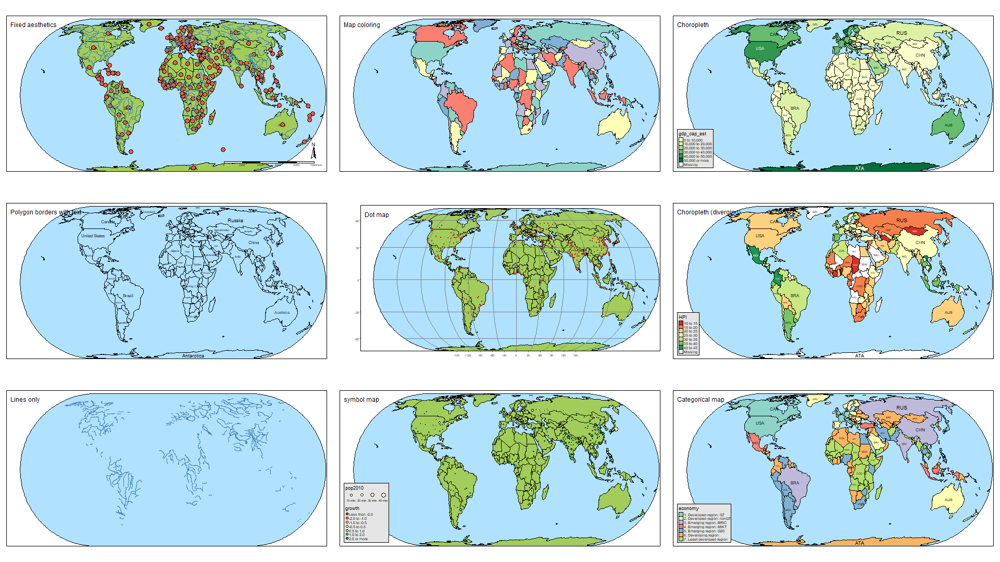
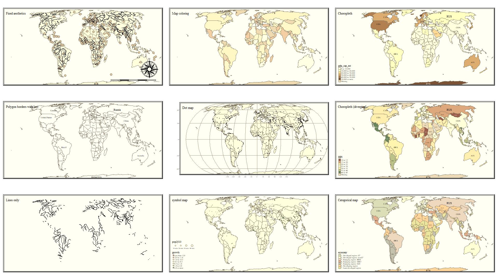

--- 
title: "EPI 563: Spatial Epidemiology, Fall 2020"
author: "Michael Kramer"
date: "Last updated: `r Sys.Date()`"
site: bookdown::bookdown_site
output: bookdown::gitbook
documentclass: book
bibliography: [book.bib]
biblio-style: apalike
link-citations: yes
github-repo: mkram01/EPI563-SpatialEPI
---

# How to use this eBook {-}


```{r echo = F, fig.align='center', out.width='50%', message = F, warning = F}
knitr::opts_chunk$set(cache = TRUE, message =F, warning =F)
knitr::include_graphics('images/John-Snows-cholera-map-of-009.jpg')

# dealing in advance with package conflicts:
library(conflicted)
conflict_prefer('shift', 'spatstat', quiet = T)
conflict_prefer('filter', 'dplyr', quiet = T)
conflict_prefer('select', 'dplyr', quiet = T)
conflict_prefer("area", "spatstat", quiet = T)
```


Welcome to *Concepts & Applications in Spatial Epidemiology (EPI 563)*! This eBook is one of several sources of information and support for your progress through the semester. For an overview of the course, expectations, learning objectives, assignments, and grading, please review the full course syllabus on Canvas. This eBook serves to provide a *'jumping off point'* for the content to be covered each week. Specifically, the content herein will introduce key themes, new vocabulary, and provide some additional detail that is complementary to the *asynchronous* (pre-recorded) video lectures, and foundational to the *synchronous* (in class) work. 

## Strategy for using this eBook {-}

There is a separate *module* or *chapter* for each week's content. In general, the content within each week's section is divided into two sections focusing on **spatial thinking** and **spatial analysis**. This dichotomy does not always hold, but in broad terms you can expect these sections to be more specific to content in class on *Tuesday* versus *Thursday* respectively.

* *Spatial thinking for epidemiology*: This section introduces vocabulary, concepts, and themes that are important to the incorporation of spatialized or geo-referenced data into epidemiologic work. At a minimum, plan to read this content prior to class Tuesday, although you will likely benefit from reading both sections before Tuesday.
* *Spatial analysis for epidemiology*: This section is more focused on data management, visualization, spatial statistics, and interpretation. This content is relevant for our work together on Tuesday's, but is essential for successful work in the Thursday lab activities. 

Please note that I will be continually updating the eBook throughout the semester, so if you choose to download, please double-check the **Last updated** date to be sure you have the most recent version.

 

  
This eBook is licensed under the [Creative Commons Attribution-NonCommercial-ShareAlike 4.0 International License](http://creativecommons.org/licenses/by-nc-sa/4.0/). 


<!--chapter:end:index.Rmd-->

# (PART) Getting ready... {-}


# Software installation {-}

The information in this module follow on the pre-class video on setting up `R` and `RStudio` on your computer. 

## Installing `R` on your computer {-}

As of August 2020, the most up-to-date version of `R` is 4.0.2. The *R Project for Statistical Computing* are continually working to update and improve `R`, and as a result there are new versions 1-2 times per year. 


If you already have `R` installed, you can open the console and check your current version by doing this: `R.Version()$version.string`

If you do not have `R` or have an older version than 4.0 you can install `R` by going to the `R` repository: https://www.r-project.org/. Note that there are many 'mirrors' or servers where the software is stored. Generally it is wise to select one that is geographically close to you, although any should work in theory. One mirror that is relatively close to Atlanta is here: http://archive.linux.duke.edu/cran/  

## Installing RStudio on your computer {-}

The current version of RStudio  1.3.1056. If you do not have RStudio or have a version older than 1.2 please install/update.


**TO INSTALL**: go to https://www.rstudio.com/products/rstudio/download/   

**TO UPDATE**: Open RStudio and go to Help Menu and choose 'Check for Updates'

# Installing packages for this course {-}

While base `R` has a great deal of essential functionality, most of the power of `R` comes from the rapidly growing list of user-created and contributed 'packages'. A package is simply a bundle of functions and tools, sometimes also including example datasets, basic documentation, and even tutorial 'vignettes'.  You can see all the official `R` packages by going here: https://cran.r-project.org/web/packages/. 

The most common way to install package in `R` is with the `install.packages()` command.  For instance to install the package `ggplot2` you do this:

`install.packages("ggplot2")`

Notice that for `install.packages()` you need quotes around the package name. Remember that you only need to install a package once (although you may have to update packages occasionally -- see the green Update button in the Packages tab in R Studio). When you want to actually *use* a package (for example `ggplot2`) you call it like this:

`library(ggplot2)`

Notice that for the `library()` function you **do not** need quotes around the package name (unlike the `install.packages()` above).  If your call to `library()` is working, nothing visible happens. However if you see errors, they might be because your package is out of date (and thus needs to be updated/reinstalled), or because some important *dependencies* are missing. Dependencies are other packages on which this package depends. Typically these are installed by default, but sometimes something is missing. If so, simply install the missing package and then try calling `library(ggplot2)` again. 

While **most** packages can be installed as mentioned above (e.g. using `install.packages()`), there are instances where an installation requires additional *tools*, for instance to install from source or from github.  Luckily there is a package for that! It is called `Rtools`, and you should install that **before** you install the packages below.

```{block2, type = 'rmdcaution'}
As you submit each installation request, note the output. If you get a warning that says installation was not possible because you are missing a package *'namespace'*, that suggests you are missing a dependency. Try installing the pacakge mentioned in the error. If you have trouble, reach out to the TA's!
```


## Installing `Rtools40` {-}

If your laptop uses a Windows operating system, you may need `Rtools40` installed. This is a supplemental package that resides *outside* of `R` but is needed to install some packages from source code.  However it appears that if you have a MacOS, these tools are already built-in. So you *do not need `Rtools40`* for Mac. 

If you are running Windows, navigate to this website: https://cran.r-project.org/bin/windows/Rtools/ and follow the instructions specific to your operating system. 

## Installing packages used for general data science {-}

For the rest of this page, copy and paste the provided code in order to install packages necessary for this course. Notice if you hover to the right of a code-chunk in the html version of the eBook, you will see a *copy* icon for quick copying and pasting.


These packages will support some of our general work in `R`, including working with `RMarkdown` and R Notebooks, as well as data manipulation tools from the `tidyverse`.  You can learn more about the `tidyverse` here: https://tidyverse.tidyverse.org/. The `tidyverse` is actually a collection of data science tools including the visualization/plotting package `ggplot2` and the data manipulation package `dplyr`. For that reason, when you `install.packages('tidyverse')` below, you are actually installing *multiple* packages!  The packages `tinytex`,  `rmarkdown`, and `knitr` are all necessary for creating `R` Notebooks, which is the format by which many assignments will be submitted.


```{r eval=FALSE}
install.packages('tidyverse')   
install.packages(c('tinytex', 'rmarkdown', 'knitr')) 
tinytex::install_tinytex()  
# this function installs the tinytex LaTex on your
#  computer which is necessary for rendering (creating) PDF's 
```


## Installing packages use for geographic data {-}

There are many ways to get the data we want for spatial epidemiology into `R`. Because we often (but don't always) use census geographies as aggregating units, and census populations as denominators, the following packages will be useful. They are designed to quickly extract both geographic boundary files (e.g. *'shapefiles'*) as well as attribute data from the US Census website via an API.  **NOTE**: For these to work you have to request a free Census API key.  Notice the `help()` function below to get instructions on how to do this.

```{r eval=FALSE}
install.packages(c('tidycensus','tigris')) 

help('census_api_key','tidycensus')
```


## Installing packages used for spatial data manipulation & visualization {-}


This section installs a set of tools specific to our goals of importing, exporting, manipulating, visualizing, and analyzing spatial data. The first line of packages have functions for defining, importing, exporting, and manipulating spatial data. The second line has some tools we will use for visualizing spatial data (e.g. making maps!). 

```{r eval=FALSE}
install.packages(c('sp', 'sf', 'rgdal', 'rgeos', 'maptools', 'OpenStreetMap'))  
install.packages(c('tmap', 'tmaptools', 'ggmap', 'shinyjs', 'shiny', 'micromap')) 
```


## Installing packages used for spatial analysis {-}

Finally these are packages specifically to spatial analysis tasks we'll carry out.

```{r eval= FALSE}
install.packages(c('spdep', 'CARBayes', 'sparr', 'spatialreg'))
install.packages(c('GWmodel', 'spgwr') )
```


<!--chapter:end:00-software-setup.Rmd-->

# (PART) Weekly Modules {-}

# Locating Spatial Epidemiology

## Getting Ready

### Learning objectives

```{r echo=FALSE, message=F, error = F, results = 'hide'}
library(huxtable)
library(tidyverse)
library(sp)
library(sf)
library(tmap)
lo <- rio::import('../schedule.xlsx', which = 'learning objectives')
```

```{r echo = F}
## define section
x <- 'Locating Spatial Epidemiology'
lo %>%
  filter(Mod2 == x) %>%
  as_hux() %>%
  select(3) %>%
  set_all_padding(2) %>%
  set_label('learning-ob') %>%
  set_caption('Learning objectives by weekly module') %>%
  set_bold(1, everywhere) %>%
  set_width(1) %>%
  set_wrap(TRUE) %>%
  theme_orange() 
```

### Additional Resources

* [Geocompution with R](https://geocompr.robinlovelace.net/) by Robin Lovelace. This will be a recurring 'additional resource' as it provides lots of useful insight and strategy for working with spatial data in `R`. I encourage you to browse it quickly now, but return often when you have qusetiona about how to handle geogrpahic data (especially of class `sf`) in `R`. 
* [A basic introduction to the  `ggplot2` package](https://bookdown.org/agrogankaylor/quick-intro-to-ggplot2/quick-intro-to-ggplot2.html). This is just one of dozens of great online resources introducing the *grammar of graphics* approach to plotting in `R`. 
* [A basic introduction to the `tmap` package](https://tlorusso.github.io/geodata_workshop/tmap_package#:~:text=The%20tmap%20package%20is%20a,as%20choropleths%20and%20bubble%20maps.) This is also only one of many introductions to the `tmap` mapping package. `tmap` builds on the *grammar of graphics* philosophy of `ggplot2`, but brings a lot of tools useful for thematic mapping!

### Important Vocabulary


```{r echo = F}
week <- 1
rio::import('vocabulary.xlsx') %>%
  filter(module == week) %>%
  arrange(Term) %>%
  select(-module) %>%
  as_hux() %>%
  set_all_padding(2) %>%
  set_caption(paste0('Vocabulary for Week ', week)) %>%
  set_bold(everywhere, 1) %>%
  set_width(.9) %>%
  #set_col_width(0.4, 0.6) %>%
  set_wrap(TRUE) %>%
  theme_blue() 
```


```{r echo = F}
knitr::include_graphics('images/data-models.png', dpi = NA)
```


## Spatial Thinking in Epidemiology

When first learning epidemiology, it can be difficult to distinguish between the concepts, theories, and purpose of epidemiology versus the skills, tools, and methods that we use to implement epidemiology. But these distinctions are foundational to our collective professional identity, and to the way we go about doing our work. For instance do you think of epidemiologists as data analysts, scientists, data scientists, technicians or something else? These questions are bigger than we can address in this class, but their importance becomes especially apparent when learning an area such as *spatial epidemiology*. This is because there is a tendency for discourse in spatial epidemiology to focus primarily on the *data* and the *methods* without understanding how each of those relate to the *scientific questions* and *health of population* for which we are ultimately responsible. Distinguishing these threads is an overarching goal of this course, even as we learn the data science and spatial analytic tools.

One quite simplistic but important example of how our questions and methods are inter-related is apparent when we think of  **data**. Data is central to quantitative analysis, including epidemiologic analysis. So how is *data* different in *spatial* epidemiology? The first thing that might come to mind is that we have explicitly geographic or spatial measures contained within our data. That the content of the spatial data is distinct: the addition of geographic or spatial location may illuminate otherwise *aspatial* attributes. But even more fundamental than the content is thinking about the *unit of analysis*.  

It is likely that many other examples in your epidemiology coursework the explicit (or sometimes implicit) unit of analysis has been the individual person. Spatial epidemiology can definitely align with individual-level analysis. But as we'll see, common units we observe and measure in spatial epidemiology -- and therefore the units that compose much of our **data** -- are not individuals but instead are geographic units (e.g. census tract, county, state, etc) and by extension the *collection* or *aggregation* of all the individuals therein. This distinction in unit of analysis has important implications for other epidemiologic concerns including precision, bias, and ultimately for inference (e.g. the meaning we can make from our analysis), as we'll discuss throughout the semester.

One concrete implication of the above discussion is that you should always be able to answer a basic question about any dataset you wish to analyze: "*what does one row of data represent?*"  A row of data is one way to think of the *unit of analysis*, and often (but not always) in spatial epidemiology a row of data is a summary of the population contained by a geographic unit. Said another way it is an *ecologic summary* of the population. As stated above, this is only the most simplistic example of how and why it is important to not only learn the spatial statistics and methods, but to also maintain the perspective of epidemiology as a population health science. To advance public health we need good methods but we also need critical understanding of the populations we support, the data we analyze, and the conclusions we can reliably draw from our work.

As we move through the semester, I encourage you to dig deep into how methods work, but also to step back and ask questions like *"Why would I choose this method?"* or *"What question in epidemiology is this useful for?"* 


## Spatial Analysis in Epidemiology

### Spatial data storage foramts

If you have worked with spatial or GIS data using ESRI's ArcMap, you will be familiar with what are called *shapefiles*.  This is one very common format for storing geographic data on computers. ESRI shapefiles are not actually a single file, but are anywhere from four to eight different files all with the same file name but different extensions (e.g. *.shp*, *.prj*, *.shx*, etc). Each different file (corresponding to an extension) contains a different portion of the data ranging from the geometry data, the attribute data, the projection data, an index connecting it all together, etc. 

What you may not know is that shapefiles are not the only (and in my opinion **definitely not the best**) way to store geographic data. In this class I recommend storing data in a format called *geopackages* indicated by the `.gpkg` extension. Geopackages are an open source format that were developed to be functional on mobile devices. They are useful when we are storing individual files in an efficient and compact way.  To be clear, there are many other formats and I make no claim that *geopackages* are the ultimate format; they just happen to meet the needs for this course, and for much of the work of spatial epidemiologists. It is worth noting that many GIS programs including ArcMap and QGIS can both read and write the geopackage format; so there is no constraint or limitation in terms of software when data are stored in `.gpkg` format.
    

### Representing spatial data in `R`

The work in this course assumes that you are a *basic `R` user*; you do not need to be expert, but I assume that you understand data objects (e.g. `data.frame`, `list`, `vector`), and basic operations including subsetting by index (e.g. using square brackets to extract or modify information: `[]`), base-R plotting, and simple modeling. If you **are not familiar with `R`**, you will need to do some quick self-directed learning. The instructor and TA's can point you to resources.

Just as our conceptualization of, or thinking about *data* in spatial epidemiology requires some reflection, the actual storage and representation of that data with a computer tool such as `R` also requires some attention. Specifically spatial data in `R` is not exactly like the conventional *aspatial* epidemiologic data which may exist in `R` as a rectangular `data.frame` for example, but it is also need not be as complex as spatial data in software platforms like ESRI's ArcMap. 

First, it may be obvious, but spatial data is more complex than simple rectangular attribute data (e.g. data tables where a row is an observation and a column is a variable).  To be *spatial*, a dataset must have a representation of geography, spatial location, or spatial relatedness, and that is most commonly done with either a *vector* or *raster* data model (see description above in vocabulary). Those spatial or geographic representations must be stored on your computer and/or held in memory, hopefully with a means for relating or associating the individual locations with their corresponding attributes. For example we want to know the attribute (e.g. the count of deaths for a given place), and the location of that place, and ideally we want the two connected together.

Over the past 10+ years, `R` has increasingly been used to analyze and visualize spatial data. Early on, investigators tackling the complexities of spatial data analysis in `R` developed a number of ad hoc, one-off approaches to these data. This worked in the short term for specific applications, but it created new problems as users needed to generalize a method to a new situation, or chain together steps. In those settings it was not uncommon to convert a dataset to multiple different formats to accomplish all tasks; this resulted in convoluted and error-prone coding, and lack of transparency in analysis.

An eventual response to this early tumult was a thoughtful and systematic approach to defining a *class of data* that tackled the unique challenges of spatial data in `R`. Roger Bivand, Edzer Pebesma and others developed the `sp` package which defined spatial data classes, and provided functional tools to interact with them. The `sp` package defined specific data classes to hold points, lines, and polygons, as well as raster/grid data; each of these data classes can contain geometry only (these have names like `SpatialPoints` or `SpatialPolygons`) or could contain geometry plus related data attributes (these have names like `SPatialPointsDataFrame` or `SpatialPolygonsDataFrame`). Each spatial object can contain all the information spatial data might include: the spatial extent (min/max x, y values), the coordinate system or spatial projection, the geometry information, the attribute information, etc. 

Because of the flexibility and power of the `sp*` class of objects, they became a standard up until the last few years.  Interestingly, it was perhaps the sophistication of the `sp*` class that began to undermine it. `sp*` class data was well-designed from a programming point of view, but was still a little cumbersome (and frankly confusing) for more applied analysts and new users. Analysis in *spatial epidemiology* is not primarily about computer programming, but about producing transparent and reliable data pipelines to conduct valid, reliable, and reproducible analysis. Thus epidemiologists, and other data scientists, desired spatial tools that could be incorporated into the growing toolbox of data science tools in `R`. 


These calls for a more user-friendly and intuitive approach to spatial data led the same team (e.g. Bivand, Pebesma, others) to develop the *Simple Features* set of spatial data classes for `R`. Loaded with the `sf` package, this data format has quickly become the standard for handling spatial data in `R`.  The power of the `sf` class, as discussed below, is that it makes *spatial data* behave like *rectangular data* and thus makes it amenable to manipulation using any tool that works on `data.frame` or `tibble` objects. Recognizing that many users and functions prefer the older `sp*` objects, the `sf` package includes a number of utility functions for easily converting back and forth. 

__In this class we will use `sf*` class objects as the preferred data class, but because some of the tools we'll learn require `sp*` we will occasionally go back and forth.__

`sf*` data classes are designed to hold all the essential spatial information (projection, extent, geometry), but do so with an easy to evaluate `data.frame` format that integrates the attribute information and the geometry information together. The result is more intuitive sorting, selecting, aggregating, and visualizing. 


### Benefits of `sf` data classes


As Robin Lovelace writes in his online eBook, [Gecomputation in R](https://geocompr.robinlovelace.net/), `sf` data classes offer an approach to spatial data that is compatible with QGIS and PostGIS, important non-ESRI open source GIS platforms, and `sf` functionality compared to `sp` provides:

1. Fast reading and writing of data
2. Enhanced plotting performance
3. `sf` objects can be treated as data frames in most operations
4. `sf` functions can be combined using `%>%` pipe operator and works well with the `tidyverse` collection of `R` packages ([see Tips for using `dplyr`](#dplyr) for examples)
5. `sf` function names are relatively consistent and intuitive (all begin with `st_`)


### Working with spatial data in `R`

Here and in lab, one example dataset we will use, called `ga.mvc` quantifies the counts and rates of death from motor vehicle crashes in each of Georgia's $n=159$ counties. The dataset is *vector* in that it represents counties as polygons with associated attributes (e.g. the mortality information, county names, etc). 

#### Importing spatial data into `R`

It is important to distinguish between two kinds of data formats.  There is a way that data is *stored on a computer hard drive*, and then there is a way that data is organized and managed *inside a program* like `R`. The *shapefiles* (`.shp`) popularized by ESRI/ArcMap is an example of a format for storing spatial data on a hard drive.  In contrast, the discussion above about the `sf*` and `sp*` data classes refer to how data is organized *inside `R`*.  Luckily, regardless of how data is *stored* on your computer, it is possible to import almost any format into `R`, and once inside `R` it is possible to make it into either the `sp*` or `sf*` data class. That means if you receive data as a `.shp` shapefile, as a `.gpkg` geopackage, or as a `.tif` raster file, each can be easily imported.

All `sf` functions that act on spatial objects begin with the prefix `st_`.  Therefore to import (read) data we will use `st_read()`. This function determines **how** to import the data based on the extension of the file name you specify. Look at the help documentation for `st_read()`. Notice that the first argument `dsn=`, might be a complete file name (e.g. `myData.shp`), or it might be a folder name (e.g. `mygeodatabase.gdb`). So if  you had a the motor vehicle crash data saved as both a shapefile (`mvc.shp`, which is actually six different files on your computer), and as a geopackage (`mvc.gpkg`) you can read them in like this:

```{r include = F, warning = F, message = F, results = 'hide'}
# this is the shapefile
mvc.a <- st_read('../DATA/GA_MVC/ga_mvc.shp') %>%
  select(GEOID, NAME, MVCRATE_17)

# this is the geopackage
mvc.b <- st_read('../DATA/GA_MVC/ga_mvc.gpkg')%>%
  select(GEOID, NAME, MVCRATE_17)

mvc <- st_read('../DATA/GA_MVC/ga_mvc.gpkg')
```
```{r eval = F}
# this is the shapefile
mvc.a <- st_read('GA_MVC/ga_mvc.shp')

# this is the geopackage
mvc.b <- st_read('GA_MVC/ga_mvc.gpkg')
```


We can take a look at the defined data class of the imported objects within `R`:

```{r}
class(mvc.a)
class(mvc.b)
```

First, note that when we use the `st_read()` function, the data class (e.g. the way the data are defined and organized *within `R`*) is the same for both `mvc.a` (which started as a `.shp` file) and `mvc.b` (which started as a `.gpkg` file). That is because `st_read()` automatically classifies spatial data using `sf` classes when it imports. 

You will also notice that when we examined the `class()` of each object, they are classified as **both** `sf` **and** `data.frame` class. That is incredibly important, and it speaks to an elegant simplicity of the `sf*` data classes! That it is classified as `sf` is perhaps obvious; but the fact that each object is *also classified* as `data.frame` means that we can treat the object for the purposes of data management,  manipulation and analysis as a relatively simple-seeming object: a rectangular `data.frame`.  How does that work? We will explore this more in lab but essentially each dataset has rows (observations) and columns (variables). We can see the variable/column names like this:

```{r}
names(mvc.a)
names(mvc.b)
```

We can see that each dataset has the same *attribute* variables (e.g. `GEOID`, `NAME`, `MVCRATE_17`), and then a final column called `geometry` in one and called `geom` in another. These geometry columns are unique in that they don't hold a single value like the other columns; each *'cell'* in those columns actually contains an embedded list of $x,y$ coordinates defining the vertices of the polygons for each of Georgia's counties.

Combining these two observations, we now know that we can work with a wide range of spatial data formats, and that once imported we can conceive of (and manipulate!) these data almost as if they were simple rectangular datasets. This has implications for subsetting, recoding, merging, and aggregating data as we'll learn in the coming weeks.


#### Exporting spatial data from `R`

While importing is often the primary challenge with spatial data and `R`, it is not uncommon that you might modify or alter a spatial dataset and wish to save it for future use, or to write it out to disk to share with a colleague. Luckily the `sf` package has the same functionality to write an `sf` spatial object to disk in a wide variety of formats including *shapefiles* (`.shp`) and *geopackages* (`.gpkg`). Again, `R` uses the extension you specify in the filename to determine the target format.

```{r eval = F}
# Write the file mvc to disk as a shapefile format
st_write(mvc, 'GA_MVC/ga_mvc_v2.shp')

# Write the file mvc to disk as a geopackage format
st_write(mvc, 'GA_MVC/ga_mvc_v2.gpkg')
```

 
### Basic visual inspection/plots

The base-R `plot()` function is extended by the `sf` package. That means that if you call `plot()` on a spatial object **without having loaded** `sf`, the results will be different than if `plot()` called **after loading** `sf`. 

When you `plot()` with `sf`, by default it will try to make a map **for every variable in the data frame**! Try it once. If this is not what you want, you can force it to only plot *some* variables by providing a vector of variable names.

```{r }
plot(mvc) # this plots a panel for every column - or actually the first 10 columns
```

```{r}
plot(mvc['MVCRATE_05']) # this plots only a single variable, the MVC mortality rate for 2005

plot(mvc[c('MVCRATE_05', 'MVCRATE_17')]) # this plots two variables: MVC rate in 2005 & 2017
```


You might only want to see the geometry of the spatial object (e.g. not attributes) if you are checking its extent, the scale, or otherwise confirming something about the spatial aspects of the object. Here are two approaches to quickly plot the geometry:

```{r eval = F}
plot(st_geometry(mvc)) # st_geometry() returns the geom information to plot
```
```{r eval = T}
plot(mvc$geom)  # this is an alternative approach...directly plot the 'geom' column
```


### Working with CRS and projection

If CRS (coordinate reference system) and projection information was contained in the original file you imported, it will be maintained. **If there is NO CRS information imported it is critical that you find out the CRS information from the data source!** The most unambiguous way to describe a projection is by using the **EPSG** code, which stands for *European Petroleum Survey Group*. This consortium has standardized hundreds of projection definitions in a manner adopted by several `R` packages including `rgdal` and `sf`. 

This course is not a GIS course, and learning about the theory and application of coordinate reference systems and projections is not our primary purpose. However some basic knowledge *is necessary* for successfully working with spatial epidemiologic data. Here are several resources you should peruse to learn more about CRS, projections, and EPSG codes:

* [A useful overview/review of coordinate reference systems in `R`](https://www.nceas.ucsb.edu/sites/default/files/2020-04/OverviewCoordinateReferenceSystems.pdf)
* [Robin Lovelace's Geocompuation in R on projections with `sf`](https://geocompr.robinlovelace.net/reproj-geo-data.html)
* [EPSG website:](https://epsg.io/) This link is to a searchable database of valid ESPG codes
* [Here are some useful EPSG codes](https://guides.library.duke.edu/r-geospatial/CRS)


```{r echo = F, out.width='50%', fig.cap='Comparing CRS'}
knitr::include_graphics('images/compare-crs.jpg', dpi = NA)
```


The choice of CRS and/or projection has a substantial impact on how the produced map looks, as is evident in the figure above ([source of image](https://datacarpentry.org/organization-geospatial/03-crs/)).

We already saw the CRS/projection information of the `mvc` object when we used the `head()` function above; it was at the top and read `WGS 84`. Recall there are two main types of CRS: purely **geographic** which is to say coordinate locations are represented as *latitude* and *longitude* degrees; and **projected** which means the coordinate values have been transformed for representation of the spherical geoid onto a planar (Euclidean) coordinate system. `WGS 84` is a ubiquitous geographic coordinate system common to boundary files retrieved from the U.S. Census bureau. 

An important question when you work with a spatial dataset is to understand whether it is primarily a geographic or projected CRS, and if so which one. 

```{r }
st_is_longlat(mvc)
```

This quick logical test returns `TRUE` or `FALSE` to answer the question *"Is the `sf` object simply a longitude/latitude geographic CRS?"*. The answer in this case is `TRUE` because `WGS 84` is a geographic (longlat) coordinate system. But what if it were `FALSE` or we wanted to know more about the CRS/projection?

```{r}
st_crs(mvc)
```

This somewhat complicated looking output is a summary of the CRS stored with the spatial object. There are two things to note about this output:

* At the top, the *User input* is `WGS 84`
* At the bottom of the section labeled `GEOGCRS` it says `ID["EPSG",4326"]`

While there are literally hundreds of distinct EPSG codes describing different geographic and projected coordinate systems, for this semester there are three worth remembering: 

* __EPSG: 4326__ is a common geographic (unprojected or long-lat) CRS
* __EPSG: 3857__ is also called *WGS 84/Web Mercator*, and is the dominant CRS used by Google Maps
* __EPSG: 5070__ is the code for a projected CRS called *Albers Equal Area* which has the benefit of representing the visual area of maps in an equal manner.

Once the CRS/projection is clearly defined, you may choose to transform or *project* the data to a different system. The `sf` package has another handy function called `st_transform()` that takes in a spatial object (dtaaset) with one CRS and outputs that object *transformed* to a new CRS.

```{r eval = F}
# This uses the Albers equal area USA, 
mvc.aea <- st_transform(mvc, 5070)

# This uses the Web Mercator CRS (EPSG 3857) which is just barely different from EPSG 4326
mvc.wm <- st_transform(mvc, 3857)

# Now let's look at them side-by-side
plot(st_geometry(mvc), main = 'EPSG 4326')
plot(st_geometry(mvc.wm), main = 'Web Mercator (3857)')
plot(st_geometry(mvc.aea), main = 'Albers Equal Area (5070)')
```


```{r eval = T, echo = F}
# This uses the Albers equal area USA, 
mvc.aea <- st_transform(mvc, 5070)

# This uses the Web Mercator CRS (EPSG 3857) which is just barely different from EPSG 4326
mvc.wm <- st_transform(mvc, 3857)

# Now let's look at them side-by-side
par(mfrow = c(1, 3)) # This is so we can see the 3 plots side-by-side

plot(st_geometry(mvc), main = 'EPSG 4326')
plot(st_geometry(mvc.wm), main = 'Web Mercator (3857)')
plot(st_geometry(mvc.aea), main = 'Albers Equal Area (5070)')

par(mfrow = c(1,1)) # Now return the par settings for graphic device
```


Do you see the difference between the three? Because EPSG 4326 and 3857 are both unprojected (e.g. they are long/lat), they appear quite similar but are not identical. Albers Equal Area, on the other hand, is more distinct. In general we will prefer to use *'projected'* rather than *'unprojected'* (long/lat only) data for both visualization and analysis. That means that whenever you bring in a new dataset you will need to check the CRS and project or transform as desired. 


```{block2, type = 'rmdcaution'}
**Important:** It is important to distinguish between defining the current projection of data and the act of *projecting* or *transforming* data from one known system to a new CRS/projection. **We cannot transform data until we correctly define its current or original CRS/projection status.** The above function tells us what the current status is.  In some cases data do not have associated CRS information and this might be completely blank (for instance if you read in numerical $x,y$ points from a geocoding or GPS process). In those cases you can **set** the underlying CRS using `st_set_crs()` to define it, but this assumes you **know** what it is. There are two arguments to this function: the first is `x = objectName`, and the second is `value = xxx` where *'xxx'* is a valid EPSG code. 
```


<!--chapter:end:01-locating-spatial-epi.Rmd-->

# Cartography for Epidemiology I

## Getting Ready

### Learning objectives, w2

```{r echo=FALSE, message=F, error = F, results = 'hide'}
library(huxtable)
library(tidyverse)
lo <- rio::import('../schedule.xlsx', which = 'learning objectives')
```

```{r echo = F}
## define section
x <- 'Cartography for Epidemiology I'
lo %>%
  filter(Mod2 == x) %>%
  as_hux() %>%
  select(3) %>%
  set_all_padding(2) %>%
  set_label('learning-ob') %>%
  set_caption('Learning objectives by weekly module') %>%
  set_bold(1, everywhere) %>%
  set_width(1) %>%
  set_wrap(TRUE) %>%
  theme_orange() 
```

### Additional Resources, w2 

* [CDC Guidance for Cartography of Public Health Data (complements required reading)](https://www.cdc.gov/dhdsp/maps/gisx/resources/tips-creating-ph-maps.html )
* [When Maps Lie](https://www.citylab.com/design/2015/06/when-maps-lie/396761/) 
* [Color Brewer Website for color guidance in choropleth maps](http://colorbrewer2.org/#)


### Important Vocabulary, w2


```{r echo = F}
week <- 2
rio::import('vocabulary.xlsx') %>%
  filter(module == week) %>%
  arrange(Term) %>%
  select(-module) %>%
  as_hux() %>%
  set_all_padding(2) %>%
  set_caption(paste0('Vocabulary for Week ', week)) %>%
  set_bold(everywhere, 1) %>%
  set_width(.9) %>%
  #set_col_width(0.4, 0.6) %>%
  set_wrap(TRUE) %>%
  theme_blue() 
```

## Spatial Thinking in Epidemiology, w2

Making pretty maps is not the full extent of spatial epidemiology. However, *epidemiologic cartography*  can sometimes be the beginning and end of *spatial epidemiology* for a given purpose. And even when an epidemiologic analysis goes well beyond mapping (perhaps to incorporate *aspatial* analysis, or to incorporate more sophisticated *spatial* analysis), the ability to produce a clear, concise, and interpretable map is an important skill. 

As Robb, et al^[Robb SW, Bauer SE, Vena JE. Integration of Different Epidemiological Perspectives and Applications to Spatial Epidemiology. Chapter 1 in Handbook of Spatial Epidemiology. 2016. CRC Press, Boca Raton, FL.] write:

>Disease mapping can be used to provide *visual cues* about disease etiology, particularly as it relates to environmental exposures....Mapping where things are allows visualization of a baseline pattern or spatial structure of disease, potential detection of disease clusters, and the initial investigation of an exposure-disease relationship. 

There are aspects of cartography and map design that are general to most thematic maps of quantitative data. But there are some issues that seem especially pertinent to us as epidemiologists or quantitative population health scientists.  These include the decisions we make about color choice and the process of categorizing numerical data for visual representation in a map. 

Why are these especially important for epidemiology? A primary purpose of a map is to visually represent *something meaningful* about the *spatial or geographic variation* in health or a health-relevant feature (e.g. an exposure or resource). Communicating what is *meaningful* and representing *variation* that matters is not solely a technical GIS task; it requires epidemiologic insight. For instance our approach to representing ratio measures such as an *odds ratio* or *risk ratio* should be different from how we represent *risk* or *rate* data, because we understand that the scale and units are distinct in each case. Similarly, we understand that understanding variation or heterogeneity in a *normal* or *Gaussian* (bell-shaped curve) distribution is different from a uniform or a highly skewed distribution with a long right tail.  This insight into how scales and values are differently interpretted epidemiologically muts be translated into sensible choices in mapping.

### Color choices

For most thematic maps, color is the most flexible and important tools for communication. Color, hue, and contrast can accentuate map elements or themes and minimize others. The result is that you can completely change the story your map tells with seemingly small changes to how you use color. This means you should be clear and explicit about *why you choose* a given color or sequence of colors, and beware of unintentionally misrepresenting your data by your color choices.  

In producing choropleth maps, we often talk about collections of colors as *color ramps* or *color palettes*, because a single color by itself is not very interesting. A quick scan of either the `tmaptools::palette_explorer()` utility, or [the Color Brewer website](http://colorbrewer2.org/#) will demonstrate that there are many colors to choose from, so is it just a matter of preference? Perhaps, but there are some guidelines to keep in mind.

#### Sequential palettes

All color palettes use the color hue, value, or saturation to represent or symbolize the values of the underlying statistical parameter of interest.  When a parameter or statistic is naturally ordered, sequential and monotonic, then it makes sense to choose colors that range from light to dark. Conventionally *lighter* or more neutral tones represent lower or smaller numbers and *darker* colors and more intense tones represent higher or larger numbers. The dark colors jump out at the viewer more readily, so occasionally the inverse is used to emphasize small values, but this should be done with caution as it can be counterintuitive.


```{r echo = F, fig.cap= 'Sequential color palettes'}
knitr::include_graphics('images/palette-sequential.png', dpi = NA)
```


```{block2, type = 'rmdnote'}
Sequential palettes are useful for epidemiologic parameters such as prevalence, risk, or rates, or continuous exposure values where the emphasis is on distinguishing higher values from lower values.
```


#### Diverging palettes

A less common choice, but one that is especially important for some epidemiologic parameters, is the diverging palette. In this pattern, the *neutral color* is in the center of the sequence, with two different color hues become darker and more intense as they go out from the center.

```{r echo = F, fig.cap='Diverging color palettes'}
knitr::include_graphics('images/palette-diverging.png', dpi = NA)
```

You might choose this color sequence for one of two reasons:

1. You wish to show how units vary around the overall mean or median, highlighting those that are *larger than* versus *smaller than* the overall mean/median. For instance diverging palettes might emphasize areas with particularly high burden of disease (and therefore in need of additional attention), as well as those with unexpectedly low burden of disease (and therefore worthy of understanding about protective factors).
2. You are mapping *any epidemiologic parameter on the ratio scale* where there are values both above and below the null ratio of $1.0$.  For example if  you map *Standardized Mortality/Morbidity Ratios*, *risk or odds ratios*, or *prevalence ratios*, you potentially have diverging data. The exception would be if all of the ratio values were on the same side of the null (e.g. all were $>>1$ or $<<1$).

```{r echo = F, fig.cap='Mapping ratio measure with divergent palette', out.width='50%'}
knitr::include_graphics('images/diverge-smr.png', dpi = NA)
```

In the map above, the SMR (a ratio of the county-specific prevalence of very low birth weight infants to the overall statewide live birth prevalence) varies from $0.13$ to $2.30$.  But this range is not sequential in the same way as a *risk* or *prevalence*. Instead the neutral color is assigned to counties in the range of $0.90-1.10$, around the null. This is a way of indicating these counties are *average* or *typical*. In contrast, counties with increasing *excess morbidity* have darker green, and substantially *lower morbidity* are darker purple. 

#### Qualitative palettes

Qualitative refers to categories that are not naturally ordered or sequential. For instance if counties were assigned values for the single leading cause of death in the county, we might choose a qualitative palette, as a sequential or diverging palette might mislead the viewer into thinking there is some natural ordering to which causes should be more or less intense in their color.


### Choropleth binning styles

A second topic relevant to the intersection of *cartography* and *epidemiologic thinking* is the means by which we choose cutpoints for visualizing data. In other words for a map to visually represent some underlying statistical value, we have to assign or map numerical values to colors. How you do that depends greatly on the intended message or story your map needs to tell. Are you interested in distinguish units that rank higher or lower in values? Or are you primarily focused on finding extreme outliers, with variation in the '*middle*' of the distribution of less interest? These distinct purposes give rise to different decisions about how to assign colors to numerical values in your data.

```{r echo = F, fig.cap='Comparing binning styles with same data', out.width='75%'}
knitr::include_graphics('images/cutpoints-vlbw.png', dpi = NA)
```

As discussed in the lecture, there are numerous methods or styles for categorizing continuous data for choropleth mapping (e.g. identical data is summarized under four different styles in figure above).  Cynthia Brewer (of [ColorBrewer](https://colorbrewer2.org/#type=sequential&scheme=BuGn&n=3) fame) and Linda Pickle [-@brewer_evaluation_2002] sought to evaluate which styles are most effective for communicating the spatial patterns of epidemiologic data. 

As cartographers, Brewer & Pickle were critical of the epidemiologists' over-reliance on quantile cutpoints, given many other strategies that seemed to have cartographic advantages.  However, after randomizing map '*readers*' to interpret maps of the same underlying epidemiologic data using *seven different styles*, they determined that readers could most accurately and reliably interpret the disease patterns in maps using *quantile cutpoints*. While there are benefits of the other styles for some purposes, for the common use of communicating which spatial areas *rank higher or lower* in terms of disease burden, quantiles are most straightforward.

#### Mapping time series

It is common in spatial epidemiology that we want to map the spatial patterns of disease for several different snapshots in time as a series to observe the evolution of disease burden over time. But changing patterns over time raises additional questions about how to make cuts to the data. There are several options for determining the cutpoints when you have a time series: 

1. Pool all of the years data together before calculating the cutpoints (e.g. using quantiles). Use the pooled cutpoints for all years.
2. Create custom year-specific cutpoints that reflect the distribution of data for each year separately.
3. Create cutpoints based on a single year and apply them to all other years.


```{r echo = F, fig.cap='Georgia MVC deaths by year with a common scale'}
knitr::include_graphics('images/time-series-ga-same-cuts.png', dpi = NA)
```

The map above of Georgia motor vehicle crash mortality data in three different years (2005, 2014, 2017), was created in `tmap` using the `tm_facet()` option where the the `by = ` was year.  As a result, the quantile cutpoints represent the breaks *pooling all observations across the three years*.  In other words the cutpoints come from 159 counties times three years: 477 values. 

By having a common legend that applies to all three maps, this strategy is useful for comparing *differences in absolute rates* across years.

```{r echo = F, fig.cap='U.S. heart disease mortality with a year-specific scales'}
knitr::include_graphics('images/time-series-us-quantiles.jpg', dpi = NA)
```


The map above of heart disease mortality rates by county in two years (1973-4; 2009-10) uses quantile breaks calculated *separately for each time period*.  This was done in part because the heart disease mortality rate declined so much between these years that a scale that distinguished highs from lows on one map would not distinguish anything on the other map. In this case what is being compared is not the *absolute rates* but the *relative ranking of counties* in the two years. 

## Spatial Analysis in Epidemiology, w2 

Every spatial epidemiology project must include attention to data acquisition, cleaning, integration, and visualization. The specific workflow is driven largely by the overarching epidemiologic question, purpose, or goal.  In this section we use a specific question to illustrate key steps to data preparation for epidemiologic cartography. 

>**Case Example Objective**: Create a choropleth map visualizing geographic variation in the all-cause mortality rate for U.S. counties in 2016-2018. Compare this to a choropleth map of % uninsured in U.S. counties.

This objective will be directly relevant for the lab this week as well as for the *Visualizing US Mortality, Visual Portfolio*, an assignment due later in the semester. 

Although this specific question dictates specific data needs, these four types of data are frequently needed to produce a map of a health outcome or state:

1. Numerator data, in this case representing the count of deaths per county in the target year
2. Denominator data, in this case representing the population at risk for death in each county in the target year
3. Contextual or covariate data, in this case the prevalence uninsured for each U.S. county
4. Geometric data representing the shapes and boundaries of U.S. counties


### Obtaining and preparing numerator data

The event of interest (e.g. the numerator in a risk, rate, or prevalence) can come from many sources. If you are conducting primary data collection, it arises from your study design and measurement. When using secondary data, it is common to use surveillance data (e.g. vital records, notifiable diseases, registries, etc) or administrative data as a source of health events. 

When using secondary data sources owned or managed by another entity, one challenge that can occur is *suppression of data* to protect privacy. For example the National Center for Health Statistics mortality data available from [CDC WONDER](https://wonder.cdc.gov/) suppresses the count of deaths, as well as the crude mortality rate, whenever the *numerator count is less than ten events*. There can also be instances when a local or state public health agency fails to report data to NCHS, producing missing values.

```{block2, type = 'rmdcaution'}
Depending on the data format, it is possible that either **missing** or **suppressed** data could be inadvertently imported into R as *zero-count* rather than missing.  It is therefore critically important to understand the data source and guidelines. The decision about how to manage zero, missing, and suppressed data is an epidemiologic choice, but one that must be addressed *before creating a map*.  
```

```{block2, type = 'rmdtip'}
**How to deal with data suppression**.  There are many reasons your target data may fall below thresholds for suppressions. Perhaps the outcome event is quite rare, or you are stratifying by multiple demographic factors, or perhaps you are counting at a very small geographic unit.  If suppression is problematic for mapping, consider pooling over multiple years, reducing demographic stratification, or using larger geographic areas to increase event count and reduce the number of suppressed cells. 
```

For this example, we have downloaded all-cause mortality counts by county from CDC WONDER for 2016-2018 (pooling over three years to reduce suppression).  In Lab we will discuss the procedure for acquiring data from the web. After importing the data this is how it appears.

```{r include = F}
library(sf)
library(tidyverse)
library(tidycensus)
library(tmap)
death <- read.table('../DATA/all-cause-mortality/all-cause-mortality-2018-clean.txt', sep ='\t',
                    header = T, na.strings = c('Missing', 'Suppressed'), stringsAsFactors = F) %>%
  mutate(crude = Deaths / Population * 1e+05,
         FIPS = sprintf('%05d', County.Code)) %>%
  select(FIPS, County, Deaths, Population, crude)

```

```{r}
head(death)
```


### Obtaining and preparing denominator or contextual data
 
 
The mortality data accessed from CDC included both numerator (count of deaths) and denominator (population at risk). However there are instances where you may have one dataset that provides the health event data (numerator), but you need to link it to a population denominator in order to calculate risk, rate, or prevalence.  The U.S. Census Bureau maintains the most reliable population count data for the U.S., and it is available in aggregates from Census Block Group, Census Tract, Zip code tabluation area, City or Place, County, State, and Region. 

Census data can be aggregated as total population or stratified by age, gender, race/ethnicity, and many other variables. The census data also contains measures of social, economic, and housing attributes which may be relevant has *context* or *exposures* in spatial epidemiologic analyses. There are two broad types of data demographic and socioeconomic data released by the Census Bureau.

* __Decennial Census__ tables which (theoretically) count 100% of the population every 10 years. These can be cross-classified by age, race/ethnicity, sex, and householder status (e.g. whether head of house owns or rents and how many people live in house)
* __[American Community Survey (ACS)](https://www.census.gov/programs-surveys/acs)__ tables which provide a much larger number of measures but are based on samples rather than complete counts. The ACS began in the early 2000's and is a continually sampled survey. Despite being collected every year, for many small areas (e.g. census tracts or even counties) there are not enough responses in a single year to make reliable estimates. Therefore ACS data pooled into 5-year moving-window datasets. For instance the 2014-2018 ACS (the most recent release) reports estimates for all responses collected during that time period, and these are available from the Census Block Group up. The next release will probably come in late 2020, and will be for 2015-2019.


You may have accessed Census or ACS data directly from the Census Bureau website for other classes or tasks in the past.  In the interest of *reproducibility* and efficiency, we introduce the `tidycensus` package in `R`. It is an excellent tool for acquiring either Decennial Census or ACS data directly within `R`. The advantage of doing so is twofold: first it can be quicker once you learn how to do it; second, it makes your data acquisition fully reproducible without any unrecorded steps happening in web browsers.


```{block2, type = 'rmdnote'}
We will practice the code in the next few sections in lab. It is included here as a primer. In these sections I walk through **one way** to download and prepare data to quantify the county-level prevalence of the population who are uninsured, as this might be a covariate of interest when examining spatial variation in mortality.  I selected the code below because it is *relatively* efficient, although you may find some of it complex or confusing. I include it for those who would like to explore other data-manipulation functions in `R`. Please note that you do not need learn all of the functions in this Census data acquisitions section below for this course, although you might find these or related approaches useful.  Note also that there are many ways to accomplish anything in `R`, and you could achieve the same ends with different strategies.
```

 

#### Setting up Census API

To access any Census products (e.g. attribute tables or geographic boundary files) using the `tidycensus` package, you need to *register* yourself by declaring your API key.  If you haven't already done so, [go here to register for the key](https://api.census.gov/data/key_signup.html).


```{r eval = F}
# Only do this if you haven't already done it; it should only need to be done once.

tidycensus::census_api_key('YourKeyHere', install = T) 
```


#### Choosing Variables

By far the biggest challenge of requesting data from the Census Bureau is knowing *what you want*, and *where it is stored*. Census data are distributed as aggregated counts contained in *specific tables* (each has a unique ID), and made up of *specific variables* (also a unique ID composed of table ID plus a unique ID).  There are two ways to find variables:

* You could go to the Census website and browse around. For instance the [Census Data Explorer website](https://data.census.gov/cedsci/) is one way to browse the topics and variables
* You could download all of the variables for a given year into `R`, and use filters to search it.

This code queries the Census website (assuming you have internet connection) and requests a list of all variables for the ACS 5-year pooled dataset (e.g. `acs5`) and for the window of time ending in 2018 (e.g. 2014-2018).  I also specify `cache = T` which just means to save the results for quicker loading if I ask again in the future.

```{r results = 'hide'}
library(tidycensus)

all_vars <- load_variables(year = 2018, dataset = 'acs5', cache = T)

head(all_vars)
```

It may be easiest to look at the dataset using the `View()` function. When you do so, you see the three variables, and you have the option to click the **Filter** button (upper left of View pane; looks like a funnel). The *Filter* option is one way to search key words in either the `label` or `concept` column. 

We are interested in capturing the prevalence of uninsured in each county. Try this:

* Go to View mode of variables (e.g. `View(all_vars)`)
* Click the *Filter* button
* Type `insurance` in the `concept` field
* Type `B27001` in the `name` field


```{r echo = F, fig.cap='Screenshot of RStudio View() of ACS variables'}
knitr::include_graphics('images/acs-var-view.PNG', dpi = NA)
```

What we want is a list of the specific tables and variable ID's to extract from the Census.  In lab we will use some more detailed code to accomplish this goal. 

You may have noticed that the full list of ACS variables has nearly 27,000 variables! In the code below I use some tricks to filter the huge list of all variables to get only the names I want. It relies on the `tidyverse` package `stringr` which is great for manipulating character variables (this is great for many data science tasks; [read more about `stringr` here](https://stringr.tidyverse.org/)). In this case I am using it to filter down to just the table I want (e.g. `B27001`), and then to get the names of the variables that contain the string *'No health insurance'*. 

```{r include = F}
a <- all_vars %>% 
  filter(stringr::str_detect(name, 'B27001')) %>%  # this limits to rows for the B27001 table
  filter(stringr::str_detect(label, 'No health insurance'))  # this limits to rows with this text

a2 <- dput(a$name)
myVars <- c('B27001_001', a2)
```

Here is the list of variables we want to acquire; each one represents a count of uninsured at each of multiple age groups. We will sum them up to get a total population uninsured prevalence.

```{r echo = F}
myVars
```

#### Retrieving data from Census

To actually retrieve data from the Census we use the function `get_acs()` (or if you were getting decennial data the function would be `get_decennial()`). When you request data you must specify the geography (e.g. do you want counts for states, counties, census tracts, census block groups?), the variables, the year, and the dataset.  Look at `?get_acs` to read more about options. 


The following code chunks use the `dplyr` and `tidyvrse` verbs and the `%>%` (pipe) to connect data steps together. This is complex at first, but it is worth carefully examining how each step works. If you are not familiar with this syntax, it would probably be helpful to [review the Appendix section on `dplyr`](#dplyr). 

 

```{r message = F}
# First, request the data from ACS
insure_tidy <- get_acs(geography = 'county',
                     variables = myVars,
                     year = 2018, 
                     survey = 'acs5') %>%
  select(-moe)

# Look at the resulting object
head(insure_tidy)
```

Looking at the first few rows of the data object `insure_tidy` above, you might be surprised that there is a column labeled `variable`, and the cells within that column are actually what we *thought were the variable names*!  That is because these data are structured in a `tidy` format, which happens to be *long* not *wide*. [Read more about transposing data here](#pivot_).  In the following steps we will reshape this data to be more useful.

What this code does:  

* define the `geography = ` as county. 
* Specify the vector (previously created and named `myVars`) of variables to download
* Specify the year of interest. Note that 2018 references the *2014-2018* 5-year window
* specify the survey, which will most often be `acs5`

```{r}
# Now I pull out the denominator
insure_denom <- insure_tidy %>%
  filter(variable == 'B27001_001') %>%
  rename(TOTPOP = estimate) %>%
  select(-variable)

# Look at the resulting object
head(insure_denom)
```

The code above was necessary because most of the variables were age-specific counts of the number of uninsured people. But one variable, `B27001_001` is the count of all included in the table. In other words, it is the *denominator* for calculating the prevalence of uninsured. Therefore I did the following in the code above:

* `filter()` restricts to only the rows of data where the variable is the denominator count (B27001_001). Filter is like `where` in SAS
* `rename()` is a way to rename variables to my own liking
* `select()` drops the variable called `variable`

```{r}
# Now I sum up all the variables for the numerator
insure_num <- insure_tidy %>%
  filter(variable != 'B27001_001') %>%
  group_by(GEOID) %>%
  summarise(no_insure = sum(estimate))

head(insure_num)
```
The code above addresses an issue common to census tables: they may not be constructed in the way you want them. As discussed above, in this case the values are counts for each age group, but we only want a single count for the entire population of each county. Therefore, it is necessary to *sum across* or *aggregate* the counts over all age groups to get a single count (the numerator number of uninsured) for each county. The strategy used above was specific to the data being in *long format*, which happens to be `tidy` data in this case. [Read about changing between long and wide here](#pivot_).

The code above achieves this through steps:

* `filter()` using the `!=` mean "*is __not__ equal to*"; this simply removes the denominator variable, so that we are only summing over numerator counts
* `group_by()` is a very useful `dplyr` verb; it is similar to using `class` in SAS, and tells `R` to do something separately for each group (e.g. each `GEOID` or county in this case)
* `summarise()` is a verb that works hand-in-hand with `group_by()`. The grouping declares which groups, but the `summarise()` tells what to do. In this case we just want to count up all of those uninsured across all age gruops.


```{r}

# Finally, merge the numerator and denominator in order to calculate prevalence
uninsured <- insure_denom %>%
  left_join(insure_num, by = 'GEOID') %>%
  mutate(uninsured = no_insure / TOTPOP) %>%
  select(GEOID, uninsured)

# Take a look at the resulting object
head(uninsured)
```

This was a simple merge, but it is worth mentioning a few of the steps:

* `left_join()` is one of a famiy of *merging* verbs. The *left* in `left_join()` simply means start with the first table (the one on the left) and merge with the second table. The implications are with whether all rows or only rows in the left or the right (first or second) table are retained. In this case the *left* of *first* table is `insure_denom` and the *right* or *second* table is *insure_num*)
* `mutate()` calculates the uninsured prevalence
* `select()` excludes unnecessary variables


```{block2, type = 'rmdnote'}
The code process above was complex. While it was specific to this exact scenario, each scenario might require different steps. The challenge for you, the new spatial analyst, is to think through in your mind how the data looks at the beginning and how you want it to look at the end. Then create a sequence of steps that progressess from beginning to end. It takes practice, but is worthwhile for spatial epidemiology, but also for data science and processing more generally.
```


### Obtaining and preparing geographic data

The final type of data needed is the geographic or geometry data. Again, the source for geometry data varies by the study specifics: you may need polygons (e.g. political or administrative boundaries), lines (e.g. transportation networks), or points (e.g. hospitals, food stores, toxic waste sites, etc). On the other hand you may need or have data that are in raster format, including weather or air pollution surfaces. There are open-access versions of many types of geographic data online. 

For choropleth mapping, area units including administrative and political boundaries are commonly used. In the U.S. context, the Census geographies are frequently used, including blocks, block groups, tracts, zip-code tabluation areas, counties, cities & places, metropolitan areas, tribal areas, states, and regions. In this section I provide a brief introduction to downloading census boundary files directly into `R`.


#### Obtain geometry data from `tidycensus`

The first option is a very minor modification to the code in the previous section acquiring census count data.  The `get_acs()` function has an argument `geometry = ` that is `FALSE` by default. However, if you change it to `geometry = TRUE`, you will automatically retrieve the data as an `sf` object including a geometry column!

```{r eval = F}
insure_tidy <- get_acs(geography = 'county',
                     variables = myVars,
                     year = 2018, 
                     geometry = TRUE,   # added geometry = T
                     survey = 'acs5') 

```


```{block2, type = 'rmdnote'}
One other argument to `get_acs()` not demonstrated here is `shift_geo`.  It is `FALSE` by default, but if set to `shift_geo = TRUE`, it will return boundaries that have been projected to Albers Equal Area, and where the states of Hawaii and Alaska are artificially shifted to *fit* on a thematic map of the U.S. 
```

#### Obtain geometry data from `tigris`

The `tidycensus` package actually requests the geometry by depending on another package called `tigris` (the Census geography files are called *TIGER* files). If you are obtaining both attributes (e.g. population counts) and geometries at the same time, the `tidycensus` package makes the  most sense. However, sometimes you *only need the geometry*, perhaps because the other data come from sources other than the Census Bureau. 

If you want to directly obtain areal boundary units, coastline data, road or rail networks, voting districts, or other spatial data maintained by the Census Bureau, consider using the `tigris` package.  Try looking at the help documentation (e.g. `?tigris`, then click the *Index* link at the bottom to see all of the options).

Here I demonstrate by retrieving the U.S. county boundaries:

```{r message = F, results='hide'}
library(tigris)
options(tigris_use_cache = TRUE)
us <- counties(cb = TRUE,
                        resolution = '5m', 
                        year = 2018,
                        class = 'sf')
```

Here is what the code above does:

* The `counties()` function is one of dozens in `tigris` for downloading specific kinds of boundary data
* `cb = TRUE` adjusts the level of detail or resolution of the boundaries. By default `cb = FALSE` returns the most detailed data, which is quite large. Setting `cb = TRUE` defaults to a generalized (1:500k scale) shape.
* `resolution = '5m'` is a further specification that I want an even more generalized boundary file. The 1:5 million scale is more coarse in terms of resolution of curves in county boundaries, but it is also a smaller file. You must decide the balance between file size and resolution for a specific need.
* `year = 2018` specifies which vintage of boundary files. Tracts, counties, cities, etc all change boundaries from year to year.
* `class = 'sf'` results in the object returned being a `sf` object, rather than `sp` class data (the default).

```{r}
summary(us)
```
We can see from the summary that the data has a CRS/projection EPSG code of 4269 (it is unprojected).


What does this boundary file look like?

```{r}
plot(st_geometry(us))
```

The Census boundaries include information for all U.S. counties *and territories*! Therefore the map looks this way because Guam, American Samoa, Puerto Rico, as well as Hawaii and Alaska are included. If you were only interested in mapping the "*lower 48" or contiguous states, you could exclude these. In the code below, I also transform or project the data to Albers Equal Area using EPSG code 


```{r }
us <- us %>%
  filter(!(STATEFP %in% c('02', '15', '66', '60', '78', '72', '69'))) %>%
  select(GEOID, STATEFP, COUNTYFP, NAME) %>%
  st_transform(5070)

plot(st_geometry(us))
```

### Merging Attributes and Geography

A final step in data preparation is bringing together the attribute data and the geometry data, assuming it has not already been incorporated. Assuming the attributes are a `data.frame` (or perhaps a `tibble`, which is a `tidyverse` data table object), and the geometry is a `sf` object (which also has class `data.frame`), the merge is straightforward. Here is what is needed for merging or joining data:

* Unique key or ID variable in the attribute data *that matches with the ID in the geometry data*
* Unique key or ID variable in the geometry data *that matches with the ID in the attribute data*
* Matching ID's **does not require same variable name** but **does require same variable type**. 

If you are merging several datasets, and one of them is an `sf` object, put that dataset first in the sequence, as that will insure that the final object remains of class `sf`.  If you cannot put the `sf` first, you may need to *re-define* the object as `sf` at the end. [See the Appendix on `st_as_sf()` for more detail](#st-as-sf). 


```{r results='hide'}
us2 <- us %>%
  left_join(death, by = c('GEOID' = 'FIPS')) %>%
  left_join(uninsured, by = 'GEOID')
```


### Mapping Mortality & Uninsured


```{r}
library(tmap)

t1 <- tm_shape(us2) + 
  tm_fill('crude',
          style = 'quantile',
          palette = 'BuPu',
          title = 'Rate per 100,000 py') + 
  tm_borders(alpha = 0.2) +
tm_credits('Source: CDC Wonder',
           position = c('RIGHT', 'BOTTOM')) + 
tm_layout(main.title = 'All-cause mortality rate, 2016-2018',
          bg.color = 'grey85')

t2 <- tm_shape(us2) + 
  tm_fill('uninsured',
          style = 'quantile',
          palette = 'YlOrRd',
          title = '% Uninsured',
          legend.format = list(fun=function(x) paste0(formatC(x * 100, 
                                                              digits=1, 
                                                              format="f"), "%"))) +
  tm_borders(alpha = 0.2) +
tm_credits('Source: American Community Survey',
           position = c('RIGHT', 'BOTTOM')) + 
tm_layout(main.title = 'Uninsured Prevalence, 2014-2018',
          bg.color = 'grey85')


tmap_arrange(t1, t2, ncol = 1)
```


<!--chapter:end:02-cartography-epi-1.Rmd-->

# Cartography for Epidemiology II

## Learning objectives, w3

```{r echo=FALSE, message=F, error = F, results = 'hide'}
library(huxtable)
library(tidyverse)
lo <- rio::import('../schedule.xlsx', which = 'learning objectives')
```

```{r echo = F}
## define section
x <- 'Cartography for Epidemiology II'
lo %>%
  filter(Mod2 == x) %>%
  as_hux() %>%
  select(3) %>%
  set_all_padding(2) %>%
  set_label('learning-ob') %>%
  set_caption('Learning objectives by weekly module') %>%
  set_bold(1, everywhere) %>%
  set_width(1) %>%
  set_wrap(TRUE) %>%
  theme_orange() 
```

## Additional resources, w3

* [Report on confidentiality issues and policies related to geospatial data for public health applicatins](http://www.ciesin.columbia.edu/pdf/SEDAC_ConfidentialityReport.pdf)

## Important Vocabulary, w3


```{r echo = F}
week <- 3
rio::import('vocabulary.xlsx') %>%
  filter(module == week) %>%
  arrange(Term) %>%
  select(-module) %>%
  as_hux() %>%
  set_all_padding(2) %>%
  set_caption(paste0('Vocabulary for Week ', week)) %>%
  set_bold(everywhere, 1) %>%
  set_width(.9) %>%
  #set_col_width(0.4, 0.6) %>%
  set_wrap(TRUE) %>%
  theme_blue() 
```

## Spatial Thinking in Epidemiology, w3

>"Progress in achieving health for all depends upon effectively collecting, integrating, and
utilizing medical, public health, socioeconomic, environmental, and physical science data."

>"Although new technological advances can empower individuals and neighborhoods seeking
resources for better health care, they have also heightened concerns about individual privacy
and confidentiality."

>>[*-- Confidentiality Issues and Policies Related to the Utilization and Dissemination of Geospatial Data for Public Health Applications*](http://www.ciesin.columbia.edu/pdf/SEDAC_ConfidentialityReport.pdf)

Ethical concern for justice, beneficence, and respect for persons ground guidelines and practices in responsible conduct of public health research. When we work with geospatial data these concerns are not lessened but instead often are heightened, because of the power of locational information as a means for discerning private information and the risk for intended or unintended breaches of confidentiality and even the transmission of stigma to groups by highlighting health status in marginalized populations.


### Risks of privacy breaches in collection of geospatial information

Geographic identifiers below the scale of the state (e.g. county, city, census tract, address) are considered *Protected Health Information * under HIPAA *if they are connected to individual health information*. Surveillance and research activities routinely collect geospatial information for contact or notification purposes, or for reporting, although many consent forms do not explicitly explain the intended purpose or use of the geospatial information. 

While any individual should expect protection of privacy not only of individual PHI such as date of birth or name, it is not always explicit that information such as address can be uniquely identifiable and is linkable to other data. Privacy is breached when app-based geocodes are captured without consent, or when geospatial information is collected without express consent (e.g. if a research respondent is asked to report the address for someone in their social network without that persons consent).

While respect for personal autonomy dictates that individuals should be permitted control of private information, there can also be risks beyond breach of privacy. In some instances, disclosed geospatial information could result in harms to the participant or others. For example collected address information could inadvertently be released to someone seeking to commit violence (e.g as in the case of intimate partner violence). Similarly, studies collecting geospatial information can (and have) been requested by force of law to aid in the investigation or prosecution of suspected crimes. Thus the collection of geospatial information must be well reasoned with respect to risk and benefit to the participant, with appropriate notification and consenting process, and protections in place to maintain confidentiality.


### Risk of confidentiality breaches through unintentional de-identification


Once private geospatial data has been collected, there is a responsibility for data owners (e.g. public health agencies, researchers) to protect the confidentiality of that disclosed private information. Confidentiality protection refers to both the secure control of confidential data as well as the avoidance of the unintended re-identification of data deemed 'de-identified' through data linkages.

Maintaining data security is critical for all public health research and surveillance activities, but sometimes geospatial data is ignored as a unique identifier. In one instance I submitted a data request to a public health agency to obtain surveillance data on abortion incidence. The data was delivered as an Excel sheet where individual identifiers such as name and date of birth were removed, but the field for address of residence was included. An address is an incredibly powerful unique identifier, particularly when combined with other fields including age or sex.

Geospatial data can be stored separately from other research attributes, maintaining only a key for linkage in the instances when the spatial data are needed. When they are not needed, there is less risk of accidental disclosure of these fields.

Another risk that drives many public health agencies restrictive guidelines around data suppression and reporting, is the concern for re-identification of individuals from aggregated data because of small cell size and the ability to discern identity from quasi-identifiers. For example, age, race, ethnicity, or health outcome could each be quasi-identifiers in some instances when cross-tabulation make individuals unique or nearly so.

In a [study of the 1990 decennial census](https://dataprivacylab.org/projects/identifiability/paper1.pdf), researchers found that 87% of the U.S. population could be uniquely identified with only three variables: exact date of birth, zip code, and gender! This is due in part to the combined granularity or specificity of two variables: date of birth and zip code.  In most instances, reporting health events at the zip code level without respect to age, or perhaps with age categorized in coarse groups would eliminate the risk. But the take home message is that the stratification of data we prefer for better scientific understanding can quickly lead to at least some sub-groups being individually or nearly individually identifiable.


### Risk of stigmatization of place

A final ethical concern that is particularly relevant for disease mapping activities is concern for unintentional harm of persons or populations through the stigmatization of place. This can happen when a map identifies locations where marginalized populations spend time, and serves to either further stigmatize that group, or stigmatize others unassociated with the group, but sharing the same location. Such stigmatization can lead to psychosocial harms, but also can alter behavior by other institutional forces including social services, law enforcement, and health services.

Examples of stigmatization of place include the identification of venues where men who have sex with men seek partners, or the mapping of concentrations of commercial sex workers or injection drug users.  But the concern for stigmatization of place has also been raised from the point of view of social epidemiology, when  predominantly Black and brown neighborhoods are repeatedly characterized as 'unhealthy'. The potential harm perpetrated by these maps could arise from the (presumably well-intended) desire to highlight unjust burdens, but the failure to similarly highlight resilience in the face of burdens. 

Relatedly, many spatial representations of economic and racial disparities fail to name the factors that give rise to the inequities, including the role of socio-historical and structural discrimination.  By failing to name structural racism or policies that serve to concentrate affluence separately from concentrated poverty, the maps contribute to a narrative that the communities are in some way to blame for their health outcomes. 


<!--chapter:end:03-cartography-epi-2.Rmd-->

# Disease Mapping I

## Getting ready, w4

### Learning objectives, w4

```{r echo=FALSE, message=F, error = F, results = 'hide'}
library(huxtable)
library(tidyverse)
lo <- rio::import('../schedule.xlsx', which = 'learning objectives')
```

```{r echo = F}
## define section
x <- 'Disease Mapping I'
lo %>%
  filter(Mod2 == x) %>%
  as_hux() %>%
  select(3) %>%
  set_all_padding(2) %>%
  set_label('learning-ob') %>%
  set_caption('Learning objectives by weekly module') %>%
  set_bold(1, everywhere) %>%
  set_width(1) %>%
  set_wrap(TRUE) %>%
  theme_orange() 
```

### Additional Resources, w4

* [Arianna Planey blog on spatial thinking and MAUP](https://arriannaplaney.wordpress.com/2018/09/20/brief-notes-on-the-modifiable-areal-unit-problem-maup-in-spatial-analysis-the-case-of-the-zip-code/)
* [Waller L, Gotway C. Applied Spatial Statistics for Public Health Data. Hoboken, NJ: John Wiley & Sons, Inc; 2004.](http://emory-primoprod.hosted.exlibrisgroup.com/primo_library/libweb/action/display.do?tabs=detailsTab&ct=display&fn=search&doc=dedupmrg201721517&indx=1&recIds=dedupmrg201721517&recIdxs=0&elementId=0&renderMode=poppedOut&displayMode=full&frbrVersion=&frbg=&&dscnt=0&scp.scps=scope%3A%28repo%29%2Cscope%3A%2801EMORY_ALMA%29%2CEmory_PrimoThirdNode&tb=t&vid=discovere&mode=Basic&srt=rank&vl(274195192UI1)=all_items&tab=emory_catalog&dum=true&vl(freeText0)=waller%20spatial%20statistics&dstmp=1599068943521)
* [Clayton D, Kaldor J. Empirical Bayes estimates of age-standardized relative risks for use in disease mapping. Biometrics. 1987 Sep;43(3):671–81.](https://www-jstor-org.proxy.library.emory.edu/stable/pdf/2532003.pdf) 


### Important Vocabulary, w4


```{r echo = F}
week <- 4
rio::import('vocabulary.xlsx') %>%
  filter(module == week) %>%
  arrange(Term) %>%
  select(-module) %>%
  as_hux() %>%
  set_all_padding(2) %>%
  set_caption(paste0('Vocabulary for Week ', week)) %>%
  set_bold(everywhere, 1) %>%
  set_width(.9) %>%
  #set_col_width(0.4, 0.6) %>%
  set_wrap(TRUE) %>%
  theme_blue() 
```


## Spatial Thinking in Epidemiology, w4

*Disease mapping* is located at the intersection of statistics, geography, and epidemiology. Whereas the out-of-the-box GIS approach to making maps of health statistics (e.g. what I've been referring to as *epidemiologic cartography*) takes raw data and simply shows it on a map, disease mapping typically implies that we are interested in going beyond just making pretty maps.  Instead we are driven by core *epidemiologic questions* and concerned about fundamental *epidemiologic and statistical issues*.

### Why do we need disease mapping?

The defining driver or purpose of epidemiology is an interest in characterizing and estimating the distribution and determinants of health in populations. Disease mapping is primarily focused on the former (distribution of health), providing novel insight into the geographic patterns of health and disease.  The latter (determinants of health) can begin to be addressed by Modules 3 and 4 of this course focusing on Clustering and Spatial Regression.

To *spatially describe* the distribution of disease, epidemiologists are primarily interested in one over-arching question:

>**Is the intensity of disease or health spatially heterogeneous or spatially homogenous?**

*Spatial heterogeneity* simply implies that the *global parameter* (e.g. rate, risk, prevalence, etc) for an entire study area is not identical to the *local parameter* in every sub-region of that study area.  In contrast, *spatial homogeneity* means that if you know the overall, global parameter, you basically know every local parameter, plus or minus random variation. Looking for  heterogeneity is the whole reason for mapping. If the occurrence of disease were the same everywhere, a map would not tell us much!  In previous weeks we mapped disease, but our epidemiologic cartography efforts to date fall short because we did not attend to the following three challenges: 

1. Parameter estimate instability due to sparse data/rare events;
2. Spurious heterogeneity arising from '*confounding*' by nuisance covariates;
3. Biased description of spatial heterogeneity arising from the modifiable areal unit problem (MAUP), a form of the ecologic fallacy

#### The problem and approach to data sparsity

Reliable and precise estimation of any parameter presumes we have sufficient data to produce a summary (e.g. a measure of central tendency like a mean, prevalence, risk, etc). When either a disease is quite rare -- resulting in a small numerator -- or the population at risk is quite sparse -- resulting in a small denominator -- the estimate of disease burden is inherently unstable. That means that adding just one or two more events or persons at risk has a notable impact on the estimate. For instance imagine a county with 10 people. In one year, perhaps none die, in the next year one dies, and in the third year three die. The mortality rate is estimated at 0%, 10% and 30%, when none of those seems very plausible as an average expected mortality. The problem is the estimate of mortality rate is derived from too little data.

In practice, public health agencies often suppress data when counts are small, both out of concern for confidentiality, but also because the resulting estimates are so unstable as to be potentially misleading.  We have already discussed two approaches to address data sparsity and the resulting parameter *instability* or *imprecision*:

* Aggregate over more time to increase the opportunity for events, or extend the amount of person-time
* Aggregate over geographic units to pool together larger populations. For example data for mortality may be too sparse at the census tract level but might be stable after pooling all tracts to their respective county level.

We will spend the next several weeks exploring a range of methods that together constitute a third option: *statistical smoothing or stabilization*. These tools use the amount of information (as a function of sample size) to smooth extreme highs and extreme lows in an effort to recover a plausible '*true*' amount of spatial heterogeneity. A critical goal of disease rate stabilization is that we do not smooth any more than is necessary, so that *true highs and lows* persist, but *spurious or unstable* values are adjusted.  

This week we will use aspatial or global *Empirical Bayes* estimators as our first approach to parameter stabilization. In future weeks we will explore *spatial Empirical Bayes*, *kernel density estimators*, and *fully Bayesian estimators* as additional strategies for producing maps that highlights the *signal of spatial heterogeneity* net of the *noise from random error*. 

#### The problem and approach to confounding

Confounding in epidemiology refers to a specific causal structure, wherein the association between a putative exposure and a target disease outcome is spuriously biased because of a backdoor path through one or more confounders.  In disease mapping we do not have a formal '*exposure*', with *place* perhaps being a stand-in for unmeasured attributes that vary through space.  Therefore we probably should not call this *confounding* in the strictest sense of the word. 

Instead you can imagine that there are covariates that are simply a *nuisance*. That means they explain some amount of spatial heterogeneity, but you as the epidemiologist are not particularly interested in their role as an explanation; instead you wish to know if there is still heterogeneity above and beyond those covariates.  For example consider comparison of mortality rates by state: 

State  | Crude mortality rate (per 100,000) | Age-adjusted mortality rate (per 100,000)
--------|----------------------------------|----------------------------------
Florida |957.3 |	666.6
Alaska | 605.7 |	745.6

Using the crude mortality rate, it is clear that Florida has a mortality rate perhaps 30% higher than Alaska, suggesting something really awful is going on in Florida! However once we adjust or standardize by age, it is actually Alaska that has a slightly higher mortality rate. Depending on your purpose both numbers are useful, but if mapping mortality across states, you might think that differences in age-structure (e.g. many more retirees in Florida than Alaska) is a nuisance to accomplishing the goal; so for disease mapping an age-adjusted estimate may be more useful.

The strategies in spatial epidemiology for addressing confounding (e.g. removing the effects of nuisance variables) is similar to those in non-spatial epidemiology. Standardization, stratification, and regression control are conventional tools.  In disease mapping it is quite common to use standardization as a tool to balance or condition on one or more covariates, such as age. However there are methods including the fully Bayesian models and later spatial regression models, where it is possible to control for multiple covariates.

#### The problem and approach to MAUP

[In this interesting article](https://theconversation.com/how-zip-codes-nearly-masked-the-lead-problem-in-flint-65626) about the Flint water-lead crisis, a geographer, Richard Sadler, describes mapping some lead-level data from Flint early in the process.  There had been some alarms raised about high levels of lead in Flint, but state-based reporting did not identify or detect anomalies.  As the geographer points out, this was likely because state-based reporting was based on (aggregated to) zip codes.  While zip codes are not ideal geographic units for any disease mapping, it may not be apparent exactly why zip codes could have led public health officials astray in Flint. Until you look at the map of zip code boundaries overlaid city boundaries.


```{r echo = F, fig.cap='Zip code boundaries in Flint, Michigan'}
knitr::include_graphics('images/flint-maup.jpg', dpi = NA)
```


As you can see, there are seven zip codes in the Flint area, but only two of them are fully contained within the city limits. The others seem evenly split between areas *inside the city limits* and *outside the city*.  This became important because the water system issues that produced excess lead exposure *were constrained to households inside the city limits*.  The net result was that aggregation of events (high blood lead levels) and population at risk within each zip code area contained a mix of truly exposed and unexposed households. The zip code reporting masked or obscured the true elevations, diluting the early warnings of a problem.

This is a powerful example of the concern referred to by geographers as the *modifiable areal unit problem* (MAUP). Epidemiologists may be familiar with a related idea: the ecologic fallacy or ecologic bias. The problem is not inherently about aggregation. Instead the problem arises when the *way data are aggregated* results in a mixing of different types of people, producing a kind of cross-level confounding.  In Flint this meant diluting the population with people exposed to clean water, but it could also result from enriching a specific region with people with confounding risk factors, producing a spurious estimate of the true experience of health within the area.

There are two ways that the MAUP can occur:

1. **Arbitrary zoning** or boundaries to create aggregates. This is the case in Flint, where one (arbitrary) zoning system (zip codes) was applied to a different zoning system (e.g. municipal city boundaries). The result is a mis-alignment between what is actually happening and the way we count it up.
2. **Arbitrary scale** or level of aggregation. This occurs when we aggregate to a level or scale that is different from the level or scale at which population health is generated. There is no single '*right*' scale. It depends on the process of interest. The '*correct*' scale for understanding the effect of Medicaid expansion under the ACA is likely different from the '*correct*' or best scale for understanding the role of healthy commercial food retailers on obesity.

One key take away from the above discussion is that the *bias* from the MAUP arises when the way we carry out an analysis does not align with the way that health occurs.  In other words, not all aggregation or zoning are similarly harmful. The work for the spatial epidemiologist is to consider how aligned (or mis-aligned) the available aggregation is with respect to the hypothetical process. Sometimes it is possible to explore sensitivity of results to choice of scale or zoning but repeating analyses with alternative boundaries or scales. 

### Using statistics and probability models to improve disease mapping

In epidemiology, we spend a lot of time trying to disentangle '*noise*' from '*signal*' in collections of data and their relationships.  This is evident in our focus on two broad buckets of error: *random error* that comes from chance and is related to sample size; and *systematic error* that comes from structural bias (e.g. confounding, selection, misclassification/measurement error) that is not driven by sample size and is therefore not fixed by increasing sample size).

To make inference (make meaning or decisions) from data that take account of random error we adopt statistical probability models that describe the role of chance alone in generating values. For instance many statistics operate under assumptions related to Gaussian or normal distributions. We also rely on Poisson and binomial distributions to evaluate variation and differences for count and binary data respectively.

#### How are statistics different in space?

Spatial statistics is a huge field, well broader than what we will cover this week, or this entire semester. However it is worth introducing a few key ideas to motivate the statistics we will be using. 

Health events typically occur at the level of the individual, and individuals can be referenced with respect to their location in space. Consider, for example a study region represented by the blue square in the image below. There is a population distributed across the region, occupying any particular $x,y$ location.  In this population defined by geographic bounds, there may be some individuals experiencing a health event. The set of points observed at a point in time represents a specific realization of a *spatial point process*. In other words we can imagine each individual having some random chance of experiencing the event, and the set of events indexed by their location is one realization or version of the random process.


```{r echo = F, fig.cap='Spatial point process'}
knitr::include_graphics('images/point-process.png', dpi = NA)
```

To describe or quantify what is observed we could describe the *spatial disease intensity* of the event as a spatially continuous surface. In other words for every location, the intensity is the amount of disease per unit-area.  To calculate a single, global, measure of spatial intensity for the figure above we divide events by area:

$\frac{events}{Area}=\frac{14}{4km^{2}}=\frac{3.5}{km^{2}}$

In this simplistic case we assumed the population at risk was evenly distributed across the study region. More realistically, we can normalize events to the spatially-varying population at risk to quantify the *spatial intensity* of disease.

```{r echo = F, fig.cap='Approximating intensity with areal aggregates'}
knitr::include_graphics('images/point-process-2.png', dpi = NA)
```

Because we often do not have the exact $x,y$ location of every person at risk and every health event, we cannot observe the full *spatial point process* and thus cannot estimate the continuous *spatial intensity surface*.  However, we can approximate the *spatial intensity* by aggregating health events and population and summarizing the ratio (e.g. as risk, rate, prevalence) per areal unit. In the figure above, each rectangle contains $n=100$ person-years at risk, producing the following disease rates estimating the spatial intensity of disease:

Region | $\frac{events}{population}$ | Estimate
------|-----------------|---------------
A  | $\frac{6}{100}$ | 6%
B  | $\frac{2}{100}$ | 2%
C  | $\frac{5}{100}$ | 5%
D  | $\frac{10}{100}$ | 10%

When we have data in this form (e.g. counts of events and counts of population), we can use one of several parametric statistical probability distributions common in epidemiology including *Poisson*, *binomial*, and *negative binomial*. 


```{block2, type = 'rmdnote'}
**Why are probability distributions useful?**

Because they provide a model for describing what to expect fro data due to random chance alone. Specifically, relating the count of disease events to a probability distribution permits the calculation of standard errors or confidence intervals expressing the precision or certainty in an estimate. Alternatively we could calculate a *p-value* as a means to test evidence for consistency with a null hypothesis.
```


Here is a brief summary of probability distributions common to disease mapping:

Distribution | Paramaterization |  MLE and comments
-------------|---------------------|---------------------------
Binomial | $Y_i|r_i\sim Bin(N_i,r_i)$ | $\hat{r_i}=\frac{Y_i}{N_i}$
Poisson | $Y_i|\theta_i\sim Poisson(E_i\theta_i)$ | $\theta_i = \frac{Y_i}{E_i}$
Poisson-gamma mixture (a.k.a negative binomial) | $Y_i|\theta_i\sim Poisson(E_i\theta_i)$, $\theta_i \sim gamma(\alpha, \beta)$ | Note the gamma distribution explains *how much* the $\theta_i$ varies. In Bayesian framework the gamma is a *prior* for $\theta$.

In the formulas above:

* $Y_i$ is the count of health events in the $i_{th}$ areal unit
* $N_i$ is the count of population at risk in the $i_{th}$ areal unit
* $r_i$ is the risk in the $i_{th}$ areal unit
* $E_i$ is the *expected* count, which is calculated as $N_i\times r$, where $r$ is an overall reference level of risk. So *expected* simply means the burden of disease in the $i_{th}$ areal unit if they experienced the reference risk.
* $\theta_i$ is the *relative risk* in the $i_{th}$ areal unit; this is essentially the relative deviation of this region from the expected.

Don't panic looking at these formulas. Here are some take away points:

* __Poisson distribution__ is a classic distribution to use for evaluating *counts* of events possibly offsetting by the time-at-risk or person-years. 
  + Poisson assumes that the *mean* of the distribution is the same as the *variance* of the distribution.
  + Poisson distribution only approximates the disease intensity rate well for *rare disease processes*. Therefore Poisson is not a good choice if the outcome is not rare.
* __Binomial distribution__ is useful for characterizing disease occurrence for *non-rare* or common disease processes.
* __Poisson-gamma Mixture__ may be the most foreign. However, you may have heard of the Negative Binomial distribution for count data? Poisson-gamma mixture is essentially a negative binomial model. It is a probability distribution like the Poisson, except without the expectation that the *mean* is equal to the *variance*. In other words it is robust to what is called *over-dispersion*, when the variation in the count is greater than expected under the Poisson. 
  + Over-dispersion is quite common in spatial epidemiology because there often are unobserved factors driving the occurrence of disease in each area, and those unobserved differences produce event intensity that is not strictly Poisson in nature. We will use Poisson-gamma for this reason.


If you want to learn more about *Poisson point processes* or *probability distributions for spatial epidemiology*, I highly recommend Lance Waller's text, *Applied Spatial Statistics for Public Health Data* (Waller & Gotway, 2004). It is available electronically via Woodruff Library. 


## Spatial Analysis in Epidemiology, w4

As an example dataset, for the next four weeks of disease mapping we will aim to estimate the *spatial heterogeneity* at the county level of the occurrence of *very low birthweight* (VLBW; weight at birth < 1500 grams) babies in 2018-2019. These data were derived from the [Georgia OASIS website](https://oasis.state.ga.us/). This outcome is of public health importance because of the high morbidity and mortality associated with being born so early or so small. However, with an overall rate of VLBW of only 1.8%, it is a rare outcome, and there will likely be sparse data for many rural counties.


```{r include = F}
library(sf)
library(tidyverse)
library(tmap)
vlbw <- st_read('../DATA/VLBW-GA/ga-vlbw.gpkg') %>%
  mutate(rate = VLBW / TOT * 100)

age <- st_read('../DATA/VLBW-GA/ga-vlbw-age.gpkg')
```

```{r echo = F}
m1 <- vlbw %>%
  tm_shape() +
  tm_fill('rate', 
          style = 'quantile',
          palette = 'BuPu',
          title = '% VLBW') +
  tm_borders() +
  tm_layout(main.title = 'VLBW in Georgia, 2018-2019',
            inner.margins = c(0.02, 0.02, 0.1, 0.05),
            legend.format = list(digits = 1))

m2 <- vlbw %>%
  mutate(rate = ifelse(VLBW < 10, NA, rate)) %>%
  tm_shape() +
  tm_fill('rate', 
          style = 'quantile',
          palette = 'BuPu',
          title = '% VLBW') +
  tm_borders() +
  tm_layout(main.title = 'VLBW in Georgia, 2018-2019\n(Suppress events < 10)',
            inner.margins = c(0.02, 0.02, 0.2, 0.05),
            legend.format = list(digits = 1))

tmap_arrange(m1, m2)
```


In the maps above, we can visualize the *observed* VLBW prevalence as well as the prevalence restricted only to counties meeting the NCHS suppression rule for natality records (e.g. suppress reporting of any count < 10). In the map on the right 85 of the 159 counties of Georgia would have suppressed data. This suggests that, even when we know the values (e.g. they aren't suppressed) we should be thinking about issues of *imprecision* or *instability* in the estimates (and therefore in the map overall) because so many counties have such sparse data.


```{block2, type = 'rmdnote'}
There are four **disease mapping objectives** we wish to accomplish to more fully describe these data:

1. Test whether there is statistical evidence for *spatial heterogeneity*
2. Describe the precision of VLBW estimates in each county
3. Account for possibly spurious patterns due to a confounding covariate
4. Produce overall and covariate-adjusted *smoothed* or *stabilized* rate estimates using global Empirical Bayes.

```


### Disease mapping: Is there spatial heterogeneity?

#### Calculating expected counts and the SMR

Up until now we have primarily represented disease burden using risks, rates, or prevalence. However, as we introduce statistical estimation under Poisson and Poisson-gamma (negative binomial), we are often testing whether an area deviates *from the expected value*.  A natural way to represent this deviation is by using *Standardized Morbidity Ratios* (SMRs) as an alternative to risks or rates:

$SMR_i=\frac{Y_i}{E_i}$


The standardized morbidity ratio (could also be standardized *mortality*, *incidence*, or *prevalence* depending on what is being counted) is a measure of *relative excess risk*. It quantifies the deviation of a population parameter (in this case the live birth risk of very low birthweight for a geographically-defined population) from a reference value (in this case the VLBW risk for the whole state of Georgia). The SMR is calculated as the *Observed* count of events, $Y_i$, over the *Expected* count, $E_i$, of events.

Calculating *expected* counts of VLBW events in these data is straightforward: first calculate the overall risk, $r$, and then multiply that by the population at risk in each county, $N_i$, to get the events expected if there were homogeneity in risk, or if the $SMR=1.0$ for all counties.

```{r}
# the overall ratio of events to population is the global risk
risk <- sum(vlbw$VLBW) / sum(vlbw$TOT) 


# Now add a variable to the dataset representing expected count and SMR
vlbw <- vlbw %>%
  mutate(expect = risk * TOT,
         SMR = VLBW / expect)

```


As you can see in the maps below, the SMR represents the same unerlying pattern, but simply does so on a different scale, that of *relative excess risk* rather than *absolute risk*.

```{r echo=F, message=F, warning=F}
ga <- vlbw %>%
  mutate(state = substr(GEOID, 1, 2)) %>%
  group_by(state) %>%
  summarise(pop = sum(TOT))

m1 <- vlbw %>%
  tm_shape() +
  tm_fill('rate', 
          style = 'quantile',
          palette = 'BuPu',
          title = '% VLBW') +
  tm_borders() +
  tm_layout(main.title = 'Risk of VLBW in Georgia',
            inner.margins = c(0.02, 0.02, 0.1, 0.05),
            legend.format = list(digits = 1))+
  tm_shape(ga) +
  tm_borders(lwd = 2, col = 'black')

smr_map <- tm_shape(vlbw) +
  tm_fill('SMR',
          style = 'fixed', 
          palette = '-RdYlBu',
          breaks = c(0.13, 0.67, 0.9, 1.1, 1.4, 2.3),
          title = 'Std. Morbidity Ratio') + 
  tm_borders() +
  tm_layout(main.title = 'SMR of VLBW in Georgia',
            inner.margins = c(0.02, 0.02, 0.1, 0.05))+
  tm_shape(ga) +
  tm_borders(lwd = 2, col = 'black')

tmap_arrange(m1, smr_map)
```


#### Testing for spatial heterogeneity

Perhaps the fundamental purpose of disease mapping is to describe and represent the magnitude and patterns of *spatial heterogeneity* or variation in health across sub-areas of a study region. But what if there *isn't any real variation*!? For instance consider each of these scenarios:

* There is very little meaningful difference in values, yet we can cartographically represent data as appearing heterogeneous simply by choice of cutpoint and color assignment.
* There appears to be large differences in values between sub-areas, but the counts are so sparse that it is possible all of the seeming difference is due to chance

For these reasons it is sensible to start by evaluating the evidence for any versus no heterogeneity. If none, there is little reason to proceed with spatial analysis. Luckily there are standard statistical tests designed just for this purpose: to evaluate whether the count of events is significantly different across observations, accounting for the number of trials or persons at risk.


The `R` package `DCluster` has a function for a *chi-square* test optimized for the needs of aggregated data in spatial epidemiology. The test is called `achisq.test()` and it can evaluate variation in numerator and denominator under a Poisson or Negative Binomial (recall this is same as Poisson-gamma) distribution.  The `sf` data object containing the VLBW information is called `vlbw`; within that `sf` object is a column named `VLBW` representing the count of babies born very low birthweight in the county, and another variable named `TOT` representing the count of all live births. In the language of Poisson, $Y_i$ is the count variable `VLBW` for each county, and we evaluate that count against the *offset* which is the log of the number of births at risk.

Look at the help documentation for this function; here I specify the statistical model as *Poisson*. The argument `R=499` refers to the number of *random permutations* to use in calculating an empirical p-value.

```{r}
DCluster::achisq.test(VLBW~offset(log(TOT)), 
                      data = vlbw, 
                      model = 'poisson',
                      R = 499)
```
The null hypothesis is that the *relative risk* or *SMR* is equal to one for all counties. In other words, under the null, there is no meaningful difference in the risk between counties. Based on 499 simulated permutations under the null, the observed data appear *quite inconsistent with the null* assumption, as evidenced by *p.value = 0.002*.  In other words under a strictly Poisson probability model, there appears to be significant *spatial heterogeneity* in the risk of VLBW.

```{block2, type = 'rmdnote'}
In conventional statistics we often have *closed form* formulas for calculating standard errors, confidence intervals or p-values. However, in spatial statistics the simple parametric assumptions do not always hold. One empirical alternative to the closed-form formula is to use random permutations of the data to simulate the random data *under the null hypothesis*.

In the case of the `achisq.test()`, the null hypothesis is that the *observed* count is equal to the *expected* count. Random permutations of this would be to take a random Poisson draw for the count in each county under the null. If we repeat that hundreds of times, we have a distribution of what random chance would produce. Then we compare our *actual observed* values to that distribution. If the observed values are *very different from* the set of random values, we might say there is evidence against the null.
```


What would happen if we allowed that the distribution under the null was *Negative Binomial* (e.g. Poisson-Gamma) rather than strictly *Poisson*? We could specify that and re-calculate the *p-value* testing for evidence of significant heterogeneity:

```{r}
DCluster::achisq.test(VLBW~offset(log(TOT)), 
                      data = vlbw, 
                      model = 'negbin',
                      R = 499)
```


This assumption seems to give us an entirely different picture of what is going on! While this will not always occur (e.g. in many instances a test for heterogeneity under either *Poisson* or *Negative Binomial* will result in consistent determination of statistical significance), it is also not a complete surprise. There are two points worth making about the comparison of these two results.

First, to understand how this is possible it might help to visualize the probability distributions themselves to fix in our minds what '*over-dispersion*' or '*extra-Poisson variance*' mean.  Here is a plot of 10,000 draws from two random distributions, the *Poisson* and the *Negative Binomial*. In each, the mean expectation under the null is that there are $10$ events, indicated by the blue dotted line. The left panel is the histogram of how many events occurred (assuming an expected mean of $n=10$) with the *Negative Binomial*, and the right panel shows the distribution under random draws from the *Poisson*.

```{r echo = F}
df2 <- data.frame(x = rpois(10000, 10), Distribution = 'Poisson')
df3 <- data.frame(x = rnbinom(10000, mu = 10, size = 2), Distribution = 'Neg Bin')
df <- dplyr::bind_rows(df2, df3)
 ggplot(df, aes (x=x)) + 
    geom_histogram(binwidth = 1, alpha = 0.5) +
    geom_vline(xintercept= 10,
               color="blue", linetype="dashed", size=1)+
    xlab('Count of events') +
    ylab('Frequency') +
    annotate("text", x = 40, y = 1000, label = "Expected mean count = 10") +
    theme_bw() + facet_grid(~Distribution)
```

The *Negative Binomial* distribution is *fatter*, especially in the right-tail.  This means that even if the null/expectation of $n=10$ were true, we would expect a wider range of counts (including more instances of high counts) by chance alone under the *Negative Binomial* as compared with the *Poisson*.

A second point worth making is that this early step -- testing for aspatial heterogeneity -- is just that: a first look. There are many reasons for data to behave with variance in excess of the Poisson expectation. Over-dispersion can arise when there are important missing variables which predict the outcome event and vary spatially. This is quite common. If there were no evidence of spatial heterogeneity under either distribution, we might consider throwing in the towel now. However, given evidence of unusual behavior under a Poisson expectation suggests further exploration might be worthwhile. However, clearly we should consider using the Poisson-Gamma approach for subsequent analyses including Empirical Bayesian smoothing, below.

### Disease mapping: How precise are county estimates?

Following the question of whether or not there is global spatial heterogeneity (e.g. at least some counties have $SMR\neq 1.0$), a natural follow up would be how confident or precise are the estimates themselves, and which counties are statistically significantly different from the  null expectation?  

A function to estimate the continuous *p-value* associated with the SMR is the `probmap` function from the package `spdep`.  This function calculates the probabilities (under the Poisson probability model) of observing an event count *more extreme* than what was actually observed, given the expected count (e.g. we might expect every county had the overall risk). The test is a one-tailed test, and by default the alternative hypothesis is that observed are *less than* expected, or that SMR <1.0 (to test for extremes greater than 1.0, set the argument `alternative = 'greater'`). 

```{block2, type = 'rmdnote'}
In frequentist statistics we are more familiar with focusing on small *p-values* as evidence to reject the null hypothesis.  In the case of the continuous *p-value* returned by `probmap`, we can think about probabilities on either side of the spectrum. For instance, with the default `alternative = 'less'`, a probability that is $p<0.05$ would indicate an $SMR<1$ was statistically significant (at $\alpha=0.05$). In contrast, $p>0.95$ would suggest an unusual finding, under the null, for $SMR>1$.  The $p>0.95$ for the `alternative = 'less'` would therefore be equivalence to the $p<0.05$ for the `alternative = 'greater'` for describing significance with $SMR>1$.
```


`probmap` expects several arguments including a vector of the count of cases, a vector of the population at risk, and optionally a `row.names` vector to help align observations. Because your job is to identify counties with SMR in excess of expected (e.g. >>1), it is easier to interpret if we change the alternative hypothesis of the one-sided test to be `alternative = 'greater'`. 

The function returns the *expected count* (yet another way to get this number!), as well as the SMR (in this case it is named `relRisk`, and somewhat oddly the function multiplies the SMR by 100 so the numbers appear different!), and the Poisson probability that the observed count was more 'extreme' than actually observed.  

```{r message = F, warning = FALSE}
library(spdep)
x <- probmap(n = vlbw$VLBW, x = vlbw$TOT, 
              row.names = vlbw$GEOID,
             alternative = 'greater')
head(x) # look at what is returned
```

As you can see, the function calculates:

* _Raw rate_, which is simply $\frac{Y_i}{N_i}$
* _Expected count_, which is simply $r\times N_i$, where $r$ is the overall expected rate
* _Relative risk_, which is also the SMR and is the ratio of the observed to expected. Note that the function multiplies the SMR by 100. So the value 103 actually refers to an SMR of 1.03
* _p-value_, which again is the probability that the risk in this county was significantly greater than 1.0


For mapping, we will grab the SMR (e.g. `relRisk` but divided by 100 to make it more conventional) and the *p-value* term, `pmap`, which we can easily add to our `sf` object:

```{r}
vlbw$pmap <- x$pmap

vlbw$SMR <- x$relRisk / 100
```


#### Mapping the p-value for the SMR

To produce a **p-value map** depicting the continuous probability that we would observe an SMR that is more extreme than observed (and specifically in this case, *greater* than observed), assuming the null described by the expected count is true, we could use the probability retrieved from the previous code in a map, next to the map of the SMR itself:

```{r message = F, warning = F}
smr_map <- tm_shape(vlbw) +
  tm_fill('SMR',
          style = 'fixed', 
          palette = '-RdYlBu',
          breaks = c(0.13, 0.67, 0.9, 1.1, 1.4, 2.3),
          title = 'Std. Morbidity Ratio') + 
  tm_borders() +
  tm_layout(main.title = 'VLBW in Georgia, 2018-2019',
            inner.margins = c(0.02, 0.02,0.05,0.2))+
  tm_shape(ga) +
  tm_borders(lwd = 2, col = 'black')

prob <- tm_shape(vlbw) + 
  tm_fill('pmap',
          style = 'cont',
          palette = 'PiYG',
          n=7,
          title = 'Prob SMR > 1\nby chance alone') + 
  tm_borders() + 
  tm_layout(main.title = 'Probability Map',
            inner.margins = c(0.02, 0.02,0.05,0.2))+
  tm_shape(ga) +
  tm_borders(lwd = 2, col = 'black')

tmap_arrange(smr_map, prob)
```


While this is interesting, perhaps what is more useful would be to quantify these probabilities into familiar thresholds. For example we could use the output of the `probmap()` function to calculate custom p-value categories. 

The following code does several things:

* REMEMBER: `probmap` carried out a 1-sided test, but to make this align with results from the confidence intervals where we identified counties with extreme values *in either direction*, which were implicitly two-sided, we will look for counties with p > 0.975.
* By using `group_by(pmap.pv)` along with `summarise()`, this code *dissolves* any adjacent counties that are significant (or not significant). The result will be a map with general borders around sets of significant counties rather than around each county separately.
* Finally, by using `filter(pmap.pv == 1)` this code removes the counties that are *not significant*. The result is the desired dark borders only for counties that are statistically significantly higher risk than expected.

```{r message=F, warning=F}
pv <- vlbw %>%
  mutate(pmap.pv = ifelse(SMR > 1 & pmap < 0.05, 1, 0)) %>%
  group_by(pmap.pv) %>%
  summarise() %>%
  filter(pmap.pv == 1)

tm_shape(vlbw) +
  tm_fill('SMR',
          style = 'fixed',
          palette = '-RdYlBu',
          breaks = c(0.13, 0.67, 0.9, 1.1, 1.4, 2.3),
          title = 'Std. Morbidity Ratio') + 
  tm_borders() +
  tm_layout(main.title = 'SMR of VLBW, GA 2018-2019',
            inner.margins = c(0.1, 0.02,0.05,0.2)) +
  # Add dark borders for significant
  tm_shape(pv) +
  tm_borders(lwd = 2, col = 'black') +
  #tm_shape(ga) + 
  tm_borders(lwd = 1.5, col = 'black') +
  tm_credits('Counties with higher than expected risk (p<0.05) highlighted with dark borders')+
  tm_shape(ga) +
  tm_borders(lwd = 1, col = 'black')

```


### Disease mapping: Adjusting for covariates

While the SMR is straightforward for an overall total, it is also possible to calculate an SMR which *adjusts* for a covariate, such as maternal age, by using indirect standardization. This means that you apply the *reference rate* within each strata (e.g. of age in this case) to the population-at-risk within each county-age strata. 

You may recall from earlier classes (perhaps EPI 530) that you learned about direct and indirect age-standardization (if you are not familiar with *direct* and *indirect* standardization, it will be helpful to review old Epi Methods course notes as a refresher!). While standardization may not have been mentioned much since then, it is a tool to adjust for confounding, just as you might with stratification of $2\times 2$ tables, or multivariable regression. It is not the only way to adjust for individual-level covariates in spatial analysis, but it is a common approach when there is only 1 or perhaps 2 categorical covariates.

Calculating the *expected* count with standardization for a categorical variable (e.g. maternal age) requires that the data be arranged so that there is a row of data within each county representing the count of deaths for each of the age-strata. While you could hand-calculate the standardized expected counts, there is a convenience function for calculating *expected* counts using covariate strata that you may find easier. 

The convenience function is part of the `SpatialEpi` package. The `expected()` function expects 3 arguments:

1. A vector of the count of the population at risk, including a row for every covariate strata within every region; 
2. A vector of the count of the number of events or cases (again separately for each strata of covariate and region); 
3. The number of *strata* within each region (e.g. how many age or covariate categories are possible within a county?) 


To age-adjust the `vlbw` data, we need a different object including counts not only for each county, but each age-category within county. Luckily we can retrieve that from Georgia OASIS. The object `age` has the same structure as `vlbw` except that instead of $159$ rows for $159$ counties it has $1431$ rows for $159\times 9$ age categories.  Said another way, *these data are long*.

```{r echo = F}
age %>%
  arrange(GEOID) %>%
  select(GEOID, NAME, AGECAT, VLBW, TOT) %>%
  st_set_geometry(NULL) %>%
  head()
```

The `expected()` function will take the covariate-stratified counts, and calculate a *single* expected count for each region. This can be used to produce *age-adjusted* SMR's. Notice how the *output* of the following function is in the `vlbw` object, which has *N=159* rows of data, despite the *inputs* (e.g. the information to the right of the assignment arrow) being from the `age` object, which has $1431$ rows.

```{r}
library(SpatialEpi)
# First, must insure that data are sorted by county and covariate category
age <- age %>%
  arrange(GEOID, AGECAT)

# Calculate the age-adjusted expected counts
vlbw$expected_indirect <- SpatialEpi::expected(population = age$TOT, 
                                          cases = age$VLBW,
                                          n.strata = 9)
# Remember, if you added 0.5 to observed above, do so here as well!

vlbw$SMR_adj <- vlbw$VLBW / vlbw$expected_indirect
```

We might wonder whether age-adjustment had any impact. As you can see from the plot below, showing the unadjusted SMR versus the age-adjusted, in this case indirect adjustment by age has created some extreme outliers.  That may be a result of stratifying already-sparse events into even smaller cells, producing instability in estimates. We will revisit this below with global Empirical Bayes smoothing and rate stabilization.

```{r echo = F}
ggplot(vlbw, aes(x = log(SMR), y = log(SMR_adj))) + 
  geom_point(col = 'red') +
  xlab('log(unadjusted SMR)')+
  ylab('log(age-adjusted SMR') +
  ggtitle('Comparing crude and age-adjusted SMR') +
  theme_bw()
```


### Disease mapping: Rate stabilization with global Empirical Bayes

Everything covered above has focused on representing the precision/stability/certainty of the SMR of the observed data, possibly adjusted for covariates. However, in the case of VLBW (and many other small-area mapping projects), you may want to try to extract the *signal* or underlying spatial trend in the data, net of the random noise induced by small event counts and widely varying population sizes. This process is sometimes referred to as *small area estimation* because it goes beyond just showing the *observed* values, instead trying to *estimate* some underlying true trend.

Empirical Bayes (EB) estimation is one technique for producing more robust small area parameter estimates. EB estimation is an approach to *parameter shrinkage*, wherein extreme estimates (e.g. of SMR) are judged to be reliable or not-reliable based on their *variance*, which itself is a function of the number of events. In other words if a county has both an *extreme SMR*, and a *small event count*, that SMR parameter is less reliable. In the absence of other information, we might guess that it is extreme *because* of the small event count and try to adjust, or *shrink*, it back into the range of reasonable values. 

On the other hand if a county had a relatively extreme SMR, but had many events, that extreme value might be deemed more reliable. As a result, it would be *shrunk less*. EB estimation does just this: it uses the overall average rate (or SMR) as the global reference and shrinks, or adjusts, each SMR towards that global mean, inversely proportionate to variance. The ideal result is that *true patterns* persist, while noise is eliminated. 


```{block2, type = 'rmdcaution'}
**DISCLAIMER:** You do not need to understand Bayesian statistical theory to work effectively with these EB estimators in this class. However I provide *superficial* discussion of what is happening below for those who want it. If you are less interested, focus on the code for producing the estimates and the credible intervals. If you are *really interested*, likely my superficial intro will be unsatisfying. I can point you to more resources if desired!
```

#### A bit about Bayes...

You may have learned Bayes Theorem in statistics, but may not have gone much further than that. Bayesian statistics take a slightly different perspective to analysis and inference as compared to the *frequentist* statistics underlying most of what we conventionally use.


```{r echo = F, fig.cap='Bayes Theorem'}
knitr::include_graphics('images/bayes.png', dpi = NA)
```

Bayes theorem has a familiar *likelihood* component, which is essentially what we estimate from observed data. The *likelihood* is the piece on which inference is based for frequentists. But for Bayesians, the theorem posits that there is some *prior belief* that when combined with the *likelihood* provides a new and updated *posterior belief*.  

While in *fully Bayesian* analysis, the prior is actually a probability distribution of its own, with *Empirical Bayes*, the prior is derived from some observed data. Often the prior expectation is the overall rate (either globally as it is today, or locally as it will be next week).  Therefore, when we combine our prior expectation with the observed data, we can produce a statement about our updated belief in how large or small the SMR is.  Because the posterior is typically not just a single number, but a fully distribution, we can also say something about precision or certainty of the estimate for each area.


#### Poisson-Gamma mixture model

Recall that the assumption of the Poisson distribution is that the *mean* and the *variance* are the same.   But it is not uncommon that a real dataset is roughly Poisson-distributed, but perhaps because of other processes (e.g. unmeasured predictors of the outcome) there may be extra-Poisson dispersion (e.g. the mean >> variance). 

This excess variation is called over-dispersion. It is a problem because it leads to biased statistical testing. You may also have learned that an alternative to the Poisson distribution is the *Negative Binomial* distribution, which also works for count data, but has an extra *dispersion* parameter. However instead of using the Negative binomial directly, we will look at the Poisson-Gamma mixture model, which is achieves similar ends, and is a natural fit in the Bayesian framework that is common in many disease mapping applications.

The Poisson-Gamma mixture model is a pairing of two parametric distributions to better account for squirrely data and possible extra-Poisson variance. More specifically the *gamma distribution* serves as a *prior* on the Poisson mean parameter, $\theta$. In other words it describes how variable the deviations of the Poisson mean can be.

In the package `SpatialEpi`, there is a function called `eBayes()` which estimates *Empirical Bayes smoothed* estimates of disease burden (or more specifically of relative excess risk or SMR), based on the Poisson-Gamma mixture. 


First, let's estimate the EB-smoothed relative risk. This function expects an argument, `Y`, which is the vector of event counts, and an argument, `E`, the expected count.  Note that there is also an option to include a covariate matrix, if you wanted to estimate covariate-adjusted EB-smoothed rates.

```{r}
global_eb1 <- eBayes(vlbw$VLBW, vlbw$expect)
# names(global_eb1)  # look at the object returned

names(global_eb1)
```

Notice that the object `global_eb1` that was returned by the function `eBayes()` is actually a list with 5 elements. It includes the `SMR` (which is based on observed data, not smoothed!), as well as the `RR` (mean estimate for the *smoothed* relative risk), and `RRmed` (the median estimate for the *smoothed* relative risk, which in our case is nearly identical to mean). Notice there are also estimates of the $\beta$ (`beta`) and $\alpha$ (`alpha`) parameters of the Gamma prior that were estimated from the data. 

We can now add the *smoothed* or *stabilized* estimates to our dataset and map the *raw* or *unsmoothed* SMR compared to the *Empirical Bayes smoothed* SMR...

```{r}
# this adds the smoothed relative risk (same as SMR) to the vlbw dataset
vlbw$ebSMR <- global_eb1$RR
```


```{r echo = T}
smr_map <- tm_shape(vlbw) +
  tm_fill('SMR',
          style = 'quantile', palette = '-RdYlBu',
          title = 'Std. Morbidity Ratio') + 
  tm_borders() +
  tm_layout(main.title = 'Raw SMR of VLBW',
            inner.margins = c(0.02, 0.02, 0.1, 0.05),
            legend.format = list(digits = 2))+
  tm_shape(ga) +
  tm_borders(lwd = 2, col = 'black')

eb_map <- tm_shape(vlbw) +
  tm_fill('ebSMR',
          style = 'quantile', 
          palette = '-RdYlBu',
          title = 'Std. Morbidity Ratio') + 
  tm_borders() +
  tm_layout(main.title = 'EB smoothed SMR of VLBW',
            inner.margins = c(0.02, 0.02, 0.1, 0.05),
            legend.format = list(digits = 2))+
  tm_shape(ga) +
  tm_borders(lwd = 2, col = 'black')

tmap_arrange(smr_map, eb_map)
```

Each map is symbolized using an independent quantile categorization. As a result, notice two things about the map comparison above:

* The general patterns of highs and lows is quite similar, although not identical
* The cutpoints in the legend are relatively different.


```{r echo = F}
# To plot both the relation between raw and EB smoothed AND the degree of shrinkage
# I calculate the difference in the two estimates of VLBW risk:
vlbw$ebrate <- risk * vlbw$ebSMR
vlbw$shrinkage <- abs(vlbw$rate/100 - vlbw$ebrate)

# This code in ggplot is way more than is necessary to see pattern, but is shared
# for example of how the plot in the slides was prepared.
ggplot(vlbw, aes(x = rate/100, y = ebrate, color = log(shrinkage), size = VLBW))  +
  geom_point() +
  scale_color_gradient(low="blue", high="red") +
    geom_vline(xintercept = mean(vlbw$rate/100), col = 'orange') +
  xlab('Observed rate') + 
  ylab('EB Smoothed rate') +
  theme_bw() +
  theme(legend.position = 'none')  +
    annotate('label', x = 0.02, y = 0.027, label = 'Mean rate in observed') +
    annotate('text', x = 0.04, y = 0.015, label = 'Point size proportional to death count\nPoint color is proportional to parameter shrinkage\n(blue is less; red is more shrinkage)') +
    ggtitle('Visualizing Empirical Bayes VLBW rate smoothing')


```

Looking a little more closely at the differences illustrated in the plot above we can observe several things about Empirical Bayes smoothing in relation to both population size and degree of parameter shrinkage towards the mean:

* The counties with the largest sample size (larger dots on plot) fall along the diagonal where the observed and smoothed rates are most similar
* Conversely, the counties most likely to be '*fanned out*' or off the diagonal (indicating a different value in the observed versus smoothed) were those with the smallest number of events (e.g. small dots)
* Similarly the bluer dots (those with least shrinkage) were also *larger* and *less extreme* in value
* The redder dots (those with the most shrinkage) tended to be smaller.

#### Estimating Bayesian exceedance probabilities from Poisson-Gamma EB estimates

By estimating parameters for the Gamma-prior on the Poisson parameter, $\theta$, we can describe not only the point estimates but actually can describe the entire posterior distribution of our estimated smooth rate. The *posterior distribution* is a way of saying that in Bayesian statistics there is not just one answer, but instead a probabilistic range of answers. Whereas in *frequentist* statistics we talk about *confidence intervals*, in *Bayesian* statistics the roughly corresponding idea is called a **credible interval**, and is essentially specific thresholds of the posterior.  

The interpretation of *credible intervals* is not identical to *confidence intervals*, but is close enough for now. While not necessary for disease mapping, it might help for illustration to visualize the posterior estimate for two counties. One is Dekalb county, which has a large population, and the other is Baker county which had a small population. As you can see, the SMR (based on observed data) are quite different, but the mean posterior estimate of the EB-smoothed RR is nearly identical. You can also see the precision or certainty of each, with much wider (greater) uncertainty for Stewart County as compared to Dekalb county.

```{r echo = F}
par(mfrow = c(1,2))
EBpostdens(Y = vlbw$VLBW[vlbw$NAME=='DeKalb'],
           E = vlbw$expect[vlbw$NAME == 'DeKalb'],
           alpha = global_eb1$alpha,
           beta = global_eb1$beta,
           lower = 0.5, 
           upper = 2.5,
           main = 'Dekalb County\nSMR = 1.06; ebRR = 1.06')

EBpostdens(Y = vlbw$VLBW[vlbw$NAME=='Stewart'],
           E = vlbw$expect[vlbw$NAME == 'Stewart'],
           alpha = global_eb1$alpha,
           beta = global_eb1$beta,
           lower = 0.5, 
           upper = 2.5,
           main = 'Stewart County\nSMR = 3.01; ebRR = 1.18')
par(mfrow = c(1,1))
```

To describe how likely or unlikely the EB-smoothed relative risk for a given county is different from the null value of 1, we can use *Bayesian exceedance probabilities*. These sound similar to the *p-values* we mapped with the `probmap()` function, but their interpretation is different in the Bayesian framework. Specifically, instead of the somewhat convoluted way we interpret p-values (e.g. *"the probability that we would observe counts as or more extreme in infinite repeated samples, assuming the null were true"*), the Bayesian exceedance probabilities are more straightforward. Specifically it would simply be, *"the probability that the true parameter, $\theta$ is greater than 1.0, given the prior and observed data"*.  

The function called `EBposththreshold()` does this calculation, and requires several arguments including the conventional observed and expected counts, but also the two parameters ,`alpha` and `beta` estimated in the previous step. We also need to specify the threshold beyond which we are interested in making inference. For a relative risk that would typically be 1.0, but if you wanted to ask about the probability of exceeding a different value (e.g. *"what is the probability that the RR is greater than 2?"*), that is an option.


```{r}
vlbw$eb2_prob <- EBpostthresh(Y = vlbw$VLBW, 
                              E = vlbw$expect, 
                              alpha = global_eb1$alpha, 
                              beta = global_eb1$beta, 
                              rrthresh = 1)

```

While not necessary for disease mapping, you might be interested in how different the *Bayesian* and *frequentist* approach are. This plot shows that for this dataset. 


```{r echo = F}
ggplot(vlbw, aes(x = pmap, y = eb2_prob)) +
  geom_point(alpha = 0.5) +
  coord_fixed() + 
  theme_bw() + 
  xlab('Probability from Observed pmap()') +
  ylab('Probability from EB-smoothed Poisson-Gamma') 

```

There are two things to note about the plot comparing the two estimates of certainty or precision:

1. First, it is apparent that they are *inversely* related. In other words as the frequentist *p-value* increases, the predictive probability from the Bayesian model gets smaller. This is simply because they are evaluating inverse parts of the same question. The *frequentist p-value* is evaluating the probability of observing data more extreme than we have if the null were true (e.g. small *p-values* lend support for rejection of the null). In contrast the Bayesian exceedance probability is reporting the *probability that this county has an RR greater than 1.0*. As such, a higher probability is more consistent with *true* extremes, rather than spurious ones.  
2. Second, they are largely consistent, albeit not identical to one another. In other words they track along a diagonal suggesting that a county with a given *p-value* has a corresponding and proportionate partner in the *exceedance probability*. The differences reflect the smoothing or stabilization due to the EB methods.

#### Mapping Poisson-Gamma EB estimates and exceedance

Finally, here is a map of the smoothed estimates **and** the indication for those with high probability of being different from the Georgia average rate (e.g. probability of exceeding SMR of 1.0 is 95%).

```{r  message=F, warning=F}
# Identify counties with p-value < 0.05
pv <- vlbw %>%
  mutate(pmap.pv = ifelse(SMR > 1 & pmap < 0.05, 1, 0)) %>%
  group_by(pmap.pv) %>%
  summarise() %>%
  filter(pmap.pv == 1)


m3<- tm_shape(vlbw) +
  tm_fill('SMR',
          style = 'quantile',
          palette = '-RdYlBu',
          #breaks = c(0.13, 0.67, 0.9, 1.1, 1.4, 2.3),
          title = 'Std. Morbidity Ratio') + 
  tm_borders() +
  tm_layout(main.title = 'SMR of VLBW,\nGA 2018-2019',
            inner.margins = c(0.1, 0.02,0.05,0.2),
            legend.format = list(digits = 2)) +
  # Add dark borders for significant
  tm_shape(pv) +
  tm_borders(lwd = 2, col = 'black') +
  #tm_shape(ga) + 
  tm_borders(lwd = 1.5, col = 'black') +
  tm_credits('Counties with higher than expected risk (p<0.05) highlighted with dark borders')+
  tm_shape(ga) +
  tm_borders(lwd = 1.5, col = 'black')

# Identify counties with EB exceedance probability > 0.95 (corresponds to p<0.05)
pv2 <- vlbw %>%
  mutate(eb.pv = ifelse(ebSMR > 1 & eb2_prob > 0.95, 1, 0)) %>%
  group_by(eb.pv) %>%
  summarise() %>%
  filter(eb.pv == 1)

m4 <- tm_shape(vlbw) +
  tm_fill('ebSMR',
          style = 'quantile',
          palette = '-RdYlBu',
          #breaks = c(0.13, 0.67, 0.9, 1.1, 1.4, 2.3),
          title = 'Std. Morbidity Ratio') + 
  tm_borders() +
  tm_layout(main.title = 'Empirical Bayes smoothed\nSMR of VLBW',
            inner.margins = c(0.1, 0.02,0.05,0.2),
            legend.format = list(digits = 2)) +
  # Add dark borders for significant
  tm_shape(pv2) +
  tm_borders(lwd = 2, col = 'black') +
  tm_credits('Counties with higher than expected risk (p<0.05) highlighted with dark borders')+
  tm_shape(ga) +
  tm_borders(lwd = 1.5, col = 'black')

tmap_arrange(m3, m4)
```

Comparing these two maps you will see that there are *fewer significant counties* using the Empirical Bayes approach. This is not surprising, and consistent with our goal of trying to separate the *signal* from the *random noise*. This would suggest that at least some of the counties appearing to be significantly different from the global rate, were in fact plausibly outliers with small amounts of information that cannot be stably and precisely estimated.


<!--chapter:end:04-disease-mapping-1.Rmd-->

# Disease Mapping II


## Getting Ready, w5

### w5 Learning objectives

```{r echo=FALSE, message=F, error = F, results = 'hide'}
library(huxtable)
library(tidyverse)
lo <- rio::import('../schedule.xlsx', which = 'learning objectives')
```

```{r echo = F}
## define section
x <- 'Disease Mapping II'
lo %>%
  filter(Mod2 == x) %>%
  as_hux() %>%
  select(3) %>%
  set_all_padding(2) %>%
  set_label('learning-ob') %>%
  set_caption('Learning objectives by weekly module') %>%
  set_bold(1, everywhere) %>%
  set_width(1) %>%
  set_wrap(TRUE) %>%
  theme_orange() 
```

### Additional Resources, w5

* [Anselin, L. Spatial Regression Analysis in R: A workbook. 2007.](https://dces.wisc.edu/wp-content/uploads/sites/128/2013/08/W14_Anselin2007.pdf)
* [GeoDa Center Resources: Section on distance-based spatial weights](https://geodacenter.github.io/workbook/4b_dist_weights/lab4b.html)
* [GeoDa Center Resources: Section on contiguity-based spatial weights](https://geodacenter.github.io/workbook/4a_contig_weights/lab4a.html)

### Important Vocabulary, w5


```{r echo = F}
week <- 5
rio::import('vocabulary.xlsx') %>%
  filter(module == week) %>%
  arrange(Term) %>%
  select(-module) %>%
  as_hux() %>%
  set_all_padding(2) %>%
  set_caption(paste0('Vocabulary for Week ', week)) %>%
  set_bold(everywhere, 1) %>%
  set_width(.9) %>%
  #set_col_width(0.4, 0.6) %>%
  set_wrap(TRUE) %>%
  theme_blue() 
```

## Spatial Thinking in Epidemiology, w5

This is the first time where we will formally incorporate and make explicit what *spatial* means in *spatial analysis*.  Although all work up until now has been represented on a map (thus spatially contextualized), we have not formally incorporate spatial relationships into any aspect of analysis. Specifically, last week we calculated statistical tests for heterogeneity, estimated precision or statistical significance, and produced Empirical Bayes smoothed (stabilized) estimates of parameters of interest. But each of these treated each spatial unit as it were spatially or geographically *independent* of every other spatial unit. This assumption that units are geographically  independent is what I have referred to as **aspatial analysis**.


### An argument for the relevance of space

To formally and explicitly incorporate spatial relatedness we need to be clear about what constitutes spatial relationship.  There are two aspects to considering spatial relatedness, and they apply to two sides of spatial thinking about health. As discussed in the recorded lecture, the fundamental dimension for spatial relations in geography is that of *distance*, whether that be euclidean (e.g. as the crow flies) distance, social distance, or network distance.  

On the one hand, distance is used as a metric for defining some aspect of *local population homogeneity* that is distinct from the *broader regional (e.g. study region-wide) heterogeneity*. In other words, based on Tobler's First Law of Geography, near things tend to be more alike than distant things (on average), implying a kind of dependence or correlation among local units that might not be evident overall.  This concept -- which seems to hold true for many human and non-human systems -- means that when faced with sparse data, and concern for uncertainty, we can '*borrow*' statistical information from spatial neighbors to supplement estimation of local disease parameters. This is exactly what we will do with *spatial Empirical Bayes* estimation, where instead of using the overall (global) rate of disease as the prior, we will use the *local rate* for neighbors surrounding each entity as a kind of custom, place-specific prior.

But at a deeper level, distance is also important to spatial thinking in epidemiology. This is because we hypothesize -- and are interested in -- whether entities that are geographically or socially more connected share health-relevant experiences. These experiences or exposures include microbial space (e.g. person-to-person transmission of infectious agents), social norms (e.g. acceptability of smoking or body image perceptions), built environments (e.g. lead exposure in municipal water systems, food environments), access to health resources (e.g. health care, cancer screening), and access to opportunity structures (e.g. good schools, safe streets, employment opportunities). 

The examples above rely primarily on the note of *distance* in Cartesian (geographic) space. However, it is worth emphasizing how more complex versions of *distance* and *proximity* could come into play. For example air travel makes the *distance* between two places less relevant than the economic and social drivers of flows of people back and forth when it comes to infectious disease transmission such as Zika or Ebola. There is a still a *distance* dimension, but it is defined by the push and pull of human mobility and migration. It is possible to define *spatial neighbors* in these more abstract (e.g. non-geographic) ways.  For example, political scientists have created spatial weights matrices that connect states not by their geographic boundaries, but by how similarly their legislatures act on policy decisions. In this way *distance* is a measure of ideology rather than geography, but still has meaning for spatial analysis of health.  But for today we will focus on the more specific example of *geographic space* rather than social, political, or economic *space*. 

In sum, the notion of explicitly *spatial analysis* is a way to incorporate theoretical and conceptual aspects of how humans relate to one another and their environment into our understanding of the distribution and determinants of disease.

Whether we treat spatial dependence and relatedness as a primarily statistical feature for exploitation (e.g. as in spatial disease mapping with Empirical Bayes), or as an attribute of the local ecosystem of disease generation, it is clear that when and how neighbors are defined is influential on the final numerical results and the inference we take from them.  The definition of spatial neighbors, and the corresponding symbolization of that relatedness with creation of spatial weights matrices is a fundamental bridge between theory of geography and meaning for spatial epidemiology.

### On making meaning from neighbors

The challenge for the spatial epidemiologist is twofold:
1. Conceptualizing the spatial scale and extent at which a health relevant process of interest occur
2. Translating that conceptual idea to an explicit definition of neighbors, and therefore spatial weights

For areal analysis (e.g. spatial analysis of polygons), there are two broad classes of neighborhood definitions: contiguity-based definitions and distance-based definitions. In reality both are abstract expressions of 'distance', but they differ in how '*near*' and '*far*' are operationalized. While we are primarily focused on analysis of areal units in this course, it is possible to create neighbor definitions among point-referenced data by using a tessalation process such as creation of Thiessen polygons (e.g. see [this discussion on Contiguity-based weights for points](https://geodacenter.github.io/workbook/4b_dist_weights/lab4b.html#distance-metric)). Below is a brief summary of several common neighbor definitions:

|        | Basic metric | Description
|------------|-------------|---------------------------------------------------------
| **Rook** | Contiguity | Unit A and unit B are neighbors if and only if they share boundary edges. Second or higher-order contiguity refers to units sharing edges with index unit (1st order contiguity), plus units that share boundary edges with all 1st order neighbors; and so forth)
| **Queen** | Contiguity | Unit A and unit B are neighbors if they share *either* boundary edges *or* boundary corners (e.g. vertices). Second or higher-order contiguity refers to units sharing edges with index unit (1st order contiguity), plus units that share boundary edges with all 1st order neighbors; and so forth)
| **Sphere of influence graph neighbors** | Contiguity | *Graph-based* neighbors start by creating *Delauney triangles* from the centroid of units. Neighbors are defined by the *edges* of the triangles.
| **Fixed distance** | Distance | Unit A is a neighbor of unit B, if unit A (or perhaps the centroid of the unit) falls within a fixed-distance buffer created around unit B (or perhaps the centroid of the unit).
| **K-nearest neighbors (KNN)** | Distance | Unit A is a neighbor of unit B, if when a rank-order of closest to furthest neighbors from Unit B is created, Unit A is ranked $\leq k$. In other words, if $K$ is set to 5, then unit A is neighbor of B if it is among the 5 nearest neighbors. KNN is an *asymmetric* definition; it is possible for A to be neighbors with B, but B may not be a neighbor to A.
| **Inverse distance** | Distance | Instead of using a fixed threshold of distance (e.g. a buffer) or a fixed number of near neighbors (e.g. KNN), this strategy describes proximity or '*nearness*' as the inverse of the Euclidean or road-network distance (or possibly inverse of distance-squared). 

The choice of which neighbor definition to use is influenced by several study-specific factors, some of which can be in conflict with others:

* Variation in size of areal units across the study area. If some areal units are very small (e.g. counties in the Eastern U.S.) and some are very large (e.g. counties in the Western U.S.), then the geographic area defined by adjacent counties will be quite different. In contrast, fixed-distance neighbors will be more consistent.
* Assumptions or requirements of the statistical analysis of interest. Some algorithms require/expect features such as *neighbor symmetry* or *spatial weights row standardization* to account for unequal numbers of neighbors.
* The assumed meaning of space in the analysis. It is possible that, for instance, the meaning of distance in Western counties is different where further travel to basic services is more the norm than in denser areas in the East.
* The purpose and audience of the map. It is important to make the analysis accessible and interpretable to the target audience.
* Aspects of the geography including islands or presence of non-contiguous units (e.g. Hawaii, Alaska, Puerto Rico)


## Spatial Analysis in Epidemiology, w5

To apply these concepts to specific spatial analysis, we will continue to use the Georgia *very low birthweight* dataset used in the previous module of the eBook. As a reminder, this is a county-level dataset for the $n=159$ Georgia Counties containing the county of all live births (denominator) as well as the count of VLBW births (weight at birth < 1500 grams) babies in 2018-2019. These data were derived from the [Georgia OASIS website](https://oasis.state.ga.us/).


```{r include = F}
library(sf)
library(tidyverse)
library(tmap)
library(SpatialEpi)
vlbw <- st_read('../DATA/VLBW-GA/ga-vlbw.gpkg') %>%
  mutate(rate = VLBW / TOT )

r <- sum(vlbw$VLBW) / sum(vlbw$TOT)
vlbw$expected <- r*vlbw$TOT
```


In this section we first introduce how to create and examine several different spatial neighbor definitions. But we never create neighbors just or their own sake. The purpose of creating spatial neighbors and weights matrices is always to use the definition in a spatial analysis.  Later in this section you will see the use of the spatial weights for producing *spatial Empirical Bayes* estimates.


### Creating contiguity neighbor objects

In `R`, the `spdep` package has a series of functions useful for creating spatial weights matrices. In general, the process of going from a spatial object (e.g. an `sf` class data object) to a usable spatial weights matrix requires more than one step, and the steps vary depending on the eventual use. 

Since we are starting with areal (polygon) data, the starting point is to use a utility function, `poly2nb()`,  that take a polygon spatial object (of class `sf` or `sp`) and determine which specific polygon regions are contiguous with (touch, share boundaries with) other regions.  If you review the help documentation, you will see that the function takes a spatial `sf` object as the input, with arguments specifying whether to use *Queen* contiguity (default; *Rook* is the alternative). The function returns something called a *neighbor list*.


```{r message = F, warning=F}
# load the package spdep
library(spdep)

# Create a queen contiguity neighbor list
queen_nb <- poly2nb(vlbw, queen = TRUE)

# Examine the resulting object
summary(queen_nb)
```

The `summary()` function for objects of class `nb` (a *neighbor* object created in `spdep`) provides some useful high-level info, including the presence of regions with zero links (no neighbors -- a problem that could occur with islands, for example), and the distribution of number of links or neighbors.  You might want to look at the structure of the `queen_nb` object also, either using `str(queen_nb)`, or perhaps just viewing the first few elements in the list (e.g. because `nb` objects are of class `list` in R, use the double-bracket indexing of lists like this `queen_nb[[1]]`).  

The neighbor object is essentially a list with length equal to the number of regions ($n=159$ counties in this case).  The elements in the list correspond to the order of the input dataset, with the first list item being the first county in the current sort order. Each element in the list is a vector identifying *which other* counties are neighbors to it.

One important attribute of spatial relationships is whether they are *symmetric* or not. In the context of spatial neighbors, spatial symmetry implies that if $region_i$ is a neighbor to $region_j$, then $region_j$ is also a neighbor to $region_i$.  Contiguity neighbors are symmetric by design: if the definition of *neighbor* is shared boundaries, that is true for either partner in the relationship. We will see below that not all definitions of spatial relationships and neighbors result in symmetric relationships.  A quick way to check whether a neighbor object is symmetric or not is this code:

```{r}
is.symmetric.nb(queen_nb)
```

To better understand a set of spatial relationships, it can be useful to visualize neighbor links or connections when choosing among a neighbor definition, simply to see the relative density and pattern of connectivity. Note that the function `plot.nb()` has the `nb` object as its first argument, but must also include a matrix of centroids as the second argument. The reason is that the `nb` object defines *which* region connects to *which*, but does not say where they are in space. The centroids tell the plot *where* each link or line begins and ends. 

```{r}
# Create a matrix of the x,y coordinates for each county centroid
ga_cent <- st_centroid(st_geometry(vlbw))

# Plot the outlines of counties with light grey boundaries
plot(st_geometry(vlbw), border = 'grey')

# Add the plot of the Queen contiguity connections
plot.nb(queen_nb, ga_cent, points = F, add = T)
```

Notice how the density of neighbors is generally lower on the coast and at state boundaries. This systematic difference in neighbors can produce patterns sometimes referred to as *edge effects*. These edge effects could be a source of bias, because counties in the interior of the state have more neighbors (and thus more '*local information*' on average) than border counties. This is especially true when the absence of neighbors is artificial as in the case of counties bordering Alabama, Tennessee, North or South Carolina, Florida. In contrast, counties on the coast have a '*real*' absence of neighbors.


### Creating k-nearest neighbors

*K-nearest neighbors* is a flexible approach to assuring balanced number of neighbors, and can help when the size and density of the spatial regions varies across the study area. For instance a fixed-distance buffer (e.g. perhaps counties within 50 miles) might work to identify relevant neighbors in the Eastern or Midwestern U.S., but in the West, where a county may be 100-200 miles across, there would be *zero* neighbors with this definition. But with *K-nearest neighbors*, both smaller Eastern and larger Western counties would have neighbors (albeit of differing spatial scales). 

```{block2, type = 'rmdnote'}
Because *k-nearest neighbors* does not depend on either arbitrary fixed distance, nor on contiguity, it will always produce neighbors even for islands. For example in analyses of U.S. states, Alaska and Hawaii have no contiguous neighbors.  However, a k-nearest neighbor approach would still assign the *nearest neighbor* regardless of how far away. For instance the nearest neighbor to Hawaii might be California. The question you must ask yourself is whether it is meaningful to say Hawaii and California are neighbors. If you are interested in food environment, that seems implausible. However, there is a great deal of social, cultural, and economic interaction between Hawaii and California; so in some instances this could be a plausible and meaningful connection.
```


To create a *k-nearest neighbor* object, we first must identify the relative proximity of candidate neighbors. To define *who is nearest to whom*, by convention we measure Euclidean distance between the *centroids* of polygons (literally the geometric center), under the assumption that this is an *average* location to describe the polygon. This requires two steps.

First, the `knearneigh()` function takes these centroids, calculates all pair-wise distances, sorts them from closest to furthest, and then selects the $k$ nearest (or smallest distance) units.  Then the `knn2nb()` function takes this information and creates a formal `nb` or *neighbor* object.

```{r }
# First create two sets of neighbors: 2 nearest and 5 nearest
knn2 <- knearneigh(ga_cent, k = 2)
knn5 <- knearneigh(ga_cent, k = 5)

# Now take those lists of neighbors and make an nb object
knn2_nb <- knn2nb(knn2, row.names = vlbw$GEOID)
knn5_nb <- knn2nb(knn5, row.names = vlbw$GEOID)

summary(knn5_nb)
```

Notice how the summaries are not so interesting when we force everyone to have the same number of links!  However in checking the symmetry, and important concern rises:

```{r}
is.symmetric.nb(knn2_nb)
is.symmetric.nb(knn5_nb)
```

*K-nearest neighbors* will almost always produce *asymmetric* neighbors. Thinking about U.S. states is perhaps an easy way to understand this. Consider the state of Hawaii:  the nearest states are probably California, Oregon, and Washington.  However the inverse is not true. The nearest 2 (or 3 or 4 or 5)  states to California are all in the contiguous 'lower 48' states; Hawaii is certainly not among the *nearest* places to California.  

This *asymmetry* is not a problem for spatial analytic tasks including the spatial Empirical Bayes smoothing we will do in this week. However, for some cluster analysis or other analyses in future weeks, neighbor symmetry is assumed and required. If you choose a *k-nearest neighbor* definition, but you also require symmetric spatial relationships, you can force symmetry in at least two ways. First, you could specify `sym  = TRUE` in the `knn2nb()` call above. That essentially *breaks* the rigid *k-nearest neighbors* and forces reciprocity in *'neighborliness'*. The second method is appropriate if you have already created *asymmetric* neighbors, but wish to retrospectively force symmetry: `make.sym.nb()`.  This simply takes an asymmetric neighbor object and adds links to make the relationships symmetric.  Note, however, that this alters the number of links or neighbors for each region: some will now have more than others.

```{r }
knn5_symmetric <- make.sym.nb(knn5_nb)
summary(knn5_symmetric)
is.symmetric.nb(knn5_symmetric)
```

Note that now there are four counties with 8 links, rather than 5. That means each of those counties were the *nearest* to at least 3 others, even though those 3 were not *nearest* to them. 

#### Visualizing differences between competing neighbor definitions

As a spatial analyst, you might be very interested in how the choice of neighbors affects your results. To better understand what is different from one definition to the next it can be helpful to visualize them side-by-side. 

Using just base-R plotting (you could create fancier maps if desired with `ggplot` or `tmap`), we can easily visualize the county polygons, with lines connecting the centroids of *neighboring counties* as an indication of shared influence, contact, or interaction.  

The function `plot.nb()` requires the spatial neighbor object (e.g. object of class `nb`), a matrix of the $x, y$ locations of polygon centroids, and then does the work of drawing the connecting lines.

The function in the code below named `diffnb()` is simply a utility function to compare two `nb` objects to determine what is the *same* and what is *different*. We can then plot the *different* values in red in order to quickly see what differs from one neighbor definition to the next.

```{r}
par(mfrow = c(1, 3),        # set plotting space for 3 side-by-side plots
    mar = c(.2,.2,1,.2))    # Set margins for plotting

# Plot the knn = 2 neighbor connections
plot(st_geometry(vlbw), border = 'grey', main = 'knn = 2')
plot.nb(knn2_nb, ga_cent, point = F, add = T)

# Plot the knn = 5 neighbor connections
plot(st_geometry(vlbw), border = 'grey', main = 'knn = 5')
plot.nb(knn5_nb, ga_cent, point = F, add = T, col = 'blue')
plot.nb(diffnb(knn2_nb, knn5_nb), ga_cent, point = F, add = T, col = 'red')

# Plot the knn = 5 AND the differences (in red) when knn = 5 is made symmetric
plot(st_geometry(vlbw), border = 'grey', main = 'Symmetric Knn5')
plot.nb(knn5_nb, ga_cent, point = F, add = T, col = 'blue')
plot.nb(diffnb(knn5_nb, knn5_symmetric), ga_cent, point = F, add = T, col = 'red')
par(mfrow = c(1,1))
```


It is no surprise that there are lots of red lines on the *knn5* as compared with the *knn2*. Every single county has 3 additional neighbors in the former compared to the latter.  However it is interesting to see how many initially *asymmetric* relationships had to have added links in order to enforce *symmetry* (e.g. the red lines in the right-hand plot, compared to middle).

### Creating Graph-based triangle neighbor objects

The contiguity framework takes the reasonable approach that *local* implies direct interaction as indicated by shared borders. However in many instances, the odd shape of polygons means that regions could be quite close to one another but not share a border.  A different approach -- one of two methods we'll discuss called *graph-based neighbors* -- defines the local neighbors by relative proximity using a geometry approach. The process subdivides the space into non-overlapping triangles, using the centroids of each region as vertices in the triangle.  A *neighbor* is therefore any region that is connected by an edge (link) between two vertices (centroids).  More practically, this results in neighbor region that are near(ish) but are not required to have touching-borders. Graph-based neighbor objects are symmetric by design.

```{r message = F}
tri_nb <- tri2nb(ga_cent)
summary(tri_nb)
is.symmetric.nb(tri_nb)
```

Look back at the summary for the `queen_nb` object created previously. This graph-based neighbor definition results in slightly more connections for every county as compared with Queen contiguity, but also reduces the variation in number of links. The Queen had counties with as many as 10 links and some with only 1 link; in contrast this graph-based definition results in counties ranging from a minimum of 3 neighbors to a maximum of 8. 

To visualize the triangularized neighbors we can plot their links, next to the *Queen contiguity* to compare.

```{r}
par(mfrow = c(1, 2),        # set plotting space for 2 side-by-side plots
    mar = c(.2,.2,1,.2))    # Set margins for plotting

plot(st_geometry(vlbw), border = 'grey', main = 'Queen contiguity') # plot the polygons
plot.nb(queen_nb, ga_cent, add = T, points = F, col = 'blue') # plot the Queen neighbor links

plot(st_geometry(vlbw), border = 'grey', main = 'Triangle neighbors')
plot.nb(queen_nb, ga_cent, add = T, points = F, col = 'blue')
plot.nb(diffnb(queen_nb, tri_nb), ga_cent, add = T, points = F, col = 'red')

par(mfrow = c(1,1))  # This just resets the graphic device to be 1-plot per page
```


Notice how the graph-based neighbors have strange connections along the Western border of Georgia.  This is because the Delauney triangle algorithm makes unexpected connections between centroids along edges.  If we thought these were unreasonable spatial relationships (I think they are!), we can *prune* them down by using a *Sphere of Influence* graph to restrict to more proximate relationships. In most instances, carrying out this pruning to produce *sphere of influence* graph neighbors is most sensible as compared to using the product we have at this stage.


The code is a little intimidating looking: It includes some nested functions where the original triangle neighbor object is fed into the `soi.graph()` function, which itself is fed into the `graph2nb()` function. But basically what it is doing is looking for ties or connections defined by the triangularization algorithm that are also proximate.

```{r}
soi_nb <- graph2nb(soi.graph(tri_nb, ga_cent))

summary(soi_nb)
```


To see how *Queen* neighbors compares to each we can plot them:

```{r}
par(mfrow = c(1, 3),        # set plotting space for 3 side-by-side plots
    mar = c(.2,.2,1,.2))    # Set margins for plotting

# Plot Queen
plot(st_geometry(vlbw), border = 'grey', main = 'Triangle neighbors') # plot the polygons
plot.nb(queen_nb, ga_cent, add = T, points = F, col = 'blue') # plot the Queen neighbor links


# Plot triangle and differences from Queen
plot(st_geometry(vlbw), border = 'grey', main = 'Triangle neighbors') 
plot.nb(queen_nb, ga_cent, add = T, points = F, col = 'blue') 
plot.nb(diffnb(tri_nb, queen_nb), ga_cent, add = T, points = F, col = 'red') 

# Plot Sphere of Influence and differences from Queen
plot(st_geometry(vlbw), border = 'grey', main = 'Sphere of Influence pruning')
plot.nb(queen_nb, ga_cent, add = T, points = F, col = 'blue') 
plot.nb(diffnb(queen_nb, soi_nb), ga_cent, add = T, points = F, col = 'red') 

par(mfrow = c(1,1))  # This just resets the graphic device to be 1-plot per page
```


### Creating fixed-distance neighbors

The concept of *buffering* around locations to define exposure is probably familiar. It is not uncommon for exposures such as access to health services, healthy food stores, or exposure to toxin emitters is quantified using fixed-distance buffers. The fixed-distance neighbor definition is therefore a natural extension, where we believe that the definition of *local* or *near* can be described by who (or where) falls within a given radius. In that way it is different from all of the previous approaches because neither sharing borders, nor being the k-nearest neighbor is required. All that is required is that the place (or more specifically the centroid of the place), falls within the designated distance.  The number of other units falling within a given threshold could range from zero to the maximum number of units in the study, and certainly could vary from one location to another (e.g. thinking again about distinctions between Easter and Western counties in the U.S.).

Determining an appropriate distance can be challenging unless there is clear theory or evidence (e.g. the distance required to avoid exposure to radiation from a fixed point source). Often analysts consider a range of distances to understand how or whether the pattern changes under competing scenarios. This approach will be used more when we investigate spatial clusters of disease.

To define fixed-distance neighbors, we use the function `dnearneigh()` and must define both a minimum distance (probably but not always set at zero), and a maximum distance defining the buffer. 

```{block2, type = 'rmdcaution'}
Note that the distance parameters are described on the *scale of the coordinate measures of the spatial object*. In this case, the spatial object is projected, and the units are meters. Therefore a distance of 1000 is 1 kilometer. However, beware of using distance measures for unprojected data, as the units are the somewhat opaque angular degrees.
```


Here we calculate neighbors for two distance buffers: all counties within 25km and all within 50km of the centroid of each county are neighbors; all other counties are not neighbors. Notice that the output of each instance of `dnearneigh()` is not just the distances themselves, but is actually a formal neighbor (`nb`) object.

```{r message = F}
dist_25 <- dnearneigh(ga_cent, d1 = 0, d2 = 25000)
dist_50 <- dnearneigh(ga_cent, d1 = 0, d2 = 50000)
summary(dist_50)
```

We can compare the linkages of these two distance bands to one another:

```{r}
par(mfrow = c(1, 2),        # set plotting space for 2 side-by-side plots
    mar = c(.2,.2,1,.2))    # Set margins for plotting


# Plot neighbor relations for 25 km
plot(st_geometry(vlbw), border = 'grey', main = '25 km neighbors')
plot.nb(dist_25, ga_cent, points = F, add = T)

# Plot neighbor relations for 50 km
plot(st_geometry(vlbw), border = 'grey', main = '50 km neighbors')
plot.nb(dist_50, ga_cent, points = F, add = T)
par(mfrow = c(1,1))
```

Or we could compare one to a previous definition (e.g. the *Queen contiguity*).

```{r}
par(mfrow = c(1, 2),        # set plotting space for 2 side-by-side plots
    mar = c(.2,.2,1,.2))    # Set margins for plotting

# Plot queen for reference
plot(st_geometry(vlbw), border = 'grey', main = 'Queen')
plot.nb(queen_nb, ga_cent, points = F, add = T, col = 'blue')

# Plot the difference between queen and dist_50
plot(st_geometry(vlbw), border = 'grey', main = 'Difference of Queen & 50-km dist')
plot.nb(queen_nb, ga_cent, points = F, add = T, col = 'blue')
plot.nb(diffnb(queen_nb, dist_50), ga_cent, points = F, add = T, col = 'red')

par(mfrow = c(1,1))
```


### From spatial neighbors to spatial Disease Mapping

The main reason for struggling through all of the preceding ins and outs of spatial neighbors is because we would like to define a reasonable version of *local* given a spatial dataset, and use that definition to advance spatial epidemiologic goals.  As discussed above, a primary goal is the production of statistically stable rates, with less bouncing around from small numbers.  

To state it again: statistics cannot solve some fundamental problems of sparse data!  However, statistical disease mapping methods, including Empirical Bayes and fully Bayesian methods, can use all available information to recover important underlying geographic trends in some instances.

#### Empirical Bayes Overview

Bayesian thinking is a mathematical operationalization of a relatively intuitive process we all engage in: we often have **prior information** or **prior beliefs** about what is plausible, informed by our experiences and the literature and evidence to date, against which we judge a given statistic or dataset. We internally (often sub-consciously) combine those pieces (the *prior* and the *data*) to develop a new, updated belief, or *posterior belief*.  The Bayesian process is a framework from moving this implicit cognitive process out into the open, by stating mathematically what our prior belief is, and therefore how we arrived at a new updated, posterior, belief.

Empirical Bayes disease rate smoothing is a process by which we take a set of regions, and consider each of them as *data*, with the question, '*What is the truest underlying rate of disease in this place?*'  We compare this observed data with some *prior belief* or expectation of what the rate could plausibly be (not specifically, but approximately or within a range).  

Where we get the prior is important and potentially impactful; conventionally for *aspatial Empirical Bayes* smoothing we use the overall average rate for the entire study period as the *prior*.  In other words, we sum all of the cases across regions, and all of the population at risk across region, to calculate a single reference rate, and the variance around that expectation. This reference rate (the *prior*) is then combined with the observed data in a weighted fashion where the prior is weighted higher in small-population regions, and the data is weighted higher in large-population regions.  The result of this weighted calculation is a *posterior* or *smoothed* estimate of the rate. 

Recall that last week we calculated the aspatial Empirical Bayes estimate of very low birthweight. The prior information for this estimation comes from the size of each counties `expected` count. Specifically a mean, $\mu$, and variance, $\sigma^2$ are estimated from all $n=159$ counties `expected` count, and this single, global, overall prior was used for the strategy used last week.

```{r }
# Calculate aspatial EB
global_eb1 <- eBayes(vlbw$VLBW, vlbw$expected)

# Add the crude/observed SMR to the data
vlbw$eb_global <- global_eb1$RR

# Convert the aspatial EB RR to a smoothed aspatial EB rate by multiplying by referent rate, r
vlbw$EB_global <- r * vlbw$eb_global
```


```{block2, type = 'rmdcaution'}
Beware of *what output* any given function is providing!  One possible place for consusion here is that the output from the global aspatial Empirical Bayes estimate using `eBayes()` was the *excess relative ris* of each county as compared to the global referent (e.g. the statewide prevalence of VLBW). However the function we use for *spatial Empirical Bayes* (below) will output a *rate* rather than a *relative excess risk*.  Luckily those two are closely related. The `RR` from `eBayes()` represents the relative deviation of each county from the statewide average. Because we *know the global average* (e.g. we calculated it as `r`), simply multiplying the `RR` value for each individual county by the single global referent, `r`, gives us an aspatial Empirical Bayes smoothed estimate of the **rate** for each county. This will therefore be comparable with the estimates from the spatial Empirical Bayes estimators.
```


### Spatial Empirical Bayes

By using our newly-created definitions of *local neighbors* among Georgia counties we can extend the Empirical Bayes approach by changing the source of the *prior* information. In the aspatial or global EB, the total rate for all of Georgia was the *prior* reference rate. However another option for providing statistical information about locally-varying *expected rates* is to use the *average of one's neighbors* as a prior.  This produces a sort of *borrowing of statistical information* through space, under the assumption that the local counties tell us more about a specific place than do counties far away. 

Note that there is no expectation that counties next to one another do not differ, but instead that on average the local information is more informative than non-local. That being said, there are statistical approaches for disease mapping when you believe important spatial dissimilarities exist, or where you are searching for boundaries between areas of high and low rates. These can be implemented in the package `CARBayes` which will be introduced in the upcoming (optional) section on fully Bayesian disease mapping.

The spatial EB, thus follows the same process as the global or aspatial EB, but with a different prior. And because the prior is defined by the *local neighbors*, the different choices of neighbor object will likely have at least some influence on the resulting geographic smoothed patterns.

The function for estimating spatial Empirical Bayes is `EBlocal()` from the `spdep` package, and it requires not only the count of events and the count of population at risk for each county, but also a `nb` neighbor object. Although we highlighted the importance of neighbor symmetry above for some spatial analysis, symmetric neighbors *are not required* for spatial Empirical Bayes estimation. (**NOTE:** there is currently no function in `R` to estimate spatial EB rates with credible/confidence intervals or p-values, as we could with the Poisson-Gamma model for aspatial).

```{r}
# Estimate spatial (local) EB under the Queen contiguity neighbor definition
eb_queen <- EBlocal(vlbw$VLBW, vlbw$TOT, nb = queen_nb)

# The output fro EBlocal() is a 2 column data.frame. The second colum is the EB estimate
vlbw$EB_queen <- eb_queen[,2]
```


Now we can create a spatial EB estimate for other neighbor definitions in order to understand how robust or sensitive our ultimate results are to the choice of neighbors.

```{r}
# Use the sphere of influence-pruned Delauney triangle definition
eb_soi <- EBlocal(vlbw$VLBW, vlbw$TOT, nb = soi_nb)
vlbw$EB_soi <- eb_soi[,2]

# Use the k-nearest neighbors (k=5) definition
eb_knn5 <- EBlocal(vlbw$VLBW, vlbw$TOT, nb = knn5_nb)
vlbw$EB_knn5 <- eb_knn5[,2]

# Use the 50-km fixed distance neighbors
eb_dist50 <- EBlocal(vlbw$VLBW, vlbw$TOT, nb = dist_50)
vlbw$EB_dist50 <- eb_dist50[,2]

```

#### Visualizing alternate smoothing approaches

Here is some code for simple visual comparison of the raw/observed, aspatial EB, and a variety of spatially-smoothed EB estimates. Where does *any EB smoothing* versus the *raw/observed* estimates differ? Where do the *spatial EB* estimates differ from the *aspatial EB* estimate? And what differences do you notice *among* the various *spatial EB* estimates, distinguished by their unique definitions of local?

```{r}
tm_shape(vlbw) + 
  tm_fill(c('rate', 'EB_global', 'EB_queen', 'EB_soi', 'EB_knn5', 'EB_dist50'),
          palette = 'BuPu',
          style = 'quantile',
          title = c('Unsmoothed', 'Aspatial', 'Queen contig', 'Delauney', 'Knn = 5', '50-km fixed')) +
  tm_borders() + 
  tm_layout(legend.position = c('RIGHT', 'TOP'),
            legend.format = list(fun=function(x) paste0(formatC(x * 100,
                                                                digits=1, 
                                                                format="f"), "%")),
            inner.margins = c(.02,.02,0.1, 0.1))

```

As we saw last week, there are some differences between the observed (crude) rates and the aspatial EB. However we can see even more dramatic differences for all four of the *spatial EB* rates as compared with either observed or aspatial. Among the spatial EB estimates there are only minor differences suggesting that -- among this set of neighbor definitions, and for this outcome -- there is relatively consistent patterns of VLBW regardless of choice of neighbors (e.g. our answer is relatively *robust* to neighbor definition).

### Final thoughts: Making choices

Over the past two weeks we have quickly amassed a large number of analytic tools to address one problem in spatial epidemiology: reliably characterize *spatial heterogeneity* in the presence of *rate instability* and uncertainty due to data sparsity. These analytic strategies include the two approaches to Empirical Bayes smoothing, but also the myriad of neighbor definitions for when we do choose a spatial approach. Unfortunately there is no simple rule to follow when choosing which tool to use, but below is a summary of considerations. Ultimately you make decisions in the context of the epidemiologic question, the constraints of the data, and the audience or end-user of the results. As with many things in epidemiologic analysis, there is an important role for *science* but also a need for experts who can engage in the *art* of analysis.


Method    | Uses   |  Assumptions and comments
------------ | --------------------- | --------------------------
**Aspatial Empirical Bayes** | Smooth or shrink local rates towards *global* (overall) reference rate, with shrinkage inversely proportionate to variance / sample size in local region. <br> In one simulation study, aspatial (versus spatial) EB minimized mean-squared error (MSE) when the outcome is rare.  | **1.** The best prior estimation of plausible rates (mean and variance) is the overall average. <br> __2.__ The reason for sparsity is about both numerator and denominator (e.g. both a rare disease, and small populations at risk).
**Spatial Empirical Bayes** | Smooth or shrink local rates towards *local* reference. In simulation study, spatial (local) EB outperformed aspatial when outcomes were not rare. | **1.** There is at least some spatial auto correlation in rates such that nearby-regions rates serve as a more informative prior than the global average. <br> __2.__ The reason for sparsity is primarily about the denominator (e.g. small population at risk), but the health outcome itself is not rare (in the overall region). 


#### Choosing *'neighborhood'* definitions

As you can see, there are a lot of ways of describing *local*, and we haven't even talked about inverse-distance weighting. So how do you go about choosing one definition over another? This is an example of the intersection of the *art* and *science* of spatial epidemiology. 

So, you might wonder how one decides when to smooth or not smooth, and when smoothing, which neighbor definition to use? There is a lot written about this and very few final answers. There are actually three general approaches to selecting a neighbor definition:

1. **By maximizing precision or fit** - this method is statistical in nature and implies that best smoother *fits* the data best. It is possible to estimate the mean-squared error (MSE) or the root mean squared error (RMSE) to describe how far, on average, each observed rate is from the observed data, with the idea being that the closest *average* distance is best. We will discuss extensions of this idea of *model fit* when we move to fully Bayesian mapping. There is code below to estimate the RMSE.
2. **By theory, context, or question** - most of my emphasis in explaining the neighbors has been on this approach. It is clearly important for the analyst to bring clarity about the question at hand, and the local context, to the decision of what is *sensibly local* for a given disease or health outcome. In some instances, one method clearly stands out from the others. However, it is not uncommon that there is moderate support (theoretically) for multiple. As you can see if you mapped the methods above, in our case there is only minor difference between the definitions for these data.
3. **By empirically estimating weights** - I will not be covering this approach further. However, briefly, the idea here is to use the evidence for spatial auto correlation to inform how *spatially important* one unit is to another. 


My bottom line recommendation is to *think spatially* and consider the data, question, and goals at hand. For the purposes of disease mapping, error reduction and precision are driving goals, so comparing RMSE across competing options could make sense. However for other purposes, statistical fit might not equate with unbiased estimation of target parameters (the same is true for non-spatial analysis!). 

Below is one simple approach to calculating the root mean squared error (RMSE). Recall that RMSE is the square root of the average squared difference between an observed value and its *model-predicted* (in our case EB-smoothed) value. The first bit of code is defining a simple function to calculate the RMSE. I define the function to have 2 arguments: `eb` is the Empirical Bayes estimate for $region_i$, and `o` is the observed rate for $region_i$.

```{r}
RMSE <- function(eb, o){
  sqrt(mean((eb - o)^2))
}

RMSE(vlbw$EB_global, vlbw$rate)
RMSE(vlbw$EB_queen , vlbw$rate)
RMSE(vlbw$EB_soi , vlbw$rate)
RMSE(vlbw$EB_knn5 , vlbw$rate)
RMSE(vlbw$EB_dist50 , vlbw$rate)
```


So based on this, which fits best? In this case, the RMSE is quite similar, with slight advantage given to the *spatial Queen contiguity* definition. Although this is not strong evidence for preferring one strategy over another based on statistical fit alone. Therefore other factors (including purpose of map, audience, and theory of place underlying analysis) will be important in making decisions. 


<!--chapter:end:05-disease-mapping-2.Rmd-->

# Disease Mapping III

## Getting Ready, w6


### Learning objectives, w6

```{r echo=FALSE, message=F, error = F, results = 'hide'}
library(huxtable)
library(tidyverse)
lo <- rio::import('../schedule.xlsx', which = 'learning objectives')
```

```{r echo = F}
## define section
x <- 'Disease Mapping III'
lo %>%
  filter(Mod2 == x) %>%
  as_hux() %>%
  select(3) %>%
  set_all_padding(2) %>%
  set_label('learning-ob') %>%
  set_caption('Learning objectives by weekly module') %>%
  set_bold(1, everywhere) %>%
  set_width(1) %>%
  set_wrap(TRUE) %>%
  theme_orange() 
```

### Additional Resources, w6

* [Adrian Baddeley tutorial on analysis spatial point processes](https://training.fws.gov/courses/references/tutorials/geospatial/CSP7304/documents/PointPatterTutorial.pdf)
* Hazelton. Kernel Smoothing Methods. Chapter 10, Handbook of Spatial Epidemiology. *Posted on Canvas*


### Important Vocabulary, w6


```{r echo = F}
week <- 6
rio::import('vocabulary.xlsx') %>%
  filter(module == week) %>%
  arrange(Term) %>%
  select(-module) %>%
  as_hux() %>%
  set_all_padding(2) %>%
  set_caption(paste0('Vocabulary for Week ', week)) %>%
  set_bold(everywhere, 1) %>%
  set_width(.9) %>%
  #set_col_width(0.4, 0.6) %>%
  set_wrap(TRUE) %>%
  theme_blue() 
```


## Spatial Thinking in Epidemiology, w6

### Revisiting spatial point processes

People exist in places, but they are not uniformly nor randomly distributed. More live in cities; fewer live in rural area. But conditional on *where* people actually live or work or play, under a null expectation we could treat the occurrence of health events (e.g. disease, death, behaviors) as random variables, and leverage the tools of statistics to characterize when occurrence is what we would expect versus when it is something unusual.

In spatial analysis, we treat health events as random events among individuals located in space. Thus, conditional on where people are, we might assume that the occurrence of events is generated according to the assumed probability distribution. The utility of the *Poisson Point Process* becomes apparent when we see that we could divide a region into very small sub-regions and count the number of events within each, assuming that count follows a Poisson distribution.

```{r echo = F, fig.cap= 'Poisson point process'}
knitr::include_graphics('images/quadrat.png', dpi = NA)
```


In the above figure, we quantify the *spatial intensity* of events by calculating $\lambda = \frac{n}{area}$.  Thus, all of our statistical analysis to date is premised on this idea that the spatial location of points can be interpreted through the lens of a *Poisson* probability distribution.  But what if we could calculate the *spatial intensity* more continuously, without the constraint of a specific parametric distribution, and without using the possibly arbitrary boundaries and zoning schemes of areal geographic units such as census tracts, zip codes, or counties?

*Spatial point process* analysis focuses on characterizing patterns derived directly from the location of the points themselves, without arbitrary aggregation.  The study of *point process analysis* is broad, but we will focus on one particularly flexible strategy this week: **kernel density estimation** (KDE). Kernel density estimation has several features making it useful for spatial epidemiology including:

* It is non-parametric, meaning it does not rely on a specific probability distribution (e.g. Poisson, negative binomial)
* It provides an alternative means for characterizing *local neighbors*. The strategy of the KDE estimators is most similar to *inverse distance weighting*
* It can be used as a primary tool, or can be an intermediate step for creating *spatial weights*, as we will see in *geographically weighted regression*
* While it is really designed for analyzing *points*, we can use it on areal/polygon data as well.

### What is a kernel density estimator?

A *kernel* is a function (e.g. a shape) centered over each point of data. For example, a Gaussian kernel means there is a Gaussian bell-shaped curve centered over each point; the width of the curve is defined by a parameter, $h$, which stands for the *bandwidth*.


```{r echo = F, fig.cap= 'Kernel density estimator'}
knitr::include_graphics('images/kde2.png', dpi = NA)
```

To estimate the *spatial intensity* of points, $\hat{\lambda}$, we can sum up the area under all of the kernels to estimate an overall *kernel density* at each location. This *kernel density estimate* essentially reports a spatially continuous summary of the *local intensity* of events.

The result is that we can summarize a study region with spatially-referenced point data using a *spatially continuous intensity surface*. The analyst decides on how *smooth* or *bumpy* the surface should be by increasing or decreasing the value of the bandwidth parameter, $h$. As we will see below, the decision about bandwidth could be made subjectively (e.g. to produce a visually appealing surface), or by minimizing error or through cross-validation.

```{r echo = F, fig.cap= 'Kernel density smoothing'}
knitr::include_graphics('images/kde3.jpg', dpi = NA)
```


### Limitations in kernel density estimation

There are several features of real data that can limit the accurate estimation of a *true* underlying spatial intensity surface.  Here are a few:

* __Study region and edge effects__: In almost any situation, the data available in a given dataset represents only a subset of the universe of points and events of interest.  We can only carry out KDE on available data, and if there are boundaries to where data is collected (e.g. only within a given state boundary), then the intensity of points near boundaries may be mis-estimated due to missing data. Several of the statistical smoothers below have options to incorporate adjustments for these *edge effects*.
* __Determining bandwidth__: The choice of the kernel bandwidth is perhaps the  most influential decision driving how the final results appear. While occasionally there may be theoretical grounds for *a priori* specification of bandwidth, often the decision is one of *subjective analyst choice* (typically not ideal) or of statistical optimization. In the sections below there is discussion of *fixed* versus *adaptive* bandwidths, as well as some algorithms for selecting values or at least upper or lower bounds.

### Uses for kernel density estimation (KDE) in spatial epidemiology

Because kernel density estimation is the only method we will learn this semester for working with *point data*, it should be clear that this is one major application. However, more generally, KDE has broad applications. Here are some examples of when you might think about using kernel density estimates:

* For producing spatially continuous (typically *raster*) surfaces representing disease risk. This is the application most consistent with disease mapping, where the purpose is to describe spatial heterogeneity in disease *intensity* or risk.
* For summarizing point-referenced resources (e.g. retail food outlets; health care clinics; toxic emitters; etc) as an *exposure surface*.  This strategy is an alternative to calculating custom distances between each event point and every other resource or exposure. Instead, the kernel density surface summarizes the *average exposure* to all resources at any given point in space.
* For smoothing and summarizing data measured at an areal or polygon unit. While KDE is optimized for point data, it is possible to extend it to smoothing any data (exposure, covariate, or health outcome) measured or reported at an ecologic areal unit.
* Building on the extension of KDE to polygons, we can summarize social or economic *exposure surfaces*. This is a useful way to extend socio-economic-cultural measures that might be available at census geography to represent them as not only contained within specific boundaries, but as being explicitly spatially situated. 

In the next section, we introduce two different uses of kernel density estimation:

1. First is the intensity estimation of spatial point processes consistent with the description above.
2. Second, we illustrate the use of kernel density estimators to create *weights* for *geographically-weighted summary statistics*, including the spatially varying mean risk or rate.  This strategy can be applied to either *points* or to *polygons*.

### Guide to the rest of this section...


There is a lot of content contained in this module. It is worth highlighting some broad distinctions to help you navigate.

__The first section__ focuses on tools using the `sparr` and `spatstat` packages to create kernel density estimates from *point data*. This includes:

* Creating `ppp` objects for *planar point processes*
* Creating `owin` objects to define study regions
* Discussion of several different strategies for selecting a *kernel bandwidth* which dictates smoothing
* Creation of kernel density surfaces of single point processes
* Creation of kernel density *relative risk* surfaces contrasting the ratio of numerator to denominator intensity
* Visualizing the output in several ways.

__The second section__ introduces a seemingly quite distinct strategy for incorporating kernel density estimators into spatial epidemiology. It introduces tools for calculating *geographically weighted summary statistics* to characterize spatial heterogeneity. These tools use kernel density estimators to geographically weight observations, and can be applied to *points* or *polygons*.   This section includes:

## Spatial Analysis in Epidemiology: Kernel estimation of point processes

This section has three specific objectives:

1. Introduce a new spatial data class in `R`, `ppp`, which is necessary for executing the kernel estimation functions
2. Introduce kernel density estimation of spatial point processes, including selection of fixed bandwidths, and use of adaptive bandwidths
3. Introduce spatial *relative risk surfaces*, including estimation of tolerance contours

### Preparing packages and data

There are several new packages that will be required for this work:

```{r eval = F}
library(sparr)         # A package for estimating spatial intensity and relative risk
library(spatstat)      # A package with tools that underly the sparr package
library(maptools)      # This has a helper function for working with ppp class data
library(raster)        # The outputs of these KDE functions will be raster. This package gives us tools for working with rasters
```


```{r include=F}
library(tidyverse)     # provides pipeline functionality
library(sp)        # Handling sp class data (necessary input to spatstat/sparr)
library(sf)        # Using this simply to easily import data
library(tmap)      # For visualizing some results 
library(spatstat)  # This package underlies sparr, has ppp functionality
library(sparr)     # This is one of many options for kernel density estimation
library(maptools)  # This has a helper function for creating ppp class data
library(raster)    # For manipulating raster objects produced by KDE
```

In addition to those new packages, we will also need the `sp` package. Recall that we have only worked with `sf` class data up until now, although we learned that `sp` was the *older format* for spatial data in `R`.  Some packages and functions (including `sparr` and `spatstat`) have not incorporated compatibility with `sf` data, so we will need to convert some particular objects from `sf` to `sp` before moving forward.

```{r include = F}
# This is points for births in Dekalb/Fulton county
b_point <- st_read('../DATA/FultonInfantMortality/birth_points.gpkg') 

# This is points for deaths in Dekalb/Fulton county
d_point <- st_read('../DATA/FultonInfantMortality/death_points.gpkg') 

# This is an outline of Dekalb/Fulton county to be used as a study 'window'
county <- st_read('../DATA/FultonInfantMortality/DekalbFultonWindow.gpkg') %>%
  as('Spatial')

```


The data used in this example, and in the lab, concerns the exact $x,y$ residential location of all births in Dekalb and Fulton county, including indication of infants who subsequently died within the first year of life. 

>NOTE: These data are simulated based on approximate patterns. This is __not a representation of actual point data__. 

The spatial point location for births and infant deaths are in two separate files. In addition a polygon file providing the outline for Dekalb and Fulton counties is provided to describe the *study window*.

```{r eval = F}
# This is points for births in Dekalb/Fulton county
b_point <- st_read('birth_points.gpkg')

# This is points for deaths in Dekalb/Fulton county
d_point <- st_read('death_points.gpkg') 

# This is an outline of Dekalb/Fulton county to be used as a study 'window'
county <- st_read('DekalbFultonWindow.gpkg') %>%
  as('Spatial')
``` 


In the code above, note the us of the function `as('Spatial')` for the object `county`.  This is a conversion step, translating the `sf` object to an object of class `sp`. It is only necessary in this particular case for the polygon file representing the *study window* because the functions the create that window expect data of class `sp`. In contrast we can extract the coordinates from an `sf` point object, without a need to convert to `sp` first.


### Introducing a new spatial data class: `ppp`

Much of the statistical methods for spatial point process actually developed out of *ecology*, and the methods are only merging with the other spatial analysis and spatial epidemiology fields in recent years. One consequence of this history, is that the early developers of these methods in `R` defined their own spatial data class called `ppp` for point pattern data in a two-dimensional plane.  

To create a `ppp` data object we need, at a minimum, two things: a matrix of $x,y$ coordinates for event points, and a definition for the *spatial window* or study region. This *window* is necessary because nearly any data set is a sub-sample of the universe of possible *points*, and analysis of point processes requires appreciation for the bounds of sampling. We define the window formally in `R` as an object of class `owin`, and it can be a rectangular bounding box (e.g. the outline of the available data), or a customized polygon. We will use the outline of Dekalb & Fulton counties as the customized *spatial window* for the observation of births and infant deaths. Note that the function below to create the `owin` object only works on `sp` class `SpatialPolygons`. That is why we converted the polygon file to class `sp` when we imported (above).

You can see from the summary and the plot what this `owin` object looks like.

```{r}
county_owin <- maptools::as.owin.SpatialPolygons(county)
summary(county_owin)
plot(county_owin)
```

### Creating the `ppp` objects

Now we will use the function `ppp()` to create objects of class `ppp` for each of the *spatial point* files, `b_point` (representing locations of all births), and `d_point` (representing locations of all deaths). Doing so requires definition of the *study window* defined above as the object name `countr_owin` of class `owin`. Again, the study window delineates what is *in* versus *out* of the study area and demarcates *edges* of the study region.  You can look at the help documentation for the function `ppp()` to see the arguments. Note that because the function requires specification of the $x,y$ locations as two separate vectors, we extract the coordinate values from our `sf` object using `st_coordinates()`. 


```{r}
# Create the birth ppp object
b_ppp <- ppp(x = st_coordinates(b_point)[, 1], 
             y = st_coordinates(b_point)[, 2],
             window = county_owin)

# Create the death ppp object
d_ppp <- ppp(x = st_coordinates(d_point)[, 1], 
             y = st_coordinates(d_point)[, 2],
             window = county_owin)
```


As you might expect, there are built-in methods (from the `spatstat` package) to summarize and plot `ppp` objects. 

```{r}
summary(d_ppp)
plot(d_ppp)
```

The summary includes information about the overall *spatial intensity* (e.g. events per unit area), as well as the number of points, and the observational window.  The plot for `d_ppp` should look just like a plot of `d_point` as they both contain the same information.  Of note, if you repeat the above code for all of the birth events, `b_point`, the plot will be less readable because there are over 94,000 births as compared with only 705 deaths!

### Bandwidth selection

As discussed above, and in lecture, the kernel density estimation requires the analyst to specify a *kernel function* (e.g. a Gaussian kernel, or a quartic bi-weight kernel), and a *kernel bandwidth*. Of the two, the bandwidth is substantially more impactful on results than choice of kernel function. 

As a reminder, the *bandwidth* (sometimes indicated by variable $h$) describes the *width* or *radius* of the kernel function, and as a result dictates how *smooth* the resulting intensity surface will be. A small bandwidth will produce a bumpier or rougher surface, whereas a larger bandwidth will result in more smoothing. Relating this to our work in previous weeks, the *bandwidth* is also a representation of *local*. In other words it defines which sets of points will be considered *close* and which are not.

There are two general kinds of bandwidth settings:

1. **Fixed bandwidths:** A single value if $h$ designates that the width of the kernel (and thus the resulting smoothness of the estimated intensity surface) is the same for the entire study region. Fixed bandwidths are commonly used, and sensible for a study region with relatively homogenous population at risk. However choosing a single value can be challenging in practice when the density of points varies substantially across the study region, as could be the case when your study region includes a range from very urban to very rural. 
2. **Adaptive bandwidths:** As the name implies, this approach changes or *adapts* the size of the kernel density bandwidth according to the density of points (data) in differing sub-areas of the overall study region. The result is relatively more smoothing (larger bandwidth) in areas with sparse point data, and relatively less smoothing (smaller bandwidth) in areas with more point density. 


While not exactly the same, the specification of bandwidth is conceptually similar to the varying approaches to defining spatial neighbors of polygons. The *fixed bandwidth* is similar to a *fixed-distance buffer* or *inverse-distance* definition, whereas the *adaptive bandwidth* is similar in some ways to a *k-nearest neighbors* in that the distance adjusts according to density of units.


#### Fixed bandwidth methods

If you prefer a *fixed bandwidth*, the first challenge is choosing what it should be. One option for selecting a *fixed bandwidth* is to incorporate theory or prior knowledge about the process of interest. For instance, if you are trying to understand whether the prevalence of diabetes is related to local food environment in an urban area, you might want a bandwidth which helps illuminate differences in diabetes *intensity* at a scale consistent with the food environment. For instance a bandwidth of *1-mile* might be more reasonable in urban areas than one of *50-miles*, as the latter would likely smooth away all of the local variation of interest. 


However, it is not uncommon that theory or prior knowledge are insufficient to make a clear choice, or that data sparsity mandates an alternate approach driven by concern for stable estimates. The package `sparr` has several functions designed to use primarily statistical optimization for estimating an *'optimum'* bandwidth. We will introduce two commonly used statistical bandwidth selection optimizers:

1. **Cross-validation:** this approach divides the data into subsets, using one subset to choose a bandwidth, and comparing the performance on other subsets. The goal is to find a value that works *'best'* (e.g. optimize a statistical parameter across multiple iterations). The approach is computationally intensive for large datasets, and in some instances will result in a bandwidth value that is *too small*. As discussed in note below, cross-validation can result in *too small* bandwidth estimation.
2. **Oversmoothing:** this is an alternate approach that aims to identify the maximum amount of smoothing necessary for minimizing statistical error. By definition it is a *maximum* value rather than an *ideal* or *optimal* value, but can be useful in setting bounds.

```{block2 type = 'rmdnote'}
The `sparr` package actually three *cross-validation* approaches to estimation: `LCSV.density` (least squares cross validated); `LIK.density` (likelihood cross-validated); and `SLIK.adapt`  (described as an experimental likelihood cross-validation for adaptive). Each is 'optimizing' a different thing...the `LSCV.density`  minimizes an unbiased estimate of the mean integrated squared error (MISE) whereas `LIK.density`  maximizes cross-validated leave one out average of the log-likelihood of the density estimate.
If you look at the help documentation for these you will see (near the bottom) a prominent warning message. It reports that "CV for bandwidth selection is notoriously unstable in practice and has a tendency to produced rather small bandwidths..."  
```


#### Cross-validation with `LIK.density()`

`LIK.density()` uses likelihood estimation of cross-validation optimal bandwidth. For the *death* dataset, `d_ppp`, it runs in just a few seconds.  However it took > 5 minutes to produce a value on the much larger *births* dataset, `b_ppp`. This code lets you try it to see what it produces: 

```{r }
h_LIK_d <- LIK.density(d_ppp)
print(h_LIK_d)
```

If you examine the object returned (`h_LIK_d`), you'll see it is just a single number.  This is the value of $h$, or the optimized bandwidth. It is, in other words, the radius of the 2-dimensional kernel density function in the units of the data, which is *meters* in this case (e.g. the original data were *Albers Equal Area* projected).  So this means that the optimum kernel will have a radius of just over 1.5 kilometers.

#### Oversmoothing algorithm with function `OS()`

This approach is much less computationally intense, and thus feasible for both of our spatial point processes. As we will see below, we can use the value returned from `OS()` as a *pilot value* for *adaptive bandwidth* estimation. In other words it provides a kind of reference or starting point for the adaptation process.


```{r}
h_os_d <- OS(d_ppp)
h_os_b <- OS(b_ppp)

print(h_os_d)
print(h_os_b)
```

Note that the *birth* data have a smaller optimal bandwidth (`h_os_b`) because there are more points. More points means more information is available for more granular smoothing, whereas the relatively more sparse *death* data have a larger over smoothing bandwidth (`h_os_d`). 

#### Selecting a common bandwidth for both numerator and denominator

One challenge in bandwidth selection is that we typically have two related spatial point processes (e.g. the numerator, death events; and the denominator, birth events). Therefore we don't want only a single KDE, but instead we will need to consider a numerator representing the spatial intensity of deaths, and a denominator representing the spatial intensity of all live births at risk.  This raises the question of whether there should be a common bandwidth for both, or whether each should be optimized separately.  

While there may be only minor differences in the *absolute intensity* under different bandwidths in a single point process, taking the ratio of two intensity surfaces can exaggerate small differences to be quite large. There are functions for estimating a single, joint, optimum for the bandwidth.  The function `LSCV.risk()` does just what the `LIK.density()` above did, but with two spatial point processes. The code example is below, but like the previous example, the cross-validation approach to the birth data set takes an excessive amount of time (at least for this exercise).

```{r}
#h_LSCV_risk <- LSCV.risk(d_ppp, b_ppp)
```


#### Adaptive bandwidth methods

Adaptive methods are specified *at the time of kernel density estimation*. While the bandwidth is not constant, but instead *adaptive*, we usually still need to specify a *pilot bandwidth*, which is a reference point from which adaptation occurs. As mentioned above, the *oversmoothing* approach from `OS()` can be used as a pilot value.


### Estimating Kernel Density surfaces

We now turn to the actual estimation of kernel density approximations of the underlying *spatial intensity* of disease.  The approach in this lab is to first illustrate how to estimate separate densities for each point process (e.g. of *deaths* and of *births*), and then to demonstrate two strategies for creating *spatial relative risk surfaces*, which is generally the target output for spatial epidemiologists. 

Of note, this discussion will demonstrate use of both *fixed* and *adaptive* bandwidths. In general adaptive bandwidths may be the most practical approach *in the absence of theoretical or empirical preference* otherwise. However there are instances where *fixed bandwidths* (either theoretically informed, or as derived from CV or oversmoothing algorithms) are desired, and thus seeing both in action is useful.

#### `bivariate.density()` for KDE of single point process

There are actually several `R` packages that accomplish kernel density estimation, but one that is particularly useful for spatial epidemiology (where the kernel density estimator must be 2-dimensional and not just 1-dimensional) is the `sparr` package, which stands for *Spatial and Spatiotemporal Relative Risk*. 

The `sparr` function `bivariate.density()` is a flexible and useful tool for carrying out KDE with either *fixed* or *adaptive* bandwidths. There are many arguments for `bivariate.density()` (see help documentation), but there are several worth specifically highlighting here.

Function | Description
----------|-------------------------------------------------
**`pp`** | This first argument expects a *single* point process object of class `ppp`. We will use either `d_ppp` or `b_ppp`
**`h0`** | This argument specifies the *global fixed* bandwidth, if desired. This could be a theoretically-informed value, or derived from an optimization algorithm (e.g. see above)
**`hp`** | If conducting *adaptive bandwidth* estimation, a single *pilot bandwidth* is still required, and this is where to specify it. 
**`adapt`** | This logical argument is `FALSE` by default, but set to `TRUE` if you want adaptive bandwidth estimation
**`edge`** | Because a given dataset is invariably a subset of the real world, there are likely *edges* where there is an artificially abrupt cessation of information. The result is a potentially biased intensity estimation at the study region edges. However there are correction factors. We will choose the `edge = 'diggle'` specification here
**`intensity`** | Up until now we have used the words **intensity** and **density** as if they are synonymous for point process parameter, but that is not the case. **Intensity** is the *average number of points per unit area*. The **density** is proportionate to the *intensity*, but scaled so that all values in the study region *sum to 1*.  In other words a **density surface** is a proper probability density function. By default, `intensity = FALSE` which means that by default `bivariate.density()` produces a *density surface*. If you want *intensity*, set `intensity = TRUE`.


#### Fixed bandwidth KDE with `bivariate.density()`

First, let's try a basic version that uses the *oversmooth* estimate for each point process.

```{r}
death_kde <- bivariate.density(pp = d_ppp, h0 = h_os_d, edge = 'diggle')
birth_kde <- bivariate.density(pp = b_ppp, h0 = h_os_b, edge = 'diggle')
```

You can explore the objects produced by the function call. For instance, they are `list` objects, with named sub-elements:

```{r}
summary(birth_kde)
names(birth_kde)
```


There is also some plotting functionality built into the `sparr` package that allows us to quickly visualize the resulting density plot.

```{r}
par(mfrow = c(1, 2))
plot(birth_kde, main = 'Birth density')
plot(death_kde, main = 'Death density')
par(mfrow = c(1,1))
```


#### Adaptive bandwidth KDE with `bivariate.density()`

As discussed above, an alternative to a single *fixed bandwidth*, is implementation of an algorithm that changes (*adapts*) the bandwidth across the study region in response to the density or sparseness of the data. This approach still requires specification of a *global* bandwidth, and the adaptation is a multiplier making the global smaller or larger as needed. In this code we use the argument `h0 = ` to specify a *pilot bandwidth*. Because *adaptive bandwidth KDE* requires adjustment across the study region, you will notice that these functions take longer than the *fixed bandwidth* above, especially the large birth point process.

```{r message=F, results = 'hide', cache=TRUE}
death_kde_adapt <- bivariate.density(d_ppp, 
                                     h0 = h_os_d, 
                                     edge = 'diggle', 
                                     adapt = TRUE,
                                     verbose = FALSE)
birth_kde_adapt <- bivariate.density(b_ppp, 
                                     h0 = h_os_b, 
                                     edge = 'diggle',
                                     adapt = TRUE,
                                     verbose = FALSE)
par(mfrow = c(1, 2))
plot(birth_kde_adapt, main = 'Birth density\n(adaptive h)')
plot(death_kde_adapt, main = 'Death density\n(adaptive h)')
par(mfrow = c(1,1))
```


Does this result from the *adaptive* bandwidth look different from the *fixed* bandwidth? *Not really*.  The reason is because the units of measurement (intensity) are so small that differences are not apparent. However the differences become more apparent when we take the ratio of the two surfaces, which we will do below. 


#### Plotting KDE estimates with `tmap`

It is handy that the `sparr` package has some built-in plotting functionality to quickly visualize the results. However you may want to have more control over the plotting, for instance in `tmap` or even in `ggplot2`.  

If you recall the named elements in the `list` object returned by `bivariate.density()`, the first is called `z`, and this is the density surface itself. 

```{r}
class(birth_kde$z)
```

The class of this object is `im` for *image*.  However for almost any spatial plotting or operation outside of `sparr` and `spatstat`, we want this data in the `raster` class rather than this `im` format (fundamentally the data *is* a raster model, but the data structure in `R` is not quite the same as the data structure of class `raster`). We can convert `im` to `raster` class like this:

```{r}
death_kde_raster <- raster(death_kde_adapt$z,
                           crs = "+init=epsg:5070")
birth_kde_raster <- raster(birth_kde_adapt$z,
                           crs = "+init=epsg:5070")
```

NOtice in the code above the specification of `crs = "+init=epsg:5070"`. The `im` object lost all information about the original *coordinate reference system* (CRS) or *projection*. However, we need our raster object to have this CRS information to plot properly in `tmap`.  We know that the original point data were *projected* in *Albers Equal Area*, specificlly with *EPSG code* of 5070. So we re-define that when creating the rasters above.

Now we can plot these in `tmap`:

```{r error=F, message=F}
# Create map of death surface
m1 <- tm_shape(death_kde_raster) + 
  tm_raster(palette = 'BuPu',
            style = 'quantile',
            n = 9,
            title = 'Death density') +
  tm_layout(legend.format = list(scientific = T))

# Create map of birth surface
m2 <- tm_shape(birth_kde_raster) +
  tm_raster(palette = 'BuPu',
            style = 'quantile',
            n = 9,
            title = 'Birth density') +
  tm_layout(legend.format = list(scientific = T))

# plot 2-panel arrangment
tmap_arrange(m1, m2)
```
Notice how the resulting maps look a little *pixely*. There are two reasons contributing this. First, the code above specified the colors in quantiles in order to get a range despite possibly skewed values. But you could try re-plotting the above plots setting `style = 'cont'` for *continuous* color palette, and comment out the `n=9`.  You will see that this produces a much *smoother* looking plot. The difference between the plots with `style = 'cont'` and `style = 'quantile'` is the gradation of color in the intermediate levels of intensity.

But the other reason for the pixelation is because the original call to `bivariate.density()` used the default output resolution of 128 x 128 grid cells.  This was done for computational efficiency. However, note that if you want a higher-resolution surface (e.g. for publication, presentation), you can increase by specifying `resolution = ` in the creation of the KDE surface in the original call to `bivariate.density()`.


### Creating relative risk surface manually

Up until now, we have only created the KDE surface for the *death* and *birth* points separately. But for epidemiology, we rarely care about numerator and denominator separately! So how do we put these two together into a more informative disease map?

*Raster algebra* is a term for arithmetic and algebraic manipulation of raster grids. Recall that a *raster* data set is simply a array of numbers. The numbered value of each grid-point represents the mean density or intensity of points per unit-area, and is mapped as color to make the plot.  Because it is simply a matrix of numbers, we can take two rasters of the same resolution and study area and add, subtract, multiply, log-transform, or otherwise operate on them arithmetically.  

For instance to manually create *spatial relative risk surface* we simply take the ratio of two KDE density surfaces. The result is a relative measure akin to the SMR: it quantifies the relative deviation of each area from an overall average value. So values below 1 are areas with *lower than average risk*, meaning that the intensity of *deaths* is less than the intensity of *live births*, and values above 1 have *higher than average risk* (the intensity of *deaths* is greater than the intensity of *live births*). 

```{block2 type = 'rmdnote'}
For interpretting the *ratio of two kernel surfaces* take care to distinguish between the **spatial intensity** (number of point events per unit area; the value integrates or sums to the total number of points across the study region) versus the **spatial density** (probability of a point event occuring at this location, conditional on total number of points; integrates to 1 across the study region). The distinction is important. The default output of `bivariate.density()` function is a *spatial density surface*. The ratio of two density (probability) surfaces will take the value of 1.0 when the probability of a death at that location is proportionate to the probability of a birth at that location. In contrast the ratio of two intensity surfaces is interpretted as an absolute measure (e.g. risk, rate, prevalence) ranging from zero to 1. If you choose `intensity = TRUE` when specifying the `bivariate.density()` function you will get the intensity rather than (default) density surface.
```


In the `tmap` call I *flipped* the color ramp by using the negative sign in front of the name of the ramp. I also specified a continuous style rather than discrete (e.g. `quantile`), and specified some legend breaks. 

```{r error=F, warning=FALSE}

# Create risk surface as ratio of death density to birth density
risk <- death_kde_raster / birth_kde_raster

# Map it...
tm_shape(risk) + 
  tm_raster(palette = '-RdYlGn',
            style = 'cont',
            breaks = c(0.1, 0.6, 0.9,   1.1, 2, 4.9),
            title = 'IMR SMR') 
```


Now we can more clearly see regions of *higher risk* and *lower risk* of infant mortality!

### Creating relative risk surface with `risk()` function

The preceding *manual* approach created two separate kernel density surfaces, and then manually relied on raster algebra to create the spatial relative risk surface. This is useful to know because you may use KDE in other setting where you only work with a single spatial point process (e.g. imagine that instead of estimating disease intensity, you wish to estimate an *exposure* density surface).

However, the `sparr` package provides a shortcut for estimation of spatial relative risk surfaces in the function `risk()`. It takes a numerator and denominator `ppp` object as arguments and calculates the spatial relative risk surface automatically. 

As a demonstration of comparing four arbitrary, fixed bandwidths for the purposes of data exploration, below we estimate four distinct spatial relative risk surfaces, as well as one adaptive KDE. In each case notice the first two arguments are the numerator and denominator `ppp` object. The next argument is a pre-specified fixed bandwidth (e.g. 1000, 2000, 4000, and 8000 meters). 

This function also illustrates another *feature* which allows us to quantify statistical precision by creating *tolerance contours*. Tolerance contours are simply lines which encircle regions that are statistically significant below a given threshold. The argument `tolerate = T` tells the function to estimate *asymptotic* p-values testing the null hypothesis that the local relative risk of death is equal across the study region. 

By default, the function estimates the *log relative risk*, which is a helpful reminder that the *relative risk* is asymmetric.  However, we understand ratio measures, and will be careful to plot the results appropriately. For that reason, I set `log = FALSE`, although obviously you could omit that and keep everything on the `log` scale.

**NOTE:** The *fixed bandwidth* `risk()` functions will run quickly, but once again, the *adaptive bandwidth* is more computationally intensive, and will take longer.

```{r cache=T}
imr1000 <- risk(d_ppp, b_ppp, h0 = 1000, 
            tolerate = T,
            verbose = F, 
            log = F,
            edge = 'diggle')

imr2000 <- risk(d_ppp, b_ppp, h0 = 2000, 
            tolerate = T,
            log = F,
            edge = 'diggle',
            verbose = F)

imr4000 <- risk(d_ppp, b_ppp, h0 = 4000, 
            tolerate = T,
            log = F,
            edge = 'diggle',
            verbose = F)

imr8000 <- risk(d_ppp, b_ppp, h0 = 8000, 
            tolerate = T,
            log = F,
            edge = 'diggle',
            verbose = F)

imradapt <- risk(d_ppp, b_ppp, 
                 h0 = h_os_d, 
                 adapt = T, 
                 tolerate = T,
                 log = F,
                 edge = 'diggle',
                 verbose = F)
```


Examine the contents of one of these objects. The summary show us the range of the estimated risk, the resolution of the evaluation grid, and the number of points evaluated.

```{r eval = T}
summary(imr1000)
names(imr1000)
```

```{block2 type = 'rmdcaution'}
__BEWARE__: You can see that the range of the estimated risk is $[-8.216873e-14, 11.05946]$. The lower bound is in practical terms zero (e.g. it is very, very small), but counter-intuitively it is also *negative*! How could we estimated *negative risk*? The answer seems to be related to the Diggle edge correction. For example if you substitute `edge = 'uniform'` the anomaly goes away. This is likely because edge correction (which in the big picture is a valuable strategy) reweights regions and may result in specific location estimates that become negative.
```


Once again, we can use built-in plotting functionality from `sparr` to produce maps of the *spatial relative risk surface* and the tolerance contours. (NOTE: the default legend works best for *log relative risk*, but doesn't behave well for the *relative risk* because it treats the distance from 0 to 1 as the same as the distance from 1 to 2, or 4 to 5).

```{r}
par(mar = c(1,1,1,1))
par(mfrow = c(3,2))
plot(imr1000)
plot(imr2000)
plot(imr4000)
plot(imr8000)
plot(imradapt)
par(mfrow = c(1,1))
```

While the code above plots these side-by-side, you might find it easier to plot them one at a time and zoom in closer. Notice the contour lines for $p<0.05$.  Also notice how the risk surface becomes smoother as the fixed bandwidth transitions from $1km$ to $8km$. Finally, notice how the *adaptive* bandwidth is consistent with the other maps, but seems to balance the detail between the 2000 meter and 4000 meter definitions.

### Using functions to map RR with `tmap`

When we begin plotting several maps, the conversion from the `im` to `raster` and the code for producing map panels can feel cumbersome. While the following section is not required, it is a demonstration of how you can write simple custom functions in `R` to speed up repetitive tasks. 

A function in `R` is like a macro in SAS; it is simply a set of instructions that accepts *arguments* (inputs), carries out some action on those inputs, and then *returns* some output.

This is a function that accepts a single *argument*, labeled simply `x` here. The expectation is that `x` should be the output of the above `risk()` function.  Notice how the function first extracts the spatial relative risk surface (e.g. `x$rr`), and then assigns the appropriate projection (it got stripped off some where along the way). 

Then the function extracts the *probability map* which is the set of pixel-specific p-values.  The `rasterToContour()` function takes this raster and creates contour lines with the specified levels corresponding to a 95% tolerance contour. Finally, the use of the `return()` tells what should be returned when the function is called.

Once you write a function, it need only be loaded once in a given session; afterwords you can *call* it by using `prepRaster(x = my_risk_object)`.

```{r}
### --- prepRaster() function --- ###
prepRaster <- function(x){
  rr <- raster(x$rr,
               crs = "+init=epsg:5070")

  p_raster <- raster(x$P,
               crs = "+init=epsg:5070")
  plines <- rasterToContour(p_raster, levels = c(0.025,  0.975))
  
  return(list(rr=rr,plines=plines))
} ## END prepRaster() ##
```

While we're on a roll, we could also write a function for producing a `tmap` panel:

```{r}
### --- make_map() function to create panel maps --- ###
make_map <- function(x, bw){
  mtitle <- paste('IMR - ', bw, ' smooth', sep = '')
  tm_shape(x$rr) +
  tm_raster(palette = '-RdYlGn',
            style = 'cont',
            breaks = c(0.1, 0.6, 0.9,   1.1, 2, 4.9),
            midpoint = NA,
            title = 'IMR SMR') +
  tm_shape(x$plines) +
  tm_lines(col = 'level',
           legend.col.show = F) + 
  tm_layout(main.title = mtitle,
            legend.format = list(digits = 1)) 
} ## END make_map() function ##
```

The result of this work is that we can easily (and more compactly), map the four fixed-bandwidth spatial relative risk surfaces.

```{r message = F, warning=F}
# First convert to raster and extract p-value contours
rr_1000 <- prepRaster(imr1000)
rr_2000 <- prepRaster(imr2000)
rr_4000 <- prepRaster(imr4000)
rr_8000 <- prepRaster(imr8000)
rr_adapt <- prepRaster(imradapt)

# Then produce map panels
m1000 <- make_map(rr_1000, '1 km')
m2000 <- make_map(rr_2000, '2 km')
m4000 <- make_map(rr_4000, '4 km')
m8000 <- make_map(rr_8000, '8 km')
mapadapt <- make_map(rr_adapt, 'adaptive')

tmap_arrange(m1000, m2000, m4000, m8000,mapadapt, ncol = 2)
```


## Spatial Analysis in Epidemiology: Kernel estimation of areal data


In the preceding section we saw how to use KDE for estimating a smooth *spatial intensity surface* from a spatial point process. In this section we introduce *geographically-weighted* statistics that are extendable to areal units and not only points. There were three key features about the use of KDE from the preceding section that we will extend on here:

1. *KDE are not only for points* - while the whole notion of the kernel density estimation process is indeed connected to the $x,y$ point location, this does not mean we cannot take advantage of the non-parametric smoothing for other kinds of data, such as polygons. Typically the centroid (geometric center) of a polygon is used as the stand-in for point when KDE is done with polygons. 
2. *KDE is not only for binary values* - a spatial point process is by definition the a description of the location of discrete points representing a discrete state. For instance in section above, we visualized the spatial intensity surface of infant deaths, and separately the surface of live births. But what if we want to measure a *continuous value* rather than a discrete, binary state at spatial locations? The mechanics of KDE can still be helpful!
3. *KDE is a kind of spatial weighting procedure* - this was true in Part A as well...the *spatial intensity* is essentially the spatially-weighted number of points surrounding an index location divided by the area under the kernel function. In this lab the primary use of the kernel function is to produce weights for calculating weighted-statistics including *mean*, *median*, etc of any quantity that is measured.


This lab introduces a function in the package `GWmodel` (e.g. *geographically weighted models*) that is very useful for exploratory spatial data analysis. The function `gwss()` stands for *geographically weighted summary statistics*, and uses the non-parametric spatial weighting of a kernel density function to compute *locally varying descriptive statistics* such as the *mean*, *median*, *standard deviation*, *correlation*, and more.  And while it certainly works for data represented as $x,y$ points, it can also work for polygon data.

What this means is that the `gwss()` function can be useful for exploring spatial heterogeneity as a form of *local spatial non-stationarity*.  Recall that *spatial stationarity* is the notion that a statistical parameter is *global* or *constant* across space? We previously encountered *stationarity* as the opposite of *spatial heterogeneity*. In that context we were referring to the *risk* or *prevalence* of health states. But **any statistic** can be *stationary* (constant) or *non-stationary* (spatially varying).


The objective of this section is to extend our understanding of the utility of *kernel density functions* beyond simply computing *intensity* or *density* surfaces to seeing them as a tool for creating *spatially local* weights for any statistical function. We will use the same study region (Fulton and Dekalb counties), but now will be looking at several socio-contextual *covariates* derived from the American Community Survey to be considered along with the infant mortality rate produced above.

This section focuses primarily on the `gwss()` function to accomplish the following tasks:

* Estimate a statistically-optimal *fixed bandwidth* and explore *adaptive bandwidths* for use with the `gwss()` function
* Calculate local, spatially-weighted *mean*, *median*, *SD*, and *IQR* for four census-tract level continuous measures using kernel density functions 
* Using Monte Carlo simulation to produces significance contours on our estimates of local, spatially-weighted summary statistics
* Calculate local, spatially-weighted *bivariate statistics* summarizing how the correlations (Pearson and Spearman) of pairs of variables varies through space

At the completion of this lab you should be able to carry out univariate and bivariate descriptive statistical analysis of a spatial dataset with continuous measures.

### Packages and data

The new package introduced here is `GWmodel`, but several other familiar packages will also be useful:

```{r message=F, error=F}
library(tidyverse) # For data piping and manipulationlibrary(GWmodel)   # Has the function gwss() 
library(sf)        # For import of sf data
library(sp)        # For conversion to sp, required for GWmodel
library(tmap)      # For mapping

```

The methods introduced in this section will work for either *spatial points* or *spatial polygons*. However for this example we will demonstrate their use specifically for *spatial polygons*, and more specifically polygons representing the census tracts in Fulton and Dekalb counties. This dataset has 345 census tract polygons (4 tracts were deleted due to missing values), and summarizes five summary measures of each tract:

Variable  | Definition
----------- | ----------------------
`GEOID` | Unique ID for each census tract unit
`pctNOHS` | % of adults over 25 without a high school diploma or GED
`pctPOV` | % of the population living below the federal poverty line
`ICE_INCOME_all` | Index of Concentration at the Extremes, which is an index of the concentration of poverty and affluence. It ranges from -1 (concentrated poverty) to +1 (concentrated affluence), with values near zero having equal income distribution
`pctMOVE` | % of households who moved in the past 12 months
`pctOWNDER_OCC` | % of households occupied by owners (e.g. rather than renters)


First, we read in the `gpkg` data as an `sf` object, and then convert it to `sp` for use with `GWmodel`. As with the `sparr` package, `GWmodel` is not yet fully `sf` compliant so we are forced to use `sp` data classes. This will likely change at some point in the future.

```{r include = F}
# This is Dekalb/Fulton census tracts
atl <- st_read('../DATA/FultonInfantMortality/Fulton-Dekalb-covariates.gpkg') %>%
  as('Spatial') # convert to sp class
```

```{r eval = F}
# This is Dekalb/Fulton census tracts
atl <- st_read('Fulton-Dekalb-covariates.gpkg') %>%
  as('Spatial') # convert to sp class
```


#### Mapping the observed values

Before we begin, it is useful to better understand this new dataset. You can examine the variables using `summary()`. You can also map them to see their spatial distribution. *Recall that the `tmap` package works for both `sf` and `sp` data!* This means that we can map the object in the *'usual manner'* even though we converted it to `sp`. 


```{r message = F, warning = F}
# First map the 4 variables that are %
tm_shape(atl) + 
  tm_fill(c('pctNOHS', 'pctPOV', 'pctMOVE', 'pctOWNER_OCC'),
          style = 'quantile') +
  tm_borders()
```

The *Index of Concentration at the Extremes (ICE)* ranges from -1 to +1. A value of $-1$ occurs where everyone in the tract is poor; a value of $+1$ occurs in tracts where everyone is affluent; a value of $0$ suggests that either there is a balance of affluence and poverty, or alternatively that everyone is '*middle income*'. Therefore it makes sense to map it separately because it will inevitably need a *divergent* color ramp.

```{r message = F, warning = F}
tm_shape(atl) +
  tm_fill('ICE_INCOME_all',
          style = 'quantile',
          palette = 'div') +
  tm_borders()
```

#### Why are we using KDE on these data?

There could be at least two general reasons you might think to use a spatial smoothing approach such as KDE for continuous data such as these:

1. You believe the estimates at each for each spatial unit (polygons in this case, but could be points) are statistically unstable, and you believe that averaging them with their neighbors will produce a more reliable estimate of the parameter of interest; or
2. You are interested in identifying spatial patterns or trends that are possibly *larger scale* than the data units themselves. For instance you might be looking for regions of the city where there is apparent clustering of poverty, home ownership, or residential instability. In other words you suspect that people are not only exposed to values within the boundaries of their tracts, but also to nearby environments.


### What bandwidth for kernel density estimates?

Recall that the decision about the *bandwidth* of the kernel density function is one of the most influential to in using KDE for spatial epidemiology. The reason is because the *bandwidth* defines the *smoothness* or *bumpiness* of the statistical estimation, and different choices can produce dramatically different results.

Once again, we might have theoretically important criteria for selecting a bandwidth, or we could use a statistical optimization approach. In `GWmodel` the function `bw.gwss.average()` is used for estimating the *'optimal'* bandwidth for estimating the spatially varying *mean* or *median* using cross-validation. There is no specific function for other statistics (e.g. the *SD*, *IQR*, or *correlation coefficients*). Because the spatial structure might be different for each variable, we can evaluate all variables:

```{r}
# Fixed bandwidth selection
bw.gwss.average(atl, vars = c('pctPOV', 'pctPOV', 'pctMOVE', 
                              'pctOWNER_OCC', 'ICE_INCOME_all'))
```

These numbers are in the units of the map, which are meters. This suggests that the we need a pretty large fixed bandwidth (between 58 and 70 km!), at least to minimize the error as determined from the cross-validation approach. 

We could also estimate the optimal *adaptive bandwidth* approach. **NOTE:** adaptive bandwidth in `GWmodel` works a little differently from how it did in the `sparr` package. When we choose `adaptive = TRUE` what is returned is not a distance in the units of the map (e.g. meters) but instead is *a number of nearest neighbors* that defines how large or small the kernel function *adapts*. This is important conceptually for what *adaptation* means: in `GWmodel` the unit of analysis is the census tract, not the individual person. So a census tract with 10 people and a census tract with 10,000 are assumed to have the same amount of information.

```{r}
# Adapative bandwidth selection
bw.gwss.average(atl, vars = c('pctPOV', 'pctNOHS', 'pctMOVE', 
                              'pctOWNER_OCC', 'ICE_INCOME_all'),
                adaptive = T)
```

Again, we see the same story that the CV approach suggests a very large bandwidth. There are only 345 areal units in this dataset, and this suggests that *nearly all of them* should be included in the kernel. That would produce very little spatial variation.  While the idea of a statistical optimization approach is appealing, as we discussed above, the CV methods is known to be imperfect. 

For now we will use a more common-sense approach. It would seem that we might balance local information and spatial variation by including no more than 10% of the data in any single kernel density estimation location. So we could choose to use $n=35$ neighbors as the definition of our *adaptive bandwidth*. Note that you could alter this number to see how the results vary.

### Geographically weighted summary statistics: `gwss()`

To more fully describe and explore our *'raw'* data, we want to summarize it by smoothing out extremes, and looking for broad spatial trends in the values. Finding a *local average value* can be done using either a *mean* or *median* to quantify *central tendency*. Obviously, if the distribution of the data within local regions is relatively normally distributed (or at least symmetric), the *mean* and *median* will be similar. But if the data are quite skewed, we might prefer the *median* as a summary measures.

Similarly, knowing whether (or how much) local measures are *alike* or *different* is informative.  Once again we could choose a statistic that works well to describe variation for normally-distributed (or symmetric) data (e.g. the *standard deviation*), or one that performs well with non-normal or skewed data (e.g. the *inter-quartile range*). Finding *large values* of either the *SD* or *IQR* would suggest substantial *local heterogeneity* or difference in the target measure, whereas small values would suggest that local areas are relatively similar.

The `gwss()` function actually estimates more than just those listed above, but for now we will only focus on those measures.

To calculate the *geographically-weighted summary statistics* using `gwss()` we need to provide a dataset, a single variable (or vector of multiple variables), a decision about using *fixed* or *adaptive* bandwidth, and finally a specification of `bw` or bandwidth itself. And once again, the value you enter for `bw` depends on whether you select `adaptive = T` or not. 

If *fixed* bandwidth, the value you enter is a number in the units of the map (e.g. *meters* in our case). But if you are requesting an *adaptive* bandwidth, the value for `bw` is not in *meters*, but is actually a number or *count* of how many nearest neighbors should minimally be included in the kernel density estimation at each location. As discussed above, I will use $n=35$ as an adaptive definition of neighbors. This will result in each summary estimation including approximately 10% of the total data. Because we would like what are called *robust* statistics (e.g. the *median* and *IQR* which are robust to skewed or non-normal data), we also must specify the argument `quantile = T`.

```{r}
atl.ss <- gwss(atl, vars = c('pctPOV', 'pctNOHS', 'pctMOVE', 'pctOWNER_OCC',
                             'ICE_INCOME_all'),
               adaptive = T,
               bw = 35,
               quantile = T)
```


Perhaps unintuitively, the way to get a summary of the result is not the usual `summary()`, but instead to type `print(atl.ss)`.  When you do so you will see A LOT of results. We will focus for the moment on just the results at the very top (local mean; local SD) and at the very bottom (local median; local IQR) of the output.

```{r }
print(atl.ss)
```


What the summary gives you is information for the range of *smoothed* values for each statistic, and for each variable.  Spend some time looking at these to think about what they mean. Notice, for example the *names* of the variables. All of the estimates of the *geographically weighted mean* end with `_LM` which stands for *local mean*. Similarly the estimates of *geographically weighted standard deviation* end with `_LSD` for *local SD*.

#### Mapping `gwss` results

How do we **see** the results? Try looking at our result:

```{r }
names(atl.ss)
summary(atl.ss)
```

There are many *sub-objects* within the main result object. But the first one, always called `SDF` has class `SpatialPolygonsDataFrame`. The is basically the `sp` version of a polygon spatial file.  If you examine it more closely (e.g. try `summary(atl.ss$SDF))` to see what happens) you will see that it has the information we need to make maps (e.g. it is a spatial object with attribute data).


First, let's map *geographically-weighted median* value for each of the statistics:

```{r}
# Map geographically-weighted Median
tm_shape(atl.ss$SDF) + 
  tm_fill(c('pctPOV_Median', 'pctNOHS_Median', 'pctMOVE_Median', 'pctOWNER_OCC_Median'),
          style = 'quantile') +
  tm_borders()
```


And we can also examine the local variation or diversity in values by mapping the *geographically-weighted IQR*

```{r}
# Map geographically-weighted IQR
tm_shape(atl.ss$SDF) + 
  tm_fill(c('pctPOV_IQR', 'pctNOHS_IQR', 'pctMOVE_IQR', 'pctOWNER_OCC_IQR'),
          style = 'quantile') +
  tm_borders()
```

Remember, places with *higher IQR* have *larger local differences* in the values. Are the places of high variability similar to, or different from, the places with high median values?


You can now repeat the above code for the `ICE_INCOME_all` variable, and also repeat all variables looking at the *mean* and *SD* rather than the *median* and *IQR*. Is there evidence that the *local mean* and *local median* are different?


### Calculating pseudo p-values for smoothed estimates

The motivation for much  of disease mapping is the detection of *spatial heterogeneity* and *spatial dependence* in epidemiologic data. *Spatial heterogeneity* in a statistical parameter means that values are *truly different* in some locations compared to others. *Spatial dependence* in a random variable means that the values in one location tend to be more correlated with values in nearby locations than with values in distant locations. 

A related idea is that of *spatial stationarity* which implies that the value for a summary of data (e.g. the *spatially-local mean*) is location independent. In other words if you divided your study region into 10 equal-sized sub-regions, the *mean* value would be approximately the same in each. In contrast, *spatial non-stationarity* means that the local summaries are location-dependent. For example the estimate of the *spatially local mean* could be different in one sub-region compared to another. 

Note that *spatial non-stationarity* implies both **heterogeneity** in the parameter of interest (values are not the same everywhere) **and spatial dependence** of the observations (near values are more correlated than distant values).  If there were only *heterogeneity*, but not *dependence* we would expect, on average, that local summaries of statistics would still be *stationary*. 

We can restate some of the above definitions in the form of testable hypotheses to evaluate in our disease mapping analysis.  First note that in this example we have multiple candidate *random variables* (e.g. `pctPOV`, `pctMOVE`, `ICE_INCOME_all`, ...), as well as multiple candidate statistical parameters (e.g. the *mean*, *median*, *SD*, *IQR*, ...). To hone in on the questions at hand, let us assume we are interested in describing the *mean* value of the random variable `pctPOV`. The use of kernel density functions applied to spatial data are particularly well suited for testing of *spatial stationarity* versus *spatial non-stationarity* of statistic parameters.

As noted above, the question about *spatial stationarity* hinges largely on the presence of *spatial dependence* versus *spatial independence* of observed values. Therefore, under a *null hypothesis*, $H_0:$, we might posit that the observed values of `pctPOV` are independent of one another, and therefore any *spatially local mean* estimate of `pctPOV` would be location independent (e.g. the summary in one location would, on average, be the same as the summary in another location). The *alternative hypothesis*, $H_A:$, is that the values of `pctPOV` are *spatially dependent* and therefore any *spatially local mean* estimate of `pctPOV` could be location dependent (e.g. not equal to a single *global* value, nor to every other location-specif value).

How can we test this hypothesis? As we have seen previously, hypothesis testing with spatial data is made more challenging by the complex structure of the data, and difficulty making plausible assumptions under conventional statistical rules.  One effective empirical solution to the complexity is to carry out *Monte Carlo permutation testing* of the null hypothesis. The idea with permutation testing, is that we can empirically simulate what we believe the data would look like under the *null distribution*. Then we can compare our *observed* data to the simulated *null distribution* to describe how unusual our observations were, given what would have been expected due to chance alone. 

Permutation testing is particularly well-suited to questions about *spatial independence* versus *spatial dependence*, because it is not hard to conceive of what it means to have data values independent of one another. For example, imagine that our random variable, `pctPOV` has been measured on 345 units, as it has here.  Under the *null hypothesis* of spatial independence, the geographic location of the measures is irrelevant.  For example if we took the exact same vector of $n=345$ values of `pctPOV` and randomly changed their geographic location, it should not matter because we assume, under the null, that geographic location is irrelevant.  If we were to randomly reassign the vector of $n=345$ values of `pctPOV` to different locations many, many times we would begin to see a *distribution of arrangements under the null hypothesis*, e.g. spatial independence.

```{block2 type = 'rmdnote'}
__What is permutation testing doing?__

* First, the measure of interest in this case is the geographically-weighted average of a variable, say pctPOV. So each region will have its own *spatially weighted average* calculated as the weighted average of it’s own neighbors (as defined by the kernel). 
* Under the null, we assume that the value of an individual region’s `pctPOV` is independent of the value of the value in its neighbors. Therefore, the permutations are an empirical way to approximate this null assumption by randomly re-assigning the known values to different geographic locations. 
* Each time we randomly reassign a set of locations, we repeat the process of creating the geographically weighted average of the variable, e.g. `pctPOV`. After doing this a lot of times, we have a distribution of what the geographically weighted `pctPOV` for each individual region would look like if the null (spatial independence) were true. 
* We can then compare our *single observed realization* of the geographically-weighted `pctPov` in each region to the long list of hypothetical values (under the null) to see how typical or unusual our observed data are. Essentially the pseudo p-value is just the rank-ordered percentile of the observed data in relation to the range of values under the null. 
* The number of random permutations guides the precision of our eventual pseudo-p-value. Our p-value could theoretically be smaller if we have more null permutations. For instance if we compare $n=1$ observed realization of the data with $n=99$ null permutations the very most extreme statement we could make is that our data is more extreme at $p = \frac{1}{100} = 0.01$ level. In contrast if we had $n=1$ observed realizations and $n=999$ random permutations under the null the most extreme our data could be is $p = \frac{1}{1000} = 0.001$.
```


This is what the function `gwss.montecarlo()` does. In the specific context of the *geographically weighted summary statistics*, the function follows a 3-step process:

1. First it will randomly reassign the location of variables of interest $n$ times (where $n$ specified by user, but typically reasonably large)
2. Second, for each random permutation of the random variable (e.g. `pctPOV`), the summary statistic (e.g. the *spatially-weighted local mean* of `pctPOV`) is calculated.   
3. Finally, the *observed* results (e.g. the *spatially-weighted mean* of `pctPOV` calculated using our original `gwss()`) is compared to the *null distribution*. If we calculated $n=999$ random permutations, then we would have $n=1000$ versions of the summarized statistic, including the observed.  The *pseudo p-value* is calculated as the number of times for each spatial unit that the *observed* value is *more extreme* than what would be expected under the null. For example if we defined *extreme* as being something that happens fewer than 5% of the time by random chance alone, then we might classify our observed value as *extreme* (and thus *significant*) if our observed value was either less than the lower 2.5% of the null values, or greater than the upper 97.5% of the null values.


It might sound like a lot of things are happening. Mechanically it is a relatively straightforward procedure, but it can be time consuming, particularly when you have a lot of permutations of the null.  Here we carry out the Monte Carlo permutation test for geographically-weighted statistics on a single variable, `pctPOV`. Most of the arguments are familiar, but we now must specify how many permutations or *simulations* we wish by using the arguments `nsim = `. On my computer, it took less than 1 minute to run with $n=499$ permutations. Note that because we request $n=499$ simulations, when combined with our *observed* data, there will be $n=500$ total values of the *spatially-weighted mean* value of `pctPOV` to compare.

```{r cache = T}
p.val <- gwss.montecarlo(atl, vars = c('pctPOV', 'pctMOVE'), 
                         adaptive = T,
                         bw = 35,
                         nsim = 499)

summary(p.val)
```

You can now examine the result. First you might find that what is returned is of class `matrix`. You will notice that there are columns for all 5 of the primary summary statistics estimated by `gwss` (e.g. the *local mean*, `_LM`; the *local SD*, `_LSD`; the *local variance*, `_LVar`; the *local skewness*, `_LSKe`; and the *local coefficient of variation*, `_LCV`). 

The numbers in each column are values that range from 0 to 1. These numbers are *percentiles* reflecting the *rank* location of the single *spatially weighted local mean* of `pctPOV` from the *observed* data as compared to the $n=499$ versions where spatial location was randomly assigned.  To calculate a 2-side pseudo p-value at the conventional 0.05 threshold, we would be interested in which census tracts the *observed* data were either in the very lowest 2.5% or the very highest 2.5% of the null distribution.  In other words we could ask which census tracts were observed to have a spatially-weighted local mean value that is *extreme* as compared to what would happen by chance alone.

**NOTE** the percentile values come from a specific set of randomly distributed simulations. Repeating the procedure could produce *slightly* different values from what is printed above simply due to random variation. But based on the *Central Limit Theorem*, we believe that as the number of the simulations grows larger, the more consistent the results will be.

However the result returned is not easy to use just as it is. How could we convert it into something we could map?  Below, we can test which census tracts were *extreme* under the above definition, and then make a new spatial object that includes only *significant* tracts. 

```{r}
# First, create TRUE/FALSE vectors testing whether column 1 (pctPOV_LM) is extreme
# I am using 2 significance levels: 90% and 95%
sig95 <- p.val[, 1] < 0.025 | p.val[, 1] > 0.975
sig90 <- p.val[, 1] < 0.05 | p.val[, 1] > 0.95

# Second create a spatial object that ONLY contains significant tracts
atl.sig95 <- atl[sig95, ] %>% 
  aggregate(dissolve = T, FUN = mean) # this is sp code to merge adjacent tracts

atl.sig90 <- atl[sig90, ] %>%
  aggregate(disolve = T, FUN = mean)

```


Now we can use the results from above to create a map summarizing our evidence in relation to the *null hypothesis* that the *geographically-weighted mean* value of `pctPOV` is *stationary*, against the *alternative hypothesis* that at least some locations have significantly more extreme local values than expected under the null.


```{r}
tm_shape(atl.ss$SDF) + 
  tm_fill('pctPOV_LM', 
          style = 'quantile',
          title = 'Local Average % Poverty') + 
  tm_borders() + 
tm_shape(atl.sig90) +
  tm_borders(lwd = 2, col = 'blue') + 
tm_shape(atl.sig95) + 
  tm_borders(lwd = 2, col ='red') +
tm_add_legend(type = 'line',
              labels = c('p < 0.05', 'p < 0.10'),
              col = c('red', 'blue'))
```


What we see is that the visual inspection of the *geographically-weighted mean* of `pctPOV` suggests that there is a great deal of *spatial heterogeneity* and apparent *spatial non-stationarity*. However, the permutation test suggests that only a few regions in far North Fulton and in West Atlanta have values that are more extreme than we might expect under an assumption of spatial independence. 

>NOTE: It is important to remember the hypothesis we were testing! This is not a test of whether the poverty rate is zero, nor a test of whether the poverty rate is different in some specific census tracts compared to others. This is specifically a test of whether there is spatial dependence in the data that would give rise to unexpectedly extreme local measures under the assumptions of the KDE with specified neighbors.


### Estimating geographically-weighted bivariate statistics

The final bits of information we will examine from the *geographically-weighted summary statistics* function `gwss()` are the bivariate correlations and covariances. Any time two or more variables are supplied to the `gwss()` function, it will automatically calculate the correlation coefficients (both Pearson and Spearman), as well as measures of covariance, for every pair of variables.

Up until now, we have seen how the KDE function can produce a smoothed estimate of the local *mean*, *median*, *SD*, etc. But it can also show whether any correlation between pairs of variables is *spatially stationary* (the same everywhere), or *spatially non-stationary* (varies by location).

```{r}
tm_shape(atl.ss$SDF) +
  tm_fill(c('Spearman_rho_pctPOV.pctNOHS',
            'Spearman_rho_pctPOV.pctMOVE',
            'Spearman_rho_pctPOV.ICE_INCOME_all'),
          style = 'quantile') +
  tm_borders()
```


Two things are illustrated by these maps. First, it appears that the magnitude of correlation among these pairs of variables is larger in some areas and smaller in others. The second, is that the spatial patterns of correlation between `pctPOV` and two other variables are distinct. In other words the areas where correlation is relatively stronger or weaker are not the same.

We might once again ask whether these differences are more extreme than we might expect under a null hypothesis of *spatial independence* and *spatial stationarity*. 

Previously we only conducted the *Monte Carlo permutation test* on a single variable, `pctPOV`. But if we provide two or more variables to the `gwss.montecarlo()` function, we will get pseudo p-values for both univariate and bivariate statistics. **NOTE** this takes more time because there is more work for the computer to do. The code below took a little over 1-minute on my computer.


```{r cache=T}
p.val <- gwss.montecarlo(atl, vars = c('pctPOV', 'pctMOVE'), 
                         adaptive = T,
                         bw = 35,
                         nsim = 499)
```

You can use `summary()` or `dimnames()` to figure out which column you want. We want to get the permutation p-value for `Spearman_rho_pctPOV.pctMOVE`, which is in the 13th column of the matrix.


```{r}
# First, create TRUE/FALSE vectors testing whether column 1 (pctPOV_LM) is extreme
# I am using 2 significance levels: 90% and 95%
sig95 <- p.val[, 13] < 0.025 | p.val[, 13] > 0.975
sig90 <- p.val[, 13] < 0.05 | p.val[, 13] > 0.95

# Second create a spatial object that ONLY contains significant tracts
atl.sig95 <- atl[sig95, ] %>% 
  aggregate(dissolve = T, FUN = mean) 

atl.sig90 <- atl[sig90, ] %>%
  aggregate(disolve = T, FUN = mean)

```

Now we can map the correlation between `pctPOV` and `pctMOVE` along with the significance test.

```{r}
tm_shape(atl.ss$SDF) + 
  tm_fill('Spearman_rho_pctPOV.pctMOVE', 
          style = 'quantile',
          title = 'Local correlation Poverty\n& Residential instability') + 
  tm_borders() + 
tm_shape(atl.sig90) +
  tm_borders(lwd = 2, col = 'blue') + 
tm_shape(atl.sig95) + 
  tm_borders(lwd = 2, col ='red') +
tm_add_legend(type = 'line',
              labels = c('p < 0.05', 'p < 0.10'),
              col = c('red', 'blue'))
```


```{r include=F}
detach(package:raster)
```


<!--chapter:end:06-disease-mapping-3.Rmd-->

# Disease Mapping IV

## Getting Ready, w7


### Learning objectives, w7


```{r echo=FALSE, message=F, error = F, results = 'hide'}
library(huxtable)
library(tidyverse)
lo <- rio::import('../schedule.xlsx', which = 'learning objectives')
#conflicted::conflict_prefer('select', 'dplyr', quite = T)
```

```{r echo = F}
## define section
x <- 'Disease Mapping IV'
lo %>%
  filter(Mod2 == x) %>%
  as_hux() %>%
  select(3) %>%
  set_all_padding(2) %>%
  set_label('learning-ob') %>%
  set_caption('Learning objectives by weekly module') %>%
  set_bold(1, everywhere) %>%
  set_width(1) %>%
  set_wrap(TRUE) %>%
  theme_orange() 
```

### Additional Resources, w7

* Waller LA, Carlin BP. Disease mapping. Chapman Hall/CRC handbooks Mod Stat methods. 2010;2010(1979):217–43. (posted on Canvas)
* [`CARBayes` package vignette](https://cran.r-project.org/web/packages/CARBayes/vignettes/CARBayes.pdf)
* [`CARBayesST` spatio-temporal vignette](https://cran.r-project.org/web/packages/CARBayesST/vignettes/CARBayesST.pdf)

### Important Vocabulary, w7


```{r echo = F}
week <- 7
rio::import('vocabulary.xlsx') %>%
  filter(module == week) %>%
  arrange(Term) %>%
  as_hux() %>%
  select(-module) %>%
  set_all_padding(2) %>%
  set_caption(paste0('Vocabulary for Week ', week)) %>%
  set_bold(everywhere, 1) %>%
  set_width(.9) %>%
  #set_col_width(0.4, 0.6) %>%
  set_wrap(TRUE) %>%
  theme_blue() 
```


## Spatial Thinking in Epidemiology, w7

### What is *Bayesian Inference*?

In Disease Mapping I & II we were introduced to global (aspatial) and local (spatial) Empirical Bayes estimation. In those modules, you were introduced to Bayes Theorem, and to a very high-level idea of the importance of the *prior*, *likelihood*, and *posterior* in Bayesian inference. However we (intentionally) skirted over much detail in those sections. In this section we go only a little bit deeper; to be clear there is a lot more to know and learn about Bayesian inference than what is presented here. But hopefully this summary helps motivate the use of fully Bayesian analysis in spatial epidemiology.

#### Frequentist versus Bayesian Inference

*Frequentist statistics* and inference are probably what you have learned as '*statistics*' up until now. In other words, it is typical that Bayesian inference is not taught in depth, or even at all, in many statistics courses. There is an interesting history for the current dominance of frequentist inference that is as much about personalities, egos, and power as it is about utility. But that's for another day. 

The core idea of frequentist inference centers on a mental model premised on comparing the data that is observed to abstract thought experiment of what would be expected under infinite repetitions. This strategy developed out of agricultural trials and survey sampling; in other words in settings where it was meaningful to think about either repetitively resampling a finite subset from a large population, or repetitively conducting an experiment in order to conceive of how a parameter might be expected to vary simply due to random error. 

*Bayesian inference* refers to an alternate philosophical and statistical approach to the analysis and inference of observed data. Instead of assuming there is a frequency with how often something *should* happen (e.g. in the abstract empirical thought experiment), Bayesian inference combines the mental models. They articulate a statement about the plausible distribution of a parameter given past experience or knowledge (e.g. the *prior*), and then combine it directly with what the data actually suggest. The result of this combination is an updated statement about the distribution of the parameter (e.g. the *posterior*). 

A common critique of Bayesian inference is that *priors* introduce subjective information as compared to the objective assumptions of frequentist inference. Instead, Bayesian priors are simply explicit and transparent about the assumptions being made; this is contrast to the unrealistic or unstated assumptions required for frequentist inference. 


```{r echo = F, fig.cap='Frequentist vs. Bayesian Inference'}
knitr::include_graphics('images/frequentists_vs_bayesians.png', dpi = NA)
```

In the cartoon above there is a truth about the universe (e.g. the sun exploded: true or false) that is measured by the neurino detector. The measurement almost always reports the truth of it's measurement, but when it rolls a double-six on dice, it lies to you. The measure occurs, the dice are rolled and the answer is "*the sun exploded*". The frequentist statistician on the left, finds that because the probability of telling a lie is so small, and given the answer was "*the sun exploded*", then the sun must have exploded (e.g. the null is rejected). The Bayesian statistician on the right is more skeptical.  This is an exaggerated example of the role of *prior belief*. In a strictly frequentist interpretation, all that matters is the probability of the observed data under the hypothetical range of possibilities under the stated null.

```{block2 type = 'rmdnote'}
Obviously this is a silly cartoon. There is an interesting discussion of why the joke might also be based on an incorrect interpretation of frequentist statistics at [this link](https://statmodeling.stat.columbia.edu/2012/11/10/16808/). One nuance that is brushed aside by the over simplified cartoon is that in frequentist terms, this is a joint hypothesis. Instead of the implied single hypothesis, "*what is the probability the sun exploded?*", what is illustrated is the dual hypothesis, "*what is the probability the sun exploded AND the neurino detector told a lie?*". So there is a clear way to make the logical flaw in thinking that is illustrated fit well in a frequentist as well as Bayesian framework.
```


### Bayesian inference in spatial epidemiology

While Bayesian statistics are widely incorporated into statistical methods across disciplines, Disease Mapping is perhaps the most ubiquitous use of Bayesian inference in epidemiology.  Aside from the appealing flexibility of Bayesian inference generally, there are two specific reasons Bayesian inference *makes sense* for disease mapping:

1. *Borrowing statistical strength* from spatial (and even spatio-temporal) neighbors, is an efficient way to improve the reliability and precision of disease small area disease rate estimates. You have already seen this with spatial Empirical Bayes estimation, and in a different way with Kernel Density Estimation. Leveraging the notion that *near things tend to be more alike than far thing*, the incorporation of spatial neighbors as a source of **prior** information can reduce variance of estimates, and smooth or shrink implausible and extreme values.
2. *Modeling spatial auto correlation* explicitly is important because our statistics conventionally rely on assumptions of independence among observations. Therefore, if the disease rates in two adjacent counties are correlated because of shared environment, demographic structure, or interaction, this *dependence* can result in biased parameter estimates. Empirical Bayes smoothing did not explicitly address this, but fully Bayesian models with spatial priors can explicitly model the auto correlation, thus allowing estimation of the likelihood under assumptions of *conditional independence*.

Bayesian statistics are not inherently any more complex than frequentists statistics. However, you have likely had substantially more opportunity to assimilate ideas in frequentist thinking, and thus Bayesian statistics may feel quite foreign. There are two concepts that we will incorporate into disease mapping in a Bayesian framework: *hierarchical models* and the (conditional autoregressive (CAR)) prior.

#### Bayesian hierarchical models

Bayesian models are *hierarchical* in the sense that we conceive of parameters not as discrete points, but instead as a range of plausible values described by a probability distribution function (PDF). The parameters of a given PDF (e.g. the *mean* or *variance*), are themselves assumed to arise from a random probability distribution. Thus, to describe the probability of random variables at the lowest level (e.g. perhaps the *excess relative risk* of disease in $region_i$ as compared to expected), we need to specify a "*second level*", and then possibly a *third level* in a hierarchical fashion.

Take for example our interest in disease mapping in characterizing spatial heterogeneity, and specifically the value of the region-specific excess relative risk as an indicator of deviation from expectation. In previous settings we have notated the *likelihood* of the excess relative risk as $\theta_i$; here we will examine $\theta_i$ on the log scale, defining a related parameter $\psi$ (spelled *psi* and pronounced like *sigh*): $\psi_i = log(\theta_i)$. Therefore the following two statements about our observed data, $Y_i$ and our probability model say the same thing:

$$Y_i | \beta, \psi_i \sim Poisson(E_i exp(x_i \beta + \psi_i))$$
$$Y_i| \theta_i \sim Poisson(E_i \theta_i)$$
The only difference in those two likelihood statements is that **a)** the first is on the log scale whereas the second is not; and **b)** the first explicitly incorporates possible covariates with resulting parameters, $\beta$.


Importantly, each time we use one of those Greek letters, we are saying it represents a *random variable*. Therefore, in a Bayesian framework, we must specify the distribution and parameters of each random variable. These distributional specifications are the *prior*! They differ from the prior in *Empirical Bayes* because we specify them as full probability distributions, rather than as discrete values calculated from the observed (*empirical*) data. This is where the model becomes *hierarchical*. In the first equation above there are two random variables: $\beta_i$ and $\psi_i$. Each requires a specification of a prior.

$$\beta \sim N(0,100000)$$
In this particular example, I have specified the prior on the $\beta$ (e.g. the prior for the range of plausible coefficients for any possible included covariates in our model, such as rural/urban or population density) to be relatively *uninformative*. In other words, by saying that $\beta$ arises from a *normal distribution* with mean of zero (e.g. on average I expect there is no association) and a variance of 100,000, I am saying that there is very little specific prior information; therefore the data (e.g. the likelihood) will win out. This is a common practice for *fixed effects* (e.g. global summary or stationary parameters that are not assumed to vary over space), and is quite similar to the frequentist assumption that anything is possible.

However, the strategy for the prior on $\psi_i$ is a little different. Recall, when discussing global and local (aspatial and spatial) Empirical Bayes, that the chief distinction was in the specification of the prior: in *global/aspatial* there was a single prior expectation for the entire study region, whereas for *local/spatial* EB, there was a unique prior for each region, defined in part by values in neighboring regions. A similar approach could be taken in fully Bayesian.  One approach would be to define a single prior that applies to each region, irrespective of their spatial relatedness to one another. This is often called a *spatially unstructured* random effect. In other words it is a random variable that is not defined by spatial connectivity. Instead of being *uninformative*, we will incorporate *prior knowledge* in the form of information about the plausible range of values across the study region. 

$$\psi_i \sim N(0,\sigma^2)$$

This says that the range of possible values of $\psi$ arise from a normal distribution, centered on zero (e.g. on expectation each region is exactly as expected), with a variance $\sigma^2$. As mentioned above, in the Empirical Bayes, the value of this variance term (e.g. the specification of how different we think regions can plausibly be from one another) was specified using the empirical or observed data. However, in the hierarchical Bayesian setting, we can go yet another level and say that even $\sigma^2$ is a random variable with a prior of its own. For example a common prior for a variance term (a prior for a prior is called a *hyperprior*!) is:

$$\sigma^2 \sim inverse-gamma(1, 0.01)$$
The inverse gamma distribution is specified by two parameters, $\alpha$ and $\beta$. Theoretically we could specify yet another hyper prior for these two parameters, but in this example --and following convention--I specify numeric values of 1 and 0.01. Here is an exampmle of what this prior distribution looks like(recall $\sigma^2$ describes variance on the log scale):

```{r echo = F, message=F, warning=F}
library(ggplot2)
ig <- as.data.frame(1/rgamma(10000, 1, 0.01))
 ggplot(ig, aes (x=`1/rgamma(10000, 1, 0.01)`)) + 
    geom_histogram(binwidth = .01, alpha = 0.5) +
   xlim(c(0,3)) + 
   ggtitle('IG(1, 0.01)') +
    xlab(expression(sigma^2)) +
   theme_bw() +
       theme(axis.title.y = element_blank(),
          axis.text.y = element_blank(),
          axis.ticks.y = element_blank())
```


This summary of *hierarchical Bayesian* models has not explicitly incorporated *spatial relatededness* and neighbors. The next section introduces a *spatial prior*.


#### Conditional auto-regressive priors

As mentioned in the previous section, just as there were both *global* and *local* priors for Empirical Bayes, so there are for fully Bayesian disease mapping. The *global* prior for $\psi_i$ was described above as arising from a common or shared normal distribution for all regions. This helps address the concern for instability of estimates due to sparse data in a single region, by shrinking or smoothing local regions towards a global distribution.  However, this strategy does not address the the ubiquitous presence of spatial-dependence. In other words the global strategy neither addresses the violation of assumption of independence among regions (e.g. they are often actually quite dependent or auto-correlated!), nor does it take advantage of that fact to provide stronger priors.

The *Conditional Auto Regressive (CAR)* model is commonly used in both frequentist and Bayesian spatial statistics. In particular, it informs the estimation of each local log-relative risk parameter, $\psi_i$ by conditioning on information in the neighbors.  The CAR model is a setup in which data are assumed to be distributed *normally* (e.g. Gaussian), with the mean and variance defined *conditional on neighbors*. In the fully Bayesian framework, we can use this CAR conditioning to parameterize (e.g. as a *prior for*) the values of local $\psi_i$.

The CAR model is incorporated into multiple different types of Bayesian priors in disease mapping. The basic setup for the CAR model is described here:

$$\psi_i|\psi_{j \neq i} \sim N\left(\frac{\sum_{j \neq i} w_{ij}\psi_i}{\sum_{j \neq i}w_{ij}}, \frac{1}{\tau_{CAR}\sum_{j \neq i}w_{ij}}\right)$$

This says that the values of $\psi_i$ (e.g. the local log-relative excess risk) are normally distributed, conditional on the values of $\psi_i$ in neighbors of $i$. The mean of the region-specific normal distribution is a weighted average of the values of $\psi_i$ for all neighbors, and the variance of the distribution is informed by $\tau_{CAR}$, a hyperprior denoting the conditional variance among the neighbors.


A very commonly used spatial prior in Bayesian disease mapping is called the Besag-Yorke-Mollie or BYM prior. It combines the spatially-explicit CAR prior above to characterize the parts of spatial heterogeneity that are *spatially structured* (e.g. related to spatial dependence in the data), along with the global or *spatially unstructured* Gaussian prior described in the previous section. The idea is that some sources of variation between regions are in fact spatially dependent (e.g. through diffusion, selection of similar populations, common exposure, etc), whereas other sources of difference *are not spatially dependent* (e.g. could be abrupt changes between rural-suburban-urban, or might be region-specific exposures that are not shared with neighbors). These are sometimes called *convolution priors* because they combine two separate random effects together.

We can describe the fully hierarchical Bayesian BYM model like this:

$$Y_i|\beta, \psi_i \sim Poisson(E_i, exp(\beta, \psi_i))$$
Because we are now specifying that the local values of $\psi_i$ are contributed to by two distinct random components (e.g. one *spatially structured* and one *unstructured*), we can define $psi_i$ as the sum of two parts: $\psi_i = u_i + v_i$, where $u_i$ is the spatially structured random variable and $v_i$ is the unstructured random variable. Each of these therefore needs a prior:

$$u_i|u_{j \neq i} \sim N\left(\frac{\sum_{j \neq i} w_{ij}u_i}{\sum_{j \neq i}w_{ij}}, \frac{1}{\tau_{CAR}\sum_{j \neq i}w_{ij}}\right)$$
$$v_i \sim N(0,\sigma^2)$$

Finally, we need to specify *hyperpriors* for the two variance terms, $\tau_{CAR}$, and $\sigma^2$; these can be defined in a relatively non-informative manner using *Gamma* or *Inverse Gamma distributions* to allow for a wide range of possibilities.

Other specification of the Bayesian disease mapping priors using the CAR model can be seen in the additional resources cited at the beginning of this section.

```{block2 type = 'rmdnote'}
Somewhat confusingly, the `CARBayes` package described below uses slightly different Greek letter nomenclature. Specifically, the package authors use $\psi$ to indicate the *spatially-correlated* or structure random effects, but describes the set of random effects (e.g. as in a convolution model where there are both spatially structured and unstructured random effects)--of which $\psi$ is one component--with the Greek letter $\phi$ (spelled *phi* and pronounced like *figh*).  In some other models in the `CARBayes` package, there are both *spatially-correlated* and *spatially unstructured* random effects, but in the Leroux, $\psi_i$ = $\phi_i$. I point this out because the model output will have a matrix named *phi*, which might seem confusing if we were calling that thing psi ($\psi$).
```


#### Making inference from Bayesian Models

While the basic logic of Bayesian inference is relatively straightforward, as you can see the Bayesian hierarchical framework looks complex! In very simple settings it is possible to calculate the full posterior distribution (e.g. the combination of the likelihood and the prior via Bayes Theorem) using closed form strategies. However it is common that no closed-form solution exists for these more complex, hierarchical and conditional models. 

Therefore, there are currently two analytic strategies used to make inference when a simple formula doesn't work. 

1. **Markov Chain Monte Carlo (MCMC)** simulation has been used for decades in Bayesian analysis. This brute force method takes advantage of two statistical tools to make inference about the shape of the posterior distribution of even very complex Bayesian models.
  + *Markov Chain* is an algorithm from drawing from (possibly highly dimensional) parameter space. It uses stochasticity (randomness) to 'check' different possible parts of the parameter space, using only a comparison of how well the current location fits as compared to the previous. As a result the algorithm can 'learn' without getting stuck in one location. The goal is to eventually (through random sampling plus learning) settle on the most likely answer or parameter value.
  + *Monte Carlo* simulations are a repetitive sampling or drawing from the posterior. While we cannot describe exactly the shape of the posterior distribution, if we take a very large number of samples from that distribution (e.g. from the Markov Chain) we can create a summary of the shape of the posterior. So for instance, the mean or median of a large number of samples becomes our parameter point estimate, and the $2.5^{th}$ and $97.5^{th}$ percentiles of the samples become *Bayesian Credible Intervals*.
2. **Integrated Nested Laplace Approximation (INLA)**. This is a much newer strategy that aims to provide a more efficient way to *approximate* the shape and scale of the posterior. INLA works in `R` and is especially well suited to complex hierarchical, spatial, and spatio-temporal models of areal or point data.


## Spatial Analysis in Epidemiology, w7


Bayesian analysis requires a bit more care and caution on the part of the analyst. I strongly recommend proceeding on any project with great caution (and ideally with an expert consultant!). However, there are some tools which have made Bayesian modeling more accessible, in part by pre-programming some '*sensible*' defaults into functions.

In this module, we only discuss the MCMC methods as implemented in a single package, `CARBayes`, because this package represents a reasonable point-of-entry for those interested in starting down the Bayesian path. However there are excellent tutorial resources for learning INLA as well.

The `CARBayes` package has functions for fitting a wide range of spatial disease mapping models including:

* *Besag-York-Mollie* (BYM) described above, in which spatial heterogeneity is modeled as the sum of two random processes: a spatially structured process with a spatial CAR prior; and a spatially independent or unstructured process
* *Leroux CAR model* is an extension of CAR where there is a single random effect (e.g. not two as in BYM), but there is a variable degree of spatial autocorrelation parameterized with a random hyperprior, $\rho$ that describes how some places might have more versus less spatial dependence.
* *Dissimilarity model* uses a CAR prior to identify boundaries where risk or rate abruptly changes. This model therefore highlights distinct differences amongst neighbors as opposed to encouraging similarity; as such it can be useful for identifying spatial clustering. 
* *Localised CAR model* is another extension similar to the dissimilarity model that aims to identify abrupt changes in the surface and highlight clusters.
* *Multilevel CAR models* are a nice alternative when you have access to individual level outcomes nested within areal (ecologic) units, as opposed to only relying on counts aggregated to those units. 
* *Multivariate Leroux model* is distinct from all of the preceding models which are *univariate*, meaning there is a single '*outcome*' for each unit of observation. In *multivariate* analysis (which is distinct from the more common *multivariable* analysis such as multiple regression), there are multiple correlated outcomes for each unit of analysis. One example is modeling the incidence of three kinds of cancer simultaneously. 

Each of these models can be fit with Poisson, Binomial, Normal (Gaussian), or Multinomial distributed data.

The [`CARBayes` package vignette](https://cran.r-project.org/web/packages/CARBayes/vignettes/CARBayes.pdf) provides additional detail on the specification of these different models, and examples of fitting each using the built-in functions. In addition, there is a sister package, `CARBayesST` that has extensions for spatio-temporal data, where the same regions are observed not once but multiple times. More information about this package is available in the [`CARBayesST` vignette](https://cran.r-project.org/web/packages/CARBayesST/vignettes/CARBayesST.pdf)

The example below uses the commonly implemented *Besag-York-Mollie* (BYM) model.

### Packages & Data

In addition to the now-familiar packages, you will also need to load the `CARBayes` package. 

```{r}
library(sf)        # sf provides st_read for importing
library(spdep)     # spdep has functions for creating spatial neighbor objects
library(tmap)      # tmap for plotting results
library(dplyr)     # dplyr for pipe processing of data
library(CARBayes)  # CARBayes has functions for fitting a range of CAR models
```


This example will continue to use the *very low birthweight* data used in previous parts of the eBook. The following code reads it in as `sf` and calculates a *raw rate* of VLBW to use for subsequent comparisons.

```{r include = FALSE}
vlbw <- st_read('../DATA/VLBW-GA/ga-vlbw.gpkg') %>%
  mutate(rate = VLBW / TOT )

r <- sum(vlbw$VLBW) / sum(vlbw$TOT)
vlbw$expected <- r*vlbw$TOT
```


```{r eval = FALSE}
vlbw <- st_read('ga-vlbw.gpkg') %>%
  mutate(rate = VLBW / TOT )

r <- sum(vlbw$VLBW) / sum(vlbw$TOT)
vlbw$expected <- r*vlbw$TOT
```


### Preparing for `CARBayes()`

In addition to the usual preparation of an analytic data set, the primary concern before fitting the Bayesian CAR model is creation of the weights matrix, `W`, that serves to identify the set of *neighbors* each county has to serve as inputs for describing the shape of the *prior probability distribution*. We can use all of the same tools from previous weeks for creating a range of neighbor objects, with the following caveats:

1.  Neighbors (and weights) must be *symmetric*, which means that if $region_i$ is a neighbor to $region_j$, then $region_j$ is also a neighbor to $region_i$.  Contiguity and graph-based neighbor objects are symmetric by design, but k-nearest neighbors are often *asymmetric*.  Thus, if you created a k-nearest neighbors object you may need to *force symmetry* by using the function `make.sym.nb()`.
2.  All regions **must** have at least one neighbor. More formally, the sum of all rows in the weights matrix must be at least 1.  If the neighbor approach results in unlinked regions (areas with zero neighbors), they need to be excluded, or an alternate or adapted weights matrix created.
3. The object we will use in the `CARBayes` function below must be a literal *weights matrix* (e.g. $159 \times 159$) and not just the `nb` object. 

Below I create a simple Queen contiguity neighbor object, and then convert that object to a weights matrix. The use of `style = 'B'` in the creation of the weights matrix says that the values in the resulting matrix should be *binary* (0 or 1). The default (`style = 'W'`) results in *row-standardized* weights, which are useful for other analytic tasks, but not necessary in the CAR models, because the CAR prior inherently adjusts for the number of neighbors. 

```{r}
qnb <- poly2nb(vlbw)
qnb_mat <- nb2mat(qnb, style = 'B')

dim(qnb_mat)  # confirming the dimensions of the matrix
class(qnb_mat) # confirming its class
```

```{block2 type = 'rmdwarning'}
It is always important that your spatial neighbors or weights objects are made from your *final dataset*! Any changes (additions or deletion of rows, but also any re-sorting) will result in misalignment between the spatial weights matrix and the data.
```


#### How many Monte Carlo Samples are needed?

This depends on how complex the model is, and strong the signal in the data is. But in general a few concepts are worth mentioning. 

1. First, there is a tendency for the (randomly selected) starting location of a Markov Chain to influence the early samples. For this reason it is common to plan to discard a portion of the samples during a *burn-in* period. This essentially means that we hope there is no dependence on initial conditions after removing the first $n$ samples. This burn-in can be quite large, e.g. tens of thousands of samples!
2. Our goal is that *model convergence* is achieved, meaning that the Markov Chain has '*learned*' enough to settle down into a relatively consistent area in the parameter space. This can take many thousands of samples, and thus convergence diagnostics are often used to guide decisions about how many samples are required.
3. At the end of the day, we only need about $n=1000$ reliable and high quality samples from the posterior to accurately describe it. But it may take $10,000$, $50,000$ or even $100,000$ or more samples to achieve the preceding goals of burn-in and convergence. One option would be to just keep the last $1,000$ samples. But a preferable option is to use *thinning* to sample every $10^{th}$ or every $100^{th}$ sample, after the burn-in period. This achives two goals: it requires less memory to store all of the samples, but it also reduces any residual auto-correlation among sequential samples.

### Fitting a *Besag-York-Mollie (BYM)* Bayesian model

Before fitting the model, it is convenient (but not required) to specify the *fixed-effect* component of the model. This is where you specify the outcome and the predictors. CAR Bayesian models can incorporate covariates as categorical, continuous, or even non-linear (e.g. spline or polynomials) in the likelihood. There are two reasons you might choose to include covariates:

1. Covariates that are strongly predictive of the outcome will improve the prediction of local fitted rates. One interpretation of the *random effects* (e.g. $\psi_i$), is that they represent unmeasured causes or correlates of the outcome. Addition of relevant covariates could *explain* some of the previously-unmeasured factors.
2. A second reason is that there may be interest in describing geographic trends in disease *conditional on* a covariate. The example we have used previously is local age structure, although other covariates might be a nuisance in interpreting geographic patterns of disease.

For now, we do not have any covariates, so the only thing in the *fixed-effect* portion of the model is specification of the outcome variable (count of deaths) and the offset variable (log of denominator at risk for death), which is necessary for the Poisson model of counts from regions with different populations at risk. Note that all we are creating here is a *formula object*. It is not doing anything other than naming our formula.

```{r}
mod <- VLBW ~ offset(log(TOT))
```


Now we have the three main ingredients:

1. Data, in the form of the `vlbw` object 
2. The spatial weights matrix, `W`, which represents the spatial relationships (`qnb_mat`)
3. The fixed effects portion of the model.

To call the BYM model we specify:

```{r cache = T}
bym <- S.CARbym(formula = mod, 
                        family = 'poisson', 
                        data = vlbw, 
                        W = qnb_mat,
                        burnin = 30000, 
                        n.sample = 60000, 
                        thin = 30,
                        verbose = FALSE)
```

```{block2 type = 'rmdnote'}
Notice that the `family = 'poisson'`, even though in previous work we observed that there may be extra-Poisson variation in these data. That led us to prefer a Poisson-Gamma probability model (or a negative binomial); so why not choose that here? In part because in the fully Bayesian CAR model we actually **are** allowing for extra-Poisson variation with the conditional prior, which itself has a Gamma prior on the variance.
```


The `formula`, `family`, `data`, and `W` have been discussed. But the next three arguments require some explanation.

* `burnin = 30000` specifies how many of the MCMC samples should be discarded. In general, discarding a large number in the beginning via the `burnin` argument is recommended to reduce sensitivity to initial conditions and ignore the time spent early in the Markov Chain process.
* `n.sample = 60000` specifies the total number of samples to draw. Obviously this number must be larger than the `burnin` or else there will be nothing left to look at! In this case we take 60,000 samples, discarding the first 30,000, leaving 30,000 for examination. 
* `thin = 30` says to only *keep* every 30th sample drawn. The reasons for thinning are to reduce auto correlation among consecutive values, and to save memory, by only keeping a useful number of samples to describe the posterior. We are keeping 1000 samples, which is adequate for summarizing the parameters of interest.

There are actually many more options the analyst can choose for specifying the BYM model. For instance, I mentioned that an appealing feature of the `CARBayes` package is that it has *built-in* a number of sensible defaults for models, so that the analyst doesn't have to make so many decisions. However, those defaults can be changed. For example, the inverse gamma prior on the variance, $\tau^2$, has default settings, but these can be modified with additional arguments. While you might not be able to digest them all now, it might be useful to look briefly at the help documentation for `S.CARbym`.


### Summarizing `CARBayes` model output

The `summary()` function returns a list of the objects returned, but nothing more useful. The `print()` function provides a subset of model summary statistics.

```{r eval = F}
summary(bym)
print(bym)
```

```{r echo = F}
print(bym)
```


Only a few of the total parameters estimated are summarized here. Specifically the `print()` function will display all of the *fixed-effects* (only the global intercept is included here because we did not specify any covariates), as well as the hyper priors, $\tau^2$ and $\sigma^2$.  

* The parameter $\tau^2$ characterizes the conditional variance of the *spatially structured* random effects (e.g. $u_i$ in the BYM convolution prior). 
* The parameter $\sigma^2$ characterizes the variance of the *unstructured* or global random effects. 

It is clear there is more variability in the $\tau^2$ than in the $\sigma^2$ suggesting that of the total variability in county-specific prevalence of VLBW, more of it seems to be attributable to spatially-structured processes as compared to unstructured processes.

```{block2 type = 'rmdcaution'}
A note of caution: although it is appealing to interpret the two variance components in the BYM model as I just did (e.g. describing the proportionate contribution to total variation), it is also known that in BYM models in particular, these two cannot be clearly identified independent of one another. In other words together they can describe variation, but it is not safe to make inference on either separate from the other.
```

Also evident in the results of the `print(bym)` results is that each of these hyper parameters, and the fixed-effects are summarized as the *median* value from the posterior samples (e.g. n=1,000 retained posterior samples in our case), as well as the $2.5^{th}$ and $97.5^{th}$ percentiles of the posterior (e.g. the *Bayesian Credible Intervals*).  

The Deviation Information Criteria (DIC) is a Bayesian model fit statistic, and like other fit statistics, *smaller is better*.  

Finally, the *Geweke Diagnostic* test is designed to characterize how well the Markov Chain has converged on a stationary location in parameter space. The assumption with Markov Chain, is that the steps in the chain will move towards the optimum (best fitting) values, and once there will remain in that area. Thus the Geweke compares the mean value of the sampled posterior at the end of the samples, and at some earlier point. If the model has converged, the two means will be similar. The resulting test statistic is a standard Z-score. Values between -1.96 and 1.96 are suggestive of *good convergence*, whereas values greater than 1.96, or less than -1.96, may not be converged.  

In the above model with 60,000 total samples (and 30,000 burn-in), the Geweke diagnostic suggests good convergence for the intercept but perhaps poor convergence for the two variance hyperpriors. The model could be re-fit with more iterations to see if that improves convergence. Other approaches include better model-specification (e.g. perhaps important variables are missing, making the model non-identifiable). 

### Making inference from Bayesian posteriors

The output of the `S.CARbym()` model function is complex.  If you use `summary()` or `names()` on the output object, you will see there are several components. The one called *samples* contains the posterior draws from the MCMC process. Within that object are several data matrices, each containing the posterior samples for different parameters. You can understand a little bit about them by looking at their *shape* or dimension with `dim()`. 

```{r}
names(bym)          # what is inside the model output object?
names(bym$samples)  # what is inside the 'samples' sub-object?

dim(bym$samples$beta) # 1000 draws for 1 beta fixed effect (the intercept)
dim(bym$samples$psi)  # 1000 draws for the psi = ui + vi for each of 159 counties
```

One of the matrices inside the `bym` object is named `fitted.values`. This could be of interest if, instead of characterizing the heterogeneity in $\psi_i$ (e.g. the log-relative risk), you wish to map the model-fitted *rates*.  Fitted values are on the scale of the observed data. That means that in the case of a Poisson model, the fitted values are *counts* of VLBW as predicted by the model.  As we will see below, these counts divided by the known denominator (total birth count) will produce a model-predicted *risk* or *prevalence*.

However, if we want to know more about the posterior of specific random variables, such as $\beta$ we should look at `bym$samples$beta`;  if we want to know about the random effects $\psi_i$, we should look at `bym$samples$psi`. 

One thing you might like to do is examine the Markov Chain trace plot to understand how it sampled the parameter space through sequential steps. This is useful as an indicator of convergence (e.g. if the trace plot has *settled* into a common range, it has likely converged, whereas if it wanders all over the place, it has not).  Another visualization that can be useful is to see the shape of the sampled posterior probability distribution.  The package `coda` is designed specifically for working with MCMC samples from Bayesian models of all kinds, and has some functions for creating these plots. Below are two functions for visualizing the posterior estimates of the global intercept, $\beta$.  

```{r}
coda::traceplot(bym$samples$beta)
```


On the y-axis is the sampled values from the posterior distribution for $\beta$, and the x-axis is each of the 1,000 samples we retained (e.g. 60,000 draws - 30,000 burnin, with thinning).  Notice how the `traceplot()` shows the Markov Chain moving around to test different values.  While there is a lot of variation, the bulk of the samples are are centered in a relatively narrow range, from $-4.02$ to $-3.96$, suggesting good convergence.  Also notice how the chain has 'leaps' or forays *away* from the central. That is another feature of Markov Chain: it will randomly evaluate other parts of the parameter space to see if they might fit better than the current. The fact that the plot always returns quickly to the same place suggests a rejection of the alternate values. 


```{r}
coda::densplot(bym$samples$beta)
```

In the `densplot()`, we can see the shape of the sampled posterior, indicative of the probability density for $\beta$.  For instance, it is clear that most of the probability mass is over the median value around -4.0, but that there is some probability mass lower, and higher; in other words there is some variation in our certainty about the true posterior spatial auto correlation value.  Recall that the $\beta$ represents the *average log-risk* of VLBW in Georgia. So to make these numbers more interpretable, exponentiate to get $e^{-4.0} = 0.018$. The '*average*' risk of VLBW is therefore 1.8%, and counties vary around (e.g. above and below) that value.
 
 The preceding illustrations of how to examine the data and plot specific parameters could be extended well beyond the $\beta$ intercept alone! Any number of parameters could be evaluated, but remember there are $n=159$ different values for $\psi_i$.


### Extracting summaries for mapping or analysis

Finally, you want to extract summaries of these data for the purposes of analyzing or visualizing. The presence of 1000 samples from the posterior for every single parameter, makes working with the data cumbersome. Luckily there are some extractor functions that can help.

The *fitted values* are in a separate matrix within `samples`, and contain the model-predicted value of $\hat{Y_i}$ for each county.  These can be useful for calculating a model-smoothed rate or risk.

```{r}
y_fitted <- fitted(bym)
vlbw$rate_bym <- y_fitted / vlbw$TOT
```


The random effects, $\psi_i$ are interpreted as the log-relative risk for each county. In other words they quantify the degree to which each county varies from the overall average (or more specifically from the global intercept, which in this case is captured in the `beta` matrix within `bym$samples`). 

We might wish to summarize the posterior of each county's log-relative risk by taking the median of samples for $\psi_i$. The function `summarise.samples()` achieves this, and lets us specify any set of quantiles. Below I only get the median, but to also get the 95% CI use `quantiles = c(0.5, 0.025, 0.975)`. The `summarise.samples()` function returns a list with two-named elements. We only want the one named `quantiles` for now. If we exponentiate these, they are relative risks.

```{r}
psi <- summarise.samples(bym$samples$psi, quantiles = 0.5)
names(psi)  

vlbw$RR_bym <- exp(psi$quantiles)[,1]
```

### Plot raw versus smoothed

You might be interested to see how different the Bayesian values are from the raw or observed values. We can use base-R to plot this.

```{r}
plot(vlbw$rate, vlbw$rate_bym)
```

Just as we saw with Empirical Bayes, the Bayesian smoothed rates are smoothed towards the mean as compared with the raw values.

### Mapping rates 

Because we have added the modeled parameters to our `vlbw` spatial object, they are ready to map.

```{r}
tm_shape(vlbw) + 
  tm_fill(c('rate', 'rate_bym'),
          style = 'quantile',
          palette = 'BuPu',
          title = c('Observed rate', 'CAR smoothed')) +
  tm_borders() + 
  tm_layout(legend.position = c('RIGHT', 'TOP'))
```

Again, this map appears similar to the spatial Empirical Bayes procedure from Disease Mapping II. That makes sense because both are Bayesian and both use the same definition of spatial neighbors.  The *value-added* for fully Bayesian modeling as compared with spatial Empirical Bayes smoothing include:

* CAR-prior Bayesian smoothing borrows strength from neighbors (like spatial EB), but also models local spatial auto correlation.
* Bayesian modeling readily accommodates covariates into the regression, unlike the Empirical Bayes procedure from last week.
* Sampling from the Bayesian posterior permits inference including use of 95% credible intervals and *exceedance probabilities* which was not possible with spatial EB. 


### Mapping exceedance probability

We have mentioned many times how challenging it can be to visualize both the parameter estimate, but also a measure of its precision, variance, or reliability.  The nature of Bayesian inference lends itself well to characterizing the probability that the posterior is or is not consistent with some threshold. Because we can directly interpret the posterior as samples from a probability distribution, we only need to look at how many of the MCMC samples *exceeded* a given threshold in order to make inference about how confident we are in an estimate. 

For example the random effect parameters, $\psi_i$ represent the deviation of $region_i$ from the overall mean rate value estimated by the global intercept. In other words the random effects are centered at 0 (a county with $\psi_i$ = 0 is a county with the rate = intercept value).  When exponentiated, we say that the *relative risk* is centered at the null value of 1.  So if we mapped the relative risk (like the SMR), we're interested in counties that are *different* from 1, or the expected value in the state.  

To calculate the probability that each county is greater than (or less than) 0 on the log scale (or 1 on the RR scale), we simply look at the proportion of samples from the posterior that *exceed* the value. This proportion is the *exceedence probability*. Then we might summarize which counties had a very high probability of being greater than the threshold (e.g. 0).  Similarly, we can look at counties which had a very *low probability* of exceeding zero. What this means is that few of the samples were above zero. These are suggestive of sub-zero deviation. In this way the exceedance probability quantifies both exceedingly *high* and exceedingly *low* counties.

To calculate *exceedence probabilities*, we once again use the function `summarise.samples()`, but this time take advantage of the argument `exceedences`.  Here we specify a threshold. Because we are looking at the random effects, $\psi_i$, we know that a meaningfully different value is one that is not equal to zero (the threshold would be different for different parameters, e.g. $\sigma^2$). When we specify `exceedences = 0`, as below, the function calculates the proportion of the samples from the posterior that are greater than 0, and returns this proportion. So if the exceedence > 0.975, that means that >97.5% of all the posterior sample was greater than zero.


```{r}
# First calculate probability of exceeding 0 for each county phi
x <- summarise.samples(bym$samples$psi, exceedences = 0)

# Now create a 1, 0 variable in vlbw indicating P<0.025 or P>0.975
vlbw$rr_95 <- ifelse(x$exceedences < 0.025, 'Low', 
                     ifelse(x$exceedences > 0.975, 'High', NA))[,1]
```

The new variable `vlbw_95` is a three-level indicator reflecting whether counties have significantly *lower* risk than average, significantly *higher* risk than average, or whether the posterior estimate for that county is consistent with the state average. It is worth noting here that Bayesians typically do not talk about *significance* in the same way as frequentists. We are inherently estimating posterior distributions, rather than testing discrete null hypotheses.  However, for ease, I have used the word *significance* to describe the posteriors which have their 95% credible interval excluding the zero value.


There are several ways we could incorporate this new information into a map, but below are two simple versions. In this first, I layer three shapes on top of one another; the first has the county values, the second is only the borders for the counties that are lower than average, and the third is only the borders for counties that are higher than average.


```{r}
tm_shape(vlbw) +
  tm_fill('RR_bym',
          style = 'fixed',
          palette = 'PRGn',
          breaks = c(0.13, 0.67, 0.9, 1.1, 1.4, 2.3),
          title = 'Relative Risk') +
  tm_borders() + 
tm_shape(subset(vlbw, rr_95 == 'Low')) + 
  tm_borders(col = 'purple', lwd = 2) +
tm_shape(subset(vlbw, rr_95 == 'High')) + 
  tm_borders(col = 'green', lwd = 2) +
  tm_add_legend(type = 'line', 
                labels = c('Low risk county', 'High risk county'), 
                col = c('purple','green')) +
  tm_layout(legend.position = c('RIGHT','TOP'))
```


Here is an alternative approach using `tm_symbols()` to plot colored symbols on the *high* and *low* counties.

```{r}
tm_shape(vlbw) +
  tm_fill('RR_bym',
          style = 'fixed',
          palette = 'PRGn',
          breaks = c(0.13, 0.67, 0.9, 1.1, 1.4, 2.3),
          title = 'Relative Risk') +
  tm_borders() + 
tm_shape(vlbw) + 
  tm_symbols(shape = 'rr_95',
             col = 'rr_95',
             palette = 'Dark2',
             size = .5,
             shapeNA = NA,
             showNA = FALSE,
             legend.shape.show = FALSE,
            title.col = 'Significance') +
  tm_layout(legend.outside = TRUE)
```

<!--chapter:end:07-disease-mapping-4.Rmd-->

# Spatial Structure and Clustering I

## Getting Ready, w8

### Learning objectives, w8

```{r echo=FALSE, message=F, error = F, results = 'hide'}
library(huxtable)
library(tidyverse)
lo <- rio::import('../schedule.xlsx', which = 'learning objectives')
```

```{r echo = F}
## define section
x <- 'Spatial Structure and Clustering I'
lo %>%
  filter(Mod2 == x) %>%
  select(3) %>%
  as_hux() %>%
  set_all_padding(2) %>%
  set_label('learning-ob') %>%
  set_caption('Learning objectives by weekly module') %>%
  set_bold(1, everywhere) %>%
  set_width(1) %>%
  set_wrap(TRUE) %>%
  theme_orange() 
```

### Additional Resources, w8

* Waller L, Gotway C. Applied Spatial Statistics for Public Health Data. Hoboken, NJ: John Wiley & Sons, Inc; 2004. (*Available electronically via library*)

### Important Vocabulary, w8


```{r echo = F}
week <- 8
rio::import('vocabulary.xlsx') %>%
  filter(module == week) %>%
  arrange(Term) %>%
  as_hux() %>%
  select(-module) %>%
  set_all_padding(2) %>%
  set_caption(paste0('Vocabulary for Week ', week)) %>%
  set_bold(everywhere, 1) %>%
  set_width(.9) %>%
  #set_col_width(0.4, 0.6) %>%
  set_wrap(TRUE) %>%
  theme_blue() 
```

## Spatial Thinking in Epidemiology, w8

The notion of *clusters* of disease as a fundamental clue for epidemiologists harkens back to John Snow's Cholera map, where the appearance of *excess cases* near the Broad Street pump pointed to an effective intervention, even in the absence of etiologic knowledge about causation. In other words, the appeal of cluster analysis is that we can identify patterns that inform action.

Of course '*clustering*' or grouping of health status in one group compared to another is the basis for all associational or etiologic epidemiology. We are interested in whether disease occurs more or less often in one group versus another (e.g. *exposed* versus *unexposed*). We could say that lung cancer *clusters* among smokers, especially as compared to non-smokers.

So it is natural to extend this idea to an explicitly spatial frame, since we often find populations in geographically-referenced groups share or spread exposures and resources that affect the health of those populations. 

### Two big questions...

In spatial epidemiology most questions boil down to two fundamental questions and their related broad hypotheses:

1. Is the health of population (measured as risk, rate, prevalence, etc) *spatially homogenous* or constant ($H_o$ hypothesis), or is health *spatially heterogeneous* or variable ($H_a$ hypothesis)?
2. Are the occurrences of health events, or the value of health parameters *spatially independent* ($H_o$ hypothesis) or are the events or values *spatially dependent* or clustered in space, given variation in the population at risk ($H_a$ hypothesis)?

**The first question** has been the driving question for disease mapping, and in fact if there were complete *disease homogeneity* or *constant risk*, spatial epidemiology would not be a fruitful endeavor.  But as we saw over the past several weeks, the question of homogeneity versus heterogeneity is not so simple. For instance we had several concerns which drove many of the statistical methods learned to date:

* True heterogeneity versus spurious heterogeneity arising from statistical imprecision and instability due to small numbers (e.g. either very rare outcomes producing small numerators, or small populations producing small denominators).
  + Statistical disease mapping strategies including Empirical Bayes, Full Bayes modeling, and     kernel density estimation
* Meaningful heterogeneity versus heterogeneity driven by spurious or nuisance factors including confounding by other factors
  + Standardizing expected counts or rates to the distribution of a covariate (e.g. age) is one strategy for addressing this spurious patterning
* Biased estimates of spatial risk patterns derived from the spatial scale (e.g. size of aggregating units) and spatial zoning (e.g. particular arbitrary boundaries used), as described in the modifiable areal unit problem (MAUP).
  + The best strategy to avoid MAUP related bias is to rely on meaningful units of analysis. In the absence of clearly meaningful aggregation approaches, comparing sensitivity of results to alternate scale or zoning is useful
  

**The second question** is seemingly similarly straightforward, but upon further investigation shares as many or more caveats and concerns as seen above. On the surface there are numerous statistical tests designed to detect clusters of events, or the presence of spatial autocorrelation of continuous value. However reliable and valid detection of epidemiologically meaningful spatial clusters is threatened by all of the above concerns (e.g. instability due to sparse data; spurious patterns due to nuisance factors), as well as several specific to spatial dependence testing including:

* Defining a meaningful alternative hypothesis, including the specification of spatial weights or neighbors appropriate to the process at hand
* Multiple comparisons implicit in any local test of dependence or autocorrelation
* Conceptualizing the underlying process as a function of the spatial scale (e.g. is a '*cluster*' due to diffusion or spread from one region to another, or is it because all the measured regions share the same exposure?)


### Why does structure or clustering matter?

The spectrum of epidemiologic investigation spans from purely descriptive activities on one end to purely etiologic and causal on the other. In the middle is a great deal of room for hypothesis generating, predictive analyses, and applied cluster analysis as part of disease response. Disease mapping can serve both descriptive and hypothesis generating purposes. Formal spatial cluster analysis is employed for the following reasons:

* __Exploratory cluster detection__ and descriptive analysis of disease risk/rate variation when this has not already been established. This can be a crude tool for generating hypotheses about risk factors for health.
* __Public health response__ to outbreak or cluster concern raised from citizen complaints, or surveillance. This includes efforts to definitively identify clusters of disease such as cancer, birth defects, or geographically-limited infectious disease outbreaks.  
* __Advancing etiologic and population health knowledge__ by testing for excess geographic variation above and beyond that explained by known risk factors. This can suggest novel spatially-patterned risk factors, unmeasured confounding, spatial selection processes, or complex spatially-referenced interactions.


For health outcomes that vary over time and space, it is possible that there is clustering of health events in space, during specific time periods, and possibly in both dimensions simultaneously. 

Therefore, spatial cluster analysis is but *one tool* in the broader epidemiologic process of understanding the biological, behavioral, and social production of population health, and by extension of acting to promote health and prevent disease. The bottom line from an epidemiologic (or population health) perspective, is that the wide variety of sophisticated statistical tools can, when appropriately used, advance our insight and knowledge but do not on their own substitute for the critical thinking and triangulation necessary for robust and impactful epidemiologic understanding.


### Making meaning of hypotheses in spatial structure testing

To make meaningful inference about *spatial structure* and the presence, absence, location, and magnitude of *spatial clusters* in health parameters, it is critical to have clarity about the question being asked, and the implied *null* and *alternative* hypotheses.

As a starting point, there are three broad categories for testing for the presence of spatial clustering or dependence:

1. __Global dependence__ refers to a single test statistic summarizing a pattern evident across the entire dataset. Below, the global Moran's I statistic is one example of such an approach. Such tests are especially useful when comparing 'models' that aim to explain spatial patterns; changes in the strength of global autocorrelation across competing approaches suggests can provide clues about the drivers or generators of dependence in the data
2. __Local dependence__ is a search for the existence of sub-regions in the study area that define are more clustered or autocorrelated than expected by chance alone. While a global test returns only a single value of a test statistic, local tests of clustering return a separate test statistic for each unit of analysis. This strategy can be useful to identify unusual patterns where high or low rates group together; by extension searches for local dependence generate hypotheses about explanations for disease variation in populations
3. __Focal clustering__ is a targeted search for excess risk of disease in a pre-defined region. Typically a focal test is defined in relation to a putative hazard, such as a toxic emitter.

To effectively conduct a meaningful cluster analysis, Waller & Jacquez ()

*Statistically* we can define null hypotheses which describe expectations of spatial patterns of points or aggregated risks/rates assuming either *spatially constant risk* (spatial homogeneity in intensity) or *spatial independence* (spatially random distribution of values across units). We then test our data for evidence that departs from the expectations under the null.

*Epidemiologically*, the questions best-suited for spatial cluster analysis concern the *presence of*, and ultimately the *reasons for*, epidemiologically unusual spatial patterns of disease occurrence. So, what makes a pattern *epidemiologically unusual* or *interesting*? In other words when might a statistical test be *significant* but not *helpful*, at least from the point of view epidemiologic investigation? 

[Waller & Jacquez (1995)](https://journals.lww.com/epidem/Abstract/1995/11000/Disease_Models_Implicit_in_Statistical_Tests_of.4.aspx) suggest a framework for thinking about components of statistical testing for clustering in spatial epidemiology.

Feature | Description
-------------------|--------------------------------------------------------
__Null hypothesis__ | A statement about what disease pattern is expected in the absence of clustering. A *constant risk* hypothesis from disease mapping is one example, but spatial independence is another.
__Null spatial model__ | This can be theoretical or computational. Theoretical models include assumptions about parametric probability distributions for how data are generated under the null. For example asymptotic Gaussian or Poisson independent distributions. However, because large samples are rare and real world data may not follow parametric forms, computational strategies for describing the null can be used. These include the permutation testing we've seen in previous weeks.
__Alternative hypothesis__ | While our alternative to the *constant risk* hypothesis was simply that risk was heterogeneous (an omnibus rejection of the null), for spatial dependence the alternative is shaped by the choice of spatial neighbors or spatial weights. Each neighbor specification represents a slightly different alternative hypothesis.
__Cluster statistic__ | There are numerous cluster statistics including the Moran's I statistic and the Local Moran's LISA statistic; we will discuss two this week and a couple next week, but many more exist. 
__Distribution of the cluster statistic under the null spatial model__ Just as we needed a null spatial model that was theoretical or computational, we also need to characterize the distribution of the cluster statistic under the null in order to compare with the observed data

One challenge is that cluster testing strategies tend to be calibrated to identify a particular cluster morphology, but clusters can occur in variety of shapes, sizes, or intensities. For example some detect boundaries (e.g. zones of rapid change; or boundary overlap between exposure and outcome), other detect outliers, and some use neighbors, circles or ellipses to define the index sub-regions for evaluation.  The two cluster statistics we will introduce this week rely on a 'template' of clustering defined by the choice of the unit of analysis (e.g. the specific scale or zoning at which data are aggregated) and the definition of the neighbors.


## Spatial Analysis in Epidemiology, w8


The choice of cluster statistic depends greatly on the nature of the spatial data and parameters of interest. For example different strategies would be used if data were point referenced versus aggregated into areal units, and differences if the parameter or statistic of interest is naturally a continuous value which might be conceived of as normally distributed versus a numerator and denominator pairing representing a Poisson rate.


In this section we will introduce the Global and Local Moran's I statistics for clustering of very low birthweight in Georgia counties. Moran's I typically makes sense with areal data. While originally developed for normally distributed data, extensions to Poisson distributed data are available.


### Packages & Data

In addition to the familiar packages, we will use packages with specific cluster statistics including `DCluster` and `spdep` have functions relevant for spatial cluster analysis.

```{r message = F, warning=F}
library(sf)       # Read/write spatial data
library(dplyr)    # Provides data pipeline functionality
library(spdep)    # Functions for creating spatial weight, spatial analysis
library(DCluster) # Package with functions for spatial cluster analysis
library(tmap)     # Mapping functionality
```


In terms of data, we will continue to use the Georgia *very low birth weight (VLBW)* data, with counts aggregated to the scale of county.

```{r include = FALSE}
vlbw <- st_read('../DATA/VLBW-GA/ga-vlbw.gpkg') %>%
  mutate(rate = VLBW / TOT )

r <- sum(vlbw$VLBW) / sum(vlbw$TOT)
vlbw$expected <- r*vlbw$TOT
```


```{r eval = FALSE}
vlbw <- st_read('ga-vlbw.gpkg') %>%
  mutate(rate = VLBW / TOT )

r <- sum(vlbw$VLBW) / sum(vlbw$TOT)
vlbw$expected <- r*vlbw$TOT
```


### Global Moran's I


There are numerous tests of global spatial auto-correlation including Geary's $C$ test, the Getis-Ord $G^*$ statistic and others. We will focus on the most commonly used, the Moran's I statistic. As discussed in the lectures, the Moran's I statistic is similar to a Pearson's correlation coefficient, in that it takes the product of differences of two measures from their respective mean to quantify dependence or similarity. In the case of Pearson's correlation coefficient, the two measures (e.g. $x,y$) are of two constructs. However in the case of Moran's I, the two measures of of the *index* county, as compared to the average value of that county's *neighbors*.  The spatial weights matrix $w_{ij}$ encodes the spatial relationships between places. 

This is the Moran's I statistic:


$$I=\frac{\sum\limits_{i=1}^{n} \sum\limits_{j=1}^{n} w_{ij} (Y_i-\bar Y)(Y_j-\bar Y)}{ \sum\limits_{i=1}^{n} \sum\limits_{j=1}^{n} w_{ij}} \left( \frac{1}{\frac{1}{n} \sum\limits_{i=1}^{n} (Y_i-\bar Y)^2} \right)$$

In the formula $i$ references the count of regions from $1:n$, the weights matrix, $w_{ij}$ represents the relatedness for pairs of regions. For example, if regions are neighbors, the weight is $1$, if not the weight is $0$.  $\bar Y$ is the mean value of the parameter.  

Global Moran's I considers values observed in pairs.  If adjacent pairs are simultaneously above (or simultaneously below) average, it contributes to *positive value of test statistic*. If one region is above average and the other is below, that contributes to a *negative value* (e.g. opposites). 

The null hypothesis of the Moran's I is that measures are *spatially independent*, and in this setting the test statistic would be zero. Remember that *spatial independence* means the value of the parameter (very low birthweight rate in this case) in a given county is completely independent of the value in neighboring counties. However if there is *positive spatial autocorrelation*, the test statistic will be positive (but generally not greater than 1), and suggestive that neighboring counties are more similar than distant counties. In unusual circumstances, the Moran's I test statistic can be negative (e.g. when index county is opposite all of its neighbors).

First we will set up a spatial weights matrix to represent spatial relationships. Only a Queen contiguity relationship is specified here, although other definitions would represent additional *alternative hypotheses* as to the assumption of spatial independence.  Notice that for this function, we need the neighbor object (of class `nb`) to be converted to another format called a *neighborhood list with spatial weights*.

```{r}
qnb <- poly2nb(vlbw)
q_listw <- nb2listw(qnb, style = 'W') # row-standardized weights
```


#### Global Moran's I for normally distributed variable

There are many kinds of measures of variables on which you might choose to carry out spatial auto-correlation analysis. For example, measures of epidemiologic exposures (access to care, environmental toxicants, built environment) might be represented as continuous, normally distributed values. In the spatial regression module we will discuss the assessment of spatial autocorrelation in multivariable regression model *residuals* as another use (e.g. to diagnose residual spatially-structured errors); these would also be expected to be normally distributed.

The following function `moran.test()` is from the package `spdep`, and takes a single continuous value. In our case where the parameter of interest is a *risk*, this first version of the Moran's I statistic treats each observed risk value as equal, without considering the differences in sample size among counties. 

The function allows consideration of either a theoretical null spatial model (e.g. assumes the variance of $I$ statistic is consistent with an asymptotic *normal distribution* specified by the options `randomization = FALSE`), or for the null spatial model to be computational (e.g. assume variance of the $I$ statistic is not normal, and will be empirically approximated through random permutations). Below we specify the computational null by indicating `randomisation = TRUE`. You can read more about the arguments and information returned by this function by looking at the document help. 

```{r}
moran.test(vlbw$rate, 
                 listw = q_listw, 
                 randomisation = T)
```

The Moran's I statistic of 0.21, with a very small p-value suggests that there is evidence of *moderate spatial autocorrelation*, and that this result is highly statistically significant. 

To visualize how the mortality rate for each county compares to each county's neighbors we can use `moran.plot()`.


``` {r}
moran.plot(x = vlbw$rate, 
           listw = q_listw, 
           labels = vlbw$NAME, 
           xlab = 'VLBW Risk', 
           ylab = 'Spatially-lagged mean risk')
```

This plot demonstrates the correlation or relationship between each counties VLBW risk (x-axis) against the average of the risk for that county's spatial neighbors (y-axis; assuming Queen contiguity).  The dotted lines divide the plot into quadrants representing above and below the mean value of both the rate, and the spatially-lagged rates of neighbors. The solid line is the slope of correlation (it corresponds to the 0.21).  

Thinking about each quadrant in turn can help make sense of this plot, and of the interpretation of the spatial autocorrelation statistic.  For example, look at Randolph county (labeled in the upper-right quadrant). This county is characterized by having higher than average VLBW risk than the state (e.g. it is to the right side of average on the *x-axis*), and also the average VLBW risk among Randolph county's Queen contiguity neighbors is higher than average (e.g. it is above the average on the *y-axis*).  While none are labeled, there are also counties in the *left lower* quadrant. These points represent individual counties with *lower than average* risk of VLBW, surrounded by neighboring counties that also have lower (on average) risk. 

Finally there are some points in the '*off-diagonal*' quadrants: in the upper-left are counties where their own risk is lower than average (e.g. small values on the *x-axis*), but they are surrounded by counties that have (on average) higher than average risk (e.g. large values on the *y-axis*). 

While these are clues about *where* clustering occurs, remember that the global Moran's I provides us with only **one statistical test value** for the entire state of Georgia. So the question being asked is: "*Is there spatial autocorrelation in VLBW risk in Georgia*" and the answer to the question is "*Most likely, yes*".  However this test did not explicitly quantify the likelihood of any specific location where those clusters might be.


#### Global Moran's I for Poisson-distributed rate data

While many measures may be appropriately assessed under the normality assumptions of the previous Global Moran's I, in general disease rates are **not** best assessed this way. This is because the rates themselves may not be normally distributed, but also because the variance of each rate likely differs because of different size population at risk. For example the previous test assumed that we had the same level of certainty about the rate in each county, when in fact some counties have very sparse data (with high variance) and others have adequate data (with relatively lower variance).  

In short, that is one reason we do not use Gaussian assumptions in analyzing health data, instead using binomial, Poisson, and other distributions to model disease occurrence. Luckily, there are extensions of the global Moran's I that treat our measures as Poisson (or negative binomial) rather than normal.

The package `DCluster` has several wrapper functions which work with the `moran.test()` function in `spdep` but accommodate these alterations. As usual, it would be wise to use `?moranI.test()` to look at the help documentation for further detail.

Note, the addition of arguments `n=159` and `S0 = Szero(q_listw)` are now required for this function.  The `n=` argument specifies the number of regions, whereas the `S0 =` argument calculates the global sum of weights. More specifically the helper function `Szero()` calculates several constants that are needed by various autocorrelation statistics calculations.

Also note that instead of using the calculated *rate*, we specify the county of the outcome and the `log(expected)` as an offset. We can also specify the number of random simulations of the *null hypothesis* to run in order to calculate the empiricaly p-value.

```{r}
moranI.test(VLBW ~ offset(log(expected)), 
                  data = vlbw,
                  model = 'poisson',
                  R = 499,
                  listw = q_listw,
                  n = 159,
                  S0 = Szero(q_listw))
```

Not surprisingly, the Moran's I statistic itself is virtually identical to what we got in the previous example ($I=0.21$). While the empirical p-value of $p=0.002$ is still significant at $\alpha = 0.05$, it is substantially larger than the p-value calculated by the Moran's I test run under the assumption of normality. This reflects the variation in precision among counties, that is now at least partially being accounted for.


#### Global Moran's I after Empirical Bayes smoothing

Given the concern for a relatively rare outcome, and few births in some counties, we might also be concerned about whether the rates are being well-estimated.  While the `moranI.test()` function above helped address the unequal variance of sparse as compared with populous counties, it did not directly address the *reliability* of the estimate.  However it is possible to combine the disease mapping tool *Empirical Bayes smoothing* with the Moran's I statistic to get a more reliable estimate of global spatial auto-correlation. The `EBImoran.mc()` function from the `spdep` package does this for us. 

```{r message = F, warning=F}
ebm <- EBImoran.mc(n = vlbw$VLBW,
                   x = vlbw$TOT,
                   listw = q_listw,
                   nsim = 499)
print(ebm)
```

In this case, the Moran's I statistic remains similar, again adding confidence to our belief that this test value is not simply a function of extreme outliers due to sparse data. As mentioned above, the relatively larger p-value could derive from the (more appropriate) use of Poisson rather than Gaussian distribution, but also from the limits of precision from the permutation empirical p-values as compared with asymptotic p-values.


### Local Moran's I


Once again, the interest and importance of *global* tests of spatial autocorrelation are in describing the *overall structure* of a spatial dataset, or in diagnosing or confirming underlying assumptions. However the identification (and mapping) of specific local *clusters of regions* that represent *hot spots* (grouped-areas of high risk) or *cold spots* (grouped-areas of low risk) is often a motivation for spatial cluster analysis; this is the purview of *local* tests of spatial auto-correlation.

The Local Moran's I is simply a decomposition of the global test into the individual values that are part of the summation. Unfortunately, there are many more caveats when it comes to using these *Local Indicators of Spatial Association* (LISA) statistics. 

$$I_i = \frac{(Y_i-\bar Y)}{\sum\limits_{j=1}^{n}(Y_j-\bar Y)^2 / (n-1)} \sum\limits_{j=1}^{n}w_{ij}(Y_j-\bar Y)$$

This formula is simply the specification of an $I$ statistic for each sub-region in the study area. Together, all of the $I_i$ sum to $I$. However, there are a few additional wrinkles when we break the overall $I$ statistic into sub-parts.

* First, in the global tests, our parametric assumptions for the variance are plausible, assuming we have a reasonably large number of regions (e.g. we have n=159).  However for local test, we want to make inference separately about each region (county), and in that case we are trying to test whether 1 county is correlated with its handful of neighbors. In other words, the N is quite small for each test, making asymptotic (e.g. 'large-number') tests invalid. 
* In addition, we are testing each county in turn, raising concerns for multiple comparisons and corresponding Type I error (e.g. whether we have *false positives* in terms of statistical significance). 

One thing to keep in mind is that LISA statistics are often selected to identify *where* disease clusters. The p-value is a null-hypothesis statistical test of *whether* the clustering is sufficiently unusual to be called significant. The most efficient way to test for *whether* there is clustering is with global tests; the use of local tests should therefore be seen in the light of *descriptive and exploratory*, although as we shall see, there are adjustments for multiple comparisons to reduce concern for Type I error.


#### Local Moran's I - `localmoran()`

The first approach is to use the basic `localmoran()` function in `spdep`.  This method treats the variable of interest as if it were a normally distributed continuous variable; that would be reasonable for some exposure or covariate measures, and in some cases could be reasonable for disease *rates* if the values have relatively similar levels of variance (e.g. all regions have similar population sizes). This function does permit adjustment of p-values for multiple comparisons; I use the *false discovery rate* option, `fdr`, below although other options exist (e.g. see help, `?p.adjustSP`, for list of options).

```{r}
lm1 <- localmoran(x = vlbw$rate,
                  listw = q_listw,
                  p.adjust.method = 'fdr' )

dim(lm1)      # dimensions of object returned
summary(lm1)  # summary of object returned
```
The contents returned by the `localmoran()` function is a `matrix` with five columns with separate values for each of $n=159$ rows (representing counties in our data). 

* __`Ii`__ is the local Moran's I test statistic.  
* __`E.Ii`__ is the *expected* value of the Moran's I statistic under the null. Note all values are the same.
* __`Var.Ii`__  is the variance of the local Moran's I statistic.
* __`Z.Ii`__ is the standardized deviation (e.g. '*z-score*') of the local Moran's I statistic
* __`Pr(Z>0)`__ is the p-value (in this case adjusted for multiple comparison using the false discovery rate method).


#### Plotting a Cluster Map

There are many options for visualizing the results including plotting the Local Moran's I statistic value $I_i$ for each county, mapping the p-value, or a combination. However a common approach implemented in the free *GeoDa* software, and adopted in the ESRI *ArcGIS* software is to produce a map representing each county with respect to the four quadrants of Moran's plot.


```{r echo = F, fig.cap='LISA scatterplot typology'}
knitr::include_graphics('images/lisa-typology.jpg', dpi = NA)
```

1. *High-High* are regions with statistically significant **positive** values for the local $I_i$ statistic, and *higher-than-average* rates in both *index regions* and their *neighbors*
2. *Low-Low* are regions with statistically significant **positive** values for the local $I_i$ statistic (because positive values of $I_i$ represent *similar* values, whether similarly high or similarly low), and *lower-than-average* rates in both index regions and their neighbors
3. *High-Low* are regions with statistically significant **negative** values for the local $I_i$ statistic (because $I_i$ is negative when the index and neighbors are inversely related), with the index region having *higher-than-average* rates, and the neighbors having *lower-than-average* rates
4. *Low-High* are counties with statistically significant **negative** values for the local $I_i$ statistic, with the index county having *lower-than-average* rates, and the neighbors having *higher-than-average* rates
5. *Non-significant* all regions with non-significant values for the $I_i$ statistic are symbolized in a neutral color. 

In practice, we can simply use the p-value from the `localmoran()` test to identify specific regions that are statistically significantly different from expectations under the null. Then among these '*significant*' regions we can assign them to a quadrant based on two aspects of the risk or rate:

* The standardized (e.g. z-score value) of the VLBW `rate` in each county
* The weighed average of the standardized `rate` for each county's neighbors, where the weights are a function of neighbor definition. The function `lag.listw()` does the computation for us; it accepts a vector of measures plus a `listw` class description of the neighbors. It returns a vector of the '*spatially lagged*' or averaged values of the variable of interest.


```{block2 type = 'rmdnote'}
In the code below I use a `dplyr` function called `case_when()`. This function is an efficient way to do the work that would typically be contained in a long chain of `ifelse()` statements. The syntax is a test on the left-hand-side, a tilde (`~`) connecting, and the new assigned variable if the test is `TRUE` on the right-hand-side.
```


```{r}
# For convenience, give an easier name to the 5th column, representing p-value
names(lm1)[5] <- 'pvalue'

# create lagged local raw_rate - in other words the average of the queen neighbors value
vlbw$lag <- lag.listw(q_listw, var = vlbw$rate)
vlbw$lm_pv <- lm1[,5]

# Create a new dataset that includes standardized values, and then creates a new variable
# 'lm_quad' which takes on the above categorical values.
vlbw_lm <- vlbw %>%
  mutate(raw_std = as.numeric(scale(rate)), # scale means standardize to mean 0, 1 SD
         lag_std = as.numeric(scale(lag)),
         lm_quad = factor(case_when(  # All of this is assigning labels based on values
           raw_std >= 0 & lag_std >= 0 & lm_pv < 0.05 ~ 'High-High',
            raw_std <= 0 & lag_std <= 0 & lm_pv < 0.05 ~ 'Low-Low',
            raw_std <= 0 & lag_std >= 0 & lm_pv < 0.05 ~ 'Low-High',
            raw_std >= 0 & lag_std <= 0 & lm_pv < 0.05 ~ 'High-Low',
            lm_pv >= 0.05 ~ 'Non-significant'),
           levels = c('High-High','Low-Low','Low-High','High-Low','Non-significant')))
```

To summarize, the code above accomplished the following steps:

* Assign a new column to our `vlbw` dataset named `lag`. This variable (produced with `lag.listw()` function) is the average VLBW prevalence in the neighbors (defined by Queen contiguity in this case) of each county
* Assign a new column to our `vlbw` datasets named `lm_pv` (for *local moran's p-value*). This is done so all the needed information is one object, the `vlbw` data set.
* Within the chained series of `dplyr` steps that produce our new data object, `vlbw_lm`, the following steps occur:
  + Standardize the raw rate so that zero is the *mean value* and each unit represents one standard deviation
  + Standardize the spatially lagged rate
  + Recode every county according to three factors: __i)__ is the VLBW risk in the county larger or smaller than average (e.g. higher or lower than zero)?; __ii)__ is the VLBW risk among the spatial neighbors of the county larger or smaller than average?; and __iii)__ is the local Moran's I test statistic significant at $\alpha = 0.05$ after adjusting for multiple comparisons with the false discovery rate method?
  + Note that in the recode, each line is a `TRUE/FALSE` statement. If the answer was `FALSE` to each option then the final option is for the county to be assigned the value `'Non-significant'`.
  
  
Having created this re-coded variable, we can now plot the results. The palette used below is a custom specification of colors, with each color represented by its HEX value (an alphanumerical system for cataloging the color spectrum). These colors are roughly what is produced in *GeoDa* and *ArcGIS*, but any colors suitable for categorical data (as compared to sequential data) would be appropriate.

```{r}
tm_shape(vlbw_lm) +
  tm_fill('lm_quad',
          style = 'cat',
          palette = c("#E41A1C", "#377EB8", "#4DAF4A", "#984EA3", "#ffffb3"),
          title = 'Cluster category') +
  tm_borders()
```
There are apparent '*High-High*' clusters, a single county that is '*Low-Low*', and no counties categorized as spatial outliers (e.g. '*High-Low*' or '*Low-High*').  

```{block2 type = 'rmdnote'}
How can there be a '*cluster*'  of only 1 county as is seen for both a *High-High* and a *Low-Low* designation? Remember a cluster is defined by the intersection of whether the region itself is unusual **and** whether the neighbors are unusual. But because this process is carried out separately for each county, it is quite plausible that a single region is situted among other similarly risk regions and is categorized as a local cluster, but it's neigbors may not have sufficient evidence to say that their neighbors are also similarly extreme. 
```


#### Local Moran's I - `localmoran.exact()`

Another approach to the local spatial auto-correlation question, is to use exact tests to account for the small-n problem of each test. For this approach, you must supply a *regression model object* because the test is done on the fitted values. The help documentation specifies this must be an `lm()` object (e.g. linear model), and that no offsets are allowed. One way to get the linear regression to account for the difference in population-at-risk is to weight each observation (e.g. each region) such that their weight is the proportion of the total state population of births at risk. Also note, that `localmoran.exact()` uses the *spatial neighbors* objects, `qnb`, rather than the previously used *spatial neighbors weights list*, `q_listw`.

```{r}
# Create a vector of weights that reflect the relative population (births) size in each county
wts <- vlbw$TOT / sum(vlbw$TOT) * 159

# Fit a weighted linear regression model of the raw (observed) rates
reg1 <- lm(rate ~ 1, 
           data = vlbw,
           weights = wts)

# Carry out the Exact Moran's I test on the model object
lm2 <- localmoran.exact(reg1, nb = qnb)
```


The `localmoran.exact()` function returns a more complex object than the `localmoran()`, as you'll see if you use `summary()`.  The `print()` function extracts the useful information for plotting:

```{r results='hide'}
# This just converts the output to a more useful 'matrix' format
lm2 <- print(lm2)

# Assign the exact p-value to the vlbw data object
vlbw_lm$pvalExact <- lm2[,3]
```

Now the object is ready for plotting using the strategy above of categorizing counties into the LISA typology, and then mapping. Here we introduce one last strategy, and then plot the three versions side by side below.


#### Local Moran's I with constant risk assumption

The functions built in to `spdep` provide helpful approaches for describing local spatial auto-correlation, but for some reason they do not extend (as the Global Moran's I tests do) to allow for Poisson-distributed case event counts over population at risk. In other words they don't allow us to use the *constant risk* hypothesis that the number of events can be *expected* based simply on a *reference rate* and the local *population at risk*.  

While the functions are not automated, Bivand, et al^[Bivand RS, Pebesma E, Gomez-Rubio V. Applied Spatial Data Analysis with R, 2nd edition. 2013. New York. Springer] provide some code which itself is adapted from Waller & Gotway, and is adapted below.  We assume we already have a variable `expected` which is the product of the overall rate times the population of each county and reflects the expected count of *VLBW* babies in each county given the number of births. The designation in the steps below of **CR** refers to this being a *constant risk* or Poisson based hypothesis about local autocorrelation.

```{r}
# Step 1 - Create the standardized deviation of observed from expected
sdCR <- (vlbw$VLBW - vlbw$expected) / sqrt(vlbw$expected)

# Step 2 - Create a spatially lagged version of standardized deviation of neighbors
wsdCR <- lag.listw(q_listw, sdCR)

# Step 3 - the local Moran's I is the product of step 1 and step 2
vlbw_lm$I_CR <- sdCR * wsdCR
```

But all we have with this *hand-made* local Moran's I under the constant risk Poisson assumption, is the values of $I_i$, but not the variance, or indicator of significance. Under the constant risk assumption, we can simulate the null hypothesis by generating random Poisson counts, based on local expected values, and comparing our observed event counts to the simulated distribution. 

To conduct this simulation we must set up some parameters

```{r}
# Step 4 - setup parameters for simulation of the null distribution

# for a random simulation, we often set a seed for random number generator
set.seed(123)

# Specify number of simulations to run
nsim <- 499

# Specify dimensions of result based on number of regions
N <- length(vlbw$expected)

# Create a matrix to hold results, with a row for each county, and a column for each simulation
sims <- matrix(0, ncol = nsim, nrow = N)
```

The code below simulates the distribution under the null hypothesis of *constant risk*. In other words, what is being simulated here is not the geographic location of each value, but instead the amount of variation in rate for each county that could be expected simply due to chance and small numbers. This step is not for testing the significance of the local dependence, but instead to test the evidence for the observed rates being substantively '*unusual*' as compared to expectation.

```{r}
# Step 5 - Start a for-loop to iterate over simulation columns
for(i in 1:nsim){
  y <- rpois(N, lambda = vlbw$expected) # generate a random event count, given expected
  sdCRi <- (y - vlbw$expected) / sqrt(vlbw$expected) # standardized local measure
  wsdCRi <- lag.listw(q_listw, sdCRi) # standardized spatially lagged measure
  sims[, i] <- sdCRi * wsdCRi # this is the I(i) statistic under this iteration of null
}
```

These next steps serve to organize the observed and simulated null results in order to characterize whether each counties $I_i$ statistic as calculated in *Step 3* above is significantly different from what we would have expected under Poisson variation. 

```{r}
# Step 6 - For each county, test where the observed value ranks with respect to the null simulations
xrank <- apply(cbind(vlbw_lm$I_CR, sims), 1, function(x) rank(x)[1])

# Step 7 - Calculate the difference between observed rank and total possible (nsim)
diff <- nsim - xrank
diff <- ifelse(diff > 0, diff, 0)

# Step 8 - Assuming a uniform distribution of ranks, calculate p-value for observed
# given the null distribution generate from simulations
vlbw_lm$pvalCR <- punif((diff + 1) / (nsim + 1))
```

Now we combine all of the p-values from these different strategies into a single dataset to facilitate mapping.

```{r}
vlbw_lm2 <- vlbw_lm %>%
  mutate(lm_quad_exact = factor(case_when(
    # First, recode the LISA quadrant values using exact test
           raw_std >= 0 & lag_std >= 0 & pvalExact < 0.05 ~ 'High-High',
            raw_std <= 0 & lag_std <= 0 & pvalExact < 0.05 ~ 'Low-Low',
            raw_std <= 0 & lag_std >= 0 & pvalExact < 0.05 ~ 'Low-High',
            raw_std >= 0 & lag_std <= 0 & pvalExact < 0.05 ~ 'High-Low',
            pvalExact >= 0.05 ~ 'Non-significant'),
           levels = c('High-High','Low-Low','Low-High','High-Low','Non-significant')),
    # Now recode the LISA quadrant values using the constant-risk simulation
          lm_quad_CR = factor(case_when(
           raw_std >= 0 & lag_std >= 0 & pvalCR < 0.05 ~ 'High-High',
            raw_std <= 0 & lag_std <= 0 & pvalCR < 0.05 ~ 'Low-Low',
            raw_std <= 0 & lag_std >= 0 & pvalCR < 0.05 ~ 'Low-High',
            raw_std >= 0 & lag_std <= 0 & pvalCR < 0.05 ~ 'High-Low',
            pvalCR >= 0.05 ~ 'Non-significant'),
           levels = c('High-High','Low-Low','Low-High','High-Low','Non-significant')))
```


And this plot compares the three versions:

```{r}
tm_shape(vlbw_lm2) + 
  tm_fill(c('lm_quad', 'lm_quad_exact', 'lm_quad_CR'),
          style = 'cat',
          palette = c("#E41A1C", "#377EB8", "#4DAF4A", "#984EA3", "#ffffb3"),
          title = c('Standard LISA', 'Exact LISA', 'Constant Risk')) +
  tm_borders() +
  tm_layout(legend.position = c('RIGHT','TOP'),
            inner.margins = c(0.02,.02,0.1, 0.1))
            
```

As you can see there is some overlap among the methods, and also notable variations, with the most noticeable difference with the final simulated version under constant Poisson risk.  While the *standard* and *exact* approach will remain the same each time you run the analysis, because of the random simulation, the *constant risk* approach could change with each instance, and in particular, there could be changes if you increase the `nsim` parameter to have more simulations of the null hypothesis. 

Overall it seems that there is relatively consistent evidence of clustered high risk in Southwest Georgia, although the exact counties included varies. There is also evidence (especially in the exact and constant risk maps) of clustered low-risk counties in North Georgia. Although the discrepancy among methods could be disconcerting two things should be kept in mind when interpreting **any** local clustering analysis.

1. Local cluster detection is an exploratory process that is  most useful for description, hypothesis generation, and guiding further investigation. Caution should be taken against strong inference about individual counties being **in** versus **out** of hotspots, instead using the tools to identify evidence of regional extremes.
2. LISA statistics (and all cluster strategies) rely heavily on null-hypothesis significance testing. We know as epidemiologists that too much weight can be put on the arbitrary achievement of a test statistic moving across a largely meaningless threshold value.  If you align the maps above with past maps in Disease Mapping modules, the counties highlighted as high and low are not surprising. The differences among these strategies relies on statistical efficiency, power to detect true deviations, and alignment of the real world with statistical assumptions.  Therefore, use these results as tools for understanding but be cautious about using them as strong decision tools.


<!--chapter:end:08-spatial-cluster-1.Rmd-->

# Spatial Structure and Clustering II

## w9 Learning objectives

```{r echo=FALSE, message=F, error = F, results = 'hide'}
library(huxtable)
library(tidyverse)
lo <- rio::import('../schedule.xlsx', which = 'learning objectives')
```

```{r echo = F}
## define section
x <- 'Spatial Structure and Clustering II'
lo %>%
  filter(Mod2 == x) %>%
  select(3) %>%
  as_hux() %>%
  set_all_padding(2) %>%
  set_label('learning-ob') %>%
  set_caption('Learning objectives by weekly module') %>%
  set_bold(1, everywhere) %>%
  set_width(1) %>%
  set_wrap(TRUE) %>%
  theme_orange() 
```

## w9 Additional Resources

## w9 Spatial Thinking in Epidemiology

Chapter 8 handbook; page 162=3: tests for the detection of clustering...scan tests can be thought of as a broad set of man local or focused tests where entire map is scanned

## w9 Spatial Analysis in Epidemiology

Content coming soon...

<!--chapter:end:09-spatial-cluster-2.Rmd-->

# Spatial Regression I

## w10 Learning objectives

```{r echo=FALSE, message=F, error = F, results = 'hide'}
library(huxtable)
library(tidyverse)
lo <- rio::import('../schedule.xlsx', which = 'learning objectives')
```

```{r echo = F}
## define section
x <- 'Spatial Regression I'
lo %>%
  filter(Mod2 == x) %>%
  select(3) %>%
  as_hux() %>%
  set_all_padding(2) %>%
  set_label('learning-ob') %>%
  set_caption('Learning objectives by weekly module') %>%
  set_bold(1, everywhere) %>%
  set_width(1) %>%
  set_wrap(TRUE) %>%
  theme_orange() 
```

## w10 Additional Resources

## w10 Spatial Thinking in Epidemiology

Content coming soon...

## w10 Spatial Analysis in Epidemiology

Content coming soon...

<!--chapter:end:10-spatial-regression-1.Rmd-->

# Spatial Regression II

## w11 Learning objectives

```{r echo=FALSE, message=F, error = F, results = 'hide'}
library(huxtable)
library(tidyverse)
lo <- rio::import('../schedule.xlsx', which = 'learning objectives')
```

```{r echo = F}
## define section
x <- 'Spatial Regression II'
lo %>%
  filter(Mod2 == x) %>%
  select(3) %>%
  as_hux() %>%
  set_all_padding(2) %>%
  set_label('learning-ob') %>%
  set_caption('Learning objectives by weekly module') %>%
  set_bold(1, everywhere) %>%
  set_width(1) %>%
  set_wrap(TRUE) %>%
  theme_orange() 
```

## w11 Additional Resources

## w11 Spatial Thinking in Epidemiology

Content coming soon...

## w11 Spatial Analysis in Epidemiology

Content coming soon...

<!--chapter:end:11-spatial-regression-2.Rmd-->

# Spatial Regression III

## w12 Learning objectives

```{r echo=FALSE, message=F, error = F, results = 'hide'}
library(huxtable)
library(tidyverse)
lo <- rio::import('../schedule.xlsx', which = 'learning objectives')
```

```{r echo = F}
## define section
x <- 'Spatial Regression III'
lo %>%
  filter(Mod2 == x) %>%
  as_hux() %>%
  select(3) %>%
  set_all_padding(2) %>%
  set_label('learning-ob') %>%
  set_caption('Learning objectives by weekly module') %>%
  set_bold(1, everywhere) %>%
  set_width(1) %>%
  set_wrap(TRUE) %>%
  theme_orange() 
```

## w12 Additional Resources

## w12 Spatial Thinking in Epidemiology

Content coming soon...

## w12 Spatial Analysis in Epidemiology

Content coming soon...

<!--chapter:end:12-spatial-regression-3.Rmd-->

# Wrap-up & Project

## w13 Learning objectives

```{r echo=FALSE, message=F, error = F, results = 'hide'}
library(huxtable)
library(tidyverse)
lo <- rio::import('../schedule.xlsx', which = 'learning objectives')
```

```{r echo = F}
## define section
x <- 'Wrap-up & Project'
lo %>%
  filter(Mod2 == x) %>%
  as_hux() %>%
  select(3) %>%
  set_all_padding(2) %>%
  set_label('learning-ob') %>%
  set_caption('Learning objectives by weekly module') %>%
  set_bold(1, everywhere) %>%
  set_width(1) %>%
  set_wrap(TRUE) %>%
  theme_orange() 
```

## w13 Additional Resources

## w13 Spatial Thinking in Epidemiology

Content coming soon...

## w13 Spatial Analysis in Epidemiology

Content coming soon...

<!--chapter:end:13-wrapping-up.Rmd-->

# (PART) Appendices {-}


# Tips for reproducibility in `R`

## Additional Resources {-}

* [R Markdown Cheatsheet](https://rstudio.com/wp-content/uploads/2015/02/rmarkdown-cheatsheet.pdf)
* [Comprehensive guide to using R Markdown](https://bookdown.org/yihui/rmarkdown/) 
  + [Chapter within the R Markdown guide specific to Notebooks](https://bookdown.org/yihui/rmarkdown/notebook.html)
* [Working with *Projects* in `R`](https://support.rstudio.com/hc/en-us/articles/200526207-Using-Projects)
* [R for Data Science - Workflow Projects](https://r4ds.had.co.nz/workflow-projects.html)


## Workflows to enhance reproducibility {-}

Because `R` and RStudio are often used for data preparation, analysis, and reporting, the fundamental importance of *reproducibility* (making analytic processes transparent, interpretable and repeatable) is built-in through many features.  This Appendix introduces several strategies that are important for reproducibility broadly, and also important for the work you do in this course. First, there is a brief introduction to *projects* in RStudio, and then there is a slightly more in-depth description of a specific file format, `rmarkdown` and how it can be used to create Notebooks.

### Using Projects in `R` {-}

A **project** in `R` functions in terms of organization the same way you may use *folders* on your computer to sort and separate into some logical scheme. In other words, it is a place where you put multiple documents or files that are related to one another. For instance, you might choose to have a single project for each week of this class, and perhaps a separate project for each assignment. In each *project directory* (folder) you could store the data, the scripts or code, and any outputs (e.g. saved maps or other saved objects) that are specific to that week or assignment.

The advantage of creating a formal *project* in RStudio (rather than just a regular folder, for example), is that RStudio projects have certain benefits for your coding workflow. 

* When you open a project, the *working directory* (e.g. the root directory or file path where `R` looks for files when you import) is automatically set to be inside the project folder. This means that if you keep your data inside the project, you will never have to worry about broken links or incorrect file paths that occur because data was moved.
* Projects remember environmental settings in RStudio, so you may customize something to a specific project and that will be remembered each time you open the project.
* If you ever work with a version control system such as Github, projects are the natural strategy to contain a repository

**To create a new project**:

1.Look in the upper-right corner of RStudio for the blue-ish R symbol that will likely say '*Project*'. Click the pull-down menu and select New Project
2. You will see the Project Wizard open with three options:
  + If you have not yet created the folder on your computer that will be your project, choose *New Directory*
  + If you already have a folder (e.g. perhaps it is named 'Week1'), choose *Existing Directory*
  + If you are are forking or checking out a repository from Github, GitLab or other system, choose *Version Control*
3. Navigate to the location you want your *new folder* to be, or else the location where you *existing folder* already is
4. Name the project and click Create Project


Once the project is created, you can navigate via your finder to that folder. You will notice a new file with extension `.Rproj`. If you double-click this file, your project will open, including whatever files and settings you have already worked on.

## Understanding directory and file path names in `R` {-}

Recall that in `R` there is always a defined *Working Directory*, which is the *home* for `R` in this current working session. If you are using *Projects* as defined above (*which I highly recommend*), then the working directory will always be the main folder you defined when you created *this project*.  

If you are not using a *Project*, and you wondered where your home directory is you could do this:

```{r}
getwd()
```

While in general I **do not recommend** doing this, it is also possible to change your working directory by setting it to a new path like this:

```{r eval = F}
setwd('H:/mkram02/gis-files') # this changes my working directory to be on the H:/ drive
```

```{block2, type = 'rmdcaution'}
Note the direction of the backslash in the path above! If you work in a Windows OS environment, then you should be careful if you copy/paste a pathname, because the direction of the backslash within pathanmes in *Windows* is the __opposite__ of what is used in `R`! That is because `R` is more aligned with Unix styles, and Windows is not. If you work within a Mac OS environment then you are all set! Mac is also Unix-aligned. If you are in Windows, you must either manually reverse the backslashes after you copy/paste, or else you can use double backslashes like this: `H:\\mkram02\\gis-files`.
```

In general it is easiest if the data you want to read or import (e.g. spatial or aspatial datasets), and the files you want to save or export (e.g. results, figures or maps, intermediate datasets) are simply in the working directory. That way you never need a path name; you only need the file name.

However, inevitably you will need to load or save something that is not in the root of your working directory. For example it often makes sense to have a separate folder within your *Project* directory to store all plots, maps, and images (e.g. I often name this something obvious like `images` or `plots`). Similarly, you may have multiple datasets and it is easier to put all of them into a sub-folder labeled `data`.  When your target file (either for loading or saving) is *not in the working directory*, you must specify *where it is*.

### Specify a location within the working directory {-}

If you have sub-folders within your working directory (e.g. within your Project folder for example), it is straightforward to locate them simply by typing the path to find them. 

```{r eval = F}
# This loads a file called 'georgia.csv' contained within my data folder, and
# specifically within a sub-folder to data called 'death-data'
dd <- read.csv('data/death-data/georgia.csv')
```

```{block2, type = 'rmdtip'}
A handy trick for navigating nested folders when you are referencing a path name is to use the `tab` key as you type the path. For instance if you have an `R` function that requires a file location, just type the opening quote, and hit the `tab` key on your computer. `R` will auto-populate all of the files and folder and you can click on the one you want. Once you are __in__ that folder, hit `tab` again and it will auto-populate the files/folders in that folder. You can make it go faster by beginning to type the first few letters.
```

### Specify a relative location outside the working directory {-}

What if you have one folder for this entire course, and inside it you have a separate project directory for each week. If you are working on the project for `Week2`, you might wish to load a file that you saved previously in `Week1`. In other words it is not a sub-folder, but is actually *outside* of the current directory. You could use the `setwd()` function to change the location, but that creates a possibly fragile *absolute pathname* and can be dangerous. Instead you could create a more robust *relative pathname* by referring to the other file in relation to your current location.

Using two dots in a pathname tells `R` to **go up a level** in the directory. So to if the `georgia.csv` file I referred to above were in your `Week1` directory, but your are currently woring in `Week2` you could do this:

```{r eval = F}
dd <- read.csv('../data/death-data/georgia.csv')
```

This means "*go up a level, then look in the data folder, then the death-data folder, then load the georgia.csv file*".  If you need to go up two (or more) levels, simply repeat:  `../../data/death-data.georgia.csv`

## Why `R Notebooks`? {-}

For most assignments in this course, at least a portion of the deliverable will be a fully-functional, annotated `R Notebook`.  These *notebooks* are actually a specific case of `rmarkdown` which itself is a format for creating reproducible documents with interspersed `R` code, analytic results and text. For example this eBook, and many other resources in this course are created using `rmarkdown` or related packages such as `bookdown`. 

But as I said, `R Notebooks` are a specific instance or case of markdown that is incorporated into R Studio and has some nice features for the applied data analyst.

* Notebooks contain text that explains what is happening, interprets findings, or notes areas in need of further exploration
* Notebooks contain functional `R` code that when run places the results **inside** the Notebook document
* Notebooks work in an *interactive* mode. This means that as you are coding and working you can see the results in the document. When you save the Notebook the text, the code **and the results** are saved! 

So the reason for using Notebooks is that they provide a means for clear annotation and documentation combined with ready reproducitiblity. Reproducibility means that someone else (or a future you!) could come back and get the same result again.

To benefit from the advantages above, I recommend you gain familiarity with the basic (and perhaps the optional) formatting described below. I also recommend you develop a knack for rich annotation and documentation, not just brief (often cryptic) comments that we are all used to writing in SAS and other code! Document what you **plan to do**. Document what you **did**.  Document what the **results means**. Document what else **needs to be done**.

## What you need to know {-}

This file summarizes both **important** and just a small handful of **optional** functions for effectively using `R` Notebooks. The **important** functions are those necessary to effectively intersperse narrative text and description communicating what you did and what it means, with clear R code and the resulting output.  The **optional** parts are about some simple formatting tools. These **are not** necessary for your homework (our goal is documentation of analytic process not being 'pretty'), but you may find them useful.

## Important R Notebook functions {-}

### The YAML {-}

```
---
title: "Title of your notebook"
author: "Your Name Here"
date: "Submission date here"
output:
  html_notebook:
    number_sections: yes
    toc: yes
    toc_float: yes
---
```


When you create a new `R` Notebook or `R` Markdown file from within R Studio (e.g. via *File > New File > R Notebook*), a 'YAML' will automatically be created at the top of the script delineated by three dash lines `---`.  *YAML* stands for "*yet another markup language*" and it is a set of instructions about how the finished notebook will look and be structured. You can accept the default YAML structure (of course modifying the title) or copy/paste the YAML from the top of this script. You can also read more online about additional customizations to the YAML, but none are necessary for this course. 

However, the `YAML` can be tricky sometimes. Here are a few general tips:

* Keywords (e.g. `title`, `date` or `output`) end with a colon and what comes after is the '*argument*' or '*setting*' for that keyword.  
* When the '*argument*' or '*setting*' for a keyword takes up multiple lines, you can hit *<Return>*, as is the case above with `output:`.
  + However, note that sub-arguments (e.g. `html_notebook:`) to a parent must be indented by 4 spaces.
  + Further sub-arguments (e.g. `number_sections: yes` which is a specific setting for `html_notebook:`) must be indented an additional 4 spaces. The indentations represent organization to connect multiple settings to the correct parent keyword.

## Typing text {-}

The utility of `R` Notebooks is the ability to more completely document your thinking and your process as you carry out analyses. It is not necessary to be wordy just for the sake of taking up space, but this is an opportunity to clearly delineate goals, steps, data sources, interpretations, etc.  

You can just start typing text in the script to serve this purpose. Some text formatting functions are summarized later in this document, and in Cheatsheets and online resources linked to elsehwhere.


## Adding `R` Code {-}

`R` Notebooks let you write `R` code within your Markdown file, and then run that code, seeing the results appear right under the code (rather than only in the Console, where they usually appear). 

There are 2 ways to add a new chunk of R code:

1. Click the green `C-Insert` button at the top of the editor panel in `R` Studio. The top option is for `R` code.  
2. Use a keyboard short cut: 
    + *Mac*  Command + Shift + I
    + *Windows* Ctrl + Alt + I
    
Notice these `R` code chunks are delineated by three back-ticks (sort of like apostrophers)...these back-ticks are typically on the same key as the tilde (~) on the upper left of most keyboards. The space between the sets of 3 back-ticks is where the `R` code goes and this is called a *code chunk*.

Inside these 'chunks' you can type `R` code just as you would in a regular `R` script.

When you want to run it you can either:

1. Place your cursor on a line and click Ctrl+enter (Windows) or CMD+Return (Mac), or you can click the *Run* button at th etop of the editor pane in R Studio. 
2. To run all of the code within a chunk click the green *Run Current Chunk* button at the upper-right of the code chunk. 

Below is some code and the corresponding results.


```{r}
head(mtcars)
```

```{r}
plot(cars)
```


In this way you can iterate through your analytic process...switching between running code, viewing output, documenting in free text.

If you want to see what your current work-in-progress looks like in HTML, you can click the *Preview* button at the top of the panel. This will both save your document, and open the *Viewer* panel.


## Making tables {-}

While not required, you may want to summarize data in a table in `R` Markdown. There are packages devoted to creating tables, but you can create a quick-and-dirty table just using keyboard symbols.  

1. First start by making a header row. Separate each column name with a *'pipe'* symbol, `|`
2. Put a continuous line of dashes (`-----`) under each column name, separating columns with pipe symbole (`|`)
3. Now type text corresponding to each row and column. Separate columns with pipe (`|`) and separate rows by carriage return/Enter

So the following text typed directly into the Markdown file (e.g. not inside a code chunk):

```
Column 1  | Column 2 | Column 3
----------|----------|-----------
Text 1    | Text 2   | Text 3
Next line | Next line 2 | Next line 3
```

Will produce the following output:

Column 1  | Column 2 | Column 3
----------|----------|-----------
Text 1    | Text 2   | Text 3
Next line | Next line 2 | Next line 3

## Workflow {-}

The benefit of Notebooks (slightly different from regular Markdown) is that you can work interactively with your code, seeing results immediately just as you would with a regular script. In contrast a 'regular' Markdown file doesn't run the code until you click 'Knit'.

Here is what I recommend for workflow:

1. Name your script and save it to the desired location. Wherever you save it will become the default Working Directory for any code run from *within the Notebook*.  
2. Carry out your analysis, inserting code chunks, running them, and documenting them as you go.  
3.  As a final check of *reproducibility* (the assurance that your code is self-contained and not dependent on steps you did outside the script) I recommend you always end by clicking the *RUN* button at the top of the panel. Specifically, choose **Restart R and Run all Chunks**.  If there is an error when you did this, then something is missing in your code.

## Optional functions {-}

The list of formatting functions is long. I include only a couple I find useful (but not mandatory) here:

## Customizing your YAML {-}

While the default YAML is perfectly fine, the YAML at the top of this script includes a few added functions including:  

1. Specify a table of contents - this only works if you use headers
2. Specify section numbering
3. Specify that the table of contents should be 'floating' which means that in *html* it is visible even when you scroll. For PDF rendering, 'float' is not an option. 


## Simple formatting of your Notebook {-}

Often it is helpful use headers to separate tasks or steps in your code. You can easily create headers using the hastag/pound sign `#`. Specifically...

* `#` at the beginning of the line denotes a top-level (level-1) header that will be large and bold.
* `##` at the beginning of the line denotes level-2 header
* `###` unsurprisingly is a level-3 header!
* Make sure there is a space between the `#` and the text
* Always leave a blank line (return/enter) between the header text and the '*regular*' text.

You can also make numbered or bulleted lists if that is helpful.  A line that begins with either an asterisk (`*`) or a number will begin a bulleted or numbered list.

Headers are populated into the table of contents, if specified.

## Text formatting {-}

The [`R` Markdown Cheatsheets](https://rstudio.com/wp-content/uploads/2015/02/rmarkdown-cheatsheet.pdf) have lots of examples of formatting. Three things that I use more frequently are bold, italics, and numbered or bulleted lists.  

Key stroke            | Result
------------          | -------
```*italics*```       | *italics*
```**bold**```        | **bold**


1. Numbered lists start with number, and each line must end with 2 space (or have blank line between).
2. Instead of numbers you can use letters

* Bulleted lists can be initiated with an asterisk or +, and also must have 2 spaces (or blank carriage return) at end of each item.


## Final Note {-}

Remember that a final step when you think you are done with a project, is to Click `Restart R and Run all Chunks`, and then save/preview the Notebook **after** doing this to be sure it is what you expect. 


<!--chapter:end:80-reproducibility.Rmd-->

# Tips for working with `sf` data class {#sf-overview}

## `st_set_geom()`

There is a feature of `sf` class data in that the special column containing the *geometry* information (often labeled `geom`) is different from other variables. Specifically it is **sticky**. *Stickiness* in a variable means that as you manipulate an `sf` data object, the `geom` column almost always *sticks* to the rest of the data even when you try to remove it.

Imagine what would happen in a regular `data.frame` if you typed this code into the console `mvc[1, 1:2]`.  Typically that kind of numerical indexing would cause `R` to return *row 1* for *columns 1 to 2*. However, when we try this in `R` with an `sf` object this is what happens:

```{r}
library(sf)
library(tidyverse)

mvc <- st_read('../DATA/GA_MVC/ga_mvc.gpkg')

mvc[1, 1:2]
```


Notice that we did get the first row, and the first and second column but we *also got the `geom` column* even though we didn't request it.  This *stickiness* is generally desirable, because it is so important to keep geographic/geometry data connected to attribute data. However there are times when we want to drop that information. There are several ways to do so, but here is the most explicit way:

```{r}
mvc2 <- st_set_geometry(mvc, NULL)
```

This literally erases or sets to `NULL` the geometry column. It cannot be retrieved without going back to the original data.

```{r}
# look at the class of the original and the modified object
class(mvc)
class(mvc2)

# look at the first row and 1-2nd column after NULLing geom
mvc2[1, 1:2]
```


## `st_as_sf()` {#st-as-sf}

There are also times when, inextricably, your data set that **seems** like an `sf` object gets rejected by a function as not having geometry information or not being `sf`.  Sometimes data manipulation steps strip away the `sf` data class even though the `geom` column still exists. When this happens you can *reinstate* the class status by calling `st_as_sf()`. Essentially this is a formal way for declaring an object to be `sf` by explicitly defining the *spatial* component.

```{r}

```

## `st_crs()` 

Spatial coordinate reference systems (CRS) and projections are critically important for managing and visualizing spatial data. The *spatial information* in the `sf` object is determined by the values of the coordinates contained in the `geom` or `geometry` column, but those values assume a known and defined coordinate system. For instance unprojected data is typically measured as degrees of latitude or longitude, but even these units can vary depending on which geodetic system and datum are used.  

So how do you know what you're working with? The function `st_crs()` return whatever information is stored with the object about the CRS/projection.

```{r}
st_crs(mvc)
```

In the most recent version of `sf`, what is returned by `st_crs()` is two pieces of information:

1. The first piece is labeled *User input:* and in this case reads `WGS 84`, suggesting this object is based on this datum and CRS.
2. The second piece of information is labeled `wkt:` which stands for *Well-Known Text*. This is a standardized and structured format for describing and annotating coordinate/projection information. There is more detail than you probably want on the structure of [WKT for CRS here](http://docs.opengeospatial.org/is/12-063r5/12-063r5.html#43). In short it includes these features:
  a. The base datum and underlying ellipsoid, which in this case is WGS 84
  b. Specific parameters including the prime meridian, the coordinate system
  c. The ID, which often is represented as the [EPSG code](https://epsg.io/).
  
The fact that the object `mvc` has EPSG code of 4326 suggests it is a simple, unprojected, WGS-84 CRS (e.g. see [here](https://epsg.io/?q=4326)).

Occasionally the *WKT* is more complex, perhaps because there have been previous transformations which were stored in the metadata encoded in *WKT*.  In that case, closer examination of the *WKT* may be needed to identify the CRS/projection. For instance is there a *TARGETCRS* mentioned? That may be the current CRS.


<!--chapter:end:82-intro-sf.Rmd-->

# Tips for using `dplyr` {#dplyr}

Here are a few handy resources with more detail on wrangling with `dplyr` and `tidyr`:


* [`dplyr` overview](https://dplyr.tidyverse.org/)
* [Data Wrangling cheat sheet](https://rstudio.com/wp-content/uploads/2015/02/data-wrangling-cheatsheet.pdf)
* [Data transformation cheat sheet](https://github.com/rstudio/cheatsheets/blob/master/data-transformation.pdf)

As is the case in many software packages, there is always more than one way to get something done in `R`! Base-R tools can accomplish all kinds of tasks, but sometimes they are cumbersome and inefficient.  Because most of our use of `R` as epidemiologists is focused on the tools of *data science*, you might find the diverse and continually evolving `tidyverse` a great toolbox to explore. Originated by Hadley Wickham (founder of RSTudio), the packages constituting the `tidyverse` are now contributed by lots of different people. What they have in common is an interest in handling data in **tidy** ways. [R for Data Science](https://r4ds.had.co.nz/) is an authoritative guide to *tidy* data, and many of the tools constituting the `tidyverse` including `ggplot2`, `dplyr` and more.

This appendix is a very brief introduction to the `dplyr` package which is a set of data manipulation functions. In other words it is the epidemiologists' go-to package for data manipulation, recoding, and preparation in `R`.

There are two high-level observations about how we will use `dplyr` this semester:

1. `dplyr` functions can be thought of as **verbs**. That means each one is a tool to *act on* your data, producing a change. So your question is *"what do I want to change?"*
2. Functions in `dplyr` (and in many other parts of the `tidyverse` for that matter) can be stand alone code. Or alternatively they can be *chained together in a sequence*. This chaining (called *piping* because the tool to connect or chain steps is called a pipe and looks like this: `%>%`) can make your code both easier for humans to read, and also helps run a sequence of steps more efficiently.

For the examples below, I will use the Georgia motor vehicle crash mortality dataset where the unit of observation (e.g. the content of one row of data) is a Georgia county, and the columns are variable names.  This dataset is also explicitly *spatial* meaning that it includes geography information regarding the boundaries of each county, contained with the `geom` column, as is typical for `sf` class data in `R`. 

Here is what the first few rows of the dataset looks like (minus the `geom` column):

```{r echo = F}
library(sf)
library(tidyverse)

mvc <- st_read('../DATA/GA_MVC/ga_mvc.gpkg')

mvc %>%
  st_set_geometry(NULL) %>%
  head()
```

## `select()`

The first *verb* of `dplyr` is called `select()` and it is useful when you want to remove or *select* specific columns/variables.  For instance, as mentioned this dataset has 17 attribute columns plus the `geom` column. But perhaps we only need three variables, and we decided it would be easier to exclude the unneeded variables? Then we can `select()` those we want (or inversely we can select those we **don't want**). 

There are three useful tips on using `select()` with spatial data:

1. To select variables *to keep* simply list them (e.g. `select(data, var1, var2, var3)`)
2. If it is easier to only *omit* specific variables (e.g .perhaps you have 100 variables and you only want to drop 3), place a negative sign before the name (e.g. `select(data, -var5, -var6)`). 
3. Finally, something specific to working with `sf` spatial data is that the geometry column (typically named `geom` or `geometry`) is **sticky**. That means that it's hard to get rid of it. That's actually a good thing. You usually want the geometry to **stick** with the attribute data. But occasionally you might want to convert you *spatial* `sf` data object into an *aspatial* `data.frame`. To do this you must first set the geometry to be null like this: `aspatial.df <- st_set_geometry(spatial.df, NULL)`. [See additional info here](#sf-overview).


Let's do that with the motor vehicle crash data. 

```{r eval = F}
# First we read in the dataset, which is stored as a geopackage
mvc <- st_read('GA_MVC/ga_mvc.gpkg')

# Look at column names
names(mvc)

# FOr this example we do not want the geom column because it is too big to view
mvc2 <- st_set_geometry(mvc, NULL)

# Creating a new object with only 4 attributes
mvc2 <- select(mvc2, GEOID, NAME, rural, MVCRATE_05, MVCRATE_17)

# look at column names
names(mvc2)
```

```{r echo = F, message = F}
mvc2 <- st_set_geometry(mvc, NULL)
names(mvc)
# Creating a new object with only 4 attributes
mvc2 <- mvc2 %>% 
  select(GEOID, NAME, rural, MVCRATE_05, MVCRATE_17) 
names(mvc2)
```


## `mutate()`

Another frequently needed *verb* is called `mutate()` and as you might guess it *changes* your data. Specifically `mutate()` is a function for creating a new variable, possibly as a recode of an older variable. The `mvc` data object has 159 rows (one each for n=159 counties).

Let's imagine that we wanted to create a map that illustrated the magnitude of the **change** in the rate of death from motor vehicle crashes between 2005 and 2017.  To do this we want to create two new variables that we will name `delta_mr_abs` (the *absolute* difference in rates) and `delta_mr_rel` (the *relative* diference in rates).

```{r }
# Now we make a new object called mvc2
mvc3 <- mutate(mvc2, 
               delta_mr_abs = MVCRATE_05 - MVCRATE_17,
               delta_mr_rel = MVCRATE_05 / MVCRATE_17)

```


If you look at the help documentation for `mutate()` you'll see that the first argument is the input dataset, in this case `mvc`. Then anywhere from one to a zillion different *'recode'* steps can be included inside the parentheses, each separated by a comma. Above, we created two new variables, one representing the *absolute* and the other representing the *relative* difference in rates between the two years.

We can look at the first few rows of selected columns to see the new variables:

```{r}
head(mvc3)
```


## `filter()`

While `select()` above was about choosing which *columns* you keep or drop, `filter()` is about choosing which *rows* you keep or drop. If you are more familiar with SAS, `filter()` does what an `if` or `where` statement might do.

Imagine we wanted to only map the *urban counties*, and omit the rural counties. We could do this be defining a filtering rule. A rule is any logical statement (e.g. a relationship that can be tested in the data and return `TRUE` or `FALSE`). Here we create a new dataset, `mvc4` that is created from `mvc3` but is restricted only to `non-Rural` counties:

```{r}
mvc4 <- filter(mvc3, rural == 'non-Rural')


dim(mvc3) # dimensions (rows, columns) of the mvc3 object
dim(mvc4) # dimensions (rows, columns) of the restricted mvc4 object
```
As you can see the original object (`mvc3`) had 159 rows, while the *filtered* object (`mvc4`) has only 102, reflecting the number of non-Rural counties in Georgia.

## `arrange()`

Occasionally you might want to sort a dataset, perhaps to find the lowest or highest values of a variable, or to group like values together. Sorting with `dplyr` uses the `arrange()` verb. By default, data is *arranged* in ascending order (either numberical or alphabetical for character variables), but you can also choose descending order as below:

```{r}
mvc5 <- arrange(mvc3, desc(MVCRATE_17))

head(mvc5)
```


## `%>%` Pipe operator

Everything we've done up until now has been one step at a time, and we created five different datasets to avoid overwriting our original.  But one source of coding efficiency in `R` comes from the careful *chaining* or *piping* together of multiple steps.

While every verb above required an *input dataset* as the first argument, when we chain steps, the functions take the *output* of the previous step as the *input* for the current step. For example this code chunk does everything we did above in one step:

```{r}
mvc6 <- mvc %>%
  st_set_geometry(NULL) %>%                             # remove geom column
  select(GEOID, NAME, rural, MVCRATE_05, MVCRATE_17) %>%# select target variables
  mutate(delta_mr_abs = MVCRATE_05 - MVCRATE_17,        # recode variables
        delta_mr_rel = MVCRATE_05 / MVCRATE_17) %>%
  filter(rural == 'non-Rural') %>%                      # filter (restrict) rows
  arrange(desc(MVCRATE_17))                             # sort by MVCRATE_17

dim(mvc6)
head(mvc6)
```

In practice, it takes some experience to write a whole chain of steps that do what you want. I often go iteratively, adding one step at a time and checking that each step is doing what I expected.


## `group_by()` and `summarise()`

A `dplyr` verb that can be incredibly important for spatial epidemiology is the combination of `group_by()` with `summarise()`.  These two are used to aggregate and summarize data. For instance if you had data arranged with individual persons as the unit of analysis (e.g. 1 person = 1 row of data), but you wanted to aggregate them so you got counts per census tract, you could use `group_by()` to arrange the rows into groups defined by census tract, and then use `summarise()` to do some calculation (e.g. count, mean, sum, etc) separately for each group.

An important feature of `sf` data objects when operated on by `dplyr` verbs, is that there is built in functionality to handle geography/geometry data. So for instance, imagine we wanted to create a map where we aggregated all of the *rural counties* and separately all of the *non-rural counties*.

```{r}
mvc7 <- mvc %>%
  group_by(rural) %>%
  summarise(avg_mr_17 = mean(MVCRATE_17))

mvc7 %>% st_set_geometry(NULL)
```

As you can see (and as you might have predicted), the aggregation changed our dataset from 159 rows to 2 rows: one row for rural and one for non-rural. Let's see what it did to the spatial data by first mapping the original data, and then mapping the aggregated data. Read [more about `qtm()`](#qtm)) and other `tmap` functions.

```{r}
# Using the qtm() function from tmap to create map of original data
m1 <- qtm(mvc, 'MVCRATE_17')

# Using the qtm() function from tmap package to create a map
m2 <- qtm(mvc7, 'avg_mr_17')

tmap_arrange(m1, m2)
```

```{block2, type = 'rmdwarning'}
You may see a *message* in the `R` console when you run `group_by()` followed by `summarise()` that says something like `summarise() ungrouping output override with .groups argument`.  What this is telling you is that `R` automatically *ungrouped* your data. More specifically it removed grouping by the *last `group_by()` variable, to avoid unintended consequences from persistent grouping. If you `group_by()` two or more variables it *only drops the last grouping*, so other grouping may persist. All grouping can be removed by adding `ungroup()` after the `summarise()`.
```

## `join()`

```{r include = F}
mvc.df <- as.data.frame(mvc) %>% select(-geom)

us <- tigris::counties(cb = T, resolution = '20m')
```


Merging data is so common in epidemiology, but also prone to so many unintended consequences that it is important to pay attention to the options for successful merges or '*table joins*' as they are called in the parlance of relational databases.

Because of the challenges with getting the desired output from a merge or `join()`, `dplyr` has a set of verbs including: `left_join()`, `right_join()`, `inner_join()`, `full_join()` and more.  Here is documentation of the [many ways to join!](https://dplyr.tidyverse.org/reference/join.html)

A join is simply a way to integrate or merge two tables when they have some common key or ID. For our purposes in this class I want to focus on several key features of joining that are important for spatial analysis.

For this explanation we will work with two separate files: an *aspatial `data.frame`* with the motor vehicle crash data called `mvc.df`; and a `sf` object of all U.S. counties, called `us`.  The unit of analysis in each is the county, there is a common ID or key variable in the county FIPS code (named `GEOID`), but they have a different number of rows:

```{r}
dim(mvc.df)  # this is dimensions for the aspatial attribute data
dim(us)      # this is dimensions for the spatial county polygon sf data
```
As expected, the `mvc.df` has the $n=159$ counties that makeup Georgia. However the spatial/geography information has $n=3220$ rows, corresponding to the number of U.S. counties and territories.

First, the difference between the `xxxx_join()` is how the two tables relate to one another. For most purposes a `left_join()` or `right_join()` will do the trick.  Here is the difference: a `left_join()` **starts with** the first object and joins it to the second. In contrast the `right_join()` **starts with** the second object and joins it to the first. What does that mean?

```{r}
# left join, starting with mvc.df as the first object, us as the second
test.left <- mvc.df %>%
  left_join(us, by = 'GEOID')

dim(test.left)
class(test.left)
```

```{r}
# right join, starting with mvc.df as the first object
test.right <- us %>%
  left_join(mvc.df, by = 'GEOID')

dim(test.right)
class(test.right)
```

**What did we learn?**

*  The number of rows in the output dataset is dictated by two things: 
  + the order the objects are written (e.g. in this case `mvc.df` was always *first* and `us` was always *second*, contained within the `join()`)
  + the direction of the join. In a `left_join()` the merge *begins with* `mvc.df`, which limits the output to only 159 rows. In contrast with `right_join()` the merge *begins with* `us`, which limits the output to 3220 rows.
* The class of the output data depends on which object was *first*.  Notice that in the `left_join()`, because we started with an aspatial `data.frame`, the output is also an aspatial `data.frame` (although the `geom` column **is now incorporated**!).  In contrast with the `right_join()` which put the `sf` object `us` first, the class was `sf`.


This means that when merging or joining you should think about whether you want *all of the rows* of data to go to the output, or only some; and think about whether (or how) you can make the `sf` object be first.  

In the scenario above, we only want $n=159$ rows, and thus want to exclude all of the non-Georgia counties. That means we must have `mvc.df` first. Therefore, we could *force* the object to be of class `sf` like this ([also see info here](#st-as-sf)):

```{r}
test.left <- mvc.df %>%
  left_join(us, by = 'GEOID') %>%
  st_as_sf()

dim(test.left)
class(test.left)
```

**Joining when Key/ID variables have different names**

Sometimes we have a common variable, such as the county FIPS code, but the variable names are different. For example in the code below, the column storing the unique county ID for the `mvc.df` is named `GEOID`. However the column in the `sf` object `us` that stores the unique county ID is named `FIPS`.  It is still possible to use the `join()` verbs by relating them (inside a `c()` concatenation) in the order in which the datasets are introduced.

```{r eval = F}
# if us had the FIPS code stored in the column named 'FIPS'
test.left <- mvc.df %>%
  left_join(us, by = c('GEOID' = 'FIPS'))
```


## Reshaping (transposing) data {#pivot_}

There are numerous other intermediate to advanced data manipulation options available in `dplyr` and the `tidyverse`, but most are outside of the scope of this course. One final verb that represents a more sophisticated kind of data change, is however useful in preparing spatial data. That is the tools to **transpose** or **reshape** a rectangular dataset from *wide* to *long* or vice versa. Transposing is useful when, for example, you have a column with a disease rate for each of several years (these data are *wide*), but you want a dataset where a single column contains the rate and a separate column indicates the year (these data are *long*).  [This article introduces the notion of *pivoting* data](https://tidyr.tidyverse.org/articles/pivot.html); you can also review [this section in R for Data Science](https://r4ds.had.co.nz/tidy-data.html#pivoting)

Two related verbs help pivot `tidy` data one direction or the other:

### `pivot_longer()` for going from wide to long

Reviewing the article linked in the previous paragraph (or searching the help documentation) will give you more detail. But as an example we will look at how to take our current `mvc` dataset, which contains the motor vehicle crash mortality rate for each county from three different years (2005, 2014, 2017) as separate columns (e.g. it is *wide*):

```{r}
# this code shows the first 6 rows (the head) of the relevant variables
mvc %>% 
  st_set_geometry(NULL) %>%
  select(GEOID, NAME, MVCRATE_05, MVCRATE_14, MVCRATE_17) %>%
  head()
```

For mapping a time-series it is often beneficial to have the data **long**, which is to say we want the data with a single column for `mvc_rate` and a separate column for `year`, and then we can choose to create a map for each subset (defined by year) of the data.

```{r}
mvc_long <- mvc %>%
  select(GEOID, NAME, MVCRATE_05, MVCRATE_14, MVCRATE_17) %>%
  as_tibble() %>%
  pivot_longer(cols = starts_with("MVCRATE"),
               names_to = c(".value", "year"),
               values_to = "mvc_rate",
               names_sep = "_") %>%
  mutate(year = 2000 + as.numeric(year)) %>%
  st_as_sf()

```

First let's look at the results, and then I'll walk through each of the steps in the code chunk above:

```{r}
mvc_long %>%
  st_set_geometry(NULL) %>%
  head()
```

As you can see, we now have **3 rows** for Appling County (GEOID 13001): one for each of the three years, with different `MVCRATE` in each. That is a *long* dataset. So how did that code work? Here is a step-by-step of what that code chunk did:

1. The first step was to create a new object, `mvc_long` that will be the outcome of all of the steps piped together. The input to the pipe is the original dataset, `mvc`.
2. The use of `as_tibble()` is a current work around to an annoying *'feature'* of the `pivot_*` functions and that is that they don't play well with `sf` data classes. So when we use `as_tibble()` we are essentially removing the class designation, (making it a `tibble` which is a tidy object); importantly this is *different from* `st_set_geometry(NULL)` which actually omits the geometry column (e.g. [see additional detail here](#sf_overview)).
3. I used `select()` to pull out only the variables of interest, although you could leave other variables if desired.
4. `pivot_longer()` can be called in several ways. The way I call it here, I first specified **which columns to pivot** by defining the `cols = ` argument to be all variables that *start with* the phrase `MVCRATE`. `starts_with()` is another utility function in `dplyr`. So this step told `R` that the columns I wanted changed were the three called `MVCRATE_05`, `MVCRATE_12` and `MVCRATE_17`
5. The `names_to =` argument defines the column name *in the new dataset* that will delineate between the three variables (e.g. `MVCRATE_05`, etc). In our case we wanted the value to be the **year** not the word `MVCRATE_12`. To accomplish this we had to do some extra work:
  + First, note that we used the option `names_sep = '_'`. That is another utility function that says we want to break a string into parts wherever a designated separated (e.g. the underscore, `_`) occurs. So this will take the column name `MVCRATE_05` and break it at the underscore to return two parts: `MVCRATE` and `05`.
  + Because breaking it into two would produce *two answers*, we had to make *two variable names* in the `names_to = ` to hold them. Thus `names_to = c(".value", "year")`.  In other words the column labeled `.variable` will hold the value `MVCRATE` and the column `year` will hold the value `05`
  + `'.value'` is actually a special value in this instance. It is a way of designating that the first part was essentially *junk*. As such it will automatically be discarded.
6. `values_to = 'mvcrate'`. This is where we define the name in the *new dataset* that will hold the actual value (e.g. the MVC mortality rate itself.)
7. The `mutate()` step is just a way to take the year fragment (e.g. `05`, `12`, `17`) and make it into calendar years by first making it numeric, and then simply adding 2000.
8. The final step, `st_as_sf()` is because all of the manipulations above actually removed the objects designation as class `sf`. Importantly, it DID NOT remove the `geom` column, but the object is not recognized (e.g. by `tmap`) as a spatial object. So `st_as_sf()` simply declares that it is in fact `sf`.


The best way to wrap your head around this is to start trying to reshape or transpose data you have on hand. You may need to look for additional help or examples online, but with time it will become more intuitive.

To see *why* you might have gone through all of that work, we will use the `tm_facets()` (read more about[`tmap_facets()` here](#tmap-facet)).


```{r}
tm_shape(mvc_long) +
  
  tm_fill('MVCRATE') + 
  tm_borders() +
tm_facets(by = 'year')
```

### `pivot_wider()`

Of course it is also possible to go the other way, from long to wide. This often is easier. Here is some code to return to our original shape:

```{r}
mvc_wide <- mvc_long %>%
  as_tibble() %>%
  mutate(my_var = paste0('MVCRATE ', year)) %>%
  select(-year) %>%
  pivot_wider(names_from = my_var,
              values_from = MVCRATE) %>%
  st_as_sf()
```


Take a look at the output:

```{r}
mvc_wide %>%
  st_set_geometry(NULL) %>%
  head()
```

It appears that we have returned to *1 row per county*.  So what were all of those steps?

1. Once again, we start by removing the class designation `sf` but calling `as_tibble()`
2. `mutate()` is called to re-create a variable that will become the column names.
3. We no longer need the old `year` variable so I omit it with `select(-year)`
4. Finally the `pivot_wider()` call has arguments defining which *current* variable contains the informatino that will be the *new* column name (`names_from = `) and which *current* variable contains the information that will population the cells within that column (`values_from =`).


<!--chapter:end:85-intro-dplyr.Rmd-->

# Tips for using `tmap` {#intro-tmap}


Base-R has capable data visualization and plotting capabilities, but these fall short when doing anything but the most simple maps with spatial data. Many other packages including `sp` and `ggplot2` also have functionality specifically optimized for the data visualization needs of the spatial epidemiologist. We will have brief introductions to these and other packages.

But for this semester the workhorse mapping/cartography tool will be the `tmap` (*thematic* mapping) package. This package builds on the *grammar of graphics* logic built into `ggplot2` where data visualizations are conceived of as a series of layers of information (e.g. axes, plot space, data points, lines, fill, legends, titles, etc) systematically stacked one on top of another.  With `tmap` we start with a spatial object (e.g. a data object of either `sf` or `sp` class) and build a visualization by similarly combining or adding together sequential layers.

Once again, we will use data from the motor vehicle crash mortality dataset of Georgia counties (a vector polygon spatial data file), along with information about highways (vector line data file) and trama centers (vector point data).

First load the package, `tmap` and browse the help index:


```{r eval = FALSE}
# load the tmap and sf packages
library(tmap)
library(sf)

help('tmap')
```


After seeing the range of functions within `tmap`, we will import three datasets all stored in the geopackage format to begin visualizing: 

```{r eval = F}
# import (read) three spatial datasets stored in geopackage format
mvc <- st_read('GA_MVC/ga_mvc.gpkg')
hwy <- st_read('GA_MVC/ga_hwy.gpkg')
trauma <- st_read('GA_MVC/trauma_centers.gpkg')
```


```{r include = FALSE}
library(tidyverse)
library(tmap)
library(sf)
mvc <- st_read('../DATA/GA_MVC/ga_mvc.gpkg')
hwy <- st_read('../DATA/GA_MVC/ga_hwy.gpkg')
trauma <- st_read('../DATA/GA_MVC/trauma_centers.gpkg')
```


## `tmap` mode

One nice feature of `tmap` is that it has two *modes* for plotting maps. You may develop a general preference for one over another, although in my opinion they serve slightly different purposes.

1. The `plot` mode produces conventional *static* maps that are viewed in the plot plane or can be saved to a file. These will be the main maps for dissemination in papers, posters, or many presentations. 
2. The `view` mode is a more interactive plot in an html browser-like window. This mode allows the user to interact with the map including panning, zooming, and clicking on spatial objects to view underlying data. This is great for data exploration, and has extensions for web-served maps. However it is not so useful for any non-web-based dissemination or when you want to control the map.

You select the  mode with the function `tmap_mode()` and either `'plot'` or `'view'` in the parentheses. Note that when you set the mode, all the subsequent maps are in that mode...you must re-submit the `tmap_mode()` call to switch back again. By default, the `tmap_mode()` is `'plot'`, which means it produces static maps. We will plot some static maps, then switch to '`view'` mode to compare. 

## Quick maps: `qtm()`  {#qtm}

The function `qtm()` stands for **Q**uick **T**hematic **M**aps, and provides a step up from the simple `plot()` functions for quickly plotting spatial objects. The fundamental argument when submitting `qtm()` is the name of the object to be plotted.

```{r}
qtm(mvc)
```

This produces the geometry but no other information (note that unlike `plot()`, it does not plot a map for every variable!). 

To produce a choropleth map (e.g. one in which objects are shaded to represent an underlying statistic or value), simply add the name of the variable. 

```{r}
qtm(mvc, 'MVCRATE_05')
```


Can you tell how the legend cut-points are determined? We'll talk about when this matters and how to change it later. 

Now try switching `tmap_mode()`:

```{r eval = F}
tmap_mode('view')
```

Try these things in `view` mode:

* By default it will be visible in your R Studio Viewer pane; there is an icon with a screen and arrow that allows you to show in new window...do this so it is bigger
* Zoom in and out
* Pan
* Hover over counties (what do you see with hovering?)
* Click on counties (what do you see when you click?)
* Underneath the zoom + / - is an icon like a stack of papers. This changes the background map (how does the background information change as you zoom in/out?)
* Click on icon that looks like stack of pages. This lets you change the background map (assuming you are currently connected to internet)

To change back (if you like) do this:

```{r eval = F}
tmap_mode('plot')
```

### Customizing `qtm()` for polygons

For polygon data, you might like to control several features including the title, the color palette, and the style by which the continuous variables are categorized in the legend. 

```{r}
qtm(mvc,
    fill = 'MVCRATE_17', 
    fill.style = 'quantile', 
    fill.palette = 'YlGnBu',
    fill.title = 'MVC Mortality \n(2017)')
```

The syntax above customizes the original plot in several ways:

* By changing the `fill.style` (which is the style by which continuous variables are categorized in order to plot in a sequential ramp choropleth map) from the default (fixed or equal intervals) to a quantile style (by default quantiles have $n=5$ so they are *quintiles* although other schemes including *tertiles* or *quartiles* are possible also)
* By choosing a custom color palette, in this case the Yellow-Green-Blue (`YlGnBu`) palette, which is one of several built-in options.
* Providing a more informative title to the legend, rather than the default variable name.

### Customizing `qtm()` for lines

`qtm()` (and `tmap` generally) can also handle other types of spatial data including line shape objects, and can provide some customization of the results. Try these for the highway dataset:

```{r}
qtm(hwy, 
    lines.lwd = 2, 
    lines.col = 'red')
```


The basic plot of highways uses default colors and sizes, but the plot here uses the `lines.lwd=` argument to specify the **line width** or thickness. The `lines.col=` sets the color.

### Customizing `qtm()` for points

And not surprisingly, there is similar control for point spatial objects, in this case the locations of the trauma centers.

```{r}
qtm(trauma,
    symbols.size = 'LEVEL_number', 
    symbols.shape = 'LEVEL')

```

Because `symbols.size` and `symbols.shape` were specified, the symbolized variables by modifying the size and shape. There are also settings for color. If you study the help documentation, notice that some arguments require numbers (and thus use `LEVEL_number` which is an integer) and some allow character/factors (and thus use `LEVEL`). 

### Finding valid color options

In base R there are many ways to specify colors including using standardized character strings, as well as HEX codes which are complicated alphanumeric labels that are used across industries to identify unique colors. Here is one of many lists of base-R color names: http://www.stat.columbia.edu/~tzheng/files/Rcolor.pdf 

However for mapping we often want not just single colors, but reasonable sets of colors for symbolizing sequential values, categorical values, or diverging values. In the coming weeks we will talk about how to choose color and style for symbolizing maps, but it is worth knowing of a quick tool in `tmap` (or actually in an add-on package you installed called `tmaptools`) for seeing built-in color palettes. 

>NOTE: Occasionally this next step has caused my session of R to crash.  Therefore I usually open a second instance of R Studio just to do the next thing. To do that simply go to **Session** in the R Studio menu and click **New Session**. This creates another completely independent instance of R Studio (e.g. none of the packages or data loaded in this current session are present in the new session unless you specify them).

```{r eval = F}
tmaptools::palette_explorer()
```


Why did we use the package name (`tmaptools`) followed by a double colon (`::`)? This is a shortcut in `R` that lets you call a single function from a package without loading the package. Basically this says *"go look in the package called `tmaptools` and load this specified function"*. I use this shortcut (in general, not only for `tmaptools`) in one of two situations:

* There is a function with the same name in two or more packages, and specifying which package identifies the one I mean. For instance we will soon learn the package `dplyr` and the function `select()` in this package is also the name of a function in another package for handling spatial data called `raster`. So I often use `dplyr::select()` to disambiguate.
* In situations like `tmaptools::palette_explorer()` where I really only need the one function but currently do not need anything else from the package. 

As you may discover with experimentation, the `tmaptools::palette_explorer()` function is actually a small interactive *app* that opens in a new window and lets you see an array of color palettes. You can see them divided by *sequential*, *divergent*, and *categorical* color ramps and you can move the slider to change how many categories and see the color ranges.  The thing you want from this explorer is the abbreviated names to the left of each color ramp. You could also browse these same palettes by going to the [*Color Brewer website*](http://colorbrewer2.org/) which is a compilation of recommended color palettes for cartography. 

## Building maps with `tmap`

`qtm()` is great for quickly making a map, but when you want more control over the map, you will want to shift to the full functions of `tmap`.

### Building blocks in `tmap`

`tmap` produces maps using the *grammar of graphics* approach which means building up a final product as the 'sum' of several fundamental components, plus possible options layers.  There are three broad components of maps in `tmap`:

1. Specify the spatial object to map using `tm_shape()`. 
2. Following the call to `tm_shape()` you generally specify the *layers* you wish to symbolize or map. In other words specifying a shape doesn't plot anything...it just is the starting point. The *layers* are the actual things from that object/shape to plot. In the case of polygons you will usually use `tm_fill()` to specify a layer about the fill of the polygon, although other layers are available (e.g. see the *base* and *derived* layers listed when you look at `help('tmap')`). 
3. Finally, in many instances you want to customize other map layout features, such as the title or the legend, and you might like to add elements such as a North arrow or a scale bar. 


For a given map, the various layers or steps are connected together in `R` code with a plus sign (`+`); this highlights that a map is the **sum** of many parts. 

  
```{block2, type = 'rmdcaution'}
**NOTE**: the use of the pipe (`%>%`) and the plus (`+`) is seemingly the same in that they both connect steps together but they are not! It is perhaps unfortunate that `ggplot2` and `tmap` do not use the same pipe as `dplyr`. Beware that you choose the correct connector for the function at hand!
```

Note that steps 1 and 2 can be repeated for as many spatial objects as you wish to layer. So if you wanted to put points and lines on top of a polygon shape, you would specify `tm_shape()` and the corresponding layers for each spatial object in turn. 

This code replicates our first map with `qtm()`, and basically says, "Start with the object `mvc` and symbolize it with two layers: the first fills the polygons to represent `MVCRATE_17` and the second adds polygon borders:

```{r}
tm_shape(mvc) +
  tm_fill('MVCRATE_17') +
  tm_borders()
```


Look at the help documentation for `tm_fill()` to see the myriad ways you can customize this map! It's a little overwhelming, but I'd suggest looking at the `style` and `palette` arguments, and using the above-mentioned `palette_explorer()` to try out different colors and different styles for cut-points. 

### Customizing text on maps

There are several ways you may wish to customize the text on maps. For example you may want to provide a name for the legend, new labels for the categories, or a title, subtitle or caption for the whole map.  

* To give a title to the legend in a map use the `title = 'xxx'` in the `tm_fill()` (or other layer function) call. 
* To change the labels of the legend 
* To add a source or credits annotation

```{r}
  # First, I create a vector of my custom legend labels
  # (note, there must be same number of labels as there are categories in map)
myLabels <- c('Low (Q1)', 'Q2', 'Q3', 'Q4', 'Hi (Q5)')

tm_shape(mvc) +
  tm_fill('MVCRATE_17',
          style = 'quantile',
          title = 'MVC Rate in 2017',
          n = 5, 
          labels = myLabels) +
  tm_borders() +
tm_layout(title = 'Motor Vehicle Crashes per capita in Georgia',
          legend.outside = T) +
tm_credits('Source: Georgia OASIS, retrieved 2019')
```

> SIDE NOTE: The `tm_fill()` option creates 5 bins or categories for plotting *by default*. For that reason it was unnecessary for me to put `n = 5` to specify how many categories. However I did so to be *explicit* about the number of categories because I am provide a vector of 5 labels to correspond to the categories. Of course one could choose a non-default number of categories (e.g. `n = 3` or `n = 7`), and if custom labels are provided there should be as many labels as categories.


### Adding two or more spatial objects in one map

Just like in ArcGIS, additional spatial layers can be added up to produce a more informative map. For instance if we were interested in how highways and trauma centers related to motor vehicle mortality rates we could add these layers.

```{r}
tm_shape(mvc) + 
  tm_fill('MVCRATE_17',
          style = 'quantile',
          palette = 'Purples') +
  tm_borders() +

tm_shape(hwy) + 
  tm_lines(lwd = 2, col = 'red') +
  
tm_shape(trauma) + 
  tm_bubbles(shape = 'LEVEL',
             col = 'pink')
```

Several things to note about above code:

1. There are three separate spatial objects plotted, and each is called by starting with `tm_shape()` followed by some additional function *specific to the layer*. See the help documentation, or the Tenekes article on Canvas for a table of which layers are available for which kinds of shapes (e.g. polygons, points, or lines).
2. Each function (e.g. each call with parentheses) is connected together with plus signs
3. Within each function (e.g. *within the parentheses*), arguments are separated with commas
4. I organize my code vertically because I think it makes it more readable than all on one line. However this is a point of style, not a requirement.


Try changing these arguments or try substituting different options!

## Controlling layout and map elements

When the *audience* for your map is yourself, making it look '*just right*' may not be critical. However, when you are creating a map to share with colleagues, other stakeholders, or the public, cartographic design is important for effective visual communication. `tmap` has a wide range of tools to customize the way a single map (or even a set of maps) looks.  In fact there are so many that it can feel overwhelming at first. The best advice is to use the `help` documentation often, and experiment *a lot*!  I will not repeat the help documentation completely, but below I provide some guidance on several common layout needs and options. Note that the focus of the examples is for *static maps* presented with `tmap_mode('plot')`. Many of the options behave the same when you are using the interactive `tmap_mode('view')`, but because interactive html plots dynamically resize, some formatting may differ. See `?tm_view()` for more information on options specific to the interactive mode.


### Understanding the graphic space in `tmap`

As you will see in the discussion below, there are many tools to adjust the size and position of elements so that they all fit in the way you want, and to accomplish desired graphic layout. But one recurring source of frustration is understanding which parameters move which parts of the graphical space. While it is not apparent, what you see in a plot is really a set of nested plot spaces each with border and margin width control.  

To see these you can '*turn on*' a global option called `design.mode` using the function `tmap_options()`. What this does is colorize different parts of the plot space, with messaging about the names of each space. This can help you figure out whether you need to control `inner.margins`, `outer.margins` or move things from a panel to an overall plot space.

This example uses a two-map plot to illustrate the information returned:

```{r}
# Turn 'on' the design.mode in tmap_options()
tmap_options(design.mode = T)

# Plot a map of two rates, side by side (e.g. see small multiples below)
tm_shape(mvc) + 
  tm_fill(c('MVCRATE_05', 'MVCRATE_17'),
          palette = 'Purples',
          style = 'quantile') +
tm_borders()

# turn off the design.mode unless you want to see it on the next map you plot
tmap_options(design.mode = F)
```

As you will see from the text output (which interprets the colors), there are actually several different plot spaces. 

* `device` (yellow) means the full extent of your output device, whether that be your screen, a `.png` or a `.pdf`
* `outer.margins` (indicated by green) shows how far the edges of the plot area are from the edge of the graphic device
* `master shape` (indicated in red) is the actual plotted map.  Below you will see instructions on how to adjusted `inner.margins`; these margins are the distance between the red area and the blue area. If you want the map to be smaller inside the frame, use `inner.margins` to shrink the size of the red area

### Controlling map layout

The function `tm_layout()` controls title, margins, aspect ratio, colors, frame, legend, among many other things. Type `?tm_layout()` to review the help documentation to see the long list of arguments that you can  modify. Arguments via the `tm_layout()` function are incorporated into a map by '*adding*' (e.g. using the `+` sign) to a `tmap` object, just as you would add `tm_fill()` or `tm_borders()`.


```{r}
# Using tm_fill and tm_layout to control layout and text
tm_shape(mvc) +
  tm_fill('MVCRATE_17',
          style = 'quantile',
          palette = 'BuPu',
          title = 'Deaths per 100,000, \n2017') +
  tm_borders(alpha = 0.2) +
  tm_layout(main.title = 'Car crash mortality in Georgia',
            inner.margins = c(0.02, 0.02, 0.1, 0.2))
```


**Explaining the code above**:

Aspects of the layout were specified in different steps:

* `tm_fill()` permits the specification of the *title for the legend*. Notice the inclusion of `\n` within the title. This is called an *escape character* and this particular one forces a line break/carriage return, which let me wrap the title of the legend onto two lines
* `tm_borders()` is familiar, but use the `alpha` argument to specify transparency in the borders, resulting in them being lighter in color. `alpha` is a parameter ranging from 0 (fully transparent, or invisible) to 1 (no transparency). You can use `alpha` in many different settings; it is useful in some maps with many units (e.g. map of all U.S. counties) to diminish the visual impact of boundaries by using transparency.
* `tm_layout()` is a function with many purposes, but here it does two things: add an overall title to the map, and adjust the spacing inside the frame line so things fit:
* `inner.margins` controls how big the mapped figure is in relation to the overall frame; using this argument is a way to squish things around so that the legend or other elements fit without bumping into each other.
  + The argument expects a vector of four number going *bottom*, *left*, *top*, *right*
  + The values in the vector of four numbers can each range from 0 to 1, representing a relative amount of space between the *map object* and the frame.  So the use of `inner.margins = c(0.02, 0.02, 0.1, 0.2)` means that there is very little extra space in the bottom and left (only 0.02 each), but more extra space at the top (0.1) and even more on the right (0.2).  I arrived at these values through trial and error necessary to keep the legend from bumping into the map.
  
  


```{r}
# Adding a histogram to the legend and moving the legend outside of the frame
tm_shape(mvc) +
  tm_fill('MVCRATE_17',
          style = 'quantile',
          palette = 'BuPu',
          title = 'Deaths per 100,000, \n2017',
          legend.hist = T) +
  tm_borders(alpha = 0.2) +
  tm_layout(main.title = 'Car crash mortality in Georgia',
            legend.outside = T)
```


**Explaining the code above**:

This code differed in three ways: 

* I used the option to request a histogram to be with the legend, using `legend.hist = T` in the `tm_fill()` function
* I moved the entire legend *outside of the frame* by specifying `legend.outside = T` in the `tm_layout()` function. Note that in addition to shifting the legend outside, you can also control its location by using `legend.position` (for changing location *inside the frame*) or `legend.outside.position` (for controlling position *outside the frame*). 


### Adding map elements

Finally, you may wonder how to add map elements like north arrows, scale bars, captions, etc.  

Function   | Use
-------------------|---------------------------
`tm_compass()` |  To add a north arrow or compass rose, use `tm_compass()` and specify `type =` to include a range of options (see help). The size, position, color, and font information can all be controlled
`tm_scale_bar()` | Create and control a scale bar with options to change the units, position, size, and font
`tm_credits()` | Adds an inset text field to provide map source information or other notes
`tm_graticules()` and `tm_grid()` | Add coordinate grid or graticule lines to map
`tm_logo()` | Add a user-defined logo to a map


Here is an extremely busy map with too many elements, illustrating these features:

```{r}
tm_shape(mvc) +
  tm_fill('MVCRATE_17',
          style = 'quantile',
          palette = 'BuPu',
          title = 'Deaths per 100,000, \n2017',
          legend.hist = T) +
  tm_borders(alpha = 0.2) +
  tm_layout(main.title = 'Car crash mortality in Georgia',
            legend.outside = T, 
            inner.margins = c(0.1, 0.02, 0.02, 0.1)) +
  tm_compass(type = '4star', 
             size = 2,
             position = c('right', 'top')) +
  tm_scale_bar(position = c('left', 'bottom')) +
  tm_credits('Source: Georgia OASIS') +
  tm_grid(alpha = 0.2)
```


### Change the global style of a map

`tmap` has several pre-defined '*styles*' or '*themes*' for maps. While this may not be the strategy you chose for most epidemiologic maps, it is a quick and easy way to achieve a certain '*feel*' from a map.  A style simply means a set of options that are preset (a user can still modify individual elements) to produce a particular look. To see examples of the same global map produced using each of ten different *styles*, type `tmap_style_catalog()` into the console.  On my computer it took approximately 60-90 seconds to produce ten separate `.png` files in a sub-folder of my project.  You can browse through those to see how styles differ.  Two examples are shown here:

```{r echo = F, out.width = '50%', fig.cap='tmap style: Natural'}

```

```{r echo = F, out.width = '50%', fig.cap='tmap style: Classic'}

```


## Making small-multiple maps

*Small multiples* refers to the production of multiple maps to be presented *as a set*.  We often desire small  multiples as a way to visually compare two or more features when it is not easy to put them both on the same map. 

There are three ways to prepare small multiples in `tmap`. As you look at these, notice how they differ with respect to the number of legends produced, the range of the legends, and the content or flexibility of customization *within* and *between* map panels. 

### Small multiples as a vector of variables

To plot side-by-side maps of two or more variables from the same spatial object, simply call a vector of variable names when specifying the *layer* or symbolization.  

```{r}
tm_shape(mvc) + 
  tm_fill(c('MVCRATE_05', 'MVCRATE_17'),
          palette = 'Purples',
          style = 'quantile',
          title = c('Mortality, 2005', 'Mortality, 2017')) +
  tm_borders() +
  tm_layout(inner.margins = c(0.02, 0.02, 0.1, 0.2),
            legend.position = c('right', 'top'))
```


### Small multiples with facets {#tmap-facet}

Facet plotting is something common in the package `ggplot2`. It refers to the production of two or more plot figures stratified by a 'grouping' variable. Typically in facet plots from `ggplot2`, the scale of the $x$ and $y$ axis are held constant across the set of plots so that the values plotted are readily comparable.

In `tmap`, facet plotting means creating multiple map plots that are distinguished by slicing or stratifying the spatial units along some `by` group.  Faceting can be useful for highlighting patterns among different sub-groups in your spatial data.  Unlike `ggplot2`, the scale of the legend and bounds of the x, y coordinate extent are **not** enforced to be the same across all panel maps by default. Instead the min/max x, y coordinates can vary  according to the scope of content in each panel (e.g. by default, `free.coords = T`). By default the range and cut-points of the legend are held constant across maps (e.g. a single legend is produced to represent the data in all maps).

If you would like to force consistency between panels (e.g. either for better contextualization or for comparability), that can be specified. Argument `free.coords = FALSE` (e.g. each map should **NOT** have its own min/max x, y coordinate range) and  `free.scale=FALSE` (e.g. each map should **NOT** have its own spatial scale or 'zoom' appropriate to the contents of that panel). 

Here is a strange facet map produced by stratifying on the NCHS urban/rural six-level categorization scheme. First I have code for what happens *by default*, and then with setting the `free.coords` and `free.scales` to `FALSE`.  You can see that by default, each map frame *zooms* to maximize the selected object, so the scale is different in each. In contrast when forced to maintain a constant scale it is easier to see the relative size and locations of each subset. 


```{r}
# Basic facet map with defaults
tm_shape(mvc) +
  tm_fill('MVCRATE_17') +
  tm_borders() +
  tm_facets(by = 'nchs_code')

# With facet parameters set to FALSE
tm_shape(mvc) +
  tm_fill('MVCRATE_17') +
  tm_borders() +
  tm_facets(by = 'nchs_code', free.coords = FALSE, free.scales = FALSE)
```


### Facets for time-series

**How small multiples from _vector-of-variables_ and _facets_ differ:**

One point, which might not be obvious at first, that distinguishes these first two methods of small multiple map productions is how they use data to separate maps. Notice that the first option above (supplying a vector of variables to plot using the `c()` call within `tm_fill()` for example) is good for mapping things that **are wide in your data**. In other words it maps separate **columns** as different maps.  

In contrast the `tm_facets()` creates separate maps by stratifying **rows** of data. In other words it is good for mapping things that **are long in your data**.  If you are not used to the idea of *long* versus *wide* data this might seem confusing, but its a relatively common distinction in data handling. 

An extension of this idea is that if you wanted to map a time-series (e.g. maps of disease rates each year over a series of years), you could create a *long* dataset by year. Imagine a dataset with a row of data for every county in Year 1; then a separate dataset with a row of data for every county in Year 2; and so on. By *stacking* these datasets your dataset becomes as long as the number of geographic units **X** the number of years.  You could not do this easily in ArcGIS, but it is perfectly allowable with `sf` class spatial objects.  When plotting, simply use `tm_facets()` with `by = YEAR` to produce your series.

Here is an example of taking our current 'wide' dataset (e.g. we currently have 3 years in separate columns), and making it a long dataset (e.g. a single column for `MVCRATE`, and a separate column for `year` to distinguish which year-rate we are talking about). Then we produce time-series faceted maps.  In this case we use the `tidy` functionality of the `pivot_*` verbs (e.g. read more about use of [pivot verbs here](#pivot_))


```{r}
nrow(mvc) # N = 159 rows corresponds to N=159 Georgia counties

mvc_long <- mvc %>%
  select(GEOID, NAME, MVCRATE_05, MVCRATE_14, MVCRATE_17) %>%
  as_tibble() %>%
  pivot_longer(cols = starts_with("MVCRATE"),
               names_to = c(".value", "year"),
               values_to = "mvc_rate",
               names_sep = "_") %>%
  mutate(year = 2000 + as.numeric(year)) %>%
  st_as_sf()
nrow(mvc_long) # N =477 rows corresponds to 3 years each for N =159 counties  

```


Now, plot that *long* `sf` object ignoring the fact that there are three rows of data for every county. Can you tell what happens?

```{r}
# This is the WRONG way to plot a long dataset!
tm_shape(mvc_long) +
  tm_fill('MVCRATE') +
  tm_borders()

# If you want a single map from a long dataset, use the subset() function ...
tm_shape(subset(mvc_long, year == 2017)) +
  tm_fill('MVCRATE') +
  tm_borders()
```

Notice how both maps above are the same? Try changing the `YEAR == 2017` to a different year. You can see that when we ignored the *long* format, `tmap` essentially plotted the Georgia counties 3 times, with the **last layer** (e.g. 2017) being **on top** and thus the one we see. So beware...

Now let's take advantage of the **long format** dataset to *facet* or sub-divide the dataset into separate maps as delineated by the `year` variable:

```{r}
tm_shape(mvc_long) +
  tm_fill('MVCRATE') + 
  tm_borders() +
tm_facets(by = 'year', ncol = 1)
```


## Small multiples with `tmap_arrange()`

The third way to make small multiples, and one that gives maximum control over each separate panel, is to create them one at a time, and then combining them into a panel using the function `tmap_arrange()`.  The notable difference here is that we *name* each map object as we create it, and then provide the list of names to `tmap_arrange()`.

```{r}
m1 <- tm_shape(mvc) +
  tm_fill('MVCRATE_05') +
  tm_borders()

m2 <- tm_shape(trauma) +
  tm_symbols(shape = 'LEVEL',
             col = 'LEVEL')

tmap_arrange(m1, m2)
```

For this example I used two totally different shape objects to illustrate the point that `tmap_arrange()` is particularly good for combining things that are not simply **wide** or **long** subsets of a single dataset. This approach is also good if you are taking a totally different approach to symbolizing two variables in the same dataset, as it doesn't assume you are trying to keep anything the same. 


## Summarizing small multiples

Small multiples are not a common visualization in GIS software like ArcGIS. To do small multiples there you need to create multiple data frames and manipulate them in Layout view; it is often difficult to get consistent scales, legends, or coordinates.

In `R`, the idea of faceting is quite common and has much potential for spatial epidemiology, which is why it is emphasized here. Below I summarize some of the overarching differences among the three approaches above for future reference.

Feature   | Vectors `c()` of variables | `tm_facets()` | `tmap_arrange()`
--------- | -------------------- | ------------- | ----------------
Approach  | Different map for different columns/variables | Different map for different rows/subsets | Completely independent map images  
Scale or legend | Separate legend for each variable | Choose either single scale across panels, or separate  | Each panel independent  
Coordinates | Same for all variables from same `sf` object | Option of same or different for each panel | Each panel independent  
Typical use | Quickly view set of variables | Highlight spatial sub-regions | Custom creation of figure  

## Saving maps 

Saving maps for use in other programs or applications is important.  Images can be saved in the same output formats available in other R image functions. In other words we can save files as `.png`, `.pdf`, `.jpg`, `.tiff`, etc.  

A quick way to do is to use the *export* button from the plot pane in R studio. 

Recall that the way any graphic in `R` looks is shaped in part by the active *graphic device*. Your screen plot pane is the default *graphic device* and things are arranged to look good on your screen. However when you save to a different *graphic device* (e.g. a *jpg* device), things might look different. So sometimes you have to do some trial-and-error troubleshooting with the width, height, and dpi options.


To specify the save via code, rather than the export button (which is a good idea in terms of reproducible code!) use `tmap_save()`.  To save the final two-panel map I created from the previous step I could do this:

```{r eval = F}
# First make it an object by giving it a name, m3
m3 <- tmap_arrange(m1, m2)

tmap_save(m3, filename = 'mvc_maps.png')
```


You should now have the skills to make a wide variety of maps in `R`.  To fine-tune how `tmap` works and to customize for each desired purpose, you will likely spend a lot of time looking at the help documentation or other online resources. While sometimes tedious, this process of figuring out how to make just the map you want is valuable. With time you will be able to create sophisticated maps quickly and efficiently.


<!--chapter:end:86-intro-tmap.Rmd-->

