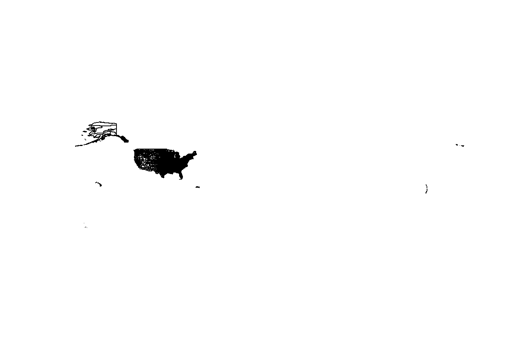
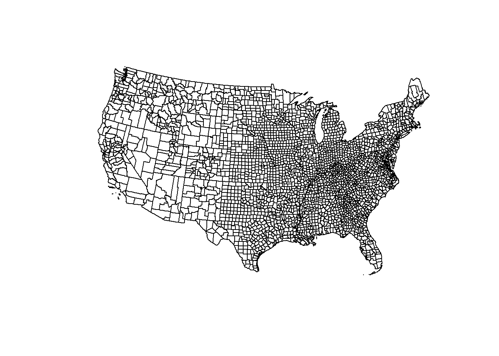
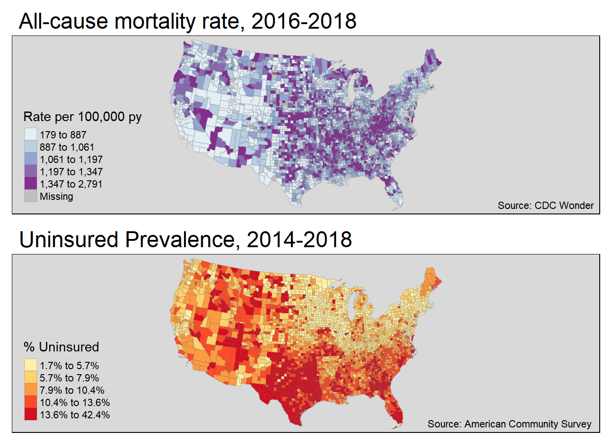

# Cartography for Epidemiology I

## Getting Ready

### Learning objectives


<!--html_preserve--><table class="huxtable" style="border-collapse: collapse; border: 0px; margin-bottom: 2em; margin-top: 2em; width: 100%; margin-left: auto; margin-right: auto;  " id="learning-ob">
<caption style="caption-side: top; text-align: center;">(#tab:learning-ob) Learning objectives by weekly module</caption><col><tr>
<th style="vertical-align: top; text-align: left; white-space: normal; border-style: solid solid solid solid; border-width: 1pt 1pt 1pt 1pt; border-top-color: rgb(255, 255, 255);  border-right-color: rgb(255, 255, 255);  border-bottom-color: rgb(255, 255, 255);  border-left-color: rgb(255, 255, 255); padding: 2pt 6pt 2pt 6pt; background-color: rgb(204, 204, 204); font-weight: bold;">After this module you should be able to…</th></tr>
<tr>
<td style="vertical-align: top; text-align: left; white-space: normal; border-style: solid solid solid solid; border-width: 1pt 1pt 1pt 1pt; border-top-color: rgb(255, 255, 255);  border-right-color: rgb(255, 255, 255);  border-bottom-color: rgb(255, 255, 255);  border-left-color: rgb(255, 255, 255); padding: 2pt 6pt 2pt 6pt; background-color: rgb(242, 242, 242); font-weight: normal;">Design a cartographic representation of epidemiologic data that is consistent with best practices in public health data visualization.</td></tr>
<tr>
<td style="vertical-align: top; text-align: left; white-space: normal; border-style: solid solid solid solid; border-width: 1pt 1pt 1pt 1pt; border-top-color: rgb(255, 255, 255);  border-right-color: rgb(255, 255, 255);  border-bottom-color: rgb(255, 255, 255);  border-left-color: rgb(255, 255, 255); padding: 2pt 6pt 2pt 6pt; background-color: rgb(230, 230, 230); font-weight: normal;">Apply data processing functions to accomplish foundational data management and preparation for spatial epidemiology (e.g. summarize, aggregate, combine, recode, etc)</td></tr>
</table>
<!--/html_preserve-->

### Additional Resources

* [CDC Guidance for Cartography of Public Health Data (complements required reading)](https://www.cdc.gov/dhdsp/maps/gisx/resources/tips-creating-ph-maps.html )
* [When Maps Lie](https://www.citylab.com/design/2015/06/when-maps-lie/396761/) 
* [Color Brewer Website for color guidance in choropleth maps](http://colorbrewer2.org/#)
* [Analyzing US Census Data: Methods, Maps, and Models in R](https://walker-data.com/census-r/)


### Important Vocabulary


<!--html_preserve--><table class="huxtable" style="border-collapse: collapse; border: 0px; margin-bottom: 2em; margin-top: 2em; width: 90%; margin-left: auto; margin-right: auto;  " id="tab:unnamed-chunk-2">
<caption style="caption-side: top; text-align: center;">(#tab:unnamed-chunk-2) Vocabulary for Week 2</caption><col><col><tr>
<th style="vertical-align: top; text-align: left; white-space: normal; border-style: solid solid solid solid; border-width: 1pt 1pt 1pt 1pt; border-top-color: rgb(255, 255, 255);  border-right-color: rgb(255, 255, 255);  border-bottom-color: rgb(255, 255, 255);  border-left-color: rgb(255, 255, 255); padding: 2pt 2pt 2pt 6pt; background-color: rgb(84, 153, 199); font-weight: bold;"><span style="color: rgb(255, 255, 255);">Term</span></th><th style="vertical-align: top; text-align: left; white-space: normal; border-style: solid solid solid solid; border-width: 1pt 1pt 1pt 1pt; border-top-color: rgb(255, 255, 255);  border-right-color: rgb(255, 255, 255);  border-bottom-color: rgb(255, 255, 255);  border-left-color: rgb(255, 255, 255); padding: 2pt 6pt 2pt 2pt; background-color: rgb(84, 153, 199); font-weight: bold;"><span style="color: rgb(255, 255, 255);">Definition</span></th></tr>
<tr>
<td style="vertical-align: top; text-align: left; white-space: normal; border-style: solid solid solid solid; border-width: 1pt 1pt 1pt 1pt; border-top-color: rgb(255, 255, 255);  border-right-color: rgb(255, 255, 255);  border-bottom-color: rgb(255, 255, 255);  border-left-color: rgb(255, 255, 255); padding: 2pt 2pt 2pt 6pt; background-color: rgb(212, 230, 241); font-weight: bold;">Cartography</td><td style="vertical-align: top; text-align: left; white-space: normal; border-style: solid solid solid solid; border-width: 1pt 1pt 1pt 1pt; border-top-color: rgb(255, 255, 255);  border-right-color: rgb(255, 255, 255);  border-bottom-color: rgb(255, 255, 255);  border-left-color: rgb(255, 255, 255); padding: 2pt 6pt 2pt 2pt; background-color: rgb(212, 230, 241); font-weight: normal;">The production of maps, including construction of projections, design, compilation, drafting, and reproduction</td></tr>
<tr>
<td style="vertical-align: top; text-align: left; white-space: normal; border-style: solid solid solid solid; border-width: 1pt 1pt 1pt 1pt; border-top-color: rgb(255, 255, 255);  border-right-color: rgb(255, 255, 255);  border-bottom-color: rgb(255, 255, 255);  border-left-color: rgb(255, 255, 255); padding: 2pt 2pt 2pt 6pt; background-color: rgb(169, 204, 227); font-weight: bold;">Choropleth map</td><td style="vertical-align: top; text-align: left; white-space: normal; border-style: solid solid solid solid; border-width: 1pt 1pt 1pt 1pt; border-top-color: rgb(255, 255, 255);  border-right-color: rgb(255, 255, 255);  border-bottom-color: rgb(255, 255, 255);  border-left-color: rgb(255, 255, 255); padding: 2pt 6pt 2pt 2pt; background-color: rgb(169, 204, 227); font-weight: normal;">A type of thematic map in which areas are shaded or patterned in proportion to a statistical variable that represents an aggregate summary of a geographic characteristic within each area, such as population density, disease risk, or standardized mortality ratio</td></tr>
<tr>
<td style="vertical-align: top; text-align: left; white-space: normal; border-style: solid solid solid solid; border-width: 1pt 1pt 1pt 1pt; border-top-color: rgb(255, 255, 255);  border-right-color: rgb(255, 255, 255);  border-bottom-color: rgb(255, 255, 255);  border-left-color: rgb(255, 255, 255); padding: 2pt 2pt 2pt 6pt; background-color: rgb(212, 230, 241); font-weight: bold;">Color palette: diverging</td><td style="vertical-align: top; text-align: left; white-space: normal; border-style: solid solid solid solid; border-width: 1pt 1pt 1pt 1pt; border-top-color: rgb(255, 255, 255);  border-right-color: rgb(255, 255, 255);  border-bottom-color: rgb(255, 255, 255);  border-left-color: rgb(255, 255, 255); padding: 2pt 6pt 2pt 2pt; background-color: rgb(212, 230, 241); font-weight: normal;">Diverging schemes allow the emphasis of a quantitative data display that progresses outward from a critical midpoint of the data range. A typical diverging scheme pairs sequential schemes based on two different hues so that they diverge from a shared light color, for the critical midpoint, toward dark colors of different hues at each extreme</td></tr>
<tr>
<td style="vertical-align: top; text-align: left; white-space: normal; border-style: solid solid solid solid; border-width: 1pt 1pt 1pt 1pt; border-top-color: rgb(255, 255, 255);  border-right-color: rgb(255, 255, 255);  border-bottom-color: rgb(255, 255, 255);  border-left-color: rgb(255, 255, 255); padding: 2pt 2pt 2pt 6pt; background-color: rgb(169, 204, 227); font-weight: bold;">Color palette: qualitative</td><td style="vertical-align: top; text-align: left; white-space: normal; border-style: solid solid solid solid; border-width: 1pt 1pt 1pt 1pt; border-top-color: rgb(255, 255, 255);  border-right-color: rgb(255, 255, 255);  border-bottom-color: rgb(255, 255, 255);  border-left-color: rgb(255, 255, 255); padding: 2pt 6pt 2pt 2pt; background-color: rgb(169, 204, 227); font-weight: normal;">Qualitative schemes use differences in hue to represent nominal differences, or differences in kind. The lightness of the hues used for qualitative categories should be similar but not equal. </td></tr>
<tr>
<td style="vertical-align: top; text-align: left; white-space: normal; border-style: solid solid solid solid; border-width: 1pt 1pt 1pt 1pt; border-top-color: rgb(255, 255, 255);  border-right-color: rgb(255, 255, 255);  border-bottom-color: rgb(255, 255, 255);  border-left-color: rgb(255, 255, 255); padding: 2pt 2pt 2pt 6pt; background-color: rgb(212, 230, 241); font-weight: bold;">Color palette: sequential</td><td style="vertical-align: top; text-align: left; white-space: normal; border-style: solid solid solid solid; border-width: 1pt 1pt 1pt 1pt; border-top-color: rgb(255, 255, 255);  border-right-color: rgb(255, 255, 255);  border-bottom-color: rgb(255, 255, 255);  border-left-color: rgb(255, 255, 255); padding: 2pt 6pt 2pt 2pt; background-color: rgb(212, 230, 241); font-weight: normal;">Sequential data classes are logically arranged from high to low, and this stepped sequence of categories should be represented by sequential lightness steps. Low data values are usually represented by light colors and high values represented by dark colors. Transitions between hues may be used in a sequential scheme, but the light-to-dark progression should dominate the scheme.</td></tr>
<tr>
<td style="vertical-align: top; text-align: left; white-space: normal; border-style: solid solid solid solid; border-width: 1pt 1pt 1pt 1pt; border-top-color: rgb(255, 255, 255);  border-right-color: rgb(255, 255, 255);  border-bottom-color: rgb(255, 255, 255);  border-left-color: rgb(255, 255, 255); padding: 2pt 2pt 2pt 6pt; background-color: rgb(169, 204, 227); font-weight: bold;">Isopleth map</td><td style="vertical-align: top; text-align: left; white-space: normal; border-style: solid solid solid solid; border-width: 1pt 1pt 1pt 1pt; border-top-color: rgb(255, 255, 255);  border-right-color: rgb(255, 255, 255);  border-bottom-color: rgb(255, 255, 255);  border-left-color: rgb(255, 255, 255); padding: 2pt 6pt 2pt 2pt; background-color: rgb(169, 204, 227); font-weight: normal;">A type of thematic map that uses contour lines or colors to indicate areas with similar regional aspects. It typically symbolizes the underlying statistic as varying continuously in space, in contrast to the discrete unit-specific variation of choropleth maps</td></tr>
<tr>
<td style="vertical-align: top; text-align: left; white-space: normal; border-style: solid solid solid solid; border-width: 1pt 1pt 1pt 1pt; border-top-color: rgb(255, 255, 255);  border-right-color: rgb(255, 255, 255);  border-bottom-color: rgb(255, 255, 255);  border-left-color: rgb(255, 255, 255); padding: 2pt 2pt 2pt 6pt; background-color: rgb(212, 230, 241); font-weight: bold;">Standardize Morbidity/Mortality Ratio (SMR)</td><td style="vertical-align: top; text-align: left; white-space: normal; border-style: solid solid solid solid; border-width: 1pt 1pt 1pt 1pt; border-top-color: rgb(255, 255, 255);  border-right-color: rgb(255, 255, 255);  border-bottom-color: rgb(255, 255, 255);  border-left-color: rgb(255, 255, 255); padding: 2pt 6pt 2pt 2pt; background-color: rgb(212, 230, 241); font-weight: normal;">The ratio of observed to expected disease morbidity or mortality. Often the 'expected' is defined as the overall population (or study-specific) rate; in that case the SMR indicates the relative deviation of a specific unit from the global or overall rate</td></tr>
<tr>
<td style="vertical-align: top; text-align: left; white-space: normal; border-style: solid solid solid solid; border-width: 1pt 1pt 1pt 1pt; border-top-color: rgb(255, 255, 255);  border-right-color: rgb(255, 255, 255);  border-bottom-color: rgb(255, 255, 255);  border-left-color: rgb(255, 255, 255); padding: 2pt 2pt 2pt 6pt; background-color: rgb(169, 204, 227); font-weight: bold;">Visual hierarchy</td><td style="vertical-align: top; text-align: left; white-space: normal; border-style: solid solid solid solid; border-width: 1pt 1pt 1pt 1pt; border-top-color: rgb(255, 255, 255);  border-right-color: rgb(255, 255, 255);  border-bottom-color: rgb(255, 255, 255);  border-left-color: rgb(255, 255, 255); padding: 2pt 6pt 2pt 2pt; background-color: rgb(169, 204, 227); font-weight: normal;">The apparent order of importance of phenomena perceived by the human eye.  In cartography, this principle is a fundamental part of map composition; since the goal of map composition is to clearly convey a desired purpose, the attention of readers should be focused on the map elements that are most relevant to the purpose.</td></tr>
</table>
<!--/html_preserve-->

## Spatial Thinking in Epidemiology

Making pretty maps is not the full extent of spatial epidemiology. However, *epidemiologic cartography*  can sometimes be the beginning and end of *spatial epidemiology* for a given purpose. And even when an epidemiologic analysis goes well beyond mapping (perhaps to incorporate *aspatial* analysis, or to incorporate more sophisticated *spatial* analysis), the ability to produce a clear, concise, and interpretable map is an important skill. 

As Robb, et al^[Robb SW, Bauer SE, Vena JE. Integration of Different Epidemiological Perspectives and Applications to Spatial Epidemiology. Chapter 1 in Handbook of Spatial Epidemiology. 2016. CRC Press, Boca Raton, FL.] write:

>Disease mapping can be used to provide *visual cues* about disease etiology, particularly as it relates to environmental exposures....Mapping where things are allows visualization of a baseline pattern or spatial structure of disease, potential detection of disease clusters, and the initial investigation of an exposure-disease relationship. 

There are aspects of cartography and map design that are general to most thematic maps of quantitative data. But there are some issues that seem especially pertinent to us as epidemiologists or quantitative population health scientists.  These include the decisions we make about color choice and the process of categorizing numerical data for visual representation in a map. 

Why are these especially important for epidemiology? A primary purpose of a map is to visually represent *something meaningful* about the *spatial or geographic variation* in health or a health-relevant feature (e.g. an exposure or resource). Communicating what is *meaningful* and representing *variation* that matters is not solely a technical GIS task; it requires epidemiologic insight. 

For instance our approach to representing ratio measures such as an *odds ratio* or *risk ratio* should be different from how we represent *risk* or *rate* data, because we understand that the scale and units are distinct in each case. Similarly, we understand that characterizing variation or heterogeneity in a *normal* or *Gaussian* (bell-shaped curve) distribution is different from a uniform or a highly skewed distribution with a long right tail.  This insight into how scales and values are differently interpreted epidemiologically must be translated into sensible choices in mapping.

### Color choices

For most thematic maps, color is the most flexible and important tool for communication. Color, hue, and contrast can accentuate map elements or themes and minimize others. The result is that you can completely change the story your map tells with seemingly small changes to how you use color. This means you should be clear and explicit about *why you choose* a given color or sequence of colors, and beware of unintentionally misrepresenting your data by your color choices.  

In producing choropleth maps, we often talk about collections of colors as *color ramps* or *color palettes*, because a single color by itself is not very interesting. A quick scan of either the `tmaptools::palette_explorer()` utility, or [the Color Brewer website](http://colorbrewer2.org/#) will demonstrate that there are many colors to choose from, so is it just a matter of preference? Perhaps, but there are some guidelines to keep in mind.

#### Sequential palettes

All color palettes use the color hue, value, or saturation to represent or symbolize the values of the underlying statistical parameter of interest.  When a parameter or statistic is naturally ordered, sequential and monotonic, then it makes sense to choose colors that range from light to dark. Conventionally *lighter* or more neutral tones represent lower or smaller numbers and *darker* colors and more intense tones represent higher or larger numbers. The dark colors jump out at the viewer more readily, so occasionally the inverse is used to emphasize small values, but this should be done with caution as it can be counter intuitive.


<div class="figure">

<p class="caption">(\#fig:unnamed-chunk-3)Sequential color palettes</p>
</div>


:::{.rmdnote data-latex="{note}"}
Sequential palettes are useful for epidemiologic parameters such as prevalence, risk, or rates, or continuous exposure values where the emphasis is on distinguishing higher values from lower values.
:::


#### Diverging palettes

A less common choice, but one that is especially important for some epidemiologic parameters, is the diverging palette. In this pattern, the *neutral color* is in the center of the sequence, with two different color hues become darker and more intense as they go out from the center.

<div class="figure">

<p class="caption">(\#fig:unnamed-chunk-4)Diverging color palettes</p>
</div>

You might choose this color sequence for one of two reasons:

1. You wish to show how units vary around the overall mean or median, highlighting those that are *larger than* versus *smaller than* the overall mean/median. For instance diverging palettes might emphasize areas with particularly high burden of disease (and therefore in need of additional attention), as well as those with unexpectedly low burden of disease (and therefore worthy of understanding about protective factors).
2. You are mapping *any epidemiologic measure of effect (e.g. ratio or difference measure)* where there are values both above and below the null ratio of $1.0$ (for ratio) or $0$ (for difference).  For example if  you map *Standardized Mortality/Morbidity Ratios*, *risk or odds ratios*, or *prevalence ratios*, you potentially have diverging data. The exception would be if all of the ratio values were on the same side of the null (e.g. all were $>>1$ or $<<1$).

<div class="figure">

<p class="caption">(\#fig:unnamed-chunk-5)Mapping ratio measure with divergent palette</p>
</div>

In the map above, the SMR (a ratio of the county-specific prevalence of very low birth weight infants to the overall statewide live birth prevalence) varies from $0.13$ to $2.30$.  In other words, a county with an SMR of $1.0$ has the *average* prevalence of very low birthweight.  This range of data is not sequential in the same way as a *risk* or *prevalence*. Instead the neutral color is assigned to counties in the range of $0.90-1.10$, around the null. This is a way of indicating these counties are *average* or *typical*. In contrast, counties with increasing *excess morbidity* have darker green, and substantially *lower morbidity* are darker purple. 

#### Qualitative palettes

Qualitative refers to categories that are not naturally ordered or sequential. For instance if counties were assigned values for the single leading cause of death in the county, we might choose a qualitative palette, as a sequential or diverging palette might mislead the viewer into thinking there is some natural ordering to which causes should be more or less intense in their color.


### Choropleth binning styles

A second topic relevant to the intersection of *cartography* and *epidemiologic thinking* is the means by which we choose cut-points for visualizing data. In other words for a map to visually represent some underlying statistical value, we have to assign or map numerical values to colors. How you do that depends greatly on the intended message or story your map needs to tell. Are you interested in distinguish units that rank higher or lower in values? Or are you primarily focused on finding extreme outliers, with variation in the '*middle*' of the distribution of less interest? These distinct purposes give rise to different decisions about how to assign colors to numerical values in your data.

<div class="figure">

<p class="caption">(\#fig:unnamed-chunk-6)Comparing binning styles with same data</p>
</div>

As discussed in the lecture, there are numerous methods or styles for categorizing continuous data for choropleth mapping (e.g. identical data is summarized under four different styles in figure above).  Cynthia Brewer (of [ColorBrewer](https://colorbrewer2.org/#type=sequential&scheme=BuGn&n=3) fame) and Linda Pickle [-@brewer_evaluation_2002] sought to evaluate which styles are most effective for communicating the spatial patterns of epidemiologic data. 

As cartographers, Brewer & Pickle were critical of the epidemiologists' over-reliance on quantile cut-points, given many other strategies that seemed to have cartographic advantages.  However, after randomizing map '*readers*' to interpret maps of the same underlying epidemiologic data using *seven different styles*, they determined that readers could most accurately and reliably interpret the disease patterns in maps using *quantile cut-points*. While there are benefits of the other styles for some purposes, for the common use of communicating which spatial areas *rank higher or lower* in terms of disease burden, quantiles are most straightforward.

#### Mapping time series

It is common in spatial epidemiology that we want to map the spatial patterns of disease for several different snapshots in time as a series to observe the evolution of disease burden over time. But changing patterns over time raises additional questions about how to make cuts to the data. There are several options for determining the cut-points when you have a time series: 

1. Pool all of the years data together before calculating the cut-points (e.g. using quantiles). Use the pooled cut-points for all years.
2. Create custom year-specific cut-points that reflect the distribution of data for each year separately.
3. Create cut-points based on a single year and apply them to all other years.


<div class="figure">

<p class="caption">(\#fig:unnamed-chunk-7)Georgia MVC deaths by year with a common scale</p>
</div>

The map above of Georgia motor vehicle crash mortality data in three different years (2005, 2014, 2017), was created in `tmap` using the `tm_facet()` option where the the `by = ` was year.  As a result, the quantile cut-points represent the breaks *pooling all observations across the three years*.  In other words the cut-points come from 159 counties times three years: 477 values. 

By having a common legend that applies to all three maps, this strategy is useful for comparing *differences in absolute rates* across years.

<div class="figure">

<p class="caption">(\#fig:unnamed-chunk-8)U.S. heart disease mortality with a year-specific scales</p>
</div>


The map above of heart disease mortality rates by county in two years (1973-4; 2009-10) uses quantile breaks calculated *separately for each time period*.  This was done in part because the heart disease mortality rate declined so much between these years that a scale that distinguished highs from lows on one map would not distinguish anything on the other map. In this case what is being compared is not the *absolute rates* but the *relative ranking of counties* in the two years. 

## Spatial Analysis in Epidemiology 

Every spatial epidemiology project must include attention to data acquisition, cleaning, integration, and visualization. The specific workflow is driven largely by the overarching epidemiologic question, purpose, or goal.  In this section we use a specific question to illustrate key steps to data preparation for epidemiologic cartography. 

>**Case Example Objective**: Create a choropleth map visualizing geographic variation in the all-cause mortality rate for U.S. counties in 2016-2018. Compare this to a choropleth map of % uninsured in U.S. counties.

This objective will be directly relevant for the lab this week as well as for the *Visualizing US Mortality, Visual Portfolio*, an assignment due later in the semester. 

Although this specific question dictates specific data needs, these four types of data are frequently needed to produce a map of a health outcome or state:

1. **Numerator data**, in this case representing the count of deaths per county in the target year
2. **Denominator data**, in this case representing the population at risk for death in each county in the target year
3. **Contextual or covariate data**, in this case the prevalence uninsured for each U.S. county
4. **Geographic (geometry) data** representing the shapes and boundaries of U.S. counties


### Obtaining and preparing numerator data

The event of interest (e.g. the numerator in a risk, rate, or prevalence) can come from many sources. If you are conducting primary data collection, it arises from your study design and measurement. When using secondary data, it is common to use surveillance data (e.g. vital records, notifiable diseases, registries, etc) or administrative data as a source of health events. 

When using secondary data sources owned or managed by another entity, one challenge that can occur is *suppression of data* to protect privacy. For example the National Center for Health Statistics mortality data available from [CDC WONDER](https://wonder.cdc.gov/) suppresses the count of deaths, as well as the crude mortality rate, whenever the *numerator count is less than ten events*. There can also be instances when a local or state public health agency fails to report data to NCHS, producing missing values.

:::{.rmdcaution data-latex="{caution}"}
Depending on the data format, it is possible that either **missing** or **suppressed** data could be inadvertently imported into R as *zero-count* rather than missing.  It is therefore critically important to understand the data source and guidelines. The decision about how to manage zero, missing, and suppressed data is an epidemiologic choice, but one that must be addressed *before creating a map*.  
:::

:::{.rmdtip data-latex="{tip}"}
**How to deal with data suppression**.  There are many reasons your target data may fall below thresholds for suppression. Perhaps the outcome event is quite rare, or you are stratifying by multiple demographic factors, or perhaps you are counting at a very small geographic unit.  If suppression is problematic for mapping, consider pooling over multiple years, reducing demographic stratification, or using larger geographic areas to increase event count and reduce the number of suppressed cells. 
:::

For this example, we have downloaded all-cause mortality counts by county from CDC WONDER for 2016-2018 (pooling over three years to reduce suppression).  In Lab we will discuss the procedure for acquiring data from the web. After importing the data this is how it appears.


```r
head(death)
```

```
##    FIPS             County Deaths Population     crude
## 1 01001 Autauga County, AL    536      55601  964.0114
## 2 01003 Baldwin County, AL   2357     218022 1081.0836
## 3 01005 Barbour County, AL    312      24881 1253.9689
## 4 01007    Bibb County, AL    276      22400 1232.1429
## 5 01009  Blount County, AL    689      57840 1191.2172
## 6 01011 Bullock County, AL    112      10138 1104.7544
```


### Obtaining and preparing denominator or contextual data
 
 
The mortality data accessed from CDC included both numerator (count of deaths) and denominator (population at risk). However there are instances where you may have one dataset that provides the health event data (numerator), but you need to link it to a population denominator in order to calculate risk, rate, or prevalence.  

The U.S. Census Bureau maintains the most reliable population count data for the U.S., and it is available in aggregates from Census Block Group, Census Tract, Zip code tabulation area, City or Place, County, State, and Region. 

Census data can be aggregated as total population or stratified by age, gender, race/ethnicity, and many other variables. The census data also contains measures of social, economic, and housing attributes which may be relevant to measure *context* or *exposures* in spatial epidemiologic analyses. There are two broad types of demographic and socioeconomic data released by the Census Bureau.

* __Decennial Census__ tables which (theoretically) count 100% of the population every 10 years. These can be cross-classified by age, race/ethnicity, sex, and householder status (e.g. whether head of house owns or rents and how many people live in house)
* __[American Community Survey (ACS)](https://www.census.gov/programs-surveys/acs)__ tables which provide a much larger number of measures but are based on samples rather than complete counts. The ACS began in the early 2000's and is a continually sampled survey. Despite being collected every year, for many small areas (e.g. census tracts or even counties) there are not enough responses in a single year to make reliable estimates. Therefore ACS data pooled into 5-year moving-window datasets. For instance the 2015-2019 ACS reports estimates for all responses collected during that time period, and these are available from the Census Block Group up. 


You may have accessed Census or ACS data directly from the Census Bureau website for other classes or tasks in the past.  In the interest of *reproducibility* and efficiency, we introduce the `tidycensus` package in `R`. It is an excellent tool for acquiring either Decennial Census or ACS data directly within `R`. The advantage of doing so is twofold: 

1. It can be quicker once you learn how to do it; 
2, It makes your data acquisition fully reproducible without any unrecorded steps happening in web browsers. In other words you have actual code that details what you downloaded and what you did to it (rather than un-documented steps of clicking and downloading from a browser).


:::{.rmdnote data-latex="{note}"}

We will practice the code in the next few sections in lab. It is included here as a primer. In these sections I walk through **one way** to download and prepare data to quantify the county-level prevalence of the population who are uninsured, as this might be a covariate of interest when examining spatial variation in mortality.  

I selected the code below because it is *relatively* efficient, although you may find some of it complex or confusing. I include it for those who would like to explore other data-manipulation functions in `R`. Please note that you do not need to learn all of the functions in this Census data acquisitions section below for this course, although you might find these or related approaches useful.  Note also that there are many ways to accomplish anything in `R`, and you could achieve the same ends with different strategies.

:::

 

#### Setting up Census API

To access any Census products (e.g. attribute tables or geographic boundary files) using the `tidycensus` package, you need to *register* yourself by declaring your API key.  If you haven't already done so, [go here to register for the key](https://api.census.gov/data/key_signup.html).


```r
# Only do this if you haven't already done it; it should only need to be done once.

tidycensus::census_api_key('YourKeyHere', install = T) 
```


#### Choosing Variables

By far the biggest challenge of requesting data from the Census Bureau is knowing *what you want*, and *where it is stored*. Census data are distributed as aggregated counts contained in *specific tables* (each has a unique ID), and made up of *specific variables* (also a unique ID composed of table ID plus a unique ID).  There are two ways to find variables:

* You could go to the Census website and browse around. For instance the [Census Data Explorer website](https://data.census.gov/cedsci/) is one way to browse the topics and variables
* You could download all of the variables for a given year into `R`, and use filters to search it.

This code queries the Census website (assuming you have internet connection) and requests a list of all variables for the ACS 5-year pooled dataset (e.g. `acs5`) and for the window of time ending in 2018 (e.g. 2014-2018).  I also specify `cache = T` which just means to save the results for quicker loading if I ask again in the future.


```r
library(tidycensus)

all_vars <- load_variables(year = 2018, dataset = 'acs5', cache = T)

head(all_vars)
```

It may be easiest to look at the dataset using the `View()` function. When you do so, you see the three variables, and you have the option to click the **Filter** button (upper left of View pane; looks like a funnel). The *Filter* option is one way to search key words in either the `label` or `concept` column. 

We are interested in capturing the prevalence of uninsured in each county. Try this:

* Go to View mode of variables (e.g. `View(all_vars)`)
* Click the *Filter* button
* Type `insurance` in the `concept` field
* Type `B27001` in the `name` field


<div class="figure">

<p class="caption">(\#fig:unnamed-chunk-13)Screenshot of RStudio View() of ACS variables</p>
</div>

What we want is a list of the specific tables and variable ID's to extract from the Census.  In lab we will use some more detailed code to accomplish this goal. 

You may have noticed that the full list of ACS variables has nearly 27,000 variables! In the code below I use some tricks to filter the huge list of all variables to get only the names I want. It relies on the `tidyverse` package `stringr` which is great for manipulating character variables (this is great for many data science tasks; [read more about `stringr` here](https://stringr.tidyverse.org/)). In this case I am using it to filter down to just the table I want (e.g. `B27001`), and then to get the names of the variables that contain the string *'No health insurance'*. 


```r
a <- all_vars %>% 
  filter(stringr::str_detect(name, 'B27001')) %>%  # this limits to rows for the B27001 table
  filter(stringr::str_detect(label, 'No health insurance'))  # this limits to rows with this text

myVars <- c('B27001_001', a$name)
```

Here is the list of variables we want to acquire; each one represents a count of uninsured at each of multiple age groups. We will sum them up to get a total population uninsured prevalence.


```
##  [1] "B27001_001" "B27001_005" "B27001_008" "B27001_011" "B27001_014"
##  [6] "B27001_017" "B27001_020" "B27001_023" "B27001_026" "B27001_029"
## [11] "B27001_033" "B27001_036" "B27001_039" "B27001_042" "B27001_045"
## [16] "B27001_048" "B27001_051" "B27001_054" "B27001_057"
```

#### Retrieving data from Census

To actually retrieve data from the Census we use the function `get_acs()` (or if you were getting decennial data the function would be `get_decennial()`). When you request data you must specify the geography (e.g. do you want counts for states, counties, census tracts, census block groups?), the variables, the year, and the dataset.  Look at `?get_acs` to read more about options. 


The following code chunks use the `dplyr` and `tidyverse` verbs and the `%>%` (pipe) to connect data steps together. This is complex at first, but it is worth carefully examining how each step works. If you are not familiar with this syntax, it would probably be helpful to [review the Appendix section on `dplyr`](#dplyr). 

 


```r
# First, request the data from ACS
insure_tidy <- get_acs(geography = 'county',
                     variables = myVars,
                     year = 2018, 
                     survey = 'acs5') %>%
  select(-moe)

# Look at the resulting object
head(insure_tidy)
```

```
## # A tibble: 6 x 4
##   GEOID NAME                    variable   estimate
##   <chr> <chr>                   <chr>         <dbl>
## 1 01001 Autauga County, Alabama B27001_001    54277
## 2 01001 Autauga County, Alabama B27001_005       36
## 3 01001 Autauga County, Alabama B27001_008      157
## 4 01001 Autauga County, Alabama B27001_011      397
## 5 01001 Autauga County, Alabama B27001_014      354
## 6 01001 Autauga County, Alabama B27001_017      500
```
:::{.rmdwarning data-latex=""}

Looking at the first few rows of the data object `insure_tidy` above, you might be surprised that there is a column labeled `variable`, and the cells within that column are actually what we *thought were the variable names*!  That is because these data are structured in a `tidy` format, which happens to be *long* not *wide*. [Read more about transposing data here](#pivot_).  In the following steps we will reshape this data to be more useful.

:::

What this code does:  

* define the `geography = ` as county. 
* Specify the vector (previously created and named `myVars`) of variables to download
* Specify the year of interest. Note that 2018 references the *2014-2018* 5-year window
* specify the survey, which will most often be `acs5`


```r
# Now I pull out the denominator
insure_denom <- insure_tidy %>%
  filter(variable == 'B27001_001') %>%
  rename(TOTPOP = estimate) %>%
  select(-variable)

# Look at the resulting object
head(insure_denom)
```

```
## # A tibble: 6 x 3
##   GEOID NAME                    TOTPOP
##   <chr> <chr>                    <dbl>
## 1 01001 Autauga County, Alabama  54277
## 2 01003 Baldwin County, Alabama 205452
## 3 01005 Barbour County, Alabama  22882
## 4 01007 Bibb County, Alabama     20468
## 5 01009 Blount County, Alabama   57169
## 6 01011 Bullock County, Alabama   9978
```

The code above was necessary because most of the variables were age-specific counts of the number of uninsured people. But one variable, `B27001_001` is the count of all included in the table. In other words, it is the *denominator* for calculating the prevalence of uninsured. Therefore I did the following in the code above:

* `filter()` restricts to only the rows of data where the variable is the denominator count (B27001_001). Filter is like `where` in SAS
* `rename()` is a way to rename variables to my own liking
* `select()` drops the variable called `variable`


```r
# Now I sum up all the variables for the numerator
insure_num <- insure_tidy %>%
  filter(variable != 'B27001_001') %>%
  group_by(GEOID) %>%
  summarise(no_insure = sum(estimate))

head(insure_num)
```

```
## # A tibble: 6 x 2
##   GEOID no_insure
##   <chr>     <dbl>
## 1 01001      3875
## 2 01003     20864
## 3 01005      2558
## 4 01007      1619
## 5 01009      6303
## 6 01011      1076
```


The code above addresses an issue common to census tables: they may not be constructed in the way you want them. As discussed above, in this case the values are counts for each age group, but we only want a single count for the entire population of each county. Therefore, it is necessary to *sum across* or *aggregate* the counts over all age groups to get a single count (the numerator number of uninsured) for each county. 

The strategy used above was specific to the data being in *long format*, which happens to be `tidy` data in this case. [Read about changing between long and wide here](#pivot_).

The code above achieves this through steps:

* `filter()` using the `!=` mean "*is __not__ equal to*"; this simply removes the denominator variable, so that we are only summing over numerator counts
* `group_by()` is a very useful `dplyr` verb; it is similar to using `class` in SAS, and tells `R` to do something separately for each group (e.g. each `GEOID` or county in this case)
* `summarise()` is a verb that works hand-in-hand with `group_by()`. The grouping declares which groups, but the `summarise()` tells what to do. In this case we just want to count up all of those uninsured across all age gruops.


```r
# Finally, merge the numerator and denominator in order to calculate prevalence
uninsured <- insure_denom %>%
  left_join(insure_num, by = 'GEOID') %>%
  mutate(uninsured = no_insure / TOTPOP) %>%
  select(GEOID, uninsured)

# Take a look at the resulting object
head(uninsured)
```

```
## # A tibble: 6 x 2
##   GEOID uninsured
##   <chr>     <dbl>
## 1 01001    0.0714
## 2 01003    0.102 
## 3 01005    0.112 
## 4 01007    0.0791
## 5 01009    0.110 
## 6 01011    0.108
```

This was a simple merge, but it is worth mentioning a few of the steps:

* `left_join()` is one of a famiy of *merging* verbs. The *left* in `left_join()` simply means start with the first table (the one on the left) and merge with the second table. The implications are with whether all rows or only rows in the left or the right (first or second) table are retained. In this case the *left* of *first* table is `insure_denom` and the *right* or *second* table is *insure_num*)
* `mutate()` calculates the uninsured prevalence
* `select()` excludes unnecessary variables


:::{.rmdnote data-latex="{note}"}

The code process above was complex. While it was specific to this exact scenario, each scenario might require different steps. The challenge for you, the new spatial analyst, is to think through in your mind how the data looks at the beginning and how you want it to look at the end. Then create a sequence of steps that progresses from beginning to end. It takes practice, but is worthwhile for spatial epidemiology, but also for data science and processing more generally.

:::


### Obtaining and preparing geographic data

The final type of data needed is the geographic or geometry data. Again, the source for geometry data varies by the study specifics: you may need polygons (e.g. political or administrative boundaries), lines (e.g. transportation networks), or points (e.g. hospitals, food stores, toxic waste sites, etc). On the other hand you may need or have data that are in raster format, including weather or air pollution surfaces. There are open-access versions of many types of geographic data online. 

For choropleth mapping, area units including administrative and political boundaries are commonly used. In the U.S. context, the Census geographies are frequently used, including blocks, block groups, tracts, zip-code tabulation areas, counties, cities & places, metropolitan areas, tribal areas, states, and regions. In this section I provide a brief introduction to downloading census boundary files directly into `R`.


#### Obtain geometry data from `tidycensus`

The first option is a very minor modification to the code in the previous section acquiring census count data.  The `get_acs()` function has an argument `geometry = ` that is `FALSE` by default. However, if you change it to `geometry = TRUE`, you will automatically retrieve the data as an `sf` object including a geometry column!


```r
insure_tidy <- get_acs(geography = 'county',
                     variables = myVars,
                     year = 2018, 
                     geometry = TRUE,   # added geometry = T
                     survey = 'acs5') 
```


:::{.rmdtip data-latex="{tip}"}

One other argument to `get_acs()` not demonstrated here is `shift_geo`.  It is `FALSE` by default, but if set to `shift_geo = TRUE`, it will return boundaries that have been projected to Albers Equal Area, and where the states of Hawaii and Alaska are artificially shifted to *fit* on a thematic map of the U.S. 

:::

#### Obtain geometry data from `tigris`

The `tidycensus` package actually requests the geometry by depending on another package called `tigris` (the Census geography files are called *TIGER* files). If you are obtaining both attributes (e.g. population counts) and geometries at the same time, the `tidycensus` package makes the  most sense. However, sometimes you *only need the geometry*, perhaps because the other data come from sources other than the Census Bureau. 

If you want to directly obtain areal boundary units, coastline data, road or rail networks, voting districts, or other spatial data maintained by the Census Bureau, consider using the `tigris` package.  Try looking at the help documentation (e.g. `?tigris`, then click the *Index* link at the bottom to see all of the options).

Here I demonstrate by retrieving the U.S. county boundaries:


```r
library(tigris)
options(tigris_use_cache = TRUE)
us <- counties(cb = TRUE,
                        resolution = '5m', 
                        year = 2018,
                        class = 'sf')
```

Here is what the code above does:

* The `counties()` function is one of dozens in `tigris` for downloading specific kinds of boundary data
* `cb = TRUE` adjusts the level of detail or resolution of the boundaries. By default `cb = FALSE` returns the most detailed data, which is quite large. Setting `cb = TRUE` defaults to a generalized (1:500k scale) shape.
* `resolution = '5m'` is a further specification that I want an even more generalized boundary file. The 1:5 million scale is more coarse in terms of resolution of curves in county boundaries, but it is also a smaller file. You must decide the balance between file size and resolution for a specific need.
* `year = 2018` specifies which vintage of boundary files. Tracts, counties, cities, etc all change boundaries from year to year.
* `class = 'sf'` results in the object returned being a `sf` object, rather than `sp` class data (the default).


```r
summary(us)
```

```
##    STATEFP            COUNTYFP           COUNTYNS           AFFGEOID        
##  Length:3233        Length:3233        Length:3233        Length:3233       
##  Class :character   Class :character   Class :character   Class :character  
##  Mode  :character   Mode  :character   Mode  :character   Mode  :character  
##                                                                             
##                                                                             
##                                                                             
##     GEOID               NAME               LSAD               ALAND          
##  Length:3233        Length:3233        Length:3233        Min.   :8.209e+04  
##  Class :character   Class :character   Class :character   1st Qu.:1.079e+09  
##  Mode  :character   Mode  :character   Mode  :character   Median :1.563e+09  
##                                                           Mean   :2.833e+09  
##                                                           3rd Qu.:2.367e+09  
##                                                           Max.   :3.770e+11  
##      AWATER                   geometry   
##  Min.   :0.000e+00   MULTIPOLYGON :3233  
##  1st Qu.:7.038e+06   epsg:4269    :   0  
##  Median :1.950e+07   +proj=long...:   0  
##  Mean   :2.161e+08                       
##  3rd Qu.:6.159e+07                       
##  Max.   :2.599e+10
```
We can see from the summary that the data has a CRS/projection EPSG code of 4269 (it is unprojected).


What does this boundary file look like?


```r
plot(st_geometry(us))
```



The Census boundaries include information for all U.S. counties *and territories*! Therefore the map looks this way because Guam, American Samoa, Puerto Rico, as well as Hawaii and Alaska are included. If you were only interested in mapping the "*lower 48*" or contiguous states, you could exclude these. In the code below, I also transform or project the data to Albers Equal Area using EPSG code 


```r
us <- us %>%
  filter(!(STATEFP %in% c('02', '15', '66', '60', '78', '72', '69'))) %>%
  select(GEOID, STATEFP, COUNTYFP, NAME) %>%
  st_transform(5070)

plot(st_geometry(us))
```



### Merging Attributes and Geography

A final step in data preparation is bringing together the attribute data and the geometry data, assuming it has not already been incorporated. Assuming the attributes are a `data.frame` (or perhaps a `tibble`, which is a `tidyverse` data table object), and the geometry is a `sf` object (which also has class `data.frame`), the merge is straightforward. Here is what is needed for merging or joining data:

* Unique key or ID variable in the attribute data *that matches with the ID in the geometry data*
* Unique key or ID variable in the geometry data *that matches with the ID in the attribute data*
* Matching ID's **does not require same variable name** but **does require same variable type**. 

If you are merging several datasets, and one of them is an `sf` object, put that dataset first in the sequence, as that will insure that the final object remains of class `sf`.  If you cannot put the `sf` first, you may need to *re-define* the object as `sf` at the end. [See the Appendix on `st_as_sf()` for more detail](#st-as-sf). 


```r
us2 <- us %>%
  left_join(death, by = c('GEOID' = 'FIPS')) %>%
  left_join(uninsured, by = 'GEOID')
```


### Mapping Mortality & Uninsured


```r
library(tmap)

t1 <- tm_shape(us2) + 
  tm_fill('crude',
          style = 'quantile',
          palette = 'BuPu',
          title = 'Rate per 100,000 py') + 
  tm_borders(alpha = 0.2) +
tm_credits('Source: CDC Wonder',
           position = c('RIGHT', 'BOTTOM')) + 
tm_layout(main.title = 'All-cause mortality rate, 2016-2018',
          bg.color = 'grey85')

t2 <- tm_shape(us2) + 
  tm_fill('uninsured',
          style = 'quantile',
          palette = 'YlOrRd',
          title = '% Uninsured',
          legend.format = list(fun=function(x) paste0(formatC(x * 100, 
                                                              digits=1, 
                                                              format="f"), "%"))) +
  tm_borders(alpha = 0.2) +
tm_credits('Source: American Community Survey',
           position = c('RIGHT', 'BOTTOM')) + 
tm_layout(main.title = 'Uninsured Prevalence, 2014-2018',
          bg.color = 'grey85')


tmap_arrange(t1, t2, ncol = 1)
```



