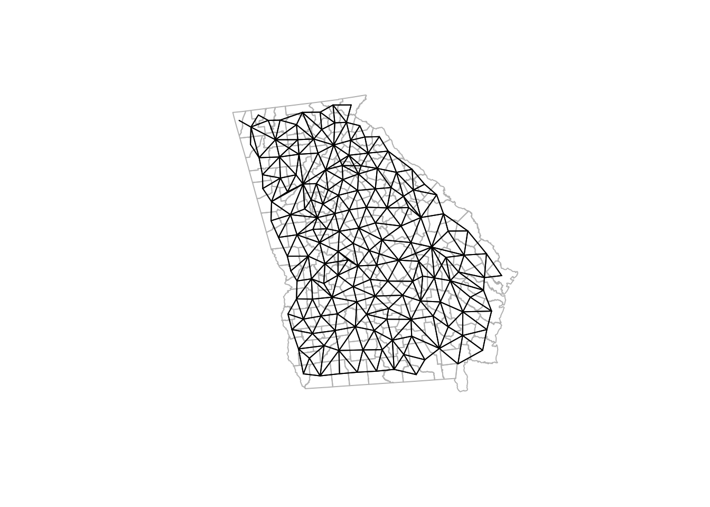
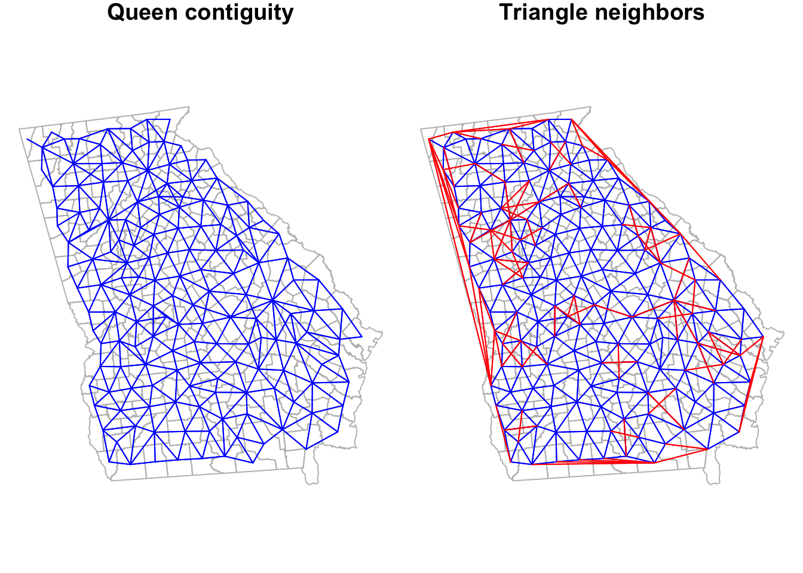
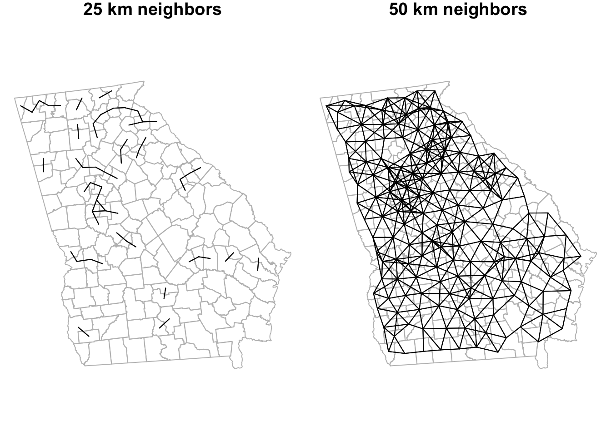
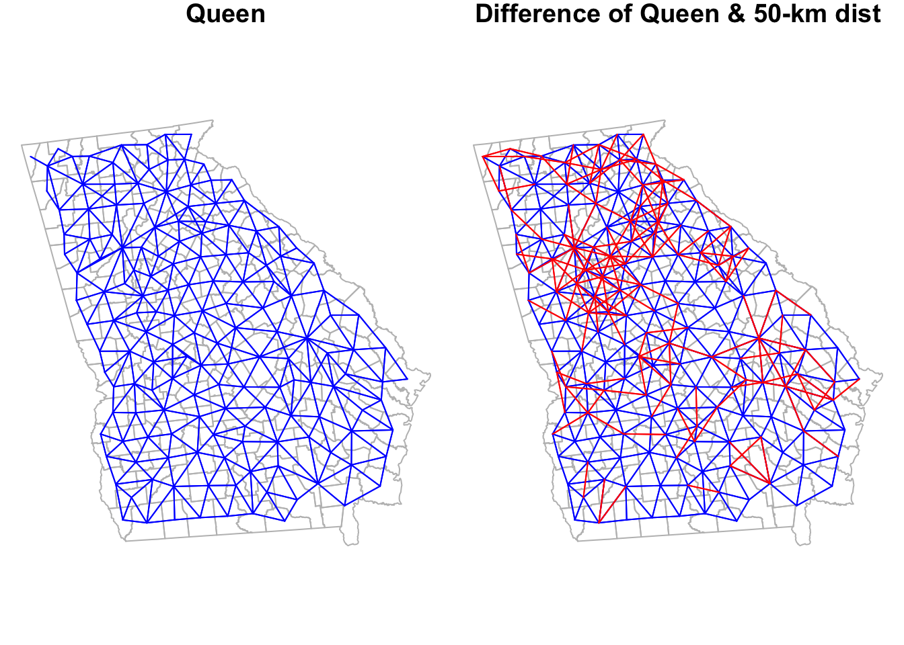

# Disease Mapping II


## Getting Ready

### Learning objectives


<!--html_preserve--><table class="huxtable" style="border-collapse: collapse; border: 0px; margin-bottom: 2em; margin-top: 2em; width: 100%; margin-left: auto; margin-right: auto;  " id="learning-ob">
<caption style="caption-side: top; text-align: center;">(#tab:learning-ob) Learning objectives by weekly module</caption><col><tr>
<th style="vertical-align: top; text-align: left; white-space: normal; border-style: solid solid solid solid; border-width: 1pt 1pt 1pt 1pt; border-top-color: rgb(255, 255, 255);  border-right-color: rgb(255, 255, 255);  border-bottom-color: rgb(255, 255, 255);  border-left-color: rgb(255, 255, 255); padding: 2pt 6pt 2pt 6pt; background-color: rgb(204, 204, 204); font-weight: bold;">After this module you should be able to…</th></tr>
<tr>
<td style="vertical-align: top; text-align: left; white-space: normal; border-style: solid solid solid solid; border-width: 1pt 1pt 1pt 1pt; border-top-color: rgb(255, 255, 255);  border-right-color: rgb(255, 255, 255);  border-bottom-color: rgb(255, 255, 255);  border-left-color: rgb(255, 255, 255); padding: 2pt 6pt 2pt 6pt; background-color: rgb(242, 242, 242); font-weight: normal;">Compare and contrast the operationalization of distance or contiguity in spatial statistics to sociologic and demographic theories of health relevant processes and relationships in space</td></tr>
<tr>
<td style="vertical-align: top; text-align: left; white-space: normal; border-style: solid solid solid solid; border-width: 1pt 1pt 1pt 1pt; border-top-color: rgb(255, 255, 255);  border-right-color: rgb(255, 255, 255);  border-bottom-color: rgb(255, 255, 255);  border-left-color: rgb(255, 255, 255); padding: 2pt 6pt 2pt 6pt; background-color: rgb(230, 230, 230); font-weight: normal;">Apply and justify contrasting definitions of spatial weights matrix in estimation of statistically smoothed disease maps</td></tr>
</table>
<!--/html_preserve-->


### Additional Resources

* [Anselin, L. Spatial Regression Analysis in R: A workbook. 2007.](https://dces.wisc.edu/wp-content/uploads/sites/128/2013/08/W14_Anselin2007.pdf)
* [GeoDa Center Resources: Section on distance-based spatial weights](https://geodacenter.github.io/workbook/4b_dist_weights/lab4b.html)
* [GeoDa Center Resources: Section on contiguity-based spatial weights](https://geodacenter.github.io/workbook/4a_contig_weights/lab4a.html)

### Important Vocabulary


<!--html_preserve--><table class="huxtable" style="border-collapse: collapse; border: 0px; margin-bottom: 2em; margin-top: 2em; width: 90%; margin-left: auto; margin-right: auto;  " id="tab:unnamed-chunk-2">
<caption style="caption-side: top; text-align: center;">(#tab:unnamed-chunk-2) Vocabulary for Week 5</caption><col><col><tr>
<th style="vertical-align: top; text-align: left; white-space: normal; border-style: solid solid solid solid; border-width: 1pt 1pt 1pt 1pt; border-top-color: rgb(255, 255, 255);  border-right-color: rgb(255, 255, 255);  border-bottom-color: rgb(255, 255, 255);  border-left-color: rgb(255, 255, 255); padding: 2pt 2pt 2pt 6pt; background-color: rgb(84, 153, 199); font-weight: bold;"><span style="color: rgb(255, 255, 255);">Term</span></th><th style="vertical-align: top; text-align: left; white-space: normal; border-style: solid solid solid solid; border-width: 1pt 1pt 1pt 1pt; border-top-color: rgb(255, 255, 255);  border-right-color: rgb(255, 255, 255);  border-bottom-color: rgb(255, 255, 255);  border-left-color: rgb(255, 255, 255); padding: 2pt 6pt 2pt 2pt; background-color: rgb(84, 153, 199); font-weight: bold;"><span style="color: rgb(255, 255, 255);">Definition</span></th></tr>
<tr>
<td style="vertical-align: top; text-align: left; white-space: normal; border-style: solid solid solid solid; border-width: 1pt 1pt 1pt 1pt; border-top-color: rgb(255, 255, 255);  border-right-color: rgb(255, 255, 255);  border-bottom-color: rgb(255, 255, 255);  border-left-color: rgb(255, 255, 255); padding: 2pt 2pt 2pt 6pt; background-color: rgb(212, 230, 241); font-weight: bold;">Aspatial vs. Spatial</td><td style="vertical-align: top; text-align: left; white-space: normal; border-style: solid solid solid solid; border-width: 1pt 1pt 1pt 1pt; border-top-color: rgb(255, 255, 255);  border-right-color: rgb(255, 255, 255);  border-bottom-color: rgb(255, 255, 255);  border-left-color: rgb(255, 255, 255); padding: 2pt 6pt 2pt 2pt; background-color: rgb(212, 230, 241); font-weight: normal;">This distinction refers to whether or not spatial proximity or contiguity is explicitly incorporated into an analysis (spatial) versus whether spatial units are treated as independent of one another (aspatial)</td></tr>
<tr>
<td style="vertical-align: top; text-align: left; white-space: normal; border-style: solid solid solid solid; border-width: 1pt 1pt 1pt 1pt; border-top-color: rgb(255, 255, 255);  border-right-color: rgb(255, 255, 255);  border-bottom-color: rgb(255, 255, 255);  border-left-color: rgb(255, 255, 255); padding: 2pt 2pt 2pt 6pt; background-color: rgb(169, 204, 227); font-weight: bold;">Delauney triangulation</td><td style="vertical-align: top; text-align: left; white-space: normal; border-style: solid solid solid solid; border-width: 1pt 1pt 1pt 1pt; border-top-color: rgb(255, 255, 255);  border-right-color: rgb(255, 255, 255);  border-bottom-color: rgb(255, 255, 255);  border-left-color: rgb(255, 255, 255); padding: 2pt 6pt 2pt 2pt; background-color: rgb(169, 204, 227); font-weight: normal;">Geometric strategy for creating a mesh of contiguous, nonoverlapping triangles from a dataset of points. If points are the centroids of polygons, the triangle edges become graph-based definitions of spatial neighbors</td></tr>
<tr>
<td style="vertical-align: top; text-align: left; white-space: normal; border-style: solid solid solid solid; border-width: 1pt 1pt 1pt 1pt; border-top-color: rgb(255, 255, 255);  border-right-color: rgb(255, 255, 255);  border-bottom-color: rgb(255, 255, 255);  border-left-color: rgb(255, 255, 255); padding: 2pt 2pt 2pt 6pt; background-color: rgb(212, 230, 241); font-weight: bold;">Distance</td><td style="vertical-align: top; text-align: left; white-space: normal; border-style: solid solid solid solid; border-width: 1pt 1pt 1pt 1pt; border-top-color: rgb(255, 255, 255);  border-right-color: rgb(255, 255, 255);  border-bottom-color: rgb(255, 255, 255);  border-left-color: rgb(255, 255, 255); padding: 2pt 6pt 2pt 2pt; background-color: rgb(212, 230, 241); font-weight: normal;">A fundamental dimension in geography referring to the strength of connectedness or proximity in eculidean space, social space, or network space. Distance if fundamental because we assume that a) entities that are closer are, on average, more alike than entities that are far apart; and b) increasing distance represents increasing friction or imedance to social and health-relevant interaction</td></tr>
<tr>
<td style="vertical-align: top; text-align: left; white-space: normal; border-style: solid solid solid solid; border-width: 1pt 1pt 1pt 1pt; border-top-color: rgb(255, 255, 255);  border-right-color: rgb(255, 255, 255);  border-bottom-color: rgb(255, 255, 255);  border-left-color: rgb(255, 255, 255); padding: 2pt 2pt 2pt 6pt; background-color: rgb(169, 204, 227); font-weight: bold;">Neighbor symmetry</td><td style="vertical-align: top; text-align: left; white-space: normal; border-style: solid solid solid solid; border-width: 1pt 1pt 1pt 1pt; border-top-color: rgb(255, 255, 255);  border-right-color: rgb(255, 255, 255);  border-bottom-color: rgb(255, 255, 255);  border-left-color: rgb(255, 255, 255); padding: 2pt 6pt 2pt 2pt; background-color: rgb(169, 204, 227); font-weight: normal;">An attribute of spatial relationships in which it is assumed that if spatial unit A is a neighbor with B, then spatial unit B is also a neighbor with A. Some neighbor definitions (e.g. k-nearest neighbors) do not require symmetry.</td></tr>
<tr>
<td style="vertical-align: top; text-align: left; white-space: normal; border-style: solid solid solid solid; border-width: 1pt 1pt 1pt 1pt; border-top-color: rgb(255, 255, 255);  border-right-color: rgb(255, 255, 255);  border-bottom-color: rgb(255, 255, 255);  border-left-color: rgb(255, 255, 255); padding: 2pt 2pt 2pt 6pt; background-color: rgb(212, 230, 241); font-weight: bold;">Spatial neighbors</td><td style="vertical-align: top; text-align: left; white-space: normal; border-style: solid solid solid solid; border-width: 1pt 1pt 1pt 1pt; border-top-color: rgb(255, 255, 255);  border-right-color: rgb(255, 255, 255);  border-bottom-color: rgb(255, 255, 255);  border-left-color: rgb(255, 255, 255); padding: 2pt 6pt 2pt 2pt; background-color: rgb(212, 230, 241); font-weight: normal;">The set of spatial entities that are determined to be 'near' rather than 'far' (in binary terms) or relatively 'closer' or 'further' (in continuous terms). The definition of 'neighbors' is part of specifying spatial relatedness.</td></tr>
<tr>
<td style="vertical-align: top; text-align: left; white-space: normal; border-style: solid solid solid solid; border-width: 1pt 1pt 1pt 1pt; border-top-color: rgb(255, 255, 255);  border-right-color: rgb(255, 255, 255);  border-bottom-color: rgb(255, 255, 255);  border-left-color: rgb(255, 255, 255); padding: 2pt 2pt 2pt 6pt; background-color: rgb(169, 204, 227); font-weight: bold;">Spatial weights matrix</td><td style="vertical-align: top; text-align: left; white-space: normal; border-style: solid solid solid solid; border-width: 1pt 1pt 1pt 1pt; border-top-color: rgb(255, 255, 255);  border-right-color: rgb(255, 255, 255);  border-bottom-color: rgb(255, 255, 255);  border-left-color: rgb(255, 255, 255); padding: 2pt 6pt 2pt 2pt; background-color: rgb(169, 204, 227); font-weight: normal;">Typically a square matrix (n rows x n columns where n=geographic units) indexing all units on rows and columns. The values in the matrix indicate the spatial connectedness between all pairs of units.</td></tr>
<tr>
<td style="vertical-align: top; text-align: left; white-space: normal; border-style: solid solid solid solid; border-width: 1pt 1pt 1pt 1pt; border-top-color: rgb(255, 255, 255);  border-right-color: rgb(255, 255, 255);  border-bottom-color: rgb(255, 255, 255);  border-left-color: rgb(255, 255, 255); padding: 2pt 2pt 2pt 6pt; background-color: rgb(212, 230, 241); font-weight: bold;">Toblers' First Law of Geography</td><td style="vertical-align: top; text-align: left; white-space: normal; border-style: solid solid solid solid; border-width: 1pt 1pt 1pt 1pt; border-top-color: rgb(255, 255, 255);  border-right-color: rgb(255, 255, 255);  border-bottom-color: rgb(255, 255, 255);  border-left-color: rgb(255, 255, 255); padding: 2pt 6pt 2pt 2pt; background-color: rgb(212, 230, 241); font-weight: normal;">All things are related, but near things are more related on average than distant things. Note that there is some debate about whether this statistical truism is a universal 'Law of Geography'. For example the ubiquitous correlation of spatially adjacent measures could occur for many non-causal reasons including confounding or selection.</td></tr>
</table>
<!--/html_preserve-->


## Spatial Thinking in Epidemiology

This is the first time where we will formally incorporate and make explicit what *spatial* means in *spatial analysis*.  Although all work up until now has been represented on a map (thus spatially contextualized), we have not formally incorporate spatial relationships into any aspect of analysis. Specifically, last week we calculated statistical tests for heterogeneity, estimated precision or statistical significance, and produced Empirical Bayes smoothed (stabilized) estimates of parameters of interest. 

But each of those tasks treated each spatial unit as if it were spatially or geographically *independent* of every other spatial unit. This assumption that units are geographically independent is what I have referred to as **aspatial analysis**.


### An argument for the relevance of space

To formally and explicitly incorporate spatial relatedness we need to be clear about what constitutes spatial relationships.  There are two aspects to considering spatial relatedness, and they apply to two sides of spatial thinking about health. As discussed in the recorded lecture, the fundamental dimension for spatial relations in geography is that of *distance* (and relatedly the idea of *proximity*), whether that be euclidean (e.g. as the crow flies) distance, social distance, or network distance.  

On the one hand, distance is used as a metric for defining some aspect of *local population homogeneity* that is distinct from the *broader regional (e.g. study region-wide) heterogeneity*. In other words, based on Tobler's First Law of Geography, near things tend to be more alike (e.g. *correlated* although not necessarily *causally linked*) than distant things (on average), implying a kind of dependence or correlation among local units that might not be evident overall.  

This concept -- which seems to hold true for many human and non-human systems -- means that when faced with sparse data, and concern for uncertainty, we can '*borrow*' statistical information from spatial neighbors to supplement estimation of local disease parameters. This is exactly what we will do with *spatial Empirical Bayes* estimation, where instead of using the overall (global) rate of disease as the prior, we will use the *local rate* for neighbors surrounding each entity as a kind of custom, place-specific prior.

But at a deeper level, distance is also important to spatial thinking in epidemiology. This is because we hypothesize -- and are interested in -- whether entities that are geographically or socially more connected share health-relevant experiences. These experiences or exposures include microbial space (e.g. person-to-person transmission of infectious agents), social norms (e.g. acceptability of smoking or body image perceptions), built environments (e.g. lead exposure in municipal water systems, food environments), access to health resources (e.g. health care, cancer screening), and access to opportunity structures (e.g. good schools, safe streets, employment opportunities). 


:::{.rmdnote data-latex="{note}"}

**Distance is not only Cartesian!**

The examples above emphasize the role *distance* in Cartesian (geographic) space. However, it is worth emphasizing how more complex versions of *distance* and *proximity* could come into play. 

For example air travel makes the *linear Cartesian distance* between two places less relevant than the *economic* and *social* drivers of flows of people back and forth when it comes to infectious disease transmission such as Zika or Ebola. 

There is a still a *distance* dimension, but it is defined by the push and pull of human mobility and migration. It is possible to define *spatial neighbors* in these more abstract (e.g. non-geographic) ways.  For example, political scientists have created spatial weights matrices that connect states not by their geographic boundaries, but by how similarly their legislatures act on policy decisions. In this way *distance* is a measure of ideology rather than geography, but still has meaning for spatial analysis of health.  But for today we will focus on the more specific example of *geographic space* rather than social, political, or economic *space*. 

:::

In sum, the notion of explicitly *spatial analysis* is a way to incorporate theoretical and conceptual aspects of how humans relate to one another and their environment into our understanding of the distribution and determinants of disease.

Whether we treat spatial dependence and relatedness as a primarily statistical feature for exploitation (e.g. as in spatial disease mapping with Empirical Bayes), or as an attribute of the local ecosystem of disease generation, it is clear that when and how neighbors are defined is influential on the final numerical results and the inference we take from them.  The definition of spatial neighbors, and the corresponding symbolization of that relatedness with creation of spatial weights matrices is a fundamental bridge between theory of geography and meaning for spatial epidemiology.

### On making meaning from neighbors

As will be discussed below, the primary means by which spatial epidemiologists can make space *explicit* is by incorporating information about how places or geographic units are related to one another; in other words the *distance* (proximity, connectivity, contiguity, etc) between any single unit and all other units begins to put the pieces of the puzzle together into a whole.  This is often done through creation of a numerical *weight* that quantifies the distance between the *local* unit and its *neighbors* (those presume to be proximate, at least to some degree).

The challenge for the spatial epidemiologist is twofold:

1. Conceptualizing the spatial scale and extent at which a health-relevant process of interest occurs
2. Translating that conceptual idea to an explicit definition of neighbors, and therefore spatial weights

For areal analysis (e.g. spatial analysis of polygons), there are two broad classes of neighborhood definitions: contiguity-based definitions and distance-based definitions. In reality both are abstract expressions of '*distance*', but they differ in how '*near*' and '*far*' are operationalized. 

While we are primarily focused on analysis of areal units in this course, it is possible to create neighbor definitions among point-referenced data by using a tessalation process such as creation of Thiessen polygons (e.g. see [this discussion on Contiguity-based weights for points](https://geodacenter.github.io/workbook/4b_dist_weights/lab4b.html#distance-metric)). 

:::{.rmdcaution data-latex="{caution}"}

The table below will be explored and explained in more detail in the online lectures, and in the lab activity. The key takeaway at this point is that we can define which units are *near* which other units using different definitions, and those definitions have slightly different assumptions and results.

:::

Below is a brief summary of several common neighbor definitions:

|        | Basic metric | Description
|------------|-------------|---------------------------------------------------------
| **Rook** | Contiguity | Unit A and unit B are neighbors if and only if they share boundary edges. Second or higher-order contiguity refers to units sharing edges with index unit (1st order contiguity), plus units that share boundary edges with all 1st order neighbors; and so forth)
| **Queen** | Contiguity | Unit A and unit B are neighbors if they share *either* boundary edges *or* boundary corners (e.g. vertices). Second or higher-order contiguity refers to units sharing edges with index unit (1st order contiguity), plus units that share boundary edges with all 1st order neighbors; and so forth)
| **Sphere of influence graph neighbors** | Contiguity | *Graph-based* neighbors start by creating *Delauney triangles* from the centroid of units. Neighbors are defined by the *edges* of the triangles.
| **Fixed distance** | Distance | Unit A is a neighbor of unit B, if unit A (or perhaps the centroid of the unit) falls within a fixed-distance buffer created around unit B (or perhaps the centroid of the unit).
| **K-nearest neighbors (KNN)** | Distance | Unit A is a neighbor of unit B, if when a rank-order of closest to furthest neighbors from Unit B is created, Unit A is ranked $\leq k$. In other words, if $K$ is set to 5, then unit A is neighbor of B if it is among the 5 nearest neighbors. KNN is an *asymmetric* definition; it is possible for A to be neighbors with B, but B may not be a neighbor to A.
| **Inverse distance** | Distance | Instead of using a fixed threshold of distance (e.g. a buffer) or a fixed number of near neighbors (e.g. KNN), this strategy describes proximity or '*nearness*' as the inverse of the Euclidean or road-network distance (or possibly inverse of distance-squared). 

The choice of which neighbor definition to use is influenced by several study-specific factors, some of which can be in conflict with others:

* Variation in size of areal units across the study area. If some areal units are very small (e.g. counties in the Eastern U.S.) and some are very large (e.g. counties in the Western U.S.), then the geographic area defined by adjacent counties will be quite different (e.g. think about how long it takes to drive across two counties like Dekalb and Fulton in Atlanta, versus how long it might take to traverse two counties in Nevada or Utah). In contrast, fixed-distance neighbors will have a more consistent among of linear distance between index units and their neighbors.
* Assumptions or requirements of the statistical analysis of interest. Some algorithms require/expect features such as *neighbor symmetry* or *spatial weights row standardization* to account for unequal numbers of neighbors.
* The assumed meaning of space in the analysis. It is possible that, for instance, the meaning of distance in Western counties is different where further travel to basic services is more the norm than in denser areas in the East.
* The purpose and audience of the map. It is important to make the analysis accessible and interpretable to the target audience.
* Aspects of the geography including islands or presence of non-contiguous units (e.g. Hawaii, Alaska, Puerto Rico)


## Spatial Analysis in Epidemiology

To apply these concepts to specific spatial analysis, we will continue to use the Georgia *very low birthweight* dataset used in the previous module of the eBook. As a reminder, this is a county-level dataset for the $n=159$ Georgia Counties containing the county of all live births (denominator) as well as the count of VLBW births (weight at birth < 1500 grams) babies in 2018-2019. These data were derived from the [Georgia OASIS website](https://oasis.state.ga.us/).


In this section we first introduce how to create and examine several different spatial neighbor definitions. But we never create neighbors just for their own sake. The purpose of creating spatial neighbors and weights matrices is always to use the definition in a spatial analysis.  Later in this section you will see the use of the spatial weights for producing *spatial Empirical Bayes* estimates.


### Creating contiguity neighbor objects

In `R`, the `spdep` package has a series of functions useful for creating spatial weights matrices. In general, the process of going from a spatial object (e.g. an `sf` class data object) to a usable spatial weights matrix requires more than one step, and the steps vary depending on the eventual use. 

Since we are starting with areal (polygon) data, the starting point is to use a utility function, `poly2nb()`,  that take a polygon spatial object (of class `sf` or `sp`) and determine which specific polygon regions are contiguous with (touch, share boundaries with) other regions.  If you review the help documentation, you will see that the function takes a spatial `sf` object as the input, with arguments specifying whether to use *Queen* contiguity (default; *Rook* is the alternative). The function returns something called a *neighbor list*.


```r
# load the package spdep
library(spdep)

# Create a queen contiguity neighbor list
queen_nb <- poly2nb(vlbw, queen = TRUE)

# Examine the resulting object
summary(queen_nb)
```

```
## Neighbour list object:
## Number of regions: 159 
## Number of nonzero links: 860 
## Percentage nonzero weights: 3.401764 
## Average number of links: 5.408805 
## Link number distribution:
## 
##  1  2  3  4  5  6  7  8  9 10 
##  1  4 12 29 36 37 28  9  1  2 
## 1 least connected region:
## 64 with 1 link
## 2 most connected regions:
## 1 66 with 10 links
```

The `summary()` function for objects of class `nb` (a *neighbor* object created in `spdep`) provides some useful high-level info, including the presence of regions with zero links (no neighbors -- a problem that could occur with islands, for example), and the distribution of number of links or neighbors.  

You might want to look at the structure of the `queen_nb` object also, either using `str(queen_nb)`, or perhaps just viewing the first few elements in the list (e.g. because `nb` objects are of class `list` in R, use the double-bracket indexing of lists like this `queen_nb[[1]]` to view the neighbors for the *first* region).  

The neighbor object is essentially a list with length equal to the number of regions ($n=159$ counties in this case).  The elements in the list correspond to the order of the input dataset, with the first list item being the first county in the current sort order. Each element in the list is a vector identifying *which other* counties are neighbors to it.

One important attribute of spatial relationships is whether they are *symmetric* or not. In the context of spatial neighbors, spatial symmetry implies that if $region_i$ is a neighbor to $region_j$, then $region_j$ is also a neighbor to $region_i$.  Contiguity neighbors are symmetric by design: if the definition of *neighbor* is shared boundaries, that is true for either partner in the relationship. We will see below that not all definitions of spatial relationships and neighbors result in symmetric relationships.  A quick way to check whether a neighbor object is symmetric or not is this code:


```r
is.symmetric.nb(queen_nb)
```

```
## [1] TRUE
```

To better understand a set of spatial relationships, it can be useful to visualize neighbor links or connections when choosing among a neighbor definition, simply to see the relative density and pattern of connectivity. Note that the function `plot.nb()` has the `nb` object as its first argument, but must also include a matrix of centroids as the second argument. The reason is that the `nb` object defines *which* region connects to *which*, but does not say where they are in space. The centroids tell the plot *where* each link or line begins and ends. 


```r
# Create a matrix of the x,y coordinates for each county centroid
ga_cent <- st_centroid(st_geometry(vlbw))

# Plot the outlines of counties with light grey boundaries
plot(st_geometry(vlbw), border = 'grey')

# Add the plot of the Queen contiguity connections
plot.nb(queen_nb, ga_cent, points = F, add = T)
```



Notice how the density of neighbors is generally lower on the coast and at state boundaries. This systematic difference in neighbors can produce patterns sometimes referred to as *edge effects*. These edge effects could be a source of bias, because counties in the interior of the state have more neighbors (and thus more '*local information*' on average) than border counties. This is especially true when the absence of neighbors is artificial as in the case of counties bordering Alabama, Tennessee, North or South Carolina, Florida. In contrast, counties on the coast have a '*real*' absence of neighbors.


### Creating k-nearest neighbors

*K-nearest neighbors* is a flexible approach to assuring balanced number of neighbors, and can help when the size and density of the spatial regions varies across the study area. For instance a fixed-distance buffer (e.g. perhaps counties within 50 miles) might work to identify relevant neighbors in the Eastern or Midwestern U.S., but in the West, where a county may be 100-200 miles across, there would be *zero* neighbors with this definition. But with *K-nearest neighbors*, both smaller Eastern and larger Western counties would have neighbors (albeit of differing spatial scales). 

:::{.rmdnote data-latex="{note}"}

Because *k-nearest neighbors* does not depend on either arbitrary fixed distance, nor on contiguity, it will always produce neighbors even for islands. For example in analyses of U.S. states, Alaska and Hawaii have no contiguous neighbors.  However, a k-nearest neighbor approach would still assign the *nearest neighbor* regardless of how far away. For instance the nearest neighbor to Hawaii might be California. The question you must ask yourself is whether it is meaningful to say Hawaii and California are neighbors. If you are interested in food environment, that seems implausible. However, there is a great deal of social, cultural, and economic interaction between Hawaii and California; so in some instances this could be a plausible and meaningful connection.

:::


To create a *k-nearest neighbor* object, we first must identify the relative proximity of candidate neighbors. To define *who is nearest to whom*, by convention we measure Euclidean distance between the *centroids* of polygons (literally the geometric center), under the assumption that this is an *average* location to describe the polygon. This requires two steps.

First, the `knearneigh()` function takes these centroids, calculates all pair-wise distances, sorts them from closest to furthest, and then selects the $k$ nearest (or smallest distance) units.  Then the `knn2nb()` function takes this information and creates a formal `nb` or *neighbor* object.


```r
# First create two sets of neighbors: 2 nearest and 5 nearest
knn2 <- knearneigh(ga_cent, k = 2)
knn5 <- knearneigh(ga_cent, k = 5)

# Now take those lists of neighbors and make an nb object
knn2_nb <- knn2nb(knn2, row.names = vlbw$GEOID)
knn5_nb <- knn2nb(knn5, row.names = vlbw$GEOID)

summary(knn5_nb)
```

```
## Neighbour list object:
## Number of regions: 159 
## Number of nonzero links: 795 
## Percentage nonzero weights: 3.144654 
## Average number of links: 5 
## Non-symmetric neighbours list
## Link number distribution:
## 
##   5 
## 159 
## 159 least connected regions:
## 13121 13029 13135 13127 13271 13279 13301 13007 13143 13221 13137 13289 13105 13051 13073 13189 13103 13319 13209 13317 13241 13033 13261 13249 13309 13113 13123 13157 13215 13311 13265 13019 13291 13171 13263 13001 13303 13027 13305 13133 13251 13163 13195 13013 13153 13205 13025 13009 13021 13217 13213 13151 13185 13181 13313 13183 13031 13245 13141 13191 13049 13079 13283 13083 13139 13107 13179 13229 13075 13267 13039 13077 13219 13315 13285 13095 13115 13225 13045 13035 13161 13097 13071 13237 13081 13011 13109 13017 13255 13197 13003 13015 13275 13211 13235 13131 13065 13293 13287 13155 13227 13173 13223 13277 13145 13297 13129 13295 13055 13165 13243 13047 13233 13187 13117 13111 13063 13067 13207 13101 13167 13193 13239 13149 13069 13125 13085 13091 13201 13061 13321 13169 13281 13299 13037 13053 13307 13273 13159 13023 13093 13177 13257 13175 13269 13059 13089 13043 13147 13057 13231 13253 13087 13005 13119 13247 13099 13199 13259 with 5 links
## 159 most connected regions:
## 13121 13029 13135 13127 13271 13279 13301 13007 13143 13221 13137 13289 13105 13051 13073 13189 13103 13319 13209 13317 13241 13033 13261 13249 13309 13113 13123 13157 13215 13311 13265 13019 13291 13171 13263 13001 13303 13027 13305 13133 13251 13163 13195 13013 13153 13205 13025 13009 13021 13217 13213 13151 13185 13181 13313 13183 13031 13245 13141 13191 13049 13079 13283 13083 13139 13107 13179 13229 13075 13267 13039 13077 13219 13315 13285 13095 13115 13225 13045 13035 13161 13097 13071 13237 13081 13011 13109 13017 13255 13197 13003 13015 13275 13211 13235 13131 13065 13293 13287 13155 13227 13173 13223 13277 13145 13297 13129 13295 13055 13165 13243 13047 13233 13187 13117 13111 13063 13067 13207 13101 13167 13193 13239 13149 13069 13125 13085 13091 13201 13061 13321 13169 13281 13299 13037 13053 13307 13273 13159 13023 13093 13177 13257 13175 13269 13059 13089 13043 13147 13057 13231 13253 13087 13005 13119 13247 13099 13199 13259 with 5 links
```

Notice how the summaries are not so interesting when we force everyone to have the same number of links!  However in checking the symmetry, and important concern rises:


```r
is.symmetric.nb(knn2_nb)
```

```
## [1] FALSE
```

```r
is.symmetric.nb(knn5_nb)
```

```
## [1] FALSE
```
:::{.rmdnote data-latex="{note}"}

*K-nearest neighbors* will almost always produce *asymmetric* neighbors. Thinking about U.S. states is perhaps an easy way to understand this. Consider the state of Hawaii:  the nearest states are probably California, Oregon, and Washington.  However the inverse is not true. The nearest 2 (or 3 or 4 or 5)  states to California are all in the contiguous 'lower 48' states; Hawaii is certainly not among the *nearest* places to California.  

:::

This *asymmetry* is not a problem for spatial analytic tasks including the spatial Empirical Bayes smoothing we will do this week. However, for some cluster analysis or other analyses in future weeks, neighbor symmetry is assumed and required. If you choose a *k-nearest neighbor* definition, but you also require symmetric spatial relationships, you can force symmetry in at least two ways. 

First, you could specify `sym  = TRUE` in the `knn2nb()` call above. That essentially *breaks* the rigid *k-nearest neighbors* and forces reciprocity in *'neighborliness'*. The second method is appropriate if you have already created *asymmetric* neighbors, but wish to retrospectively force symmetry: `make.sym.nb()`.  This simply takes an asymmetric neighbor object and adds links to make the relationships symmetric.  Note, however, that this alters the number of links or neighbors for each region: some will now have more than others.


```r
knn5_symmetric <- make.sym.nb(knn5_nb)
summary(knn5_symmetric)
```

```
## Neighbour list object:
## Number of regions: 159 
## Number of nonzero links: 910 
## Percentage nonzero weights: 3.599541 
## Average number of links: 5.72327 
## Link number distribution:
## 
##  5  6  7  8 
## 73 61 21  4 
## 73 least connected regions:
## 13121 13135 13127 13289 13105 13051 13103 13319 13317 13241 13033 13249 13113 13157 13215 13171 13027 13133 13251 13013 13009 13021 13181 13031 13245 13049 13079 13083 13107 13179 13267 13039 13219 13315 13285 13095 13225 13081 13017 13275 13235 13155 13145 13295 13055 13165 13243 13047 13233 13111 13207 13101 13167 13239 13149 13091 13201 13061 13281 13053 13159 13093 13177 13257 13175 13059 13147 13057 13231 13253 13087 13005 13099 with 5 links
## 4 most connected regions:
## 13007 13223 13129 13187 with 8 links
```

```r
is.symmetric.nb(knn5_symmetric)
```

```
## [1] TRUE
```

Note that now there are four counties with 8 links, rather than 5. That means each of those counties were the *nearest* to at least 3 others, even though those 3 were not *nearest* to them. 

#### Visualizing differences between competing neighbor definitions

:::{.rmdtip data-latex="{tip}"}

As a spatial analyst, you might be very interested in how the choice of neighbors affects your results. To better understand what is different from one definition to the next it can be helpful to visualize them side-by-side. This visualization is **not likely** of interest to a broader audience. In other words you would probably not publish this map. Instead its production helps *you*, the spatial epidemiologist, better understand your options and make informed decisions.

:::

Using just base-R plotting (you could create fancier maps if desired with `ggplot` or `tmap`), we can easily visualize the county polygons, with lines connecting the centroids of *neighboring counties* as an indication of shared influence, contact, or interaction.  

The function `plot.nb()` requires the spatial neighbor object (e.g. object of class `nb`), a matrix of the $x, y$ locations of polygon centroids, and then does the work of drawing the connecting lines.

The function in the code below named `diffnb()` is simply a utility function to compare two `nb` objects to determine what is the *same* and what is *different*. We can then plot the *different* values in red in order to quickly see what differs from one neighbor definition to the next.


```r
par(mfrow = c(1, 3),        # set plotting space for 2 side-by-side plots
    mar = c(.2,.2,1,.2))    # Set margins for plotting

# Plot the knn = 2 neighbor connections
plot(st_geometry(vlbw), border = 'grey', main = 'knn = 2')
plot.nb(knn2_nb, ga_cent, point = F, add = T)

# Plot the knn = 5 neighbor connections
plot(st_geometry(vlbw), border = 'grey', main = 'knn = 5')
plot.nb(knn5_nb, ga_cent, point = F, add = T, col = 'blue')
plot.nb(diffnb(knn2_nb, knn5_nb), ga_cent, point = F, add = T, col = 'red')

# Plot the knn = 5 AND the differences (in red) when knn = 5 is made symmetric
plot(st_geometry(vlbw), border = 'grey', main = 'Symmetric Knn5')
plot.nb(knn5_nb, ga_cent, point = F, add = T, col = 'blue')
plot.nb(diffnb(knn5_nb, knn5_symmetric), ga_cent, point = F, add = T, col = 'red')
```


```r
par(mfrow = c(1,1))
```


It is no surprise that there are lots of red lines on the *knn5* as compared with the *knn2*. Every single county has 3 additional neighbors in the former compared to the latter.  However it is interesting to see how many initially *asymmetric* relationships had to have added links in order to enforce *symmetry* (e.g. the red lines in the right-hand plot, compared to middle).

### Creating Graph-based triangle neighbor objects

The contiguity framework takes the reasonable approach that *local* implies direct interaction as indicated by shared borders. However in many instances, the odd shape of polygons means that regions could be quite close to one another but not share a border.  A different approach -- one of two methods we'll discuss called *graph-based neighbors* -- defines the local neighbors by relative proximity using a geometry approach. 

The process subdivides the space into non-overlapping triangles, using the centroids of each region as vertices in the triangle.  A *neighbor* is therefore any region that is connected by an edge (link) between two vertices (centroids).  More practically, this results in neighbor region that are near(ish) but are not required to have touching-borders. Graph-based neighbor objects are symmetric by design.


```r
tri_nb <- tri2nb(ga_cent)
summary(tri_nb)
```

```
## Neighbour list object:
## Number of regions: 159 
## Number of nonzero links: 918 
## Percentage nonzero weights: 3.631185 
## Average number of links: 5.773585 
## Link number distribution:
## 
##  3  4  5  6  7  8 
##  1 18 40 63 31  6 
## 1 least connected region:
## 15 with 3 links
## 6 most connected regions:
## 58 65 82 107 118 120 with 8 links
```

```r
is.symmetric.nb(tri_nb)
```

```
## [1] TRUE
```

Look back at the summary for the `queen_nb` object created previously. This graph-based neighbor definition results in slightly more connections for every county as compared with Queen contiguity, but also reduces the variation in number of links. The Queen had counties with as many as 10 links and some with only 1 link; in contrast this graph-based definition results in counties ranging from a minimum of 3 neighbors to a maximum of 8. 

To visualize the triangularized neighbors we can plot their links, next to the *Queen contiguity* to compare.




Notice how the graph-based neighbors have strange connections along the Western border of Georgia.  This is because the Delauney triangle algorithm makes unexpected connections between centroids along edges.  If we thought these were unreasonable spatial relationships (I think they are!), we can *prune* them down by using a *Sphere of Influence* graph to restrict to more proximate relationships. In most instances, carrying out this pruning to produce *sphere of influence* graph neighbors is most sensible as compared to using the product we have at this stage.


The code is a little intimidating looking: It includes some nested functions where the original triangle neighbor object is fed into the `soi.graph()` function, which itself is fed into the `graph2nb()` function. But basically what it is doing is looking for ties or connections defined by the triangularization algorithm that are also proximate.


```r
soi_nb <- graph2nb(soi.graph(tri_nb, ga_cent))

summary(soi_nb)
```

```
## Neighbour list object:
## Number of regions: 159 
## Number of nonzero links: 850 
## Percentage nonzero weights: 3.362209 
## Average number of links: 5.345912 
## Link number distribution:
## 
##  3  4  5  6  7  8 
## 11 35 32 53 25  3 
## 11 least connected regions:
## 14 15 21 64 71 87 96 120 123 124 152 with 3 links
## 3 most connected regions:
## 65 82 107 with 8 links
```


To see how *Queen* neighbors compares to each we can plot them:


### Creating fixed-distance neighbors

The concept of *buffering* around locations to define exposure is probably familiar. It is not uncommon for exposures such as access to health services, healthy food stores, or exposure to toxin emitters to be quantified using fixed-distance buffers. The fixed-distance neighbor definition is therefore a natural extension, where we believe that the definition of *local* or *near* can be described by who (or where) falls within a given radius. In that way it is different from all of the previous approaches because neither sharing borders, nor being the k-nearest neighbor is required. 

All that is required is that the place (or more specifically the centroid of the place), falls within the designated distance.  The number of other units falling within a given threshold could range from zero to the maximum number of units in the study, and certainly could vary from one location to another (e.g. thinking again about distinctions between Eastern and Western counties in the U.S.).

Determining an appropriate distance can be challenging unless there is clear theory or evidence (e.g. the distance required to avoid exposure to radiation from a fixed point source). Often analysts consider a range of distances to understand how or whether the pattern changes under competing scenarios. This approach will be used more when we investigate spatial clusters of disease.

To define fixed-distance neighbors, we use the function `dnearneigh()` and must define both a minimum distance (probably but not always set at zero), and a maximum distance defining the buffer. 

:::{.rmdcaution data-latex="{caution}"}

**Beware of using distance measures for unprojected data**.

Note that the distance parameters are described on the *scale of the coordinate measures of the spatial object*. In this case, the spatial object is projected, and the units are meters. Therefore a distance of 1000 is 1 kilometer. However, for unprojected data the units are angular degrees, and not readily interpretable.

:::


Here we calculate neighbors for two distance buffers: all counties within 25km and all within 50km of the centroid of each county are neighbors; all other counties are not neighbors. Notice that the output of each instance of `dnearneigh()` is not just the distances themselves, but is actually a formal neighbor (`nb`) object.


```r
dist_25 <- dnearneigh(ga_cent, d1 = 0, d2 = 25000)
dist_50 <- dnearneigh(ga_cent, d1 = 0, d2 = 50000)
summary(dist_50)
```

```
## Neighbour list object:
## Number of regions: 159 
## Number of nonzero links: 1072 
## Percentage nonzero weights: 4.240339 
## Average number of links: 6.742138 
## Link number distribution:
## 
##  3  4  5  6  7  8  9 10 11 12 
## 10 18 20 21 33 21 21 10  4  1 
## 10 least connected regions:
## 4 14 22 41 61 71 96 120 152 153 with 3 links
## 1 most connected region:
## 156 with 12 links
```

We can compare the linkages of these two distance bands to one another:



Or we could compare one to a previous definition (e.g. the *Queen contiguity*).




### From spatial neighbors to spatial Disease Mapping

The main reason for struggling through all of the preceding ins and outs of spatial neighbors is because we would like to define a reasonable version of *local* given a spatial dataset, and use that definition to advance spatial epidemiologic goals.  As discussed above, a primary goal is the production of statistically stable rates, with less bouncing around in parameters simply due to small denominators.  

To state it again: statistics cannot solve some fundamental problems of sparse data!  However, statistical disease mapping methods, including Empirical Bayes and fully Bayesian methods, can use all available information to recover important underlying geographic trends in some instances.

#### Empirical Bayes Overview

As introduced last week, Bayesian thinking is a mathematical operationalization of a relatively intuitive process we all engage in: we often have **prior information** or **prior beliefs** about what effect size or risk or rate is plausible, informed by our experiences and the literature and evidence to date. We look at the result from our analysis (e.g. the *data* or *likelihood*), and we internally (often sub-consciously) combine those pieces (the *prior* and the *data*) to develop a new, updated belief, or *posterior belief*.  

The Bayesian process is a framework for moving this implicit cognitive process out into the open, by stating mathematically what our prior belief is, and therefore how we arrived at a new updated, posterior, belief.

Empirical Bayes disease rate smoothing is a process by which we take a set of regions, and consider each of them as *data*, with the question, '*What is the truest underlying rate of disease in this place?*'  We compare these observed data with some *prior belief* or expectation of what the rate could plausibly be (not specifically, but approximately or within a range).  

Where we get the prior is important and potentially impactful; last week for *aspatial Empirical Bayes* smoothing we used the overall average rate for the entire study region (e.g. state of Georgia) as the *prior*.  In other words, we sum all of the cases across spatial units (e.g. counties), and all of the population at risk across those units, to calculate a *single reference rate*, and the variance around that expectation. 

This reference rate (the *prior*) was then combined with the observed data in a weighted fashion where the prior is weighted higher in small-population regions, and the data is weighted higher in large-population regions.  The result of this weighted calculation is a *posterior* or *smoothed* estimate of the rate. 

Last week we calculated the aspatial Empirical Bayes estimate of very low birthweight. The prior information for this estimation comes from the size of each county's `expected` count. Specifically a mean, $\mu$, and variance, $\sigma^2$ are estimated from all $n=159$ counties `expected` count, and this single, global, overall prior was used for the strategy used last week.


```r
# Calculate aspatial EB
global_eb1 <- eBayes(vlbw$VLBW, vlbw$expected)

# Add the crude/observed SMR to the data
vlbw$eb_global <- global_eb1$RR

# Convert the aspatial EB RR to a smoothed aspatial EB rate by multiplying by referent rate, r
vlbw$EB_global <- r * vlbw$eb_global
```


:::{.rmdcaution data-latex="{caution}"}

Beware of *what output* any given function is providing!  One possible place for confusion here is that the output from the global aspatial Empirical Bayes estimate using `eBayes()` was the *excess relative risk* of each county as compared to the global referent (e.g. the statewide prevalence of VLBW). However the function we use for *spatial Empirical Bayes* (below) will output a *rate* rather than a *relative excess risk*.  

Luckily those two are closely related. The `RR` from `eBayes()` represents the relative deviation of each county from the statewide average. Because we *know the global average* (e.g. we calculated it as `r`), simply multiplying the `RR` value for each individual county by the single global referent, `r`, gives us an aspatial Empirical Bayes smoothed estimate of the **rate** for each county. This will therefore be comparable with the estimates from the spatial Empirical Bayes estimators.

:::


### Spatial Empirical Bayes

By using our newly-created definitions of *local neighbors* among Georgia counties we can extend the Empirical Bayes approach by changing the source of the *prior* information. 

In the *aspatial* or global EB, the total rate for all of Georgia was the *prior* reference rate. However another option for providing statistical information about locally-varying *expected rates* is to use the *average of one's neighbors* as a prior.  This produces a sort of *borrowing of statistical information* through space, under the assumption that the local counties tell us more about a specific place than do counties far away. 

Note that there is *no expectation that counties next to one another have the same risk or rate*, but instead that on average the local information is more informative than non-local (global) prior information. That being said, there are statistical approaches for disease mapping when you believe important spatial dissimilarities exist between neighbors, or where you are searching for boundaries between areas of high and low rates. These can be implemented in the package `CARBayes` which will be introduced in the upcoming (optional) section on fully Bayesian disease mapping.

The spatial EB, thus follows the same process as the global or aspatial EB, but with a *different prior*. And because the prior is defined by the *local neighbors*, the different choices of neighbor object will likely have at least some influence on the resulting geographic smoothed patterns.

The function for estimating spatial Empirical Bayes is `EBlocal()` from the `spdep` package, and it requires not only the count of events and the count of population at risk for each county, but also a `nb` neighbor object. Although we highlighted the importance of neighbor symmetry above for some spatial analysis, symmetric neighbors *are not required* for spatial Empirical Bayes estimation. 


:::{.rmdnote data-latex="{note}"}

**NOTE:** 

The help documentation state that `EBlocal()` requires "*a numeric vector of populations at risk...*" to represent the denominator for rate estimation. For the purposes of this lab, that is exactly what you want. But note that if -- as we did last week -- you used indirect adjustment to calculate the *age-adjusted expected* **count**, you could also feed these expected counts to the `EBlocal()` function. 

The difference is that instead of the output from the function being spatially smoothed *rate* or *risk* or *prevalence* (e.g. events divided by population at risk), the output will instead by the spatially smoothed *excess relative risk (RR)* or *SMR* (e.g. the ratio of observed to expected). 

:::


```r
# Estimate spatial (local) EB under the Queen contiguity neighbor definition
eb_queen <- EBlocal(vlbw$VLBW, vlbw$TOT, nb = queen_nb)

# The output fro EBlocal() is a 2 column data.frame. The second colum is the EB estimate
vlbw$EB_queen <- eb_queen[,2]
```


:::{.rmdnote data-latex="{note}"}

**NOTE:** there is currently no function in `R` to estimate spatial EB rates with credible/confidence intervals or p-values, as we could with the Poisson-Gamma model for aspatial. Fully Bayesian disease mapping (e.g. in Disease Mapping IV) would be the best approach if spatial methods producing credible/confidence intervals are desired.

:::

Now we can create a spatial EB estimate for other neighbor definitions in order to understand how robust or sensitive our ultimate results are to the choice of neighbors.


```r
# Use the sphere of influence-pruned Delauney triangle definition
eb_soi <- EBlocal(vlbw$VLBW, vlbw$TOT, nb = soi_nb)
vlbw$EB_soi <- eb_soi[,2]

# Use the k-nearest neighbors (k=5) definition
eb_knn5 <- EBlocal(vlbw$VLBW, vlbw$TOT, nb = knn5_nb)
vlbw$EB_knn5 <- eb_knn5[,2]

# Use the 50-km fixed distance neighbors
eb_dist50 <- EBlocal(vlbw$VLBW, vlbw$TOT, nb = dist_50)
vlbw$EB_dist50 <- eb_dist50[,2]
```

#### Visualizing alternate smoothing approaches

Here is some code for simple visual comparison of the raw/observed, aspatial EB, and a variety of spatially-smoothed EB estimates. As you review these maps, you might ask yourself the following questions:

* Where does *any EB smoothing* versus the *raw/observed* estimates differ? 
* Where do the *spatial EB* estimates differ from the *aspatial EB* estimate? 
* And what differences do you notice *among* the various *spatial EB* estimates, distinguished by their unique definitions of local?


As we saw last week, there are some differences between the observed (crude) rates and the aspatial EB. However we can see even more dramatic differences for all four of the *spatial EB* rates as compared with either observed or aspatial. Among the spatial EB estimates there are only minor differences suggesting that -- among this set of neighbor definitions, and for this outcome -- there is relatively consistent patterns of VLBW regardless of choice of neighbors (e.g. our answer is relatively *robust* to neighbor definition).

### Final thoughts: Making choices

Over the past two weeks we have quickly amassed a large number of analytic tools to address one problem in spatial epidemiology: reliably characterize *spatial heterogeneity* in the presence of *rate instability* and uncertainty due to data sparsity. These analytic strategies include the two approaches to Empirical Bayes smoothing, but also the myriad of neighbor definitions for when we do choose a spatial approach. 

Unfortunately there is no simple rule to follow when choosing which tool to use, but below is a summary of considerations. Ultimately you make decisions in the context of the epidemiologic question, the constraints of the data, and the audience or end-user of the results. As with many things in epidemiologic analysis, there is an important role for *science* but also a need for experts who can engage in the *art* of analysis.


Method    | Uses   |  Assumptions and comments
------------ | --------------------- | --------------------------
**Aspatial Empirical Bayes** | Smooth or shrink local rates towards *global* (overall) reference rate, with shrinkage inversely proportionate to variance / sample size in local region. <br> In one simulation study, aspatial (versus spatial) EB minimized mean-squared error (MSE) when the outcome is rare.  | **1.** The best prior estimation of plausible rates (mean and variance) is the overall average. <br> __2.__ The reason for sparsity is about both numerator and denominator (e.g. both a rare disease, and small populations at risk).
**Spatial Empirical Bayes** | Smooth or shrink local rates towards *local* reference. In simulation study, spatial (local) EB outperformed aspatial when outcomes were not rare. | **1.** There is at least some spatial auto correlation in rates such that nearby-regions rates serve as a more informative prior than the global average. <br> __2.__ The reason for sparsity is primarily about the denominator (e.g. small population at risk), but the health outcome itself is not rare (in the overall region). 


#### Choosing *'neighborhood'* definitions

As you can see, there are a lot of ways of describing *local*, and we haven't even talked about inverse-distance weighting. So how do you go about choosing one definition over another? This is an example of the intersection of the *art* and *science* of spatial epidemiology. 

So, you might wonder how one decides when to smooth or not smooth, and when smoothing, which neighbor definition to use? There is a lot written about this and very few final answers. There is some evidence that approximately 6 neighbors provides a nice balance between informative prior information from local units versus biased estimates. But beyond that very broad recommendation, there are three general approaches to selecting a neighbor definition:

1. **By maximizing precision or fit** - this method is statistical in nature and implies that best smoother *fits* the data best. It is possible to estimate the mean-squared error (MSE) or the root mean squared error (RMSE) to describe how far, on average, each observed rate is from the observed data, with the idea being that the closest *average* distance is best. We will discuss extensions of this idea of *model fit* when we move to fully Bayesian mapping. There is code below to estimate the RMSE.
2. **By theory, context, or question** - most of my emphasis in explaining the neighbors has been on this approach. It is clearly important for the analyst to bring clarity about the question at hand, and the local context, to the decision of what is *sensibly local* for a given disease or health outcome. In some instances, one method clearly stands out from the others. However, it is not uncommon that there is moderate support (theoretically) for multiple. As you can see if you mapped the methods above, in our case there is only minor difference between the definitions for these data.
3. **By empirically estimating weights** - I will not be covering this approach further. However, briefly, the idea here is to use the evidence for spatial auto correlation to inform how *spatially important* one unit is to another. 


My bottom line recommendation is to *think spatially* and consider the data, question, and goals at hand. For the purposes of disease mapping, error reduction and precision are driving goals, so comparing RMSE across competing options could make sense. However for other purposes, statistical fit might not equate with unbiased estimation of target parameters (the same is true for non-spatial analysis!). 

Below is one simple approach to calculating the root mean squared error (RMSE). Recall that RMSE is the square root of the average squared difference between an observed value and its *model-predicted* (in our case EB-smoothed) value. The first bit of code is defining a simple function to calculate the RMSE. I define the function to have 2 arguments: `eb` is the Empirical Bayes estimate for $region_i$, and `o` is the observed rate for $region_i$.


```r
RMSE <- function(eb, o){
  sqrt(mean((eb - o)^2))
}

RMSE(vlbw$EB_global, vlbw$rate)
```

```
## [1] 0.006809047
```

```r
RMSE(vlbw$EB_queen , vlbw$rate)
```

```
## [1] 0.006404844
```

```r
RMSE(vlbw$EB_soi , vlbw$rate)
```

```
## [1] 0.006471757
```

```r
RMSE(vlbw$EB_knn5 , vlbw$rate)
```

```
## [1] 0.006529195
```

```r
RMSE(vlbw$EB_dist50 , vlbw$rate)
```

```
## [1] 0.006433534
```


So based on this, which fits best? In this case, the RMSE is quite similar, with slight advantage given to the *spatial Queen contiguity* definition. Although this is not strong evidence for preferring one strategy over another based on statistical fit alone. Therefore other factors (including purpose of map, audience, and theory of place underlying analysis) will be important in making decisions. 


