# Disease Mapping IV: Kernel Density Estimation

## Getting Ready


### Learning objectives


```{=html}
<table class="huxtable" style="border-collapse: collapse; border: 0px; margin-bottom: 2em; margin-top: 2em; width: 100%; margin-left: auto; margin-right: auto;  " id="learning-ob">
<caption style="caption-side: top; text-align: center;">(#tab:learning-ob) Learning objectives by weekly module</caption><col><tr>
<th style="vertical-align: top; text-align: left; white-space: normal; border-style: solid solid solid solid; border-width: 1pt 1pt 1pt 1pt; border-top-color: rgb(255, 255, 255);  border-right-color: rgb(255, 255, 255);  border-bottom-color: rgb(255, 255, 255);  border-left-color: rgb(255, 255, 255); padding: 2pt 6pt 2pt 6pt; background-color: rgb(204, 204, 204); font-weight: bold;">After this module you should be able to…</th></tr>
<tr>
<td style="vertical-align: top; text-align: left; white-space: normal; border-style: solid solid solid solid; border-width: 1pt 1pt 1pt 1pt; border-top-color: rgb(255, 255, 255);  border-right-color: rgb(255, 255, 255);  border-bottom-color: rgb(255, 255, 255);  border-left-color: rgb(255, 255, 255); padding: 2pt 6pt 2pt 6pt; background-color: rgb(242, 242, 242); font-weight: normal;">Discuss the meaning and interpretation of basic functions of spatial point processes including intensity, stationarity, heterogeneity</td></tr>
<tr>
<td style="vertical-align: top; text-align: left; white-space: normal; border-style: solid solid solid solid; border-width: 1pt 1pt 1pt 1pt; border-top-color: rgb(255, 255, 255);  border-right-color: rgb(255, 255, 255);  border-bottom-color: rgb(255, 255, 255);  border-left-color: rgb(255, 255, 255); padding: 2pt 6pt 2pt 6pt; background-color: rgb(230, 230, 230); font-weight: normal;">Produce spatially smoothed estimates of epidemiologic parameters using kernel density estimators for point and polygon data</td></tr>
</table>

```


### Additional Resources

* [Adrian Baddeley tutorial on analysis spatial point processes](https://training.fws.gov/courses/references/tutorials/geospatial/CSP7304/documents/PointPatterTutorial.pdf)
* Hazelton. Kernel Smoothing Methods. Chapter 10, Handbook of Spatial Epidemiology. *Posted on Canvas*


### Important Vocabulary


```{=html}
<table class="huxtable" style="border-collapse: collapse; border: 0px; margin-bottom: 2em; margin-top: 2em; width: 90%; margin-left: auto; margin-right: auto;  " id="tab:unnamed-chunk-2">
<caption style="caption-side: top; text-align: center;">(#tab:unnamed-chunk-2) Vocabulary for Week 7</caption><col><col><tr>
<th style="vertical-align: top; text-align: left; white-space: normal; border-style: solid solid solid solid; border-width: 1pt 1pt 1pt 1pt; border-top-color: rgb(255, 255, 255);  border-right-color: rgb(255, 255, 255);  border-bottom-color: rgb(255, 255, 255);  border-left-color: rgb(255, 255, 255); padding: 2pt 2pt 2pt 6pt; background-color: rgb(84, 153, 199); font-weight: bold;"><span style="color: rgb(255, 255, 255);">Term</span></th><th style="vertical-align: top; text-align: left; white-space: normal; border-style: solid solid solid solid; border-width: 1pt 1pt 1pt 1pt; border-top-color: rgb(255, 255, 255);  border-right-color: rgb(255, 255, 255);  border-bottom-color: rgb(255, 255, 255);  border-left-color: rgb(255, 255, 255); padding: 2pt 6pt 2pt 2pt; background-color: rgb(84, 153, 199); font-weight: bold;"><span style="color: rgb(255, 255, 255);">Definition</span></th></tr>
<tr>
<td style="vertical-align: top; text-align: left; white-space: normal; border-style: solid solid solid solid; border-width: 1pt 1pt 1pt 1pt; border-top-color: rgb(255, 255, 255);  border-right-color: rgb(255, 255, 255);  border-bottom-color: rgb(255, 255, 255);  border-left-color: rgb(255, 255, 255); padding: 2pt 2pt 2pt 6pt; background-color: rgb(212, 230, 241); font-weight: bold;">Bandwidth</td><td style="vertical-align: top; text-align: left; white-space: normal; border-style: solid solid solid solid; border-width: 1pt 1pt 1pt 1pt; border-top-color: rgb(255, 255, 255);  border-right-color: rgb(255, 255, 255);  border-bottom-color: rgb(255, 255, 255);  border-left-color: rgb(255, 255, 255); padding: 2pt 6pt 2pt 2pt; background-color: rgb(212, 230, 241); font-weight: normal;">A measure of the width or spatial extent of a two-dimensional kernel density estimator. The bandwidth is the key to controlling how much smoothing occurs, with larger bandwidths producing more smooth surfaces, and smaller bandwidths producing less smooth surfaces</td></tr>
<tr>
<td style="vertical-align: top; text-align: left; white-space: normal; border-style: solid solid solid solid; border-width: 1pt 1pt 1pt 1pt; border-top-color: rgb(255, 255, 255);  border-right-color: rgb(255, 255, 255);  border-bottom-color: rgb(255, 255, 255);  border-left-color: rgb(255, 255, 255); padding: 2pt 2pt 2pt 6pt; background-color: rgb(169, 204, 227); font-weight: bold;">Bandwidth, adaptive</td><td style="vertical-align: top; text-align: left; white-space: normal; border-style: solid solid solid solid; border-width: 1pt 1pt 1pt 1pt; border-top-color: rgb(255, 255, 255);  border-right-color: rgb(255, 255, 255);  border-bottom-color: rgb(255, 255, 255);  border-left-color: rgb(255, 255, 255); padding: 2pt 6pt 2pt 2pt; background-color: rgb(169, 204, 227); font-weight: normal;">An adaptive bandwith means the width or search radius of the spatial kernel density estimator varies or adapts through space, usually to maintain a constant number of points within the window. The result is that in areas with few points there is more smoothing, whereas in areas with many points there is more granularity</td></tr>
<tr>
<td style="vertical-align: top; text-align: left; white-space: normal; border-style: solid solid solid solid; border-width: 1pt 1pt 1pt 1pt; border-top-color: rgb(255, 255, 255);  border-right-color: rgb(255, 255, 255);  border-bottom-color: rgb(255, 255, 255);  border-left-color: rgb(255, 255, 255); padding: 2pt 2pt 2pt 6pt; background-color: rgb(212, 230, 241); font-weight: bold;">Bandwidth, fixed</td><td style="vertical-align: top; text-align: left; white-space: normal; border-style: solid solid solid solid; border-width: 1pt 1pt 1pt 1pt; border-top-color: rgb(255, 255, 255);  border-right-color: rgb(255, 255, 255);  border-bottom-color: rgb(255, 255, 255);  border-left-color: rgb(255, 255, 255); padding: 2pt 6pt 2pt 2pt; background-color: rgb(212, 230, 241); font-weight: normal;">A fixed bandwidth means the width or search radius of the spatial kernel density estimator is constant (fixed) for the full study region</td></tr>
<tr>
<td style="vertical-align: top; text-align: left; white-space: normal; border-style: solid solid solid solid; border-width: 1pt 1pt 1pt 1pt; border-top-color: rgb(255, 255, 255);  border-right-color: rgb(255, 255, 255);  border-bottom-color: rgb(255, 255, 255);  border-left-color: rgb(255, 255, 255); padding: 2pt 2pt 2pt 6pt; background-color: rgb(169, 204, 227); font-weight: bold;">Geographic-weighting</td><td style="vertical-align: top; text-align: left; white-space: normal; border-style: solid solid solid solid; border-width: 1pt 1pt 1pt 1pt; border-top-color: rgb(255, 255, 255);  border-right-color: rgb(255, 255, 255);  border-bottom-color: rgb(255, 255, 255);  border-left-color: rgb(255, 255, 255); padding: 2pt 6pt 2pt 2pt; background-color: rgb(169, 204, 227); font-weight: normal;">A method for calculating summary weighted statistics by relying on a kernel density estimator to describe the weights in local summaries.</td></tr>
<tr>
<td style="vertical-align: top; text-align: left; white-space: normal; border-style: solid solid solid solid; border-width: 1pt 1pt 1pt 1pt; border-top-color: rgb(255, 255, 255);  border-right-color: rgb(255, 255, 255);  border-bottom-color: rgb(255, 255, 255);  border-left-color: rgb(255, 255, 255); padding: 2pt 2pt 2pt 6pt; background-color: rgb(212, 230, 241); font-weight: bold;">Homogenous Poisson Point Process</td><td style="vertical-align: top; text-align: left; white-space: normal; border-style: solid solid solid solid; border-width: 1pt 1pt 1pt 1pt; border-top-color: rgb(255, 255, 255);  border-right-color: rgb(255, 255, 255);  border-bottom-color: rgb(255, 255, 255);  border-left-color: rgb(255, 255, 255); padding: 2pt 6pt 2pt 2pt; background-color: rgb(212, 230, 241); font-weight: normal;">A spatial statistical assumption that the count of events in an arbitrarily small area is distributed Poisson with mean lambda for all regions</td></tr>
<tr>
<td style="vertical-align: top; text-align: left; white-space: normal; border-style: solid solid solid solid; border-width: 1pt 1pt 1pt 1pt; border-top-color: rgb(255, 255, 255);  border-right-color: rgb(255, 255, 255);  border-bottom-color: rgb(255, 255, 255);  border-left-color: rgb(255, 255, 255); padding: 2pt 2pt 2pt 6pt; background-color: rgb(169, 204, 227); font-weight: bold;">Inhomogenous Poisson Point Process</td><td style="vertical-align: top; text-align: left; white-space: normal; border-style: solid solid solid solid; border-width: 1pt 1pt 1pt 1pt; border-top-color: rgb(255, 255, 255);  border-right-color: rgb(255, 255, 255);  border-bottom-color: rgb(255, 255, 255);  border-left-color: rgb(255, 255, 255); padding: 2pt 6pt 2pt 2pt; background-color: rgb(169, 204, 227); font-weight: normal;">A spatial statistical assumption that the count of events in an arbitrarily small area is distributed Poisson with mean lambda that varies through space as a function of the underlying population at risk. This is true for most spatial epidemiology.</td></tr>
<tr>
<td style="vertical-align: top; text-align: left; white-space: normal; border-style: solid solid solid solid; border-width: 1pt 1pt 1pt 1pt; border-top-color: rgb(255, 255, 255);  border-right-color: rgb(255, 255, 255);  border-bottom-color: rgb(255, 255, 255);  border-left-color: rgb(255, 255, 255); padding: 2pt 2pt 2pt 6pt; background-color: rgb(212, 230, 241); font-weight: bold;">Kernel density estimator</td><td style="vertical-align: top; text-align: left; white-space: normal; border-style: solid solid solid solid; border-width: 1pt 1pt 1pt 1pt; border-top-color: rgb(255, 255, 255);  border-right-color: rgb(255, 255, 255);  border-bottom-color: rgb(255, 255, 255);  border-left-color: rgb(255, 255, 255); padding: 2pt 6pt 2pt 2pt; background-color: rgb(212, 230, 241); font-weight: normal;">A non-parametric way to estimate the probability distribution function of a random variable. In spatial (e.g. 2-d) kernel density estimation, it is a way to describe the spatially continuous variation in the intensity of events (points).</td></tr>
<tr>
<td style="vertical-align: top; text-align: left; white-space: normal; border-style: solid solid solid solid; border-width: 1pt 1pt 1pt 1pt; border-top-color: rgb(255, 255, 255);  border-right-color: rgb(255, 255, 255);  border-bottom-color: rgb(255, 255, 255);  border-left-color: rgb(255, 255, 255); padding: 2pt 2pt 2pt 6pt; background-color: rgb(169, 204, 227); font-weight: bold;">Spatial density</td><td style="vertical-align: top; text-align: left; white-space: normal; border-style: solid solid solid solid; border-width: 1pt 1pt 1pt 1pt; border-top-color: rgb(255, 255, 255);  border-right-color: rgb(255, 255, 255);  border-bottom-color: rgb(255, 255, 255);  border-left-color: rgb(255, 255, 255); padding: 2pt 6pt 2pt 2pt; background-color: rgb(169, 204, 227); font-weight: normal;">A standardized metric of spatial intensity. Related to a probability density function, it is a proportionate indicator of how much of the total events occur in a specific region. In kernel density estimation, the density surface integrates (or sums) to 1 across a study region.</td></tr>
<tr>
<td style="vertical-align: top; text-align: left; white-space: normal; border-style: solid solid solid solid; border-width: 1pt 1pt 1pt 1pt; border-top-color: rgb(255, 255, 255);  border-right-color: rgb(255, 255, 255);  border-bottom-color: rgb(255, 255, 255);  border-left-color: rgb(255, 255, 255); padding: 2pt 2pt 2pt 6pt; background-color: rgb(212, 230, 241); font-weight: bold;">Spatial intensity</td><td style="vertical-align: top; text-align: left; white-space: normal; border-style: solid solid solid solid; border-width: 1pt 1pt 1pt 1pt; border-top-color: rgb(255, 255, 255);  border-right-color: rgb(255, 255, 255);  border-bottom-color: rgb(255, 255, 255);  border-left-color: rgb(255, 255, 255); padding: 2pt 6pt 2pt 2pt; background-color: rgb(212, 230, 241); font-weight: normal;">A measure of the ratio of events at specific points to a unit of area. Spatial intensity describes the spatially continuous surface of event occurrence. In kernel density estimation, a spatial intensity surface integrates (or sums) to the sample size across a study region.</td></tr>
<tr>
<td style="vertical-align: top; text-align: left; white-space: normal; border-style: solid solid solid solid; border-width: 1pt 1pt 1pt 1pt; border-top-color: rgb(255, 255, 255);  border-right-color: rgb(255, 255, 255);  border-bottom-color: rgb(255, 255, 255);  border-left-color: rgb(255, 255, 255); padding: 2pt 2pt 2pt 6pt; background-color: rgb(169, 204, 227); font-weight: bold;">Stationarity vs non-stationarity</td><td style="vertical-align: top; text-align: left; white-space: normal; border-style: solid solid solid solid; border-width: 1pt 1pt 1pt 1pt; border-top-color: rgb(255, 255, 255);  border-right-color: rgb(255, 255, 255);  border-bottom-color: rgb(255, 255, 255);  border-left-color: rgb(255, 255, 255); padding: 2pt 6pt 2pt 2pt; background-color: rgb(169, 204, 227); font-weight: normal;">Many statistics assume that the parameter, estimate, or property is constant across sub-units. For example if we take the average height of a population, under stationarity we would assume that average applies equally to sub-populations. In contrast, non-stationarity implies the parameter, estimate, or property varies across sub-groups. In spatial analysis stationarity is an assumption of homogeneity, and non-stationarity allows for heterogeneity.</td></tr>
</table>

```


## Spatial Thinking in Epidemiology

### Revisiting spatial point processes

People exist in places, but they are not uniformly nor randomly distributed. More live in cities; fewer live in rural area. But conditional on *where* people actually live or work or play, under a null expectation we could treat the occurrence of health events (e.g. disease, death, behaviors) as random variables, and leverage the tools of statistics to characterize when occurrence is what we would expect versus when it is something unusual.

In spatial analysis, we treat health events as random events among individuals located in space. Thus, conditional on where people are, we might assume (again, under the null hypothesis) that the occurrence of events is generated according to the assumed probability distribution. The utility of the *Poisson Point Process* becomes apparent when we see that we could divide a region into very small sub-regions and count the number of events within each, assuming that count follows a Poisson distribution.

<div class="figure">

<p class="caption">(\#fig:unnamed-chunk-3)Poisson point process</p>
</div>


In the above figure, we quantify the *spatial intensity* of events by calculating $\lambda = \frac{n}{area}$.  Thus, all of our statistical analysis to date is premised on this idea that the spatial location of points can be interpreted through the lens of a *Poisson* probability distribution.  

But what if we could calculate the *spatial intensity* more continuously, without the constraint of a specific parametric distribution, and without using the possibly arbitrary boundaries and zoning schemes of areal geographic units such as census tracts, zip codes, or counties?

*Spatial point process* analysis focuses on characterizing patterns derived directly from the location of the points themselves, without arbitrary aggregation.  The study of *point process analysis* is broad, but we will focus on one particularly flexible strategy this week: **kernel density estimation** (KDE). Kernel density estimation has several features making it useful for spatial epidemiology including:

* It is non-parametric, meaning it does not rely on a specific probability distribution (e.g. Poisson, negative binomial)
* It provides an alternative means for characterizing *local neighbors*. The strategy of the KDE estimators is most similar to *inverse distance weighting*
* It can be used as a primary tool, or can be an intermediate step for creating *spatial weights*, as we will see in *geographically weighted regression*
* While it is really designed for analyzing *points*, we can use it on areal/polygon data as well.

### What is a kernel density estimator?

A *kernel* is a function (e.g. mathematically described '*shape*') that is iteratively centered over each point of data. For example, a Gaussian kernel means there is a Gaussian bell-shaped curve centered over each point; the width of the curve is defined by a parameter, $h$, which stands for the *bandwidth*.


<div class="figure">

<p class="caption">(\#fig:unnamed-chunk-4)Kernel density estimator</p>
</div>

To estimate the *spatial intensity* of points, $\hat{\lambda}$, we can sum up the area under all of the kernels to estimate an overall *kernel density* at each location. This *kernel density estimate* essentially reports a spatially continuous summary of the *local intensity* of events.

The result is that we can summarize a study region with spatially-referenced point data using a *spatially continuous intensity surface*. The analyst decides on how *smooth* or *bumpy* the surface should be by increasing or decreasing the value of the bandwidth parameter, $h$. As we will see below, the decision about bandwidth could be made subjectively (e.g. to produce a visually appealing surface), or by minimizing error or through cross-validation.

<div class="figure">

<p class="caption">(\#fig:unnamed-chunk-5)Kernel density smoothing</p>
</div>


### Spatial heterogeneity versus Spatial non-stationarity

By now you are familiar with the concept of *spatial heterogeneity*  as being the phenomenon where local estimates of intensity, risk, or rate are different in at least some locations from the *global* estimates across the entire region. If all local rates were statistically similar to the global rate then we could say the process is *spatially homogeneous*, and not likely of much interest from a *spatial* or *cartographic* perspective.

In the vocabulary for Disease Mapping 1, we first introduced the terms '*stationarity*' versus '*non-stationarity*' which referred to a closely related idea.  A *stationary process* is one where the estimate of a statistic (e.g. an intensity, density, risk, rate, but also a correlation or regression coefficient) is not dependent on location within the region. In other words, the estimate of the statistic is invariant to choice of local area within the global study region.  In contrast, *spatial non-stationarity* is present when the estimate of the statistic is *dependent on* the location at which the measures are made. 

:::{.rmdnote data-latex="{note}"}

**Distinguishing heterogeneity from non-stationarity**

These two concepts are clearly similar. One way to unpack the subtle differences is to think about two kinds of *spatial heterogeneity*:

1. Areal units (e.g. counties) have different values of the parameter of interest (e.g. disease rate), but the high-rate counties and low-rate counties are randomly distributed. In other words we would conclude there was heterogeneity even if we randomly mixed up the exact location of the counties.
2. Area units have different values, but the values tend to be clustered in space such that the high-rate counties are near one another, and the low-rate counties are near one another. Thus the value of a given county is *dependent on* the spatial location.

This discussion of *spatial heterogeneity* and *spatial non-stationarity* will be relevant in discussion of the spatially varying statistics in the second part of the Spatial Analysis module this week, but will be especially relevant when we begin to discuss *spatial clustering* and *spatial regression*. 

:::


### Limitations in kernel density estimation

There are several features of real data that can limit the accurate estimation of a *true* underlying spatial intensity surface.  Here are a few:

* __Study region and edge effects__: In almost any situation, the data available in a given dataset represents only a subset of the universe of points and events of interest.  We can only carry out KDE on available data, and if there are boundaries to where data is collected (e.g. only within a given state boundary), then the intensity of points near boundaries may be mis-estimated due to missing data. Several of the statistical smoothers below have options to incorporate adjustments for these *edge effects*.
* __Determining bandwidth__: The choice of the kernel bandwidth is perhaps the  most influential decision driving how the final results appear. While occasionally there may be theoretical grounds for *a priori* specification of bandwidth, often the decision is one of *subjective analyst choice* (typically not ideal) or of statistical optimization. In the sections below there is discussion of *fixed* versus *adaptive* bandwidths, as well as some algorithms for selecting values or at least upper or lower bounds.

### Uses for kernel density estimation (KDE) in spatial epidemiology

Because kernel density estimation is the only method we will learn this semester for working with *point data*, it should be clear that this is one major application. However, more generally, KDE has broad applications. Here are some examples of when you might think about using kernel density estimates:

* For producing spatially continuous (typically *raster*) surfaces representing disease risk. This is the application most consistent with disease mapping, where the purpose is to describe spatial heterogeneity in disease *intensity* or risk.
* For summarizing point-referenced resources (e.g. retail food outlets; health care clinics; toxic emitters; etc) as an *exposure surface*.  This strategy is an alternative to calculating custom distances between each event point and every other resource or exposure. Instead, the kernel density surface summarizes the *average exposure* to all resources at any given point in space.
* For smoothing and summarizing data measured at an areal or polygon unit. While KDE is optimized for point data, it is possible to extend it to smoothing any data (exposure, covariate, or health outcome) measured or reported at an ecologic areal unit.
* Building on the extension of KDE to polygons, we can summarize social or economic *exposure surfaces*. This is a useful way to extend socio-economic-cultural measures that might be available at census geography to represent them as not only contained within specific boundaries, but as being explicitly spatially situated. See tutorial in [this eBook appendix](#kde-extract).

:::{.rmdcaution data-latex="{caution}"}

**Distinguishing point intensity from risk intensity**

The material above emphasizes the interest in the *intensity of points* per unit area. But what does a *point* represent epidemiologically? Usually it represents the location of an observation, but it it not automatically clear whether the observation is an *event of interest* (e.g. illness, death, etc), or whether it is a *person at risk* (e.g. a sampled or observed participant who may or may not experience the event).  

For most epidemiologic purposes we care about the *ratio of events to population at risk*.  We can translate that idea into kernel density surfaces by estimating **two kernel density estimates**: one for the intensity of events (e.g. deaths) per unit area, and the second for the intensity of persons at risk for death per unit area. We can then take the *ratio of two kernel density estimates* to produce a **risk surface**.  

This will be illustrated in the following sections.

:::

In the next section, we introduce two different uses of kernel density estimation:

1. First is the intensity estimation of spatial point processes consistent with the description above.
2. Second, we illustrate the use of kernel density estimators to create *weights* for *geographically-weighted summary statistics*, including the spatially varying mean risk or rate.  This strategy can be applied to either *points* or to *polygons*.

### Guide to the rest of this section...

:::{.rmdtip data-latex="{tip}"}

There is a lot of content contained in this module. It is worth highlighting some broad distinctions to help you navigate.

__The first section__ focuses on tools using the `sparr` and `spatstat` packages to create kernel density estimates from *point data*. This includes:

* Creating `ppp` objects for *planar point processes*
* Creating `owin` objects to define study regions
* Discussion of several different strategies for selecting a *kernel bandwidth* which dictates smoothing
* Creation of kernel density surfaces of single point processes
* Creation of kernel density *relative risk* surfaces contrasting the ratio of numerator to denominator intensity
* Visualizing the output in several ways.

__The second section__ introduces a seemingly quite distinct strategy for incorporating kernel density estimators into spatial epidemiology. It introduces tools for calculating *geographically weighted summary statistics* to characterize spatial heterogeneity. These tools use kernel density estimators to geographically weight observations, and can be applied to *points* or *polygons*.   

:::


:::{.rmdnote data-latex="{note}"}

**NOTE**:

For most modules this semester, the *Spatial Analysis* section of the eBook uses examples to introduce analytic approaches, and then the in-class Lab uses different data to practice.  

Because of the '*newness*' of kernel density estimators, and the large volume of information, the following material in the eBook is *very closely aligned* with what we will practice in Lab.  

I recommend you read through this content before the lab, then work through the lab itself, then refer back to the eBook as you have questions.

:::

## Spatial Analysis in Epidemiology: Kernel estimation of point processes

This section has three specific objectives:

1. Introduce a new spatial data class in `R`, `ppp`, which is necessary for executing the kernel estimation functions
2. Introduce kernel density estimation of spatial point processes, including selection of fixed bandwidths, and use of adaptive bandwidths
3. Introduce spatial *relative risk surfaces*, including estimation of tolerance contours

### Preparing packages and data

There are several new packages that will be required for this work:


```r
pacman::p_load(tidyverse,  # for general data management
               sp,         # for handling legacy spatial data classes
               sf,         # for handling sf data class
               tmap,       # for mapping
               spatstat,   # A package with tools that underly the sparr package
               sparr,      # A package for estimating spatial intensity and relative risk
               maptools,   # This has a helper function for working with ppp class data
               raster)     # The outputs of these KDE functions will be raster. This package gives us tools for working with rasters
```


:::{.rmdnote data-latex="{note}"}

**`sp` Data class**

In addition to those new packages, we will also need the `sp` package. Recall that we have only worked with `sf` class data up until now, although we learned that `sp` was the *older format* for spatial data in `R`.  Some packages and functions (including `sparr` and `spatstat`) have not incorporated compatibility with `sf` data, so we will need to convert some particular objects from `sf` to `sp` before moving forward.

:::


The data used in this example, and in the lab, concerns the exact $x,y$ residential location of all births in Dekalb and Fulton county, including indication of infants who subsequently died within the first year of life. 

>NOTE: These data are simulated based on approximate patterns. This is __not a representation of actual birth event data__. 

The spatial point location for births and infant deaths are in two separate files. In addition a polygon file providing the outline for Dekalb and Fulton counties is provided to describe the *study window*.


```r
# This is points for births in Dekalb/Fulton county
b_point <- st_read('birth_points.gpkg')

# This is points for deaths in Dekalb/Fulton county
d_point <- st_read('death_points.gpkg') 

# This is an outline of Dekalb/Fulton county to be used as a study 'window'
county <- st_read('DekalbFultonWindow.gpkg') %>%
  as('Spatial')
```


In the code above, note the us of the function `as('Spatial')` for the object `county`.  This is a conversion step, translating the `sf` object to an object of class `sp`. It is only necessary in this particular case for the polygon file representing the *study window* because the functions the create that window expect data of class `sp`. In contrast we can extract the coordinates from an `sf` point object, without a need to convert to `sp` first.


### Introducing a new spatial data class: `ppp`

Much of the statistical methods for spatial point process actually developed out of *ecology*, and the methods are only merging with the other spatial analysis and spatial epidemiology fields in recent years. One consequence of this history, is that the early developers of these methods in `R` defined their own spatial data classes, and in this case the class is called `ppp` for point pattern data in a two-dimensional plane.  

To create a `ppp` data object we need, at a minimum, two things: 

1. A matrix of $x,y$ coordinates for event points
2. A definition for the *spatial window* or study region. 

This *window* is necessary because nearly any data set is a sub-sample of the universe of possible *points*, and analysis of point processes requires appreciation for the *bounds of sampling* or observation. 

We define the window formally in `R` as an object of class `owin`, and it can be a rectangular bounding box (e.g. the outline of the available data), or a customized polygon. We will use the outline of Dekalb & Fulton counties as the customized *spatial window* for the observation of births and infant deaths. 

:::{.rmdnote data-latex="{note}"}

**Note**:
The function below to create the `owin` object only works on `sp` class `SpatialPolygons`. That is why we converted the polygon file to class `sp` when we imported (above).

:::

You can see from the summary and the plot what this `owin` object looks like.


```r
county_owin <- maptools::as.owin.SpatialPolygons(county)
summary(county_owin)
```

```
## Window: polygonal boundary
## single connected closed polygon with 698 vertices
## enclosing rectangle: [1026366.3, 1098719.2] x [1220671, 1302019.3] units
##                      (72350 x 81350 units)
## Window area = 2086320000 square units
## Fraction of frame area: 0.354
```

```r
plot(county_owin)
```

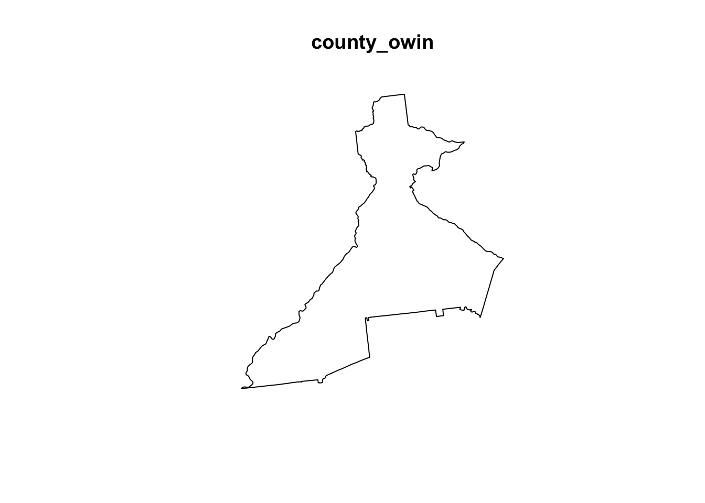

### Creating the `ppp` objects

Now we will use the function `ppp()` to create objects of class `ppp` for each of the *spatial point* files, `b_point` (representing locations of all births, the denominator for infant mortality), and `d_point` (representing locations of all deaths, the numerator for infant mortality). Doing so requires definition of the *study window* defined above as the object name `county_owin` of class `owin`. 

Again, the study window delineates what is *in* versus *out* of the study area demarcates *edges* of the study region.  You can look at the help documentation for the function `ppp()` to see the arguments. Note that because the function requires specification of the $x,y$ locations as two separate vectors, we extract the coordinate values from our `sf` object using `st_coordinates()`. 

:::{.rmdnote data-latex="{note}"}

**Why two `ppp` objects?**

Recall that estimation of a spatial point process is agnostic to whether the point (or person) had the event (e.g. death) or not (e.g. live birth who lived past 1 year).  To represent the ratio of deaths to all live births (e.g. the infant mortality rate), we need to estimate **two kernel density surfaces**, and then take the ratio.

:::


```r
# Create the birth ppp object
b_ppp <- ppp(x = st_coordinates(b_point)[, 1], 
             y = st_coordinates(b_point)[, 2],
             window = county_owin)

# Create the death ppp object
d_ppp <- ppp(x = st_coordinates(d_point)[, 1], 
             y = st_coordinates(d_point)[, 2],
             window = county_owin)
```


As you might expect, there are built-in methods (from the `spatstat` package) to summarize and plot `ppp` objects. 


```r
summary(d_ppp)
```

```
## Planar point pattern:  701 points
## Average intensity 3.359978e-07 points per square unit
## 
## Coordinates are given to 2 decimal places
## i.e. rounded to the nearest multiple of 0.01 units
## 
## Window: polygonal boundary
## single connected closed polygon with 698 vertices
## enclosing rectangle: [1026366.3, 1098719.2] x [1220671, 1302019.3] units
##                      (72350 x 81350 units)
## Window area = 2086320000 square units
## Fraction of frame area: 0.354
```

```r
plot(d_ppp)
```

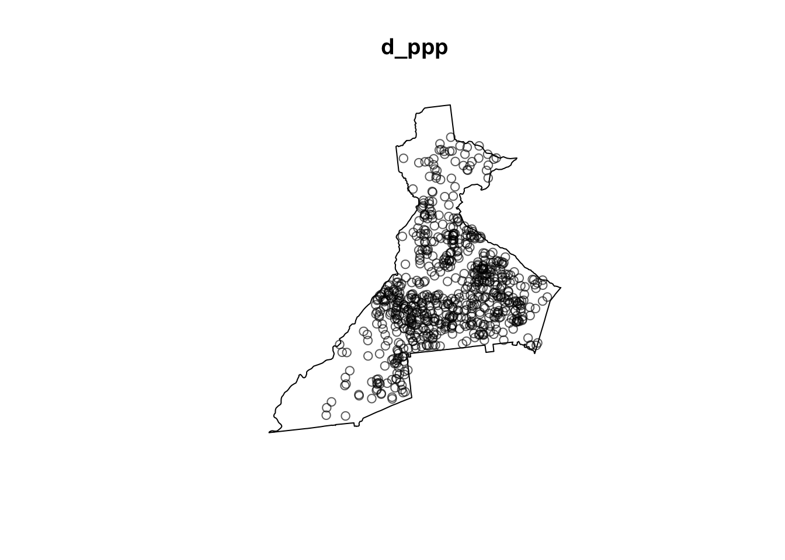

The summary includes information about the overall *spatial intensity* (e.g. events per unit area), as well as the number of points, and the observational window.  The plot for `d_ppp` should look just like a plot of `d_point` as they both contain the same information.  Of note, if you repeat the above code for all of the birth events, `b_point`, the plot will be less readable because there are over 94,000 births as compared with only 705 deaths!

### Bandwidth selection

As discussed above, and in lecture, the kernel density estimation requires the analyst to specify a *kernel function* (e.g. a Gaussian kernel, or a quartic bi-weight kernel), and a *kernel bandwidth*. 

Of the two, the bandwidth is substantially more impactful on results than choice of kernel function. 

As a reminder, the *bandwidth* (sometimes indicated by variable $h$) describes the *width* or *radius* of the kernel function, and as a result dictates how *smooth* the resulting intensity surface will be. A small bandwidth will produce a bumpier or rougher surface, whereas a larger bandwidth will result in more smoothing. 

:::{.rmdnote data-latex="{note}"}

**Bandwidth measures proximity or closeness**

Conceptually you might notice a similarity between what the *bandwidth* does for spatial analysis to what the definition of *spatial neighbors* does.  In each case it is a kind of '*local*' inclusion of data for analysis, within a broader *global* study region. 

Bandwidth  defines which sets of points will be considered *close* and which are not.

:::

There are two general kinds of bandwidth settings:

1. **Fixed bandwidths:** A single value of $h$ designates that the width of the kernel (and thus the resulting smoothness of the estimated intensity surface) is the same for the entire study region. Fixed bandwidths are commonly used, and sensible for a study region with relatively homogeneous population at risk. However choosing a single value can be challenging in practice when the density of points varies substantially across the study region, as could be the case when your study region includes a range from very urban to very rural. 
2. **Adaptive bandwidths:** As the name implies, this approach changes or *adapts* the size of the kernel density bandwidth according to the density of points (data) in differing sub-areas of the overall study region. The result is relatively more smoothing (larger bandwidth) in areas with sparse point data, and relatively less smoothing (smaller bandwidth) in areas with more point density. 


#### Fixed bandwidth methods

If you prefer a *fixed bandwidth*, the first challenge is choosing what it should be. One option for selecting a *fixed bandwidth* is to incorporate theory or prior knowledge about the process of interest. For instance, if you are trying to understand whether the prevalence of diabetes is related to local food environment in an urban area, you might want a bandwidth which helps illuminate differences in diabetes *intensity* at a scale consistent with the food environment. For instance a bandwidth of *1-mile* might be more reasonable in urban areas than one of *50-miles*, as the latter would likely smooth away all of the local variation of interest. 


However, it is not uncommon that theory or prior knowledge are insufficient to make a clear choice, or that data sparsity mandates an alternate approach driven by concern for stable estimates. 

The package `sparr` has several functions designed to use primarily statistical optimization for estimating an *'optimum'* bandwidth. We will introduce two commonly used statistical bandwidth selection optimizers:

1. **Cross-validation:** this approach divides the data into subsets, using one subset to choose a bandwidth, and comparing the performance on other subsets. The goal is to find a value that works *'best'* (e.g. optimize a statistical parameter across multiple iterations). The approach is computationally intensive for large datasets. As discussed in note below, cross-validation can result in *too small* bandwidth estimation.
2. **Over-smoothing:** this is an alternate approach that aims to identify the maximum amount of smoothing necessary for minimizing statistical error. By definition it is a *maximum* value rather than an *ideal* or *optimal* value, but can be useful in setting bounds.

:::{.rmdnote data-latex="{note}"}

The `sparr` package provides three *cross-validation* approaches to estimation: 

* `LCSV.density` (least squares cross validated); 
* `LIK.density` (likelihood cross-validated); 
* `SLIK.adapt`  (described as an experimental likelihood cross-validation for adaptive). 

Each is 'optimizing' a different thing. The `LSCV.density`  minimizes an unbiased estimate of the mean integrated squared error (MISE) whereas `LIK.density`  maximizes cross-validated leave-one-out average of the log-likelihood of the density estimate.

If you look at the help documentation for these you will see (near the bottom) a prominent warning message. It reports that "*CV for bandwidth selection is notoriously unstable in practice and has a tendency to produced rather small bandwidths...*"  

:::


#### Cross-validation with `LIK.density()`

`LIK.density()` uses likelihood estimation of cross-validation optimal bandwidth. For the *death* dataset, `d_ppp`, it runs in just a few seconds.  However it took > 5 minutes to produce a value on the much larger *births* dataset, `b_ppp`. This code lets you try it to see what it produces: 


```r
h_LIK_d <- LIK.density(d_ppp)
```

```
## Searching for optimal h in [27.463186212964, 12058.8149770359]...Done.
```

```r
print(h_LIK_d)
```

```
## [1] 1613.661
```

If you examine the object returned (`h_LIK_d`), you'll see it is just a single number.  This is the value of $h$, or the optimized bandwidth. It is, in other words, the radius of the 2-dimensional kernel density function in the units of the data, which is *meters* in this case (e.g. the original data were *Albers Equal Area* projected).  So this means that the optimum kernel will have a radius of just over 1.5 kilometers.

#### Oversmoothing algorithm with function `OS()`

This approach is much less computationally intense, and thus feasible for both of our spatial point processes (e.g. both numerator deaths, and denominator births). As we will see below, we can use the value returned from `OS()` as a *pilot value* for *adaptive bandwidth* estimation. In other words it provides a kind of reference or starting point for the adaptation process.


```r
h_os_d <- OS(d_ppp)
h_os_b <- OS(b_ppp)

print(h_os_d)
```

```
## [1] 4257.798
```

```r
print(h_os_b)
```

```
## [1] 1897.371
```

Note that the *birth* data have a smaller optimal bandwidth (`h_os_b`) because there are more points. More points means more information is available for more granular smoothing, whereas the relatively more sparse *death* data have a larger over smoothing bandwidth (`h_os_d`). 

#### Selecting a common bandwidth for both numerator and denominator

One challenge in bandwidth selection is that we typically have two related spatial point processes (e.g. the numerator, death events; and the denominator, birth events). Therefore we don't want only a single KDE, but instead we will need to consider a numerator representing the spatial intensity of deaths, and a denominator representing the spatial intensity of all live births at risk.  This raises the question of whether there should be a *common bandwidth for both*, or whether *each should be optimized separately*.  

While there may be only minor differences in the *absolute intensity* under different bandwidths in a single point process, taking the ratio of two intensity surfaces can exaggerate small differences to be quite large. There are functions for estimating a single, joint, optimum for the bandwidth.  The function `LSCV.risk()` does just what the `LIK.density()` above did, but with *two spatial point processes*. The code example is below, but like the previous example, the cross-validation approach to the birth data set takes an excessive amount of time (at least for this exercise).


```r
#h_LSCV_risk <- LSCV.risk(d_ppp, b_ppp)
```


#### Adaptive bandwidth methods

Adaptive methods are specified *at the time of kernel density estimation*. While the bandwidth is not constant, but instead *adaptive*, we usually still need to specify a *pilot bandwidth*, which is a reference point from which adaptive modification occurs. As mentioned above, the *over-smoothing* approach from `OS()` can be used as a pilot value.


### Estimating Kernel Density surfaces

We now turn to the actual estimation of kernel density approximations of the underlying *spatial intensity* of disease.  The approach in this lab is to first illustrate how to estimate separate densities for each point process (e.g. of *deaths* and of *births*), and then to demonstrate two strategies for creating *spatial relative risk surfaces*, which is generally the target output for spatial epidemiologists. 

Of note, this discussion will demonstrate use of both *fixed* and *adaptive* bandwidths. In general adaptive bandwidths may be the most practical approach *in the absence of theoretical or empirical preference* otherwise. However there are instances where *fixed bandwidths* (either theoretically informed, or as derived from CV or over-smoothing algorithms) are desired, and thus seeing both in action is useful.

#### `bivariate.density()` for KDE of single point process

There are actually several `R` packages that accomplish kernel density estimation, but one that is particularly useful for spatial epidemiology (where the kernel density estimator must be 2-dimensional and we frequently take the ratio of two densities) is the `sparr` package, which stands for *Spatial and Spatiotemporal Relative Risk*. 

The `sparr` function `bivariate.density()` is a flexible and useful tool for carrying out KDE with either *fixed* or *adaptive* bandwidths. There are many arguments for `bivariate.density()` (see help documentation), but here are several worth specifically highlighting.

Function | Description
----------|-------------------------------------------------
**`pp`** | This first argument expects a *single* point process object of class `ppp`. We will use either `d_ppp` or `b_ppp`
**`h0`** | This argument specifies the *global fixed* bandwidth, if desired. This could be a theoretically-informed value (i.e. 2000 meters), or derived from an optimization algorithm (e.g. see above)
**`hp`** | If conducting *adaptive bandwidth* estimation, a single *pilot bandwidth* is still required, and this is where to specify it. 
**`adapt`** | This logical argument is `FALSE` by default, but set to `TRUE` if you want adaptive bandwidth estimation
**`edge`** | Because a given dataset is invariably a subset of the real world, there are likely *edges* where there is an artificially abrupt cessation of information. The result is a potentially biased intensity estimation at the study region edges. However there are correction factors. We will choose the `edge = 'diggle'` specification here
**`intensity`** |  By default, `intensity = FALSE` which means that by default `bivariate.density()` produces a *density surface*. If you want an *intensity surface*, set `intensity = TRUE`. (See note below)


:::{.rmdnote data-latex="{note}"}

**Intensity versus Density**

Up until now we have used the words **intensity** and **density** as if they are synonymous for point process parameter, but that is not exactly accurate. 

**Intensity** is the *average number of points per unit area*. The **density** is proportionate to the *intensity*, but scaled so that all values in the study region *sum to 1*.  In other words a **density surface** is a proper probability density function (PDF).

A map of the two will look identical *except for the scale or legend*.

:::

#### Fixed bandwidth KDE with `bivariate.density()`

First, let's try a basic version that uses the *over-smooth* estimate for each point process.


```r
death_kde <- bivariate.density(pp = d_ppp, h0 = h_os_d, edge = 'diggle')
birth_kde <- bivariate.density(pp = b_ppp, h0 = h_os_b, edge = 'diggle')
```

You can explore the objects produced by the function call. For instance, they are `list` objects, with named sub-elements:


```r
summary(birth_kde)
```

```
## Bivariate Kernel Density/Intensity Estimate
## 
## Bandwidth
##   Fixed smoothing with h0 = 1897.371 units (to 4 d.p.)
## 
## No. of observations
##   94373 
## 
## Spatial bound
##   Type: polygonal
##   2D enclosure: [1026366, 1098719] x [1220671, 1302019]
## 
## Evaluation
##   128 x 128 rectangular grid
##   5808 grid cells out of 16384 fall inside study region
##   Density/intensity range [6.313906e-14, 1.585466e-09]
```

```r
names(birth_kde)
```

```
## [1] "z"         "h0"        "hp"        "h"         "him"       "q"        
## [7] "gamma"     "geometric" "pp"
```


There is also some plotting functionality built into the `sparr` package that allows us to quickly visualize the resulting density plot.


```r
par(mfrow = c(1, 2)) # Plots in 1 row with 2 columns
plot(birth_kde, main = 'Birth density')
plot(death_kde, main = 'Death density')
```

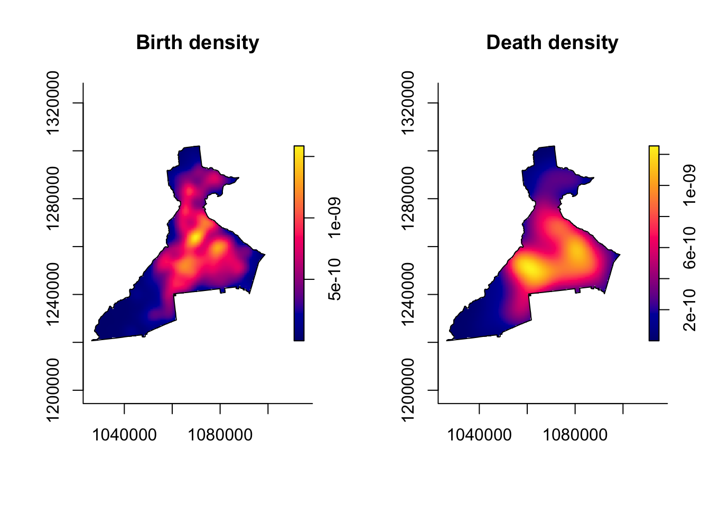

```r
par(mfrow = c(1,1))  # Reset plotting space to be 1 row, 1 column
```


#### Adaptive bandwidth KDE with `bivariate.density()`

As discussed above, an alternative to a single *fixed bandwidth*, is implementation of an algorithm that changes (*adapts*) the bandwidth across the study region in response to the density or sparseness of the data. This approach still requires specification of a *global* bandwidth, and the adaptation is a multiplier making the global smaller or larger as needed. 

In this code we use the argument `h0 = xxx` to specify a *pilot bandwidth*. Because *adaptive bandwidth KDE* requires adjustment across the study region, you will notice that these functions take longer than the *fixed bandwidth* above, especially the large birth point process.


```r
death_kde_adapt <- bivariate.density(d_ppp, 
                                     h0 = h_os_d, 
                                     edge = 'diggle', 
                                     adapt = TRUE,
                                     verbose = FALSE)
birth_kde_adapt <- bivariate.density(b_ppp, 
                                     h0 = h_os_b, 
                                     edge = 'diggle',
                                     adapt = TRUE,
                                     verbose = FALSE)
```


```r
par(mfrow = c(1, 2))
plot(birth_kde_adapt, main = 'Birth density\n(adaptive h)')
plot(death_kde_adapt, main = 'Death density\n(adaptive h)')
```

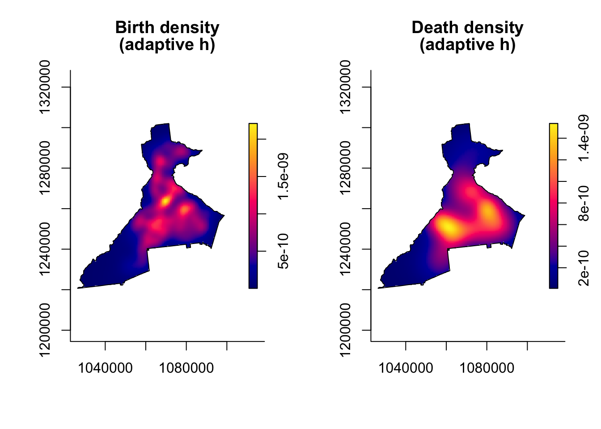

```r
par(mfrow = c(1,1))
```


:::{.rmdnote data-latex="{note}"}

**Why are adaptive maps so similar to fixed bandwidth?**

The plots of the *intensity* from the *adaptive bandwidth* point processes do not look very different from those of the *fixed bandwidth processes.  The reason is because the units of measurement (intensity) are so small that differences are not readily apparent. 

However the differences become more apparent when we take the *ratio of the two surfaces*, which we will do below. 

:::


#### Plotting KDE estimates with `tmap`

It is handy that the `sparr` package has some built-in plotting functionality to quickly visualize the results. However you may want to have more control over the plotting, for instance in `tmap` or even in `ggplot2`.  

If you recall the named elements in the `list` object returned by `bivariate.density()`, the first is called `z`, and this is the density surface itself. 


```r
class(birth_kde$z)
```

```
## [1] "im"
```

The class of this object is `im` for *image*.  However for almost any spatial plotting or operation outside of `sparr` and `spatstat`, we want this data in the `raster` class rather than this `im` format (fundamentally the data *is* a raster model, but the data structure in `R` is not quite the same as the data structure of class `raster`). We can convert `im` to `raster` class like this:


```r
death_kde_raster <- raster(death_kde_adapt$z)
crs(death_kde_raster) <- "EPSG:5070"
birth_kde_raster <- raster(birth_kde_adapt$z)
crs(birth_kde_raster) <- "EPSG:5070"
```


:::{.rmdtip data-latex="{tip}"}
**Fixing missing CRS projection**

Notice in the code above the specification of `crs(x) <- "EPSG:5070"`. 

The `im` object lost all information about the original *coordinate reference system* (CRS) or *projection*. However, we need our raster object to have this CRS information to plot properly in `tmap`.  We know that the original point data were *projected* in *Albers Equal Area*, specifically with *EPSG code* of 5070. So we re-define that when creating the rasters above.

:::

Now we can plot these in `tmap`:


```r
# Create map of death surface
m1 <- tm_shape(death_kde_raster) + 
  tm_raster(palette = 'BuPu',
            style = 'quantile',
            n = 9,
            title = 'Death density') +
  tm_shape(county) +
    tm_borders() + 
  tm_layout(legend.format = list(scientific = T))

# Create map of birth surface
m2 <- tm_shape(birth_kde_raster) +
  tm_raster(palette = 'BuPu',
            style = 'quantile',
            n = 9,
            title = 'Birth density') +
  tm_shape(county) +
    tm_borders() + 
  tm_layout(legend.format = list(scientific = T))

# plot 2-panel arrangment
tmap_arrange(m1, m2)
```

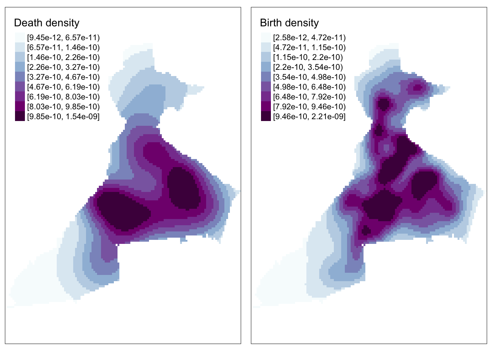

:::{.rmdtip data-latex="{tip}"}

**Why do the maps look pixely?**

There are two reasons contributing to this. 

1. First, the code above specified the colors in quantiles in order to get a range despite possibly skewed values. But you could try re-plotting the above plots setting `style = 'cont'` for *continuous* color palette, and comment out the `n=9`.  You will see that this produces a much *smoother* looking plot. The difference between the plots with `style = 'cont'` and `style = 'quantile'` is the gradation of color in the intermediate levels of intensity.

2. Another reason for the pixelation is because the original call to `bivariate.density()` used the default output resolution of 128 x 128 grid cells.  This was done for computational efficiency. However, note that if you want a higher-resolution surface (e.g. for publication, presentation), you can increase by specifying `resolution = ` in the creation of the KDE surface in the original call to `bivariate.density()`.

:::


### Creating relative risk surface manually

Up until now, we have only created the KDE surface for the *death* and *birth* points separately. But for epidemiology, we rarely care about numerator and denominator separately! So how do we put these two together into a more informative disease map?

*Raster algebra* is a term for arithmetic and algebraic manipulation of raster grids. Recall that a *raster* data set is simply a array of numbers. The numbered value of each grid-point represents the mean density or intensity of points per unit-area, and is mapped as color to make the plot.  

Because it is simply a matrix of numbers, we can take two rasters of the same resolution and study area and add, subtract, multiply, log-transform, or otherwise operate on them arithmetically.  

For instance to manually create *spatial relative risk surface* we simply take the ratio of two *KDE density surfaces*. The result is a relative measure akin to the SMR: it quantifies the relative deviation of each area from an overall average value. So values below 1 are areas with *lower than average risk*, meaning that the intensity of *deaths* is less than the intensity of *live births*, and values above 1 have *higher than average risk* (the intensity of *deaths* is greater than the intensity of *live births*). 

:::{.rmdcaution data-latex="{caution}"}

**Intensity vs Density matters for taking a ratio**

For interpreting the *ratio of two kernel surfaces* take care to distinguish between the **spatial intensity** (number of point events per unit area; the value integrates or sums to the total number of points across the study region) versus the **spatial density** (probability of a point event occurring at this location, conditional on total number of points; integrates to 1 across the study region). The distinction is important. 

The default output of `bivariate.density()` function is a *spatial density surface*. The ratio of two density (probability) surfaces will take the value of 1.0 when the probability of a death at that location is proportionate to the probability of a birth at that location. 

In contrast the ratio of two *intensity surfaces* is interpreted as an absolute measure (e.g. risk, rate, prevalence) ranging from zero to 1. If you choose `intensity = TRUE` when specifying the `bivariate.density()` function you will get the intensity rather than (default) density surface.

:::


In the `tmap` call I *flipped* the color ramp by using the negative sign in front of the name of the ramp. I also specified a continuous style rather than discrete (e.g. `quantile`), and specified some legend breaks. 


```r
# Create risk surface as ratio of death density to birth density
risk <- death_kde_raster / birth_kde_raster

# Map it...
tm_shape(risk) + 
  tm_raster(palette = '-RdYlGn',
            style = 'cont',
            breaks = c(0.1, 0.6, 0.9,   1.1, 2, 4.9),
            title = 'IMR SMR')  +
tm_shape(county) +
  tm_borders()
```

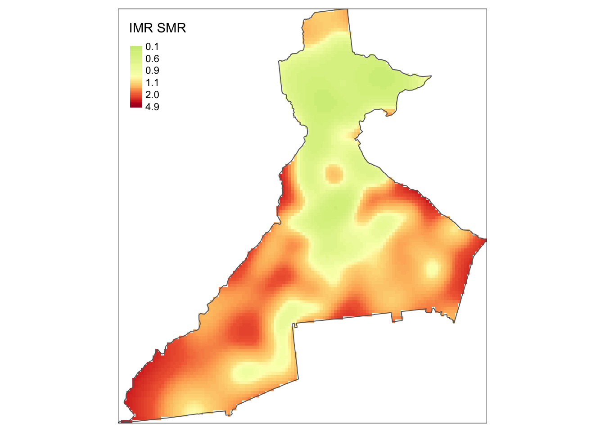


Now we can more clearly see regions of *higher risk* and *lower risk* of infant mortality!

### Creating relative risk surface with `risk()` function

The preceding *manual* approach created two separate kernel density surfaces, and then manually relied on raster algebra to create the spatial relative risk surface. This is useful to know because you may use KDE in other setting where you only work with a single spatial point process (e.g. imagine that instead of estimating disease intensity, you wish to estimate an *exposure* density surface).

However, the `sparr` package provides a shortcut for estimation of spatial relative risk surfaces in the function `risk()`. It takes a numerator and denominator `ppp` object as arguments and calculates the spatial relative risk surface automatically. 

As a demonstration of comparing four pre-defined (possibly theoretically informed, or possibly arbitrary), fixed bandwidths for the purposes of data exploration, below we estimate four distinct spatial relative risk surfaces, as well as one adaptive KDE. In each case notice the first two arguments are the numerator and denominator `ppp` object. The next argument is a pre-specified fixed bandwidth (e.g. 1000, 2000, 4000, and 8000 meters). 

This function also illustrates another *feature* which allows us to quantify statistical precision by creating *tolerance contours*. Tolerance contours are simply lines which encircle regions that are statistically significant beyond a given threshold. The argument `tolerate = T` tells the function to estimate *asymptotic* p-values testing the null hypothesis that the local relative risk of death is equal across the study region. 

By default, the function estimates the *log relative risk*, which is a helpful reminder that the *relative risk* is asymmetric.  However, we understand ratio measures, and will be careful to plot the results appropriately. For that reason, I set `log = FALSE`, although obviously you could omit that and keep everything on the `log` scale.

**NOTE:** The *fixed bandwidth* `risk()` functions will run quickly, but once again, the *adaptive bandwidth* is more computationally intensive, and will take longer.


```r
imr1000 <- risk(d_ppp, b_ppp, h0 = 1000, 
            tolerate = T,
            verbose = F, 
            log = F,
            edge = 'diggle')

imr2000 <- risk(d_ppp, b_ppp, h0 = 2000, 
            tolerate = T,
            log = F,
            edge = 'diggle',
            verbose = F)

imr4000 <- risk(d_ppp, b_ppp, h0 = 4000, 
            tolerate = T,
            log = F,
            edge = 'diggle',
            verbose = F)

imr8000 <- risk(d_ppp, b_ppp, h0 = 8000, 
            tolerate = T,
            log = F,
            edge = 'diggle',
            verbose = F)

imradapt <- risk(d_ppp, b_ppp, 
                 h0 = h_os_d, 
                 adapt = T, 
                 tolerate = T,
                 log = F,
                 edge = 'diggle',
                 verbose = F)
```


Examine the contents of one of these objects. The summary show us the range of the estimated risk, the resolution of the evaluation grid, and the number of points evaluated.


```r
summary(imr1000)
```

```
## Log-Relative Risk Function.
## 
## Estimated risk range [-8.216873e-14, 11.05946]
## 
## --Numerator (case) density--
## Bivariate Kernel Density/Intensity Estimate
## 
## Bandwidth
##   Fixed smoothing with h0 = 1000 units (to 4 d.p.)
## 
## No. of observations
##   701 
## 
## Spatial bound
##   Type: polygonal
##   2D enclosure: [1026366, 1098719] x [1220671, 1302019]
## 
## Evaluation
##   128 x 128 rectangular grid
##   5808 grid cells out of 16384 fall inside study region
##   Density/intensity range [-1.82875e-25, 2.78467e-09]
## 
## --Denominator (control) density--
## Bivariate Kernel Density/Intensity Estimate
## 
## Bandwidth
##   Fixed smoothing with h0 = 1000 units (to 4 d.p.)
## 
## No. of observations
##   94373 
## 
## Spatial bound
##   Type: polygonal
##   2D enclosure: [1026366, 1098719] x [1220671, 1302019]
## 
## Evaluation
##   128 x 128 rectangular grid
##   5808 grid cells out of 16384 fall inside study region
##   Density/intensity range [2.143127e-16, 2.383589e-09]
```

```r
names(imr1000)
```

```
## [1] "rr" "f"  "g"  "P"
```

:::{.rmdcaution data-latex="{caution}"}

__NOTICE__

You can see that the range of the estimated risk is $[-8.216873e-14, 11.05946]$. The lower bound is in practical terms zero (e.g. it is very, very small), but counter-intuitively it is also *negative*! How could we estimated *negative risk*? The answer seems to be related to the Diggle edge correction. For example if you substitute `edge = 'uniform'` the anomaly goes away. This is likely because edge correction (which in the big picture is a valuable strategy) reweights regions and may result in specific location estimates that become negative.
:::


Once again, we can use built-in plotting functionality from `sparr` to produce maps of the *spatial relative risk surface* and the tolerance contours. (NOTE: the default legend works best for *log relative risk*, but doesn't behave well for the *relative risk* because it treats the distance from 0 to 1 as the same as the distance from 1 to 2, or 4 to 5).


```r
par(mar = c(1,1,1,1)) # adjust the plotting margins
par(mfrow = c(3,2))   # Plot 3 rows and 2 columns
plot(imr1000)
plot(imr2000)
plot(imr4000)
plot(imr8000)
plot(imradapt)
par(mfrow = c(1,1))  # reset the plot space to 1 row, 1 col
```

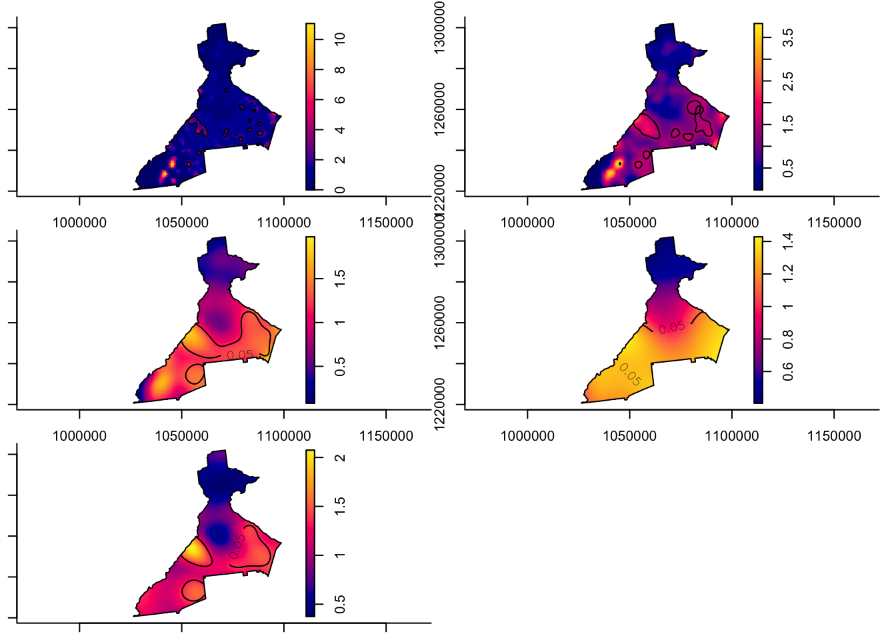

While the code above plots these side-by-side, you might find it easier to plot them one at a time and zoom in closer. 

:::{.rmdnote data-latex="{note}"}

**Things to notice in above plots**:

1. Notice the contour lines for $p<0.05$.  
2. Notice how the risk surface becomes smoother as the fixed bandwidth transitions from $1km$ to $8km$. 
3. Finally, notice how the *adaptive* bandwidth is consistent with the other maps, but seems to balance the detail between the 2000 meter and 4000 meter definitions.

:::

### Using functions to map RR with `tmap`

When we begin plotting several maps, the conversion from the `im` to `raster` and the code for producing map panels can feel cumbersome. While the following section is not required, it is a demonstration of how you can write simple custom functions in `R` to speed up repetitive tasks. 

A function in `R` is like a macro in SAS; it is simply a set of instructions that accepts *arguments* (inputs), carries out some action on those inputs, and then *returns* some output. Thus, it helps automate cumbersome tasks so you can do them repeatedly and efficiently.

Below is a function that accepts a single *argument*, labeled simply `x` here. The expectation is that `x` should be the output from one of the preceding calls to the `risk()` function.  

Notice how the function first extracts the spatial relative risk surface (e.g. `x$rr`), and then assigns the appropriate projection (it got stripped off some where along the way). 

Then the function extracts the *probability map* which is the set of pixel-specific p-values.  The `rasterToContour()` function takes this raster and creates contour lines with the specified levels corresponding to a 95% tolerance contour. Finally, the use of the `return()` tells what should be returned when the function is called.

Once you write a function, it need only be loaded once in a given session; afterwords you can *call* it by using `prepRaster(x = my_risk_object)`.


```r
### --- prepRaster() function --- ###
prepRaster <- function(x){
  rr <- raster(x$rr)
  crs(rr) <- "EPSG:5070"

  p_raster <- raster(x$P)
    crs(p_raster) <- "EPSG:5070"
  plines <- rasterToContour(p_raster, levels = c(0.025,  0.975))
  
  return(list(rr=rr,plines=plines))
} ## END prepRaster() ##
```

While we're on a roll, we could also write a function for producing a `tmap` panel:


```r
### --- make_map() function to create panel maps --- ###
make_map <- function(x, bw){
  mtitle <- paste('IMR - ', bw, ' smooth', sep = '')
  tm_shape(x$rr) +
  tm_raster(palette = '-RdYlGn',
            style = 'cont',
            breaks = c(0.1, 0.6, 0.9,   1.1, 2, 4.9),
            midpoint = NA,
            title = 'IMR SMR') +
  tm_shape(x$plines) +
  tm_lines(col = 'level',
           legend.col.show = F) + 
  tm_layout(main.title = mtitle,
            legend.format = list(digits = 1)) 
} ## END make_map() function ##
```

The result of this work is that we can easily (and more compactly), map the four fixed-bandwidth spatial relative risk surfaces.


```r
# First convert to raster and extract p-value contours
rr_1000 <- prepRaster(imr1000)
rr_2000 <- prepRaster(imr2000)
rr_4000 <- prepRaster(imr4000)
rr_8000 <- prepRaster(imr8000)
rr_adapt <- prepRaster(imradapt)

# Then produce map panels
m1000 <- make_map(rr_1000, '1 km')
m2000 <- make_map(rr_2000, '2 km')
m4000 <- make_map(rr_4000, '4 km')
m8000 <- make_map(rr_8000, '8 km')
mapadapt <- make_map(rr_adapt, 'adaptive')

tmap_arrange(m1000, m2000, m4000, m8000,mapadapt, ncol = 2)
```

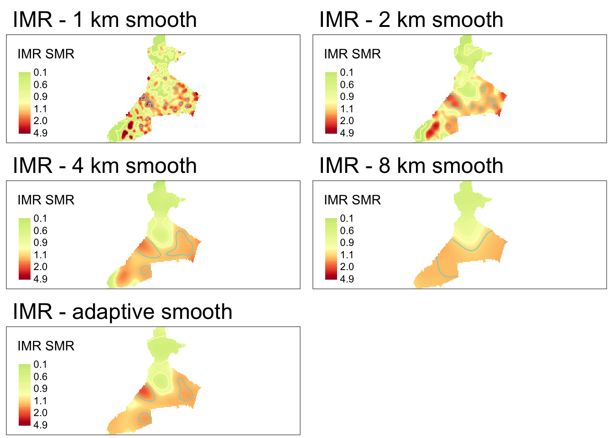


## Spatial Analysis in Epidemiology: Kernel estimation of areal data {#gwss}


In the preceding section we saw how to use KDE for estimating a smooth *spatial intensity surface* from a spatial point process. In this section we introduce *geographically-weighted* statistics that are extendable to areal units and not only points. There were three key features about the use of KDE from the preceding section that we will expand on here:

1. *KDE are not only for points* - while the whole notion of the kernel density estimation process is indeed connected to the $x,y$ point location, this does not mean we cannot take advantage of the non-parametric smoothing for other kinds of data, such as polygons. Typically the centroid (geometric center) of a polygon is used as the stand-in for point when KDE is done with polygons. 
2. *KDE is not only for binary values* - a spatial point process is by definition the description of the location of discrete points representing a discrete state. For instance in section above, we visualized the spatial intensity surface of infant deaths, and separately the surface of live births. But what if we want to measure a *continuous value* rather than a discrete, binary state at spatial locations? The mechanics of KDE can still be helpful!
3. *KDE is a kind of spatial weighting procedure* - this was true in Part A as well...the *spatial intensity* is essentially the spatially-weighted number of points surrounding an index location divided by the area under the kernel function. In this lab the primary use of the kernel function is to produce weights for calculating weighted-statistics including *mean*, *median*, etc of any quantity that is measured.


To accomplish these extensions we will use functions in the package `GWmodel` (e.g. *geographically weighted models*) that are very useful for exploratory spatial data analysis. The main function used here, `gwss()`, stands for *geographically weighted summary statistics*, and uses the non-parametric spatial weighting of a kernel density function to compute *locally varying descriptive statistics* such as the *mean*, *median*, *standard deviation*, *correlation*, and more.  And while it certainly works for data represented as $x,y$ points, it can also work for polygon data.

What this means is that the `gwss()` function can be useful for exploring spatial heterogeneity as a form of *local spatial non-stationarity*.  Recall that *spatial stationarity* is the notion that a statistical parameter is *global* or *constant* across space? 

We previously encountered *stationarity* as the opposite of *spatial heterogeneity*. In that context we were referring to the *risk* or *prevalence* of health states. But **any statistic** can be *stationary* (constant) or *non-stationary* (spatially varying).


The objective of this section is to extend our understanding of the utility of *kernel density functions* beyond simply computing *intensity* or *density* surfaces to seeing them as a tool for creating *spatially local weights* for any statistical function. We will use the same study region (Fulton and Dekalb counties), but now will be looking at several socio-contextual *covariates* derived from the American Community Survey to be considered along with the infant mortality rate produced above.

This section focuses primarily on the `gwss()` function to accomplish the following tasks:

* Estimate a statistically-optimal *fixed bandwidth* and explore *adaptive bandwidths* for use with the `gwss()` function
* Calculate local, spatially-weighted *mean*, *median*, *SD*, and *IQR* for four census-tract level continuous measures using kernel density functions 
* Using Monte Carlo simulation to produces significance contours on our estimates of local, spatially-weighted summary statistics
* Calculate local, spatially-weighted *bivariate statistics* summarizing how the correlations (Pearson and Spearman) of pairs of variables varies through space


### Packages and data

The new package introduced here is `GWmodel`, but several other familiar packages will also be useful:


```r
library(tidyverse) # For data piping and manipulationlibrary(GWmodel)   # Has the function gwss() 
library(sf)        # For import of sf data
library(sp)        # For conversion to sp, required for GWmodel
library(tmap)      # For mapping
library(GWmodel)   # Geographically weighted statistics
```

The methods introduced in this section will work for either *spatial points* or *spatial polygons*. However for this example we will demonstrate their use specifically for *spatial polygons*, and more specifically polygons representing the census tracts in Fulton and Dekalb counties. This dataset has 345 census tract polygons (4 tracts were deleted due to missing values), and summarizes five summary measures of each tract:

Variable  | Definition
----------- | ----------------------
`GEOID` | Unique ID for each census tract unit
`pctNOHS` | % of adults over 25 without a high school diploma or GED
`pctPOV` | % of the population living below the federal poverty line
`ICE_INCOME_all` | Index of Concentration at the Extremes, which is an index of the concentration of poverty and affluence. It ranges from -1 (concentrated poverty) to +1 (concentrated affluence), with values near zero having equal income distribution
`pctMOVE` | % of households who moved in the past 12 months
`pctOWNDER_OCC` | % of households occupied by owners (e.g. rather than renters)


First, we read in the `gpkg` data as an `sf` object, and then convert it to `sp` for use with `GWmodel`. As with the `sparr` package, `GWmodel` is not yet fully `sf` compliant so we are forced to use `sp` data classes. This will likely change at some point in the future.


```r
# This is Dekalb/Fulton census tracts
atl <- st_read('Fulton-Dekalb-covariates.gpkg') %>%
  as('Spatial') # convert to sp class
```


#### Mapping the observed values

To understand the new data, consider using `summary()`, or other exploratory functions, as well as producing some simple maps to see the spatial distribution of these variables. *Recall that the `tmap` package works for both `sf` and `sp` data!* This means that we can map the object in the *'usual manner'* even though we converted it to `sp`. 


```r
# First map the 4 variables that are %
tm_shape(atl) + 
  tm_fill(c('pctNOHS', 'pctPOV', 'pctMOVE', 'pctOWNER_OCC'),
          style = 'quantile') +
  tm_borders()
```

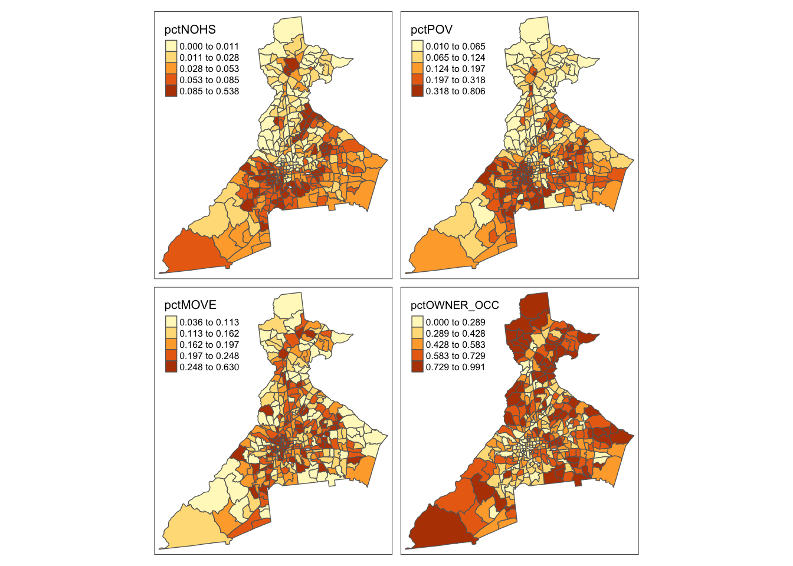

The *Index of Concentration at the Extremes (ICE)* ranges from -1 to +1. A value of $-1$ occurs where everyone in the tract is poor; a value of $+1$ occurs in tracts where everyone is affluent; a value of $0$ suggests that either there is a balance of affluence and poverty, or alternatively that everyone is '*middle income*'. Therefore it makes sense to map it separately because it will inevitably need a *divergent* color ramp.


```r
tm_shape(atl) +
  tm_fill('ICE_INCOME_all',
          style = 'quantile',
          palette = 'div') +
  tm_borders()
```

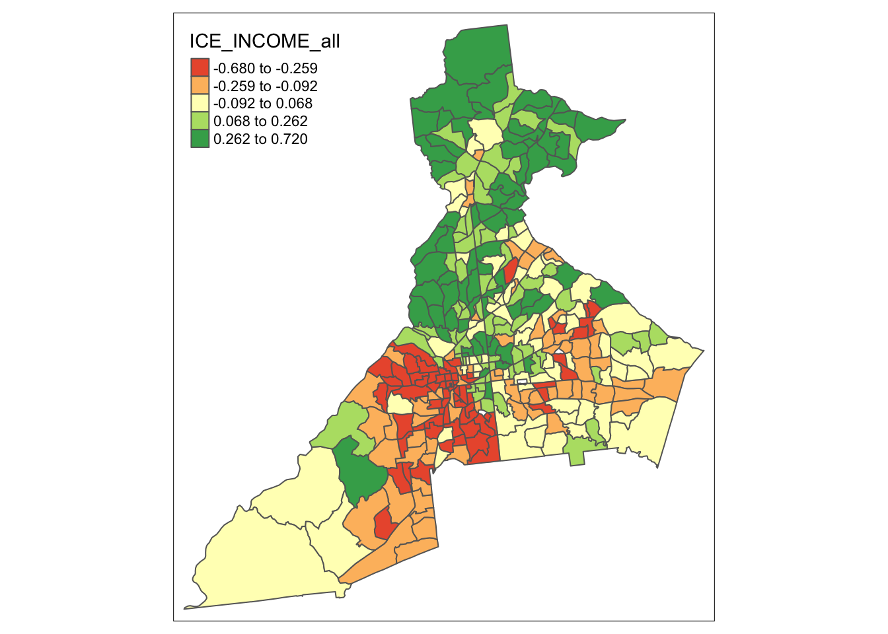

#### Why are we using KDE on these data?

There could be at least two general reasons you might think to use a spatial smoothing approach such as KDE for continuous data such as these:

1. You believe the estimates at each for each spatial unit (polygons in this case, but could be points) are statistically unstable, and you believe that averaging them with their neighbors will produce a more reliable estimate of the parameter of interest; or
2. You are interested in identifying spatial patterns or trends that are possibly *larger scale* than the data units themselves. For instance you might be looking for regions of the city where there is apparent clustering of poverty, home ownership, or residential instability. In other words you suspect that people are not only exposed to values within the boundaries of their tracts, but also to nearby environments.


### What bandwidth for kernel density estimates?

Recall that the decision about the *bandwidth* of the kernel density function is one of the most influential to in using KDE for spatial epidemiology. The reason is because the *bandwidth* defines the *smoothness* or *bumpiness* of the statistical estimation, and different choices can produce dramatically different results.

Once again, we might have theoretically important criteria for selecting a bandwidth, or we could use a statistical optimization approach. In `GWmodel` the function `bw.gwss.average()` is used for estimating the *'optimal'* bandwidth for estimating the spatially varying *mean* or *median* using cross-validation. There is no specific function for other statistics (e.g. the *SD*, *IQR*, or *correlation coefficients*). Because the spatial structure might be different for each variable, we can evaluate all variables:


```r
# Fixed bandwidth selection
bw.gwss.average(atl, vars = c('pctPOV', 'pctPOV', 'pctMOVE', 
                              'pctOWNER_OCC', 'ICE_INCOME_all'))
```

```
##                   pctPOV   pctPOV  pctMOVE pctOWNER_OCC ICE_INCOME_all
## Local Mean bw   58801.33 58801.33 58801.33     65740.07       65740.07
## Local Median bw 65740.07 65740.07 58801.33     70028.45       65353.39
```

These numbers are in the units of the map, which are meters. This suggests that the we need a pretty large fixed bandwidth (between 58 and 70 km!), at least to minimize the error as determined from the cross-validation approach. 


:::{.rmdnote data-latex="{note}"}

**Adaptive bandwidth in `GWmodel`**

Adaptive bandwidth in `GWmodel` works a little differently from how it did in the `sparr` package. When we choose `adaptive = TRUE` what is returned is not a distance in the units of the map (e.g. meters) but instead is *a number of nearest neighbors* that defines how large or small the kernel function *adapts*. 

This is important conceptually for what *adaptation* means: in `GWmodel` the unit of analysis is the census tract, not the individual person. So a census tract with 10 people and a census tract with 10,000 are assumed to have the same amount of information.

:::


```r
# Adapative bandwidth selection
bw.gwss.average(atl, vars = c('pctPOV', 'pctNOHS', 'pctMOVE', 
                              'pctOWNER_OCC', 'ICE_INCOME_all'),
                adaptive = T)
```


```
##                 pctPOV pctNOHS pctMOVE pctOWNER_OCC ICE_INCOME_all
## Local Mean bw      315     268     297          337            333
## Local Median bw    297     297     315          326            315
```


Again, we see the same story that the CV approach suggests a very large bandwidth. There are only 345 areal units in this dataset, and this suggests that *nearly all of them* should be included in the kernel. That would produce very little spatial variation.  While the idea of a statistical optimization approach is appealing, as we discussed above, the CV methods is known to be imperfect. 

For now we will use a more common-sense approach. It would seem that we might balance local information and spatial variation by including no more than 10% of the data in any single kernel density estimation location. So we could choose to use $n=35$ neighbors as the definition of our *adaptive bandwidth*. Note that you could alter this number to see how the results vary.

### Geographically weighted summary statistics: `gwss()`

To more fully describe and explore our *'raw'* data, we want to summarize it by smoothing out extremes, and looking for broad spatial trends in the values. Finding a *local average value* can be done using either a *mean* or *median* to quantify *central tendency*. Obviously, if the distribution of the data within local regions is relatively normally distributed (or at least symmetric), the *mean* and *median* will be similar. But if the data are quite skewed, we might prefer the *median* as a summary measures.

Similarly, knowing whether (or how much) local measures are *alike* or *different* is informative.  Once again we could choose a statistic that works well to describe variation for normally-distributed (or symmetric) data (e.g. the *standard deviation*), or one that performs well with non-normal or skewed data (e.g. the *inter-quartile range*). Finding *large values* of either the *SD* or *IQR* would suggest substantial *local heterogeneity* or difference in the target measure, whereas small values would suggest that local areas are relatively similar.

The `gwss()` function actually estimates more than just those listed above, but for now we will only focus on those measures.

To calculate the *geographically-weighted summary statistics* using `gwss()` we need to provide a dataset, a single variable (or vector of multiple variables), a decision about using *fixed* or *adaptive* bandwidth, and finally a specification of `bw` or bandwidth itself. And once again, the value you enter for `bw` depends on whether you select `adaptive = T` or not. 

If *fixed* bandwidth, the value you enter is a number in the units of the map (e.g. *meters* in our case). But if you are requesting an *adaptive* bandwidth, the value for `bw` is not in *meters*, but is actually a number or *count* of how many nearest neighbors should minimally be included in the kernel density estimation at each location. As discussed above, I will use $n=35$ as an adaptive definition of neighbors. This will result in each summary estimation including approximately 10% of the total data. Because we would like what are called *robust* statistics (e.g. the *median* and *IQR* which are robust to skewed or non-normal data), we also must specify the argument `quantile = T`.


```r
atl.ss <- gwss(atl, vars = c('pctPOV', 'pctNOHS', 'pctMOVE', 'pctOWNER_OCC',
                             'ICE_INCOME_all'),
               adaptive = T,
               bw = 35,
               quantile = T)
```


Perhaps unintuitively, the way to get a summary of the result is not the usual `summary()`, but instead to type `print(atl.ss)`.  When you do so you will see A LOT of results. We will focus for the moment on just the results at the very top (local mean; local SD) and at the very bottom (local median; local IQR) of the output.


```r
print(atl.ss)
```

```
##    ***********************************************************************
##    *                       Package   GWmodel                             *
##    ***********************************************************************
## 
##    ***********************Calibration information*************************
## 
##    Local summary statistics calculated for variables:
##     pctPOV pctNOHS pctMOVE pctOWNER_OCC ICE_INCOME_all
##    Number of summary points: 345
##    Kernel function: bisquare 
##    Summary points: the same locations as observations are used.
##    Adaptive bandwidth: 35 (number of nearest neighbours)
##    Distance metric: Euclidean distance metric is used.
## 
##    ************************Local Summary Statistics:**********************
##    Summary information for Local means:
##                           Min.   1st Qu.    Median   3rd Qu.   Max.
##    pctPOV_LM          0.050645  0.119765  0.180836  0.270868 0.3947
##    pctNOHS_LM         0.011338  0.031796  0.051985  0.079042 0.1369
##    pctMOVE_LM         0.129222  0.166627  0.185688  0.215939 0.3356
##    pctOWNER_OCC_LM    0.214225  0.421030  0.486894  0.568339 0.7545
##    ICE_INCOME_all_LM -0.363659 -0.161687 -0.010174  0.180475 0.3921
##    Summary information for local standard deviation :
##                           Min.  1st Qu.   Median  3rd Qu.   Max.
##    pctPOV_LSD         0.030466 0.080964 0.095033 0.122989 0.2000
##    pctNOHS_LSD        0.013018 0.027740 0.038529 0.055891 0.1512
##    pctMOVE_LSD        0.043404 0.062143 0.070973 0.085519 0.1594
##    pctOWNER_OCC_LSD   0.128460 0.171147 0.193042 0.236043 0.3127
##    ICE_INCOME_all_LSD 0.098726 0.153791 0.186239 0.214184 0.2949
##    Summary information for local variance :
##                              Min.    1st Qu.     Median    3rd Qu.   Max.
##    pctPOV_LVar         0.00092817 0.00655511 0.00903123 0.01512619 0.0400
##    pctNOHS_LVar        0.00016947 0.00076952 0.00148449 0.00312385 0.0229
##    pctMOVE_LVar        0.00188388 0.00386175 0.00503717 0.00731354 0.0254
##    pctOWNER_OCC_LVar   0.01650192 0.02929137 0.03726506 0.05571613 0.0978
##    ICE_INCOME_all_LVar 0.00974689 0.02365154 0.03468479 0.04587486 0.0870
##    Summary information for Local skewness:
##                            Min.  1st Qu.   Median  3rd Qu.   Max.
##    pctPOV_LSKe         -0.60296  0.40145  0.88760  1.50706 4.5718
##    pctNOHS_LSKe        -0.26353  0.80588  1.38779  2.41449 7.7612
##    pctMOVE_LSKe        -0.43164  0.27893  0.58307  0.97433 2.6409
##    pctOWNER_OCC_LSKe   -1.21089 -0.41080 -0.10531  0.17408 1.1014
##    ICE_INCOME_all_LSKe -1.03050 -0.18046  0.17660  0.55386 1.8477
##    Summary information for localized coefficient of variation:
##                             Min.    1st Qu.     Median    3rd Qu.    Max.
##    pctPOV_LCV            0.21281    0.41550    0.57740    0.73493  1.1784
##    pctNOHS_LCV           0.31989    0.49239    0.85060    1.30476  2.2432
##    pctMOVE_LCV           0.23460    0.35345    0.38736    0.42998  0.6638
##    pctOWNER_OCC_LCV      0.20111    0.35046    0.42753    0.51556  0.7493
##    ICE_INCOME_all_LCV -127.78594   -1.02921   -0.35211    1.03900 94.7817
##    Summary information for localized Covariance and Correlation between these variables:
##                                                     Min.      1st Qu.
##    Cov_pctPOV.pctNOHS                       -0.002293092  0.000901241
##    Cov_pctPOV.pctMOVE                       -0.002989390  0.000907888
##    Cov_pctPOV.pctOWNER_OCC                  -0.039119689 -0.020228990
##    Cov_pctPOV.ICE_INCOME_all                -0.054587425 -0.021777955
##    Cov_pctNOHS.pctMOVE                      -0.006067192  0.000036009
##    Cov_pctNOHS.pctOWNER_OCC                 -0.028576009 -0.005198261
##    Cov_pctNOHS.ICE_INCOME_all               -0.027722207 -0.005410855
##    Cov_pctMOVE.pctOWNER_OCC                 -0.026758619 -0.012236511
##    Cov_pctMOVE.ICE_INCOME_all               -0.017867269 -0.008467689
##    Cov_pctOWNER_OCC.ICE_INCOME_all           0.007196400  0.020528232
##    Corr_pctPOV.pctNOHS                      -0.317000144  0.330201284
##    Corr_pctPOV.pctMOVE                      -0.331272313  0.157747220
##    Corr_pctPOV.pctOWNER_OCC                 -0.926032270 -0.768233160
##    Corr_pctPOV.ICE_INCOME_all               -0.921214422 -0.855191644
##    Corr_pctNOHS.pctMOVE                     -0.555196633  0.009497939
##    Corr_pctNOHS.pctOWNER_OCC                -0.742254592 -0.495928778
##    Corr_pctNOHS.ICE_INCOME_all              -0.793477505 -0.545592647
##    Corr_pctMOVE.pctOWNER_OCC                -0.891153190 -0.746883164
##    Corr_pctMOVE.ICE_INCOME_all              -0.817237195 -0.594811585
##    Corr_pctOWNER_OCC.ICE_INCOME_all          0.476114554  0.736449688
##    Spearman_rho_pctPOV.pctNOHS              -0.313709999  0.399932352
##    Spearman_rho_pctPOV.pctMOVE              -0.338963728  0.215510831
##    Spearman_rho_pctPOV.pctOWNER_OCC         -0.932742660 -0.772363010
##    Spearman_rho_pctPOV.ICE_INCOME_all       -0.945687048 -0.876406885
##    Spearman_rho_pctNOHS.pctMOVE             -0.407210551  0.057271829
##    Spearman_rho_pctNOHS.pctOWNER_OCC        -0.828797842 -0.551819264
##    Spearman_rho_pctNOHS.ICE_INCOME_all      -0.840537241 -0.647642983
##    Spearman_rho_pctMOVE.pctOWNER_OCC        -0.885112112 -0.731419517
##    Spearman_rho_pctMOVE.ICE_INCOME_all      -0.832992937 -0.560002101
##    Spearman_rho_pctOWNER_OCC.ICE_INCOME_all  0.454870395  0.712341847
##                                                   Median      3rd Qu.    Max.
##    Cov_pctPOV.pctNOHS                        0.001807506  0.003304389  0.0180
##    Cov_pctPOV.pctMOVE                        0.002229805  0.004467243  0.0099
##    Cov_pctPOV.pctOWNER_OCC                  -0.014516859 -0.009563665 -0.0016
##    Cov_pctPOV.ICE_INCOME_all                -0.014606879 -0.009577934 -0.0023
##    Cov_pctNOHS.pctMOVE                       0.000331801  0.000748402  0.0038
##    Cov_pctNOHS.pctOWNER_OCC                 -0.002496901 -0.001218701  0.0065
##    Cov_pctNOHS.ICE_INCOME_all               -0.002789993 -0.001573582  0.0039
##    Cov_pctMOVE.pctOWNER_OCC                 -0.008392739 -0.005565503  0.0056
##    Cov_pctMOVE.ICE_INCOME_all               -0.005403826 -0.002219461  0.0149
##    Cov_pctOWNER_OCC.ICE_INCOME_all           0.031021243  0.044464726  0.0689
##    Corr_pctPOV.pctNOHS                       0.528380318  0.709155971  0.9313
##    Corr_pctPOV.pctMOVE                       0.336717286  0.519424037  0.7694
##    Corr_pctPOV.pctOWNER_OCC                 -0.701980159 -0.604820576 -0.3121
##    Corr_pctPOV.ICE_INCOME_all               -0.805848933 -0.738051250 -0.2913
##    Corr_pctNOHS.pctMOVE                      0.134766298  0.300808384  0.6833
##    Corr_pctNOHS.pctOWNER_OCC                -0.380222665 -0.228294821  0.4213
##    Corr_pctNOHS.ICE_INCOME_all              -0.446961901 -0.323081384  0.3913
##    Corr_pctMOVE.pctOWNER_OCC                -0.613431373 -0.433099806  0.2776
##    Corr_pctMOVE.ICE_INCOME_all              -0.458003819 -0.189021343  0.5593
##    Corr_pctOWNER_OCC.ICE_INCOME_all          0.813864246  0.868133644  0.9618
##    Spearman_rho_pctPOV.pctNOHS               0.556988603  0.704535569  0.9311
##    Spearman_rho_pctPOV.pctMOVE               0.374243796  0.529475103  0.7608
##    Spearman_rho_pctPOV.pctOWNER_OCC         -0.699827624 -0.621225648 -0.3108
##    Spearman_rho_pctPOV.ICE_INCOME_all       -0.839312766 -0.774693178 -0.3117
##    Spearman_rho_pctNOHS.pctMOVE              0.174120074  0.303105444  0.5853
##    Spearman_rho_pctNOHS.pctOWNER_OCC        -0.428396144 -0.245467087  0.2446
##    Spearman_rho_pctNOHS.ICE_INCOME_all      -0.524973642 -0.381356579  0.1699
##    Spearman_rho_pctMOVE.pctOWNER_OCC        -0.619497465 -0.450139874  0.3082
##    Spearman_rho_pctMOVE.ICE_INCOME_all      -0.428406930 -0.173601402  0.4005
##    Spearman_rho_pctOWNER_OCC.ICE_INCOME_all  0.797280146  0.852406288  0.9477
##    Summary information for Local median:
##                               Min.   1st Qu.    Median   3rd Qu.   Max.
##    pctPOV_Median          0.042468  0.090310  0.161004  0.251916 0.3919
##    pctNOHS_Median         0.003663  0.014632  0.042506  0.068828 0.1053
##    pctMOVE_Median         0.095830  0.158633  0.186185  0.201781 0.3108
##    pctOWNER_OCC_Median    0.191905  0.391960  0.490220  0.602281 0.8389
##    ICE_INCOME_all_Median -0.384111 -0.195011 -0.023930  0.170068 0.3830
##    Summary information for Interquartile range:
##                            Min.   1st Qu.    Median   3rd Qu.   Max.
##    pctPOV_IQR         0.0272517 0.0846864 0.1150697 0.1709975 0.3370
##    pctNOHS_IQR        0.0071992 0.0233457 0.0362078 0.0567798 0.1961
##    pctMOVE_IQR        0.0492332 0.0777156 0.0943680 0.1143242 0.2195
##    pctOWNER_OCC_IQR   0.0695205 0.2406716 0.2930468 0.3634722 0.6663
##    ICE_INCOME_all_IQR 0.0741381 0.1853240 0.2307883 0.2932845 0.5597
##    Summary information for Quantile imbalance:
##                            Min.    1st Qu.     Median    3rd Qu.   Max.
##    pctPOV_QI         -0.8423900 -0.3575769 -0.1613870  0.0836692 0.7498
##    pctNOHS_QI        -0.9376945 -0.5163889 -0.2601448  0.0084147 0.4966
##    pctMOVE_QI        -0.7152669 -0.2848576 -0.0713806  0.1454639 0.7001
##    pctOWNER_OCC_QI   -0.7647186 -0.1424103  0.0614975  0.2285407 0.7302
##    ICE_INCOME_all_QI -0.8670434 -0.2368184 -0.0310687  0.1636269 0.8803
## 
##    ************************************************************************
```


What the summary gives you is information for the range of *smoothed* values for each statistic, and for each variable.  Notice, for example the *names* of the variables. All of the estimates of the *geographically weighted mean* end with `_LM` which stands for *local mean*. Similarly the estimates of *geographically weighted standard deviation* end with `_LSD` for *local SD*.

#### Mapping `gwss` results

How do we **see** the results? Try looking at our result:


```r
names(atl.ss)
```

```
##  [1] "SDF"      "vars"     "kernel"   "adaptive" "bw"       "p"       
##  [7] "theta"    "longlat"  "DM.given" "sp.given" "quantile"
```

```r
summary(atl.ss)
```

```
##          Length Class                    Mode     
## SDF      345    SpatialPolygonsDataFrame S4       
## vars       5    -none-                   character
## kernel     1    -none-                   character
## adaptive   1    -none-                   logical  
## bw         1    -none-                   numeric  
## p          1    -none-                   numeric  
## theta      1    -none-                   numeric  
## longlat    1    -none-                   logical  
## DM.given   1    -none-                   logical  
## sp.given   1    -none-                   logical  
## quantile   1    -none-                   logical
```

There are many *sub-objects* within the main result object. But the first one, always called `SDF` has class `SpatialPolygonsDataFrame`. The is basically the `sp` version of a polygon spatial file.  If you examine it more closely (e.g. try `summary(atl.ss$SDF))` to see what happens) you will see that it has the information we need to make maps (e.g. it is a spatial object with attribute data).


First, let's map *geographically-weighted median* value for each of the statistics:


```r
# Map geographically-weighted Median
tm_shape(atl.ss$SDF) + 
  tm_fill(c('pctPOV_Median', 'pctNOHS_Median', 'pctMOVE_Median', 'pctOWNER_OCC_Median'),
          style = 'quantile') +
  tm_borders()
```

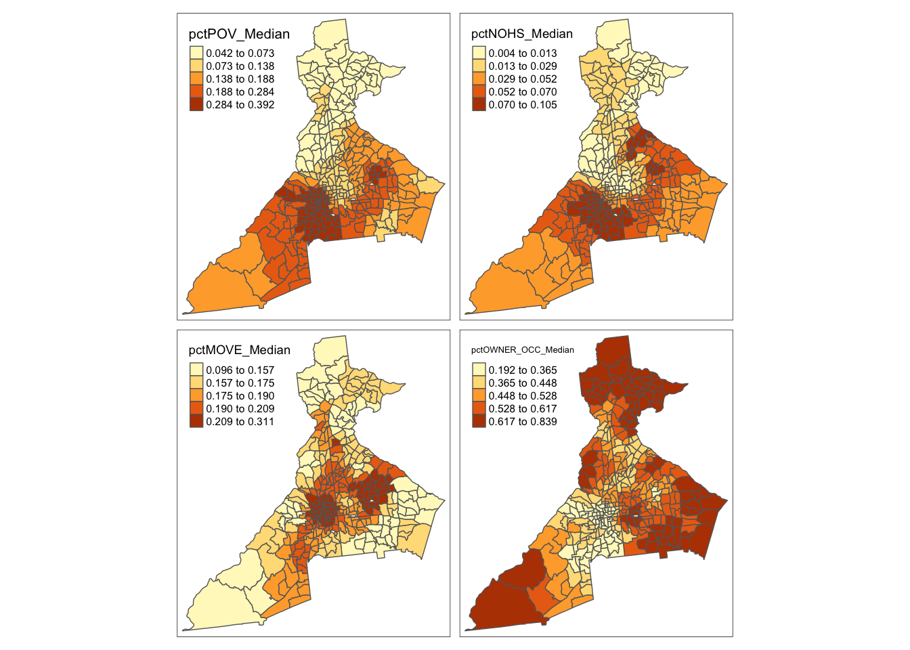


And we can also examine the local variation or diversity in values by mapping the *geographically-weighted IQR*


```r
# Map geographically-weighted IQR
tm_shape(atl.ss$SDF) + 
  tm_fill(c('pctPOV_IQR', 'pctNOHS_IQR', 'pctMOVE_IQR', 'pctOWNER_OCC_IQR'),
          style = 'quantile') +
  tm_borders()
```

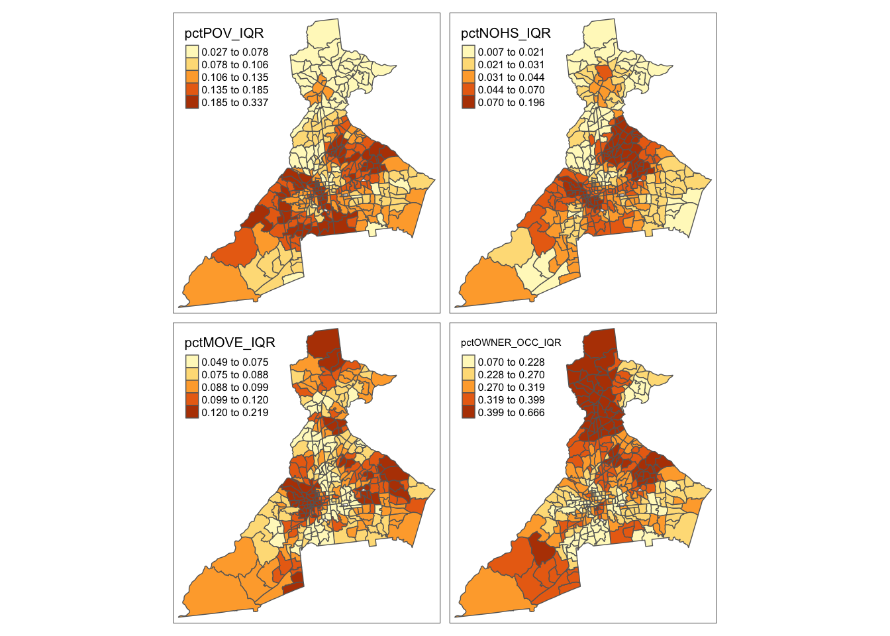

Remember, places with *higher IQR* have *larger local differences* in the values. Are the places of high variability similar to, or different from, the places with high median values?


You can now repeat the above code for the `ICE_INCOME_all` variable, and also repeat all variables looking at the *mean* and *SD* rather than the *median* and *IQR*. Is there evidence that the *local mean* and *local median* are different?


### Calculating pseudo p-values for smoothed estimates

The motivation for much  of disease mapping is the detection of *spatial heterogeneity* and *spatial dependence* in epidemiologic data. *Spatial heterogeneity* in a statistical parameter means that values are *truly different* in some locations compared to others. *Spatial dependence* in a random variable means that the values in one location tend to be more correlated with values in nearby locations than with values in distant locations. 

A related idea is that of *spatial stationarity* which implies that the value for a summary of data (e.g. the *spatially-local mean*) is location independent. In other words if you divided your study region into 10 equal-sized sub-regions, the *mean* value would be approximately the same in each. In contrast, *spatial non-stationarity* means that the local summaries are location-dependent. For example the estimate of the *spatially local mean* could be different in one sub-region compared to another. 

Note that *spatial non-stationarity* implies both **heterogeneity** in the parameter of interest (values are not the same everywhere) **and spatial dependence** of the observations (near values are more correlated than distant values).  If there were only *heterogeneity*, but not *dependence* we would expect, on average, that local summaries of statistics would still be *stationary*. 

We can restate some of the above definitions in the form of testable hypotheses to evaluate in our disease mapping analysis.  First note that in this example we have multiple candidate *random variables* (e.g. `pctPOV`, `pctMOVE`, `ICE_INCOME_all`, ...), as well as multiple candidate statistical parameters (e.g. the *mean*, *median*, *SD*, *IQR*, ...). To hone in on the questions at hand, let us assume we are interested in describing the *mean* value of the random variable `pctPOV`. The use of kernel density functions applied to spatial data are particularly well suited for testing of *spatial stationarity* versus *spatial non-stationarity* of statistic parameters.

As noted above, the question about *spatial stationarity* hinges largely on the presence of *spatial dependence* versus *spatial independence* of observed values. Therefore, under a *null hypothesis*, $H_0:$, we might posit that the observed values of `pctPOV` are independent of one another, and therefore any *spatially local mean* estimate of `pctPOV` would be location independent (e.g. the summary in one location would, on average, be the same as the summary in another location). The *alternative hypothesis*, $H_A:$, is that the values of `pctPOV` are *spatially dependent* and therefore any *spatially local mean* estimate of `pctPOV` could be location dependent (e.g. not equal to a single *global* value, nor to every other location-specif value).

How can we test this hypothesis? As we have seen previously, hypothesis testing with spatial data is made more challenging by the complex structure of the data, and difficulty making plausible assumptions under conventional statistical rules.  

One effective empirical solution to the complexity is to carry out *Monte Carlo permutation testing* of the null hypothesis. The idea with permutation testing, is that we can empirically simulate what we believe the data would look like under the *null distribution*. Then we can compare our *observed* data to the simulated *null distribution* to describe how unusual our observations were, given what would have been expected due to chance alone. 

Permutation testing is particularly well-suited to questions about *spatial independence* versus *spatial dependence*, because it is not hard to conceive of what it means to have data values independent of one another. For example, imagine that our random variable, `pctPOV` has been measured on 345 units, as it has here.  Under the *null hypothesis* of spatial independence, the geographic location of the measures is irrelevant.  For example if we took the exact same vector of $n=345$ values of `pctPOV` and randomly changed their geographic location, it should not matter because we assume, under the null, that geographic location is irrelevant.  If we were to randomly reassign the vector of $n=345$ values of `pctPOV` to different locations many, many times we would begin to see a *distribution of arrangements under the null hypothesis*, e.g. spatial independence.

:::{.rmdnote data-latex="{note}"}

__What is permutation testing doing?__

* First, the measure of interest in this case is the geographically-weighted average of a variable, say `pctPOV`. So each region will have its own *spatially weighted average* calculated as the weighted average of it’s own neighbors (as defined by the kernel). 
* Under the null, we assume that the value of an individual region’s `pctPOV` is independent of the value of the value in its neighbors. Therefore, the permutations are an empirical way to approximate this null assumption by randomly re-assigning the known values to different geographic locations. 
* Each time we randomly reassign a set of locations, we repeat the process of creating the geographically weighted average of the variable, e.g. `pctPOV`. After doing this a lot of times, we have a distribution of what the geographically weighted `pctPOV` for each individual region would look like if the null (spatial independence) were true. 
* We can then compare our *single observed realization* of the geographically-weighted `pctPov` in each region to the long list of hypothetical values (under the null) to see how typical or unusual our observed data are. Essentially the pseudo p-value is just the rank-ordered percentile of the observed data in relation to the range of values under the null. 
* The number of random permutations guides the precision of our eventual pseudo-p-value. Our p-value could theoretically be smaller if we have more null permutations. For instance if we compare $n=1$ observed realization of the data with $n=99$ null permutations the very most extreme statement we could make is that our data is more extreme at $p = \frac{1}{100} = 0.01$ level. In contrast if we had $n=1$ observed realizations and $n=999$ random permutations under the null the most extreme our data could be is $p = \frac{1}{1000} = 0.001$.


:::


This is what the function `gwss.montecarlo()` does. In the specific context of the *geographically weighted summary statistics*, the function follows a 3-step process:

1. First it will randomly reassign the location of variables of interest $n$ times (where $n$ specified by user, but typically reasonably large)
2. Second, for each random permutation of the random variable (e.g. `pctPOV`), the summary statistic (e.g. the *spatially-weighted local mean* of `pctPOV`) is calculated.   
3. Finally, the *observed* results (e.g. the *spatially-weighted mean* of `pctPOV` calculated using our original `gwss()`) is compared to the *null distribution*. If we calculated $n=999$ random permutations, then we would have $n=1000$ versions of the summarized statistic, including the observed.  The *pseudo p-value* is calculated as the number of times for each spatial unit that the *observed* value is *more extreme* than what would be expected under the null. For example if we defined *extreme* as being something that happens fewer than 5% of the time by random chance alone, then we might classify our observed value as *extreme* (and thus *significant*) if our observed value was either less than the lower 2.5% of the null values, or greater than the upper 97.5% of the null values.


It might sound like a lot of things are happening. Mechanically it is a relatively straightforward procedure, but it can be time consuming, particularly when you have a lot of permutations of the null.  Here we carry out the Monte Carlo permutation test for geographically-weighted statistics on a single variable, `pctPOV`. Most of the arguments are familiar, but we now must specify how many permutations or *simulations* we wish by using the arguments `nsim = `. On my computer, it took less than 1 minute to run with $n=499$ permutations. Note that because we request $n=499$ simulations, when combined with our *observed* data, there will be $n=500$ total values of the *spatially-weighted mean* value of `pctPOV` to compare.


```r
p.val <- gwss.montecarlo(atl, vars = 'pctPOV', 
                         adaptive = T,
                         bw = 35,
                         nsim = 499)

summary(p.val)
```


```
##    pctPOV_LM        pctPOV_LSD      pctPOV_LVar      pctPOV_LSKe    
##  Min.   :0.0000   Min.   :0.0000   Min.   :0.0000   Min.   :0.0020  
##  1st Qu.:0.2480   1st Qu.:0.2480   1st Qu.:0.2480   1st Qu.:0.2460  
##  Median :0.5040   Median :0.5040   Median :0.5040   Median :0.4920  
##  Mean   :0.5001   Mean   :0.5002   Mean   :0.5002   Mean   :0.4992  
##  3rd Qu.:0.7600   3rd Qu.:0.7480   3rd Qu.:0.7480   3rd Qu.:0.7580  
##  Max.   :0.9980   Max.   :0.9980   Max.   :0.9980   Max.   :0.9980  
##    pctPOV_LCV    
##  Min.   :0.0020  
##  1st Qu.:0.2460  
##  Median :0.5180  
##  Mean   :0.5013  
##  3rd Qu.:0.7540  
##  Max.   :0.9980
```


You can now examine the result. First you might find that what is returned is of class `matrix`. You will notice that there are columns for all 5 of the primary summary statistics estimated by `gwss`

* `_LM` which is the *local mean*
* `_LSD` which is the *local standard deviation*
* `_LVar` which is the *local variance*
* `_LSKe` which is the *local skewness*
* `_LCV` which is the *local coefficient of variation*

The numbers in each column are values that range from 0 to 1. These numbers are *percentiles* reflecting the *rank* location of the single *spatially weighted local mean* of `pctPOV` from the *observed* data as compared to the $n=499$ versions where spatial location was randomly assigned.  

To calculate a 2-side pseudo p-value at the conventional 0.05 threshold, we would be interested in which census tracts the *observed* data were either in the very lowest 2.5% or the very highest 2.5% of the null distribution.  In other words we could ask which census tracts were observed to have a spatially-weighted local mean value that is *extreme* as compared to what would happen by chance alone.


:::{.rmdnote data-latex="{note}"}

**NOTE**: 

The percentile values come from a specific set of randomly distributed simulations. Repeating the procedure could produce *slightly* different values from what is printed above simply due to random variation. But based on the *Central Limit Theorem*, we believe that as the number of the simulations grows larger, the more consistent the results will be.

:::

However the result returned in the object `p.val` is not easy to use just as it is. How could we convert it into something we could map?  Below, we can test which census tracts were *extreme* under the above definition, and then make a new spatial object that includes only *significant* tracts. 


```r
# First, create TRUE/FALSE vectors testing whether column 1 (pctPOV_LM) is extreme
# I am using 2 significance levels: 90% and 95%
sig95 <- p.val[, 1] < 0.025 | p.val[, 1] > 0.975
sig90 <- p.val[, 1] < 0.05 | p.val[, 1] > 0.95

# Second create a spatial object that ONLY contains significant tracts
atl.sig95 <- atl[sig95, ] %>% 
  aggregate(dissolve = T, FUN = length) # this is sp code to merge adjacent tracts

atl.sig90 <- atl[sig90, ] %>%
  aggregate(dissolve = T, FUN = length)
```

:::{.rmdtip data-latex="{tip}"}

In the code above we use the `sp` function `aggregate()` in a similar way we might use the `dplyr` function `group_by()` with `sf` class data: to merge or dissolve adjacent polygons that share a value. In this case we are merging census tracts that have p-values below a certain threshold in order to create a bold outline on the map. 

The `aggregate()` function requires an action or function (`FUN`) to be applied to the groups of tracts being merged together. We do not care about the output of the function, but just need to put something in. Somewhat arbitrarily I choose the function `length` because it works well for both numeric and character data. However, we will not pay attention to the value returned; instead we only care about the shape of the resulting polygon.

:::

Now we can use the results from above to create a map summarizing our evidence in relation to the *null hypothesis* that the *geographically-weighted mean* value of `pctPOV` is *stationary*, against the *alternative hypothesis* that at least some locations have significantly more extreme local values than expected under the null.


```r
tm_shape(atl.ss$SDF) + 
  tm_fill('pctPOV_LM', 
          style = 'quantile',
          title = 'Local Average % Poverty') + 
  tm_borders() + 
tm_shape(atl.sig90) +
  tm_borders(lwd = 2, col = 'blue') + 
tm_shape(atl.sig95) + 
  tm_borders(lwd = 2, col ='red') +
tm_add_legend(type = 'line',
              labels = c('p < 0.05', 'p < 0.10'),
              col = c('red', 'blue'))
```

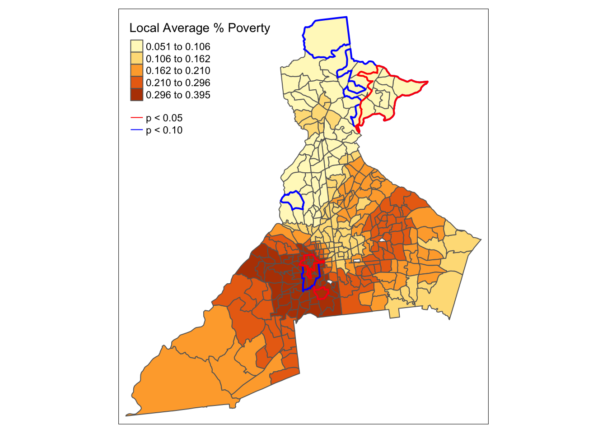


What we see is that the visual inspection of the *geographically-weighted mean* of `pctPOV` suggests that there is a great deal of *spatial heterogeneity* and apparent *spatial non-stationarity*. However, the permutation test suggests that only a few regions in far North Fulton and in West Atlanta have values that are more extreme than we might expect under an assumption of spatial independence. 


:::{.rmdcaution data-latex="{caution}"}

**NOTE**:

It is important to remember the hypothesis we were testing! This is not a test of whether the poverty rate is zero, nor a test of whether the poverty rate is different in some specific census tracts compared to others. 

Instead, this is specifically a test of whether there is *spatial dependence* in the data that would give rise to unexpectedly extreme local measures under the assumptions of the KDE with specified neighbors.

:::


### Estimating geographically-weighted bivariate statistics

The final bits of information we will examine from the *geographically-weighted summary statistics* function `gwss()` are the bivariate correlations and covariances. Any time two or more variables are supplied to the `gwss()` function, it will automatically calculate the correlation coefficients (both Pearson and Spearman), as well as measures of covariance, for every pair of variables.

Up until now, we have seen how the KDE function can produce a smoothed estimate of the local *mean*, *median*, *SD*, etc. But it can also show whether any correlation between pairs of variables is *spatially stationary* (the same everywhere), or *spatially non-stationary* (varies by location).


```r
tm_shape(atl.ss$SDF) +
  tm_fill(c('Spearman_rho_pctPOV.pctNOHS',
            'Spearman_rho_pctPOV.pctMOVE',
            'Spearman_rho_pctPOV.ICE_INCOME_all'),
          style = 'quantile') +
  tm_borders()
```

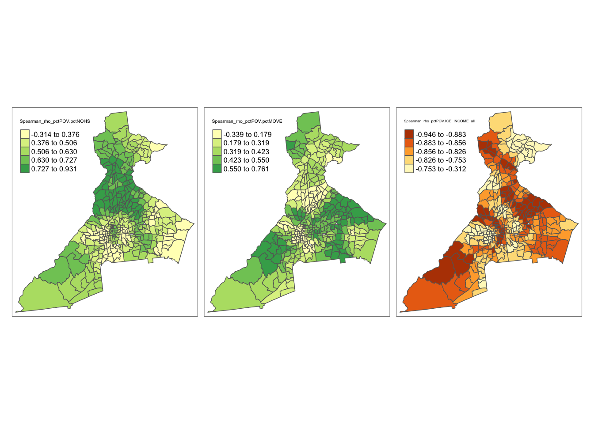


Two things are illustrated by these maps. 

1. First, it appears that the magnitude of correlation among these pairs of variables is larger in some areas and smaller in others. 
2. The second, is that the spatial patterns of correlation between `pctPOV` and two other variables are distinct. In other words the areas where correlation is relatively stronger or weaker are not the same.

We might once again ask whether these differences are more extreme than we might expect under a null hypothesis of *spatial independence* and *spatial stationarity*. 

Previously we only conducted the *Monte Carlo permutation test* on a single variable, `pctPOV`. But if we provide two or more variables to the `gwss.montecarlo()` function, we will get pseudo p-values for both univariate and bivariate statistics. **NOTE** this takes more time because there is more work for the computer to do. The code below took a little over 1-minute on my computer.


```r
p.val <- gwss.montecarlo(atl, vars = c('pctPOV', 'pctMOVE'), 
                         adaptive = T,
                         bw = 35,
                         nsim = 499)
```


You can use `summary()` or `dimnames()` to figure out which column you want. We want to get the permutation p-value for `Spearman_rho_pctPOV.pctMOVE`, which is in the 13th column of the matrix.


```r
# First, create TRUE/FALSE vectors testing whether column 1 (pctPOV_LM) is extreme
# I am using 2 significance levels: 90% and 95%
sig95 <- p.val[, 13] < 0.025 | p.val[, 13] > 0.975
sig90 <- p.val[, 13] < 0.05 | p.val[, 13] > 0.95

# Second create a spatial object that ONLY contains significant tracts
atl.sig95 <- atl[sig95, ] %>% 
  aggregate(dissolve = T, FUN = mean) 

atl.sig90 <- atl[sig90, ] %>%
  aggregate(disolve = T, FUN = mean)
```

Now we can map the correlation between `pctPOV` and `pctMOVE` along with the significance test.


```r
tm_shape(atl.ss$SDF) + 
  tm_fill('Spearman_rho_pctPOV.pctMOVE', 
          style = 'quantile',
          title = 'Local correlation Poverty\n& Residential instability') + 
  tm_borders() + 
tm_shape(atl.sig90) +
  tm_borders(lwd = 2, col = 'blue') + 
tm_shape(atl.sig95) + 
  tm_borders(lwd = 2, col ='red') +
tm_add_legend(type = 'line',
              labels = c('p < 0.05', 'p < 0.10'),
              col = c('red', 'blue'))
```

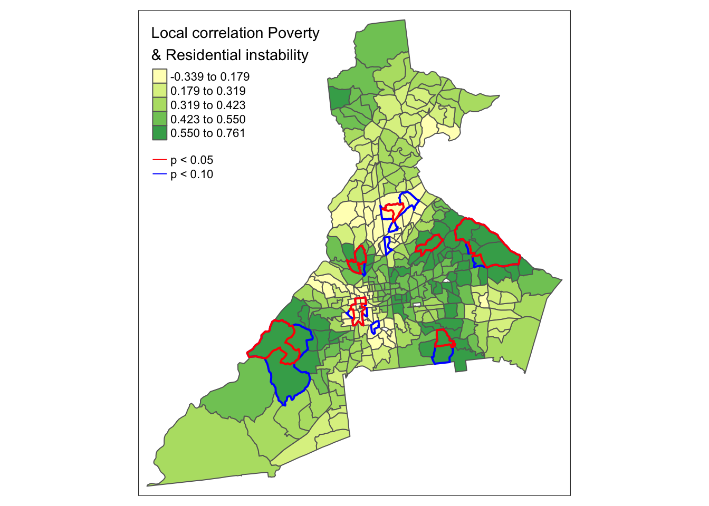


