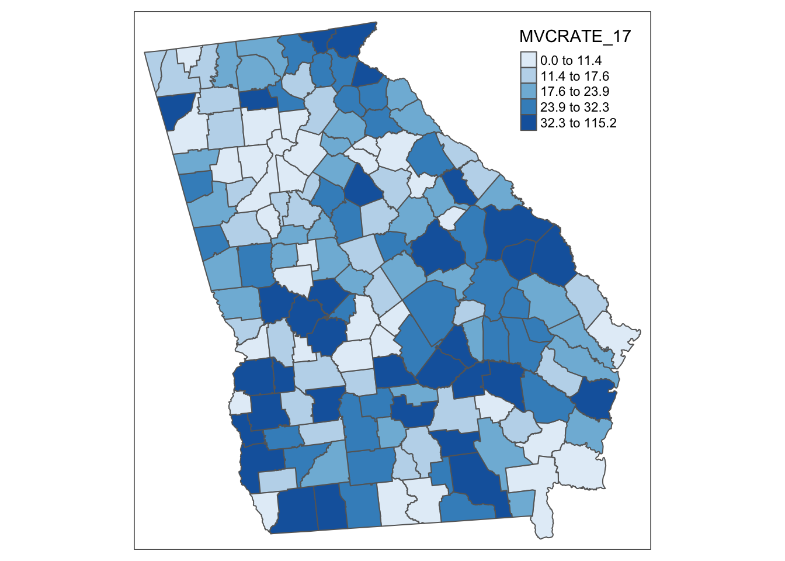
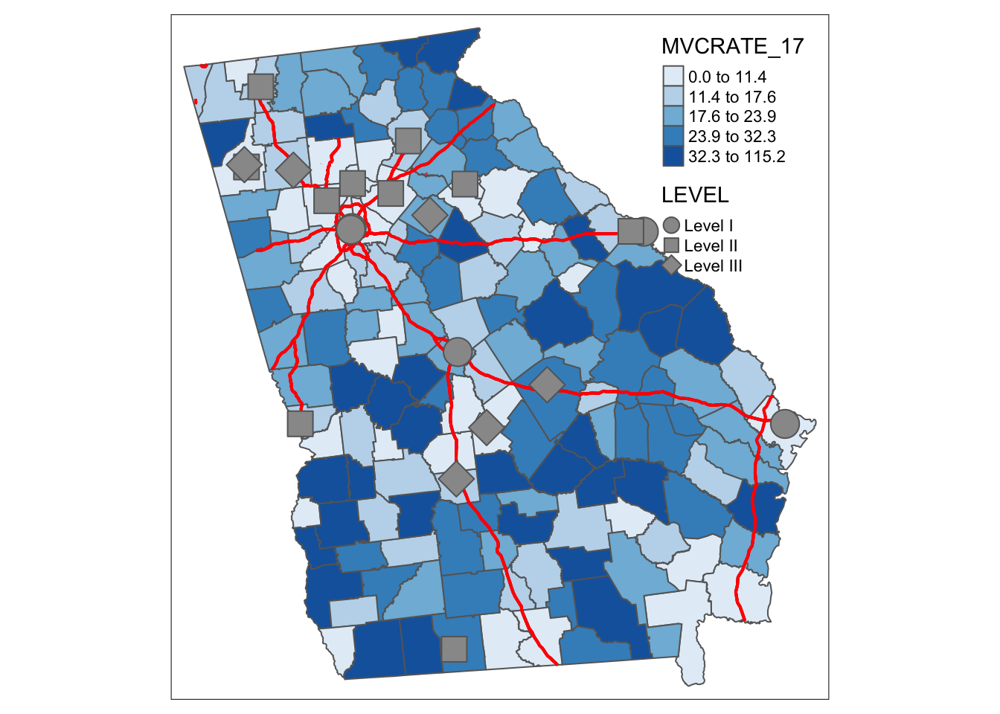

# Week 1: Introduction to spatial data and mapping

## Objective

This lab builds on the very basic introduction from Week 0. More specifically, the objective of this lab is to introduce basic data manipulation in `R`, and to begin to create simple maps using the `tmap` package.  


This lab builds on content that is provided in the course eBook. Specifically, please refer to the following sections for additional information:

* [Chapter 1 - Locating Spatial Epidemiology](https://mkram01.github.io/EPI563-SpatialEPI/locating-spatial-epidemiology.html), and especially Section 1.3, *Spatial Analysis in Epidemiology*.
* [Chapter 16 - Tips for working with `sf` data class](https://mkram01.github.io/EPI563-SpatialEPI/sf-overview.html)
* [Chapter 17 - Tips for use `dplyr`](https://mkram01.github.io/EPI563-SpatialEPI/dplyr.html)
* [Chapter 18 - Tips for using `tmap`](https://mkram01.github.io/EPI563-SpatialEPI/intro-tmap.html)


## Data: `ga_mvc`

The first part of the lab uses the Georgia motor vehicle crash mortality data. We used the `ga_mvc.gpkg` last week, but there are now three related spatial objects. They are available on Canvas in a single zip folder. Please download the zip folder and *unzip* them and place all three *into your project folder* (see below):

* `ga_mvc.gpkg` is a spatial polygon file with county-level mortality counts and rates from motor vehicle crashes in Georgia in 2005, 2014, and 2017  
* `ga_hwy.gpkg` is the interstate highway line file clipped to the Georgia boundaries. Motor vehicle crash deaths are related to transportation infrastructure both because they concentrate travelers, and because highway engineering can predict crash risk
* `trauma_centers.gpkg` is a point file of the 21 recognized trauma centers in Georgia, with level-of-service designation


As a reminder, here is the data dictionary for the `ga_mvc.gpkg` dataset:

VARIABLE NAME   | DEFINITION
--------------- | -----------------------
`GEOID`       | 5-digit State/County FIPS code
`NAME`    | County name
`variable` | ACS census table variable name
`estimate` | ACS census estimate
`County` | County name
`MVCDEATHS_05`  | Count of deaths from motor vehicle collision, 2005
`MVCDEATHS_14`  | count of deaths from motor vehicle collision, 2014
`MVCDEATH_17`   | count of deaths from motor vehicle collision, 2017
`TPOP_05`   | Total population count, 2005
`TPOP_14`   | Total population count, 2014
`TPOP_17`   | Total population count, 2017
`NCHS_RURAL_CODE_2013` | 1= Large central Metro; 2 = Large fringe Metro; 3 = Medium metro; 4 = Small Metro; 5 = Micropolitan; 6 = Non-core
`nchs_code`   | Labeled factor of NCHS_RURAL_CODE_2013
rural   | 1= Non-core county; 0 = All other (micropolitan or larger)
`MVCRATE_05`  | Mortality rate per 100,000 from motor vehicle crashes, 2005
`MVCRATE_14`    | Mortality rate per 100,000 from motor vehicle crashes, 2014
`MVCRATE_17`    | Mortality rate per 100,000 from motor vehicle crashes, 2017
`geom`    | Geometry column

**And here is an abbreviated data dictionary for the `trauma_centers.gpkg` dataset**:

VARIABLE NAME   | DEFINITION
--------------- | -----------------------
`name` | Hospital name
`LEVEL` | Trauma Center Designation as factor (I = highest level; II = mid-level; III = lower-level)
`LEVEL_number` | Trauma Center Designation as integer


## Prepare your environment


### Create new project

Just as we did last week, I recommend creating a *new project* in R-Studio for this lab.  Look back at the Week 0 Lab Handout for instructions and be sure to:

* Create folder for this activity
* Create a project in `R` which will place a `.Rproj` file. Remember you can double-click this `.Rproj` file to open the project next time you return to it!
* Download the zip folder containing the data (e.g. on Canvas). Unzip the folder and place all data objects *inside the project folder*.
* Create a new `R` script (*File>New>New File>R Script*), and save it into your project folder

### Load packages and data

Once you have created the working environment, you should load the necessary packages into `R`. Again, I recommend putting the code for loading all packages for a given analysis *at the top* of your script so that it is easy to tell what you are relying on for this analysis. That means that even if you remember half way through a programming session that you need another package, put that code at the top! 

:::{.rmdtip data-latex="{tip}"}

Last week there was a brief introduction to the use of `pacman` and `here` as used below. You can review descriptions from the eBook and last week as needed, but briefly:

* `pacman::p_load()` uses the package `pacman` to load a list of packages without much fuss. Alternatively you could have used: `library(sf)` and `library(tidyverse)`, etc.
* `here::here()` is designed to describe the *relative pathnames* to locate a folder. It is particularly useful when you are referring to something in *sub-folders* within your project. If you store data directly in the *root* (the main project folder), there is no benefit to using the `here` package.
:::


```r
# Load all of the packages we need for today
pacman::p_load(tidyverse,   # General data wrangling
               sf,          # manage spatial data using simple features
               tmap)        # mapping of sf or sp data
```

Before loading the packages (especially `sf`) you would be unable to import the spatial data. But once you have loaded `sf`, you can go ahead and import all three of the spatial datasets we will use.


```r
# If you stored your data in the *root* of your project use this code
mvc <- st_read('ga_mvc.gpkg')
hwy <- st_read('ga_hwy.gpkg')
trauma <- st_read('trauma_centers.gpkg')

# If you stored your data in a *sub-folder* of your project adapt this code
mvc <- st_read(here::here('data', 'ga_mvc.gpkg'))
hwy <- st_read(here::here('data', 'ga_hwy.gpkg'))
trauma <- st_read(here::here('data', 'trauma_centers.gpkg'))
```


:::{.rmdtip data-latex="{note}"}

What if you did not understand how to use a function like `st_read()` or `p_load()` or `here()`?  This will happen all the time! So practice **looking at the help documentation** anytime you see a new function.

Type: `?st_read()`and look at the help panel (lower right). Help in `R` is always organized the same way:

1. **Usage** shows the function along with all of the possible *arguments* (options). Some arguments have a default as indicated by something following an equal signs. Generally you must supply an option for any argument that does not have a default.
2. **Arguments** is a list of every possible argument or option, with a brief description. This is a great place to look to try to figure out what changes or customizations you can make to a function, and also to understand what the defaults do.
3. **Details** generally provides a little more overview of what the function does, how to use it, or how it relates to other functions. 
4. **Value** tells you what *will be returned* as a result of running the function. This is helpful to know what the '*output*' will look like. For instance is it going to be a `data.frame`, a single number, or perhaps a `list` of values?
5. **Examples** most help documentation includes some useful snippets of code demonstrating how to use the function. They often rely on built-in data, which means you could copy/paste the code to '*try out*' a function to see what happens. 
:::


> **CHALLENGE 1**: How would you modify the code that imported the datasets (e.g. above) if instead of receiving the data as a `.gpkg` it was an ESRI shapefile (e.g. `.shp`)? In your zip folder you also have the `mvc` data as a shapefile. Try loading it using `st_read()`, but name it `mvc.shp`.

### Understanding the basics of your data

Last week you were introduced to some basic functions that help you get to know new data. They are summarized again below. 

Function | Description of uses
----------|-------------------------------------------------------------
`names()` | This is like `proc contents` in SAS. It prints the variable names (columns) in the object
`summary()` | This all-purpose function works intuitively on *most* objects in `R` (including `sf` objects!) providing a summary of each appropriate to it's type.
`head()`  | This is a favorite of mine as it gives a quick look at the *first 6 rows* of a data object. It is especially great for `sf` data objects because it also provides information on CRS/projection!
`class()` | This is another utilitarian function especially useful when something isn't behaving right. It is always good to confirm what data class an object is. 
`dim()` | This returns the *dimensions* (as `row`, `column`). You could often get the same information by looking at the Environment tab in RStudio where the number of observations and variables is listed for each object.

:::{.rmdnote data-latex='{note}'}

**DO THIS**: Use the above functions on your three data objects and look at what is returned. Can  you answer these questions:

* What is the *unit of observation* (e.g. what is described by each row)?
* How many units are there for each?
:::

> **CHALLENGE 2**: Can you tell the type of geometry (e.g. point, line, polygon) of each of the three objects without plotting them?


### What is spatial about your data?

Once you are familiar with the *attributes* of your data, you may be interested in a basic understanding of the *geometry* of your data. Again, there are many potential questions you might ask, but two I often start with are:

* What is the CRS/projection and do I need to transform the data for my current purposes?
* What is the spatial extent of the data? In other words what geographic range is represented (e.g. is this a set of contiguous areas; discontinuous areas; the whole country or just a part)?


#### CRS/Projection

You already found part of the answer to the question about **CRS/projection**! Assuming this is an `sf` object, the `head()` function reported the CRS, which should have been `WGS 84` for the `mvc`.  

Recall that `WGS 84` is a *coordinate reference system* (CRS). What we don't know is whether this CRS is unprojected (e.g. angular degrees of lat/long) or whether it has been mathematically transformed to planar units such as meters or miles. 

A piece of information that would be much more concrete would be to identify what is called the *EPSG* (European Petroleum Survey Group). As noted previously, this code specifically identifies the CRS and projection (if any). Unfortunately, not all spatial files have an EPSG code assigned. If there is one it will be returned with this code:


```r
# Specifically extract  EPSG ID (if present) from spatial object
st_crs(mvc)$srid
```

If you wanted more information (or if there was no EPSG returned) you could get a much more verbose (and somewhat cryptic!) set of information like this:


```r
st_crs(mvc)
```

This is called the "*well known text*" (WKT) version of the CRS and projection information. It includes the information needed to unambiguously define the CRS or projection.  

When examining objects look for headers like `GEOCRS` or `TARGETCRS`, and the associated valued of `ID["EPSG", xxxx]`. For instance, in this case you might see that the last line says: `ID["EPSG",4326]`, suggesting this object has EPSG ID 4326 (see description below). 

> **CHALLENGE 3**: Without intending to do this, all three objects I provided for this lab have different CRS/projection. Find the EPSG code for each, and Google them to know what they are. 


I know it seems strange but that is super useful! [Recall from the reading](https://mkram01.github.io/EPI563-SpatialEPI/locating-spatial-epidemiology.html#working-with-crs-and-projection) that there are three main CRS/projections we will work with this semester although hundreds more exist:

EPSG code  | Definition
-----------|---------------------------------------
**4326**   | This is a WGS 84 CRS that is unprojected (units are degrees of latitude or longitude). It is the common definition for data from the Census Bureau. 
**3857**   | This also uses the WGS 84 CRS, but is a Mercator conformal projection. It is sometimes called *Web Mercator* as it is used heavily by Google and online mapping sources
**5070**   | This is the *Albers Equal Area* projection that is suitable for the U.S. 


:::{.rmdtip data-latex="{tip}"}

One rule of thumb to determine if data are in *degrees of lat/long* versus in *linear units* such as meters or miles is to look at the `xmin`, `ymin`, `xmax`, and `ymax` that are printed at the top of the output whenever you use `head(xxx)`.  **Degrees of latitude** (the *y-axis* values) will range from $-90^\circ$ to $+90^\circ$, and **degrees of longitude** (the *x-axis* values) will range from $0^\circ$ to $180^\circ$.

In contrast most *projected* data will have cartesian or linear units (rather than degrees), usually with numbers **much higher than 180**.
:::

For this class we will almost always prefer an *equal area projection* such as the *Albers Equal Area* definition. As discussed in the eBook, equal area projections are suitable for choropleth mapping, where we are coloring the *area* of each polygon to represent some underlying statistic.

The `mvc` data is *already defined* as `EPSG 4326`, which again means it is *unprojected* with $x,y$ units of *degrees*.  The other two data objects are also *unprojected* although they each originate from a different CRS. 

We can easily transform all three to have the same CRS and projection, and more specifically define that as the *Albers Equal Area* projection, represented by EPSG code 5070.


```r
# Code for transforming mvc
mvc.aea <- st_transform(mvc, 5070)
```


Don't forget to transform `hwy` and `trauma` using the same code as above!

:::{.rmdnote data-latex="{note}"}

 **DO THIS**: Last week you saw some simple code for *visualizing the geometry* of a spatial object. That means just printing out the outline of its shape. Plot the `mvc` and `mvc.aea` objects to see if you can tell a difference.
:::

## Basic mapping with `tmap`

A generally useful and flexible data visualization package for *spatial epidemiology* is `tmap`. The *`t`* stands for *thematic mapping* which is exactly what we want to do in a lot of descriptive spatial epidemiology. There is [additional information on `tmap` in the eBook](https://mkram01.github.io/EPI563-SpatialEPI/intro-tmap.html), and there is even more in the help documentation. 

It will take several weeks to learn the ins and outs of `tmap`, and initially it may feel more frustrating than the possibly more familiar ArcMap interface. Practice a lot, experiment with different settings, use the supplemental resources linked in the eBook and read the help documentation!

### Create a choropleth map

A choropleth map uses color to fill areal units (polygons) as a representation of the values of specific attributes in each unit. It is the most common type of map used in spatial epidemiology, as it can map aggregated summaries about population, incidence, prevalence, and average levels of exposures.

Any map in `tmap` is created by first naming the *object*, *layer*, or *shape* (e.g. using `tm_shape()`) to visualize, and then by adding a range of options about **how** you want to visualize this layer or shape.  

The process is similar to the *grammar of graphics* philosophy around which the popular `ggplot2` package is built in that you start with a basic set of axes (extent) and then step-by-step, add layers of information.   Here is an example of a simple choropleth map of the motor vehicle crash mortality rate in 2017.


```r
tm_shape(mvc.aea) +
  tm_fill('MVCRATE_17',
          style = 'quantile',
          palette = 'Blues') +
  tm_borders() 
```



#### Explaining this code

1. `tm_shape()` defines the *layer* to visualize, and from this the size and extent of the base map; in this case `mvc`
2. `tm_fill()` does a lot of work. 
  a. The first argument is the variable being symbolized (`MVCRATE_17`), which must be in quotes. 
  b. Next we specify the `style` for categorizing or binning the continuous values. 
  c. Finally we specified the color `palette` to use. 
3. `tm_borders()` prints the borders in black or grey. That means if you left it off there would be no borders which might be preferable sometimes.

:::{.rmdnote data-latex='{note}'}

 **DO THIS**: 

1. Look at the help documentation for `tm_fill()` (`?tm_fill`) to see all the many things you can customize in this one function alone!
2. Try the palette explorer to see the other built-in color options. I recommend starting a separate session of `R` (it's ok to have multiple running on the same computer). Inside it type `tmaptools::palette_explorer()`. If you've installed `tmaptools` that should open up an interactive window with color palettes. Notice the names next to each...that is what you type to specify a palette. You could also browse these at the [Color Brewer website](https://colorbrewer2.org/#type=sequential&scheme=BuGn&n=3).  Try different color palettes. Which works best for these data? Why?
3. Try plotting a map without borders. Try changing the color or width of the borders. You will have to look at the help documentation to figure this out!
4. Try changing from `quantile` breaks to different allowable options. Which do you think is preferable? Why?
:::

:::{.rmdtip data-latex='{tip}'}

 **Why does my legend overlap with my legend!?**
 
 Your first maps in `tmap` will not look perfect. You might wish the text was a different size, or the legend was moved, or the color was different or many other things.  All of these things can be changed! 
 
Getting a perfect map is **not** the goal for today, but if you want to read more about how to adjust your map (including changing the position of the legend with respect to the map), see the [eBook section on working in `tmap`](https://mkram01.github.io/EPI563-SpatialEPI/intro-tmap.html).
 :::

### Customizing text on maps

The map above is functional but is not an ideal tool for communicating important information. There are several ways you may wish to customize the text on maps. For example you may want to provide a name for the legend, new labels for the categories, or a title, subtitle or caption for the whole map.  


```r
myLabels <- c('Low (Q1)', 'Q2', 'Q3', 'Q4', 'Hi (Q5)')

tm_shape(mvc.aea) +
  tm_fill('MVCRATE_17',
          style = 'quantile',
          palette = 'Blues',
          title = 'MVC Rate in 2017',
          n = 5, 
          labels = myLabels) +
  tm_borders() +
tm_layout(title = 'Motor Vehicle Crashes per capita in Georgia',
          legend.outside = T) +
tm_credits('Source: Georgia OASIS, retrieved 2019')
```


#### Explaining this code:

1. The creation of a vector of labels named `myLabels` before even calling `tmap` is one way to customize the legend. Note that there must be the same number of labels in the vector as there are levels ($n$) in the legend.
2. `tm_fill()` now has some added arguments:
  + `title = 'MVC Rate in 2017'` gives an overall title for the legend of the map
  +  `n=5` makes explicit how many categories to divide data into. $5$ is actually the default and in this case creates *quintiles*, but a different number (e.g. $3$ would create *tertiles*) are possible
  + `labels = myLabels` is where we reference the vector of labels
3. `tm_layout()` is a powerful function that does a lot of heavy lifting for the overall layout of maps. Here we specify two layout options:
  + `title = xxx` provides an overall title for the whole map (distinct from the name over the legend)
  + `legend.outside=T` says to put the legend *outside of the frame* rather than inside which is the default
4. `tm_credits()` is just one of several additional text functions that can place text on the map 

:::{.rmdnote data-latex='{note}'}

Look at help documentation for `tm_layout()`. There are **a lot** of options here. You cannot learn them all now, but you should revisit this help documentation often as you begin building maps!
:::

### Adding two or more spatial objects in one map

Just like in ArcGIS, additional spatial layers can be added up to produce a more informative map. For instance if we were interested in how highways and trauma centers related to motor vehicle mortality rates we could add these layers.


```r
tm_shape(mvc.aea) + 
  tm_fill('MVCRATE_17',
          style = 'quantile',
          palette = 'Blues') +
  tm_borders() +
tm_shape(hwy.aea) + 
  tm_lines(lwd = 2, col = 'red') +
tm_shape(trauma.aea) + 
  tm_bubbles(shape = 'LEVEL')
```



#### Explaining the code:

1. There are three separate spatial objects plotted, and each is called with `tm_shape()` followed by some additional function to specify how to visualize *that layer.* See the Tenekes article on Canvas for a table of which layers are available for which kinds of shapes (e.g. polygons, points, or lines).
2. Each function (e.g. each call with parentheses) is connected together with plus signs
3. Within each function (e.g. *within the parentheses*), *arguments* are separated with commas
4. I organize my code vertically because I think it makes it more readable than all on one line. However this is a point of style, not a requirement.


Try changing these arguments or try substituting different options!

### Making small-multiple maps

There are several strategies for creating [*small multiples* maps described in the eBook](https://mkram01.github.io/EPI563-SpatialEPI/intro-tmap.html#making-small-multiple-maps). 

> **CHALLENGE 4**: For now create a 2-panel map of the `MVCRATE_xx` for 2005 and 2017 using `tmap_arrange()`.


### Saving output

There are two kinds of things you often want to be able to save or export for later reference: *updated spatial objects* and *maps*.

#### Saving `sf` objects

If you  modify a spatial object, and want to save it for re-use in the future use `st_write()`. When you name the file you are creating/writing to, you are also defining the format of storage (e.g. `.shp`, `.gpkg`, etc).

:::{.rmdcaution data-latex='{caution}'}

**CAUTION**: If you output a spatial object as an ESRI shapefile (`.shp`), you should be aware of the naming constraints. Specifically variable names can be no longer than 10 characters. If your object has names longer than 10 characters (e.g. as is the case with `MVCDEATHS_xx` for example), `R` will automatically truncate the names and give you a *warning message*.  However, if that truncation results in multiple variable with identical names (e.g. truncation to 10 characters makes `MVCDEATHS_` for all three years), then you will get a `write error` message and the file will fail to save correctly. The solution is to rename variables to fit the ESRI rules prior to saving. 

Just another reason to avoid shapefile!
:::


```r
# this creates a new geopackage of the albers-transformed dataset
st_write(mvc.aea, 'mvc-albers.gpkg')

# this creates a shapefile of the same
st_write(mvc.aea, 'mvc-albers.shp')
```


#### Saving maps or plots

There are three ways to save maps:

1. If you submit the code into the console (e.g. not inside of an R Notebook), it will plot in the `plots` panel of RStudio (lower right panel). In that panel, click *Export* and *Save as image*.
2. In `tmap` you can assign a map to an object name. In other words instead of just starting the code with `st_shape()` you should start with `obj.name <- st_shape() + ...`.  When you do that, you can use the function `tmap_save()` to save the object (e.g. `tmap_save(obj.name, 'yourfile.png')`.  Note that when you assign a `tmap` map a name, it will not automatically print **until you type `obj.name`**.  
3. Finally, if you '*wrap*' your code in a different graphics device you can save all of the contents. For example if you type `png(yourfilename)` and then you type your `tmap()` code and then you type `dev.off()`, the map will be saved. The `png()` *opens* an external graphic device (the new file you named), then the `tmap()` does it's thing, and then the `dev.off()` *closes* the graphic device.

##  Lab Deliverable

For most labs, there will be some introductory exercises, and then some actions (perhaps on a different dataset) to practice and extend what you learned. These final tasks will have selected *deliverables* which need to be submitted via Canvas by the assigned due date.

For this lab, try to apply and extend what you learned to a new dataset. This one is similar in that the geometry is Georgia counties. But it is a little different in that it is a summary of COVID-19 cases and deaths between January 2020 and August 29, 2021, as made available from a data stream [curated by the New York Times](https://github.com/nytimes/covid-19-data).

Below the data dictionary is a list of specific tasks that are recommended, and the specific deliverables you will need to submit to Canvas.


### Data dictionary: `covid_ga`


Variable   | Definition
-----------|-----------------------------------------
`GEOID`  | 5-digit fips code for county
`county`  | County name
`cases`    | Cumulative count of reported COVID-19 cases
`deaths`  | Cumulative count of reported COVID-confirmed deaths
`geom`   | Multipolygon geometry column


### Recommended steps

1. Import and examine the data and geometry; **project** it to *Albers Equal Area*
2. Create a new variable called `cfr` for *case fatality rate*. Define it as the number of deaths divided by the number of cases in each county. Try using the `mutate()` function from `dplyr`
3. Create a *choropleth map* of the case-fatality rate by county. Select whichever you think the preferred style for creating categories, and overlay the Georgia highways file.

### Deliverable

On Canvas please submit the following by the due date:

1. What is the CRS for the original dataset?
  + What is the underlying datum or representation of the spheroid?
  + Is the dataset projected or not?
2. Identify specific counties:
  + Which county has the *median* value of the CFR?
  + Which county has the *maximum* value of the CFR?
3. Upload a `.png` map of the case fatality rate and the highways. 


