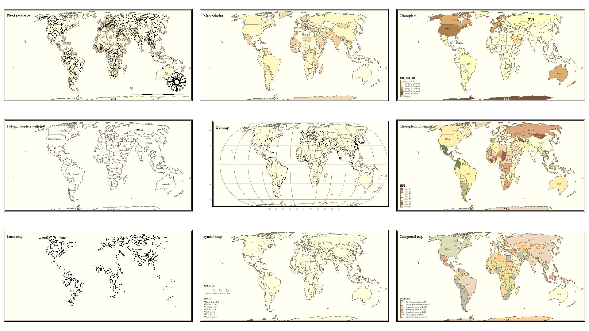

# Tips for using `tmap` {#intro-tmap}


Base-R has capable data visualization and plotting capabilities, but these fall short when doing anything but the most simple maps with spatial data. Many other packages including `sp` and `ggplot2` also have functionality specifically optimized for the data visualization needs of the spatial epidemiologist. We will have brief introductions to these and other packages.

But for this semester the workhorse mapping/cartography tool will be the `tmap` (*thematic* mapping) package. This package builds on the *grammar of graphics* logic built into `ggplot2` where data visualizations are conceived of as a series of layers of information (e.g. axes, plot space, data points, lines, fill, legends, titles, etc) systematically stacked one on top of another.  With `tmap` we start with a spatial object (e.g. a data object of either `sf` or `sp` class) and build a visualization by similarly combining or adding together sequential layers.

Once again, we will use data from the motor vehicle crash mortality dataset of Georgia counties (a vector polygon spatial data file), along with information about highways (vector line data file) and trauma centers (vector point data).

First load the package, `tmap` and browse the help index:


```r
# load the tmap and sf packages
library(tmap)
library(sf)

help('tmap')
```


After seeing the range of functions within `tmap`, we will import three datasets all stored in the geopackage format to begin visualizing: 


```r
# import (read) three spatial datasets stored in geopackage format
mvc <- st_read('GA_MVC/ga_mvc.gpkg')
hwy <- st_read('GA_MVC/ga_hwy.gpkg')
trauma <- st_read('GA_MVC/trauma_centers.gpkg')
```


## `tmap` mode

One nice feature of `tmap` is that it has two *modes* for plotting maps. You may develop a general preference for one over another, although in my opinion they serve slightly different purposes.

1. The `plot` mode produces conventional *static* maps that are viewed in the plot pane of R-Studio, or can be saved to a file. These will be the main maps for dissemination in papers, posters, or many presentations. 
2. The `view` mode is a more interactive plot in an html browser-like window. This mode allows the user to interact with the map including panning, zooming, and clicking on spatial objects to view underlying data. This is great for data exploration, and has extensions for web-served maps. However it is not so useful for any non-web-based dissemination or when you want to control the map.

You select the  mode with the function `tmap_mode()` and either `'plot'` or `'view'` in the parentheses. Note that when you set the mode, all the subsequent maps are in that mode...you must re-submit the `tmap_mode()` call to switch back again. By default, the `tmap_mode()` is `'plot'`, which means it produces static maps. We will plot some static maps, then switch to '`view'` mode to compare. 

## Quick maps: `qtm()`  {#qtm}

The function `qtm()` stands for **Q**uick **T**hematic **M**aps, and provides a step up from the simple `plot()` functions for quickly plotting spatial objects. The fundamental argument when submitting `qtm()` is the name of the object to be plotted.


```r
qtm(mvc)
```


This produces the geometry but no other information (note that unlike `plot()`, it does not plot a map for every variable!). 

To produce a choropleth map (e.g. one in which objects are shaded to represent an underlying statistic or value), simply add the name of the variable. 


```r
qtm(mvc, 'MVCRATE_05')
```


Can you tell how the legend cut-points are determined? We'll talk about when this matters and how to change it later. 

Now try switching `tmap_mode()`:


```r
tmap_mode('view')
```

Try these things in `view` mode:

* By default it will be visible in your R Studio Viewer pane; there is an icon with a screen and arrow that allows you to show in new window...do this so it is bigger
* Zoom in and out
* Pan
* Hover over counties (what do you see with hovering?)
* Click on counties (what do you see when you click?)
* Underneath the zoom + / - is an icon like a stack of papers. This changes the background map (how does the background information change as you zoom in/out?)
* Click on icon that looks like stack of pages. This lets you change the background map (assuming you are currently connected to internet)

To change back (if you like) do this:


```r
tmap_mode('plot')
```

### Customizing `qtm()` for polygons

For polygon data, you might like to control several features including the title, the color palette, and the style by which the continuous variables are categorized in the legend. 


```r
qtm(mvc,
    fill = 'MVCRATE_17', 
    fill.style = 'quantile', 
    fill.palette = 'YlGnBu',
    fill.title = 'MVC Mortality \n(2017)')
```


The syntax above customizes the original plot in several ways:

* By changing the `fill.style` (which is the style by which continuous variables are categorized in order to plot in a sequential ramp choropleth map) from the default (fixed or equal intervals) to a quantile style (by default quantiles have $n=5$ so they are *quintiles* although other schemes including *tertiles* or *quartiles* are possible also)
* By choosing a custom color palette, in this case the Yellow-Green-Blue (`YlGnBu`) palette, which is one of several built-in options.
* Providing a more informative title to the legend, rather than the default variable name.

:::{.rmdnote data-latex="{note}"}
Notice the label for the legend in the code above has "/n" inserted in the middle of the line. The use of the forward slash creates what is called an *escape character*. In this case "/n" inside of a character string inserts a line break. That is why "(2017)" is not on the same line as "MVC Mortality".
:::

### Customizing `qtm()` for lines

`qtm()` (and `tmap` generally) can also handle other types of spatial data including line shape objects, and can provide some customization of the results. Try these for the highway dataset:


```r
qtm(hwy, 
    lines.lwd = 2, 
    lines.col = 'red')
```


The basic plot of highways uses default colors and sizes, but the plot here uses the `lines.lwd=` argument to specify the **line width** or thickness. The `lines.col=` sets the color.

### Customizing `qtm()` for points

And not surprisingly, there is similar control for point spatial objects, in this case the locations of the trauma centers.


```r
qtm(trauma,
    symbols.size = 'LEVEL_number', 
    symbols.shape = 'LEVEL')
```


Because `symbols.size` and `symbols.shape` were specified, the symbolized variables by modifying the size and shape. There are also settings for color. If you study the help documentation, notice that some arguments require numbers (and thus use `LEVEL_number` which is an integer) and some allow character/factors (and thus use `LEVEL`). 

### Finding valid color options

In base R there are many ways to specify colors including using standardized character strings, as well as HEX codes which are complicated alphanumeric labels that are used across industries to identify unique colors. Here is one of many lists of base-R color names: http://www.stat.columbia.edu/~tzheng/files/Rcolor.pdf 

However for mapping we often want not just single colors, but reasonable sets of colors for symbolizing sequential values, categorical values, or diverging values. In the coming weeks we will talk about how to choose color and style for symbolizing maps.  There are several sources for finding effective color palettes for spatial mapping. One of the best resources for choosing a color palette iw the [Color Brewer website](https://colorbrewer2.org/#type=sequential&scheme=BuGn&n=3).  

Another source of color palettes is actually built right into the `tmap` package (or actually it is part of an add-on package you installed called `tmaptools`).  This tool is actually directly derived from the *Color Brewer* site above, but helps make it clear how to name palettes in `tmap`. 

:::{.rmdcaution data-latex="{caution}"}

Occasionally this next step has caused my session of R to crash.  Therefore I usually open a *second instance* of R Studio just to do the next thing. To do that simply go to **Session** in the R Studio menu and click **New Session**. This creates another completely independent instance of R Studio (e.g. none of the packages or data loaded in this current session are present in the new session unless you specify them). 
:::


```r
tmaptools::palette_explorer()
```


:::{.rmdnote data-latex="{note}"}

Why did we use the package name (`tmaptools`) followed by a double colon (`::`)? This is a shortcut in `R` that lets you call a single function from a package without loading the package. Basically this says *"go look in the package called `tmaptools` and load this specified function"*. I use this shortcut (in general, not only for `tmaptools`) in one of two situations:

* There is a function with the same name in two or more packages, and specifying which package identifies the one I mean. For instance we will soon learn the package `dplyr` and the function `select()` in this package is also the name of a function in another package for handling spatial data called `raster`. So I often use `dplyr::select()` to disambiguate.
* In situations like `tmaptools::palette_explorer()` where I really only need the one function but currently do not need anything else from the package. 
:::

As you may discover with experimentation, the `tmaptools::palette_explorer()` function is actually a small interactive *app* that opens in a new window and lets you see an array of color palettes. You can see them divided by *sequential*, *divergent*, and *categorical* color ramps and you can move the slider to change how many categories and see the color ranges.  The thing you want from this explorer is the abbreviated names to the left of each color ramp.  

## Building maps with `tmap`

`qtm()` is great for quickly making a map, but when you want more control over the map, you will want to shift to the full functions of `tmap`.

### Building blocks in `tmap`

`tmap` produces maps using the *grammar of graphics* approach which means building up a final product as the 'sum' of several fundamental components, plus possible options layers.  There are three fundamental components of maps in `tmap`:

1. Specify the spatial object to map using `tm_shape()`. 
2. Following the call to `tm_shape()` you generally specify the *layers* you wish to symbolize or map. In other words specifying a shape doesn't plot anything...it just is the starting point. The *layers* are the actual things from that object/shape to plot. In the case of polygons you will usually use `tm_fill()` to specify a layer about the fill of the polygon, although other layers are available (e.g. see the *base* and *derived* layers listed when you look at `help('tmap')`). 
3. Finally, in many instances you want to customize other map layout features, such as the title or the legend, and you might like to add elements such as a North arrow or a scale bar. 


For a given map, the various layers or steps are connected together in `R` code with a plus sign (`+`); this highlights that a map is the **sum** of many parts. 

  
:::{.rmdnote data-latex="{note}"}

**NOTE**: the use of the pipe (`%>%`) and the plus (`+`) is seemingly the same in that they both connect steps together but they are not! It is perhaps unfortunate that `ggplot2` and `tmap` do not use the same pipe as `dplyr`. Beware that you choose the correct connector for the function at hand!

The pipe (`%>%`) links together *separate functions*. In contrast the plus (`+`) in `tmap` or `ggplot2` add sub-parts or instructions to the main function being called.
:::

Note that steps 1 and 2 can be repeated for as many spatial objects as you wish to layer. So if you wanted to put points and lines on top of a polygon shape, you would specify `tm_shape()` and the corresponding layers for each spatial object in turn. 

This code replicates our first map with `qtm()`, and basically says, "Start with the object `mvc` and symbolize it with two layers: the first fills the polygons to represent `MVCRATE_17` and the second adds polygon borders:


```r
tm_shape(mvc) +
  tm_fill('MVCRATE_17') +
  tm_borders()
```


Look at the help documentation for `tm_fill()` to see the myriad ways you can customize this map! It's a little overwhelming, but I'd suggest looking at the `style` and `palette` arguments, and using the above-mentioned `palette_explorer()` to try out different colors and different styles for cut-points. 

:::{.rmdtip data-latex="{tip}"}

**Reverse the order of a color palette**

By default, the color palettes -- sequential, divergent, and categorical -- are arranged in a particular order. But what if you want the colors to go in the opposite direction? You can specify this by putting a hyphen or 'negative sign' inside the quotes but before the name of the selected color palette.  Here is an example:


```r
m1<- tm_shape(mvc) +
  tm_fill('MVCRATE_17',
          palette = 'BuPu',
          style = 'quantile') +
  tm_layout(main.title = "BuPu color in default order",
            inner.margins = c(0.01, 0.01, 0.05, 0.2)) +
  tm_borders()
m2<- tm_shape(mvc) +
  tm_fill('MVCRATE_17',
          palette = '-BuPu',
          style = 'quantile') +
  tm_layout(main.title = "BuPu color in reverse order",
            inner.margins = c(0.01, 0.01, 0.05, 0.2)) +
  tm_borders()
tmap_arrange(m1, m2)
```


:::

### Customizing text on maps

There are several ways you may wish to customize the text on maps. For example you may want to provide a name for the legend, new labels for the categories, or a title, subtitle or caption for the whole map.  

* To give a title to the legend in a map use the `title = 'xxx'` in the `tm_fill()` (or other layer function) call. 
* To change the labels of the legend 
* To add a source or credits annotation


```r
  # First, I create a vector of my custom legend labels
  # (note, there must be same number of labels as there are categories in map)
myLabels <- c('Low (Q1)', 'Q2', 'Q3', 'Q4', 'Hi (Q5)')

tm_shape(mvc) +
  tm_fill('MVCRATE_17',
          style = 'quantile',
          title = 'MVC Rate in 2017',
          n = 5, 
          labels = myLabels) +
  tm_borders() +
tm_layout(title = 'Motor Vehicle Crashes per capita in Georgia',
          legend.outside = T) +
tm_credits('Source: Georgia OASIS, retrieved 2019')
```


:::{.rmdnote data-latex="{note}"}

The `tm_fill()` option creates 5 bins or categories for plotting *by default*. For that reason it was unnecessary for me to put `n = 5` to specify how many categories. However I did so to be *explicit* about the number of categories because I am provide a vector of 5 labels to correspond to the categories. Of course one could choose a non-default number of categories (e.g. `n = 3` or `n = 7`), and if custom labels are provided there should be as many labels as categories.
:::

### Adding two or more spatial objects in one map

Just like in ArcGIS, additional spatial layers can be added up to produce a more informative map. For instance if we were interested in how highways and trauma centers related to motor vehicle mortality rates we could add these layers.


```r
tm_shape(mvc) + 
  tm_fill('MVCRATE_17',
          style = 'quantile',
          palette = 'Purples') +
  tm_borders() +

tm_shape(hwy) + 
  tm_lines(lwd = 2, col = 'red') +
  
tm_shape(trauma) + 
  tm_bubbles(shape = 'LEVEL',
             col = 'pink')
```


Several things to note about above code:

1. There are three separate spatial objects plotted, and each is called by starting with `tm_shape()` followed by some additional function *specific to the layer*. See the help documentation, or the Tenekes article on Canvas for a table of which layers are available for which kinds of shapes (e.g. polygons, points, or lines).
2. Each step or added feature (e.g. each call with parentheses) is connected together with plus signs
3. Within each step (e.g. *within the parentheses*), arguments are separated with commas
4. I organize my code vertically because I think it makes it more readable than all on one line. 


Try changing these arguments or try substituting different options!

## Controlling layout and map elements

When the *audience* for your map is yourself, making it look '*just right*' may not be critical. However, when you are creating a map to share with colleagues, other stakeholders, or the public, cartographic design is important for effective visual communication. 

`tmap` has a wide range of tools to customize the way a single map (or even a set of maps) looks.  In fact there are so many that it can feel overwhelming at first. The best advice is to use the `help` documentation often, and experiment *a lot*!  I will not repeat the help documentation completely, but below I provide some guidance on several common layout needs and options. 

Note that the focus of the examples is for *static maps* presented with `tmap_mode('plot')`. Many of the options behave the same when you are using the interactive `tmap_mode('view')`, but because interactive html plots dynamically resize, some formatting may differ. See `?tm_view()` for more information on options specific to the interactive mode.


### Understanding the graphic space in `tmap`

As you will see in the discussion below, there are many tools to adjust the size and position of elements so that they all fit in the way you want, and to accomplish desired graphic layout. But one recurring source of frustration is understanding which parameters move which parts of the graphical space. While it is not apparent, what you see in a plot is really a set of nested plot spaces each with border and margin width control.  

To see these you can '*turn on*' a global option called `design.mode` using the function `tmap_options()`. What this does is colorize different parts of the plot space, with messaging about the names of each space. This can help you figure out whether you need to control `inner.margins`, `outer.margins` or move things from a panel to an overall plot space.

This example uses a two-map plot to illustrate the information returned:


```r
# Turn 'on' the design.mode option
tmap_design_mode(T)
```

```
## design.mode: ON
```

```r
# Plot a map of two rates, side by side (e.g. see small multiples below)
tm_shape(mvc) + 
  tm_fill(c('MVCRATE_05', 'MVCRATE_17'),
          palette = 'Purples',
          style = 'quantile') +
tm_borders()
```

```
## ----------------aspect ratios------------------------
```

```
## | specified (asp argument of tm_layout)          NA |
```

```
## | device (yellow)                         1.4000000 |
```

```
## | device without outer margins (green)    1.4000000 |
```

```
## | facets region (brown)                   1.7278757 |
```

```
## | frame (blue)                            0.8639379 |
```

```
## | master shape, mvc, (red)                0.8639379 |
```

```
## -----------------------------------------------------
```


```r
# turn off the design.mode unless you want to see it on the next map you plot
tmap_design_mode(F)
```

```
## design.mode: OFF
```

As you will see from the text output (which interprets the colors), there are actually several different plot spaces. 

* `device` (yellow) means the full extent of your output device, whether that be your screen, a `.png` or a `.pdf`
* `outer.margins` (indicated by green) shows how far the edges of the plot area are from the edge of the graphic device
* `master shape` (indicated in red) is the actual plotted map.  Below you will see instructions on how to adjusted `inner.margins`; these margins are the distance between the red area and the blue area. If you want the map to be smaller inside the frame, use `inner.margins` to shrink the size of the red area

### Controlling map layout

The function `tm_layout()` controls title, margins, aspect ratio, colors, frame, legend, among many other things. Type `?tm_layout()` to review the help documentation to see the long list of arguments that you can  modify. Arguments via the `tm_layout()` function are incorporated into a map by '*adding*' (e.g. using the `+` sign) to a `tmap` object, just as you would add `tm_fill()` or `tm_borders()`.


```r
# Using tm_fill and tm_layout to control layout and text
tm_shape(mvc) +
  tm_fill('MVCRATE_17',
          style = 'quantile',
          palette = 'BuPu',
          title = 'Deaths per 100,000, \n2017') +
  tm_borders(alpha = 0.2) +
  tm_layout(main.title = 'Car crash mortality in Georgia',
            inner.margins = c(0.02, 0.02, 0.1, 0.2))
```


**Explaining the code above**:

Aspects of the layout were specified in different steps:

* `tm_fill()` permits the specification of the *title for the legend*. Notice the inclusion of `\n` within the title. As noted above, this is called an *escape character* and this particular one forces a line break/carriage return, which let me wrap the title of the legend onto two lines
* `tm_borders()` is familiar, but use the `alpha` argument to specify transparency in the borders, resulting in them being lighter in color. `alpha` is a parameter ranging from 0 (fully transparent, or invisible) to 1 (no transparency). You can use `alpha` in many different settings; it is useful in some maps with many units (e.g. map of all U.S. counties) to diminish the visual impact of boundaries by using transparency.
* `tm_layout()` is a function with many purposes, but here it does two things: add an overall title to the map, and adjust the spacing inside the frame line so things fit:
* `inner.margins` controls how big the mapped figure is in relation to the overall frame; using this argument is a way to squish things around so that the legend or other elements fit without bumping into each other.
  + The argument expects a vector of four number going *bottom*, *left*, *top*, *right*
  + The values in the vector of four numbers can each range from 0 to 1, representing a relative amount of space between the *map object* and the frame.  So the use of `inner.margins = c(0.02, 0.02, 0.1, 0.2)` means that there is very little extra space in the bottom and left (only 0.02 each), but more extra space at the top (0.1) and even more on the right (0.2).  I arrived at these values through trial and error necessary to keep the legend from bumping into the map.
  
  


```r
# Adding a histogram to the legend and moving the legend outside of the frame
tm_shape(mvc) +
  tm_fill('MVCRATE_17',
          style = 'quantile',
          palette = 'BuPu',
          title = 'Deaths per 100,000, \n2017',
          legend.hist = T) +
  tm_borders(alpha = 0.2) +
  tm_layout(main.title = 'Car crash mortality in Georgia',
            legend.outside = T)
```


**Explaining the code above**:

This code differed in three ways: 

* I used the option to request a histogram to be with the legend, using `legend.hist = T` in the `tm_fill()` function
* I moved the entire legend *outside of the frame* by specifying `legend.outside = T` in the `tm_layout()` function. Note that in addition to shifting the legend outside, you can also control its location by using `legend.position` (for changing location *inside the frame*) or `legend.outside.position` (for controlling position *outside the frame*). 


### Adding map elements

Finally, you may wonder how to add map elements like north arrows, scale bars, captions, etc.  

Function   | Use
-------------------|---------------------------
`tm_compass()` |  To add a north arrow or compass rose, use `tm_compass()` and specify `type =` to include a range of options (see help). The size, position, color, and font information can all be controlled
`tm_scale_bar()` | Create and control a scale bar with options to change the units, position, size, and font
`tm_credits()` | Adds an inset text field to provide map source information or other notes
`tm_graticules()` and `tm_grid()` | Add coordinate grid or graticule lines to map
`tm_logo()` | Add a user-defined logo to a map


Here is an extremely busy map with too many elements, illustrating these features:


```r
tm_shape(mvc) +
  tm_fill('MVCRATE_17',
          style = 'quantile',
          palette = 'BuPu',
          title = 'Deaths per 100,000, \n2017',
          legend.hist = T) +
  tm_borders(alpha = 0.2) +
  tm_layout(main.title = 'Car crash mortality in Georgia',
            legend.outside = T, 
            inner.margins = c(0.1, 0.02, 0.02, 0.1)) +
  tm_compass(type = '4star', 
             size = 2,
             position = c('right', 'top')) +
  tm_scale_bar(position = c('left', 'bottom')) +
  tm_credits('Source: Georgia OASIS') +
  tm_grid(alpha = 0.2)
```


### Change the global style of a map

`tmap` has several pre-defined '*styles*' or '*themes*' for maps. While this may not be the strategy you chose for most epidemiologic maps, it is a quick and easy way to achieve a certain '*feel*' from a map.  A style simply means a set of options that are preset (a user can still modify individual elements) to produce a particular look. To see examples of the same global map produced using each of ten different *styles*, type `tmap_style_catalog()` into the console.  On my computer it took approximately 60-90 seconds to produce ten separate `.png` files in a sub-folder of my project.  You can browse through those to see how styles differ.  Two examples are shown here:

<div class="figure">

<p class="caption">(\#fig:unnamed-chunk-20)tmap style: Natural</p>
</div>

<div class="figure">

<p class="caption">(\#fig:unnamed-chunk-21)tmap style: Classic</p>
</div>


## Making small-multiple maps

*Small multiples* refers to the production of multiple maps to be presented *as a set*.  We often desire small  multiples as a way to visually compare two or more features when it is not easy to put them both on the same map. 

There are three ways to prepare small multiples in `tmap`. As you look at these, notice how they differ with respect to the number of legends produced, the range of the legends, and the content or flexibility of customization *within* and *between* map panels. 

### Small multiples as a vector of variables

To plot side-by-side maps of two or more variables from the same spatial object, simply call a vector of variable names when specifying the *layer* or symbolization.  


```r
tm_shape(mvc) + 
  tm_fill(c('MVCRATE_05', 'MVCRATE_17'),
          palette = 'Purples',
          style = 'quantile',
          title = c('Mortality, 2005', 'Mortality, 2017')) +
  tm_borders() +
  tm_layout(inner.margins = c(0.02, 0.02, 0.1, 0.2),
            legend.position = c('right', 'top'))
```


:::{.rmdnote data-latex="{note}"}
This strategy produced a single map for each variable listed in the vector, and each map has its own unique legend, determined by the breaks of the data for that variable.
:::

### Small multiples with facets {#tmap-facet}

Facet plotting is something common in the package `ggplot2`. It refers to the production of two or more plot figures stratified by a 'grouping' variable. Typically in facet plots from `ggplot2`, the scale of the $x$ and $y$ axis are held constant across the set of plots so that the values plotted are readily comparable.

In `tmap`, facet plotting means creating multiple map plots that are distinguished by slicing or stratifying the spatial units along some `by` group.  Faceting can be useful for highlighting patterns among different sub-groups in your spatial data.  Unlike `ggplot2`, the scale of the legend and bounds of the x, y coordinate extent are **not** enforced to be the same across all panel maps by default. Instead the min/max x, y coordinates can vary  according to the scope of content in each panel (e.g. by default, `free.coords = T`). 

By default the range and cut-points of the legend are held constant across maps (e.g. *a single legend is produced to represent the data in all maps*).

If you would like to force consistency between panels (e.g. either for better contextualization or for comparability), that can be specified. Argument `free.coords = FALSE` (e.g. each map should **NOT** have its own min/max x, y coordinate range) and  `free.scale=FALSE` (e.g. each map should **NOT** have its own spatial scale or 'zoom' appropriate to the contents of that panel). 

Here is a strange facet map produced by stratifying on the NCHS urban/rural six-level categorization scheme. First I have code for what happens *by default*, and then with setting the `free.coords` and `free.scales` to `FALSE`.  You can see that by default, each map frame *zooms* to maximize the selected object, so the scale is different in each. In contrast when forced to maintain a constant scale it is easier to see the relative size and locations of each subset. 


```r
# Basic facet map with defaults
tm_shape(mvc) +
  tm_fill('MVCRATE_17') +
  tm_borders() +
  tm_facets(by = 'nchs_code')
```


```r
# With facet parameters set to FALSE
tm_shape(mvc) +
  tm_fill('MVCRATE_17') +
  tm_borders() +
  tm_facets(by = 'nchs_code', free.coords = FALSE, free.scales = FALSE)
```


### Facets for time-series

**How small multiples from _vector-of-variables_ and _facets_ differ:**

One point, which might not be obvious at first, that distinguishes these first two methods of small multiple map productions is how they use data to separate maps. Notice that the first option above (supplying a vector of variables to plot using the `c()` call within `tm_fill()` for example) is good for mapping things that **are wide in your data**. In other words it maps separate **columns** as different maps.  

In contrast the `tm_facets()` creates separate maps by stratifying **rows** of data. In other words it is good for mapping things that **are long in your data**.  If you are not used to the idea of *long* versus *wide* data this might seem confusing, but its a relatively common distinction in data handling. 

An extension of this idea is that if you wanted to map a time-series (e.g. maps of disease rates each year over a series of years), you could create a *long* dataset by year. Imagine a dataset with a row of data for every county in Year 1; then a separate dataset with a row of data for every county in Year 2; and so on. By *stacking* these datasets your dataset becomes as long as the number of geographic units $\times$ the number of years.  You could not do this easily in ArcGIS, but it is perfectly allowable with `sf` class spatial objects.  When plotting, simply use `tm_facets()` with `by = YEAR` to produce your series.

Here is an example of taking our current 'wide' dataset (e.g. we currently have 3 years in separate columns), and making it a long dataset (e.g. a single column for `MVCRATE`, and a separate column for `year` to distinguish which year-rate we are talking about). Then we produce time-series faceted maps.  In this case we use the `tidy` functionality of the `pivot_*` verbs (e.g. read more about use of [pivot verbs here](#pivot_))


```r
nrow(mvc) # N = 159 rows corresponds to N=159 Georgia counties
```

```
## [1] 159
```

```r
mvc_long <- mvc %>%
  select(GEOID, NAME, MVCRATE_05, MVCRATE_14, MVCRATE_17) %>%
  as_tibble() %>%
  pivot_longer(cols = starts_with("MVCRATE"),
               names_to = c(".value", "year"),
               values_to = "mvc_rate",
               names_sep = "_") %>%
  mutate(year = 2000 + as.numeric(year)) %>%
  st_as_sf()
nrow(mvc_long) # N =477 rows corresponds to 3 years each for N =159 counties  
```

```
## [1] 477
```


Now, plot that *long* `sf` object ignoring the fact that there are three rows of data for every county. Can you tell what happens?


```r
# This is the WRONG way to plot a long dataset!
tm_shape(mvc_long) +
  tm_fill('MVCRATE') +
  tm_borders()
```


```r
# If you want a single map from a long dataset, use the subset() function ...
tm_shape(subset(mvc_long, year == 2017)) +
  tm_fill('MVCRATE') +
  tm_borders()
```


Notice how both maps above are the same? Try changing the `YEAR == 2017` to a different year. You can see that when we ignored the *long* format, `tmap` essentially plotted the Georgia counties 3 times, with the **last layer** (e.g. 2017) being **on top** and thus the one we see. So beware...

Now let's take advantage of the **long format** dataset to *facet* or sub-divide the dataset into separate maps as delineated by the `year` variable:


```r
tm_shape(mvc_long) +
  tm_fill('MVCRATE') + 
  tm_borders() +
tm_facets(by = 'year', ncol = 1)
```


## Small multiples with `tmap_arrange()`

The third way to make small multiples, and one that gives maximum control over each separate panel, is to create them one at a time, and then combining them into a panel using the function `tmap_arrange()`.  The notable difference here is that we *name* each map object as we create it, and then provide the list of names to `tmap_arrange()`.


```r
m1 <- tm_shape(mvc) +
  tm_fill('MVCRATE_05') +
  tm_borders()

m2 <- tm_shape(trauma) +
  tm_symbols(shape = 'LEVEL',
             col = 'LEVEL')

tmap_arrange(m1, m2)
```


For this example I used two totally different shape objects to illustrate the point that `tmap_arrange()` is particularly good for combining things that are not simply **wide** or **long** subsets of a single dataset. This approach is also good if you are taking a totally different approach to symbolizing two variables in the same dataset, as it doesn't assume you are trying to keep anything the same. 


## Summarizing small multiples

Small multiples are not a common visualization in GIS software like ArcGIS. To do small multiples there you need to create multiple data frames and manipulate them in Layout view; it is often difficult to get consistent scales, legends, or coordinates.

In `R`, the idea of faceting is quite common and has much potential for spatial epidemiology, which is why it is emphasized here. Below I summarize some of the overarching differences among the three approaches above for future reference.

Feature   | Vectors `c()` of variables | `tm_facets()` | `tmap_arrange()`
--------- | -------------------- | ------------- | ----------------
Approach  | Different map for different columns/variables | Different map for different rows/subsets | Completely independent map images  
Scale or legend | Separate legend for each variable | Choose either single scale across panels, or separate  | Each panel independent  
Coordinates | Same for all variables from same `sf` object | Option of same or different for each panel | Each panel independent  
Typical use | Quickly view set of variables | Highlight spatial sub-regions | Custom creation of figure  

## Saving maps 

Saving maps for use in other programs or applications is important.  Images can be saved in the same output formats available in other R image functions. In other words we can save files as `.png`, `.pdf`, `.jpg`, `.tiff`, etc.  

A quick way to do is to use the *export* button from the plot pane in R studio. 

Recall that the way any graphic in `R` looks is shaped in part by the active *graphic device*. Your screen plot pane is the default *graphic device* and things are arranged to look good on your screen. However when you save to a different *graphic device* (e.g. a *jpg* device), things might look different. So sometimes you have to do some trial-and-error troubleshooting with the width, height, and dpi options.


To specify the save via code, rather than the export button (which is a good idea in terms of reproducible code!) use `tmap_save()`.  To save the final two-panel map I created from the previous step I could do this:


```r
# First make it an object by giving it a name, m3
m3 <- tmap_arrange(m1, m2)

tmap_save(m3, filename = 'mvc_maps.png')
```


You should now have the skills to make a wide variety of maps in `R`.  To fine-tune how `tmap` works and to customize for each desired purpose, you will likely spend a lot of time looking at the help documentation or other online resources. While sometimes tedious, this process of figuring out how to make just the map you want is valuable. With time you will be able to create sophisticated maps quickly and efficiently.


